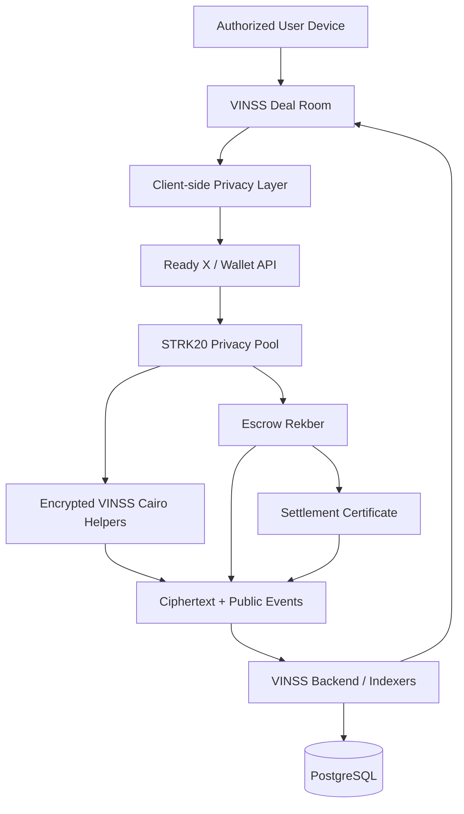

# VINSS — Private Deal Room on Starknet

> **Negotiate privately. Settle with confidence.**

<p>
  
  
  
  
  
  
</p>

**VINSS is a shielded Deal Room for two-party crypto-native transactions on Starknet.**

It connects encrypted conversation, structured negotiation, Escrow Rekber, fulfillment, settlement, and verifiable evidence in one continuous deal lifecycle.

VINSS is not a general-purpose messenger.

**Each room exists around a deal.**

---

## The real problem

A deal begins before money moves.

Today, many direct digital deals still happen across disconnected tools:

```text
Telegram / Discord / DM
        ↓
terms buried in conversation
        ↓
wallet address exchange
        ↓
direct payment / middleman / escrow
        ↓
screenshots + transaction hashes
```

That fragmentation creates practical problems:

- the final agreement can become ambiguous;
- payment becomes separated from the context that created it;
- either party can act opportunistically after terms are agreed;
- private commercial context can be exposed unnecessarily;
- evidence becomes scattered across chats, wallets, screenshots, and explorers;
- settlement can prove that money moved without clearly preserving what the parties agreed to.

VINSS is built around a different idea:

> **A deal should move from conversation → agreement → settlement → evidence without forcing its private context into public view.**

---

## One continuous deal lifecycle

```text
Invite
  ↓
Encrypted Conversation
  ↓
Structured Offer
  ↓
Counter / Accept / Reject
  ↓
Accepted Agreement
  ↓
Escrow Rekber
  ↓
Fund
  ↓
Fulfill
  ↓
Confirm / Review
  ↓
Release
  ↓
Settlement Evidence
  ↓
Settlement Certificate
```

The conversation is not an isolated chat feature.

The Offer is not an isolated form.

The escrow is not an unrelated payment widget.

They are stages of the same deal.

> **Messaging is the substrate. The product is the deal lifecycle.**

---

## Why VINSS

Most crypto transaction products begin when a user is ready to move an asset.

But much of the risk already exists before that moment.

Before settlement, both parties need to establish:

- what is being exchanged;
- who funds and who receives;
- what each party is required to do;
- the amount, deadline, and conditions;
- what counts as successful fulfillment;
- how completion is reviewed;
- what happens if either side disagrees;
- what evidence remains after settlement.

VINSS connects those decisions to settlement instead of leaving them scattered across unrelated applications.

```text
what was discussed
        ↓
what was agreed
        ↓
what was funded
        ↓
what was fulfilled
        ↓
what was settled
        ↓
what can later be proven
```

---

## Why STRK20?

VINSS does not use STRK20 only to make a payment private.

**Privacy is needed throughout the deal lifecycle — before settlement as well as during execution.**

A direct deal can reveal commercially sensitive information such as:

- counterparty relationships;
- negotiated pricing;
- Offer terms;
- obligations and deadlines;
- revisions and counter-offers;
- private coordination surrounding settlement.

Publishing that context as plaintext merely to obtain blockchain settlement would undermine the purpose of a private Deal Room.

VINSS therefore uses STRK20 as a **privacy and execution substrate** for privacy-sensitive Deal Room actions.

```text
Encrypted Messaging
        ↓
Private Negotiation
        ↓
Structured Agreement
        ↓
Shielded Coordination
        ↓
Escrow Settlement
        ↓
Verifiable Evidence
```

### Shielded by design

VINSS is designed around the **shielded execution path** for privacy-sensitive Deal Room actions.

It does not provide a parallel public-plaintext mode for private Message, Offer, or Rekber coordination payloads.

The objective is:

> **Protect private commercial context from public observers while preserving the public state required to settle and verify a deal.**

Shielded does not mean invisible.

```text
privacy from public observers
        ≠
zero metadata
        ≠
everything on-chain is hidden
        ≠
a promise to prevent authorized or lawful disclosure
```

VINSS does not claim perfect anonymity, zero metadata, or immunity from lawful processes.

Its design principle is:

> **Hide what does not need to be public. Verify what needs to be proven.**

For the deeper integration boundary, see **[STRK20 Integration Plan](./STRK20_INTEGRATION_PLAN.md)**.

---

## Privacy model

| Layer | Current treatment |
| --- | --- |
| Message content | Client-side encrypted |
| Structured Offer terms | Client-side encrypted |
| Private Rekber coordination | Client-side encrypted |
| Direct pairwise application key | Client-side |
| Normal discovery path | Ciphertext-only |
| STRK20 / Privacy Pool interaction | Publicly observable |
| Transaction timing / block metadata | Public |
| Ciphertext / commitments | Public but opaque without the required application key |
| Rekber custody state required for settlement | Public |
| Settlement result | Publicly verifiable |
| Settlement Certificate | Intentional public evidence artifact |

VINSS separates **privacy** from **settlement correctness**.

Sensitive deal context can remain encrypted while the custody contract exposes only the public state required for correct settlement and verifiable evidence.

---

## Mainnet verification

VINSS is deployed on **Starknet Mainnet**.

The normal deal lifecycle has been exercised end-to-end through the production flow:

```text
Encrypted Message
        ↓
Structured Offer
        ↓
Accepted Agreement
        ↓
Rekber Funding
        ↓
Fulfillment Submission
        ↓
Fulfillment Confirmation
        ↓
Release
        ↓
Settlement Certificate — Party A
Settlement Certificate — Party B
```

| Capability | Mainnet status |
| --- | --- |
| Encrypted Message | ✅ Verified |
| Structured Offer lifecycle | ✅ Verified |
| Escrow Rekber funding | ✅ Verified |
| Fulfillment submission | ✅ Verified |
| Fulfillment confirmation | ✅ Verified |
| Rekber release | ✅ Verified |
| Settlement Certificate — Party A | ✅ Verified |
| Settlement Certificate — Party B | ✅ Verified |
| Dispute / resolution | Implemented; not included in the current Mainnet E2E verification claim |

Machine-readable sprint evidence is maintained in **[`strk20.json`](./strk20.json)**.

---

## Mainnet contracts

| Contract | Starknet Mainnet address |
| --- | --- |
| `VinssFeePolicy` | `0x0319dc70e75d8bfe0f86f09bb32847791cf1630eb6c2fa6575b8e98f1c28f505` |
| `VinssMessageHelper` | `0x00b7fcc80a6d07f2c73dea1006fc36f893a3a4d9805a26f99e22fc7e6fa0b584` |
| `VinssInvite` | `0x0098539b85ad2c8300538bca5ada276caf57527e7e1b709c82fb9a81a01fcc41` |
| `VinssOfferHelper` | `0x0793d2b7844f104653f43690c23c2e11d87b854da5e86cb2930ede1fac05c21f` |
| `VinssPrivateEscrowHelper` | `0x040fbf221167da09ffb325a990a0347a8f178a5a7fb214680e3ee97af9156054` |
| `VinssEscrowRekber` | `0x047cf4ffb45ca246f13400fa3bd4c3b73e51b8b4e1f2c5b9d4d9be55ee565cea` |
| `VinssSettlementCertificate` | `0x0378f6cb263afdc0f0fd81101065baca49237afb2fcc581b1793390c50133a77` |

---

## Architecture



The browser is the privacy-sensitive application layer.

For normal Message, Offer, and private Rekber discovery, the backend indexes and returns ciphertext plus public metadata rather than acting as the normal plaintext Deal Room server.

Canonical Rekber custody and Settlement Certificate state can also be read from Starknet.

---

## Technology stack

| Layer | Technology |
| --- | --- |
| Frontend | **TypeScript**, Next.js 16, React 19 |
| Client privacy | WebCrypto, AES-GCM, P-256 ECDH, HKDF-SHA-256 |
| Starknet client | Starknet.js |
| Privacy execution | **STRK20 Privacy Pool / Wallet API** |
| Wallet integration | Ready X / Starknet Wallet Standard |
| Transaction sponsorship | AVNU |
| Smart contracts | **Cairo** |
| Contract libraries | Starknet Cairo + OpenZeppelin Cairo |
| Backend | **Node.js**, TypeScript, Express |
| Database | PostgreSQL |
| Contract testing | Starknet Foundry |
| Frontend E2E | Playwright |
| Deployment | Vercel + Railway |

---

## Smart contract model

VINSS separates application coordination, custody, policy, and evidence across seven canonical contracts.

```text
VinssFeePolicy
    ├── fee floors / sponsor-cost policy
    │
STRK20 Privacy Pool
    ├── VinssInvite
    ├── VinssMessageHelper
    ├── VinssOfferHelper
    ├── VinssPrivateEscrowHelper
    └── VinssEscrowRekber
              │
              └── VinssSettlementCertificate
```

The encrypted helpers coordinate privacy-sensitive application actions.

`VinssEscrowRekber` is the custody and settlement contract. It enforces settlement invariants around funding, fulfillment, review, refund, dispute, resolution, and release.

`VinssSettlementCertificate` provides an optional non-transferable evidence credential for eligible completed settlements.

---

## Documentation

The root README is intentionally a high-level entry point.

Detailed product reasoning, privacy boundaries, protocol behavior, implementation, and business material live in dedicated documentation.

| Documentation | Contents |
| --- | --- |
| **[Product Documentation](./docs/product/README.md)** | Problem, solution, innovation, product experience, target users, use cases, and validation |
| **[Frontend Technical Reference](./docs/technical/frontend/README.md)** | Client privacy, encryption, wallet execution, recovery, Offers, and Rekber UX |
| **[Backend Technical Documentation](./docs/technical/backend/README.md)** | Ciphertext discovery, PostgreSQL indexers, APIs, Rekber events, and certificate indexing |
| **[Smart Contract Technical Reference](./docs/technical/smart-contracts/README.md)** | Cairo contracts, privacy boundaries, Rekber invariants, fees, and certificates |
| **[Business Documentation](./docs/business/README.md)** | Business model, economics, and sustainability |
| **[Legal Documentation](./docs/legal/README.md)** | Product boundaries, privacy positioning, and legal considerations |
| **[STRK20 Integration Plan](./STRK20_INTEGRATION_PLAN.md)** | STRK20 architecture, integration boundaries, and verification |
| **[Sprint Evidence](./strk20.json)** | Mainnet transactions, deployed contracts, and submission evidence |

---

## Repository

```text
vinss/
├── frontend/        Next.js Deal Room + client privacy layer
├── backend/         Node.js API + discovery + persistent indexers
├── contracts/       Cairo contracts + Starknet Foundry tests
├── docs/
│   ├── product/
│   ├── technical/
│   ├── business/
│   └── legal/
├── strk20.json
└── README.md
```

---

## Product thesis

A blockchain transaction is only the final part of a deal.

Before it comes communication, negotiation, agreement, trust, fulfillment, and verification.

VINSS connects those stages while minimizing unnecessary public exposure of the private context behind them.

> **VINSS turns private communication into private economic coordination — and turns settlement into verifiable evidence.**

**Built on Starknet with STRK20.**
