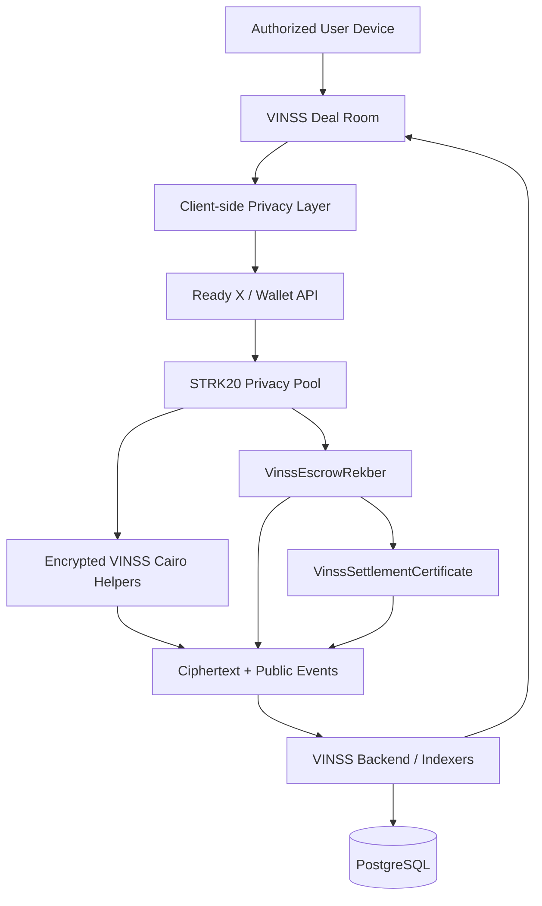

# STRK20 Integration & Privacy Architecture — VINSS

**Updated:** 2026-09-08  
**Status:** Starknet Mainnet — normal two-party deal lifecycle verified

VINSS is a **Private Deal Room on Starknet** built around STRK20 as its privacy and execution substrate.

STRK20 is not used only for a private transfer at the end of a deal. VINSS carries privacy-sensitive application actions through the deal lifecycle: encrypted messaging, structured negotiation, private Rekber coordination, and shielded execution, while keeping the public state required for custody correctness and settlement verification intentionally observable.

> **Hide what does not need to be public. Verify what needs to be proven.**

For the current mainnet capability matrix and deployed addresses, see [`README.md`](./README.md).  
For machine-readable submission evidence, see [`strk20.json`](./strk20.json).

---

## 1. Integration thesis

Most blockchain payment products begin when a user is ready to move an asset.

VINSS begins earlier.

A real bilateral deal normally contains:

```text
conversation
    ↓
negotiation
    ↓
agreement
    ↓
settlement preparation
    ↓
fulfillment
    ↓
review
    ↓
settlement
    ↓
evidence
```

If only the final transfer is private, commercially sensitive context can still leak through the application layer.

VINSS therefore uses STRK20 as part of a deeper application architecture:

```text
STRK20 privacy / execution substrate
        ↓
Encrypted Message
        ↓
Structured Offer
        ↓
Accepted Agreement
        ↓
Private Rekber Coordination
        ↓
Public Rekber Custody
        ↓
Fulfillment / Review
        ↓
Release / Resolution
        ↓
Settlement Evidence
        ↓
Settlement Certificate
```

The result is not simply:

```text
private transfer + UI
```

It is a privacy-aware deal state machine spanning communication, negotiation, custody, fulfillment, and evidence.

---

## 2. What VINSS adds above STRK20

STRK20 provides the privacy and execution foundation.

VINSS adds application semantics that the Privacy Pool does not need to understand directly.

### Encrypted application coordination

VINSS defines encrypted application envelopes for privacy-sensitive actions such as:

- Message;
- Offer;
- private Rekber coordination.

The encrypted helpers receive opaque payload material rather than plaintext business terms.

### Structured private negotiation

VINSS does not treat every encrypted payload as an unstructured chat message.

Offers preserve a structured lifecycle:

```text
Create
→ Counter
→ Accept / Reject
→ Accepted Agreement
```

while sensitive Offer terms remain encrypted on the normal discovery path.

### Agreement-linked settlement

An accepted Offer is not disconnected from payment.

The application maps the authenticated agreement into Rekber settlement parameters and then continues through funding, fulfillment, review, and settlement.

### Verifiable evidence

VINSS intentionally separates private commercial context from public settlement evidence.

A completed eligible settlement can produce a Settlement Certificate without publishing the full private negotiation that caused the settlement.

---

## 3. STRK20 integration depth

| Layer | VINSS integration |
| --- | --- |
| Wallet / execution | Ready X / wallet execution path used for privacy-sensitive actions |
| STRK20 / Privacy Pool | Shielded execution substrate for supported private application actions |
| Encrypted Message | Client-side encrypted payload, opaque routing, on-chain helper commitment |
| Structured Offer | Encrypted Offer lifecycle with authenticated action linkage |
| Private Rekber coordination | Encrypted coordination before public custody execution |
| Rekber custody | Public financial state machine for funding and settlement correctness |
| Fulfillment / review | Settlement lifecycle connected to the funded agreement |
| Dispute / resolution | Constrained resolution path bound to Rekber custody and authorized split logic |
| Settlement Certificate | Public, optional final evidence artifact for eligible settlement state |
| Backend discovery | Ciphertext/public-metadata indexing without normal server-side Deal Room decryption |

This is why VINSS treats STRK20 as infrastructure for the application lifecycle rather than as a single private-payment feature.

---

## 4. Privacy architecture

The browser is the privacy-sensitive application layer.

For normal Message, Offer, and private Rekber discovery, VINSS follows this shape:

```text
private application state
        ↓
client-side encryption
        ↓
STRK20 / wallet execution
        ↓
VINSS encrypted helper
        ↓
ciphertext + commitment + public metadata
        ↓
backend indexer
        ↓
ciphertext discovery
        ↓
client-side route matching / decryption
```

The backend is not the normal plaintext Deal Room server.

It indexes and returns ciphertext plus the public metadata required to discover supported records.

### Current treatment by layer

| Layer | Current treatment |
| --- | --- |
| Message content | Client-side encrypted |
| Structured Offer terms | Client-side encrypted |
| Private Rekber coordination | Client-side encrypted |
| Direct pairwise application key | Client-side |
| Normal discovery path | Ciphertext-only |
| STRK20 / Privacy Pool interaction | Publicly observable |
| Transaction timing / block metadata | Public |
| Ciphertext / commitments | Public but opaque without the required application key |
| Rekber token / principal / custody state | Public where required by the settlement contract |
| Settlement result | Publicly verifiable |
| Settlement Certificate | Intentional public evidence artifact |

---

## 5. Shielded does not mean invisible

VINSS does **not** claim:

- zero metadata;
- perfect anonymity against every observer;
- that every local value is encrypted;
- that all Rekber financial state is hidden;
- that blockchain timing or transaction existence is invisible;
- immunity from authorized or lawful disclosure;
- that off-chain truth can always be automatically determined.

The current design instead minimizes unnecessary exposure of private commercial context while preserving the public state required to settle correctly.

```text
privacy from public observers
        ≠
zero metadata
        ≠
everything hidden on-chain
```

---

## 6. Public custody boundary

`VinssEscrowRekber` is intentionally not a ciphertext-only contract.

Financial custody must expose enough canonical state to enforce settlement invariants.

That includes public state such as the settlement asset, principal, relevant deadlines/policy state, custody commitment, fulfillment/review state, dispute/resolution state, and final settlement outcome where required by the contract.

This is a deliberate boundary:

```text
private commercial context
        ↓
encrypted application coordination

financial correctness
        ↓
public canonical custody state
```

VINSS therefore separates **privacy** from **settlement correctness** rather than pretending the two are the same problem.

---

## 7. Mainnet verification

VINSS is deployed on **Starknet Mainnet**.

The normal production-facing two-party lifecycle has been exercised through the live flow:

```text
Encrypted Message
        ↓
Structured Offer
        ↓
Accepted Agreement
        ↓
Rekber Funding
        ↓
Fulfillment Submission
        ↓
Fulfillment Confirmation
        ↓
Release
        ↓
Settlement Certificate — Party A
Settlement Certificate — Party B
```

| Capability | Mainnet status |
| --- | --- |
| Encrypted Message | ✅ Verified |
| Structured Offer lifecycle | ✅ Verified |
| Escrow Rekber funding | ✅ Verified |
| Fulfillment submission | ✅ Verified |
| Fulfillment confirmation | ✅ Verified |
| Rekber release | ✅ Verified |
| Settlement Certificate — Party A | ✅ Verified |
| Settlement Certificate — Party B | ✅ Verified |
| Dispute / resolution | ✅ Verified |

The dispute/resolution path has also been verified on Starknet Mainnet through the production flow.

---

## 8. Dispute authority boundary

VINSS dispute handling is constrained rather than giving an Agent unrestricted control over funds.

The mainnet dispute/resolution path has been exercised through the production flow. Both parties bind the dispute case, the backend validates it against live Rekber custody, resolution remains constrained to the existing escrow principal, and the authorized claim path completes the resulting settlement.

```text
Dispute opened
        ↓
same dispute case bound by both parties
        ↓
backend validates live Rekber custody
        ↓
evidence / policy evaluation
        ↓
constrained resolution authorization
        ↓
authorized settlement claim
```

The resolver cannot create arbitrary value or move funds outside the Rekber principal. Model confidence alone is not unrestricted financial authority.

This keeps Agent reasoning, policy evaluation, canonical custody, and final financial execution as separate authority layers.

---

## 9. Mainnet contracts

| Contract | Starknet Mainnet address |
| --- | --- |
| `VinssFeePolicy` | `0x0319dc70e75d8bfe0f86f09bb32847791cf1630eb6c2fa6575b8e98f1c28f505` |
| `VinssMessageHelper` | `0x00b7fcc80a6d07f2c73dea1006fc36f893a3a4d9805a26f99e22fc7e6fa0b584` |
| `VinssInvite` | `0x0098539b85ad2c8300538bca5ada276caf57527e7e1b709c82fb9a81a01fcc41` |
| `VinssOfferHelper` | `0x0793d2b7844f104653f43690c23c2e11d87b854da5e86cb2930ede1fac05c21f` |
| `VinssPrivateEscrowHelper` | `0x040fbf221167da09ffb325a990a0347a8f178a5a7fb214680e3ee97af9156054` |
| `VinssEscrowRekber` | `0x047cf4ffb45ca246f13400fa3bd4c3b73e51b8b4e1f2c5b9d4d9be55ee565cea` |
| `VinssSettlementCertificate` | `0x0378f6cb263afdc0f0fd81101065baca49237afb2fcc581b1793390c50133a77` |

Canonical naming uses `VinssEscrowRekber`; older `Rekber V1/V2` naming is not the current contract identity.

---

## 10. Machine-readable sprint evidence

The repository root contains [`strk20.json`](./strk20.json).

It is the compact machine-readable submission evidence and currently contains:

- the mainnet transaction set used for sprint evidence;
- all seven VINSS mainnet contract addresses;
- the live VINSS application URL;
- the demo video URL.

The root [`README.md`](./README.md) provides the human-readable capability matrix and architecture overview.

This separation keeps the submission easy to inspect:

```text
README.md
    → what VINSS does and what is verified

STRK20_INTEGRATION_PLAN.md
    → how deeply STRK20 is integrated and where privacy boundaries sit

strk20.json
    → machine-readable mainnet evidence
```

---

## 11. Architecture summary



---

## 12. Why this integration matters

VINSS is designed around a simple observation:

> A blockchain transaction is only the final part of a deal.

Before it comes communication, negotiation, agreement, fulfillment, and verification.

If privacy is added only to the final transfer, the application may still expose the commercial context that users wanted to protect.

VINSS therefore pushes privacy deeper into the application stack and connects it to a public, verifiable settlement layer.

The product thesis is:

> **VINSS turns private communication into private economic coordination — and turns settlement into verifiable evidence.**

---

## 13. Evidence discipline

VINSS keeps these evidence classes separate:

```text
Implemented in source
Source / logic tested
Cross-layer regression tested
Browser / wallet exercised
Sepolia on-chain verified
Mainnet deployed
Mainnet product-flow verified
Production-hardened
Customer validated
```

They are not interchangeable.

Mainnet transaction evidence does not automatically prove production hardening, customer demand, product-market fit, or perfect privacy.

Likewise, local tests do not automatically prove live-wallet behavior.

The current repository therefore uses explicit wording around what has actually been verified, including the completed mainnet dispute/resolution path.

---

## 14. Verification and deployment pipeline

VINSS separates validation by layer.

| Workflow | Purpose |
| --- | --- |
| `frontend-test.yml` | TypeScript, invite recovery regression, privacy-boundary regression, production build |
| `backend-test.yml` | TypeScript, backend test suite, privacy-boundary regression |
| `contracts-test.yml` | Cairo build and Starknet Foundry tests |
| `deploy-mainnet.yml` | Mainnet safety gates, SN_MAIN verification, tested-source enforcement, deployment and verification |

The Mainnet deployment workflow verifies that the RPC reports Starknet Mainnet and requires a successful dedicated Contracts Test.

It also rejects deployment when the current `contracts/` content differs from the source that passed the accepted Contracts Test.

```text
Frontend validation
        ↓
Backend validation
        ↓
Contracts build + tests
        ↓
Mainnet safety gate
        ↓
SN_MAIN RPC verification
        ↓
tested contracts source required
        ↓
Mainnet deployment / verification
```

---

## 15. Reviewer quick path

For a fast technical review:

1. Read [`README.md`](./README.md) for the product and mainnet capability matrix.
2. Read this file for STRK20 integration depth and privacy boundaries.
3. Inspect [`strk20.json`](./strk20.json) for machine-readable mainnet evidence.
4. Inspect `contracts/` for Cairo custody/helper/certificate implementation.
5. Inspect `frontend/` for client encryption, wallet execution, Offer/Rekber flows, and recovery.
6. Inspect `backend/` for ciphertext discovery, persistent indexers, dispute policy boundaries, and test coverage.
7. Inspect `.github/workflows/` for reproducible frontend, backend, and contract validation.

**Built on Starknet with STRK20.**
