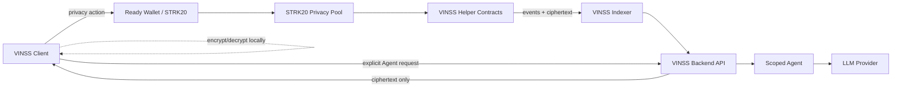

# VINSS Backend

Privacy-safe backend infrastructure for VINSS private deal rooms.

The backend helps VINSS clients discover encrypted on-chain activity, relay opaque presence events, use skill-scoped Agent reasoning, and access application services **without becoming a trusted decryption server**.

> Private message plaintext, Offer terms, room secrets, channel keys, viewing keys, and wallet private keys must not be processed by this backend.

## What it does

| Area      | Purpose                                                                         |
| --------- | ------------------------------------------------------------------------------- |
| Discovery | Finds committed Message, Offer, and Escrow ciphertext on Starknet               |
| Indexer   | Reads VINSS helper events and encrypted payload chunks                          |
| Presence  | Relays short-lived encrypted typing/read-receipt envelopes                      |
| Agent     | Routes explicit `chat`, `offer`, or `escrow` skills to configured LLM providers |
| Privacy   | Re-sanitizes Agent context before provider calls                                |
| Loyalty   | Provides the current application-side points foundation                         |
| API docs  | Serves Swagger UI and OpenAPI JSON                                              |

## Architecture



## Run locally

```bash
cd ~/vinss/backend
npm install
npm run dev
```

Build and test:

```bash
npm run build
npm test
```

Production:

```bash
npm run build
npm start
```

## API documentation

When running locally:

```text
Swagger UI:   http://localhost:4000/docs
OpenAPI JSON: http://localhost:4000/openapi.json
Health:       http://localhost:4000/health
```

## Technical docs

Start here:

- [`docs/README.md`](docs/README.md) — backend documentation index
- [`docs/architecture.md`](docs/architecture.md) — system architecture
- [`docs/backend-interaction-flow.md`](docs/backend-interaction-flow.md) — how user actions interact with the backend
- [`docs/privacy-security.md`](docs/privacy-security.md) — trust and data boundaries
- [`docs/discovery-indexer.md`](docs/discovery-indexer.md) — ciphertext discovery
- [`docs/agent-system.md`](docs/agent-system.md) — skills, tools, providers
- [`docs/api-reference.md`](docs/api-reference.md) — HTTP API
- [`docs/configuration.md`](docs/configuration.md) — environment configuration
- [`docs/testing.md`](docs/testing.md) — validation and privacy tests
- [`docs/deployment.md`](docs/deployment.md) — deployment
- [`docs/observability.md`](docs/observability.md) — logging and monitoring
- [`docs/incident-runbook.md`](docs/incident-runbook.md) — operational response
- [`docs/mainnet-readiness.md`](docs/mainnet-readiness.md) — mainnet checklist
- [`docs/known-limitations.md`](docs/known-limitations.md) — current limitations

## Current product scope

The current finished product emphasis is:

```text
Two-party private chat    implemented
Two-party Offer flow      implemented
Group conversation        not finished
Loyalty product UX        not finished
Full Escrow E2E MVP       not finished
```

Backend primitives may exist before every product surface is complete.
