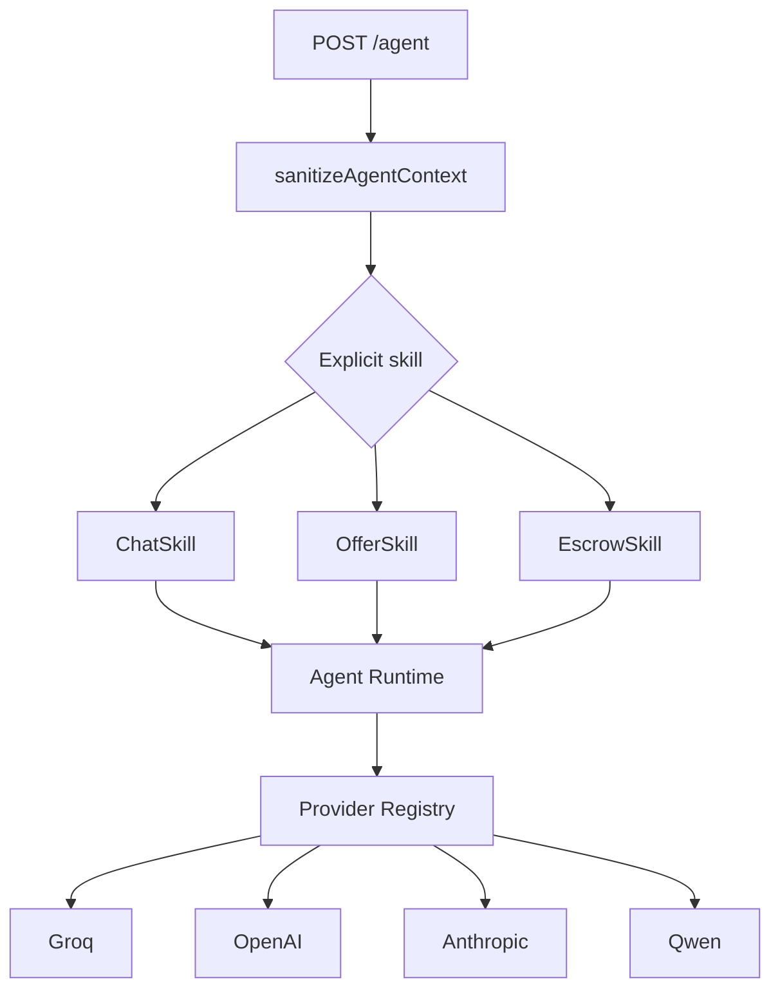

# Agent System

## Purpose

VINSS Agent provides reasoning assistance around a private deal without turning an LLM into a wallet authority.

Current skill IDs:

```text
chat
offer
escrow
```

## Architecture



## Context sanitation

The server rebuilds Agent context from a privacy-safe allowlist.

The sanitizer retains only bounded workflow metadata such as generic timeline kind/summary, timestamp, and action locator where applicable.

It drops arbitrary caller fields such as:

- room labels;
- raw timeline summary plaintext;
- Offer asset;
- Offer amount;
- payment terms;
- conditions;
- addresses;
- room secret;
- channel keys;
- other unrecognized properties.

## Skill tool boundaries

### ChatSkill

```text
inspect_deal_state
draft_message
```

### OfferSkill

```text
inspect_deal_state
analyze_offer
draft_offer
draft_counter_offer
calculate_fee
```

### EscrowSkill

```text
inspect_deal_state
prepare_escrow
review_rekber
calculate_fee
```

## Runtime enforcement

Tool restrictions are enforced in code.

```ts
if (!skill.allowedTools.includes(name)) {
  throw new Error(`Tool not allowed for ${skill.id} skill: ${name}`);
}
```

A prompt injection cannot expand the active skill's tool allowlist.

## No execution tools

The Agent layer does not expose tools for:

```text
send transaction
sign transaction
deposit funds
release escrow
refund escrow
```

Any actual wallet action remains outside the model's authority.

## Providers

The provider abstraction supports:

- Groq;
- OpenAI-compatible provider;
- Anthropic;
- Qwen through the compatible provider layer.

Only configured providers are considered available.

Inspect runtime capability:

```http
GET /agent/providers
```

Example:

```json
{
  "defaultProvider": "groq",
  "configuredProviders": ["groq"],
  "skills": ["chat", "offer", "escrow"]
}
```

## Remote provider privacy

A remote provider can still see:

- the user's instruction explicitly typed into the Agent;
- the sanitized metadata context.

Therefore users should not be told that an LLM provider receives zero information.

The guarantee is narrower:

> VINSS does not automatically forward decrypted room history or private Offer terms through the normal Agent context path.

## Provider failures

Raw upstream errors are not returned to users and are not logged with full detail because provider error messages can echo request data.
