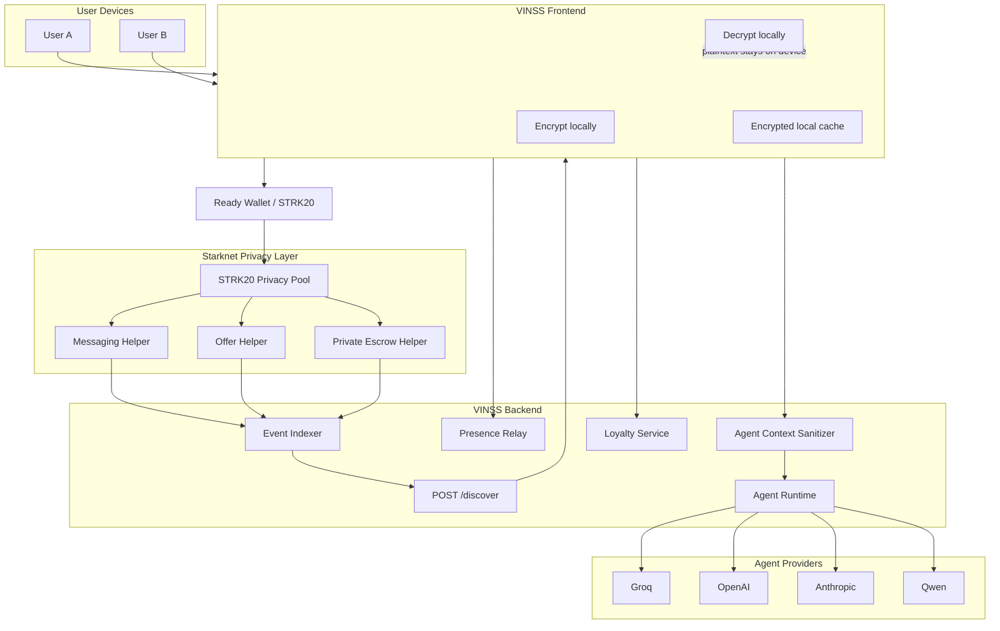

# Backend Architecture

## Purpose

VINSS uses the backend as a privacy-safe infrastructure layer, not as a trusted deal server.

The backend performs work that is expensive or inconvenient for clients:

- scan helper-contract events;
- retrieve ciphertext chunks;
- expose a consistent discovery API;
- relay encrypted ephemeral presence;
- orchestrate scoped Agent requests;
- expose application-side loyalty state;
- provide health and API documentation endpoints.

Encryption and decryption remain client responsibilities.

## System architecture



## Trust boundaries

### Client trust boundary

The client is allowed to hold:

- plaintext messages;
- plaintext Offer terms;
- room secret;
- channel/pairwise encryption material;
- decrypted history;
- wallet interaction state.

### Backend trust boundary

The backend is designed to handle:

- public Starknet metadata;
- opaque ciphertext;
- encrypted presence envelopes;
- bounded privacy-safe Agent context;
- application loyalty metadata.

### LLM trust boundary

A remote LLM provider receives only:

- the user's explicit Agent instruction;
- context rebuilt by the backend sanitizer;
- tool definitions allowed by the active skill.

The provider is not given signing authority or wallet access.

## Main modules

```text
src/
├── index.ts
├── config.ts
├── openapi.ts
│
├── routes/
│   ├── discover.ts
│   ├── presence.ts
│   └── agent.ts
│
├── indexer/
│   └── poolEvents.ts
│
├── agent/
│   ├── index.ts
│   ├── context.ts
│   ├── prompts.ts
│   ├── runtime.ts
│   ├── tools.ts
│   ├── skills/
│   └── providers/
│
└── loyalty/
    ├── routes.ts
    ├── service.ts
    └── types.ts
```

## Relationship to the VINSS proposal

The backend supports the proposal's core direction:

> Encrypted on-chain messaging via the existing privacy layer, with encrypted payloads, persistent on-chain records, and no trusted decryption server.

VINSS extends that messaging primitive into a deal workflow:

```text
Encrypted messaging
        ↓
Private negotiation
        ↓
Offer actions
        ↓
Escrow coordination
        ↓
Settlement
```

A key implementation refinement is that VINSS discovery is **keyless and ciphertext-only**. The backend does not receive a viewing key or channel key to decrypt records.
