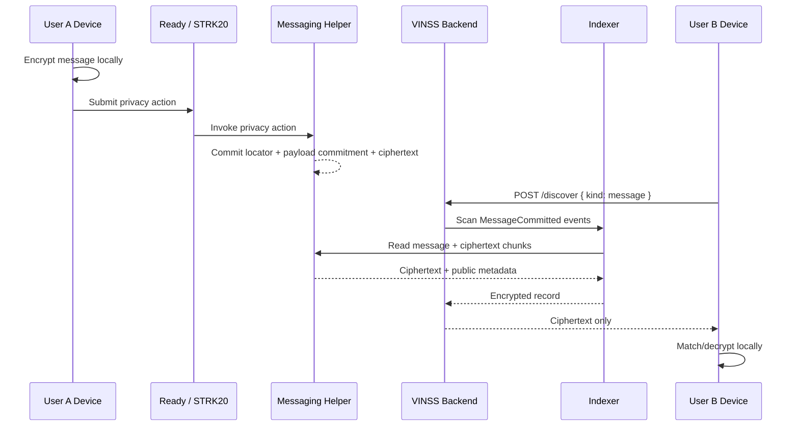
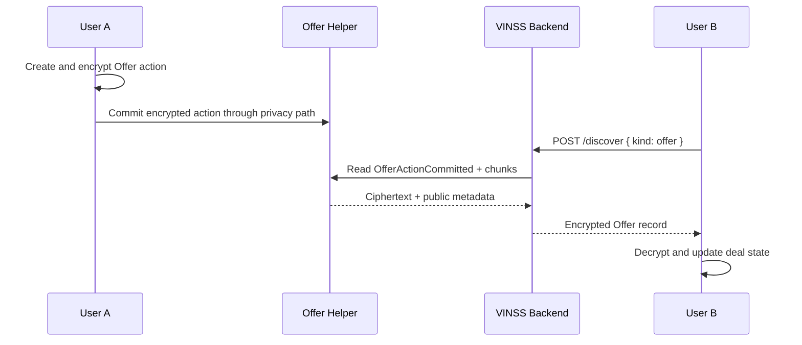
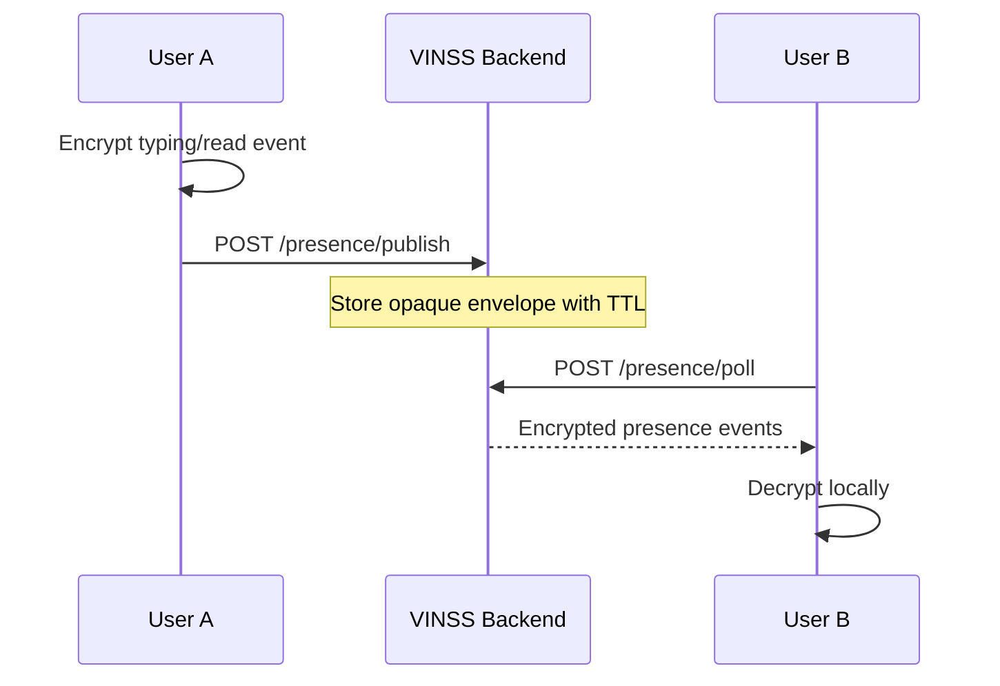
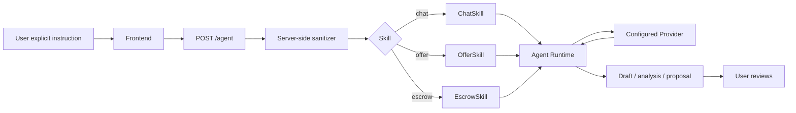

# Backend Interaction Flow

This document explains the backend-specific flow from a user's action to the backend services involved.

It is not a frontend UX flow. It answers:

> When a VINSS user does something, what role does the backend play?

## Private messaging



### Backend value to the user

The user does not need to implement raw Starknet event scanning and chunk retrieval in the browser for every refresh.

The backend provides the transport/indexing layer while preserving local decryption.

## Offer actions



The same discovery family supports:

- create;
- counter;
- accept;
- reject;

as encrypted Offer actions.

## Escrow discovery

The backend also recognizes the `escrow` discovery kind and scans `PrivateEscrowActionCommitted`.

This is a technical primitive. It does not mean the complete product-level Escrow E2E flow is already considered finished.

## Presence



The backend never needs to know whether an opaque presence event means `typing`, `read`, or another client-defined event.

## Agent interaction



The Agent does not submit the blockchain transaction.

## Loyalty interaction

The current loyalty service provides:

```text
GET  /loyalty/config
GET  /loyalty/:subject
POST /loyalty/events
```

This is application-side state, not part of the STRK20 privacy protocol.

See [Loyalty Service](./loyalty.md) and [Mainnet Readiness](./mainnet-readiness.md) before enabling it as a production reward system.
