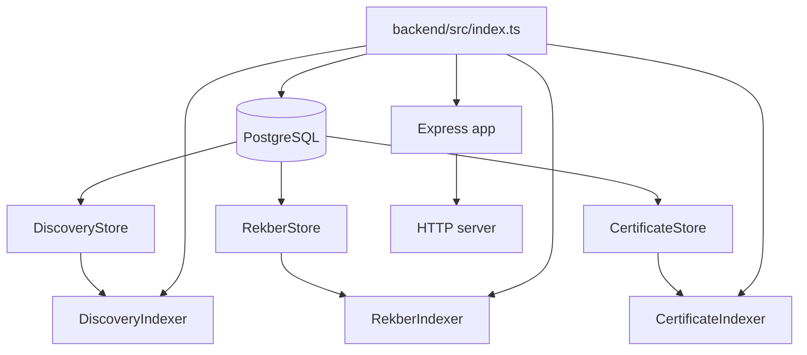
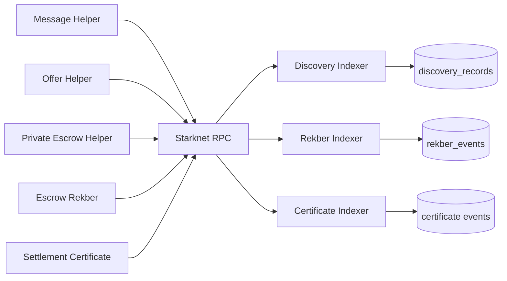
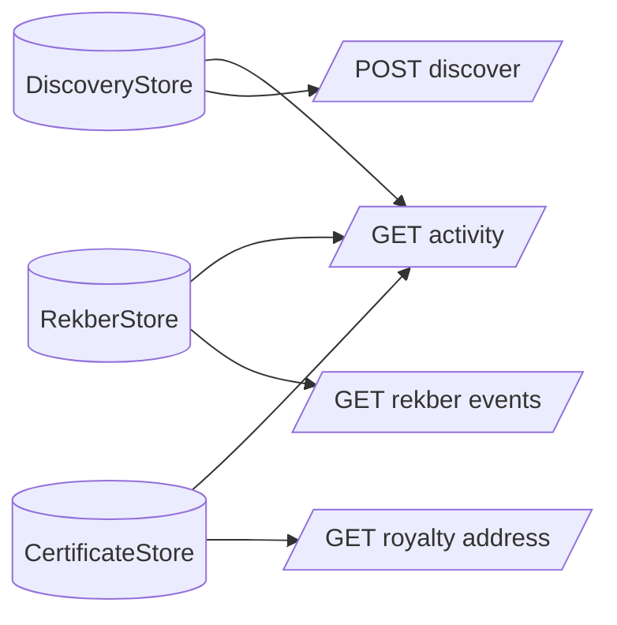
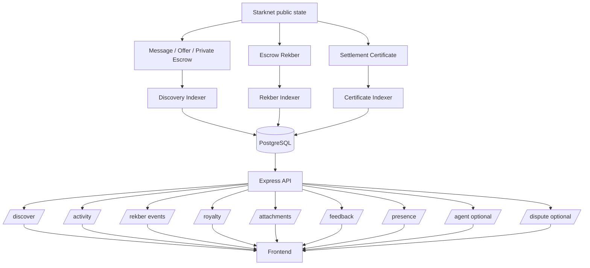

# VINSS Backend Technical Documentation

The VINSS backend is the network-facing infrastructure layer for VINSS.

Its primary privacy objective is to make encrypted Deal Room state discoverable and operational **without making the core discovery path a plaintext Deal Room server**.

The current backend is broader than ciphertext discovery alone. It also runs persistent indexers for public Rekber lifecycle events and public Settlement Certificate events, exposes read APIs derived from those indexes, stores encrypted attachment blobs, relays ephemeral encrypted presence, accepts user feedback, and optionally enables Agent / Dispute services.

Executable backend source is the source of truth.

---

# Current Backend Scope

The backend currently contains four distinct categories of behavior:

```text
1. encrypted Deal Room discovery
2. public on-chain state indexing
3. auxiliary application services
4. feature-gated Agent / Dispute services
```

These categories do not share the same privacy boundary.

That distinction is important.

---

# Backend at a Glance

| Capability | Current technical role | Persistence | Default exposure |
|---|---|---:|---|
| Message / Offer / Private Escrow discovery | Index encrypted helper actions and serve ciphertext | PostgreSQL | Enabled |
| Rekber lifecycle indexer | Index funded / released / refunded / resolved public Rekber events | PostgreSQL | Enabled |
| Settlement Certificate indexer | Index public `SettlementCertificateIssued` events | PostgreSQL | Enabled |
| Global activity | Merge indexed private-helper, Rekber, and certificate activity | PostgreSQL-backed | Enabled |
| Rekber event API | Query indexed Rekber lifecycle events | PostgreSQL-backed | Enabled |
| Health | Report Discovery, Rekber, and Certificate indexer checkpoints | PostgreSQL-backed | Enabled |
| OpenAPI / Swagger | Serve API schema and interactive docs | Static/runtime | Enabled |
| Encrypted presence | Relay opaque encrypted presence envelopes with TTL | In-memory | Enabled |
| Encrypted attachments | Store opaque binary ciphertext protected by capability token hash | PostgreSQL | Enabled |
| Feedback | Persist post-deal feedback and optionally send email notification | PostgreSQL | Enabled |
| Royalty | Read-only points view derived from indexed Settlement Certificates | PostgreSQL-derived | Enabled |
| VINSS Agent | Privacy-sanitized Agent context plus explicit user prompt | External provider dependent | Feature-gated |
| Dispute Agent / AutoResolve | Verify disclosed dispute case, attestations, Rekber binding and optionally authorize resolution | Mixed on-chain / runtime | Feature-gated |
| Legacy Loyalty preview | Client-submitted in-memory points ledger | In-memory | Disabled by default |

---

# Canonical Runtime Composition

The current application is assembled in:

```text
backend/src/app.ts
backend/src/index.ts
```

The startup path creates:

```text
PostgreSQL connection pool

DiscoveryStore
RekberStore
CertificateStore

DiscoveryIndexer
RekberIndexer
CertificateIndexer

Express application
```

and starts all three indexer loops after the HTTP server begins listening.



---

# Canonical Smart-Contract Dependencies

Backend configuration requires addresses for:

```text
Privacy Pool
Message Helper
Offer Helper
Private Escrow Helper
Escrow Rekber
Settlement Certificate
```

Environment names:

```text
PRIVACY_POOL_ADDRESS
MESSAGE_HELPER_ADDRESS
OFFER_HELPER_ADDRESS
PRIVATE_ESCROW_HELPER_ADDRESS
ESCROW_REKBER_ADDRESS
SETTLEMENT_CERTIFICATE_ADDRESS
```

The backend therefore reflects the current canonical contract split:

```text
encrypted coordination helpers

plus

public Rekber custody

plus

public Settlement Certificate
```

There is no canonical backend concept of:

```text
EscrowRekberV1
EscrowRekberV2
SettlementCertificateV2
```

unless a deployment/operator explicitly creates a separate versioned environment.

---

# Three Persistent Indexer Families

The backend no longer has only one helper-event indexer.

It currently runs three indexer families.

## 1. Discovery Indexer

Kinds:

```text
message
offer
escrow
```

Contracts:

```text
VinssMessageHelper
VinssOfferHelper
VinssPrivateEscrowHelper
```

Events:

```text
MessageCommitted
OfferActionCommitted
PrivateEscrowActionCommitted
```

## 2. Rekber Indexer

Canonical public lifecycle events:

```text
EscrowRekberCustodyFunded
EscrowRekberCustodyReleased
EscrowRekberCustodyRefunded
EscrowRekberCustodyResolved
```

Mapped backend kinds:

```text
funded
released
refunded
resolved
```

## 3. Settlement Certificate Indexer

Canonical event:

```text
SettlementCertificateIssued
```

It indexes the public certificate credential fields required by backend activity and Royalty views.

---

# Indexer Architecture



The backend reads public Starknet state.

It does not sign participant Deal Room transactions for normal Message / Offer / Private Escrow / Rekber actions.

---

# Discovery Definitions

The Discovery indexer is explicitly defined for:

```text
kind = message
event = MessageCommitted
record getter = get_message
chunk getter = get_payload_chunk
```

```text
kind = offer
event = OfferActionCommitted
record getter = get_offer_action
chunk getter = get_offer_payload_chunk
```

```text
kind = escrow
event = PrivateEscrowActionCommitted
record getter = get_private_escrow_action
chunk getter = get_private_escrow_payload_chunk
```

Each definition is identity-bound to:

```text
network
kind
contract address
```

using an identity shaped as:

```text
<network>:<kind>:<contractAddress>
```

---

# Discovery Hydration Model

The encrypted helper event does not contain every ciphertext chunk.

The backend therefore performs two stages:

```text
1. scan commitment event
2. call helper getters to hydrate ciphertext chunks
```

Conceptually:

```text
MessageCommitted / OfferActionCommitted / PrivateEscrowActionCommitted
        ↓
action locator + payload commitment + routing tags
        ↓
helper record getter
        ↓
chunk count
        ↓
helper chunk getter per index
        ↓
ciphertextChunks[]
        ↓
PostgreSQL discovery record
```

This means the backend caches public on-chain ciphertext for efficient discovery.

It does not decrypt it.

---

# Discovery PostgreSQL State

The current Discovery store persists:

```text
network
kind
contract_address
action_locator
payload_commitment
sender_tag
recipient_tag
ciphertext_chunks[]
block_number
transaction_hash
indexed_at
```

Primary identity:

```text
network
kind
contract address
action locator
```

The store also persists an independent checkpoint for each Discovery definition.

---

# Discovery Checkpoint State

Checkpoint fields include:

```text
network
kind
contract address
start block
next block
last indexed block
latest observed block
status
updated timestamp
```

Possible statuses:

```text
idle
syncing
caught_up
error
```

The configured start block must match the persisted checkpoint start block.

If an existing PostgreSQL checkpoint disagrees with configuration, initialization throws instead of silently moving the indexer's historical boundary.

---

# Discovery Polling

The current Discovery loop:

```text
query latest Starknet block

for each:
  message
  offer
  escrow

scan configured block range

skip locators already persisted

hydrate missing ciphertext

insert records

advance checkpoint

sleep poll interval
```

Ciphertext hydration uses configurable concurrency.

Relevant configuration includes:

```text
INDEXER_POLL_INTERVAL_MS
INDEXER_BLOCK_RANGE
INDEXER_EVENT_PAGE_SIZE
INDEXER_FETCH_CONCURRENCY
```

---

# Backend Ciphertext Defensive Limit

`StarknetEventSource` currently contains a defensive backend maximum:

```text
MAX_CIPHERTEXT_CHUNKS = 4096
```

This is **not** the VINSS smart-contract protocol maximum.

The canonical helper contracts currently enforce a much smaller envelope limit.

The backend value is only a defensive RPC/read bound.

Do not document:

```text
VINSS supports 4096 encrypted chunks
```

based on this backend constant.

Contract limits remain authoritative for what can actually be committed on-chain.

---

# Core Discovery API

Canonical endpoint:

```text
POST /discover
```

Accepted body fields are strictly allowlisted:

```text
kind
fromBlock
toBlock
```

Valid kinds:

```text
message
offer
escrow
```

Defaults:

```text
fromBlock = 0
toBlock = latest
```

`toBlock` must be:

```text
latest
```

or a non-negative safe integer greater than or equal to `fromBlock`.

---

# Discovery Privacy Guard

The route explicitly rejects fields including:

```text
roomId
roomSecret
channelKey
channelKeyHex
viewingKey
viewingKeyHex
decryptionKey
plaintext
```

It also rejects any other unexpected top-level field.

This is stronger than merely “ignoring” secrets.

The core discovery API refuses to accept them.

---

# Core Discovery Privacy Boundary

Accurate model:

```text
public Starknet ciphertext
        ↓
backend index / cache
        ↓
POST /discover
        ↓
ciphertext + opaque routing metadata
        ↓
authorized frontend
        ↓
local matching / decryption
```

The backend does not need:

```text
room secret
channel key
pairwise key
viewing key
plaintext Message
plaintext Offer
private Rekber capability secret
```

to serve the core discovery path.

---

# Discovery Response Material

A discovered action can contain:

```text
actionLocator
payloadCommitment
senderTag
recipientTag
ciphertextChunks[]
blockNumber
transactionHash
```

The database version additionally tracks:

```text
network
kind
contractAddress
indexedAt
```

The presence of:

```text
senderTag
recipientTag
```

does not mean the backend knows the real participant wallet identities represented by those opaque routing values.

---

# Important Privacy Precision

Do **not** describe the entire backend as:

```text
a server that never receives plaintext
```

That is no longer accurate for every optional feature.

The correct statement is:

> The core encrypted discovery and presence paths do not require Deal Room plaintext or decryption keys.

Separate opt-in Agent / Dispute paths intentionally accept limited disclosed plaintext.

---

# Optional Agent Disclosure Boundary

When the Agent feature is enabled:

```text
POST /agent
```

requires:

```text
message
context
skill
```

The user-provided:

```text
message
```

is plaintext sent to the backend.

Therefore `/agent` is an explicit server-side AI interaction, not part of the zero-plaintext discovery boundary.

---

# Agent Context Sanitization

The normal Agent context is rebuilt from a strict allowlist.

Current retained timeline information is limited to fields such as:

```text
safe kind
fixed privacy-safe summary
sentAt
actionLocator
```

and latest Offer data is reduced to:

```text
actionLocator
```

Unknown/private context is dropped.

Examples of data intentionally not preserved by this sanitizer include:

```text
private Offer terms
room labels
participant data
keys
secrets
unrelated plaintext
```

The Agent boundary should therefore be described as:

```text
explicit plaintext prompt
+
sanitized metadata context
```

not:

```text
full private Deal Room history
```

---

# Agent Skills

The public Agent route accepts current public skill IDs:

```text
chat
offer
escrow
```

The provider selector supports:

```text
auto
groq
openai
anthropic
qwen
```

depending on configured provider credentials.

The public `/agent/providers` response reports:

```text
network
defaultProvider
configuredProviders
skills
```

---

# Agent Feature Flag

Agent routes are mounted only when:

```text
config.features.agent == true
```

Configuration:

```text
AGENT_ENABLED
```

Current default:

```text
non-mainnet -> enabled
mainnet     -> disabled
```

unless explicitly overridden.

This is an important production boundary.

A source file existing in the repository does not mean the route is necessarily exposed in a specific deployment.

---

# Dispute Service Boundary

Dispute routes are mounted in the same feature-gated block as the Agent.

Current routes:

```text
POST /dispute/challenge
POST /dispute/evaluate
```

The Dispute service is intentionally different from normal Agent context.

It has a dedicated disclosure boundary.

---

# Explicit Dispute Disclosure

The Dispute sanitizer accepts information including:

```text
custody commitment
verification class
principal snapshot
accepted terms
obligations
completion criteria
fulfillment snapshot
payer statement
payee statement
evidence items
wallet addresses
on-chain snapshot
```

Each payer/payee packet must explicitly contain:

```text
consentToAgentReview = true
```

Therefore Dispute Agent data may contain meaningful plaintext business evidence.

This is an intentional opt-in disclosure path.

Do not describe it as ciphertext-only.

---

# Dispute Privacy Separation

Correct architecture:

```text
normal Deal Room discovery
    -> ciphertext only

normal Agent
    -> explicit prompt + sanitized metadata

Dispute Agent
    -> explicitly disclosed terms / statements / evidence
       with party consent and dedicated verification
```

These are three different privacy modes.

---

# Dispute Chain Verification

Before evaluating a dispute, the backend re-reads and verifies relevant Rekber state.

The route is designed not to trust browser lifecycle flags as final authority for automatic resolution.

It verifies:

```text
Rekber custody
party binding
attestations
verified principal value where available
```

before reaching execution policy.

---

# Dispute AutoResolve

Automatic dispute authorization is separately controlled by:

```text
DISPUTE_AUTO_RESOLVE_ENABLED
DISPUTE_RESOLVER_ADDRESS
DISPUTE_RESOLVER_PRIVATE_KEY
```

If AutoResolve is enabled, a dedicated resolver address and private key are required during configuration.

This is a sensitive backend authority.

It is categorically different from normal discovery/indexing.

---

# Dispute Execution Boundary

The backend does not automatically execute every evaluated case.

Execution remains policy-gated.

The route only attempts authorization when the evaluation policy result is:

```text
AUTO_RESOLVE
```

Otherwise the execution result remains non-eligible / non-executing according to current service behavior.

---

# Resolver Credential Boundary

The backend source explicitly avoids logging:

```text
dispute evidence
signatures
resolver credentials
```

on the Dispute evaluation error path.

Operational logging must preserve that rule.

A resolver private key must never appear in:

```text
request logs
error payloads
debug dumps
Git
documentation examples
```

---

# Rekber Indexer

The dedicated Rekber indexer watches:

```text
config.contracts.escrowRekber
```

starting at:

```text
ESCROW_REKBER_START_BLOCK
```

Current mapped events:

```text
funded
released
refunded
resolved
```

---

# Rekber Funded Event Index

For a funded event, the backend currently indexes public fields including:

```text
custody commitment
token
amount
refundAfter
timestamp
block number
transaction hash
```

These are public Rekber lifecycle/accounting data.

They are not private Deal Room terms merely because the broader product includes encrypted coordination.

---

# Rekber Released / Refunded Event Index

For released and refunded events, the backend indexes:

```text
custody commitment
output note id
timestamp
block number
transaction hash
```

plus common network/contract/index metadata.

---

# Rekber Resolved Event Index

For the canonical resolved event, the backend indexes:

```text
custody commitment
resolution commitment
resolution payer amount
resolution payee amount
timestamp
block number
transaction hash
```

This reflects the current public resolver-authorized split event.

---

# Rekber Event Persistence

Rekber events are stored in PostgreSQL and deduplicated with a uniqueness model including:

```text
network
contract address
transaction hash
event kind
custody commitment
```

The Rekber indexer has its own persistent checkpoint separate from Message / Offer / Private Escrow discovery checkpoints.

---

# Rekber Event API

Canonical endpoint:

```text
GET /rekber/events
```

Supported optional filters:

```text
event
custodyCommitment
limit
```

Valid `event` values:

```text
funded
released
refunded
resolved
```

Default limit:

```text
50
```

Maximum:

```text
100
```

The custody commitment filter must be a valid non-zero Starknet felt-like hex value inside the backend's accepted felt range.

---

# Settlement Certificate Indexer

The certificate indexer watches:

```text
SettlementCertificateIssued
```

on the configured:

```text
SETTLEMENT_CERTIFICATE_ADDRESS
```

starting from:

```text
SETTLEMENT_CERTIFICATE_START_BLOCK
```

---

# Certificate Event Decode

Current expected event layout:

```text
keys:
  selector
  tokenId
  recipient

data:
  custodyCommitment
  role
  settledAt
  issuedAt
```

The backend accepts role:

```text
1
2
```

only.

Malformed events are skipped instead of being inserted as valid certificate records.

---

# Certificate Public Data

The backend indexes:

```text
tokenId
recipient
custodyCommitment
role
settledAt
issuedAt
blockNumber
transactionHash
indexedAt
```

These fields are intentionally public.

A Settlement Certificate is not treated as encrypted private Deal Room state.

---

# Certificate Privacy Boundary

Correct statement:

> Certificate indexing exposes already-public credential ownership and settlement linkage.

Incorrect:

```text
certificate recipient is private
certificate role is private
certificate custody link is encrypted by the backend
```

The backend should not claim privacy that the contract itself does not provide.

---

# Health Endpoint

Canonical endpoint:

```text
GET /health
```

The route reads status from:

```text
DiscoveryIndexer
RekberIndexer
CertificateIndexer
```

---

# Health Success

HTTP:

```text
200
```

with:

```text
status = ok
```

when no indexer checkpoint is in:

```text
error
```

state.

The response includes:

```text
network
indexer
rekberIndexer
certificateIndexer
```

---

# Health Degraded State

HTTP:

```text
503
```

with:

```text
status = degraded
```

when:

```text
any discovery checkpoint status == error

or Rekber checkpoint status == error

or Certificate checkpoint status == error
```

If health-status retrieval itself throws, the endpoint also returns `503 degraded` with null indexer payloads.

---

# Health Precision

`/health` is currently an indexer-health / runtime-health signal.

It does not by itself prove:

```text
every RPC request will succeed
frontend can decrypt
Ready X can prove
wallet can sign
mainnet contracts are correct
all dependency latency is acceptable
```

Treat it as backend operational evidence, not whole-product E2E evidence.

---

# Global Activity Endpoint

Canonical endpoint:

```text
GET /activity
```

It combines data from:

```text
DiscoveryStore
RekberStore
CertificateStore
```

when no kind filter is supplied.

Results are globally sorted using:

```text
block number
transaction hash
action locator
```

descending ordering.

---

# Activity Pagination

Query:

```text
limit
cursor
kind
```

Default limit:

```text
30
```

Maximum:

```text
100
```

The cursor is a base64url-encoded JSON object containing:

```text
blockNumber
transactionHash
actionLocator
```

---

# Activity Kinds

The backend type system can represent:

```text
message
offer
escrow
rekber_funded
rekber_released
rekber_refunded
rekber_resolved
certificate_issued
```

However, the current `/activity` route's explicit `kind` allowlist is:

```text
message
offer
escrow
rekber_funded
rekber_released
rekber_refunded
certificate_issued
```

It does **not** currently include:

```text
rekber_resolved
```

as a valid explicit query filter.

This is an implementation detail worth preserving in documentation until the route is changed.

---

# Unfiltered Activity and Resolution

When no `kind` is supplied, `/activity` calls the Rekber store without an event-kind filter.

Therefore indexed Rekber resolution events can still participate in the merged activity stream.

The current limitation is specifically the explicit:

```text
kind=rekber_resolved
```

filter path.

---

# Activity Privacy Boundary

Private-helper activity exposes structural public metadata such as:

```text
kind
contract
action locator
block
transaction
```

The detailed encrypted payload remains available through Discovery.

Rekber and Certificate activity can expose more public settlement data because their source contracts are public-state contracts rather than encrypted helper envelopes.

Do not flatten these into one privacy claim.

---

# Royalty Service

Canonical endpoint:

```text
GET /royalty/:address
```

The service is read-only.

It does not accept client-submitted award events.

---

# Royalty Data Source

Royalty derives from:

```text
CertificateStore
```

for the requested recipient address.

It therefore anchors the calculation to indexed:

```text
SettlementCertificateIssued
```

events.

This is materially stronger than trusting a client to say:

```text
I completed a settlement
```

---

# Current Royalty Formula

Current service constant:

```text
BASE_SETTLEMENT_POINTS = 200
```

Current certificate multiplier tiers:

```text
0 certificates  -> 1.00x
1 certificate   -> 1.25x
3 certificates  -> 1.50x
5 certificates  -> 1.75x
10 certificates -> 2.00x
```

Calculated base:

```text
successfulSettlements * 200
```

Final:

```text
round(basePoints * multiplier)
```

These are backend application rules.

They are not smart-contract invariants.

---

# Royalty Conversion Boundary

The endpoint currently returns:

```text
conversion.status = coming_soon
```

Therefore points-to-token or points-to-gas conversion is not implemented by this service.

Do not describe Royalty conversion as live.

---

# Legacy Loyalty Preview

The older Loyalty router still exists.

Routes include:

```text
GET /loyalty/config
GET /loyalty/:subject
POST /loyalty/events
```

The write path accepts client-provided:

```text
subject
action
eventId
```

and stores its state in memory.

---

# Loyalty Feature Flag

The Loyalty router is only mounted when:

```text
LOYALTY_ENABLED = true
```

Current default:

```text
false
```

The application source explicitly describes this as an unauthenticated / in-memory preview that remains fail-closed unless deliberately enabled.

Therefore Loyalty is not a production settlement ledger.

---

# Royalty vs Loyalty

Do not confuse:

```text
Royalty
```

with:

```text
legacy Loyalty preview
```

Current distinction:

| Service | Authority source | Persistence | Write model |
|---|---|---|---|
| Royalty | Indexed Settlement Certificate events | PostgreSQL-derived | Read-only |
| Loyalty preview | Client-submitted events | In-memory | Client-write |

For settlement reputation/points documentation, Royalty is the stronger current evidence-backed path.

---

# Encrypted Presence

Current routes:

```text
POST /presence/publish
POST /presence/poll
```

Presence records contain:

```text
eventId
iv
ciphertext
createdAt
expiresAt
```

The server stores them in an in-memory map keyed by opaque channel ID.

---

# Presence Channel Format

Current channel ID format:

```text
64 lowercase hexadecimal characters
```

The backend comments explicitly state that it does not need:

```text
room keys
pairwise keys
wallet addresses
typing plaintext
read plaintext
```

for this route.

---

# Presence TTL

Client submits:

```text
ttlMs
```

which is bounded to:

```text
minimum 1 second
maximum 24 hours
```

The backend keeps at most:

```text
120 events per channel
```

and removes expired records during channel cleanup.

---

# Presence Persistence Boundary

Presence is:

```text
ephemeral
in-memory
process-local
```

A restart loses current presence records.

Multiple backend instances do not share this in-memory map unless a deployment adds an external shared store.

Do not describe Presence as durable.

---

# Encrypted Attachments

Current routes:

```text
PUT /attachments/:id
GET /attachments/:id
```

Attachments are stored as opaque binary ciphertext in PostgreSQL.

The backend does not decrypt attachment bytes.

---

# Attachment Size

Current maximum:

```text
20 MiB
```

Upload content type:

```text
application/octet-stream
```

Empty bodies are rejected.

---

# Attachment ID

The route requires a UUID-shaped ID matching the current UUID-v4-style pattern.

An existing attachment ID cannot be overwritten.

Conflict:

```text
409
```

---

# Attachment Capability Token

Requests use header:

```text
x-vinss-attachment-token
```

The raw token is not stored.

The backend stores:

```text
SHA-256(token)
```

and compares hashes using timing-safe equality.

---

# Attachment Enumeration Resistance

If an attachment exists but the supplied token is wrong, the download route returns:

```text
404 Attachment not found
```

rather than revealing:

```text
the object exists but your token is wrong
```

This reduces simple existence enumeration through token mismatch responses.

---

# Attachment Storage

Current PostgreSQL table:

```text
encrypted_attachments
```

stores:

```text
id
token_hash
ciphertext
created_at
```

The table is lazily initialized by the attachment router on first storage use.

---

# Attachment Logging Boundary

The global request logger records only:

```text
HTTP method
request path
```

and intentionally does not log request bodies.

The attachment GET route also logs:

```text
attachment ID
HTTP status
```

It does not log the capability token or ciphertext.

---

# Feedback Service

Canonical endpoint:

```text
POST /feedback
```

Feedback is persisted in PostgreSQL.

Table:

```text
vinss_feedback
```

is initialized during backend startup.

---

# Feedback Stored Fields

Current stored model includes:

```text
outcome
role
deal_type
network
rating
feedback_comment
created_at
```

Accepted outcome values:

```text
released
refunded
```

Accepted roles:

```text
payer
payee
unknown
```

Rating:

```text
1..5
```

Comment maximum:

```text
2000 characters
```

---

# Feedback Email

If:

```text
RESEND_API_KEY
```

is configured, the backend performs a best-effort email notification after the database insert succeeds.

Database persistence is authoritative.

Email failure does not roll back or fail already-saved feedback.

---

# Feedback Rate Limit

`/feedback` currently has a fixed route-level rate limit:

```text
5 requests
per 60 seconds
per backend-observed IP identity
```

This is hardcoded separately from the general configurable Agent/Discover limits.

---

# Configurable Rate Limits

The backend provides a fixed-window in-memory rate limiter for:

```text
/discover
/agent
/dispute
```

Config:

```text
RATE_LIMIT_WINDOW_MS
DISCOVER_RATE_LIMIT
AGENT_RATE_LIMIT
```

The Dispute route currently reuses the Agent limit configuration.

---

# Rate-Limit Persistence Boundary

Rate-limit buckets are:

```text
in-memory
process-local
```

They are not persisted to PostgreSQL.

A restart clears them.

Multiple backend replicas do not share counters unless deployment infrastructure adds a shared external limiter.

---

# Mainnet Proxy Configuration

When:

```text
STARKNET_NETWORK = mainnet
```

the Express app sets:

```text
trust proxy = 1
```

based on the deployment assumption that VINSS sits behind one managed reverse proxy.

This affects:

```text
req.ip
```

and therefore rate-limit identity.

Proxy topology must match this assumption.

---

# Mainnet Configuration Guards

When network is:

```text
mainnet
```

configuration requires:

```text
CORS_ORIGIN uses https
```

and rejects RPC URLs whose hostname/path appears to reference:

```text
sepolia
goerli
testnet
```

This is a configuration sanity guard.

It does not independently prove that an arbitrary RPC endpoint truly serves Starknet mainnet.

---

# Database

Current backend persistence uses:

```text
PostgreSQL
```

through the Node `pg` pool.

Pool maximum:

```text
10
```

Current configuration requires:

```text
DATABASE_URL
```

and optionally:

```text
DATABASE_SSL
```

---

# Database Error Logging

The pool's idle-client error handler intentionally logs only:

```text
[database] unexpected idle client error
```

It avoids printing:

```text
connection string
environment values
credentials
```

This pattern should be preserved in production logging.

---

# Startup Database Initialization

Before serving normal runtime behavior, startup initializes:

```text
feedback storage
Discovery store/checkpoints
Rekber store/checkpoint
Certificate store/checkpoint
```

If database initialization fails:

```text
backend startup is aborted
database pool is closed
process exitCode = 1
```

This is fail-closed behavior for required persistent infrastructure.

---

# Attachment Table Initialization Precision

Encrypted attachment table initialization differs slightly.

It is lazy:

```text
first attachment storage/read path
-> CREATE TABLE IF NOT EXISTS
```

Therefore normal startup can complete before the attachment table has been touched.

---

# Graceful Shutdown

Current backend handles:

```text
SIGTERM
SIGINT
```

The shutdown flow:

```text
request indexer stops
wait for all three indexer loops
close HTTP server
close PostgreSQL pool
```

A guard prevents duplicate shutdown execution.

---

# Request Logging

Current global request logging is intentionally minimal:

```text
METHOD PATH
```

Example:

```text
POST /discover
GET /health
```

Request bodies are intentionally never logged by this middleware.

---

# Request Body Limit

Global JSON body parser:

```text
1 MiB
```

for JSON routes.

Encrypted attachment upload uses a separate raw-body parser with its own:

```text
20 MiB
```

limit.

---

# OpenAPI

Current endpoints:

```text
GET /openapi.json
GET /docs
```

`/docs` mounts Swagger UI with title:

```text
VINSS Backend API
```

The runtime API implementation remains authoritative if the static OpenAPI document drifts.

During this backend documentation cleanup, `openapi.ts` should be audited separately against every actual route.

---

# Current Route Inventory

Always-on routes include current paths such as:

```text
GET  /health

GET  /openapi.json
GET  /docs

POST /discover

GET  /rekber/events
GET  /activity

POST /feedback

GET  /royalty/:address

POST /presence/publish
POST /presence/poll

PUT  /attachments/:id
GET  /attachments/:id
```

Feature-gated routes include:

```text
GET  /agent/providers
POST /agent

POST /dispute/challenge
POST /dispute/evaluate
```

when Agent is enabled.

Legacy Loyalty routes are mounted only when Loyalty is enabled.

---

# Current Activity Architecture



This is a useful mental model:

```text
/discover
```

is encrypted-action retrieval.

```text
/activity
```

is a merged public activity view.

```text
/rekber/events
```

is a Rekber-specific lifecycle query.

```text
/royalty/:address
```

is a certificate-derived application view.

---

# Public vs Encrypted State

Backend docs must maintain this distinction.

## Encrypted helper state

```text
Message ciphertext
Offer ciphertext
Private Escrow coordination ciphertext
opaque sender tags
opaque recipient tags
action locators
payload commitments
```

## Public Rekber state

Examples indexed by backend:

```text
custody commitment
custody token
funded amount
refund deadline/time
release/refund output note IDs
resolution commitment
resolver-authorized payer/payee split
lifecycle timestamp
```

## Public Certificate state

```text
token ID
recipient wallet
custody commitment
role
settled timestamp
issued timestamp
```

These have different privacy characteristics.

---

# Backend Must Not Rebrand Public Rekber Data as Private

VINSS's encrypted Deal Room coordination does not make every Rekber field private.

Backend documentation must not say:

```text
Rekber amount is hidden from backend

certificate recipient is private

resolver split is private

all settlement metadata is encrypted
```

when those fields are public contract/event data and the backend explicitly indexes them.

---

# Core Secret Boundary

The backend core discovery path should not receive:

```text
roomSecret
channelKey
channelKeyHex
pairwiseKey
viewingKey
viewingKeyHex
decryptionKey
wallet private key
Rekber role capability secrets
certificate claim secret
```

The `/discover` route enforces a subset of this at its API boundary through a strict allowlist plus explicit forbidden fields.

---

# Wallet Private Keys

No normal VINSS participant wallet private key belongs in the backend.

The optional Dispute AutoResolve service may hold a **dedicated resolver private key**.

That authority must never be confused with:

```text
payer private key
payee private key
user wallet seed phrase
Ready Wallet secret
```

The resolver key is a service authority, not a participant credential.

---

# Signing Boundary

Normal product transaction flow:

```text
frontend
    ↓
wallet authorization
    ↓
STRK20 / Privacy Pool / Starknet execution
    ↓
VINSS contracts
```

The backend does not replace the user's wallet for Message, Offer, Private Escrow coordination, or ordinary Rekber participant actions.

---

# Exception: Resolver Execution

The Dispute AutoResolve executor is a deliberate privileged exception.

If enabled and policy permits it, the backend may use its dedicated resolver authority to call the Rekber resolver hook.

This must be documented as:

```text
privileged service action
```

not as:

```text
normal user transaction flow
```

---

# Settlement Certificate Boundary

Certificate issuance itself remains a direct on-chain claimant-wallet action.

The backend certificate indexer only observes:

```text
SettlementCertificateIssued
```

after the event becomes public.

The backend does not mint certificates on behalf of users through the indexer.

---

# Royalty Authority Boundary

Royalty does not award itself based on frontend assertions.

It derives current statistics from indexed certificate events.

However, the points multiplier/formula remains centralized backend application logic.

Therefore:

```text
certificate existence
```

is on-chain-derived evidence.

```text
points calculation
```

is backend policy.

---

# Loyalty Authority Boundary

Legacy Loyalty differs.

Its event write endpoint is unauthenticated in the current preview design.

That is why the router is disabled by default and described in source as non-valuable preview functionality.

Do not use it as evidence for:

```text
token balances
financial rewards
settlement authority
```

---

# Presence Security Boundary

Presence ciphertext confidentiality depends on client encryption.

The backend sees:

```text
opaque channel ID
event ID
IV
ciphertext
creation/expiry timing
```

It does not prove sender identity.

It does not provide durable delivery.

It does not substitute for Starknet settlement evidence.

---

# Attachment Security Boundary

Encrypted attachment confidentiality also depends on client-side encryption.

The backend sees:

```text
attachment UUID
ciphertext byte length
ciphertext bytes
token hash
upload/download timing
```

It does not know plaintext solely from this storage design.

The capability token controls retrieval from this backend service.

It is not an on-chain ownership proof.

---

# Feedback Privacy Boundary

Feedback is intentionally plaintext application data.

The backend stores:

```text
rating
outcome
role
deal type
comment
network
```

in PostgreSQL.

Therefore feedback must not be grouped under the ciphertext-only privacy promise.

Users should not submit secrets through the feedback comment field.

---

# Operational Data Classification

A useful backend classification is:

| Data | Backend handling |
|---|---|
| Deal Room ciphertext | Persistent PostgreSQL cache |
| Opaque helper routing tags | Persistent PostgreSQL cache |
| Public Rekber lifecycle | Persistent PostgreSQL index |
| Public certificate identity | Persistent PostgreSQL index |
| Encrypted attachments | Persistent PostgreSQL ciphertext |
| Presence ciphertext | Ephemeral in-memory |
| Feedback | Plaintext PostgreSQL application data |
| Normal Agent prompt | Plaintext opt-in runtime data |
| Normal Agent metadata context | Sanitized allowlist |
| Dispute terms/statements/evidence | Plaintext explicit-consent dispute disclosure |
| Resolver private key | Sensitive server configuration |
| User wallet private key | Must not be provided |

---

# Feature Flags

Current feature flags:

```text
AGENT_ENABLED
LOYALTY_ENABLED
```

Agent also gates Dispute route mounting.

Loyalty is separately gated.

Royalty is not gated by the legacy Loyalty flag.

---

# Mainnet Defaults

Current defaults:

```text
AGENT_ENABLED
    defaults true outside mainnet
    defaults false on mainnet

LOYALTY_ENABLED
    defaults false
```

A mainnet deployment should verify actual environment values instead of inferring runtime exposure from source alone.

---

# Canonical Start Blocks

Persistent indexers require separate configured start blocks:

```text
MESSAGE_HELPER_START_BLOCK
OFFER_HELPER_START_BLOCK
PRIVATE_ESCROW_HELPER_START_BLOCK
ESCROW_REKBER_START_BLOCK
SETTLEMENT_CERTIFICATE_START_BLOCK
```

These values define the indexer's historical scan origin.

An incorrect start block can omit valid historical events or waste RPC/database work.

---

# Network Awareness

Persistent index records include:

```text
network
contract address
```

as part of identity/storage keys.

This prevents simple cross-network collisions between:

```text
Sepolia
Mainnet
```

for the same action-shaped data.

---

# Canonical Network Values

Current configuration accepts only:

```text
sepolia
mainnet
```

Do not document unsupported legacy names as valid backend configuration.

---

# Indexer Error Model

Indexer loops are designed to continue running after individual sync-cycle failures.

A failed sync sets the corresponding checkpoint status to:

```text
error
```

where applicable and logs a reduced error identity.

The next loop cycle can retry according to the polling schedule.

---

# Latest-Block Query Failure Precision

When an indexer cannot fetch the latest block number, current source logs the error class/name and returns from that cycle.

This is distinct from a sync failure after a latest block has already been observed.

Health interpretation should be based on persisted checkpoint state and actual runtime behavior, not only one console line.

---

# Indexer Reorg Boundary

The current architecture is checkpoint-forward and database-deduplicated.

Backend documentation should not claim full Starknet reorg reconciliation unless explicit rollback/finality logic exists and is tested.

A simple:

```text
scan forward
insert
advance checkpoint
```

loop is not automatically a complete reorg strategy.

This remains a production-hardening concern.

---

# Mainnet Backend Readiness

Mainnet readiness should be evaluated separately across:

```text
configuration correctness
database durability
RPC reliability
indexer catch-up
reorg strategy
rate limiting
reverse proxy correctness
secret management
Agent exposure
resolver-key management
monitoring
backup/recovery
incident response
live contract-address validation
```

The existence of working endpoints alone does not prove production readiness.

---

# Current Mainnet Hardening Already Present

Current source includes useful safeguards such as:

```text
mainnet HTTPS CORS requirement
testnet-looking RPC rejection
mainnet trust-proxy configuration
route rate limiting
strict Starknet address parsing
persistent indexer checkpoints
reduced request logging
no request-body logging
feature flags
Agent disabled-by-default on mainnet
Loyalty disabled-by-default
resolver credential requirements when AutoResolve enabled
```

These are real protections.

They are not substitutes for deployment-level monitoring and operational controls.

---

# API Failure Philosophy

Core APIs generally prefer:

```text
400
```

for malformed client input,

```text
401
```

for missing attachment capability,

```text
404
```

for absent/unauthorized attachment retrieval,

```text
409
```

for duplicate attachment ID,

```text
429
```

for rate limits,

```text
500
```

for internal indexed lookup/storage failures in selected routes,

and:

```text
503
```

for degraded health or unavailable attachment/database storage paths where implemented.

Exact route behavior remains authoritative.

---

# Error Privacy

Several backend paths intentionally avoid dumping internal exceptions to public responses.

Examples include:

```text
Discovery failed.
Activity lookup failed.
Rekber lookup failed.
Royalty lookup failed.
Agent failed.
```

Operational logs should remain equally careful not to leak:

```text
private keys
dispute evidence
signatures
decryption material
database credentials
provider API keys
```

---

# OpenAPI Boundary

`openapi.ts` is manually maintained application documentation.

Because routes have expanded over time, OpenAPI must be audited against `app.ts` and each router.

A route being mounted in Express is executable truth.

A route appearing only in OpenAPI is not proof that it exists.

A route existing in Express but missing from OpenAPI is documentation drift.

---

# Testing Boundary

Backend tests currently include dedicated test files for areas such as:

```text
indexer
Rekber indexer
Settlement Certificate indexer
Agent tools
Dispute attestation
Dispute policy
Dispute executor
Royalty
Loyalty rules
```

Other test files may cover additional behavior.

The detailed testing document should enumerate exact current tests rather than relying on this README overview.

---

# What Backend Tests Can Prove

Backend unit/integration tests can prove exercised behavior such as:

```text
parsing
sanitization
database-store semantics under test setup
event decoding
policy decisions
calculation rules
request validation
```

They do not automatically prove:

```text
live Starknet RPC reliability
Railway networking
real database failover
Ready X proving
browser crypto
mainnet index completeness
two-wallet user journey
```

---

# Source-of-Truth Order

When backend documentation conflicts, use this priority:

```text
1. executable backend source
2. executable smart-contract source for chain semantics
3. backend tests
4. deployed environment/configuration evidence
5. OpenAPI
6. prose documentation
```

For a deployed production question, environment and deployed contract addresses must also be verified rather than inferred from repository defaults.

---

# Core Backend Architecture



This diagram combines services for orientation.

It does **not** imply every route reads from PostgreSQL or has the same privacy model.

For example:

```text
Presence is in-memory.

Agent may use remote LLM providers.

Dispute may read chain state and optionally submit resolver authorization.

Attachments and feedback use PostgreSQL but are not indexer data.
```

---

# Core vs Auxiliary Services

## Core Deal Room / chain-read infrastructure

```text
Discovery indexer
POST /discover

Rekber indexer
GET /rekber/events

Certificate indexer

GET /activity
GET /health

public Royalty derivation
```

## Privacy-supporting transport/storage

```text
encrypted presence
encrypted attachments
```

## Application utilities

```text
feedback
OpenAPI / Swagger
```

## Optional privileged / AI services

```text
Agent
Dispute Agent
AutoResolve executor
```

## Legacy / preview

```text
client-write Loyalty
```

---

# Why Rekber Is Separate from Private Escrow

`Private Escrow Helper` is encrypted coordination storage.

`Escrow Rekber` is public custody / lifecycle state.

The backend correctly indexes them through separate systems:

```text
Private Escrow Helper
    -> DiscoveryIndexer
    -> kind = escrow
    -> ciphertext

Escrow Rekber
    -> RekberIndexer
    -> funded / released / refunded / resolved
    -> public lifecycle fields
```

Documentation must preserve this separation.

---

# Why Certificate Is Separate from Rekber

Settlement Certificate has its own contract, event layout, indexer, checkpoint, and store.

Therefore:

```text
Rekber released
```

and:

```text
certificate issued
```

are distinct backend events.

A clean release does not imply the certificate has already been claimed.

The certificate is optional and claimed later by the participant.

---

# Activity Does Not Replace Domain APIs

`/activity` is a presentation-oriented merged timeline.

It is not the canonical detailed API for every domain.

Use:

```text
/discover
```

for encrypted helper payload retrieval.

Use:

```text
/rekber/events
```

for detailed Rekber lifecycle queries.

Use certificate-derived store/services for credential-based application state.

---

# Backend Does Not Recompute Contract Truth

The backend may:

```text
index
normalize
cache
filter
derive application points
verify selected dispute conditions
```

but canonical settlement state remains on-chain.

For example:

```text
Rekber custody state
certificate eligibility
resolver authority
```

are contract-defined.

Backend documentation must not make PostgreSQL the canonical settlement ledger.

---

# Data Durability Summary

| Data | Current durability |
|---|---|
| Discovery records | PostgreSQL |
| Discovery checkpoints | PostgreSQL |
| Rekber events | PostgreSQL |
| Rekber checkpoint | PostgreSQL |
| Certificate events | PostgreSQL |
| Certificate checkpoint | PostgreSQL |
| Encrypted attachments | PostgreSQL |
| Feedback | PostgreSQL |
| Presence | In-memory / ephemeral |
| Legacy Loyalty | In-memory / ephemeral |
| Rate-limit counters | In-memory / ephemeral |

---

# Privacy Summary

## Core discovery

```text
ciphertext-only application payload retrieval
no room/decryption keys required
strict request allowlist
```

## Presence

```text
encrypted opaque envelopes
ephemeral
```

## Attachments

```text
encrypted opaque bytes
capability-token protected
persistent
```

## Public Rekber / certificate indexing

```text
public chain data
not encrypted by backend
```

## Feedback

```text
plaintext application data
```

## Agent

```text
explicit plaintext prompt
sanitized metadata
```

## Dispute

```text
explicitly disclosed plaintext evidence
party-consent requirement
on-chain/binding verification
optional resolver authority
```

---

# Security Claims the Backend Can Make

Accurate:

```text
Core discovery rejects decryption material.

Indexed Message / Offer / Private Escrow payloads remain ciphertext.

Presence relay stores encrypted envelopes only.

Attachments are stored as ciphertext and use hashed retrieval tokens.

Persistent chain-derived indexes are network and contract aware.

Rekber and certificate public data are indexed separately from encrypted helper data.

Normal request logging does not log request bodies.

Agent context uses an allowlist sanitizer.

Dispute evidence uses a dedicated explicit-disclosure boundary.

Legacy Loyalty is disabled by default.

Agent is disabled by default on mainnet.
```

---

# Security Claims the Backend Must Not Make

Do not claim:

```text
The backend never receives plaintext.

All VINSS metadata is private.

Rekber amount is hidden.

Certificate ownership is hidden.

Every backend endpoint is authenticated.

Presence is durable.

Legacy Loyalty is authoritative.

Royalty conversion is live.

A green /health proves the whole product works.

Indexed PostgreSQL is the canonical settlement ledger.

All indexer reorg behavior is solved.

All LLM processing is local.

AutoResolve can never exercise privileged signing authority.
```

Those are false or materially incomplete under current source.

---

# Main Product Transaction Boundary

For normal Deal Room use:

```text
Frontend
    ↓
client crypto
    ↓
wallet / Ready X
    ↓
STRK20 / Privacy Pool
    ↓
VINSS contracts
```

Backend then observes the public resulting state.

It is not the normal custody executor.

---

# Operational Backend Boundary

The backend does control operational components including:

```text
indexing latency
cached discovery availability
attachment availability
presence availability
Agent provider routing
feedback persistence
Royalty calculation
optional dispute resolver execution
```

Therefore backend outages can degrade product UX even when Starknet contracts remain healthy.

---

# Dependency Failure Isolation

Examples:

```text
LLM outage
```

should not redefine on-chain custody truth.

```text
presence restart
```

should not lose settlement state.

```text
feedback email outage
```

does not roll back stored feedback.

```text
indexer lag
```

does not mean the chain event never happened.

This distinction is central to incident handling.

---

# Backend Documentation Set

Read the backend docs in this order.

1. [Architecture](./architecture.md)
2. [Backend Interaction Flow](./backend-interaction-flow.md)
3. [Privacy & Security](./privacy-security.md)
4. [Discovery & Indexer](./discovery-indexer.md)
5. [Agent System](./agent-system.md)
6. [Encrypted Presence](./presence.md)
7. [API Reference](./api-reference.md)
8. [Configuration](./configuration.md)
9. [Testing](./testing.md)
10. [Deployment](./deployment.md)
11. [Observability](./observability.md)
12. [Incident Runbook](./incident-runbook.md)
13. [Mainnet Readiness](./mainnet-readiness.md)
14. [Known Limitations](./known-limitations.md)
15. [Loyalty Service](./loyalty.md)

During this documentation audit, each file should be rechecked against current source independently.

The README does not make the downstream docs automatically current.

---

# Documentation Gaps to Audit Next

Because the backend has expanded, the following areas deserve explicit attention in the existing documentation set:

```text
three-indexer architecture

Rekber resolved event support

Settlement Certificate indexing

/activity merge behavior

Royalty vs legacy Loyalty

encrypted attachment storage

feedback persistence

Agent feature flag

Dispute challenge/evaluate

AutoResolve authority

mainnet proxy/rate-limit assumptions

public-vs-encrypted settlement data
```

Some of these may currently be absent or only partially described in existing backend docs.

---

# README Status Vocabulary

Use precise status terms.

## Implemented

Means executable code exists and is mounted by the current runtime under the applicable feature configuration.

## Persistent

Means PostgreSQL-backed under current implementation.

## Ephemeral

Means in-memory/process-local.

## Feature-gated

Means source exists but route exposure depends on configuration.

## Derived

Means data is computed from another authority source rather than directly written as canonical state.

## Experimental / preview

Means the implementation exists but should not be treated as production authority.

---

# Mainnet Readiness Vocabulary

Do not use:

```text
mainnet ready
```

as a single unqualified status.

Prefer explicit evidence:

```text
mainnet config parsed
mainnet contract addresses configured
indexers caught up
PostgreSQL healthy
health endpoint ok
Agent disabled/enabled intentionally
Loyalty disabled
resolver key absent/present intentionally
rate limit configured
CORS verified
live activity indexed
live Rekber lifecycle indexed
live Certificate event indexed
two-wallet E2E passed
```

Each proves a different property.

---

# Backend Readiness Checklist

Before a production cut:

```text
Verify STARKNET_NETWORK.

Verify RPC_URL points to intended network.

Verify CORS_ORIGIN.

Verify PostgreSQL connectivity and backup policy.

Verify Privacy Pool address.

Verify Message Helper address and start block.

Verify Offer Helper address and start block.

Verify Private Escrow Helper address and start block.

Verify Escrow Rekber address and start block.

Verify Settlement Certificate address and start block.

Verify all three indexer families are caught up.

Verify /health reports expected checkpoint identities.

Verify /discover returns ciphertext only.

Verify /rekber/events returns current lifecycle data.

Verify /activity includes expected merged data.

Verify certificate event decoding.

Verify Royalty derives from current CertificateStore.

Verify encrypted attachment upload/download.

Verify attachment capability behavior.

Verify feedback persistence.

Verify Presence is treated as ephemeral.

Verify AGENT_ENABLED intentionally.

Verify LOYALTY_ENABLED remains intentional.

If AutoResolve enabled:
  verify resolver address
  verify resolver private-key secret handling
  verify binding/attestation policy
  verify transaction execution path

Verify rate limits.

Verify reverse-proxy topology.

Verify logs contain no secrets.

Verify OpenAPI against mounted routes.

Run backend tests.

Run live network integration.

Run two-wallet product E2E.
```

---

# Documentation Rule

Backend technical documentation should explain each subsystem using:

```text
objective
    ↓
source / runtime responsibility
    ↓
authority and trust boundary
    ↓
data accepted
    ↓
data stored
    ↓
data returned
    ↓
persistence model
    ↓
failure behavior
    ↓
security limitations
    ↓
test / deployment evidence
```

---

# Contract / Backend Boundary

When documenting chain-derived behavior, the smart contracts remain authoritative for:

```text
event schema
custody lifecycle
certificate claim semantics
commitment formulas
capability rules
fees
fund movement
resolver authorization
```

The backend remains authoritative for:

```text
indexing implementation
PostgreSQL schema
HTTP validation
pagination
rate limits
feature flags
Agent sanitization
application-derived Royalty points
attachment service
feedback service
runtime health
```

Never copy an old backend assumption over newer canonical Cairo behavior.

---

# Frontend / Backend Boundary

The frontend remains responsible for client-side responsibilities such as:

```text
room-secret handling
channel/pairwise key derivation
ciphertext matching
ciphertext decryption
wallet interaction
Ready X request construction
participant signing
```

The backend should not silently absorb those responsibilities merely for convenience.

---

# Backend / LLM Boundary

Remote LLM providers are only relevant to enabled Agent / Dispute paths.

Ciphertext discovery should not depend on a remote LLM.

Therefore:

```text
LLM unavailable
```

must not imply:

```text
Message discovery unavailable
Rekber index unavailable
Certificate index unavailable
```

except for unrelated shared infrastructure failures.

---

# Backend / Database Boundary

PostgreSQL is required for core persistent backend operation.

Startup initializes required index/store structures before entering normal operation.

A database outage affects:

```text
discovery persistence
Rekber event persistence
certificate event persistence
feedback
attachments
Royalty reads
activity reads
```

while public Starknet source data still remains on-chain.

---

# Source Files Worth Reading First

For runtime understanding:

```text
backend/src/index.ts
backend/src/app.ts
backend/src/config.ts
backend/src/types.ts
```

For encrypted discovery:

```text
backend/src/indexer/definitions.ts
backend/src/indexer/poolEvents.ts
backend/src/indexer/service.ts
backend/src/indexer/store.ts
backend/src/routes/discover.ts
```

For Rekber:

```text
backend/src/indexer/rekber.ts
backend/src/indexer/rekberStore.ts
backend/src/routes/rekber.ts
```

For Certificate / Royalty:

```text
backend/src/indexer/certificate.ts
backend/src/indexer/certificateStore.ts
backend/src/royalty/service.ts
backend/src/royalty/routes.ts
```

For auxiliary services:

```text
backend/src/routes/activity.ts
backend/src/routes/presence.ts
backend/src/routes/attachments.ts
backend/src/routes/feedback.ts
```

For Agent / Dispute:

```text
backend/src/routes/agent.ts
backend/src/agent/context.ts
backend/src/routes/dispute.ts
backend/src/dispute/
```

---

# Current Backend Identity

A concise accurate description is:

> VINSS backend is a PostgreSQL-backed Starknet indexing and application-service layer. Its core Deal Room discovery path stores and serves public encrypted helper payloads without decryption keys, while separate public-state indexers track Rekber lifecycle and Settlement Certificate events. Optional Agent and Dispute services use explicit disclosure boundaries, and auxiliary services provide encrypted attachments, ephemeral presence, feedback, activity, and certificate-derived Royalty views.

That description matches the current source more closely than:

> VINSS backend is only a ciphertext discovery server.

It also avoids the opposite overclaim:

> VINSS backend never receives plaintext.

Both are incomplete under the current implementation.

---

# Bottom Line

The current backend architecture is:

```text
Starknet
    ↓
three persistent indexer families
    ↓
PostgreSQL
    ↓
discovery / Rekber / activity / certificate-derived APIs

plus

encrypted attachments
ephemeral encrypted presence
feedback

plus optional

Agent
Dispute Agent
AutoResolve authority

plus disabled-by-default legacy

Loyalty preview
```

The central privacy rule remains:

> Core encrypted Deal Room discovery must never require room secrets or decryption keys.

The central architecture rule is now equally important:

> Public Rekber lifecycle and public Settlement Certificate state must be documented as public indexed chain data, not mislabeled as encrypted Deal Room state.

The repository source remains the source of truth.
