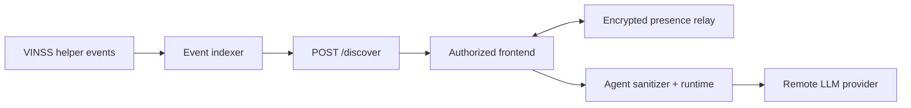

# VINSS Backend Technical Documentation

The VINSS backend is a **privacy-safe infrastructure layer**, not a trusted plaintext Deal Room server.

Its core role is to make encrypted VINSS application state discoverable and operational without requiring the server to hold Deal Room decryption keys.

## Core backend capabilities

| Capability | Technical role | Status |
|---|---|---|
| **Ciphertext Discovery** | Scan VINSS helper events and return encrypted records | Implemented |
| **Event Indexer** | Resolve Message / Offer / private Escrow committed actions from Starknet | Implemented |
| **Privacy Boundary** | Reject channel-key discovery and keep decryption client-side | Implemented + regression tested |
| **Encrypted Presence** | Relay opaque typing/read/participant envelopes with TTL | Implemented / ephemeral |
| **VINSS Agent** | Server-side context sanitization + skill-scoped reasoning | Implemented + tested |
| **Health / OpenAPI** | Runtime liveness and API documentation | Implemented |
| **Loyalty** | Auxiliary application-side points state | Experimental / in-memory |
| **Mainnet backend readiness** | Production configuration, abuse protection, monitoring | Pending hardening |

## Technical objective

```text
public Starknet helper state
        ↓
backend indexing / transport
        ↓
ciphertext + opaque metadata
        ↓
authorized frontend
        ↓
local cryptographic matching + decryption
```

The backend should remain useful even if it is **not trusted with plaintext deal content**.

## Core trust boundary

### Backend may handle

```text
public Starknet metadata
action locators
payload commitments
opaque sender/recipient tags
ciphertext chunks
encrypted presence envelopes
sanitized Agent metadata
```

### Backend must not receive through the core discovery path

```text
room secret
channel key
pairwise key
viewing key
wallet private key
plaintext Message history
plaintext Offer terms
Escrow Rekber release/refund secrets
```

`POST /discover` enforces this boundary by explicitly rejecting `channelKeyHex`.

## Core backend architecture



Actual transaction signing and STRK20 execution remain outside the backend:

```text
frontend
→ wallet authorization
→ STRK20
→ VINSS contracts
```

## Core vs auxiliary services

### Core privacy / Deal Room infrastructure

- discovery API;
- Starknet event scanning;
- ciphertext retrieval;
- encrypted presence relay;
- Agent privacy boundary;
- operational health/API documentation.

### Auxiliary application service

`/loyalty/*` exists in the current codebase, but it is:

- in-memory;
- non-durable;
- not part of STRK20 privacy protocol;
- not a canonical settlement ledger;
- not required for the core private Deal Room path.

## Read in this order

1. [Architecture](./architecture.md)
2. [Backend Interaction Flow](./backend-interaction-flow.md)
3. [Privacy & Security](./privacy-security.md)
4. [Discovery & Indexer](./discovery-indexer.md)
5. [Agent System](./agent-system.md)
6. [Encrypted Presence](./presence.md)
7. [API Reference](./api-reference.md)
8. [Configuration](./configuration.md)
9. [Testing](./testing.md)
10. [Deployment](./deployment.md)
11. [Observability](./observability.md)
12. [Incident Runbook](./incident-runbook.md)
13. [Mainnet Readiness](./mainnet-readiness.md)
14. [Known Limitations](./known-limitations.md)
15. [Loyalty Service](./loyalty.md)

## Documentation rule

Backend technical documentation should explain:

```text
objective
→ responsibility
→ trust boundary
→ data handled / forbidden
→ mechanism
→ failure / operational behavior
→ limitations
→ verification / readiness
```

Only small code excerpts that expose an important boundary or mechanism are included.

The repository code remains the source of truth.
