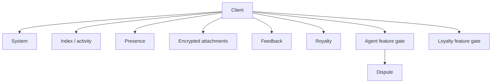
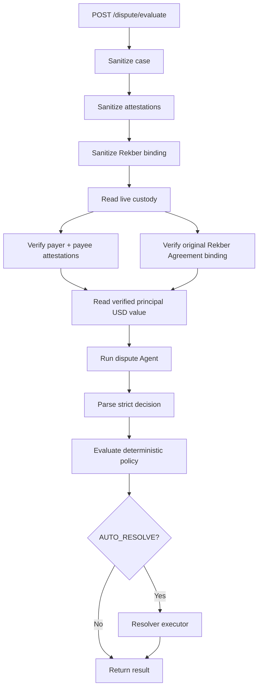
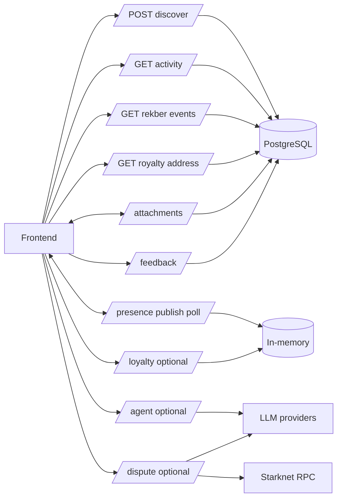
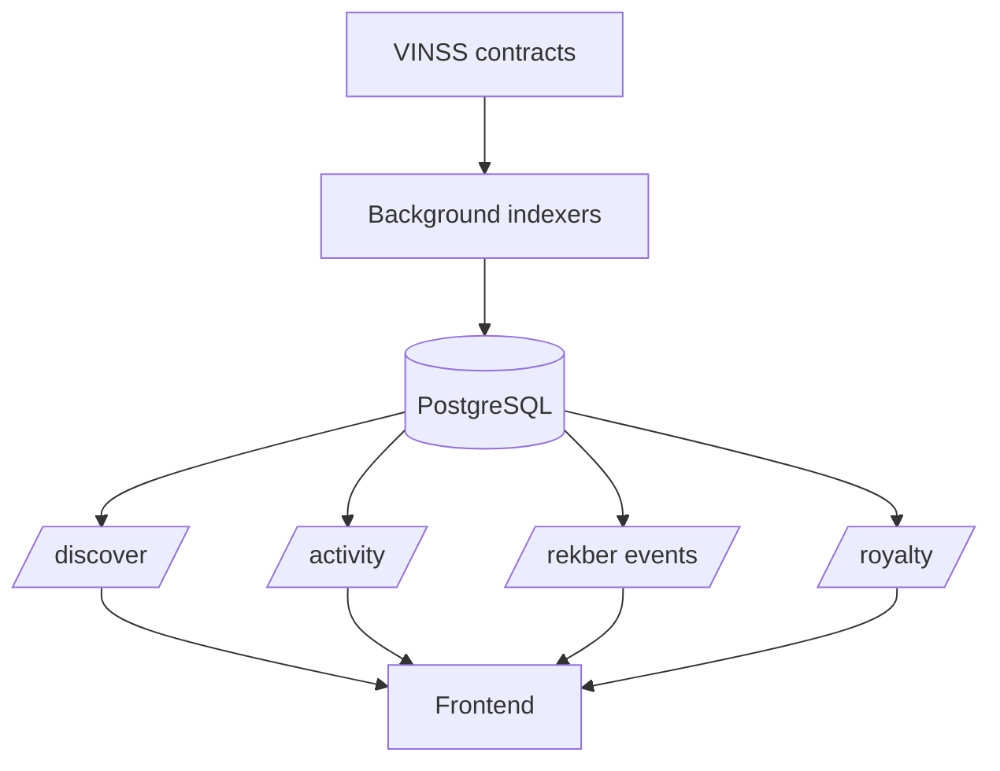

# VINSS Backend API Reference

This document describes the current HTTP API exposed by the VINSS backend.

The executable Express routers are authoritative.

The runtime OpenAPI document is useful, but it currently does not describe every mounted route. Where OpenAPI and executable route behavior differ, this document follows the executable source and explicitly records the drift.

---

# API Surfaces

The backend currently exposes four classes of HTTP API:

```text
1. always-mounted system / indexing / application routes

2. feature-gated Agent + Dispute routes

3. feature-gated legacy Loyalty routes

4. OpenAPI / Swagger documentation routes
```

---

# Runtime Route Inventory

## Always mounted

```text
GET  /health

GET  /openapi.json
GET  /docs

POST /discover

GET  /rekber/events
GET  /activity

POST /feedback

GET  /royalty/:address

POST /presence/publish
POST /presence/poll

PUT  /attachments/:id
GET  /attachments/:id
```

## Mounted when `AGENT_ENABLED=true`

```text
GET  /agent/providers
POST /agent

POST /dispute/challenge
POST /dispute/evaluate
```

## Mounted when `LOYALTY_ENABLED=true`

```text
GET  /loyalty/config
GET  /loyalty/:subject
POST /loyalty/events
```

---

# API Architecture



---

# Global HTTP Behavior

The Express application installs:

```text
CORS
JSON parser
minimal request logger
```

before most application routers.

Global JSON request-body limit:

```text
1 MiB
```

The encrypted attachment upload path uses a separate raw octet-stream parser with:

```text
20 MiB
```

limit.

---

# Request Logging

The global middleware logs:

```text
METHOD PATH
```

It intentionally does not log request bodies.

Example:

```text
POST /discover
GET /activity
```

This matters because several opt-in routes can contain sensitive plaintext.

---

# CORS

CORS origin comes from:

```text
CORS_ORIGIN
```

CORS controls browser-origin access.

It is not authentication.

It does not prove:

```text
wallet ownership
room membership
Deal Room authorization
attachment capability ownership
dispute participant identity
```

Those require separate mechanisms.

---

# Rate-Limited Routes

Current fixed-window rate limiting is mounted on:

```text
/discover
/agent
/dispute
/feedback
```

with different configuration behavior.

---

# Discover Rate Limit

Uses:

```text
DISCOVER_RATE_LIMIT
RATE_LIMIT_WINDOW_MS
```

and an in-memory per-IP-style identity bucket.

---

# Agent Rate Limit

Uses:

```text
AGENT_RATE_LIMIT
RATE_LIMIT_WINDOW_MS
```

---

# Dispute Rate Limit

Current Dispute routes reuse:

```text
AGENT_RATE_LIMIT
RATE_LIMIT_WINDOW_MS
```

rather than having a separate dispute-specific limit setting.

---

# Feedback Rate Limit

Feedback uses a separate hardcoded current limit:

```text
5 requests
per 60 seconds
```

---

# Rate-Limit Response Headers

The limiter sets:

```text
RateLimit-Limit
RateLimit-Remaining
RateLimit-Reset
```

When blocked it also sets:

```text
Retry-After
```

and returns:

```text
429
```

with:

```json
{
  "error": "Too many requests. Try again after the rate-limit window."
}
```

---

# Rate-Limit Persistence

Rate-limit buckets are:

```text
in-memory
process-local
```

They reset when the backend process restarts.

They are not automatically shared between multiple replicas.

---

# OpenAPI

## `GET /openapi.json`

Returns the current in-process OpenAPI document.

Current OpenAPI version:

```text
3.0.3
```

Current VINSS API document version:

```text
0.2.0
```

---

# Swagger UI

## `GET /docs`

Serves Swagger UI using the same:

```text
openApiDocument
```

with site title:

```text
VINSS Backend API
```

---

# OpenAPI Drift Warning

The current OpenAPI document does **not** yet describe every executable route.

Notably, executable runtime routes currently absent from the OpenAPI path map include:

```text
GET /rekber/events
GET /royalty/:address

PUT /attachments/:id
GET /attachments/:id

POST /dispute/challenge
POST /dispute/evaluate
```

The executable Express routers are therefore the stronger source of truth.

---

# OpenAPI Feedback Drift

The OpenAPI Feedback schema currently uses:

```text
additionalProperties: false
```

but executable:

```text
POST /feedback
```

does not explicitly reject unknown top-level fields.

The route reads and validates only the known fields it uses.

Therefore do not claim:

```text
unknown feedback fields are rejected
```

based only on OpenAPI.

They are not stored by the current route merely because they are present.

---

# System API

# `GET /health`

Purpose:

```text
backend + persistent indexer health
```

The route checks:

```text
DiscoveryIndexer
RekberIndexer
CertificateIndexer
```

---

# Healthy Response

HTTP:

```text
200
```

when none of the tracked indexer checkpoints is in:

```text
error
```

state.

Shape:

```json
{
  "status": "ok",
  "network": "sepolia",
  "indexer": {
    "message": {},
    "offer": {},
    "escrow": {}
  },
  "rekberIndexer": {},
  "certificateIndexer": {}
}
```

The checkpoint objects contain detailed runtime state.

---

# Degraded Response

HTTP:

```text
503
```

when any tracked indexer checkpoint is in:

```text
error
```

state.

Example shape:

```json
{
  "status": "degraded",
  "network": "sepolia",
  "indexer": {},
  "rekberIndexer": {},
  "certificateIndexer": {}
}
```

---

# Health Internal-Failure Response

If health status retrieval itself throws, the route returns:

```text
503
```

with:

```json
{
  "status": "degraded",
  "network": "sepolia",
  "indexer": null,
  "rekberIndexer": null,
  "certificateIndexer": null
}
```

---

# Health Checkpoint Fields

Discovery checkpoint views include fields such as:

```text
identity
kind
contractAddress
startBlock
nextBlock
lastIndexedBlock
latestObservedBlock
status
updatedAt
```

Rekber and Certificate checkpoints use similar fields without Discovery `kind`.

Possible status values:

```text
idle
syncing
caught_up
error
```

---

# Health Semantics

`200 ok` means:

```text
the backend can read the tracked checkpoint states
and none currently reports error
```

It does **not** prove:

```text
wallet availability
Ready X compatibility
browser decryption
complete E2E
correct mainnet deployment
remote LLM availability
attachment access for every object
```

---

# Discovery API

# `POST /discover`

Purpose:

```text
read persistent encrypted helper records
```

The route does not perform a fresh Starknet scan on each request.

It queries the persistent Discovery store populated by the background indexer.

---

# Discovery Request

Example:

```json
{
  "kind": "message",
  "fromBlock": 0,
  "toBlock": "latest"
}
```

---

# Discovery Allowed Fields

Exactly these top-level fields are supported:

```text
kind
fromBlock
toBlock
```

Unexpected fields are rejected.

---

# Discovery Forbidden Privacy Fields

The route explicitly rejects fields including:

```text
roomId
roomSecret
channelKey
channelKeyHex
viewingKey
viewingKeyHex
decryptionKey
plaintext
```

This is in addition to the general allowlist.

---

# Discovery Kinds

Valid:

```text
message
offer
escrow
```

Meaning:

```text
message
    -> Message Helper encrypted action

offer
    -> Offer Helper encrypted action

escrow
    -> Private Escrow Helper encrypted coordination action
```

`escrow` here does **not** mean public `VinssEscrowRekber` lifecycle events.

Those use the dedicated Rekber APIs.

---

# Discovery Block Bounds

`fromBlock`:

```text
optional
default = 0
non-negative safe integer
```

`toBlock`:

```text
optional
default = latest
```

Accepted:

```text
"latest"
```

or:

```text
non-negative safe integer
```

When numeric:

```text
toBlock >= fromBlock
```

is required.

---

# Discovery Success

HTTP:

```text
200
```

Response is a raw JSON array.

Example:

```json
[
  {
    "actionLocator": "0x...",
    "payloadCommitment": "0x...",
    "senderTag": "0x...",
    "recipientTag": "0x...",
    "ciphertextChunks": ["123", "456"],
    "blockNumber": 123456,
    "transactionHash": "0x..."
  }
]
```

---

# Discovery Record Fields

Current public API record shape:

```text
actionLocator
payloadCommitment
senderTag?
recipientTag?
ciphertextChunks[]
blockNumber
transactionHash
```

The route does not return the database-only fields:

```text
network
kind
contractAddress
indexedAt
```

as part of the `DiscoveredAction` response shape.

---

# Discovery Privacy

The response contains:

```text
public encrypted ciphertext
opaque routing metadata
public Starknet transaction metadata
```

It does not decrypt the application payload.

---

# Discovery Validation Failure

HTTP:

```text
400
```

Example categories:

```text
body not object
privacy-forbidden field
unexpected field
invalid kind
invalid fromBlock
invalid toBlock
toBlock < fromBlock
```

Response:

```json
{
  "error": "..."
}
```

---

# Discovery Store Failure

HTTP:

```text
500
```

Response:

```json
{
  "error": "Discovery failed."
}
```

The internal exception is not returned.

---

# Discovery Rate Limit

The `/discover` path is rate limited before the router executes.

When exceeded:

```text
429
```

---

# Global Activity API

# `GET /activity`

Purpose:

```text
merged public VINSS activity timeline
```

Data sources:

```text
DiscoveryStore
RekberStore
CertificateStore
```

---

# Activity Query Parameters

Supported:

```text
limit
kind
cursor
```

---

# Activity Limit

Default:

```text
30
```

Accepted:

```text
1..100
```

Invalid values return:

```text
400
```

---

# Activity Explicit Kind Filter

Current executable allowlist:

```text
message
offer
escrow
rekber_funded
rekber_released
rekber_refunded
certificate_issued
```

---

# `rekber_resolved` Filter Limitation

The shared type model and activity item schema can represent:

```text
rekber_resolved
```

and the Rekber store can return resolution events.

However the current `/activity` route does **not** include:

```text
rekber_resolved
```

in its explicit query-kind allowlist.

Therefore:

```text
GET /activity?kind=rekber_resolved
```

currently returns:

```text
400
```

rather than a filtered resolution list.

---

# Unfiltered Resolved Activity

When no `kind` is supplied, the route fetches all recent Rekber events without an event-kind filter.

Therefore:

```text
rekber_resolved
```

items can appear in the merged unfiltered activity response if indexed.

The limitation is only the explicit query filter.

---

# Activity Cursor

The cursor is a:

```text
base64url
```

encoded JSON object containing:

```text
blockNumber
transactionHash
actionLocator
```

Malformed cursor:

```text
400
```

with:

```json
{
  "error": "cursor is invalid."
}
```

or equivalent validation error.

---

# Activity Sort Order

Merged activity is sorted descending by:

```text
blockNumber
transactionHash
actionLocator
```

and truncated to requested `limit`.

---

# Activity Success Shape

```json
{
  "network": "sepolia",
  "items": [],
  "nextCursor": null
}
```

`nextCursor` is non-null when:

```text
items.length == limit
```

under the current route logic.

That is a pagination heuristic; it does not independently prove another page definitely contains more records.

---

# Base Activity Item

Common fields:

```text
network
kind
contractAddress
actionLocator
blockNumber
transactionHash
indexedAt
```

---

# Private-Helper Activity

For:

```text
message
offer
escrow
```

the activity item is intentionally metadata-oriented.

Detailed ciphertext retrieval belongs to:

```text
POST /discover
```

---

# Rekber Activity Extension

Rekber activity can include:

```json
{
  "rekber": {
    "eventKind": "funded",
    "custodyCommitment": "0x...",
    "token": "0x...",
    "amount": "1000",
    "refundAfter": 0,
    "outputNoteId": "0x...",
    "resolutionCommitment": "0x...",
    "resolutionPayerAmount": "0",
    "resolutionPayeeAmount": "0",
    "timestamp": 0
  }
}
```

Fields are event-kind dependent and may be absent.

---

# Certificate Activity Extension

Certificate activity can include:

```json
{
  "certificate": {
    "tokenId": "0x...",
    "recipient": "0x...",
    "custodyCommitment": "0x...",
    "role": 1,
    "settledAt": 0,
    "issuedAt": 0
  }
}
```

---

# Activity Validation Failure

HTTP:

```text
400
```

for invalid:

```text
limit
kind
cursor
```

---

# Activity Lookup Failure

HTTP:

```text
500
```

Response:

```json
{
  "error": "Activity lookup failed."
}
```

---

# Rekber API

# `GET /rekber/events`

Purpose:

```text
query indexed canonical Rekber lifecycle events
```

The route reads PostgreSQL-backed indexed events.

It does not query the Rekber contract directly for each HTTP request.

---

# Rekber Query Parameters

Supported:

```text
limit
event
custodyCommitment
```

---

# Rekber Event Filter

Accepted event values:

```text
funded
released
refunded
resolved
```

---

# Rekber Limit

Default:

```text
50
```

Accepted:

```text
1..100
```

---

# Rekber Custody Filter

`custodyCommitment` must be:

```text
string
0x-prefixed hex
non-zero
below 2^251
```

The route canonicalizes it to:

```text
0x<lowercase numeric hex>
```

through BigInt conversion.

---

# Rekber Success Shape

```json
{
  "network": "sepolia",
  "contractAddress": "0x...",
  "items": []
}
```

---

# Indexed Funded Event Fields

A funded Rekber record can include:

```text
eventKind = funded
custodyCommitment
token
amount
refundAfter
timestamp
blockNumber
transactionHash
indexedAt
```

plus:

```text
network
contractAddress
```

---

# Indexed Released Event Fields

Released can include:

```text
eventKind = released
custodyCommitment
outputNoteId
timestamp
blockNumber
transactionHash
```

---

# Indexed Refunded Event Fields

Refunded can include:

```text
eventKind = refunded
custodyCommitment
outputNoteId
timestamp
blockNumber
transactionHash
```

---

# Indexed Resolved Event Fields

Resolved can include:

```text
eventKind = resolved
custodyCommitment
resolutionCommitment
resolutionPayerAmount
resolutionPayeeAmount
timestamp
blockNumber
transactionHash
```

---

# Rekber Validation Failure

HTTP:

```text
400
```

for invalid:

```text
limit
event
custodyCommitment
```

---

# Rekber Lookup Failure

HTTP:

```text
500
```

Response:

```json
{
  "error": "Rekber lookup failed."
}
```

---

# Royalty API

# `GET /royalty/:address`

Purpose:

```text
derive current points / multiplier state
from indexed Settlement Certificate events
```

This route is read-only.

---

# Royalty Address Validation

`:address` must be:

```text
0x-prefixed hexadecimal
non-zero
below 2^251
```

It is canonicalized to lowercase numeric hex.

Invalid address:

```text
400
```

with:

```json
{
  "error": "Invalid Starknet address."
}
```

---

# Royalty Data Authority

The route queries:

```text
CertificateStore.recipientStats(...)
```

using:

```text
network
Settlement Certificate contract address
recipient address
```

The client cannot directly submit a Royalty award through this endpoint.

---

# Royalty Success Shape

Current response includes:

```json
{
  "network": "sepolia",
  "address": "0x...",
  "points": 0,
  "basePoints": 0,
  "certificateCount": 0,
  "successfulSettlements": 0,
  "multiplier": 1,
  "nextCertificateTarget": 1,
  "nextMultiplier": 1.25,
  "latestCertificateIssuedAt": null,
  "conversion": {
    "status": "coming_soon"
  }
}
```

Values depend on indexed certificate state.

---

# Royalty Current Formula

Base:

```text
successfulSettlements * 200
```

Multiplier tiers:

```text
0 certs  -> 1.00x
1 cert   -> 1.25x
3 certs  -> 1.50x
5 certs  -> 1.75x
10 certs -> 2.00x
```

Final:

```text
round(basePoints * multiplier)
```

---

# Royalty Conversion

Current response always exposes:

```json
{
  "conversion": {
    "status": "coming_soon"
  }
}
```

The current API does not perform points-to-token conversion.

---

# Royalty Lookup Failure

HTTP:

```text
500
```

Response:

```json
{
  "error": "Royalty lookup failed."
}
```

---

# Presence API

Presence is:

```text
encrypted
ephemeral
in-memory
```

It is not a durable message transport.

---

# `POST /presence/publish`

Publishes one encrypted presence event.

Example:

```json
{
  "channelId": "0123456789abcdef0123456789abcdef0123456789abcdef0123456789abcdef",
  "eventId": "opaque_event_id",
  "iv": "opaque-encoded-iv",
  "ciphertext": "opaque-encoded-ciphertext",
  "ttlMs": 60000
}
```

---

# Presence Channel ID

Must match:

```text
^[a-f0-9]{64}$
```

Meaning:

```text
exactly 64
lowercase
hexadecimal characters
```

---

# Presence Event ID

Must match:

```text
^[A-Za-z0-9_-]{8,96}$
```

---

# Presence IV

Must be:

```text
non-empty string
maximum 128 characters
```

The backend treats it as opaque.

---

# Presence Ciphertext

Must be:

```text
non-empty string
maximum 16384 characters
```

The backend does not decrypt it.

---

# Presence TTL

`ttlMs` must be:

```text
number
finite
```

Then backend clamps it to:

```text
minimum 1,000 ms
maximum 86,400,000 ms
```

Values outside that range are bounded, not rejected solely for being outside the final range.

---

# Presence Duplicate Event ID

For a given channel, if an unexpired record already has the same:

```text
eventId
```

the route does not append a duplicate.

It still stores the resulting channel state and returns normal success.

---

# Presence Per-Channel Limit

Current maximum:

```text
120 live events
```

per channel.

After insert/dedup, events are ordered by creation time and only the newest 120 are retained.

---

# Presence Publish Success

HTTP:

```text
204 No Content
```

---

# Presence Publish Validation Failure

HTTP:

```text
400
```

Response:

```json
{
  "error": "Invalid encrypted presence envelope."
}
```

---

# `POST /presence/poll`

Request:

```json
{
  "channelId": "0123456789abcdef0123456789abcdef0123456789abcdef0123456789abcdef"
}
```

---

# Presence Poll Success

HTTP:

```text
200
```

Response:

```json
{
  "events": [
    {
      "eventId": "...",
      "iv": "...",
      "ciphertext": "...",
      "createdAt": 0,
      "expiresAt": 0
    }
  ]
}
```

Expired events are removed during polling cleanup.

---

# Presence Poll Validation Failure

HTTP:

```text
400
```

Response:

```json
{
  "error": "Invalid presence channel."
}
```

---

# Presence Persistence Boundary

Presence state lives in a process-local Map.

Backend restart:

```text
presence state lost
```

Multiple replicas:

```text
presence state not automatically shared
```

---

# Encrypted Attachment API

The attachment service stores:

```text
opaque binary ciphertext
```

in PostgreSQL.

It does not decrypt uploaded bytes.

---

# Attachment ID

Both endpoints require:

```text
:id
```

matching the current UUID-v4-style route pattern.

Example:

```text
550e8400-e29b-41d4-a716-446655440000
```

---

# Attachment Capability Header

Both upload and download require:

```text
x-vinss-attachment-token
```

Current token validation:

```text
trimmed non-empty string
minimum 32 characters
maximum 256 characters
```

The raw token is not stored.

The backend stores:

```text
SHA-256(token)
```

---

# `PUT /attachments/:id`

Content type:

```text
application/octet-stream
```

Body:

```text
raw encrypted bytes
```

Maximum:

```text
20 MiB
```

---

# Attachment Upload Success

HTTP:

```text
201
```

Response:

```json
{
  "id": "550e8400-e29b-41d4-a716-446655440000"
}
```

---

# Attachment Invalid ID

HTTP:

```text
400
```

Response:

```json
{
  "error": "Invalid attachment id."
}
```

---

# Attachment Missing Token

HTTP:

```text
401
```

Response:

```json
{
  "error": "Missing attachment token."
}
```

---

# Attachment Empty Body

HTTP:

```text
400
```

Response:

```json
{
  "error": "Encrypted attachment body is required."
}
```

---

# Attachment Too Large

The route has explicit logic for:

```text
413
```

with:

```json
{
  "error": "Attachment is too large."
}
```

The Express raw-body parser may also enforce its configured size limit before route logic depending on middleware behavior.

---

# Attachment Duplicate ID

Uploads use:

```text
ON CONFLICT (id) DO NOTHING
```

If the ID already exists:

```text
409
```

Response:

```json
{
  "error": "Attachment id already exists."
}
```

The existing object is not overwritten.

---

# Attachment Storage Failure

HTTP:

```text
503
```

Response:

```json
{
  "error": "Encrypted attachment storage is unavailable."
}
```

---

# `GET /attachments/:id`

Requires the same capability-token header.

The route loads:

```text
token_hash
ciphertext
```

from PostgreSQL.

---

# Attachment Not Found

If no row exists:

```text
404
```

Response:

```json
{
  "error": "Attachment not found."
}
```

---

# Attachment Wrong Token

If a row exists but token hash does not match:

```text
404
```

with the same:

```json
{
  "error": "Attachment not found."
}
```

This avoids directly distinguishing:

```text
missing object
```

from:

```text
existing object + wrong token
```

---

# Attachment Download Success

HTTP:

```text
200
```

Content type:

```text
application/octet-stream
```

Headers include:

```text
Cache-Control: private, max-age=300
Content-Length: <ciphertext bytes>
```

Body:

```text
ciphertext bytes
```

---

# Attachment Download Storage Failure

HTTP:

```text
503
```

Response:

```json
{
  "error": "Encrypted attachment storage is unavailable."
}
```

---

# Feedback API

# `POST /feedback`

Purpose:

```text
store optional post-settlement product feedback
```

This endpoint stores plaintext application feedback.

Do not submit secrets.

---

# Feedback Request

Example:

```json
{
  "outcome": "released",
  "role": "payer",
  "dealType": "freelance",
  "network": "sepolia",
  "rating": 5,
  "comment": "Flow worked well."
}
```

---

# Feedback Outcomes

Valid:

```text
released
refunded
```

---

# Feedback Roles

Valid:

```text
payer
payee
unknown
```

---

# Feedback Deal Types

Optional.

Valid non-empty values:

```text
otc
freelance
goods
digital_goods
bounty
nft
other
```

An absent or empty string is stored as:

```text
NULL
```

---

# Feedback Network

Valid:

```text
sepolia
mainnet
```

The route validates the client-supplied network string.

It does not replace it with `config.network`.

---

# Feedback Rating

Required integer:

```text
1..5
```

---

# Feedback Comment

Optional string.

The route:

```text
trim()
```

s it.

Maximum:

```text
2000 characters
```

An empty comment is stored as:

```text
NULL
```

---

# Feedback Unknown Fields

Executable route behavior does not explicitly reject unknown fields.

Unknown fields are ignored because the route only reads the known Feedback properties.

This differs from the current stricter OpenAPI object schema.

---

# Feedback Success

HTTP:

```text
201
```

Response:

```json
{
  "ok": true,
  "emailQueued": false
}
```

or:

```json
{
  "ok": true,
  "emailQueued": true
}
```

---

# `emailQueued` Precision

Current implementation sets:

```text
emailQueued = Boolean(RESEND_API_KEY)
```

before attempting the asynchronous Resend call.

Therefore:

```text
emailQueued: true
```

means:

```text
email notification is configured and a best-effort attempt will be made
```

It does **not** prove the email was successfully delivered.

---

# Feedback Email Ordering

Current flow:

```text
validate
↓
insert PostgreSQL row
↓
respond 201
↓
if Resend configured:
    attempt email asynchronously
```

Email provider failure does not roll back the stored feedback.

---

# Feedback Validation Failure

HTTP:

```text
400
```

Response:

```json
{
  "error": "Invalid feedback."
}
```

---

# Feedback Rate Limit Failure

HTTP:

```text
429
```

---

# Feedback Storage Failure

HTTP:

```text
500
```

Response:

```json
{
  "error": "Feedback could not be saved."
}
```

---

# Agent API

Agent routes exist only when:

```text
AGENT_ENABLED=true
```

If the feature is not mounted, normal Express route-not-found behavior applies.

---

# `GET /agent/providers`

Purpose:

```text
discover current Agent capability metadata
```

Success response includes:

```json
{
  "network": "sepolia",
  "defaultProvider": "groq",
  "configuredProviders": ["groq"],
  "skills": ["chat", "offer", "escrow"]
}
```

Exact configured provider list depends on environment.

---

# Public Agent Skills

Only:

```text
chat
offer
escrow
```

The internal:

```text
dispute
```

skill is intentionally omitted from this endpoint.

---

# `POST /agent`

Example request:

```json
{
  "message": "Review the current deal state",
  "context": {},
  "skill": "offer",
  "provider": "groq"
}
```

---

# Agent Required Fields

Required:

```text
message
context
skill
```

---

# Agent Message

Must be:

```text
non-empty string after trim
```

The explicit message becomes remote-provider input.

---

# Agent Context

Must be:

```text
object
not array
```

It is sanitized server-side before provider execution.

The caller cannot bypass sanitization merely by claiming the context is already privacy-safe.

---

# Agent Skill

Valid:

```text
chat
offer
escrow
```

Invalid:

```text
400
```

---

# Agent Provider

Optional.

Valid:

```text
auto
groq
openai
anthropic
qwen
```

Invalid:

```text
400
```

---

# Agent Success

HTTP:

```text
200
```

Current response is the provider result plus:

```text
skill
network
contextShared
```

Example conceptual shape:

```json
{
  "answer": "...",
  "dealStage": "offer_pending",
  "proposal": null,
  "provider": "groq",
  "model": "...",
  "skill": "offer",
  "network": "sepolia",
  "contextShared": true
}
```

---

# Agent Proposal

When generated, `proposal` may be an approval-required structure such as:

```text
draft_message
draft_offer
draft_counter_offer
prepare_escrow
review_rekber
```

The Agent does not execute participant blockchain transactions.

---

# Agent Input Validation Errors

Current messages include:

```text
message is required.

privacy-safe context is required.

skill must be chat, offer, or escrow.

provider must be auto, groq, openai, anthropic, or qwen.
```

HTTP:

```text
400
```

---

# Agent Runtime Failure

HTTP:

```text
500
```

Response:

```json
{
  "error": "Agent failed."
}
```

Raw provider failure content is not returned.

---

# Agent Rate Limit

Agent route is subject to the configured fixed-window Agent limiter.

Exceeded:

```text
429
```

---

# Dispute API

Dispute routes are currently mounted only inside the same:

```text
AGENT_ENABLED
```

feature block.

They are not public Agent skills.

They are dedicated routes.

---

# Dispute Request Top-Level Shape

Both endpoints read fields from a request object that may include:

```text
case
attestations
binding
provider
```

Specific endpoints require different subsets.

---

# Dispute Case Core Shape

The sanitized dispute case contains:

```text
custodyCommitment
verificationClass
principal
acceptedTerms
fulfillment
payer
payee
onChain
```

---

# Dispute Verification Class

Valid:

```text
objective
digital_review
offchain
```

---

# Dispute Principal

Shape:

```json
{
  "asset": "USDC",
  "rawAmount": "500000000",
  "usdMicros": 500000000
}
```

`usdMicros` is optional in the submitted shape.

For automatic policy evaluation, the backend independently attempts to obtain verified principal USD value rather than trusting browser-supplied valuation as authority.

---

# Dispute Accepted Terms

Shape:

```json
{
  "dealType": "freelance",
  "summary": "Build feature X",
  "obligations": [
    "Deliver feature X"
  ],
  "completionCriteria": [
    "Feature passes agreed acceptance criteria"
  ],
  "deadline": "optional",
  "reviewPeriodSeconds": 3600
}
```

The sanitizer requires at least one:

```text
obligation
completion criterion
```

---

# Dispute Party Packet

Each:

```text
payer
payee
```

packet includes:

```json
{
  "role": "payer",
  "walletAddress": "0x...",
  "consentToAgentReview": true,
  "statement": "...",
  "evidence": [],
  "submittedAt": "..."
}
```

Each party must submit:

```text
at least one evidence item
```

under current sanitizer behavior.

---

# Dispute Evidence Item

Shape:

```json
{
  "kind": "attachment",
  "label": "Delivery archive",
  "value": "...",
  "commitment": "optional"
}
```

Known evidence kinds:

```text
statement
attachment
transaction
tracking
test
other
```

Unknown evidence kind is normalized to:

```text
other
```

rather than rejected.

---

# Dispute Consent

Each party packet must contain:

```text
consentToAgentReview = true
```

Otherwise sanitization rejects the dispute case.

This consent means disclosure for Dispute Agent review.

It is not itself an agreement with the other party's factual claims.

---

# Dispute Fulfillment Snapshot

Shape:

```json
{
  "submitted": true,
  "confirmed": false,
  "evidenceCommitment": "0x...",
  "submittedAt": "optional"
}
```

---

# Dispute On-Chain Snapshot

Client shape:

```json
{
  "disputed": true,
  "consumed": false,
  "resolutionAuthorized": false,
  "fulfillmentSubmitted": true,
  "fulfillmentConfirmed": false
}
```

The dedicated route later re-reads relevant chain state rather than treating this browser snapshot as final authority.

---

# Dispute Rekber Binding

The `binding` object contains:

```text
setup
acceptance
```

records derived from the original signed Rekber Agreement material.

These include fields such as:

```text
custody commitment
deal Offer locator
deal terms commitment
payer/payee addresses
capability commitments
certificate commitments
fulfillment deadline
signatures
```

The backend verifies them against live/canonical Rekber custody fields and wallet signatures.

---

# Binding Signatures

Each binding signature array currently requires:

```text
minimum 2 felt strings
maximum 16 felt strings
```

Each felt must be:

```text
0x-prefixed hex
```

---

# `POST /dispute/challenge`

Purpose:

```text
validate disclosed dispute case + Rekber binding
then return typed data that payer and payee must sign
```

---

# Challenge Request

Conceptual:

```json
{
  "case": {},
  "binding": {}
}
```

This endpoint does not require the final dispute attestation signatures yet.

It creates the typed data to obtain them.

---

# Challenge Verification Flow

Current flow:

```text
sanitize dispute case
sanitize Rekber binding
read and verify live Rekber custody
verify original Rekber Agreement binding
compute dispute case commitment
build payer attestation typed data
build payee attestation typed data
```

---

# Challenge Success

HTTP:

```text
200
```

Response:

```json
{
  "network": "sepolia",
  "caseCommitment": "0x...",
  "typedData": {
    "payer": {},
    "payee": {}
  }
}
```

The typed-data objects are Starknet typed-data structures.

---

# Challenge Attestation Meaning

The attestation represents consent to submit:

```text
this exact combined dispute case
```

for Dispute Agent review/AutoSplit policy.

It does not mean:

```text
the signer agrees with every opposing factual claim
```

---

# Challenge Failure

All caught errors currently map to:

```text
HTTP 400
```

with:

```json
{
  "error": "<public error message>"
}
```

The route uses the thrown `Error.message` as public text.

Unlike normal `/agent`, this is not a generic error-only boundary.

---

# `POST /dispute/evaluate`

Purpose:

```text
verify case
verify both dispute attestations
verify Rekber Agreement binding
derive trusted chain/value inputs
run dispute Agent
apply deterministic policy
optionally authorize resolver split
```

---

# Evaluate Request

Conceptual:

```json
{
  "case": {},
  "attestations": {
    "payer": ["0x...", "0x..."],
    "payee": ["0x...", "0x..."]
  },
  "binding": {},
  "provider": "groq"
}
```

---

# Evaluate Provider

Optional.

Valid values:

```text
auto
groq
openai
anthropic
qwen
```

Invalid:

```text
400
```

---

# Dispute Attestations

Both are required.

Each signature array:

```text
minimum 2
maximum 16
```

Each entry:

```text
0x-prefixed hex string
```

The backend verifies the signature against the declared wallet and the exact typed dispute attestation.

---

# Evaluate Verification Flow



---

# Dispute Agent Decision Shape

Current internal decision model:

```json
{
  "decision": "split",
  "payerBps": 4000,
  "payeeBps": 6000,
  "confidence": 0.9,
  "reason": "...",
  "evidenceCommitment": "0x...",
  "flags": []
}
```

Decision values:

```text
payer
payee
split
needs_review
```

---

# Dispute Policy Status

Current policy output type:

```text
AUTO_RESOLVE
NEEDS_REVIEW
REJECTED
```

The LLM decision alone does not authorize resolver execution.

---

# Evaluate Success

HTTP:

```text
200
```

Response includes:

```text
caseCommitment
decision
policy
provider
model
network
execution
```

---

# Dispute Execution Result

Possible current status values:

```text
authorized
already_authorized
not_enabled
not_eligible
```

Additional optional fields:

```text
transactionHash
payerAmount
payeeAmount
```

---

# AutoResolve Gate

The route attempts:

```text
authorizeDisputeResolution(...)
```

only when:

```text
policy.status == AUTO_RESOLVE
```

Otherwise response execution starts as:

```json
{
  "status": "not_eligible"
}
```

---

# AutoResolve Disabled

If policy says AutoResolve but:

```text
DISPUTE_AUTO_RESOLVE_ENABLED=false
```

the executor returns:

```json
{
  "status": "not_enabled"
}
```

---

# Already-Authorized Resolution

If Rekber already reports resolution authorization, executor returns:

```text
already_authorized
```

with the current on-chain payer/payee authorized amounts.

---

# New Resolver Authorization

When enabled and eligible, executor:

```text
verifies configured resolver matches immutable Rekber resolver
computes exact payer/payee principal split
submits authorize_dispute_resolution
waits for transaction
```

Success:

```text
authorized
```

plus transaction hash and amounts.

---

# Evaluate Error Mapping

The current route catches evaluation/verification/execution errors and returns:

```text
HTTP 400
```

with:

```json
{
  "error": "<error message>"
}
```

This means current executable API does not consistently distinguish:

```text
bad client request
verification rejection
provider failure
RPC failure
resolver execution failure
```

through HTTP status classes on this route.

Documentation must follow this current behavior until route error classification is redesigned.

---

# Dispute Privacy

Dispute endpoints intentionally receive plaintext such as:

```text
accepted terms
party statements
evidence labels/values
wallet addresses
```

after explicit consent.

They are not ciphertext-only APIs.

---

# Dispute Logging

The route source explicitly avoids logging:

```text
evidence
signatures
resolver credentials
```

in the evaluation catch path.

---

# Legacy Loyalty API

These routes are mounted only when:

```text
LOYALTY_ENABLED=true
```

Current default:

```text
false
```

The current service is:

```text
in-memory
client-write
preview
```

not canonical settlement authority.

---

# `GET /loyalty/config`

Returns network-scoped Loyalty rule configuration.

Exact fields are defined by:

```text
getLoyaltyRules()
```

---

# `GET /loyalty/:subject`

Returns current in-memory Loyalty state for:

```text
subject
```

under current network.

There is no current subject authentication in this route.

---

# `POST /loyalty/events`

Request:

```json
{
  "subject": "...",
  "action": "message_sent",
  "eventId": "..."
}
```

All three fields must be strings.

---

# Loyalty Actions

Accepted:

```text
message_sent
offer_created
offer_countered
offer_accepted
work_submitted
work_reviewed
referral_joined
referral_activated
referral_converted
rekber_released
rekber_refunded
```

---

# Loyalty Success

HTTP:

```text
200
```

Returns updated in-memory Loyalty account.

---

# Loyalty Validation Failure

HTTP:

```text
400
```

for:

```text
missing string fields
invalid action
service-level invalid event
```

---

# Loyalty Authority Warning

`POST /loyalty/events` accepts client-submitted award claims.

The route is therefore unsuitable as a valuable production reward authority without stronger authentication/verifiable-event design.

This is why it is feature-gated and disabled by default.

---

# Royalty vs Loyalty API

Do not confuse:

```text
GET /royalty/:address
```

with:

```text
/loyalty/*
```

Royalty:

```text
always mounted
read-only
certificate-index-derived
PostgreSQL-backed derivation
```

Legacy Loyalty:

```text
feature-gated
client-write
in-memory
preview
```

---

# HTTP Status Summary

| Route | Typical success | Important failures |
|---|---:|---|
| `GET /health` | `200` | `503` degraded |
| `POST /discover` | `200` | `400`, `429`, `500` |
| `GET /activity` | `200` | `400`, `500` |
| `GET /rekber/events` | `200` | `400`, `500` |
| `GET /royalty/:address` | `200` | `400`, `500` |
| `POST /presence/publish` | `204` | `400` |
| `POST /presence/poll` | `200` | `400` |
| `PUT /attachments/:id` | `201` | `400`, `401`, `409`, `413`, `503` |
| `GET /attachments/:id` | `200` | `400`, `401`, `404`, `503` |
| `POST /feedback` | `201` | `400`, `429`, `500` |
| `GET /agent/providers` | `200` | route unavailable if feature disabled |
| `POST /agent` | `200` | `400`, `429`, `500` |
| `POST /dispute/challenge` | `200` | `400`, `429` |
| `POST /dispute/evaluate` | `200` | `400`, `429` |
| Legacy Loyalty routes | `200` | `400` where applicable / unavailable if disabled |

---

# Error Privacy Boundary

Backend APIs should avoid returning raw sensitive internal details where not necessary.

Current generic operational responses include:

```text
Discovery failed.

Activity lookup failed.

Rekber lookup failed.

Royalty lookup failed.

Agent failed.

Encrypted attachment storage is unavailable.

Feedback could not be saved.
```

---

# Dispute Error Exception

Dedicated Dispute routes currently return:

```text
Error.message
```

for caught errors.

That is more descriptive than the normal Agent route.

Because dispute errors can originate from several verification layers, future hardening should review whether every possible thrown message is appropriate for public exposure.

Current docs must nevertheless reflect current executable behavior.

---

# Authentication Matrix

The backend should not be described as globally authenticated.

Current important mechanisms differ by route.

| API | Current primary gate |
|---|---|
| `/discover` | Request validation + rate limit; no room credential |
| `/activity` | Public read |
| `/rekber/events` | Public read |
| `/royalty/:address` | Public read |
| Presence | Opaque channel ID; no wallet auth |
| Attachments | Capability token header |
| Feedback | Validation + rate limit |
| Agent | Feature flag + rate limit; no wallet auth in route |
| Dispute | Feature flag + rate limit + cryptographic case/binding verification |
| Legacy Loyalty | Feature flag; current writes unauthenticated |

---

# Discovery Has No Room Authentication By Design

`POST /discover` does not accept:

```text
room secret
channel key
wallet identity
```

It returns public on-chain ciphertext.

Privacy comes from client-side encryption, not from making public ciphertext undiscoverable.

---

# Activity Is Public Metadata

`GET /activity` is intentionally public metadata.

Do not expose private plaintext there merely to make the UI richer.

---

# Rekber Events Are Public

`GET /rekber/events` surfaces already-public lifecycle/accounting fields.

It is not a privacy leak relative to chain visibility, but it can make public data easier to query.

---

# Royalty Is Public Recipient-Derived State

`GET /royalty/:address` accepts an arbitrary valid address and returns certificate-derived points state.

It is not a private account endpoint.

---

# Presence Is Not Identity Authentication

Knowing a valid presence channel ID can allow interaction with that channel endpoint.

The route does not verify a Starknet signature.

Its security model depends on:

```text
opaque channel derivation
encrypted event payloads
ephemeral semantics
```

---

# Attachment Capability Is Service Authorization

The attachment token is a bearer-like capability for backend retrieval.

It is not:

```text
Starknet signature
ERC-721 ownership proof
room membership proof
```

Treat the token as secret.

---

# Feedback Is Plaintext

Feedback comment content is stored in PostgreSQL.

Do not submit:

```text
room secret
channel key
private key
dispute evidence
sensitive deal details
```

through feedback.

---

# Agent Is Explicit Disclosure

The normal Agent's explicit:

```text
message
```

is remote-provider input.

Automatic context is sanitized.

Those are separate facts.

---

# Dispute Is Explicit Evidence Disclosure

Dispute routes intentionally process deeper business plaintext.

They should be surfaced to users with separate consent/privacy messaging from normal Deal Room discovery.

---

# Network Fields

The configured backend network is:

```text
sepolia
```

or:

```text
mainnet
```

Some responses use:

```text
config.network
```

as server authority.

Feedback is an exception: the route accepts and stores a validated network supplied in the request body.

---

# Pagination Boundaries

Currently only:

```text
GET /activity
```

exposes cursor pagination in this API set.

`GET /rekber/events` uses only:

```text
limit + filters
```

and has no cursor.

`POST /discover` uses:

```text
block range
```

rather than a page cursor.

---

# API Read/Write Classification

## Read-like

```text
GET /health
GET /openapi.json
GET /docs
POST /discover
GET /activity
GET /rekber/events
GET /royalty/:address
POST /presence/poll
GET /attachments/:id
GET /agent/providers
GET /loyalty/config
GET /loyalty/:subject
POST /dispute/challenge
```

Some use POST because they accept structured body input but do not mutate canonical chain state.

## Backend write

```text
POST /presence/publish
PUT /attachments/:id
POST /feedback
POST /loyalty/events
```

## Potential chain-authority write

```text
POST /dispute/evaluate
```

can cause resolver authorization only when all independent gates allow AutoResolve and the executor is enabled.

---

# `POST /dispute/evaluate` Is Not Pure Read

This endpoint must not be casually documented as:

```text
analysis only
```

because when:

```text
policy.status = AUTO_RESOLVE
```

and:

```text
DISPUTE_AUTO_RESOLVE_ENABLED=true
```

it can submit:

```text
authorize_dispute_resolution
```

through the dedicated resolver account.

This is a privileged API path.

---

# Request Size Boundaries

Global JSON routes:

```text
1 MiB
```

Attachment binary upload:

```text
20 MiB
```

Dispute evidence strings are also individually bounded by their sanitizer, but the global JSON limit applies before route processing.

---

# Dispute Field Bounds

Current dispute sanitizer uses limits including:

```text
short strings: 160 characters
text/evidence values: 8000 characters
max evidence items per party: 20
max obligations: 20
max completion criteria: 20
```

These are application sanitizer limits, subject also to the global JSON body limit.

---

# Public Mainnet Hardening

Before public mainnet operation, API hardening should consider:

```text
shared/distributed rate limiting if multiple replicas

explicit auth where business policy requires it

Dispute error-message review

Dispute resolver endpoint monitoring

attachment retention / deletion policy

presence multi-replica behavior

request timeouts

RPC/provider timeouts

OpenAPI drift tests

abuse limits for public Activity/Rekber/Royalty endpoints

database query monitoring
```

Some protections already exist; this list should not be interpreted as all being unimplemented.

---

# OpenAPI Hardening Priorities

Current high-priority sync gaps:

```text
document /rekber/events

document /royalty/{address}

document PUT /attachments/{id}

document GET /attachments/{id}

document /dispute/challenge

document /dispute/evaluate
```

Also verify:

```text
Feedback additionalProperties behavior
activity rekber_resolved filter mismatch
feature-gated route visibility wording
```

---

# API Documentation Source Order

When behavior conflicts, prefer:

```text
1. executable Express router
2. underlying service/store source
3. executable tests
4. current deployed environment
5. openapi.ts
6. prose documentation
```

For whether a feature is actually exposed in production:

```text
deployed environment
```

is required because feature flags can disable source-defined routes.

---

# API Interaction Map



---

# Privacy Classification by Endpoint

| Endpoint | Main data class |
|---|---|
| `/health` | Operational metadata |
| `/discover` | Public ciphertext + opaque routing metadata |
| `/activity` | Public indexed activity metadata |
| `/rekber/events` | Public Rekber lifecycle/accounting |
| `/royalty/:address` | Public certificate-derived application points |
| Presence | Encrypted ephemeral payload |
| Attachments | Encrypted persistent blob |
| Feedback | Plaintext product feedback |
| Agent | Explicit plaintext prompt + sanitized metadata |
| Dispute | Explicit consented terms/statements/evidence + signatures |
| Loyalty | Preview application points state |

---

# Do Not Flatten These Privacy Models

Incorrect:

```text
All backend APIs are ciphertext-only.
```

Also incorrect:

```text
The backend stores all Deal Room plaintext.
```

Correct:

```text
Core discovery is ciphertext-only.

Public chain index APIs expose public chain data.

Presence and attachments carry ciphertext.

Feedback is plaintext application data.

Agent receives explicit plaintext prompt.

Dispute receives explicitly consented dispute plaintext.
```

---

# Example Core Read Flow



The HTTP request does not itself force a fresh chain scan for these persistent indexed paths.

---

# API Compatibility Checklist

When backend routes change, verify:

```text
Did app.ts mount/unmount a router?

Did a feature flag change?

Did a path change?

Did method change?

Did body parser change?

Did required fields change?

Did allowed enum values change?

Did HTTP status behavior change?

Did error text change?

Did rate limiting change?

Did pagination change?

Did response shape change?

Did privacy classification change?

Did a previously read-only endpoint gain side effects?

Did OpenAPI change too?

Did frontend client code change too?

Did tests cover the new route behavior?
```

---

# Sensitive API Checklist

For:

```text
/agent
/dispute/*
/feedback
/attachments/*
```

also verify:

```text
Are request bodies logged?

Are secrets echoed in errors?

Are provider/RPC errors exposed?

Are capability tokens logged?

Are dispute signatures logged?

Are resolver credentials logged?

Is plaintext intentionally disclosed?

Does user-facing consent match actual transport?
```

---

# Mainnet Endpoint Checklist

Before mainnet:

```text
GET /health
    all expected indexers healthy

POST /discover
    correct mainnet ciphertext records

GET /rekber/events
    correct canonical mainnet Rekber address

GET /activity
    expected merged network data

GET /royalty/:address
    correct mainnet certificate address

attachments
    PostgreSQL working

feedback
    persistence working

presence
    ephemeral behavior understood

Agent
    enabled/disabled intentionally

Dispute
    enabled/disabled intentionally
    resolver authority verified

Loyalty
    disabled unless intentionally previewed

OpenAPI
    reconciled against runtime
```

---

# Current Known API Drift Summary

At the time this document was aligned to source:

```text
OpenAPI missing:
    /rekber/events
    /royalty/{address}
    /attachments/{id}
    /dispute/challenge
    /dispute/evaluate

OpenAPI Feedback:
    says additionalProperties false
    executable route ignores unknown fields instead of rejecting them

Activity:
    item schema knows rekber_resolved
    explicit kind query allowlist does not
```

These are documentation/integration gaps, not smart-contract failures.

---

# Bottom Line

The current VINSS backend API is broader than the older discovery-only documentation suggested.

It now provides:

```text
persistent encrypted discovery

persistent public Rekber indexing

persistent public Certificate-derived activity

global activity

Royalty

encrypted attachments

encrypted ephemeral presence

feedback

optional Agent

optional Dispute / AutoResolve

disabled-by-default legacy Loyalty
```

The most important API boundary remains:

```text
public ciphertext discovery
!=
plaintext Agent disclosure
!=
public Rekber metadata
!=
privileged Dispute resolver execution
```

Each endpoint must be documented according to the data and authority it actually handles.
