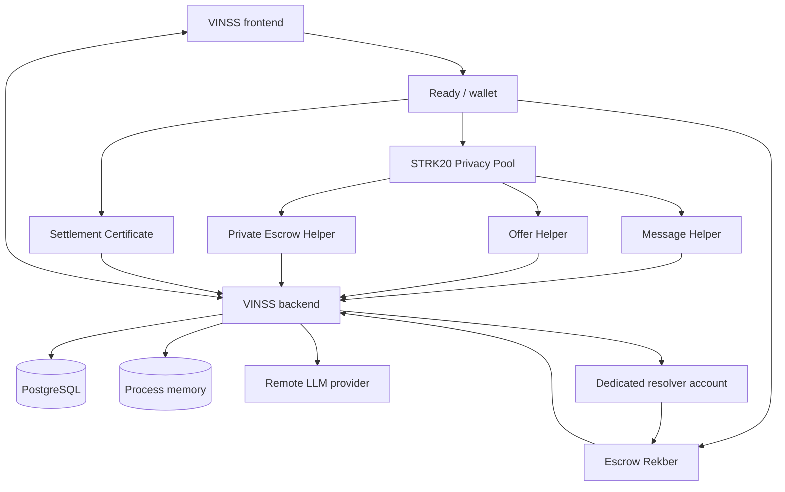
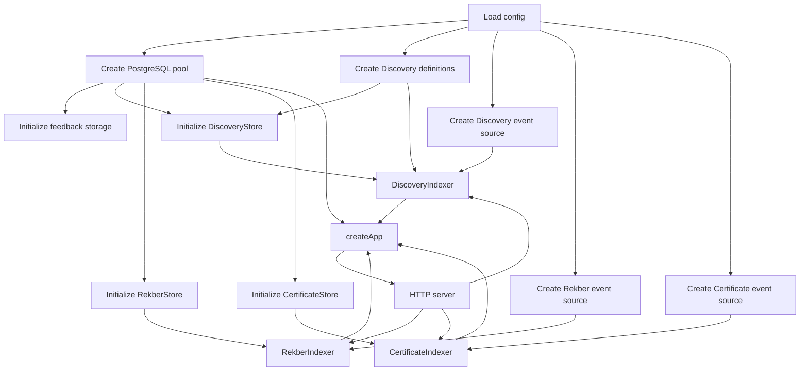
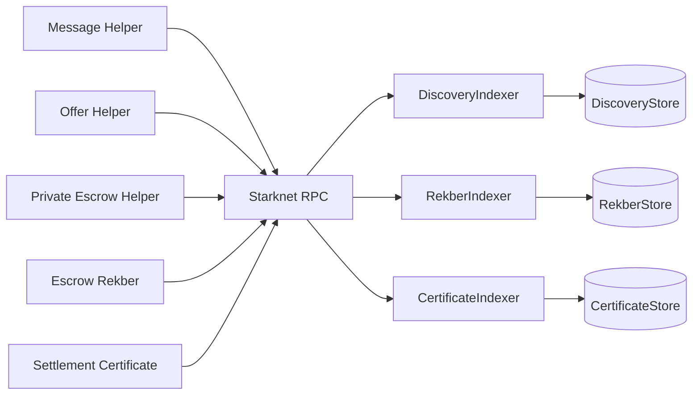
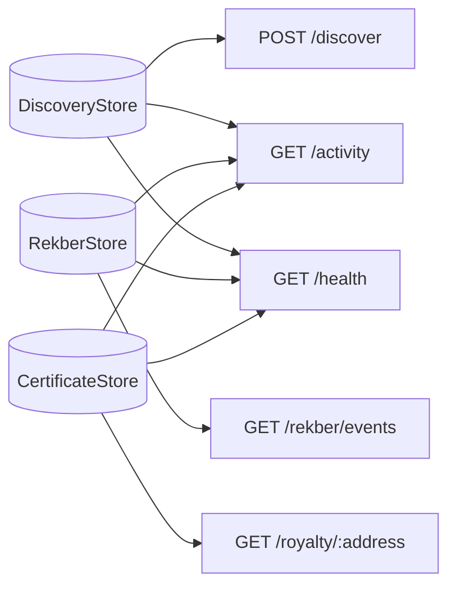
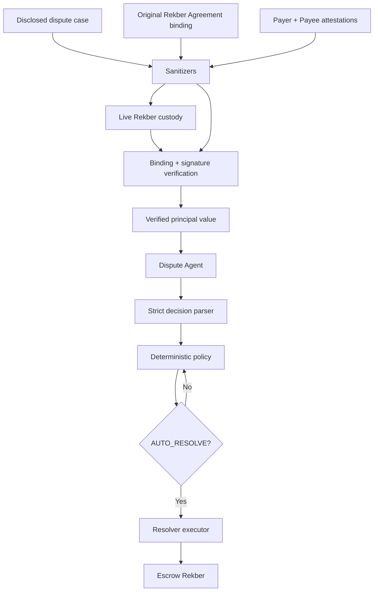

# VINSS Backend Architecture

This document describes the current backend architecture of VINSS.

The backend is no longer only a ciphertext-discovery relay.

It is now a PostgreSQL-backed Starknet indexing and application-service layer with several distinct trust domains:

```text
encrypted Deal Room discovery

public Rekber lifecycle indexing

public Settlement Certificate indexing

application read models

encrypted auxiliary transport/storage

optional remote Agent reasoning

optional privileged Dispute AutoResolve

legacy preview-only Loyalty
```

The architecture must keep those domains separate because they do not have the same privacy, authority, persistence, or failure model.

Executable backend source is the source of truth.

---

# Architectural Objective

The backend exists to perform infrastructure work that is inconvenient, expensive, stateful, or operationally unsuitable for a browser while preserving client-side control of private Deal Room material.

Core objective:

```text
make encrypted application state discoverable
without
requiring backend possession of Deal Room decryption keys
```

The backend also provides public indexed views of Rekber and Settlement Certificate state because those contracts intentionally expose public settlement information.

---

# Current Architectural Identity

A concise technical description is:

> VINSS backend is a PostgreSQL-backed Starknet indexing and application-service layer. Its core Deal Room discovery path stores and serves public encrypted helper payloads without decryption keys, while separate public-state indexers track Rekber lifecycle and Settlement Certificate events. Auxiliary services provide encrypted presence, encrypted attachments, feedback, global activity, and certificate-derived Royalty views. Optional Agent and Dispute services have separate disclosure and authority boundaries.

---

# Architecture Principles

The current design follows these principles:

```text
client owns Deal Room decryption

chain remains settlement authority

backend indexes public chain state

PostgreSQL is a cache/read model, not settlement authority

public Rekber state is not mislabeled as private

public Certificate state is not mislabeled as private

normal Agent is proposal-only

Dispute Agent is a separate explicit-disclosure workflow

AutoResolve authority is isolated from generic Agent tools

ephemeral services remain non-authoritative

feature-gated services fail closed by default where appropriate
```

---

# High-Level System



The LLM and resolver paths are conditional.

They are not required for core discovery/indexing.

---

# Important Diagram Precision

The arrows:

```text
backend -> LLM
backend -> resolver
```

do not mean every backend request reaches those systems.

They apply only to feature-gated:

```text
Agent
Dispute
```

flows.

The normal ciphertext Discovery indexer does not depend on an LLM.

---

# Current Source Layout

The current backend root includes:

```text
backend/src/
├── agent/
├── app.ts
├── config.ts
├── database.ts
├── dispute/
├── index.ts
├── indexer/
├── loyalty/
├── middleware/
├── openapi.ts
├── routes/
├── royalty/
└── types.ts
```

This top-level structure already demonstrates that the backend has multiple independent subsystems.

---

# Runtime Entry Points

The two primary runtime composition files are:

```text
backend/src/index.ts
backend/src/app.ts
```

Responsibilities differ.

---

# `index.ts`

`index.ts` owns process-level runtime composition:

```text
load configuration

create PostgreSQL pool

create indexer definitions

create stores

initialize required tables/checkpoints

create Starknet event sources

create indexers

create Express app

start HTTP server

start indexer loops

register graceful shutdown
```

---

# `app.ts`

`app.ts` owns HTTP application composition:

```text
mainnet trust-proxy setting

CORS

JSON body parser

request logging

route mounting

rate-limit middleware

feature-gated Agent / Dispute

feature-gated Loyalty
```

---

# Startup Architecture



All three indexer loops are started after the server begins listening.

---

# Startup Failure Boundary

Required database initialization includes:

```text
feedback storage

Discovery store + checkpoints

Rekber store + checkpoint

Certificate store + checkpoint
```

If this initialization fails, startup:

```text
logs database initialization failure

closes the PostgreSQL pool

sets process exitCode = 1

does not continue normal runtime
```

This is fail-closed for core persistent infrastructure.

---

# Attachment Table Exception

Encrypted attachment table initialization differs.

It is created lazily by the attachment router:

```text
first attachment PUT/GET
    ↓
CREATE TABLE IF NOT EXISTS encrypted_attachments
```

Therefore:

```text
backend startup success
```

does not imply:

```text
attachment table has already been initialized
```

---

# Process Lifecycle

The runtime handles:

```text
SIGTERM
SIGINT
```

Shutdown sequence:

```text
set shuttingDown guard

request stop for:
  DiscoveryIndexer
  RekberIndexer
  CertificateIndexer

wait for indexer loops

close HTTP server

close PostgreSQL pool
```

---

# Runtime Categories

The current backend can be divided into six architecture categories.

## A. Persistent chain indexers

```text
DiscoveryIndexer
RekberIndexer
CertificateIndexer
```

## B. Persistent HTTP read models

```text
/discover
/rekber/events
/activity
/royalty/:address
/health
```

## C. Auxiliary privacy-supporting services

```text
encrypted presence
encrypted attachments
```

## D. Application utility services

```text
feedback
OpenAPI
Swagger
```

## E. Optional AI / privileged services

```text
Agent
Dispute Agent
AutoResolve executor
```

## F. Legacy preview service

```text
Loyalty
```

---

# Three Indexer Families

A major architectural fact is that VINSS now runs three independent indexer families.

They have different source contracts and different data models.

---

# Discovery Indexer

Kinds:

```text
message
offer
escrow
```

Source contracts:

```text
VinssMessageHelper

VinssOfferHelper

VinssPrivateEscrowHelper
```

Source events:

```text
MessageCommitted

OfferActionCommitted

PrivateEscrowActionCommitted
```

---

# Rekber Indexer

Source:

```text
VinssEscrowRekber
```

Current lifecycle events:

```text
EscrowRekberCustodyFunded

EscrowRekberCustodyReleased

EscrowRekberCustodyRefunded

EscrowRekberCustodyResolved
```

Mapped backend kinds:

```text
funded
released
refunded
resolved
```

---

# Certificate Indexer

Source:

```text
VinssSettlementCertificate
```

Current event:

```text
SettlementCertificateIssued
```

---

# Indexer Separation Diagram



The three loops share configuration such as polling/range settings, but they do not share one event schema.

---

# Why Discovery Is Separate

Encrypted helper actions have a two-stage retrieval model.

Event gives:

```text
action locator
payload commitment
routing tags
```

Then helper getters provide:

```text
record metadata
ciphertext chunks
```

The backend hydrates those chunks and stores them.

---

# Discovery Flow

```text
commitment event
    ↓
action locator
    ↓
record getter
    ↓
chunk count
    ↓
chunk getter per index
    ↓
ciphertextChunks[]
    ↓
DiscoveryStore
```

---

# Discovery Authority

The backend does not invent encrypted actions.

Its authority source is:

```text
public Starknet helper state
```

PostgreSQL is a persistent cache/read model.

---

# Discovery Record Model

Persistent records include:

```text
network
kind
contract_address
action_locator
payload_commitment
sender_tag
recipient_tag
ciphertext_chunks[]
block_number
transaction_hash
indexed_at
```

---

# Discovery Primary Identity

A Discovery record is keyed by:

```text
network
kind
contract address
action locator
```

This prevents simple collisions across:

```text
Sepolia
Mainnet
```

and across different helper deployments.

---

# Discovery Checkpoint Identity

Each Discovery definition also has a checkpoint.

Conceptual identity:

```text
<network>:<kind>:<contractAddress>
```

---

# Discovery Checkpoint State

Stored fields include:

```text
start block
next block
last indexed block
latest observed block
status
updated timestamp
```

Status:

```text
idle
syncing
caught_up
error
```

---

# Discovery Start-Block Invariant

The configured start block must match the stored checkpoint's historical start block.

If they differ, initialization throws.

This avoids silently changing historical indexing boundaries.

---

# Discovery Polling Strategy

Current loop:

```text
read latest Starknet block

for each Discovery definition:
    read checkpoint

    if already beyond latest:
        caught_up

    otherwise:
        scan block range

        identify missing locators

        fetch ciphertext chunks concurrently

        insert records

        advance checkpoint
```

---

# Discovery Fetch Concurrency

Ciphertext hydration uses configurable concurrency.

Current configuration field:

```text
INDEXER_FETCH_CONCURRENCY
```

This limits parallel helper getter work.

---

# Discovery Defensive Chunk Bound

Backend event source defines a defensive maximum:

```text
4096 chunks
```

This is not the protocol limit.

The smart contracts enforce the canonical smaller envelope maximum.

The backend constant is only a read-side defensive bound.

---

# Rekber Architecture

Rekber indexing is fundamentally different from Private Escrow discovery.

Private Escrow Helper:

```text
encrypted coordination
```

Escrow Rekber:

```text
public custody / lifecycle state
```

---

# Canonical Separation

```text
Private Escrow Helper
    ↓
DiscoveryIndexer
    ↓
kind = escrow
    ↓
ciphertext

Escrow Rekber
    ↓
RekberIndexer
    ↓
funded/released/refunded/resolved
    ↓
public settlement metadata
```

---

# Rekber Funded Decode

Current indexed fields include:

```text
custody commitment
token
amount
refundAfter
timestamp
block number
transaction hash
```

---

# Rekber Released Decode

Current indexed fields include:

```text
custody commitment
output note ID
timestamp
block number
transaction hash
```

---

# Rekber Refunded Decode

Current indexed fields include:

```text
custody commitment
output note ID
timestamp
block number
transaction hash
```

---

# Rekber Resolved Decode

Current indexed fields include:

```text
custody commitment
resolution commitment
payer resolution amount
payee resolution amount
timestamp
block number
transaction hash
```

---

# Rekber Public-State Rule

These values are public chain data.

The backend must not describe them as hidden merely because:

```text
VINSS also has encrypted coordination
```

---

# Rekber Indexer Identity

Conceptually:

```text
<network>:rekber:<contractAddress>
```

The indexer has one persistent checkpoint for the configured canonical Rekber deployment.

---

# Rekber Loop

The Rekber loop:

```text
read latest block

read Rekber checkpoint

scan canonical Rekber contract
for:
    funded
    released
    refunded
    resolved

insert decoded events

advance checkpoint
```

---

# Rekber Error State

On a sync failure after observing a latest block, the indexer:

```text
sets checkpoint status = error

stores latest observed block

logs reduced error name
```

A later loop can retry.

---

# Rekber Latest-Block Failure

If only the:

```text
getBlockNumber
```

call fails, the loop logs the failure and exits that cycle.

This is not exactly the same error path as:

```text
sync failure after latest block observed
```

Documentation/monitoring should preserve that distinction.

---

# Certificate Architecture

The Certificate indexer tracks:

```text
SettlementCertificateIssued
```

on the configured certificate contract.

---

# Certificate Event Layout

Expected keys:

```text
selector
tokenId
recipient
```

Expected data:

```text
custodyCommitment
role
settledAt
issuedAt
```

---

# Certificate Role Validation

Backend accepts only:

```text
1
2
```

as valid roles.

Malformed events are skipped.

---

# Certificate Safe Number Validation

The indexer converts:

```text
role
settledAt
issuedAt
```

through safe integer checks.

Unsafe numeric values cause decode rejection.

---

# Certificate Indexed Model

Stored event fields include:

```text
network
contractAddress
tokenId
recipient
custodyCommitment
role
settledAt
issuedAt
blockNumber
transactionHash
indexedAt
```

---

# Certificate Privacy Rule

Settlement Certificates are public credentials.

Backend indexing does not make these fields public; they are already public on-chain.

The indexer simply improves queryability.

---

# Certificate vs Rekber

A successful Rekber settlement and a certificate issuance are separate events.

```text
Rekber settlement
    !=
certificate already issued
```

Certificate claim is optional and can happen later.

Therefore VINSS needs:

```text
separate Rekber index
separate Certificate index
```

---

# PostgreSQL Architecture

PostgreSQL is the durable backend state layer.

Current architecture uses one connection pool.

Pool max:

```text
10
```

---

# PostgreSQL Responsibilities

Persistent data includes:

```text
Discovery records

Discovery checkpoints

Rekber events

Rekber checkpoint

Certificate events

Certificate checkpoint

Feedback

Encrypted attachments
```

---

# PostgreSQL Does Not Own Canonical Settlement

PostgreSQL is not authoritative for:

```text
custody ownership

Rekber settlement validity

certificate eligibility

resolver authority

fund balances
```

Those remain on-chain.

---

# Database Failure Impact

A PostgreSQL outage can affect:

```text
/discover

/rekber/events

/activity

/royalty

/health status retrieval

attachments

feedback

indexer persistence
```

The underlying chain state still exists.

---

# Database Credential Logging

Database pool error logging intentionally avoids printing:

```text
connection details
environment values
credentials
```

---

# HTTP Read-Model Architecture

The persistent stores feed several API read models.



---

# `/discover`

Reads only DiscoveryStore.

It returns:

```text
encrypted helper payload records
```

---

# `/rekber/events`

Reads RekberStore.

It returns:

```text
public Rekber lifecycle records
```

---

# `/activity`

Combines:

```text
DiscoveryStore
RekberStore
CertificateStore
```

into a global presentation-oriented timeline.

---

# `/royalty/:address`

Reads CertificateStore-derived recipient statistics.

It then applies backend application policy.

---

# `/health`

Reads the three indexer checkpoint families.

It does not query every service dependency.

---

# Global Activity Architecture

Global Activity is a merged read model.

Base kinds:

```text
message
offer
escrow

rekber_funded
rekber_released
rekber_refunded
rekber_resolved

certificate_issued
```

---

# Activity Public Metadata

Discovery-derived activity intentionally omits ciphertext.

It exposes metadata such as:

```text
kind
contract address
action locator
block
transaction
indexed time
```

---

# Activity Rekber Extension

Rekber activity can contain event-specific public fields.

---

# Activity Certificate Extension

Certificate activity can contain:

```text
tokenId
recipient
custodyCommitment
role
settledAt
issuedAt
```

---

# Activity Is Not Canonical Domain Storage

`/activity` is not the canonical detailed query surface for every subsystem.

Use:

```text
/discover
```

for encrypted helper payloads.

Use:

```text
/rekber/events
```

for Rekber lifecycle details.

---

# Royalty Architecture

Royalty is a backend-derived read model.

It is not the old Loyalty service.

---

# Royalty Source

Authority input:

```text
indexed SettlementCertificateIssued events
```

The client cannot award itself a certificate through the Royalty API.

---

# Royalty Calculation

Current application logic uses:

```text
BASE_SETTLEMENT_POINTS = 200
```

and certificate-count multipliers.

This logic is centralized backend policy.

It is not a smart-contract invariant.

---

# Royalty Trust Split

```text
certificate event
    -> on-chain-derived evidence

points formula
    -> backend application policy
```

---

# Royalty Conversion Boundary

Current API reports:

```text
coming_soon
```

for conversion.

No token conversion occurs in current Royalty service.

---

# Legacy Loyalty Architecture

Legacy Loyalty is different.

Current behavior:

```text
client writes award event

backend stores in memory

no durable database authority

no on-chain event verification
```

---

# Loyalty Feature Gate

Mounted only if:

```text
LOYALTY_ENABLED=true
```

Default:

```text
false
```

---

# Loyalty Authority Rule

Legacy Loyalty must not be used as:

```text
financial balance
token ledger
settlement authority
```

under current architecture.

---

# Presence Architecture

Presence is an encrypted ephemeral relay.

It stores only:

```text
channelId
eventId
iv
ciphertext
createdAt
expiresAt
```

---

# Presence Storage

Storage:

```text
process-local Map
```

Not PostgreSQL.

---

# Presence Persistence

Backend restart loses current presence state.

Multiple replicas do not share presence automatically.

---

# Presence Security Model

The backend does not need:

```text
room key
pairwise key
wallet address
typing plaintext
read plaintext
```

Presence confidentiality depends on client encryption.

---

# Presence Is Not Settlement Evidence

Presence data should never be used as:

```text
funding proof

fulfillment proof

release proof

certificate proof
```

It is UX coordination only.

---

# Attachment Architecture

Attachments are opaque encrypted binary objects stored in PostgreSQL.

---

# Attachment Data Path

```text
frontend encrypts bytes
    ↓
PUT /attachments/:id
    ↓
backend stores ciphertext
    ↓
GET /attachments/:id
    ↓
frontend decrypts bytes
```

---

# Attachment Capability

Retrieval uses:

```text
x-vinss-attachment-token
```

The backend stores only:

```text
SHA-256(token)
```

---

# Attachment Authority Rule

The token is a service capability.

It is not:

```text
wallet authentication
on-chain ownership
room membership proof
```

---

# Attachment Storage Limit

Current maximum:

```text
20 MiB
```

---

# Attachment Failure Boundary

If database storage is unavailable, attachment API returns:

```text
503
```

This does not affect on-chain settlement truth.

---

# Feedback Architecture

Feedback is a plaintext application service.

This is intentionally outside the ciphertext-only privacy promise.

---

# Feedback Persistence

Stored in PostgreSQL.

Current data includes:

```text
outcome
role
deal type
network
rating
comment
timestamp
```

---

# Feedback Email

Optional best-effort notification via Resend.

Database insert occurs before email attempt.

Email failure does not roll back feedback.

---

# Feedback Security Boundary

Users should not put:

```text
room secret
channel key
wallet private key
dispute evidence
sensitive deal content
```

into feedback comments.

---

# Agent Architecture

Normal Agent is an optional remote-model reasoning subsystem.

Mounted only when:

```text
AGENT_ENABLED=true
```

---

# Mainnet Agent Default

Current default:

```text
mainnet
    -> Agent disabled

non-mainnet
    -> Agent enabled
```

unless explicitly overridden.

---

# Normal Agent Data Path

```text
frontend explicit prompt
    +
caller context
    ↓
server context sanitizer
    ↓
selected public skill
    ↓
provider selection/fallback
    ↓
remote LLM
    ↓
skill-scoped local tools
    ↓
answer/proposal
```

---

# Normal Agent Privacy Boundary

Automatic context is minimized.

Explicit user prompt is plaintext provider input.

Therefore:

```text
normal Agent
```

is not a ciphertext-only path.

---

# Normal Agent Tool Authority

Generic Agent tools can:

```text
inspect inferred stage

analyze explicitly available Offer information

draft message

draft Offer

draft counter

prepare escrow proposal

review Rekber proposal

calculate illustrative fee
```

They cannot:

```text
sign

send transaction

fund Rekber

release Rekber

refund Rekber

claim Certificate

authorize resolver split
```

---

# Agent Proposal Boundary

Proposal objects use:

```text
requiresApproval: true
```

but the deeper architecture guarantee is:

```text
no generic execution tool exists
```

Frontend/wallet remains execution authority.

---

# Agent Provider Architecture

Supported provider IDs:

```text
groq
openai
anthropic
qwen
```

Selection:

```text
auto
```

also exists.

---

# Provider Failure Isolation

If one provider fails:

```text
next configured provider may be tried
```

if fallback order permits.

Core indexing is unaffected.

---

# Provider Privacy Consequence

Fallback can cause explicit Agent prompt data to reach multiple configured providers sequentially if earlier providers fail.

This must be understood as a deployment privacy property.

---

# Dedicated Dispute Architecture

Dispute is not simply another public `/agent` skill.

Internal Agent registry contains:

```text
dispute
```

but public Agent skill validation excludes it.

---

# Dispute Routes

Mounted only when Agent feature is enabled:

```text
POST /dispute/challenge
POST /dispute/evaluate
```

---

# Dispute Data Boundary

Dispute can intentionally receive:

```text
accepted terms

payer statement

payee statement

evidence

wallet addresses

principal snapshot

fulfillment snapshot

original Rekber Agreement signatures
```

This is explicit plaintext disclosure.

---

# Dispute Consent

Each party packet requires:

```text
consentToAgentReview = true
```

---

# Dispute Verification Layers

The flow verifies:

```text
sanitized case shape

live Rekber custody

original Rekber Agreement binding

payer/payee dispute attestations

trusted principal valuation where available

LLM decision format

deterministic policy
```

---

# Dispute Architecture Diagram



The Agent's natural-language output is not used directly as transaction authority.

---

# Dispute Skill Authority

Generic internal `dispute` skill has only:

```text
inspect_deal_state
```

tool access.

It has no signer.

---

# Resolver Executor Authority

Privileged resolution authority lives in a separate component.

It can use:

```text
DISPUTE_RESOLVER_ADDRESS
DISPUTE_RESOLVER_PRIVATE_KEY
```

only when AutoResolve is enabled and configuration is valid.

---

# Resolver Key Is Not User Key

The resolver credential must never be confused with:

```text
payer key
payee key
wallet seed
room key
channel key
```

It is a dedicated service authority.

---

# Resolver Contract Match

Before submitting authorization, executor reads:

```text
get_dispute_resolver
```

from canonical Rekber.

Configured backend resolver must match the immutable contract resolver.

---

# Resolver Execution Rule

Only attempted when deterministic policy returns:

```text
AUTO_RESOLVE
```

---

# Resolver Split

Backend computes:

```text
payerAmount

payeeAmount = principal - payerAmount
```

so rounding does not lose principal units.

---

# Resolver Re-Race Handling

If submission throws, executor re-reads Rekber state.

If split has become authorized in the meantime, it returns:

```text
already_authorized
```

instead of blindly failing.

---

# Trust Boundaries

The system has multiple trust zones.

---

# Client Trust Zone

Client may hold:

```text
room secret

channel key

pairwise key

decrypted Message history

decrypted Offer terms

Rekber capability secrets

Certificate claim secret

attachment decryption key
```

---

# Core Backend Trust Zone

Core backend may hold:

```text
public Starknet metadata

ciphertext

opaque routing tags

indexed public Rekber data

indexed public Certificate data

PostgreSQL credentials

attachment token hashes
```

---

# Agent Trust Zone

Agent subsystem additionally processes:

```text
explicit user prompt

sanitized automatic context

provider API credentials
```

---

# Dispute Trust Zone

Dispute subsystem additionally processes:

```text
explicit dispute plaintext

party signatures

original Rekber Agreement bindings

dedicated resolver credential
```

if enabled.

---

# External LLM Trust Zone

Remote provider may receive:

```text
system prompt

skill prompt

explicit Agent request

sanitized context

tool results
```

For Dispute:

```text
explicit dispute evidence context
```

can also reach the selected provider.

---

# Starknet Trust Zone

Canonical contracts define:

```text
custody truth

fund movements

settlement state

certificate issuance

resolver authority

event schemas
```

---

# PostgreSQL Trust Zone

Database controls backend availability/read-model integrity.

It does not define chain truth.

---

# Trust Boundary Table

| Component | Holds private Deal Room plaintext? | Can move participant funds? | Canonical settlement authority? |
|---|---:|---:|---:|
| Frontend | Yes, locally | Through wallet actions | No |
| Wallet / Ready | Transaction material | Yes, with authorization | No |
| Helper contracts | Ciphertext only | Fee/output mechanics only | No for Rekber principal |
| Rekber contract | Public custody state | Yes by contract rules | Yes |
| Certificate contract | Public credential state | No Rekber principal movement | Yes for certificate ownership |
| Discovery backend | No plaintext required | No | No |
| Presence | No plaintext required | No | No |
| Attachments | Ciphertext only by design | No | No |
| Normal Agent | Explicit prompt may be plaintext | No | No |
| Dispute Agent | Explicit evidence plaintext | No generic signer | No |
| Resolver executor | No user key | Can authorize Rekber split | Privileged caller, contract remains authority |
| PostgreSQL | Indexed/cache data | No | No |

---

# Core Architectural Invariant

The central privacy invariant remains:

```text
ability to find encrypted application records
!=
ability to decrypt those records
```

---

# Second Architectural Invariant

A second invariant is now equally important:

```text
encrypted coordination
!=
public settlement state
```

VINSS cannot honestly describe public Rekber/certificate metadata as encrypted Deal Room data.

---

# Third Architectural Invariant

A third invariant:

```text
AI recommendation
!=
transaction authorization
```

Normal Agent proposals cannot bypass wallet/contract rules.

---

# Fourth Architectural Invariant

For Dispute:

```text
LLM decision
!=
resolver execution permission
```

Policy and verification layers sit between them.

---

# Public vs Private Data Architecture

## Encrypted helper data

```text
Message ciphertext

Offer ciphertext

Private Escrow coordination ciphertext

opaque sender tag

opaque recipient tag

payload commitment

action locator
```

## Public Rekber data

```text
custody commitment

token

principal amount

refund deadline/timestamp data

release/refund output note

resolution commitment

payer/payee authorized split
```

## Public Certificate data

```text
token ID

recipient

custody commitment

role

settled timestamp

issued timestamp
```

---

# Backend Does Not Add Cryptographic Privacy

Indexing public chain data into PostgreSQL does not make it:

```text
more private
```

The backend may make it:

```text
easier to query
```

That distinction matters.

---

# Configuration Architecture

Central configuration validates:

```text
network

CORS origin

RPC URL

PostgreSQL URL

contract addresses

start blocks

indexer tuning

Agent settings

Dispute settings

feature flags

rate limits
```

---

# Canonical Network

Accepted:

```text
sepolia
mainnet
```

---

# Contract Configuration

Required:

```text
PRIVACY_POOL_ADDRESS

MESSAGE_HELPER_ADDRESS

OFFER_HELPER_ADDRESS

PRIVATE_ESCROW_HELPER_ADDRESS

ESCROW_REKBER_ADDRESS

SETTLEMENT_CERTIFICATE_ADDRESS
```

---

# Start Blocks

Required:

```text
MESSAGE_HELPER_START_BLOCK

OFFER_HELPER_START_BLOCK

PRIVATE_ESCROW_HELPER_START_BLOCK

ESCROW_REKBER_START_BLOCK

SETTLEMENT_CERTIFICATE_START_BLOCK
```

---

# Indexer Tuning

Current configuration:

```text
INDEXER_POLL_INTERVAL_MS

INDEXER_BLOCK_RANGE

INDEXER_EVENT_PAGE_SIZE

INDEXER_FETCH_CONCURRENCY
```

---

# Feature Flags

```text
AGENT_ENABLED

LOYALTY_ENABLED
```

---

# Dispute Privileged Config

```text
DISPUTE_AUTO_RESOLVE_ENABLED

DISPUTE_RESOLVER_ADDRESS

DISPUTE_RESOLVER_PRIVATE_KEY
```

When AutoResolve is enabled, resolver address and private key are mandatory.

---

# Mainnet Configuration Guards

For:

```text
STARKNET_NETWORK=mainnet
```

configuration requires:

```text
HTTPS CORS_ORIGIN
```

and rejects RPC URL identities containing:

```text
sepolia
goerli
testnet
```

---

# Mainnet Proxy Architecture

On mainnet the app sets:

```text
trust proxy = 1
```

The architecture assumes:

```text
one managed reverse proxy
```

in front of the app.

This directly affects rate-limit client identity.

---

# Proxy Assumption Risk

If production topology differs from:

```text
one trusted proxy
```

the `req.ip` trust model may be wrong.

This must be verified at deployment level.

---

# Rate-Limit Architecture

Current rate limiter is:

```text
fixed-window

per backend-observed IP identity

in-memory

process-local
```

---

# Rate-Limited Areas

```text
/discover

/agent

/dispute

/feedback
```

Feedback has separate hardcoded settings.

---

# Multi-Replica Rate-Limit Boundary

With multiple replicas:

```text
each process has independent counters
```

unless external infrastructure adds shared enforcement.

---

# API Architecture

Always-mounted API includes:

```text
/health

/openapi.json

/docs

/discover

/rekber/events

/activity

/feedback

/royalty/:address

/presence/*

/attachments/*
```

---

# Optional API

When Agent enabled:

```text
/agent/providers

/agent

/dispute/challenge

/dispute/evaluate
```

---

# Legacy Optional API

When Loyalty enabled:

```text
/loyalty/config

/loyalty/:subject

/loyalty/events
```

---

# OpenAPI Architecture

OpenAPI is static/in-process application documentation.

It is not generated directly from router source.

Therefore drift can occur.

---

# Current OpenAPI Drift

Current runtime has executable paths not yet represented in OpenAPI, including:

```text
/rekber/events

/royalty/:address

/attachments/:id

/dispute/challenge

/dispute/evaluate
```

This is a documentation-layer architecture gap.

---

# Health Architecture

Health aggregates status from:

```text
DiscoveryIndexer

RekberIndexer

CertificateIndexer
```

---

# Health `ok`

No tracked checkpoint is currently:

```text
error
```

---

# Health `degraded`

Any tracked checkpoint:

```text
error
```

or status retrieval itself fails.

---

# Health Is Not Full Readiness

Health does not verify:

```text
browser crypto

wallet signing

Ready proving

LLM provider

attachment capability correctness

two-wallet E2E

mainnet contract bytecode equivalence
```

---

# Failure Isolation

A robust mental model is:

```text
chain truth
backend persistence
auxiliary UX
AI
```

are separate layers.

---

# LLM Outage

Can break:

```text
Agent
Dispute Agent evaluation
```

It should not break:

```text
Discovery indexing

Rekber indexing

Certificate indexing

presence

attachments

feedback
```

except via unrelated shared infrastructure failures.

---

# Presence Restart

Can lose:

```text
ephemeral presence
```

It does not lose:

```text
PostgreSQL index data

chain settlement
```

---

# PostgreSQL Outage

Can break many backend APIs.

It does not erase public chain state.

---

# RPC Outage

Can stall:

```text
indexer progress

Dispute chain verification

resolver execution
```

Existing PostgreSQL read models may remain available depending on route/query behavior.

---

# Feedback Email Outage

Can fail notification.

Stored feedback remains.

---

# Indexer Lag

Means:

```text
backend read model may be stale
```

It does not mean:

```text
chain event did not happen
```

---

# Backend Reorg Boundary

Current indexers are primarily:

```text
forward-scanning

checkpoint-based

deduplicated
```

Documentation must not claim full Starknet reorg reconciliation unless explicit rollback/finality behavior exists.

---

# Reorg Production Concern

Mainnet hardening may require:

```text
finality delay

reorg detection

rollback/replay

checkpoint correction

duplicate/replacement event handling
```

depending on operational requirements.

---

# Security Architecture

Security is layered.

Current protections include:

```text
strict config parsing

strict Starknet address parsing

Discovery privacy allowlist

minimal request logging

no request-body logging

feature gates

in-memory rate limiting

hashed attachment capability

timing-safe token comparison

Agent skill allowlists

Agent context allowlist

no generic Agent transaction tools

Dispute consent

Dispute signature verification

Rekber Agreement binding verification

live custody re-read

resolver contract match

mainnet HTTPS CORS guard
```

---

# Discovery Security Boundary

`/discover` does not authenticate a room.

That is deliberate.

Ciphertext is public chain data.

Confidentiality depends on encryption.

---

# Attachment Security Boundary

Attachment capability controls backend retrieval.

Ciphertext confidentiality depends on client encryption.

---

# Presence Security Boundary

Presence channel obscurity + encryption provides coordination privacy.

No wallet signature is checked.

---

# Agent Security Boundary

Normal Agent security depends on:

```text
context sanitizer

skill allowlist

tool allowlist

absence of execution tools

frontend approval

wallet confirmation
```

---

# Dispute Security Boundary

Dispute security adds:

```text
explicit consent

party attestations

original Rekber signatures

live custody checks

policy threshold

resolver match
```

---

# Sensitive Logging Rule

Never log:

```text
room secrets

channel keys

wallet private keys

resolver private key

provider API keys

dispute evidence

dispute signatures

attachment capability token

raw provider errors that may echo prompt content
```

---

# Request Logging Precision

Current global logger emits:

```text
METHOD PATH
```

only.

Some route-specific logging exists, such as attachment GET status logging.

This should remain body-free.

---

# Data Durability Matrix

| Data | Persistence |
|---|---|
| Discovery records | PostgreSQL |
| Discovery checkpoints | PostgreSQL |
| Rekber events | PostgreSQL |
| Rekber checkpoint | PostgreSQL |
| Certificate events | PostgreSQL |
| Certificate checkpoint | PostgreSQL |
| Encrypted attachments | PostgreSQL |
| Feedback | PostgreSQL |
| Presence | In-memory |
| Legacy Loyalty | In-memory |
| Rate-limit counters | In-memory |

---

# Authority Matrix

| Data | Canonical authority |
|---|---|
| Message ciphertext commitment | Smart contract |
| Offer ciphertext commitment | Smart contract |
| Private Escrow action commitment | Smart contract |
| Rekber custody | Rekber contract |
| Rekber funded/released/refunded/resolved state | Rekber contract |
| Settlement Certificate issuance | Certificate contract |
| Backend index checkpoint | PostgreSQL |
| Royalty point formula | Backend application logic |
| Presence | Backend ephemeral runtime |
| Attachment ciphertext | Backend PostgreSQL service |
| Feedback | Backend PostgreSQL application data |
| Agent proposal | Advisory runtime output |
| AutoResolve authorization | Rekber contract after privileged resolver call |

---

# Frontend / Backend Boundary

Frontend owns:

```text
room-secret handling

channel/pairwise key derivation

payload encryption

payload decryption

local identity matching

wallet interaction

Ready request construction

user approval UI
```

---

# Backend / Frontend Anti-Pattern

Avoid moving:

```text
roomSecret

channel key

plaintext room history
```

to backend merely to simplify frontend implementation.

That would weaken the core architecture.

---

# Backend / Contract Boundary

Contracts define:

```text
event schema

commitment rules

custody rules

fee rules

settlement lifecycle

capability commitments

certificate eligibility

resolver authority
```

Backend defines:

```text
indexing

cache schema

API validation

pagination

rate limits

feature flags

application point derivation

Agent sanitization

auxiliary storage
```

---

# Backend / Wallet Boundary

Normal backend does not sign participant transactions.

Flow:

```text
frontend
    ↓
wallet
    ↓
STRK20 / Starknet
    ↓
contracts
```

---

# Resolver Exception

Dedicated Dispute AutoResolve is the intentional exception:

```text
backend-held resolver authority
```

may submit:

```text
authorize_dispute_resolution
```

when policy permits.

This must stay isolated.

---

# Backend / LLM Boundary

LLM provider is not required for:

```text
Discovery

Rekber indexing

Certificate indexing

Royalty

Activity

Presence

Attachments

Feedback
```

---

# Backend / OpenAPI Boundary

OpenAPI describes API.

It does not create API behavior.

Runtime route source wins.

---

# Architectural Non-Goals

The current backend is not designed to be:

```text
a custodial wallet

a full plaintext chat server

a canonical settlement database

a certificate issuer

a substitute for smart-contract authorization

a durable presence broker

a production reward ledger through legacy Loyalty

an LLM-controlled treasury
```

---

# Core Read Flow

```text
Starknet
    ↓
background indexers
    ↓
PostgreSQL
    ↓
backend read APIs
    ↓
frontend
```

---

# Core Write Flow

Normal Deal Room writes bypass backend settlement authority:

```text
frontend
    ↓
wallet / Ready
    ↓
Privacy Pool / contracts
```

Backend later indexes resulting public state.

---

# Attachment Write Flow

Separate service write:

```text
frontend encrypted bytes
    ↓
backend
    ↓
PostgreSQL
```

No chain transaction.

---

# Feedback Write Flow

```text
frontend plaintext feedback
    ↓
backend
    ↓
PostgreSQL
    ↓
optional email
```

---

# Agent Flow

```text
frontend explicit prompt
    ↓
backend sanitizer
    ↓
remote provider
    ↓
proposal
    ↓
frontend approval
    ↓
wallet
```

---

# Dispute Flow

```text
both parties disclose evidence
    ↓
backend verifies case/binding/signatures
    ↓
Dispute Agent
    ↓
deterministic policy
    ↓
optional resolver transaction
```

---

# Production Architecture Checklist

Before mainnet, verify:

```text
Network configured correctly.

RPC endpoint verified.

PostgreSQL reachable.

Database backup/recovery defined.

All canonical contract addresses verified.

All start blocks verified.

Discovery checkpoints healthy.

Rekber checkpoint healthy.

Certificate checkpoint healthy.

Indexer catch-up confirmed.

Indexer lag monitored.

Reorg strategy understood.

Reverse-proxy topology matches trust proxy setting.

Rate-limit strategy appropriate for replica count.

CORS origin correct.

AGENT_ENABLED intentional.

LOYALTY_ENABLED intentional.

Dispute AutoResolve intentional.

Resolver key stored securely.

Resolver address matches Rekber contract.

Provider credentials stored securely.

Attachment retention policy defined.

Presence process-local behavior accepted.

Feedback retention policy defined.

OpenAPI synchronized.

Logs inspected for secret leakage.

Two-wallet live integration tested.
```

---

# Architecture Test Boundaries

Unit/integration tests can validate:

```text
event decoding

store behavior

sanitization

skill enforcement

policy calculations

Royalty calculations

request validation
```

---

# Tests Cannot Alone Prove

```text
Railway/network uptime

managed PostgreSQL durability

provider retention

reverse-proxy correctness

real mainnet RPC stability

wallet compatibility

Ready proving

two-wallet E2E
```

---

# Observability Architecture

Useful operational signals include:

```text
checkpoint status

latest observed block

last indexed block

indexer lag

request failures

database failures

RPC failures

provider failures

resolver execution status

attachment storage errors
```

---

# Indexer Lag Concept

For a checkpoint with:

```text
latestObservedBlock
lastIndexedBlock
```

an operator can reason about:

```text
latestObservedBlock - lastIndexedBlock
```

as one lag indicator.

Exact observability implementation should be documented separately.

---

# Mainnet Architecture Vocabulary

Avoid saying:

```text
backend is mainnet ready
```

without qualifiers.

Prefer:

```text
mainnet configuration validated

indexers caught up

database healthy

resolver disabled

Agent disabled

live activity verified

live Rekber event verified

live Certificate event verified
```

---

# Accurate Privacy Language

Accurate:

> Core Message, Offer, and Private Escrow discovery operates on public ciphertext and does not require Deal Room decryption keys.

Accurate:

> Rekber lifecycle and Settlement Certificate data indexed by the backend are public chain data.

Accurate:

> Normal Agent receives an explicit plaintext instruction plus sanitized automatic context.

Accurate:

> Dispute is a separate explicit-disclosure workflow and may use a privileged resolver account when AutoResolve is enabled.

---

# Inaccurate Privacy Language

Avoid:

```text
The backend never receives plaintext.

All settlement data is private.

Rekber amounts are encrypted.

Certificate ownership is hidden.

The Agent reads the whole private room automatically.

Presence proves participant identity.

Attachments are on-chain assets.

PostgreSQL is the settlement ledger.
```

---

# Runtime Source Map

Start here:

```text
backend/src/index.ts
backend/src/app.ts
backend/src/config.ts
backend/src/database.ts
backend/src/types.ts
```

---

# Discovery Source Map

```text
backend/src/indexer/definitions.ts
backend/src/indexer/poolEvents.ts
backend/src/indexer/service.ts
backend/src/indexer/store.ts
backend/src/routes/discover.ts
```

---

# Rekber Source Map

```text
backend/src/indexer/rekber.ts
backend/src/indexer/rekberStore.ts
backend/src/routes/rekber.ts
```

---

# Certificate Source Map

```text
backend/src/indexer/certificate.ts
backend/src/indexer/certificateStore.ts
```

---

# Activity / Royalty Source Map

```text
backend/src/routes/activity.ts
backend/src/royalty/routes.ts
backend/src/royalty/service.ts
```

---

# Auxiliary Source Map

```text
backend/src/routes/presence.ts
backend/src/routes/attachments.ts
backend/src/routes/feedback.ts
backend/src/middleware/rateLimit.ts
```

---

# Agent Source Map

```text
backend/src/routes/agent.ts
backend/src/agent/
```

---

# Dispute Source Map

```text
backend/src/routes/dispute.ts
backend/src/dispute/
```

---

# Legacy Loyalty Source Map

```text
backend/src/loyalty/
```

---

# Architectural Review Checklist

When backend source changes, ask:

```text
Did a new route appear?

Did an existing route gain side effects?

Did a new persistent store appear?

Did a new indexer appear?

Did event schema change?

Did public/private classification change?

Did a feature flag change?

Did a default change?

Did a new secret enter backend config?

Did any client decryption key move server-side?

Did Agent tool authority change?

Did Dispute resolver authority change?

Did PostgreSQL become authoritative for something it should not?

Did an in-memory service accidentally become production-critical?

Did OpenAPI remain synchronized?

Did health cover the new critical subsystem?

Did shutdown stop the new loop/service?

Did tests cover the boundary?
```

---

# Architecture Decision: Separate Private Coordination from Public Settlement

This is one of the strongest current design decisions.

```text
Message / Offer / Private Escrow
    -> encrypted application coordination

Escrow Rekber
    -> public custody and settlement lifecycle

Settlement Certificate
    -> public credential
```

Backend mirrors this instead of collapsing all activity into one private abstraction.

---

# Architecture Decision: Persistent Indexing

Persistent indexing solves browser problems such as:

```text
slow historical event scans

repeated RPC reads

mobile-resource limits

cold-start discovery

cross-session continuity
```

while preserving encrypted payloads.

---

# Architecture Decision: Client-Side Decryption

The backend stores:

```text
ciphertext
```

not room keys.

This keeps a database compromise from automatically becoming:

```text
plaintext Deal Room history compromise
```

assuming client cryptography/key handling remains secure.

---

# Architecture Decision: Separate Agent Context

The normal Agent does not automatically receive full decrypted state.

This sacrifices reasoning richness for privacy minimization.

Users can explicitly disclose context when necessary.

---

# Architecture Decision: Separate Dispute Disclosure

Disputes require richer evidence.

Rather than weakening normal Agent privacy, VINSS creates a separate explicit-consent dispute surface.

---

# Architecture Decision: Policy-Gated Resolver

The LLM cannot directly sign.

A dedicated deterministic policy must approve AutoResolve before the resolver executor can act.

---

# Architecture Decision: Certificate-Derived Royalty

Royalty reads from Certificate index state rather than client-submitted “I completed a deal” events.

This gives a stronger evidence source than legacy Loyalty.

---

# Architecture Decision: Keep Loyalty Disabled

The current Loyalty write path is unauthenticated and in-memory.

It remains disabled by default rather than pretending to be valuable production state.

---

# Architecture Decision: Encrypted Attachments Off-Chain

Large encrypted attachment data stays in PostgreSQL rather than being placed directly on-chain.

The chain can remain focused on commitment/settlement evidence.

---

# Architecture Decision: Ephemeral Presence

Typing/read/presence coordination does not need canonical durability.

Keeping it ephemeral avoids conflating UX presence with settlement evidence.

---

# Architecture Limitations

Current known architecture limitations include:

```text
no full documented reorg rollback strategy

process-local rate limiting

process-local presence

legacy Loyalty not production-authoritative

OpenAPI drift

Agent provider dependency when enabled

Dispute resolver key operational risk when enabled

attachment lifecycle/retention needs operator policy

health is not whole-system readiness

indexer latest-block failure path may not always set error state

global activity explicit filter currently omits rekber_resolved
```

These should be tracked without mislabeling them as smart-contract defects.

---

# Final Architecture Model

```text
                    ┌────────────────────────┐
                    │       Frontend         │
                    │ encryption + decryption│
                    └───────────┬────────────┘
                                │
                  wallet / Ready│
                                ▼
                    ┌────────────────────────┐
                    │       Starknet         │
                    │ helpers / Rekber / NFT │
                    └───────────┬────────────┘
                                │ public state
                                ▼
                    ┌────────────────────────┐
                    │     VINSS backend      │
                    │                        │
                    │  DiscoveryIndexer      │
                    │  RekberIndexer         │
                    │  CertificateIndexer    │
                    └───────────┬────────────┘
                                │
                                ▼
                    ┌────────────────────────┐
                    │      PostgreSQL        │
                    │ indexes / blobs / app  │
                    └───────────┬────────────┘
                                │
                                ▼
                    ┌────────────────────────┐
                    │      HTTP APIs         │
                    │ discovery/activity/etc │
                    └────────────────────────┘

Optional side systems:

Frontend ↔ encrypted Presence (memory)

Frontend ↔ encrypted Attachments (PostgreSQL)

Frontend → Agent → remote LLM

Frontend → Dispute → policy → resolver → Rekber
```

---

# Bottom Line

The current VINSS backend architecture is not:

```text
one ciphertext indexer
+
one Agent
+
one Loyalty service
```

It is:

```text
three persistent Starknet indexer families

PostgreSQL-backed public/encrypted read models

encrypted auxiliary transport/storage

plain application feedback

certificate-derived Royalty

optional remote Agent

optional evidence-rich Dispute Agent

optional privileged resolver execution

disabled-by-default legacy Loyalty
```

The central architecture rule remains:

> The backend can make encrypted Deal Room records discoverable without holding Deal Room decryption keys.

The equally important settlement rule is:

> Public Rekber and Settlement Certificate state must remain clearly documented as public on-chain state.

And the execution rule is:

> Normal Agent assistance cannot become participant transaction authority; privileged Dispute resolver execution is isolated behind explicit verification, policy, feature configuration, and the Rekber contract's own authorization rules.
