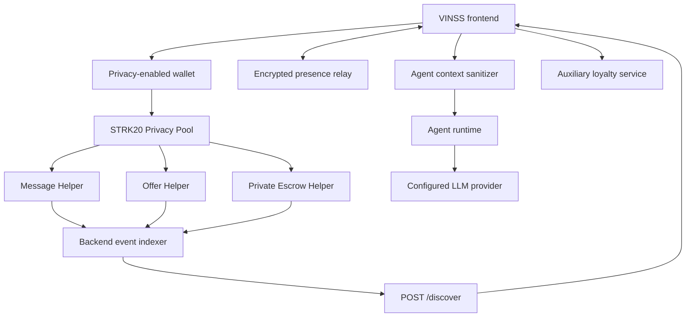

# Backend Architecture

## Objective

VINSS uses the backend for discovery, relay, scoped Agent orchestration, and operational APIs without turning it into a trusted plaintext deal server.

The backend performs work that is inconvenient or expensive for browsers while preserving local encryption/decryption.

## Responsibilities

### Discovery / indexer

```text
helper event
→ action locator
→ helper getter
→ ciphertext chunks
→ /discover response
```

Supported encrypted action families:

```text
message
offer
escrow
```

The `escrow` discovery kind refers to **Private Escrow coordination actions**, not custody execution inside the Escrow Rekber contract.

### Presence relay

Stores only opaque encrypted presence records with bounded TTL.

### Agent boundary

Rebuilds remote Agent context from a strict allowlist, selects an explicit skill, and exposes only that skill's allowed tools.

### Operational APIs

Provides:

```text
GET /health
GET /openapi.json
GET /docs
```

### Auxiliary loyalty service

The backend currently mounts `/loyalty/*`, but loyalty is application-side in-memory state, not protocol-critical private settlement state.

## Runtime structure

```text
backend/src/
├── index.ts
├── config.ts
├── openapi.ts
├── routes/
│   ├── discover.ts
│   ├── presence.ts
│   └── agent.ts
├── indexer/
│   └── poolEvents.ts
├── agent/
│   ├── context.ts
│   ├── runtime.ts
│   ├── tools.ts
│   ├── skills/
│   └── providers/
└── loyalty/
    ├── routes.ts
    ├── service.ts
    └── types.ts
```

## System architecture



## Trust boundaries

### Client

Allowed to hold private Deal Room material:

- plaintext Message content;
- plaintext Offer terms;
- room/channel/pairwise keys;
- decrypted history;
- Escrow Rekber secrets.

### Backend

Designed to handle:

- public Starknet metadata;
- opaque routing tags;
- ciphertext;
- encrypted presence envelopes;
- bounded sanitized Agent context;
- auxiliary loyalty metadata.

### Remote LLM provider

May receive:

- the user's explicit Agent instruction;
- sanitized metadata context;
- tool definitions for the selected skill.

It receives no signing authority.

## Architectural invariant

The backend separates:

```text
finding encrypted application records
from
being able to read those records
```

That separation is one of the main VINSS privacy boundaries.
