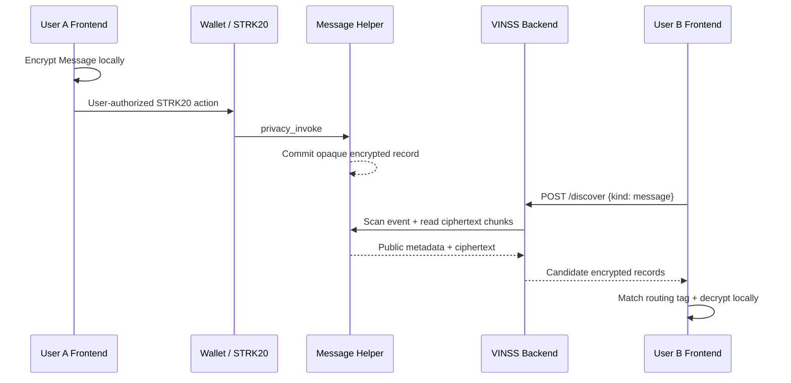
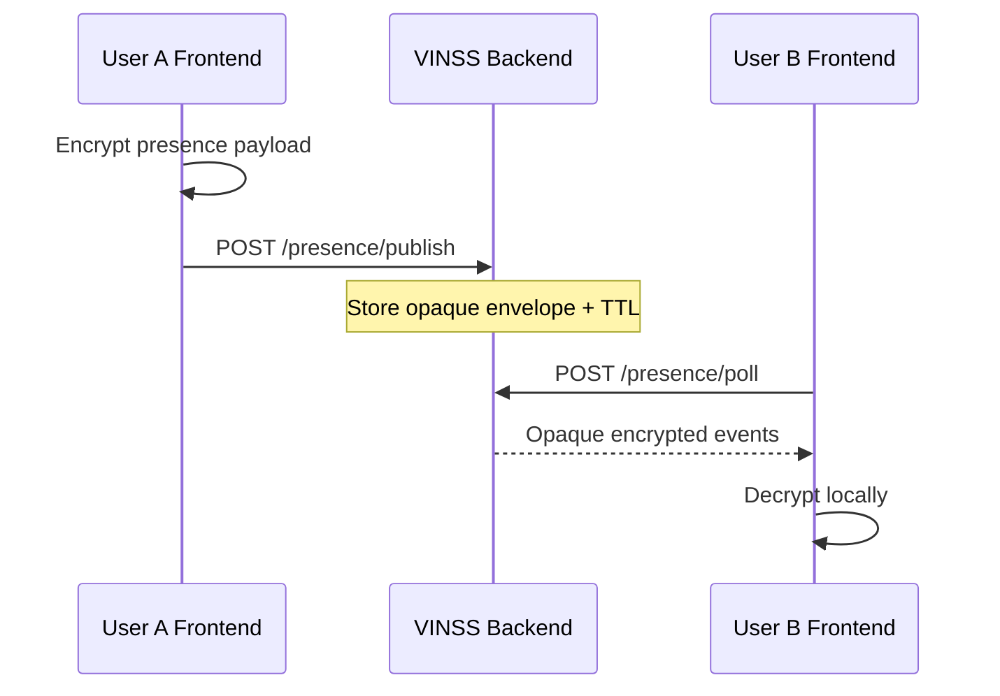

# Backend Interaction Flow

## Objective

This document shows where the backend participates in a VINSS action and, equally importantly, where it does **not** participate.

## Private Message discovery



The backend never receives the Message key.

## Private Offer discovery

```text
encrypted Offer action
→ STRK20 / Offer Helper
→ OfferActionCommitted
→ backend indexer
→ /discover
→ authorized browser
→ local route match / decrypt
```

All lifecycle semantics remain inside encrypted Offer payloads.

The backend transports encrypted Offer actions without needing to know whether an action is:

```text
create
counter
accept
reject
cancel
expire
```

## Private Escrow coordination discovery

`kind: "escrow"` maps to:

```text
PrivateEscrowActionCommitted
```

and retrieves encrypted coordination payload chunks.

This is **not** the same thing as executing:

```text
deposit
release
refund
```

against the Escrow Rekber custody contract.

Those financial actions remain wallet/contract execution paths.

## Presence



## Agent

```text
user instruction
→ frontend context minimization
→ POST /agent
→ backend sanitizer
→ explicit skill
→ skill-specific tools
→ configured provider
→ draft / analysis / proposal
→ user review
```

The Agent path does not sign or submit transactions.

## Failure separation

Optional backend services should not become transaction authorities.

Examples:

```text
Agent outage
≠ private Message settlement failure

Presence reset
≠ loss of canonical on-chain Message / Offer record

Loyalty reset
≠ loss of canonical deal settlement
```

Canonical on-chain actions remain separate from optional backend state.
