# VINSS Backend Interaction Flow

This document describes where the VINSS backend participates in each major product flow, where it does not participate, and which interactions happen:

```text
during the user HTTP request

versus

asynchronously in background indexers
```

That distinction is essential to understanding VINSS latency, privacy, failure behavior, and settlement authority.

Executable backend and contract source remain the source of truth.

---

# Core Interaction Principle

For normal Deal Room blockchain actions:

```text
frontend
    ↓
client-side encryption / transaction construction
    ↓
Ready / wallet authorization
    ↓
STRK20 / Starknet
    ↓
VINSS contract
```

The backend is not in the normal transaction-signing path.

After the chain action becomes public:

```text
background backend indexer
    ↓
PostgreSQL
    ↓
HTTP read API
    ↓
receiving frontend
```

---

# Two Different Backend Interaction Modes

The current backend has two fundamentally different interaction modes.

## Mode A — background indexed state

Examples:

```text
Message
Offer
Private Escrow coordination
Rekber lifecycle
Settlement Certificate
```

The chain is scanned continuously in background.

HTTP requests read PostgreSQL.

## Mode B — request-time application service

Examples:

```text
Presence
Attachments
Feedback
Agent
Dispute
```

The HTTP request directly invokes backend service behavior.

---

# High-Level Interaction Map

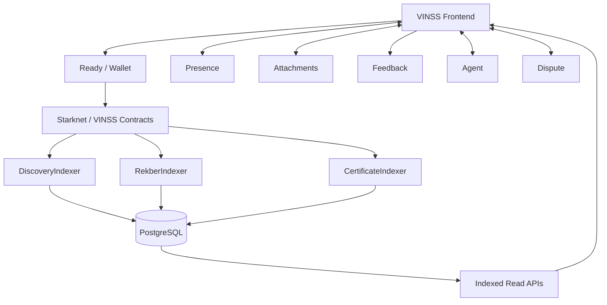
```mermaid
flowchart TD
    FE["VINSS Frontend"]
    WALLET["Ready / Wallet"]
    CHAIN["Starknet / VINSS Contracts"]

    DI["DiscoveryIndexer"]
    RI["RekberIndexer"]
    CI["CertificateIndexer"]

    DB[("PostgreSQL")]

    READ["Indexed Read APIs"]
    PRES["Presence"]
    ATT["Attachments"]
    FB["Feedback"]
    AG["Agent"]
    DIS["Dispute"]

    FE --> WALLET
    WALLET --> CHAIN

    CHAIN --> DI
    CHAIN --> RI
    CHAIN --> CI

    DI --> DB
    RI --> DB
    CI --> DB

    DB --> READ
    READ --> FE

    FE <--> PRES
    FE <--> ATT
    FE --> FB
    FE <--> AG
    FE <--> DIS
```

---

# Background Indexers Start Independently of User Reads

At backend startup:

```text
DiscoveryIndexer.start()

RekberIndexer.start()

CertificateIndexer.start()
```

are called after the HTTP server starts listening.

The indexers then run their own polling loops.

Therefore:

```text
GET/POST read request
```

does not itself cause the indexer loop to start.

---

# Background Indexing Model

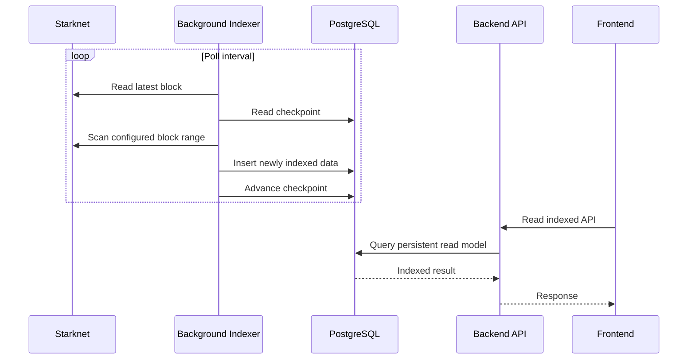
```mermaid
sequenceDiagram
    participant S as Starknet
    participant I as Background Indexer
    participant DB as PostgreSQL
    participant API as Backend API
    participant FE as Frontend

    loop Poll interval
        I->>S: Read latest block
        I->>DB: Read checkpoint
        I->>S: Scan configured block range
        I->>DB: Insert newly indexed data
        I->>DB: Advance checkpoint
    end

    FE->>API: Read indexed API
    API->>DB: Query persistent read model
    DB-->>API: Indexed result
    API-->>FE: Response
```

---

# Important Read-Path Rule

For the persistent index APIs:

```text
POST /discover
GET /rekber/events
GET /activity
GET /royalty/:address
```

the normal HTTP request reads already indexed PostgreSQL state.

It does not perform a fresh full historical Starknet event scan.

---

# Consequence of This Design

Benefits:

```text
faster mobile reads
less repeated RPC work
persistent historical cache
shared indexing across clients
network-aware checkpoints
```

Trade-off:

```text
HTTP response can lag chain head
if indexer is behind
```

Therefore:

```text
chain truth
```

and:

```text
backend read-model freshness
```

are separate concepts.

---

# Private Message Write Flow

Normal private Message write:

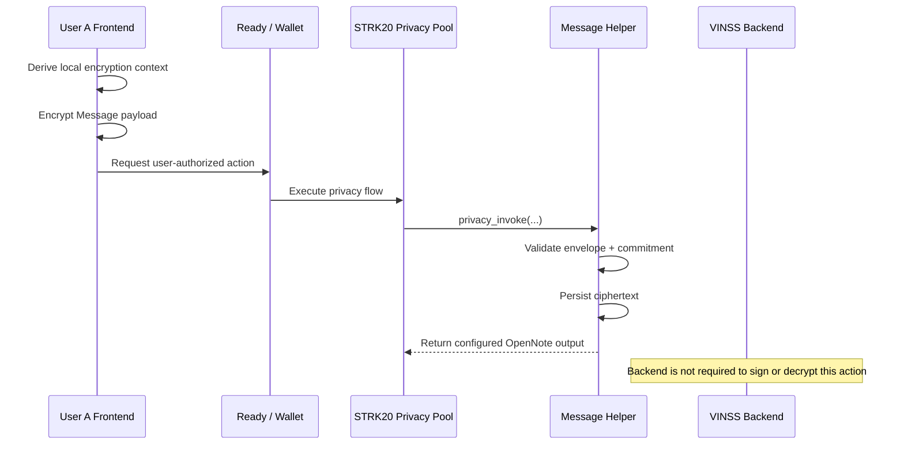
```mermaid
sequenceDiagram
    participant A as User A Frontend
    participant W as Ready / Wallet
    participant P as STRK20 Privacy Pool
    participant H as Message Helper
    participant B as VINSS Backend

    A->>A: Derive local encryption context
    A->>A: Encrypt Message payload
    A->>W: Request user-authorized action
    W->>P: Execute privacy flow
    P->>H: privacy_invoke(...)
    H->>H: Validate envelope + commitment
    H->>H: Persist ciphertext
    H-->>P: Return configured OpenNote output

    Note over B: Backend is not required to sign or decrypt this action
```

---

# Message Write Boundary

Backend does not need:

```text
room secret
channel key
pairwise key
plaintext Message
wallet private key
```

for Message contract execution.

---

# Message Chain Result

Message Helper publicly stores:

```text
encrypted Message envelope
action locator
payload commitment
routing tags
ciphertext chunks
```

and emits:

```text
MessageCommitted
```

---

# Message Background Index Flow

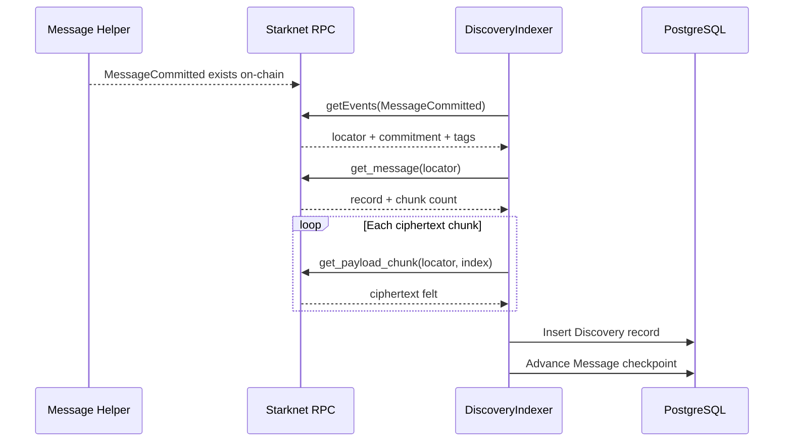
```mermaid
sequenceDiagram
    participant H as Message Helper
    participant RPC as Starknet RPC
    participant I as DiscoveryIndexer
    participant DB as PostgreSQL

    H-->>RPC: MessageCommitted exists on-chain

    I->>RPC: getEvents(MessageCommitted)
    RPC-->>I: locator + commitment + tags

    I->>RPC: get_message(locator)
    RPC-->>I: record + chunk count

    loop Each ciphertext chunk
        I->>RPC: get_payload_chunk(locator, index)
        RPC-->>I: ciphertext felt
    end

    I->>DB: Insert Discovery record
    I->>DB: Advance Message checkpoint
```

---

# Message Discovery Read Flow

This is the current request-time flow.

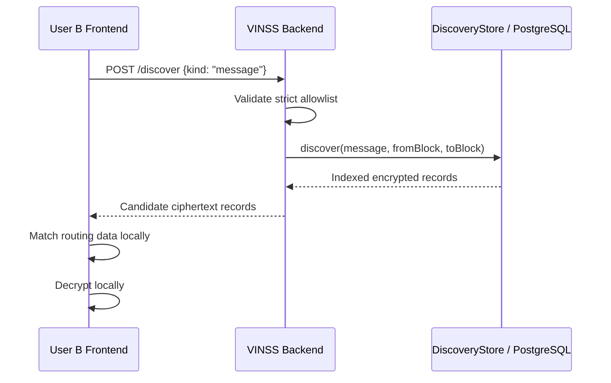
```mermaid
sequenceDiagram
    participant B as User B Frontend
    participant API as VINSS Backend
    participant DB as DiscoveryStore / PostgreSQL

    B->>API: POST /discover {kind: "message"}
    API->>API: Validate strict allowlist
    API->>DB: discover(message, fromBlock, toBlock)
    DB-->>API: Indexed encrypted records
    API-->>B: Candidate ciphertext records
    B->>B: Match routing data locally
    B->>B: Decrypt locally
```

---

# Critical Difference from Older Flow

Incorrect description:

```text
POST /discover
    ↓
backend scans Message Helper immediately
    ↓
backend reads ciphertext chunks
```

Current implementation:

```text
background DiscoveryIndexer
    ↓
PostgreSQL

then later

POST /discover
    ↓
PostgreSQL lookup only
```

---

# Why This Matters for Failures

If Starknet RPC temporarily fails:

```text
DiscoveryIndexer may stop advancing
```

but:

```text
/discover
```

may still return previously indexed records from PostgreSQL.

So:

```text
RPC outage
```

does not necessarily equal:

```text
immediate /discover HTTP failure
```

It can instead become:

```text
stale indexed view
```

---

# Private Offer Write Flow

Offer follows the same high-level split.

```text
frontend
    ↓
encrypt Offer action
    ↓
wallet / STRK20
    ↓
VinssOfferHelper
    ↓
OfferActionCommitted
```

Backend does not need to understand the encrypted business action.

---

# Offer Semantics Boundary

Encrypted application semantics may include:

```text
create
counter
accept
reject
cancel
expire
```

The Offer Helper/indexer does not need to decode those plaintext lifecycle meanings.

---

# Offer Background Index Flow

```text
OfferActionCommitted
    ↓
DiscoveryIndexer
    ↓
get_offer_action(locator)
    ↓
get_offer_payload_chunk(locator, index)
    ↓
DiscoveryStore
```

---

# Offer Read Flow

```text
POST /discover
{
  "kind": "offer"
}
```

returns indexed encrypted Offer records.

Frontend performs:

```text
local route matching
local decryption
local semantic interpretation
```

---

# Offer Privacy Boundary

Backend sees:

```text
action locator
payload commitment
sender tag
recipient tag
ciphertext
block metadata
transaction hash
```

It does not automatically know:

```text
asset
amount
conditions
accepted price
private negotiation reason
```

from the encrypted payload.

---

# Private Escrow Coordination Write Flow

The Discovery kind:

```text
escrow
```

maps to:

```text
VinssPrivateEscrowHelper
```

not:

```text
VinssEscrowRekber
```

---

# Private Escrow Coordination

This path transports encrypted Rekber coordination actions.

Conceptually:

```text
frontend coordination payload
    ↓
encrypt locally
    ↓
wallet / Privacy Pool
    ↓
Private Escrow Helper
    ↓
PrivateEscrowActionCommitted
```

---

# Private Escrow Background Index

```text
PrivateEscrowActionCommitted
    ↓
DiscoveryIndexer
    ↓
get_private_escrow_action(locator)
    ↓
get_private_escrow_payload_chunk(locator, index)
    ↓
DiscoveryStore
```

---

# Private Escrow Read Flow

```text
POST /discover
{
  "kind": "escrow"
}
```

returns encrypted coordination payloads.

---

# Private Escrow Is Not Custody

Do not describe:

```text
kind = escrow
```

as:

```text
funding/releasing/refunding principal
```

Those are separate public Rekber contract actions.

---

# Public Rekber Participant Write Flow

For normal participant actions:

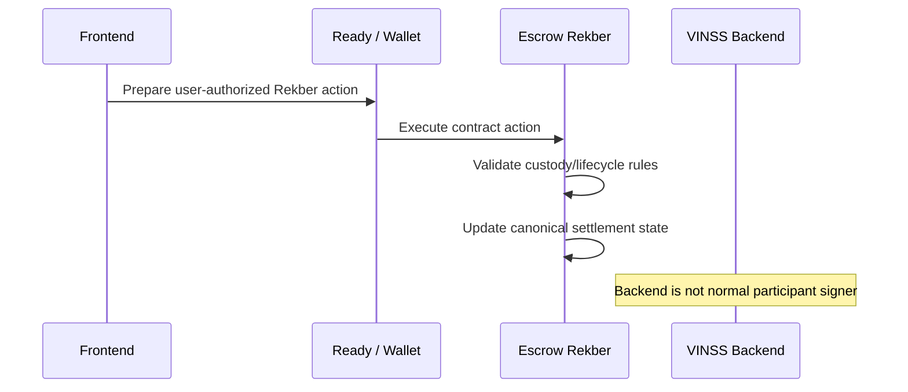
```mermaid
sequenceDiagram
    participant FE as Frontend
    participant W as Ready / Wallet
    participant R as Escrow Rekber
    participant B as VINSS Backend

    FE->>W: Prepare user-authorized Rekber action
    W->>R: Execute contract action
    R->>R: Validate custody/lifecycle rules
    R->>R: Update canonical settlement state

    Note over B: Backend is not normal participant signer
```

---

# Rekber Contract Actions

Examples include:

```text
fund custody
submit fulfillment
confirm fulfillment
request revision
open dispute
mutual release
timeout/auto release
refund
resolution claim
```

Exact contract semantics belong in smart-contract documentation.

---

# Rekber Public Events

Backend currently indexes:

```text
EscrowRekberCustodyFunded

EscrowRekberCustodyReleased

EscrowRekberCustodyRefunded

EscrowRekberCustodyResolved
```

---

# Rekber Background Index Flow

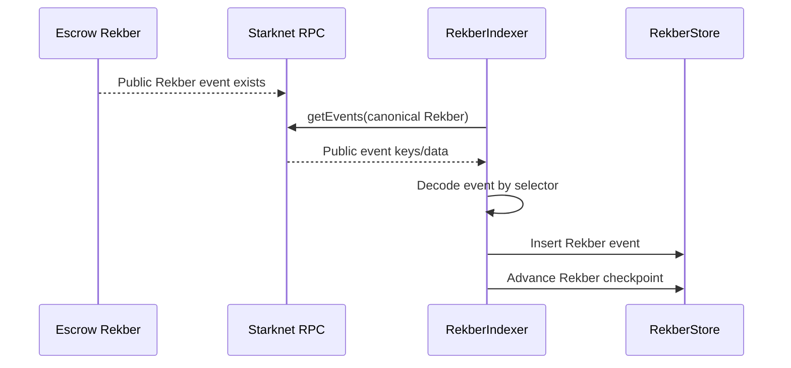
```mermaid
sequenceDiagram
    participant R as Escrow Rekber
    participant RPC as Starknet RPC
    participant I as RekberIndexer
    participant DB as RekberStore

    R-->>RPC: Public Rekber event exists

    I->>RPC: getEvents(canonical Rekber)
    RPC-->>I: Public event keys/data
    I->>I: Decode event by selector
    I->>DB: Insert Rekber event
    I->>DB: Advance Rekber checkpoint
```

---

# Funded Rekber Data Flow

Funded event can produce indexed fields such as:

```text
custodyCommitment
token
amount
refundAfter
timestamp
blockNumber
transactionHash
```

These are public.

---

# Released / Refunded Rekber Data Flow

These events can produce:

```text
custodyCommitment
outputNoteId
timestamp
blockNumber
transactionHash
```

---

# Resolved Rekber Data Flow

Resolved can produce:

```text
custodyCommitment
resolutionCommitment
resolutionPayerAmount
resolutionPayeeAmount
timestamp
blockNumber
transactionHash
```

---

# Rekber Read API Flow

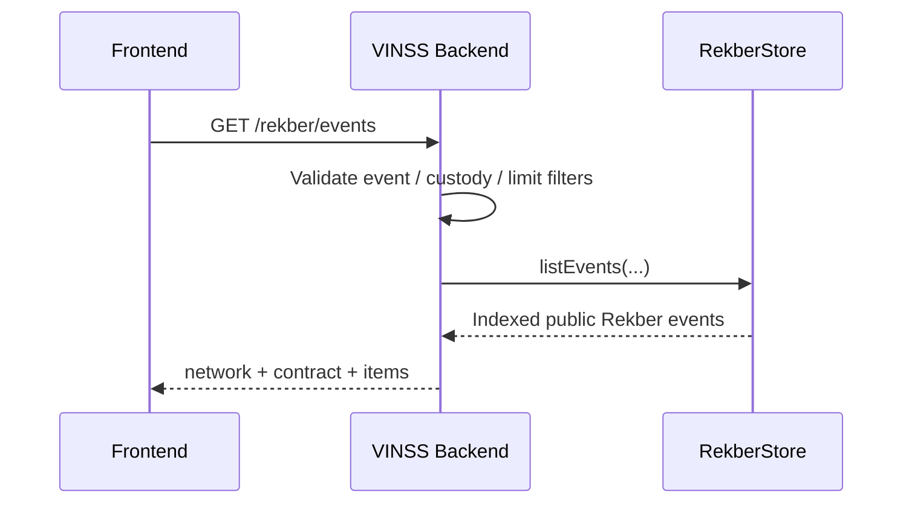
```mermaid
sequenceDiagram
    participant FE as Frontend
    participant API as VINSS Backend
    participant DB as RekberStore

    FE->>API: GET /rekber/events
    API->>API: Validate event / custody / limit filters
    API->>DB: listEvents(...)
    DB-->>API: Indexed public Rekber events
    API-->>FE: network + contract + items
```

---

# `/rekber/events` Does Not Define Settlement Truth

If backend index lags:

```text
GET /rekber/events
```

can be stale.

Canonical truth remains:

```text
VinssEscrowRekber on Starknet
```

---

# Settlement Certificate Claim Flow

Certificate claim is a user/contract action.

Normal flow:

```text
frontend
    ↓
wallet
    ↓
VinssSettlementCertificate.claim(...)
```

The certificate indexer does not mint the certificate.

---

# Certificate Background Index Flow

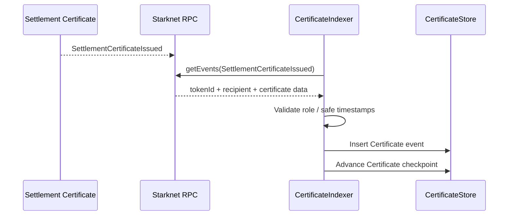
```mermaid
sequenceDiagram
    participant C as Settlement Certificate
    participant RPC as Starknet RPC
    participant I as CertificateIndexer
    participant DB as CertificateStore

    C-->>RPC: SettlementCertificateIssued

    I->>RPC: getEvents(SettlementCertificateIssued)
    RPC-->>I: tokenId + recipient + certificate data
    I->>I: Validate role / safe timestamps
    I->>DB: Insert Certificate event
    I->>DB: Advance Certificate checkpoint
```

---

# Certificate Indexed Fields

Current indexed fields include:

```text
tokenId
recipient
custodyCommitment
role
settledAt
issuedAt
blockNumber
transactionHash
```

---

# Certificate Privacy Boundary

These are:

```text
public credential fields
```

not encrypted Deal Room state.

---

# Certificate vs Rekber Timing

Possible flow:

```text
Rekber released
    ↓
RekberIndexer observes release

later

participant claims Certificate
    ↓
CertificateIndexer observes issuance
```

Therefore:

```text
release indexed
```

does not imply:

```text
certificate already exists
```

---

# Global Activity Flow

`GET /activity` merges three persistent stores.

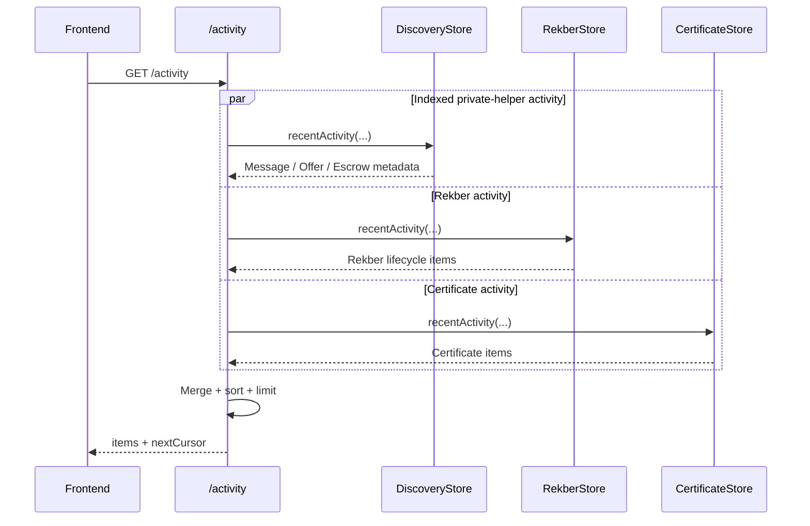
```mermaid
sequenceDiagram
    participant FE as Frontend
    participant API as /activity
    participant D as DiscoveryStore
    participant R as RekberStore
    participant C as CertificateStore

    FE->>API: GET /activity

    par Indexed private-helper activity
        API->>D: recentActivity(...)
        D-->>API: Message / Offer / Escrow metadata
    and Rekber activity
        API->>R: recentActivity(...)
        R-->>API: Rekber lifecycle items
    and Certificate activity
        API->>C: recentActivity(...)
        C-->>API: Certificate items
    end

    API->>API: Merge + sort + limit
    API-->>FE: items + nextCursor
```

---

# Activity Does Not Decrypt

Discovery-derived activity returns public structural metadata.

It does not need:

```text
ciphertextChunks
decryption key
plaintext summary
```

to build the global activity list.

---

# Activity Kind Filtering

Explicit filter currently supports:

```text
message
offer
escrow
rekber_funded
rekber_released
rekber_refunded
certificate_issued
```

---

# Resolved Activity Nuance

The shared event model can contain:

```text
rekber_resolved
```

and unfiltered Rekber activity can return it.

But:

```text
GET /activity?kind=rekber_resolved
```

is not currently accepted by the explicit allowlist.

---

# Royalty Read Flow

Royalty is derived from CertificateStore.

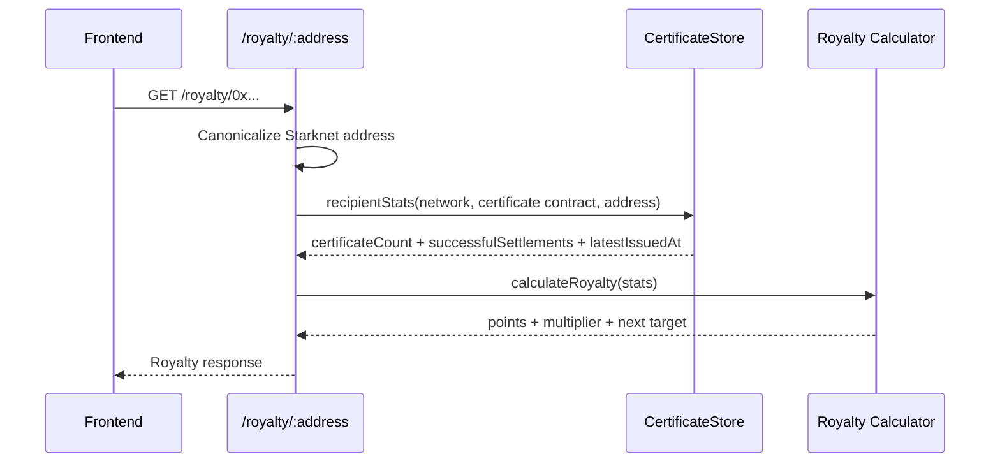
```mermaid
sequenceDiagram
    participant FE as Frontend
    participant API as /royalty/:address
    participant C as CertificateStore
    participant S as Royalty Calculator

    FE->>API: GET /royalty/0x...
    API->>API: Canonicalize Starknet address
    API->>C: recipientStats(network, certificate contract, address)
    C-->>API: certificateCount + successfulSettlements + latestIssuedAt
    API->>S: calculateRoyalty(stats)
    S-->>API: points + multiplier + next target
    API-->>FE: Royalty response
```

---

# Royalty Authority Split

Evidence source:

```text
SettlementCertificateIssued events
```

Policy source:

```text
backend Royalty calculation
```

---

# Royalty Is Read-Only

Frontend cannot call:

```text
POST /royalty/award
```

because no such route exists.

---

# Royalty Conversion

Current output:

```text
conversion.status = coming_soon
```

Therefore no token conversion occurs in this flow.

---

# Presence Publish Flow

Presence is request-time and ephemeral.

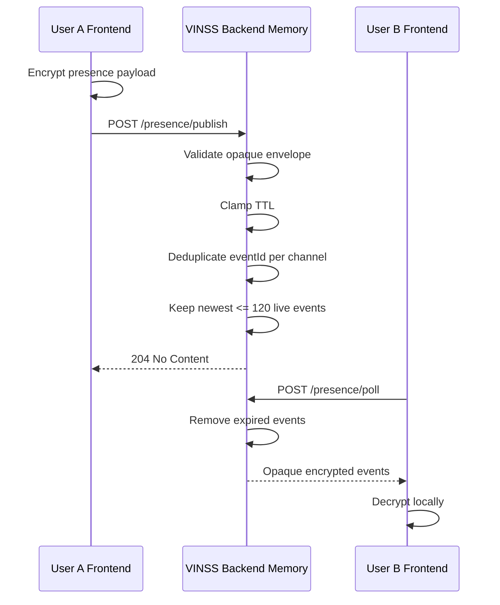
```mermaid
sequenceDiagram
    participant A as User A Frontend
    participant B as VINSS Backend Memory
    participant C as User B Frontend

    A->>A: Encrypt presence payload
    A->>B: POST /presence/publish
    B->>B: Validate opaque envelope
    B->>B: Clamp TTL
    B->>B: Deduplicate eventId per channel
    B->>B: Keep newest <= 120 live events
    B-->>A: 204 No Content

    C->>B: POST /presence/poll
    B->>B: Remove expired events
    B-->>C: Opaque encrypted events
    C->>C: Decrypt locally
```

---

# Presence Request-Time Rule

Unlike Discovery:

```text
presence request
```

directly reads/writes:

```text
process memory
```

during the request.

There is no Presence background indexer.

---

# Presence Restart Behavior

Backend restart:

```text
clears presence channels
```

because storage is a process-local Map.

---

# Presence TTL

Client supplies:

```text
ttlMs
```

Backend bounds it to:

```text
1 second
..
24 hours
```

---

# Presence Deduplication

Within one channel:

```text
same live eventId
```

is not appended twice.

---

# Presence Is Not Delivery Guarantee

Presence is suitable for:

```text
typing
read-like UX signals
participant presence
```

but not:

```text
canonical messages
settlement evidence
durable notifications
```

---

# Encrypted Attachment Upload Flow

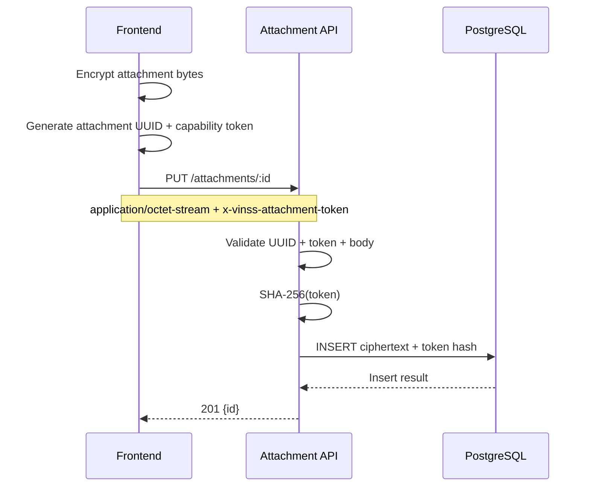
```mermaid
sequenceDiagram
    participant FE as Frontend
    participant API as Attachment API
    participant DB as PostgreSQL

    FE->>FE: Encrypt attachment bytes
    FE->>FE: Generate attachment UUID + capability token

    FE->>API: PUT /attachments/:id
    Note over FE,API: application/octet-stream + x-vinss-attachment-token

    API->>API: Validate UUID + token + body
    API->>API: SHA-256(token)
    API->>DB: INSERT ciphertext + token hash
    DB-->>API: Insert result
    API-->>FE: 201 {id}
```

---

# Attachment Backend Visibility

Backend sees:

```text
attachment ID
ciphertext bytes
ciphertext size
token hash
timing
```

It does not need plaintext attachment bytes.

---

# Attachment Token Storage

Raw token:

```text
not stored
```

Stored:

```text
SHA-256(token)
```

---

# Attachment Duplicate ID

Existing ID:

```text
409
```

The backend does not overwrite an existing encrypted object.

---

# Encrypted Attachment Download Flow

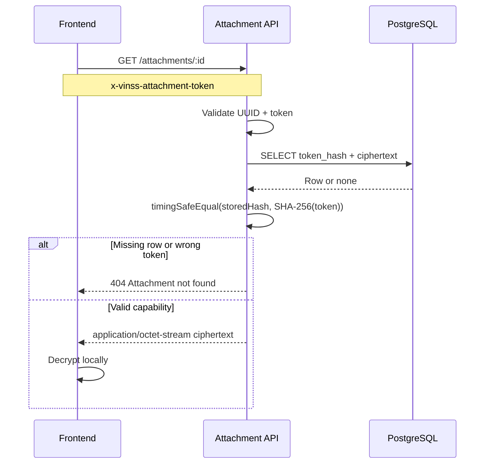
```mermaid
sequenceDiagram
    participant FE as Frontend
    participant API as Attachment API
    participant DB as PostgreSQL

    FE->>API: GET /attachments/:id
    Note over FE,API: x-vinss-attachment-token

    API->>API: Validate UUID + token
    API->>DB: SELECT token_hash + ciphertext
    DB-->>API: Row or none
    API->>API: timingSafeEqual(storedHash, SHA-256(token))

    alt Missing row or wrong token
        API-->>FE: 404 Attachment not found
    else Valid capability
        API-->>FE: application/octet-stream ciphertext
        FE->>FE: Decrypt locally
    end
```

---

# Attachment Enumeration Resistance

Both:

```text
missing object
```

and:

```text
existing object + wrong capability token
```

return:

```text
404 Attachment not found
```

---

# Attachment Persistence

Unlike Presence, attachment data is PostgreSQL-backed.

Backend restart does not inherently delete it.

---

# Feedback Flow

Feedback is a plaintext application path.

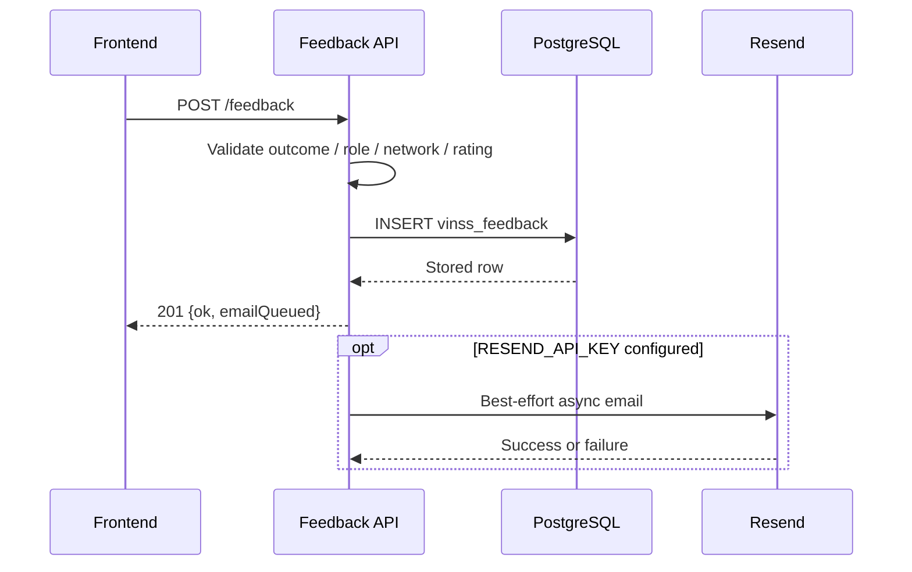
```mermaid
sequenceDiagram
    participant FE as Frontend
    participant API as Feedback API
    participant DB as PostgreSQL
    participant MAIL as Resend

    FE->>API: POST /feedback
    API->>API: Validate outcome / role / network / rating
    API->>DB: INSERT vinss_feedback
    DB-->>API: Stored row
    API-->>FE: 201 {ok, emailQueued}

    opt RESEND_API_KEY configured
        API->>MAIL: Best-effort async email
        MAIL-->>API: Success or failure
    end
```

---

# Feedback Ordering

Important:

```text
database insert
    ↓
HTTP 201 response
    ↓
optional email attempt
```

Email is not required for feedback persistence.

---

# `emailQueued` Meaning

Current value:

```text
Boolean(RESEND_API_KEY)
```

So:

```text
emailQueued = true
```

does not prove delivery.

---

# Feedback Is Not Private Deal Storage

Users should not send:

```text
room secret
channel key
wallet private key
private evidence
sensitive negotiation transcript
```

through Feedback.

---

# Normal Agent Request Flow

Agent is request-time and feature-gated.

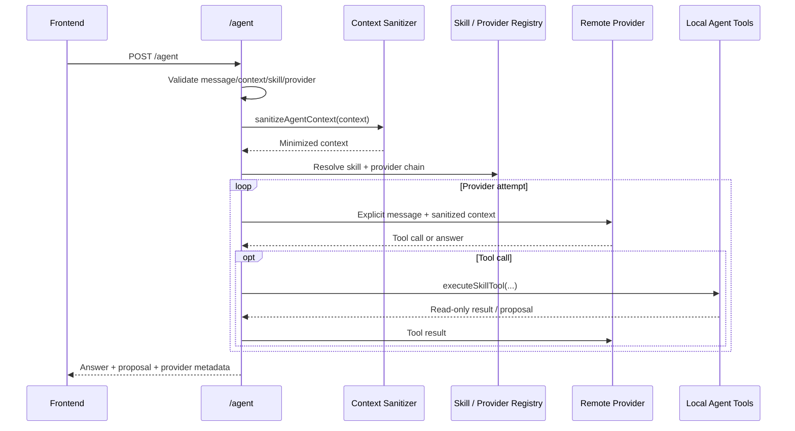
```mermaid
sequenceDiagram
    participant FE as Frontend
    participant API as /agent
    participant SAN as Context Sanitizer
    participant REG as Skill / Provider Registry
    participant LLM as Remote Provider
    participant TOOL as Local Agent Tools

    FE->>API: POST /agent
    API->>API: Validate message/context/skill/provider
    API->>SAN: sanitizeAgentContext(context)
    SAN-->>API: Minimized context
    API->>REG: Resolve skill + provider chain

    loop Provider attempt
        API->>LLM: Explicit message + sanitized context
        LLM-->>API: Tool call or answer

        opt Tool call
            API->>TOOL: executeSkillTool(...)
            TOOL-->>API: Read-only result / proposal
            API->>LLM: Tool result
        end
    end

    API-->>FE: Answer + proposal + provider metadata
```

---

# Agent Privacy Split

Automatic context:

```text
server-sanitized
```

Explicit message:

```text
plaintext remote-provider input
```

---

# Agent Does Not Automatically Read Discovery

Normal Agent tools do not call:

```text
/discover
```

or decrypt room history.

---

# Agent Proposal Flow

Possible result:

```text
draft message
draft Offer
draft counter Offer
prepare escrow proposal
review Rekber proposal
```

These are:

```text
requiresApproval = true
```

application proposals.

---

# Agent Execution Boundary

Normal Agent has no generic tools for:

```text
wallet signing
transaction submit
Rekber fund
Rekber release
Rekber refund
certificate claim
resolver authorization
```

---

# Agent Provider Fallback Flow

If configured:

```text
provider A fails
    ↓
provider B may be attempted
    ↓
provider C may be attempted
```

Therefore one explicit Agent request can be transmitted to more than one configured remote provider during fallback.

---

# Agent Failure

If all configured providers fail:

```text
POST /agent
    ↓
500
{
  "error": "Agent failed."
}
```

Core indexers continue independently.

---

# Dispute Challenge Flow

The challenge route prepares signatures for a specific verified dispute case.

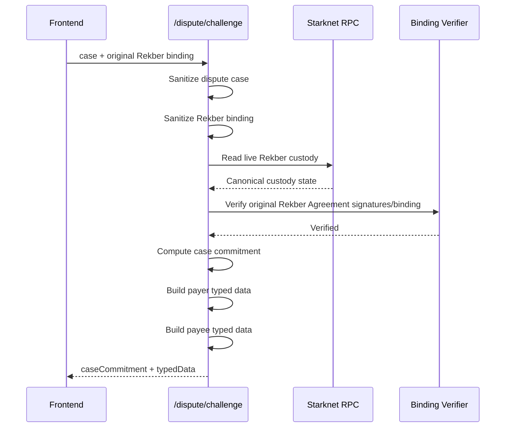
```mermaid
sequenceDiagram
    participant FE as Frontend
    participant API as /dispute/challenge
    participant RPC as Starknet RPC
    participant V as Binding Verifier

    FE->>API: case + original Rekber binding
    API->>API: Sanitize dispute case
    API->>API: Sanitize Rekber binding

    API->>RPC: Read live Rekber custody
    RPC-->>API: Canonical custody state

    API->>V: Verify original Rekber Agreement signatures/binding
    V-->>API: Verified

    API->>API: Compute case commitment
    API->>API: Build payer typed data
    API->>API: Build payee typed data

    API-->>FE: caseCommitment + typedData
```

---

# Challenge Purpose

The backend does not ask the parties to sign an AutoSplit dispute attestation until it has verified that the disclosed parties correspond to the exact Rekber Agreement/custody binding.

---

# Challenge Does Not Execute Resolver

`/dispute/challenge`:

```text
does not authorize split
does not transfer funds
does not call resolver hook
```

It prepares authenticated dispute attestations.

---

# Dispute Attestation Meaning

Each signer attests to submission of:

```text
this exact combined dispute case
```

for dispute evaluation.

It does not mean the signer agrees with the counterparty's claims.

---

# Dispute Evaluate Flow

This is the most privileged backend interaction.

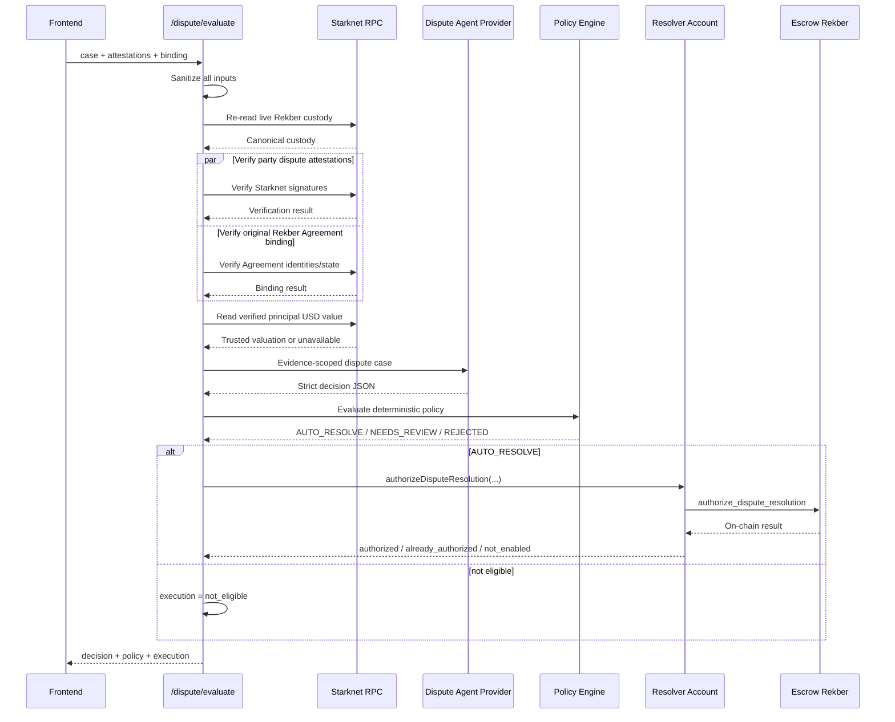
```mermaid
sequenceDiagram
    participant FE as Frontend
    participant API as /dispute/evaluate
    participant RPC as Starknet RPC
    participant LLM as Dispute Agent Provider
    participant POL as Policy Engine
    participant RES as Resolver Account
    participant REK as Escrow Rekber

    FE->>API: case + attestations + binding

    API->>API: Sanitize all inputs
    API->>RPC: Re-read live Rekber custody
    RPC-->>API: Canonical custody

    par Verify party dispute attestations
        API->>RPC: Verify Starknet signatures
        RPC-->>API: Verification result
    and Verify original Rekber Agreement binding
        API->>RPC: Verify Agreement identities/state
        RPC-->>API: Binding result
    end

    API->>RPC: Read verified principal USD value
    RPC-->>API: Trusted valuation or unavailable

    API->>LLM: Evidence-scoped dispute case
    LLM-->>API: Strict decision JSON

    API->>POL: Evaluate deterministic policy
    POL-->>API: AUTO_RESOLVE / NEEDS_REVIEW / REJECTED

    alt AUTO_RESOLVE
        API->>RES: authorizeDisputeResolution(...)
        RES->>REK: authorize_dispute_resolution
        REK-->>RES: On-chain result
        RES-->>API: authorized / already_authorized / not_enabled
    else not eligible
        API->>API: execution = not_eligible
    end

    API-->>FE: decision + policy + execution
```

---

# Dispute Is Not Pure AI

The flow contains:

```text
sanitization
cryptographic signatures
live chain reads
Agreement binding verification
verified valuation
LLM analysis
strict parser
deterministic policy
optional resolver execution
```

The LLM is one layer.

---

# Browser State Is Not Final Authority

During evaluate:

```text
browser lifecycle flags
browser-declared wallet identity
browser-provided USD value
```

are not sufficient for AutoResolve.

Backend re-reads/derives trusted values.

---

# Dispute LLM Has No Signer

The internal Agent skill itself does not sign.

Privileged signing lives in:

```text
dedicated resolver executor
```

---

# AutoResolve Gate

Resolver execution is attempted only when:

```text
result.policy.status == AUTO_RESOLVE
```

---

# AutoResolve Feature Gate

Even after policy eligibility:

```text
DISPUTE_AUTO_RESOLVE_ENABLED
```

must be enabled for a new resolver authorization.

---

# Resolver Address Verification

Executor checks:

```text
configured resolver address
```

against:

```text
get_dispute_resolver()
```

on canonical Rekber.

Mismatch fails.

---

# Resolver Split Calculation

Payer amount:

```text
principal * payerBps / 10000
```

Payee amount:

```text
principal - payerAmount
```

The second amount uses exact remainder.

---

# Resolver Retry/Race Flow

If transaction submission throws:

```text
executor re-reads Rekber authorization
```

If another submission already succeeded:

```text
return already_authorized
```

instead of reporting a false permanent failure.

---

# Dispute Error Mapping

Current route catches errors and returns:

```text
HTTP 400
```

with the current error message.

This includes multiple categories:

```text
input validation
binding rejection
attestation rejection
RPC errors
provider/policy errors
resolver errors
```

under current implementation.

---

# Health Interaction Flow

`GET /health` reads status from the three persistent indexers.

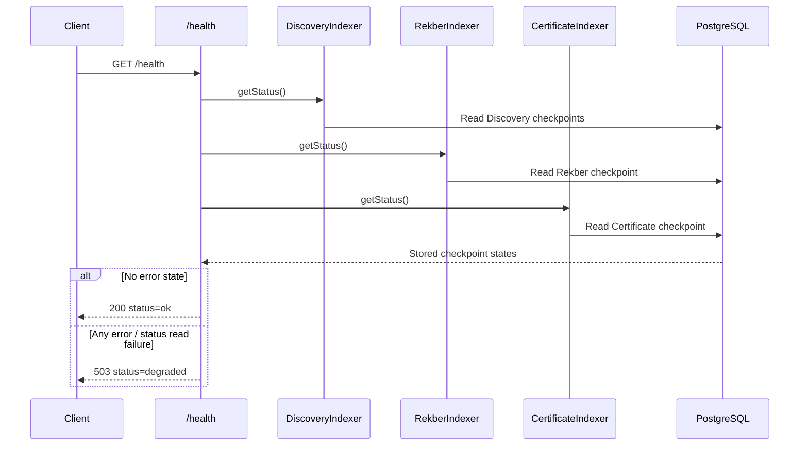
```mermaid
sequenceDiagram
    participant FE as Client
    participant API as /health
    participant DI as DiscoveryIndexer
    participant RI as RekberIndexer
    participant CI as CertificateIndexer
    participant DB as PostgreSQL

    FE->>API: GET /health

    API->>DI: getStatus()
    DI->>DB: Read Discovery checkpoints

    API->>RI: getStatus()
    RI->>DB: Read Rekber checkpoint

    API->>CI: getStatus()
    CI->>DB: Read Certificate checkpoint

    DB-->>API: Stored checkpoint states

    alt No error state
        API-->>FE: 200 status=ok
    else Any error / status read failure
        API-->>FE: 503 status=degraded
    end
```

---

# Health Is Read-Model Health

Health does not directly prove:

```text
Ready wallet signs
browser decrypts
Agent provider responds
attachments work
two-wallet settlement succeeds
```

---

# Health and Latest-Block Failure Nuance

An indexer's failure to read latest block may log an error and skip a cycle.

Depending on the specific code path, that does not necessarily immediately write:

```text
checkpoint.status = error
```

Therefore operational monitoring should not rely only on:

```text
status != error
```

without also considering:

```text
checkpoint age
last indexed block
latest observed block
lag
logs
```

---

# Loyalty Preview Flow

Legacy Loyalty is feature-gated and in-memory.

```text
POST /loyalty/events
    ↓
validate client-supplied action
    ↓
in-memory service
    ↓
updated points account
```

---

# Loyalty Does Not Verify Chain

Current preview path does not independently prove:

```text
a Message actually happened
an Offer actually happened
a Rekber release actually happened
```

before awarding a client-submitted event.

---

# Loyalty Failure Separation

Backend restart can lose current in-memory Loyalty preview.

It does not affect:

```text
Rekber custody
Certificate ownership
Discovery index records
```

---

# Royalty Replaces Loyalty as Stronger Evidence Path

For settlement-based points, current Royalty read model derives from:

```text
indexed SettlementCertificateIssued
```

instead of client-submitted award events.

This is a stronger evidence flow.

---

# End-to-End Message Interaction

Full current conceptual path:

```text
Sender frontend
    ↓
encrypt
    ↓
wallet / Privacy Pool
    ↓
Message Helper
    ↓
MessageCommitted

background:
    ↓
DiscoveryIndexer
    ↓
hydrate ciphertext
    ↓
PostgreSQL

receiver:
    ↓
POST /discover
    ↓
PostgreSQL
    ↓
candidate ciphertext
    ↓
local match
    ↓
local decrypt
```

---

# End-to-End Offer Interaction

```text
Sender frontend
    ↓
encrypt Offer action
    ↓
wallet / Privacy Pool
    ↓
Offer Helper
    ↓
OfferActionCommitted

background:
    ↓
DiscoveryIndexer
    ↓
PostgreSQL

receiver:
    ↓
POST /discover kind=offer
    ↓
local decrypt
    ↓
frontend interprets create/counter/accept/etc
```

---

# End-to-End Private Rekber Coordination

```text
frontend
    ↓
encrypt coordination
    ↓
wallet / Privacy Pool
    ↓
Private Escrow Helper
    ↓
PrivateEscrowActionCommitted

background:
    ↓
DiscoveryIndexer
    ↓
PostgreSQL

peer:
    ↓
POST /discover kind=escrow
    ↓
local decrypt
```

---

# End-to-End Public Rekber Settlement

```text
participant frontend
    ↓
wallet
    ↓
Escrow Rekber
    ↓
canonical custody state
    ↓
public Rekber event

background:
    ↓
RekberIndexer
    ↓
PostgreSQL

frontend:
    ↓
/rekber/events or /activity
```

---

# End-to-End Certificate

```text
eligible participant
    ↓
wallet
    ↓
Settlement Certificate claim
    ↓
SettlementCertificateIssued

background:
    ↓
CertificateIndexer
    ↓
PostgreSQL

frontend:
    ↓
/activity
/royalty/:address
```

---

# Why Backend Cannot Replace Wallet

Normal participant flows require:

```text
user authorization
participant account
contract-enforced capability/state
```

Backend does not possess those participant credentials.

---

# Why Backend Cannot Replace Client Decryption

Encrypted helper payloads require:

```text
room-derived/client-derived cryptographic material
```

Backend intentionally does not receive those keys.

---

# Interaction Authority Table

| Flow | Backend in write path? | Backend holds plaintext? | Canonical authority |
|---|---:|---:|---|
| Message contract write | No | No | Helper contract |
| Offer contract write | No | No | Helper contract |
| Private Escrow coordination write | No | No | Helper contract |
| Rekber participant action | No | Public state only | Rekber contract |
| Certificate claim | No | Public state only | Certificate contract |
| `/discover` | Yes, read request | Ciphertext only | PostgreSQL cache of chain |
| `/rekber/events` | Yes, read request | Public state | PostgreSQL cache of chain |
| `/activity` | Yes, read request | Public metadata | Derived backend read model |
| `/royalty` | Yes, read request | Public certificate data | Backend formula over indexed chain evidence |
| Presence | Yes | Ciphertext only | Backend ephemeral runtime |
| Attachments | Yes | Ciphertext only | Backend storage service |
| Feedback | Yes | Yes | Backend application DB |
| Normal Agent | Yes | Explicit prompt | Advisory provider/runtime |
| Dispute | Yes | Explicit evidence | Chain + verifier + policy + Rekber |
| AutoResolve | Yes | Evidence + resolver config | Rekber after privileged resolver call |

---

# Persistence Interaction Table

| Flow | Storage |
|---|---|
| Message/Offer/Private Escrow discovery | PostgreSQL |
| Rekber events | PostgreSQL |
| Certificate events | PostgreSQL |
| Activity | Derived from PostgreSQL |
| Royalty | Derived from CertificateStore |
| Presence | Process memory |
| Attachments | PostgreSQL |
| Feedback | PostgreSQL |
| Legacy Loyalty | Process memory |
| Agent | Request/runtime/provider interaction |
| Dispute | Request/runtime + live chain; no canonical settlement DB ownership |

---

# Failure Separation

VINSS intentionally separates failures.

---

# Agent Outage

Can cause:

```text
/agent failure
/dispute Agent evaluation failure
```

Does not invalidate:

```text
existing encrypted Message
Offer
Rekber custody
Certificate
```

---

# Presence Reset

Can cause:

```text
typing/read/presence UX reset
```

Does not erase:

```text
chain events
DiscoveryStore
RekberStore
CertificateStore
```

---

# Attachment Storage Failure

Can cause:

```text
attachment upload/download unavailable
```

Does not invalidate:

```text
Rekber settlement
Message commitment
Certificate
```

---

# Feedback Database Failure

Can cause:

```text
feedback submission failure
```

Does not alter:

```text
settlement result
```

---

# Feedback Email Failure

Can cause:

```text
operator email notification failure
```

but stored feedback remains if database insert already succeeded.

---

# Royalty Read Failure

Can cause:

```text
points UI unavailable
```

without changing:

```text
Certificate ownership
```

---

# Indexer Lag

Can cause:

```text
new chain event absent from backend API temporarily
```

while chain state is already final/visible.

---

# PostgreSQL Failure

Can affect:

```text
/discover
/rekber/events
/activity
/royalty
/health
attachments
feedback
indexer persistence
```

but cannot erase Starknet state.

---

# RPC Failure

Can affect:

```text
indexer advancement
Dispute live verification
AutoResolve execution
```

while existing cached PostgreSQL reads may still serve older records.

---

# Resolver Failure

Can prevent:

```text
automatic resolution authorization
```

but does not give the LLM direct control of funds.

Manual/contract-supported resolution paths remain separate according to product/contract policy.

---

# Client Decryption Failure

Can make:

```text
ciphertext unreadable to frontend
```

even while:

```text
backend index is healthy
chain record exists
```

This is a client crypto/integration failure.

---

# Wallet Failure

Can stop:

```text
new participant transaction
```

even while backend APIs remain healthy.

---

# Failure Matrix

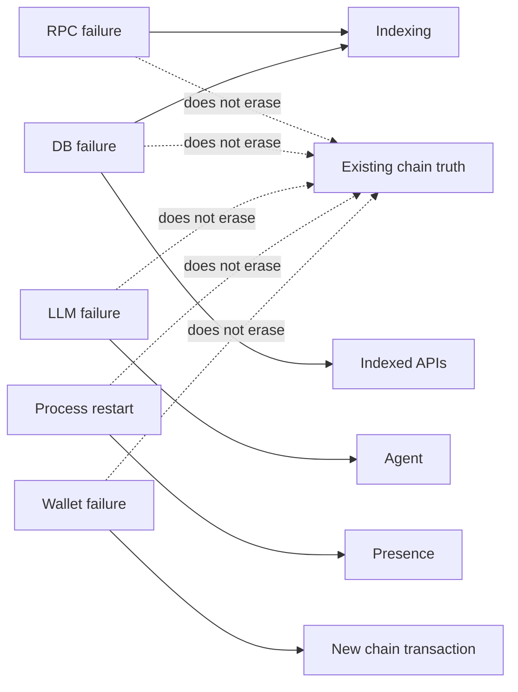
```mermaid
flowchart LR
    RPC["RPC failure"]
    DB["DB failure"]
    LLM["LLM failure"]
    MEM["Process restart"]
    WAL["Wallet failure"]

    INDEX["Indexing"]
    READ["Indexed APIs"]
    AG["Agent"]
    PRES["Presence"]
    TX["New chain transaction"]
    CHAIN["Existing chain truth"]

    RPC --> INDEX
    DB --> INDEX
    DB --> READ
    LLM --> AG
    MEM --> PRES
    WAL --> TX

    RPC -. does not erase .-> CHAIN
    DB -. does not erase .-> CHAIN
    LLM -. does not erase .-> CHAIN
    MEM -. does not erase .-> CHAIN
    WAL -. does not erase .-> CHAIN
```

---

# Data Disclosure by Flow

## Message / Offer / Private Escrow Discovery

Backend:

```text
ciphertext
public metadata
```

Frontend:

```text
plaintext after local decrypt
```

---

# Rekber Indexing

Backend:

```text
public custody/lifecycle event data
```

No claim of hiding public Rekber metadata.

---

# Certificate Indexing

Backend:

```text
public certificate ownership/role/linkage
```

---

# Presence

Backend:

```text
opaque encrypted envelope
timing
channel ID
```

---

# Attachments

Backend:

```text
ciphertext bytes
capability-token hash
ID
timing
```

---

# Feedback

Backend:

```text
plaintext feedback
```

---

# Normal Agent

Backend/provider:

```text
explicit plaintext prompt
sanitized automatic context
tool results
```

---

# Dispute

Backend/provider:

```text
explicitly consented case
accepted terms
statements
evidence
wallet addresses
binding data
attestations
```

---

# Operational Read Flow

For most indexed APIs:

```text
client
    ↓
Express route
    ↓
validation
    ↓
PostgreSQL store
    ↓
normalized JSON
```

---

# Operational Write Flow

For backend-owned application data:

```text
client
    ↓
Express route
    ↓
validation
    ↓
backend storage/runtime
```

Examples:

```text
Presence
Attachments
Feedback
Legacy Loyalty
```

---

# Privileged Write Flow

Only dedicated Dispute AutoResolve can become:

```text
HTTP request
    ↓
backend verification/policy
    ↓
server-held resolver account
    ↓
Rekber contract write
```

This is intentionally isolated.

---

# Request Logger Interaction

Every request passes through minimal request logging after JSON middleware.

Current global log:

```text
METHOD PATH
```

Request body is not logged by the global logger.

---

# Mainnet Proxy Interaction

On mainnet:

```text
trust proxy = 1
```

affects:

```text
req.ip
```

which affects rate-limiter identity.

Deployment proxy topology therefore changes practical request throttling behavior.

---

# Rate-Limit Interaction

Before selected routes:

```text
request
    ↓
fixed-window rate limiter
    ↓
route handler
```

Selected areas:

```text
/discover
/agent
/dispute
/feedback
```

---

# Rate-Limit Failure

Exceeded:

```text
429
```

The request does not reach the underlying route logic.

---

# Graceful Shutdown Interaction

```mermaid
sequenceDiagram
    participant OS as Process Signal
    participant APP as Backend
    participant DI as DiscoveryIndexer
    participant RI as RekberIndexer
    participant CI as CertificateIndexer
    participant HTTP as HTTP Server
    participant DB as PostgreSQL Pool

    OS->>APP: SIGTERM / SIGINT

    par Stop indexers
        APP->>DI: stop()
    and
        APP->>RI: stop()
    and
        APP->>CI: stop()
    end

    DI-->>APP: stopped
    RI-->>APP: stopped
    CI-->>APP: stopped

    APP->>HTTP: close()
    HTTP-->>APP: closed

    APP->>DB: end()
```

---

# Startup Interaction

Before indexers and HTTP runtime are composed:

```text
create database

initialize:
    feedback
    DiscoveryStore
    RekberStore
    CertificateStore
```

Failure aborts normal startup.

---

# Attachment Lazy Initialization Interaction

Attachments differ:

```text
backend starts
    ↓
attachment table may not exist yet

first attachment request
    ↓
ensureTable()
    ↓
CREATE TABLE IF NOT EXISTS
```

---

# Mainnet Readiness Interaction Checks

Before production, validate the interaction paths independently.

---

# Message

```text
wallet write succeeds
Message event indexed
/discover returns record
other client decrypts
```

---

# Offer

```text
Offer write succeeds
Offer event indexed
/discover returns record
counterparty decrypts
```

---

# Private Escrow Coordination

```text
coordination write succeeds
PrivateEscrow event indexed
/discover returns encrypted action
```

---

# Rekber

```text
funding/release/refund/resolution event exists
RekberIndexer advances
/rekber/events sees correct event
/activity sees expected item
```

---

# Certificate

```text
claim succeeds
CertificateIndexer advances
/activity sees issuance
/royalty updates recipient stats
```

---

# Presence

```text
publish
poll
decrypt
TTL expiry
restart behavior
```

---

# Attachments

```text
encrypt
PUT
GET with correct token
GET with wrong token -> 404
decrypt
```

---

# Feedback

```text
POST
DB row stored
optional email does not block response
```

---

# Agent

```text
sanitizer strips private automatic context
provider works
tool scope enforced
proposal not auto-executed
```

---

# Dispute

```text
challenge verifies binding
both parties sign exact case
evaluate verifies attestations
live chain re-read works
policy evaluated
AutoResolve disabled/enabled intentionally
resolver matches Rekber
```

---

# Interaction Anti-Patterns

Do not redesign flows into:

```text
POST /discover sends channelKey to server

backend decrypts Message for convenience

backend interprets encrypted Offer action server-side

Presence becomes settlement evidence

Attachment token becomes wallet identity

Royalty accepts client-award POST

LLM directly calls wallet

LLM raw result directly controls resolver

PostgreSQL becomes canonical Rekber state
```

---

# Correct Interaction Mental Model

```text
private writes:
    client -> wallet -> chain

private reads:
    chain -> background indexer -> DB -> client -> local decrypt

public settlement reads:
    chain -> background indexer -> DB -> client

ephemeral UX:
    client <-> backend memory

encrypted blobs:
    client <-> backend PostgreSQL

AI:
    explicit disclosure -> backend/provider -> proposal

dispute:
    explicit disclosure + signatures + chain verification
    -> Agent
    -> policy
    -> optional resolver
```

---

# Source Files for Interaction Audits

Core runtime:

```text
backend/src/index.ts
backend/src/app.ts
```

Discovery:

```text
backend/src/indexer/service.ts
backend/src/indexer/poolEvents.ts
backend/src/indexer/store.ts
backend/src/routes/discover.ts
```

Rekber:

```text
backend/src/indexer/rekber.ts
backend/src/indexer/rekberStore.ts
backend/src/routes/rekber.ts
```

Certificate:

```text
backend/src/indexer/certificate.ts
backend/src/indexer/certificateStore.ts
```

Merged reads:

```text
backend/src/routes/activity.ts
backend/src/royalty/routes.ts
backend/src/royalty/service.ts
```

Auxiliary:

```text
backend/src/routes/presence.ts
backend/src/routes/attachments.ts
backend/src/routes/feedback.ts
```

Agent:

```text
backend/src/routes/agent.ts
backend/src/agent/
```

Dispute:

```text
backend/src/routes/dispute.ts
backend/src/dispute/
```

---

# Interaction Documentation Rule

When adding a new backend feature, document:

```text
who initiates it

whether it is request-time or background

whether backend reads chain directly

whether backend reads PostgreSQL

whether backend writes PostgreSQL

whether backend receives plaintext

whether backend holds a signing key

whether it can affect chain state

what happens on restart

what happens on dependency failure

what the canonical authority is
```

---

# Final Summary

The current backend interaction model is:

```text
Normal private Deal Room transaction
    -> backend not in signing path

Encrypted discovery
    -> background chain indexing
    -> PostgreSQL
    -> /discover
    -> local decrypt

Public Rekber lifecycle
    -> background Rekber indexing
    -> PostgreSQL
    -> /rekber/events + /activity

Settlement Certificate
    -> background Certificate indexing
    -> PostgreSQL
    -> /activity + /royalty

Presence
    -> request-time encrypted in-memory relay

Attachments
    -> request-time encrypted PostgreSQL storage

Feedback
    -> request-time plaintext PostgreSQL storage

Normal Agent
    -> explicit prompt + sanitized context
    -> remote reasoning
    -> proposal only

Dispute
    -> explicit evidence + signatures + live chain verification
    -> Agent decision
    -> deterministic policy
    -> optional privileged resolver write
```

The most important correction from the older architecture is:

> `/discover` no longer scans Starknet on demand. Background indexers scan and persist state; the API reads that persistent index.

The most important privacy rule remains:

> The backend can help users find encrypted Deal Room state without receiving the keys required to decrypt it.

The most important authority rule is:

> Canonical settlement remains on-chain; only the separately gated Dispute resolver path can turn a backend request into a privileged Rekber authorization write.
