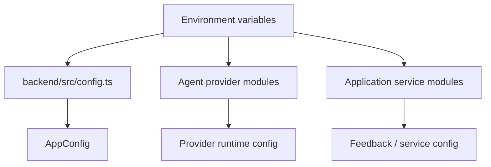
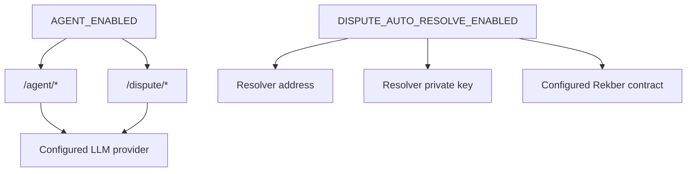
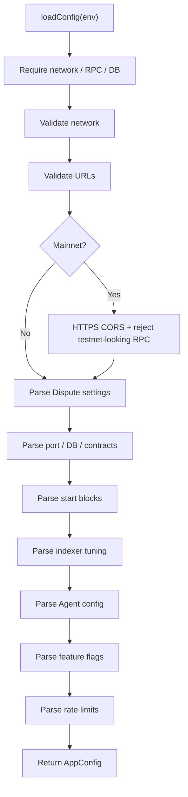
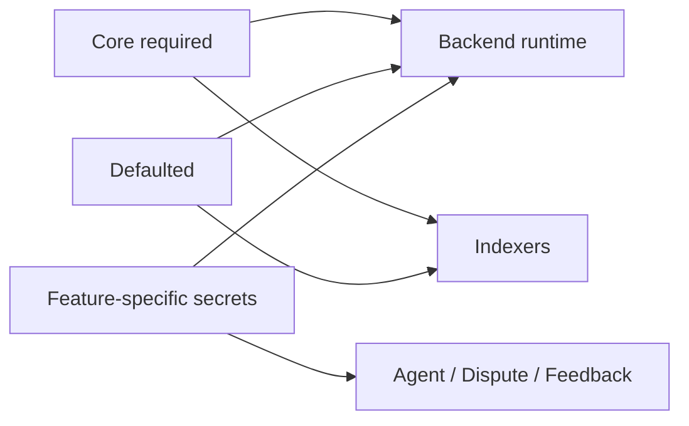

# VINSS Backend Configuration

This document describes the current runtime configuration model for the VINSS backend.

Configuration is not only a list of environment variables.

The current backend uses configuration as an early safety boundary for:

```text
network selection
RPC identity
PostgreSQL connectivity
canonical contract addresses
indexer historical boundaries
indexer resource limits
Agent exposure
Dispute resolver authority
rate limiting
mainnet origin requirements
```

The executable source:

```text
backend/src/config.ts
```

is authoritative for central configuration.

Some optional provider and application-service variables are read directly from:

```text
process.env
```

inside their own modules and are documented separately below.

---

# Configuration Loading

`backend/src/config.ts` imports:

```text
dotenv/config
```

Therefore local `.env`-style environment loading is supported through the normal dotenv mechanism.

At module initialization:

```text
export const config = loadConfig();
```

is evaluated.

Invalid required configuration can therefore fail before normal backend startup completes.

---

# Configuration Philosophy

The current backend follows a mostly fail-closed model for core infrastructure.

Required core values include:

```text
STARKNET_NETWORK
RPC_URL
DATABASE_URL

PRIVACY_POOL_ADDRESS
MESSAGE_HELPER_ADDRESS
OFFER_HELPER_ADDRESS
PRIVATE_ESCROW_HELPER_ADDRESS
ESCROW_REKBER_ADDRESS
SETTLEMENT_CERTIFICATE_ADDRESS

MESSAGE_HELPER_START_BLOCK
OFFER_HELPER_START_BLOCK
PRIVATE_ESCROW_HELPER_START_BLOCK
ESCROW_REKBER_START_BLOCK
SETTLEMENT_CERTIFICATE_START_BLOCK
```

Missing required values throw during configuration loading.

This is materially different from an older model where empty contract addresses might survive startup.

---

# Central Configuration Shape

The current `AppConfig` is conceptually:

```text
port
corsOrigin
rpcUrl
network

database
    url
    ssl

contracts
    privacyPool
    messageHelper
    offerHelper
    privateEscrowHelper
    escrowRekber
    settlementCertificate

indexer
    startBlocks
        message
        offer
        escrow
        rekber
        certificate

    pollIntervalMs
    blockRange
    eventPageSize
    fetchConcurrency

agent
    feeBps
    defaultProvider

dispute
    autoResolveEnabled
    resolverAddress
    resolverPrivateKey

features
    agent
    loyalty

rateLimits
    windowMs
    discover
    agent
```

---

# Configuration Layers

The backend has three practical configuration layers.



Central `AppConfig` does not contain every environment variable used by the backend.

---

# Required vs Optional

A useful distinction:

## Required core startup configuration

```text
STARKNET_NETWORK
RPC_URL
DATABASE_URL

all six canonical contract addresses

all five canonical start blocks
```

## Optional with defaults

```text
PORT
CORS_ORIGIN
DATABASE_SSL

INDEXER_POLL_INTERVAL_MS
INDEXER_BLOCK_RANGE
INDEXER_EVENT_PAGE_SIZE
INDEXER_FETCH_CONCURRENCY

VINSS_FEE_BPS
VINSS_LLM_PROVIDER

AGENT_ENABLED
LOYALTY_ENABLED

RATE_LIMIT_WINDOW_MS
DISCOVER_RATE_LIMIT
AGENT_RATE_LIMIT

DISPUTE_AUTO_RESOLVE_ENABLED
```

## Optional feature/provider/service configuration

```text
VINSS_LLM_FALLBACKS

provider API/model/base-URL variables

DISPUTE_RESOLVER_ADDRESS
DISPUTE_RESOLVER_PRIVATE_KEY

RESEND_API_KEY
FEEDBACK_TO_EMAIL
```

Some optional variables become mandatory when a feature is enabled.

---

# Runtime Variables

## `PORT`

Purpose:

```text
HTTP listen port
```

Default:

```text
4000
```

Validation:

```text
safe integer
minimum 1
maximum 65535
```

Invalid values fail configuration loading.

---

# `STARKNET_NETWORK`

Purpose:

```text
select backend Starknet network identity
```

Required.

Accepted values:

```text
sepolia
mainnet
```

There is currently **no fallback** to Sepolia.

Missing value:

```text
configuration error
```

Unsupported value:

```text
configuration error
```

---

# Network Identity Importance

The configured network is persisted into index records/checkpoint identities.

It influences:

```text
Discovery identity
Rekber identity
Certificate identity
Royalty query namespace
activity namespace
Agent response metadata
Dispute typed-data chain ID
```

Do not change it casually against an existing production database.

---

# `RPC_URL`

Purpose:

```text
Starknet JSON-RPC endpoint
```

Required.

Validation:

```text
must parse as URL

protocol must be:
    http
    https
```

No default RPC URL exists in current `config.ts`.

---

# Mainnet RPC Guard

When:

```text
STARKNET_NETWORK=mainnet
```

the backend constructs:

```text
hostname + pathname
```

from `RPC_URL`, lowercases it, and rejects the URL if it contains:

```text
sepolia
goerli
testnet
```

This catches common accidental testnet URLs.

---

# Mainnet RPC Guard Is Not Proof

The check does **not** query the RPC for chain ID during configuration loading.

Therefore a URL such as:

```text
https://example-rpc.invalid-network-name.com
```

could pass the string-based identity guard even if the endpoint later serves the wrong network.

Production deployment should independently verify actual RPC chain identity.

---

# `CORS_ORIGIN`

Purpose:

```text
allowed browser origin passed to Express CORS middleware
```

Default:

```text
http://localhost:3000
```

---

# Mainnet CORS Guard

When network is:

```text
mainnet
```

the configured/fallback CORS origin is parsed as a URL and must use:

```text
https:
```

Otherwise configuration throws:

```text
Mainnet CORS_ORIGIN must use https.
```

---

# Mainnet Missing CORS Behavior

Because default CORS origin is:

```text
http://localhost:3000
```

a mainnet deployment that omits:

```text
CORS_ORIGIN
```

will fail the HTTPS mainnet guard.

That is desirable fail-closed behavior.

---

# Sepolia CORS Precision

Outside mainnet, `CORS_ORIGIN` is not run through the same explicit URL/HTTPS validation branch in `config.ts`.

It is still passed into the CORS middleware at runtime.

Do not claim identical validation rules for Sepolia and mainnet.

---

# Database Configuration

The backend requires PostgreSQL for core persistent operation.

Variables:

```text
DATABASE_URL
DATABASE_SSL
```

---

# `DATABASE_URL`

Required.

Must parse as a URL.

Accepted protocols:

```text
postgres:
postgresql:
```

Other schemes fail configuration.

Examples of invalid protocol:

```text
mysql:
sqlite:
http:
```

---

# Database URL Is Secret-Sensitive

A PostgreSQL connection URL may contain:

```text
username
password
hostname
database name
query parameters
```

Do not:

```text
commit it
log it
paste production value into docs
include it in screenshots
```

---

# `DATABASE_SSL`

Purpose:

```text
toggle TLS configuration passed to pg
```

Default:

```text
false
```

Boolean parser accepts:

```text
true
1

false
0
```

case-insensitively after trim where applicable.

Other values throw.

---

# Current Database TLS Behavior

When:

```text
DATABASE_SSL=true
```

the pool receives:

```text
ssl:
    rejectUnauthorized: false
```

This means:

```text
TLS encryption is requested
```

but:

```text
Node does not require successful CA/certificate verification
```

under this configuration.

---

# Database TLS Security Precision

Do not describe current behavior as:

```text
strict server certificate verification
```

It is not.

For stronger production TLS authentication, the deployment/database client configuration would need explicit certificate verification policy.

---

# Database Pool

Current pool maximum:

```text
10
```

This is hardcoded in:

```text
backend/src/database.ts
```

There is no current environment variable for pool maximum.

---

# Database Pool Error Logging

Unexpected idle client errors log only:

```text
[database] unexpected idle client error
```

The handler intentionally avoids printing:

```text
connection URL
credentials
environment values
```

---

# Contract Address Configuration

The current backend requires six contract addresses.

```text
PRIVACY_POOL_ADDRESS

MESSAGE_HELPER_ADDRESS

OFFER_HELPER_ADDRESS

PRIVATE_ESCROW_HELPER_ADDRESS

ESCROW_REKBER_ADDRESS

SETTLEMENT_CERTIFICATE_ADDRESS
```

All are required during `loadConfig()`.

---

# Address Validation

Each configured Starknet address must:

```text
be a string

match:
    0x[0-9a-fA-F]+

be numerically > 0

be numerically < 2^251
```

The parser canonicalizes the value to:

```text
0x<lowercase unpadded hex>
```

using numeric conversion.

---

# Address Consequence

Input:

```text
0x000ABC
```

becomes conceptually:

```text
0xabc
```

inside `AppConfig`.

Code comparing address strings should understand this canonicalization.

---

# Zero Address

Rejected.

Example:

```text
0x0
```

fails with:

```text
must be non-zero
```

---

# Outside Felt Range

Any value:

```text
>= 2^251
```

is rejected.

---

# Contract Configuration Authority

The backend does not dynamically discover these contract addresses from another VINSS contract.

Deployment/operator configuration is the source for:

```text
which canonical contract deployment to index
```

Therefore wrong-but-valid addresses can still misconfigure the backend.

Strict syntax validation does not prove deployment identity.

---

# `PRIVACY_POOL_ADDRESS`

Purpose:

```text
configured Privacy Pool identity
```

Required.

Current Discovery definitions and related architecture depend on the backend being aligned with the intended VINSS/STRK20 environment.

---

# `MESSAGE_HELPER_ADDRESS`

Required.

Used to build the Message Discovery index definition.

Must correspond to the intended deployed:

```text
VinssMessageHelper
```

---

# `OFFER_HELPER_ADDRESS`

Required.

Used for:

```text
VinssOfferHelper
```

Discovery indexing.

---

# `PRIVATE_ESCROW_HELPER_ADDRESS`

Required.

Used for encrypted:

```text
Private Escrow coordination
```

Discovery indexing.

Do not substitute the public Rekber custody address here.

---

# `ESCROW_REKBER_ADDRESS`

Required.

Used by:

```text
RekberIndexer
/rekber/events
/activity
Dispute live custody verification
Dispute resolver verification/execution
```

This is security-critical when Dispute AutoResolve is enabled.

---

# `SETTLEMENT_CERTIFICATE_ADDRESS`

Required.

Used by:

```text
CertificateIndexer
CertificateStore identity
/activity certificate records
/royalty/:address
```

---

# Contract Address Separation

Correct:

```text
PRIVATE_ESCROW_HELPER_ADDRESS
    -> encrypted coordination helper

ESCROW_REKBER_ADDRESS
    -> public custody/lifecycle contract

SETTLEMENT_CERTIFICATE_ADDRESS
    -> public certificate contract
```

These addresses are not interchangeable.

---

# Start-Block Configuration

The backend requires five independent historical start blocks.

```text
MESSAGE_HELPER_START_BLOCK

OFFER_HELPER_START_BLOCK

PRIVATE_ESCROW_HELPER_START_BLOCK

ESCROW_REKBER_START_BLOCK

SETTLEMENT_CERTIFICATE_START_BLOCK
```

There are no current fallback values.

---

# Start-Block Validation

Each must be:

```text
safe integer
>= 0
```

---

# Start-Block Purpose

A start block defines:

```text
the earliest block that a given backend indexer considers part of this deployment history
```

Normally it should match:

```text
deployment block
```

or another intentionally selected canonical scan origin.

---

# Why Start Blocks Matter

Too high:

```text
historical events can be omitted
```

Too low:

```text
unnecessary RPC scanning
potential unrelated historical contract-address concerns are avoided because address filtering remains active,
but scan work increases
```

Wrong start block can also conflict with persisted checkpoint state.

---

# Persisted Checkpoint Guard

Discovery/Rekber/Certificate stores persist historical checkpoint origins.

If the configured start block disagrees with the existing initialized checkpoint, store initialization is designed to fail instead of silently rebasing history.

Therefore changing a start block in a live environment is not equivalent to:

```text
just changing a stateless env value
```

Database checkpoint state matters.

---

# Indexer Tuning Configuration

Current variables:

```text
INDEXER_POLL_INTERVAL_MS
INDEXER_BLOCK_RANGE
INDEXER_EVENT_PAGE_SIZE
INDEXER_FETCH_CONCURRENCY
```

---

# `INDEXER_POLL_INTERVAL_MS`

Purpose:

```text
delay between background indexer cycles
```

Default:

```text
5000
```

Bounds:

```text
minimum 1000
maximum 300000
```

Units:

```text
milliseconds
```

---

# Poll Interval Trade-off

Lower:

```text
faster expected index freshness
more frequent RPC work
```

Higher:

```text
lower polling frequency
potentially more visible backend index lag
```

It does not change chain finality.

---

# `INDEXER_BLOCK_RANGE`

Purpose:

```text
maximum block span processed in one sync chunk
```

Default:

```text
2000
```

Bounds:

```text
1..50000
```

---

# Block Range Trade-off

Larger range:

```text
fewer checkpoint iterations
potentially heavier RPC event requests
```

Smaller range:

```text
more iterations/checkpoint writes
smaller request windows
```

Provider limits should be considered.

---

# `INDEXER_EVENT_PAGE_SIZE`

Purpose:

```text
Starknet getEvents chunk_size
```

Default:

```text
100
```

Bounds:

```text
1..1000
```

---

# Event Page Size Is Not Block Range

Do not confuse:

```text
INDEXER_BLOCK_RANGE
```

with:

```text
INDEXER_EVENT_PAGE_SIZE
```

One controls:

```text
block-number scan window
```

The other controls:

```text
events returned per paginated RPC page
```

---

# `INDEXER_FETCH_CONCURRENCY`

Purpose:

```text
parallel ciphertext hydration concurrency
```

Default:

```text
4
```

Bounds:

```text
1..16
```

---

# Fetch Concurrency Scope

This setting is especially relevant to Discovery hydration where helper getters are used to fetch encrypted record/chunk data.

It is not:

```text
number of backend HTTP workers
database pool size
Rekber event page size
```

---

# Agent Central Configuration

Central Agent configuration includes:

```text
VINSS_FEE_BPS
VINSS_LLM_PROVIDER
AGENT_ENABLED
AGENT_RATE_LIMIT
```

Additional provider variables are read directly by provider modules.

---

# `VINSS_FEE_BPS`

Purpose:

```text
illustrative Agent calculate_fee helper
```

Default:

```text
200
```

Bounds:

```text
0..10000
```

---

# `VINSS_FEE_BPS` Meaning

`200` means:

```text
200 basis points
= 2%
```

inside the Agent's local illustrative calculation.

---

# Fee Boundary

`VINSS_FEE_BPS` is **not** the canonical fee configuration for:

```text
Message Helper
Offer Helper
Invite
Rekber funding
FeePolicy oracle pricing
sponsor reserve floor
application workflow fee
```

Those paths are defined elsewhere.

Do not change `VINSS_FEE_BPS` expecting on-chain FeePolicy to change.

---

# `VINSS_LLM_PROVIDER`

Purpose:

```text
default Agent provider selection
```

Accepted:

```text
auto
groq
openai
anthropic
qwen
```

Default:

```text
groq
```

Invalid value fails central configuration.

---

# `VINSS_LLM_FALLBACKS`

Purpose:

```text
comma-separated provider fallback order
```

This variable is **not** parsed into central `AppConfig`.

It is read directly in:

```text
backend/src/agent/providers/registry.ts
```

Recognized entries:

```text
groq
openai
anthropic
qwen
```

Unknown entries are removed.

Duplicates are deduplicated.

---

# Provider Fallback Privacy

Fallback can result in the same explicit Agent prompt being transmitted to multiple configured providers sequentially when earlier providers fail.

Operators should configure fallbacks with this disclosure property in mind.

---

# `AGENT_ENABLED`

Purpose:

```text
mount /agent and /dispute routes
```

Boolean parser:

```text
true / 1
false / 0
```

Default depends on network.

```text
mainnet:
    false

non-mainnet:
    true
```

---

# Agent Feature-Gate Scope

Current app mounting behavior:

```text
AGENT_ENABLED=true
```

mounts both:

```text
/agent/*
/dispute/*
```

Therefore enabling Agent also exposes Dispute challenge/evaluate routes.

Dispute AutoResolve remains separately controlled.

---

# Mainnet Agent Rule

Source defaults Agent to disabled on mainnet.

A production operator must intentionally set:

```text
AGENT_ENABLED=true
```

to expose Agent/Dispute routes.

---

# `LOYALTY_ENABLED`

Purpose:

```text
mount legacy /loyalty/* preview routes
```

Default:

```text
false
```

This default does not depend on network.

---

# Loyalty Fail-Closed Rule

Current app comments explicitly treat Loyalty as:

```text
unauthenticated
in-memory
non-valuable preview
```

It stays unmounted unless deliberately enabled.

---

# Rate-Limit Configuration

Central variables:

```text
RATE_LIMIT_WINDOW_MS
DISCOVER_RATE_LIMIT
AGENT_RATE_LIMIT
```

---

# `RATE_LIMIT_WINDOW_MS`

Default:

```text
60000
```

Bounds:

```text
1000..3600000
```

Units:

```text
milliseconds
```

---

# `DISCOVER_RATE_LIMIT`

Default:

```text
120
```

Bounds:

```text
1..10000
```

Meaning:

```text
maximum requests per configured fixed window
for /discover limiter
per backend-observed client identity
```

---

# `AGENT_RATE_LIMIT`

Default:

```text
12
```

Bounds:

```text
1..1000
```

Used for:

```text
/agent
```

and currently also:

```text
/dispute
```

---

# Feedback Rate Limit Is Separate

`POST /feedback` does not use a central feedback environment variable.

Current hardcoded limiter:

```text
5 requests
per 60000 ms
```

Therefore changing:

```text
RATE_LIMIT_WINDOW_MS
```

does not change the Feedback limiter's 60-second window.

---

# Rate-Limit Storage

Current limiter state is:

```text
in-memory
process-local
```

No environment variable turns it into a shared Redis/distributed limiter.

Multi-replica deployment must account for independent counters.

---

# Dispute Configuration

Central Dispute variables:

```text
DISPUTE_AUTO_RESOLVE_ENABLED
DISPUTE_RESOLVER_ADDRESS
DISPUTE_RESOLVER_PRIVATE_KEY
```

---

# `DISPUTE_AUTO_RESOLVE_ENABLED`

Default:

```text
false
```

Boolean parser accepts:

```text
true / 1
false / 0
```

---

# Dispute Routes vs AutoResolve

Important:

```text
AGENT_ENABLED
```

controls whether `/dispute/*` routes are mounted.

```text
DISPUTE_AUTO_RESOLVE_ENABLED
```

controls whether the dedicated resolver executor can create a new resolver authorization.

These are different gates.

---

# `DISPUTE_RESOLVER_ADDRESS`

Optional when AutoResolve is disabled.

If non-empty, it is validated as a Starknet address using the same strict parser as contract addresses:

```text
0x-prefixed hex
non-zero
< 2^251
canonicalized
```

---

# `DISPUTE_RESOLVER_PRIVATE_KEY`

Optional when AutoResolve is disabled.

If non-empty, current configuration validates only:

```text
matches 0x-prefixed hexadecimal string
```

at config time.

---

# Resolver Private-Key Validation Precision

Current `config.ts` does **not** explicitly check the resolver private key for:

```text
non-zero
< Starknet felt prime/range
```

during configuration parsing.

Later Starknet account/signer behavior may fail for invalid values.

Do not overclaim stronger validation than currently implemented.

---

# AutoResolve Required Pair

If:

```text
DISPUTE_AUTO_RESOLVE_ENABLED=true
```

both must be non-empty:

```text
DISPUTE_RESOLVER_ADDRESS
DISPUTE_RESOLVER_PRIVATE_KEY
```

Otherwise configuration throws:

```text
Automatic dispute resolution requires a dedicated resolver address and private key.
```

---

# Resolver Contract Check Happens Later

Even a syntactically valid configured resolver address is not enough.

At execution time, the Dispute executor also reads:

```text
get_dispute_resolver
```

from the configured Rekber contract and requires the configured backend resolver to match.

That is runtime security validation, not `loadConfig()` validation.

---

# Resolver Secret Classification

`DISPUTE_RESOLVER_PRIVATE_KEY` is one of the highest-sensitivity backend secrets.

It can authorize an exact resolution split through the dedicated resolver path when all other policy gates permit.

Never:

```text
commit it
print it
include it in a support transcript
include it in screenshots
copy it into frontend env
place it in NEXT_PUBLIC_* variables
```

---

# Groq Provider Configuration

Read directly by:

```text
backend/src/agent/providers/groq.ts
```

Variables:

```text
GROQ_API_KEY
GROQ_MODEL
```

---

# `GROQ_API_KEY`

Required for Groq to be considered configured.

Empty/missing:

```text
Groq excluded from configured provider set
```

---

# `GROQ_MODEL`

Optional.

Current default:

```text
openai/gpt-oss-120b
```

---

# OpenAI Provider Configuration

Read directly by the OpenAI-compatible provider module.

Variables:

```text
OPENAI_API_KEY
OPENAI_MODEL
OPENAI_BASE_URL
```

---

# `OPENAI_API_KEY`

Required.

---

# `OPENAI_MODEL`

Required for OpenAI provider to be considered configured.

There is currently no built-in OpenAI model default.

---

# `OPENAI_BASE_URL`

Optional.

Default:

```text
https://api.openai.com/v1
```

Trailing slashes are stripped before request construction.

---

# Qwen Provider Configuration

Variables:

```text
QWEN_API_KEY
DASHSCOPE_API_KEY
QWEN_MODEL
QWEN_BASE_URL
```

---

# Qwen Key Precedence

API key expression:

```text
QWEN_API_KEY
or
DASHSCOPE_API_KEY
```

So `QWEN_API_KEY` is preferred when present.

---

# `QWEN_MODEL`

Default:

```text
qwen-plus
```

---

# `QWEN_BASE_URL`

Default:

```text
https://dashscope-intl.aliyuncs.com/compatible-mode/v1
```

---

# Anthropic Provider Configuration

Variables:

```text
ANTHROPIC_API_KEY
ANTHROPIC_MODEL
ANTHROPIC_BASE_URL
ANTHROPIC_VERSION
ANTHROPIC_MAX_TOKENS
```

---

# `ANTHROPIC_API_KEY`

Required for Anthropic provider.

---

# `ANTHROPIC_MODEL`

Required.

No built-in Anthropic model default is currently used for `isConfigured()`.

---

# `ANTHROPIC_BASE_URL`

Default:

```text
https://api.anthropic.com/v1
```

---

# `ANTHROPIC_VERSION`

Default:

```text
2023-06-01
```

Used as:

```text
anthropic-version
```

HTTP header.

---

# `ANTHROPIC_MAX_TOKENS`

Default:

```text
2048
```

Current provider code reads it with:

```text
Number(...)
```

rather than central `parseInteger()` validation.

Therefore malformed values do not receive the same startup validation quality as central config integers.

---

# Provider Configuration Boundary

Provider-specific environment variables are not all validated at backend startup.

A backend can start successfully with:

```text
AGENT_ENABLED=true
```

but zero configured LLM providers.

Then Agent requests can fail at runtime with:

```text
No configured VINSS LLM provider is available.
```

which the public Agent route maps to generic:

```text
Agent failed.
```

---

# Provider Selection vs Availability

`VINSS_LLM_PROVIDER=groq`

does not prove:

```text
GROQ_API_KEY exists
```

The registry later filters candidates to providers whose `isConfigured()` returns true.

---

# Feedback Service Configuration

Feedback uses environment values directly in:

```text
backend/src/routes/feedback.ts
```

Variables:

```text
RESEND_API_KEY
FEEDBACK_TO_EMAIL
```

---

# `RESEND_API_KEY`

Optional.

If absent:

```text
feedback still stores in PostgreSQL
email notification skipped
emailQueued = false
```

If present:

```text
feedback DB insert succeeds
HTTP response can report emailQueued = true
best-effort async Resend call starts afterward
```

---

# Feedback Email Is Non-Authoritative

Resend success/failure does not determine whether feedback was stored.

PostgreSQL insert is authoritative for the feedback service.

---

# `FEEDBACK_TO_EMAIL`

Optional.

Current fallback:

```text
dxjlabs@gmail.com
```

This value is an application notification destination.

It is not a user identity or protocol setting.

---

# Feedback Sender

Current sender is hardcoded in route source:

```text
VINSS Feedback <onboarding@resend.dev>
```

There is no current environment variable for the sender address.

---

# Attachments Configuration

Encrypted attachments currently have no dedicated environment variables for:

```text
maximum size
capability header name
table name
cache max-age
```

Those are hardcoded.

Current notable values:

```text
20 MiB max upload

x-vinss-attachment-token

Cache-Control:
    private, max-age=300
```

---

# Presence Configuration

Presence currently has no environment variables for:

```text
TTL min/max
event limit
channel format
ciphertext string size
```

Those are hardcoded in route source.

---

# Health Configuration

`GET /health` does not have a dedicated health environment variable.

Its behavior derives from:

```text
configured indexer identities
persistent checkpoint state
```

---

# OpenAPI Configuration

OpenAPI document metadata is hardcoded in:

```text
backend/src/openapi.ts
```

There is no environment variable for:

```text
OpenAPI version
API document version
Swagger title
```

Current Swagger site title is configured in `app.ts`.

---

# Mainnet Reverse Proxy Behavior

When:

```text
STARKNET_NETWORK=mainnet
```

the app automatically executes:

```text
app.set("trust proxy", 1)
```

There is no environment variable to alter the trusted proxy count.

---

# Proxy Topology Assumption

Current source assumes:

```text
VINSS is behind one managed reverse proxy
```

This affects:

```text
req.ip
rate-limit identity
```

Production infrastructure must match that assumption.

---

# Boolean Parser

Central boolean variables use one parser.

Accepted truthy:

```text
true
1
```

Accepted false:

```text
false
0
```

Case is normalized.

Whitespace is trimmed.

Anything else throws.

---

# Boolean Variables Using Central Parser

```text
DATABASE_SSL
DISPUTE_AUTO_RESOLVE_ENABLED
AGENT_ENABLED
LOYALTY_ENABLED
```

---

# Integer Parser

Central integer settings require:

```text
Number.isSafeInteger(...)
```

Optional bounds are then enforced.

This is stronger than accepting arbitrary numeric strings.

---

# Integer Values That Fail

Examples:

```text
1.5

NaN

Infinity

9007199254740992
```

fail safe-integer validation.

---

# Required Integer Variables

No fallback:

```text
MESSAGE_HELPER_START_BLOCK
OFFER_HELPER_START_BLOCK
PRIVATE_ESCROW_HELPER_START_BLOCK
ESCROW_REKBER_START_BLOCK
SETTLEMENT_CERTIFICATE_START_BLOCK
```

---

# Defaulted Integer Variables

```text
PORT

INDEXER_POLL_INTERVAL_MS
INDEXER_BLOCK_RANGE
INDEXER_EVENT_PAGE_SIZE
INDEXER_FETCH_CONCURRENCY

VINSS_FEE_BPS

RATE_LIMIT_WINDOW_MS
DISCOVER_RATE_LIMIT
AGENT_RATE_LIMIT
```

---

# Central Defaults Table

| Variable | Default | Bounds / values |
|---|---:|---|
| `PORT` | `4000` | `1..65535` |
| `CORS_ORIGIN` | `http://localhost:3000` | mainnet must be HTTPS |
| `DATABASE_SSL` | `false` | boolean |
| `INDEXER_POLL_INTERVAL_MS` | `5000` | `1000..300000` |
| `INDEXER_BLOCK_RANGE` | `2000` | `1..50000` |
| `INDEXER_EVENT_PAGE_SIZE` | `100` | `1..1000` |
| `INDEXER_FETCH_CONCURRENCY` | `4` | `1..16` |
| `VINSS_FEE_BPS` | `200` | `0..10000` |
| `VINSS_LLM_PROVIDER` | `groq` | `auto/groq/openai/anthropic/qwen` |
| `DISPUTE_AUTO_RESOLVE_ENABLED` | `false` | boolean |
| `AGENT_ENABLED` | network-dependent | mainnet false, non-mainnet true |
| `LOYALTY_ENABLED` | `false` | boolean |
| `RATE_LIMIT_WINDOW_MS` | `60000` | `1000..3600000` |
| `DISCOVER_RATE_LIMIT` | `120` | `1..10000` |
| `AGENT_RATE_LIMIT` | `12` | `1..1000` |

---

# Required Core Table

| Variable | Required | Validation |
|---|---:|---|
| `STARKNET_NETWORK` | Yes | `sepolia` or `mainnet` |
| `RPC_URL` | Yes | `http/https` URL |
| `DATABASE_URL` | Yes | `postgres/postgresql` URL |
| `PRIVACY_POOL_ADDRESS` | Yes | nonzero Starknet felt-range address |
| `MESSAGE_HELPER_ADDRESS` | Yes | same |
| `OFFER_HELPER_ADDRESS` | Yes | same |
| `PRIVATE_ESCROW_HELPER_ADDRESS` | Yes | same |
| `ESCROW_REKBER_ADDRESS` | Yes | same |
| `SETTLEMENT_CERTIFICATE_ADDRESS` | Yes | same |
| `MESSAGE_HELPER_START_BLOCK` | Yes | safe integer >= 0 |
| `OFFER_HELPER_START_BLOCK` | Yes | safe integer >= 0 |
| `PRIVATE_ESCROW_HELPER_START_BLOCK` | Yes | safe integer >= 0 |
| `ESCROW_REKBER_START_BLOCK` | Yes | safe integer >= 0 |
| `SETTLEMENT_CERTIFICATE_START_BLOCK` | Yes | safe integer >= 0 |

---

# Provider Defaults Table

| Variable | Default / requirement |
|---|---|
| `GROQ_API_KEY` | Required for Groq |
| `GROQ_MODEL` | `openai/gpt-oss-120b` |
| `OPENAI_API_KEY` | Required for OpenAI |
| `OPENAI_MODEL` | Required |
| `OPENAI_BASE_URL` | `https://api.openai.com/v1` |
| `QWEN_API_KEY` | Preferred Qwen key |
| `DASHSCOPE_API_KEY` | Qwen fallback key |
| `QWEN_MODEL` | `qwen-plus` |
| `QWEN_BASE_URL` | DashScope intl compatible endpoint |
| `ANTHROPIC_API_KEY` | Required for Anthropic |
| `ANTHROPIC_MODEL` | Required |
| `ANTHROPIC_BASE_URL` | `https://api.anthropic.com/v1` |
| `ANTHROPIC_VERSION` | `2023-06-01` |
| `ANTHROPIC_MAX_TOKENS` | `2048` |

---

# Feature Dependency Matrix



`DISPUTE_AUTO_RESOLVE_ENABLED=true` does not itself mount the Dispute routes if Agent is disabled.

---

# Mainnet Example File

Repository contains:

```text
backend/env.mainnet.example
```

It currently includes placeholders for:

```text
PORT
STARKNET_NETWORK
RPC_URL
CORS_ORIGIN
DATABASE_URL
DATABASE_SSL

all six contract addresses

all five start blocks

AGENT_ENABLED
LOYALTY_ENABLED
VINSS_FEE_BPS
RATE_LIMIT_WINDOW_MS
DISCOVER_RATE_LIMIT
AGENT_RATE_LIMIT
```

---

# Mainnet Example Omissions

The current example does not enumerate every optional variable.

It currently omits examples for areas such as:

```text
INDEXER_POLL_INTERVAL_MS
INDEXER_BLOCK_RANGE
INDEXER_EVENT_PAGE_SIZE
INDEXER_FETCH_CONCURRENCY

VINSS_LLM_PROVIDER
VINSS_LLM_FALLBACKS
provider credentials/models

DISPUTE_AUTO_RESOLVE_ENABLED
DISPUTE_RESOLVER_ADDRESS
DISPUTE_RESOLVER_PRIVATE_KEY

RESEND_API_KEY
FEEDBACK_TO_EMAIL
```

This is not inherently a runtime defect because these are optional/defaulted or feature-specific.

Operators still need to understand them before enabling those features.

---

# Recommended Mainnet Core Template

Use placeholders only.

Never put real credentials into committed documentation.

```env
PORT=4000

STARKNET_NETWORK=mainnet
RPC_URL=https://<verified-mainnet-rpc>
CORS_ORIGIN=https://<production-frontend-origin>

DATABASE_URL=postgresql://<production-database>
DATABASE_SSL=true

PRIVACY_POOL_ADDRESS=0x<verified-mainnet-privacy-pool>
MESSAGE_HELPER_ADDRESS=0x<verified-mainnet-message-helper>
OFFER_HELPER_ADDRESS=0x<verified-mainnet-offer-helper>
PRIVATE_ESCROW_HELPER_ADDRESS=0x<verified-mainnet-private-escrow-helper>
ESCROW_REKBER_ADDRESS=0x<verified-mainnet-rekber>
SETTLEMENT_CERTIFICATE_ADDRESS=0x<verified-mainnet-certificate>

MESSAGE_HELPER_START_BLOCK=<deployment-block>
OFFER_HELPER_START_BLOCK=<deployment-block>
PRIVATE_ESCROW_HELPER_START_BLOCK=<deployment-block>
ESCROW_REKBER_START_BLOCK=<deployment-block>
SETTLEMENT_CERTIFICATE_START_BLOCK=<deployment-block>

AGENT_ENABLED=false
LOYALTY_ENABLED=false

VINSS_FEE_BPS=200

RATE_LIMIT_WINDOW_MS=60000
DISCOVER_RATE_LIMIT=120
AGENT_RATE_LIMIT=12
```

---

# Recommended Indexer Explicitness

Although indexer tuning has defaults, production operators may choose to set them explicitly for reproducibility.

Example:

```env
INDEXER_POLL_INTERVAL_MS=5000
INDEXER_BLOCK_RANGE=2000
INDEXER_EVENT_PAGE_SIZE=100
INDEXER_FETCH_CONCURRENCY=4
```

These are current defaults, not universal optimal production values.

---

# Recommended Agent-Disabled Mainnet

If Agent is not intentionally part of first mainnet deployment:

```env
AGENT_ENABLED=false
```

Then provider credentials are unnecessary for normal core indexing.

---

# Recommended Loyalty Mainnet

Current safe default:

```env
LOYALTY_ENABLED=false
```

Do not enable legacy Loyalty merely because frontend has a points UI.

Royalty is a separate certificate-derived path.

---

# Optional Agent Mainnet Template

If Agent is intentionally enabled:

```env
AGENT_ENABLED=true

VINSS_LLM_PROVIDER=<groq|openai|anthropic|qwen|auto>
VINSS_LLM_FALLBACKS=<optional-comma-separated-provider-order>

# configure only intended providers
GROQ_API_KEY=<secret>
GROQ_MODEL=<model>

OPENAI_API_KEY=<secret>
OPENAI_MODEL=<model>
OPENAI_BASE_URL=https://api.openai.com/v1

ANTHROPIC_API_KEY=<secret>
ANTHROPIC_MODEL=<model>

QWEN_API_KEY=<secret>
QWEN_MODEL=qwen-plus
```

Do not configure unused providers merely for convenience.

---

# Agent Fallback Data Governance

Every provider placed in the fallback chain can potentially receive:

```text
explicit user Agent prompt
sanitized automatic context
tool results
```

during failover.

Provider configuration is therefore also a data-governance decision.

---

# Dispute Without AutoResolve

Possible configuration:

```env
AGENT_ENABLED=true
DISPUTE_AUTO_RESOLVE_ENABLED=false
```

Result:

```text
Dispute routes mounted

Dispute Agent evaluation available

new resolver authorization disabled
```

---

# AutoResolve Template

Only if deliberately enabling privileged backend resolution:

```env
AGENT_ENABLED=true

DISPUTE_AUTO_RESOLVE_ENABLED=true
DISPUTE_RESOLVER_ADDRESS=0x<dedicated-resolver-address>
DISPUTE_RESOLVER_PRIVATE_KEY=0x<dedicated-resolver-private-key>
```

---

# AutoResolve Deployment Requirement

Before setting it true, verify:

```text
configured ESCROW_REKBER_ADDRESS is canonical

on-chain get_dispute_resolver matches backend resolver

resolver account is funded as required for transaction execution

resolver private key is stored only in server secret management

Dispute verification tests pass

policy thresholds are understood

monitoring exists for resolver transactions
```

---

# Do Not Reuse User Wallet Key

The resolver key must not be:

```text
founder personal wallet key

payer key

payee key

frontend wallet key

Ready seed phrase
```

Use a dedicated operational resolver account if AutoResolve is enabled.

---

# Feedback Email Template

Optional:

```env
RESEND_API_KEY=<secret>
FEEDBACK_TO_EMAIL=<operator-email>
```

Without `RESEND_API_KEY`, feedback persistence still works.

---

# Secret Classification

## Critical signing secret

```text
DISPUTE_RESOLVER_PRIVATE_KEY
```

## Provider API secrets

```text
GROQ_API_KEY
OPENAI_API_KEY
ANTHROPIC_API_KEY
QWEN_API_KEY
DASHSCOPE_API_KEY
RESEND_API_KEY
```

## Database secret-bearing configuration

```text
DATABASE_URL
```

## Usually public infrastructure identifiers

```text
STARKNET_NETWORK
RPC_URL
CORS_ORIGIN
contract addresses
start blocks
```

RPC URLs can still contain provider-specific secret tokens and must be classified according to the actual URL.

---

# RPC URL Secret Nuance

Some hosted RPC providers encode credentials in:

```text
path
query
hostname
```

Therefore do not automatically treat:

```text
RPC_URL
```

as safe to publish.

---

# Public Contract Addresses

Contract addresses are public on-chain identifiers.

They are not secrets.

But wrong values can cause serious operational misconfiguration.

Treat them as:

```text
public but integrity-critical
```

---

# Start Blocks

Start blocks are public metadata.

They are also integrity-critical because they determine historical indexing scope.

---

# Feature Flags

Feature flags are not secrets.

But their production values reveal service exposure.

They should still be managed intentionally.

---

# Configuration Validation Flow



---

# Configuration Failure Behavior

Errors thrown during:

```text
config module evaluation
```

can prevent normal process startup.

The top-level runtime ultimately treats initialization errors as fatal.

---

# Examples of Fail-Fast Errors

```text
Missing required env var: STARKNET_NETWORK

STARKNET_NETWORK must be "sepolia" or "mainnet"

RPC_URL must be a valid URL

RPC_URL must use http or https

DATABASE_URL must be a valid PostgreSQL URL

DATABASE_URL must use postgres or postgresql

PRIVACY_POOL_ADDRESS must be non-zero

MESSAGE_HELPER_START_BLOCK must be >= 0

Mainnet CORS_ORIGIN must use https

Mainnet RPC_URL appears to reference a test network

Automatic dispute resolution requires a dedicated resolver address and private key
```

Exact error strings belong to executable source.

---

# Environment Mixing Risk

The backend configuration ties together:

```text
network
RPC
contract addresses
start blocks
database checkpoint identity
```

A safe deployment must update them as a coherent set.

---

# Dangerous Mixed Example

```text
STARKNET_NETWORK=mainnet

RPC_URL=<mainnet>

MESSAGE_HELPER_ADDRESS=<Sepolia helper>
```

The address can be syntactically valid and still be wrong for mainnet.

`parseAddress()` cannot detect semantic deployment mismatch.

---

# Another Dangerous Mixed Example

```text
mainnet contract addresses

but

existing PostgreSQL database containing Sepolia checkpoint identities
```

Network-aware identities reduce direct collision risk, but operators still need intentional database/environment management.

---

# Deployment Validation Must Go Beyond Parsing

Configuration parsing proves:

```text
shape
basic type
basic network guard
address felt-range validity
integer bounds
feature dependencies
```

It does not prove:

```text
contract class hash

contract ABI compatibility

contract address belongs to configured network

start block is exact deployment block

RPC chain ID

database backups

provider credentials actually work

resolver key controls declared address

resolver address has correct on-chain authority
```

Those require deployment verification.

---

# Mainnet Configuration Verification Sequence

Recommended:

```text
1. Verify STARKNET_NETWORK.

2. Verify RPC endpoint and actual chain ID.

3. Verify CORS production origin.

4. Verify DATABASE_URL and intended database.

5. Verify database SSL policy.

6. Verify all six contract addresses against deployment records.

7. Verify all five deployment/start blocks.

8. Verify indexer tuning.

9. Verify Agent feature flag.

10. Verify Loyalty remains intentionally disabled/enabled.

11. Verify rate limits.

12. If Agent enabled:
      verify provider selection
      verify fallback list
      verify provider credentials/models

13. If Dispute AutoResolve enabled:
      verify resolver address/key
      verify on-chain resolver match

14. Verify optional Feedback email settings.

15. Start backend.

16. Inspect /health checkpoint identities.

17. Verify live indexed events.
```

---

# `/health` as Configuration Evidence

After startup, `/health` exposes useful evidence such as:

```text
network

Discovery identities
contract addresses
start blocks

Rekber checkpoint identity

Certificate checkpoint identity
```

Use this to catch unexpected runtime configuration.

Do not publish sensitive unrelated environment variables.

---

# What `/health` Does Not Show

It should not expose:

```text
DATABASE_URL

provider API keys

resolver private key

attachment tokens

feedback email API key
```

---

# Configuration and Persistence

Start-block configuration interacts with persisted PostgreSQL checkpoint state.

This means configuration cannot always be safely changed without considering database history.

---

# Configuration and Reindexing

If intentionally reindexing from a new historical origin, operators may need an explicit migration/reset procedure.

Do not simply change:

```text
*_START_BLOCK
```

against an existing checkpoint and expect silent rewind.

---

# Configuration and Contract Upgrade

When deploying a replacement helper/Rekber/certificate contract:

```text
new address
+
new start block
```

should be treated as one versioned operational pair.

---

# Canonical Naming

Current backend configuration uses:

```text
ESCROW_REKBER_ADDRESS
SETTLEMENT_CERTIFICATE_ADDRESS
```

Do not introduce stale env names such as:

```text
ESCROW_REKBER_V2_ADDRESS
SETTLEMENT_CERTIFICATE_V2_ADDRESS
```

unless the source is deliberately changed to support them.

---

# V2 Naming Boundary

Message/Offer/Private Escrow encrypted envelope versions can be V2 at the protocol level.

That does not require backend contract environment names to become:

```text
*_V2_ADDRESS
```

Current canonical contracts remain unversioned in backend config names.

---

# Mainnet Example Accuracy

Current repository example correctly treats these as required:

```text
DATABASE_URL

all six contract addresses

all five start blocks
```

This is aligned with current central configuration.

---

# Mainnet Example Security Rule

The example says:

```text
Copy into the backend secret manager.
Never commit real credentials.
```

That is the correct operational posture.

---

# Environment File Rule

Do not commit:

```text
.env
.env.production
Railway-exported secrets
real mainnet credential files
```

unless repository policy explicitly uses a secure encrypted-secret system.

Plaintext secret files do not belong in Git.

---

# Frontend Environment Boundary

Never place backend secrets in:

```text
NEXT_PUBLIC_*
```

or any environment variable bundled into client JavaScript.

---

# Safe Frontend-Public Values

Some values may legitimately be public in frontend config, such as:

```text
public contract addresses
network
public API base URL
```

But provider keys/database credentials/resolver key must remain backend-only.

---

# Secret Manager Boundary

Production secrets should live in the hosting provider/server secret environment.

Examples:

```text
Railway Variables
managed secret store
deployment environment secrets
```

not repository source.

---

# Logging Boundary

Do not log:

```text
process.env

full AppConfig if it includes secrets

DATABASE_URL

RPC_URL if it contains API token

provider API keys

resolver private key

Resend API key
```

---

# Error Boundary

Central parser error messages generally identify:

```text
which variable is invalid
```

but do not print secret values except one boolean parser message can echo an invalid boolean string.

Do not use secrets in boolean variables.

---

# Resolver Private Key Error Precision

The invalid resolver-key error is generic:

```text
DISPUTE_RESOLVER_PRIVATE_KEY must be a 0x-prefixed felt.
```

The key itself is not included in the message.

---

# Provider Error Logging

Provider failover logs provider identity only.

Raw upstream errors may echo user prompt content and are intentionally not logged by the Agent orchestrator.

Configuration docs should preserve that logging discipline.

---

# Database SSL Operational Decision

Because current `DATABASE_SSL=true` uses:

```text
rejectUnauthorized: false
```

operators should understand the exact threat model.

It protects against passive plaintext observation better than no TLS.

It does not authenticate the database certificate chain strictly.

---

# Potential Future Database TLS Hardening

A future configuration model could expose:

```text
CA certificate

strict verify toggle

server name validation
```

but those do not exist in current source.

Do not document them as available today.

---

# Potential Future Distributed Rate Limit

Current source has no:

```text
REDIS_URL
RATE_LIMIT_REDIS_URL
```

or equivalent shared limit configuration.

Do not document distributed rate limiting as implemented.

---

# Potential Future Presence Store

Current source has no environment variable to select:

```text
Redis Presence
PostgreSQL Presence
```

Presence is hardcoded process-memory behavior.

---

# Potential Future Attachment Retention

Current source has no environment variable for:

```text
attachment TTL
cleanup interval
retention days
```

Persistent encrypted attachments remain until external/manual/application cleanup is implemented.

---

# Configuration Security Matrix

| Variable class | Confidentiality | Integrity importance |
|---|---:|---:|
| Network | Public | Critical |
| Contract address | Public | Critical |
| Start block | Public | High |
| CORS origin | Public | High |
| RPC URL | Depends on provider token | Critical |
| Database URL | Secret | Critical |
| Provider API keys | Secret | High |
| Resolver private key | Secret | Critical |
| Rate limits | Public-ish | Medium |
| Feature flags | Public-ish | High |
| Indexer tuning | Public-ish | Medium |
| Feedback email destination | Operational | Medium |

---

# Runtime Configuration Summary



---

# Core Required Set

```text
STARKNET_NETWORK
RPC_URL
DATABASE_URL

PRIVACY_POOL_ADDRESS
MESSAGE_HELPER_ADDRESS
OFFER_HELPER_ADDRESS
PRIVATE_ESCROW_HELPER_ADDRESS
ESCROW_REKBER_ADDRESS
SETTLEMENT_CERTIFICATE_ADDRESS

MESSAGE_HELPER_START_BLOCK
OFFER_HELPER_START_BLOCK
PRIVATE_ESCROW_HELPER_START_BLOCK
ESCROW_REKBER_START_BLOCK
SETTLEMENT_CERTIFICATE_START_BLOCK
```

---

# Central Optional Set

```text
PORT
CORS_ORIGIN
DATABASE_SSL

INDEXER_POLL_INTERVAL_MS
INDEXER_BLOCK_RANGE
INDEXER_EVENT_PAGE_SIZE
INDEXER_FETCH_CONCURRENCY

VINSS_FEE_BPS
VINSS_LLM_PROVIDER

AGENT_ENABLED
LOYALTY_ENABLED

DISPUTE_AUTO_RESOLVE_ENABLED
DISPUTE_RESOLVER_ADDRESS
DISPUTE_RESOLVER_PRIVATE_KEY

RATE_LIMIT_WINDOW_MS
DISCOVER_RATE_LIMIT
AGENT_RATE_LIMIT
```

---

# Direct Provider / Service Environment Set

```text
VINSS_LLM_FALLBACKS

GROQ_API_KEY
GROQ_MODEL

OPENAI_API_KEY
OPENAI_MODEL
OPENAI_BASE_URL

QWEN_API_KEY
DASHSCOPE_API_KEY
QWEN_MODEL
QWEN_BASE_URL

ANTHROPIC_API_KEY
ANTHROPIC_MODEL
ANTHROPIC_BASE_URL
ANTHROPIC_VERSION
ANTHROPIC_MAX_TOKENS

RESEND_API_KEY
FEEDBACK_TO_EMAIL
```

---

# Configuration Audit Checklist

When changing backend config, verify:

```text
Did AppConfig interface change?

Did loadConfig parse the new field?

Is it required or defaulted?

What is its exact bound?

Does it contain a secret?

Does it affect mainnet?

Does it affect persistent checkpoint identity?

Does it affect contract authority?

Does it affect route exposure?

Does it affect signing authority?

Is it read centrally or directly from process.env?

Is env.mainnet.example updated?

Is deployment documentation updated?

Are tests updated?

Could logs expose it?
```

---

# Contract-Address Change Checklist

For any changed contract address:

```text
Verify network.

Verify deployed address.

Verify ABI/event compatibility.

Verify corresponding start block.

Verify backend indexer identity.

Verify PostgreSQL checkpoint behavior.

Verify /health identity.

Verify live event ingestion.

Verify frontend config separately.
```

---

# Mainnet Safety Checklist

Before starting backend mainnet:

```text
STARKNET_NETWORK=mainnet

RPC_URL verified as actual Starknet mainnet

CORS_ORIGIN is production HTTPS origin

DATABASE_URL points to intended production DB

DATABASE_SSL choice understood

PRIVACY_POOL_ADDRESS verified

MESSAGE_HELPER_ADDRESS verified

OFFER_HELPER_ADDRESS verified

PRIVATE_ESCROW_HELPER_ADDRESS verified

ESCROW_REKBER_ADDRESS verified

SETTLEMENT_CERTIFICATE_ADDRESS verified

all five start blocks verified

indexer settings intentional

AGENT_ENABLED intentional

LOYALTY_ENABLED=false unless explicitly accepted preview

rate limits intentional

provider fallback disclosure understood

AutoResolve disabled unless explicitly prepared

resolver key isolated if enabled

feedback email optional settings verified

no secrets in Git

no secrets in frontend public env
```

---

# Current Configuration Corrections from Older Documentation

Older statement:

```text
STARKNET_NETWORK falls back to sepolia
```

Current source:

```text
STARKNET_NETWORK is required
```

---

Older statement:

```text
RPC_URL has a Sepolia fallback
```

Current source:

```text
RPC_URL is required
```

---

Older statement:

```text
contract address values may be empty and fail later
```

Current source:

```text
all six contract addresses are required
strictly validated
non-zero
felt-range checked
```

---

Older omission:

```text
Settlement Certificate config absent
```

Current source requires:

```text
SETTLEMENT_CERTIFICATE_ADDRESS
SETTLEMENT_CERTIFICATE_START_BLOCK
```

---

Older omission:

```text
PostgreSQL config absent
```

Current source requires:

```text
DATABASE_URL
```

and supports:

```text
DATABASE_SSL
```

---

Older omission:

```text
indexer tuning not documented
```

Current source has four bounded settings.

---

Older omission:

```text
feature flags not documented
```

Current source has:

```text
AGENT_ENABLED
LOYALTY_ENABLED
```

---

Older omission:

```text
Dispute resolver configuration absent
```

Current source supports optional privileged AutoResolve configuration.

---

Older omission:

```text
rate limits not documented
```

Current source has central Discover/Agent limits.

---

# Source-of-Truth Order

For configuration behavior:

```text
1. backend/src/config.ts

2. provider/service modules that read process.env directly

3. backend/src/app.ts for how configuration changes route mounting

4. backend/src/index.ts for startup composition

5. backend/env.mainnet.example

6. prose documentation
```

For actual deployment values:

```text
hosting provider runtime environment
```

is authoritative.

---

# Do Not Put Real Values in Documentation

This document should contain:

```text
variable names
validation
defaults
safe placeholders
```

not:

```text
production private keys
provider secrets
database credentials
private RPC tokens
```

---

# Bottom Line

Current VINSS backend configuration is significantly stricter than the older documentation implied.

The core backend now fails early unless it has:

```text
an explicit network

an explicit RPC URL

an explicit PostgreSQL database

all six canonical contract addresses

all five historical start blocks
```

Mainnet adds:

```text
HTTPS CORS enforcement

testnet-looking RPC rejection

Agent disabled by default
```

Optional privileged Dispute execution adds an additional fail-closed dependency:

```text
AutoResolve enabled
    -> resolver address required
    -> resolver private key required
```

The most important configuration rule is:

> Treat network, RPC, contract addresses, start blocks, and persistent database state as one coherent deployment identity.

The most important secret rule is:

> Provider keys, database credentials, RPC credentials, Resend credentials, and especially the Dispute resolver private key must remain server-side and must never enter frontend public environment variables, logs, screenshots, or committed documentation.
