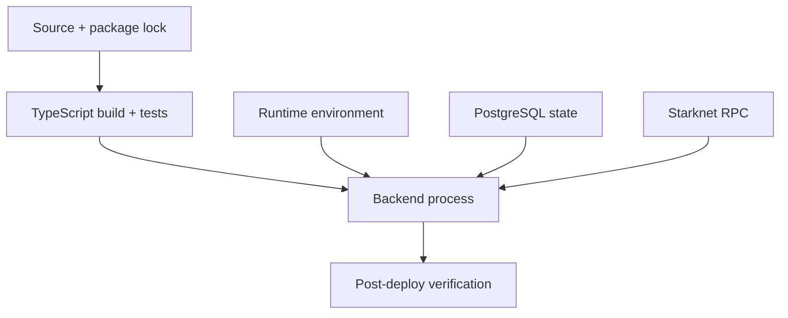
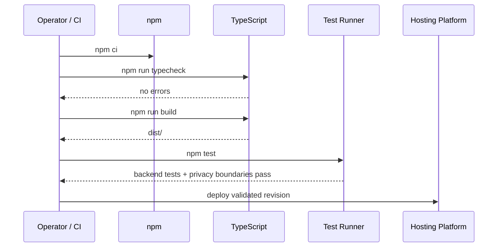
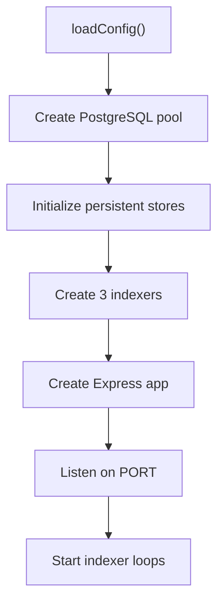
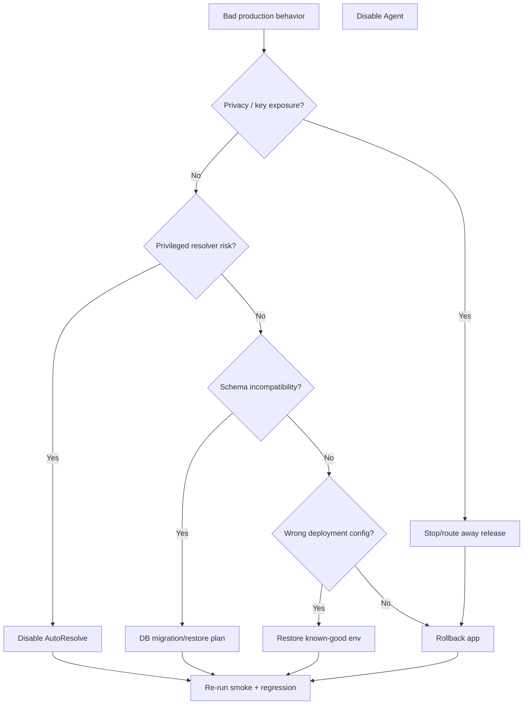

# VINSS Backend Deployment

This document describes the current deployment model for the VINSS backend.

Deployment is not considered successful merely because the process starts.

A correct deployment must preserve:

```text
network identity
contract identity
historical indexing boundaries
database continuity
privacy boundaries
feature-gate intent
resolver-key isolation
API/runtime compatibility
```

The executable backend source is authoritative.

---

# Deployment Objective

The production deployment must provide:

```text
a valid compiled backend

a valid runtime configuration

a reachable PostgreSQL database

a verified Starknet RPC

the correct canonical contracts

the correct start blocks

healthy persistent indexers

intentional feature exposure

privacy-safe logging

safe secret handling
```

---

# Deployment Layers

A VINSS backend deployment has four distinct layers.



A green build alone does not verify the deployment environment.

---

# Repo-Defined Runtime

The backend package currently defines:

```text
dev
build
start
typecheck
test
test:loyalty-rules
```

Canonical production build command:

```bash
npm run build
```

Canonical production start command:

```bash
npm start
```

which currently executes:

```text
node dist/index.js
```

---

# TypeScript Output

`backend/tsconfig.json` currently uses:

```text
rootDir = src
outDir = dist
target = ES2022
module = NodeNext
moduleResolution = NodeNext
strict = true
```

Therefore the production runtime expects compiled files under:

```text
backend/dist/
```

---

# Node Runtime Precision

The current:

```text
backend/package.json
```

does not define:

```text
engines.node
```

Therefore this repository does not currently pin one official Node runtime version through `package.json`.

Do not claim a specific Node version is repo-enforced unless runtime/deployment configuration is updated.

---

# Dependency Installation

The repository contains:

```text
backend/package-lock.json
```

For a clean/reproducible deployment build, prefer:

```bash
npm ci
```

rather than:

```bash
npm install
```

when the environment is created from the lockfile.

---

# Local Pre-Deployment Gate

Before deploying:

```bash
cd ~/vinss/backend

npm ci
npm run typecheck
npm run build
npm test
```

If dependencies are already intentionally installed from the current lockfile, the `npm ci` step can be omitted from a quick local validation cycle.

The important release gates are:

```text
typecheck
build
test
```

---

# Test Command Precision

Current:

```bash
npm test
```

runs:

```text
tsx --test tests/*.test.ts

then

node ../scripts/test-privacy-boundaries.mjs
```

Therefore a successful `npm test` means both phases completed successfully.

Do not document:

```text
backend tests passed
```

if only one test file or one test runner phase was executed.

---

# Privacy Test Is Part of Main Gate

The privacy-boundary script is not merely optional documentation validation.

It is part of the current package-level:

```text
npm test
```

command.

A release that bypasses it has not passed the canonical backend test command.

---

# `test:loyalty-rules`

The package also exposes:

```bash
npm run test:loyalty-rules
```

which currently runs a narrower subset:

```text
loyalty-rules.test.ts
rekber-indexer.test.ts
```

This is not a substitute for:

```bash
npm test
```

before production deployment.

---

# Do Not Use Production as First Build Test

Avoid:

```text
push uncompiled source
deploy immediately
debug TypeScript failure in production
```

Use the local/CI gate first.

---

# Build Failure Policy

Any failure in:

```text
typecheck
build
tests
privacy-boundary tests
```

should block deployment unless the failure is explicitly understood and the release policy intentionally overrides it.

For mainnet, the safe default is:

```text
fail closed
```

---

# Platform Boundary

The repository currently defines the Node application runtime through:

```text
package.json
tsconfig.json
source
```

It does not currently contain an obvious repo-defined:

```text
railway.json
nixpacks.toml
Procfile
```

through the current deployment audit.

Therefore platform-specific build/start behavior must be verified in the actual hosting configuration.

---

# Railway Operator Workflow

The deployment workflow currently used operationally can be:

```bash
cd ~/vinss/backend
railway up
```

This is an operator/platform command.

It is not itself the repo-defined Node start command.

The deployed Railway service must ultimately build and run the backend consistently with:

```text
npm run build
npm start
```

or an equivalent explicitly verified platform command.

---

# Do Not Assume Railway Defaults

Before mainnet, verify the actual Railway service configuration for:

```text
root directory
install command
build command
start command
health behavior
restart policy
environment variables
PostgreSQL connection
domain
replica count
```

Do not infer these from source if the platform configuration is external.

---

# Deployment Root Directory

Because the backend package is under:

```text
backend/
```

the hosting service must either:

```text
use backend as project/root directory
```

or execute commands that explicitly enter/use that directory.

A wrong monorepo root can cause:

```text
wrong package.json
wrong build
missing dist
wrong environment assumptions
```

---

# Production Build Sequence

Conceptually:



---

# Runtime Startup Sequence

At production process startup:

```text
load config

create PostgreSQL pool

create Discovery/Rekber/Certificate stores

initialize Feedback table

initialize Discovery tables/checkpoints

initialize Rekber tables/checkpoint/migrations

initialize Certificate tables/checkpoint

create event sources/indexers

create Express app

listen on PORT

start:
    DiscoveryIndexer
    RekberIndexer
    CertificateIndexer
```

---

# Startup Diagram



---

# Configuration Failure Before Startup

Core configuration is strict.

Required values include:

```text
STARKNET_NETWORK
RPC_URL
DATABASE_URL

PRIVACY_POOL_ADDRESS
MESSAGE_HELPER_ADDRESS
OFFER_HELPER_ADDRESS
PRIVATE_ESCROW_HELPER_ADDRESS
ESCROW_REKBER_ADDRESS
SETTLEMENT_CERTIFICATE_ADDRESS

MESSAGE_HELPER_START_BLOCK
OFFER_HELPER_START_BLOCK
PRIVATE_ESCROW_HELPER_START_BLOCK
ESCROW_REKBER_START_BLOCK
SETTLEMENT_CERTIFICATE_START_BLOCK
```

Missing or invalid required values can prevent normal startup.

---

# Mainnet Configuration Guards

For:

```text
STARKNET_NETWORK=mainnet
```

current config requires:

```text
CORS_ORIGIN uses https
```

and rejects RPC URL identities containing:

```text
sepolia
goerli
testnet
```

---

# Mainnet Guard Limitation

The RPC testnet detection is string-based.

It does not prove actual chain ID.

Production verification must independently confirm the RPC serves:

```text
Starknet mainnet
```

---

# Required Deployment Identity

Treat these as one coherent deployment identity:

```text
STARKNET_NETWORK

RPC_URL

PRIVACY_POOL_ADDRESS

MESSAGE_HELPER_ADDRESS
MESSAGE_HELPER_START_BLOCK

OFFER_HELPER_ADDRESS
OFFER_HELPER_START_BLOCK

PRIVATE_ESCROW_HELPER_ADDRESS
PRIVATE_ESCROW_HELPER_START_BLOCK

ESCROW_REKBER_ADDRESS
ESCROW_REKBER_START_BLOCK

SETTLEMENT_CERTIFICATE_ADDRESS
SETTLEMENT_CERTIFICATE_START_BLOCK

DATABASE_URL
```

Do not validate them independently and assume the combination is correct.

---

# Environment Mixing Example

Invalid operational combination:

```text
network = mainnet

RPC = mainnet

Message Helper = Sepolia deployment
```

The address can still pass syntactic validation.

This is why deployment records and live verification are required.

---

# Database Environment

Required:

```text
DATABASE_URL
```

Optional:

```text
DATABASE_SSL
```

---

# Database SSL Precision

Current:

```text
DATABASE_SSL=true
```

configures `pg` with:

```text
rejectUnauthorized: false
```

This requests TLS but does not enforce strict CA certificate verification.

Do not document it as strict certificate-authenticated TLS.

---

# Database Connection Pool

Current pool:

```text
max = 10
```

hardcoded.

Replica count and database connection capacity must be planned accordingly.

Example:

```text
3 backend replicas
×
up to 10 pool connections
```

can create a different database load profile than a single replica.

---

# Persistent State Created at Startup

Core startup can create/initialize tables for:

```text
Discovery records

Discovery checkpoints

Rekber events

Rekber checkpoint

Certificate events

Certificate checkpoint

Feedback
```

Encrypted attachments are initialized lazily on first attachment request.

---

# Schema Evolution Model

The backend currently performs schema bootstrap and some migration logic directly inside service/store initialization.

Example Rekber initialization performs operations such as:

```text
CREATE TABLE IF NOT EXISTS

ALTER TABLE ... ADD COLUMN IF NOT EXISTS

DROP/ADD check constraint
```

to support the current:

```text
resolved
```

event model.

---

# No External Migration Tool Assumption

Do not assume:

```text
Prisma migration
Knex migration
Flyway migration
```

or another dedicated migration system exists unless the source later adds one.

Current deployment must account for startup-time schema mutations.

---

# Database Backup Before Schema-Changing Release

For a production release that changes storage schema:

```text
take/verify database backup
```

before deploying where practical.

This is especially important when rollback may run older application code against a newer schema.

---

# App Rollback Does Not Roll Back Database

Rolling back the hosting release:

```text
new backend code
    ↓
old backend code
```

does not automatically reverse:

```text
CREATE TABLE
ALTER TABLE
new rows
checkpoint advancement
```

in PostgreSQL.

---

# Forward-Compatible Schema Changes

Current `ADD COLUMN IF NOT EXISTS` style changes can be rollback-friendly when older code ignores new columns.

But this must be evaluated per release.

Do not assume every future schema change will be backward compatible.

---

# Indexer Checkpoint Persistence

The backend persists:

```text
start block
next block
last indexed block
latest observed block
status
```

for its indexers.

These survive backend restarts/redeploys because they live in PostgreSQL.

---

# Restart Does Not Reindex From Zero

With the same:

```text
network
contract address
database
```

the indexers resume from stored checkpoints.

That is expected.

---

# Start-Block Mismatch Fail-Closed

If the deployment config changes a start block while the existing checkpoint for the same identity has another start block, initialization fails.

This protects historical indexing assumptions.

---

# Do Not “Fix” Start-Block Error Blindly

If startup reports a start-block mismatch:

```text
do not immediately delete the checkpoint
```

First determine:

```text
Was the env value changed accidentally?

Was the contract redeployed?

Is this supposed to be a new index identity?

Is the database from the wrong environment?

Is a controlled reindex intended?
```

---

# New Contract Deployment

A new canonical contract should normally be represented by:

```text
new address
+
correct new deployment/start block
```

Because checkpoint identity includes contract address, it becomes a distinct index identity.

---

# Same Address + Different Start Block

This is treated as suspicious and fails.

That is intentional.

---

# Indexer Startup Dependencies

All three persistent indexers depend on:

```text
RPC_URL
PostgreSQL
correct contract address
correct start block
```

---

# Indexer Runtime Dependencies

During operation, indexers require:

```text
Starknet RPC
PostgreSQL
```

HTTP can still listen while a later indexer cycle experiences a dependency failure.

---

# Health Endpoint

Primary post-deploy status endpoint:

```text
GET /health
```

It reports:

```text
network

Message Discovery checkpoint

Offer Discovery checkpoint

Private Escrow Discovery checkpoint

Rekber checkpoint

Certificate checkpoint
```

---

# Health Success

Expected HTTP:

```text
200
```

with:

```text
status = ok
```

when no tracked checkpoint is in error.

---

# Health Degraded

Expected:

```text
503
```

with:

```text
status = degraded
```

when tracked indexer status is error or status retrieval fails.

---

# Health Is Not Full Deployment Readiness

`/health` does not prove:

```text
RPC chain ID is correct

every contract address is canonical

frontend can decrypt

Ready wallet works

Agent provider is available

Dispute resolver works

attachment upload/download works

two-wallet settlement works
```

It is one deployment signal.

---

# Check Health Identity, Not Only Status

After deployment, inspect:

```text
network
contractAddress
startBlock
nextBlock
lastIndexedBlock
latestObservedBlock
status
updatedAt
```

Do not accept:

```text
status = ok
```

without checking that the identities are the intended deployment.

---

# Indexer Catch-Up

Immediately after deploying against a new database or early start block:

```text
status may be syncing
```

while historical events are indexed.

Do not route production decisions that depend on complete index history until expected catch-up is confirmed.

---

# Catch-Up Verification

Check:

```text
lastIndexedBlock
latestObservedBlock
nextBlock
updatedAt
```

over multiple observations.

Expected behavior:

```text
lastIndexedBlock advances

eventually nextBlock > latestObservedBlock
or status becomes caught_up
```

depending on timing.

---

# Latest-Block Failure Nuance

An indexer cycle that fails only while reading the latest block may log the failure and skip that cycle without necessarily persisting:

```text
status = error
```

immediately.

Therefore deployment monitoring should also inspect:

```text
checkpoint age
lag
logs
```

not only health status.

---

# Post-Deploy Smoke Check Set

Use a layered smoke test.

---

# Smoke 1 — Health

```bash
curl -i -s \
  https://<backend-domain>/health
```

Verify:

```text
HTTP 200

status=ok

network correct

all five contract/index identities correct
```

---

# Smoke 2 — OpenAPI JSON

```bash
curl -i -s \
  https://<backend-domain>/openapi.json
```

Verify:

```text
HTTP 200
valid JSON
expected VINSS API metadata
```

---

# Smoke 3 — Swagger UI

Open:

```text
https://<backend-domain>/docs
```

Verify the page loads.

Remember:

```text
OpenAPI is not currently exhaustive for every runtime route
```

so Swagger success is not proof of complete API coverage.

---

# Smoke 4 — Discovery Validation

A safe validation request can confirm the route is mounted.

Example:

```bash
curl -i -s \
  -X POST \
  -H 'Content-Type: application/json' \
  -d '{"kind":"message","fromBlock":0,"toBlock":"latest"}' \
  https://<backend-domain>/discover
```

This can return many records depending on history.

For production smoke tests, prefer a bounded recent block range where possible.

---

# Discovery Privacy Negative Test

Confirm forbidden fields remain rejected:

```bash
curl -i -s \
  -X POST \
  -H 'Content-Type: application/json' \
  -d '{"kind":"message","channelKeyHex":"0x123"}' \
  https://<backend-domain>/discover
```

Expected:

```text
HTTP 400
```

This is a valuable privacy regression smoke test.

---

# Smoke 5 — Rekber Events

```bash
curl -i -s \
  'https://<backend-domain>/rekber/events?limit=1'
```

Verify:

```text
HTTP 200
network correct
contractAddress correct
items is an array
```

Empty items can be valid on a fresh deployment.

---

# Smoke 6 — Activity

```bash
curl -i -s \
  'https://<backend-domain>/activity?limit=1'
```

Verify:

```text
HTTP 200
network correct
items array
nextCursor field
```

---

# Smoke 7 — Royalty

Use a known valid public address:

```bash
curl -i -s \
  'https://<backend-domain>/royalty/0x<known-address>'
```

Verify:

```text
HTTP 200
network correct
address canonicalized
conversion.status = coming_soon
```

A zero/invalid address should return:

```text
400
```

---

# Smoke 8 — Presence

Presence is ephemeral.

Use a generated opaque channel and encrypted-looking test payload.

Do not use real room secrets.

Publish:

```bash
curl -i -s \
  -X POST \
  -H 'Content-Type: application/json' \
  -d '{
    "channelId":"0123456789abcdef0123456789abcdef0123456789abcdef0123456789abcdef",
    "eventId":"smoketest_01",
    "iv":"opaque-test-iv",
    "ciphertext":"opaque-test-ciphertext",
    "ttlMs":1000
  }' \
  https://<backend-domain>/presence/publish
```

Expected:

```text
204
```

Poll immediately if needed.

---

# Presence Test Data Rule

Do not put:

```text
real room key
real plaintext Message
real wallet secret
```

into deployment smoke payloads.

---

# Smoke 9 — Attachments

Attachment tests require:

```text
UUID-v4-style id
32..256-character capability token
application/octet-stream
```

Use generated test-only capability data.

Do not reuse production attachment tokens in logs/scripts.

---

# Attachment Upload Example

Conceptually:

```bash
printf 'encrypted-smoke-test-bytes' | \
curl -i \
  -X PUT \
  -H 'Content-Type: application/octet-stream' \
  -H 'x-vinss-attachment-token: <32+-char-test-token>' \
  --data-binary @- \
  'https://<backend-domain>/attachments/<uuid-v4>'
```

Expected:

```text
201
```

---

# Attachment Download Verification

With same ID/token:

```text
GET
```

should return ciphertext bytes.

With a wrong valid-length token:

```text
404
```

for the same object.

---

# Attachment Cleanup Caveat

Current API has no delete endpoint.

A production smoke upload leaves a database object unless removed through controlled database/application maintenance.

For routine deploy verification, avoid repeatedly creating unnecessary persistent attachment test objects.

---

# Smoke 10 — Feedback

Feedback writes persistent application data.

Do not submit test feedback to production unless intentional.

If testing is required, use clearly identifiable non-sensitive test content and have an operational cleanup policy.

---

# Smoke 11 — Agent, Feature-Aware

Only run:

```text
GET /agent/providers
```

when:

```text
AGENT_ENABLED=true
```

Example:

```bash
curl -i -s \
  https://<backend-domain>/agent/providers
```

---

# Agent Disabled Mainnet

Current default on mainnet:

```text
AGENT_ENABLED=false
```

In that state:

```text
/agent/providers
```

is not mounted.

A not-found response is expected and should not be treated as backend deployment failure.

---

# Agent Provider Smoke

If enabled, inspect:

```text
network
defaultProvider
configuredProviders
skills
```

Public skills should remain:

```text
chat
offer
escrow
```

`dispute` should not appear as a public Agent skill.

---

# Agent Request Smoke

A real `POST /agent` can incur provider cost and transmit explicit plaintext to the configured provider.

Do not run it casually as a generic health probe.

Use:

```text
/agent/providers
```

for low-cost capability inspection.

---

# Dispute Deployment Smoke

Do not invoke:

```text
/dispute/evaluate
```

with arbitrary production data merely to test route availability.

It is a privileged workflow and can become an on-chain resolver write when:

```text
policy = AUTO_RESOLVE

and

DISPUTE_AUTO_RESOLVE_ENABLED=true
```

---

# Dispute Route Exposure Check

Because `/dispute/*` is mounted under:

```text
AGENT_ENABLED
```

route exposure should match Agent feature intent.

AutoResolve is a separate gate.

---

# AutoResolve Deployment Rule

Default:

```text
DISPUTE_AUTO_RESOLVE_ENABLED=false
```

Keep it false unless:

```text
resolver key isolated

resolver address verified

on-chain resolver match verified

Dispute policy understood

tests pass

monitoring exists

incident response exists
```

---

# Resolver Account Funding

A server-side Starknet resolver account may require transaction fee funding.

Deployment must verify the operational account can actually submit the intended transaction when AutoResolve is enabled.

Do not infer fee sufficiency from address/key validity.

---

# Resolver Address Match

At execution time the backend reads:

```text
get_dispute_resolver
```

from the configured Rekber contract.

Configured resolver mismatch causes failure.

Pre-deployment verification should check this proactively.

---

# Resolver Key Rotation

Current contract resolver is described as immutable in the backend executor assumptions/current Rekber configuration.

Any key-rotation plan must account for the actual deployed contract authority model.

Do not rotate the backend key without confirming the on-chain resolver address relationship.

---

# Secrets Required by Core Deployment

Potentially sensitive:

```text
DATABASE_URL
RPC_URL
```

depending on embedded credentials.

---

# Optional Secret Classes

```text
GROQ_API_KEY

OPENAI_API_KEY

ANTHROPIC_API_KEY

QWEN_API_KEY
DASHSCOPE_API_KEY

RESEND_API_KEY

DISPUTE_RESOLVER_PRIVATE_KEY
```

---

# Highest-Risk Backend Secret

The most security-sensitive optional secret is:

```text
DISPUTE_RESOLVER_PRIVATE_KEY
```

because it is transaction-signing authority.

Provider API keys can incur cost/data exposure, but they do not directly replace participant wallets.

---

# Never Put Secrets in Frontend Env

Never copy backend secrets into:

```text
NEXT_PUBLIC_*
```

or any value bundled into browser JavaScript.

---

# Never Commit Runtime Secrets

Do not commit:

```text
real DATABASE_URL
RPC credentials
provider API keys
resolver private key
Resend key
```

---

# Railway Variables

If Railway is the hosting platform, production values should be stored as service environment variables/secrets.

Before deployment, verify the service's actual variable set.

Do not rely on shell history as the only record.

---

# Mainnet Variable Checklist

Core:

```text
STARKNET_NETWORK=mainnet

RPC_URL=<verified mainnet RPC>

CORS_ORIGIN=https://<production frontend>

DATABASE_URL=<production PostgreSQL>

DATABASE_SSL=<intentional>
```

Contracts:

```text
PRIVACY_POOL_ADDRESS

MESSAGE_HELPER_ADDRESS

OFFER_HELPER_ADDRESS

PRIVATE_ESCROW_HELPER_ADDRESS

ESCROW_REKBER_ADDRESS

SETTLEMENT_CERTIFICATE_ADDRESS
```

Blocks:

```text
MESSAGE_HELPER_START_BLOCK

OFFER_HELPER_START_BLOCK

PRIVATE_ESCROW_HELPER_START_BLOCK

ESCROW_REKBER_START_BLOCK

SETTLEMENT_CERTIFICATE_START_BLOCK
```

Feature policy:

```text
AGENT_ENABLED

LOYALTY_ENABLED

DISPUTE_AUTO_RESOLVE_ENABLED
```

Limits:

```text
RATE_LIMIT_WINDOW_MS
DISCOVER_RATE_LIMIT
AGENT_RATE_LIMIT
```

---

# Recommended First Mainnet Feature Posture

Unless intentionally launching these services:

```text
AGENT_ENABLED=false

LOYALTY_ENABLED=false

DISPUTE_AUTO_RESOLVE_ENABLED=false
```

This minimizes non-core backend authority during initial deployment.

---

# Agent / Dispute Coupling

Remember:

```text
AGENT_ENABLED=true
```

mounts both:

```text
/agent
/dispute
```

routes.

If you intend to enable only Agent while never exposing Dispute routes, current `app.ts` does not provide a separate Dispute route feature flag.

That is a current architecture limitation.

---

# Loyalty Deployment

Legacy Loyalty is:

```text
in-memory
unauthenticated write
preview-only
disabled by default
```

Do not enable it as a production valuable rewards ledger.

---

# Royalty Deployment

Royalty is always mounted and derives from:

```text
Settlement Certificate index
```

It does not require:

```text
LOYALTY_ENABLED=true
```

---

# In-Memory State Reset

A restart/redeploy resets:

```text
Presence map

Legacy Loyalty service state

rate-limit buckets
```

---

# Persistent State Survives Restart

A restart/redeploy does not inherently reset:

```text
Discovery records

Discovery checkpoints

Rekber events

Rekber checkpoint

Certificate events

Certificate checkpoint

encrypted attachments

feedback
```

because those live in PostgreSQL.

---

# Presence Reset

Expected by design.

Effects:

```text
typing/read-like presence disappears
```

Not affected:

```text
Message on-chain record
Offer record
Rekber custody
Certificate
```

---

# Rate-Limit Reset

Because limiter state is process-local:

```text
redeploy
```

clears counters.

Do not rely on in-memory limit history for security auditing.

---

# Multi-Replica Deployment

Current process-local state creates special behavior under multiple replicas.

---

# Presence Under Multiple Replicas

Without sticky routing/shared store:

```text
publish may hit replica A

poll may hit replica B
```

and the event can appear missing.

Therefore current Presence architecture is simplest with one process/replica or infrastructure that provides suitable affinity.

---

# Rate Limits Under Multiple Replicas

Each replica has its own buckets.

Effective total requests can exceed the per-process configured limit.

---

# Indexers Under Multiple Replicas

If multiple replicas all start the same indexer loops against one database:

```text
multiple processes can scan the same ranges concurrently
```

Current stores use idempotent inserts/primary keys for many writes, but checkpoint coordination is not documented as a distributed leader-election system.

---

# Replica Safety Warning

Do not scale indexer replicas horizontally without reviewing:

```text
duplicate RPC work

checkpoint races

database contention

Presence semantics

rate-limit semantics
```

The source is not currently documented as a horizontally coordinated indexer cluster.

---

# Single-Replica Assumption

For the simplest supported operational model, one backend replica avoids:

```text
Presence split-brain

rate-limit multiplication

duplicate indexer work
```

If production needs multiple replicas, architecture should be hardened explicitly.

---

# Reverse Proxy

On mainnet the app configures:

```text
trust proxy = 1
```

assuming one managed reverse proxy.

---

# Railway Proxy Check

Verify Railway's effective proxy topology matches the assumption.

If there are multiple trusted hops, or forwarded headers are exposed differently, rate-limit identity can be incorrect.

---

# CORS Deployment Check

Verify exact frontend production origin.

CORS is not authentication, but incorrect CORS can:

```text
block legitimate frontend calls

or

broaden browser-origin access unintentionally
```

---

# Request Logging Check

Current global logger emits:

```text
METHOD PATH
```

only.

After deployment, inspect logs and confirm request bodies are not printed by platform middleware/custom instrumentation.

---

# Sensitive Route Logging Check

Specifically inspect:

```text
/agent
/dispute
/feedback
/attachments
```

for accidental body/header logging.

---

# Attachment Token Logging

Never log:

```text
x-vinss-attachment-token
```

The backend source does not intentionally log it.

Platform request-header logging should also be reviewed.

---

# RPC Credential Logging

If `RPC_URL` contains an API token, do not print the full URL in:

```text
startup logs
health endpoints
incident screenshots
```

---

# Database Credential Logging

Current database pool error handler deliberately avoids connection details.

Preserve this behavior.

---

# Provider Error Logging

Agent provider failover logs provider identity, not raw upstream errors.

This reduces risk that provider errors echo user prompt content into logs.

---

# Deployment Log Baseline

Expected startup log includes:

```text
VINSS backend listening on :<port> (<network>)
```

Indexer logs may appear for failures.

Do not rely on one listening log as proof of healthy indexing.

---

# Startup Database Failure

If required database initialization fails:

```text
[startup] database initialization failed
```

is logged.

The pool is ended.

The process receives nonzero exit intent.

This should cause deployment failure/restart rather than serving partial core state.

---

# Fatal Initialization Failure

Top-level uncaught startup failure logs:

```text
[startup] fatal initialization error
```

and sets failure exit code.

---

# Attachment DB Failure After Startup

Because attachment table creation is lazy:

```text
core backend can start
```

even if an attachment-specific table operation later fails.

Attachment requests then return:

```text
503
```

when storage is unavailable.

---

# Database Deployment Backup

Before major mainnet changes:

```text
verify database backup / restore capability
```

especially because indexed history, feedback, and encrypted attachments may be operationally valuable.

---

# What Can Be Rebuilt From Chain

Potentially reconstructible:

```text
Discovery ciphertext/index metadata
Rekber events
Certificate events
```

assuming chain history/getters remain accessible and start blocks are known.

---

# What Is Not Rebuilt From Chain

Not inherently reconstructible from the chain indexers:

```text
feedback

encrypted attachment blobs

Presence

Legacy Loyalty in-memory state
```

Therefore database backup matters even if canonical settlement remains on-chain.

---

# Attachment Backup Privacy

A database backup can contain:

```text
encrypted attachment ciphertext
```

and token hashes.

It should still be treated as sensitive operational data.

Encryption does not make backup handling irrelevant.

---

# Feedback Backup Privacy

Feedback comments are plaintext application data.

Database backups therefore contain plaintext feedback.

---

# Rollback Classes

There are multiple rollback scenarios.

```text
application-only rollback

configuration rollback

database/schema rollback

contract-address rollback

feature-disable emergency response
```

Do not treat them as one operation.

---

# Application-Only Rollback

Safest when:

```text
database schema remains backward compatible

contract identities unchanged

start blocks unchanged
```

Process:

```text
route traffic away from bad release

deploy previous known-good code

keep verified same environment

smoke test

restore traffic
```

---

# Configuration Rollback

If the bad release came from wrong environment values:

```text
restore known-good variable set
```

Do not change one contract address without its associated:

```text
start block
deployment record
checkpoint implications
```

---

# Schema Rollback

Do not automatically reverse database DDL.

First assess whether:

```text
old code works against new schema
```

If not, use a reviewed migration/restore plan.

---

# Checkpoint Rollback

Do not manually decrement:

```text
next_block
last_indexed_block
```

unless executing a controlled reindex/reorg recovery procedure.

Blind checkpoint editing can create gaps/duplicates/stale state.

---

# Contract Rollback

If frontend/backend were pointed to wrong/new contract deployment:

```text
switching back address
```

changes index identity.

Verify corresponding PostgreSQL checkpoint and start block before restoring traffic.

---

# Privacy Emergency Rollback

If a release causes a privacy boundary violation:

```text
1. stop or route away affected release

2. disable affected feature if possible

3. restore known-good release

4. preserve only necessary operational evidence

5. avoid copying leaked sensitive payloads into tickets/logs

6. identify boundary failure

7. patch

8. add regression test

9. run canonical tests

10. redeploy

11. verify logs/API behavior
```

---

# Agent Emergency Disable

Because Agent and Dispute routes share:

```text
AGENT_ENABLED
```

setting:

```text
AGENT_ENABLED=false
```

removes both route groups on restart/redeploy.

This is the broad emergency AI/dispute kill switch in current architecture.

---

# AutoResolve Emergency Disable

If only privileged resolver execution must stop while Dispute evaluation remains available:

```text
DISPUTE_AUTO_RESOLVE_ENABLED=false
```

keeps the evaluator path but prevents new resolver authorization through the executor.

---

# Loyalty Emergency Disable

```text
LOYALTY_ENABLED=false
```

removes preview Loyalty routes.

---

# Presence Emergency Behavior

There is no current feature flag specifically disabling Presence.

A code/platform route block is required if Presence itself must be disabled.

---

# Attachment Emergency Behavior

There is no current attachment feature flag.

---

# Feedback Emergency Behavior

There is no current Feedback feature flag.

---

# Deployment Verification Matrix

| Area | Pre-deploy | Post-deploy |
|---|---|---|
| TypeScript | `typecheck` | N/A |
| Build | `npm run build` | process runs compiled `dist` |
| Tests | `npm test` | smoke APIs |
| Network | verify config | `/health` network |
| Contracts | verify deployment records | `/health` identities + live queries |
| Start blocks | verify deployment blocks | checkpoint views |
| Database | connection/backup | startup + persistent API reads |
| Discovery | tests | `/discover` + privacy-negative test |
| Rekber | tests | `/rekber/events` |
| Certificate | tests | `/activity` / Royalty |
| Presence | route tests | publish/poll if needed |
| Attachments | tests | controlled capability test |
| Agent | tests/config | providers only if enabled |
| Dispute | tests/config | do not casually execute |
| Logs | source review | production log inspection |

---

# Mainnet Deployment Gate

Before first mainnet traffic:

```text
Build passes.

Full backend test command passes.

Privacy-boundary test passes.

Mainnet RPC verified.

Production PostgreSQL verified.

Backup/restore understood.

All six contract addresses verified.

All five start blocks verified.

Health identities verified.

Indexers caught up or expected sync state understood.

CORS correct.

Replica count intentional.

Proxy topology intentional.

Agent exposure intentional.

Loyalty disabled unless explicitly accepted.

AutoResolve disabled unless explicitly approved.

No secrets in frontend.

No request-body logging.

Frontend API URL points to intended backend.

Two-wallet E2E performed separately.
```

---

# First Mainnet Deployment Order

Recommended operational sequence:

```text
1. Deploy contracts / verify canonical addresses.

2. Record deployment blocks.

3. Prepare production PostgreSQL.

4. Prepare backend env.

5. Keep optional authority minimized:
       Agent false
       Loyalty false
       AutoResolve false

6. Run local/CI backend gates.

7. Deploy backend.

8. Verify startup logs.

9. Verify /health identities.

10. Allow indexers to catch up.

11. Verify /rekber/events and /activity.

12. Verify /discover privacy boundary.

13. Connect frontend to backend.

14. Run controlled two-wallet E2E.

15. Enable optional services only after their own verification.
```

---

# Deployment and Frontend Coordination

Backend deployment and frontend deployment are separate.

Frontend must use the intended backend URL.

Changing backend contract/index identities without matching frontend expectations can create confusing UI behavior even when both deployments are individually healthy.

---

# Frontend Must Not Depend on Backend Decryption

A deployment must not introduce server-side:

```text
room key
channel key
decryption key
```

as a shortcut to fix frontend synchronization.

Fix client-side crypto/discovery logic instead.

---

# Discovery Deployment Validation

Validate all three definitions:

```text
message

offer

escrow
```

where:

```text
escrow = Private Escrow coordination
```

not Rekber custody.

---

# Rekber Deployment Validation

Validate the configured:

```text
ESCROW_REKBER_ADDRESS
```

against:

```text
the canonical deployed Rekber
```

especially before enabling Dispute executor.

---

# Certificate Deployment Validation

Validate:

```text
SETTLEMENT_CERTIFICATE_ADDRESS
```

and start block.

Royalty and certificate activity depend on this index.

---

# OpenAPI Deployment Caveat

Swagger/OpenAPI currently does not document every runtime route.

Do not use:

```text
Swagger has no route
```

as proof that the route is not deployed.

Runtime router source wins.

---

# Deployment Smoke Script Concept

A safe non-destructive script can check:

```text
/health
/openapi.json
/activity?limit=1
/rekber/events?limit=1
```

and optionally:

```text
/agent/providers
```

when Agent is expected to be enabled.

---

# Avoid Destructive Smoke Checks

Do not use production deployment verification to casually:

```text
open disputes

authorize resolution

write Loyalty points

submit real feedback

create persistent attachment clutter
```

unless explicitly part of controlled test procedure.

---

# Live E2E vs Backend Smoke

Backend smoke proves:

```text
service reachable
read models functioning
configuration plausible
```

Live two-wallet E2E proves different things:

```text
wallet integration
Ready flow
encryption/decryption
transaction calldata
fee quote
Rekber lifecycle
certificate claim
frontend synchronization
```

Both are needed before claiming product readiness.

---

# Deployment Success Vocabulary

Prefer precise statements.

Good:

```text
Backend build passed.

Backend tests passed.

Backend deployed.

Health is 200.

Indexer identities match mainnet.

Discovery caught up.

Rekber index caught up.

Certificate index caught up.
```

Avoid one broad statement like:

```text
Everything is production ready.
```

unless the entire stack was actually verified.

---

# Current Railway Command

Operationally:

```bash
cd ~/vinss/backend
railway up
```

can remain the deployment command used by the operator.

But deployment docs should not imply that command alone provides:

```text
build verification
test verification
environment validation
database backup
post-deploy smoke
```

Those remain separate gates.

---

# Suggested Operator Flow

```bash
cd ~/vinss/backend

npm run typecheck
npm run build
npm test

railway up
```

Then perform the post-deploy checks.

---

# Environment Verification Before `railway up`

Do not print secret values unnecessarily.

Useful approach:

```text
list/check variable names

verify known public identities separately

avoid echoing private keys/tokens
```

---

# Secret-Safe Verification

For secret variables, verify:

```text
present
correct deployment scope
recently rotated if required
```

without copying full secret into terminal history or documentation.

---

# Mainnet Public Variables

Safe to compare against deployment records:

```text
network
contract addresses
start blocks
CORS origin
```

RPC URL may or may not be public depending on provider credentials.

---

# Railway Database

If Railway Postgres is used, ensure:

```text
DATABASE_URL
```

resolves from the intended production service/environment.

Do not accidentally point production backend to a development/Sepolia database.

---

# Cross-Environment Database Risk

Because records are network-aware, some cross-environment collisions are reduced.

But pointing mainnet runtime at the wrong DB can still create:

```text
operational confusion
unexpected checkpoint history
mixed retained application data
wrong backup policy
```

Use separate intentional environments.

---

# Feedback Deployment

Feedback table is initialized at startup.

Optional email depends on:

```text
RESEND_API_KEY
FEEDBACK_TO_EMAIL
```

Email provider failure does not block stored feedback.

---

# Feedback Email Smoke

Avoid using the email provider as the primary deployment health signal.

The backend can be healthy even if:

```text
Resend unavailable
```

because Feedback email is best-effort.

---

# Presence Deployment

Current Presence state is:

```text
process-local
```

If the hosting platform frequently restarts/relocates instances, presence continuity can be short-lived.

That is acceptable for ephemeral UX but should be understood.

---

# Attachment Deployment

Attachments use PostgreSQL and lazy table creation.

The first attachment request can expose database/schema permission problems not detected by core startup.

If attachments are production-critical, perform one controlled attachment capability test before launch.

---

# Database Permissions

The configured database user currently needs permissions sufficient for startup code to execute:

```text
CREATE TABLE IF NOT EXISTS

CREATE INDEX IF NOT EXISTS

ALTER TABLE
```

for current schema initialization/migration behavior.

A read/write-only role without DDL permission can break startup migration logic.

---

# Production Database Least Privilege Trade-off

Because app startup currently performs DDL, the runtime DB role needs more privilege than an application with pre-applied migrations.

If stricter least privilege is desired later:

```text
move migrations to deployment phase
run runtime with reduced DB role
```

would be an architecture change.

Do not document that as implemented today.

---

# Schema Migration Failure

If startup DDL fails:

```text
database initialization fails
```

and deployment should be considered failed.

Check:

```text
DB credentials
DDL permissions
existing incompatible schema
start-block mismatch
```

---

# Reindex Recovery

If an index must be rebuilt:

```text
define the intended scope
backup existing DB
identify exact network/address/start block
reset only the relevant tables/checkpoints
restart
monitor catch-up
compare against chain
```

Do not delete the entire database reflexively.

---

# Reorg Recovery

Current deployment docs should not promise automatic full reorg rollback.

If a production reorg affects indexed state, use the dedicated incident/reindex procedure once defined/verified.

---

# Observability After Deploy

Monitor:

```text
health status

checkpoint updatedAt

lastIndexedBlock

latestObservedBlock

lag

database errors

RPC errors

Agent provider failures

resolver transactions

attachment 503s
```

---

# Minimum Launch Observation Window

Do not infer long-term stability from one successful request.

Observe multiple indexer cycles and verify checkpoints continue advancing.

---

# Graceful Shutdown

On:

```text
SIGTERM
SIGINT
```

the runtime:

```text
stops all three indexers

waits for them

closes HTTP server

closes DB pool
```

A hosting platform should allow enough graceful shutdown handling rather than immediately hard-killing the process where configurable.

---

# Deploy During Indexing

A redeploy can interrupt a current scan cycle.

Because checkpoints advance after successful range persistence, the next process should resume from the persisted checkpoint.

Idempotent insert logic helps tolerate repeated event ranges.

---

# Duplicate Index Records

Discovery inserts use conflict handling keyed by:

```text
network
kind
contract
action locator
```

Rekber events also use a unique composite identity.

This reduces duplicate persistence during retries/redeploys.

---

# Data Loss Boundary

A redeploy by itself should not remove PostgreSQL-backed index rows.

Loss risk instead comes from:

```text
database deletion
wrong database
manual table reset
bad destructive migration
```

---

# Platform Rollback and Database

When Railway rolls application code back, verify it is still attached to the intended same production database and variable set.

Application rollback with changed service variables can produce a different runtime than the historical known-good release.

---

# Immutable Deployment Evidence

Record safe public release metadata:

```text
Git commit SHA

deployment timestamp

network

contract addresses

start blocks

backend domain

feature flags

database environment identifier
```

Do not record private key material.

---

# Release Commit SHA

A deployment should be traceable to the exact Git commit.

Without that, a “known-good deployment” is difficult to reproduce.

---

# Release Notes

For backend release notes, include relevant changes to:

```text
routes

indexers

schema

feature flags

privacy boundary

resolver authority

required env

tests
```

---

# Contract and Backend Release Coupling

If a contract event layout changes:

```text
backend event decoder
```

must be compatible before the new deployment becomes canonical.

Deploy order should prevent a long period where backend cannot decode new events.

---

# Certificate Contract Change

A new certificate deployment requires:

```text
new certificate address
new start block
backend env update
frontend env update
```

and likely a distinct index identity.

---

# Rekber Contract Change

More sensitive because it affects:

```text
RekberIndexer

/activity

/dispute verification

resolver executor
```

Verify all dependent services before switching.

---

# Privacy Release Checklist

Before every production backend release:

```text
/discover still rejects keys/secrets

request bodies not logged

Agent sanitizer still active

public Agent skill list excludes dispute

generic Agent tools still non-transactional

Dispute evidence remains opt-in

resolver private key never enters logs

attachment token not logged

provider raw errors not logged
```

---

# Security Release Checklist

```text
No secrets committed.

No secret printed in docs.

No NEXT_PUBLIC backend secret.

Database target verified.

RPC target verified.

Mainnet CORS HTTPS.

Proxy topology understood.

Rate-limit behavior understood.

Replica count intentional.

AutoResolve intent explicit.
```

---

# Availability Release Checklist

```text
Database reachable.

RPC reachable.

Backend starts.

Health responds.

Indexers advance.

Activity reads.

Rekber reads.

Certificate-derived reads work.

Frontend reaches backend.
```

---

# Emergency Feature Matrix

| Problem | Immediate control |
|---|---|
| Agent/provider privacy issue | `AGENT_ENABLED=false` |
| Dispute resolver risk | `DISPUTE_AUTO_RESOLVE_ENABLED=false` |
| Legacy Loyalty issue | `LOYALTY_ENABLED=false` |
| Discovery/indexer defect | rollback backend / isolate traffic |
| Presence defect | rollback/code route control |
| Attachment defect | rollback/code route control |
| Feedback defect | rollback/code route control |

Feature flag changes require process restart/redeploy according to hosting environment behavior.

---

# Rollback Decision Tree



---

# Post-Rollback Verification

After rollback:

```text
confirm commit/release

confirm environment

confirm DB target

confirm /health

confirm indexer identities

confirm checkpoints continue

confirm privacy-negative /discover test

confirm affected endpoint behavior
```

---

# Rollback Does Not Mean Reindex

A code rollback should not normally require:

```text
deleting indexes
resetting checkpoints
```

unless the bad release corrupted indexed state/schema.

Separate those decisions.

---

# Deployment Non-Goals

A backend deploy does not itself:

```text
deploy Cairo contracts

update Vercel frontend env

verify Ready wallet

verify AVNU paymaster

fund resolver account

mint a certificate

run two-wallet user scenario
```

Those are separate operational steps.

---

# Mainnet Claim Discipline

Do not say:

```text
mainnet deployed
```

if only backend service is deployed.

Use:

```text
backend deployed to mainnet configuration
```

until contracts/frontend/wallet flow are also verified.

---

# Recommended Deployment Evidence Commands

Pre-deploy:

```bash
cd ~/vinss/backend

npm run typecheck
npm run build
npm test
```

Git identity:

```bash
cd ~/vinss
git rev-parse HEAD
git status --short
```

Deploy:

```bash
cd ~/vinss/backend
railway up
```

Post-deploy:

```bash
curl -s https://<backend-domain>/health
echo

curl -s 'https://<backend-domain>/rekber/events?limit=1'
echo

curl -s 'https://<backend-domain>/activity?limit=1'
echo
```

---

# Agent-Enabled Additional Check

Only if intentionally enabled:

```bash
curl -s \
  https://<backend-domain>/agent/providers
echo
```

---

# Privacy Negative Check

```bash
curl -i -s \
  -X POST \
  -H 'Content-Type: application/json' \
  -d '{"kind":"message","channelKeyHex":"0x123"}' \
  https://<backend-domain>/discover
```

Expected:

```text
400
```

---

# Avoid Secrets in Shell Commands

Do not embed:

```text
resolver private key
provider API key
database password
attachment capability
```

in shared shell snippets or screenshots.

Use platform secret management.

---

# Deployment Documentation Source Order

When this document conflicts with implementation, prefer:

```text
1. backend/package.json
2. backend/tsconfig.json
3. backend/src/config.ts
4. backend/src/index.ts
5. backend/src/app.ts
6. backend stores/routes
7. actual hosting configuration
8. prose docs
```

For platform behavior:

```text
actual Railway service configuration
```

is authoritative over guesses from repository source.

---

# Current Known Deployment Limitations

At the time this document was aligned to source:

```text
no repo-pinned Node engine

no obvious repo-defined Railway config file

startup-time DB DDL/migration logic

DATABASE_SSL uses rejectUnauthorized=false

process-local Presence

process-local rate limits

legacy Loyalty process-local

no distributed indexer leader election documented

OpenAPI does not cover every route

Agent and Dispute route exposure share one feature flag

health is indexer-oriented, not full-stack readiness
```

---

# Recommended Future Hardening

Potential future improvements:

```text
pin Node runtime

add explicit platform deployment config

separate migration phase from app startup

strict database CA validation

distributed rate limiting

shared Presence store

indexer leader election / single-worker role

separate Dispute route feature flag

complete OpenAPI coverage

explicit readiness vs liveness endpoints

structured metrics
```

These are not current implementation claims.

---

# Final Deployment Model

```text
source revision
    ↓
typecheck
    ↓
build
    ↓
full backend test command
    ↓
verified production environment
    ↓
verified PostgreSQL
    ↓
deploy
    ↓
startup schema/checkpoint initialization
    ↓
HTTP listen
    ↓
three indexer loops
    ↓
identity/freshness smoke checks
    ↓
frontend integration
    ↓
two-wallet E2E
```

---

# Bottom Line

A successful VINSS backend deployment requires more than:

```text
railway up
```

The production gate must preserve:

```text
correct source revision

successful typecheck/build/tests

correct mainnet RPC

correct PostgreSQL environment

correct six contract addresses

correct five start blocks

healthy indexer checkpoints

intentional feature flags

secret isolation

privacy-safe logging
```

The most important deployment-state rule is:

> Application code, runtime environment, PostgreSQL checkpoints, and canonical contract deployments form one operational system.

The most important rollback rule is:

> Rolling back application code does not roll back PostgreSQL schema or checkpoint state.

The most important privacy rule is:

> Never solve deployment or synchronization problems by moving Deal Room decryption keys into the backend.

And the most important privileged-service rule is:

> Keep Dispute AutoResolve disabled unless the resolver identity, resolver key, policy gates, monitoring, and exact Rekber deployment have all been independently verified.
