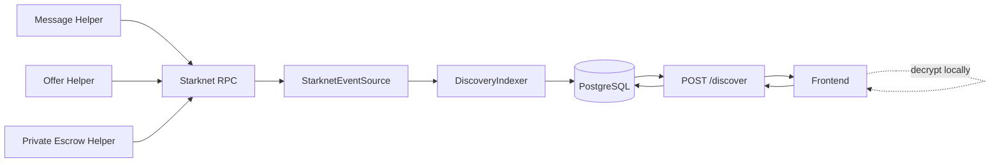
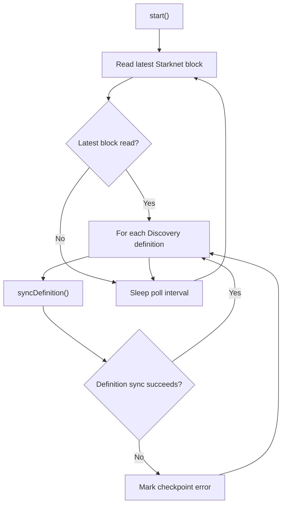
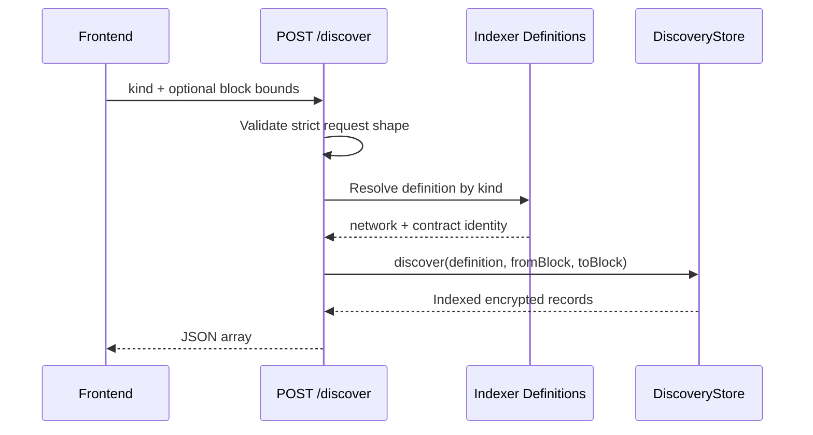
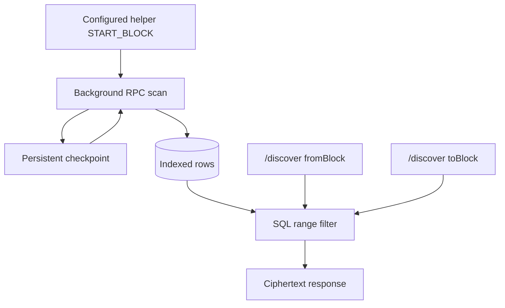
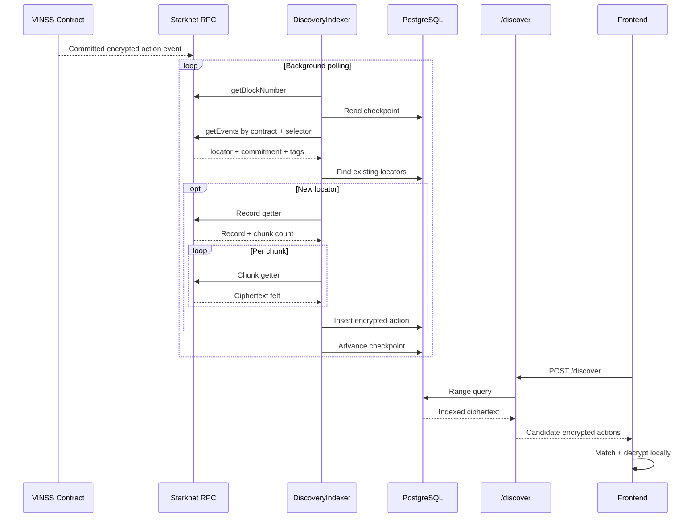

# VINSS Discovery & Indexer

This document describes the current VINSS encrypted-action Discovery subsystem.

The current implementation is a:

```text
persistent
background
network-aware
checkpointed
PostgreSQL-backed
keyless ciphertext index
```

for the three encrypted helper action families:

```text
message
offer
escrow
```

The HTTP endpoint:

```text
POST /discover
```

is a read API over the persistent index.

It does **not** perform a fresh Starknet event scan for every client request.

---

# Objective

The Discovery subsystem exists to make public encrypted VINSS helper actions practical to discover from mobile/web clients without requiring the backend to possess Deal Room decryption material.

The core separation is:

```text
backend can find ciphertext
```

without:

```text
backend being able to decrypt ciphertext
```

---

# Scope

Discovery currently covers exactly:

```text
message
offer
escrow
```

where:

```text
message
    -> VinssMessageHelper

offer
    -> VinssOfferHelper

escrow
    -> VinssPrivateEscrowHelper
```

The `escrow` Discovery kind means:

```text
encrypted Private Escrow coordination
```

It does **not** mean:

```text
public Escrow Rekber custody lifecycle
```

Rekber lifecycle indexing is a separate subsystem.

---

# Source Map

Primary source:

```text
backend/src/indexer/definitions.ts
backend/src/indexer/poolEvents.ts
backend/src/indexer/service.ts
backend/src/indexer/store.ts
backend/src/routes/discover.ts
backend/src/config.ts
```

Relevant runtime composition:

```text
backend/src/index.ts
backend/src/app.ts
```

Relevant tests:

```text
backend/tests/indexer.test.ts
../scripts/test-privacy-boundaries.mjs
```

---

# Current Architecture



---

# Two Separate Paths

The subsystem has two distinct paths.

## Background ingestion path

```text
Starknet
    ↓
DiscoveryIndexer
    ↓
PostgreSQL
```

## Request-time read path

```text
frontend
    ↓
POST /discover
    ↓
PostgreSQL
    ↓
frontend
```

Do not collapse these into one on-demand RPC flow.

---

# Canonical Mapping

Current mapping:

| Discovery kind | Contract config | Event | Record getter | Chunk getter |
|---|---|---|---|---|
| `message` | `MESSAGE_HELPER_ADDRESS` | `MessageCommitted` | `get_message` | `get_payload_chunk` |
| `offer` | `OFFER_HELPER_ADDRESS` | `OfferActionCommitted` | `get_offer_action` | `get_offer_payload_chunk` |
| `escrow` | `PRIVATE_ESCROW_HELPER_ADDRESS` | `PrivateEscrowActionCommitted` | `get_private_escrow_action` | `get_private_escrow_payload_chunk` |

---

# Definitions Are Configuration-Driven

`createIndexerDefinitions(...)` builds one definition for each encrypted helper family.

Each definition contains:

```text
identity
network
kind
contractAddress
startBlock
eventSelector
recordGetter
chunkGetter
```

---

# Indexer Identity

Identity format:

```text
<network>:<kind>:<contractAddress>
```

Example:

```text
sepolia:offer:0xabc
```

This separates records/checkpoints across:

```text
network
helper family
contract deployment
```

---

# Identity Is Operationally Important

These are distinct identities:

```text
sepolia:offer:0xabc

mainnet:offer:0xabc
```

and:

```text
sepolia:message:0xabc

sepolia:offer:0xabc
```

even when the address string happens to be the same.

---

# Definition Event Selectors

The backend does not hardcode raw selector felts in prose configuration.

It computes:

```text
hash.getSelectorFromName(eventName)
```

for:

```text
MessageCommitted

OfferActionCommitted

PrivateEscrowActionCommitted
```

---

# Start Blocks

Each definition receives an explicit configured start block.

Environment variables:

```text
MESSAGE_HELPER_START_BLOCK

OFFER_HELPER_START_BLOCK

PRIVATE_ESCROW_HELPER_START_BLOCK
```

All are required by current central configuration.

---

# No Default Start Block

There is no current:

```text
start from zero automatically
```

fallback for the background indexer.

Each helper start block must be configured.

---

# Discovery Test Evidence

Current `indexer.test.ts` verifies:

```text
identity separates network/kind/contract
```

and:

```text
message
offer
escrow
```

use their own explicit configured helper start blocks.

---

# Background Startup

At backend startup:

```text
DiscoveryStore.initialize(definitions)
```

runs before:

```text
DiscoveryIndexer.start()
```

The persistent tables/checkpoints therefore exist before the background loop begins normal operation.

---

# Persistent Tables

Discovery uses PostgreSQL tables:

```text
discovery_records

indexer_checkpoints
```

---

# `discovery_records`

Current conceptual schema:

```text
network
kind
contract_address
action_locator
payload_commitment
sender_tag
recipient_tag
ciphertext_chunks
block_number
transaction_hash
indexed_at
```

---

# Discovery Record Primary Key

Primary key:

```text
network
kind
contract_address
action_locator
```

This is the persistent deduplication identity.

---

# Kind Constraint

Database currently restricts Discovery record kind to:

```text
message
offer
escrow
```

---

# Ciphertext Storage Type

Ciphertext chunks are stored as:

```text
TEXT[]
```

in PostgreSQL.

Backend normalizes each fetched felt to a decimal integer string before persistence.

---

# Lookup Index

The store creates an index over:

```text
network
kind
contract_address
block_number
```

for Discovery range lookup.

---

# Activity Index

A second index supports descending global activity ordering by:

```text
network
block_number
transaction_hash
action_locator
```

---

# `indexer_checkpoints`

Current conceptual fields:

```text
network
kind
contract_address
start_block
next_block
last_indexed_block
latest_observed_block
status
updated_at
```

---

# Checkpoint Primary Key

Primary key:

```text
network
kind
contract_address
```

---

# Checkpoint Status Values

Allowed:

```text
idle
syncing
caught_up
error
```

---

# Initial Checkpoint

For a new definition:

```text
start_block = configured start block

next_block = configured start block

status = idle
```

---

# Start-Block Consistency Guard

After ensuring a checkpoint exists, backend re-reads it.

If:

```text
stored start block
!=
configured start block
```

initialization throws.

---

# Why This Guard Exists

It prevents an operator from silently changing historical indexing origin for the same:

```text
network
kind
contract address
```

identity.

---

# Start-Block Mismatch Is Not Auto-Reindex

A mismatch does not cause:

```text
automatic reset
automatic rewind
automatic deletion
```

It fails closed.

A deliberate reindex requires an explicit operational decision.

---

# Background Loop

The Discovery indexer owns a continuous loop.

Conceptually:



---

# Poll Interval

Current config:

```text
INDEXER_POLL_INTERVAL_MS
```

Default:

```text
5000 ms
```

Bounds are documented in `configuration.md`.

---

# Latest Block Is Read Once Per Cycle

Each Discovery cycle first calls:

```text
getLatestBlockNumber()
```

through `StarknetEventSource`.

The same observed:

```text
latestBlock
```

is then used for the three Discovery definitions in that cycle.

---

# Latest-Block Failure

If the latest-block query fails:

```text
[indexer] latest block query failed: <ErrorName>
```

is logged.

The cycle returns.

---

# Important Health Nuance

A latest-block query failure does **not** currently call:

```text
setCheckpointStatus(..., "error", ...)
```

for the three Discovery definitions.

Therefore a transient/latest-block failure can leave previously stored checkpoint status unchanged.

---

# Operational Consequence

Do not monitor only:

```text
checkpoint.status
```

Also inspect:

```text
updatedAt
lastIndexedBlock
latestObservedBlock
lag
logs
```

---

# Definition Sync Order

Within a cycle, definitions are currently processed sequentially:

```text
message
offer
escrow
```

according to the definition array order.

---

# Failure Isolation Between Definitions

A failure syncing one definition is caught at the per-definition layer.

Backend then attempts to continue to the next definition.

Therefore:

```text
Offer sync failure
```

does not necessarily prevent:

```text
Private Escrow sync
```

from being attempted in that cycle.

---

# Per-Definition Error State

If `syncDefinition(...)` throws:

```text
checkpoint.status = error
latestObservedBlock = current cycle latest block
```

is persisted for that definition.

Log contains:

```text
definition identity
error name
```

not a raw exception dump.

---

# Catch-Up Check

For one definition:

```text
checkpoint.nextBlock > latestBlock
```

means there is currently nothing further to scan up to the cycle's observed head.

Backend marks:

```text
caught_up
```

and returns for that definition.

---

# Block Range Processing

If there is work:

```text
fromBlock = checkpoint.nextBlock
```

and:

```text
toBlock =
    min(
        latestBlock,
        fromBlock + INDEXER_BLOCK_RANGE - 1
    )
```

---

# Block Range Default

Current:

```text
INDEXER_BLOCK_RANGE=2000
```

by default.

This is a background ingestion batch size.

It is unrelated to `/discover` request `fromBlock/toBlock`.

---

# Before Range Scan

Backend sets definition checkpoint status:

```text
syncing
```

and stores the current observed latest block.

---

# Event Scan

`StarknetEventSource.scanCommittedActions(...)` calls Starknet:

```text
getEvents
```

using:

```text
address = helper contract

from_block = selected block range start

to_block = selected block range end

keys[0] = expected event selector

chunk_size = configured INDEXER_EVENT_PAGE_SIZE
```

---

# Event Page Size

Current default:

```text
100
```

This is configurable.

It is not hardcoded as the only supported value.

---

# RPC Continuation Tokens

The event source follows:

```text
continuation_token
```

until no continuation token remains.

One block range can therefore require multiple `getEvents` pages.

---

# Event Filter

Event scanning is contract-address and selector scoped.

It does not scan by:

```text
transaction sender

wallet identity

room ID

participant address
```

---

# Sender Identity Boundary

The indexer does not infer participant identity from:

```text
transaction sender
```

Its primary encrypted-action identity is the helper event's:

```text
action locator
```

---

# Event Extraction

For each returned event, current code reads:

```text
event.keys[1]
    -> actionLocator

event.data[0]
    -> payloadCommitment

event.data[1]
    -> senderTag

event.data[2]
    -> recipientTag

event.block_number
    -> blockNumber

event.transaction_hash
    -> transactionHash
```

---

# Required Event Fields

An event is skipped if any required value is missing:

```text
actionLocator

payloadCommitment

blockNumber

transactionHash
```

---

# Optional Routing Tags

Current backend type treats:

```text
senderTag
recipientTag
```

as optional.

They are copied when present.

---

# Event Decoder Precision

The Discovery event source does not re-derive:

```text
payload commitment
```

from ciphertext during event scan.

It reads the commitment emitted/stored by the helper flow and separately hydrates ciphertext.

Protocol commitment validation belongs to the contract on write.

---

# Existing-Locator Check

After a block-range scan, the indexer extracts all discovered action locators and queries PostgreSQL for existing records under the exact:

```text
network
kind
contract address
```

identity.

---

# Why Check Existing Locators

It avoids repeating expensive ciphertext getter calls for records already persisted.

---

# Missing Actions

Only actions whose locators are absent from the current persistent index proceed to ciphertext hydration.

---

# Hydration Concurrency

Missing actions are hydrated through:

```text
mapWithConcurrency(...)
```

using:

```text
INDEXER_FETCH_CONCURRENCY
```

Current default:

```text
4
```

---

# Concurrency Scope

Concurrency is across:

```text
different missing actions
```

It does not make each individual action's chunk getter loop parallel.

---

# Per-Action Hydration

For one action:

```text
call record getter

read chunk count

for index = 0..chunkCount-1:
    call chunk getter
```

---

# Record Getter Mapping

```text
message
    -> get_message

offer
    -> get_offer_action

escrow
    -> get_private_escrow_action
```

---

# Chunk Getter Mapping

```text
message
    -> get_payload_chunk

offer
    -> get_offer_payload_chunk

escrow
    -> get_private_escrow_payload_chunk
```

---

# Chunk Count Source

Current event source performs the record getter and interprets:

```text
record.at(-1)
```

as:

```text
chunkCount
```

---

# Chunk Count Conversion

The value is converted:

```text
felt/string
    ↓
BigInt
    ↓
Number
```

and must remain a safe integer.

---

# Backend Defensive Chunk Bound

Current code defines:

```text
MAX_CIPHERTEXT_CHUNKS = 4096
```

Validation:

```text
chunkCount >= 0
chunkCount <= 4096
Number.isSafeInteger(chunkCount)
```

---

# 4096 Is Not the VINSS Protocol Limit

This is critical.

Canonical VINSS helper contracts enforce:

```text
maximum 64 ciphertext payload chunks
```

for current Message/Offer/Private Escrow V2 envelopes.

Therefore:

```text
4096
```

is only a defensive backend read ceiling.

It must not be presented as:

```text
supported VINSS payload maximum
```

---

# Why Backend Bound Is Larger

The read-side limit protects the backend from attempting an unbounded getter loop if a record response is malformed/unexpected.

The actual application protocol remains stricter.

---

# Chunk Retrieval Cost

For one newly discovered action with:

```text
N chunks
```

current hydration performs approximately:

```text
1 record getter
+
N chunk getters
```

in addition to event scanning.

---

# Chunk Getter Order

For one action, chunks are fetched sequentially:

```text
0
1
2
...
N-1
```

---

# Chunk Normalization

Each getter response:

```text
chunk[0]
```

is converted through:

```text
BigInt(...)
```

then stored as:

```text
decimal string
```

---

# Zero Chunk Values

A chunk value of:

```text
0
```

is representable in backend storage.

Backend does not treat:

```text
ciphertext felt == 0
```

as an absent chunk.

---

# Invalid Chunk Count

Invalid count throws:

```text
Invalid ciphertext chunk count.
```

at the source layer.

---

# Hydration Failure

If hydration of one required missing action throws:

```text
mapWithConcurrency
```

rejects.

The definition sync fails before:

```text
insertActions(...)
advanceCheckpoint(...)
```

for that range.

---

# Retry Property

Because checkpoint is not advanced after failed hydration, the next cycle can retry the same block range.

This is an important fail-closed ingestion property.

---

# Transactional Insert

`DiscoveryStore.insertActions(...)` obtains a PostgreSQL client and executes:

```text
BEGIN

insert each action

COMMIT
```

If any insert throws:

```text
ROLLBACK
```

---

# Checkpoint Advancement Order

The intended range flow is:

```text
scan

find existing

hydrate missing

persist records

advance checkpoint
```

Checkpoint does not advance before the record insert phase completes.

---

# Insert Idempotency

Each action insert uses:

```text
ON CONFLICT (
    network,
    kind,
    contract_address,
    action_locator
)
DO NOTHING
```

This is a second deduplication layer.

---

# Dedupe Layers

Discovery therefore has:

```text
pre-hydration existing-locator check

+

database ON CONFLICT protection
```

---

# Checkpoint Advance

After successful persistence:

```text
next_block = toBlock + 1

last_indexed_block = toBlock

latest_observed_block = cycle latest
```

---

# Checkpoint Status on Advance

Database computes:

```text
caught_up
```

when:

```text
next_block > latest_observed_block
```

otherwise:

```text
syncing
```

---

# Multiple Ranges in One Cycle

`syncDefinition(...)` uses a while loop.

If the indexer is far behind, one cycle can process multiple consecutive block ranges until:

```text
checkpoint.nextBlock > latestBlock
```

or:

```text
stopRequested
```

becomes true.

---

# Poll Interval Is Between Cycles

The configured sleep occurs after a whole cycle.

It does not necessarily sleep after every individual block range.

---

# Graceful Stop

`stop()` sets:

```text
stopRequested = true
```

and waits for the existing loop promise.

The loop checks stop state between definitions/ranges.

---

# No Force Kill Inside Getter

The current indexer does not use an AbortController to cancel an in-flight RPC call when stop is requested.

Shutdown waits for current awaited work to resolve/fail.

---

# `/discover` Request Path

Current request path:



There is no RPC participant in this normal request-time diagram.

---

# Supported Request Fields

Exactly:

```text
kind
fromBlock
toBlock
```

---

# Supported Kinds

Exactly:

```text
message
offer
escrow
```

---

# Forbidden Privacy Fields

Current route explicitly rejects:

```text
roomId

roomSecret

channelKey
channelKeyHex

viewingKey
viewingKeyHex

decryptionKey

plaintext
```

---

# Unexpected Fields

The route also rejects any field not in:

```text
kind
fromBlock
toBlock
```

Therefore the forbidden-key list is an explicit privacy signal layered on top of a strict field allowlist.

---

# Request Body Type

Body must be:

```text
object
not array
```

---

# `fromBlock`

Optional.

Default:

```text
0
```

Must be:

```text
number
safe integer
>= 0
```

---

# `toBlock`

Optional.

Default:

```text
latest
```

Accepted:

```text
"latest"
```

or:

```text
number
safe integer
>= 0
```

If numeric:

```text
toBlock >= fromBlock
```

---

# Critical `fromBlock=0` Meaning

This does **not** tell the background indexer to scan Starknet from genesis.

It only tells the PostgreSQL query:

```text
return indexed records with block_number >= 0
```

for the configured index identity.

---

# Configured Start Block Still Wins

If Message indexer started at:

```text
MESSAGE_HELPER_START_BLOCK=123456
```

then:

```json
{
  "kind": "message",
  "fromBlock": 0
}
```

cannot return Message records from before block `123456` unless such records somehow already exist under that exact indexed identity.

The request does not expand index history.

---

# Critical `toBlock=latest` Meaning

Inside `DiscoveryStore.discover(...)`:

```text
toBlock == "latest"
```

becomes:

```text
no SQL upper bound
```

on the already indexed dataset.

It does not trigger:

```text
provider.getBlockNumber()
```

or a fresh RPC scan.

---

# No 10,000-Block Rewrite

The older behavior/documentation describing:

```text
default broad request
    -> effective latest ~10,000 block live scan
```

does not apply to the current persistent Discovery implementation.

There is no current `/discover` request-time 10,000-block rewrite.

---

# Numeric Range Query

With:

```json
{
  "kind": "offer",
  "fromBlock": 100,
  "toBlock": 200
}
```

the SQL read is bounded to:

```text
block_number >= 100
block_number <= 200
```

within the configured Offer index identity.

---

# Discovery Query Identity

Every query is constrained by:

```text
network
kind
contractAddress
```

from the server-side definition.

The caller cannot supply another helper contract address in the request body.

---

# No Caller-Supplied Network

`/discover` request does not accept:

```text
network
```

The backend serves its configured network identity.

---

# No Caller-Supplied Contract Address

The request does not accept:

```text
contractAddress
```

The backend selects the configured helper for the requested kind.

---

# No Server-Side Room Filter

The route does not accept:

```text
roomId
channelKey
recipient address
wallet address
```

to filter private room membership.

This is intentional.

---

# Discovery Returns Candidate Ciphertext

The frontend receives a candidate set and performs its own:

```text
routing-tag matching
decryption attempts / authorized local interpretation
```

according to frontend cryptographic logic.

---

# Backend Does Not Decide Pair Membership

The Discovery API does not answer:

```text
is this Message for Alice?

is this Offer for Bob?

does this user belong to Room X?
```

It exposes indexed public encrypted helper state.

---

# Response Shape

Each response item is:

```json
{
  "actionLocator": "0x...",
  "payloadCommitment": "0x...",
  "senderTag": "0x...",
  "recipientTag": "0x...",
  "ciphertextChunks": [
    "123",
    "456"
  ],
  "blockNumber": 123456,
  "transactionHash": "0x..."
}
```

`senderTag` and `recipientTag` may be absent.

---

# Response Omits Persistent Internal Fields

The public `DiscoveredAction` response does not include:

```text
network
kind
contractAddress
indexedAt
```

even though the persistent record stores them.

---

# Ordering

Discovery SQL orders results ascending by:

```text
block_number

transaction_hash

action_locator
```

This gives deterministic historical ordering for the requested range.

---

# No `/discover` Pagination

Current `/discover` response is a raw JSON array.

There is no current:

```text
limit
cursor
page
continuationToken
```

request field.

---

# Scaling Consequence

A request such as:

```json
{
  "kind": "message",
  "fromBlock": 0,
  "toBlock": "latest"
}
```

can return the entire persisted Message history for that configured helper identity.

As history grows, clients should avoid unnecessary broad reads.

---

# Frontend Range Strategy

A scalable frontend should track its own useful synchronization position and request bounded ranges where appropriate rather than repeatedly querying all history.

Exact frontend strategy belongs in frontend documentation.

---

# Request-Time RPC Cost

Current `/discover` request incurs:

```text
zero direct Starknet RPC event scans

zero direct helper record getter calls

zero direct helper chunk getter calls
```

under normal route behavior.

Its principal dependency is:

```text
PostgreSQL
```

---

# Background RPC Cost

The cost moved to background ingestion.

For newly indexed encrypted actions:

```text
event pages

+

one record getter per new action

+

N chunk getters per new action
```

---

# Event Pagination Cost

An indexed block range may require:

```text
one or multiple getEvents pages
```

depending on event count and:

```text
INDEXER_EVENT_PAGE_SIZE
```

---

# Hydration Cost Reduction

Already persisted action locators skip chunk hydration.

This prevents normal rescans/retries from paying the full getter cost for records already indexed.

---

# `/discover` Database Query

Conceptually:

```text
SELECT ...
FROM discovery_records
WHERE
    network = configured network
    AND kind = requested kind
    AND contract_address = configured helper
    AND block_number >= fromBlock
    AND optional block_number <= toBlock
ORDER BY
    block_number ASC,
    transaction_hash ASC,
    action_locator ASC
```

---

# Discovery Route Failure Classes

There are two broad request failure categories:

```text
validation failure

indexed lookup failure
```

---

# Validation Failure

Returns:

```text
HTTP 400
```

with a bounded validation error message.

Examples:

```text
unsupported kind

forbidden channelKeyHex

unexpected field

invalid block number

toBlock below fromBlock
```

---

# Indexed Lookup Failure

If the persistent store lookup throws:

```text
HTTP 500
```

with:

```json
{
  "error": "Discovery failed."
}
```

---

# Safe Route Logging

On indexed lookup failure, route logs:

```text
[discover] indexed lookup failed
```

It does not print:

```text
request body
room key
database exception
raw SQL error
```

through that route catch block.

---

# RPC Failure Does Not Map Directly to `/discover` 500

Because `/discover` does not call RPC:

```text
RPC outage
```

does not automatically cause the current request to return:

```text
500
```

---

# RPC Outage Behavior

More accurately:

```text
RPC outage
    ↓
background indexer stops advancing
    ↓
PostgreSQL may remain readable
    ↓
/discover can still return older indexed records
```

---

# Staleness Boundary

This means:

```text
HTTP 200
```

from `/discover` does not prove the index is caught up to Starknet head.

---

# Database Outage Behavior

If PostgreSQL lookup fails:

```text
/discover
```

returns generic:

```text
500
```

even if chain data itself remains available.

---

# Missing Helper Configuration

Older docs described a missing helper address causing Discovery to fail at request time.

Current central config instead requires:

```text
MESSAGE_HELPER_ADDRESS

OFFER_HELPER_ADDRESS

PRIVATE_ESCROW_HELPER_ADDRESS
```

to be non-empty valid Starknet addresses during startup.

A missing helper address prevents normal configuration/startup rather than becoming a normal `/discover` request failure.

---

# Wrong-but-Valid Helper Address

A syntactically valid but semantically wrong helper address can still pass config parsing.

Possible result:

```text
indexer scans wrong/no events

or getter/event incompatibility causes sync error
```

Therefore deployment verification must check actual contract identity.

---

# Rate Limiting

`/discover` is mounted behind the backend fixed-window rate limiter.

Central configuration:

```text
RATE_LIMIT_WINDOW_MS

DISCOVER_RATE_LIMIT
```

Current defaults:

```text
60000 ms

120 requests/window
```

---

# Rate-Limit Storage

Current rate-limit buckets are:

```text
in-memory
process-local
```

They are not DiscoveryStore data.

---

# Rate Limit vs Indexer

Rate limiting `/discover` does not slow the background indexer.

They are separate execution paths.

---

# `/health` Integration

`DiscoveryIndexer.getStatus()` reads all three Discovery checkpoints through:

```text
DiscoveryStore.listCheckpoints(...)
```

`/health` includes these checkpoint views.

---

# Health Checkpoint View

Current Discovery checkpoint view includes:

```text
identity
kind
contractAddress
startBlock
nextBlock
lastIndexedBlock
latestObservedBlock
status
updatedAt
```

---

# Healthy vs Fresh

A checkpoint can be:

```text
caught_up
```

relative to the latest block observed during the previous successful cycle.

The chain can advance again before the next poll.

Therefore `caught_up` is a point-in-time statement.

---

# Index Lag

Useful conceptual lag:

```text
latestObservedBlock - lastIndexedBlock
```

when both values are present.

---

# Checkpoint Age

`updatedAt` is also important.

A checkpoint that has not updated for an unexpectedly long period may indicate a problem even if its stored status is not `error`.

---

# Privacy Boundary

The Discovery backend never requires a decryption key to perform:

```text
event scan

record hydration

database persistence

range lookup
```

---

# Data Backend Receives

The subsystem processes:

```text
public contract address

public event selector

public action locator

public payload commitment

public opaque routing tags

public ciphertext chunks

public block number

public transaction hash
```

---

# Data Discovery Must Not Receive

The route explicitly rejects categories such as:

```text
room secret

channel key

viewing key

decryption key

plaintext
```

---

# Ciphertext Is Public On-Chain Data

The encrypted payload is private in meaning, not hidden from chain observers.

Anyone able to read the helper contract can observe ciphertext.

Confidentiality depends on:

```text
client-side encryption
key secrecy
```

not backend access control.

---

# Routing Tags Are Public

`senderTag` and `recipientTag` are public event/record metadata when present.

They should be treated as:

```text
opaque routing metadata
```

not plaintext identity.

---

# Opaque Does Not Mean Secret

The backend/frontend may use tags for routing/matching.

Their values are still visible to chain/index observers.

Do not claim:

```text
routing tags are confidential
```

merely because they do not directly contain a wallet address.

---

# Action Locator

The action locator is:

```text
public encrypted-action identity
```

It is used to retrieve helper record/chunks and as the backend persistent record key component.

---

# Action Locator Is Not Stable Deal Identity

Especially for Offer flows:

```text
action locator
```

represents one encrypted action.

It should not be documented as:

```text
room ID
deal ID
stable Offer ID
participant identity
```

unless higher-level application code explicitly defines such linkage.

---

# Payload Commitment

The payload commitment is public integrity/linkage metadata emitted by the helper.

Backend stores it.

The Discovery indexer does not decrypt payload to interpret business semantics.

---

# Offer Semantics Remain Encrypted

Backend does not need to determine whether an Offer payload means:

```text
create
counter
accept
reject
cancel
expire
```

during indexing.

---

# Escrow Coordination Semantics Remain Encrypted

Backend does not need to determine whether a private coordination payload represents:

```text
setup
agreement
capability exchange
other encrypted Rekber coordination state
```

during indexing.

---

# Public Rekber Is Separate

Do not feed these through Discovery:

```text
funded
released
refunded
resolved
```

Those belong to:

```text
RekberIndexer
RekberStore
GET /rekber/events
```

---

# Discovery vs Rekber Comparison

| Property | Discovery | Rekber index |
|---|---|---|
| Data | Encrypted helper action | Public lifecycle/accounting |
| Kinds | message/offer/escrow | funded/released/refunded/resolved |
| Store | `discovery_records` | `rekber_events` |
| Checkpoint | per kind/helper | canonical Rekber |
| Read API | `POST /discover` | `GET /rekber/events` |
| Decryption | Frontend | Not applicable to public event fields |

---

# Discovery vs Global Activity

`GET /activity` can derive:

```text
message
offer
escrow
```

metadata from the same DiscoveryStore.

However Activity does not return the full ciphertext payload.

For encrypted payload retrieval use:

```text
POST /discover
```

---

# Reorg Boundary

The current Discovery indexer is primarily:

```text
forward-scanning
checkpoint-based
idempotent-insert
```

---

# No Explicit Reorg Rollback

Current Discovery source/store does not implement an explicit:

```text
delete orphaned record

rewind checkpoint on detected reorg

replace transaction hash after reorg

finality delay
```

pipeline.

---

# Reorg Consequence

If Starknet reorganization behavior materially affects already persisted events, the backend does not currently document an automatic reconciliation mechanism.

This is a production hardening area.

---

# Finality Boundary

The indexer scans through the latest block number returned by RPC.

There is no current configured:

```text
confirmation depth

safe block lag

finalized-only ingestion delay
```

in Discovery config.

---

# Reorg Hardening Options

Potential future approaches include:

```text
confirmation delay

periodic overlap scan

block hash persistence

orphan detection

checkpoint rewind

controlled replay
```

These are not current implementation claims.

---

# Multiple Replica Boundary

Every backend process currently starts its own:

```text
DiscoveryIndexer
```

from `index.ts`.

---

# No Leader Election

Current Discovery code does not show:

```text
leader election

distributed lock

single-indexer worker role
```

for horizontally scaled replicas.

---

# Multi-Replica Consequences

With multiple replicas sharing one PostgreSQL database:

```text
duplicate RPC scans can occur

multiple processes can read/update same checkpoint

pre-insert locator checks can race

database ON CONFLICT reduces duplicate rows
```

but this is not a formally coordinated distributed indexer architecture.

---

# Horizontal Scale Warning

Do not assume:

```text
more backend replicas
=
safe linear Discovery indexing scale
```

without additional coordination design.

---

# PostgreSQL Transaction Boundary

`insertActions(...)` transaction protects a batch of newly hydrated records.

Checkpoint update occurs afterward as a separate store operation.

---

# Crash Window Precision

Because:

```text
record transaction commits
```

before:

```text
checkpoint advancement
```

a process crash between those steps can leave:

```text
records persisted
checkpoint not advanced
```

---

# Crash Recovery Behavior

On restart, the same range can be scanned again.

The existing-locator check and:

```text
ON CONFLICT DO NOTHING
```

allow already persisted records to be skipped/deduplicated.

This is a useful replay-safe property.

---

# Opposite Crash Window

The current flow does not intentionally advance checkpoint before inserting the corresponding records.

That avoids the more dangerous state:

```text
checkpoint moved forward
but records from range never persisted
```

within the normal sync sequence.

---

# Event Malformation Behavior

Event source skips an event if required basic fields are absent.

This means malformed/unexpected event entries do not necessarily crash the full range scan.

---

# Getter Shape Assumption

Ciphertext hydration assumes:

```text
record getter's final returned element
```

is the chunk count.

This is an ABI/interface compatibility assumption.

A helper contract upgrade that changes getter return layout can break indexing.

---

# Contract Upgrade Rule

When helper ABI/event layout changes, verify:

```text
event keys/data positions

record getter

chunk getter

chunk count position
```

before changing backend config to the new deployment.

---

# Event Selector Compatibility

A renamed event requires:

```text
definitions.ts
```

update.

Changing only contract address/start block is not enough if ABI/event names differ.

---

# Getter Compatibility

A renamed getter requires backend source change.

Current getter names are embedded in definitions.

---

# Response Compatibility

Frontend depends on current `DiscoveredAction` shape.

Changing:

```text
ciphertextChunks representation

tag optionality

sort ordering

locator formatting
```

requires coordinated frontend review.

---

# Numeric Representation

Chunk values are returned as decimal strings.

Do not assume response chunks are hex strings.

---

# Locator/Commitment Representation

Event-sourced locator/commitment values are preserved in the string form returned by Starknet event response.

Backend does not currently canonicalize all such values through BigInt before storing.

---

# Block Numbers

Persistent PostgreSQL uses:

```text
BIGINT
```

and converts block numbers to JavaScript Number when building application types.

Current route validation also uses safe integers.

---

# JavaScript Safe Integer Boundary

Starknet block numbers are far below JavaScript safe integer limits today, but backend source explicitly uses safe-integer checks for user-supplied block bounds.

Do not remove those guards casually.

---

# `indexedAt`

Persistent records store:

```text
indexed_at
```

but `/discover` does not expose it.

It can still be used internally/activity-side.

---

# Discovery Response Is Not Proof of Freshness

A returned record proves:

```text
the backend persistent index currently contains it
```

not:

```text
the entire requested chain interval is fully indexed right now
```

For completeness assumptions, inspect checkpoint state.

---

# Range Completeness

To reason that a requested range is complete, operators/clients need assurance that the relevant checkpoint has advanced beyond the requested upper block.

`/discover` itself does not attach checkpoint completeness metadata to the response.

---

# API Completeness Limitation

Current response:

```text
raw array only
```

does not include:

```text
indexedThroughBlock

latestObservedBlock

checkpoint status

next cursor
```

---

# Potential Future Read API Hardening

Future scaling may consider:

```text
cursor pagination

limit

indexed-through metadata

checkpoint freshness metadata

recipient-tag prefilter only if privacy analysis allows it
```

These are not implemented today.

---

# Server-Side Tag Filtering Trade-off

Adding:

```text
recipientTag
```

as a server-side query filter could reduce bandwidth.

But it would also change what routing information the server learns per request.

Any such optimization needs an explicit privacy review.

---

# Why Current API Is Keyless

The backend can serve ciphertext based solely on:

```text
kind

public block bounds

server configuration
```

It does not need a private key to authorize the lookup.

---

# CORS Is Not Discovery Authorization

Browser CORS restrictions do not make ciphertext secret.

A non-browser client can still query a publicly exposed API if network access permits.

Discovery confidentiality must therefore never depend on CORS.

---

# No Room Authentication by Design

Current `/discover` is not a private room API.

It is an index API for public encrypted on-chain records.

---

# Threat Model

The key security objective is not:

```text
hide ciphertext from backend
```

because ciphertext is public on-chain.

The objective is:

```text
prevent ciphertext discovery infrastructure from becoming a decryption/key-collection service
```

---

# Database Compromise Boundary

A Discovery database compromise can expose:

```text
indexed ciphertext

routing tags

locators

commitments

block/transaction metadata
```

It should not automatically expose:

```text
Message plaintext

Offer terms

room secret

channel key
```

assuming those are not separately leaked.

---

# Metadata Exposure

Even encrypted systems expose metadata.

Discovery persistence centralizes/query-enables metadata such as:

```text
timing

block number

transaction hash

contract family

action locator

routing tags
```

Privacy claims should acknowledge this.

---

# Backend Does Not Verify Recipient Ownership

`/discover` does not ask a wallet to sign before returning candidate ciphertext.

This is compatible with the public-chain ciphertext model.

---

# Frontend Responsibility

Frontend must:

```text
derive correct local cryptographic material

identify relevant candidate actions

verify/decrypt payload

handle duplicate/local history state

interpret encrypted application semantics
```

---

# Indexer Responsibility

Backend indexer must:

```text
follow configured helper events

hydrate ciphertext accurately

persist records idempotently

maintain checkpoints

avoid collecting decryption keys

surface operational status
```

---

# Contract Responsibility

Helper contracts must:

```text
validate envelope

validate claimed commitment

enforce replay guards

persist ciphertext

emit expected committed event
```

Backend does not replace those write-time invariants.

---

# Deployment Responsibility

Operator must configure:

```text
correct network

correct RPC

correct helper addresses

correct helper start blocks

correct PostgreSQL

appropriate indexer tuning
```

---

# Mainnet Discovery Checklist

Before mainnet:

```text
STARKNET_NETWORK=mainnet

RPC actual chain verified

MESSAGE_HELPER_ADDRESS verified

OFFER_HELPER_ADDRESS verified

PRIVATE_ESCROW_HELPER_ADDRESS verified

all three start blocks verified

PostgreSQL target verified

checkpoint identities verified

indexer catch-up verified

/discover rejects decryption/key fields

request bodies not logged

rate limits intentional

replica count intentional

reorg/finality limitation understood
```

---

# Fresh Deployment Checklist

On an empty production database:

```text
start backend

verify 3 checkpoints created

verify startBlock values

observe nextBlock advancement

observe records appearing when events exist

wait for catch-up

query bounded /discover ranges

compare known event/transaction examples
```

---

# Existing Database Deployment Checklist

When reusing database:

```text
verify network

verify helper contract addresses

verify stored checkpoint identities

verify configured start blocks match stored start blocks

verify latest checkpoint timestamps

do not delete checkpoint merely to bypass mismatch
```

---

# Controlled Reindex Checklist

If a deliberate reindex is required:

```text
backup DB

identify one exact network/kind/contract identity

confirm canonical start block

define records/checkpoint to reset

avoid touching unrelated Rekber/Certificate/application tables

restart indexer

monitor catch-up

compare against chain

verify /discover
```

---

# Performance Model

For a new block range with:

```text
E committed encrypted actions
```

event scan cost depends on:

```text
event page count
```

Then for:

```text
M actions not already persisted
```

hydration roughly costs:

```text
M record getter calls

+

sum(ciphertext chunk count for each missing action)
chunk getter calls
```

---

# Concurrency Performance Model

At most approximately:

```text
INDEXER_FETCH_CONCURRENCY
```

missing actions are hydrated concurrently.

Within one action, chunk calls remain sequential.

---

# Worst-Case Protocol Chunk Work

With canonical current protocol maximum:

```text
64 chunks/action
```

one new max-size action requires approximately:

```text
1 record getter
+
64 chunk getters
```

not 4096 chunk getters under valid current VINSS protocol data.

---

# Defensive Malformed Bound

If a getter unexpectedly reports:

```text
> 4096
```

backend aborts hydration.

Between:

```text
65..4096
```

the backend read layer alone would not reject based on its defensive bound, even though such a record would be inconsistent with current canonical VINSS helper protocol expectations.

---

# Protocol-vs-Indexer Validation

The Discovery indexer currently trusts the deployed helper contract to have enforced the protocol-level maximum/commitment rules.

It does not independently reproduce all Cairo envelope validation.

---

# Potential Defense-in-Depth

A future backend version could choose to additionally enforce:

```text
current canonical 64-chunk protocol max
```

per helper definition.

That would be defense-in-depth, not a replacement for contract validation.

---

# Event-to-Getter Consistency

Current code does not explicitly compare:

```text
event payloadCommitment
```

with another commitment field returned by the record getter during hydration.

It primarily uses the event metadata plus getter-retrieved chunks.

---

# Integrity Authority

The canonical write-time commitment check happens in the helper contract.

Backend indexing is a transport/read-model layer.

---

# Background Indexer Is Durable, Not Canonical

Persistent PostgreSQL makes Discovery durable across backend restarts.

It does not make PostgreSQL the authoritative chain ledger.

---

# Reconstruction Property

Discovery records can theoretically be reconstructed from:

```text
helper events
+
helper getters
+
known start blocks
```

as long as historical chain state/getters remain available in the required manner.

Operational backup is still preferable to unnecessary reindex work.

---

# `fromBlock` Terminology

There are two different concepts named around block origins.

## Indexer configured start block

```text
MESSAGE_HELPER_START_BLOCK
OFFER_HELPER_START_BLOCK
PRIVATE_ESCROW_HELPER_START_BLOCK
```

determines ingestion history.

## `/discover.fromBlock`

determines SQL response filtering over already-ingested history.

Do not confuse them.

---

# `toBlock` Terminology

Likewise:

## Indexer latest block

comes from:

```text
RPC getBlockNumber()
```

during background sync.

## `/discover.toBlock`

is a read filter over indexed rows.

---

# Architecture Diagram with Both Bounds



---

# Discovery Rate vs Poll Rate

Two separate knobs:

```text
INDEXER_POLL_INTERVAL_MS
```

controls:

```text
how frequently the background ingestion cycle repeats
```

while:

```text
DISCOVER_RATE_LIMIT
RATE_LIMIT_WINDOW_MS
```

control:

```text
how often clients can call the read endpoint
```

---

# Lower Poll Interval Does Not Raise API Limit

These settings are independent.

---

# Higher API Limit Does Not Improve Index Freshness

Likewise increasing:

```text
DISCOVER_RATE_LIMIT
```

does not make background indexing faster.

---

# Failure Matrix

| Failure | Background index | `/discover` read |
|---|---|---|
| RPC latest-block outage | Stops advancing for cycle | May still serve cached rows |
| Helper getter failure | Definition sync errors/retries | May still serve older rows |
| PostgreSQL outage | Cannot persist/checkpoint | Returns 500 |
| Invalid request | Unaffected | Returns 400 |
| Rate limit exceeded | Unaffected | Returns 429 |
| Frontend decryption failure | Unaffected | API can still return ciphertext |
| Backend restart | Resumes persisted checkpoint | Temporary service interruption |

---

# Restart Behavior

Persistent:

```text
Discovery records
checkpoints
```

survive restart.

Process-local:

```text
indexer loop execution
```

restarts.

---

# Shutdown Behavior

On graceful shutdown, backend requests the Discovery indexer to stop and awaits its loop.

PostgreSQL remains persistent.

---

# Indexer Logging

Current important logs include:

```text
[indexer] latest block query failed: <ErrorName>

[indexer] <identity> sync failed: <ErrorName>
```

---

# Logging Privacy

These logs intentionally avoid:

```text
ciphertext body
room key
channel key
full raw error payload
```

in the indexer catch paths shown.

---

# Logging Limitation

Reduced error logging protects privacy but can reduce debugging detail.

Operational debugging may require safe metrics/error classification without logging sensitive payloads.

---

# Observability Requirements

Useful Discovery metrics:

```text
checkpoint status

checkpoint updatedAt

nextBlock

lastIndexedBlock

latestObservedBlock

lag

events scanned

missing actions

hydration failures

RPC latency

DB latency
```

Not all are currently exposed as dedicated metrics.

---

# `/health` Is Current Main Status Surface

Until richer metrics exist, `/health` plus logs/checkpoint state are the main operational observability surfaces.

---

# Discovery API Does Not Return Checkpoint

A frontend cannot infer full synchronization simply from:

```text
records.length
```

---

# Recommended Client Behavior

Client should distinguish:

```text
no matching encrypted records
```

from:

```text
backend may still be syncing
```

when product behavior depends on immediate new-event visibility.

---

# Polling Frontend

If frontend polls `/discover`, it should avoid unnecessarily re-requesting all history.

Use tracked block boundaries or another deliberate synchronization strategy.

---

# Duplicate Frontend Results

Because range requests can overlap, frontend should tolerate seeing an already-known:

```text
actionLocator
```

again across separate `/discover` calls.

---

# Backend Persistent Dedupe Does Not Replace Client Dedupe

Backend guarantees one persistent row per Discovery identity/action locator.

A client can still request overlapping ranges and receive the same row repeatedly over time.

---

# Security Regression Checks

High-value tests/checks:

```text
channelKeyHex rejected

roomSecret rejected

plaintext rejected

unexpected fields rejected

indexer identity isolates network

helper start blocks explicit

no backend decryption key required

request body not logged
```

---

# Indexer Regression Checks

High-value ingestion tests should cover:

```text
continuation-token event pagination

existing locator skips hydration

chunk hydration

transaction rollback on insert failure

checkpoint advances only after persistence

definition failure marks error

latest-block failure does not crash process

restart resumes checkpoint

start-block mismatch fails
```

Some of these behaviors are directly visible in source and may deserve additional executable test coverage if not already present.

---

# Mainnet Scaling Reality

The main scalability concern is no longer:

```text
every /discover request scans chain
```

That problem has already been removed.

Current scaling concerns instead include:

```text
large unpaginated /discover responses

background RPC event volume

per-action chunk getter volume

single-action sequential chunk reads

multi-replica indexer coordination

reorg/finality reconciliation

database growth/index maintenance

freshness monitoring
```

---

# Current Strengths

The current architecture already includes:

```text
persistent PostgreSQL cache

background ingestion

network-aware identity

per-helper start blocks

persistent checkpoints

bounded block-range scans

configurable event page size

bounded hydration concurrency

existing-locator prefilter

transactional inserts

database conflict dedupe

rate-limited read API
```

These should not be listed as future work.

---

# Remaining Hardening Areas

Still reasonable future work:

```text
/discover pagination

freshness/completeness metadata

distributed indexer coordination

reorg/finality strategy

RPC failover

structured metrics

possibly batched/multicall ciphertext retrieval

retention/storage planning
```

---

# RPC Failover

Current `StarknetEventSource` is constructed with one:

```text
RPC_URL
```

There is no current Discovery-specific RPC fallback list.

---

# RPC Provider Change

Changing `RPC_URL` does not change persistent index identity.

But operators must ensure new RPC points to the same configured network and canonical chain.

---

# Database Growth

Ciphertext payloads are stored fully in PostgreSQL.

As usage grows, storage roughly increases with:

```text
number of encrypted actions

×

ciphertext chunk count
```

plus metadata/index overhead.

---

# Retention Boundary

There is no current Discovery retention/TTL deletion policy.

Indexed encrypted action history is persistent unless explicitly removed by operational/database action.

---

# Deleting Discovery History

Because the records are reconstructible from public chain state in principle, operators could design archival/reindex strategies later.

But deleting history changes API availability and should not be done casually.

---

# Privacy and Retention

Even encrypted historical data plus metadata can have privacy significance.

Retention policy should consider:

```text
metadata correlation
operational need
reindex cost
database backup exposure
```

---

# No Server Decryption Cache

Current Discovery store does not include columns for:

```text
plaintext
roomSecret
channelKey
decryptionKey
```

The architecture should preserve that property.

---

# Avoid “Optimization” by Storing Keys

Do not solve:

```text
slow frontend matching
```

by storing server-side:

```text
room keys
pairwise keys
```

That would destroy the keyless Discovery boundary.

---

# Safe Optimization Direction

Prefer optimization of:

```text
public event indexing

ciphertext getter batching

database query shape

pagination

client local indexing

opaque routing
```

without server decryption.

---

# Contract-Level Payload Limit Reminder

Current protocol:

```text
Message max ciphertext chunks
    64

Offer max ciphertext chunks
    64

Private Escrow max ciphertext chunks
    64
```

This belongs to canonical helper contract protocol.

---

# Backend Defensive Limit Reminder

Current backend:

```text
4096
```

must remain documented as:

```text
defensive parser/read ceiling
```

only.

---

# Discovery Does Not Index Invite

Current Discovery kinds do not include:

```text
invite
```

Invite has a different public contract/action model.

---

# Discovery Does Not Index Certificate

Certificate has its own indexer.

---

# Discovery Does Not Index Rekber

Rekber has its own indexer.

---

# Discovery Does Not Index Feedback

Feedback is backend application data.

---

# Discovery Does Not Index Presence

Presence is process-memory ephemeral relay.

---

# Discovery Does Not Index Attachments

Attachments are PostgreSQL application blobs, not Starknet helper events.

---

# Scope Discipline

Keep the word:

```text
Discovery
```

narrowly associated with:

```text
Message
Offer
Private Escrow encrypted helper actions
```

unless source intentionally expands the `DiscoverKind` union.

---

# Source-of-Truth Order

For current Discovery behavior:

```text
1. backend/src/indexer/definitions.ts

2. backend/src/indexer/poolEvents.ts

3. backend/src/indexer/service.ts

4. backend/src/indexer/store.ts

5. backend/src/routes/discover.ts

6. backend/src/config.ts

7. tests

8. prose documentation
```

---

# Review Checklist

When changing Discovery, verify:

```text
Did DiscoverKind change?

Did helper contract address mapping change?

Did event name/selector change?

Did event key/data layout change?

Did record getter change?

Did chunk getter change?

Did record return shape change?

Did protocol max chunk count change?

Did backend defensive chunk bound change?

Did start-block configuration change?

Did checkpoint identity change?

Did persistence schema change?

Did dedupe behavior change?

Did checkpoint advancement order change?

Did hydration concurrency change?

Did /discover request fields change?

Did privacy-forbidden fields change?

Did response shape/order change?

Did rate limiting change?

Did reorg behavior change?

Did multi-replica behavior change?

Did frontend synchronization logic change?
```

---

# Accurate Documentation Statements

Accurate:

> VINSS Discovery continuously indexes encrypted Message, Offer, and Private Escrow helper actions in the background and stores their public ciphertext in PostgreSQL.

Accurate:

> `/discover` reads that persistent index and does not require Deal Room decryption keys.

Accurate:

> Frontend clients perform private routing/decryption locally.

Accurate:

> RPC failures can make the index stale without necessarily making `/discover` immediately unavailable.

Accurate:

> The backend's 4096 chunk bound is defensive; the current VINSS protocol maximum is 64 chunks.

---

# Inaccurate Documentation Statements

Avoid:

```text
/discover scans Starknet live for every request.

/discover defaults to the latest 10,000 blocks.

The backend filters records by private room membership.

The backend knows which wallet owns every routing tag.

The backend supports 4096-chunk VINSS messages.

Discovery indexes Rekber funded/released/refunded events.

A 200 /discover response proves the index is at chain head.

CORS keeps Discovery ciphertext private.

Restart clears Discovery history.

Changing *_START_BLOCK silently rewinds the index.
```

---

# End-to-End Discovery Flow



---

# Bottom Line

The current VINSS Discovery subsystem is no longer a live request-time RPC proxy.

It is:

```text
background Starknet ingestion
+
persistent PostgreSQL ciphertext index
+
checkpointed per-helper synchronization
+
keyless /discover read API
```

The major operational rule is:

> Configured helper start blocks determine what history can be ingested; `/discover.fromBlock` only filters history that has already been ingested.

The major privacy rule is:

> Discovery can return public encrypted records without accepting the room secret, channel key, viewing key, decryption key, or plaintext.

The major scaling rule is:

> RPC cost is paid by background ingestion, while the remaining main scaling pressure shifts toward ciphertext hydration volume, database growth, unpaginated read responses, reorg handling, and distributed-indexer coordination.

The major protocol precision rule is:

> `MAX_CIPHERTEXT_CHUNKS=4096` in backend source is a defensive read ceiling, not the VINSS payload limit; current canonical helper contracts enforce a maximum of 64 ciphertext chunks.
