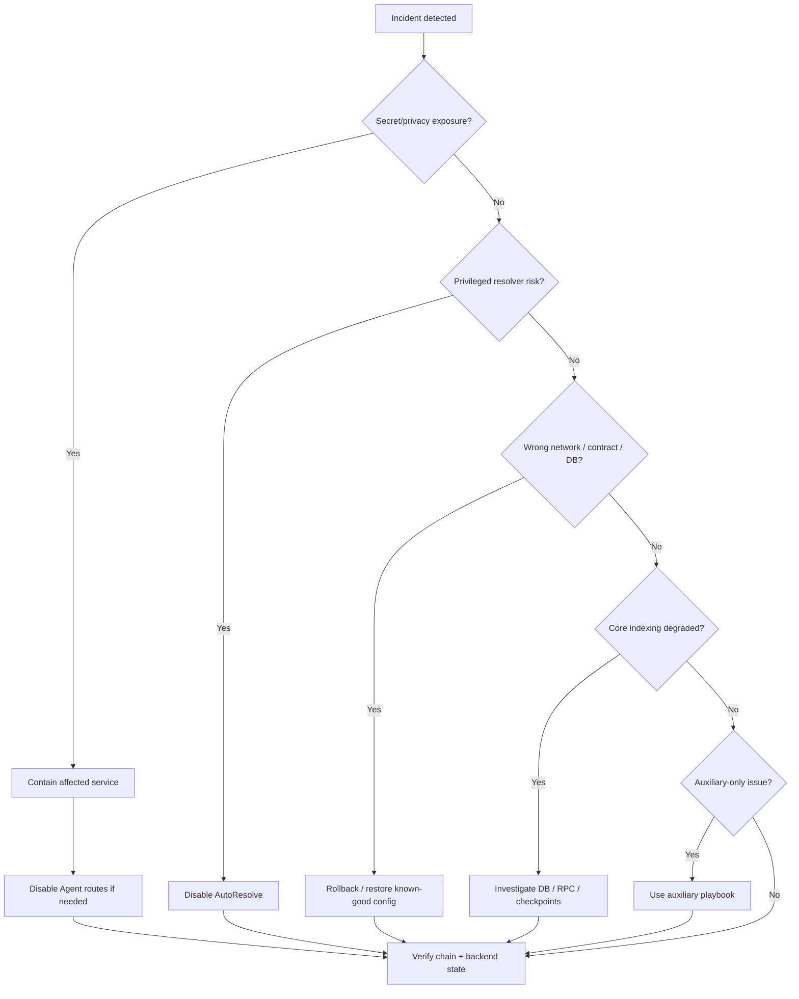
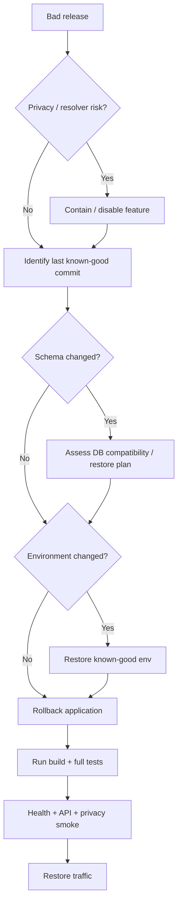
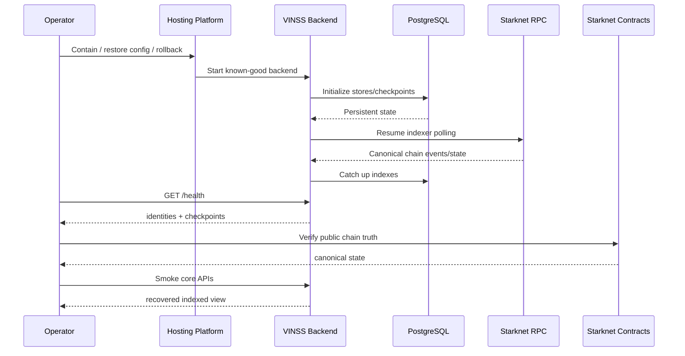
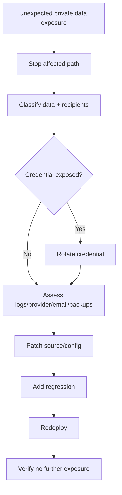
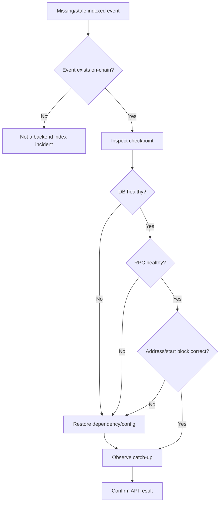
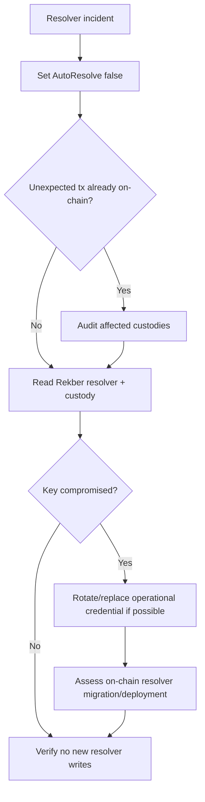

# VINSS Backend Incident Runbook

This document defines the operational response process for incidents affecting the VINSS backend.

The backend now contains several different classes of state and authority:

```text
public encrypted Discovery data

public Rekber lifecycle data

public Settlement Certificate data

PostgreSQL read models

ephemeral Presence

encrypted attachments

plaintext Feedback

optional remote Agent

optional Dispute evaluation

optional privileged Dispute resolver execution
```

Incident response must preserve those boundaries.

The first question during an incident is not only:

```text
Is the service down?
```

It is also:

```text
Is private data exposed?

Can an incorrect backend action affect settlement?

Is the backend serving stale or wrong-network state?

Is the problem only an auxiliary service?

Is canonical on-chain state still correct?
```

---

# Priority Order

Use this order unless a more severe active threat requires immediate containment.

```text
1. Protect user privacy and secrets.

2. Stop unintended privileged authority.

3. Prevent wrong-network / wrong-contract behavior.

4. Preserve canonical on-chain settlement integrity.

5. Restore safe service.

6. Diagnose root cause.

7. Reconcile backend state where necessary.

8. Add regression coverage and preventive controls.
```

---

# Core Incident Principle

Do not make an incident worse by weakening a security boundary.

Never solve an outage by:

```text
sending room secrets to the backend

logging channel keys

logging wallet private keys

logging the resolver private key

dumping full Agent prompts/evidence into telemetry

bypassing Rekber contract checks

manually editing checkpoints without a controlled recovery plan

treating PostgreSQL as canonical settlement truth
```

---

# Authority Hierarchy During Incidents

Use this authority order:

```text
1. Starknet canonical contract state

2. verified transaction receipts / public chain events

3. backend indexed PostgreSQL state

4. backend application-derived state

5. browser/local cached state

6. operator assumptions
```

For settlement disagreements between backend and chain:

```text
chain wins
```

---

# Privacy Hierarchy

For private Deal Room data:

```text
client cryptographic state
    >
backend convenience
```

If restoring a feature would require moving:

```text
room secret
channel key
pairwise key
plaintext history
```

into the backend, do not use that recovery method.

---

# Incident Severity Model

## SEV-0 — Active secret / privileged authority compromise

Examples:

```text
resolver private key exposed

database credentials publicly leaked

provider API key leaked with active abuse

wallet/private signing key accidentally stored server-side

room/channel keys logged or persisted

unexpected resolver transaction actively occurring
```

Primary goal:

```text
contain immediately
```

## SEV-1 — Privacy breach or incorrect settlement authority

Examples:

```text
private Deal Room plaintext reaches logs unexpectedly

Agent receives unintended automatic private context

Dispute evidence exposed outside intended path

wrong resolver identity configured

AutoResolve executes when policy should not permit it

backend points to wrong Rekber contract

mainnet backend points to testnet/mismatched infrastructure
```

Primary goal:

```text
stop affected path before restoring availability
```

## SEV-2 — Core persistent backend outage / stale critical indexing

Examples:

```text
PostgreSQL unavailable

Discovery indexer stopped

Rekber indexer stopped

Certificate indexer stopped

/health 503

indexers materially stale

wrong start-block checkpoint prevents startup

RPC outage prevents indexing
```

Primary goal:

```text
restore correct indexed state without corrupting history
```

## SEV-3 — Auxiliary service degradation

Examples:

```text
Presence reset

attachment API unavailable

Feedback email unavailable

Agent provider outage while core Deal Room still works

Royalty read unavailable

rate limiter behaving incorrectly
```

Primary goal:

```text
isolate failure and restore without touching canonical state
```

## SEV-4 — Cosmetic / documentation / non-critical operational issue

Examples:

```text
Swagger incomplete

non-sensitive log formatting

optional points UI temporarily stale

docs drift
```

Primary goal:

```text
fix normally
```

---

# Initial Triage

Within the first response cycle, determine:

```text
What changed?

Which commit/release is running?

Which network is configured?

Which PostgreSQL environment is connected?

Which contract addresses are configured?

Are any secrets exposed?

Is AutoResolve enabled?

Is Agent enabled?

Is Loyalty enabled?

Is /health 200 or 503?

Are indexers advancing?

Is the chain itself healthy?

Is only one route failing?

Did the incident begin after deploy/restart/env change?
```

---

# Initial Decision Tree



---

# Safe Evidence Collection

Collect only what is necessary.

Safe examples:

```text
Git commit SHA

deployment timestamp

network

public contract addresses

public start blocks

HTTP status codes

checkpoint identities

checkpoint block numbers

checkpoint timestamps

transaction hashes

public custody commitments

public certificate token IDs

error category/name

request path

platform deployment ID
```

Avoid copying:

```text
room secret

channel key

pairwise key

wallet seed/private key

resolver private key

provider API key

database password

attachment capability token

full Agent prompt

full dispute evidence

plaintext private Message

private Offer terms
```

into shared systems.

---

# First Commands

Git identity:

```bash
cd ~/vinss

git rev-parse HEAD
git status --short
```

Backend health:

```bash
curl -i -s \
  https://<backend-domain>/health
```

Core indexed reads:

```bash
curl -i -s \
  'https://<backend-domain>/rekber/events?limit=1'

curl -i -s \
  'https://<backend-domain>/activity?limit=1'
```

Do not paste secret-bearing environment values into the incident channel.

---

# Health Interpretation

`GET /health` reads:

```text
DiscoveryIndexer status

RekberIndexer status

CertificateIndexer status
```

Healthy:

```text
HTTP 200
status = ok
```

Degraded:

```text
HTTP 503
status = degraded
```

when any tracked checkpoint is in:

```text
error
```

or status retrieval fails.

---

# Health Is Not Complete Readiness

A `200` does not prove:

```text
index is current to chain head

wallet works

Ready works

Agent provider works

attachment service works

AutoResolve works

frontend decrypts

two-wallet E2E works
```

Capture:

```text
identity
kind where applicable
contractAddress
startBlock
nextBlock
lastIndexedBlock
latestObservedBlock
status
updatedAt
```

for relevant checkpoints.

---

# Staleness Check

Compare:

```text
latestObservedBlock
lastIndexedBlock
updatedAt
```

over time.

A checkpoint that remains unchanged unexpectedly can be incident evidence even when:

```text
status != error
```

Current indexer loops can fail while reading the latest block and skip a cycle without necessarily persisting `error`.

---

# Privacy-Boundary Incident

Examples:

```text
plaintext private Message appears in backend log

room/channel key reaches backend

Agent automatic context includes decrypted Offer terms unexpectedly

provider receives unintended room history

attachment plaintext is uploaded instead of ciphertext

secret appears in telemetry
```

Immediate actions:

```text
1. Stop the affected release/path.

2. Disable Agent if Agent/provider path is involved.

3. Disable AutoResolve if Dispute path is involved.

4. Prevent further log/telemetry ingestion if possible.

5. Do not copy the leaked payload into additional systems.

6. Rotate affected credentials when applicable.

7. Preserve minimal metadata needed to investigate.

8. Identify exact code/data path.

9. Patch.

10. Add regression test.

11. Review retention/deletion implications in every external system that received the data.

12. Redeploy only after privacy tests pass.
```

---

# Agent Emergency Kill Switch

Current route mounting uses:

```text
AGENT_ENABLED
```

for both:

```text
/agent/*
/dispute/*
```

Setting:

```text
AGENT_ENABLED=false
```

and restarting/redeploying removes both route groups.

This does not disable:

```text
/discover
/rekber/events
/activity
/royalty
/presence
/attachments
/feedback
```

---

# AutoResolve Emergency Kill Switch

If the issue is specifically privileged resolver execution:

```text
DISPUTE_AUTO_RESOLVE_ENABLED=false
```

prevents new resolver authorization attempts through the executor.

Dispute evaluation can remain available if:

```text
AGENT_ENABLED=true
```

---

# Resolver Key Exposure Incident

Treat as:

```text
SEV-0
```

Immediate actions:

```text
1. Disable AutoResolve immediately.

2. Prevent backend from using the compromised key.

3. Determine whether the key controls the currently configured on-chain resolver address.

4. Inspect public Rekber resolution events/transactions for unauthorized activity.

5. Preserve transaction hashes and timestamps.

6. Do not post the key in incident channels.

7. Determine whether on-chain resolver authority can be rotated in the deployed contract architecture.

8. If authority is immutable, assess contract/deployment migration strategy.

9. Rotate/replace operational credential where meaningful.

10. Patch operational process that exposed it.
```

---

# Resolver Authority Precision

Current executor verifies:

```text
configured resolverAddress
```

against:

```text
get_dispute_resolver()
```

before executing.

That protects against accidental mismatch.

It does not protect against compromise of the matching resolver key itself.

---

# Unexpected Resolver Transaction Incident

Symptoms:

```text
EscrowRekberCustodyResolved event without expected operational action

backend reports authorized unexpectedly

resolver account transaction observed unexpectedly
```

Immediate:

```text
disable AutoResolve

identify tx hash

read on-chain custody

verify authorized payer/payee amounts

verify resolution commitment

review backend deployment/config

review policy decision trail without exposing private evidence
```

Do not attempt to “undo” public chain resolution by editing backend rows.

---

# Wrong-Network Incident

Examples:

```text
backend configured mainnet but wrong RPC

backend configured Sepolia while frontend points to mainnet

mainnet backend uses Sepolia helper address

production service connected to test database
```

Immediate actions:

```text
1. Stop/route away affected backend.

2. Record current public config identity.

3. Verify actual RPC chain externally.

4. Verify intended PostgreSQL environment.

5. Verify all contract deployment records.

6. Restore coherent known-good environment set.

7. Restart.

8. Verify /health identities.

9. Verify indexed reads.

10. Do not merge/move data across environments casually.
```

---

# Config Parser Protection

Current mainnet config rejects RPC URL identities containing:

```text
sepolia
goerli
testnet
```

and requires HTTPS CORS.

This reduces mistakes but does not cryptographically prove chain identity.

---

# Wrong Contract Address Incident

A valid Starknet address can pass syntax checks while referring to the wrong deployment.

Symptoms:

```text
indexer returns no events

getter calls fail

checkpoint enters error

Dispute custody verification fails

Royalty/certificate data empty unexpectedly
```

Verify:

```text
contract address
deployment/start block
```

together.

---

# Wrong Start Block Incident

Symptoms:

```text
startup database initialization failed

Configured start block does not match stored checkpoint
```

Do not delete checkpoint immediately.

Determine:

```text
Did env change accidentally?

Was contract redeployed?

Is this a new network?

Is this the wrong database?

Is intentional reindex required?
```

Recovery depends on which of those is true.

---

# Startup Database Incident

Current startup initializes:

```text
Feedback table

Discovery tables/checkpoints

Rekber tables/checkpoint

Certificate tables/checkpoint
```

Failure logs:

```text
[startup] database initialization failed
```

and normal startup stops.

Top-level fatal initialization logs:

```text
[startup] fatal initialization error
```

---

# Database Outage Incident

Symptoms:

```text
backend fails startup

/health 503 with null indexers

/discover 500

/activity 500

/rekber/events 500

/royalty 500

attachments 503

feedback 500

indexers cannot persist
```

Immediate actions:

```text
1. Verify managed DB service status.

2. Verify DATABASE_URL points to expected environment.

3. Verify credentials/rotation.

4. Verify network path/TLS.

5. Check connection limit exhaustion.

6. Check schema/DDL permissions.

7. Avoid deleting tables/checkpoints.

8. Restore DB connectivity.

9. Restart only if needed.

10. Verify /health.

11. Verify indexer advancement.

12. Verify attachments/feedback if relevant.
```

---

# Database Connection Limit Incident

Current backend pool:

```text
max = 10 connections per process
```

Multiple replicas multiply potential total connections.

Check:

```text
number of backend replicas

DB connection limits

duplicate indexer workload

long-running queries

platform connection pooling
```

---

# Schema Migration Incident

Current backend performs some DDL at startup.

Examples:

```text
CREATE TABLE IF NOT EXISTS

CREATE INDEX IF NOT EXISTS

ALTER TABLE
```

Symptoms:

```text
database initialization failed after deploy

permission denied for ALTER TABLE

constraint migration failure

old code incompatible with new schema
```

Response:

```text
1. Stop rollout.

2. Preserve DB backup.

3. Identify exact DDL that ran.

4. Determine whether schema change is additive/backward compatible.

5. Do not blindly restore app code and assume schema rolled back.

6. Choose forward fix, controlled migration, DB restore, or compatible app rollback.

7. Verify all stores initialize.
```

---

# App Rollback Does Not Roll Back DB

A hosting rollback does not automatically reverse:

```text
ALTER TABLE

new columns

new constraints

new rows

checkpoint advancement
```

---

# Discovery Incident

Current Discovery is:

```text
background indexer
+
PostgreSQL read API
```

not live per-request RPC scanning.

Symptoms:

```text
new Message/Offer/Private Escrow actions not appearing

checkpoint stale

checkpoint status error

/discover returns old records only

/discover 500

high DB latency

background RPC failures
```

---

# Discovery Incident Split

First decide:

```text
read API failure?
```

or:

```text
background ingestion failure?
```

They are different.

A `/discover` 500 usually points to the indexed lookup/DB path, not a direct helper RPC timeout.

---

# Discovery Stale-but-200

If RPC/indexer fails while DB remains healthy:

```text
/discover can still return 200
```

with older records.

Response:

```text
1. Check /health.

2. Inspect Message/Offer/Escrow checkpoint timestamps.

3. Compare lastIndexedBlock/latestObservedBlock.

4. Inspect indexer logs.

5. Verify RPC.

6. Verify helper addresses.

7. Verify start blocks.

8. Restore RPC/indexer path.

9. Watch checkpoint advance.

10. Confirm known new action appears.
```

---

# Discovery Privacy Negative Test

After recovery:

```bash
curl -i -s \
  -X POST \
  -H 'Content-Type: application/json' \
  -d '{"kind":"message","channelKeyHex":"0x123"}' \
  https://<backend-domain>/discover
```

Expected:

```text
400
```

Never add temporary room/key inputs as an incident workaround.

---

# Discovery Chunk Hydration Incident

Symptoms:

```text
definition checkpoint becomes error

helper getter failure

Invalid ciphertext chunk count
```

Verify:

```text
contract address

ABI compatibility

record getter name

chunk getter name

deployed helper class/version

RPC correctness
```

Backend defensive maximum is 4096, while the canonical VINSS protocol currently allows only 64 ciphertext chunks.

A reported count above 64 on a supposed canonical VINSS helper should be treated as an anomaly.

---

# Rekber Indexer Incident

Symptoms:

```text
funded/released/refunded/resolved event missing in API

Rekber checkpoint error/stale

/rekber/events fails

/activity missing expected settlement event
```

Triage:

```text
1. Verify chain transaction/event exists.

2. Verify configured ESCROW_REKBER_ADDRESS.

3. Verify start block/checkpoint.

4. Verify RPC.

5. Check RekberIndexer status.

6. Check DB.

7. Compare /rekber/events against public chain.

8. Restore indexer.

9. Do not modify custody state through DB.
```

If chain shows release but backend does not:

```text
chain release is authoritative
```

---

# Certificate Indexer Incident

Symptoms:

```text
certificate exists on-chain

/activity lacks certificate_issued

Royalty points not updated

certificate checkpoint stale/error
```

Triage:

```text
verify SettlementCertificateIssued event

verify certificate contract address

verify certificate start block

verify CertificateIndexer checkpoint

verify PostgreSQL

restore indexing

recheck /activity

recheck /royalty/:address
```

---

# Royalty Incident

Royalty derives from:

```text
CertificateStore
```

plus backend points formula.

If Royalty is wrong:

```text
first verify certificate indexed stats
then verify points calculation
```

Do not immediately mutate certificate events.

Current conversion remains:

```text
coming_soon
```

---

# RPC Incident

RPC failures can affect:

```text
Discovery indexing

Rekber indexing

Certificate indexing

Dispute live custody verification

Dispute principal valuation

resolver execution
```

Symptoms:

```text
latest block query failures

event scan failures

contract call failures

indexer staleness

Dispute evaluate 400 due to underlying RPC failure

AutoResolve execution failure
```

Response:

```text
1. Verify endpoint availability.

2. Verify actual network.

3. Verify provider quota/rate limit.

4. Verify API credential if embedded in URL.

5. Check latency/error rate.

6. Switch to an approved same-network RPC if operational policy allows.

7. Do not expose the RPC credential publicly.

8. Observe all three indexers resume.

9. Re-run Dispute only when appropriate.
```

Current backend has one `RPC_URL`; there is no built-in RPC fallback list.

---

# Indexer Reorg Incident

Current indexers are:

```text
forward-scanning
checkpoint-based
idempotent-insert
```

They do not implement a documented full reorg rollback pipeline.

Potential symptoms:

```text
indexed tx/event no longer canonical

backend row disagrees with current chain

transaction hash changed

event disappeared after reorg
```

Response:

```text
1. Verify whether a chain reorg occurred.

2. Identify affected block range.

3. Preserve current DB backup.

4. Determine affected index families.

5. Do not blindly delete all tables.

6. Define controlled rewind/replay.

7. Reconcile against canonical chain.

8. Verify Activity/Discovery/Rekber/Certificate reads.
```

---

# Presence Incident

Presence uses:

```text
process-local in-memory Map
```

Expected restart/redeploy effects:

```text
ephemeral state can disappear
```

Symptoms:

```text
typing indicator disappears

read/presence signals missing

publish succeeds but peer poll misses event
```

For multiple replicas, a likely pattern is:

```text
publish -> replica A
poll -> replica B
```

Current Presence is not shared between replicas.

Do not reconstruct it using plaintext logging or server-side decryption.

---

# Attachment Incident

Attachments are:

```text
encrypted binary blobs

stored in PostgreSQL

guarded by capability token
```

Symptoms:

```text
PUT 503

GET 503

GET 404 with correct token

duplicate ID 409

first request fails after deploy

unexpected plaintext observed
```

The attachment table is lazy-initialized, so a first-request 503 can expose DDL permission or DB problems not caught by core startup.

---

# Attachment Capability Incident

If a capability token leaks:

```text
treat it as a compromised object-access credential
```

Current API has no token-rotation endpoint for an existing object.

Operational recovery may require a new attachment ID/token and re-upload of the encrypted blob.

---

# Attachment Wrong Token Behavior

Wrong token intentionally returns:

```text
404
```

same as a missing object.

Do not weaken this during debugging.

---

# Attachment Plaintext Incident

If plaintext attachment bytes reach backend unexpectedly:

```text
SEV-1
```

Response:

```text
stop affected path

determine whether plaintext was persisted

restrict DB/log access

assess backups

fix client encryption

re-upload only ciphertext
```

---

# Feedback Incident

Feedback is plaintext application data.

Symptoms:

```text
POST /feedback 500

email notification missing

unexpected sensitive deal content submitted
```

Database insert is authoritative.

Email is best-effort.

If feedback is stored but email missing, do not treat that as loss of feedback.

---

# Feedback Sensitive Data Incident

If users submit secrets/private deal content through Feedback, assess:

```text
DB retention

backups

email copy if Resend enabled

operator inbox retention
```

as a plaintext data incident.

---

# Agent Provider Outage

Symptoms:

```text
POST /agent -> 500 Agent failed.

GET /agent/providers shows no configured providers.

provider timeout.

one provider repeatedly fails.
```

Response:

```text
1. Check AGENT_ENABLED intent.

2. Check /agent/providers.

3. Verify configuredProviders.

4. Verify default/fallback configuration.

5. Verify provider credentials.

6. Verify provider service status.

7. Use configured fallback only if disclosure policy accepts it.

8. Keep core Deal Room/indexing independent.

9. Do not expose raw provider error bodies.
```

---

# No Provider Configured

The backend can start with:

```text
AGENT_ENABLED=true
```

and no actually configured remote provider.

Then Agent requests fail at runtime.

This is not a core backend startup failure.

---

# Agent Data-Governance Incident

Fallback can send the same explicit request to multiple configured providers.

If this is unexpected, review:

```text
VINSS_LLM_PROVIDER

VINSS_LLM_FALLBACKS

which provider credentials are configured
```

---

# Agent Tool-Scope Incident

If Agent appears to perform a prohibited transaction action:

```text
disable AGENT_ENABLED

capture safe metadata

verify actual chain transaction source

inspect tool allowlists

inspect frontend execution

add regression coverage
```

Normal Agent is not designed with generic sign/fund/release/refund transaction tools.

---

# Dispute Challenge Incident

Symptoms:

```text
challenge rejects valid party

binding verification fails

typed data mismatch

unexpected wallet identity
```

Response:

```text
verify canonical Rekber custody

verify original Agreement binding

verify payer/payee addresses

verify chain ID/network

verify typed-data domain

never bypass signature verification
```

---

# Dispute Evaluate Incident

Symptoms:

```text
HTTP 400 on evaluation

attestation rejection

provider failure

valuation failure

policy result unexpected

resolver execution failure
```

Current route maps caught errors broadly to:

```text
HTTP 400
```

So 400 can represent:

```text
input validation

verification

RPC

provider

executor
```

failures.

---

# Dispute Evaluation Triage

```text
1. Verify input sanitation failure vs later failure.

2. Verify live custody read.

3. Verify both dispute attestations.

4. Verify original Rekber binding.

5. Verify principal valuation path.

6. Verify provider availability.

7. Inspect deterministic policy result.

8. If execution expected:
       verify AutoResolve flag
       verify resolver identity
       verify resolver account capability/funding
```

---

# Policy Disagreement Incident

Do not treat raw LLM output as financial authority.

The deterministic policy sits between:

```text
Agent decision
```

and:

```text
resolver execution
```

If the LLM result is questionable, keep AutoResolve disabled while investigating.

---

# AutoResolve Status Interpretation

`not_enabled`:

```text
policy eligible
but AutoResolve disabled
```

`already_authorized`:

```text
on-chain resolution already authorized
```

`authorized`:

```text
executor submitted and confirmed a resolver transaction
```

`not_eligible`:

```text
policy did not authorize automatic execution
```

---

# AutoResolve Transaction Failure

If submission fails, executor re-reads on-chain Rekber state.

If resolution is now authorized, it returns:

```text
already_authorized
```

Otherwise the error is genuine and should be investigated.

---

# Rate-Limit Incident

Current limiter is:

```text
fixed-window
in-memory
process-local
```

Symptoms:

```text
unexpected 429

abuse not throttled enough

different behavior across replicas

limit resets after deploy
```

Check:

```text
RATE_LIMIT_WINDOW_MS

DISCOVER_RATE_LIMIT

AGENT_RATE_LIMIT

replica count

trust proxy behavior

client IP interpretation
```

Feedback has separate hardcoded 5/min behavior.

---

# Mainnet Proxy Incident

On mainnet:

```text
trust proxy = 1
```

assumes one managed reverse proxy.

If topology changes, `req.ip` and rate-limit identity can become wrong.

---

# Bad Deployment Incident

Symptoms:

```text
new release starts failing

privacy regression

unexpected route exposure

wrong feature flag

DB schema startup failure

indexer stopped after deploy
```

---

# Bad Deployment Flow



---

# Last Known-Good Definition

Record:

```text
Git commit SHA

deployment ID

environment

database target

network

contract identities

feature flags
```

A commit SHA alone is insufficient if environment changed.

---

# Persistent vs Ephemeral After Rollback

Restart/rollback resets:

```text
Presence

legacy Loyalty

rate-limit counters
```

Normally persists in PostgreSQL:

```text
Discovery records/checkpoints

Rekber events/checkpoint

Certificate events/checkpoint

attachments

feedback
```

---

# Loyalty Incident

Legacy Loyalty is:

```text
feature-gated

in-memory

client-write

not production-authoritative
```

If enabled accidentally:

```text
LOYALTY_ENABLED=false
```

and restart/redeploy.

Do not reconstruct valuable balances from unverified client claims.

---

# OpenAPI Incident

Swagger/OpenAPI can be incomplete while runtime routes still exist.

Before declaring a route absent, inspect executable route mounting.

This is normally lower severity unless it causes a security or integration failure.

---

# Log Exposure Incident

Current global logger intentionally prints only:

```text
METHOD PATH
```

If hosting middleware/APM logs request bodies or sensitive headers, treat that separately from source logger behavior.

Review:

```text
hosting logs

APM

reverse proxy

error tracker

custom middleware
```

---

# Sensitive Headers

Check infrastructure handling of:

```text
Authorization

x-vinss-attachment-token

provider headers
```

---

# Credential Incidents

## Database credential leak

```text
rotate DB credential

update secret

restart

invalidate old credential

review DB access logs
```

## Provider API key leak

```text
revoke/rotate provider key

update backend secret

review provider usage/cost

review data exposure
```

## RPC API token leak

```text
rotate provider credential

update RPC_URL

verify chain

restart

watch indexers resume
```

## Resend key leak

```text
rotate RESEND_API_KEY

review email-sending abuse
```

---

# CORS Incident

Symptoms:

```text
frontend blocked

unexpected browser origin accepted
```

Check:

```text
CORS_ORIGIN

network

mainnet HTTPS requirement

actual frontend production origin
```

CORS is not authentication.

---

# Frontend/Backend Mismatch Incident

Symptoms:

```text
frontend cannot see new events

wrong contract shown

certificate/Royalty mismatch

UI appears stale
```

Verify separately:

```text
frontend env

backend env

chain deployment

backend checkpoint
```

---

# Decryption Failure Incident

If backend returns expected ciphertext but frontend cannot decrypt, investigate:

```text
room secret

key derivation

routing-tag matching

ciphertext framing

frontend cache

SDK compatibility
```

without sending keys to backend.

---

# Wallet / Ready Failure Incident

If transaction never reaches chain:

```text
backend indexer cannot index it
```

Check transaction existence before debugging the backend.

---

# Missing Message Triage

```text
1. Did wallet action succeed?

2. Is transaction on-chain?

3. Did MessageCommitted event occur?

4. Is Discovery checkpoint past that block?

5. Is row in /discover range?

6. Does frontend match routing tag?

7. Does local decrypt succeed?
```

---

# Missing Offer Triage

```text
transaction

event

checkpoint

/discover

local routing

local decrypt

application semantics
```

---

# Missing Rekber Settlement Triage

```text
1. Is Rekber transaction on-chain?

2. Is custody public state updated?

3. Is expected event emitted?

4. Is RekberIndexer past block?

5. Is /rekber/events showing event?

6. Is /activity showing event?

7. Is frontend interpreting it correctly?
```

---

# Missing Certificate Triage

```text
1. Did user claim Certificate?

2. Is claim transaction accepted?

3. Is SettlementCertificateIssued emitted?

4. Is CertificateIndexer past block?

5. Is /activity updated?

6. Is Royalty updated?
```

---

# Horizontal Scaling Incident

Current backend is not a coordinated distributed indexer cluster.

Symptoms:

```text
duplicate RPC load

checkpoint races

Presence misses

rate-limit multiplication
```

If incident began after increasing replicas, consider reducing to one replica while investigating.

Review:

```text
indexer coordination

Presence shared storage

distributed rate limiting
```

---

# Graceful Shutdown / Crash

Current shutdown:

```text
stop 3 indexers

wait

close HTTP server

close DB
```

A crash during Discovery can leave:

```text
records committed
checkpoint not advanced
```

Recovery rescans the same range; existing-locator checks and DB conflict handling reduce duplicate rows.

---

# Index Record Corruption Incident

If backend rows are manually corrupted:

```text
do not treat corrupted DB as chain truth
```

Plan reconstruction from:

```text
known start block

canonical contract

public events/getters
```

---

# What Can Be Rebuilt From Chain

Potentially reconstructible:

```text
Discovery records

Rekber events

Certificate events
```

Not reconstructed from chain indexers:

```text
feedback

encrypted attachment blobs

Presence

legacy Loyalty
```

---

# Backup Incident

If backup is unavailable/corrupt:

```text
settlement chain truth still exists
```

but application data can be lost.

Prioritize protection/recovery of:

```text
attachments

feedback
```

because they are not reconstructed by the chain indexers.

---

# Backup Privacy

Backups can contain:

```text
ciphertext metadata

encrypted attachment blobs

plaintext feedback
```

Treat them as sensitive operational data.

---

# External Provider Retention Incident

If an Agent prompt or dispute evidence was accidentally disclosed:

```text
identify provider

identify time window

identify affected request class

review provider retention/settings

request deletion/support action when available/required

rotate API credential only if the credential itself was exposed
```

Document data categories rather than copying unnecessary verbatim private content.

---

# Incident Timeline

Maintain:

```text
first observed time

last known-good time

deploy/config changes

containment time

recovery time

verification time
```

Use one clearly labeled timezone.

---

# Funds-Affected Verification

Do not infer fund safety from backend HTTP status.

Check:

```text
canonical Rekber contract state

public transaction history

resolver transactions

custody records
```

---

# Core vs Auxiliary Impact Language

Examples:

```text
Core settlement remained on-chain; Discovery indexing was delayed.

Presence was reset; no canonical Message/Offer records were lost.

Agent was disabled; private chat and Rekber remained available.

Royalty display was stale because Certificate indexing lagged; Certificate ownership was unchanged.
```

---

# Post-Recovery Verification

Always verify repaired path plus neighboring security boundaries.

Core:

```text
/health identity correct

checkpoints advance

/discover works

/rekber/events works

/activity works
```

Privacy:

```text
/discover rejects channelKeyHex

request body is not logged

Agent sanitizer tests pass

provider raw error not exposed
```

Agent, if enabled:

```text
/agent/providers correct

public skills chat/offer/escrow only

provider intended

proposal remains non-executing
```

Dispute, if enabled:

```text
challenge verifies binding

evaluate verifies attestations

AutoResolve state intentional

resolver address matches contract

no unexpected resolver tx
```

---

# Deployment Regression Gate

Before re-release:

```bash
cd ~/vinss/backend

npm run typecheck
npm run build
npm test
```

Current `npm test` includes backend test files plus the privacy-boundary script.

---

# Incident-Specific Regression Test

Every meaningful incident should add the narrowest executable regression that would have caught it.

Examples:

```text
forbidden privacy field test

wrong skill tool rejection

checkpoint start-block mismatch test

resolved Rekber event decode test

resolver mismatch test

attachment wrong-token indistinguishability test
```

---

# Root-Cause Categories

Classify root cause as one or more:

```text
code defect

configuration error

deployment error

database failure

RPC/provider failure

external LLM failure

secret-handling failure

frontend/backend incompatibility

contract/backend incompatibility

horizontal-scaling limitation

operator procedure gap

documentation gap
```

---

# Postmortem Questions

```text
What user capability failed?

Was private data exposed?

Was privileged authority exercised?

Was on-chain settlement incorrect?

Was backend state stale or wrong?

What was the first bad change?

Why did existing checks miss it?

What containment worked?

What made diagnosis harder?

What permanent change prevents recurrence?
```

---

# Required Postmortem Output

At minimum:

```text
impact

time window

root cause

containment

recovery

chain-state impact

privacy impact

credential impact

regression coverage

follow-up items
```

---

# Known Incident-Prone Boundaries

Current backend limitations relevant to incident response:

```text
process-local Presence

process-local rate limits

no documented distributed indexer leader election

single configured RPC

startup-time DB schema changes

OpenAPI drift

Agent and Dispute share AGENT_ENABLED

health is not full readiness

latest-block query failure may not mark checkpoint error immediately

no full documented reorg rollback

legacy Loyalty non-durable
```

---

# Incident Command Matrix

| Incident | First containment |
|---|---|
| Room/channel key exposure | Stop affected path/release |
| Resolver key exposure | Disable AutoResolve |
| Agent/provider privacy issue | `AGENT_ENABLED=false` |
| Wrong mainnet contract/env | Stop traffic + restore config |
| DB outage | Restore DB connectivity |
| RPC outage | Restore/switch verified RPC |
| Discovery stale | Repair indexer/RPC, verify checkpoint |
| Rekber index stale | Repair Rekber indexer |
| Certificate index stale | Repair Certificate indexer |
| Presence loss | Accept/reset; restore service |
| Legacy Loyalty issue | `LOYALTY_ENABLED=false` |
| Attachment DB failure | Restore DB/DDL permission |
| Feedback email failure | No core rollback required |
| Horizontal replica issue | Reduce replicas / investigate |

---

# Safe Operational Commands

```bash
cd ~/vinss
git rev-parse HEAD
git status --short

cd ~/vinss/backend
npm run typecheck
npm run build
npm test
```

Health:

```bash
curl -s \
  https://<backend-domain>/health
echo
```

Rekber:

```bash
curl -s \
  'https://<backend-domain>/rekber/events?limit=5'
echo
```

Activity:

```bash
curl -s \
  'https://<backend-domain>/activity?limit=5'
echo
```

---

# Avoid Environment Dumps

Do not paste full:

```text
env

printenv

hosting variable export
```

into shared incident channels.

Prefer:

```text
public values individually

secret presence without displaying full value
```

---

# Incident Recovery Flow



---

# Privacy Incident Flow



---

# Indexer Incident Flow



---

# Resolver Incident Flow



---

# Incident Closure Criteria

Do not close until:

```text
containment complete

root cause understood enough

safe service restored

chain truth verified when relevant

privacy impact assessed

credential rotation complete when needed

backend state reconciled

tests pass

regression added

monitoring stable through multiple cycles
```

---

# Privacy Closure Criteria

If private data was disclosed:

```text
identify categories

identify recipients/systems

identify retention

delete/revoke where possible

rotate relevant credential

fix source path

verify no repeat
```

---

# Resolver Closure Criteria

```text
AutoResolve state intentional

resolver key secure

on-chain resolver identity verified

affected transactions audited

no unauthorized split remains unexplained

monitoring restored
```

---

# Database Closure Criteria

```text
DB healthy

schema initializes

checkpoints load

indexers advance

persistent APIs work

backup status known
```

---

# RPC Closure Criteria

```text
actual network verified

latency/errors normal

all 3 indexers advancing

Dispute chain reads work if feature enabled
```

---

# Bad Deployment Closure Criteria

```text
known-good commit deployed

known-good env restored

DB compatibility verified

health identities correct

privacy test passes

affected route passes smoke
```

---

# Checklists

## Privacy

```text
[ ] affected route contained
[ ] Agent disabled if relevant
[ ] AutoResolve disabled if relevant
[ ] leaked data category identified
[ ] credentials rotated if needed
[ ] external retention reviewed
[ ] regression added
[ ] privacy test passes
```

## Core indexing

```text
[ ] chain event verified
[ ] network verified
[ ] contract address verified
[ ] start block verified
[ ] DB healthy
[ ] RPC healthy
[ ] checkpoint inspected
[ ] checkpoint advances
[ ] API returns event
```

## Database

```text
[ ] correct DATABASE_URL environment
[ ] credentials valid
[ ] connection count healthy
[ ] DDL permissions valid
[ ] schema compatible
[ ] backup status known
[ ] health restored
```

## Dispute / Resolver

```text
[ ] AGENT_ENABLED state known
[ ] AutoResolve state known
[ ] resolver address verified
[ ] key not exposed
[ ] custody checked on-chain
[ ] attestations/binding verified
[ ] unexpected tx audited
[ ] no further privileged writes
```

## Deployment

```text
[ ] commit SHA known
[ ] last known-good known
[ ] env diff reviewed
[ ] DB schema impact reviewed
[ ] rollback safe
[ ] build passes
[ ] npm test passes
[ ] post-deploy smoke passes
```

---

# Future Runbook Hardening

Useful future additions:

```text
automated health/lag alerts

explicit readiness endpoint

distributed rate-limit alerting

indexer metrics

resolver transaction alerts

DB migration tool

controlled reindex script

reorg recovery script

secret-rotation playbooks

external-provider data-retention matrix
```

These are not current implementation claims.

---

# Source-of-Truth Order During Incident

Use:

```text
1. canonical Starknet contract state

2. current deployed environment

3. current deployed Git revision

4. backend executable source

5. PostgreSQL indexed state

6. logs/metrics

7. documentation
```

---

# Bottom Line

The VINSS backend incident model must preserve three distinctions:

```text
private encrypted coordination

public on-chain settlement

optional backend authority
```

The most important privacy rule is:

> Never restore service by moving Deal Room keys or private plaintext into the backend.

The most important settlement rule is:

> PostgreSQL is a read model, not canonical Rekber truth.

The most important resolver rule is:

> If privileged Dispute execution is in doubt, disable `DISPUTE_AUTO_RESOLVE_ENABLED` first and verify on-chain state before attempting further execution.

The most important deployment rule is:

> A rollback of application code does not automatically roll back PostgreSQL schema, checkpoint history, or public chain state.

The most important operational rule is:

> Diagnose whether the incident is chain-side, indexer-side, database-side, client-side, or auxiliary before changing state.
