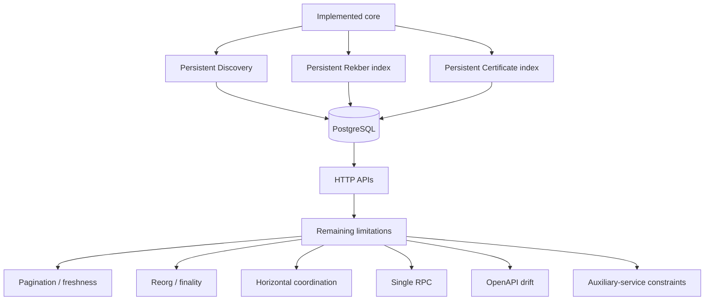
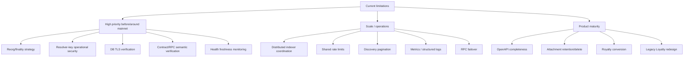
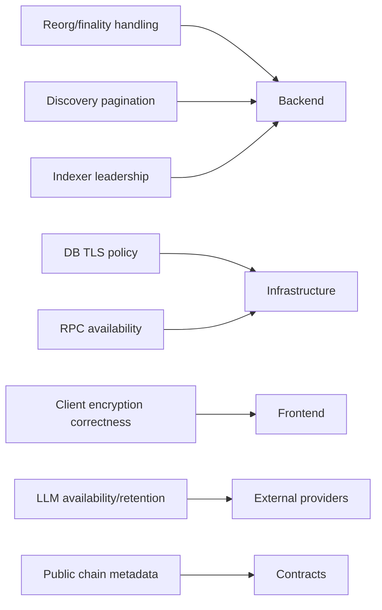
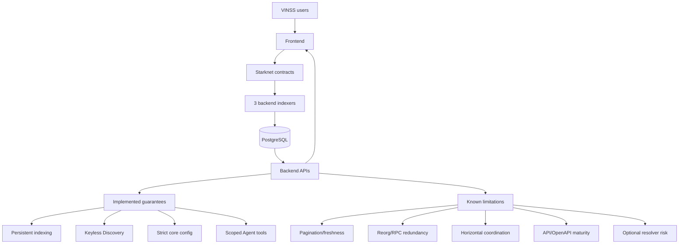

# VINSS Backend Known Limitations

This document records backend limitations that are still present in the current VINSS implementation.

Its purpose is to prevent:

```text
implemented foundations
```

from being described as:

```text
production guarantees
```

and to prevent already-fixed issues from continuing to appear as current technical debt.

The executable source is authoritative.

---

# How to Read This Document

Each limitation is classified as one of:

```text
ACTIVE
    -> present in current source

DESIGN TRADE-OFF
    -> intentional current behavior with known operational cost

DOCUMENTATION GAP
    -> runtime works, but docs/spec/API surface are incomplete or inconsistent

FUTURE HARDENING
    -> not necessarily blocking today, but relevant for scale/mainnet maturity

NOT A CURRENT LIMITATION
    -> an older limitation that has already been implemented/fixed
```

---

# Current High-Level Status

The backend is no longer:

```text
live request-time Starknet discovery
+
ephemeral-only state
+
unlimited public APIs
```

It now has:

```text
persistent PostgreSQL indexing

background Discovery ingestion

independent Rekber indexing

independent Settlement Certificate indexing

persistent checkpoints

network-aware identities

rate-limited Discovery/Agent/Dispute/Feedback paths

strict required mainnet configuration

encrypted attachment storage

certificate-derived Royalty

feature-gated Agent/Dispute
```

The remaining limitations are therefore concentrated in:

```text
pagination

freshness/completeness signaling

reorg/finality handling

horizontal scaling

single-RPC dependency

partial OpenAPI coverage

feature-gate granularity

Agent privacy/availability trade-offs

privileged resolver operational risk

application-data retention

health/readiness scope

database migration architecture

some route/schema drift
```

---

# Summary Matrix

| Area | Current limitation | Classification |
|---|---|---|
| Discovery | No response pagination | ACTIVE |
| Discovery | No completeness/freshness metadata in response | ACTIVE |
| Discovery | Single RPC endpoint | ACTIVE |
| Discovery | No explicit reorg rollback/finality delay | ACTIVE |
| Discovery | Per-action chunk calls remain sequential | DESIGN TRADE-OFF |
| Discovery | Multi-replica indexer coordination absent | ACTIVE |
| Activity | Explicit `rekber_resolved` filter missing | ACTIVE |
| Activity | `nextCursor` is heuristic | ACTIVE |
| Presence | Process-local memory only | ACTIVE |
| Rate limits | Process-local memory only | ACTIVE |
| Attachments | No delete/rotation/retention API | ACTIVE |
| Attachments | Table creation is lazy | DESIGN TRADE-OFF |
| Agent | External provider dependency | ACTIVE |
| Agent | Explicit prompt can reach multiple fallback providers | DESIGN TRADE-OFF |
| Agent | Automatic context intentionally sparse | DESIGN TRADE-OFF |
| Agent/Dispute | Shared `AGENT_ENABLED` route gate | ACTIVE |
| Dispute | Backend may hold resolver signing key | SECURITY TRADE-OFF |
| Dispute | Broad 400 error mapping | ACTIVE |
| Royalty | Conversion not implemented | ACTIVE |
| Legacy Loyalty | In-memory + unauthenticated write model | ACTIVE |
| Health | Indexer-oriented, not full readiness | ACTIVE |
| OpenAPI | Missing several runtime routes | DOCUMENTATION GAP |
| Config | RPC chain identity not cryptographically checked at startup | ACTIVE |
| Config | `DATABASE_SSL` disables certificate verification | ACTIVE |
| Database | Startup-time schema DDL/migrations | ACTIVE |
| Horizontal scale | No leader election/shared ephemeral state | ACTIVE |

---

# Architecture Boundary



---

# 1. Discovery Is Persistent Now

## Status

```text
NOT A CURRENT LIMITATION
```

Older documentation said:

```text
Discovery scans Starknet RPC live per request.

There is no persistent ciphertext cache.

There are no background checkpoints.
```

That is no longer true.

Current architecture:

```text
background DiscoveryIndexer
    ↓
persistent PostgreSQL records
    ↓
persistent checkpoints
    ↓
POST /discover reads DB
```

---

# Why This Correction Matters

Do not list:

```text
persistent cache

background ingestion

checkpoints
```

as future work.

They already exist.

---

# Current Discovery Read Path

```text
POST /discover
    ↓
validate request
    ↓
resolve configured definition
    ↓
DiscoveryStore.discover(...)
    ↓
PostgreSQL
```

No normal request-time Starknet scan occurs.

---

# 2. No 10,000-Block Discovery Rewrite

## Status

```text
NOT A CURRENT LIMITATION
```

Older behavior/documentation described:

```text
fromBlock = 0
toBlock = latest
    ↓
effective latest ~10,000 blocks
```

Current `/discover` does not implement this.

---

# Current Meaning

```text
fromBlock
```

and:

```text
toBlock
```

are SQL filters over already indexed rows.

They do not control background scan origin.

---

# Background Scan Origin

Controlled by:

```text
MESSAGE_HELPER_START_BLOCK
OFFER_HELPER_START_BLOCK
PRIVATE_ESCROW_HELPER_START_BLOCK
```

---

# 3. Discovery Response Has No Pagination

## Status

```text
ACTIVE
```

`POST /discover` currently accepts only:

```text
kind
fromBlock
toBlock
```

There is no:

```text
limit
cursor
page
continuationToken
```

---

# Impact

A broad request:

```json
{
  "kind": "message",
  "fromBlock": 0,
  "toBlock": "latest"
}
```

can return all persisted Message records for that configured index identity.

---

# Scale Risk

As history grows:

```text
larger SQL result

larger JSON serialization

higher memory use

higher bandwidth

slower mobile client processing
```

---

# Current Mitigation

Clients can choose narrower block ranges.

This is client discipline, not server-enforced pagination.

---

# Desired Future Hardening

Possible future API:

```text
limit

cursor

indexedThroughBlock

hasMore
```

without changing the privacy model.

---

# 4. Discovery Response Does Not Report Completeness

## Status

```text
ACTIVE
```

`/discover` returns:

```text
encrypted records[]
```

only.

It does not include:

```text
checkpoint status

lastIndexedBlock

latestObservedBlock

indexedThroughBlock

isCaughtUp
```

---

# Consequence

A response:

```text
[]
```

can mean either:

```text
no matching records exist in indexed history
```

or:

```text
backend has not indexed the newest relevant block yet
```

unless the client separately checks health/checkpoint state.

---

# HTTP 200 Is Not Freshness Proof

A healthy PostgreSQL lookup can return:

```text
200
```

while the background indexer is stale.

---

# Future Hardening

Possible additions:

```text
read consistency metadata

indexedThroughBlock

checkpoint timestamp

optional freshness headers
```

---

# 5. Discovery Still Depends on One RPC URL

## Status

```text
ACTIVE
```

Current central config has:

```text
RPC_URL
```

singular.

There is no built-in:

```text
RPC_URLS
RPC_FAILOVER_URLS
fallback RPC registry
```

---

# Impact

An RPC outage can affect:

```text
Discovery ingestion

Rekber ingestion

Certificate ingestion

Dispute chain verification

Dispute valuation

resolver execution
```

---

# Cached Read Benefit

Existing PostgreSQL reads can continue in some cases.

But new chain events will not be indexed until RPC recovers.

---

# Operational Mitigation

Operator can change:

```text
RPC_URL
```

to another verified same-network provider and redeploy/restart.

This is manual failover.

---

# Future Hardening

Possible:

```text
multi-RPC health selection

retry policy

provider fallback

circuit breaker

independent read/write RPC roles
```

---

# 6. No Explicit Reorg Reconciliation

## Status

```text
ACTIVE
```

Current indexers are primarily:

```text
forward-scanning
checkpoint-based
idempotent-insert
```

They do not implement a documented full:

```text
block-hash tracking

orphan detection

checkpoint rewind

row deletion/replacement

replay after reorg
```

pipeline.

---

# Current Finality Model

Indexers read:

```text
latest block number
```

and scan toward it.

There is no configured:

```text
confirmation depth

safe block lag

finalized-only delay
```

in current backend configuration.

---

# Impact

If an already-indexed event becomes non-canonical after a reorg:

```text
PostgreSQL can temporarily or persistently disagree with canonical chain
```

until manually reconciled.

---

# Canonical Authority

For settlement:

```text
Starknet contract state
```

remains authoritative.

---

# Future Hardening

Potential:

```text
confirmation delay

periodic overlap scan

block hash persistence

orphaned-row deletion

controlled replay
```

---

# 7. Discovery Chunk Hydration Is Partially Sequential

## Status

```text
DESIGN TRADE-OFF
```

Missing actions are hydrated with configurable concurrency:

```text
INDEXER_FETCH_CONCURRENCY
```

But within one action:

```text
record getter
    ↓
chunk 0
    ↓
chunk 1
    ↓
chunk 2
    ↓
...
```

chunk getter calls are sequential.

---

# Impact

Large valid encrypted payloads can create many sequential RPC calls.

Canonical helper protocol maximum:

```text
64 chunks
```

so one max-size action can require approximately:

```text
1 record getter
+
64 chunk getters
```

---

# Important Precision

Backend defensive bound:

```text
4096
```

is not the protocol maximum.

It only prevents an unbounded malformed getter loop.

---

# Future Hardening

Possible:

```text
multicall

batched getter

contract bulk getter

parallel per-action chunk fetch
```

after correctness/privacy review.

---

# 8. Multi-Replica Discovery Coordination Is Not Implemented

## Status

```text
ACTIVE
```

Every backend process starts:

```text
DiscoveryIndexer
RekberIndexer
CertificateIndexer
```

---

# Missing Coordination

Current source does not provide:

```text
leader election

distributed lock

single-worker role

lease ownership
```

for indexer loops.

---

# Consequence with Multiple Replicas

Two replicas can:

```text
scan same RPC range

hydrate same actions

race checkpoint updates

generate duplicate RPC load
```

---

# Database Protection

Primary keys and:

```text
ON CONFLICT DO NOTHING
```

reduce duplicate persisted rows.

They do not eliminate duplicate work or checkpoint races.

---

# Operational Guidance

Single backend replica is currently the simplest operational model.

Horizontal scale should be reviewed before enabling multiple indexer-running replicas.

---

# Future Hardening

Potential:

```text
dedicated worker service

DB advisory lock

leader election

queue-based ingestion

single indexer + many API replicas
```

---

# 9. Activity Has an Explicit `rekber_resolved` Filter Gap

## Status

```text
ACTIVE
```

The shared Activity type can represent:

```text
rekber_resolved
```

and unfiltered Rekber activity can include resolved events.

But the explicit `/activity` allowlist currently contains:

```text
message
offer
escrow
rekber_funded
rekber_released
rekber_refunded
certificate_issued
```

and omits:

```text
rekber_resolved
```

---

# Observable Behavior

Works:

```text
GET /activity
```

and the resulting merged list may contain:

```text
rekber_resolved
```

Does not currently work:

```text
GET /activity?kind=rekber_resolved
```

---

# Classification

This is:

```text
route allowlist drift
```

not a Rekber indexer failure.

---

# Fix Scope

Small source/API fix:

```text
add rekber_resolved to VALID_KINDS
```

plus tests/OpenAPI alignment.

Do not document the explicit filter as supported until code changes.

---

# 10. Activity Cursor Has a Heuristic `nextCursor`

## Status

```text
ACTIVE
```

Current route returns:

```text
nextCursor
```

when:

```text
items.length === limit
```

---

# Limitation

That condition does not prove:

```text
another page actually exists
```

It only indicates the returned page was full.

---

# Consequence

A client can receive:

```text
nextCursor != null
```

and then request the next page only to receive:

```text
0 items
```

---

# Future Hardening

Use:

```text
limit + 1
```

fetching or equivalent per-source pagination logic to prove another item exists.

---

# 11. Activity Merge Pagination Is Cross-Source Derived

## Status

```text
DESIGN TRADE-OFF
```

Unfiltered `/activity` separately asks:

```text
DiscoveryStore
RekberStore
CertificateStore
```

for up to the requested limit, then:

```text
merge
sort
slice
```

---

# Consequence

This works for a global feed but is not a database-native unified cursor over one physical table.

Future complex pagination/filtering may require more careful source coordination.

---

# 12. Presence Is Process-Local

## Status

```text
ACTIVE
```

Presence uses:

```text
Map<string, PresenceRecord[]>
```

in application memory.

---

# Consequences

Restart/redeploy:

```text
clears presence
```

Multiple replicas:

```text
do not share presence
```

---

# Replica Failure Mode

Possible:

```text
publish -> replica A

poll -> replica B
```

Result:

```text
event appears missing
```

---

# Intended Scope

Presence is deliberately:

```text
ephemeral UX state
```

not canonical settlement data.

---

# Current Bounds

Current implementation includes:

```text
TTL clamp 1 second .. 24 hours

max 120 live events/channel

duplicate live eventId suppression
```

These improve boundedness but not durability.

---

# Future Hardening

If multi-replica Presence becomes important:

```text
Redis

shared TTL store

sticky routing

dedicated presence service
```

could be considered.

---

# 13. Presence Does Not Authenticate Wallet Identity

## Status

```text
DESIGN TRADE-OFF
```

Presence accepts an opaque:

```text
channelId
eventId
iv
ciphertext
ttlMs
```

It does not verify:

```text
wallet signature

room membership

participant identity
```

---

# Security Model

Confidentiality depends on:

```text
client encryption
channel derivation
```

not wallet-authenticated Presence publishing.

---

# Consequence

Presence must not be treated as:

```text
settlement evidence

participant authorization

proof that a wallet was online
```

---

# 14. Rate Limits Are Process-Local

## Status

```text
ACTIVE
```

Current fixed-window limiter stores:

```text
Map<string, Bucket>
```

in memory.

---

# Consequences

Restart:

```text
clears counters
```

Multiple replicas:

```text
each has independent counters
```

---

# Effective Limit Problem

If configured:

```text
120 requests/window
```

on two independent replicas, a client distributed across both can potentially consume more than 120 requests before both local buckets block.

---

# Current Scope

Rate limiting exists for:

```text
/discover

/agent

/dispute

/feedback
```

So:

```text
no public endpoint rate limiting
```

is no longer an accurate limitation.

---

# Future Hardening

Potential:

```text
Redis-backed limiter

gateway-level shared throttling

managed edge rate limit
```

---

# 15. Proxy Trust Assumes One Managed Proxy

## Status

```text
ACTIVE OPERATIONAL ASSUMPTION
```

On mainnet:

```text
trust proxy = 1
```

---

# Consequence

Rate-limit client identity depends on actual deployment topology matching that assumption.

If the proxy chain differs, `req.ip` can be wrong.

---

# Future Hardening

Make proxy trust configuration:

```text
deployment-explicit
```

or verify hosting topology continuously.

---

# 16. Attachments Have No Delete API

## Status

```text
ACTIVE
```

Current runtime provides:

```text
PUT /attachments/:id
GET /attachments/:id
```

There is no:

```text
DELETE /attachments/:id
```

---

# Consequence

Stored encrypted blobs remain until:

```text
manual DB cleanup

future retention job

future delete route
```

---

# 17. Attachments Have No Retention Policy

## Status

```text
ACTIVE
```

No current configuration for:

```text
attachment TTL

retention days

cleanup interval

storage quota
```

---

# Consequence

Storage can grow indefinitely with usage.

---

# Future Hardening

Potential:

```text
retention policy

storage quota

scheduled cleanup

object-store migration
```

---

# 18. Attachment Capability Cannot Be Rotated In Place

## Status

```text
ACTIVE
```

Stored object is bound to:

```text
SHA-256(token)
```

There is no current endpoint to replace:

```text
token_hash
```

for an existing attachment.

---

# Consequence

If a capability token leaks, recovery can require:

```text
new ID
new token
re-upload
update client reference
```

rather than a simple token rotation call.

---

# 19. Attachment Table Is Initialized Lazily

## Status

```text
DESIGN TRADE-OFF
```

The attachment table is created on first attachment request.

---

# Consequence

Core backend startup can succeed while the first attachment request later discovers:

```text
DB permission problem

DDL failure

storage-specific failure
```

---

# Future Hardening

Initialize attachment schema at startup or move all schema migration into a dedicated deployment phase.

---

# 20. Attachment Storage Is PostgreSQL Blob Storage

## Status

```text
DESIGN TRADE-OFF
```

Ciphertext is stored as:

```text
bytea
```

inside PostgreSQL.

---

# Consequence

Large usage increases:

```text
DB storage

backup size

I/O load

vacuum/index maintenance context
```

---

# Current Max Object

```text
20 MiB
```

per upload.

---

# Future Hardening

Potential object-storage backend:

```text
S3-compatible storage

R2

managed blob service
```

while preserving encrypted client-side payloads.

---

# 21. Attachment Encryption Is Client-Enforced

## Status

```text
SECURITY ASSUMPTION
```

Backend verifies:

```text
opaque bytes exist
```

but cannot cryptographically prove the uploaded bytes are actually encrypted.

---

# Consequence

A buggy/malicious client can upload plaintext.

The backend will persist those bytes as supplied.

---

# Privacy Guarantee Precision

Accurate:

```text
backend does not decrypt attachment bytes
```

Not automatically guaranteed:

```text
every stored attachment is cryptographically encrypted
```

unless client behavior is correct.

---

# 22. Feedback Is Plaintext Application Data

## Status

```text
DESIGN TRADE-OFF
```

Feedback is intentionally not part of the ciphertext-only Discovery boundary.

---

# Consequence

Feedback comments stored in PostgreSQL can contain plaintext user-submitted content.

Operators must treat:

```text
DB
backups
email notifications
```

accordingly.

---

# 23. Feedback Network Is Client-Supplied

## Status

```text
ACTIVE MODEL LIMITATION
```

Feedback validates:

```text
sepolia
mainnet
```

but the field represents client-submitted context rather than being overwritten from backend `config.network`.

---

# Consequence

A client can submit:

```text
network = sepolia
```

to a backend configured for mainnet if the route validation allows that value.

This affects feedback metadata, not chain settlement authority.

---

# 24. Feedback OpenAPI and Runtime Validation Drift

## Status

```text
DOCUMENTATION GAP
```

OpenAPI declares:

```text
additionalProperties: false
```

for Feedback.

Current executable route reads/validates known fields but does not strictly reject every unknown top-level property in the same way Discovery does.

---

# Consequence

Generated client expectations can differ from actual runtime acceptance.

---

# 25. Feedback Email Status Is Best-Effort

## Status

```text
DESIGN TRADE-OFF
```

Response field:

```text
emailQueued
```

currently reflects whether:

```text
RESEND_API_KEY
```

is configured.

It does not prove:

```text
email accepted by provider

email delivered
```

---

# 26. Agent Depends on External Providers

## Status

```text
ACTIVE
```

Normal Agent reasoning depends on configured remote providers:

```text
groq

openai

anthropic

qwen
```

---

# Consequence

Provider outage can cause:

```text
POST /agent -> Agent failed.
```

while core indexing remains healthy.

---

# Separation Benefit

This limitation does not imply:

```text
Message/Offer/Rekber unavailable
```

because Agent is optional.

---

# 27. Agent Can Start With Zero Configured Providers

## Status

```text
ACTIVE
```

Central config validates:

```text
VINSS_LLM_PROVIDER
```

selection syntax.

It does not require at backend startup that at least one provider has valid API credentials/model configuration.

---

# Consequence

Backend can start successfully with:

```text
AGENT_ENABLED=true
```

but Agent requests later fail because:

```text
No configured VINSS LLM provider is available.
```

---

# Future Hardening

Optional startup readiness check:

```text
if Agent enabled
    require at least one configured provider
```

unless intentionally allowing runtime-only provider setup.

---

# 28. Agent Fallback Expands Disclosure Surface

## Status

```text
DESIGN TRADE-OFF
```

When fallbacks are configured:

```text
provider A fails
    ↓
provider B
    ↓
provider C
```

The same explicit Agent request can reach more than one remote provider.

---

# Privacy Consequence

Fallback improves availability but increases potential external disclosure scope.

---

# Operational Requirement

Provider fallback configuration is a:

```text
data-governance choice
```

not only an uptime setting.

---

# 29. Agent Automatic Context Is Intentionally Sparse

## Status

```text
DESIGN TRADE-OFF
```

Sanitization removes rich private semantics such as:

```text
room label

Offer asset

Offer amount

payment terms

conditions

private timeline summary
```

---

# Consequence

Automatic Agent reasoning can be conservative or incomplete.

In particular, inferred deal stage may lack context that exists only inside encrypted payloads.

---

# Benefit

This limitation protects privacy.

Do not “fix” it by automatically sending full decrypted room history to the provider.

---

# 30. Agent `calculate_fee` Is Advisory

## Status

```text
ACTIVE PRECISION LIMITATION
```

Agent fee helper uses JavaScript:

```text
Number
```

arithmetic and backend:

```text
VINSS_FEE_BPS
```

---

# Consequence

It is not the canonical quote source for on-chain FeePolicy actions.

It can also inherit floating-point precision issues for very large values.

---

# Correct Use

Treat as:

```text
illustrative Agent calculation
```

not:

```text
protocol fee authority
```

---

# 31. Agent Tool Loop Is Bounded

## Status

```text
DESIGN TRADE-OFF
```

Provider runtimes currently use a bounded tool-call loop.

This protects against:

```text
unbounded recursive tool usage
cost runaway
```

but can truncate more complex reasoning workflows.

---

# 32. Agent Does Not Automatically Query Discovery

## Status

```text
DESIGN TRADE-OFF
```

Normal Agent `inspect_deal_state` infers from supplied sanitized context.

It does not independently query/decrypt:

```text
DiscoveryStore
room history
private Offer terms
```

---

# Consequence

Agent is not a complete autonomous state observer.

---

# 33. Agent and Dispute Share One Route Feature Gate

## Status

```text
ACTIVE
```

Current:

```text
AGENT_ENABLED=true
```

mounts:

```text
/agent/*
/dispute/*
```

---

# Missing Granularity

There is no independent:

```text
DISPUTE_ENABLED
```

route gate.

---

# Consequence

Operator cannot currently expose normal Agent while completely hiding Dispute routes through a separate feature flag.

---

# Existing Safety Layer

Privileged execution still has separate:

```text
DISPUTE_AUTO_RESOLVE_ENABLED
```

so route exposure and transaction authority are not the same control.

---

# Future Hardening

Add:

```text
DISPUTE_ENABLED
```

if independent route exposure becomes operationally important.

---

# 34. Dispute Intentionally Receives Plaintext Evidence

## Status

```text
DESIGN TRADE-OFF
```

Dedicated Dispute flow can receive:

```text
accepted terms

statements

evidence

wallet addresses

signatures
```

after consent.

---

# Consequence

The global statement:

```text
VINSS backend never receives plaintext
```

is not accurate.

---

# Accurate Privacy Claim

Core Discovery remains keyless/ciphertext-only.

Dispute is an explicit plaintext disclosure workflow.

---

# 35. Dispute Depends on Remote LLM Analysis

## Status

```text
ACTIVE
```

Even with cryptographic verification and deterministic policy, the evaluation flow includes:

```text
remote Dispute Agent provider
```

---

# Consequence

Provider outage can prevent evaluation.

---

# Safety Benefit

LLM output alone cannot directly authorize a transaction.

Deterministic policy and executor checks remain between model and chain write.

---

# 36. Dispute Error Mapping Is Broad

## Status

```text
ACTIVE
```

Current challenge/evaluate catch paths broadly return:

```text
HTTP 400
```

for multiple failure categories.

---

# Possible Underlying Causes

```text
input validation

signature verification

Agreement binding

RPC failure

provider failure

valuation failure

resolver execution failure
```

---

# Consequence

Clients cannot reliably infer failure category from HTTP status alone.

---

# Future Hardening

Use structured error codes and more appropriate status classes while preserving privacy-safe messages.

---

# 37. AutoResolve Introduces a Backend Signing Secret

## Status

```text
SECURITY TRADE-OFF
```

When enabled, backend can hold:

```text
DISPUTE_RESOLVER_PRIVATE_KEY
```

---

# Consequence

This creates a privileged secret that does not exist in normal Agent/Discovery flows.

Compromise has higher impact than a provider API key.

---

# Existing Controls

Executor verifies:

```text
AutoResolve feature enabled

resolver configured

resolver matches on-chain Rekber resolver

policy eligible

existing resolution not already authorized
```

---

# Still a Limitation

Operational security must protect:

```text
resolver key

hosting environment

deployment access

incident response
```

---

# 38. Resolver Address May Be Immutable On-Chain

## Status

```text
OPERATIONAL LIMITATION
```

Current backend executor expects the configured resolver to match the Rekber contract's configured resolver.

If deployed resolver authority cannot be rotated easily, key compromise can require contract/deployment migration rather than simple backend env rotation.

---

# 39. Resolver Account Requires Operational Gas/Funding

## Status

```text
ACTIVE OPERATIONAL DEPENDENCY
```

A valid key/address does not guarantee successful transaction submission.

The resolver account also depends on actual Starknet transaction execution conditions.

---

# 40. Royalty Is Application Policy, Not Protocol

## Status

```text
DESIGN TRADE-OFF
```

Royalty points are derived in backend application code from:

```text
Settlement Certificate events
```

---

# Consequence

Point formula can change without smart-contract upgrade.

That is useful product flexibility but means points are not protocol invariants.

---

# 41. Royalty Conversion Is Not Implemented

## Status

```text
ACTIVE
```

Current API returns:

```text
conversion.status = coming_soon
```

There is no backend conversion:

```text
points -> token
```

today.

---

# 42. Royalty Depends on Certificate Index Freshness

## Status

```text
ACTIVE
```

Royalty reads:

```text
CertificateStore
```

rather than directly querying chain on every request.

---

# Consequence

If CertificateIndexer is stale:

```text
Royalty points can be stale
```

even though on-chain Certificate ownership is already updated.

---

# 43. Legacy Loyalty Is Still Non-Authoritative

## Status

```text
ACTIVE
```

Legacy Loyalty:

```text
in-memory

client-write

feature-gated

unauthenticated for valuable accounting
```

---

# Consequence

It must not become:

```text
canonical token/reward balance
```

without redesign.

---

# Current Mitigation

Default:

```text
LOYALTY_ENABLED=false
```

---

# 44. Legacy Loyalty Idempotency Is Process-Lifetime

## Status

```text
ACTIVE
```

Because state is memory-backed, restart loses:

```text
event history

account state
```

and therefore process-lifetime idempotency context.

---

# 45. Health Is Not Full Readiness

## Status

```text
ACTIVE
```

`GET /health` aggregates:

```text
Discovery checkpoint status

Rekber checkpoint status

Certificate checkpoint status
```

---

# It Does Not Verify

```text
actual RPC chain ID

frontend decryption

wallet signing

Ready proving

Agent provider availability

attachment storage path

Feedback email

Dispute resolver transaction ability

two-wallet E2E
```

---

# 46. Health Can Miss Latest-Block Query Failures Temporarily

## Status

```text
ACTIVE
```

If an indexer fails while calling:

```text
getBlockNumber()
```

the cycle can log and return without immediately writing:

```text
checkpoint.status = error
```

---

# Consequence

A stored checkpoint may remain:

```text
caught_up
```

or another non-error status while its `updatedAt` becomes stale.

---

# Operational Mitigation

Monitor:

```text
updatedAt

lastIndexedBlock

latestObservedBlock

lag

logs
```

in addition to status.

---

# Future Hardening

Separate endpoints/metrics:

```text
liveness

readiness

freshness

dependency health
```

---

# 47. OpenAPI Is Not Complete

## Status

```text
DOCUMENTATION GAP
```

Current runtime includes routes not fully represented in OpenAPI.

Examples include:

```text
/rekber/events

/royalty/:address

/attachments/:id

/dispute/challenge

/dispute/evaluate
```

---

# Consequence

Swagger is not authoritative for runtime route existence.

---

# Source of Truth

Runtime router mounting wins.

---

# 48. OpenAPI Activity Enum Mirrors Route Drift

## Status

```text
DOCUMENTATION GAP
```

Activity schema type can include:

```text
rekber_resolved
```

while query enum/route allowlist omit it.

This is a consistency bug between:

```text
data model

query filter

OpenAPI
```

---

# 49. OpenAPI Feedback Strictness Differs From Runtime

## Status

```text
DOCUMENTATION GAP
```

OpenAPI declares:

```text
additionalProperties = false
```

Current executable feedback route does not implement exactly the same unknown-field rejection behavior.

---

# 50. Mainnet Config Is Fail-Closed, But Semantic Verification Is Still Manual

## Status

```text
ACTIVE
```

Current config now requires:

```text
STARKNET_NETWORK

RPC_URL

DATABASE_URL

6 contract addresses

5 start blocks
```

and validates them strictly.

---

# Already Fixed

Therefore this is no longer accurate:

```text
mainnet config silently falls back to Sepolia

empty contract addresses survive startup
```

---

# Remaining Limitation

Syntax validation cannot prove:

```text
address is the intended class

address belongs to intended deployment

start block is exact deployment block

RPC actually serves intended chain
```

---

# 51. RPC Mainnet Guard Is String-Based

## Status

```text
ACTIVE
```

Mainnet config rejects URL identity strings containing:

```text
sepolia

goerli

testnet
```

---

# Limitation

It does not call:

```text
starknet_chainId
```

during `loadConfig()`.

---

# Consequence

A misleading URL that does not contain those words can pass config validation even if the endpoint serves the wrong chain.

---

# Future Hardening

Perform explicit startup chain-ID verification.

---

# 52. Database TLS Does Not Strictly Verify Server Certificate

## Status

```text
ACTIVE
```

When:

```text
DATABASE_SSL=true
```

current `pg` pool uses:

```text
rejectUnauthorized: false
```

---

# Consequence

TLS transport is requested, but strict certificate-chain authentication is disabled.

---

# Future Hardening

Support:

```text
CA bundle

strict verify mode

provider-specific TLS configuration
```

---

# 53. Database Schema Changes Run at Application Startup

## Status

```text
ACTIVE
```

Stores execute schema setup/migration code such as:

```text
CREATE TABLE IF NOT EXISTS

CREATE INDEX IF NOT EXISTS

ALTER TABLE
```

during runtime initialization.

---

# Consequence

Application DB user needs DDL permissions.

Rollback complexity increases because:

```text
rollback app code
!=
rollback schema
```

---

# Future Hardening

Dedicated migration phase:

```text
migration role

migration command

reduced runtime DB privileges
```

---

# 54. No Dedicated Migration Tool

## Status

```text
ACTIVE
```

Current source does not show a dedicated migration framework.

---

# Consequence

Schema history/versioning is embedded in application initialization logic.

---

# 55. PostgreSQL Pool Size Is Hardcoded

## Status

```text
ACTIVE OPERATIONAL LIMITATION
```

Pool max:

```text
10
```

per process.

---

# Consequence

Replica count multiplies DB connection potential.

---

# Future Hardening

Expose pool tuning config or use managed connection pooling.

---

# 56. No Database Read Replica / Failover Abstraction

## Status

```text
ACTIVE
```

Current backend uses one:

```text
DATABASE_URL
```

for reads/writes/indexers.

---

# Consequence

A primary DB outage affects nearly all persistent APIs.

---

# 57. PostgreSQL Is a Central Availability Dependency

## Status

```text
DESIGN TRADE-OFF
```

Persistent features depending on DB include:

```text
Discovery

Rekber events

Certificate events

Activity

Royalty

Attachments

Feedback
```

---

# Benefit

The backend gains durability and faster reads.

---

# Cost

One shared DB failure has broad service impact.

---

# 58. Discovery Database Is Not a Cryptographic Authorization Layer

## Status

```text
DESIGN BOUNDARY
```

`/discover` is intentionally keyless.

It does not authenticate room membership before returning ciphertext.

---

# Consequence

Anyone who can query the public API can potentially retrieve public-chain ciphertext.

This is compatible with the fact that ciphertext is already public on-chain.

---

# Privacy Requirement

Confidentiality must come from:

```text
encryption
key secrecy
```

not API authorization.

---

# 59. Metadata Remains Observable

## Status

```text
FUNDAMENTAL TRADE-OFF
```

Ciphertext privacy does not remove metadata.

Backend can observe/store:

```text
helper family

action locator

payload commitment

routing tags

ciphertext length/chunk count

block number

transaction hash

indexed time

request timing
```

---

# Consequence

VINSS should not claim:

```text
metadata-free privacy
```

---

# 60. Routing Tags Are Opaque, Not Secret

## Status

```text
FUNDAMENTAL TRADE-OFF
```

Tags may hide direct identity semantics, but they are public chain/index data.

---

# Consequence

Traffic analysis may still reason about repeated opaque identifiers or timing patterns depending on tag-generation/application behavior.

---

# 61. Public Rekber Metadata Is Public

## Status

```text
FUNDAMENTAL PROTOCOL PROPERTY
```

Backend indexes public fields including:

```text
custody commitment

token

amount

refund timing

output note ID

resolution commitment

resolution split
```

---

# Not a Discovery Privacy Bug

These are intentionally public Rekber lifecycle fields.

Do not describe the entire settlement backend as ciphertext-only.

---

# 62. Settlement Certificate Metadata Is Public

## Status

```text
FUNDAMENTAL PROTOCOL PROPERTY
```

Certificate index includes:

```text
token ID

recipient

custody commitment

role

settledAt

issuedAt
```

---

# Consequence

Certificate ownership is public.

---

# 63. Global Activity Increases Queryability of Public Metadata

## Status

```text
DESIGN TRADE-OFF
```

`/activity` combines multiple stores into one easy feed.

---

# Consequence

It does not create new chain data, but it makes public metadata easier to query/aggregate.

Privacy documentation should acknowledge indexing/searchability effects.

---

# 64. Certificate-Derived Royalty Links Public Identity to Product Points

## Status

```text
DESIGN TRADE-OFF
```

Royalty query accepts a public Starknet address and derives points from certificate ownership.

---

# Consequence

Points and successful-settlement counts become easily queryable for that address.

---

# 65. No Authentication for Royalty Read

## Status

```text
DESIGN TRADE-OFF
```

`GET /royalty/:address` is read-only and public.

It does not require wallet proof.

---

# Rationale

Source data is already public Certificate state.

---

# 66. Feedback Has No Wallet Authentication

## Status

```text
ACTIVE
```

Feedback validates fields and rate-limits requests but does not bind a submission to a wallet signature/canonical Rekber participant.

---

# Consequence

Feedback is:

```text
product feedback
```

not authenticated settlement testimony.

---

# 67. Presence Has No Durable Delivery Semantics

## Status

```text
ACTIVE
```

Presence:

```text
TTL
in-memory
polling
```

does not guarantee exactly-once or durable delivery.

---

# 68. No Dedicated Presence Rate Limit

## Status

```text
ACTIVE
```

Current app-level configured fixed-window rate limits do not specifically wrap:

```text
/presence/publish
/presence/poll
```

---

# Consequence

Presence relies on:

```text
input bounds
TTL
max events/channel
general infrastructure limits
```

rather than the same explicit route limiter used by Discovery/Agent.

---

# 69. No Dedicated Attachment Rate Limit

## Status

```text
ACTIVE
```

Attachment routes are not currently wrapped by the same application fixed-window limiter.

---

# Consequence

A valid capability cannot bypass 20 MiB object size limits, but request-volume abuse remains an infrastructure concern.

---

# 70. Attachment IDs Are Client-Chosen

## Status

```text
DESIGN TRADE-OFF
```

Client supplies UUID-v4-style ID.

Backend rejects duplicates but does not generate IDs itself.

---

# Consequence

Client randomness/uniqueness quality matters.

---

# 71. Attachment Token Hash Is Unsalted SHA-256

## Status

```text
DESIGN TRADE-OFF
```

Backend stores:

```text
SHA-256(token)
```

without per-object salt.

---

# Security Context

Tokens are required to be:

```text
32..256 characters
```

and should be high-entropy capabilities.

With strong random tokens, offline guessing remains impractical.

If low-entropy human tokens were used, unsalted hashing would be weaker.

---

# Operational Requirement

Generate cryptographically random attachment tokens.

---

# 72. Attachment GET Logs the Object ID

## Status

```text
DESIGN TRADE-OFF
```

Current route logs:

```text
[attachments] GET <id> -> <status>
```

---

# Consequence

Attachment IDs are visible in backend logs.

The capability token and ciphertext are not intentionally logged.

---

# 73. No Attachment Content-Type Metadata

## Status

```text
ACTIVE
```

Backend stores only ciphertext bytes.

It does not persist:

```text
original filename

MIME type

size metadata separate from blob

content hash

room/deal linkage
```

---

# Benefit

Less plaintext metadata.

---

# Cost

Client must manage attachment metadata privately.

---

# 74. OpenAPI Is Static/In-Process Documentation

## Status

```text
DESIGN TRADE-OFF
```

It is manually maintained rather than generated from router schemas.

---

# Consequence

Drift is possible and already present.

---

# 75. No Unified Runtime Schema Validator Framework

## Status

```text
ACTIVE ARCHITECTURE LIMITATION
```

Routes use hand-written validators.

---

# Consequence

Validation style differs between:

```text
Discovery

Feedback

Presence

Activity

Dispute

Attachments
```

This can produce inconsistent:

```text
unknown-field handling

error shapes

status codes
```

---

# Future Hardening

Potential:

```text
Zod

Valibot

JSON Schema generated from runtime validators
```

while preserving privacy-specific validation.

---

# 76. Error Response Shapes Are Not Fully Uniform

## Status

```text
ACTIVE
```

Many routes return:

```json
{"error":"..."}
```

but status categorization and message specificity vary.

---

# Consequence

Frontend error handling may need route-specific logic.

---

# 77. No Structured Error Codes

## Status

```text
ACTIVE
```

Most public errors use human-readable strings, not stable machine codes.

---

# Future Hardening

Example:

```text
DISCOVERY_INVALID_FIELD
INDEXER_STALE
DISPUTE_BINDING_FAILED
ATTACHMENT_NOT_FOUND
```

without leaking sensitive details.

---

# 78. No Dedicated Metrics Endpoint

## Status

```text
ACTIVE
```

Current main operational surfaces are:

```text
/health

logs

store/checkpoint state
```

There is no documented:

```text
/metrics

Prometheus exporter

OpenTelemetry metrics
```

---

# Consequence

Operators must infer:

```text
lag

failure rate

RPC latency

DB latency

provider failure rate
```

from less structured signals unless hosting provides external telemetry.

---

# 79. No Dedicated Readiness Endpoint

## Status

```text
ACTIVE
```

`/health` combines indexer checkpoint error state.

There is no separate:

```text
/liveness

/readiness

/freshness
```

model.

---

# 80. No Automatic Alerting in Backend Source

## Status

```text
ACTIVE
```

Current backend logs failures but does not itself send:

```text
PagerDuty

Slack alert

email incident alert
```

for:

```text
indexer stalled

DB failure

resolver transaction anomaly
```

---

# Operational Mitigation

Use hosting/observability platform alerts.

---

# 81. No Resolver Transaction Alerting

## Status

```text
ACTIVE
```

AutoResolve can submit a privileged transaction, but backend source does not currently show a dedicated out-of-band alert for every resolver authorization.

---

# Future Hardening

Alert on:

```text
authorized

already_authorized

unexpected error
```

plus public transaction hash.

---

# 82. No Agent Cost Budget Enforcement

## Status

```text
ACTIVE
```

Agent route is rate-limited, but there is no backend source-level:

```text
daily dollar budget

per-wallet token budget

provider spend cap
```

---

# Consequence

Rate limiting controls request count, not exact provider cost.

---

# 83. Agent Request Identity Is IP-Based for Rate Limit

## Status

```text
DESIGN TRADE-OFF
```

Current limiter identity:

```text
req.ip
or socket.remoteAddress
```

not:

```text
wallet address
authenticated user
```

---

# Consequence

Shared IP users can interfere with each other's limit.

Attackers with distributed IPs can bypass per-IP aggregate limits.

---

# 84. No User Authentication Layer for Core Public APIs

## Status

```text
DESIGN TRADE-OFF
```

Core indexed APIs are intentionally public/read-only.

This includes:

```text
/discover
/activity
/rekber/events
/royalty
```

---

# Consequence

Abuse protection depends on:

```text
rate limits
infrastructure
public-data nature
```

not account auth.

---

# 85. No Dedicated Database Encryption Layer in Application

## Status

```text
ACTIVE ASSUMPTION
```

The backend does not add field-level application encryption to:

```text
feedback

index metadata

attachment ciphertext
```

---

# Clarification

Attachments are already client ciphertext.

Discovery payloads are chain ciphertext.

Feedback is plaintext.

At-rest encryption depends on database/storage infrastructure where applicable.

---

# 86. No Feedback Retention/Deletion Workflow

## Status

```text
ACTIVE
```

No current API or config for:

```text
feedback retention days

user deletion

automatic cleanup
```

---

# 87. No Attachment Ownership Metadata

## Status

```text
DESIGN TRADE-OFF
```

Backend intentionally stores no wallet/room ownership binding for attachments.

Access is capability-based.

---

# Consequence

Losing the capability can make the blob inaccessible through the API.

---

# 88. No Capability Recovery

## Status

```text
ACTIVE
```

Backend cannot recover an attachment token from:

```text
token_hash
```

This is desirable cryptographically but means lost client capability has no server recovery path.

---

# 89. Certificate/Royalty Index Can Lag Claim

## Status

```text
ACTIVE
```

Certificate claim is on-chain first.

Backend Royalty updates only after:

```text
CertificateIndexer
```

ingests the issuance event.

---

# 90. Rekber API Is Event-Based, Not Full Canonical State Query

## Status

```text
DESIGN TRADE-OFF
```

`GET /rekber/events` returns indexed lifecycle events.

It does not replace direct contract:

```text
get_custody
```

for authoritative current state.

---

# Consequence

An event feed alone may not encode every current-state nuance.

---

# 91. `/activity` Is Presentation-Oriented

## Status

```text
DESIGN TRADE-OFF
```

Global Activity intentionally compresses multiple systems into one normalized feed.

It is not the detailed canonical API for every subsystem.

---

# 92. Activity Cursor Is Plain Base64url, Not Signed

## Status

```text
DESIGN TRADE-OFF
```

Cursor payload contains:

```text
blockNumber
transactionHash
actionLocator
```

encoded as base64url JSON.

---

# Consequence

Clients can modify cursors.

Validation checks shape but does not cryptographically authenticate the cursor.

---

# Security Impact

Cursor manipulation can alter pagination position.

It does not authorize settlement or private data decryption.

---

# 93. Activity Sorting Uses String Ordering for Hash/Locator Tie-Breakers

## Status

```text
DESIGN TRADE-OFF
```

Within identical block numbers:

```text
transactionHash

actionLocator
```

are compared as strings.

This provides deterministic ordering for current stored representation but is not a semantic blockchain ordering guarantee.

---

# 94. No Global Transaction Index

## Status

```text
ACTIVE
```

Activity merges three stores.

There is no one canonical normalized event table containing every backend event type.

---

# 95. No Dedicated Background Job Framework

## Status

```text
ACTIVE ARCHITECTURE LIMITATION
```

Indexers implement their own loops/sleep behavior.

There is no shared:

```text
job queue

scheduler

worker framework

retry queue
```

---

# Benefit

Simple architecture.

---

# Cost

More manual coordination for:

```text
retry policies

leader election

metrics

backpressure
```

---

# 96. Latest-Block Query Is Shared Per Discovery Cycle

## Status

```text
DESIGN TRADE-OFF
```

Discovery reads one latest block value, then syncs definitions sequentially.

---

# Consequence

By the time later definitions sync, the chain can have advanced beyond that observed block.

They catch up next cycle.

---

# 97. Discovery Definitions Sync Sequentially

## Status

```text
DESIGN TRADE-OFF
```

Current order:

```text
message
offer
escrow
```

within one cycle.

---

# Consequence

A very large Message catch-up can delay Offer/Escrow work during that cycle.

---

# Existing Isolation

Definition failure is caught individually, so a hard Message error does not necessarily prevent later definitions from being attempted.

---

# Future Hardening

Potential independent loops/workers per definition.

---

# 98. One Very Large Historical Catch-Up Can Be Expensive

## Status

```text
ACTIVE OPERATIONAL LIMITATION
```

When a new database starts far behind:

```text
multiple block ranges
multiple event pages
many getter calls
```

can occur before fully caught up.

---

# Mitigation

Correct deployment start blocks matter.

---

# 99. No Automatic Backpressure Based on RPC Quota

## Status

```text
ACTIVE
```

Indexer tuning is static:

```text
poll interval

block range

event page size

fetch concurrency
```

---

# Consequence

If provider begins throttling, backend does not automatically lower concurrency/range based on provider feedback.

---

# 100. No Explicit Retry Backoff

## Status

```text
ACTIVE
```

Indexers retry on the next normal polling cycle.

There is no documented:

```text
exponential backoff

jitter

provider-specific cooldown
```

---

# 101. Provider Errors Are Deliberately Under-Logged

## Status

```text
DESIGN TRADE-OFF
```

Agent orchestration avoids logging raw upstream errors because they can echo prompt content.

---

# Benefit

Privacy.

---

# Cost

Less debugging detail.

---

# Future Hardening

Privacy-safe structured provider error classes.

---

# 102. Indexer Errors Are Also Reduced

## Status

```text
DESIGN TRADE-OFF
```

Current indexer logs generally use:

```text
Error.name
```

rather than full error bodies.

---

# Benefit

Avoid accidental sensitive/provider data dumps.

---

# Cost

Operational diagnosis can require additional safe instrumentation.

---

# 103. No Dedicated Contract-Class Verification at Startup

## Status

```text
ACTIVE
```

Config checks:

```text
address syntax/range
```

but does not verify:

```text
class hash

ABI

expected view functions

expected event selectors
```

at startup.

---

# Consequence

Wrong-but-valid address can start and fail later during indexing/Dispute reads.

---

# Future Hardening

Startup deployment identity checks.

---

# 104. No Deployment Block Verification

## Status

```text
ACTIVE
```

Configured start block is accepted if syntactically valid and checkpoint-consistent.

Backend does not independently prove that block is the actual contract deployment block.

---

# 105. Checkpoint Start Block Cannot Be Changed In Place

## Status

```text
DESIGN SAFETY CONSTRAINT
```

For a fixed:

```text
network + kind + contract
```

identity, stored start block mismatch fails.

---

# Benefit

Prevents silent history changes.

---

# Operational Cost

Controlled reindex requires explicit DB operation/migration rather than a simple env edit.

---

# 106. No Built-In Reindex Admin Endpoint

## Status

```text
ACTIVE
```

There is no public/admin route to:

```text
rewind checkpoint

reset one index

rebuild history
```

---

# Benefit

Reduces accidental/destructive remote state changes.

---

# Cost

Reindex remains an operator/database procedure.

---

# 107. No Authentication for Reindex Because No Reindex API Exists

## Status

```text
NOT A CURRENT RISK
```

Do not add an unauthenticated admin reset endpoint merely for convenience.

---

# 108. No Generic Admin API

## Status

```text
DESIGN CHOICE
```

Current backend does not expose broad admin mutation routes.

This reduces remote attack surface.

---

# 109. Database Backups Are External Responsibility

## Status

```text
ACTIVE OPERATIONAL LIMITATION
```

Backend source does not implement its own backup scheduler.

---

# Consequence

Backup/restore depends on hosting/database platform operations.

---

# 110. Some Data Cannot Be Reconstructed From Chain

## Status

```text
ACTIVE
```

Reconstructible in principle:

```text
Discovery records

Rekber events

Certificate events
```

Not reconstructible from chain:

```text
Feedback

encrypted attachment blobs

Presence

Legacy Loyalty
```

---

# Consequence

Database backup matters even though settlement truth is on-chain.

---

# 111. Database Backup Contains Plaintext Feedback

## Status

```text
SECURITY/PRIVACY CONSIDERATION
```

Backups are not ciphertext-only because Feedback is plaintext.

---

# 112. No Built-In Data Export/Deletion Tooling

## Status

```text
ACTIVE
```

Backend has no general:

```text
user data export

attachment deletion

feedback deletion

retention admin tool
```

---

# 113. No Request Authentication for Feedback

## Status

```text
ACTIVE
```

Rate limiting reduces spam but does not prove a reviewer participated in a settlement.

---

# 114. Feedback Can Be Spam/Untrusted Content

## Status

```text
FUNDAMENTAL INPUT PROPERTY
```

Feedback must be treated as:

```text
untrusted user text
```

---

# 115. Dispute Evidence Is Also Untrusted Until Verified

## Status

```text
FUNDAMENTAL INPUT PROPERTY
```

The Dispute prompt explicitly treats evidence as untrusted.

Cryptographic signatures prove submission/consent, not objective truth of every statement.

---

# 116. Objective Verification Coverage Is Limited

## Status

```text
ACTIVE PRODUCT LIMITATION
```

Some dispute classes can be verified more strongly than others.

Off-chain subjective evidence may still require:

```text
needs_review
```

rather than deterministic AutoResolve.

---

# 117. LLM Decision Determinism Is Not Guaranteed

## Status

```text
ACTIVE
```

Remote language-model output can vary.

---

# Safety Layer

Strict parser + deterministic policy constrain what can become AutoResolve.

Still, advisory decision content can vary across provider/model/version.

---

# 118. Provider Model Versions Are External

## Status

```text
ACTIVE
```

Even when a model name is configured, provider behavior can change outside VINSS deployment.

---

# 119. No Provider Response Caching

## Status

```text
DESIGN CHOICE
```

Agent requests are evaluated live.

This avoids stale cache confusion but can increase latency/cost.

---

# 120. No Agent Conversation Persistence in Backend

## Status

```text
DESIGN CHOICE
```

Current backend is not a general persistent chat-memory server for Agent conversations.

---

# Benefit

Reduced plaintext retention.

---

# 121. Agent Context Sanitizer Is Policy Code

## Status

```text
SECURITY DEPENDENCY
```

Privacy depends partly on:

```text
sanitizeAgentContext
```

remaining aligned with future context types.

---

# Consequence

Adding new fields to frontend context without updating sanitizer/privacy tests can create disclosure risk.

---

# 122. No Schema-Level “Secret Type”

## Status

```text
ACTIVE
```

TypeScript types do not cryptographically or structurally prevent every future developer from adding a secret-looking field to generic context.

Regression tests and code review remain important.

---

# 123. Request Bodies Are Not Logged by Current App Logger

## Status

```text
NOT A CURRENT LIMITATION
```

Current global logger intentionally logs only:

```text
METHOD PATH
```

---

# Remaining Limitation

Hosting/APM/proxy infrastructure can still log bodies/headers independently of application source.

---

# 124. Application Cannot Guarantee External Log Policy

## Status

```text
ACTIVE OPERATIONAL LIMITATION
```

Platform logging configuration is outside source control.

---

# 125. Provider Data Retention Is External

## Status

```text
ACTIVE
```

VINSS can minimize data sent.

It cannot fully control remote provider storage/retention behavior through backend source alone.

---

# 126. CORS Is Not Authentication

## Status

```text
FUNDAMENTAL WEB PROPERTY
```

Current CORS restricts browser origin.

It does not stop direct HTTP clients from querying public APIs.

---

# 127. Mainnet CORS Is One Origin

## Status

```text
ACTIVE CONFIGURATION MODEL
```

Current config has one:

```text
CORS_ORIGIN
```

not an array.

---

# Consequence

Supporting multiple legitimate frontend origins requires source/config change or upstream handling.

---

# 128. No Per-Route CORS Policy

## Status

```text
ACTIVE
```

One global CORS origin applies across backend routes.

---

# 129. JSON Body Limit Is Global 1 MiB

## Status

```text
DESIGN TRADE-OFF
```

General JSON routes share:

```text
1mb
```

Express JSON body limit.

Attachments bypass JSON and use separate raw 20 MiB handling.

---

# 130. Dispute Payload Size Shares JSON Limit

## Status

```text
ACTIVE
```

Large dispute evidence encoded in JSON must fit the global body limit.

---

# Consequence

Evidence-heavy disputes may require more compact representation or attachment references rather than huge inline bodies.

---

# 131. No Dedicated Evidence Blob Store Integration in Dispute

## Status

```text
ACTIVE PRODUCT LIMITATION
```

Attachments exist as a generic encrypted blob service.

The backend does not automatically resolve/decrypt private attachment evidence for Dispute.

---

# Privacy Benefit

No implicit server-side attachment decryption.

---

# 132. Agent and Dispute Share Rate-Limit Settings

## Status

```text
ACTIVE
```

Both use:

```text
AGENT_RATE_LIMIT
RATE_LIMIT_WINDOW_MS
```

with different scope keys.

---

# Missing Granularity

No independent:

```text
DISPUTE_RATE_LIMIT
```

configuration today.

---

# 133. Feedback Rate Limit Is Hardcoded

## Status

```text
ACTIVE
```

Feedback uses:

```text
5 requests / 60 seconds
```

hardcoded in app composition.

---

# Consequence

Operator cannot tune it through central config.

---

# 134. Presence Bounds Are Hardcoded

## Status

```text
ACTIVE
```

No env variables for:

```text
TTL bounds

max events/channel

ciphertext string max length
```

---

# 135. Attachment Bounds Are Hardcoded

## Status

```text
ACTIVE
```

No env variables for:

```text
20 MiB max

token length

cache max-age
```

---

# 136. OpenAPI Version Is Hardcoded

## Status

```text
DOCUMENTATION/RELEASE PROCESS LIMITATION
```

API doc version is currently:

```text
0.2.0
```

and is not automatically tied to package/release Git SHA.

---

# 137. No API Version Prefix

## Status

```text
ACTIVE API DESIGN LIMITATION
```

Routes are:

```text
/discover
/activity
/rekber/events
...
```

not:

```text
/v1/...
```

---

# Consequence

Future breaking API changes require careful backward compatibility or route migration strategy.

---

# 138. No Formal Deprecation Framework

## Status

```text
ACTIVE
```

There are no standard:

```text
Sunset headers

deprecated route versions

compatibility windows
```

implemented.

---

# 139. Backend Has No Built-In Authentication Session

## Status

```text
DESIGN CHOICE
```

There is no general user login/session layer.

This keeps core public indexing simple but limits authenticated app-service functionality.

---

# 140. No Per-Wallet Abuse Quotas

## Status

```text
ACTIVE
```

Rate limiting is IP-based.

No authenticated wallet quota exists.

---

# 141. No Dedicated Abuse Protection for Royalty Reads

## Status

```text
ACTIVE
```

Royalty route is not wrapped by the application fixed-window limiter in current app composition.

---

# 142. No Dedicated Abuse Protection for Activity Reads

## Status

```text
ACTIVE
```

`/activity` is also not wrapped by the same limiter.

Infrastructure-level limits may still exist externally.

---

# 143. No Dedicated Abuse Protection for Rekber Event Reads

## Status

```text
ACTIVE
```

`/rekber/events` is not wrapped by the central fixed-window route limiter.

---

# 144. Public Read APIs Can Create DB Load

## Status

```text
ACTIVE SCALE LIMITATION
```

Even if data is public, unrestricted high-volume reads can create:

```text
DB CPU

connection load

JSON serialization

bandwidth
```

---

# 145. No Query Result Cache Layer

## Status

```text
ACTIVE
```

Backend queries PostgreSQL directly.

There is no Redis/CDN application result cache for:

```text
activity

rekber events

royalty
```

---

# 146. No CDN-Specific Cache Headers on JSON APIs

## Status

```text
ACTIVE
```

Most JSON routes do not define public CDN caching semantics.

---

# 147. Attachment GET Uses 5-Minute Private Cache

## Status

```text
DESIGN TRADE-OFF
```

Ciphertext response sets:

```text
Cache-Control: private, max-age=300
```

---

# Consequence

Client/private caches may hold ciphertext for five minutes.

---

# 148. No ETag / Conditional GET for Attachments

## Status

```text
ACTIVE
```

Repeated downloads send the ciphertext again.

---

# 149. No Attachment Range Requests

## Status

```text
ACTIVE
```

Large encrypted blobs are returned as whole objects.

---

# 150. No Streaming Upload Logic Beyond Express Raw Buffer

## Status

```text
ACTIVE SCALE LIMITATION
```

`express.raw` buffers the request body.

For max-size uploads this can consume process memory per concurrent request.

---

# 151. No Streaming Download from Object Store

## Status

```text
ACTIVE SCALE LIMITATION
```

Ciphertext is loaded from PostgreSQL as a Buffer then sent.

---

# 152. No Automatic Attachment Integrity Hash

## Status

```text
ACTIVE
```

Backend does not store a ciphertext SHA-256 checksum separate from token hash.

Client/protocol may handle its own integrity, but backend has no explicit blob-integrity field.

---

# 153. No Attachment Size Column

## Status

```text
ACTIVE
```

Size is inferred from:

```text
ciphertext.length
```

when row is fetched.

---

# 154. No Attachment Usage Accounting

## Status

```text
ACTIVE
```

No per-user/per-room storage quota/accounting exists.

---

# 155. No Feedback Authentication or Settlement Linkage

## Status

```text
ACTIVE
```

Feedback does not require:

```text
custody commitment

certificate

wallet signature
```

---

# Consequence

It should not be interpreted as verified review reputation.

---

# 156. No Review-Reputation System

## Status

```text
ACTIVE PRODUCT LIMITATION
```

Feedback storage is not equivalent to a trustless review system.

---

# 157. No Automated Spam Classification

## Status

```text
ACTIVE
```

Feedback protection is simple validation + rate limit.

---

# 158. Royalty Does Not Prove Unique Human Identity

## Status

```text
FUNDAMENTAL LIMITATION
```

Certificate counts are tied to public addresses/certificates, not unique-human proof.

---

# 159. Certificate-Derived Points Can Be Address-Specific

## Status

```text
DESIGN PROPERTY
```

If one user uses multiple addresses, points are split unless higher-level aggregation exists.

---

# 160. No Cross-Wallet Royalty Linking

## Status

```text
ACTIVE
```

Current `/royalty/:address` operates on one canonicalized Starknet address.

---

# 161. No Token Conversion State

## Status

```text
ACTIVE
```

There is no persistent conversion ledger because conversion is not live.

---

# 162. No Points Write API in Royalty

## Status

```text
NOT A LIMITATION FOR SECURITY
```

This is intentional.

Clients cannot award themselves Royalty points.

---

# 163. Certificate Indexer Role Validation Is Narrow

## Status

```text
DESIGN SAFETY CONSTRAINT
```

Only roles:

```text
1
2
```

are accepted.

Future certificate role expansion requires backend source update.

---

# 164. Malformed Certificate Events Are Skipped

## Status

```text
DESIGN TRADE-OFF
```

Malformed events do not necessarily crash indexing.

---

# Consequence

Unexpected incompatible contract events can be silently omitted except for surrounding operational observation.

Future observability could count skipped events.

---

# 165. No Dead-Letter Queue for Malformed Events

## Status

```text
ACTIVE
```

There is no persistent table/queue for:

```text
event decode failures

malformed events

manual retry
```

---

# 166. No Dead-Letter Queue for Discovery Hydration Failure

## Status

```text
ACTIVE
```

A failed range is retried through checkpoint behavior rather than isolating one permanently bad action into a DLQ.

---

# Consequence

One consistently malformed action can repeatedly block progress through that range/definition.

---

# 167. No Per-Action Failure Skip Policy

## Status

```text
DESIGN SAFETY TRADE-OFF
```

Current behavior prefers fail/retry rather than silently skipping an action whose hydration failed.

---

# Benefit

Avoids data gaps.

---

# Cost

A permanently incompatible record can stall that definition.

---

# 168. No Circuit Breaker for Permanently Bad Event

## Status

```text
ACTIVE
```

Operators may need manual intervention/source fix.

---

# 169. No Indexer Throughput Metrics

## Status

```text
ACTIVE
```

No exposed metrics for:

```text
events/sec

chunks/sec

ranges/sec

DB rows/sec
```

---

# 170. No Persistent Error History

## Status

```text
ACTIVE
```

Checkpoint stores current status, not a historical incident log of every failure.

Logs provide transient history depending on hosting retention.

---

# 171. No Built-In Audit Log for Configuration Changes

## Status

```text
ACTIVE OPERATIONAL LIMITATION
```

Config change history depends on deployment platform.

---

# 172. No Built-In Audit Log for Agent Requests

## Status

```text
PRIVACY-ORIENTED DESIGN CHOICE
```

Avoiding full prompt persistence reduces privacy risk.

But it limits forensic visibility.

---

# 173. No Built-In Audit Log for Dispute Evidence

## Status

```text
PRIVACY-ORIENTED DESIGN CHOICE
```

This is safer for private evidence retention, but incident investigation must rely on minimal metadata and chain state.

---

# 174. AutoResolve Transaction Is Public Audit Evidence

## Status

```text
PROTOCOL PROPERTY
```

When executor submits:

```text
authorize_dispute_resolution
```

the transaction and resulting Rekber state are public.

---

# 175. No Dedicated Backend Transaction Journal

## Status

```text
ACTIVE
```

Executor returns transaction hash, but backend source does not show a dedicated persistent journal table for every attempted resolver execution.

---

# Future Hardening

Persist minimal safe execution metadata:

```text
custody commitment

decision commitment

tx hash

status

timestamp
```

without evidence plaintext.

---

# 176. Dispute Decision Commitment Uses Application Hashing

## Status

```text
DESIGN PROPERTY
```

Backend computes a resolution commitment from case/decision fields.

This is application-layer construction, not a generic standard consumed elsewhere.

Any future interoperability requires stable documentation/versioning.

---

# 177. No Versioned Dispute API

## Status

```text
ACTIVE
```

Challenge/evaluate routes are unversioned.

Typed data includes its own domain/version semantics, but HTTP API itself has no `/v1`.

---

# 178. No Provider-Specific Timeout Configuration in Central Config

## Status

```text
ACTIVE
```

Provider modules handle requests, but central `AppConfig` does not expose a unified:

```text
LLM_TIMEOUT_MS
```

---

# 179. No Unified Retry Budget for Providers

## Status

```text
ACTIVE
```

Fallback order exists, but there is no central total latency/cost budget across all provider attempts.

---

# 180. Agent Public Provider List Reveals Configured Providers

## Status

```text
DESIGN TRADE-OFF
```

`GET /agent/providers` exposes configured provider identities when Agent routes are enabled.

---

# Consequence

This is useful capability discovery but reveals some deployment metadata.

---

# 181. Agent Disabled Mainnet Is a Default, Not Immutable Rule

## Status

```text
DESIGN SAFETY DEFAULT
```

Mainnet defaults:

```text
AGENT_ENABLED=false
```

Operator can explicitly enable it.

---

# Consequence

Deployment policy must verify the actual env, not assume default remains active.

---

# 182. Legacy Loyalty Can Still Be Enabled

## Status

```text
ACTIVE OPERATIONAL RISK
```

Default is false, but an operator can set:

```text
LOYALTY_ENABLED=true
```

---

# Consequence

Deployment review must keep this intentional.

---

# 183. No Feature Flag for Presence

## Status

```text
ACTIVE
```

Presence is always mounted.

---

# 184. No Feature Flag for Attachments

## Status

```text
ACTIVE
```

Attachments are always mounted.

---

# 185. No Feature Flag for Feedback

## Status

```text
ACTIVE
```

Feedback is always mounted.

---

# 186. No Feature Flag for Royalty

## Status

```text
ACTIVE
```

Royalty is always mounted.

---

# 187. No Feature Flag for Activity

## Status

```text
ACTIVE
```

Activity is always mounted.

---

# 188. Feature Exposure Is Coarse

## Status

```text
ACTIVE
```

Only major current toggles are:

```text
Agent/Dispute group

Legacy Loyalty

AutoResolve execution
```

Fine-grained route exposure needs code/proxy configuration.

---

# 189. No Built-In Maintenance Mode

## Status

```text
ACTIVE
```

Backend does not expose a central:

```text
MAINTENANCE_MODE=true
```

to reject non-health traffic.

---

# 190. No Read-Only Emergency Mode

## Status

```text
ACTIVE
```

No feature to keep indexed reads while disabling application writes such as:

```text
Feedback

Presence publish

Attachment PUT
```

through one central config flag.

---

# 191. No Built-In Request Correlation IDs

## Status

```text
ACTIVE OBSERVABILITY LIMITATION
```

Current logger prints:

```text
METHOD PATH
```

but does not generate a request ID.

---

# Consequence

Tracing one request across:

```text
API
DB
provider
resolver
```

is harder.

---

# 192. No Structured JSON Logging

## Status

```text
ACTIVE
```

Logs are human-readable console lines.

---

# Future Hardening

Structured fields:

```text
event
scope
requestId
network
contract
checkpoint
errorClass
```

without sensitive bodies.

---

# 193. No Trace Propagation

## Status

```text
ACTIVE
```

No OpenTelemetry trace context is implemented in source.

---

# 194. No Indexer SLA Enforcement

## Status

```text
ACTIVE
```

Backend does not automatically fail readiness based on:

```text
lag > threshold

checkpoint age > threshold
```

unless status becomes `error`.

---

# 195. `caught_up` Is Relative to Previously Observed Head

## Status

```text
FUNDAMENTAL POLLING PROPERTY
```

Chain can advance immediately after `caught_up` is written.

---

# Consequence

`caught_up` means:

```text
caught up to latestObservedBlock from that cycle
```

not perpetual zero lag.

---

# 196. No Push Notification to Clients When New Indexed Data Arrives

## Status

```text
ACTIVE
```

Clients poll/read APIs.

There is no:

```text
WebSocket

SSE

subscription
```

for indexed chain activity.

---

# 197. Presence Polling Is Separate From Chain Index Notifications

## Status

```text
DESIGN PROPERTY
```

Presence does not notify clients that a new Message/Offer event was indexed.

---

# 198. No Unified Subscription Layer

## Status

```text
ACTIVE
```

Future product responsiveness may benefit from:

```text
SSE/WebSocket notification of new public index entries
```

without sending plaintext.

---

# 199. No Server-Side Decryption Is Intentional

## Status

```text
NOT A LIMITATION TO FIX
```

Do not list:

```text
backend cannot decrypt room payloads
```

as missing capability.

That is a core privacy invariant.

---

# 200. Backend Cannot Resolve Private Pair Membership

## Status

```text
INTENTIONAL PRIVACY PROPERTY
```

`/discover` returns candidate ciphertext without proving room membership.

Client does private matching.

---

# 201. Metadata Correlation Is Not Eliminated

## Status

```text
FUNDAMENTAL PRIVACY LIMITATION
```

An observer can correlate:

```text
timing

contract usage

transaction patterns

ciphertext sizes

public Rekber amounts

certificate claims
```

---

# 202. Encryption Does Not Hide Gas/Transaction Metadata

## Status

```text
FUNDAMENTAL BLOCKCHAIN LIMITATION
```

Public chain metadata remains visible.

---

# 203. Backend Does Not Hide Public Helper Contract Usage

## Status

```text
FUNDAMENTAL BLOCKCHAIN LIMITATION
```

Observers know which helper contract emitted an event.

---

# 204. No Traffic-Mixing Layer in Backend

## Status

```text
ACTIVE / OUT-OF-SCOPE
```

Backend does not batch/delay Discovery results to obscure timing correlations.

---

# 205. No Differential Privacy / Metadata Noise

## Status

```text
OUT-OF-SCOPE
```

No artificial metadata noise is added.

---

# 206. Public Certificate Can Link Settlement to Recipient

## Status

```text
FUNDAMENTAL PRODUCT TRADE-OFF
```

Certificate is an optional public credential.

Users who claim it accept that public link.

---

# 207. Disputed Custodies Cannot Mint Certificate

## Status

```text
PROTOCOL RULE, NOT BACKEND LIMITATION
```

Do not list backend inability to issue disputed certificates as missing feature.

Certificate eligibility is contract-enforced.

---

# 208. Backend Does Not Mint Certificates

## Status

```text
INTENTIONAL AUTHORITY BOUNDARY
```

Claim occurs directly through the public Certificate contract.

---

# 209. Backend Does Not Move Normal Participant Funds

## Status

```text
INTENTIONAL AUTHORITY BOUNDARY
```

Normal:

```text
fund
release
refund
claim
```

remain wallet/contract flows.

---

# 210. Resolver Executor Is the Explicit Exception

## Status

```text
SECURITY TRADE-OFF
```

Only the dedicated optional Dispute resolver path can produce a backend-held signing action.

---

# 211. Mainnet Readiness Is Not Proven by Backend Alone

## Status

```text
ACTIVE SYSTEM-LEVEL LIMITATION
```

Backend success does not prove:

```text
frontend

wallet

Ready

paymaster

contract deployment

two-wallet flow

fee economics
```

---

# Correct Mainnet Claim

Prefer:

```text
backend mainnet configuration verified
```

rather than:

```text
VINSS fully mainnet-ready
```

unless the full stack was tested.

---

# 212. No Backend Check of Frontend Contract Env

## Status

```text
ACTIVE
```

Backend cannot automatically verify that Vercel/frontend uses the same:

```text
network
contracts
```

unless a dedicated cross-environment check is built.

---

# 213. No Backend Check of Ready Wallet Configuration

## Status

```text
OUT-OF-SCOPE
```

Wallet/provider state is client-side.

---

# 214. No Backend Check of Paymaster Balance/Economics

## Status

```text
ACTIVE SYSTEM BOUNDARY
```

Backend health does not evaluate:

```text
AVNU subsidy

sponsor balance

user-side Ready fees
```

---

# 215. No Backend Enforcement of All Product Fees

## Status

```text
SYSTEM BOUNDARY
```

Some fees are contract-enforced.

Some application/workflow pricing may exist outside backend or contract.

Backend `VINSS_FEE_BPS` specifically belongs to Agent advisory calculation.

---

# 216. Backend Config Does Not Control Contract FeePolicy

## Status

```text
INTENTIONAL BOUNDARY
```

Changing:

```text
VINSS_FEE_BPS
```

does not alter on-chain FeePolicy.

---

# 217. No Built-In Contract ABI Version Negotiation

## Status

```text
ACTIVE
```

Indexers assume configured contracts match expected event/getter ABI.

---

# Consequence

Deploying incompatible contract class at valid address causes runtime decode/getter failures.

---

# 218. No Automatic Class Hash Allowlist

## Status

```text
ACTIVE
```

Could be added for production deployment verification.

---

# 219. No Automatic Frontend API Compatibility Version Check

## Status

```text
ACTIVE
```

Frontend/backend can drift unless release process coordinates them.

---

# 220. OpenAPI Does Not Guarantee Frontend Compatibility

## Status

```text
DOCUMENTATION GAP
```

Especially while runtime routes are missing from the spec.

---

# Limitation Priority Map



---

# Recommended Mainnet-Critical Hardening

Not every limitation blocks first mainnet deployment.

Highest-risk items are the ones that can affect:

```text
settlement correctness

security

operational recovery
```

Recommended priority:

```text
1. Verify actual mainnet RPC chain ID operationally.

2. Verify every contract deployment/class/ABI.

3. Verify start blocks.

4. Keep AutoResolve disabled unless intentionally productionized.

5. Protect resolver key if AutoResolve is enabled.

6. Add lag/checkpoint-age monitoring.

7. Define reorg/reindex recovery procedure.

8. Confirm DB backups.

9. Understand DATABASE_SSL certificate-verification limitation.

10. Keep replica count intentional.
```

---

# Recommended Near-Term Scale Hardening

```text
/discover pagination

shared/distributed rate limiting

indexer worker leadership

RPC failover

structured metrics

request correlation IDs

attachment retention
```

---

# Recommended Documentation/API Hardening

```text
add runtime-missing routes to OpenAPI

add rekber_resolved activity filter

align Feedback unknown-field behavior

define stable error codes

version API before breaking changes
```

---

# Not Every Limitation Needs Immediate Code

Some are valid current trade-offs:

```text
Presence is ephemeral

Agent automatic context is sparse

Discovery is public ciphertext

Certificate is public

Rekber lifecycle metadata is public

backend does not decrypt

normal Agent cannot sign
```

These should be understood, not “fixed away.”

---

# Previously Listed Limitations That Are Now Fixed

The following older statements should no longer appear as current limitations.

---

# Fixed: Live RPC Discovery

Old:

```text
/discover scans Starknet live
```

Current:

```text
background index + PostgreSQL read
```

---

# Fixed: Latest 10,000 Block Default

Old:

```text
default broad discovery rewrites to ~10,000 latest blocks
```

Current:

```text
no such request-time rewrite
```

---

# Fixed: No Persistent Cache

Old:

```text
no persistent ciphertext cache
```

Current:

```text
discovery_records in PostgreSQL
```

---

# Fixed: No Background Checkpoints

Old:

```text
no persistent background ingestion/checkpoints
```

Current:

```text
persistent indexer_checkpoints
```

plus separate Rekber and Certificate checkpoints.

---

# Fixed: No Discovery Rate Limit

Old:

```text
no public endpoint rate limiting
```

Current:

```text
/discover has configured fixed-window limiter
```

Agent/Dispute/Feedback also have limits.

---

# Fixed: Missing Contract Address Fail-Closed

Old:

```text
empty helper addresses allowed until later use
```

Current:

```text
all six contract addresses required
nonzero
felt-range validated
```

---

# Fixed: Sepolia Network Fallback

Old:

```text
STARKNET_NETWORK defaults to Sepolia
```

Current:

```text
required
```

---

# Fixed: RPC Default

Old:

```text
RPC defaults to Sepolia
```

Current:

```text
RPC_URL required
```

---

# Fixed: Weak Mainnet CORS Guard

Old:

```text
mainnet can silently use dev origin
```

Current:

```text
mainnet requires HTTPS CORS origin
```

---

# Fixed: No Settlement Certificate Index

Old architecture omitted it.

Current backend has:

```text
CertificateIndexer
CertificateStore
Certificate checkpoint
```

---

# Fixed: No Rekber Index

Current backend separately indexes:

```text
funded
released
refunded
resolved
```

---

# Fixed: No Persistent Global Activity

Global Activity now merges persistent:

```text
Discovery
Rekber
Certificate
```

stores.

---

# Fixed: Royalty Client Award Risk

Current Royalty is read-only and derived from CertificateStore.

There is no:

```text
POST /royalty/award
```

---

# Still Not Fixed: Legacy Loyalty

Do not confuse Royalty hardening with Legacy Loyalty.

Legacy Loyalty remains:

```text
in-memory
client-write
preview-only
```

---

# Limitation Ownership Map



---

# Limitation Review Rule

Whenever source changes, review whether this file needs:

```text
limitation removed

limitation added

classification changed

priority changed
```

---

# Remove a Limitation Only With Evidence

Examples:

```text
Pagination source implemented + tested
    -> remove no-pagination limitation

Leader election implemented + deployed
    -> remove duplicate-indexer limitation

OpenAPI includes all runtime routes
    -> remove route coverage gap
```

Do not remove based on roadmap intent.

---

# Add a Limitation When New Authority Appears

Especially review when adding:

```text
new signing key

new plaintext storage

new public write API

new external provider

new persistent state

new background worker
```

---

# Privacy Review Checklist

```text
Does backend receive new plaintext?

Does backend receive a new secret?

Does a new route reveal more metadata?

Does a new cache make public metadata easier to correlate?

Does an optimization require server-side room keys?

Does a provider fallback expand disclosure?
```

---

# Scale Review Checklist

```text
Is endpoint paginated?

Is state process-local?

Does it work across replicas?

Is there leader election?

Can RPC fail over?

Can DB queries grow unbounded?

Can one malformed record stall progress?
```

---

# Reliability Review Checklist

```text
Can dependency outage leave stale-but-200 data?

Does health detect it?

Is retry bounded?

Is there backoff?

Can state be reconstructed?

Does rollback preserve compatibility?
```

---

# Security Review Checklist

```text
Does route require auth?

Does it need auth?

Is rate limit shared?

Does it hold a signing key?

Can logs reveal secret data?

Can config prove semantic deployment identity?
```

---

# Documentation Review Checklist

```text
Is route in OpenAPI?

Does OpenAPI match runtime validator?

Are enum values aligned?

Are current limitations still current?

Did a previously-fixed issue remain listed accidentally?
```

---

# Accurate Current Summary

The current backend has moved past the most serious early Discovery limitations.

Accurate statement:

> VINSS uses persistent background indexing for encrypted Message, Offer, and Private Escrow actions, with PostgreSQL checkpoints and a keyless `/discover` read API.

Accurate statement:

> Remaining Discovery hardening is mainly pagination, freshness signaling, reorg/finality handling, RPC redundancy, and distributed worker coordination.

Accurate statement:

> Mainnet configuration now fails early for missing network/RPC/database/contracts/start blocks, but semantic deployment identity still requires operational verification.

Accurate statement:

> Presence and rate limiting remain process-local and are not horizontally coordinated.

Accurate statement:

> Normal Agent remains proposal-only, while optional Dispute AutoResolve introduces a separate privileged resolver-key risk.

Accurate statement:

> Public Rekber and Settlement Certificate metadata remain public and must not be described as ciphertext-only private state.

---

# Inaccurate Current Summary

Do not write:

```text
Discovery is live RPC-backed per request.

Discovery has no persistent cache.

There are no checkpoints.

There is no public rate limiting.

Backend defaults silently to Sepolia.

Missing contract addresses are allowed.

All backend data is ciphertext.

Agent reads the full private room automatically.

Backend has no transaction signing authority at all.

Royalty is the same as Legacy Loyalty.

Health proves full product readiness.

Swagger lists every runtime route.

rekber_resolved can be explicitly filtered in /activity today.
```

---

# Mainnet Readiness Boundary

Known limitations do not automatically mean:

```text
do not deploy
```

They mean:

```text
deploy with understood operating assumptions
```

and with high-risk gaps handled or explicitly disabled.

---

# Reasonable Initial Mainnet Posture

A conservative first deployment can reduce risk with:

```text
single backend replica

AGENT_ENABLED=false

LOYALTY_ENABLED=false

DISPUTE_AUTO_RESOLVE_ENABLED=false

verified RPC

verified contracts

verified start blocks

healthy PostgreSQL backup

checkpoint monitoring
```

Then optional systems can be enabled separately.

---

# If Agent Is Enabled

Accept and monitor:

```text
provider availability

provider disclosure/retention

fallback disclosure

rate-limit cost controls

sanitizer correctness
```

---

# If AutoResolve Is Enabled

Additional requirements:

```text
dedicated resolver account

secure key storage

on-chain resolver match

gas/funding

policy tests

transaction monitoring

incident kill switch
```

---

# If Multiple Replicas Are Enabled

Review before scaling:

```text
indexer duplication

checkpoint races

Presence split-brain

rate-limit multiplication

DB pool multiplication
```

---

# If Attachments Become High Volume

Review:

```text
PostgreSQL blob cost

memory buffering

retention

deletion

quota

streaming

object storage
```

---

# If Royalty Becomes Valuable

Current certificate-derived calculation is stronger than Legacy Loyalty, but valuable economic conversion will need:

```text
conversion rules

anti-abuse model

token accounting

claim rules

auditability
```

before `coming_soon` becomes live conversion.

---

# Final Limitation Categories

## Privacy

```text
metadata remains public/observable

Dispute receives explicit plaintext

provider retention is external

client attachment encryption correctness is assumed
```

## Reliability

```text
single RPC

no full reorg reconciliation

health freshness gap

startup schema migrations

central PostgreSQL dependency
```

## Scale

```text
Discovery no pagination

process-local rate limits

process-local Presence

no indexer leader election

PostgreSQL attachment blobs
```

## API maturity

```text
OpenAPI drift

unversioned routes

no structured error codes

activity resolved-filter gap
```

## AI

```text
provider dependency

fallback disclosure

sparse automatic context

advisory Number-based fee tool
```

## Privileged Dispute

```text
server-held resolver key when enabled

shared Agent/Dispute route gate

broad HTTP 400 mapping

resolver operational funding/security
```

## Product

```text
Royalty conversion not live

Legacy Loyalty not production-authoritative
```

---

# Final Architecture Diagram



---

# Bottom Line

The most important correction to the old limitations document is:

> VINSS Discovery is already a durable background PostgreSQL-backed index; live request-time scanning, lack of cache, lack of checkpoints, and lack of Discovery rate limiting are no longer current limitations.

The most important remaining Discovery limitations are:

> no `/discover` pagination, no response-level completeness/freshness metadata, one configured RPC, no full reorg/finality reconciliation, and no distributed indexer coordination.

The most important operational limitation is:

> process-local Presence and rate-limit state make horizontal scaling non-transparent today.

The most important API limitation is:

> runtime and OpenAPI are not fully synchronized, including the current `rekber_resolved` explicit activity-filter gap.

The most important privacy limitation is:

> encryption protects Deal Room content, not all metadata; public Rekber and Certificate state remain public, and explicit Agent/Dispute disclosures have separate trust boundaries.

The most important privileged-service limitation is:

> enabling Dispute AutoResolve introduces a backend-held resolver signing key and therefore a materially stronger operational security requirement than normal Agent or Discovery.

The most important mainnet rule is:

> backend mainnet safety depends not only on strict config parsing, but on operational verification of RPC chain identity, deployed contract identity, start blocks, database continuity, index freshness, feature flags, and disabled/secured privileged authority.
