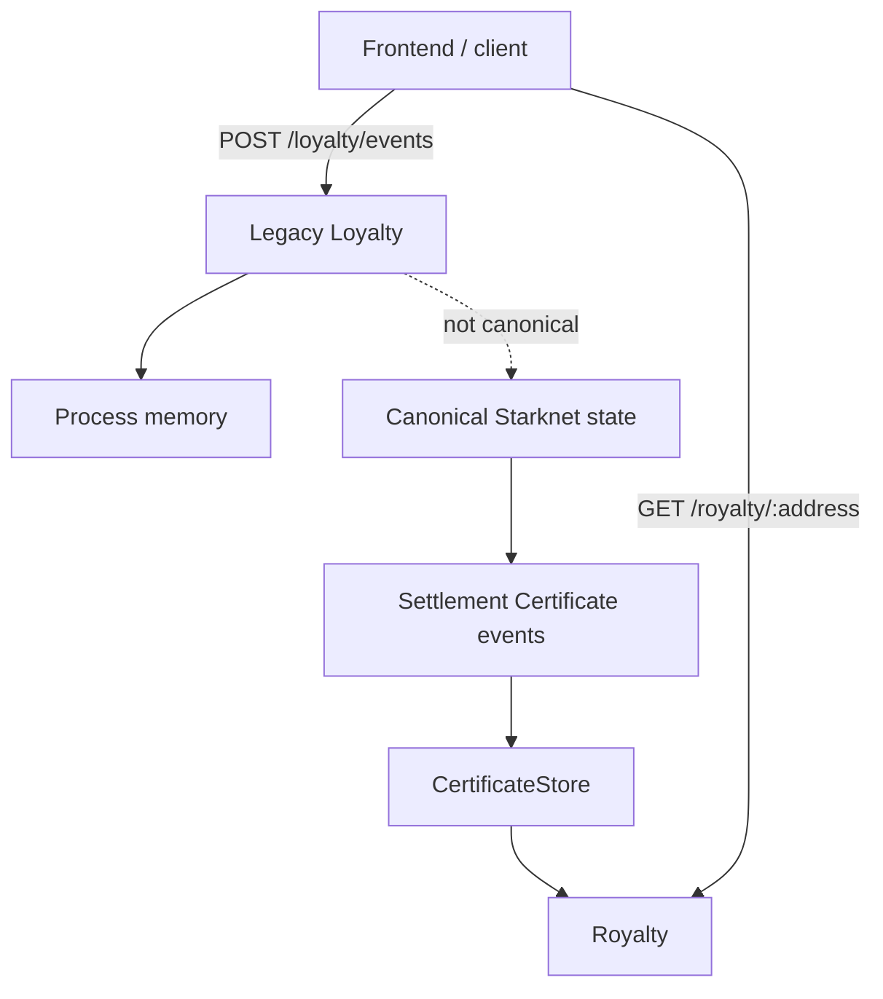
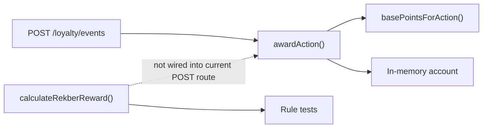
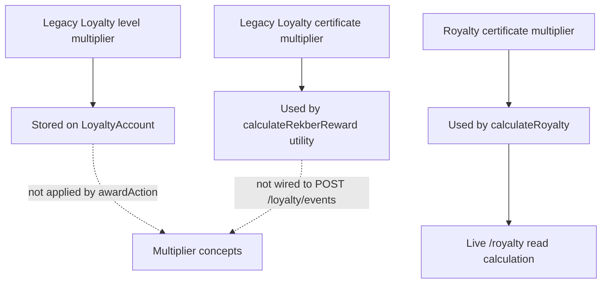
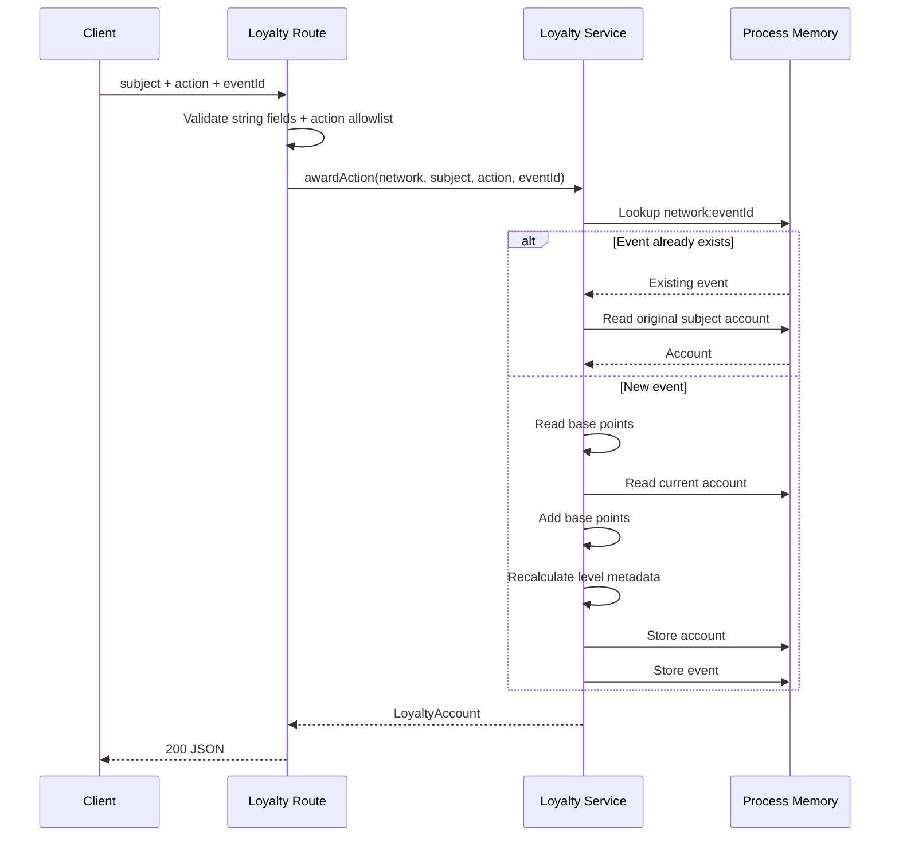
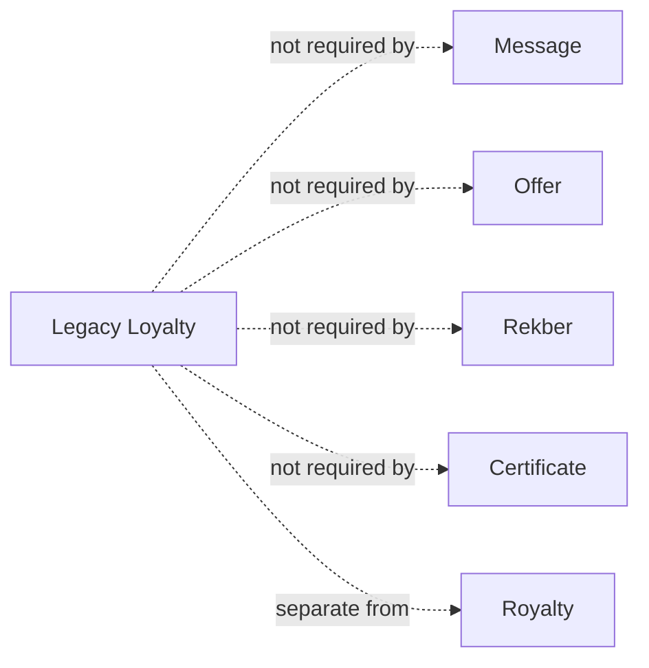
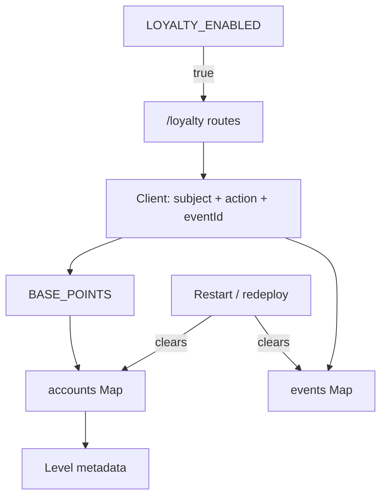
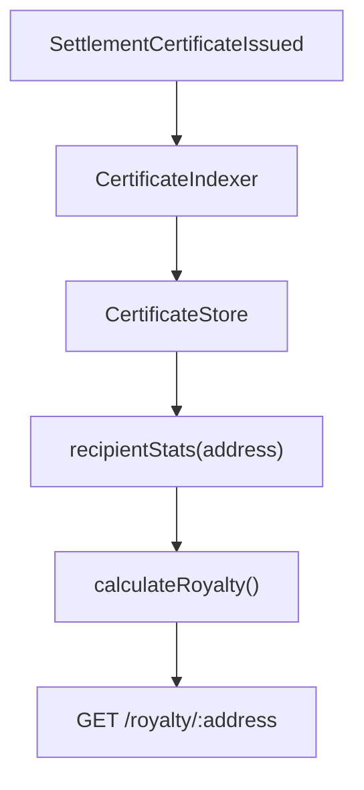

# VINSS Loyalty Service

This document describes the current **Legacy Loyalty** service implemented under:

```text
backend/src/loyalty/
```

It is intentionally separated from the newer:

```text
Royalty
```

read model implemented under:

```text
backend/src/royalty/
```

These two systems are **not the same service**, do not use the same evidence source, and do not use the same points formula.

---

# Classification

Legacy Loyalty is currently:

```text
auxiliary
experimental
feature-gated
in-memory
client-write
non-authoritative
```

It is **not** part of:

```text
STRK20 privacy protocol

ciphertext Discovery

Message Helper protocol

Offer settlement authority

Private Escrow Helper protocol

Escrow Rekber custody

Settlement Certificate ownership

canonical settlement evidence

Royalty certificate-derived points
```

---

# Why This Naming Matters

The repository currently contains both:

```text
backend/src/loyalty/
```

and:

```text
backend/src/royalty/
```

They solve different problems.

Use these names precisely:

```text
Legacy Loyalty
    -> in-memory preview/event-award service

Royalty
    -> read-only certificate-derived points service
```

Do not call them interchangeable.

---

# Source Map

Primary Legacy Loyalty source:

```text
backend/src/loyalty/routes.ts

backend/src/loyalty/service.ts

backend/src/loyalty/rules.ts

backend/src/loyalty/types.ts
```

Runtime mounting:

```text
backend/src/app.ts
```

Feature configuration:

```text
backend/src/config.ts
```

Tests:

```text
backend/tests/loyalty-rules.test.ts
```

Related but separate Royalty source:

```text
backend/src/royalty/routes.ts

backend/src/royalty/service.ts
```

---

# Current Service Position



---

# Feature Gate

Legacy Loyalty routes are only mounted when:

```text
LOYALTY_ENABLED=true
```

Current default:

```text
false
```

---

# Mainnet Behavior

Unlike Agent:

```text
LOYALTY_ENABLED
```

does not have a network-dependent default.

It defaults to:

```text
false
```

on both:

```text
sepolia
mainnet
```

unless explicitly enabled.

---

# Fail-Closed Intent

Current application source explicitly treats Loyalty writes as:

```text
unauthenticated
in-memory
non-valuable preview
```

and keeps the routes unmounted unless the operator deliberately enables them.

---

# Route Mounting

Conceptually:

```text
if features.loyalty:
    mount /loyalty/*
else:
    routes do not exist
```

---

# No Separate Loyalty Process

Legacy Loyalty runs inside the same backend Node.js process.

It is not:

```text
separate microservice

separate worker

separate database service
```

---

# Current Endpoints

When enabled:

```text
GET  /loyalty/config

GET  /loyalty/:subject

POST /loyalty/events
```

---

# Route Summary

| Endpoint | Purpose | Mutates state? |
|---|---|---:|
| `GET /loyalty/config` | Return current Loyalty rules | No |
| `GET /loyalty/:subject` | Return current in-memory account | No |
| `POST /loyalty/events` | Award one accepted Loyalty action | Yes |

---

# No Royalty Routes Here

Legacy Loyalty does not own:

```text
GET /royalty/:address
```

That is the separate Royalty service.

---

# No Token Conversion Route

Legacy Loyalty currently has no:

```text
POST /loyalty/convert

POST /loyalty/claim-token

POST /loyalty/redeem
```

---

# No Admin Award Route

There is no distinct authenticated:

```text
POST /loyalty/admin/award
```

Current write route is the client-facing:

```text
POST /loyalty/events
```

---

# Current Loyalty Action Union

Current accepted actions are exactly:

```text
message_sent

offer_created

offer_countered

offer_accepted

work_submitted

work_reviewed

referral_joined

referral_activated

referral_converted

rekber_released

rekber_refunded
```

---

# Older Action Names Are Stale

The following older names are **not** currently accepted:

```text
escrow_created

escrow_funded

deal_completed

invite_user

successful_referral
```

Do not document or send them as valid current actions.

---

# Current Base Points

```text
message_sent        -> 1

offer_created       -> 5

offer_countered     -> 5

offer_accepted      -> 10

work_submitted      -> 10

work_reviewed       -> 10

referral_joined     -> 25

referral_activated  -> 25

referral_converted  -> 100

rekber_released     -> 100

rekber_refunded     -> 0
```

---

# Base Points Table

| Action | Base points |
|---|---:|
| `message_sent` | 1 |
| `offer_created` | 5 |
| `offer_countered` | 5 |
| `offer_accepted` | 10 |
| `work_submitted` | 10 |
| `work_reviewed` | 10 |
| `referral_joined` | 25 |
| `referral_activated` | 25 |
| `referral_converted` | 100 |
| `rekber_released` | 100 |
| `rekber_refunded` | 0 |

---

# Refund Rule

Current base action:

```text
rekber_refunded
```

awards:

```text
0 points
```

---

# Released Rule

Current base action:

```text
rekber_released
```

awards:

```text
100 points
```

through the normal event-award route.

---

# No `rekber_resolved` Loyalty Action

Important:

```text
rekber_resolved
```

is not part of:

```text
LoyaltyAction
```

and is not accepted by:

```text
POST /loyalty/events
```

---

# Resolved Rekber Rule Utility

The Loyalty rules module does contain:

```text
calculateRekberReward(...)
```

which supports:

```text
released
resolved
refunded
```

---

# Critical Wiring Distinction

The existence of:

```text
calculateRekberReward()
```

does **not** mean:

```text
POST /loyalty/events
```

automatically awards resolved-split points.

Current route calls:

```text
awardAction(...)
```

with one of the eleven `LoyaltyAction` values.

---

# Rule Utility vs Route Behavior



---

# `calculateRekberReward`

This helper accepts:

```text
outcome:
    released
    resolved
    refunded

certificateCount

shareBps
    required for resolved
```

---

# Rekber Rule Base

The helper conceptually starts from:

```text
100 successful Rekber points
```

then applies:

```text
settlement share
certificate multiplier
```

---

# Release Reward Utility

For:

```text
outcome = released
```

share is treated as:

```text
10000 bps
```

or:

```text
100%
```

---

# Refund Reward Utility

For:

```text
outcome = refunded
```

reward is always:

```text
0
```

regardless of certificate count.

---

# Resolved Reward Utility

For:

```text
outcome = resolved
```

caller must provide:

```text
shareBps
```

---

# Resolved Formula

Conceptually:

```text
100
×
shareBps / 10000
×
certificateMultiplierBps / 10000
```

with deterministic integer floor.

---

# Integer Formula

Current implementation computes with BigInt:

```text
100 * shareBps * multiplierBps
--------------------------------
100,000,000
```

then floors through integer division.

---

# Resolution Share Utility

`resolutionShareBps(...)` accepts:

```text
payerAmount

payeeAmount
```

as bigint.

---

# Share Formula

```text
payerBps =
    floor(
        payerAmount * 10000
        /
        total
    )

payeeBps =
    10000 - payerBps
```

---

# Exact BPS Sum

Returned shares always sum to:

```text
10000
```

when valid.

---

# Invalid Zero Allocation

If:

```text
payerAmount + payeeAmount = 0
```

the helper throws.

---

# Negative Allocation

Negative payer/payee amounts are rejected.

---

# Pre-Fee Decision Semantics

Current rule comment specifies that Loyalty resolution points use the:

```text
resolver decision ratio BEFORE VINSS dispute fee
```

---

# Example

If decision ratio is:

```text
30 : 70
```

the points ratio remains:

```text
30 : 70
```

even if later cash accounting applies another fee rule.

---

# Current Rule Tests

The test suite verifies examples including:

```text
normal release

refund = 0

resolved 30:70 split

certificate multiplier tiers
```

---

# Certificate Multiplier Rules in Legacy Loyalty

Legacy Loyalty defines these certificate tiers:

```text
0 certificates
    -> 1.00x

1–2 certificates
    -> 1.10x

3–5 certificates
    -> 1.20x

6–10 certificates
    -> 1.35x

11–25 certificates
    -> 1.50x

26–50 certificates
    -> 1.75x

51+ certificates
    -> 2.00x
```

---

# Legacy Loyalty Certificate Tier Table

| Certificate count | Multiplier |
|---|---:|
| `0` | `1.00x` |
| `1–2` | `1.10x` |
| `3–5` | `1.20x` |
| `6–10` | `1.35x` |
| `11–25` | `1.50x` |
| `26–50` | `1.75x` |
| `51+` | `2.00x` |

---

# BPS Representation

Internally:

```text
1.00x -> 10000 bps

1.10x -> 11000 bps

1.20x -> 12000 bps

1.35x -> 13500 bps

1.50x -> 15000 bps

1.75x -> 17500 bps

2.00x -> 20000 bps
```

---

# Certificate Count Validation

`certificateMultiplierBps(...)` requires:

```text
safe integer
>= 0
```

---

# Important Wiring Limitation

Current:

```text
awardAction()
```

does **not** ask for:

```text
certificateCount
```

and does not call:

```text
calculateRekberReward()
```

---

# Therefore

A current request:

```json
{
  "subject": "alice",
  "action": "rekber_released",
  "eventId": "..."
}
```

awards:

```text
100
```

not:

```text
100 × certificate multiplier
```

through the current route.

---

# Rule Exposure vs Award Wiring

`GET /loyalty/config` exposes:

```text
certificateMultipliers
```

but current event awarding remains base-action based.

This is a real implementation distinction.

---

# Do Not Overclaim

Do not say:

```text
Legacy Loyalty automatically applies certificate multipliers to every event award.
```

Current code does not.

---

# Loyalty Levels

Current account levels:

```text
STARTER

BRONZE

SILVER

GOLD

PLATINUM

DIAMOND
```

---

# Level Thresholds

```text
STARTER
    >= 0

BRONZE
    >= 500

SILVER
    >= 2,500

GOLD
    >= 10,000

PLATINUM
    >= 50,000

DIAMOND
    >= 250,000
```

---

# Level Multipliers

Each level also exposes a multiplier:

```text
STARTER
    1.00x

BRONZE
    1.05x

SILVER
    1.10x

GOLD
    1.25x

PLATINUM
    1.50x

DIAMOND
    2.00x
```

---

# Level Table

| Level | Minimum points | Account multiplier |
|---|---:|---:|
| `STARTER` | 0 | `1.00x` |
| `BRONZE` | 500 | `1.05x` |
| `SILVER` | 2,500 | `1.10x` |
| `GOLD` | 10,000 | `1.25x` |
| `PLATINUM` | 50,000 | `1.50x` |
| `DIAMOND` | 250,000 | `2.00x` |

---

# Critical Level Multiplier Distinction

Current `awardAction()`:

```text
does not multiply earned base points
by current account.multiplier
```

---

# What It Actually Does

For an action:

```text
earned = basePointsForAction(action)

totalPoints = current.points + earned

level = getLevel(totalPoints)

account.multiplier = level.multiplier
```

---

# Therefore

The level multiplier is currently:

```text
account metadata
```

not:

```text
an automatic earn-rate multiplier
```

inside `awardAction()`.

---

# Example

Suppose an account already has:

```text
10,000 points
GOLD
multiplier = 1.25
```

and posts:

```text
message_sent
```

Current service adds:

```text
1 point
```

not:

```text
1.25 points
```

---

# Integer Point Model

Current points are integer numbers.

`awardAction()` does not create fractional points.

---

# Three Multiplier Concepts

Do not conflate:

```text
1. Loyalty level multiplier

2. Legacy Loyalty certificate multiplier

3. Royalty certificate multiplier
```

They are separate.

---

# Multiplier Comparison



---

# Account Shape

Current `LoyaltyAccount`:

```text
network
subject
points
level
multiplier
```

---

# Event Shape

Current `LoyaltyEvent`:

```text
network
eventId
subject
action
points
createdAt
```

---

# No Wallet Address Type Requirement

`subject` is:

```text
string
```

not:

```text
validated Starknet address
```

---

# Subject Validation

`awardAction()` only requires:

```text
subject.trim() is non-empty
```

---

# Route-Level Subject Validation

Route checks:

```text
typeof subject === "string"
```

Then service enforces non-empty trimmed value.

---

# Consequence

Subjects such as:

```text
alice

user-123

0xabc
```

can all be syntactically accepted.

---

# No Canonical Wallet Binding

The service does not prove that:

```text
subject
```

belongs to the HTTP caller.

---

# No Signature

`POST /loyalty/events` does not require:

```text
Starknet signature

wallet session

SIWE-like proof

Rekber participant proof
```

---

# Authorization Limitation

Any client able to reach the enabled route can submit:

```text
subject
action
eventId
```

subject to route validation.

---

# Why This Is Not Valuable-State Accounting

The backend does not verify that:

```text
message_sent actually happened

offer_created actually happened

referral actually happened

rekber_released actually happened
```

before calling `awardAction()`.

---

# No Chain Reconciliation

The current write route does not query:

```text
DiscoveryStore

RekberStore

CertificateStore

Starknet RPC
```

to prove the action.

---

# No Trusted Event Issuer

There is no concept such as:

```text
issuer role

server-generated event signature

webhook secret

contract event proof
```

for Legacy Loyalty awards.

---

# Storage Model

Current service uses process memory:

```text
const accounts =
    new Map<string, LoyaltyAccount>()

const events =
    new Map<string, LoyaltyEvent>()
```

---

# No PostgreSQL Loyalty Tables

Current Legacy Loyalty service does not persist:

```text
accounts
events
```

to PostgreSQL.

---

# Restart Behavior

Backend restart/redeploy resets:

```text
accounts

event history

points

levels

idempotency history
```

for Legacy Loyalty.

---

# Process Lifetime Boundary

Legacy Loyalty state lifetime is approximately:

```text
Node.js process lifetime
```

---

# Replica Boundary

Each backend replica would have its own:

```text
accounts Map

events Map
```

---

# Multi-Replica Failure Mode

Possible:

```text
request 1 -> replica A

request 2 -> replica B
```

Two replicas can return different Loyalty account state.

---

# No Shared Loyalty State

There is no:

```text
Redis

PostgreSQL

shared cache
```

behind Legacy Loyalty today.

---

# Account Key

Internal account key:

```text
<network>:<subject>
```

---

# Network Scoping

Therefore:

```text
sepolia:alice
```

and:

```text
mainnet:alice
```

are different in-memory accounts.

---

# Event Key

Internal event key:

```text
<network>:<eventId>
```

---

# Event Idempotency

If the same:

```text
network + eventId
```

already exists in the current process:

```text
awardAction()
```

does not award again.

---

# Duplicate Event Behavior

It returns the Loyalty account belonging to:

```text
the original stored event subject
```

---

# Important Cross-Subject Consequence

Suppose first request:

```text
network = sepolia
eventId = event-123
subject = alice
```

Then another request uses:

```text
eventId = event-123
subject = bob
```

Current service finds the existing event and returns:

```text
Alice's account
```

rather than awarding Bob.

---

# Event ID Scope

Idempotency scope is:

```text
network + eventId
```

not:

```text
network + subject + eventId
```

---

# Event Action Scope

The idempotency key also does not include:

```text
action
```

---

# Therefore

Reusing the same eventId with a different:

```text
subject
or
action
```

does not create a second award during the same process lifetime.

---

# Persistent Replay Protection

Current service has none.

After restart:

```text
events Map = empty
```

so the same eventId can be submitted again.

---

# Route Validation

`POST /loyalty/events` requires all three fields:

```text
subject

action

eventId
```

to be strings.

---

# Missing Fields

Returns:

```text
400
```

with:

```text
subject, action and eventId are required
```

---

# Invalid Action

Returns:

```text
400
```

with a message containing:

```text
invalid loyalty action
```

---

# Service Validation Error

Other service errors also become:

```text
400
```

---

# Unknown Top-Level Fields

The route destructures:

```text
subject
action
eventId
```

and does not implement a Discovery-style strict top-level allowlist.

Extra fields are therefore not used by current route logic.

---

# No Loyalty-Specific Rate Limiter

Current application composition does not wrap Legacy Loyalty with:

```text
createFixedWindowRateLimit(...)
```

---

# Consequence

If enabled publicly, abuse protection depends on:

```text
hosting infrastructure

general proxy protections

application deployment environment
```

rather than a Loyalty-specific in-process limiter.

---

# Feature Flag Is Primary Current Safety Control

The primary protection is:

```text
LOYALTY_ENABLED=false
```

by default.

---

# GET `/loyalty/config`

Returns:

```text
network

points

certificateMultipliers

levels
```

---

# Config Endpoint Does Not Expose Mutable State

It returns rule definitions.

It does not mutate accounts.

---

# `points`

Current `points` object is based on:

```text
BASE_POINTS
```

---

# `certificateMultipliers`

Current endpoint maps certificate tiers to decimal multipliers.

Example conceptual shape:

```json
{
  "minCertificates": 6,
  "maxCertificates": 10,
  "multiplierBps": 13500,
  "multiplier": 1.35
}
```

---

# `levels`

Returns the current level definitions including:

```text
level

minPoints

multiplier
```

---

# GET `/loyalty/:subject`

Returns:

```text
existing account
```

if present.

Otherwise returns a synthetic zero account:

```text
points = 0

level = STARTER

multiplier = 1
```

---

# Read Does Not Create Stored Account

`getLoyalty(...)` returns a fresh default object when no account exists.

It does not insert that default into:

```text
accounts Map
```

---

# POST `/loyalty/events`

Conceptual flow:



---

# No Contract Participant in Current Award Flow

There is no:

```text
Starknet RPC
Rekber contract
Message Helper
Offer Helper
Settlement Certificate
```

participant in the current `POST /loyalty/events` call path.

---

# No DiscoveryStore Participant

Current award route does not ask Discovery:

```text
did this Message/Offer event exist?
```

---

# No RekberStore Participant

Current award route does not ask:

```text
did this custody actually release/refund?
```

---

# No CertificateStore Participant

Current award route does not ask for certificate count before base award.

---

# Rule Test Coverage

Current Loyalty rule tests directly verify:

```text
base points

certificate multiplier tiers

normal release reward utility

refund zero reward

resolved split reward
```

---

# What Those Tests Prove

They prove:

```text
pure rule functions
```

for those cases.

---

# What They Do Not Prove

They do not prove:

```text
POST /loyalty/events is chain-authorized

certificate multiplier is wired to route

resolved settlement automatically awards points

state survives restart

multi-replica consistency
```

---

# Legacy Loyalty vs Royalty

This distinction is mandatory.

---

# Legacy Loyalty

Evidence source:

```text
client-submitted events
```

Storage:

```text
process memory
```

Write API:

```text
yes
```

Points:

```text
action-specific base points
```

Canonical:

```text
no
```

---

# Royalty

Evidence source:

```text
indexed SettlementCertificateIssued events
```

Storage dependency:

```text
CertificateStore / PostgreSQL
```

Write API:

```text
no
```

Points:

```text
successful settlements × 200 × certificate multiplier
```

Canonical:

```text
application-derived from public certificate evidence
```

---

# Comparison Table

| Property | Legacy Loyalty | Royalty |
|---|---|---|
| Path | `/loyalty/*` | `/royalty/:address` |
| Feature gated | Yes | No |
| Default state | Disabled | Mounted |
| Evidence | Client event | CertificateStore |
| Durable | No | Derived from persistent index |
| Client can award | Yes, when enabled | No |
| Subject | Arbitrary string | Valid Starknet address |
| Base settlement points | 100 in Loyalty rules | 200 |
| Certificate tiers | 1.0–2.0 with 7 bands | 1.0–2.0 with 5 bands |
| Token conversion | None | `coming_soon` |
| Production authority | No | Read-only app policy |

---

# Royalty Formula

Separate Royalty service uses:

```text
BASE_SETTLEMENT_POINTS = 200
```

---

# Royalty Certificate Tiers

Current Royalty tiers:

```text
0 certificates
    -> 1.00x

1–2 certificates
    -> 1.25x

3–4 certificates
    -> 1.50x

5–9 certificates
    -> 1.75x

10+ certificates
    -> 2.00x
```

---

# Royalty Formula

```text
basePoints =
    successfulSettlements × 200

points =
    round(basePoints × multiplier)
```

---

# Royalty Next Tier

Royalty also computes:

```text
nextCertificateTarget

nextMultiplier
```

---

# Royalty Conversion

Current API reports:

```text
conversion.status = coming_soon
```

---

# Important Formula Difference

Legacy Loyalty release rule:

```text
100 base Rekber points
```

Royalty settlement rule:

```text
200 base points
```

Do not reuse one formula as documentation for the other.

---

# Important Tier Difference

Legacy Loyalty first certificate:

```text
1.10x
```

Royalty first certificate:

```text
1.25x
```

---

# No Shared Multiplier Table

The two services currently have separate hardcoded tier definitions.

---

# Drift Risk

Because tier rules are duplicated/separate:

```text
Legacy Loyalty
```

and:

```text
Royalty
```

can evolve differently.

They already do.

---

# Naming Recommendation

In code/docs/UI discussions:

```text
Legacy Loyalty
```

should mean:

```text
backend/src/loyalty
```

and:

```text
Royalty
```

should mean:

```text
backend/src/royalty
```

---

# Avoid Ambiguous “Points System”

When someone says:

```text
VINSS points
```

ask/source-check whether they mean:

```text
Legacy action points

or

Certificate-derived Royalty points
```

before changing code.

---

# Why Royalty Is Stronger Evidence

Royalty derives from:

```text
indexed Settlement Certificate events
```

which originate from public contract events.

---

# Why Legacy Loyalty Is Weaker Evidence

Legacy Loyalty trusts a client request that says:

```text
this action happened
```

without chain verification.

---

# Royalty Still Is Application Policy

Even though evidence is stronger, Royalty point arithmetic remains:

```text
backend application logic
```

not a Cairo contract invariant.

---

# Legacy Loyalty Privacy

Legacy Loyalty payload is small:

```text
subject
action
eventId
```

---

# Do Not Put Private Deal Data in Subject

`subject` should not contain:

```text
room secret

channel key

Offer terms

Message text

private evidence
```

---

# Do Not Put Secrets in Event ID

`eventId` is stored in process memory and can appear during debugging.

Use opaque non-secret IDs.

---

# Loyalty Does Not Need Room Keys

Current service has no reason to receive:

```text
roomSecret

channelKey

decryptionKey
```

---

# Loyalty Is Outside Ciphertext Discovery

Do not add:

```text
channelKeyHex
```

to Loyalty requests to “verify” Messages.

If event verification becomes necessary, use public evidence/index records rather than server decryption.

---

# Rekber Verification Future Direction

If Legacy Loyalty were redesigned to award verified:

```text
rekber_released
```

points, a stronger source could be:

```text
RekberStore
```

or:

```text
Settlement Certificate
```

rather than client claim.

---

# Message Verification Future Direction

Message-based rewards could potentially reference:

```text
public indexed Message action locator
```

without decrypting Message plaintext.

---

# Offer Verification Future Direction

Offer action rewards could reference:

```text
OfferActionCommitted
```

records.

But business semantics such as:

```text
accepted
```

may remain encrypted and therefore require careful privacy-preserving proof design.

---

# Referral Verification Future Direction

Referral rewards require a separate trusted referral evidence model.

Current Legacy Loyalty does not provide it.

---

# Current Mainnet Recommendation

Keep:

```text
LOYALTY_ENABLED=false
```

unless intentionally exposing preview behavior.

---

# Why

Current Legacy Loyalty has:

```text
no durable storage

no wallet authentication

no trusted issuer

no chain reconciliation

no persistent replay protection

no distributed consistency

no dedicated rate limit
```

---

# Do Not Treat Feature Flag as Authorization

If:

```text
LOYALTY_ENABLED=true
```

that means:

```text
route exposed
```

not:

```text
secure production rewards enabled
```

---

# Deployment Behavior

Changing `LOYALTY_ENABLED` requires process configuration/restart/redeploy according to hosting platform behavior.

---

# Restart Risk

If someone observes:

```text
points disappeared after deploy
```

that is expected under current implementation.

It is not a PostgreSQL data-loss incident because Legacy Loyalty never stored those points there.

---

# Incident Classification

Legacy Loyalty data loss after restart is:

```text
expected architecture behavior
```

unless product incorrectly promised persistence.

---

# Do Not Restore From User Claims

If maps are lost:

```text
do not ask users to submit arbitrary historical point totals
```

as authoritative restoration.

---

# No Backup

There is no Legacy Loyalty backup in current backend.

---

# No Export

There is no endpoint to export complete:

```text
accounts

events
```

state.

---

# No Audit History

Only the current in-memory event map records events for the active process.

---

# No Event Listing Endpoint

Current routes do not expose:

```text
GET /loyalty/events
```

---

# No Account List Endpoint

Current routes do not expose:

```text
GET /loyalty/accounts
```

---

# No Delete Endpoint

There is no:

```text
DELETE /loyalty/:subject
```

---

# No Manual Reset Endpoint

There is no:

```text
POST /loyalty/reset
```

---

# No Admin Mutation API

This reduces one attack surface but also means the service has no formal operator correction workflow.

---

# No Token Balance

`LoyaltyAccount.points` is:

```text
application points
```

not:

```text
ERC20 balance

STRK balance

VINSS token balance

DXJ token balance
```

---

# No On-Chain Loyalty Contract

Current backend Legacy Loyalty does not correspond to a dedicated canonical:

```text
VinssLoyalty
```

contract in the documented core system.

---

# No Mint Authority

Legacy Loyalty does not mint:

```text
Settlement Certificate

token

NFT
```

---

# No Financial Authority

It cannot:

```text
move Rekber principal

release custody

refund custody

authorize dispute split
```

---

# Normal Failure Separation

If Legacy Loyalty is unavailable:

```text
private Message can still work

Offer can still work

Discovery can still work

Rekber can still settle

Certificate can still be claimed

Royalty can still be derived
```

---

# Dependency Diagram



---

# Current Account Calculation

When a new event is accepted:

```text
current =
    getLoyalty(network, subject)

earned =
    pointsForAction(action)

total =
    current.points + earned

level =
    getLevel(total)

store:
    points = total
    level = level.level
    multiplier = level.multiplier
```

---

# No Overflow-Specific Guard

Points use JavaScript:

```text
number
```

---

# Practical Precision

Current point increments are small.

But the service does not use:

```text
BigInt
```

for total account points.

---

# Future Valuable Accounting

If points become economically valuable at large scale, use an explicit integer accounting range/storage model.

---

# Level Recalculation

Level is recalculated after every accepted new event.

---

# Level Never Explicitly Decreases in Normal Flow

Because current service only adds non-negative base points:

```text
points
```

do not decrease.

---

# Refund Adds Zero

`rekber_refunded` does not reduce existing points.

It adds:

```text
0
```

---

# No Penalty Actions

Current action set has no negative-point action.

---

# No Point Revocation

There is no service function/route to subtract points.

---

# No Fraud Reversal

If an invalid event was awarded, there is no formal correction API.

---

# Consequence

This is another reason current service should remain non-valuable preview state.

---

# Referral Actions

Current referral actions are:

```text
referral_joined

referral_activated

referral_converted
```

---

# Referral Points

```text
joined
    25

activated
    25

converted
    100
```

---

# No Referral Graph

Legacy Loyalty does not itself store:

```text
referrer

referred wallet

relationship graph

conversion proof
```

inside `LoyaltyEvent`.

---

# Therefore

The action label:

```text
referral_converted
```

does not mean the Loyalty service verified a real referral relationship.

---

# Work Actions

Current actions:

```text
work_submitted

work_reviewed
```

both award:

```text
10
```

---

# Domain Ambiguity

Legacy Loyalty service does not verify the Deal Room was a freelance/work deal before accepting these action names.

---

# Offer Actions

Current:

```text
offer_created

offer_countered

offer_accepted
```

---

# Offer Points

```text
created
    5

countered
    5

accepted
    10
```

---

# Message Action

```text
message_sent
```

awards:

```text
1
```

---

# No Message Spam Defense in Loyalty

If exposed, a client can repeatedly use new eventIds with:

```text
message_sent
```

to increase in-memory points.

---

# No Per-Subject Limit

There is no:

```text
daily point cap

daily message reward cap

per-subject event limit
```

in Legacy Loyalty service.

---

# No Time Window

There is no reward throttling by:

```text
minute

day

week
```

inside Loyalty rules.

---

# No Event Timestamp Input

Client does not submit:

```text
createdAt
```

---

# Server Timestamp

For a new event, backend sets:

```text
new Date().toISOString()
```

as event `createdAt`.

---

# Timestamp Meaning

This records:

```text
award processing time
```

not necessarily:

```text
actual chain action time
```

---

# Network Source

Network comes from backend:

```text
config.network
```

not client input.

---

# Benefit

Client cannot choose:

```text
mainnet
vs
sepolia
```

inside the Loyalty event request.

---

# Subject Is Still Client Input

Network is server-controlled, but:

```text
subject
```

remains client-controlled.

---

# Event ID Is Client Input

Likewise:

```text
eventId
```

is client-controlled.

---

# Action Is Client Input

`action` is client-controlled but allowlisted.

---

# No Payload Proof

No additional proof data is required.

---

# API Error Model

Current route uses:

```text
400
```

for validation and service errors.

Successful award/read:

```text
200
```

---

# No 201 for Event Creation

Even a newly accepted event returns:

```text
200
```

not:

```text
201
```

---

# Idempotent Duplicate Also 200

A repeated existing eventId also returns:

```text
200
```

with existing account.

---

# Client Cannot Tell New vs Duplicate

Response contains only:

```text
LoyaltyAccount
```

not:

```text
created
duplicate
eventId
```

---

# Consequence

The caller cannot determine from the response alone whether:

```text
points were newly awarded
```

or:

```text
event was previously seen
```

---

# Future Hardening

A durable service could return:

```text
awardCreated
event
account
```

with stable semantics.

---

# No Event Commitment

Legacy Loyalty events have no cryptographic:

```text
event commitment

signature

hash linkage
```

---

# No Canonical Event Locator

The arbitrary `eventId` is not necessarily:

```text
transaction hash

action locator

custody commitment
```

---

# Recommended Future Event Identity

If redesigning around chain evidence, prefer domain-specific stable IDs such as:

```text
Message action locator

Offer action locator

custody commitment + lifecycle event

certificate token ID
```

where privacy analysis allows.

---

# Production Redesign Requirements

If Legacy Loyalty becomes valuable, minimum requirements include:

```text
durable storage

persistent idempotency

authenticated subjects

authorized event issuers

canonical evidence reconciliation

anti-abuse policy

rate limits

auditability

backup/recovery

correction/reversal model

versioned rules

migration strategy
```

---

# Durable Storage

Recommended direction:

```text
PostgreSQL
```

or another durable transactional store.

---

# Persistent Event Key

Store a unique key such as:

```text
network
evidence type
canonical event identity
subject
```

depending on reward semantics.

---

# Authentication

Possible:

```text
wallet signature

authenticated session

server-internal verified event issuance
```

---

# Authorization

Distinguish:

```text
who can read points

who can submit award evidence

who can change rules

who can correct an account
```

---

# Evidence Verification

For chain-verifiable rewards:

```text
server derives award from indexed event
```

rather than:

```text
client claims action happened
```

---

# Anti-Abuse

Potential controls:

```text
one reward per canonical action

daily reward caps

Sybil analysis

referral graph validation

settlement minimums

wash-activity protection
```

depending on product economics.

---

# Rule Versioning

If points can convert to value, store:

```text
ruleVersion
```

with each award.

---

# Why Rule Versioning Matters

Changing:

```text
message_sent = 1
```

to another value later should not make historical accounting ambiguous.

---

# Current Rule Version

There is no explicit persistent:

```text
loyaltyRuleVersion
```

because state is ephemeral.

---

# Future Settlement Reward Design

If the product wants:

```text
successful Rekber rewards
```

the existing:

```text
calculateRekberReward()
```

provides tested pure arithmetic.

But wiring it to valuable points still requires trusted evidence and storage.

---

# Existing Resolved Reward Logic

The pure rule already handles:

```text
payer share

payee share

certificate count
```

for resolved Rekber.

---

# What Is Missing

Current Legacy Loyalty route does not have:

```text
custody commitment

participant role

resolved amounts

certificate count

trusted Rekber event
```

inputs/verification required to use that rule safely.

---

# Do Not Add `shareBps` as Blind Client Input

That would allow a client to choose its own reward share.

If resolved rewards are wired later, derive share from verified public Rekber resolution state.

---

# Do Not Add `certificateCount` as Blind Client Input

If certificate multiplier matters, derive count from:

```text
CertificateStore
```

or other verified source.

---

# Royalty Already Does This Better

Royalty derives certificate count from:

```text
CertificateStore.recipientStats(...)
```

instead of accepting count from the client.

---

# Possible Consolidation

Future architecture could potentially retire Legacy Loyalty settlement rewards and use Royalty as the primary durable settlement-points path.

This is a product decision, not current implementation.

---

# Keep Non-Settlement Actions Separate

Message/Offer/referral/work participation points have different evidence/privacy challenges than:

```text
successful settlement points
```

A future system may use separate award pipelines.

---

# Privacy Constraint for Message Rewards

Do not require backend Message plaintext.

Public evidence can prove:

```text
a helper action exists
```

but not necessarily the private semantic meaning.

---

# Privacy Constraint for Offer Rewards

Offer lifecycle semantics are encrypted.

A backend cannot automatically prove:

```text
accepted
```

from ciphertext without another privacy-preserving evidence mechanism.

---

# Potential Client Proof Design

Any future proof that reveals:

```text
Offer accepted
```

must balance:

```text
reward integrity

Deal Room privacy
```

---

# No Server Decryption Shortcut

Do not solve Loyalty evidence by storing room keys server-side.

---

# Royalty Privacy Model

Royalty operates only on public:

```text
Settlement Certificate
```

events.

It does not need private Deal Room plaintext.

---

# Why Certificate Evidence Is Useful

Certificate issuance already represents:

```text
successful eligible settlement
```

under contract rules.

This makes it a natural public reward evidence source.

---

# Loyalty and Settlement Certificate Tier Utilities

Legacy Loyalty has certificate multiplier utilities.

But current account service has no certificate data dependency.

---

# This Is a Partial Foundation

Accurate description:

```text
rules exist
```

not:

```text
full certificate-aware Loyalty accounting is live
```

---

# Testing Guidance

When modifying Legacy Loyalty, test at least:

```text
all base actions

invalid action

empty subject

empty eventId

duplicate eventId same subject

duplicate eventId different subject

network scoping

level thresholds

restart persistence assumption

certificate multiplier boundaries

resolved share arithmetic
```

---

# Existing Pure Rule Tests

Current tests already cover several formula boundaries.

Do not assume they cover route authorization/storage behavior.

---

# Route Tests Needed for Stronger Confidence

Useful future route/service tests:

```text
POST event returns correct base points

duplicate event returns original subject account

invalid action rejected

extra field behavior

feature flag mounting

state resets between service process instances
```

---

# Mainnet Test Rule

Do not test valuable production behavior by turning:

```text
LOYALTY_ENABLED=true
```

on mainnet merely to see whether routes work.

Use Sepolia/local test environment.

---

# Deployment Checklist

For production:

```text
[ ] LOYALTY_ENABLED value reviewed

[ ] if false, /loyalty routes absent

[ ] if true, product labels service experimental

[ ] no valuable token conversion depends on it

[ ] no frontend assumes durability

[ ] no user promise implies persistent balance

[ ] monitoring understands restart reset
```

---

# Incident Checklist

If Legacy Loyalty behaves unexpectedly:

```text
[ ] check whether feature is enabled

[ ] check backend restart/redeploy history

[ ] check replica count

[ ] check duplicate eventId

[ ] check network

[ ] do not reconstruct from unverified user claims

[ ] disable feature if valuable-state confusion exists
```

---

# Migration Checklist

Before upgrading to durable valuable state:

```text
[ ] define canonical subject identity

[ ] define event evidence

[ ] define rule version

[ ] define persistent unique key

[ ] define replay policy

[ ] define correction/reversal policy

[ ] define referral anti-abuse

[ ] define settlement evidence source

[ ] define certificate multiplier source

[ ] define storage schema

[ ] define backup/restore

[ ] define rate limits/authentication

[ ] define migration from preview state, if any
```

---

# Do Not Migrate Preview Balances Blindly

Because current state is unauthenticated/client-write:

```text
existing in-memory balances
```

should not automatically become valuable token balances.

---

# Safer Migration Principle

If value is introduced:

```text
start from verified durable evidence
```

rather than trusting historical preview points.

---

# No Historical Persistence Means No Complete Snapshot

Since state disappears on restart, there may be no authoritative historical preview balance to migrate anyway.

---

# Frontend Copy Guidance

Safe:

```text
Preview points

Experimental Loyalty

Points are not token balances
```

Unsafe while current architecture remains:

```text
Guaranteed rewards

Permanent balance

On-chain loyalty

Redeemable token balance

Verified activity rewards
```

---

# API Documentation Guidance

Document the route only when:

```text
LOYALTY_ENABLED=true
```

is understood.

Swagger may list Loyalty routes even if runtime feature gate leaves them unmounted.

---

# OpenAPI vs Runtime

OpenAPI currently documents:

```text
/loyalty/config

/loyalty/{subject}

/loyalty/events
```

regardless of whether feature flag mounts the router.

---

# Consequence

Swagger route presence does not prove:

```text
LOYALTY_ENABLED=true
```

---

# Correct Runtime Check

Request:

```text
GET /loyalty/config
```

when feature intentionally enabled.

---

# Feature Disabled Response

If router is not mounted, normal Express behavior results in no matching Loyalty route.

---

# Security Classification

Legacy Loyalty currently has:

```text
low direct financial authority
```

because it cannot move chain funds.

---

# Product Risk Classification

It has:

```text
high confusion risk
```

if presented as valuable/durable because users may assume points are permanent or verified.

---

# Why Default False Is Correct

The feature gate prevents experimental behavior from becoming accidentally product-authoritative.

---

# Rule Integrity

Pure rule functions are deterministic.

---

# Storage Integrity

In-memory Maps are not durable.

---

# Evidence Integrity

Client input is not canonical evidence.

---

# Identity Integrity

Arbitrary `subject` strings are not authenticated identities.

---

# Summary of Current Guarantees

Current service can guarantee during one process lifetime:

```text
known allowlisted actions map to fixed base points

duplicate network:eventId is not awarded twice

account level follows current point total

network scopes account/event keys

rule helpers produce deterministic certificate/split calculations
```

---

# Summary of What It Cannot Guarantee

It cannot guarantee:

```text
event actually happened

subject owns a wallet

event belongs to subject

state survives restart

state is consistent across replicas

historical replay is prevented after restart

certificate multiplier is applied to route awards

resolved Rekber rewards are automatically awarded

points represent token value
```

---

# Current Architecture Summary



---

# Royalty Architecture Summary



---

# Source-of-Truth Order

For Legacy Loyalty:

```text
1. backend/src/loyalty/routes.ts

2. backend/src/loyalty/service.ts

3. backend/src/loyalty/rules.ts

4. backend/src/loyalty/types.ts

5. backend/src/app.ts

6. backend/src/config.ts

7. tests

8. prose docs
```

For Royalty:

```text
1. backend/src/royalty/service.ts

2. backend/src/royalty/routes.ts

3. CertificateStore

4. prose docs
```

---

# Accurate Statements

Accurate:

> Legacy Loyalty is an optional in-memory preview service that accepts client-submitted action events.

Accurate:

> Its current event idempotency lasts only for the active backend process.

Accurate:

> The current event route awards fixed base points and recalculates account level metadata.

Accurate:

> Legacy Loyalty defines certificate-aware Rekber reward utilities, but those utilities are not currently wired into `POST /loyalty/events`.

Accurate:

> Royalty is a different read-only service derived from indexed Settlement Certificate events.

---

# Inaccurate Statements

Avoid:

```text
Loyalty is durable.

Loyalty is on-chain.

Loyalty verifies every action.

Loyalty points are token balances.

Certificate multipliers automatically apply to POST /loyalty/events.

Gold 1.25x automatically multiplies every earned point.

rekber_resolved is a current LoyaltyAction.

Royalty and Loyalty use the same multiplier table.

Royalty is enabled by LOYALTY_ENABLED.

Restart preserves Loyalty points.

eventId replay protection is persistent.

subject is a verified wallet address.
```

---

# Production Rule

Until the architecture changes:

> Legacy Loyalty must not be treated as a production-authoritative reward ledger.

---

# Product Rule

If points are shown to users while this service is enabled:

> Make clear that they are preview/application points, not permanent token balances.

---

# Privacy Rule

> Never make Loyalty verification depend on sending Deal Room keys or plaintext to the backend.

---

# Evidence Rule

> If rewards later carry value, derive awards from authenticated or canonical evidence instead of trusting arbitrary client action claims.

---

# Royalty Rule

> Do not confuse Legacy Loyalty with Royalty; Royalty is certificate-derived, read-only, persistent through the Certificate index, and uses a different points formula.

---

# Mainnet Rule

For a conservative mainnet launch:

```text
LOYALTY_ENABLED=false
```

unless the experimental preview is deliberately required.

---

# Bottom Line

The most important correction from the older Loyalty documentation is the action list:

```text
message_sent
offer_created
offer_countered
offer_accepted
work_submitted
work_reviewed
referral_joined
referral_activated
referral_converted
rekber_released
rekber_refunded
```

The most important implementation nuance is:

> `awardAction()` currently adds only base action points; it does not apply the account level multiplier or the certificate multiplier.

The most important rule-utility nuance is:

> `calculateRekberReward()` supports certificate-aware released/resolved/refunded reward arithmetic and is tested, but it is not currently connected to `POST /loyalty/events`.

The most important durability rule is:

> Both Loyalty accounts and event idempotency exist only in process memory and disappear on restart/redeploy.

The most important authorization rule is:

> `subject`, `action`, and `eventId` are client-submitted; the current service does not prove wallet ownership or verify the claimed action against chain state.

And the most important architecture distinction is:

> Legacy Loyalty is an experimental preview service, while Royalty is the newer certificate-derived read-only settlement-points path.
