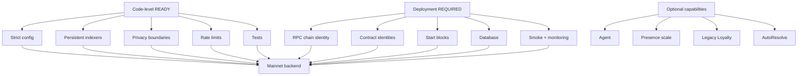
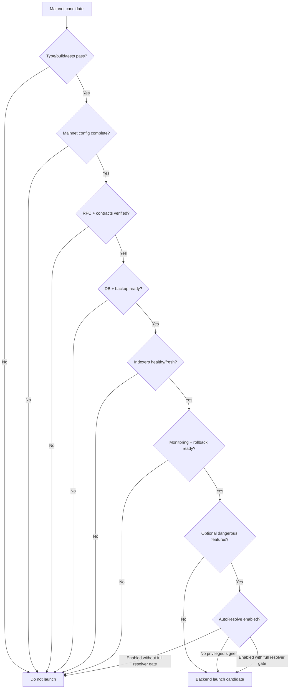
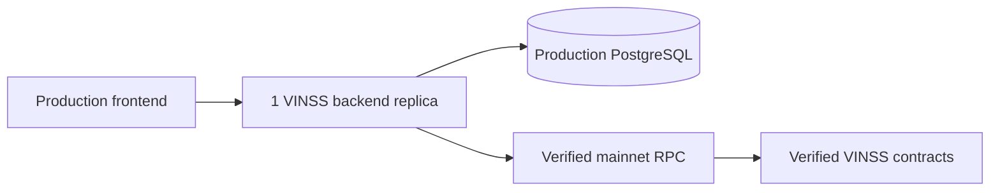
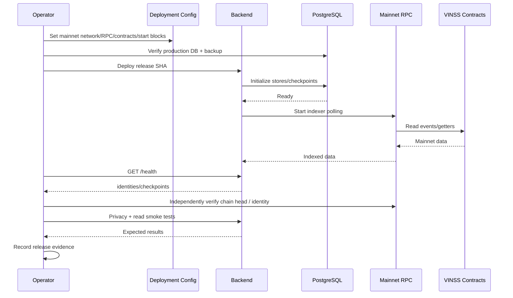

# VINSS Backend Mainnet Readiness

This document defines the current mainnet-readiness gate for the VINSS backend.

It is deliberately stricter than:

```text
the code builds

the documentation is complete

Sepolia worked once
```

Mainnet readiness requires two different kinds of evidence:

```text
1. Code-level readiness

2. Deployment-specific mainnet evidence
```

A feature can be implemented and tested correctly while the deployed environment is still unsafe.

---

# Core Rule

> Documentation completeness is not mainnet readiness.

Likewise:

> A successful local test suite is not mainnet verification.

And:

> A syntactically valid mainnet configuration is not proof that the configured RPC and contracts are the intended canonical deployment.

---

# Status Vocabulary

Use these labels consistently.

---

# READY

```text
Implemented and protected in current source
and/or covered by current tests.
```

This means:

```text
the code-level foundation exists
```

not:

```text
the production deployment has been verified.
```

---

# REQUIRED

```text
Deployment-specific verification or operational evidence
must still be completed.
```

Examples:

```text
actual mainnet RPC chain identity

deployed contract identities

exact start blocks

production database continuity

deployed smoke checks

monitoring
```

---

# CONDITIONAL

```text
Required only if the optional feature or deployment mode is enabled.
```

Examples:

```text
Agent provider credentials

Presence multi-replica storage

Dispute resolver signer

Legacy Loyalty hardening
```

---

# BLOCKER

```text
Should be fixed, disabled, or explicitly mitigated
before the affected mainnet capability is exposed.
```

---

# ACCEPTED RISK

```text
Known current limitation that can be accepted for an initial
narrow deployment only with explicit operational understanding.
```

---

# DEFERRED

```text
Useful hardening that is not required for the current narrow launch scope.
```

---

# Status Does Not Mean Permanence

A READY item can become invalid after:

```text
source change

environment change

contract redeploy

provider change

database migration

feature-flag change
```

---

# Current High-Level Assessment

The current backend has moved beyond several early blockers.

Already implemented:

```text
explicit required network configuration

explicit required RPC

explicit required PostgreSQL database

six required Starknet contract addresses

five explicit index start blocks

persistent Discovery indexing

persistent Rekber indexing

persistent Settlement Certificate indexing

ciphertext-only /discover

Discovery rate limiting

Agent/Dispute rate limiting

Feedback rate limiting

mainnet HTTPS CORS guard

mainnet Agent default-off

Legacy Loyalty default-off

Dispute AutoResolve default-off

graceful shutdown

persistent checkpoint health
```

Remaining readiness work is concentrated in:

```text
mainnet deployment identity verification

mainnet database deployment

checkpoint catch-up/freshness evidence

monitoring and alerting

backup/restore confidence

rollback confidence

single-replica vs multi-replica decision

RPC redundancy / outage response

reorg/read-model recovery procedure

optional Agent governance

optional resolver-key security
```

---

# Current Readiness Architecture



---

# Recommended Initial Mainnet Scope

For the first conservative backend deployment:

```text
core persistent indexers

ciphertext Discovery

Rekber event read model

Settlement Certificate read model

Activity

Royalty read model

Feedback if desired

encrypted Presence if single-replica assumption is accepted

encrypted Attachments if PostgreSQL blob storage is accepted
```

---

# Recommended Initial Feature Flags

Conservative posture:

```text
AGENT_ENABLED=false

LOYALTY_ENABLED=false

DISPUTE_AUTO_RESOLVE_ENABLED=false
```

---

# Why

This minimizes:

```text
external LLM disclosure

experimental client-write reward state

server-side financial signing authority
```

while preserving the core private Deal Room backend.

---

# Mainnet Readiness Is Layered

```text
Layer 1
    source correctness

Layer 2
    local tests/build

Layer 3
    deployment configuration

Layer 4
    deployed dependency verification

Layer 5
    checkpoint/index evidence

Layer 6
    client + wallet E2E

Layer 7
    operations / recovery
```

---

# Layer 1 — Privacy Architecture

## Ciphertext-only Discovery

Status:

```text
READY
```

Current `/discover` request allowlist:

```text
kind

fromBlock

toBlock
```

---

# Forbidden Discovery Inputs

Current route explicitly rejects:

```text
roomId

roomSecret

channelKey

channelKeyHex

viewingKey

viewingKeyHex

decryptionKey

plaintext
```

---

# Unknown Fields

All unexpected top-level fields are also rejected.

---

# Mainnet Meaning

The backend does not need a room/decryption secret in order to operate Discovery.

---

# Deployment Check

Required:

```text
confirm deployed backend returns 400
for a synthetic forbidden-key request
```

---

# Discovery Security Status Table

| Item | Status |
|---|---|
| Strict request allowlist | READY |
| Explicit key/plaintext rejection | READY |
| Backend decryption path absent | READY |
| Persistent ciphertext index | READY |
| Local client decryption model | READY / cross-layer regression |
| Mainnet negative privacy smoke | REQUIRED |

---

# Normal Request Logging

Status:

```text
READY
```

Current global application logger records:

```text
METHOD PATH
```

and intentionally excludes request bodies.

---

# Deployment Logging Verification

Status:

```text
REQUIRED
```

Application source cannot prove that:

```text
hosting proxy

APM

platform request logs
```

do not capture body/header data.

---

# Mainnet Logging Gate

Verify externally:

```text
request bodies disabled/not captured

Authorization headers not copied

attachment capability token not logged

resolver private key never logged

provider keys never logged
```

---

# Normal Agent Sanitizer

Status:

```text
READY
```

The backend reconstructs automatic context from an allowlist.

---

# Automatic Agent Context Does Not Preserve

Examples:

```text
room label

Offer amount

Offer asset

payment terms

private conditions

arbitrary private timeline summary

room secret

channel key
```

---

# Tool Scope

Status:

```text
READY
```

Tool definitions are filtered by skill.

Runtime also rejects a tool outside:

```text
skill.allowedTools
```

---

# Generic Signer

Normal Agent has no:

```text
send_transaction

sign_transaction

release_escrow

deposit_funds
```

generic execution authority.

---

# Proposal Approval

Agent draft/proposal tools preserve:

```text
requiresApproval = true
```

---

# Agent Mainnet Default

Current config defaults:

```text
AGENT_ENABLED=false
```

when:

```text
STARKNET_NETWORK=mainnet
```

---

# Agent Status

If left disabled:

```text
READY / non-blocking
```

If enabled:

```text
CONDITIONAL
```

---

# Agent Conditional Mainnet Gate

Before enabling:

```text
provider credentials configured

provider governance approved

fallback list intentional

rate-limit values reviewed

external provider retention understood

provider outage does not affect core Deal Room

live provider smoke passes
```

---

# Agent Cost Controls

Current application has request-rate limiting.

It does **not** have:

```text
daily dollar cap

per-wallet provider budget

hard token-spend cap
```

---

# Classification

If Agent remains optional and rate-limited:

```text
ACCEPTED RISK
```

If Agent becomes a high-volume public product surface:

```text
REQUIRED hardening
```

---

# Public Agent Rate Limit

Status:

```text
READY
```

Current default:

```text
12 requests
per 60 seconds
per process/IP scope
```

unless configured otherwise.

---

# Important Limitation

Rate limiting is:

```text
process-local
```

---

# Multi-Replica Consequence

Two backend replicas effectively maintain:

```text
two independent bucket maps
```

---

# Classification

Single replica:

```text
ACCEPTED RISK
```

Horizontal scale:

```text
CONDITIONAL BLOCKER
```

until shared/gateway rate limiting is intentional.

---

# Layer 2 — Network Configuration

## Explicit Network

Status:

```text
READY
```

`STARKNET_NETWORK` is required.

Allowed:

```text
sepolia

mainnet
```

---

# No Silent Sepolia Network Fallback

The old statement:

```text
configuration defaults to Sepolia
```

is no longer true.

---

# Explicit RPC

Status:

```text
READY
```

`RPC_URL` is required.

---

# No Built-In Sepolia RPC Fallback

Current backend does not silently fall back to a hardcoded public Sepolia RPC.

---

# Mainnet RPC String Guard

Status:

```text
READY but incomplete
```

For mainnet, config rejects RPC identity containing:

```text
sepolia

goerli

testnet
```

---

# Semantic RPC Verification

Status:

```text
REQUIRED
```

Current config does not call:

```text
starknet_chainId
```

during startup parsing.

---

# Mainnet Gate

Operator must verify:

```text
RPC responds

RPC reports Starknet mainnet chain ID

RPC endpoint remains same intended provider/environment
```

---

# RPC Availability

Current config supports:

```text
one RPC_URL
```

---

# Built-In RPC Failover

Status:

```text
NOT IMPLEMENTED
```

---

# Initial Mainnet Classification

```text
ACCEPTED RISK
```

only if:

```text
manual failover procedure exists

provider reliability acceptable

checkpoint monitoring catches outages
```

---

# Serious Availability Hardening

```text
REQUIRED later
```

for stronger SLA.

---

# Layer 3 — Contract Configuration

Current backend requires six addresses.

---

# Required Mainnet Contracts

```text
PRIVACY_POOL_ADDRESS

MESSAGE_HELPER_ADDRESS

OFFER_HELPER_ADDRESS

PRIVATE_ESCROW_HELPER_ADDRESS

ESCROW_REKBER_ADDRESS

SETTLEMENT_CERTIFICATE_ADDRESS
```

---

# Address Syntax Validation

Status:

```text
READY
```

Current parser requires:

```text
0x-prefixed hex

nonzero

< 2^251
```

---

# Semantic Contract Verification

Status:

```text
REQUIRED
```

Syntax validation does not prove:

```text
correct class hash

correct ABI

correct deployment

correct network

correct owner/admin/resolver configuration
```

---

# Mainnet Contract Gate

For every address record:

```text
contract name

mainnet address

deployment transaction

class hash

deployment block

expected ABI/interface

operational owner/resolver where applicable
```

---

# Contract Readiness Matrix

| Contract | Config required | Deployment verification |
|---|---:|---:|
| Privacy Pool | READY | REQUIRED |
| Message Helper | READY | REQUIRED |
| Offer Helper | READY | REQUIRED |
| Private Escrow Helper | READY | REQUIRED |
| Escrow Rekber | READY | REQUIRED |
| Settlement Certificate | READY | REQUIRED |

---

# Canonical Naming

Mainnet docs/config should use:

```text
VinssEscrowRekber
```

not:

```text
Rekber V2
```

for the canonical contract.

---

# Envelope Version Precision

Message/Offer/Private Escrow encrypted envelope V2 does not mean there is a canonical:

```text
EscrowRekberV2
```

backend contract address.

---

# Layer 4 — Index Start Blocks

Current backend requires five explicit start blocks.

---

# Required Variables

```text
MESSAGE_HELPER_START_BLOCK

OFFER_HELPER_START_BLOCK

PRIVATE_ESCROW_HELPER_START_BLOCK

ESCROW_REKBER_START_BLOCK

SETTLEMENT_CERTIFICATE_START_BLOCK
```

---

# Config Validation

Status:

```text
READY
```

Each must be:

```text
safe integer

>= 0
```

---

# Exact Deployment Block Verification

Status:

```text
REQUIRED
```

Current parser cannot prove the configured number is the real deployment/start block.

---

# Why Start Blocks Matter

Too late:

```text
historical events are missed
```

Too early:

```text
extra RPC work
```

Wrong contract/start pairing:

```text
checkpoint history becomes misleading
```

---

# Persistent Start-Block Safety

The stores preserve checkpoint identity/start assumptions.

A changed configured start block for the same persistent index identity is expected to fail rather than silently rewrite history.

---

# Mainnet Gate

Record each verified:

```text
contract address

deployment/start block

checkpoint identity
```

together.

---

# Layer 5 — Persistent Discovery

Old architecture:

```text
request-time RPC scan
```

is obsolete.

---

# Current Discovery Architecture

```text
background indexer

Starknet event scan

ciphertext getter hydration

PostgreSQL persistence

persistent checkpoint

/discover DB read
```

---

# Persistent Discovery Index

Status:

```text
READY
```

---

# Default Latest-10k Rewrite

Old statement:

```text
broad Discovery defaults to latest ~10,000 blocks
```

is obsolete.

---

# Current `/discover`

`fromBlock` and `toBlock` are:

```text
database query filters
```

over persisted history.

---

# Discovery Pagination

Status:

```text
NOT IMPLEMENTED
```

---

# Mainnet Classification

For low/initial history volume:

```text
ACCEPTED RISK
```

For long-lived/high-volume public history:

```text
REQUIRED hardening
```

---

# Client Mitigation

Use bounded block ranges where appropriate.

---

# Discovery Response Completeness Metadata

Status:

```text
NOT IMPLEMENTED
```

`/discover` does not return:

```text
indexedThroughBlock

isCaughtUp

checkpointAge

hasMore
```

---

# Consequence

A:

```text
200 []
```

does not independently prove the newest chain block has already been indexed.

---

# Mainnet Mitigation

Clients/operators should inspect:

```text
/health

checkpoint age

lastIndexedBlock

latestObservedBlock
```

---

# Discovery Rate Limit

Status:

```text
READY
```

Current default:

```text
120 requests / 60 seconds
```

per process/IP scope.

---

# Old Blocker Removed

The old statement:

```text
/discover rate limiting is a blocker
```

is no longer accurate at code level.

---

# Deployment Rate Review

Still:

```text
REQUIRED
```

because production traffic patterns may require tuning.

---

# Layer 6 — Discovery Event Ingestion

Current Discovery scans:

```text
MessageCommitted

OfferActionCommitted

PrivateEscrowActionCommitted
```

in background.

---

# Event Pagination

Status:

```text
READY
```

Event ingestion uses continuation-token pagination.

---

# Block-Range Tuning

Current default:

```text
2,000 blocks/range
```

---

# Event Page Size

Current default:

```text
100
```

---

# Hydration Concurrency

Current default:

```text
4
```

---

# Configurable Bounds

Current parser constrains these values.

---

# Chunk Hydration

Actions can be hydrated concurrently.

Per-action chunk getter sequence remains sequential.

---

# Protocol Bound

Canonical encrypted helper payload maximum:

```text
64 chunks
```

---

# Defensive Backend Bound

Backend has a larger defensive hard stop:

```text
4096
```

which is not the protocol maximum.

---

# Mainnet Impact

A max-sized encrypted action can still generate many RPC getter calls.

---

# Classification

```text
ACCEPTED RISK
```

for initial scale.

---

# Future Optimization

Possible:

```text
multicall

bulk getter

parallel chunk reads
```

after correctness review.

---

# Layer 7 — Reorg / Finality

Current indexers are forward checkpoint-based.

---

# Explicit Reorg Rollback

Status:

```text
NOT IMPLEMENTED
```

---

# Current Missing Mechanisms

```text
block hash history

automatic orphan row deletion

checkpoint rewind on reorg

confirmation-depth delay

finalized-only ingestion
```

---

# Financial Authority Mitigation

Backend DB is a read model.

Canonical financial state remains:

```text
Starknet Rekber contract state
```

---

# Dispute Mitigation

Privileged Dispute verification re-reads live chain state rather than trusting browser/read-model authority.

---

# Mainnet Classification

For read-only UI/discovery indexing:

```text
ACCEPTED RISK with runbook
```

For any future irreversible decision based only on indexed DB:

```text
BLOCKER
```

---

# Required Operational Procedure

Document:

```text
detect suspicious reorg/index mismatch

pause dependent automation

compare canonical chain

reset/reindex affected identity

verify checkpoint and UI
```

---

# Layer 8 — Rekber Index

Current backend separately indexes:

```text
funded

released

refunded

resolved
```

---

# Persistent Rekber Store

Status:

```text
READY
```

---

# Mainnet Deployment Verification

Status:

```text
REQUIRED
```

Verify at least one real expected event after deployment if available.

---

# Rekber API

Current:

```text
GET /rekber/events
```

supports filters and bounded limits.

---

# Rekber Read Model Is Not Contract State

Do not use it as the sole financial authority.

---

# Mainnet Operational Rule

When settlement correctness is disputed:

```text
query canonical contract state
```

---

# Resolved Event Support

Backend store/index supports:

```text
resolved
```

including split allocation fields.

---

# Activity Explicit Filter Gap

Current global Activity type can contain:

```text
rekber_resolved
```

from unfiltered data.

But explicit:

```text
GET /activity?kind=rekber_resolved
```

is currently not accepted by the route allowlist.

---

# Classification

```text
KNOWN NON-BLOCKING API GAP
```

for initial launch unless frontend depends on that explicit filter.

---

# If Frontend Uses Explicit Filter

Then:

```text
BLOCKER for that frontend feature
```

until fixed.

---

# Layer 9 — Settlement Certificate Index

Current backend runs:

```text
CertificateIndexer

CertificateStore
```

with persistent checkpoint.

---

# Status

```text
READY
```

at code level.

---

# Mainnet Verification

```text
REQUIRED
```

for deployed contract/address/start block.

---

# Certificate Is Optional Public Credential

Backend Certificate indexing is not required to move Rekber funds.

---

# Royalty Dependency

Royalty uses:

```text
CertificateStore
```

---

# Certificate Lag Consequence

Royalty can lag after a Certificate claim until the event is indexed.

---

# Financial Consequence

None for Rekber custody itself.

---

# Layer 10 — PostgreSQL

`DATABASE_URL` is required.

---

# Config Status

```text
READY
```

---

# Production Database Provisioning

```text
REQUIRED
```

---

# Startup Behavior

Backend initializes:

```text
Feedback storage

Discovery store

Rekber store

Certificate store
```

before normal server operation.

---

# Initialization Failure

If required DB initialization fails:

```text
startup logs failure

pool closes

process exitCode = 1

HTTP server does not proceed normally
```

---

# Fail-Closed Startup

Status:

```text
READY
```

---

# Runtime DB Availability

Still:

```text
REQUIRED operational dependency
```

---

# Database TLS

Current optional:

```text
DATABASE_SSL=true
```

uses:

```text
rejectUnauthorized: false
```

---

# Classification

```text
KNOWN SECURITY LIMITATION
```

---

# Mainnet Decision

If using managed private/controlled database networking and provider TLS configuration:

```text
explicitly review / ACCEPTED RISK
```

If strict certificate verification is required by policy:

```text
BLOCKER until hardened
```

---

# Database Pool

Current:

```text
max 10 connections/process
```

---

# Replica Implication

Two replicas can consume up to approximately:

```text
20 pool connections
```

before considering other tools/admin sessions.

---

# DB Capacity Review

```text
REQUIRED
```

before horizontal scaling.

---

# Startup DDL

Current stores initialize/alter schema at application startup.

---

# Classification

```text
ACCEPTED RISK
```

for current simple deployment.

---

# Production Requirement

DB runtime credential must currently have enough permission for startup schema operations.

---

# Rollback Warning

Application rollback does not automatically:

```text
rollback PostgreSQL schema
```

---

# Required

Rollback procedure must understand schema compatibility.

---

# Backups

Backend source does not schedule DB backups.

---

# Status

```text
REQUIRED operationally
```

---

# Why Backups Matter

Some backend data is reconstructible from chain:

```text
Discovery

Rekber events

Certificate events
```

Some is not:

```text
Feedback

encrypted attachment blobs
```

---

# Backup Privacy

Backups include:

```text
Feedback plaintext
```

therefore must be treated as sensitive.

---

# Layer 11 — Health

Current `/health` reads:

```text
Discovery checkpoints

Rekber checkpoint

Certificate checkpoint
```

---

# Status

```text
READY as checkpoint health
```

---

# 503 Behavior

If tracked checkpoint status is:

```text
error
```

or status retrieval fails:

```text
HTTP 503
```

---

# This Is More Than Liveness

Old wording:

```text
health only proves process responds
```

is obsolete.

---

# But It Is Not Full Readiness

Current health does not actively prove:

```text
RPC reachable now

actual chain ID

contract class hash

Agent provider

attachment storage path

wallet/Ready/paymaster

resolver account gas
```

---

# Latest-Block Blind Spot

Current indexers log and return if:

```text
getLatestBlockNumber()
```

fails.

That path does not immediately mark the stored checkpoint:

```text
error
```

---

# Consequence

Health can temporarily remain:

```text
200
```

while newest indexing has stopped.

---

# Mainnet Monitoring Requirement

Monitor:

```text
checkpoint updatedAt

lastIndexedBlock

latestObservedBlock

external/current chain head

indexer error logs
```

not only health status.

---

# Active Readiness Probe

Status:

```text
NOT IMPLEMENTED
```

---

# Classification

```text
REQUIRED operational equivalent
```

before strong availability claims.

This can initially be external monitoring rather than new source code.

---

# Layer 12 — Observability

Current built-in observability:

```text
method/path logs

startup/shutdown logs

generic DB/indexer error categories

persistent checkpoints

/health
```

---

# Structured Metrics

Current source has no:

```text
Prometheus /metrics

OpenTelemetry

request IDs

HTTP latency histograms

automatic alerts
```

---

# Mainnet Monitoring

Status:

```text
REQUIRED
```

---

# It Can Be External

Railway/platform monitoring can satisfy initial requirements if it covers:

```text
process restart

CPU/memory

HTTP 5xx

DB health

checkpoint freshness

RPC failures
```

---

# Minimum Mainnet Alerts

```text
backend restart loop

startup DB failure

health 503

checkpoint stale

indexer sync failure burst

latest-block RPC failure burst

unexpected resolver transaction

database failure
```

---

# Agent Alerts

Only if Agent enabled:

```text
provider failure burst

high fallback rate

high 429 rate
```

---

# Resolver Alert

If AutoResolve enabled:

```text
every resolver transaction
```

should be observable.

---

# Layer 13 — CORS / Proxy

Current global CORS uses:

```text
CORS_ORIGIN
```

---

# Mainnet HTTPS Guard

Status:

```text
READY
```

For mainnet, non-HTTPS origin fails config parsing.

---

# Exact Production Origin

Status:

```text
REQUIRED
```

Set exact intended frontend origin.

---

# CORS Is Not Authentication

Public read APIs remain reachable by non-browser clients.

---

# Trust Proxy

On mainnet:

```text
trust proxy = 1
```

---

# Assumption

The backend is behind:

```text
one managed reverse proxy
```

---

# Deployment Verification

```text
REQUIRED
```

Ensure Railway/hosting topology matches this assumption.

---

# Why

IP-based rate limiting depends on correct:

```text
req.ip
```

interpretation.

---

# Layer 14 — Public API Abuse Protection

## `/discover`

Application rate limit:

```text
READY
```

---

# `/agent`

If Agent enabled:

```text
READY at request-count level
```

---

# `/dispute`

If Agent enabled:

```text
READY at request-count level
```

using Agent configured limit.

---

# `/feedback`

Rate limit:

```text
READY
```

at:

```text
5 / 60 seconds
```

---

# Not Application-Limited by Same Middleware

Current app does not wrap:

```text
/activity

/rekber/events

/royalty

/presence

/attachments
```

with the same fixed-window limiter.

---

# Initial Mainnet Classification

If upstream infrastructure has adequate throttling:

```text
ACCEPTED RISK
```

---

# Stronger Public Scale

```text
REQUIRED hardening
```

---

# DDoS Protection

Application fixed-window limiter is not a DDoS platform.

---

# Required Infrastructure Assumption

Use hosting/edge controls for:

```text
connection floods

large distributed attacks

bandwidth abuse
```

---

# Layer 15 — Presence

Current Presence is:

```text
encrypted

opaque

process-local

TTL-bounded

120 records/channel
```

---

# Encryption Boundary

Status:

```text
READY
```

---

# Durable Storage

For strictly ephemeral Presence:

```text
NOT REQUIRED
```

---

# Single-Replica Presence

Status:

```text
ACCEPTED RISK
```

---

# Horizontal Scaling

Current replicas do not share Presence Maps.

---

# Classification

If multiple replicas with no sticky/shared store:

```text
BLOCKER for reliable Presence UX
```

---

# Core Settlement Impact

Presence failure must not block:

```text
Message on-chain persistence

Offer persistence

Rekber settlement

Certificate claim
```

---

# Presence Feature Flag

There is no:

```text
PRESENCE_ENABLED
```

config flag today.

---

# Mainnet Consequence

If Presence must be disabled urgently:

```text
proxy/code/deployment control
```

is required.

---

# Presence Rate Limit

No Presence-specific app limiter exists.

---

# Initial Classification

```text
ACCEPTED RISK
```

with:

```text
single replica

platform throttling

memory monitoring
```

---

# Layer 16 — Encrypted Attachments

Current Attachment service stores:

```text
opaque bytes

capability token hash
```

in PostgreSQL.

---

# Access Protection

Status:

```text
READY at code level
```

with:

```text
UUID-v4-like ID

32..256 char capability token

SHA-256 stored token hash

timing-safe comparison

wrong-token 404 behavior
```

---

# Max Upload

```text
20 MiB
```

---

# Client Encryption

Backend cannot prove bytes are correctly encrypted.

---

# Classification

Client crypto E2E:

```text
REQUIRED
```

if Attachments are part of launch.

---

# Lazy Attachment Table

The attachment table is initialized on first attachment request.

---

# Mainnet Risk

Core startup can pass while Attachment DDL later fails.

---

# Required Smoke

If Attachments are enabled in UX:

```text
PUT synthetic encrypted blob

GET with correct capability

GET with wrong capability -> 404
```

---

# Attachment Delete / Retention

Not implemented.

---

# Initial Classification

```text
ACCEPTED RISK
```

only if retention/storage growth is understood.

---

# Attachment Rate Limit

No dedicated app limiter.

---

# Classification

```text
ACCEPTED RISK with infrastructure throttling
```

for initial low scale.

---

# PostgreSQL Blob Storage

Current implementation stores attachment ciphertext in:

```text
bytea
```

---

# Scale Classification

Low initial volume:

```text
ACCEPTED RISK
```

High media volume:

```text
REQUIRED redesign/hardening
```

---

# Layer 17 — Feedback

Feedback is:

```text
plaintext application data
```

stored in PostgreSQL.

---

# Privacy Classification

It is not part of ciphertext-only Deal Room privacy.

---

# Mainnet Status

If Feedback route is exposed:

```text
READY at basic validation/storage level
```

---

# Required Operational Review

```text
DB access

backup privacy

Resend configuration

destination email

user copy warning not to submit secrets
```

---

# Resend

Optional.

---

# Missing Resend Key

Feedback still persists.

---

# Email Failure

Does not roll back storage.

---

# Current Default Feedback Destination

If:

```text
FEEDBACK_TO_EMAIL
```

is absent, code uses a built-in default address.

---

# Mainnet Requirement

Explicitly set:

```text
FEEDBACK_TO_EMAIL
```

to the intended production mailbox rather than relying on default.

---

# Why

Production email destinations should be explicit operational configuration.

---

# Feedback Network Field

Client submits:

```text
network
```

and validator accepts:

```text
sepolia

mainnet
```

---

# It Is Not Server-Rewritten

Do not treat Feedback network as security authority.

---

# Layer 18 — Legacy Loyalty

Current Legacy Loyalty is:

```text
in-memory

client-write

unauthenticated

non-authoritative

feature-gated
```

---

# Default

```text
LOYALTY_ENABLED=false
```

---

# Core Mainnet Scope

If disabled:

```text
does not block core backend
```

---

# If Enabled Only as Non-Valuable Preview

Classification:

```text
CONDITIONAL / ACCEPTED RISK
```

with explicit user-facing preview labeling.

---

# If Valuable

Then current architecture becomes:

```text
BLOCKER
```

---

# Valuable Loyalty Requirements

```text
durable storage

persistent replay protection

authenticated subject

authorized event issuer

canonical evidence

anti-abuse

reconciliation

backup/recovery

rule versioning
```

---

# Do Not Migrate Preview Points Blindly

Current in-memory client-write points should not automatically become valuable token state.

---

# Layer 19 — Royalty

Royalty is separate from Legacy Loyalty.

---

# Current Model

```text
read-only

CertificateStore-derived

no client award route
```

---

# Status

```text
READY at code level
```

---

# Conversion

Current:

```text
coming_soon
```

---

# Token Conversion

Status:

```text
DEFERRED
```

---

# Mainnet Claim

Do not advertise:

```text
points can be converted to token
```

until that system exists and is audited.

---

# Layer 20 — Agent

Normal Agent is optional.

---

# Mainnet Default

```text
off
```

---

# Core Backend Dependency

Agent availability must not be required for:

```text
Discovery

Message

Offer

Rekber

Certificate
```

---

# Provider Registry

Status:

```text
READY
```

---

# Fallback

Supported.

---

# Security Trade-Off

Fallback can send the same explicit request to multiple configured providers.

---

# Required Governance If Enabled

Approve:

```text
provider list

fallback order

retention terms

credential handling
```

---

# Provider Readiness

Before enabling Agent:

```text
at least one provider credential/model configured

live provider smoke

expected latency/cost observed
```

---

# Startup Does Not Require a Working Provider

Backend can start with Agent enabled but no usable provider.

---

# Classification

If Agent enabled:

```text
REQUIRED smoke
```

---

# Layer 21 — Dispute

Dispute routes are mounted under:

```text
AGENT_ENABLED=true
```

---

# Separate Dispute Feature Flag

Current:

```text
not implemented
```

---

# Route Exposure Implication

Enabling Agent also exposes:

```text
/dispute/*
```

routes.

---

# AutoResolve Is Separate

Actual privileged signing is gated by:

```text
DISPUTE_AUTO_RESOLVE_ENABLED
```

---

# Default

```text
false
```

---

# Safe Initial Mainnet

Keep:

```text
false
```

---

# Dispute Advisory / Review Path

If Agent enabled but AutoResolve disabled:

```text
no resolver transaction is submitted
```

through the executor.

---

# Explicit Plaintext

Dispute intentionally receives:

```text
accepted terms

statements

evidence

wallet addresses

signatures
```

---

# Privacy Requirement

Users must understand this explicit disclosure boundary.

---

# Dispute Verification Foundation

Current backend includes:

```text
case sanitization

both-party consent

typed-data construction

signature verification path

live Rekber custody comparison

party/Agreement binding verification

deterministic policy
```

---

# Mainnet Route/E2E Evidence

Still:

```text
REQUIRED if Dispute is enabled
```

---

# Layer 22 — AutoResolve

This is the most security-sensitive optional backend capability.

---

# If Disabled

Status:

```text
READY / non-blocking
```

---

# If Enabled

Status:

```text
CONDITIONAL BLOCKER until all resolver controls pass
```

---

# Required Config

```text
DISPUTE_RESOLVER_ADDRESS

DISPUTE_RESOLVER_PRIVATE_KEY
```

---

# Config Fail-Closed

If AutoResolve is enabled without both:

```text
startup/config throws
```

---

# Executor Safety

Before transaction:

```text
reads contract get_dispute_resolver

requires configured address match

checks current authorization state

computes exact principal split

submits authorize_dispute_resolution only
```

---

# Principal Conservation

Executor gives payer:

```text
floor(principal * payerBps / 10000)
```

and payee:

```text
exact remainder
```

---

# Existing Authorization Race

After transaction error, executor rereads chain.

If already authorized:

```text
returns already_authorized
```

---

# Mainnet Resolver Requirements

All mandatory:

```text
dedicated resolver account

key stored securely

configured address verified

on-chain resolver verified

resolver account has execution funding/gas

policy tests pass

real Sepolia resolver flow verified

every mainnet resolver tx monitored

incident kill switch documented

key compromise runbook documented
```

---

# Key Rotation Limitation

If on-chain resolver is immutable or difficult to rotate, backend environment rotation alone may not recover authority safely.

---

# Required Before Enabling

Understand:

```text
on-chain migration path
```

---

# Resolver Mainnet Smoke

Do not use a real valuable custody merely as a generic health check.

---

# Preferred

Use:

```text
preplanned controlled test case
```

or leave AutoResolve disabled for initial launch.

---

# Layer 23 — Testing

Current canonical backend gate:

```bash
npm run typecheck
npm run build
npm test
```

---

# Status

```text
READY process
```

---

# `npm test`

Current:

```text
9 Node test files

39 test(...) cases in audited source

cross-layer privacy/boundary script
```

---

# Important Evidence Rule

Source inventory does not prove the current working tree passed.

---

# Predeploy Requirement

```text
REQUIRED
```

Run and record actual output on release commit.

---

# `git diff --check`

Also required before merge/deploy.

---

# Backend CI

Current audited GitHub workflows do not provide an automatic backend:

```text
npm test
```

workflow.

---

# Classification

```text
KNOWN PROCESS GAP
```

---

# Initial Mainnet

Can be mitigated with disciplined manual release gate.

---

# Stronger Team/Production Process

Add required GitHub backend CI.

---

# Contract CI

Repository contains a manually triggered:

```text
VINSS Contracts Test
```

workflow.

---

# Trigger

```text
workflow_dispatch
```

---

# Contract Workflow Is Not Backend CI

Keep evidence separate.

---

# Layer 24 — Startup / Shutdown

Current startup initializes database-backed stores before normal service.

---

# Status

```text
READY
```

---

# Indexer Startup

After HTTP server starts:

```text
DiscoveryIndexer.start()

RekberIndexer.start()

CertificateIndexer.start()
```

---

# Graceful Signals

Handles:

```text
SIGTERM

SIGINT
```

---

# Shutdown Order

Attempts:

```text
stop all indexers

close HTTP server

close DB pool
```

---

# Mainnet Requirement

Hosting platform must provide enough graceful termination window for this sequence.

---

# Classification

```text
REQUIRED deployment verification
```

---

# Layer 25 — Horizontal Scaling

Current application creates in every process:

```text
DiscoveryIndexer

RekberIndexer

CertificateIndexer

Presence Map

rate-limit Maps
```

---

# No Indexer Leader Election

Current source does not provide:

```text
distributed lock

lease

leader election
```

---

# Duplicate Indexer Work

Multiple replicas can:

```text
scan same ranges

hydrate same events

race checkpoints
```

---

# Database Dedupe

Reduces duplicate persisted rows.

Does not remove duplicate RPC work.

---

# Presence Split

Replicas do not share Presence.

---

# Rate-Limit Multiplication

Replicas do not share request buckets.

---

# Recommended Initial Mainnet Replica Count

```text
1
```

---

# Status

Single replica:

```text
READY / simplest supported operational posture
```

Multiple replicas:

```text
CONDITIONAL BLOCKER
```

until architecture is intentionally adapted.

---

# Future Scaling Model

Recommended:

```text
one dedicated indexer worker

multiple API replicas

shared Presence store

shared/gateway rate limiter
```

---

# Layer 26 — RPC Outage Behavior

If latest-block query fails:

```text
indexer logs error

cycle returns

existing DB records remain queryable
```

---

# `/discover`

Can still return:

```text
200
```

from existing indexed DB state.

---

# Risk

Data can become:

```text
stale-but-available
```

---

# Mainnet Requirement

Monitoring must distinguish:

```text
available

fresh
```

---

# RPC Manual Failover

Document:

```text
how to replace RPC_URL

how to verify same chain

how to redeploy/restart

how to verify catch-up
```

---

# Layer 27 — Database Outage Behavior

If DB fails at startup:

```text
backend fails closed
```

---

# Mid-Run DB Failure

Persistent routes/indexer operations can fail.

---

# Presence

May remain process-functional while process itself stays alive because route is in-memory.

---

# Core Product

Discovery/Rekber/Certificate/Activity/Royalty depend heavily on DB availability.

---

# Mainnet Requirement

DB provider monitoring + backup + incident procedure.

---

# Layer 28 — Attachments DB Permission

Attachment table is lazy-created.

---

# Risk

Core startup can be healthy even if runtime DB user later lacks permission for:

```text
CREATE TABLE encrypted_attachments
```

---

# Required If Attachments Used

Smoke the attachment path after deployment.

---

# Layer 29 — Feedback DDL

Feedback table is initialized at startup.

---

# Benefit

If Feedback DDL fails:

```text
startup fails
```

rather than silently exposing a broken Feedback route.

---

# Layer 30 — OpenAPI

Current backend serves:

```text
/openapi.json

/docs
```

---

# Runtime vs OpenAPI

Current specification is not fully synchronized with all runtime routes.

---

# Classification

```text
DOCUMENTATION GAP
```

---

# Mainnet Blocking?

Normally:

```text
NO
```

unless external integration depends on Swagger as contractual API authority.

---

# Required Before Public API Promise

Bring:

```text
Rekber

Royalty

Attachments

Dispute

other missing paths
```

into sync.

---

# Layer 31 — Activity

Current Activity merges:

```text
Discovery

Rekber

Certificate
```

---

# Pagination

Activity has a cursor/limit model.

---

# `nextCursor`

Current route can issue a cursor when returned page is full even if no further item ultimately exists.

---

# Classification

```text
KNOWN NON-BLOCKING UX/API LIMITATION
```

---

# Mainnet Impact

Client must tolerate:

```text
next page = empty
```

---

# Layer 32 — Mainnet CORS

Current config permits default localhost CORS only outside mainnet checks.

For mainnet:

```text
CORS_ORIGIN must parse as HTTPS
```

---

# Exact Origin Requirement

Set:

```text
https://<production-frontend>
```

---

# Do Not Use

```text
*
```

for production browser origin unless product policy intentionally permits it and code behavior is verified.

---

# Layer 33 — Secrets

Mainnet server secrets may include:

```text
DATABASE_URL credentials

RPC provider credential

LLM provider keys

RESEND_API_KEY

resolver private key if enabled
```

---

# Frontend Must Never Receive

```text
database credentials

provider API keys

resolver private key
```

---

# Environment Review

Before deploy:

```text
inspect variable names

do not paste values into logs/docs

verify no server secret uses NEXT_PUBLIC_ prefix
```

---

# Resolver Secret Priority

If AutoResolve enabled:

```text
highest-impact backend secret
```

---

# Layer 34 — Deployment Identity

A mainnet deployment record should include:

```text
Git commit SHA

backend service/deployment ID

STARKNET_NETWORK

six contract addresses

five start blocks

feature flags

release timestamp
```

---

# Do Not Record

```text
private keys

DB password

provider keys
```

---

# Why

Incident response needs to reconstruct exactly which code/config mapping was running.

---

# Layer 35 — Build Runtime

Current production command:

```text
npm run build
```

then:

```text
npm start
```

---

# `npm start`

Runs:

```text
node dist/index.js
```

---

# Node Version

Current package does not pin:

```text
engines.node
```

---

# Classification

```text
REQUIRED deployment pin/knowledge
```

---

# Mainnet Requirement

Record the actual runtime Node version used by the hosting deployment.

---

# Stronger Hardening

Add a repository/runtime version pin later.

---

# Layer 36 — Mainnet Smoke

A deploy is not verified until smoke checks pass.

---

# Minimum Safe Smoke

```text
GET /health

GET /openapi.json

POST /discover with a bounded valid query

POST /discover with forbidden field -> 400

GET /rekber/events?limit=1

GET /activity?limit=1

GET /royalty/<known-address> if relevant
```

---

# Feature-Aware Smoke

Only if enabled:

```text
GET /agent/providers

POST /agent with synthetic safe request
```

---

# Presence Smoke

If Presence is in launch UI:

```text
synthetic publish

synthetic poll

short expiry
```

---

# Attachment Smoke

If Attachments are in launch UI:

```text
synthetic encrypted PUT

authorized GET

wrong-token 404
```

---

# Feedback Smoke

If Feedback is exposed:

```text
synthetic valid feedback

verify PostgreSQL persistence

verify Resend behavior if intentionally enabled
```

---

# Never Use Dangerous Smoke

Do not use:

```text
eligible /dispute/evaluate
```

as a generic health probe when AutoResolve is enabled.

---

# Layer 37 — Checkpoint Smoke

After deploy, verify all five effective index streams.

---

# Discovery

```text
message

offer

escrow
```

---

# Other Indexers

```text
rekber

certificate
```

---

# Verify

For each:

```text
identity

contract address

start block

nextBlock

lastIndexedBlock

latestObservedBlock

status

updatedAt
```

---

# Catch-Up

Do not declare index ready while historical catch-up is still unexpectedly behind.

---

# Layer 38 — First Mainnet Historical Sync

A fresh database may begin at configured deployment blocks.

---

# Cost

It can require:

```text
many getEvents calls

many action getters

many ciphertext chunk getters
```

---

# Required

Provision RPC capacity and wait for catch-up.

---

# Do Not Misinterpret

High startup RPC traffic during first historical sync is not necessarily an attack.

---

# Observe

```text
checkpoint progress

RPC rate limits

DB growth

error rate
```

---

# Layer 39 — Freshness Gate

Recommended launch condition:

```text
all indexer statuses non-error

all checkpoint updatedAt values recent

all lastIndexedBlock values plausibly near observed head
```

---

# Stronger Condition

Compare to an independent mainnet head.

---

# Do Not Rely Only on `caught_up`

Because:

```text
latestObservedBlock
```

can itself be stale.

---

# Layer 40 — Two-Wallet Product E2E

Backend mainnet readiness is not full VINSS mainnet readiness.

---

# Full Product E2E Requires

```text
frontend

wallet

Ready/STRK20

paymaster if used

contracts

backend
```

---

# Critical Mainnet Product Paths

```text
Invite

private Message

Offer create/counter/accept/reject

Private Escrow coordination

Rekber funding

release/refund

Settlement Certificate claim
```

---

# Backend Evidence

During E2E verify:

```text
Message indexed

Offer indexed

coordination indexed

Rekber event indexed

Certificate event indexed

frontend decrypts locally
```

---

# Mainnet Write Caution

Use controlled low-value test accounts/amounts according to actual production safety plan.

---

# Layer 41 — Privacy Mainnet E2E

Verify browser/backend request boundary.

---

# Inspect

```text
/discover body
```

must not contain:

```text
roomSecret

channelKey

plaintext
```

---

# Logs

Verify no private body appears in backend/platform logs.

---

# Agent

Normal Message/Offer use should not invoke Agent provider unless user explicitly uses Agent.

---

# Layer 42 — Rollback

Rollback is:

```text
REQUIRED
```

before launch.

---

# Code Rollback

Know:

```text
previous known-good commit/deployment
```

---

# Environment Rollback

Know:

```text
previous validated env mapping
```

---

# Database Rollback

Do not assume:

```text
app rollback = DB rollback
```

---

# Indexer Rollback

After rollback verify:

```text
checkpoint schema compatible

start blocks match

indexers advance
```

---

# Contract Rollback

Deployed immutable contract changes cannot be rolled back like application code.

---

# Mainnet Contract Incident

May require:

```text
new deployment

frontend/backend env migration

authority migration
```

depending on contract design.

---

# Layer 43 — Incident Runbook

Current incident runbook exists.

---

# Documentation Status

```text
READY docs
```

---

# Operational Verification

```text
REQUIRED
```

Someone operating launch must actually know where/how to:

```text
disable Agent

disable AutoResolve

change RPC

rollback backend

inspect health

inspect chain

restore DB
```

---

# Layer 44 — Backup / Restore

Backup existence alone is not enough.

---

# Required Evidence

```text
backup schedule exists

retention known

restore procedure known

credentials/access known
```

---

# Stronger Evidence

Perform a restore rehearsal in non-production.

---

# Initial Mainnet

A managed PostgreSQL provider's automated backup can satisfy initial requirement if explicitly verified.

---

# Layer 45 — Monitoring Ownership

Someone must own alerts.

---

# Required

Define:

```text
who receives backend outage alert

who can redeploy

who can rotate RPC credential

who can disable AutoResolve

who can inspect mainnet contract state
```

---

# Solo Operation

Even for one operator, write the procedure rather than relying on memory.

---

# Layer 46 — Security Headers / Edge

Current backend does not show dedicated:

```text
helmet
```

middleware.

---

# Classification

```text
REVIEW AT EDGE
```

---

# API Backend

Many browser-facing header protections may be better enforced at:

```text
Vercel frontend

Railway/edge proxy
```

depending on deployment.

---

# Mainnet Requirement

Review actual production HTTP headers.

---

# Layer 47 — TLS

Frontend/backend public traffic:

```text
HTTPS REQUIRED
```

---

# Mainnet CORS Enforces Frontend HTTPS Origin

Backend public endpoint TLS itself is provided by hosting/edge.

---

# Verify

```text
valid certificate

HTTPS redirect/policy

no accidental HTTP production endpoint exposure
```

---

# Layer 48 — Dependency Inventory

Mainnet backend dependencies include:

```text
PostgreSQL

Starknet RPC

contract deployments
```

Optional:

```text
LLM provider

Resend
```

Client/system external dependencies:

```text
Ready wallet

STRK20/privacy infrastructure

AVNU/paymaster
```

---

# Dependency Classification

Core backend must not depend on:

```text
LLM provider

Resend
```

to index settlement.

---

# Layer 49 — Provider Failure Isolation

Agent provider outage:

```text
must not crash core backend
```

---

# Feedback email outage:

```text
must not lose already stored feedback
```

---

# RPC outage:

```text
will stop fresh indexing
```

but existing DB reads may remain available.

---

# DB outage:

```text
affects core persistent API
```

and is a more serious backend availability issue.

---

# Layer 50 — Feature Flag Matrix

| Feature | Default on mainnet | Initial recommendation |
|---|---:|---|
| Core indexers | On | On |
| Discovery | On | On |
| Rekber API | On | On |
| Certificate index | On | On |
| Activity | On | On |
| Royalty | On | On |
| Feedback | On | Optional |
| Presence | On | On only if single-replica assumption accepted |
| Attachments | On | On only if storage path tested |
| Agent | Off | Off initially |
| Dispute routes | Off with Agent | Off initially |
| Legacy Loyalty | Off | Off |
| AutoResolve | Off | Off |

---

# Always-Mounted Auxiliary Routes

Current code does not provide feature flags for:

```text
Feedback

Presence

Attachments

Royalty

Activity
```

---

# Mainnet Consequence

If product does not want these public:

```text
use proxy restrictions or source change
```

before launch.

---

# Layer 51 — Minimum Code-Level Gate

Before any release commit:

```text
[ ] npm run typecheck

[ ] npm run build

[ ] npm test

[ ] git diff --check
```

---

# Do Not Skip Privacy Script

It is part of:

```text
npm test
```

---

# Layer 52 — Minimum Environment Gate

```text
[ ] STARKNET_NETWORK=mainnet

[ ] RPC_URL explicitly mainnet

[ ] DATABASE_URL production

[ ] DATABASE_SSL choice reviewed

[ ] production CORS origin

[ ] six contract addresses

[ ] five start blocks

[ ] feature flags reviewed

[ ] rate-limit values reviewed
```

---

# Layer 53 — Contract Identity Gate

```text
[ ] Privacy Pool verified

[ ] Message Helper verified

[ ] Offer Helper verified

[ ] Private Escrow Helper verified

[ ] Escrow Rekber verified

[ ] Settlement Certificate verified
```

---

# Verification Should Include

```text
mainnet address

class hash

deployment tx/block

expected ABI/getters/events
```

---

# Layer 54 — Indexer Gate

```text
[ ] Message checkpoint initialized

[ ] Offer checkpoint initialized

[ ] Private Escrow checkpoint initialized

[ ] Rekber checkpoint initialized

[ ] Certificate checkpoint initialized

[ ] no status = error

[ ] checkpoints fresh

[ ] catch-up complete enough for launch
```

---

# Layer 55 — Privacy Gate

```text
[ ] /discover rejects roomSecret

[ ] /discover rejects channelKeyHex

[ ] /discover rejects plaintext

[ ] valid /discover returns ciphertext only

[ ] frontend decrypts locally

[ ] backend/platform logs contain no request body
```

---

# Layer 56 — Abuse Gate

```text
[ ] /discover 429 behavior understood

[ ] Agent limit reviewed if enabled

[ ] Feedback 5/min limit understood

[ ] platform protection covers non-limited routes

[ ] proxy IP interpretation verified
```

---

# Layer 57 — DB Gate

```text
[ ] startup DDL succeeds

[ ] pool connects

[ ] backup enabled

[ ] restore path known

[ ] max connections acceptable

[ ] attachment lazy DDL tested if used

[ ] storage growth monitored
```

---

# Layer 58 — Operations Gate

```text
[ ] dashboard/monitoring available

[ ] checkpoint freshness monitored

[ ] RPC outage alert/procedure

[ ] DB outage alert/procedure

[ ] rollback procedure

[ ] deployment SHA recorded

[ ] incident runbook accessible
```

---

# Layer 59 — Optional Agent Gate

Only if:

```text
AGENT_ENABLED=true
```

---

# Checklist

```text
[ ] approved provider list

[ ] API credentials configured

[ ] provider smoke

[ ] sanitized context verified

[ ] fallback governance reviewed

[ ] rate limit reviewed

[ ] cost expectations reviewed

[ ] no provider raw errors in logs
```

---

# Layer 60 — Optional Dispute Gate

Only if Agent/Dispute enabled.

---

# Checklist

```text
[ ] explicit disclosure UX

[ ] attestation flow E2E

[ ] original Rekber binding E2E

[ ] live custody verification

[ ] provider behavior

[ ] deterministic policy tests

[ ] AutoResolve state explicit
```

---

# Layer 61 — AutoResolve Gate

Only if:

```text
DISPUTE_AUTO_RESOLVE_ENABLED=true
```

---

# Checklist

```text
[ ] resolver address verified on contract

[ ] resolver key secured

[ ] resolver account funded

[ ] controlled Sepolia tx verified

[ ] mainnet enablement explicitly approved

[ ] every resolver tx alert

[ ] kill switch known

[ ] key compromise procedure

[ ] contract migration/rotation path understood
```

---

# If Any Is Missing

Keep:

```text
DISPUTE_AUTO_RESOLVE_ENABLED=false
```

---

# Layer 62 — Presence Gate

If Presence is relied upon:

```text
[ ] single replica OR shared/sticky strategy

[ ] synthetic publish/poll

[ ] memory monitored

[ ] platform rate controls

[ ] UX tolerates restart loss
```

---

# Layer 63 — Attachment Gate

If Attachments are used:

```text
[ ] client encryption E2E

[ ] PUT works

[ ] GET works

[ ] wrong token -> 404

[ ] 20 MiB behavior understood

[ ] DB storage/backup impact understood

[ ] retention accepted

[ ] platform abuse controls
```

---

# Layer 64 — Feedback Gate

If Feedback is used:

```text
[ ] production destination email explicit

[ ] DB storage verified

[ ] Resend key optional/intentional

[ ] no secrets in feedback UX guidance

[ ] plaintext retention understood
```

---

# Layer 65 — Loyalty Gate

Recommended initial:

```text
LOYALTY_ENABLED=false
```

---

# If Enabled as Preview

```text
[ ] explicitly labeled non-authoritative

[ ] no token conversion

[ ] no user promise of durability

[ ] restart-reset behavior accepted
```

---

# Layer 66 — Royalty Gate

```text
[ ] CertificateIndexer fresh

[ ] known address query works

[ ] points formula validated

[ ] conversion shown as coming_soon
```

---

# Layer 67 — Full Mainnet Product Gate

Backend alone cannot certify this.

---

# Requires

```text
frontend contract env matches backend

wallet can sign

Ready privacy flow works

paymaster policy works

Message encryption/decryption works

Offer flow works

Rekber lifecycle works

Certificate claim works
```

---

# Mainnet Readiness Decision Tree



---

# Narrow Initial Launch Gate

The minimum acceptable backend launch gate is:

```text
[ ] release SHA chosen

[ ] typecheck pass

[ ] build pass

[ ] npm test pass

[ ] git diff --check pass

[ ] STARKNET_NETWORK=mainnet

[ ] actual mainnet RPC verified

[ ] six contract identities verified

[ ] five start blocks verified

[ ] production PostgreSQL works

[ ] database backup works

[ ] exact HTTPS CORS configured

[ ] one-replica assumption explicit

[ ] all five index streams healthy/fresh

[ ] /discover privacy negative smoke passes

[ ] deployed read smoke passes

[ ] monitoring exists

[ ] rollback exists

[ ] Loyalty disabled

[ ] AutoResolve disabled

[ ] Agent disabled unless separately approved
```

---

# Conservative Launch Topology



---

# Why One Replica Initially

Avoids current complexity from:

```text
duplicate indexer loops

Presence split-brain

per-process rate-limit multiplication

DB pool multiplication
```

---

# Scaling Later

Do not scale backend replicas simply because:

```text
CPU utilization rises
```

without reviewing architecture.

---

# Mainnet Blockers — Current Core Scope

For the core backend, these are deployment blockers:

```text
missing/wrong mainnet RPC

unverified contract addresses

wrong start blocks

unavailable/incorrect PostgreSQL

failed test/build gate

stale/error index before launch

no rollback path

no monitoring sufficient to detect stale indexing

private key/plaintext leaking through logs
```

---

# Mainnet Blockers — Conditional

If enabled:

```text
AutoResolve without resolver security

valuable Legacy Loyalty

multi-replica Presence without shared/sticky plan

multi-replica indexers without deliberate coordination

Agent without provider/data-governance review
```

---

# Not Current Blockers Anymore

Do **not** list these as unresolved:

```text
Discovery has no persistent index

Discovery scans RPC per HTTP request

Discovery defaults to latest 10k blocks

/discover has no rate limit

/agent has no request rate limit

STARKNET_NETWORK defaults silently to Sepolia

RPC URL silently defaults to Sepolia

contract addresses can be empty

start blocks are optional

health only reports process liveness
```

---

# Known Accepted Risks for Initial Mainnet

Possible explicit accepted risks:

```text
single RPC provider

no full automatic reorg rollback

/discover no pagination

health not active-RPC readiness

process-local rate limiter

single backend replica

PostgreSQL startup DDL

no automatic backend GitHub CI

partial OpenAPI drift

attachment PostgreSQL blob storage
```

---

# Each Accepted Risk Needs a Mitigation

Example:

```text
single RPC
    -> manual failover + monitoring

no reorg rollback
    -> chain authority + reindex runbook

no pagination
    -> bounded client queries + low initial history

process-local limiter
    -> one replica + edge controls

no backend CI
    -> mandatory manual predeploy gate
```

---

# Mainnet Readiness Evidence Table

| Category | Code status | Deployment status |
|---|---|---|
| Network config | READY | REQUIRED |
| Contract address syntax | READY | REQUIRED semantic verification |
| Start-block config | READY | REQUIRED exact verification |
| Persistent Discovery | READY | REQUIRED catch-up smoke |
| Rekber index | READY | REQUIRED mainnet identity/event smoke |
| Certificate index | READY | REQUIRED mainnet identity/event smoke |
| `/discover` privacy | READY | REQUIRED negative deployed smoke |
| `/discover` limiter | READY | REQUIRED tuning/edge review |
| Health checkpoints | READY | REQUIRED freshness monitoring |
| PostgreSQL startup | READY | REQUIRED production DB/backup |
| Agent | READY optional | CONDITIONAL |
| Presence | READY single-process | CONDITIONAL scaling |
| Attachments | READY basic | CONDITIONAL storage smoke |
| Legacy Loyalty | Not production-authoritative | Keep disabled |
| Royalty | READY read-only | Certificate freshness required |
| AutoResolve | READY guarded | Keep disabled unless full gate |
| Monitoring | Minimal built-in | REQUIRED external |
| Rollback | Source supports redeploy | REQUIRED operational procedure |
| Backend CI | Local command exists | Process gap |

---

# Status Vocabulary Example

Do not write:

```text
Persistent index = NOT YET
```

Current:

```text
Persistent index = READY
```

---

# Do Not Write

```text
Mainnet config fail-closed = BLOCKER
```

Current:

```text
Mainnet config parser = READY

Actual mainnet deployment verification = REQUIRED
```

---

# Do Not Write

```text
/discover abuse protection = BLOCKER
```

Current:

```text
application limiter = READY

distributed/edge abuse hardening = CONDITIONAL/REQUIRED at scale
```

---

# Do Not Write

```text
health = liveness only
```

Current:

```text
health = checkpoint-aware partial readiness
```

---

# Do Not Write

```text
Agent has no backend transaction authority under any condition
```

Correct:

```text
Normal Agent has no signer.

Optional Dispute AutoResolve has a dedicated resolver signer.
```

---

# Do Not Write

```text
backend never receives plaintext
```

Correct:

```text
core Discovery is keyless/ciphertext-only.

Agent, Feedback, and Dispute have explicit plaintext boundaries.
```

---

# Mainnet Verification Sequence



---

# Post-Launch First Hour

Monitor closely:

```text
process restarts

memory

database errors

RPC errors

Message checkpoint

Offer checkpoint

Private Escrow checkpoint

Rekber checkpoint

Certificate checkpoint

HTTP 5xx

HTTP 429
```

---

# Post-Launch First Day

Review:

```text
RPC usage

DB growth

latency

attachment storage growth

feedback behavior

Presence reliability

unexpected route abuse

checkpoint age
```

---

# Post-Launch First Week

Decide whether to prioritize:

```text
pagination

RPC failover

backend CI

structured metrics

shared rate limiting

shared Presence

dedicated worker/indexer
```

based on actual production evidence.

---

# Do Not Over-Harden Before Evidence

Some improvements are valuable but can be scheduled.

---

# Examples

```text
multi-RPC automatic failover

distributed worker lease

OpenTelemetry

object-store attachments
```

do not have to block a controlled low-scale single-replica launch if operational mitigations are explicit.

---

# Do Not Under-Harden Financial Authority

By contrast:

```text
resolver private key

wrong contract

wrong network

wrong start block

private data logging
```

must be treated much more strictly.

---

# Financial Authority Priority

Highest risk:

```text
wrong on-chain authority
resolver key compromise
```

---

# Privacy Priority

Highest risk:

```text
client secret reaches server/provider/log unexpectedly
```

---

# Availability Priority

Highest risk:

```text
DB unavailable
RPC unavailable/stale
```

---

# Product UX Priority

Lower authority but visible:

```text
Presence loss
Royalty lag
Feedback email failure
```

---

# Mainnet Readiness Is Not Feature Completeness

VINSS can launch a narrow backend without:

```text
Legacy Loyalty

Agent

AutoResolve

token conversion

multi-replica scaling
```

---

# Core Launch Philosophy

Prefer:

```text
small trusted surface
```

over:

```text
enable every experimental feature
```

---

# Core Settlement Independence

Optional services must not become required for canonical settlement.

---

# These Should Remain Auxiliary

```text
Agent

Presence

Legacy Loyalty

Feedback

Royalty display
```

---

# Canonical Financial Path

Authority remains:

```text
wallet

Starknet contracts

canonical chain state
```

---

# Backend Role

Main backend role:

```text
index

serve public ciphertext/read models

coordinate optional application services

never replace contract authority
```

---

# Release Evidence Template

For each mainnet backend release record:

```text
Date:

Git SHA:

Backend deployment ID:

Node runtime:

STARKNET_NETWORK:
    mainnet

RPC provider:
    <logical provider name>

Privacy Pool:
    <address>

Message Helper:
    <address>
    start block:

Offer Helper:
    <address>
    start block:

Private Escrow Helper:
    <address>
    start block:

Escrow Rekber:
    <address>
    start block:

Settlement Certificate:
    <address>
    start block:

Agent enabled:
    yes/no

Loyalty enabled:
    yes/no

AutoResolve enabled:
    yes/no

Typecheck:
    pass/fail

Build:
    pass/fail

Backend tests:
    pass/fail

Privacy regression:
    pass/fail

Health:
    pass/fail

Checkpoint freshness:
    pass/fail

Smoke:
    pass/fail

Rollback target:
    <previous SHA/deployment>
```

---

# Never Put in Release Evidence

```text
RPC API token

DATABASE_URL password

provider API keys

resolver private key

attachment tokens

room secrets
```

---

# Mainnet Go / No-Go

## GO

Only when:

```text
core gate passes

deployment identities verified

DB stable

indexers fresh

privacy smoke passes

monitoring works

rollback works

conditional dangerous features are disabled or fully gated
```

---

# NO-GO

If any:

```text
wrong/uncertain network

contract identity uncertain

start block uncertain

database initialization failing

indexer error/stale without explanation

privacy negative test fails

logs contain private payload

rollback unavailable

AutoResolve enabled without resolver controls
```

---

# CONDITIONAL GO

Possible when:

```text
single RPC only

no /discover pagination

no automatic backend CI

no distributed rate limiter
```

provided:

```text
traffic is controlled

single replica is used

manual release gate is enforced

monitoring/runbooks exist
```

---

# Final Readiness Summary Diagram

```mermaid
flowchart TD
    READY["Code READY"]

    PRIV["Privacy guards"]
    INDEX["Persistent indexes"]
    CONFIG["Fail-closed config"]
    LIMIT["Core rate limits"]
    TEST["Tests"]

    REQ["Deployment REQUIRED"]

    RPC["Mainnet RPC proof"]
    CONTRACT["Contract identity"]
    BLOCKS["Start blocks"]
    DB["DB + backup"]
    FRESH["Fresh checkpoints"]
    OPS["Monitoring + rollback"]

    OPTIONAL["Conditional"]

    AGENT["Agent"]
    PRES["Presence scaling"]
    LOY["Legacy Loyalty"]
    AUTO["AutoResolve"]

    READY --> PRIV
    READY --> INDEX
    READY --> CONFIG
    READY --> LIMIT
    READY --> TEST

    REQ --> RPC
    REQ --> CONTRACT
    REQ --> BLOCKS
    REQ --> DB
    REQ --> FRESH
    REQ --> OPS

    OPTIONAL --> AGENT
    OPTIONAL --> PRES
    OPTIONAL --> LOY
    OPTIONAL --> AUTO
```



---

# Source-of-Truth Order

For backend mainnet readiness:

```text
1. deployed Starknet contracts / canonical chain state

2. backend/src/config.ts

3. backend/src/index.ts

4. backend/src/app.ts

5. backend/src/indexer/*

6. backend/src/routes/*

7. backend/src/dispute/*

8. backend/package.json

9. backend/tests/*

10. scripts/test-privacy-boundaries.mjs

11. deployment environment

12. live smoke evidence

13. prose documentation
```

---

# Review Rule

Update this document whenever any of these changes:

```text
mainnet config parser

contract inventory

start blocks

feature flags

rate limits

indexer architecture

health semantics

database schema/runtime

Agent authority

Dispute authority

CI/release process
```

---

# Accurate Current Statements

Accurate:

> VINSS backend configuration is fail-closed for missing network, RPC, database, contract addresses, and index start blocks.

Accurate:

> Discovery is persistent/background-indexed; `/discover` reads PostgreSQL rather than scanning Starknet on every request.

Accurate:

> `/discover`, Agent, Dispute, and Feedback have application-level request rate limits.

Accurate:

> `/health` is checkpoint-aware but is not an active chain-readiness probe.

Accurate:

> Agent is disabled by default on mainnet and Legacy Loyalty/AutoResolve are disabled by default everywhere.

Accurate:

> Normal Agent has no transaction signer, while optional AutoResolve uses a dedicated resolver account.

Accurate:

> A single backend replica is the simplest current mainnet topology because Presence, rate limits, and indexer loops are not distributed.

---

# Inaccurate Current Statements

Avoid:

```text
Current config defaults to Sepolia.

Contract addresses may be empty.

Persistent Discovery is future work.

Discovery is a live HTTP-time RPC scan.

Discovery is bounded to latest 10,000 blocks.

There is no /discover rate limit.

There is no /agent rate limit.

Health only proves liveness.

All backend routes are safe to horizontally replicate without coordination.

Agent cannot ever cause a backend-signed transaction.

Legacy Loyalty is production reward state.

Documentation completeness means mainnet ready.
```

---

# Bottom Line

The most important correction to the old readiness document is:

> The backend's earlier code-level blockers around persistent Discovery, explicit network configuration, required contract addresses/start blocks, and core request rate limiting are already resolved.

The most important remaining requirement is:

> verify the **actual mainnet deployment**—RPC chain identity, six contract deployments, five start blocks, production PostgreSQL, checkpoint freshness, monitoring, backups, and rollback.

The most important deployment topology rule is:

> start with **one backend replica** unless distributed indexer coordination, shared Presence, and shared/gateway rate limiting are intentionally implemented.

The most important optional-feature rule is:

> keep Agent, Legacy Loyalty, and especially Dispute AutoResolve disabled unless each feature's separate production gate is satisfied.

The most important security rule is:

> AutoResolve is the only current backend path with dedicated financial signing authority; enabling it without resolver-key security, on-chain resolver verification, controlled testing, transaction monitoring, and an incident kill switch is a mainnet blocker.

The most important privacy rule is:

> mainnet smoke must prove that private Deal Room keys/plaintext remain out of `/discover`, provider context, and logs; code-level privacy protections alone do not certify the hosting environment.

And the most accurate current readiness conclusion is:

> The VINSS backend now has a credible **narrow mainnet-capable code foundation**, but mainnet readiness can only be claimed after deployment-specific contract/RPC/database verification, index catch-up evidence, smoke tests, monitoring, backup, and rollback evidence are complete.
