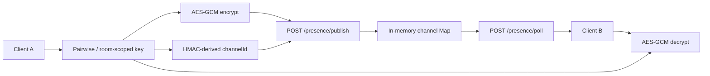
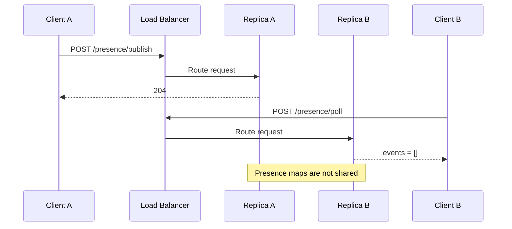
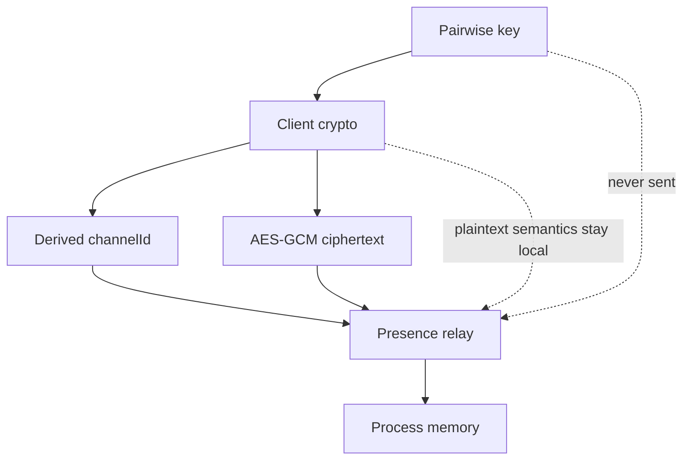
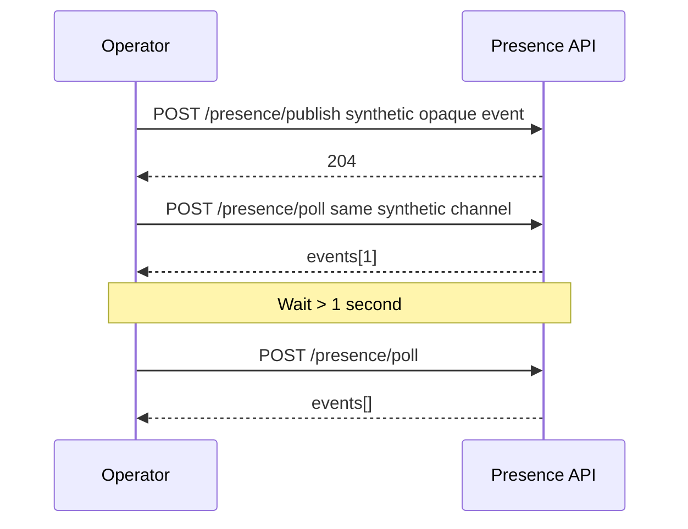
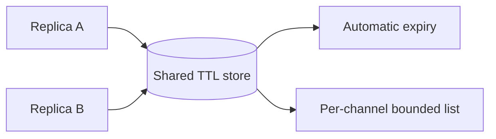
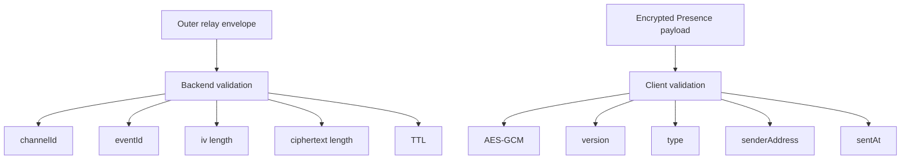
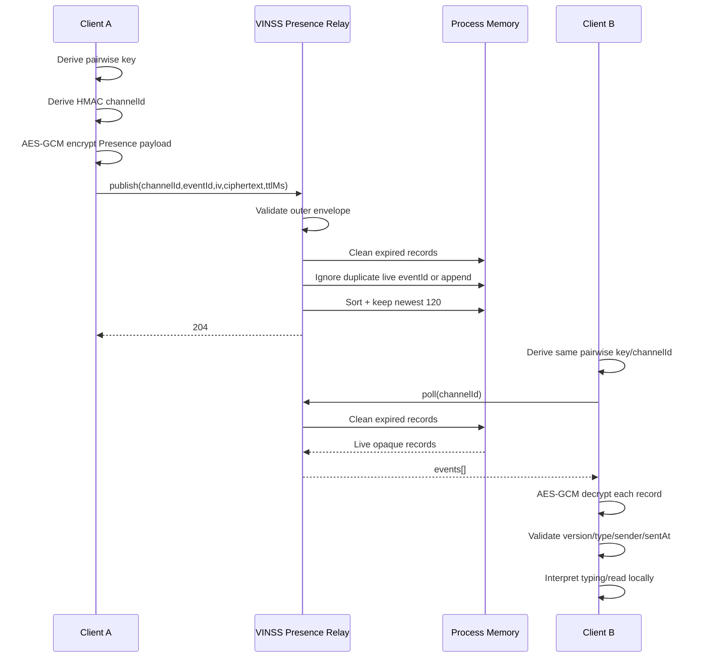

# VINSS Encrypted Presence

This document describes the current VINSS Presence relay.

Presence is an intentionally small, ephemeral, ciphertext-only coordination service for short-lived UX signals.

It is **not**:

```text
Message history

Offer history

Rekber settlement state

Settlement Certificate state

durable user activity

wallet authentication

canonical evidence
```

The backend does not interpret Presence payload semantics.

The client encrypts Presence payloads before publication and decrypts them after polling.

---

# Classification

Current Presence is:

```text
ephemeral
encrypted
process-local
poll-based
unauthenticated
non-durable
non-canonical
```

---

# Objective

Presence exists to support temporary coordination such as:

```text
typing indicators

read receipts

participant announcements

group-member announcements
```

without requiring the backend to receive the decrypted event payload.

---

# Current Semantic Types

The frontend Presence payload union currently defines:

```text
typing

read

participant

group_member
```

These are client-side semantics.

The backend stores only opaque encrypted envelopes.

---

# Current Direct-Chat Usage

The current direct conversation Presence hook actively publishes/consumes:

```text
typing

read
```

Current frontend source does not show active direct usage of:

```text
participant

group_member
```

in that hook.

Those values remain supported by the shared Presence payload/decrypt type.

---

# Source Map

Backend:

```text
backend/src/routes/presence.ts
backend/src/app.ts
```

Frontend cryptography/transport:

```text
frontend/lib/privacy/presence.ts
```

Current direct-chat integration:

```text
frontend/hooks/room/useDirectPresence.ts
```

---

# High-Level Architecture



---

# Important Boundary

The backend can observe:

```text
opaque channelId

eventId

IV string

ciphertext string

server creation time

server expiry time

request timing
```

The backend should not learn from the Presence payload itself:

```text
sender wallet address

typing true/false

message locator

participant public key

group ID

group role
```

because those values are inside encrypted client payloads.

---

# Endpoints

Current routes:

```text
POST /presence/publish

POST /presence/poll
```

---

# Route Mounting

Presence routes are mounted unconditionally by the current backend application.

There is no current:

```text
PRESENCE_ENABLED
```

feature flag.

---

# No Presence-Specific Rate Limiter

Current application composition does not wrap:

```text
/presence/publish

/presence/poll
```

with the backend fixed-window rate limiter.

---

# Consequence

Current application-level limits for Presence come primarily from:

```text
input validation

TTL bounds

max events per channel

global JSON body limit

hosting/proxy controls
```

not a Presence-specific request-rate cap.

---

# Global JSON Limit

Presence uses the normal Express JSON parser.

Current global JSON body limit:

```text
1 MiB
```

---

# Stored Backend Record

Current backend `PresenceRecord` contains:

```text
eventId

iv

ciphertext

createdAt

expiresAt
```

The channel itself is represented by the in-memory Map key:

```text
channelId
```

---

# In-Memory Storage

Current implementation:

```ts
const channels =
  new Map<string, PresenceRecord[]>();
```

---

# Storage Topology

Conceptually:

```text
channelId
    ↓
[
    PresenceRecord,
    PresenceRecord,
    ...
]
```

---

# No PostgreSQL Persistence

Presence does not currently use:

```text
PostgreSQL

DiscoveryStore

RekberStore

CertificateStore
```

---

# No Starknet Persistence

Presence events are not written to:

```text
Message Helper

Offer Helper

Private Escrow Helper

Escrow Rekber

Settlement Certificate
```

---

# Restart Semantics

Backend restart/redeploy clears:

```text
all Presence channels

all live Presence records
```

because state exists only in process memory.

---

# Intended Failure Semantics

Presence loss should degrade only temporary UX such as:

```text
typing indicator

read-receipt relay

short-lived participant presence
```

It must not remove canonical Message/Offer/Rekber state.

---

# Publish Request Shape

Current publish body:

```json
{
  "channelId": "64-lowercase-hex",
  "eventId": "opaque_event_id",
  "iv": "opaque-string",
  "ciphertext": "opaque-string",
  "ttlMs": 5000
}
```

---

# Required Publish Fields

All are required by current validator:

```text
channelId

eventId

iv

ciphertext

ttlMs
```

---

# `channelId` Validation

Must match exactly:

```text
^[a-f0-9]{64}$
```

Therefore:

```text
length = 64

lowercase hex only

no 0x prefix
```

---

# Valid Channel Examples

Structurally valid:

```text
0123456789abcdef0123456789abcdef0123456789abcdef0123456789abcdef
```

Invalid:

```text
0x0123...

ABCDEF...

short-id
```

---

# Channel ID Meaning

In the current frontend direct Presence implementation, `channelId` is derived using:

```text
HMAC-SHA256
```

over the fixed domain text:

```text
VINSS_DIRECT_PRESENCE_V1
```

with the already room-scoped pairwise key as HMAC key.

---

# Channel ID Derivation

Conceptually:

```text
pairwiseKey
    ↓
HMAC-SHA256(
    key = pairwiseKey,
    message = "VINSS_DIRECT_PRESENCE_V1"
)
    ↓
32 bytes
    ↓
64 lowercase hex characters
```

---

# Channel ID Privacy Property

The relay receives the derived identifier.

It does not receive the pairwise key used to derive it.

---

# Channel ID Correlation Property

The backend can correlate all live events sent to the same:

```text
channelId
```

because they share the same Map key.

---

# Channel ID Is Opaque, Not Invisible

The design reduces direct identity leakage.

It does not eliminate:

```text
timing correlation

same-channel correlation

request-source metadata at infrastructure layer
```

---

# Channel ID Is Not a Wallet Address

Current frontend derives it from cryptographic key material.

It is not directly:

```text
Alice's Starknet address

Bob's Starknet address

roomId
```

---

# Backend Does Not Verify Derivation

The backend only validates:

```text
64 lowercase hex
```

It does not prove that the value was genuinely derived from a VINSS pairwise key.

---

# `eventId` Validation

Must match:

```text
^[A-Za-z0-9_-]{8,96}$
```

---

# Event ID Allowed Characters

```text
A-Z

a-z

0-9

_

-
```

---

# Event ID Length

```text
minimum = 8 characters

maximum = 96 characters
```

---

# Current Frontend Event ID

The frontend currently generates:

```text
crypto.randomUUID()
```

then removes hyphens.

---

# Current Frontend Event ID Length

A UUID without hyphens produces:

```text
32 hexadecimal characters
```

which satisfies backend validation.

---

# Event ID Is Not Message Identity

Current frontend creates a fresh random Presence event ID.

It should not be interpreted as:

```text
Message action locator

transaction hash

room ID

wallet identity
```

---

# IV Validation

Backend treats `iv` as an opaque string.

Requirements:

```text
string

non-empty

length <= 128 characters
```

---

# Backend Does Not Parse IV Encoding

It does not verify:

```text
base64url correctness

96-bit length

AES-GCM compatibility
```

---

# Current Frontend IV

Frontend cryptography currently generates:

```text
12 random bytes
```

or:

```text
96 bits
```

for AES-GCM.

---

# Current Frontend IV Encoding

The IV is encoded as:

```text
base64url
```

before being sent to the backend.

---

# Ciphertext Validation

Backend requires:

```text
string

non-empty

length <= 16,384 characters
```

---

# Important Length Precision

The backend limit is:

```text
JavaScript string length
```

not a separately decoded ciphertext byte length.

---

# Backend Does Not Parse Ciphertext Encoding

It does not verify:

```text
base64url syntax

AES-GCM tag

JSON payload validity

Presence semantic type
```

---

# Current Frontend Ciphertext

Frontend currently:

```text
JSON.stringify(payload)

AES-GCM encrypt

base64url encode
```

---

# Encryption Algorithm

Current frontend Presence encryption:

```text
AES-GCM
```

using the same pairwise key material supplied to the Presence helper.

---

# Client-Side Authentication

AES-GCM provides authenticated encryption.

Malformed or forged ciphertext that does not authenticate under the pairwise key fails client-side decryption.

---

# Backend Does Not Authenticate Ciphertext

The relay stores the opaque string as submitted.

It does not possess the key required to validate AES-GCM authentication.

---

# `ttlMs` Validation

Backend requires:

```text
typeof ttlMs === "number"

Number.isFinite(ttlMs)
```

---

# TTL Does Not Need to Be Integer

The backend applies:

```text
Math.floor(ttlMs)
```

before clamping.

---

# TTL Bounds

Current constants:

```text
minimum = 1,000 ms

maximum = 86,400,000 ms
```

or:

```text
1 second

24 hours
```

---

# TTL Is Clamped, Not Rejected

Examples:

```text
ttlMs = 100
    -> stored as 1,000 ms

ttlMs = 5,500.9
    -> floored to 5,500 ms

ttlMs = 999,999,999
    -> stored as 24 hours
```

---

# Negative TTL

A finite negative value passes the type/finite check.

It is then clamped to:

```text
1 second
```

---

# Invalid TTL

Rejected:

```text
NaN

Infinity

-Infinity

string values
```

---

# Server Time Authority

Backend sets:

```text
createdAt = Date.now()
```

when accepting a new Presence record.

---

# Client `sentAt`

The encrypted client payload may also contain:

```text
sentAt
```

but the backend cannot see or validate it.

---

# Two Time Sources

Therefore Presence has:

```text
server createdAt / expiresAt
```

outside ciphertext

and:

```text
client sentAt
```

inside ciphertext.

---

# Expiration Formula

For a newly stored record:

```text
expiresAt =
    server now
    +
    bounded TTL
```

---

# Expiration Authority

Backend cleanup uses:

```text
expiresAt
```

that it calculated itself.

It does not trust encrypted `sentAt` for expiration.

---

# Maximum Events Per Channel

Current cap:

```text
120
```

live records per channel after publish.

---

# Retention Rule

After publication:

```text
current records
    ↓
sort by createdAt ascending
    ↓
keep last 120
```

---

# Eviction Direction

If more than 120 live events exist:

```text
oldest records are removed first
```

based on server `createdAt`.

---

# Cleanup Function

Current cleanup:

```text
cleanChannel(channelId, now)
```

filters records where:

```text
expiresAt > now
```

---

# Expired Record Rule

Records with:

```text
expiresAt <= now
```

are removed.

---

# Empty Channel Cleanup

If no live records remain:

```text
channels.delete(channelId)
```

---

# Cleanup Is Access-Driven

There is no background timer sweeping all channels.

Expired records are cleaned when the channel is accessed through:

```text
publish

poll
```

---

# Consequence

An untouched channel can remain allocated in the process Map with expired records until:

```text
that channel is accessed again

or process restarts
```

---

# Memory Implication

Expiration is semantically enforced on access.

It is not a global scheduled memory cleanup system.

---

# Duplicate Event ID Rule

Before storing a new record, backend checks:

```text
current.some(
    record => record.eventId === eventId
)
```

---

# Duplicate While Live

If the same live:

```text
eventId
```

already exists:

```text
new record is not pushed
```

---

# Duplicate Publish Response

The route still returns:

```text
HTTP 204
```

---

# Duplicate Does Not Refresh TTL

Important:

A duplicate live `eventId` does not update:

```text
iv

ciphertext

createdAt

expiresAt
```

---

# Duplicate Does Not Replace Payload

The first still-live record wins.

---

# Duplicate After Expiration

If the old event expired and `cleanChannel()` removes it first, the same `eventId` can be stored again as a new record.

---

# Idempotency Scope

Current duplicate suppression is:

```text
same channelId

same live eventId

same process
```

---

# It Is Not Durable Replay Protection

Restart clears the Map.

---

# It Is Not Global Across Replicas

Another backend replica has a separate Map.

---

# Publish Success

Successful valid publication returns:

```text
HTTP 204
```

with no response body.

---

# Poll Request Shape

Current poll body:

```json
{
  "channelId": "64-lowercase-hex"
}
```

---

# Poll Validation

Only `channelId` is required by current poll logic.

It must match the same:

```text
64 lowercase hex
```

pattern.

---

# Poll Success

Response:

```json
{
  "events": [
    {
      "eventId": "...",
      "iv": "...",
      "ciphertext": "...",
      "createdAt": 123456789,
      "expiresAt": 123456999
    }
  ]
}
```

---

# Empty Poll

A valid channel with no current records returns:

```json
{
  "events": []
}
```

---

# Poll Ordering

Records are normally stored sorted:

```text
createdAt ascending
```

after publication.

`cleanChannel()` preserves current array order.

Therefore poll normally returns oldest-to-newest live records.

---

# Poll Does Not Remove Read Events

Polling is not destructive.

It does not:

```text
consume

acknowledge

delete
```

returned records.

---

# Repeated Poll

The same live record can appear in multiple poll responses until:

```text
expiration

eviction

restart
```

---

# Client Must Tolerate Repeats

Frontend should not assume:

```text
poll = exactly-once delivery
```

---

# Delivery Semantics

Current Presence is closer to:

```text
best-effort repeated snapshot of current live records
```

than:

```text
message queue
```

---

# No Cursor

Poll has no:

```text
cursor

since

lastEventId

offset
```

---

# No Server-Side Acknowledgement

There is no:

```text
ACK endpoint

read cursor

delete-on-read
```

---

# Frontend Polling Cadence

Current direct Presence hook polls approximately every:

```text
1,200 ms
```

while active.

---

# Frontend Concurrency Guard

The hook uses a local:

```text
running
```

flag to avoid overlapping polls.

---

# Typing Publish Behavior

Current direct hook:

```text
publishes typing=true immediately

then every ~2 seconds while draft is non-empty
```

---

# Typing TTL

Current direct hook uses:

```text
5 seconds
```

for:

```text
typing=true
```

---

# Typing False TTL

When draft becomes empty it publishes:

```text
typing=false
```

with approximately:

```text
2 seconds
```

TTL.

---

# Typing Client Interpretation

After decryption, frontend selects the newest peer:

```text
type = typing
```

event by encrypted payload `sentAt`.

---

# Typing Active Rule

Frontend displays peer typing only if:

```text
latestTyping.active === true
```

and:

```text
record.expiresAt > Date.now()
```

---

# Read Receipt Behavior

Current direct hook publishes read receipts only while the direct panel is:

```text
active/open
```

---

# Read Receipt Eligibility

Current client requires an incoming direct entry with:

```text
transactionHash present

sender = selected peer

recipient = current wallet
```

and a locator not already published during this hook lifetime.

---

# Read Receipt TTL

Current direct hook publishes read Presence with:

```text
24 hours
```

TTL.

That equals the backend maximum.

---

# Read Receipt Payload

Encrypted fields include:

```text
version

type = read

senderAddress

sentAt

messageLocator
```

---

# Message Locator Privacy

`messageLocator` is inside encrypted Presence payload.

The backend Presence relay does not receive it as a plaintext field.

---

# Read Receipt Relay Is Ephemeral

Even with a 24-hour TTL:

```text
restart clears it
```

because Presence is not durable.

---

# Frontend Read Receipt Memory

The current hook also keeps a local in-memory set:

```text
sentReadReceiptsRef
```

to avoid repeatedly publishing the same locator during that hook lifetime.

---

# That Client Idempotency Is Also Ephemeral

Component lifecycle/reload can clear it.

---

# Current Presence Payload Shape

After client decryption, a valid payload can contain:

```text
version

type

senderAddress

sentAt

active?

messageLocator?

messagingPublicKey?

groupId?

role?
```

---

# Backend Does Not Validate These Fields

It sees only encrypted bytes/string.

---

# Client Decrypt Validation

Current frontend accepts decrypted payload only when:

```text
version === 1

type is one of:
    typing
    read
    participant
    group_member

senderAddress is string

sentAt is string
```

---

# Optional Fields Are Type-Dependent by Convention

The decrypt helper does not deeply validate every optional field based on event type.

For example it does not prove at the central decrypt layer that:

```text
typing always has boolean active

read always has messageLocator

group_member always has groupId
```

Consumer hooks apply additional assumptions.

---

# Malformed Decrypted Payload

If base required checks fail:

```text
client returns null
```

and ignores the record.

---

# Unrelated Ciphertext

If decryption fails:

```text
client returns null
```

---

# Forged Ciphertext Without Key

An attacker who lacks the Presence encryption key can submit arbitrary ciphertext if they somehow know a valid channel ID.

AES-GCM authentication should cause local decryption to fail.

---

# Backend Injection Boundary

The backend does not authenticate publishers.

Therefore:

```text
knowing channelId
```

is sufficient to submit a structurally valid opaque record to that relay channel.

---

# No Wallet Authentication

Publish does not require:

```text
wallet signature

Starknet session proof

participant address

JWT

API key
```

---

# No Room Membership Verification

Backend does not verify:

```text
publisher belongs to room

publisher is Alice/Bob

publisher knows pairwise key
```

---

# Security Model

The relay relies on:

```text
unguessable/secret-derived channel ID

authenticated client ciphertext

short TTL

bounded channel storage
```

rather than authenticated user sessions.

---

# Channel ID Leakage Risk

If a channel ID leaks, another party can:

```text
poll encrypted records

submit opaque records

consume channel capacity
```

even if they still cannot decrypt valid ciphertext without the encryption key.

---

# Capacity Injection Risk

Because each channel keeps only:

```text
120
```

records, an attacker who knows the channel ID could potentially submit many unique valid-structure opaque events and evict older legitimate live events.

---

# No Per-Channel Sender Quota

Current backend does not identify individual senders.

It cannot enforce:

```text
60 events per participant

wallet quota

authenticated publisher quota
```

---

# No Presence Rate Limit

This increases the importance of keeping channel IDs non-public and using infrastructure-level abuse controls.

---

# Backend Global Request Logging

Current backend logger records:

```text
POST /presence/publish

POST /presence/poll
```

as method/path.

---

# Presence Body Is Not Logged by App Logger

Therefore current application source does not intentionally log:

```text
channelId

eventId

iv

ciphertext

ttlMs
```

through the global request logger.

---

# Hosting Caveat

Hosting infrastructure or APM can independently capture request bodies/headers.

That must be reviewed separately.

---

# Channel ID Is Sensitive Metadata

Although not a decryption key, it acts as:

```text
relay channel capability/correlation identifier
```

and should not be unnecessarily logged.

---

# Event ID Is Opaque Metadata

It is safe to treat as non-secret only with normal metadata caution.

---

# IV Is Not Secret

AES-GCM IV need not be secret.

But there is still no operational need to log it.

---

# Ciphertext Is Not Plaintext

But logging large ciphertext provides little diagnostic value and increases metadata/storage exposure.

Do not log it.

---

# Pairwise Key Must Never Reach Backend

Current frontend uses the pairwise key locally for:

```text
channel derivation

encryption

decryption
```

---

# Backend Request Does Not Include Pairwise Key

Publish sends:

```text
channelId

eventId

iv

ciphertext

ttlMs
```

Poll sends:

```text
channelId
```

---

# Room ID Is Not Sent to Presence Route

Current Presence transport helper does not send:

```text
roomId
```

to backend Presence endpoints.

---

# Wallet Address Is Encrypted Payload Data

Current direct Presence payload includes:

```text
senderAddress
```

inside AES-GCM ciphertext.

---

# Backend Cannot Filter by Sender Address

The relay only groups by:

```text
channelId
```

---

# Client Filters Peer Events

Current direct hook decrypts events and filters them by:

```text
sameStarknetAddress(
    event.senderAddress,
    selectedPeer.address
)
```

---

# Privacy Responsibility

Peer identity filtering occurs:

```text
client-side
```

after decryption.

---

# Presence Is Separate From Discovery

Current frontend comment explicitly isolates Presence from Message Discovery.

---

# Why

Typing/read receipts are:

```text
short-lived

pairwise encrypted

not on-chain Message records
```

---

# Presence Does Not Affect Message Discovery Checkpoint

Publishing Presence does not alter:

```text
Message Discovery checkpoint
```

---

# Presence Does Not Create `MessageCommitted`

There is no Starknet transaction.

---

# Presence Does Not Create Transaction Hash

A Presence record is purely backend ephemeral data.

---

# Read Receipt vs Message Read State

Presence read receipts are UX signals.

They are not:

```text
canonical blockchain proof that a message was read
```

---

# Typing vs Message Submission

Typing does not imply:

```text
a Message will be sent
```

---

# Participant Presence vs Contract Participant

If `participant` semantics are used, they still must not be treated as:

```text
Rekber participant authorization
```

---

# Group Member Presence vs Group Authority

Likewise `group_member` Presence must not be treated as:

```text
canonical group membership permission
```

---

# Current Participant Payload Fields

The shared Presence type allows:

```text
messagingPublicKey
```

inside encrypted payload.

---

# Current Group Payload Fields

The shared type allows:

```text
groupId

role = admin | member
```

inside encrypted payload.

---

# Backend Still Does Not See Their Meaning

They remain ciphertext.

---

# Group-Key Comment

Current frontend source states group membership announcements should be encrypted using that Group's key.

That is a client cryptographic design note.

The backend route does not distinguish:

```text
direct key

room key

group key
```

---

# Backend Key-Agnostic Design

This is desirable:

```text
relay receives opaque envelope regardless of semantic key type
```

---

# Validation Strictness

Publish destructures known fields:

```text
channelId

eventId

iv

ciphertext

ttlMs
```

---

# Unknown Publish Fields

Current route does not explicitly reject all additional top-level fields.

Extra JSON fields are ignored by route logic.

---

# Poll Unknown Fields

Poll likewise reads only:

```text
channelId
```

and does not enforce a strict top-level allowlist.

---

# Contrast With `/discover`

`/discover` deliberately rejects unexpected fields and privacy-sensitive key names.

Presence does not implement that same strict-body policy.

---

# Risk Precision

Because Presence already receives only a small expected envelope, extra fields being ignored is not equivalent to the backend using them.

However stricter validation could reduce accidental secret submission.

---

# Future Privacy Hardening

Presence could adopt a strict allowlist:

```text
publish:
    channelId
    eventId
    iv
    ciphertext
    ttlMs

poll:
    channelId
```

and explicitly reject common secret names.

---

# Why This Could Help

If a buggy client accidentally adds:

```text
pairwiseKey
```

today, route logic ignores it but the HTTP request still reaches backend infrastructure.

Strict rejection would make such mistakes visible sooner.

---

# Current Channel Lifetime

There is no explicit channel object with its own TTL.

A channel remains in the Map as long as it has an array entry.

---

# When All Events Expire

Next access removes the channel key.

---

# No Channel Creation Endpoint

Channels are implicitly created by first valid publish.

---

# No Channel Delete Endpoint

There is no:

```text
DELETE /presence/:channelId
```

---

# No Channel List Endpoint

There is no:

```text
GET /presence/channels
```

---

# No Admin Inspection API

Backend does not expose an API to enumerate all Presence channels.

---

# Benefit

This reduces metadata exposure.

---

# No Event Delete Endpoint

Individual Presence records cannot be remotely deleted.

They disappear through:

```text
expiry

channel cap eviction

process restart
```

---

# No TTL Extension Endpoint

A client extends a semantic Presence state by publishing a new event.

It does not mutate an existing event's TTL.

---

# Current Typing Strategy

That is exactly why direct typing currently publishes repeated new events while typing remains active.

---

# Duplicate Event ID and Retry Semantics

Because the normal frontend creates a new random event ID for each call, repeated semantic typing publications are distinct records.

---

# Important Precision

Backend duplicate suppression can make an identical `eventId` publish idempotent while it remains live.

But the current frontend helper itself generates a new event ID on each separate `publishPresence()` call.

---

# Therefore

Do not overstate current client behavior as:

```text
all application retries use one stable eventId
```

unless a transport retry repeats the exact same already-built request.

---

# Max Channel Load From Current Typing

Typing can publish roughly every:

```text
2 seconds
```

with a:

```text
5-second TTL
```

---

# Normal Live Typing Footprint

Under normal conditions only a small number of recent typing events remain live at once because older ones expire.

---

# Read Receipt Footprint

Read receipts can remain up to:

```text
24 hours
```

so they are more likely than typing events to accumulate toward the:

```text
120 record
```

channel cap.

---

# Cap Interaction With Read Receipts

If more than 120 live read/other events exist in a channel:

```text
older live records are evicted
```

even before TTL expiry.

---

# Therefore

The 24-hour TTL is:

```text
maximum eligibility window
```

not a guarantee that a record remains available for 24 hours.

---

# Delivery Guarantee

Presence provides no guarantee that every published event will be observed by the peer.

Reasons include:

```text
process restart

replica mismatch

channel-cap eviction

client offline longer than TTL

network failure

poll failure

malformed/undecryptable ciphertext
```

---

# Exactly-Once Guarantee

None.

---

# At-Least-Once Guarantee

None.

---

# Best-Effort Semantics

Correct description:

```text
best-effort ephemeral encrypted relay
```

---

# Process Restart

All Presence state disappears.

---

# Browser Restart

Backend state may remain until TTL, but client local hook state/key/session availability can change.

---

# Long Offline Peer

If the peer does not poll before expiry or eviction, the event can be missed.

---

# Presence Is Not Notification Infrastructure

It should not be used for:

```text
payment alerts

dispute deadlines

legal notices

settlement completion guarantees
```

---

# Multi-Replica Limitation

Each Node process has its own:

```text
channels Map
```

---

# Split Example



---

# Multi-Replica Consequence

Without:

```text
sticky routing

shared store

single replica
```

Presence can appear intermittently missing.

---

# Single-Replica Operational Model

Current architecture is simplest when:

```text
one backend replica
```

owns all Presence traffic.

---

# Shared Store Future Option

If scaling requires multiple replicas, use a TTL-oriented shared store such as:

```text
Redis
```

or another short-lived shared database.

---

# Do Not Use Shared Store to Decrypt

Scaling does not require moving encryption keys server-side.

Store the same:

```text
opaque channelId

eventId

iv

ciphertext

createdAt

expiresAt
```

shape.

---

# Sticky Session Option

Sticky routing could reduce split behavior without shared storage.

But it introduces its own load-balancing assumptions and does not provide restart durability.

---

# Redis Option

A shared TTL store could provide:

```text
cross-replica consistency

automatic expiry

bounded storage

atomic duplicate checks
```

while preserving keyless relay behavior.

---

# No Background Cleanup

Current access-based cleanup is simple.

---

# Potential Memory Abuse

An attacker able to create many valid distinct:

```text
channelId
```

values can create many Map keys.

---

# Per-Channel Cap Is Not Global Cap

Current source caps:

```text
120 records per channel
```

but does not cap:

```text
number of channels
```

globally.

---

# No Global Presence Memory Limit

There is no configured:

```text
MAX_CHANNELS

MAX_TOTAL_EVENTS
```

---

# Consequence

Presence-specific request rate limiting/shared memory quotas would improve abuse resilience.

---

# TTL Bounds Reduce But Do Not Eliminate Risk

Expired records are not globally swept until channel access.

So a large number of one-time channels can leave expired arrays allocated until process restart.

---

# This Is a Real Scaling Limitation

Access-driven cleanup is adequate for small traffic but not a complete global memory-management strategy.

---

# No Metrics

Current backend does not expose Presence metrics such as:

```text
live channels

live events

publish count

poll count

validation failures

evictions

decrypt failures
```

---

# Backend Cannot Measure Decrypt Failures

Decryption happens client-side.

---

# Useful Future Backend Metrics

Privacy-safe examples:

```text
presence_publish_total

presence_poll_total

presence_validation_error_total

presence_live_channel_gauge

presence_live_event_gauge

presence_channel_eviction_total
```

---

# Avoid Metric Labels

Do not label metrics with:

```text
channelId

eventId
```

because that creates high-cardinality correlation metadata.

---

# Useful Client Metrics

Possible aggregate client-side metrics:

```text
presence_decrypt_failure_total

typing_event_processed_total

read_event_processed_total
```

without payload contents.

---

# Global Backend Logger

Current application logger records path only.

Presence-specific route code has no additional console logging.

---

# Privacy Benefit

Normal Presence payload values therefore are not intentionally written to application logs.

---

# Error Responses

Invalid publish returns:

```text
HTTP 400
```

with:

```json
{
  "error": "Invalid encrypted presence envelope."
}
```

---

# Invalid Poll

Returns:

```text
HTTP 400
```

with:

```json
{
  "error": "Invalid presence channel."
}
```

---

# No Internal Server Error Path in Route Logic

Current Presence route is entirely in-memory/synchronous.

Under normal route logic it has no DB/RPC calls that create ordinary:

```text
500 storage failure
```

paths.

---

# Process-Level Exceptions

Unexpected runtime/process errors are still possible in any Node application.

But Presence has no explicit route-level 500 branch in current source.

---

# No External Dependency During Publish/Poll

Current Presence endpoint does not call:

```text
PostgreSQL

Starknet RPC

LLM provider

email provider
```

---

# Availability Benefit

Presence can still work while:

```text
RPC is down

indexers are stale
```

as long as the backend process handling both peers remains alive.

---

# DB Outage

Presence can theoretically continue because its state is in memory and does not query DB.

---

# Whole App Startup Caveat

The backend normal startup requires core database initialization before the HTTP server begins listening.

Therefore:

```text
DB unavailable at process startup
```

prevents the Presence route from becoming available even though the route itself does not need DB.

---

# Mid-Run DB Outage

If backend is already running and DB later fails, Presence route itself may continue to work while DB-backed routes degrade.

---

# RPC Outage

Presence itself does not depend on RPC.

---

# Agent Outage

Presence itself does not depend on LLM providers.

---

# Rekber Outage

Presence does not mutate Rekber.

---

# Feature Isolation

This makes Presence an auxiliary UX service.

---

# Health Endpoint Limitation

`GET /health` does not test Presence.

---

# Presence Can Be Broken While Health Is 200

Examples:

```text
multi-replica split

unexpected client crypto bug

channel IDs differ between peers

Presence route abuse

polling disabled in frontend
```

---

# Presence Can Work While Health Is Degraded

If checkpoint status is error but the process is running, in-memory Presence endpoints can still work.

---

# Therefore

Presence health and indexer health are separate concepts.

---

# No Presence Readiness Probe

There is no dedicated:

```text
/presence/health
```

---

# Safe Smoke Test

Use an opaque synthetic channel.

Do not use a real pairwise key.

Example publish body:

```json
{
  "channelId": "0123456789abcdef0123456789abcdef0123456789abcdef0123456789abcdef",
  "eventId": "smoketest_01",
  "iv": "opaque-test-iv",
  "ciphertext": "opaque-test-ciphertext",
  "ttlMs": 1000
}
```

---

# Expected Publish Result

```text
HTTP 204
```

---

# Safe Poll

Immediately poll the same synthetic channel.

Expected:

```text
one opaque event
```

until expiry.

---

# Smoke Test Cleanup

With:

```text
ttlMs = 1000
```

the test record expires quickly.

---

# Do Not Use Real Data for Smoke Tests

Avoid:

```text
real room channel ID

real ciphertext

real pairwise key

real wallet identity
```

---

# Security Boundary Diagram



---

# Data Visibility Matrix

| Field | Backend sees? | Encrypted payload? |
|---|---:|---:|
| `channelId` | Yes | No |
| `eventId` | Yes | No |
| `iv` | Yes | No |
| `ciphertext` | Yes | Already ciphertext |
| `ttlMs` | Yes on request | No |
| `createdAt` | Backend creates | No |
| `expiresAt` | Backend creates | No |
| `senderAddress` | No normally | Yes |
| `typing active` | No | Yes |
| `messageLocator` | No | Yes |
| `messagingPublicKey` | No | Yes |
| `groupId` | No | Yes |
| `role` | No | Yes |
| pairwise key | No | N/A |

---

# Metadata Caveat

Even with encrypted payloads, backend/infrastructure can observe:

```text
request timing

request frequency

channel reuse

ciphertext size

TTL request

client network metadata
```

---

# Typing Traffic Pattern

Repeated publications every ~2 seconds can itself reveal:

```text
activity timing
```

to the relay.

---

# Read Receipt TTL Pattern

A 24-hour TTL can indicate a long-lived Presence event class if an observer knows client behavior.

---

# Privacy Claim Discipline

Accurate:

```text
Presence payload semantics are encrypted.
```

Too strong:

```text
Presence reveals no metadata.
```

---

# No Server-Side Type Routing

Backend cannot route differently based on:

```text
typing

read

participant

group_member
```

because type is encrypted.

---

# All Presence Records Share Same Storage Logic

Every encrypted semantic type is handled identically by the backend.

---

# No Priority Classes

There is no:

```text
typing priority

read priority

participant priority
```

---

# Cap Eviction Is Semantic-Blind

If 120-record cap is reached, backend removes oldest records regardless of encrypted type.

---

# Consequence

Long-lived read receipts can be evicted by newer typing or injected records.

---

# No Per-Type TTL Enforcement

Backend trusts client-provided TTL subject to global clamp.

It does not know:

```text
typing should be 5 sec

read should be 24 h
```

---

# Client Policy Owns Semantic TTL

Current direct client chooses these TTLs.

---

# No Semantic Validation

A client could encrypt:

```text
typing
```

and request:

```text
24-hour TTL
```

The backend cannot know or reject the mismatch.

---

# This Is Intentional Keyless Design

Semantic enforcement would require either:

```text
plaintext type disclosure
```

or:

```text
cryptographic proof of type
```

which current implementation does not use.

---

# No Server-Side Sender Validation

Because `senderAddress` is encrypted, relay cannot enforce that senderAddress matches:

```text
HTTP caller

wallet signature

channel participant
```

---

# Client Must Treat Decrypted Sender as Payload Data

Current direct hook checks it against selected peer address.

---

# Authenticity Source

AES-GCM proves:

```text
ciphertext was created by someone with the encryption key
```

assuming key secrecy and correct cryptographic usage.

---

# It Does Not Prove Unique Human Identity

Anyone with that key can produce valid Presence payloads.

---

# Pairwise Key Compromise

If pairwise key is compromised, attacker can:

```text
derive channel ID

decrypt Presence

forge authenticated Presence payloads
```

---

# Backend Cannot Detect Key Compromise

This is a client cryptographic security boundary.

---

# Presence Channel Rotation

There is no backend channel-rotation concept.

A different pairwise key/domain result naturally creates a different:

```text
channelId
```

---

# Protocol Version

Client Presence payload currently uses:

```text
version = 1
```

---

# Backend Does Not Validate Version

Version is encrypted.

---

# Client Rejects Other Versions

Current decrypt helper accepts only:

```text
version === 1
```

---

# Future Versioning

A future Presence V2 can potentially coexist if client decrypt logic understands it.

Backend relay can remain envelope-opaque unless transport fields change.

---

# Event Type Versioning

Types are part of encrypted payload schema.

---

# Transport Schema Version

The outer transport currently has no explicit:

```text
transportVersion
```

field.

---

# Consequence

Breaking changes to:

```text
channelId format

IV field format

ciphertext format

TTL behavior
```

require coordinated backend/frontend rollout.

---

# No OpenAPI Presence Crypto Semantics

OpenAPI can document outer request fields.

It cannot prove client encryption correctness.

---

# Poll Response Trust

Backend-generated:

```text
createdAt

expiresAt
```

can be trusted as relay timing metadata.

---

# Ciphertext Trust

Client still authenticates/decrypts ciphertext before trusting semantic payload.

---

# Unknown/Unrelated Records

Current decrypt helper catches errors and ignores them.

---

# Benefit

One malformed/injected record does not necessarily break the entire poll batch.

---

# `Promise.all` Decryption

Current frontend attempts decryption of all returned records concurrently.

---

# Filter Behavior

Records producing:

```text
null
```

are removed from the returned decrypted event list.

---

# No Client Error for Bad Record

Malformed/unrelated ciphertext is silently ignored at the transport helper layer.

---

# Operational Debugging Trade-Off

This protects UX/privacy but can make injected/broken Presence difficult to diagnose.

---

# Safe Debugging

Use aggregate counts such as:

```text
poll record count

decrypt success count

decrypt failure count
```

without logging plaintext or keys.

---

# Direct Presence Error Logs

Current direct hook logs generic client-side errors such as:

```text
[VINSS DIRECT TYPING ERROR]

[VINSS DIRECT PRESENCE ERROR]

[VINSS DIRECT READ RECEIPT ERROR]

[VINSS DIRECT READ KEY ERROR]
```

with the caught frontend error object.

---

# Client Logging Privacy Review

Frontend error objects should be reviewed so browser telemetry does not capture sensitive cryptographic material.

---

# Backend Documentation Boundary

This file focuses on backend Presence behavior but includes frontend crypto only where necessary to explain why the backend remains keyless.

---

# Presence vs Message Table

| Property | Presence | Message |
|---|---|---|
| Storage | Process memory | Starknet + persistent Discovery index |
| Durable | No | Yes |
| Encryption | Client AES-GCM | VINSS encrypted envelope flow |
| Transaction | No | Yes |
| Tx hash | No | Yes |
| TTL | Yes | No Presence-style TTL |
| Canonical history | No | Yes |
| Backend decryption | No | No |
| Typical use | typing/read | actual conversation |

---

# Presence vs Activity

Presence events do not appear in:

```text
GET /activity
```

---

# Presence vs Royalty

Presence does not affect:

```text
Royalty points
```

---

# Presence vs Legacy Loyalty

Presence does not automatically award:

```text
Legacy Loyalty points
```

---

# Presence vs Settlement Certificate

Presence does not affect Certificate eligibility or minting.

---

# Presence vs Dispute

Presence is not admissible as canonical backend proof merely because a record existed.

Its data is:

```text
ephemeral

client encrypted

unauthenticated at relay
```

---

# No Presence History API

There is no long-term retrieval endpoint.

---

# Current Poll Returns Live Snapshot Only

Expired/evicted/restarted records are gone.

---

# No Audit Trail

Backend cannot reconstruct historical Presence after process memory disappears.

---

# This Is Intentional

Presence should remain auxiliary.

---

# Current Constraints Summary

```text
channelId:
    64 lowercase hex

eventId:
    8..96
    A-Z a-z 0-9 _ -

iv:
    non-empty string
    max 128 chars

ciphertext:
    non-empty string
    max 16,384 chars

ttlMs:
    finite number
    floored
    clamped to 1s..24h

max live records/channel after publish:
    120
```

---

# Missing Constraints

Current backend has no:

```text
global max channels

global max live events

Presence rate limit

wallet-authenticated sender

strict unknown-field rejection

per-type TTL policy

per-sender quota

durable idempotency

cross-replica shared state
```

---

# Abuse Model

Potential abuse if Presence endpoint is public:

```text
many random channels

many events per channel

channel-ID leakage injection

poll flooding

memory pressure

JSON request volume
```

---

# Existing Abuse Bounds

Current protections:

```text
field format/length checks

120-event per-channel cap

24-hour max TTL

1 MiB global JSON body limit
```

---

# Missing Abuse Bounds

Still absent:

```text
per-IP Presence rate limit

global channel cap

global event cap

shared cluster limiter
```

---

# Mainnet Recommendation

If Presence is enabled in initial mainnet UX:

```text
prefer one backend replica
```

unless shared Presence storage/sticky routing is intentionally configured.

---

# Infrastructure Protection

Use platform-level:

```text
request rate limits

memory alerts

restart alerts
```

until application-specific Presence controls are added.

---

# Do Not Make Presence Valuable

Do not use Presence as authority for:

```text
points

payments

dispute resolution

deadline enforcement

participant authentication
```

---

# Observability Recommendation

Monitor aggregate:

```text
publish rate

poll rate

400 rate

process memory

restart count
```

---

# Privacy-Safe Labels

Use:

```text
route

status

environment
```

not:

```text
channelId

eventId
```

---

# Incident Triage — Missing Typing

Check:

```text
1. Are both clients on same selected direct peer?

2. Do both derive the same direct key?

3. Do both derive the same channelId?

4. Is publish returning 204?

5. Is poll returning encrypted events?

6. Does AES-GCM decrypt succeed?

7. Is senderAddress the expected peer?

8. Is latest typing event still unexpired?

9. Did backend restart?

10. Are multiple replicas involved?
```

---

# Incident Triage — Missing Read Receipt

Check:

```text
1. Did Message exist with transactionHash?

2. Is direct panel active?

3. Was read Presence publish attempted?

4. Did publish return 204?

5. Is event still live / not evicted?

6. Is poll reaching same backend Presence state?

7. Does decrypt succeed?

8. Does messageLocator match local action locator?
```

---

# Incident Triage — Poll Empty

Possible causes:

```text
wrong channelId

all events expired

events evicted

backend restarted

different backend replica

publisher never succeeded

syntactically valid but unrelated channel
```

---

# Incident Triage — Decrypt Failure

Likely client-side causes:

```text
different pairwise key

malformed ciphertext

wrong IV/ciphertext encoding

injected unrelated record

key-derivation mismatch
```

---

# Do Not Send Key to Backend

Even during debugging.

---

# Safe Debug Data

Use:

```text
channel IDs compared locally without publishing widely

HTTP statuses

record counts

expiry timestamps

client-side decrypt success/failure boolean
```

---

# Channel ID Sharing Caution

Because channel ID acts as a relay routing capability, avoid posting real IDs in public issue trackers/logs.

---

# Restart Incident

Expected:

```text
all Presence disappears
```

---

# Recovery

No data restoration is necessary.

Clients simply resume publishing fresh Presence state.

---

# No Replay From Chain

Presence cannot be rebuilt from Starknet because it was never written there.

---

# Multi-Replica Incident

If Presence became unreliable after scale-out:

```text
reduce to one replica
```

or introduce:

```text
sticky sessions/shared store
```

before changing crypto.

---

# Do Not Blame Message Discovery

Presence and Message Discovery are separate.

---

# Deployment Smoke

A backend can pass `/health` while Presence is broken.

So Presence requires its own synthetic smoke when it is production-critical UX.

---

# Suggested Smoke Flow



---

# Smoke Test Limitation

This proves:

```text
one process can publish/poll/expire
```

It does not prove:

```text
two-browser pairwise crypto

multi-replica routing

real typing UX

read-receipt matching
```

---

# Two-Client E2E

For full Presence verification:

```text
Client A derives direct key

Client B derives same direct key

A publishes typing

B polls/decrypts

B publishes read

A polls/decrypts
```

---

# Privacy Test

Verify backend logs do not contain:

```text
channel key

room key

Presence plaintext

senderAddress from decrypted payload
```

---

# Strict Body Future Improvement

Recommended transport schema:

```text
publish allowed fields only:
    channelId
    eventId
    iv
    ciphertext
    ttlMs

poll allowed fields only:
    channelId
```

---

# Why This Matters

It catches accidental:

```text
pairwiseKey

roomSecret

senderAddress plaintext
```

before those fields become normalized client behavior.

---

# Rate Limit Future Improvement

Add Presence-specific scope:

```text
presence
```

with a limit tuned for legitimate 1.2-second polling and 2-second typing publications.

---

# Important Rate-Limit Design

A rate limit that is too low can break normal Presence because current direct UI polls frequently.

---

# Example Traffic Pattern

One active user may produce approximately:

```text
50 polls/minute
```

at 1.2-second polling cadence.

Typing adds roughly:

```text
30 publishes/minute
```

while continuously typing.

---

# Therefore

Presence limits must account for real client cadence.

---

# Shared Store Future Model



---

# Shared Store Security Rule

The shared store still must not contain:

```text
room keys

pairwise keys

plaintext Presence payload
```

---

# Shared Store Record

Only:

```text
channelId

eventId

iv

ciphertext

createdAt

expiresAt
```

---

# Presence Protocol Compatibility

Backend can remain crypto-agnostic even if client encryption changes, as long as outer fields remain compatible.

---

# Backend Validation Is Transport Validation

It checks:

```text
shape

length

TTL
```

not:

```text
cryptographic validity
```

---

# Client Validation Is Semantic/Crypto Validation

It checks:

```text
AES-GCM authentication

JSON parse

version

Presence type

senderAddress

sentAt
```

---

# Separation Diagram



---

# Known Limitations

Current Presence limitations:

```text
process-local only

restart clears state

replicas do not share state

no Presence-specific rate limit

no global channel/event cap

access-driven expiration cleanup

no wallet authentication

no room-membership proof

channel ID leakage enables poll/injection

no durable delivery

no exactly-once delivery

no cursor

no ACK

no strict unknown-field rejection

no Presence metrics

no dedicated health endpoint
```

---

# Intentional Properties, Not Bugs

Do not treat these as bugs:

```text
backend cannot read typing plaintext

backend cannot read senderAddress

backend cannot read messageLocator

Presence disappears after restart

Presence is not on-chain
```

They are aligned with the intended privacy/ephemeral model.

---

# Source-of-Truth Order

For backend relay behavior:

```text
1. backend/src/routes/presence.ts

2. backend/src/app.ts

3. prose docs
```

For current client cryptography:

```text
1. frontend/lib/privacy/presence.ts

2. frontend/hooks/room/useDirectPresence.ts

3. prose docs
```

---

# Review Checklist

When changing Presence:

```text
Did channelId format change?

Did eventId format change?

Did IV limit change?

Did ciphertext limit change?

Did TTL bounds change?

Did max events/channel change?

Did duplicate handling change?

Did cleanup strategy change?

Did storage become durable/shared?

Did route gain authentication?

Did route gain rate limiting?

Did client encryption algorithm change?

Did channel derivation domain change?

Did payload version change?

Did semantic types change?

Did poll cadence change?

Did typing/read TTL change?

Did logs start capturing body fields?
```

---

# Privacy Review Checklist

```text
Does backend receive any key?

Does backend receive senderAddress plaintext?

Does backend receive messageLocator plaintext?

Does backend log channelId?

Does infrastructure log request bodies?

Can new metrics correlate channel IDs?

Does new debugging log ciphertext?
```

---

# Scaling Review Checklist

```text
How many active channels?

How many records/channel?

How many polls/sec?

How many publishes/sec?

How many replicas?

Is routing sticky?

Is storage shared?

Are expired untouched channels accumulating?
```

---

# Mainnet Checklist

```text
[ ] Presence body remains encrypted

[ ] pairwise key remains client-only

[ ] one-replica or shared-store strategy intentional

[ ] platform request-body logs reviewed

[ ] process memory monitored

[ ] synthetic publish/poll smoke passes

[ ] two-client typing E2E passes

[ ] two-client read receipt E2E passes

[ ] no product feature treats Presence as canonical evidence
```

---

# Accurate Statements

Accurate:

> VINSS Presence is an in-memory encrypted relay for short-lived coordination.

Accurate:

> The backend validates only the outer relay envelope and does not decrypt Presence semantics.

Accurate:

> Current direct chat uses Presence for typing and read receipts.

Accurate:

> TTL is clamped to 1 second through 24 hours.

Accurate:

> At most 120 live records are retained per channel after a publish.

Accurate:

> Duplicate live event IDs are ignored without refreshing their existing TTL.

Accurate:

> Polling returns the current live record snapshot and is not destructive.

Accurate:

> Restart or routing to another replica can make Presence disappear.

---

# Inaccurate Statements

Avoid:

```text
Presence is durable.

Presence is stored in PostgreSQL.

Presence read receipts are blockchain proof.

Backend knows who is typing.

Backend validates sender wallet.

Backend validates AES-GCM ciphertext.

Every event survives for its full requested TTL.

TTL outside range is rejected.

Polling consumes events.

Presence has exactly-once delivery.

120 is a global event cap.

Expired channels are swept continuously.

Presence is rate-limited by the same limiter as /discover.

Health 200 proves Presence works.

participant and group_member are currently active direct-chat behaviors.
```

---

# Final Current Flow



---

# Bottom Line

The current VINSS Presence service is:

> a best-effort, process-local, encrypted relay for short-lived client coordination.

The most important privacy rule is:

> the pairwise key and decrypted Presence payload remain client-side; the backend sees only an opaque channel ID and encrypted envelope.

The most important storage rule is:

> Presence is not durable; restart/redeploy clears it, and multiple replicas do not share state.

The most important validation rule is:

> the backend validates transport shape and bounds, not cryptographic authenticity or semantic event type.

The most important TTL rule is:

> TTL is floored and clamped to 1 second through 24 hours rather than rejected for being outside that range.

The most important duplicate rule is:

> a duplicate event ID that is still live is ignored and does not refresh the existing record's ciphertext or expiration.

The most important delivery rule is:

> Presence provides no durable or exactly-once delivery guarantee; events can disappear through expiry, cap eviction, restart, or replica mismatch.

And the most important scaling rule is:

> if VINSS needs Presence across multiple backend replicas, introduce shared TTL-oriented opaque storage or deliberate sticky routing—never server-side decryption.
