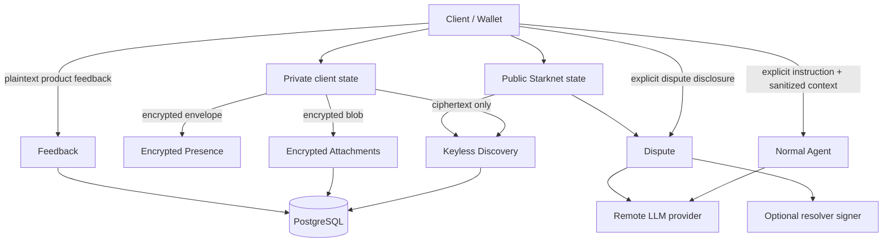
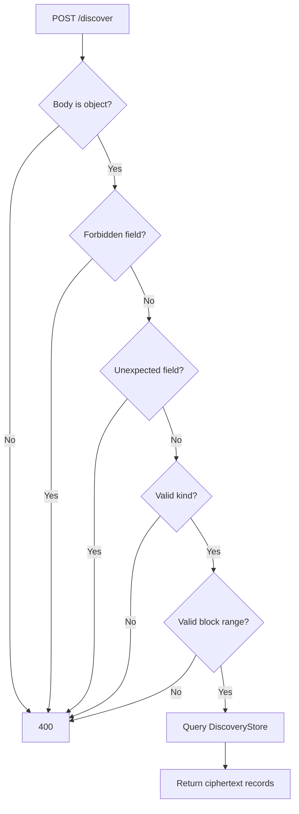
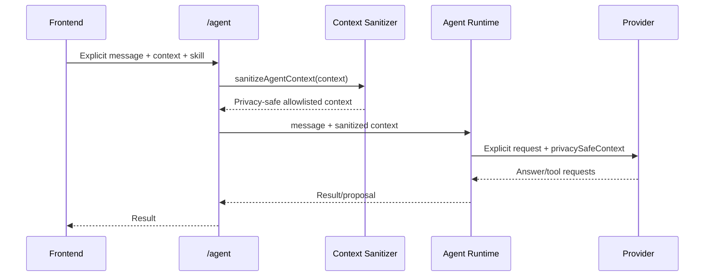
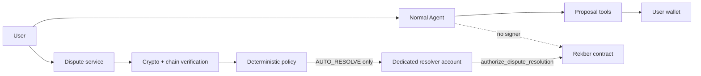
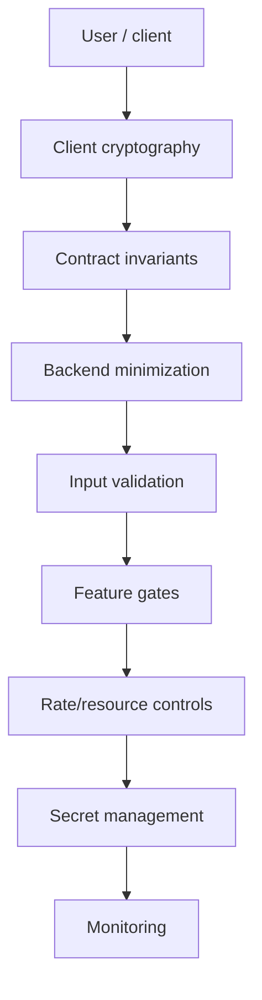
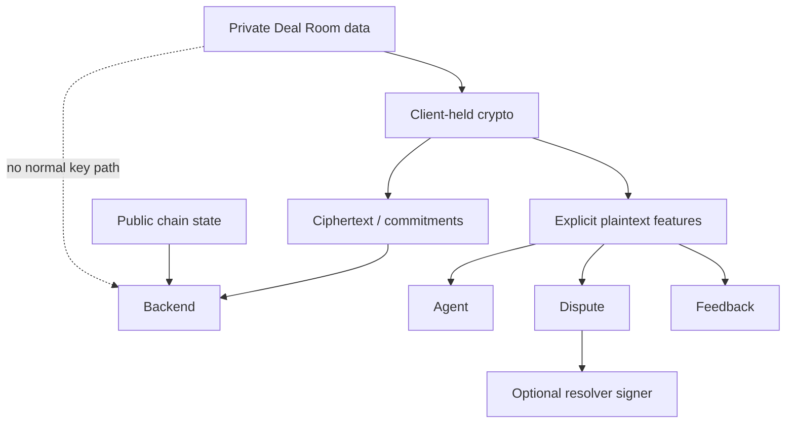

# VINSS Backend Privacy & Security

This document describes the current privacy and security boundaries of the VINSS backend.

The core design objective is:

> Keep the backend operationally useful without making it a normal decryption authority for private Deal Room content.

That objective applies most strongly to:

```text
Message discovery

Offer discovery

Private Escrow coordination discovery

Presence relay

encrypted attachment storage

normal Agent context
```

It does **not** mean:

```text
the backend never receives plaintext of any kind
```

because some application features intentionally operate on explicit plaintext.

Current examples:

```text
Feedback comments

explicit Agent user instructions

dedicated Dispute terms/statements/evidence
```

The correct security model therefore separates:

```text
core private transport

explicit plaintext application features

public on-chain settlement state

optional privileged backend authority
```

---

# Security Objective

The backend should minimize the amount of private Deal Room knowledge required to operate VINSS.

For the normal private-room path, the backend should not need:

```text
room secret

channel key

pairwise key

viewing key

Message plaintext

Offer plaintext

private coordination plaintext

decrypted room history
```

---

# Security Non-Goal

VINSS does not claim:

```text
metadata-free blockchain usage

anonymous network transport

private public-chain transaction metadata

zero trust in hosting infrastructure

zero trust in external LLM providers

zero server plaintext across every optional feature
```

---

# Security Boundary Map



---

# Four Data Classes

For security review, classify backend data into four classes.

---

# Class A — Private Client Secrets

These should not enter the normal backend path.

Examples:

```text
roomSecret

channelKey

pairwise encryption key

wallet private key

seed phrase

resolver private key on client

viewing key

Message plaintext

Offer plaintext terms

decrypted private history
```

---

# Class B — Opaque Encrypted Application Data

Backend can receive/store these without understanding plaintext semantics.

Examples:

```text
Message ciphertext chunks

Offer ciphertext chunks

Private Escrow coordination ciphertext chunks

Presence ciphertext

attachment ciphertext
```

---

# Class C — Public Chain Metadata

Backend can index/read these because they are already public.

Examples:

```text
contract address

block number

transaction hash

action locator

payload commitment

opaque routing tags

Rekber custody commitment

Rekber token/amount

Rekber lifecycle event

Settlement Certificate recipient

Certificate token ID
```

---

# Class D — Explicit Application Plaintext

Backend may receive these in deliberately plaintext workflows.

Examples:

```text
Agent user instruction

Feedback rating/comment

Dispute accepted terms

Dispute statements

Dispute evidence

Dispute wallet addresses

Dispute signatures
```

---

# Security Rule by Class

```text
Class A
    -> reject / never request in normal backend flow

Class B
    -> store/relay without decrypting

Class C
    -> treat as public but still minimize unnecessary correlation/logging

Class D
    -> accept only where product intentionally requires it,
       sanitize,
       scope,
       limit,
       avoid unnecessary logging/retention
```

---

# Core Privacy Claim

Accurate:

> VINSS Discovery does not require Deal Room decryption keys and does not decrypt Message, Offer, or Private Escrow payloads.

Also accurate:

> Presence and encrypted attachments are opaque relay/storage paths.

Also accurate:

> Normal Agent automatic context is rebuilt from a privacy-safe allowlist.

Not accurate:

> The VINSS backend never receives plaintext.

---

# Core Discovery Boundary

Current Discovery supports exactly:

```text
message

offer

escrow
```

where:

```text
escrow
=
Private Escrow coordination
```

not:

```text
public Rekber custody lifecycle
```

---

# Discovery Request Allowlist

Current allowed request fields are exactly:

```text
kind

fromBlock

toBlock
```

---

# Explicitly Forbidden Discovery Fields

Current route explicitly rejects:

```text
roomId

roomSecret

channelKey

channelKeyHex

viewingKey

viewingKeyHex

decryptionKey

plaintext
```

---

# Unknown Discovery Fields

The route also rejects any top-level field not in the allowlist.

Therefore Discovery has both:

```text
explicit privacy field denial
+
strict request-field allowlist
```

---

# Discovery Validation Flow



---

# Discovery Is Not a Decryption API

Current request does not accept:

```text
room membership proof

wallet address

room ID

decryption key

recipient secret
```

to produce plaintext.

---

# Discovery Response

Backend returns public encrypted action data such as:

```text
actionLocator

payloadCommitment

senderTag

recipientTag

ciphertextChunks

blockNumber

transactionHash
```

---

# Discovery Does Not Decide Recipient Identity

Backend does not answer:

```text
This ciphertext belongs to Alice.

This Offer is for Bob.

This room belongs to wallet X.
```

---

# Client-Side Responsibility

The client performs:

```text
candidate matching

routing-tag interpretation

decryption

semantic parsing

user-facing attribution
```

---

# No Transaction-Sender Attribution

Discovery event ingestion is driven by:

```text
configured helper address

event selector

event keys/data

action locator
```

not by treating the Starknet transaction sender as the private participant identity.

---

# Event-Level Identity

The encrypted action identity is:

```text
actionLocator
```

from helper event data.

---

# Metadata Caveat

This does not remove metadata.

Backend can still observe:

```text
which helper family emitted an event

when it happened

transaction hash

block number

ciphertext size/chunk count

routing tags

action locator
```

---

# Ciphertext Is Public

Message/Offer/Private Escrow ciphertext lives in public contract state.

Therefore the security objective is not:

```text
prevent backend from seeing ciphertext
```

but:

```text
prevent backend from receiving the secret needed to decrypt it
```

---

# Persistent Discovery Storage

Discovery records are stored in PostgreSQL.

Current stored fields include public encrypted metadata and ciphertext.

---

# Discovery Store Should Not Contain

Current privacy regression checks enforce that Discovery persistence does not introduce fields such as:

```text
room_id

room_secret

plaintext
```

---

# Discovery Indexer Has No Decryption Path

Current privacy regression script checks the indexer source does not contain common decryption operations.

---

# Persistent Cache Is Not a Privacy Violation by Itself

The database contains data already available from public helper contracts:

```text
ciphertext

commitments

routing metadata

chain metadata
```

The privacy boundary remains key secrecy.

---

# Database Compromise — Discovery Impact

If Discovery database contents leak, an attacker can gain:

```text
indexed ciphertext

routing tags

action locators

commitments

block/tx metadata
```

---

# Database Compromise — Discovery Should Not Directly Reveal

Assuming other secrets remain secure:

```text
Message plaintext

Offer terms

room secret

pairwise key
```

---

# Discovery Privacy Regression Tests

Current canonical backend `npm test` includes a separate privacy-boundary script.

The script verifies properties such as:

```text
DiscoverRequest has no channelKeyHex field

backend Discovery route does not decrypt

indexer source does not contain decryption logic

persistent Discovery does not store roomId

persistent Discovery does not store roomSecret

persistent Discovery does not store plaintext

frontend Message discovery does not send channelKeyHex

frontend Offer discovery does not send channelKeyHex

frontend Message decrypts locally

frontend Offer decrypts locally
```

---

# Security Test Value

These tests encode architecture expectations across:

```text
frontend

backend

contracts
```

rather than relying only on comments.

---

# Test Limitation

Static/source assertions are valuable but cannot prove every runtime deployment property.

They do not automatically prove:

```text
hosting platform never logs bodies

future dependency never captures secrets

production proxy configuration is safe

browser extension is uncompromised
```

---

# Presence Privacy Boundary

Presence backend stores:

```text
channelId

eventId

iv

ciphertext

createdAt

expiresAt
```

---

# Presence Does Not Receive

Normal current client transport does not send:

```text
pairwise key

room ID

senderAddress plaintext

typing state plaintext

messageLocator plaintext
```

---

# Presence Channel ID

Current frontend derives a 64-character lowercase hex relay ID using:

```text
HMAC-SHA256
```

with the pairwise key.

---

# Presence Payload Encryption

Current frontend uses:

```text
AES-GCM
```

with a fresh:

```text
96-bit IV
```

per encrypted Presence payload.

---

# Presence Security Property

Backend can group events by:

```text
channelId
```

but cannot derive the pairwise key from the channel ID under the intended cryptographic assumption.

---

# Presence Metadata Exposure

Backend can correlate:

```text
events sharing one channelId

request timing

TTL

ciphertext length

event count
```

---

# Presence Is Not Anonymous

Hosting infrastructure can still observe network metadata such as:

```text
IP address

connection timing
```

depending on platform logs.

---

# Presence Publisher Authentication

Current Presence does not require:

```text
wallet signature

authenticated session

room-membership proof
```

---

# Presence Security Model

It relies primarily on:

```text
secret-derived channel ID

authenticated ciphertext

short TTL

bounded records/channel
```

---

# Channel ID Leakage

If a Presence channel ID leaks, a third party can potentially:

```text
poll opaque records

publish opaque records

consume the per-channel event cap
```

---

# What Channel ID Leakage Does Not Automatically Give

Without the encryption key:

```text
valid plaintext decryption
```

should remain unavailable.

---

# Presence Is Not Canonical Evidence

Do not use Presence as proof of:

```text
wallet identity

agreement

settlement authorization

message delivery

legal receipt

dispute truth
```

---

# Attachment Privacy Boundary

Encrypted attachments use:

```text
PUT /attachments/:id

GET /attachments/:id
```

---

# Attachment Storage

Backend stores:

```text
attachment ID

SHA-256 token hash

ciphertext bytes

createdAt
```

---

# Attachment Capability Token

Client supplies:

```text
x-vinss-attachment-token
```

---

# Token Length

Current accepted token length:

```text
32..256 characters
```

after trimming.

---

# Token Persistence

Backend stores only:

```text
SHA-256(token)
```

not the plaintext token.

---

# Token Comparison

Current backend uses:

```text
timingSafeEqual
```

for equal-length token hash comparison.

---

# Wrong Token Privacy Behavior

Wrong valid-format token returns:

```text
404 Attachment not found
```

same as a missing object.

---

# Why

This reduces object-existence disclosure to unauthorized callers.

---

# Attachment ID

The ID must match UUID-v4 form.

It is client-supplied.

---

# Attachment Encryption Assumption

Backend does not decrypt uploaded bytes.

However it also cannot prove the bytes are actually encrypted.

---

# Accurate Claim

```text
backend stores the bytes as opaque ciphertext by design
```

---

# Too-Strong Claim

```text
backend cryptographically guarantees every uploaded attachment is encrypted
```

The client is responsible for encryption correctness.

---

# Attachment Size

Maximum current raw upload:

```text
20 MiB
```

---

# Attachment Security Limitation

Attachment routes do not currently have their own application fixed-window rate limiter.

---

# Attachment Logging

Current download route logs:

```text
attachment ID

HTTP status
```

---

# Attachment Log Does Not Intentionally Include

```text
capability token

ciphertext bytes
```

---

# Attachment ID Metadata

The ID is not a decryption secret but is still correlation metadata.

Avoid unnecessary replication into external telemetry.

---

# Attachment Capability Compromise

If a token leaks, the holder can access the associated encrypted blob.

---

# Encryption Still Matters

Even a leaked attachment capability should not reveal plaintext if:

```text
attachment encryption key remains secret
```

and ciphertext is correctly encrypted.

---

# No In-Place Capability Rotation

Current attachment API has no mutation for replacing the stored token hash.

Recovery from a leaked capability can require:

```text
new attachment ID

new token

re-upload ciphertext

update client references
```

---

# Normal Agent Privacy Boundary

Normal Agent is optional and feature-gated.

---

# Agent Route Exposure

Current public Agent route supports:

```text
chat

offer

escrow
```

---

# Public Agent Does Not Accept Dispute Skill

Although an internal Dispute skill exists in the registry, public `/agent` validation rejects:

```text
dispute
```

---

# Why

Dispute has a separate explicit plaintext disclosure route and trust model.

---

# Agent User Instruction Is Explicit Plaintext

Current Agent request includes:

```text
message
```

as the user's explicit instruction.

That string is sent to a configured remote provider.

---

# Important Privacy Meaning

The Agent is not:

```text
zero plaintext
```

It is:

```text
explicit user instruction
+
sanitized automatic context
```

---

# Automatic Context Sanitizer

`sanitizeAgentContext(...)` rebuilds context from a narrow allowlist.

---

# Timeline Limit

At most:

```text
50
```

timeline items are retained.

---

# Timeline Summary Replacement

Automatic timeline summary becomes one of:

```text
Encrypted private message

Encrypted Offer action

Encrypted escrow action

Encrypted private activity
```

---

# Timeline Fields Preserved

Only bounded values such as:

```text
sentAt

actionLocator
```

may survive.

---

# Latest Offer Context

For automatic context, latest Offer is reduced to:

```text
actionLocator
```

when available.

---

# Fields Intentionally Dropped

Examples:

```text
roomLabel

Offer asset

Offer amount

payment terms

conditions

participant data

arbitrary addresses

private timeline summary

keys

secrets
```

---

# Sanitizer Is an Allowlist

It does not attempt to redact a few known bad words while preserving everything else.

It constructs a new safe context.

---

# Security Benefit

Unexpected new fields in caller context are dropped unless sanitizer code is explicitly updated to preserve them.

---

# Sanitizer Maintenance Risk

If future developers add new desired context fields, they must consciously decide whether they are safe for remote providers.

---

# Agent Context Data Flow



---

# Agent Response `contextShared`

Current route responds with:

```text
contextShared: true
```

---

# Meaning

This means:

```text
the explicit instruction
+
sanitized Agent context
```

were shared with the remote reasoning path.

It does not mean:

```text
the full encrypted room was decrypted server-side
```

---

# Agent Tool Definitions

Normal generic tools currently include:

```text
inspect_deal_state

analyze_offer

draft_message

draft_offer

draft_counter_offer

prepare_escrow

review_rekber

calculate_fee
```

---

# Normal Agent Has No Generic Signer Tool

There is no generic tool such as:

```text
sign_transaction

send_transaction

deposit

release

refund

authorize_resolution
```

---

# Proposal Safety

Agent proposals are defined with:

```text
requiresApproval: true
```

---

# Examples

```text
draft_message

draft_offer

draft_counter_offer

prepare_escrow

review_rekber
```

---

# `prepare_escrow` Authority

It creates a proposal.

Its own description states:

```text
No funds will move until wallet approval.
```

---

# Skill-Level Tool Restriction

Each skill defines:

```text
allowedTools
```

---

# Prompt-Level Restriction

The system prompt lists allowed tools and declares others forbidden.

---

# Code-Level Restriction

Runtime also checks:

```text
if (!skill.allowedTools.includes(name))
    throw
```

---

# Why Code Enforcement Matters

Prompt instructions alone are not a security boundary.

Tool authority is constrained in executable code.

---

# Tool Definition Filtering

The runtime also filters the actual tool definitions sent to a provider to only those allowed by the selected skill.

---

# Defense in Depth

Therefore tool scope has two code layers:

```text
provider receives only allowed tool definitions

runtime rejects disallowed tool execution anyway
```

---

# Agent Provider Failure Logging

Raw provider errors are not logged.

Current log contains only:

```text
provider ID
```

---

# Reason

Provider error content may echo:

```text
user prompt

provider request data
```

---

# Security Rule

Do not change this to:

```text
console.error(error)
```

without privacy review.

---

# Agent Provider Fallback

If multiple providers are configured as fallbacks, the same explicit request may be attempted against multiple providers.

---

# Privacy Trade-Off

Fallback improves availability but broadens external disclosure scope.

---

# Provider Selection Is Data Governance

When configuring:

```text
VINSS_LLM_PROVIDER

VINSS_LLM_FALLBACKS
```

the operator is also deciding:

```text
which external companies may receive explicit Agent requests
```

---

# Agent API Keys

Provider credentials remain server-side.

They must never appear in:

```text
NEXT_PUBLIC_*

frontend bundles

client requests

browser storage
```

---

# Agent Privacy Regression Checks

Current privacy script verifies properties including:

```text
frontend does not reference GROQ_API_KEY

Agent policy prohibits transaction signing/sending

Agent policy references viewing-key restrictions

skill runtime contains code-level tool enforcement

frontend prepares privacySafeTimeline

room label is not sent automatically
```

---

# Dedicated Dispute Boundary

Dispute is intentionally different from normal Agent.

---

# Dispute Route Exposure

Dispute routes are mounted only when:

```text
AGENT_ENABLED=true
```

because current app groups Agent and Dispute exposure under one feature flag.

---

# Dispute Routes

```text
POST /dispute/challenge

POST /dispute/evaluate
```

---

# Dispute Receives Plaintext

The dedicated Dispute flow explicitly receives and sanitizes fields including:

```text
custody commitment

verification class

principal asset/raw amount

accepted terms

deal summary

obligations

completion criteria

fulfillment metadata

payer wallet address

payee wallet address

payer statement

payee statement

evidence items

submitted timestamps

on-chain snapshot claims
```

---

# Evidence Types

Current accepted normalized evidence types include:

```text
statement

attachment

transaction

tracking

test

other
```

---

# Evidence Count Bound

Each party is limited to:

```text
20
```

evidence items by sanitizer slicing.

---

# Evidence Text Bound

Evidence values and large textual fields are bounded to:

```text
8,000 characters
```

per relevant field.

---

# Short Field Bound

Short dispute fields are bounded to:

```text
160 characters
```

where current sanitizer uses the short bound.

---

# Obligations Bound

Accepted terms keep at most:

```text
20 obligations

20 completion criteria
```

---

# Consent Requirement

Each party packet must contain:

```text
consentToAgentReview = true
```

---

# Security Meaning

The Dispute plaintext boundary is explicit, not automatic extraction from private Deal Room history.

---

# Unknown Dispute Fields

The Dispute case sanitizer reconstructs a known object.

Unknown fields such as:

```text
roomSecret

channelKey

private keys

unrelated chat fields
```

are not preserved in the sanitized dispute case.

---

# Important Limitation

Even if unknown keys are discarded by application sanitizer, the original HTTP request still reached backend infrastructure.

Clients should not send secrets merely because the sanitizer ignores them.

---

# Stronger Future Hardening

A strict top-level request allowlist can further reduce accidental submission of unrelated secrets.

---

# Dispute Case Commitment

Backend computes a deterministic SHA-256 commitment over the canonicalized sanitized dispute case.

---

# Why

It gives both parties and policy logic an identity for the exact combined case being reviewed.

---

# Dispute Felt Commitment

For Starknet typed data, the SHA-256 case commitment is reduced into the Starknet field.

---

# Attestation Meaning

Current typed-data comment defines signing as:

> Consent to submit this exact combined dispute case to the VINSS Dispute Agent for review.

It explicitly does **not** mean:

```text
the signer agrees with the counterparty's factual claims
```

---

# Dispute Typed Data Domain

Current domain:

```text
name = VINSS Dispute

version = 1

revision = 1

chainId = configured Starknet chain
```

---

# Dispute Attestation Message

Includes:

```text
Case

Custody

Role

Wallet

Consent = Arbitrate

Execution = AutoSplit
```

---

# Both Parties Sign

Backend expects:

```text
payer signature

payee signature
```

---

# Signature Bounds

Each signature array must contain:

```text
2..16
```

felt strings.

---

# Signature Validation

Each felt must be:

```text
0x-prefixed hexadecimal
```

and is normalized.

---

# Signature Verification

Backend verifies each typed-data signature against the declared wallet using Starknet signature verification.

---

# Signatures Prove

They prove:

```text
the declared wallet signed the exact attestation typed data
```

assuming Starknet account verification correctness.

---

# Signatures Do Not Prove

They do not prove:

```text
every factual evidence claim is objectively true
```

---

# Original Rekber Binding

Dispute additionally requires the original Rekber setup and acceptance binding data.

---

# Why

The backend must not trust arbitrary:

```text
payer address

payee address

private terms commitment

capability commitments
```

provided by a browser.

---

# Original Agreement Signatures

During Dispute only, both clients explicitly disclose their original Agreement signatures/binding data.

---

# Rekber Binding Domain

Current typed-data domain uses:

```text
name = VINSS Rekber

version = 3

revision = 1
```

---

# Binding Verification

Backend compares supplied binding commitments against live public Rekber custody state.

Examples include:

```text
custody commitment

release authorization commitment

claim commitment

refund commitment

payer confirmation commitment

payer/payee dispute commitments

refund consent commitment

fulfillment chain

revision chain

certificate commitments

fulfillment deadline
```

---

# Security Goal

Prove that the wallets submitting the dispute are the parties bound to the exact Rekber Agreement and capability commitments.

---

# Browser State Is Not Trusted for AutoResolve

Current route comment states it re-reads every authority at execution time.

It does not trust browser claims for:

```text
wallet identity

custody lifecycle

verified principal USD value
```

when determining automatic execution.

---

# Live Custody Read

Before evaluation, backend reads and verifies canonical Rekber custody.

---

# Principal Value

When available, principal USD value is derived through a verified backend chain/price path rather than trusting the browser-supplied `usdMicros` as automatic-resolution authority.

---

# Dispute Agent

After cryptographic verification, sanitized Dispute case can be evaluated through the Dispute Agent.

---

# Untrusted Evidence Rule

Evidence is still treated as untrusted input.

Signatures prove submission/consent, not objective truth.

---

# Deterministic Policy Gate

The LLM result does not directly call a signer.

A deterministic policy layer determines whether status is:

```text
AUTO_RESOLVE

NEEDS_REVIEW

REJECTED
```

---

# Privileged Executor

Only if:

```text
policy.status = AUTO_RESOLVE
```

does the route call:

```text
authorizeDisputeResolution(...)
```

---

# AutoResolve Feature Flag

Even then:

```text
DISPUTE_AUTO_RESOLVE_ENABLED
```

must be enabled.

---

# Default AutoResolve

Current default:

```text
false
```

---

# Resolver Configuration

When AutoResolve is enabled, startup requires:

```text
DISPUTE_RESOLVER_ADDRESS

DISPUTE_RESOLVER_PRIVATE_KEY
```

---

# Resolver Private Key Validation

Current config checks:

```text
0x-prefixed hexadecimal
```

format.

---

# Important Precision

Config does not prove the private key mathematically corresponds to the configured resolver address during load.

Actual transaction/account behavior later provides stronger operational evidence.

---

# Resolver Contract Match

Before signing, executor reads:

```text
get_dispute_resolver
```

from the configured Rekber contract.

---

# Mismatch Behavior

If backend resolver address does not match the Rekber resolver:

```text
execution throws
```

---

# Existing Resolution Check

Executor reads current Rekber custody before submitting.

If resolution is already authorized:

```text
status = already_authorized
```

---

# Resolution Amounts

The executor computes:

```text
payerAmount

payeeAmount
```

from verified principal and policy BPS.

---

# Exact Remainder Rule

Payer amount uses integer division.

Payee receives:

```text
principal - payerAmount
```

so no principal unit is lost to rounding.

---

# Resolver Write Scope

Dedicated executor only calls:

```text
authorize_dispute_resolution
```

for the exact computed split.

---

# Normal Agent vs Dispute Executor



---

# Security Interpretation

Normal Agent:

```text
proposal-only
no transaction signer
```

Dispute executor:

```text
optional privileged signer
narrow contract action
policy-gated
cryptographically verified
```

---

# Resolver Key Is High-Risk

This is the highest-impact optional backend secret.

Compromise can affect settlement authorization.

---

# Operational Rule

Keep:

```text
DISPUTE_AUTO_RESOLVE_ENABLED=false
```

unless the resolver path is intentionally productionized.

---

# Resolver Key Handling

Never:

```text
commit it

log it

place it in frontend env

paste it into incident channels

include it in screenshots
```

---

# Resolver Key Incident

If exposed:

```text
disable AutoResolve immediately

audit resolver transactions

assess on-chain resolver migration/contract implications
```

---

# Dispute Logging Boundary

Current evaluate catch block explicitly avoids logging:

```text
evidence

signatures

resolver credentials
```

---

# Client Error Caveat

Current Dispute routes return:

```text
error.message
```

to the caller with HTTP 400 for broad failure classes.

---

# Security Consequence

Even if server logs are quiet, client-side telemetry can capture those error messages.

Error content should remain bounded and reviewed.

---

# Feedback Privacy Boundary

Feedback is deliberately plaintext application data.

---

# Feedback Fields

Current route accepts:

```text
outcome

role

dealType

network

rating

comment
```

---

# Feedback Comment Limit

Maximum:

```text
2,000 characters
```

---

# Feedback Storage

Stored in PostgreSQL table:

```text
vinss_feedback
```

---

# Feedback Is Not Encrypted by Application

The comment is stored as plaintext application data.

---

# Feedback Email

If:

```text
RESEND_API_KEY
```

is configured, the backend also sends feedback content to Resend.

---

# Email Content

Includes:

```text
outcome

role

deal type

rating

network

time

comment
```

---

# Important Security Meaning

Feedback privacy is not equivalent to Deal Room privacy.

Users should not place:

```text
room secret

private keys

private deal secrets
```

inside feedback.

---

# Feedback Email Is Best-Effort

Database storage happens first.

Email failure does not roll back stored feedback.

---

# Feedback Abuse Protection

Current route is rate-limited:

```text
5 requests / 60 seconds
```

per current application instance/IP identity model.

---

# Feedback Identity

The route does not authenticate the sender wallet.

Therefore feedback is:

```text
product input
```

not:

```text
verified settlement testimony
```

---

# Logging Boundary

Global request logging currently records only:

```text
METHOD PATH
```

---

# Request Body Exclusion

Application source explicitly says:

```text
Request bodies are intentionally never logged.
```

---

# Query String Behavior

Global logger uses:

```text
req.path
```

so ordinary query strings are not included.

---

# Path Parameter Caveat

Path identifiers can still appear.

Examples:

```text
/royalty/0xabc

/attachments/<uuid>
```

---

# Server Logs Should Never Include

```text
roomSecret

channelKey

pairwise key

viewing key

wallet private key

resolver private key

provider API key

attachment capability token

Message plaintext

Offer plaintext

decrypted history

Dispute evidence

raw provider error
```

---

# Provider Error Logging

Current Agent orchestrator intentionally logs only:

```text
provider ID
```

on provider failure.

---

# Database Error Logging

Current PostgreSQL pool error handler logs only:

```text
[database] unexpected idle client error
```

---

# It Does Not Intentionally Print

```text
DATABASE_URL

username

password

host
```

---

# Discovery Error Logging

Current route logs only:

```text
[discover] indexed lookup failed
```

on internal lookup failure.

---

# Attachment Error Logging

Upload/download failures use generic fixed messages.

---

# Attachment GET Metadata

Current attachment GET completion log includes:

```text
attachment ID

status code
```

---

# Feedback Logs

Feedback logs:

```text
storage failure

email provider success/failure status
```

not the comment text.

---

# Hosting Logging Boundary

Application logging policy cannot guarantee:

```text
Railway

reverse proxy

APM

browser analytics

external provider dashboards
```

do not capture additional data.

---

# Production Requirement

Review external logging settings.

---

# Avoid Debug Body Logging

Never introduce:

```ts
console.log(req.body)
```

as a production debugging shortcut.

---

# Safer Debugging Fields

Use:

```text
route

status

error class

checkpoint identity

public transaction hash

field name without value
```

---

# Rate Limiting

Current fixed-window limiter uses:

```text
req.ip
```

or:

```text
socket.remoteAddress
```

---

# Bucket Key

Conceptually:

```text
<scope>:<IP>
```

---

# Current Rate-Limited Scopes

Application mounts rate limiting for:

```text
discover

agent

dispute

feedback
```

---

# Current Defaults

Central default:

```text
RATE_LIMIT_WINDOW_MS = 60000

DISCOVER_RATE_LIMIT = 120

AGENT_RATE_LIMIT = 12
```

Feedback separately uses:

```text
5 / 60 seconds
```

---

# Rate Limit Response Headers

```text
RateLimit-Limit

RateLimit-Remaining

RateLimit-Reset
```

---

# Blocked Response

Adds:

```text
Retry-After
```

and returns:

```text
429
```

---

# Rate Limiter Limitation

Buckets exist in process memory.

---

# Consequences

Restart:

```text
clears rate-limit history
```

Multiple replicas:

```text
have independent limits
```

---

# Security Interpretation

Rate limiting reduces abuse.

It is not:

```text
authentication

authorization

distributed DDoS protection
```

---

# Mainnet Proxy Trust

On mainnet current app sets:

```text
trust proxy = 1
```

---

# Security Assumption

Deployment is expected behind one managed reverse proxy.

---

# Risk

If proxy topology differs, client IP interpretation can be wrong and affect:

```text
rate limiting
```

---

# CORS

Backend uses configured:

```text
CORS_ORIGIN
```

---

# Mainnet CORS Rule

For:

```text
STARKNET_NETWORK=mainnet
```

origin must use:

```text
https
```

---

# CORS Security Meaning

CORS controls browser cross-origin access.

It is **not** server authentication.

---

# Direct Clients

Non-browser HTTP clients are not prevented from requesting public APIs merely because CORS is restrictive.

---

# Configuration Fail-Closed Improvements

Current config requires explicit:

```text
STARKNET_NETWORK

RPC_URL

DATABASE_URL
```

---

# Required Contract Addresses

```text
PRIVACY_POOL_ADDRESS

MESSAGE_HELPER_ADDRESS

OFFER_HELPER_ADDRESS

PRIVATE_ESCROW_HELPER_ADDRESS

ESCROW_REKBER_ADDRESS

SETTLEMENT_CERTIFICATE_ADDRESS
```

---

# Required Start Blocks

```text
MESSAGE_HELPER_START_BLOCK

OFFER_HELPER_START_BLOCK

PRIVATE_ESCROW_HELPER_START_BLOCK

ESCROW_REKBER_START_BLOCK

SETTLEMENT_CERTIFICATE_START_BLOCK
```

---

# Address Validation

Current config requires addresses to be:

```text
0x-prefixed hex

nonzero

< 2^251
```

---

# Address Canonicalization

Addresses are normalized via BigInt to lowercase unpadded hex.

---

# Security Benefit

Missing/zero malformed contract addresses fail startup/config parsing.

---

# Semantic Address Limitation

Valid syntax does not prove:

```text
correct contract

correct class hash

correct deployment

correct network
```

---

# Mainnet RPC String Guard

Current mainnet config rejects RPC identity strings containing:

```text
sepolia

goerli

testnet
```

---

# Important Limitation

This is string-based.

It does not query:

```text
starknet_chainId
```

during config load.

---

# Security Requirement

Operational deployment must independently verify chain identity.

---

# Feature Defaults

Current default:

```text
AGENT_ENABLED =
    false on mainnet
    true on Sepolia
```

unless explicitly configured.

---

# Legacy Loyalty Default

```text
LOYALTY_ENABLED=false
```

on both networks unless enabled.

---

# AutoResolve Default

```text
DISPUTE_AUTO_RESOLVE_ENABLED=false
```

---

# Conservative Mainnet Posture

```text
AGENT_ENABLED=false

LOYALTY_ENABLED=false

DISPUTE_AUTO_RESOLVE_ENABLED=false
```

minimizes optional backend authority.

---

# Database Security

Backend requires:

```text
DATABASE_URL
```

---

# Database SSL Option

If:

```text
DATABASE_SSL=true
```

current `pg` config uses:

```text
rejectUnauthorized: false
```

---

# Accurate Description

This requests TLS transport but does not enforce strict CA/server certificate validation from the Node client.

---

# Security Limitation

Do not describe current mode as:

```text
strictly certificate-authenticated PostgreSQL TLS
```

---

# Future Hardening

Support:

```text
trusted CA bundle

rejectUnauthorized=true

provider-specific certificate policy
```

where deployment environment supports it.

---

# DB Pool

Current max:

```text
10 connections/process
```

---

# Multi-Replica Implication

Replica count multiplies possible DB connections.

---

# Database Credentials

`DATABASE_URL` can contain:

```text
username

password

host
```

---

# Never Log Full URL

Current database code intentionally avoids it.

---

# Database Contains Mixed Privacy Classes

PostgreSQL may contain:

```text
public encrypted Discovery data

public Rekber events

public Certificate events

encrypted attachment blobs

plaintext Feedback
```

---

# Therefore

Database backups are not:

```text
ciphertext-only
```

because Feedback is plaintext.

---

# Backup Security

Treat backups as sensitive.

---

# At-Rest Encryption

Backend source does not implement field-level encryption for Feedback.

At-rest encryption depends on database/platform capabilities.

---

# Public Rekber Security Boundary

Rekber lifecycle is public on-chain settlement state.

---

# Backend Indexing Is Read Model

Backend stores public lifecycle events:

```text
funded

released

refunded

resolved
```

---

# Backend Database Is Not Settlement Authority

If PostgreSQL and Starknet disagree:

```text
Starknet contract state wins
```

---

# Editing DB Cannot Move Funds

Changing:

```text
rekber_events

activity rows

checkpoint rows
```

does not alter Rekber custody.

---

# Public Rekber Metadata

Backend can observe:

```text
custody commitment

token

amount

refundAfter

output note ID

resolution commitment

resolution split

timestamps
```

---

# Privacy Meaning

VINSS settlement privacy does not hide all financial metadata from the public chain.

---

# Private Escrow vs Rekber

Do not confuse:

```text
Private Escrow coordination
```

with:

```text
Rekber custody
```

---

# Private Escrow Coordination

Encrypted/keyless Discovery path.

---

# Rekber Custody

Public financial state/event path.

---

# Settlement Certificate Security Boundary

Settlement Certificate is an optional public credential.

---

# Public Fields

Backend index can observe:

```text
token ID

recipient

custody commitment

role

settledAt

issuedAt
```

---

# Certificate Is Non-Private by Design

Claiming a Certificate creates a public linkage.

---

# Backend Does Not Mint for User

Certificate claim occurs through the contract/wallet path.

---

# Royalty Security Boundary

Royalty is:

```text
read-only
```

and derived from indexed Settlement Certificate events.

---

# No Client Award API

Client cannot call a Royalty route to create arbitrary points.

---

# Royalty Is Still Application Policy

Point arithmetic is backend logic, not contract-enforced value.

---

# Legacy Loyalty Security Boundary

Legacy Loyalty is separate from Royalty.

---

# Legacy Loyalty Properties

```text
in-memory

client-write

unauthenticated

feature-gated

non-authoritative
```

---

# Main Security Control

Default:

```text
LOYALTY_ENABLED=false
```

---

# Do Not Treat as Valuable Ledger

Client can submit:

```text
subject

action

eventId
```

without wallet proof or chain evidence.

---

# Legacy Loyalty Replay Limitation

Idempotency exists only for the process lifetime.

---

# Security Rule

Do not convert legacy preview balances directly into valuable tokens without verified durable evidence.

---

# External LLM Trust Boundary

Configured providers can include:

```text
Groq

OpenAI

Anthropic

Qwen
```

---

# Data Sent to Provider

Normal Agent can send:

```text
explicit user request

sanitized automatic context
```

---

# Dispute Provider

Dedicated Dispute can send:

```text
sanitized explicit dispute plaintext
```

after consent/binding verification.

---

# Provider Trust Assumptions

VINSS depends on provider handling of:

```text
transport security

retention

access controls

model service availability
```

---

# Minimize Provider Data

Do not send private context just because it may improve model reasoning.

---

# Provider Keys

Treat API keys as server secrets.

---

# Provider Failure

Core Message/Offer/Rekber functionality should remain usable without Agent.

---

# Agent Is Optional

Provider outage is not equivalent to:

```text
custody failure
```

---

# Hosting Trust Boundary

Backend runtime host can access:

```text
environment variables

process memory

database credentials

resolver key if configured

provider keys
```

---

# Host Compromise

A full server compromise is outside the protection offered by keyless Discovery alone.

---

# What Keyless Discovery Still Protects

Even if server is compromised, it should not automatically have:

```text
room keys

Message plaintext

Offer plaintext
```

because those are not required for normal Discovery.

---

# What Server Compromise Can Expose

Potentially:

```text
environment secrets

indexed ciphertext

Feedback plaintext

Dispute plaintext during requests

resolver private key if AutoResolve enabled
```

---

# Security Benefit of AutoResolve Disabled

When disabled:

```text
resolver private key can be absent
```

and backend cannot sign the privileged resolver action.

---

# Secret Inventory

High-risk server secrets can include:

```text
DATABASE_URL credentials

RPC API credential

LLM provider keys

RESEND_API_KEY

DISPUTE_RESOLVER_PRIVATE_KEY
```

---

# Secret Priority

Highest financial-authority secret:

```text
DISPUTE_RESOLVER_PRIVATE_KEY
```

when enabled.

---

# User Wallet Secret

Backend should never receive:

```text
user wallet private key

seed phrase
```

---

# Wallet Signing Boundary

Normal financial actions remain with:

```text
user wallet

Starknet contract
```

---

# Normal Backend Cannot Sign as User

Agent proposals still require wallet/user action.

---

# Dispute Signer Is Not User Wallet

Dedicated resolver key represents:

```text
Rekber resolver authority
```

not payer/payee wallet authority.

---

# STRK20 / Privacy Infrastructure

VINSS backend also trusts external privacy/wallet infrastructure for behavior outside this process.

---

# Backend Does Not Prove Ready Wallet Correctness

Backend cannot guarantee:

```text
wallet extension security

transaction proving correctness

paymaster behavior

user device integrity
```

---

# Frontend Cryptography Boundary

Client-side encryption/decryption code becomes security-critical.

---

# Backend Security Cannot Repair Bad Client Encryption

If frontend accidentally sends plaintext as ciphertext field:

```text
backend may store that supplied data
```

without understanding the mistake.

---

# Attachment Example

Attachment backend cannot prove bytes are encrypted.

---

# Presence Example

Presence backend cannot prove ciphertext is valid AES-GCM.

---

# Discovery Difference

On-chain helpers validate their canonical encrypted envelope/commitment rules during write.

---

# Client Security Requirements

Protect:

```text
room secrets

pairwise keys

wallet sessions

private key material

attachment capabilities
```

---

# Local Storage Risk

If browser/local storage contains encrypted history or secrets, compromise of the client device can bypass backend privacy boundaries.

---

# XSS Risk

A frontend XSS that can access client secrets is particularly dangerous.

Backend keyless design does not protect against compromised browser JavaScript that already has keys.

---

# CSP / Frontend Security

Frontend web security remains a separate security workstream.

---

# Network Transport

Production frontend/backend should use:

```text
HTTPS
```

---

# Mainnet CORS Requires HTTPS Origin

This prevents obvious HTTP production-origin configuration.

---

# Backend URL

Hosting TLS termination must be configured correctly.

---

# Internal HTTP

Backend config permits `RPC_URL` to use:

```text
http

https
```

---

# Security Recommendation

Use HTTPS RPC endpoints for production when supported and trustworthy.

---

# Database Transport

Use database TLS where supported, while recognizing current certificate-verification limitation.

---

# Authentication Model

Many VINSS backend read endpoints are intentionally public.

---

# Public Read APIs

Examples:

```text
/discover

/activity

/rekber/events

/royalty/:address
```

---

# Why

The underlying information is:

```text
public ciphertext

public chain metadata

public certificate-derived data
```

---

# Public Does Not Mean Free From Abuse

High-volume access can still cause:

```text
DB load

bandwidth load

metadata aggregation
```

---

# Rate Limits Are Selective

Not every read endpoint currently has an application limiter.

---

# Current Limiter Coverage

Yes:

```text
/discover

/agent

/dispute

/feedback
```

---

# Not Wrapped by Same Limiter

Current app composition does not wrap:

```text
/activity

/rekber/events

/royalty

/presence

/attachments
```

with the same fixed-window middleware.

---

# Infrastructure Security

Production proxy/hosting should provide additional:

```text
DDoS handling

request limits

connection controls
```

---

# OpenAPI Is Not Security Authority

OpenAPI currently does not fully list all runtime routes.

---

# Security Review Must Use Runtime Source

Do not conclude:

```text
route is not exposed
```

only because Swagger does not show it.

---

# Feature Gate Review

Current runtime route exposure:

```text
Agent + Dispute
    -> AGENT_ENABLED

Legacy Loyalty
    -> LOYALTY_ENABLED

Presence
    -> always mounted

Attachments
    -> always mounted

Feedback
    -> always mounted

Royalty
    -> always mounted
```

---

# Coarse Agent/Dispute Gate

There is no separate:

```text
DISPUTE_ENABLED
```

route exposure flag.

---

# Security Consequence

Enabling normal Agent also mounts Dispute routes.

---

# Mitigation

AutoResolve remains separately controlled by:

```text
DISPUTE_AUTO_RESOLVE_ENABLED
```

---

# Recommended Future Gate

Add separate Dispute route feature flag if operational isolation is needed.

---

# Input Validation Philosophy

Security-sensitive routes should prefer:

```text
allowlists

bounded strings

bounded arrays

typed numeric ranges
```

---

# Discovery Example

Strict allowlist.

---

# Agent Example

Sanitized automatic context.

---

# Dispute Example

Rebuilt explicit case structure.

---

# Presence Limitation

Presence currently ignores unknown top-level fields rather than strictly rejecting them.

---

# Feedback Limitation

Feedback similarly does not use Discovery-style strict top-level rejection.

---

# Security Recommendation

For privacy-sensitive endpoints, strict-body allowlists can reduce accidental secret submission.

---

# JSON Body Limit

Global normal JSON body limit:

```text
1 MiB
```

---

# Security Benefit

Reduces unbounded JSON body memory use.

---

# Dispute Impact

Large evidence-heavy disputes must fit this bound.

---

# Attachments Use Separate Raw Limit

```text
20 MiB
```

---

# Memory Impact

`express.raw` buffers the upload body.

High concurrent uploads can create memory pressure.

---

# No Attachment Streaming

Current implementation is not a streaming object-store design.

---

# Security/Availability Link

Resource exhaustion is a security concern.

---

# Presence Memory

Presence has:

```text
120 events/channel cap
```

---

# Missing Global Presence Cap

No current:

```text
MAX_CHANNELS

MAX_TOTAL_EVENTS
```

---

# Abuse Risk

Many unique channels can consume process memory.

---

# Access-Driven Cleanup

Expired Presence channels are cleaned when accessed, not by global background sweep.

---

# Security Hardening Direction

Consider:

```text
Presence rate limit

global memory bounds

shared TTL store
```

without decryption.

---

# Process-Local Security State

Current process-local state includes:

```text
Presence

Legacy Loyalty

rate-limit buckets
```

---

# Restart Effect

Restart clears them.

---

# Multi-Replica Effect

Replicas do not share them.

---

# Rate Limit Security Consequence

Effective cluster rate can exceed per-process configured limit.

---

# Presence Security Consequence

Publish/poll can land on different replicas.

---

# Indexer Multi-Replica Consequence

Each process starts its own indexers.

There is no documented distributed leader election.

---

# Duplicate Work

Database keys reduce duplicate rows but not:

```text
duplicate RPC load

checkpoint races
```

---

# Recommended Initial Deployment

Single backend replica is operationally simpler until distributed coordination is added.

---

# Reorg Security Boundary

Persistent indexes are read models.

Current indexers do not implement a complete explicit reorg rollback mechanism.

---

# Consequence

Backend DB can temporarily disagree with canonical chain after reorganization.

---

# Settlement Authority

Always verify Rekber canonical state from chain for financial disputes.

---

# Health Security Boundary

`GET /health` reports indexer checkpoint state.

---

# It Does Not Prove

```text
current RPC is reachable

actual chain ID is correct

frontend is secure

Agent provider is secure

resolver account is funded

wallet works
```

---

# Stale-but-Healthy Risk

Latest-block RPC failures can leave previously stored checkpoint status unchanged temporarily.

---

# Operational Monitoring

Monitor:

```text
checkpoint updatedAt

lastIndexedBlock

latestObservedBlock

external chain head

logs
```

---

# Security Incident Priority

Recommended order:

```text
1. Protect private data.

2. Stop privileged resolver authority.

3. Stop wrong-network/wrong-contract operation.

4. Verify canonical chain state.

5. Restore availability.
```

---

# Privacy Incident Examples

```text
room key appears in backend log

Message plaintext reaches provider automatically

Feedback includes leaked private key

Dispute evidence reaches unrelated log sink

attachment token exposed

provider raw error echoes prompt
```

---

# Immediate Privacy Response

```text
stop affected path

disable Agent if relevant

disable AutoResolve if relevant

rotate compromised credential

minimize further copying

review log/provider/email retention

patch

add regression test
```

---

# Wrong-Network Incident

If backend points at wrong chain/contracts:

```text
stop traffic

restore coherent environment

verify chain identity

verify six addresses

verify five start blocks

verify database environment
```

---

# Database Compromise

Assess separately:

```text
Discovery ciphertext exposure

public chain metadata exposure

attachment ciphertext exposure

Feedback plaintext exposure

stored operational metadata
```

---

# Resolver Compromise

Treat as critical.

---

# Agent Provider Compromise

Rotate provider key and assess:

```text
explicit prompts shared

sanitized context shared

provider retention
```

---

# Resend Compromise

Assess:

```text
Feedback emails

provider key abuse
```

---

# RPC Credential Compromise

Rotate credential.

It does not directly reveal room plaintext but can create service cost/availability risk.

---

# CORS Misconfiguration

Can broaden browser-origin access.

It still does not expose a room key that backend does not possess.

---

# Security Headers

Current backend source shown here does not implement a dedicated middleware stack for headers such as:

```text
Helmet

HSTS

CSP
```

---

# Important Scope

Some headers may be set by hosting/proxy/frontend infrastructure.

Do not claim application-level protection unless verified.

---

# Future Hardening

Consider backend-appropriate:

```text
HSTS at edge

secure proxy defaults

response header review
```

---

# CSRF Model

Core backend does not currently use cookie-authenticated user sessions.

---

# Consequence

Traditional cookie CSRF is not the primary model for public read endpoints.

---

# But Browser Writes Exist

Routes such as:

```text
Feedback

Presence publish

Attachment PUT

Agent

Dispute
```

still need abuse/input security even without cookies.

---

# Capability Security

Attachment token acts as a bearer capability.

---

# Capability Rule

Whoever knows the valid token can access the encrypted blob.

---

# Token Entropy

Client should generate cryptographically random high-entropy tokens.

---

# Unsalted SHA-256

Backend hashes token without per-object salt.

---

# Security Context

With strong random 32+ character capability tokens, offline guessing should remain impractical.

Low-entropy human tokens would weaken this model.

---

# Presence Channel Capability

Presence channel ID also behaves partly like a routing capability.

---

# Keep It Opaque

Do not expose real channel IDs unnecessarily in:

```text
logs

analytics

support tickets
```

---

# Public Metadata Minimization

Even public chain fields can become more privacy-sensitive when centralized and indexed.

---

# Examples

```text
transaction timing

wallet certificate history

custody amount history

routing tag repetition
```

---

# Security Principle

Do not duplicate public metadata into every telemetry system merely because it is public.

---

# Activity Aggregation

`GET /activity` makes public metadata easier to query.

---

# Security Meaning

Aggregation increases convenience and potential correlation.

It does not reveal decryption keys.

---

# Royalty Aggregation

`GET /royalty/:address` makes certificate-derived history/points easy to query for an address.

---

# Certificate Choice

Because claim is optional, public identity linkage is a product/user decision.

---

# Agent Fee Tool

`calculate_fee` is advisory application logic.

---

# Security Meaning

Do not use remote Agent fee calculation as authoritative contract fee validation.

---

# Numeric Precision

It uses JavaScript `Number`.

---

# Canonical Financial Invariants

Trust:

```text
on-chain FeePolicy

Rekber contract checks

wallet transaction calldata
```

for protocol financial authority.

---

# Fee Manipulation

Changing:

```text
VINSS_FEE_BPS
```

changes Agent illustrative calculations only.

It does not rewrite on-chain FeePolicy.

---

# Contract Compatibility

Backend assumes configured contracts expose expected:

```text
events

getters

state layouts
```

---

# Config Does Not Verify Class Hash

A wrong-but-valid address may fail later.

---

# Security Hardening

Production startup could verify:

```text
chain ID

class hash

expected getters

expected event ABI
```

---

# Start Block Security

Configured index start block becomes part of checkpoint identity assumptions.

---

# Mismatch Fail-Closed

Persistent store rejects a changed start block for the same index identity.

---

# Benefit

Prevents silent historical range changes.

---

# Operational Cost

Controlled reindex requires explicit action.

---

# No Remote Reindex Admin API

This reduces destructive attack surface.

---

# Backup Security

Backups should be access-controlled.

---

# Backup Contents

Potential:

```text
Feedback plaintext

encrypted attachments

Discovery ciphertext

public settlement metadata
```

---

# Backup Retention

Keep only as long as operationally necessary.

---

# Data Deletion

Current backend has no complete general user-data deletion framework.

---

# Attachment Delete

No current delete endpoint.

---

# Feedback Delete

No current user-facing delete endpoint.

---

# Security/Product Implication

Retention policy must be managed operationally until dedicated workflows exist.

---

# Remote Provider Retention

Provider data handling is external.

---

# Security Requirement

Choose providers/configuration consistent with intended privacy commitments.

---

# Agent Explicit Message

Users should understand that content intentionally typed into Agent request is shared with remote reasoning provider.

---

# Do Not Auto-Fill Private History

Sanitizer protects automatic context, but frontend design should also avoid silently inserting sensitive decrypted text into explicit Agent message.

---

# Dispute Consent

Dispute is intentionally explicit.

---

# Security UX Requirement

Users should understand that Dispute submission discloses case materials to backend/Agent for arbitration review.

---

# Signature Consent Precision

Signing does not equal acceptance of the other party's claims.

---

# Dispute AutoSplit Precision

Attestation includes:

```text
Execution = AutoSplit
```

which represents consent to the configured dispute execution model for the exact case.

---

# On-Chain Resolver Security

Contract-side resolver checks remain critical.

---

# Backend Policy Is Not Enough

A compromised backend should still face contract invariants around authorized resolver action.

---

# Exact Scope

Resolver cannot arbitrarily call every user-wallet operation through this executor.

---

# Account Key Scope

Dedicated account is instantiated only for resolver operation in current executor.

---

# No Normal Agent Signer

Preserve this separation.

---

# Security Testing Layers

Security should be tested at:

```text
unit

route

cross-layer source regression

Sepolia E2E

deployment smoke

two-wallet E2E
```

---

# Unit/Route Tests

Examples:

```text
Agent tool restrictions

Dispute attestation

Dispute policy

resolver executor

indexer storage behavior
```

---

# Cross-Layer Privacy Script

Current `npm test` executes:

```text
tests/*.test.ts

then

../scripts/test-privacy-boundaries.mjs
```

---

# Deployment Privacy Smoke

Useful:

```text
/discover rejects channelKeyHex

logs do not show request bodies

Agent provider list is feature-aware

AutoResolve disabled unless intended
```

---

# Full Product Security Test

Requires:

```text
real frontend crypto

wallet signatures

Ready/STRK20

Rekber transaction lifecycle
```

---

# Security Claims Must Match Test Scope

Do not say:

```text
privacy fully proven
```

because static regression script passed.

---

# Threat Model — Curious Backend Operator

Goal:

```text
read private Deal Room messages
```

Normal mitigation:

```text
server lacks decryption keys

Discovery contains ciphertext only

Presence contains ciphertext only

automatic Agent context strips private payload semantics
```

---

# Residual Risk

Operator may still access:

```text
Feedback plaintext

Dispute plaintext

public metadata

server secrets
```

depending on feature use.

---

# Threat Model — Database Leak

Goal:

```text
recover private room content
```

Mitigation:

```text
Discovery/attachments remain ciphertext
```

Residual:

```text
Feedback plaintext

metadata correlation

weak client-encrypted attachment risk if client crypto compromised
```

---

# Threat Model — Malicious Discovery Caller

Goal:

```text
send key to server / cause decryption
```

Mitigation:

```text
strict Discovery allowlist rejects key/plaintext fields

no backend decrypt function in indexer path
```

---

# Threat Model — Malicious Agent Prompt

Goal:

```text
gain extra tool authority
```

Mitigation:

```text
skill tool definitions filtered

runtime code checks allowedTools
```

---

# Threat Model — Prompt Injection

A user can try to instruct the model to:

```text
ignore tool restrictions

sign transaction

release funds
```

---

# Mitigation

Prompt cannot create a missing tool or bypass code-level allowlist.

---

# Residual

The model can still produce bad natural-language advice or bad proposals within allowed schema.

User approval and deterministic validation remain important.

---

# Threat Model — Compromised LLM Provider

Provider can see:

```text
explicit Agent prompt

sanitized context

or Dispute plaintext when used
```

---

# Mitigation

Minimize shared data.

Core private messaging does not depend on provider.

---

# Threat Model — Presence Spam

Attacker knows/guesses channel ID and floods unique events.

---

# Existing Mitigation

```text
field bounds

TTL max

120 records/channel
```

---

# Residual

No Presence-specific rate limit/global channel cap.

---

# Threat Model — Attachment Capability Theft

Attacker obtains token.

---

# Mitigation

Stored bytes are intended to be ciphertext.

Wrong-token enumeration is masked by 404.

---

# Residual

Bearer capability allows blob access.

No in-place token rotation.

---

# Threat Model — Resolver Key Theft

Highest-risk optional backend scenario.

---

# Mitigation

```text
AutoResolve default false

dedicated resolver address

contract resolver match

policy gate

live custody verification
```

---

# Residual

If the exact active resolver key is stolen, attacker may be able to use resolver authority according to contract permissions.

---

# Threat Model — Wrong Mainnet Config

Backend points to wrong contracts/RPC.

---

# Mitigation

```text
required network/RPC/address/start-block config

mainnet HTTPS CORS

testnet-looking RPC rejection

start-block checkpoint mismatch fail-closed
```

---

# Residual

Syntax checks do not prove semantic contract identity.

---

# Threat Model — Process Compromise

Attacker controls backend runtime.

---

# Available Assets

Potentially:

```text
environment credentials

DB access

Feedback plaintext

live Dispute plaintext

provider keys

resolver key if configured
```

---

# Still Absent by Design

Normal room decryption keys should still not be resident server-side.

---

# Security Value

Minimizing secrets reduces blast radius.

---

# Least Authority Principle

Each subsystem should have only the authority it requires.

---

# Discovery Authority

```text
read public encrypted data
write index rows
```

---

# Presence Authority

```text
store opaque temporary envelopes
```

---

# Attachment Authority

```text
store/retrieve opaque bytes with capability
```

---

# Normal Agent Authority

```text
reason
draft
propose
```

---

# Dispute Executor Authority

```text
authorize exact policy-approved split
```

---

# User Wallet Authority

```text
normal transaction signing
funding
release/refund actions
certificate claim
```

---

# No Authority Collapse

Do not merge these into one generic backend signer.

---

# Mainnet Security Checklist

```text
[ ] STARKNET_NETWORK is mainnet

[ ] actual RPC chain ID independently verified

[ ] six contract addresses independently verified

[ ] five start blocks verified

[ ] production DB environment verified

[ ] CORS origin is exact HTTPS frontend

[ ] request-body logging reviewed at app + hosting layer

[ ] Discovery privacy negative test passes

[ ] Agent feature state intentional

[ ] Loyalty disabled unless intentionally previewed

[ ] AutoResolve disabled unless fully productionized

[ ] resolver key absent or securely stored

[ ] database backup policy known

[ ] DATABASE_SSL behavior understood

[ ] single/multi-replica consequences understood

[ ] checkpoint freshness monitored
```

---

# Agent Security Checklist

```text
[ ] public skills are chat/offer/escrow

[ ] sanitizer tests pass

[ ] provider credentials server-side only

[ ] fallback providers intentionally approved

[ ] tool allowlists reviewed

[ ] no generic signer added

[ ] requiresApproval proposals preserved

[ ] raw provider errors not logged
```

---

# Dispute Security Checklist

```text
[ ] users explicitly consent

[ ] sanitized case only

[ ] both attestations verified

[ ] original Rekber binding verified

[ ] live custody re-read

[ ] policy gate tested

[ ] AutoResolve flag intentional

[ ] configured resolver matches contract

[ ] resolver key securely stored

[ ] resolver account operational funding understood

[ ] no evidence/signature logs

[ ] every resolver tx monitored
```

---

# Discovery Security Checklist

```text
[ ] forbidden fields rejected

[ ] unexpected fields rejected

[ ] no decryption code

[ ] DB stores no room secret/plaintext

[ ] frontend decrypts locally

[ ] helper addresses/start blocks correct

[ ] checkpoint identity correct

[ ] rate limit enabled
```

---

# Presence Security Checklist

```text
[ ] pairwise key client-only

[ ] channel ID opaque

[ ] payload encrypted client-side

[ ] backend body logs disabled

[ ] no canonical decision depends on Presence

[ ] replica strategy intentional

[ ] memory/rate abuse controls reviewed
```

---

# Attachment Security Checklist

```text
[ ] client encryption verified

[ ] token random/high entropy

[ ] token never logged

[ ] wrong token remains indistinguishable from missing object

[ ] 20 MiB limit understood

[ ] storage retention understood

[ ] capability leak recovery plan exists
```

---

# Feedback Security Checklist

```text
[ ] users told not to submit secrets

[ ] DB access restricted

[ ] Resend configuration intentional

[ ] Feedback email destination correct

[ ] comment not written to app logs

[ ] retention policy understood
```

---

# Logging Security Checklist

```text
[ ] no req.body logging

[ ] no env dump

[ ] no raw provider errors

[ ] no DB URL

[ ] no RPC credential

[ ] no attachment token

[ ] no resolver key

[ ] no Dispute evidence/signatures

[ ] public IDs only logged when operationally justified
```

---

# Incident Kill Switches

Normal Agent and Dispute routes:

```text
AGENT_ENABLED=false
```

---

# AutoResolve Only

```text
DISPUTE_AUTO_RESOLVE_ENABLED=false
```

---

# Legacy Loyalty

```text
LOYALTY_ENABLED=false
```

---

# No Presence Feature Flag

Presence requires:

```text
rollback/code/proxy control
```

if it must be disabled.

---

# No Attachment Feature Flag

Same.

---

# No Feedback Feature Flag

Same.

---

# Security Limitations

Current known limitations include:

```text
single RPC URL

process-local rate limits

process-local Presence

no distributed indexer leader election

no strict DB certificate verification

partial OpenAPI drift

no active startup chain-ID proof

no automatic contract class verification

coarse Agent/Dispute route gate

no Presence/Attachment-specific app rate limiter

no general data deletion API

Dispute broad error mapping

external provider retention
```

---

# Privacy Limitations

Encryption does not hide:

```text
transaction timing

contract family

public Rekber amount

Certificate ownership

ciphertext size

routing metadata

backend request timing
```

---

# Security Is Layered

No single boundary is sufficient.

---

# Layer 1 — Client Cryptography

Protects private payload meaning.

---

# Layer 2 — Contract Invariants

Protect write-time integrity and financial rules.

---

# Layer 3 — Backend Data Minimization

Reduces server knowledge and compromise blast radius.

---

# Layer 4 — Input Validation

Prevents accidental/hostile secret submission and malformed requests.

---

# Layer 5 — Feature Gating

Reduces exposed optional authority.

---

# Layer 6 — Rate/Resource Controls

Reduces abuse and resource exhaustion.

---

# Layer 7 — Operational Secret Management

Protects database/provider/resolver credentials.

---

# Layer 8 — Monitoring/Incident Response

Detects drift, staleness, wrong environment, and privileged activity.

---

# Layer Diagram



---

# Secure Development Rule

When adding a backend feature, ask:

```text
Does the server actually need this plaintext?

Does it actually need this key?

Can the feature use a commitment instead?

Can the client decrypt locally?

Can public chain evidence replace a private disclosure?

Can authority remain in the wallet?
```

---

# New Route Review

Before adding an endpoint:

```text
define allowed fields

define forbidden fields

bound arrays/strings

define authentication model

define rate limit

define persistence class

define log policy

define retention

define feature flag

define failure behavior
```

---

# New Provider Review

Before adding a remote provider:

```text
what data is sent?

is it explicit user input?

is context sanitized?

what is provider retention?

what happens on fallback?

are errors privacy-safe?
```

---

# New Signing Key Review

Any new server-side signing key should trigger a high-level security review.

---

# Required Questions

```text
What exact contract action can it sign?

Can it move funds?

Can it impersonate a user?

Can authority be rotated?

Is it feature-gated?

Is every transaction auditable?
```

---

# New Persistent Data Review

Ask:

```text
Is it public chain data?

Ciphertext?

Plaintext?

Can it be deleted?

Is it in backups?

Does it need encryption at rest?
```

---

# New Logging Review

Ask:

```text
Is the value unique per user?

Can it correlate activity?

Could it contain secrets?

Will a third-party log sink retain it?
```

---

# Security Regression Rule

For every important boundary:

```text
add executable regression coverage
```

where practical.

---

# Example Regression

If a new field accidentally sends:

```text
roomSecret
```

to Discovery, test should fail.

---

# Agent Regression

If a new skill gains a dangerous tool accidentally, tests should detect it.

---

# Dispute Regression

If binding/signature verification is bypassed, tests should fail before deployment.

---

# Deployment Security Evidence

A production release should record:

```text
Git SHA

network

contract addresses

start blocks

feature flags

deployment ID
```

without secrets.

---

# Why

Security incidents need exact release reconstruction.

---

# Do Not Store Secret Snapshot

Deployment evidence must not include:

```text
private key

API token

database password
```

---

# Canonical State Hierarchy

For financial correctness:

```text
Starknet contract state
>
backend PostgreSQL read model
>
frontend cache
```

---

# Privacy State Hierarchy

For private content:

```text
client-held keys
>
backend convenience
```

---

# Public Certificate Hierarchy

Certificate ownership:

```text
contract
>
CertificateStore
>
Royalty/UI
```

---

# Wrong Backend Data

If backend read model is wrong:

```text
repair/reindex backend
```

not:

```text
change chain interpretation to match DB
```

---

# Safe Mainnet Defaults

Current defaults already reduce risk:

```text
Agent disabled on mainnet

Loyalty disabled

AutoResolve disabled
```

---

# Explicit Enablement

Changing these should be treated as a security-relevant deployment change.

---

# Security Review of `AGENT_ENABLED=true`

It enables both:

```text
Agent

Dispute routes
```

---

# Security Review of `DISPUTE_AUTO_RESOLVE_ENABLED=true`

It introduces actual server signing authority.

---

# Security Review of `LOYALTY_ENABLED=true`

It exposes unauthenticated in-memory reward writes.

---

# Data Retention Classes

Recommended operational classification:

```text
ephemeral:
    Presence
    rate-limit buckets
    Legacy Loyalty

persistent public/encrypted:
    Discovery
    Rekber index
    Certificate index
    encrypted attachments

persistent plaintext:
    Feedback

transient explicit plaintext:
    Agent prompt
    Dispute case
```

---

# Dispute Persistence

Current route does not create a dedicated Dispute-case PostgreSQL table in the described source path.

---

# Privacy Benefit

This avoids automatic long-term storage of the full Dispute case by VINSS backend.

---

# Provider Retention Still Applies

The remote provider can have its own retention policy.

---

# Logs Still Matter

Hosting logs must not capture request bodies.

---

# Agent Prompt Persistence

Current backend source does not define a persistent Agent conversation table.

---

# Security Benefit

Less server plaintext retention.

---

# User Expectation

Explicit Agent prompt is still transmitted at request time.

---

# Attachment Persistence

Encrypted attachment blob persists until operational deletion/manual DB action.

---

# Presence Persistence

No persistence.

---

# Feedback Persistence

Persistent plaintext.

---

# Privacy Boundary Table

| System | Backend plaintext? | Backend key? | Persistence |
|---|---:|---:|---|
| Message Discovery | No | No | Ciphertext metadata in PostgreSQL |
| Offer Discovery | No | No | Ciphertext metadata in PostgreSQL |
| Private Escrow Discovery | No | No | Ciphertext metadata in PostgreSQL |
| Presence | No semantic plaintext | No pairwise key | Process memory |
| Attachment | No intended plaintext | No content key | Ciphertext blob in PostgreSQL |
| Normal Agent | Explicit instruction yes | No room key | No dedicated conversation store |
| Feedback | Yes | N/A | PostgreSQL + optional email |
| Dispute | Yes, explicit | No room key | Transient backend path; provider sees case |
| Rekber index | Public data | N/A | PostgreSQL |
| Certificate index | Public data | N/A | PostgreSQL |
| Resolver executor | Public/verified settlement data | Dedicated resolver private key if enabled | Public tx on success |

---

# Backend Secret Table

| Secret | Should client see? | Purpose |
|---|---:|---|
| DB credential | No | PostgreSQL |
| RPC credential | No if provider-secret | Starknet RPC |
| Groq/OpenAI/Anthropic/Qwen key | No | Agent provider |
| Resend API key | No | Feedback email |
| Resolver private key | Never | Optional AutoResolve |

---

# Public Metadata Table

| Field | Privacy status |
|---|---|
| Contract address | Public |
| Block number | Public |
| Transaction hash | Public |
| Action locator | Public helper metadata |
| Payload commitment | Public helper metadata |
| Routing tags | Public opaque metadata |
| Rekber amount/token | Public settlement metadata |
| Certificate recipient | Public credential metadata |

---

# User Secret Table

| Field | Normal backend need? |
|---|---:|
| Room secret | No |
| Channel key | No |
| Pairwise key | No |
| Wallet private key | No |
| Seed phrase | No |
| Viewing key | No |
| Message plaintext | No |
| Offer private terms | No |

---

# Explicit Plaintext Table

| Field | Route |
|---|---|
| Agent instruction | `/agent` |
| Feedback comment | `/feedback` |
| Dispute terms | `/dispute/*` |
| Dispute statements | `/dispute/*` |
| Dispute evidence | `/dispute/*` |
| Dispute wallet addresses/signatures | `/dispute/*` |

---

# Security Documentation Rules

Always distinguish:

```text
normal Deal Room path

explicit optional disclosure path
```

---

# Avoid Overclaim

Do not say:

```text
backend has zero plaintext
```

---

# Better Wording

```text
core encrypted Deal Room discovery remains keyless and ciphertext-only
```

---

# Avoid Underclaim

Do not say:

```text
backend privacy is only frontend convention
```

because Discovery rejection, sanitizer, tool scoping, and contract/index boundaries are enforced in source.

---

# Accurate Security Statements

Accurate:

> `/discover` rejects decryption-related and unexpected fields before querying the persistent ciphertext index.

Accurate:

> Discovery indexing contains no normal decryption path and the frontend decrypts Message/Offer payloads locally.

Accurate:

> Normal Agent context is rebuilt from an allowlist and public Agent skills exclude Dispute.

Accurate:

> Normal Agent tools are proposals and do not expose a generic transaction signer.

Accurate:

> Dispute is a separate explicit disclosure path that verifies both-party attestations and original Rekber binding before policy evaluation.

Accurate:

> AutoResolve is disabled by default and requires a dedicated resolver key/address.

Accurate:

> Feedback is plaintext application data and should not be described as part of ciphertext-only privacy.

Accurate:

> Public Rekber and Certificate metadata remain public.

---

# Inaccurate Security Statements

Avoid:

```text
The backend never receives plaintext.

All VINSS metadata is private.

CORS authenticates users.

Rate limiting prevents all abuse.

DATABASE_SSL strictly verifies the DB certificate.

A valid contract address proves it is the canonical VINSS deployment.

Agent can never cause any backend transaction under any feature.

Dispute is just another normal Agent skill.

Presence proves a wallet was online.

Read receipts are canonical evidence.

Encrypted attachment storage proves clients encrypted correctly.

Health 200 proves the RPC and chain are correct.
```

---

# Security Review Priority

Highest priority areas:

```text
resolver signing authority

room/key leakage

wrong-network configuration

request-body logging

provider disclosure

database credential security
```

---

# Medium Priority

```text
metadata retention

attachment capability handling

rate limiting

Presence abuse

indexer freshness/reorg handling
```

---

# Lower Direct Financial Authority

```text
Legacy Loyalty preview

Feedback email outage

Presence loss
```

though privacy and product trust can still matter.

---

# Mainnet Hardening Priorities

Before/around mainnet:

```text
1. Independently verify RPC chain ID.

2. Verify deployed contract identities/class hashes.

3. Verify exact start blocks.

4. Keep AutoResolve disabled unless necessary.

5. Protect resolver key if enabled.

6. Review hosting request-body/header logging.

7. Review DB TLS and backup policy.

8. Monitor checkpoint freshness.

9. Keep one replica unless scaling model is reviewed.

10. Run privacy + two-wallet E2E tests.
```

---

# Future Security Hardening

Potential improvements:

```text
explicit startup chain-ID check

contract class-hash allowlist

strict DB CA verification

separate DISPUTE_ENABLED flag

Presence/Attachment rate limits

distributed rate limiting

shared Presence storage

structured privacy-safe errors

request IDs

security headers review

retention/deletion workflows

secret rotation runbooks

resolver transaction alerting
```

---

# Future Privacy Hardening

Potential:

```text
strict allowlists on Presence/Feedback bodies

provider retention matrix

more automated secret-leak tests

metadata minimization review

explicit user disclosure copy for Agent/Dispute
```

---

# Future Resolver Hardening

Potential:

```text
HSM/KMS signer

separate worker

strict transaction journal

every-tx alert

rotation/migration runbook

limited deployment credentials
```

---

# Future Attachment Hardening

Potential:

```text
object storage

streaming

capability rotation

delete/retention policy

rate limiting

integrity hash
```

---

# Future Observability Hardening

Add:

```text
checkpoint lag metrics

structured low-cardinality logs

active chain readiness

resolver transaction alerts
```

without recording private payloads.

---

# Source-of-Truth Order

For privacy/security behavior:

```text
1. Cairo contract invariants

2. backend/src/routes/discover.ts

3. backend/src/indexer/*

4. backend/src/agent/context.ts

5. backend/src/agent/runtime.ts

6. backend/src/agent/skills/*

7. backend/src/routes/agent.ts

8. backend/src/dispute/*

9. backend/src/routes/dispute.ts

10. backend/src/routes/presence.ts

11. backend/src/routes/attachments.ts

12. backend/src/routes/feedback.ts

13. backend/src/config.ts

14. backend/src/app.ts

15. backend/src/database.ts

16. privacy regression tests

17. prose documentation
```

---

# Review Checklist for Future Changes

```text
Did the backend start receiving a new key?

Did a route start receiving plaintext?

Did a provider gain new context?

Did a tool gain signing authority?

Did a new server private key appear?

Did a new route become public?

Did a new persistent table store plaintext?

Did logs gain request body/error content?

Did rate limiting change?

Did CORS/proxy behavior change?

Did multi-replica behavior change?

Did chain identity validation change?

Did contract authority change?
```

---

# Privacy Regression Checklist

```text
[ ] DiscoverRequest contains no key

[ ] /discover rejects key/plaintext fields

[ ] Discovery index has no plaintext columns

[ ] backend indexer has no decrypt call

[ ] frontend decrypts Message locally

[ ] frontend decrypts Offer locally

[ ] Agent automatic context strips rich terms

[ ] raw provider error not logged

[ ] request bodies not logged
```

---

# Privileged Authority Checklist

```text
[ ] Normal Agent has no generic signer

[ ] all Agent proposals require approval

[ ] Dispute AutoResolve default false

[ ] resolver key only server-side

[ ] resolver address matches contract

[ ] live custody verified

[ ] deterministic policy gate applied

[ ] transaction hash auditable
```

---

# Plaintext Exception Checklist

```text
[ ] Feedback explicitly classified plaintext

[ ] Agent instruction explicitly classified plaintext

[ ] Dispute explicitly classified plaintext

[ ] provider disclosure documented

[ ] no accidental room secret in those payloads

[ ] retention reviewed
```

---

# Data Minimization Principle

The strongest long-term rule is:

> If the backend can perform its job using a commitment, ciphertext, public event, or opaque capability, do not give it the plaintext or decryption key.

---

# Wallet Authority Principle

> If the user wallet can remain the signer, do not move that authority into the backend.

---

# Resolver Exception Principle

> If backend signing authority is required, constrain it to one narrowly defined contract role, feature-gate it, verify all inputs from chain/signatures, and make every resulting transaction auditable.

---

# Provider Principle

> Remote reasoning is not a private enclave; only send what the user explicitly chose to share plus context that survives a strict privacy-safe allowlist.

---

# Logging Principle

> A production log is persistent data. Treat every logged field as if it may be retained, copied, searched, and viewed by third parties.

---

# Metadata Principle

> Public does not mean privacy-neutral. Central indexing and telemetry can make public metadata easier to correlate.

---

# Incident Principle

> When privacy and availability conflict, preserve the privacy boundary first and restore service without adding server-side keys or plaintext shortcuts.

---

# Final Security Model



---

# Bottom Line

The most important privacy boundary is:

> Core Message, Offer, and Private Escrow Discovery remains keyless: `/discover` rejects room/decryption fields, the persistent index stores ciphertext/public metadata, and authorized clients decrypt locally.

The most important Agent boundary is:

> Normal Agent receives an explicit user instruction plus context rebuilt from a strict allowlist; code-level skill restrictions prevent prompt injection from creating new tool authority.

The most important exception is:

> Dedicated Dispute is intentionally a plaintext disclosure workflow. Both parties explicitly submit terms/statements/evidence, consent through typed-data attestations, and disclose original Rekber binding data so the backend can verify settlement authority.

The most important financial-security distinction is:

> Normal Agent has no transaction signer, but optional Dispute AutoResolve introduces a dedicated resolver signing key and must therefore be treated as privileged infrastructure.

The most important application-data exception is:

> Feedback is plaintext PostgreSQL data and may also be transmitted to Resend; it is not protected by the Deal Room ciphertext boundary.

The most important logging rule is:

> Request bodies, private payloads, secrets, raw provider errors, evidence, signatures, and resolver credentials must remain out of production logs.

The most important infrastructure limitation is:

> Security still depends on hosting, PostgreSQL, RPC, external providers, frontend cryptography, wallet behavior, and correct deployment configuration; data minimization reduces blast radius but does not eliminate infrastructure risk.

And the most important documentation rule is:

> Say “core encrypted Deal Room discovery is ciphertext-only and keyless,” not “the backend never receives plaintext.”
