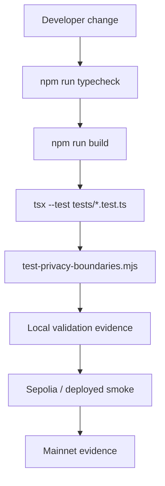
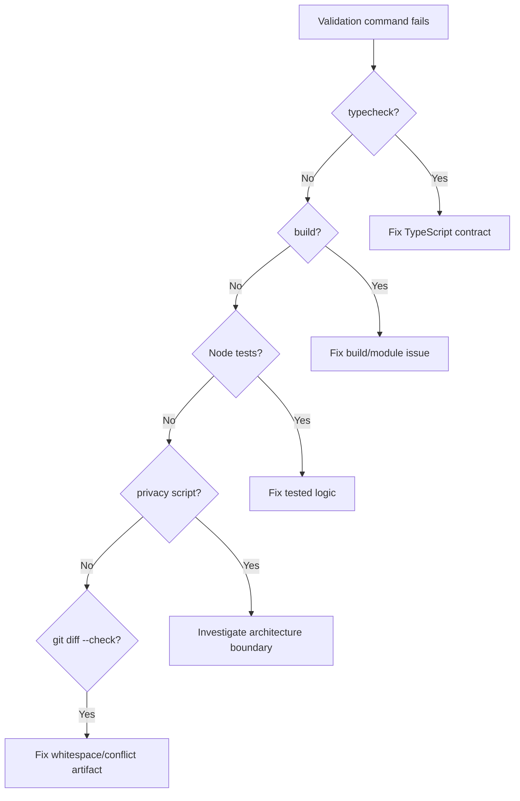
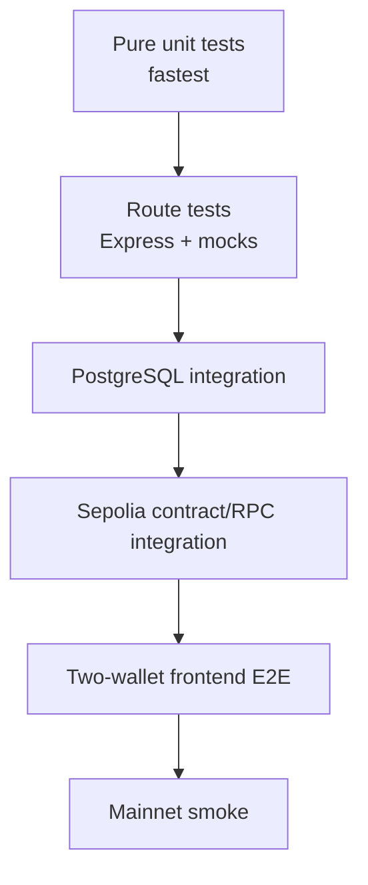
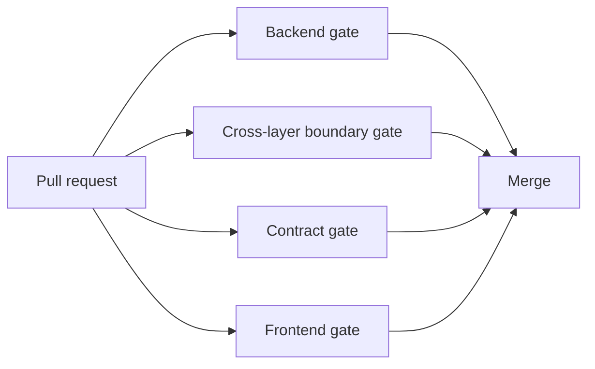
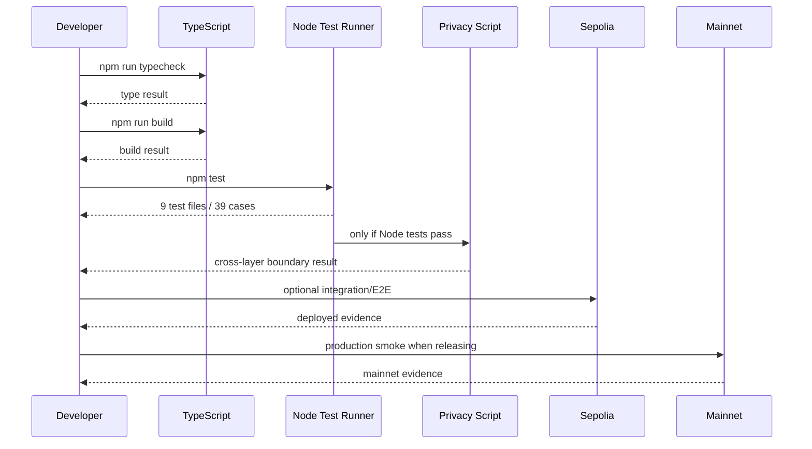
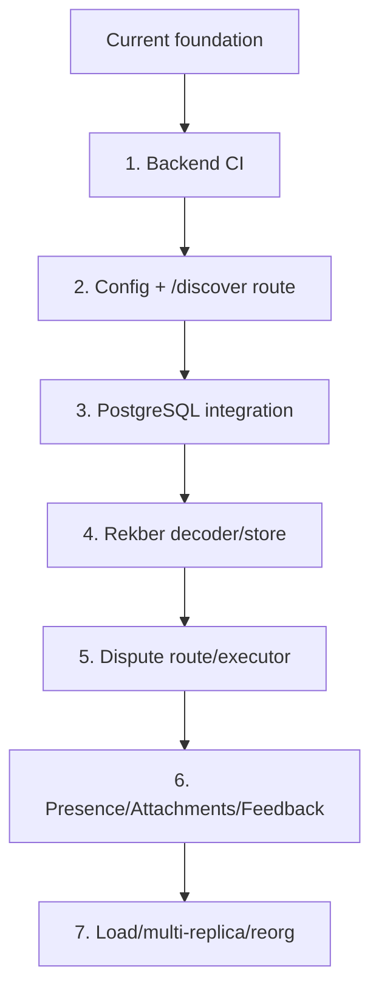

# VINSS Backend Testing

This document describes the current testing model for the VINSS backend.

The objective is not only:

```text
Does TypeScript compile?
```

It is also:

```text
Do privacy boundaries remain intact?

Do Agent tools remain scoped?

Do indexed identities remain network-aware?

Do public event decoders preserve canonical metadata?

Do Dispute inputs remain bound to live Rekber state?

Do deterministic policy gates reject unsafe decisions?

Do reward formulas remain deterministic?

Do frontend/backend/contract privacy assumptions stay aligned?
```

A successful build is necessary.

It is not sufficient.

---

# Objective

Backend validation should protect four different properties:

```text
1. Type/build correctness

2. Backend business-rule correctness

3. Privacy/security architecture boundaries

4. Deployed network behavior
```

These are separate evidence levels.

---

# Current Standard Validation

Run from the backend:

```bash
cd ~/vinss/backend

npm run typecheck
npm run build
npm test
```

Then from repository root:

```bash
cd ~/vinss

git diff --check
```

---

# What Each Command Proves

```text
npm run typecheck
    -> TypeScript type-checks without emitting build output

npm run build
    -> TypeScript production compilation succeeds

npm test
    -> all backend Node test files pass
       AND
       cross-layer privacy-boundary source regression passes

git diff --check
    -> no whitespace/conflict-marker style errors in current Git diff
```

---

# What These Commands Do Not Prove

They do not by themselves prove:

```text
PostgreSQL production connectivity

Starknet RPC availability

actual chain ID

deployed contract class identity

live helper event compatibility

Ready Wallet behavior

AVNU/paymaster behavior

real provider availability

two-wallet frontend encryption/decryption

mainnet settlement flow
```

---

# Current `package.json` Scripts

Current backend scripts:

```json
{
  "dev": "tsx watch src/index.ts",
  "build": "tsc -p tsconfig.json",
  "start": "node dist/index.js",
  "typecheck": "tsc --noEmit",
  "test": "tsx --test tests/*.test.ts && node ../scripts/test-privacy-boundaries.mjs",
  "test:loyalty-rules": "tsx --test tests/loyalty-rules.test.ts tests/rekber-indexer.test.ts"
}
```

---

# Critical `npm test` Sequencing

Current test command is:

```text
tsx --test tests/*.test.ts
&&
node ../scripts/test-privacy-boundaries.mjs
```

---

# Consequence of `&&`

The privacy-boundary script runs only if:

```text
all Node test files exit successfully
```

If Node tests fail first:

```text
privacy script is not executed in that npm test invocation
```

---

# Typecheck Is Not Part of `npm test`

Current `npm test` does **not** implicitly run:

```text
npm run typecheck
```

---

# Build Is Not Part of `npm test`

Current `npm test` also does **not** implicitly run:

```text
npm run build
```

---

# Therefore the Full Local Gate Is Three Commands

```text
typecheck

build

test
```

not only:

```text
npm test
```

---

# Current Backend Test Inventory

Current `backend/tests/` contains nine Node test files:

```text
agent-tools.test.ts

certificate-indexer.test.ts

dispute-attestation.test.ts

dispute-executor.test.ts

dispute-policy.test.ts

indexer.test.ts

loyalty-rules.test.ts

rekber-indexer.test.ts

royalty.test.ts
```

---

# Current Test Case Count

The current nine files contain:

```text
39 node:test test(...) cases
```

---

# Test Count by File

| Test file | `test(...)` cases |
|---|---:|
| `agent-tools.test.ts` | 9 |
| `certificate-indexer.test.ts` | 3 |
| `dispute-attestation.test.ts` | 4 |
| `dispute-executor.test.ts` | 2 |
| `dispute-policy.test.ts` | 9 |
| `indexer.test.ts` | 2 |
| `loyalty-rules.test.ts` | 5 |
| `rekber-indexer.test.ts` | 2 |
| `royalty.test.ts` | 3 |
| **Total** | **39** |

---

# Test Architecture



---

# Testing Layers

Use these layers distinctly.

---

# Layer 1 — Static Type Validation

Command:

```bash
npm run typecheck
```

---

# Purpose

Detect:

```text
type mismatch

missing property

invalid import typing

invalid function arguments

unresolved TypeScript contract
```

---

# Does Not Execute Runtime Logic

A type-safe function can still be:

```text
logically wrong

privacy-unsafe

incorrectly configured

incompatible with deployed chain
```

---

# Layer 2 — Production Build

Command:

```bash
npm run build
```

---

# Purpose

Verify:

```text
tsc production emission

module resolution

runtime source compile compatibility
```

---

# Output

Current production runtime starts:

```text
dist/index.js
```

after build.

---

# Build Is Not a Test Suite

A successful build does not test:

```text
assertions

routes

database behavior

chain behavior
```

---

# Layer 3 — Node Unit / Pure Logic Tests

Command:

```bash
tsx --test tests/*.test.ts
```

---

# Framework

Current tests use:

```text
node:test

node:assert/strict

tsx
```

---

# Primary Current Coverage

```text
Agent tools and sanitizer

Certificate event decoder

Dispute attestation/custody validation

Dispute deterministic policy

Dispute split arithmetic

Indexer identity definitions

Legacy Loyalty rules

Rekber identity/basic resolved shape

Royalty formula
```

---

# Layer 4 — Cross-Layer Privacy Source Regression

Command:

```bash
node ../scripts/test-privacy-boundaries.mjs
```

from:

```text
backend/
```

or equivalently from repository root:

```bash
node scripts/test-privacy-boundaries.mjs
```

---

# Nature of This Script

This is primarily:

```text
source architecture regression
```

It reads source files and asserts required/forbidden patterns.

---

# It Is Not

```text
an HTTP integration test

a browser E2E

a PostgreSQL integration test

a Starknet RPC test

a wallet transaction test
```

---

# Layer 5 — Deployed Smoke / E2E

Examples:

```text
Sepolia backend health

known indexed event

frontend /discover round-trip

two-wallet Message/Offer

Rekber lifecycle

Certificate claim

provider smoke when Agent intentionally enabled
```

---

# Layer 6 — Mainnet Verification

Requires actual mainnet deployment evidence.

---

# Evidence Labels

Use:

```text
Implemented

Unit Tested

Cross-Layer Regression Tested

Integration Tested

Sepolia On-Chain Verified

Mainnet Verified
```

---

# Avoid Ambiguous `Tested`

A feature can be unit-tested without being deployed.

Prefer:

```text
Dispute split arithmetic: Unit Tested
```

rather than:

```text
Dispute AutoResolve: Tested
```

if no live resolver transaction test occurred.

---

# Current Coverage Matrix

| Subsystem | Unit/pure test | Route integration | DB integration | Live chain |
|---|---:|---:|---:|---:|
| Agent tools | Yes | No dedicated route test | N/A | No |
| Agent sanitizer | Yes | Indirect source regression | N/A | No |
| Discovery definitions | Yes | No | No | No |
| Discovery privacy | Source regression | No | Source/schema regression | No |
| Certificate decoder | Yes | No | No | No |
| Rekber indexer | Minimal | No | No | No |
| Dispute attestation | Yes | No | No | No |
| Dispute policy | Yes | No | No | No |
| Dispute executor | Arithmetic only | No | No | No |
| Legacy Loyalty rules | Yes | No | No | No |
| Royalty formula | Yes | No | No | No |
| Presence | No dedicated backend test | No | N/A | N/A |
| Attachments | No dedicated test | No | No | N/A |
| Feedback | No dedicated test | No | No | N/A |
| Activity | No dedicated test | No | No | N/A |
| Health | No dedicated test | No | No | N/A |
| Config parser | No dedicated test | No | N/A | N/A |
| Rate limiter | No dedicated test | No | N/A | N/A |

---

# Agent Tool Tests

File:

```text
backend/tests/agent-tools.test.ts
```

Current coverage contains nine cases.

---

# Agent Case 1 — Fee Calculation

Verifies:

```text
calculateFee("10000", 25)
```

returns:

```text
amount = 10000

feeBps = 25

fee = 25

total = 10025
```

---

# What This Proves

The current Agent advisory fee helper is deterministic for that case.

---

# What This Does Not Prove

It does not prove:

```text
on-chain FeePolicy correctness

STRK conversion

mainnet pricing

large-number Number precision
```

---

# Agent Case 2 — Offer Analysis

Verifies an Offer with missing settlement terms is classified:

```text
riskLevel = watch
```

---

# Scope

This tests:

```text
pure Agent tool logic
```

not remote model reasoning.

---

# Agent Case 3 — Counter Offer Proposal

Verifies:

```text
draftCounterOffer(...)
```

returns:

```text
type = draft_counter_offer

requiresApproval = true
```

with expected payload.

---

# Security Value

Protects proposal-only architecture.

---

# Agent Case 4 — Private Message Draft

Verifies:

```text
draftMessage(...)
```

returns:

```text
draft_message

requiresApproval = true
```

rather than executing a send.

---

# Agent Case 5 — Deal Stage Inference

Tests one example where timeline text leads to:

```text
funded
```

stage.

---

# Important Privacy Nuance

The generic inference tool can reason over supplied rich context.

Normal remote Agent sanitizer may remove rich private summaries before provider execution.

---

# Do Not Confuse

```text
tool can infer stage from rich local input
```

with:

```text
normal sanitized provider always receives that rich input
```

---

# Agent Case 6 — No Generic Execution Tools

The current test checks generic tool definitions do not include:

```text
send_transaction

release_escrow

deposit_funds

sign_transaction
```

---

# It Also Verifies

Calling:

```text
executeTool("send_transaction", ...)
```

throws:

```text
Tool not allowed
```

---

# Security Importance

Prompt injection cannot create a tool that is absent from executable tool authority.

---

# Agent Case 7 — Skill-Specific Exposure

Tests that:

```text
chat
```

exposes:

```text
draft_message

inspect_deal_state
```

---

# It Also Verifies

Offer does not expose:

```text
prepare_escrow
```

Escrow does not expose:

```text
draft_message
```

Dispute exposes only:

```text
inspect_deal_state
```

---

# Agent Case 8 — Cross-Skill Runtime Rejection

Attempts invalid executions such as:

```text
chat -> draft_offer

offer -> prepare_escrow

escrow -> draft_message

dispute -> prepare_escrow
```

and verifies each throws.

---

# Defense in Depth

This is stronger than checking provider tool definitions only.

It verifies runtime enforcement.

---

# Agent Case 9 — Sanitizer Privacy

Supplies a context containing:

```text
roomLabel

Offer asset

Offer amount

payment terms

private condition

private Message summary

walletAddress

roomSecret

channelKeyHex
```

---

# Expected Sanitized Context

`latestOffer` becomes only:

```text
actionLocator
```

and timeline summary becomes:

```text
Encrypted private message
```

---

# Secret Absence Assertion

The test serializes sanitized context and verifies sensitive values are absent.

---

# Agent Test Limitations

Current test does not perform:

```text
real Groq request

real OpenAI request

provider fallback timing

provider timeout

route validation

rate-limit behavior

malicious model tool-call sequence beyond direct runtime function
```

---

# Certificate Indexer Tests

File:

```text
backend/tests/certificate-indexer.test.ts
```

Three cases.

---

# Certificate Case 1 — Identity Isolation

Verifies:

```text
sepolia:certificate:0xabc
```

identity and different network isolation.

---

# Security / Reliability Value

Prevents cross-network checkpoint identity collision.

---

# Certificate Case 2 — Event Decoder

Builds a synthetic:

```text
SettlementCertificateIssued
```

event.

---

# Verifies Mapping

```text
keys[1]
    -> tokenId

keys[2]
    -> recipient

data[0]
    -> custodyCommitment

data[1]
    -> role

data[2]
    -> settledAt

data[3]
    -> issuedAt
```

plus:

```text
blockNumber

transactionHash

network

contractAddress
```

---

# Certificate Case 3 — Invalid Role

Verifies:

```text
role = 3
```

is rejected by decoder and returns:

```text
null
```

---

# Certificate Test Limitations

Not currently tested in this file:

```text
role = 1 explicit case

malformed timestamps

missing keys

missing data

unsafe integer timestamps

Starknet getEvents pagination

PostgreSQL insert

checkpoint advancement

/activity integration

Royalty integration
```

---

# Discovery Indexer Definition Tests

File:

```text
backend/tests/indexer.test.ts
```

Two cases.

---

# Discovery Case 1 — Identity Isolation

Verifies identity includes:

```text
network

kind

contract address
```

---

# Example

```text
sepolia:offer:0xabc
```

differs from:

```text
mainnet:offer:0xabc
```

and from:

```text
sepolia:message:0xabc
```

---

# Discovery Case 2 — Explicit Start Blocks

Builds definitions and verifies:

```text
message
    -> block 100
    -> address 0x2

offer
    -> block 200
    -> address 0x3

escrow
    -> block 300
    -> address 0x4
```

---

# What This Proves

Configuration is propagated into index definitions correctly.

---

# What It Does Not Prove

It does not test:

```text
DiscoveryIndexer background loop

getBlockNumber

getEvents

continuation tokens at runtime

ciphertext record getter

chunk getter

hydration concurrency

dedupe

transactional insert

checkpoint advancement

start-block mismatch DB behavior

health status
```

---

# Rekber Indexer Tests

File:

```text
backend/tests/rekber-indexer.test.ts
```

Two cases.

---

# Rekber Case 1 — Identity

Verifies:

```text
sepolia:rekber:0xabc
```

and network isolation.

---

# Rekber Case 2 — Resolved Shape

Constructs a plain sample object:

```text
eventKind = resolved

resolutionPayerAmount = 30

resolutionPayeeAmount = 70
```

and checks those values.

---

# Important Coverage Precision

This second test does **not** invoke:

```text
Rekber event decoder
```

against an actual synthetic Starknet event.

---

# Therefore

Do not claim from this test alone:

```text
resolved event decoding is unit-tested
```

The test currently checks the expected object shape only.

---

# Rekber Test Gaps

High-value missing tests include synthetic decoding for:

```text
funded

released

refunded

resolved
```

including all canonical key/data positions.

---

# Rekber Store Gaps

No current dedicated test for:

```text
schema initialization

resolved ALTER TABLE migration

event insert

query filters

checkpoint advancement

start-block mismatch

PostgreSQL persistence
```

---

# Dispute Attestation Tests

File:

```text
backend/tests/dispute-attestation.test.ts
```

Four cases.

---

# Attestation Case 1 — Canonical Rekber Custody Indexes

Builds a 39-element synthetic contract getter result.

---

# Verifies Parser Fields

Including:

```text
custodyCommitment

amount

verificationPolicy

disputed
```

from canonical struct positions.

---

# Why This Is Important

The Dispute system depends on exact Rekber getter layout.

An index shift can create dangerous authority mismatch.

---

# Attestation Case 2 — Client Snapshot vs Live Custody

Sanitizes a Dispute case and verifies:

```text
assertDisputeCaseMatchesCustody(...)
```

accepts matching state.

---

# Negative Case

Changes client:

```text
onChain.disputed = false
```

while live synthetic custody is disputed.

---

# Expected

The verifier throws:

```text
does not match current Rekber state
```

---

# Security Value

Browser-provided custody snapshot is not blindly trusted.

---

# Attestation Case 3 — Typed Data Binding

Builds payer and payee SNIP-12 typed data.

---

# Verifies

```text
Role

Wallet

same Case commitment

Custody

Consent = Arbitrate

Execution = AutoSplit
```

---

# Attestation Case 4 — Signature Felt Parsing

Valid two-felt signatures are accepted.

Malformed:

```text
not-a-felt
```

is rejected.

---

# Attestation Test Gaps

The file does not perform a real:

```text
verifyMessageInStarknet
```

against actual Account signatures.

---

# It Tests Typed Data Construction / Parser

It does not prove two actual wallets can sign and pass full route verification.

---

# Dispute Policy Tests

File:

```text
backend/tests/dispute-policy.test.ts
```

Nine cases.

---

# Policy Case 1 — Explicit Evidence Sanitizer

Verifies explicit dispute statement/evidence is preserved while unrelated:

```text
roomSecret

channelKeyHex

privateKey
```

values are dropped.

---

# Privacy Meaning

Dispute intentionally keeps evidence but still rejects unrelated secrets from sanitized case.

---

# Policy Case 2 — Both-Party Consent

If payee:

```text
consentToAgentReview = false
```

sanitization throws.

---

# Policy Case 3 — Deterministic Case Commitment

Computing the commitment twice over the same sanitized case returns the same value.

---

# Policy Case 4 — Strict Decision Parser

Accepts fenced JSON.

Rejects loose natural-language prose such as:

```text
Give everything to payer.
```

---

# Security Value

Resolver policy consumes a structured decision, not arbitrary model prose.

---

# Policy Case 5 — Valid High-Confidence AutoResolve

For a bounded:

```text
30 / 70 split

confidence = 0.94

binding verified

verified USD value
```

policy returns:

```text
AUTO_RESOLVE
```

---

# Policy Case 6 — Invalid Split Rejected

A:

```text
4000 + 7000
```

BPS split is rejected with:

```text
INVALID_SPLIT
```

even at:

```text
confidence = 0.99
```

---

# Security Meaning

Model confidence cannot override arithmetic invariants.

---

# Policy Case 7 — Low Confidence / Conflict / High Value

A case with:

```text
confidence = 0.7

evidence_conflict

high verified value
```

returns:

```text
NEEDS_REVIEW
```

with expected policy reasons.

---

# Policy Case 8 — Objective Verification

When:

```text
verificationClass = objective
```

AI is not allowed to auto-arbitrate it.

Expected:

```text
NEEDS_REVIEW
OBJECTIVE_VERIFICATION_REQUIRED
```

---

# Policy Case 9 — Browser Value and Unbound Wallets Have No Authority

Client supplies:

```text
usdMicros = 1
```

but no verified binding/value authority object.

---

# Expected

```text
NEEDS_REVIEW
```

with:

```text
PARTY_BINDING_NOT_VERIFIED

USD_VALUE_NOT_VERIFIED
```

---

# Security Value

A malicious browser cannot authorize AutoResolve merely by:

```text
lowering claimed USD value

submitting two arbitrary wallet fields
```

---

# Dispute Policy Test Strength

This is currently one of the strongest backend pure-logic areas.

It covers:

```text
sanitization

consent

commitment

model output parser

arithmetic invariants

confidence gate

value gate

verification class

trusted binding/value requirement
```

---

# Dispute Policy Test Limitations

It does not test:

```text
actual LLM provider

real RPC custody read

actual wallet signature verification

full /dispute/challenge route

full /dispute/evaluate route

live resolver transaction
```

---

# Dispute Executor Tests

File:

```text
backend/tests/dispute-executor.test.ts
```

Two cases.

---

# Executor Case 1 — Principal Conservation

Input:

```text
principal = 101

payerBps = 3333

payeeBps = 6667
```

---

# Expected

```text
payerAmount = 33

payeeAmount = 68

sum = 101
```

---

# Security / Financial Value

Verifies no principal unit disappears through integer rounding.

---

# Executor Case 2 — Exact BPS Sum

Input:

```text
5000 + 4999
```

throws:

```text
Invalid dispute resolution split
```

---

# Critical Coverage Precision

Current executor test does **not** call:

```text
authorizeDisputeResolution(...)
```

against:

```text
real provider

real Account

real Rekber contract
```

---

# Therefore

Current test evidence is:

```text
resolution arithmetic tested
```

not:

```text
resolver transaction integration tested
```

---

# Loyalty Rules Tests

File:

```text
backend/tests/loyalty-rules.test.ts
```

Five cases.

---

# Loyalty Case 1 — Base Points

Verifies current base rules including:

```text
message_sent = 1

offer_created = 5

offer_countered = 5

offer_accepted = 10

work_submitted = 10

work_reviewed = 10

referral_joined = 25

referral_activated = 25

referral_converted = 100
```

---

# Important Scope

This case does not explicitly assert:

```text
rekber_released

rekber_refunded
```

through `basePointsForAction`.

---

# Loyalty Case 2 — Certificate Multipliers

Verifies boundary examples:

```text
0 -> 1.00x

1 -> 1.10x

3 -> 1.20x

6 -> 1.35x

11 -> 1.50x

26 -> 1.75x

51 -> 2.00x
```

---

# Loyalty Case 3 — Normal Release Reward Utility

Verifies:

```text
released + 0 certificates
    -> 100

released + 7 certificates
    -> 135
```

---

# Loyalty Case 4 — Refund

Verifies:

```text
refunded
    -> 0
```

even with high certificate count.

---

# Loyalty Case 5 — Resolved 30:70

Verifies:

```text
resolutionShareBps(30,70)
    -> 3000 / 7000
```

and resulting reward examples.

---

# Loyalty Test Limitation

These tests cover:

```text
pure rules
```

not:

```text
POST /loyalty/events

Map storage

duplicate event ID behavior

cross-subject duplicate behavior

restart loss

feature flag mounting

authorization
```

---

# Royalty Tests

File:

```text
backend/tests/royalty.test.ts
```

Three cases.

---

# Royalty Case 1 — Certificate Tiers

Verifies:

```text
0 -> 1x

1,2 -> 1.25x

3 -> 1.5x

5 -> 1.75x

10+ -> 2x
```

---

# Royalty Case 2 — Settlement Formula

For:

```text
3 certificates

3 successful settlements
```

verifies:

```text
basePoints = 600

multiplier = 1.5

points = 900

nextCertificateTarget = 5

nextMultiplier = 1.75
```

---

# Royalty Case 3 — 2x Cap

At high count:

```text
multiplier = 2

nextCertificateTarget = null

nextMultiplier = null
```

---

# Royalty Test Limitations

Does not test:

```text
GET /royalty/:address

address validation

CertificateStore.recipientStats

database integration

certificate-indexer freshness

route error behavior
```

---

# Privacy Regression Script

File:

```text
scripts/test-privacy-boundaries.mjs
```

---

# Classification

This is:

```text
cross-layer architecture regression
```

---

# It Reads Source Files Directly

Current script reads from:

```text
frontend/

backend/

contracts/
```

---

# Why This Is Useful

Some privacy properties are architectural.

Example:

```text
frontend must not send channelKeyHex
```

can regress without any pure backend function failing.

---

# Privacy Script Group 1 — Agent / Room Privacy

It verifies:

```text
frontend does not reference GROQ_API_KEY

room secret is not rendered in old room-list source

Agent prompt prohibits signing/sending

Agent prompt mentions viewing-key prohibition

runtime contains code-level tool restriction

frontend prepares privacySafeTimeline

roomLabel is not automatically sent to Agent

Agent response remains network-aware
```

---

# Important Static-Test Precision

These checks often use source-string search.

---

# Example

```text
runtime.includes("Tool not allowed for")
```

---

# Consequence

This detects specific source regressions.

It is not equivalent to fuzzing every runtime prompt/tool execution path.

---

# Privacy Script Group 2 — Ciphertext-Only Discovery

It verifies:

```text
backend Discovery route does not contain decryptMatching

DiscoverRequest type does not contain channelKeyHex

indexer source lacks common decrypt functions/imports

event ingestion contains continuation_token pagination

indexer lacks latest-10000 heuristic

DiscoveryStore lacks room_id

DiscoveryStore lacks room_secret

DiscoveryStore lacks plaintext

STARKNET_NETWORK exists as explicit config

backend has no hardcoded Nethermind Sepolia fallback

frontend Message discovery does not send channelKeyHex

frontend Offer discovery does not send channelKeyHex

frontend Message uses decryptPayload

frontend Offer uses decryptPayload
```

---

# Privacy Script Group 3 — Rekber Cross-Layer Boundaries

The script also verifies:

```text
VINSS_RELEASE_AUTH domain exists in frontend + Cairo

VINSS_PAYEE_CLAIM domain exists in frontend + Cairo

VINSS_ESCROW_REFUND domain exists in frontend + Cairo

accepted Offer decimal amount goes through parseSettlementAmount

old paid OfferHelper prepare action is not used

removed direct Rekber setup helper is not used

removed onStartRekber callback is absent

Escrow UI has coordinationLockRef

Escrow UI has pendingPayerSetup
```

---

# Why Rekber Is in a “Privacy” Script

The script has grown beyond pure privacy.

It now protects:

```text
privacy boundaries

cross-layer commitment compatibility

Rekber frontend flow invariants
```

---

# Naming Limitation

The filename:

```text
test-privacy-boundaries.mjs
```

understates its current cross-layer responsibility.

---

# Potential Future Rename

Could become:

```text
test-cross-layer-boundaries.mjs
```

or split into:

```text
test-privacy-boundaries.mjs

test-rekber-cross-layer.mjs
```

---

# Static Regression Strength

It is very useful for preventing architectural drift.

---

# Static Regression Weakness

String-search assertions can become:

```text
false positive

false negative

sensitive to harmless refactor
```

---

# Example False Confidence Risk

Checking:

```text
frontend file includes "decryptPayload"
```

does not prove every payload returned at runtime was safely authenticated/decrypted.

---

# Better Long-Term Combination

Use both:

```text
source regression
+
runtime integration test
```

---

# `test:loyalty-rules`

Current targeted script:

```bash
npm run test:loyalty-rules
```

runs:

```text
tests/loyalty-rules.test.ts

tests/rekber-indexer.test.ts
```

---

# Important Precision

It does not run:

```text
royalty.test.ts
```

despite the similar product terminology.

---

# It Also Does Not Run

```text
privacy-boundary script
```

---

# Use Case

Useful for fast local iteration on:

```text
Legacy Loyalty rules

basic Rekber indexer shape
```

---

# Do Not Use as Full Backend Gate

Before deploy, still run:

```text
npm test
```

plus typecheck/build.

---

# Targeted Test Commands

Run one file:

```bash
cd ~/vinss/backend

npx tsx --test tests/agent-tools.test.ts
```

---

# Multiple Files

```bash
npx tsx --test \
  tests/dispute-attestation.test.ts \
  tests/dispute-policy.test.ts \
  tests/dispute-executor.test.ts
```

---

# Pure Privacy Script

```bash
cd ~/vinss

node scripts/test-privacy-boundaries.mjs
```

---

# Full Backend Suite

```bash
cd ~/vinss/backend

npm test
```

---

# Full Local Backend Release Gate

```bash
cd ~/vinss/backend

npm run typecheck
npm run build
npm test

cd ~/vinss
git diff --check
```

---

# Failure Interpretation



---

# Test Failure Is Evidence

Do not bypass a failing privacy test merely to deploy.

---

# Example Bad Fix

```text
remove the privacy assertion
```

without understanding why source changed.

---

# Correct Approach

```text
identify intended architecture change

review privacy/security impact

change code

change test only if the boundary itself intentionally changed

update documentation
```

---

# Test Fixtures Must Not Use Real Secrets

Use synthetic values:

```text
0xabc

example.invalid

test-only comments

fake wallets
```

---

# Never Put Real Credentials in Tests

Avoid:

```text
mainnet private key

real database URL

real provider API key

resolver private key

real room secret
```

---

# Current Tests Follow This Pattern

Example config fixtures use:

```text
https://example.invalid/rpc

postgresql://example.invalid/vinss
```

or equivalent fake values.

---

# Unit Tests Should Be Offline

Pure backend tests should not unexpectedly reach:

```text
real RPC

real PostgreSQL

remote LLM
```

---

# Current Suite Is Primarily Offline

The current nine Node test files are constructed around:

```text
pure functions

synthetic inputs

static configuration objects
```

---

# Benefit

Fast and deterministic.

---

# Cost

Integration failures can escape the suite.

---

# Current Major Coverage Gaps

The following areas have no dedicated backend Node test file today.

---

# Config Parsing

Missing dedicated tests for:

```text
STARKNET_NETWORK required

invalid network

RPC URL required

mainnet testnet-looking RPC rejection

mainnet HTTPS CORS requirement

address zero/range validation

start-block bounds

AutoResolve credential requirements

feature defaults

rate-limit bounds
```

---

# Why Config Tests Matter

Configuration is a mainnet safety boundary.

It deserves executable regression coverage.

---

# Database Initialization

Missing live/fake-DB tests for:

```text
createDatabase

SSL mode

pool behavior

schema initialization

startup failure handling
```

---

# Discovery Store

Missing dedicated test for:

```text
discovery_records schema

insert transaction

ON CONFLICT dedupe

discover range ordering

existingLocators

checkpoint initialization

start-block mismatch

checkpoint status transitions
```

---

# Discovery Event Source

Missing runtime unit tests for:

```text
continuation-token pagination

event field extraction

missing field skip

record getter

chunk count parsing

4096 defensive bound

sequential chunk hydration

RPC error behavior
```

---

# Discovery Indexer Service

Missing direct tests for:

```text
latest block failure

per-definition isolation

multiple block-range catch-up

hydration concurrency

retry after failed hydration

checkpoint advancement ordering

graceful stop
```

---

# `/discover` Route

Missing HTTP test for:

```text
valid request

all forbidden fields

all unexpected fields

invalid kind

invalid blocks

DB failure -> generic 500

rate limiting
```

---

# `/health`

Missing route test for:

```text
all healthy -> 200

one checkpoint error -> 503

status read failure -> 503/null
```

---

# Latest-Block Health Blind Spot

A specific test should preserve/document current behavior where:

```text
latest block query failure
```

does not necessarily persist:

```text
checkpoint.status = error
```

---

# `/activity`

Missing tests for:

```text
merge ordering

cursor parse/encode

limit bounds

kind filters

resolved-event behavior

nextCursor heuristic
```

---

# Known Activity Gap

A useful regression should explicitly capture:

```text
unfiltered activity can contain rekber_resolved
```

while current:

```text
?kind=rekber_resolved
```

is rejected.

---

# Rekber Decoder

Current Rekber test is too shallow.

Add synthetic event tests for:

```text
funded

released

refunded

resolved
```

---

# Rekber Store

Add:

```text
PostgreSQL schema

migration

insert/query

filter

checkpoint
```

tests.

---

# Certificate Store

Current test covers decoder only.

Add:

```text
insert

dedupe

recipientStats

checkpoint

activity read
```

---

# Royalty Route

Add:

```text
valid address

invalid address

CertificateStore stats

coming_soon conversion

DB failure
```

---

# Presence

No dedicated tests today.

High-value cases:

```text
channel ID validation

event ID validation

IV length

ciphertext length

TTL floor/clamp

duplicate live event

duplicate after expiry

120-record eviction

poll ordering

non-destructive poll

expired cleanup

unknown-field behavior
```

---

# Multi-Replica Presence

Requires integration/system test rather than one-process unit test.

---

# Attachments

No dedicated tests today.

High-value cases:

```text
UUID validation

token length

SHA-256 token storage

timingSafeEqual behavior

duplicate ID 409

wrong token -> 404

missing -> 404

empty body -> 400

too large -> 413

lazy table initialization

DB failure -> 503

binary round-trip
```

---

# Feedback

No dedicated tests today.

High-value cases:

```text
outcome enum

role enum

rating 1..5

comment trim/max length

deal type

client-supplied network behavior

unknown top-level fields

DB persistence

Resend best effort

storage failure

rate limit
```

---

# Rate Limiter

No dedicated test file.

Add:

```text
remaining count

reset header

Retry-After

429

separate scopes

window expiry

process-local reset
```

---

# Agent Route

Agent tools are tested.

Route behavior is not.

Add:

```text
skill validation

public skill rejects dispute

sanitized context passed

network response field

contextShared

provider failure -> generic 500

provider selection
```

---

# Provider Registry / Fallback

No dedicated backend test today for:

```text
auto provider order

explicit provider priority

fallback list

unconfigured provider skipping

all providers unavailable

sequential fallback attempts
```

---

# Provider Runtime

No mocked provider test for:

```text
tool-call loop

four-step bound

malformed tool call

provider text response

proposal extraction
```

---

# Dispute Route

Pure logic is stronger than route coverage.

Missing route integration:

```text
challenge complete flow

evaluate complete flow

real dependency mocks

provider error

RPC error

attestation verification error

executor status response
```

---

# Signature Verification

Need test with actual generated Starknet account signature against typed data.

---

# Original Rekber Binding

Needs broader positive/negative test matrix for:

```text
wrong payer

wrong payee

wrong chain

wrong capability commitment

wrong custody

wrong deadline

wrong certificate commitment

wrong signature
```

---

# Executor Integration

Need mocked or Sepolia coverage for:

```text
resolver mismatch

not_enabled

not_eligible

already_authorized

authorize tx success

submission failure then reread race

submission failure still unauthorized
```

---

# Legacy Loyalty Route/Service

Pure formulas tested.

Missing:

```text
awardAction storage

duplicate network:eventId

cross-subject duplicate

level recalculation

feature gate

restart loss

route invalid action
```

---

# OpenAPI

No dedicated test verifying:

```text
runtime route set
```

matches:

```text
OpenAPI path set
```

---

# Why This Matters

Current spec is known to omit some runtime routes.

A route parity test would prevent further drift.

---

# Startup Runtime

No dedicated integration test for:

```text
store initialization order

failure closes pool

server listens then indexers start

SIGTERM shutdown ordering
```

---

# Testing Pyramid



---

# Recommended Test Pyramid Strategy

Keep many:

```text
fast pure tests
```

Add targeted:

```text
route tests
```

Then fewer:

```text
database integration tests

Sepolia integration tests

full E2E
```

---

# Do Not Replace Pure Tests With E2E

Pure policy tests are valuable because they are:

```text
fast

deterministic

easy to reproduce
```

---

# Do Not Replace E2E With Pure Tests

Pure tests cannot detect:

```text
ABI mismatch

environment mismatch

wallet behavior

RPC provider issue

deployed contract mismatch
```

---

# Database Integration Test Strategy

Recommended test DB:

```text
isolated PostgreSQL database/schema
```

---

# Required Isolation

Never run destructive tests against:

```text
production PostgreSQL
```

---

# DB Test Lifecycle

```text
create isolated DB/schema

initialize stores

run test

rollback/drop

close pool
```

---

# Docker Constraint

A local Docker-based test DB may be convenient on desktop CI.

The user's Termux workflow may instead use:

```text
temporary managed DB

local PostgreSQL if available

mocked store unit tests
```

---

# CI Should Provide Deterministic DB

Long term, GitHub Actions can start:

```text
PostgreSQL service container
```

for integration tests.

---

# RPC Integration Test Strategy

Use Sepolia for:

```text
known public read fixtures

event decoder compatibility

contract getter compatibility
```

---

# Avoid Fragile Tests

Do not depend on:

```text
latest arbitrary block

uncontrolled user transaction

third-party ephemeral account
```

without fixture strategy.

---

# Stable Chain Fixture

Prefer a known deployed contract and known historical transaction/event.

---

# Live Read vs Live Write

Separate:

```text
read-only chain integration
```

from:

```text
transaction-writing E2E
```

---

# Read-Only Integration

Can verify:

```text
chain ID

contract getter

known event

indexer extraction
```

without spending funds.

---

# Write E2E

Should be rarer and explicit.

---

# Two-Wallet E2E

Required for confidence in:

```text
private Message send/receive

Offer create/counter/accept/reject

Rekber setup coordination

funding

release/refund/resolution path as appropriate

Certificate claim
```

---

# Backend Role in E2E

Verify:

```text
events indexed

/discover returns ciphertext

frontend decrypts locally

Rekber event appears

Certificate event appears

Royalty updates after certificate indexing
```

---

# E2E Privacy Assertions

Also verify negative properties:

```text
backend logs contain no room key

backend requests contain no channel key

provider not invoked during ordinary chat unless Agent used
```

---

# Test Data Policy

Use synthetic/private test data designed for testnet.

---

# Do Not Use Real User Secrets

Even on Sepolia.

---

# Mainnet Smoke Policy

Mainnet smoke should minimize writes.

---

# Good Mainnet Smoke

```text
GET /health

bounded known /discover query

GET /rekber/events?limit=1

GET /activity?limit=1

GET /royalty/<known-address>
```

as relevant.

---

# Agent Mainnet Smoke

Only if Agent intentionally enabled.

---

# Dispute Mainnet Smoke

Do **not** call:

```text
/dispute/evaluate
```

with an eligible real custody merely as a health check when AutoResolve can sign.

---

# Presence Mainnet Smoke

Use a synthetic opaque short-TTL channel.

---

# Attachment Mainnet Smoke

Only if prepared to create/remove test storage artifacts operationally.

---

# Verification Labels

Use this model.

---

# Implemented

Code exists.

---

# Unit Tested

Pure/local test asserts behavior.

---

# Cross-Layer Regression Tested

Source architecture assertions across components pass.

---

# Integration Tested

Real route/database/RPC boundary executed with controlled dependency.

---

# Sepolia On-Chain Verified

Actual Sepolia chain state/transaction confirms behavior.

---

# Mainnet Verified

Actual intended mainnet deployment confirms behavior.

---

# Example Evidence Table

| Claim | Correct label |
|---|---|
| `computeResolutionAmounts` preserves principal | Unit Tested |
| Dispute policy rejects invalid BPS | Unit Tested |
| `/discover` source has no decrypt path | Cross-Layer Regression Tested |
| Message ciphertext decrypts in two browsers on Sepolia | Sepolia On-Chain Verified / E2E |
| Mainnet Rekber funded and indexed | Mainnet Verified |

---

# Do Not Upgrade Evidence Level Automatically

A unit test passing does not become:

```text
mainnet verified
```

because code was deployed.

---

# Deployment Does Not Equal Verification

You need observed behavior.

---

# Current GitHub Actions — Contracts

Current repository has:

```text
.github/workflows/contracts-test.yml
```

---

# Trigger

Current contract test workflow is:

```text
workflow_dispatch
```

only.

---

# Meaning

It is manually triggered.

---

# Environment

Runs on:

```text
ubuntu-latest
```

---

# Toolchain

Pins:

```text
Scarb 2.20.1

Starknet Foundry 0.56.0
```

---

# Contract Build

Runs:

```bash
scarb build
```

---

# Contract Test

Runs:

```bash
snforge test
```

if build succeeded.

---

# Failure Handling

Build/test steps use:

```text
continue-on-error
```

to allow report creation.

Final step explicitly fails workflow when build or tests did not succeed.

---

# Report

The workflow produces a Markdown test report and uploads it as an artifact.

---

# Important Separation

This workflow tests:

```text
contracts/
```

not:

```text
backend/
```

---

# Current Backend CI Gap

Current workflow search does not show a GitHub workflow invoking:

```text
backend npm test
```

---

# Therefore

Do not currently claim:

```text
backend tests run automatically on every push
```

or:

```text
backend has GitHub CI coverage
```

unless a new workflow is added.

---

# Current Contract Workflow Is Also Not Push CI

Because trigger is:

```text
workflow_dispatch
```

not:

```text
push

pull_request
```

---

# Recommended Backend CI

Add a workflow with:

```text
checkout

setup Node

npm ci

npm run typecheck

npm run build

npm test
```

---

# Trigger Recommendation

At minimum:

```text
pull_request

push to main
```

---

# Path Filter

Could run when changes touch:

```text
backend/**

frontend/lib/agent.ts

frontend/lib/deal-room/**

frontend/components/room/escrow/**

frontend/hooks/room/**

contracts/src/escrow_rekber/**

scripts/test-privacy-boundaries.mjs
```

because the privacy script crosses layers.

---

# Important Cross-Layer CI Point

If backend CI only triggers on:

```text
backend/**
```

a frontend change can break privacy-boundary assertions without running the suite.

---

# Better Strategy

Either:

```text
run backend privacy suite on relevant cross-layer paths
```

or split cross-layer script into its own workflow.

---

# Recommended CI Diagram



---

# CI Reproducibility

Use:

```text
npm ci
```

rather than:

```text
npm install
```

in CI.

---

# Node Version

Current package does not declare:

```text
engines.node
```

---

# Testing Implication

CI should pin an intended Node version explicitly.

---

# Current Developer Environment

The project currently runs in a Node 24 Termux environment during active development.

---

# Repository Type Definitions

`@types/node` currently targets:

```text
^20.14.0
```

---

# Do Not Infer Runtime Node From `@types/node`

Type package version is not runtime pinning.

---

# Future Improvement

Add:

```text
engines

.tool-versions

.nvmrc
```

or CI pin.

---

# Test Naming

Current files follow:

```text
*.test.ts
```

---

# Glob Behavior

`npm test` uses:

```text
tests/*.test.ts
```

---

# Consequence

Nested test files such as:

```text
tests/routes/discover.test.ts
```

would **not** match the current simple glob.

---

# Important Future Test Organization Rule

If tests are moved into subdirectories:

```text
update npm test glob
```

or use a recursive pattern.

---

# Current All-Test Discovery

Today all nine test files are directly under:

```text
backend/tests/
```

so current glob includes them.

---

# Test Isolation

Avoid tests depending on execution order.

---

# Why

Node test runner can execute files/cases with runner-specific scheduling.

---

# Current Pure Tests

Most current tests have no mutable shared global fixture across files.

That is good.

---

# In-Memory Service Tests

Future Presence/Loyalty tests should reset state between cases.

---

# Current Module-Level Maps

Presence and Legacy Loyalty use module-level in-memory Maps.

---

# Testing Challenge

Importing the same module in one process can retain state between tests.

---

# Future Test Design

Expose test-safe reset helper only if it does not become production API.

Or isolate using:

```text
fresh process

module cache isolation

unique IDs/channels
```

---

# Route Test Strategy

Use an HTTP test library or actual ephemeral server.

---

# Current Dependencies

Backend does not currently include:

```text
supertest
```

---

# Option

Use native Node:

```text
fetch
```

against an ephemeral Express listen port.

---

# Or Add

```text
supertest
```

as a dev dependency.

---

# Route Test Privacy

Never log the complete request object during assertion failures when it can contain secrets.

---

# Fuzz / Property Tests

Useful for parsers and bounds.

---

# High-Value Fuzz Targets

```text
block numbers

Starknet felt strings

signature arrays

attachment tokens

Presence IDs

cursor payloads

Dispute BPS

amount strings
```

---

# Dispute Property Test

Invariant:

```text
payerBps + payeeBps = 10000
```

and:

```text
payerAmount + payeeAmount = principal
```

---

# Loyalty Property Test

Invariant:

```text
refund reward = 0
```

for all valid certificate counts.

---

# Royalty Property Test

Invariant:

```text
multiplier <= 2
```

---

# Indexer Property Test

Checkpoint should never intentionally advance past a range whose record persistence failed.

---

# Privacy Property Test

Backend Discovery source/store should never introduce:

```text
roomSecret

plaintext

channelKey
```

fields.

---

# Regression Tests for Bugs

Every production or Sepolia bug should create a narrow test.

---

# Example — Wrong Event Layout

Add decoder fixture reproducing exact malformed/wrong index.

---

# Example — Duplicate Wallet Prompt

Add frontend cross-layer test for synchronous coordination lock.

---

# Example — Wrong AutoResolve Split

Add pure policy/executor test.

---

# Example — DB Start Block Mismatch

Add store integration test.

---

# Historical Test Count

Do not hardcode old global numbers such as:

```text
87/87
```

into backend docs unless referring to a specific dated contract run.

---

# Why

Backend suite and contract suite are separate and change independently.

---

# Test Result Reporting

When reporting a run, include:

```text
date/time

Git SHA

command

environment

pass/fail count

network if live test
```

---

# Good Report Example

```text
Commit: abc1234
Command: npm test
Environment: local Termux
Node: <version>
Result: 39 Node tests passed + privacy-boundary script passed
```

---

# Important Accuracy

Only say:

```text
39 Node tests passed
```

after running current suite.

The source currently contains 39 cases, but this document itself is not evidence they passed on the user's current working tree.

---

# Source Inventory vs Execution Evidence

```text
test files exist
```

is implementation evidence.

```text
command output says pass
```

is execution evidence.

---

# Documentation Rule

Do not turn source inventory into a false test result.

---

# Failure Triage by Area

## Agent test failure

Check:

```text
tool names

requiresApproval

skill allowlist

sanitizer behavior
```

---

# Certificate test failure

Check:

```text
event key/data positions

role semantics

contract address config
```

---

# Dispute attestation failure

Check:

```text
Rekber struct indexes

typed-data schema

signature parsing

custody match
```

---

# Dispute policy failure

Check:

```text
decision schema

BPS invariant

confidence gate

value gate

binding requirements
```

---

# Executor failure

Check:

```text
rounding

BPS sum

principal conservation
```

---

# Indexer definition failure

Check:

```text
identity format

network

kind

configured start blocks

helper addresses
```

---

# Loyalty failure

Check:

```text
base point table

certificate tiers

resolved share formula
```

---

# Royalty failure

Check:

```text
base 200 points

certificate tier boundaries

2x cap
```

---

# Privacy Script Failure

Treat as potentially architecture-significant.

---

# First Question

Was the source intentionally changed?

---

# If No

Fix regression.

---

# If Yes

Review:

```text
privacy impact

contract compatibility

frontend/backend compatibility

test expectation

documentation
```

before updating assertion.

---

# Do Not Blindly Replace String

Example:

```text
test expects VINSS_RELEASE_AUTH
```

and source no longer contains it.

Do not simply change test to new text until contract/frontend commitment domain change is verified.

---

# Build/Test Order

Recommended:

```text
typecheck
    ↓
build
    ↓
unit tests
    ↓
privacy regression
    ↓
deployed smoke
```

---

# Why Typecheck First

Faster feedback on structural errors.

---

# Why Build Before Test

Ensures production compile path is valid, even though tests execute TS directly through `tsx`.

---

# Why Privacy After Unit Tests

Current npm script naturally does so.

---

# Why Deployment Smoke Last

It is slower and depends on external systems.

---

# Full Validation Flow



---

# Test Suite Failure Short-Circuit

If one command fails:

```text
stop
fix
rerun
```

before deployment.

---

# `git diff --check`

This should be run after generated docs/patches as well.

---

# It Detects

Examples:

```text
trailing whitespace errors

space-before-tab errors

conflict marker problems
```

---

# It Does Not Test Logic

Do not count it as backend behavior test.

---

# Documentation Validation

For Markdown docs, useful checks:

```text
wc -l

grep Mermaid blocks

git diff --check
```

---

# Markdown Does Not Affect Backend Runtime

But stale docs can cause operational mistakes.

---

# Docs Review Should Still Be Source-First

Especially:

```text
testing commands

feature flags

route names

test file inventory
```

---

# Current CI Limitation Summary

```text
Contracts:
    manual GitHub workflow exists

Backend:
    no current GitHub workflow invoking npm test found

Cross-layer privacy:
    runs through backend npm test locally,
    but no automatic GitHub backend workflow currently guarantees it
```

---

# Risk

A pull request can theoretically be merged without the backend suite being automatically enforced by GitHub Actions.

---

# Mitigation Today

Run full local gate before merge/deploy.

---

# Preferred Future Mitigation

Add required branch check.

---

# Branch Protection

If backend CI is added, make it a required status check for relevant changes.

---

# Fast vs Full Test Modes

Useful future scripts:

```text
test:unit

test:privacy

test:routes

test:db

test:integration

test:e2e
```

---

# Current Script Simplicity

Today:

```text
npm test
```

mixes:

```text
Node tests

cross-layer source regression
```

---

# Future Benefit of Split Scripts

Failure output becomes easier to classify.

---

# Example Future Package Scripts

Conceptual only:

```json
{
  "test:unit": "tsx --test tests/*.test.ts",
  "test:privacy": "node ../scripts/test-privacy-boundaries.mjs",
  "test": "npm run test:unit && npm run test:privacy"
}
```

---

# Do Not Add Without Need

Current script is valid.

This is organizational hardening, not required functionality.

---

# Mainnet-Targeted Priority Additions

Highest priority coverage gaps before stronger production claims:

```text
P0:
    config/mainnet validation
    /discover route privacy validation
    DB checkpoint/store behavior
    Rekber decoder/store
    Dispute route + signature verification
    executor mocked transaction path

P1:
    health/activity
    provider fallback
    rate limiter
    attachments
    Presence
    Feedback
    Royalty route

P2:
    fuzz/property tests
    performance/load tests
    multi-replica system tests
    reorg recovery tests
```

---

# P0 — Config Tests

Add test matrix for:

```text
missing STARKNET_NETWORK

invalid STARKNET_NETWORK

missing RPC_URL

missing DATABASE_URL

missing each contract address

zero address

invalid felt

missing each start block

mainnet HTTP CORS

mainnet testnet-like RPC

AutoResolve missing resolver address

AutoResolve missing resolver key
```

---

# P0 — Discovery Route Test

Assert every forbidden field:

```text
roomId

roomSecret

channelKey

channelKeyHex

viewingKey

viewingKeyHex

decryptionKey

plaintext
```

returns:

```text
400
```

---

# Also Assert Unknown Field

Example:

```text
foo
```

returns:

```text
400
```

---

# P0 — Discovery Store Integration

Use isolated PostgreSQL.

Test:

```text
initialize

insert

dedupe

range query

sort

checkpoint

start-block mismatch
```

---

# P0 — Rekber Decoder

Synthetic exact event fixtures for all four event kinds.

---

# P0 — Dispute Route

Mock:

```text
RPC

provider

resolver
```

and drive Express route end-to-end.

---

# P0 — Real Signature Fixture

Generate payer/payee test accounts and sign exact SNIP-12 typed data.

---

# P0 — Executor

Mock Starknet Account/provider so tests can verify:

```text
contract resolver mismatch

authorized call calldata

waitForTransaction

already_authorized race path
```

without live mainnet.

---

# P1 — Health

Test degradation matrix.

---

# P1 — Activity

Test merged sorting/cursor and current resolved filter gap.

---

# P1 — Rate Limit

Use fake timers where practical.

---

# P1 — Presence

Test complete in-memory relay semantics.

---

# P1 — Attachments

Use isolated PostgreSQL.

---

# P1 — Feedback

Mock Resend through `fetch`.

---

# P1 — Provider Fallback

Create fake provider registry or injected providers.

---

# P2 — Load Tests

Test:

```text
large Discovery response

many indexed actions

64-chunk payload hydration

concurrent attachment uploads

Presence channel growth
```

---

# Performance Tests Must Not Use Production

Run in dedicated environment.

---

# P2 — Multi-Replica Tests

Needed for known limitations:

```text
duplicate indexer work

Presence split

rate-limit multiplication
```

---

# P2 — Reorg Simulation

Requires designed fixture/mock strategy.

---

# Security Testing

Add negative tests before positive convenience tests.

---

# Why

Security boundaries fail through unexpected input.

---

# Suggested Security Matrix

```text
secret submitted

wrong network

wrong contract

wrong wallet

wrong signature

wrong BPS

wrong evidence commitment

wrong token

wrong channel

wrong feature flag
```

---

# Privacy Test Rule

A test that detects plaintext should avoid printing the plaintext into failure logs.

---

# Example

Prefer:

```text
assert.equal(serialized.includes(secret), false)
```

with synthetic test secret.

---

# Avoid Real Secret

Never load production secrets merely to prove they are not logged.

---

# Mocking Philosophy

Mock external dependencies at boundary.

---

# Good Mock Targets

```text
Starknet RpcProvider

PostgreSQL store interface

LLM provider

Resend fetch

resolver Account
```

---

# Avoid Over-Mocking Pure Logic

For:

```text
calculateRoyalty

evaluateDisputePolicy

computeResolutionAmounts
```

call real functions directly.

---

# Test Database vs Mock Store

Use both.

---

# Mock Store

Good for:

```text
route status/error logic
```

---

# Real Test DB

Good for:

```text
DDL

SQL constraints

ordering

transactions

checkpoint semantics
```

---

# Test RPC vs Mock RPC

Mock for deterministic parser/error cases.

Sepolia for compatibility evidence.

---

# Provider Tests

Do not call paid remote providers in every unit run.

---

# Mock Provider

Should test:

```text
response

failure

fallback

tool calls
```

---

# Occasional Live Provider Smoke

Can be manual/staging and cost-limited.

---

# CI Secrets

Backend unit CI should require no secret credentials.

---

# Benefit

Fork/PR safety and deterministic execution.

---

# Integration CI Secrets

If later necessary, separate protected workflow.

---

# Mainnet Secrets

Never expose to pull-request CI.

---

# Resolver Private Key

Never place a production resolver key into normal test workflow.

---

# Test Resolver Key

Use synthetic local account only in isolated test.

---

# Coverage Percentage

Current repository does not define a code-coverage tool in backend package.

---

# Therefore

Do not claim:

```text
80% coverage

90% coverage
```

without adding/running coverage instrumentation.

---

# Future Coverage Tool

Possible:

```text
c8

Node --experimental-test-coverage
```

depending on runtime/tooling choice.

---

# Coverage Is Not Security Proof

A high line percentage can still miss:

```text
critical negative case
```

---

# Prefer Invariant Coverage

Especially for:

```text
fund conservation

key rejection

tool authority

wallet binding

network isolation
```

---

# Mutation Testing

Future option for critical policy modules.

---

# Good Targets

```text
dispute policy

executor arithmetic

privacy sanitizer
```

---

# Snapshot Tests

Use sparingly.

---

# Avoid Huge Snapshots

They can hide meaningful security changes.

---

# Better

Explicit field assertions.

---

# Test Error Messages

Do not rely on entire error prose unless API stability requires it.

---

# Current Tests Often Match Stable Fragments

Examples:

```text
/Tool not allowed/

/invalid felt/

/INVALID_SPLIT/
```

---

# Good Practice

Use stable semantic marker.

---

# Route Error Codes Future

Structured error codes would make tests more robust.

---

# Flaky Test Policy

Do not ignore flaky tests.

---

# Pure Tests Should Be Deterministic

Current pure suite has no reason to be flaky under stable runtime.

---

# Live Tests Can Be Flaky

RPC/provider test must distinguish:

```text
product bug

external outage
```

---

# Retry Rule

Do not hide deterministic failure with automatic retry.

---

# For External Integration

Limited retry can be acceptable with clear logging.

---

# Time-Dependent Tests

Presence TTL/rate limit tests should use:

```text
fake clock

or bounded deterministic timing
```

to avoid sleeps.

---

# Current `Date.now()` Logic

Presence and rate limiter use process time.

Design tests accordingly.

---

# Large Integer Tests

Add boundaries for:

```text
Starknet felt

block safe integer

Rekber amount BigInt

resolution split
```

---

# `Number` Fee Helper

Agent `calculateFee` deserves large-number precision tests if retained for advisory amounts.

---

# Fuzzing Dispute Sanitizer

Useful for:

```text
oversized arrays

unexpected objects

invalid evidence type

missing consent

bad wallet strings

invalid principal
```

---

# Fuzzing Attachment Token

Test:

```text
31 chars

32 chars

256 chars

257 chars

whitespace
```

---

# Fuzzing Presence

Test:

```text
63-char channel

64-char valid

uppercase

0x prefix

7-char event

8-char event

96-char event

97-char event
```

---

# Fuzzing Activity Cursor

Test:

```text
invalid base64url

invalid JSON

missing field

negative block

oversized structure
```

---

# Testing Documentation Maintenance

Whenever a test file is added:

```text
update this inventory
```

---

# Do Not Hardcode Count Forever

The:

```text
39
```

count is accurate for the currently audited source.

---

# Future Change

When files/tests change:

```text
recount
```

before updating docs.

---

# Source-of-Truth Order

For current backend testing:

```text
1. backend/package.json

2. backend/tests/*.test.ts

3. scripts/test-privacy-boundaries.mjs

4. .github/workflows/*.yml

5. executable backend/frontend/contract source

6. prose documentation
```

---

# Review Checklist

When changing test infrastructure:

```text
Did npm test script change?

Did test glob change?

Were tests moved into subdirectories?

Did privacy script paths change?

Did a frontend path used by privacy script move?

Did contract source path move?

Did CI trigger change?

Did Node version change?

Did database integration become required?

Did test count change?

Did evidence level change?
```

---

# Agent Test Checklist

```text
[ ] no generic execution tools

[ ] proposals require approval

[ ] skill-specific tools

[ ] cross-skill rejection

[ ] sanitizer removes private terms

[ ] provider fallback tested

[ ] public route rejects dispute skill
```

---

# Discovery Test Checklist

```text
[ ] identity isolation

[ ] explicit start blocks

[ ] event pagination

[ ] event decoder

[ ] chunk hydration

[ ] protocol/defensive bounds

[ ] dedupe

[ ] insert transaction

[ ] checkpoint advancement

[ ] route forbidden fields

[ ] route DB failure

[ ] rate limit
```

---

# Rekber Test Checklist

```text
[ ] identity

[ ] funded decode

[ ] released decode

[ ] refunded decode

[ ] resolved decode

[ ] store migration

[ ] query filters

[ ] checkpoint

[ ] activity integration
```

---

# Certificate Test Checklist

```text
[ ] identity

[ ] payer role

[ ] payee role

[ ] invalid role

[ ] malformed event

[ ] store insert

[ ] recipient stats

[ ] checkpoint

[ ] activity/Royalty integration
```

---

# Dispute Test Checklist

```text
[ ] sanitizer

[ ] consent

[ ] case commitment

[ ] typed data

[ ] real signature fixture

[ ] custody parser

[ ] snapshot match

[ ] original Agreement binding

[ ] decision parser

[ ] policy gates

[ ] principal conservation

[ ] resolver mismatch

[ ] transaction submission mock

[ ] already-authorized race
```

---

# Presence Test Checklist

```text
[ ] channel validation

[ ] event validation

[ ] TTL clamp

[ ] duplicate

[ ] expiry

[ ] 120 cap

[ ] polling

[ ] restart/process behavior

[ ] rate abuse
```

---

# Attachment Test Checklist

```text
[ ] UUID

[ ] token validation

[ ] token hash

[ ] binary body

[ ] duplicate

[ ] wrong token 404

[ ] missing 404

[ ] max size

[ ] lazy DDL

[ ] DB outage
```

---

# Feedback Test Checklist

```text
[ ] enums

[ ] rating

[ ] comment limit

[ ] unknown fields

[ ] DB save

[ ] Resend success

[ ] Resend failure

[ ] rate limit
```

---

# Config Test Checklist

```text
[ ] required fields

[ ] defaults

[ ] bounds

[ ] mainnet guards

[ ] addresses

[ ] start blocks

[ ] feature flags

[ ] AutoResolve credentials
```

---

# CI Checklist

```text
[ ] backend workflow exists

[ ] Node pinned

[ ] npm ci

[ ] typecheck

[ ] build

[ ] npm test

[ ] privacy script included

[ ] relevant cross-layer paths trigger workflow

[ ] required branch check
```

---

# Release Checklist

```text
[ ] clean Git status understood

[ ] typecheck pass

[ ] build pass

[ ] npm test pass

[ ] git diff --check pass

[ ] current commit SHA recorded

[ ] deployment env reviewed

[ ] smoke checks pass

[ ] evidence label accurate
```

---

# Mainnet Verification Checklist

```text
[ ] chain ID verified

[ ] contract addresses verified

[ ] start blocks verified

[ ] backend health identity correct

[ ] checkpoints advance

[ ] known Discovery action readable

[ ] Rekber event readable

[ ] Certificate event readable when applicable

[ ] no private key/body in logs

[ ] Agent disabled/enabled intentionally

[ ] AutoResolve disabled/enabled intentionally
```

---

# Current Strengths

The current backend testing foundation already has good coverage of:

```text
Agent tool authority

Agent privacy sanitizer

Dispute policy invariants

Dispute principal conservation

Certificate event metadata mapping

network-aware index identities

Legacy Loyalty formula

Royalty formula

cross-layer privacy/source invariants

Rekber commitment/frontend boundary assertions
```

---

# Current Weaknesses

Coverage is still thin for:

```text
HTTP routes

PostgreSQL behavior

background indexer loops

RPC integration

provider fallback/runtime

Presence

Attachments

Feedback

config/mainnet guards

health/activity

real cryptographic signatures

real resolver execution
```

---

# Main Testing Risk

The greatest risk is not that there are no tests.

There are useful tests.

The risk is:

```text
mistaking pure/static tests for full integration evidence
```

---

# Correct Current Statement

> VINSS backend has nine Node test files containing 39 unit/pure test cases, plus a cross-layer source regression script executed by `npm test`.

---

# Correct CI Statement

> The repository has a manual GitHub Actions contract test workflow, but the current audited workflows do not provide an automatic backend `npm test` CI gate.

---

# Correct Privacy Statement

> `npm test` includes source-level regression checks that enforce keyless Discovery, local frontend decryption, Agent privacy/tool restrictions, and selected Rekber cross-layer invariants.

---

# Correct Dispute Statement

> Dispute sanitizer, policy, custody parsing, typed-data construction, and split arithmetic have unit coverage; full route, live signature, RPC, provider, and resolver transaction integration remain separate evidence.

---

# Inaccurate Statements

Avoid:

```text
npm test only runs agent-tools.test.ts.

Backend tests run automatically on every GitHub push.

39 tests passed just because 39 tests exist.

Resolver AutoResolve is fully E2E tested by dispute-executor.test.ts.

Rekber resolved event decoder is fully covered by rekber-indexer.test.ts.

Discovery indexer persistence is integration-tested.

Presence is tested.

Attachments are tested.

Feedback is tested.

Health proves RPC integration tests pass.

Privacy script is a real browser E2E.

Contract CI is backend CI.
```

---

# Recommended Immediate Testing Upgrade

The highest-value next addition is a backend GitHub workflow.

---

# Why First

It turns existing local tests into an enforced merge signal without changing runtime architecture.

---

# Recommended Second Upgrade

Add:

```text
config tests

route-level /discover privacy tests
```

because these are direct mainnet/privacy gates.

---

# Recommended Third Upgrade

Add isolated PostgreSQL store/checkpoint integration tests.

---

# Recommended Fourth Upgrade

Add exact synthetic Rekber event decoder tests.

---

# Recommended Fifth Upgrade

Add Dispute route + mock executor integration.

---

# Recommended Sixth Upgrade

Add Presence/Attachment/Feedback route tests.

---

# Testing Roadmap



---

# Bottom Line

The current backend test command is:

> `tsx --test tests/*.test.ts && node ../scripts/test-privacy-boundaries.mjs`.

The most important correction from the older document is:

> `npm test` no longer represents only `agent-tools.test.ts`; the current backend test directory contains nine Node test files with 39 `node:test` cases.

The most important privacy-testing distinction is:

> the privacy script is a cross-layer source regression that checks frontend, backend, and Cairo source invariants; it is not a deployed HTTP/browser integration test.

The strongest current pure-security coverage is:

> Agent tool scoping/sanitization and Dispute deterministic policy/binding arithmetic.

The weakest current coverage areas are:

> route-level behavior, PostgreSQL/store semantics, background indexer execution, config/mainnet guards, Presence, Attachments, Feedback, health/activity, provider fallback, and live resolver execution.

The most important CI limitation is:

> the audited GitHub Actions currently contain a manual contract test workflow, but no workflow invoking backend `npm test`.

And the most important evidence rule is:

> never upgrade “Implemented” or “Unit Tested” into “Sepolia Verified” or “Mainnet Verified” without actual deployed network evidence.
