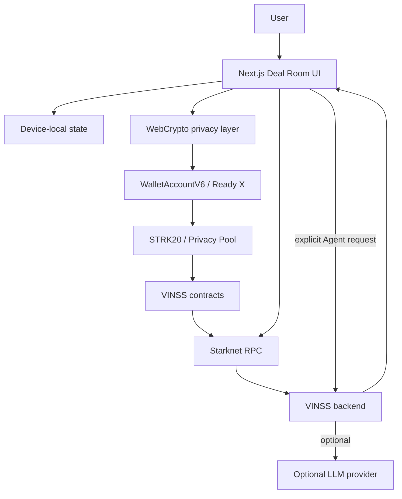
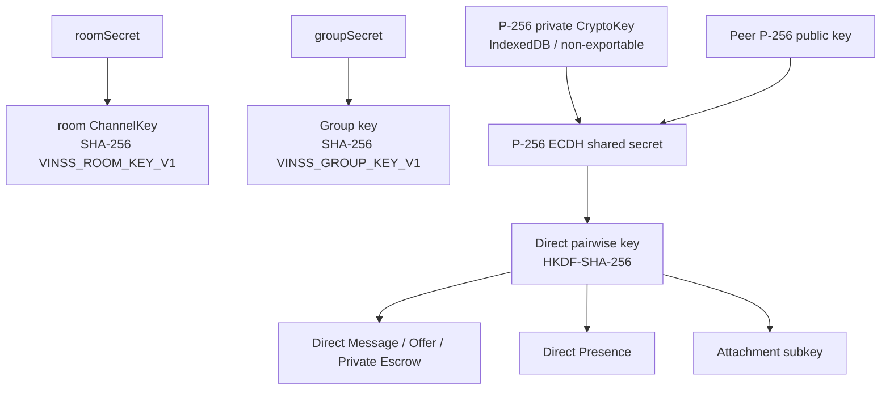
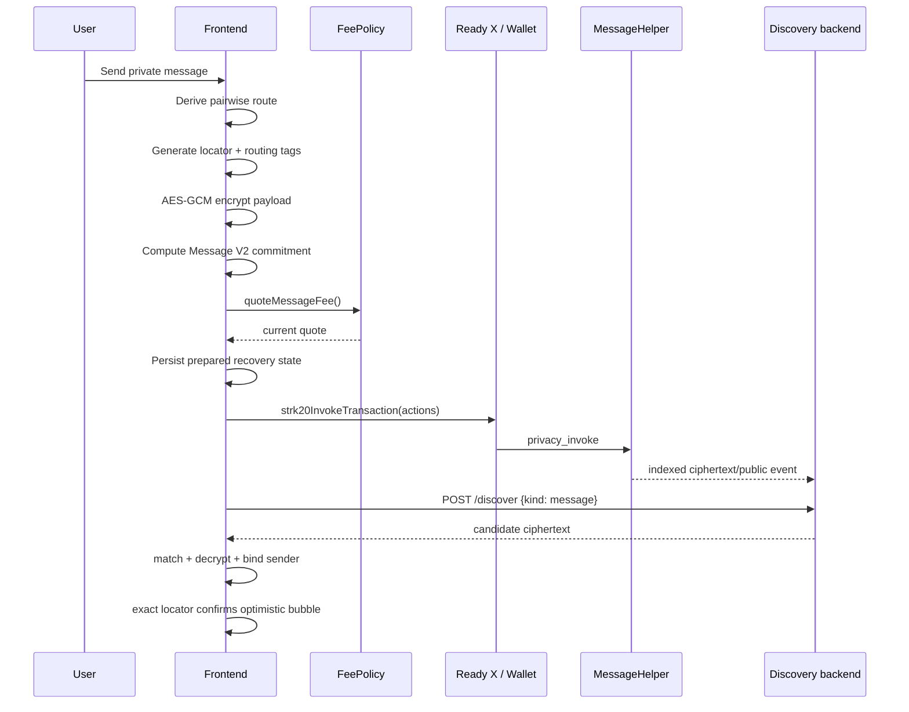
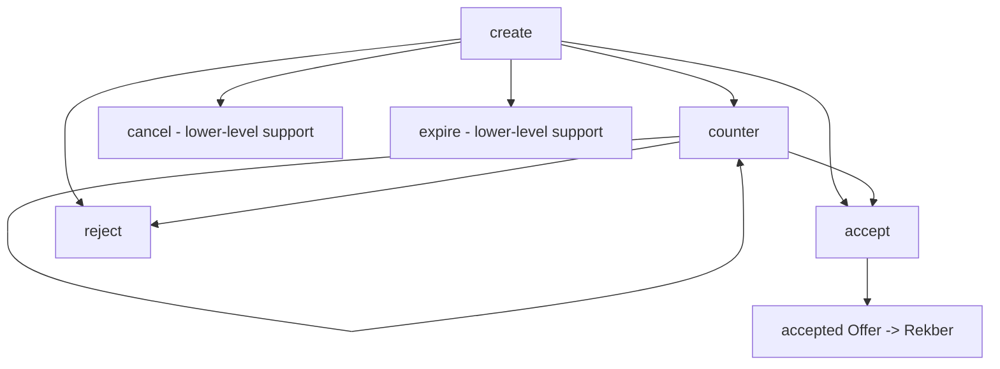
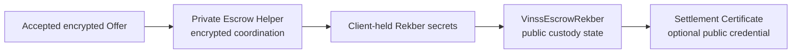
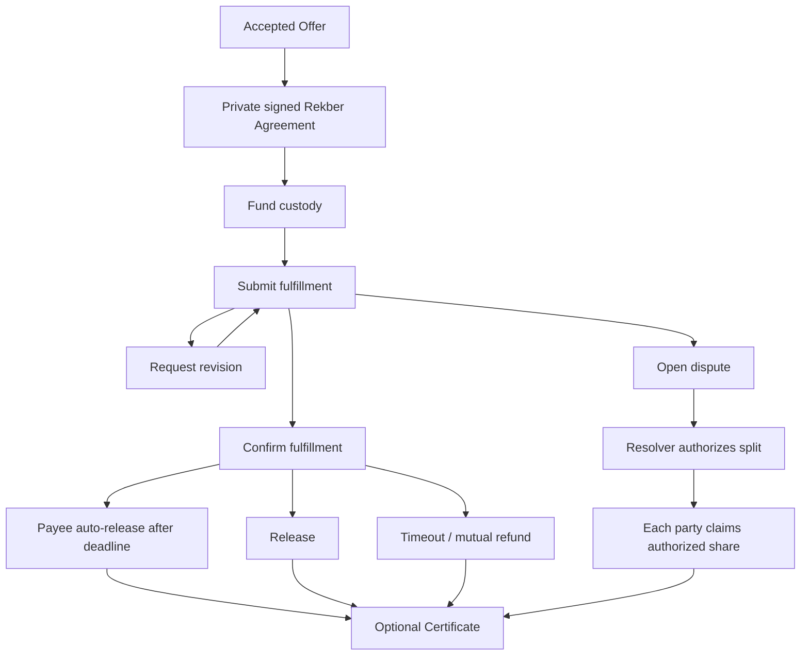
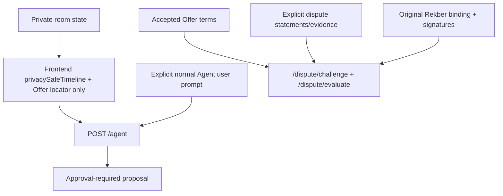
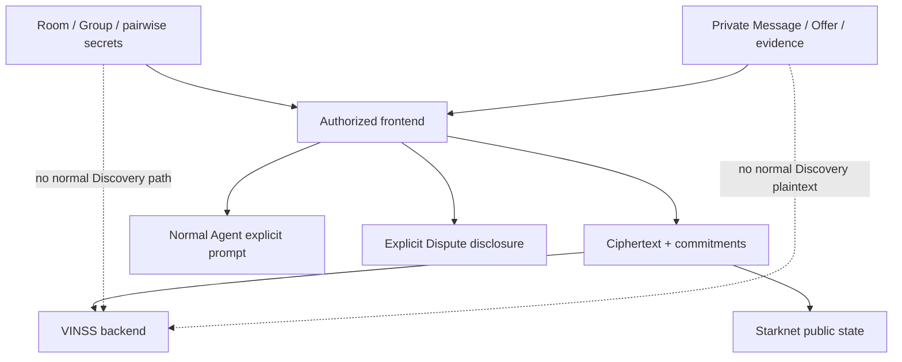
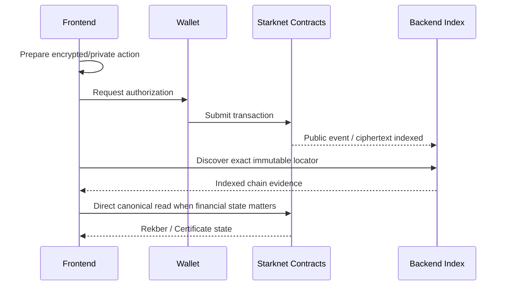

# VINSS Frontend Technical Reference

The VINSS frontend is the privacy-sensitive client and orchestration layer of the Deal Room.

It owns the application state that must remain on the authorized user device, including:

- room and Group access material;
- per-room messaging identity material;
- pairwise key derivation;
- Message, Offer, and Private Escrow encryption/decryption;
- opaque routing-tag derivation and validation;
- wallet capability detection and wallet-authorized Starknet submission;
- optimistic state and delayed-wallet recovery;
- local encrypted history;
- direct attachment encryption and integrity verification;
- Rekber secret generation and capability commitments;
- direct reads of canonical Rekber state;
- optional Settlement Certificate claim UX;
- privacy-reduced normal Agent context;
- explicit Dispute Agent disclosure/attestation UX.

The backend is deliberately useful without becoming the normal Deal Room decryption authority.

However, the accurate privacy statement is not that the backend never receives plaintext.

Normal Discovery is keyless and ciphertext-only, while explicit features such as the normal Agent user prompt, Feedback, and especially the dedicated Dispute workflow have separate plaintext boundaries.

Repository source is the authority for implementation claims. Test output and deployed-chain evidence are separate evidence classes.

---

# Current Frontend Baseline

Current audited source is the `main` branch after the backend documentation cleanup.

The frontend currently uses:

- Next.js 16.3.x;
- React 19.2.x;
- Starknet.js 10.4.0;
- Wallet Standard V6 integration;
- STRK20 Wallet API capability detection;
- WebCrypto AES-GCM, HMAC-SHA-256, P-256 ECDH, HKDF-SHA-256, and SHA-256;
- browser IndexedDB and localStorage;
- VINSS Railway backend APIs;
- Starknet RPC reads;
- VINSS Invite, Message Helper, Offer Helper, Private Escrow Helper, Rekber, Settlement Certificate, and FeePolicy contracts.

---

# Evidence Vocabulary

Use these labels separately:

```text
Implemented in source
Source / logic tested
Cross-layer regression tested
Browser E2E tested
Sepolia on-chain verified
Mainnet verified
```

Do not promote one evidence level into another.

For example:

```text
`depositEscrow()` exists
    = Implemented in source

`rekber-protection.test.ts` covers a guard
    = Source / logic tested

a real Ready X transaction succeeded on Sepolia
    = Sepolia on-chain verified

a mainnet transaction exists for the release commit
    = Mainnet verified
```

This README primarily documents implementation structure and known test-source coverage. It does not invent live-chain verification that is not present in the audited source.

---

# Capability Matrix

| Capability | Current frontend responsibility | Source status | Important boundary |
|---|---|---|---|
| Room access | Device-local room record and room-secret-derived key | Implemented | Room secret is device-local application secret |
| Invite V3 | Direct / Group encrypted invite creation, recovery, consume | Implemented | Invite key is URL-fragment capability material |
| Participant discovery | Encrypted Presence + encrypted room-message fallback | Implemented | Public P-256 key may be cached locally; private key stays IndexedDB |
| Direct Chat | Pairwise encrypted Message V2 send/discover/reconcile | Implemented | Pairwise key stays client-side |
| Group Chat | Group-secret-derived encrypted Message V2 flow | Implemented | Group definition/secret is currently local application state |
| Direct attachments | Client encrypt/decrypt + backend opaque blob store | Implemented | Backend receives ciphertext and capability token, not content key |
| Structured Offer | Direct pairwise Offer V2 lifecycle | Implemented | Active room hook is direct/pairwise |
| Offer lifecycle | create/counter/accept/reject plus lower-level cancel/expire support | Implemented | Immutable action-per-locator model |
| Private Escrow coordination | Pairwise encrypted coordination V2 | Implemented | Helper is coordination, not custody |
| Rekber custody | Funding, fulfillment, review, revision, dispute, release/refund/claims | Implemented | Public contract state + client-held capability secrets |
| Rekber protection guards | UI eligibility predicates | Source-tested | UI guards do not replace Cairo invariants |
| Dispute Agent | Explicit evidence case, signatures, backend challenge/evaluate | Implemented | This is intentional plaintext disclosure |
| Settlement Certificate | Public direct wallet claim + contract reads | Implemented | Claim is intentionally public, not STRK20-private |
| Presence | typing/read/participant/group_member encrypted relay | Implemented | Ephemeral, non-canonical |
| Normal VINSS Agent | Explicit user prompt + privacy-reduced context + proposals | Implemented | No automatic full private timeline |
| Activity / Royalty UI | Public backend/index-derived views | Implemented in room UI | Public metadata, not private room authority |
| Mainnet configuration template | Explicit mainnet env example | Implemented | Runtime constants still have development Sepolia fallbacks |

---

# Frontend Execution Topology



The important distinction is that the frontend can read from both:

```text
backend read models
and
direct Starknet RPC
```

depending on the subsystem.

Message/Offer/Private Escrow discovery uses the backend's persistent ciphertext index.

Rekber custody reads and Settlement Certificate reads can use direct Starknet RPC from the browser.

---

# Active User-Level Flow

A representative direct deal flow is:

```text
Create or join room
    ↓
obtain room access
    ↓
publish / discover messaging identity
    ↓
select direct peer
    ↓
derive P-256 pairwise key
    ↓
private Message
    ↓
private structured Offer
    ↓
counter / accept / reject
    ↓
accepted Offer snapshot
    ↓
private Rekber Agreement coordination
    ↓
public Rekber funding
    ↓
work submission / confirmation / revision / dispute
    ↓
release / refund / resolution claim
    ↓
optional public Settlement Certificate
```

Group messaging is a separate current branch of the conversation UI:

```text
Room
    ↓
Groups directory
    ↓
local Group definition + Group secret
    ↓
encrypted Group membership Presence
    ↓
encrypted Group Message V2
```

Current structured Offer and Rekber hooks remain centered on direct participant/pairwise workflows.

---

# Key Hierarchy



Three different application-key concepts must not be conflated:

```text
room key
    derived from roomSecret

Group key
    derived from groupSecret

direct pairwise key
    derived from per-room P-256 ECDH + HKDF
```

---

# Room Key — Active Path

`frontend/lib/privacy/channelKey.ts` currently derives the room key as:

```text
SHA-256(
  "VINSS_ROOM_KEY_V1:" + roomSecret
)
```

This is the active room-key path used by the current UI.

The room key is not a STRK20 viewing key.

---

# STRK20 Viewing-Key ECDH Scaffold

`deriveChannelKeyViaEcdh()` also exists in `channelKey.ts`, but it is explicitly scaffolded and not the current UI path.

It depends on a future/confirmed lookup for a recipient's registered viewing public key.

Therefore documentation must not say:

```text
the current room channel key is already derived through STRK20 viewing-key ECDH
```

unless that source path is later wired into the application.

---

# Direct Messaging Identity

Each room + wallet gets a P-256 messaging identity.

Identity key:

```text
<roomId>:<canonical Starknet wallet address>
```

The implementation:

1. looks for an existing IndexedDB identity;
2. migrates old address-format aliases when necessary;
3. serializes concurrent creation requests;
4. generates P-256 ECDH material when absent;
5. exports the public key;
6. temporarily exports private JWK during creation;
7. re-imports the private key with `extractable=false`;
8. persists the non-exportable private `CryptoKey` in IndexedDB.

---

# Address Canonicalization

Starknet wallet addresses can appear with different leading-zero formatting.

The frontend normalizes them numerically where identity equality matters:

```text
0x000abc
and
0xabc
```

are treated as the same felt address.

This matters for:

- IndexedDB messaging identity reuse;
- participant deduplication;
- direct route selection;
- Offer replies;
- private Escrow coordination;
- Group membership;
- recovery after wallet reconnect/background transitions.

---

# Direct Pairwise Key Derivation

Current direct key derivation:

```text
Alice P-256 private key
+
Bob P-256 public key
    ↓
P-256 ECDH deriveBits(256)
    ↓
HKDF input material
    ↓
salt = SHA-256("VINSS_ROOM:" + roomId)
info = "VINSS_DIRECT_MESSAGE_KEY_V1"
hash = SHA-256
    ↓
256-bit direct pairwise key
```

Alice and Bob can derive the same pairwise key.

Another room participant cannot derive that pairwise key merely from the shared room secret.

---

# Group Key

Current Group key derivation is:

```text
SHA-256(
  "VINSS_GROUP_KEY_V1:" + groupSecret
)
```

The domain separator prevents an identical secret byte string from producing the same key as the room-secret derivation.

---

# Envelope Encryption

Shared application payload encryption currently uses:

```text
AES-GCM
fresh 12-byte / 96-bit IV
JSON serialization
30 bytes per Starknet felt chunk
maximum 64 chunks
```

The IV is prepended before felt packing.

The encrypted Message/Offer/Private Escrow modules then compute module-specific Poseidon commitments.

---

# Current Envelope Versions

Canonical current application envelope versions:

| Domain | Version | Commitment domain |
|---|---:|---|
| Message | 2 | `VINSS_MSG_COMMIT_V2` |
| Offer | 2 | `VINSS_OFFER_COMMIT_V2` |
| Private Escrow coordination | 2 | `VINSS_PRIVATE_ESCROW_COMMIT_V2` |

These V2 labels refer to encrypted envelope formats.

They do not imply:

```text
VinssEscrowRekberV2
```

is the canonical current custody contract.

---

# Opaque Routing Tags

Message/Offer/Private Escrow direct routing uses HMAC-SHA-256.

Conceptually:

```text
HMAC-SHA-256(
  routingKey,
  "VINSS_MSG_ROUTE_V2:"
  + role
  + identity
  + actionLocator
)
```

The first 31 digest bytes become a Starknet felt.

`actionLocator` is included, so the public tag changes for each action even when the same participant acts repeatedly.

The contract/backend does not need a reusable plaintext direct-conversation identifier.

---

# Action Locators

Each encrypted Message, Offer, and Private Escrow action receives a fresh locator.

The locator combines:

```text
application key material
+
31 random bytes
+
Poseidon
```

and is reduced into the Starknet field.

Locators are action identities, not stable:

```text
room IDs
conversation IDs
participant IDs
offer-thread IDs
custody IDs
```

---

# Discovery vs Decryption

Discovery and decryption are separate.

Current Message request:

```json
{ "kind": "message" }
```

Current Offer request:

```json
{ "kind": "offer" }
```

Current Private Escrow coordination request:

```json
{ "kind": "escrow" }
```

The frontend does not send its pairwise or room key in these requests.

The backend returns candidate ciphertext/public opaque metadata.

The browser then:

1. derives expected recipient tag for a local private route;
2. skips nonmatching records;
3. decrypts locally;
4. validates sender-tag binding;
5. validates encrypted recipient identity where the domain supports it;
6. renders only authenticated matching records.

---

# Direct Message Send Flow



---

# Message Fee Path

Message revenue is not supposed to come from a stale frontend constant.

Immediately before Ready builds the private transaction, the frontend:

1. asks MessageHelper for its FeePolicy address;
2. calls `quote_fee(message action)`;
3. requires a positive quote;
4. builds the STRK20 action bundle with that quote;
5. lets the helper validate the quote on-chain.

---

# Message STRK20 Bundle

The current Message send builds actions conceptually as:

```text
withdraw quoted fee token -> MessageHelper

transfer OPEN note -> VINSS treasury

invoke MessageHelper privacy_invoke
    Message V2 envelope
    quoted_fee
    wallet-created open_note_id
```

Additional invokes may be attached for selected lifecycle behavior, with Rekber-sensitive debug calldata redacted on error.

---

# Prepared-State Boundary

`onPrepared` is deliberately called only after:

```text
encryption
commitment construction
calldata construction
FeePolicy preflight
configuration preflight
```

have succeeded.

This reduces ghost pending UI records from failures that occurred before Ready X was ever invoked.

---

# Direct Message Recovery

Mobile wallet callback state is not treated as canonical chain truth.

Current direct-message flow:

```text
onPrepared gives immutable locator
    ↓
save encrypted pending record
    ↓
render optimistic bubble
    ↓
open Ready X
    ↓
wallet success / timeout / ambiguous error
    ↓
poll ciphertext Discovery for exact locator
    ↓
found
    -> confirmed transaction hash

not found by reconciliation deadline
    -> remove only optimistic record
    -> restore draft
```

---

# Direct Message Recovery Timings

Current source uses:

```text
wallet callback timeout:
20 seconds

locator reconciliation window:
45 seconds

reconciliation polling:
approximately every 1.5 seconds
```

These are UX/recovery values, not protocol finality guarantees.

---

# Direct Message Local History

Confirmed/optimistic direct conversation history is persisted through `encryptedChatCache.ts`.

Current history key namespace:

```text
vinss:direct-history:v2:<roomId>:<self>:<peer>
```

The history record is AES-GCM encrypted before being written to localStorage.

Current implementation uses the room `channelKey` as the local-history encryption key.

Do not overstate this as:

```text
every device-local VINSS value is encrypted
```

because other local state classes are stored differently.

---

# Pending Direct Message Record

Pending direct-message recovery uses:

```text
vinss:pending-direct-message:<roomId>:<self>:<peer>
```

The pending record is encrypted with the direct pairwise key and contains recovery data such as:

```text
action locator
message body
sentAt
recipient
createdAt
```

---

# Failed Local Decryption

`loadEncryptedLocalJson()` does not automatically delete a record if decryption fails.

Reason:

```text
a temporarily stale/incorrect key may be present while room/participant state rehydrates
```

Deleting encrypted recovery data on the first failed decrypt could destroy otherwise recoverable local state.

---

# Browser Console Privacy Caveat

Current `discoverMessages()` contains a developer log that prints decrypted Message information including:

```text
body
attachment metadata
workEvidence metadata
```

to the browser console.

This does not send the plaintext to VINSS backend.

But it does mean the strict production claim:

```text
decrypted Message plaintext never enters diagnostics
```

is not currently true.

Before a strict production privacy posture, remove or gate that decrypted-message console log.

---

# Participant Discovery

Direct chat needs a peer's:

```text
Starknet address
P-256 messaging public key
```

Current participant discovery combines two encrypted sources:

```text
room-level participant Presence
+
room-key Message discovery fallback
```

---

# Participant Presence

Each active room wallet publishes an encrypted:

```text
type = participant
senderAddress
messagingPublicKey
sentAt
```

payload under the room key.

Current publish schedule:

```text
immediately
then about every 60 seconds
TTL 24 hours
```

Participant refresh polls roughly every:

```text
3 seconds
```

while active.

---

# Participant Local Cache

Peers may also be cached in plaintext localStorage as:

```text
address
public P-256 messaging key
```

under a key like:

```text
vinss:participants:<roomId>:<canonical-self>
```

This cache is a UX optimization.

It is not private Message plaintext, but it is local relationship metadata.

---

# Direct Presence

Direct Presence derives a relay channel ID from the pairwise key using HMAC-SHA-256 over:

```text
VINSS_DIRECT_PRESENCE_V1
```

and encrypts the semantic payload with AES-GCM.

Current semantic kinds:

```text
typing
read
participant
group_member
```

Not all kinds use the same key scope:

- direct typing/read use the direct pairwise key;
- room participant announcements use the room key;
- Group membership announcements use the Group key.

---

# Presence Is Not Canonical Evidence

Presence is ephemeral UX.

It must not be treated as canonical proof of:

```text
wallet ownership
message delivery
offer acceptance
Rekber authorization
settlement
dispute truth
```

---

# Direct Attachments

Direct attachments are encrypted in the browser before backend upload.

Current maximum plaintext file size:

```text
20 MiB
```

Current frontend flow:

1. generate UUID attachment ID;
2. generate random 32-byte access capability token;
3. derive attachment subkey from direct pairwise key via HKDF-SHA-256;
4. use attachment ID as salt;
5. use `VINSS_DIRECT_ATTACHMENT_V1` as HKDF info;
6. encrypt file with AES-GCM-256;
7. bind attachment ID as AES-GCM additional data;
8. compute SHA-256 of plaintext;
9. upload ciphertext bytes to backend;
10. send attachment reference through the encrypted direct conversation;
11. on download, decrypt locally and re-check plaintext SHA-256.

---

# Attachment Data Split

Backend blob request sees:

```text
attachment UUID
bearer capability token
ciphertext bytes
```

The encrypted direct Message can carry:

```text
access token
IV
file name
MIME type
size
plaintext SHA-256
```

Because that reference itself is inside the direct encrypted Message, it is not intended as public on-chain plaintext.

---

# Group Model

Group support is active in current source.

This is an important correction from earlier planning states where Group was postponed.

Current Group state is device-local application state.

A `LocalRoomGroup` includes:

```text
id
roomId
name
groupSecret
ownerAddress
createdAt
members[]
```

---

# Group Local Storage

Current namespace:

```text
vinss:local-groups:v1:<roomId>
```

The Group object is JSON-serialized directly to localStorage.

Therefore:

```text
groupSecret is currently stored plaintext in browser localStorage
```

on that device.

This is a local-device security boundary, not a backend disclosure.

---

# Room Local Storage

Current room records are stored in:

```text
vinss:local-rooms
```

A normal direct-access room contains:

```text
id
label
roomSecret
createdAt
```

Therefore:

```text
roomSecret is currently stored plaintext in browser localStorage
```

on that device.

---

# Local Secret Security Implication

The privacy model protects backend knowledge, but current device-local persistence means:

```text
browser profile compromise
XSS with storage access
device compromise
malicious extension access
```

can threaten room/group secrets.

Non-exportable IndexedDB P-256 private keys improve one secret boundary but do not make all local application state non-exportable.

---

# Group-Only Invite Isolation

A Group-only Invite intentionally does not need to disclose the room secret.

After consume, a local room can exist with:

```text
roomSecret = ""
```

while the joined Group has its own Group secret.

Such a device can participate in that Group without gaining room-level direct Chat access merely from the Group invite.

---

# Group Membership

Current Group membership sync uses encrypted Presence with:

```text
type = group_member
groupId
senderAddress
role
sentAt
```

encrypted under the Group key.

Current Group membership publisher:

- publishes at most roughly once per minute per local Group;
- uses a 24-hour TTL;
- polls current Group Presence roughly every 5 seconds;
- treats the locally stored owner address as admin authority for Group creation/invite UI.

---

# Group Message Flow

Group Message uses the same Message V2 helper format but:

```text
encryption key = Group key
recipient routing identity = group
payload scope = group
payload groupId = selected Group
```

The UI keeps direct and Group conversation state separate.

---

# Group Message Recovery

Current Group pending record stores non-plaintext recovery metadata:

```text
actionLocator
sentAt
createdAt
```

under:

```text
vinss:pending-group-message:<roomId>:<groupId>:<wallet>
```

This differs from direct pending recovery, which stores an encrypted record containing the draft body.

---

# Invitation V3

Current Invite format is V3.

Legacy V2 decoding remains supported for compatibility.

Scopes:

```text
direct
group
```

---

# Invite TTL

Current direct Invite TTL:

```text
1 hour
```

Current Group choices:

```text
24 hours
7 days
```

---

# Invite Payload

A direct Invite can contain:

```text
v
inviteId
scope
roomId
roomSecret
onchainSecret
label
inviterAddress
expiresAt
```

A Group Invite can instead carry bound Group metadata:

```text
groupId
groupName
groupSecret
groupOwnerAddress
```

and need not grant the room secret.

---

# Invite Encryption

Current Invite V3 encryption:

```text
random 32-byte AES key
fresh 12-byte IV
AES-GCM
AAD = VINSS_INVITE_V3
```

The link shape is effectively:

```text
/invite/<encrypted-token>#k=<private-key-material>
```

The fragment keeps key material out of normal HTTP path/query routing.

---

# Invite On-Chain Commitment

The plaintext on-chain secret is not used as the public Invite identifier directly.

Frontend computes a Poseidon commitment with the Invite domain before CREATE.

The contract enforces the one-time/expiry semantics against the on-chain Invite record.

---

# Invite Create Recovery

Invite link material is prepared before Ready X opens.

Current hook persists:

```text
link
expiresAt
commitment
pending/ready status
```

to localStorage so a mobile background/remount can recover the created capability.

This means active Invite capability material is also sensitive device-local state.

---

# Invite Timeout Recovery

If the wallet callback times out after CREATE, the frontend checks:

```text
get_invite(commitment)
```

before treating the operation as failed.

This follows the same general VINSS rule:

```text
wallet callback != canonical final truth
```

---

# Invite Consume

The invite page:

1. reads encrypted token from route;
2. reads the private decryption key from URL fragment;
3. decrypts V3 or compatible V2 payload locally;
4. validates expiry/client format;
5. requires wallet connection;
6. consumes the one-time Invite on-chain;
7. persists room and/or Group access locally;
8. marks the Invite ID as locally consumed;
9. redirects into direct Chat or Group context.

---

# Invite Consume Replay UX

The device keeps up to 100 locally remembered consumed Invite IDs.

This is a local UX guard.

The canonical one-time property remains the on-chain Invite contract state.

---

# Offer Architecture

Current active Offer hook is a direct/pairwise system.

The direct Offer uses the same per-room P-256 ECDH-derived pairwise key as direct Chat.

Offer terms, parties, and lifecycle fields remain encrypted.

---

# Offer V2

Current Offer public envelope commits to:

```text
VINSS_OFFER_COMMIT_V2
version 2
action locator
sender tag
recipient tag
chunk count
ciphertext chunks
```

---

# Offer Lifecycle

Low-level Offer module exposes:

```text
create
counter
accept
reject
cancel
expire
```

The currently wired room hook actively exposes:

```text
create
counter
accept
reject
```

so documentation should distinguish library support from current UI call sites.

---

# Offer Lifecycle Graph



Each lifecycle action is immutable and receives a fresh action locator.

Parent/root references are part of encrypted Offer semantics rather than a public reusable Deal Room thread identifier.

---

# Offer Parent Authentication

Cached Offer cards are not automatically trusted as authenticated private parents.

Before lifecycle reply, the hook can refresh Discovery to prove which private route decrypted the parent.

The authenticated historical parent route is evidence that this wallet could decrypt the parent.

A new reply still derives the current Alice↔Bob pairwise key rather than blindly reusing a stale historical ECDH route.

---

# Offer Local History

Offer history is saved encrypted under:

```text
vinss:offer-history:v1:<roomId>:<wallet>
```

using the room `channelKey` in current source.

---

# Offer Fee Path

Immediately before Ready submission:

```text
OfferHelper.get_fee_policy()
    ↓
FeePolicy.quote_fee(OFFER)
    ↓
positive quote
    ↓
STRK20 fee/OpenNote/invoke bundle
```

The helper validates the supplied quote on-chain.

---

# Accepted Offer → Rekber Boundary

`escrowSettlement.ts` is the narrow pure mapping from encrypted accepted Offer semantics into generic settlement parameters.

Deal-specific terms stay in the private Offer snapshot.

Public Rekber needs generic financial/capability state.

---

# Supported Settlement Assets

Current mapping supports:

| Asset | Decimals | Address source |
|---|---:|---|
| STRK | 18 | `NEXT_PUBLIC_STRK_ADDRESS` |
| USDC | 6 | `NEXT_PUBLIC_USDC_ADDRESS` |

---

# Exact Amount Conversion

Accepted decimal amount strings are converted using string/BigInt arithmetic.

No JavaScript floating-point conversion is used for the settlement principal.

Example:

```text
500 USDC
    -> 500_000000 base units

1000 STRK
    -> 1000 * 10^18 base units
```

---

# Accepted Offer Snapshot

The private snapshot can preserve:

```text
acceptedOfferLocator
termsOfferLocator
rootOfferLocator
dealType
asset
amount
paymentTerms
conditions
expiresAt
```

This permits Freelance, NFT, Goods, Bounty, OTC, and other DealType semantics to remain in encrypted application data while Rekber receives generic settlement state.

---

# One Accepted Offer → One Rekber Lifecycle

Current room UI explicitly avoids silently reusing an accepted Offer that already has a Rekber create coordination action.

Released/refunded Rekber can remain visible as history.

A new Rekber requires a new eligible accepted Offer rather than recycling the old one.

---

# Private Escrow Coordination vs Rekber Custody

This separation is critical.



The Private Escrow Helper is not the token custody contract.

It records encrypted coordination actions.

`VinssEscrowRekber` is the custody/state machine.

---

# Private Escrow V2 Coordination

Current encrypted coordination uses:

```text
VINSS_PRIVATE_ESCROW_COMMIT_V2
version 2
fresh action locator
opaque sender/recipient tags
AES-GCM ciphertext
```

and is discovered through:

```json
{ "kind": "escrow" }
```

with local route matching/decryption.

---

# Private Escrow Coordination Fees

Current source classifies these encrypted coordination actions as fee-bearing:

```text
create    payer Agreement
accept    payee Agreement
dispute   explicit dispute coordination
```

Other background coordination actions use a negligible replay-protection spend instead of another VINSS revenue fee.

---

# Rekber Workflow Fee Caveat

`quoteRekberWorkflowFee()` currently resolves the Rekber revenue FeePolicy reference but then returns:

```text
3 STRK
```

as a frontend application workflow amount.

This is different from:

```text
Invite / Message / Offer
    -> direct FeePolicy quote

Rekber funding
    -> Rekber quote_rekber_fee(token, principal)
```

Therefore documentation must not describe every frontend fee as dynamically returned from `FeePolicy.quote_fee()`.

---

# Rekber Funding Quote

Funding uses:

```text
VinssEscrowRekber.quote_rekber_fee(token, principal)
```

immediately before wallet submission.

The Rekber contract owns the token-aware 2% / lifecycle-reserve-floor logic.

---

# Rekber Client Secrets

Frontend generates capability material for:

```text
release authorization
refund
payer confirmation
payer dispute
payee claim
payee dispute
payee refund consent
fulfillment secret chain
revision secret chain
payer certificate claim
payee certificate claim
```

Only commitments/authorized preimages are exposed according to the Rekber state transition being executed.

---

# Rekber Secret Chains

Fulfillment/revision chains support bounded rounds.

Current generator accepts:

```text
0..8 rounds
```

and derives chain heads using domain-separated Poseidon commitments.

---

# Rekber Public Custody State

The current browser parser maps a 39-field `get_custody` result into typed frontend state.

Important categories include:

- all capability commitments;
- token and principal;
- fee amount;
- refund/review/revision times;
- verification policy;
- fulfillment/revision rounds;
- fulfillment/dispute evidence commitments;
- resolution commitment and payer/payee allocation;
- lifecycle booleans;
- created/fulfilled/settled timestamps.

---

# Rekber State Actions Implemented

Current frontend functions include:

```text
depositEscrow
releaseEscrow
refundEscrow
submitRekberFulfillment
confirmRekberFulfillment
requestRekberRevision
openRekberDispute
autoReleaseEscrow
mutualRefundEscrow
claimRekberResolution
```

plus direct custody/proof reads and Settlement Certificate operations.

---

# Rekber Lifecycle



This diagram is a frontend capability map, not a substitute for exact Cairo transition conditions.

---

# UI Guard vs Contract Invariant

`rekberProtection.ts` provides UI predicates such as:

```text
canTimeoutRefundRekber
canConfirmCounterpartyFulfillment
canOpenRekberDispute
canAutoReleaseRekber
canClaimRekberResolution
canAuthorizeMutualRefundConsent
canCompleteMutualRefund
```

These improve UX and are source-tested.

They are not the financial security boundary.

The Cairo Rekber contract remains authoritative.

---

# Rekber Coordination Recovery

Private Escrow coordination has a stronger mobile-wallet reconciliation pattern.

Current flow:

```text
prepare locator/commitment
    ↓
invoke Ready X
    ↘
     wallet result
    ↘
     indexed encrypted Discovery

exact locator found
    -> authoritative UI confirmation

no locator after 45s
    -> fail and instruct sync before retry
```

Even a wallet success callback is treated as transport information until the exact prepared locator appears in indexed Discovery.

---

# Explicit User Cancellation

Rekber coordination distinguishes an explicit user cancellation from ambiguous wallet errors.

An explicit cancellation can fail immediately.

Other wallet failures remain potentially ambiguous and are checked against on-chain/indexed state first.

---

# Rekber Work Evidence

Direct conversation currently includes work-submission/review functions tied to Rekber.

The frontend supports:

```text
work evidence packet
work review packet
evidence commitment
optional encrypted attachment
submit fulfillment
confirm/reject/revision workflow
```

Detailed evidence transport belongs in the dedicated Rekber/privacy docs, but the important README boundary is:

```text
business evidence stays encrypted/off-chain
while
public Rekber receives commitments/state transitions
```

---

# Dispute Agent — Separate Trust Boundary

The dedicated Dispute Agent must not be described as the same privacy model as normal automatic Agent context.

Dispute is an explicit disclosure workflow.

Current case may contain:

```text
accepted Offer terms
principal metadata
payer statement
payee statement
evidence
wallet addresses
on-chain state snapshot
```

and is sent to backend for challenge/evaluation after user action.

---

# Dispute Agent Binding

Frontend reconstructs a minimal original Rekber Agreement binding from encrypted coordination records.

The binding includes commitments and original coordination signatures for payer setup and payee acceptance.

It does not require exposing the private Rekber capability preimages merely to prove party binding.

---

# Dispute Agent Attestation

The frontend requests:

```text
POST /dispute/challenge
```

receives typed data for payer/payee, then uses:

```text
account.signMessage(typedData)
```

to create the attestation signatures.

Evaluation goes to:

```text
POST /dispute/evaluate
```

with:

```text
case
payer/payee attestations
original Rekber binding
```

---

# Normal Agent vs Dispute Agent



Normal Agent automatically reduces context.

Dispute intentionally sends selected plaintext because arbitration cannot evaluate undisclosed evidence.

---

# Normal Agent Frontend Sanitization

`frontend/lib/agent.ts` maps timeline summaries into generic labels such as:

```text
Encrypted Offer action
Encrypted private message
Encrypted private activity
```

and reduces latest Offer automatic context to:

```text
actionLocator
```

when possible.

`roomLabel` is accepted in the input TypeScript shape but is not placed into the current network request context.

---

# Normal Agent Explicit Prompt

The user's Agent `message` itself is plaintext by design.

Therefore accurate wording is:

```text
normal Agent avoids automatically sending decrypted Deal Room history
```

not:

```text
Agent sends no plaintext
```

---

# Agent Proposals

Current typed proposal kinds include:

```text
draft_message
draft_offer
draft_counter_offer
prepare_escrow
review_rekber
```

and all are typed:

```text
requiresApproval: true
```

The backend Agent remains proposal/reasoning infrastructure, not the user's wallet transaction authority.

---

# Wallet Session

Current wallet client uses:

```text
WalletAccountV6.connect
Wallet Standard V6
configured RPC URL
```

The returned VINSS session includes:

```text
account
address
wallet
strk20Capable
```

---

# STRK20 Capability Detection

Capability is detected using supported Wallet API versions.

Current minimum:

```text
0.10.3
```

The frontend does not infer STRK20 support from a failed transaction.

---

# Wallet Authority

VINSS constructs actions.

The wallet remains the user transaction authority.

Normal pattern:

```text
frontend prepares
    ↓
wallet approval
    ↓
STRK20 Wallet API or direct account.execute
    ↓
Starknet
```

---

# STRK20 vs Direct Public Execute

Most private workflow transactions use:

```text
account.strk20InvokeTransaction(...)
```

The Settlement Certificate claim intentionally uses:

```text
account.execute(...)
```

directly against the Certificate contract.

Reason:

```text
the Certificate is intentionally public credential/evidence
```

and its recipient wallet must directly claim its own acknowledgement.

---

# Fee Architecture

Do not treat all frontend fees as one mechanism.

| Action | Current source of amount |
|---|---|
| Room activation / Invite CREATE | Invite helper FeePolicy quote |
| Message | MessageHelper FeePolicy quote |
| Offer | OfferHelper FeePolicy quote |
| Rekber funding | `quote_rekber_fee(token, principal)` |
| Selected Rekber workflow actions | current frontend 3 STRK workflow amount |
| Replay-only coordination | negligible current spend (for example 10 wei) |

---

# FeePolicy Address Resolution

Message/Offer/Invite helpers expose:

```text
get_fee_policy
```

and the frontend caches the resolved FeePolicy address per helper.

Rekber uses a distinct revenue getter:

```text
get_revenue_fee_policy
```

because its other fee-policy getter has different semantics.

---

# Frontend Advisory Fee Helper

`frontend/lib/agent.ts` also has:

```text
quoteVinssFee(amount, feeBps)
```

using JavaScript `Number` and a default `NEXT_PUBLIC_VINSS_FEE_BPS`.

This is advisory/UI Agent math.

It must not be confused with canonical on-chain FeePolicy/Rekber quotes.

---

# Settlement Certificate

Current frontend can:

```text
compute certificate claim commitment
compute token ID
claim certificate
check is_claimed
get certificate record
```

The claim is direct/public.

---

# Certificate Public Fields

Current frontend record model includes:

```text
tokenId
custodyCommitment
role
recipient
settledAt
issuedAt
```

Claiming creates a public linkage by design.

---

# Rekber Proof Read

`getRekberProof()` can query Starknet events directly for:

```text
funded
released
refunded
resolved
```

using the custody commitment as an indexed event key.

This direct browser RPC proof path is separate from the backend's persistent Rekber index.

---

# Backend Read Models vs Direct RPC

Use the right authority.

```text
Message / Offer / Private Escrow discovery
    -> backend persistent ciphertext index

Rekber custody state
    -> direct RPC get_custody

Rekber proof helper
    -> direct RPC getEvents

Settlement Certificate
    -> direct RPC contract reads / direct claim

Activity / Royalty UI
    -> backend public read models
```

---

# Room UI Composition

`frontend/app/room/[roomId]/page.tsx` currently composes:

```text
RoomHeader
RoomTabs
ConversationPanel
OfferPanel
EscrowPanel
InvitationPanel
ActivityPanel
RoyaltyPanel
AgentPanel
```

with dedicated room hooks rather than one monolithic state hook.

---

# Conversation Targets

Current coordinator interprets:

```text
chat
    private-chat directory

groups
    Group directory

group:<id>
    selected Group

<Starknet address>
    selected direct peer
```

---

# Active Room Hooks

Current audited room hook set:

```text
useDirectConversation.ts
useDirectPresence.ts
useDisputeAgentReview.ts
useGroupConversation.ts
useRekberProtectionActions.ts
useRoom.ts
useRoomAgent.ts
useRoomConversation.ts
useRoomEscrow.ts
useRoomGroups.ts
useRoomInvitation.ts
useRoomOffers.ts
useRoomParticipants.ts
```

This inventory supersedes older README trees that listed only a few hooks.

---

# Application Integration Modules

Current `frontend/lib/deal-room/` includes core modules for:

```text
direct conversation presentation/routing
Dispute Agent
Private Escrow
accepted Offer settlement mapping
Invitation
Messaging
Offer templates
Offers
Rekber authorization
Rekber evidence
Rekber protection
Rekber secrets
Rekber view/state
Settlement
work confirmation / settlement planning
```

The directory is an internal application integration layer.

It is not currently presented as a versioned public SDK contract.

---

# Privacy Modules

Current audited `frontend/lib/privacy/`:

```text
channelKey.ts
directAttachments.ts
encryptedChatCache.ts
envelope.ts
messageRouting.ts
participantKeys.ts
presence.ts
rekberEvidenceChannel.ts
```

---

# Starknet Modules

Current `frontend/lib/starknet/`:

```text
constants.ts
feePolicy.ts
identity.ts
walletClient.ts
walletStore.ts
```

---

# Runtime Configuration

Frontend values come from public build/runtime environment variables.

Important distinction:

```text
NEXT_PUBLIC_* values are client-visible
```

so they must never contain:

```text
wallet private key
provider secret API key
database password
backend resolver private key
room secret
Group secret
```

---

# Frontend Network Default Caveat

Current frontend constants still default:

```text
NEXT_PUBLIC_STARKNET_NETWORK missing
    -> sepolia
```

and current RPC fallback is a public Sepolia Nethermind endpoint.

This differs from the backend, whose current config requires explicit network/RPC.

---

# Mainnet Rule

For mainnet:

```text
never rely on frontend fallback values
```

Use the explicit `frontend/env.mainnet.example` as a checklist and verify every address.

---

# Mainnet Environment Inventory

The current template includes:

```text
NEXT_PUBLIC_STARKNET_NETWORK
NEXT_PUBLIC_RPC_URL
NEXT_PUBLIC_BACKEND_URL
NEXT_PUBLIC_PRIVACY_POOL_ADDRESS
NEXT_PUBLIC_MESSAGE_HELPER_ADDRESS
NEXT_PUBLIC_MESSAGE_HELPER_OPEN_NOTE_TOKEN
NEXT_PUBLIC_INVITE_ADDRESS
NEXT_PUBLIC_OFFER_HELPER_ADDRESS
NEXT_PUBLIC_OFFER_HELPER_OPEN_NOTE_TOKEN
NEXT_PUBLIC_PRIVATE_ESCROW_HELPER_ADDRESS
NEXT_PUBLIC_ESCROW_REKBER_ADDRESS
NEXT_PUBLIC_SETTLEMENT_CERTIFICATE_ADDRESS
NEXT_PUBLIC_STRK_ADDRESS
NEXT_PUBLIC_USDC_ADDRESS
NEXT_PUBLIC_VINSS_TREASURY_ADDRESS
NEXT_PUBLIC_VINSS_FEE_BPS
social-link variables
```

---

# Address Normalization

Frontend normalizes configured Starknet addresses with:

```text
num.toHex(...)
```

to remove zero-padding that can violate strict Wallet API felt-string validation.

---

# Missing Address Behavior

`constants.ts` can produce empty strings for missing address variables.

Individual feature modules then explicitly throw or return unavailable state where required.

Therefore frontend config is not as globally fail-closed as the current backend config.

---

# Local State Classification

| Local state | Storage | Encryption at application layer | Sensitivity |
|---|---|---|---|
| Room record / roomSecret | localStorage | No | High |
| Group record / groupSecret | localStorage | No | High |
| Messaging P-256 private key | IndexedDB `CryptoKey` | non-exportable key object | High |
| Messaging public key | IndexedDB/cache | Public key | Metadata |
| Participant cache | localStorage | No | Relationship metadata |
| Direct history | localStorage | AES-GCM | Private content |
| Direct pending Message | localStorage | AES-GCM under pairwise key | Private content/recovery |
| Offer history | localStorage | AES-GCM | Private terms/history |
| Active Invite link/key | localStorage | No additional wrapper | High capability |
| Group pending Message | localStorage | metadata only | Operational metadata |

---

# Local State Is Not Backend State

Device-local plaintext storage does not mean the VINSS backend receives those values.

But it does change the client threat model.

The authorized browser profile itself is a security boundary.

---

# Client Threat Model

High-impact client threats include:

```text
XSS
malicious browser extension
stolen/unlocked device
compromised browser profile
malicious injected JavaScript
clipboard leakage of invite links
screen capture of capabilities
```

---

# Backend Privacy Boundary

Normal Discovery backend should not receive:

```text
roomSecret
Group secret
pairwise key
P-256 private key
Message plaintext
Offer plaintext
Private Escrow plaintext
wallet private key
```

through the standard ciphertext discovery path.

---

# Backend May Receive

Depending on feature:

```text
ciphertext/public routing metadata
Presence encrypted envelope
attachment ciphertext/capability
explicit normal Agent prompt
Feedback plaintext
explicit Dispute case plaintext
```

---

# Public Chain Metadata

Privacy does not hide all blockchain metadata.

Public state can include:

```text
helper contract
action locator
payload commitment
routing tags
block number
transaction hash
Rekber token and principal
Rekber lifecycle state
Certificate ownership
```

---

# Privacy Trust-Boundary Diagram



---

# Wallet Callback Principle

Across VINSS mobile flows:

```text
wallet callback is not automatically final chain truth
```

because browser/wallet handoff can produce:

```text
late callback
timeout
ambiguous error
page remount
background suspension
```

after a transaction has already been accepted.

---

# Recovery Evidence Hierarchy

For encrypted actions:

```text
exact immutable locator discovered/indexed
    >
wallet callback status
    >
optimistic UI state
```

For Rekber financial state:

```text
canonical contract get_custody
    >
backend read model
    >
frontend cache
```

---

# Current Frontend Tests

Current audited `frontend/tests/` contains three TypeScript test files:

```text
escrow-offer-scenarios.test.ts
rekber-protection.test.ts
dispute-agent.test.ts
```

Current source contains:

```text
5 accepted Offer -> Rekber scenario tests
6 Rekber protection guard tests
1 Dispute Agent case privacy test
```

for a total source inventory of:

```text
12 test(...) cases
```

This is a source count, not a claim that the current working tree has executed/passed them in this documentation audit.

---

# Frontend Test Scripts

Current package scripts include:

```text
npm run typecheck
npm run build
npm run test:escrow-scenarios
npm run test:rekber-protection
npm run test:dispute-agent
npm run test:e2e
npm run test:e2e:video
```

---

# Playwright Evidence Precision

The package exposes Playwright commands.

During this README source inventory, no dedicated Playwright configuration/test suite was established from the inspected frontend root.

Therefore:

```text
Playwright command exists
```

does not automatically mean:

```text
current browser E2E coverage exists and passes
```

---

# Accepted Offer Scenario Coverage

Current scenario cases cover examples for:

```text
Freelance
NFT
Goods
Bounty
OTC
```

and validate the generic accepted-Offer settlement mapping.

They are logic/integration-style source tests, not wallet/browser/on-chain E2E.

---

# Rekber Protection Test Coverage

Current guards cover scenarios including:

```text
payer timeout refund before fulfillment
counterparty-confirm policy
dispute window
payee auto-release
authorized resolution claim
mutual refund role boundaries
```

---

# Dispute Agent Test Coverage

Current frontend Dispute Agent test checks that:

```text
accepted terms + explicit evidence are included
roomSecret is not included
channelKey is not included
```

in the built case object.

---

# Cross-Layer Privacy Regression

The repository-level backend `npm test` also runs `scripts/test-privacy-boundaries.mjs`.

That source-regression script checks selected frontend properties such as:

```text
Message/Offer discovery do not send channelKeyHex
Message/Offer decryption remains local
privacySafeTimeline exists
roomLabel is not automatically sent to Agent
Rekber commitment domains align across frontend/Cairo
old Rekber preparation callbacks remain removed
coordination/retry guards remain present
```

This is cross-layer source regression, not browser E2E.

---

# Recommended Frontend Validation Gate

Before a serious release:

```bash
cd ~/vinss/frontend
npx tsc --noEmit --pretty false
npm run build
npm run test:escrow-scenarios
npm run test:rekber-protection
npm run test:dispute-agent

cd ~/vinss/backend
npm test

cd ~/vinss
git diff --check
```

Then add live wallet/network verification separately.

---

# Live Verification Must Stay Separate

Do not use source existence to assert:

```text
Sepolia on-chain verified
Mainnet verified
```

without actual transaction/run evidence.

---

# Mainnet Frontend Gate

A mainnet frontend release should verify:

```text
NEXT_PUBLIC_STARKNET_NETWORK=mainnet
verified mainnet RPC
verified backend URL
verified Privacy Pool
verified Invite
verified Message Helper
verified Offer Helper
verified Private Escrow Helper
verified Rekber
verified Settlement Certificate
verified fee/OpenNote token
verified STRK token
verified USDC token
verified treasury
wallet STRK20 capability
FeePolicy quotes
two-wallet direct E2E
accepted Offer -> Rekber E2E
release/refund/protection behavior
Certificate claim if in launch scope
```

---

# Frontend Mainnet Caveat

Because the current client has Sepolia development fallbacks, a production build with missing public env can silently point some networking values toward development defaults.

Therefore explicit mainnet build-env verification is a frontend launch requirement.

---

# Mainnet Privacy Gate

Before strong privacy claims:

```text
remove/gate decrypted Message console logging
verify browser/network requests contain no room/channel key
verify Vercel/browser analytics do not capture private state
review localStorage secret threat model
review CSP/XSS posture
verify Agent is explicit
verify Dispute disclosure UX is explicit
```

---

# Source Map — Application Routes

Current top-level application route areas include:

```text
app/
├── api/
├── certificate/
├── invite/
├── loyalty/
├── room/
├── rooms/
├── terms/
├── layout.tsx
├── page.tsx
└── globals.css
```

---

# Source Map — Room

Core room page:

```text
frontend/app/room/[roomId]/page.tsx
```

Primary responsibilities:

```text
room hydration
wallet-aware tab composition
conversation mode
Offer integration
accepted Offer -> Rekber handoff
Invitation integration
Agent context scoping
Activity/Royalty views
```

---

# Source Map — Conversation

```text
frontend/hooks/room/useRoomConversation.ts
frontend/hooks/room/useDirectConversation.ts
frontend/hooks/room/useGroupConversation.ts
frontend/hooks/room/useDirectPresence.ts
frontend/hooks/room/useRoomParticipants.ts
frontend/hooks/room/useRoomGroups.ts
```

---

# Source Map — Offer

```text
frontend/hooks/room/useRoomOffers.ts
frontend/lib/deal-room/offers.ts
frontend/lib/deal-room/offerTemplates.ts
frontend/lib/deal-room/escrowSettlement.ts
```

---

# Source Map — Rekber

```text
frontend/hooks/room/useRoomEscrow.ts
frontend/hooks/room/useRekberProtectionActions.ts
frontend/hooks/room/useDisputeAgentReview.ts
frontend/lib/deal-room/escrow.ts
frontend/lib/deal-room/settlement.ts
frontend/lib/deal-room/rekberAuthorization.ts
frontend/lib/deal-room/rekberEvidence.ts
frontend/lib/deal-room/rekberProtection.ts
frontend/lib/deal-room/rekberSecrets.ts
frontend/lib/deal-room/rekberView.ts
frontend/lib/deal-room/disputeAgent.ts
frontend/lib/privacy/rekberEvidenceChannel.ts
```

---

# Source Map — Privacy

```text
frontend/lib/privacy/channelKey.ts
frontend/lib/privacy/envelope.ts
frontend/lib/privacy/messageRouting.ts
frontend/lib/privacy/participantKeys.ts
frontend/lib/privacy/presence.ts
frontend/lib/privacy/encryptedChatCache.ts
frontend/lib/privacy/directAttachments.ts
```

---

# Source Map — Wallet / Chain

```text
frontend/lib/starknet/constants.ts
frontend/lib/starknet/walletClient.ts
frontend/lib/starknet/walletStore.ts
frontend/lib/starknet/feePolicy.ts
frontend/lib/starknet/identity.ts
```

---

# Source Map — Agent

Normal Agent:

```text
frontend/lib/agent.ts
frontend/hooks/room/useRoomAgent.ts
frontend/components/agent/AgentPanel.tsx
```

Dispute Agent:

```text
frontend/lib/deal-room/disputeAgent.ts
frontend/hooks/room/useDisputeAgentReview.ts
```

---

# Read Documentation in This Order

1. [Architecture](./architecture.md)
2. [Application Flow](./application-flow.md)
3. [Privacy Model](./privacy-model.md)
4. [Invitations](./invitation.md)
5. [Two-Party Private Chat](./direct-chat.md)
6. [Private Offers](./offers.md)
7. [Escrow Rekber](./escrow-rekber.md)
8. [Wallet & STRK20 Integration](./wallet-strk20.md)
9. [Paymaster & Sponsorship Model](./paymaster.md)
10. [Agent Integration](./agent-integration.md)
11. [Local State](./local-state.md)
12. [Configuration](./configuration.md)
13. [Testing & Deployment](./testing-deployment.md)
14. [Current Scope](./current-scope.md)

These filenames are the current technical frontend documentation set.

Group, attachment, work-evidence, and Dispute details currently cross multiple documents/source modules rather than each having a dedicated standalone technical file.

---

# Important Frontend Invariants

## Invariant 1 — Normal Discovery stays keyless

Never add room/pairwise keys to `/discover` request bodies.

---

## Invariant 2 — Direct routes are pairwise

Direct Chat, active direct Offer, and Private Escrow coordination derive a P-256 ECDH pairwise key.

---

## Invariant 3 — Group key is separate

A Group secret derives a Group-specific key with its own domain separator.

---

## Invariant 4 — One action, one locator

Do not turn an action locator into a stable reusable conversation identity.

---

## Invariant 5 — Routing tags bind to locator

Per-action HMAC tags must remain keyed and locator-dependent.

---

## Invariant 6 — Wallet callback is not chain proof

Prepared immutable state must be reconciled against chain/index evidence where the flow implements recovery.

---

## Invariant 7 — Private Escrow is not custody

Encrypted coordination and public Rekber financial state are different domains.

---

## Invariant 8 — Accepted Offer is the terms authority

Rekber generic settlement should derive from an accepted Offer snapshot without exposing deal-specific terms to public custody.

---

## Invariant 9 — UI guards do not replace Cairo

Rekber protection predicates improve UX only.

---

## Invariant 10 — Normal Agent is proposal-only

No normal Agent proposal should silently become wallet execution.

---

## Invariant 11 — Dispute is explicit disclosure

Do not describe Dispute evidence submission as ciphertext-only backend interaction.

---

## Invariant 12 — Certificate is public

Certificate claim is an optional public credential action.

---

# Current Known Frontend Limitations / Caveats

These are important enough to keep visible at the README level.

---

## Caveat — Development network fallback

Frontend currently defaults network/RPC toward Sepolia when env is missing.

Mainnet builds must set all production env explicitly.

---

## Caveat — Local room secret storage

`roomSecret` is stored in browser localStorage.

This protects it from the backend, not from a compromised browser profile.

---

## Caveat — Local Group secret storage

`groupSecret` is stored in browser localStorage.

---

## Caveat — Invite capability storage

Active invite links including fragment key material can be persisted locally for mobile recovery.

---

## Caveat — Decrypted Message console logging

Current Message discovery logs decrypted body/attachment/work metadata to browser developer console.

Remove/gate for strict production privacy.

---

## Caveat — Presence is best effort

Presence is not durable/canonical and can be lost on backend restart or split across replicas.

---

## Caveat — Group state is local-first

Current Group definitions/membership model relies heavily on localStorage plus encrypted ephemeral Presence.

It is not a canonical durable on-chain Group registry.

---

## Caveat — Workflow fee 3 STRK is frontend application policy

Selected Rekber workflow fee is currently a frontend fixed amount rather than a fresh action quote returned directly from `FeePolicy.quote_fee`.

---

## Caveat — Playwright command does not equal verified E2E

Treat browser E2E as a separate execution-evidence question.

---

## Caveat — Frontend config is not globally fail-closed

Some missing env values resolve to empty addresses or development fallbacks and fail only when a feature path is used.

---

# Failure Model

Frontend failures fall into distinct categories:

```text
preflight/config
crypto/key derivation
wallet capability
wallet handoff
STRK20 execution
RPC read
backend index lag
backend outage
local storage failure
provider Agent failure
canonical contract rejection
```

Do not collapse all into:

```text
transaction failed
```

because recovery policy differs.

---

# Preflight Failure

If failure occurs before `onPrepared`:

```text
no immutable prepared action should be assumed to exist
```

and optimistic state should not survive as if wallet submission happened.

---

# Post-Prepared Ambiguity

If a locator already exists:

```text
wallet timeout/error may be ambiguous
```

and the frontend should use the relevant chain/index confirmation path before discarding state.

---

# Backend Index Lag

Immediately after Starknet acceptance, the backend's persistent index can lag briefly.

Reconciliation loops intentionally tolerate temporary misses.

---

# RPC Failure

Direct Rekber/Certificate reads may return unavailable/null while encrypted backend Discovery still works.

Frontend should distinguish these dependency paths.

---

# Agent Failure

Agent provider failure must not block:

```text
Chat
Offer
Rekber
Certificate
```

core user workflows.

---

# Documentation Rules

Frontend technical docs should answer:

```text
What state lives on the device?

What key protects it?

What crosses the network?

What is public on Starknet?

What does Ready X authorize?

What is optimistic?

What becomes authoritative?

What survives a mobile remount?

What is implemented vs actually verified on-chain?
```

---

# Do Not Use Stale Status Copy

Avoid phrases such as:

```text
current fee build redeploy pending
Escrow Rekber E2E pending
Mainnet pending
```

inside architecture documentation unless tied to a dated release/test report.

Why:

```text
implementation source
deployment status
and
network verification
change on different timelines
```

---

# Better Status Language

Prefer:

```text
Implemented in current source.

Covered by current logic tests.

Requires live network evidence for Sepolia/Mainnet verification.
```

---

# Source-of-Truth Order

For frontend implementation behavior:

```text
1. Cairo contract invariants

2. frontend/app/room/[roomId]/page.tsx

3. frontend/hooks/room/*

4. frontend/lib/deal-room/*

5. frontend/lib/privacy/*

6. frontend/lib/starknet/*

7. frontend/types/*

8. frontend/tests/*

9. scripts/test-privacy-boundaries.mjs

10. deployed environment / transaction evidence

11. prose documentation
```

---

# Verification Evidence Hierarchy

For a transaction-producing frontend feature:

```text
source implementation
    ↓
logic/source tests
    ↓
typecheck/build
    ↓
browser wallet exercise
    ↓
Sepolia transaction/state evidence
    ↓
mainnet transaction/state evidence
```

---

# Release Review Checklist

Before updating frontend docs after a release, re-check:

```text
current room hooks
current Deal Room modules
current privacy modules
current envelope versions
Offer lifecycle actions
Rekber action numbers/state parser
FeePolicy behavior
wallet API minimum version
Invite version/TTL
localStorage namespaces
Agent request shape
Dispute request shape
test scripts
mainnet env template
```

---

# Security Review Checklist

```text
[ ] no roomSecret sent to backend Discovery
[ ] no pairwise key sent to backend Discovery
[ ] P-256 private key remains non-exportable after creation
[ ] Message/Offer/Private Escrow decrypt locally
[ ] routing tags remain keyed + locator-specific
[ ] no stable public conversation identifier added accidentally
[ ] decrypted console logging reviewed
[ ] localStorage secret exposure reviewed
[ ] Agent automatic context reduced
[ ] Dispute disclosure explicit
[ ] wallet private key never enters app code
```

---

# Wallet Review Checklist

```text
[ ] wallet connection uses intended RPC
[ ] STRK20 capability >= 0.10.3
[ ] all addresses normalized
[ ] FeePolicy quote fetched at correct step
[ ] open note placeholder shape matches wallet API
[ ] no decimal calldata strings where felt hex required
[ ] mobile timeout recovery tested
```

---

# Rekber Review Checklist

```text
[ ] accepted Offer is authenticated/discovered
[ ] accepted Offer not already used for Rekber
[ ] STRK/USDC mapping correct
[ ] amount converted with BigInt/string math
[ ] capability commitments align with Cairo domains
[ ] funding quote comes from Rekber
[ ] private coordination uses pairwise encryption
[ ] get_custody parser still matches canonical struct
[ ] protection UI matches contract timing
[ ] settlement proof event names match Cairo
[ ] Certificate claim remains public/direct
```

---

# Group Review Checklist

```text
[ ] Group secret never sent to backend as plaintext
[ ] Group-only Invite does not grant room secret
[ ] Group key domain remains separate
[ ] Group membership Presence encrypted
[ ] Group message scope/groupId validated after decrypt
[ ] localStorage secret risk understood
```

---

# Agent Review Checklist

```text
[ ] normal Agent timeline reduced
[ ] latest Offer reduced to locator
[ ] room label not automatically forwarded
[ ] user prompt disclosure understood
[ ] proposal requires approval
[ ] Dispute kept on dedicated endpoints
[ ] evidence case contains only intentional explicit material
```

---

# Recovery Review Checklist

```text
[ ] onPrepared happens after preflight
[ ] immutable locator persisted before wallet handoff where required
[ ] optimistic state isolated
[ ] timeout does not erase possible accepted tx
[ ] exact locator can reconcile
[ ] stale decrypt does not destroy encrypted cache
[ ] draft restored on confirmed failure
```

---

# Mainnet Review Checklist

```text
[ ] no Sepolia fallback used
[ ] correct backend URL
[ ] correct RPC
[ ] correct seven VINSS/Privacy contract references
[ ] correct token addresses
[ ] correct treasury
[ ] current FeePolicy references
[ ] typecheck/build/tests pass
[ ] browser console privacy reviewed
[ ] two-wallet direct Message verified
[ ] Offer verified
[ ] Rekber verified
[ ] Certificate verified if enabled
```

---

# Architecture Summary

The current frontend is not merely a rendering client.

It is the layer that:

```text
holds access secrets
derives private routes
encrypts business content
prepares immutable actions
quotes fees
coordinates wallet authorization
recovers ambiguous mobile handoffs
reconstructs private timelines
maps accepted Offers to generic settlement
holds Rekber capabilities
reads canonical settlement state
and explicitly scopes what Agent/Dispute may disclose
```

---

# Privacy Summary

The strongest correct statement is:

> Normal Message, Offer, and Private Escrow discovery is keyless from the backend's perspective; routing match and decryption occur in the authorized frontend.

Not:

> Every frontend state value is encrypted.

because current device-local room/group access secrets are persisted in localStorage.

And not:

> The backend never receives plaintext.

because Agent/Feedback/Dispute have explicit application plaintext boundaries.

---

# Wallet Summary

The strongest correct statement is:

> VINSS prepares actions while WalletAccountV6 / Ready X remains the user's transaction authorization boundary.

Normal Agent does not replace this wallet authority.

---

# Rekber Summary

The strongest correct statement is:

> Private Escrow Helper carries encrypted coordination; `VinssEscrowRekber` owns public custody and settlement state; client-held capability secrets authorize allowed transitions under contract invariants.

---

# Recovery Summary

The strongest correct statement is:

> Once an immutable action locator has been prepared, an ambiguous wallet callback is not sufficient evidence of failure; the frontend reconciles against indexed/chain state where the flow supports it.

---

# Group Summary

The strongest correct statement is:

> Group messaging is implemented in current source with a separate Group secret/key and encrypted Group membership Presence, but Group definition/membership persistence is currently local-first rather than a canonical on-chain Group registry.

---

# Agent Summary

The strongest correct statement is:

> Normal Agent receives an explicit user prompt plus privacy-reduced automatic context and returns approval-required proposals; dedicated Dispute is a separate explicit evidence disclosure and signature workflow.

---

# Testing Summary

The strongest correct statement is:

> Current frontend source includes 12 targeted logic tests across accepted Offer settlement mapping, Rekber protection, and Dispute Agent case construction, while live wallet/network verification remains a separate evidence class.

---

# Mainnet Summary

The strongest correct statement is:

> The frontend contains an explicit mainnet environment template, but the runtime constants still contain Sepolia development fallbacks; a mainnet build must therefore verify every public environment value explicitly.

---

# Final Technical Boundaries

Keep these boundaries explicit:

```text
Room secret
    device-local

Group secret
    device-local

P-256 private messaging key
    non-exportable IndexedDB CryptoKey

Direct pairwise key
    in-memory derived client key

Private Message / Offer / Escrow plaintext
    client-side normal path

Discovery backend
    ciphertext/public opaque metadata

Rekber
    public custody state + hidden capability preimages

Settlement Certificate
    optional public credential

Normal Agent
    explicit prompt + reduced automatic context

Dispute
    explicit plaintext evidence + wallet attestations
```

---

# Bottom Line

The old frontend README correctly identified the frontend as the privacy-sensitive client layer, but its feature/status snapshot was no longer sufficient.

The current source shows a substantially broader frontend:

```text
Invite V3 with direct + Group capability separation

active Group messaging

P-256 pairwise direct Chat

encrypted attachments

Offer V2 lifecycle

private Rekber Agreement coordination

full Rekber protection/state client

work evidence/review support

Dispute Agent attestation flow

public Settlement Certificate claim

Activity/Royalty integration

dynamic FeePolicy reads plus a separate fixed Rekber workflow-fee policy

and mobile-wallet reconciliation around immutable action locators
```

The most important current privacy caveat is device-local storage:

```text
roomSecret and groupSecret are currently persisted plaintext in localStorage
```

while the P-256 private messaging key is a non-exportable IndexedDB `CryptoKey` and direct/Offer histories use AES-GCM encrypted local records.

The most important current diagnostic caveat is:

```text
discoverMessages() still logs decrypted Message data to browser console
```

which should be removed or gated before a strict production privacy claim.

The most important evidence rule remains:

```text
Implemented
≠
Tested
≠
Sepolia verified
≠
Mainnet verified
```

and future frontend documentation should remain anchored to current source plus actual release evidence, not stale deployment-status prose.


# Appendix A — Detailed Source Responsibility Index


## frontend/app/room/[roomId]/page.tsx

- Composes current Deal Room user experience.
- Selects direct vs Group message mode.
- Connects Offer, Escrow, Invite, Activity, Royalty, and Agent panels.
- Prevents already-used accepted Offers from silently starting another Rekber.
- Scopes automatic Agent context to the active peer/Group/tab.


## frontend/app/invite/[token]/page.tsx

- Reads the Invite token path and private `#k` fragment.
- Decrypts Invite client-side.
- Consumes one-time Invite through the connected wallet.
- Persists room/Group access locally after successful consume.
- Routes the user to the intended direct peer or Group.


## frontend/hooks/room/useRoom.ts

- Loads `vinss:local-rooms`.
- Derives room `channelKey` from roomSecret.
- Leaves channelKey null for Group-only access without roomSecret.
- Treats localStorage as device-local room persistence.


## frontend/hooks/room/useRoomConversation.ts

- Coordinates private-chat directory, Group directory, selected Group, and selected direct peer.
- Keeps direct and Group conversation hooks separate.
- Exports direct attachment and work-evidence actions to room UI.


## frontend/hooks/room/useRoomParticipants.ts

- Creates/restores per-room P-256 messaging identity.
- Publishes encrypted participant Presence.
- Combines Presence and room-key Message fallback for participant discovery.
- Caches public peer identity metadata locally.


## frontend/hooks/room/useDirectConversation.ts

- Owns one direct peer lifecycle.
- Derives direct pairwise key.
- Discovers/decrypts direct Messages.
- Persists encrypted direct history.
- Reconciles prepared locator after Ready X handoff.
- Integrates typing/read Presence, attachments, and Rekber work evidence/review.


## frontend/hooks/room/useDirectPresence.ts

- Implements direct typing/read UX.
- Uses encrypted pairwise Presence.
- Maintains best-effort read/typing state rather than canonical transaction evidence.


## frontend/hooks/room/useRoomGroups.ts

- Loads and persists local Group definitions.
- Derives Group key.
- Publishes and polls encrypted group_member Presence.
- Maintains locally observed Group membership.


## frontend/hooks/room/useGroupConversation.ts

- Discovers and decrypts selected Group Message V2 records.
- Sends Group messages with Group key.
- Maintains Group-specific optimistic/pending state.


## frontend/hooks/room/useRoomOffers.ts

- Owns active direct Offer lifecycle.
- Uses the same P-256 pairwise identity as direct Chat.
- Authenticates parent Offer route before reply.
- Persists encrypted Offer history.
- Handles Ready X optimistic/recovery state.


## frontend/hooks/room/useRoomEscrow.ts

- Discovers pairwise encrypted Private Escrow coordination.
- Builds direct routes to participants.
- Polls quickly while Escrow is active.
- Treats exact indexed locator as coordination confirmation.


## frontend/hooks/room/useRoomInvitation.ts

- Creates and restores direct/Group Invite capability state.
- Persists prepared Invite link before mobile wallet handoff.
- Checks on-chain Invite state to recover ambiguous callbacks.
- Tracks consumed/ready UX.


## frontend/hooks/room/useRoomAgent.ts

- Bridges normal Agent proposal results into local UI state.
- Does not itself own wallet signing authority.


## frontend/hooks/room/useDisputeAgentReview.ts

- Coordinates dedicated Dispute review flow.
- Uses explicit case/evidence and wallet attestations.
- Separate from normal Agent context.


## frontend/hooks/room/useRekberProtectionActions.ts

- Connects Rekber protection eligibility and action execution to room UI.
- Must remain subordinate to canonical contract state/invariants.


## frontend/lib/deal-room/messaging.ts

- Builds Message V2 ciphertext envelope and commitment.
- Quotes Message FeePolicy.
- Builds STRK20 action bundle.
- Discovers candidate ciphertext and decrypts locally.
- Currently contains decrypted-message browser console logging caveat.


## frontend/lib/deal-room/offers.ts

- Builds Offer V2 envelope.
- Implements create/counter/accept/reject/cancel/expire wrappers.
- Quotes Offer FeePolicy.
- Locally decrypts/binds matching Offer routes.


## frontend/lib/deal-room/escrow.ts

- Builds Private Escrow coordination V2.
- Separates encrypted coordination from public custody.
- Applies workflow fee/replay spend according to coordination kind.
- Discovers/decrypts coordination locally.


## frontend/lib/deal-room/escrowSettlement.ts

- Pure accepted Offer -> generic settlement mapping.
- Supports STRK and USDC.
- Uses exact string/BigInt amount conversion.
- Preserves deal-specific semantics in private snapshot.


## frontend/lib/deal-room/settlement.ts

- Generates Rekber secrets and commitments.
- Builds funding/settlement/protection wallet actions.
- Reads canonical `get_custody` state.
- Reads Rekber proof events.
- Claims/reads Settlement Certificate.


## frontend/lib/deal-room/disputeAgent.ts

- Builds explicit Dispute case.
- Builds original Rekber Agreement binding.
- Requests backend typed-data challenge.
- Signs challenge through WalletAccountV6.
- Submits attestations/evidence for evaluation.


## frontend/lib/deal-room/rekberProtection.ts

- Contains pure UI eligibility guards for timeout refund, dispute, auto-release, mutual refund, and resolution claims.


## frontend/lib/deal-room/rekberSecrets.ts

- Persists/retrieves Rekber capability material for the client workflow.
- Treat as high-sensitivity device-local state.


## frontend/lib/deal-room/rekberEvidence.ts

- Computes evidence commitments used by Rekber protection/workflow.


## frontend/lib/deal-room/rekberAuthorization.ts

- Builds/verifies client-side Rekber Agreement authorization structures used by the workflow.


## frontend/lib/privacy/channelKey.ts

- Active room-secret and Group-secret key derivation.
- Contains future STRK20 viewing-key ECDH scaffold that is not current UI path.


## frontend/lib/privacy/participantKeys.ts

- IndexedDB P-256 identity store.
- Non-exportable persisted private CryptoKey.
- Starknet address canonicalization.
- Direct ECDH + HKDF derivation.


## frontend/lib/privacy/messageRouting.ts

- Message V2 routing-tag HMAC.
- Message V2 Poseidon commitment.
- Defines Group routing identity.


## frontend/lib/privacy/envelope.ts

- Shared AES-GCM JSON envelope helpers.
- Fresh IV creation.
- 30-byte felt packing.
- 64-chunk application bound.
- Action locator generation.


## frontend/lib/privacy/presence.ts

- Opaque Presence channel derivation.
- AES-GCM Presence encryption/decryption.
- typing/read/participant/group_member payload schema.
- Backend publish/poll calls.


## frontend/lib/privacy/encryptedChatCache.ts

- AES-GCM encrypted local JSON utility.
- Preserves encrypted record on failed decrypt.


## frontend/lib/privacy/directAttachments.ts

- HKDF attachment subkey derivation.
- AES-GCM file encryption/decryption.
- Capability token generation.
- Plaintext SHA-256 integrity verification.
- 20 MiB limit.


## frontend/lib/privacy/rekberEvidenceChannel.ts

- Private evidence/review channel support for Rekber work workflow.


## frontend/lib/starknet/constants.ts

- Public environment wiring and address normalization.
- Current Sepolia network/RPC fallbacks.
- Contract/token/backend URL registry.


## frontend/lib/starknet/walletClient.ts

- Wallet Standard V6 session creation.
- STRK20 Wallet API version capability check.
- Shared frontend RpcProvider.


## frontend/lib/starknet/feePolicy.ts

- Helper FeePolicy resolution.
- Room/Message/Offer quotes.
- Rekber funding quote.
- Current separate 3 STRK workflow fee behavior.


## frontend/lib/agent.ts

- Normal Agent network request.
- Frontend privacySafeTimeline.
- Offer locator-only automatic context.
- Approval-required proposal types.
- Advisory Number-based fee helper.


## frontend/lib/groups/localGroups.ts

- Local Group schema and persistence.
- Generates Group secret.
- Stores Group secret in localStorage.
- Determines owner/admin identity.


## frontend/tests/escrow-offer-scenarios.test.ts

- Five source scenarios covering accepted Offer -> Rekber mapping for multiple DealTypes/assets.


## frontend/tests/rekber-protection.test.ts

- Six source tests covering current protection guard behavior.


## frontend/tests/dispute-agent.test.ts

- One source test covering explicit terms/evidence case without roomSecret/channelKey.


# Appendix B — Data Classification by Surface

| Surface | Representative data | Location | Protection / visibility | Sensitivity |
|---|---|---|---|---|
| Room access | roomId, label, roomSecret | localStorage | Device-local plaintext | High |
| Group access | Group id/name/groupSecret/owner/members | localStorage | Device-local plaintext | High |
| P-256 private identity | CryptoKey | IndexedDB | Non-exportable object | High |
| P-256 public identity | public key + wallet mapping | IndexedDB/local cache/encrypted Presence | Public-key metadata | Medium |
| Direct history | decrypted ConversationEntry set | localStorage | AES-GCM encrypted record | High |
| Offer history | private Offer cards/terms | localStorage | AES-GCM encrypted record | High |
| Direct pending Message | body + locator + recipient + timestamps | localStorage | AES-GCM under pairwise key | High |
| Group pending Message | locator/timestamps | localStorage | metadata only | Low/Medium |
| Invite capability | encrypted token URL + #k key | localStorage / browser URL | No extra local wrapper | High |
| Message on chain | routing tags + commitment + ciphertext | Starknet | Ciphertext/public metadata | Public ciphertext |
| Offer on chain | routing tags + commitment + ciphertext | Starknet | Ciphertext/public metadata | Public ciphertext |
| Private Escrow coordination | routing tags + commitment + ciphertext | Starknet | Ciphertext/public metadata | Public ciphertext |
| Rekber custody | token/principal/commitments/state/times | Starknet | Public contract state | Public |
| Presence relay | channelId/eventId/IV/ciphertext/TTL | Backend memory | Encrypted envelope + metadata | Ephemeral |
| Attachment blob | ciphertext | Backend PostgreSQL | Encrypted bytes | Persistent |
| Normal Agent | explicit prompt + reduced context | Backend/provider request | Intentional plaintext subset | Explicit disclosure |
| Dispute Agent | terms/statements/evidence/signatures | Backend/provider request | Intentional plaintext | Explicit high-sensitivity disclosure |
| Certificate | recipient/custody/role/timestamps | Starknet | Public | Public |


# Appendix C — Network Calls by Feature

| Feature | Destination | Call class | Privacy note |
|---|---|---|---|
| Message send | Wallet / Starknet | FeePolicy read + STRK20 action bundle | Private payload encrypted before call |
| Message discover | VINSS backend | POST /discover {kind:message} | No room/pairwise key |
| Offer send | Wallet / Starknet | FeePolicy read + STRK20 action bundle | Private terms encrypted before call |
| Offer discover | VINSS backend | POST /discover {kind:offer} | No room/pairwise key |
| Private Escrow coordination | Wallet / Starknet | STRK20 invoke to Private Escrow Helper | Encrypted coordination |
| Escrow discover | VINSS backend | POST /discover {kind:escrow} | No room/pairwise key |
| Participant Presence | VINSS backend | POST /presence/publish|poll | Encrypted under room key |
| Direct typing/read | VINSS backend | POST /presence/publish|poll | Encrypted under pairwise key |
| Group membership | VINSS backend | POST /presence/publish|poll | Encrypted under Group key |
| Attachment upload | VINSS backend | PUT /attachments/:id | Ciphertext + capability |
| Attachment download | VINSS backend | GET /attachments/:id | Ciphertext returned; local decrypt |
| Invite create | Wallet / Starknet | STRK20 invoke Invite CREATE | Encrypted capability remains client/link |
| Invite consume | Wallet / Starknet | STRK20 invoke Invite CONSUME | One-time on-chain validation |
| Rekber funding | Wallet / Starknet | quote_rekber_fee + STRK20 funding | Public custody parameters |
| Rekber state read | Starknet RPC | get_custody | Public state |
| Rekber proof | Starknet RPC | getEvents | Public event evidence |
| Certificate claim | Wallet / Starknet | account.execute claim | Public action |
| Certificate read | Starknet RPC | is_claimed/get_certificate | Public |
| Normal Agent | VINSS backend | POST /agent | Explicit prompt + reduced context |
| Dispute challenge | VINSS backend | POST /dispute/challenge | Explicit case + binding |
| Dispute evaluate | VINSS backend | POST /dispute/evaluate | Explicit case + signatures + binding |


# Appendix D — Recovery State Namespaces

| State | Namespace | Current meaning |
|---|---|---|
| Rooms | vinss:local-rooms | Plain local room records including roomSecret when available |
| Groups | vinss:local-groups:v1:<roomId> | Plain local Group definitions including groupSecret |
| Participants | vinss:participants:<roomId>:<self> | Peer address + public messaging key cache |
| Direct history | vinss:direct-history:v2:<roomId>:<self>:<peer> | Encrypted conversation history |
| Direct pending | vinss:pending-direct-message:<roomId>:<self>:<peer> | Encrypted pending Message recovery |
| Offer history | vinss:offer-history:v1:<roomId>:<self> | Encrypted Offer history |
| Direct Invite | vinss:invite:v3:<roomId>:direct | Invite link/expiry/commitment/status |
| Group Invite | vinss:invite:v3:<roomId>:group:<groupId> | Group Invite link/expiry/commitment/status |
| Consumed Invites | vinss:consumed-invites:v2 | Up to 100 local Invite IDs |
| Group pending | vinss:pending-group-message:<roomId>:<groupId>:<wallet> | Pending locator/timestamps |


# Appendix E — Current Frontend Test Inventory

| File | Source cases | Scope |
|---|---:|---|
| escrow-offer-scenarios.test.ts | 5 | Accepted Offer -> Rekber settlement mapping across Freelance/NFT/Goods/Bounty/OTC |
| rekber-protection.test.ts | 6 | Timeout refund, confirm policy, dispute timing, auto-release, resolution claim, mutual refund guards |
| dispute-agent.test.ts | 1 | Explicit accepted terms/evidence case excludes roomSecret/channelKey |
| **Total** | **12** | **Source inventory only; not an execution result** |


# Appendix F — Evidence Recording Template

```text
Frontend release:

Git SHA:
Vercel deployment:
Network:
RPC:
Backend URL:

Invite address:
Message Helper:
Offer Helper:
Private Escrow Helper:
Rekber:
Settlement Certificate:
Privacy Pool:
Fee/OpenNote token:
Treasury:
STRK:
USDC:

Typecheck:
Build:
Escrow scenarios:
Rekber protection:
Dispute Agent test:
Cross-layer privacy regression:

Wallet:
Wallet API version:

Direct Message tx:
Offer tx:
Rekber funding tx:
Rekber release/refund tx:
Certificate tx:

Notes:
```


# Appendix G — Documentation Maintenance Rules

- Read current source before changing prose.
- Do not copy old deployment status into architectural docs.
- Keep direct vs Group key scopes explicit.
- Keep normal Agent vs Dispute disclosure explicit.
- Keep Private Escrow coordination vs Rekber custody explicit.
- Keep FeePolicy quote vs fixed workflow fee explicit.
- Keep source implementation vs live verification explicit.
- Recount tests after test-file changes.
- Recheck localStorage namespaces after recovery changes.
- Recheck envelope version/domain after Cairo changes.
- Recheck wallet API minimum after Starknet wallet-package changes.
- Recheck mainnet env template after any contract redeploy.
- Never put secret values into documentation examples.
- Use canonical current contract names; avoid legacy V1/V2 contract labels.


# Appendix H — End-to-End Authority Hierarchy



The frontend should choose the strongest available authority for the question being answered.

```text
Was an encrypted action indexed?
    -> exact locator in Discovery

What is the current financial custody state?
    -> Rekber contract get_custody

Does a Certificate exist?
    -> Certificate contract

Did the wallet callback say success?
    -> useful transport signal, not always sufficient canonical proof
```

---

# End of Frontend README

This file is intentionally comprehensive so that the remaining frontend technical documents can specialize without reintroducing stale architecture assumptions.
