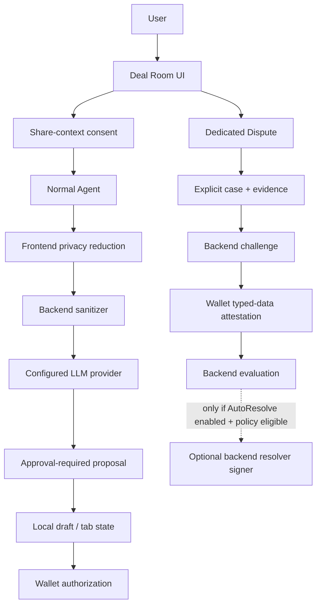
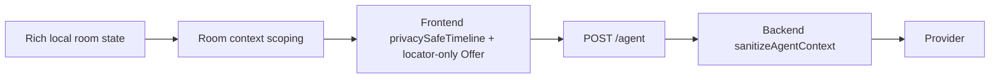
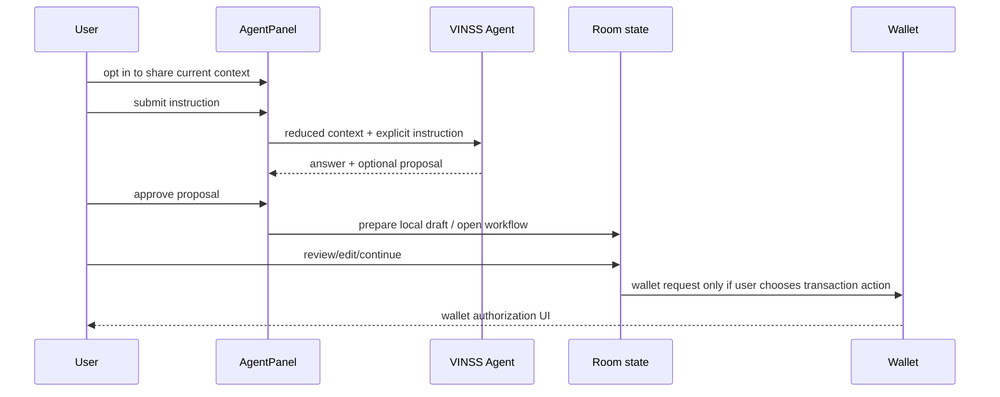
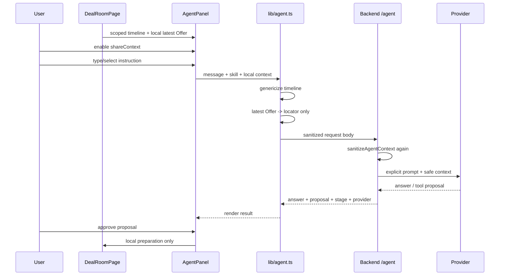
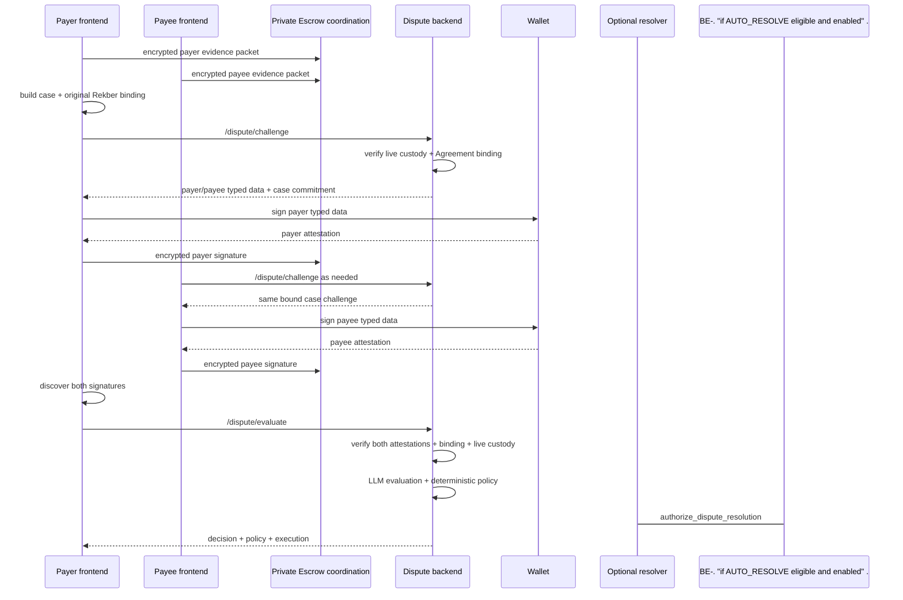
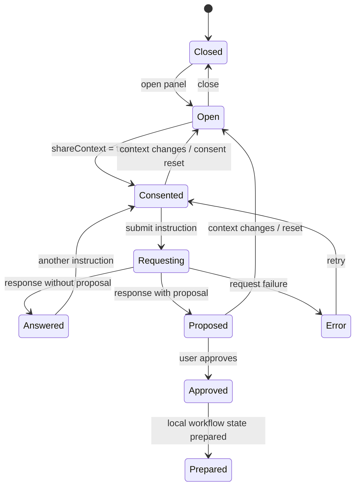
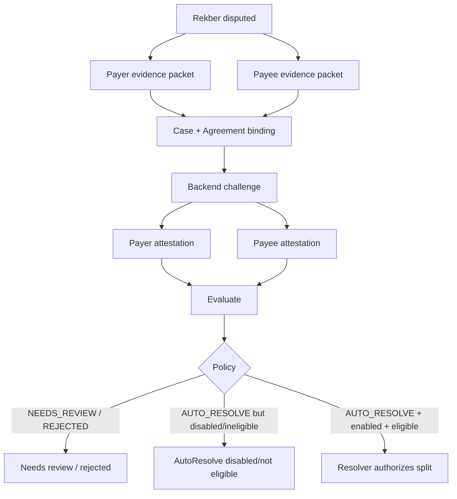
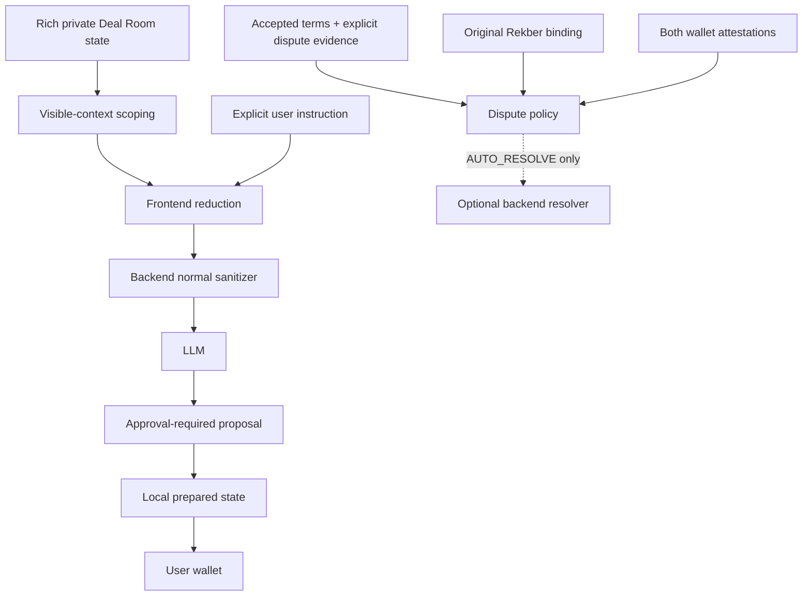

# VINSS Frontend Agent Integration

This document describes the current frontend integration for VINSS Agent and the dedicated Dispute Agent workflow.

The two systems must not be collapsed into one trust model.

Current source contains:

```text
Normal Agent
    /agent
    skills: chat | offer | escrow
    explicit user prompt
    privacy-reduced automatic context
    approval-required proposals
    no frontend-owned transaction signer

Dedicated Dispute Agent
    /dispute/challenge
    /dispute/evaluate
    explicit accepted terms + statements + evidence
    original Rekber Agreement binding
    wallet typed-data attestations
    optional backend AutoResolve authority if enabled
```

The most important architectural rule is:

> Normal Agent is a proposal/reasoning assistant. Dedicated Dispute is a separate explicit arbitration disclosure and attestation flow.

---

# Objective

VINSS Agent should help the user reason about a Deal Room without silently widening the normal privacy boundary.

The normal Agent frontend therefore tries to preserve:

```text
explicit user intent
+
minimum useful automatic context
+
proposal-only local application behavior
```

rather than automatically uploading the decrypted Deal Room timeline.

At the same time, arbitration is impossible if both parties refuse to disclose the actual dispute evidence.

The dedicated Dispute Agent therefore uses a different explicit-consent model.

---

# High-Level Architecture



---

# Two Different Trust Boundaries

| Property | Normal Agent | Dedicated Dispute Agent |
|---|---|---|
| Endpoint | `POST /agent` | `POST /dispute/challenge`, `POST /dispute/evaluate` |
| Public skill | `chat`, `offer`, `escrow` | separate dispute subsystem |
| User prompt | plaintext, explicit | explicit party statement/evidence |
| Automatic room timeline | reduced to generic labels | not used as the dispute case authority |
| Accepted Offer terms | locator-only automatically | explicitly included in case |
| Wallet signature | not required for normal Agent request | required typed-data attestation for review |
| Transaction signer | none in normal frontend Agent flow | optional backend resolver can exist if AutoResolve is enabled |
| Proposal approval | frontend approval before local preparation | dispute decision follows separate policy/execution path |
| Privacy expectation | minimize automatic disclosure | explicit scoped disclosure |

---

# Source Map

Current primary frontend sources:

```text
frontend/lib/agent.ts
frontend/components/agent/AgentPanel.tsx
frontend/hooks/room/useRoomAgent.ts
frontend/app/room/[roomId]/page.tsx

frontend/lib/deal-room/disputeAgent.ts
frontend/hooks/room/useDisputeAgentReview.ts
```

Backend contract for the frontend integration:

```text
backend/src/routes/agent.ts
backend/src/agent/context.ts
backend/src/routes/dispute.ts
```

---


# Normal Agent — Public Skills

`frontend/lib/agent.ts` defines exactly:

```text
chat
offer
escrow
```

as `AgentSkillId`.

The backend public Agent route enforces the same public skill set.

Dispute is not a normal public Agent skill.

---


## Context → Skill Mapping

`AgentPanel` selects the public Agent skill from the visible workflow.

Current mapping:

| Agent context kind | Normal Agent skill |
|---|---|
| `messages` | `chat` |
| `chat` | `chat` |
| `group` | `chat` |
| `deal` | `offer` |
| `escrow` | `escrow` |

Group UI therefore uses the normal `chat` skill rather than introducing a separate public `group` skill.

---


# Normal Agent Context Selection

The room page decides which local records are even candidates for Agent context before `lib/agent.ts` performs privacy reduction.

This first boundary depends on the visible workflow.

---


## Direct Chat

When a direct peer is active, the room page filters local timeline entries toward that direct conversation.

The goal is:

```text
current private peer context
not
all private conversations in the room
```


## Group

When a Group is selected, the room page selects entries for that Group.


## Offer

When the Offer tab is active, automatic context is restricted to Offer entries, optionally narrowed to the selected direct peer.


## Escrow

When Escrow is active:

- selected Group context remains Group-scoped where applicable;
- selected direct peer remains peer-scoped;
- without either, the page can limit the context to Offer activity rather than all unrelated chats.


## Directory State

When the user is merely viewing the private-chat or Group directory, the page intentionally avoids aggregating unrelated private timelines.

Conceptually:

```text
no active conversation
    -> no automatic multi-chat timeline aggregation
```

This is an important privacy boundary at the composition layer.

---


# Context Permission Gate

`AgentPanel` has an explicit local `shareContext` state.

A normal Agent request is not sent unless:

```text
request text is non-empty
AND
shareContext === true
AND
the panel is not already busy
```

---


## Consent Is Context-Scoped

When either changes:

```text
contextKind
contextLabel
```

the panel resets:

```text
shareContext = false
instruction = ""
answer = null
dealStage = null
proposal = null
approved = false
acted = false
error = null
```

This prevents an old permission to share context from silently carrying into another:

```text
private chat
Group
Offer workflow
Escrow workflow
```

---


# Normal Agent Request Shape

The frontend network request is built by `askVinssAgent()`.

Current body shape:

```json
{
  "message": "<explicit user text>",
  "skill": "chat | offer | escrow",
  "context": {
    "timeline": [
      {
        "kind": "...",
        "summary": "generic privacy-safe label",
        "sentAt": "...",
        "actionLocator": "..."
      }
    ],
    "latestOffer": {
      "actionLocator": "..."
    }
  }
}
```

`roomLabel` is accepted by the local `askVinssAgent()` input type, but the current request serializer does not put it into the request body.

---


# Explicit User Text

The user's normal Agent instruction is plaintext by design.

Examples:

```text
"Draft a concise reply."

"Review this offer."

"Explain the current escrow state."
```

That text is intentionally sent to:

```text
VINSS backend
and
the selected/fallback LLM provider
```

according to backend provider routing.

Therefore the correct privacy claim is:

> Normal Agent does not automatically send the full decrypted Deal Room timeline.

Not:

> Normal Agent sends no plaintext.

---


# Frontend Timeline Minimization

`privacySafeTimeline()` rewrites each local timeline item before transmission.

Current transformation:

```text
Offer
    -> "Encrypted Offer action"

Message
    -> "Encrypted private message"

other
    -> "Encrypted private activity"
```

It preserves only limited metadata such as:

```text
kind
sentAt
actionLocator
```

---


## What Is Removed by the Frontend

Automatic timeline summaries do not preserve:

```text
Message body
Offer amount
Offer asset
payment terms
conditions
work evidence text
attachment plaintext
room secret
pairwise key
```

through this normal timeline transformation.

---


# Latest Offer Minimization

The room page may hold a rich local latest Offer object including:

```text
asset
amount
paymentTerms
conditions
actionLocator
```

for local UX.

`offerLocatorOnly()` then reduces the automatic network context to:

```json
{
  "actionLocator": "..."
}
```

if a valid locator exists.

---


# Double Sanitization

Normal Agent context is minimized twice.



---


## Backend Sanitizer

The backend rebuilds normal Agent context from its own allowlist.

Current backend rules include:

```text
maximum 50 timeline items
kind normalized to message | offer | escrow | activity
summary regenerated server-side
timestamp bounded
actionLocator bounded
latestOffer reduced to actionLocator
unknown/private fields dropped
```

This means a modified/malicious frontend cannot simply add:

```text
roomLabel
private Offer terms
participant secrets
arbitrary plaintext timeline fields
```

and expect the normal Agent backend sanitizer to preserve them.

---


# Normal Agent Response Shape

The frontend expects:

```text
answer
contextShared
dealStage
proposal
skill
provider
model
```

from the backend.

Current provider name union expected by the frontend:

```text
groq
openai
anthropic
qwen
```

The backend also supports provider selection/fallback policy internally.

---


# Deal Stage

Frontend `DealStage` values:

```text
discussion
negotiating
offer_pending
agreed
escrow_pending
funded
rekber_pending
completed
```

`AgentPanel` renders these as UI state labels.

Deal stage is Agent interpretation/application state.

It is not a replacement for canonical Rekber contract state.

---


# Normal Agent Proposal Types

Current frontend proposal union:

```text
draft_message
draft_offer
draft_counter_offer
prepare_escrow
review_rekber
```

Every proposal type is statically typed with:

```ts
requiresApproval: true
```

---


## Proposal Payloads

| Proposal | Local payload |
|---|---|
| `draft_message` | `body` |
| `draft_offer` | asset, amount, paymentTerms, optional conditions |
| `draft_counter_offer` | asset, amount, paymentTerms, optional conditions |
| `prepare_escrow` | optional Offer locator, amount, token, refundHours |
| `review_rekber` | reason |

---


# Proposal Approval Boundary

Agent result does not automatically mutate the active room workflow.

`AgentPanel` requires explicit proposal approval before calling:

```text
onApproveProposal(proposal)
```

---


## What Approval Means

Approval means:

```text
apply proposal to local application preparation state
```

not:

```text
sign and submit transaction
```

---


# useRoomAgent Routing

`useRoomAgent` is deliberately simple.

Current approved-proposal behavior:

```text
draft_message
    -> copy body into local message composer
    -> switch to timeline

draft_offer / draft_counter_offer
    -> store local Agent Offer draft
    -> open Offer tab

prepare_escrow
    -> store local Escrow preparation draft
    -> open Escrow tab

review_rekber
    -> open Escrow tab
```

No case here calls:

```text
account.execute
strk20InvokeTransaction
signMessage
```

directly.

---


# Normal Agent Authority Boundary

The correct normal flow is:



The normal Agent does not independently submit the user's wallet transaction.

---


# Normal Agent Does Not Receive

Through the current automatic normal Agent context path, do not send:

```text
wallet private keys
P-256 private messaging key
roomSecret
groupSecret
channelKey
direct pairwise key
Rekber release secret/preimage
Rekber refund secret/preimage
payee claim secret/preimage
payer/payee dispute secret/preimage
full automatic Message plaintext
full automatic Offer terms
full unrelated private timelines
```

---


# Normal Agent May Receive

Current intentional normal Agent input includes:

```text
the text the user explicitly types
selected public skill id
generic automatic activity labels
timestamps
action locators
latest Offer locator
```

after frontend and backend minimization.

---


# Agent Panel Context Commands

`AgentPanel` provides context-specific command presets.

These commands are only prompt templates.

They do not expand the automatic context beyond the current scoped timeline.

---


## Chat Commands

```text
Summarize chat
Find next decision
Draft reply
Review deal
```


## Group Commands

```text
Summarize Group
Find decisions
Draft announcement
Review risks
```


## Offer / Deal Commands

```text
Review offer
Suggest counter
Explain next step
Prepare escrow
```


## Escrow Commands

```text
Explain status
Check readiness
Review settlement
Find risks
```


## Directory / Generic Commands

```text
Summarize activity
Find open items
Draft next message
Review deal stage
```


# Agent UI Output Sanitization

`AgentPanel` also performs presentation cleanup before rendering response text.

Current cleanup includes:

```text
remove ** markdown
strip inline backticks
remove blockquote prefix
remove horizontal-rule-only lines
shorten long hex-like identifiers
collapse excessive blank lines
```

This is presentation formatting.

It is not a security sanitizer for model output.

---


# Provider Failure Handling

Frontend normal Agent failure is intentionally generic to the user:

```text
VINSS Agent is unavailable right now.
```

Raw failure details are sent only to the browser developer console from the current catch block.

The backend also returns a generic:

```text
Agent failed.
```

for normal execution failures.

---


# Normal Agent Feature Dependency

Agent is an auxiliary product feature.

Failure should not prevent:

```text
private Message
Offer lifecycle
Rekber custody
Settlement Certificate
```

from functioning through their own paths.

---


# Dedicated Dispute Agent

The dedicated Dispute Agent is not merely:

```text
skill = dispute
```

on the normal public `/agent` endpoint.

It has separate frontend modules, separate backend routes, separate evidence format, separate wallet signatures, and potentially separate execution authority.

---


## Why Dispute Needs a Different Boundary

Arbitration requires access to the actual dispute facts.

Current Dispute case can include:

```text
accepted private Offer terms
principal metadata
party statements
evidence
fulfillment state
on-chain dispute state
wallet identities
original Rekber Agreement binding
```

Those are materially more sensitive than normal Agent's generic timeline labels.

---


# Dispute Evidence Packet

`createDisputeAgentPacket()` creates a party packet with:

```text
role
walletAddress
consentToAgentReview = true
statement
evidence[]
submittedAt
```

Current frontend helper is text-statement-oriented.

The source comment notes file evidence can be appended later without changing the broad case contract.

---


## Evidence Submission

`useDisputeAgentReview.submitEvidence()` sends the party packet through encrypted Private Escrow coordination:

```text
kind = dispute
coordinationVersion = 3
dealOfferLocator
custodyCommitment
disputeAgentPacket
```

to the peer.

This means both parties can synchronize their explicit evidence packets privately before the backend arbitration request is constructed.

---


# Dispute Case Construction

`buildDisputeAgentCase()` combines:

```text
custody commitment
live/current frontend Rekber state snapshot
accepted Offer snapshot
payer packet
payee packet
```

into a dedicated arbitration case.

---


## Accepted Terms

Current case includes:

```text
dealType
summary
obligations
completionCriteria
optional deadline
reviewPeriodSeconds
```

The source explicitly uses the accepted Offer as the terms authority rather than pulling unrelated chat into the dispute case.

---


## Principal

Current case includes:

```text
asset
rawAmount
```

from the settlement context.


## Fulfillment

Current case includes:

```text
submitted
confirmed
evidenceCommitment
optional submittedAt
```


## On-Chain Flags

Current case carries a frontend snapshot of:

```text
disputed
consumed
resolutionAuthorized
fulfillmentSubmitted
fulfillmentConfirmed
```

but backend AutoResolve does not trust browser lifecycle flags as final authority; it re-reads live Rekber state before execution.

---


# Verification Class

Frontend maps Rekber verification policy to:

```text
policy 3 -> objective
policy 2 -> offchain
otherwise -> digital_review
```

for the Dispute case.

---


# Original Rekber Agreement Binding

Dispute review also proves that the wallets participating in arbitration are bound to the original signed Rekber Agreement.

`buildDisputeRekberBinding()` requires:

```text
setup.kind = create
acceptance.kind = accept
coordinationVersion = 3
setup coordination signature
acceptance coordination signature
```

---


## Payer Setup Binding

The setup binding includes commitments/identity such as:

```text
custodyCommitment
dealOfferLocator
dealTermsCommitment
payerAddress
payeeAddress
releaseAuthorizationCommitment
refundCommitment
payerConfirmationCommitment
payerDisputeCommitment
revisionChainHead
payerCertificateCommitment
fulfillmentDeadline
signature
```


## Payee Acceptance Binding

The acceptance binding includes:

```text
custodyCommitment
dealOfferLocator
dealTermsCommitment
payerAddress
payeeAddress
payeeClaimCommitment
payeeDisputeCommitment
payeeRefundConsentCommitment
fulfillmentChainHead
payeeCertificateCommitment
fulfillmentDeadline
signature
```

---


## What the Binding Does Not Need

The frontend source intentionally describes this as a minimal proof without disclosing the private Rekber secret/preimage values merely to establish party binding.

---


# Dispute Challenge Flow

Once both party evidence packets and the original Rekber binding are available, frontend can request:

```text
POST /dispute/challenge
```

with:

```json
{
  "case": "<explicit dispute case>",
  "binding": "<original Rekber Agreement binding>"
}
```

---


## Backend Challenge Verification

Before returning typed data, backend currently:

```text
sanitizes the case
sanitizes the Rekber binding
reads and verifies live Rekber custody
verifies original Rekber Agreement party binding
computes deterministic case commitment
builds payer/payee typed data
```

---


# Dispute Typed-Data Attestation

The connected wallet signs the challenge through:

```text
account.signMessage(typedData)
```

not a settlement transaction execute call.

The signature is converted into felt/hex strings for coordination/backend submission.

---


## Meaning of Signature

Current frontend hook states:

> This signature is consent to Agent review, not consent to the Agent's eventual decision.

This distinction is critical.

---


# Dispute Signature Coordination

After signing, the frontend sends another encrypted Private Escrow coordination action containing:

```text
disputeAgentCaseCommitment
disputeAgentSignature
```

so the counterparty can discover the signature without exposing the coordination record as plaintext backend application data.

---


# Both Signatures Required

Evaluation requires:

```text
payerSignature
and
payeeSignature
```

for the same case commitment.

The frontend locates the latest matching dispute coordination signature for each wallet.

---


# Auto Evaluation Trigger

Current hook uses the payer client as the single client-side evaluation trigger after both signatures exist.

Reason:

```text
avoid Alice/Bob racing duplicate LLM evaluations for the same case
```

The backend still verifies both signatures.

---


## Retry

If automatic evaluation attempt fails, the payer-side guard is released after roughly:

```text
5 seconds
```

so normal synchronization can retry without requiring another wallet signature.

---


# Dispute Evaluate Request

Frontend submits:

```text
POST /dispute/evaluate
```

with:

```json
{
  "case": "<explicit case>",
  "attestations": {
    "payer": ["..."],
    "payee": ["..."]
  },
  "binding": "<original Rekber binding>"
}
```

---


# Dispute Backend Verification

Before evaluation/execution, backend currently:

```text
sanitizes case
sanitizes signatures
sanitizes original binding
re-reads live Rekber custody
verifies BOTH attestations
verifies original Agreement binding
reads verified principal USD value when available
runs dispute evaluation
applies deterministic policy
```

---


# Dispute Result

Frontend result type includes:

```text
caseCommitment
decision
policy
provider
model
network
execution
```

Decision values:

```text
payer
payee
split
needs_review
```

Policy values:

```text
AUTO_RESOLVE
NEEDS_REVIEW
REJECTED
```

Execution values:

```text
authorized
already_authorized
not_enabled
not_eligible
```

---


# Critical AutoResolve Correction

One source comment in `useDisputeAgentReview.ts` says the displayed result is advisory and cannot execute/authorize a resolver transaction.

That comment is no longer sufficient to describe the full current system.

Current backend `/dispute/evaluate` does this:

```text
if policy.status === AUTO_RESOLVE
    -> call authorizeDisputeResolution(...)
```

Therefore the accurate architecture statement is:

> The frontend itself does not own a resolver transaction signer, but the backend may authorize a dispute resolution through its dedicated resolver account when AutoResolve is configured, enabled, and the deterministic policy marks the case eligible.

---


## Default Safety Posture

Backend configuration currently defaults AutoResolve off.

Frontend should not assume that every dispute evaluation will execute.

The returned `execution.status` is the relevant current response field.

---


# Normal Agent vs Resolver Authority

Do not write:

```text
VINSS Agent can never sign any transaction.
```

That is too broad.

Write:

```text
Normal /agent has no user-wallet transaction signer.

Dedicated Dispute AutoResolve may use a separate backend resolver signer
when explicitly enabled and policy-eligible.
```

---


# Wallet Authority Matrix

| Action | Signer / authority |
|---|---|
| Ask normal Agent | no wallet signature |
| Approve normal proposal into local draft | React/local state only |
| Send Agent-drafted Message | user wallet later authorizes normal Message flow |
| Submit Agent-drafted Offer | user wallet later authorizes Offer flow |
| Start Agent-prepared Rekber | user wallet later authorizes Rekber flow |
| Dispute review attestation | payer/payee wallet signs typed data |
| AutoResolve authorization | optional dedicated backend resolver account |
| Claim authorized dispute share | respective user settlement wallet under Rekber contract rules |

---


# Context Shared Flag

The normal backend response currently includes:

```text
contextShared: true
```

for successful Agent requests.

This means the backend confirms that sanitized context participated in that request.

It does not mean full local context was shared.

---


# Provider Surface

Normal Agent response exposes provider/model metadata to the frontend.

Current provider labels expected by normal frontend code:

```text
groq
openai
anthropic
qwen
```

Backend `/agent/providers` can also expose:

```text
network
defaultProvider
configuredProviders
public skills
```

when Agent routes are mounted.

---


# Provider Privacy Boundary

If a provider is used, the normal explicit prompt and backend-sanitized normal context can leave VINSS infrastructure and reach that external provider.

Provider fallback can potentially send equivalent sanitized request content to another configured provider after failure.

Frontend documentation should not imply:

```text
data sent to VINSS Agent stays only inside the browser
```

---


# Room Label Boundary

`AgentPanel` constructs a local `roomLabel` value when calling `askVinssAgent()`.

However, the current `askVinssAgent()` serializer omits `roomLabel` from the network request entirely.

The backend sanitizer would also drop room labels from context.

Therefore current automatic normal Agent network context does not contain the room label.

---


# Group Context Boundary

Normal Agent can be opened while a Group is selected.

Current frontend still maps this to:

```text
skill = chat
```

and automatic Group timeline items are passed through the same generic privacy reduction.

Group name may appear in local UI `contextLabel`, but local UI labels should not be confused with the actual network request context.

---


# Normal Agent Fee Helper

`frontend/lib/agent.ts` also exports:

```text
quoteVinssFee(amount, feeBps)
```

using JavaScript `Number` arithmetic and:

```text
NEXT_PUBLIC_VINSS_FEE_BPS
```

with default `200` basis points.

This is an advisory frontend helper.

It is not canonical FeePolicy/Rekber settlement arithmetic.

Do not use it as a contract-security invariant.

---


# Agent State Lifetime

Agent panel state is local React state.

Current values include:

```text
open
shareContext
instruction
answer
dealStage
proposal
approved
acted
busy
error
```

Changing context resets most of this state.

Agent results are not treated as durable canonical room history by this frontend integration.

---


# Normal Proposal Application Is Reversible

Normal approved proposals only prepare local state.

Examples:

```text
draft_message
    user can edit/delete before sending

draft_offer
    user can edit/review before Offer transaction

prepare_escrow
    user enters Escrow review rather than immediate funding
```

This keeps the Agent output reversible before wallet authorization.

---


# Agent Does Not Replace Offer Authentication

Even if Agent suggests a counter Offer or Rekber preparation, actual Offer/Rekber flows still rely on their normal private discovery/authentication rules.

Agent output does not create an authenticated private Offer parent.

---


# Agent Does Not Replace Rekber Contract State

Agent explanation or `dealStage` must not be used as the financial source of truth.

Canonical settlement state remains:

```text
VinssEscrowRekber contract state
```

---


# Dispute Does Not Trust Browser Financial Authority

Even though the frontend case contains on-chain-like flags and amounts, backend Dispute execution re-reads live custody.

This prevents the browser from authorizing AutoResolve merely by submitting fabricated:

```text
wallet identity
lifecycle flags
principal value
```

---


# Dispute Evidence Privacy

Dedicated Dispute evidence is intentionally sensitive.

Current frontend can send accepted terms and party statements to the backend/provider during evaluation.

Therefore user-facing consent must make the difference clear:

```text
normal private Deal Room
    ciphertext-only Discovery

Dispute review
    explicit plaintext arbitration disclosure
```

---


# Dispute Case Scope

Current `buildDisputeAgentCase()` does not automatically aggregate the full chat history.

It uses:

```text
accepted Offer snapshot
explicit payer packet
explicit payee packet
current Rekber state
```

This is a narrower evidence model than uploading the entire Deal Room conversation.

---


# Frontend Dispute Coordination vs Backend Dispute

There are two channels involved:

```text
encrypted peer coordination
    -> exchange party evidence packets and signatures between parties

backend dispute API
    -> challenge verification + arbitration evaluation
```

The encrypted peer coordination records are not the same thing as the backend plaintext arbitration request.

---


# Agent Failure Model

Normal Agent failure classes include:

```text
context permission not granted
empty instruction
backend Agent disabled/unmounted
rate limit
provider unavailable
invalid provider/backend configuration
backend failure
network failure
```

Frontend currently collapses request failures to a generic user message.

---


## Dispute Failure Classes

Dedicated Dispute can fail because:

```text
one party evidence missing
original signed Agreement binding missing
live Rekber state ineligible
challenge mismatch
wallet signature refusal/failure
attestation invalid
binding invalid
provider/evaluation failure
policy = NEEDS_REVIEW
policy = REJECTED
AutoResolve disabled
resolver execution not eligible
```

These are not normal `/agent` failure semantics.

---


# Security Invariants

| ID | Invariant |
|---|---|
| `N1` | Normal Agent automatic timeline is genericized before network submission. |
| `N2` | Normal Agent latest Offer automatic context is locator-only. |
| `N3` | Normal Agent network request currently omits roomLabel. |
| `N4` | Backend sanitizes normal Agent context independently from the frontend. |
| `N5` | Normal Agent requires local shareContext opt-in before request. |
| `N6` | shareContext consent resets when visible context changes. |
| `N7` | All normal proposal variants require approval. |
| `N8` | Approved normal proposal only prepares local UI/workflow state. |
| `N9` | Normal Agent does not own user wallet signing authority. |
| `N10` | Agent dealStage is not canonical settlement state. |
| `D1` | Dispute is a separate explicit plaintext disclosure path. |
| `D2` | Both party evidence packets are required before case construction. |
| `D3` | Original signed Rekber Agreement binding is required for arbitration challenge. |
| `D4` | Typed-data signature is review consent, not blanket consent to eventual decision. |
| `D5` | Both payer and payee attestations are required before evaluation. |
| `D6` | Backend re-reads live Rekber state before AutoResolve execution. |
| `D7` | Frontend itself does not hold resolver private key. |
| `D8` | Optional backend AutoResolve authority must be documented separately from normal Agent. |


# Privacy Anti-Patterns

- Sending decrypted Message bodies automatically as timeline summaries.
- Sending full Offer terms automatically when an action locator is sufficient.
- Adding roomSecret/channelKey/pairwise key to normal Agent context.
- Reusing shareContext consent after silently changing active conversation.
- Treating local contextLabel as proof of what network request contains.
- Treating backend `contextShared=true` as meaning full private room content was shared.
- Putting Dispute evidence into normal Agent automatic context.
- Uploading the entire private chat to Dispute when accepted terms + explicit evidence are sufficient.
- Persisting provider API keys in NEXT_PUBLIC environment variables.
- Letting a normal proposal directly invoke wallet execution on approval.


# Authority Anti-Patterns

- Treating Agent proposal as accepted Offer.
- Treating Agent dealStage as Rekber state.
- Treating review_rekber proposal as dispute resolution authority.
- Treating typed-data review signature as user authorization for arbitrary settlement.
- Treating browser-reported principal USD as AutoResolve authority.
- Claiming no backend signer exists when AutoResolve can be enabled.
- Claiming AutoResolve is always active when config defaults it off.


# Normal Agent Request Review Checklist

- [ ] `message` is explicit user input.
- [ ] `skill` is only chat/offer/escrow.
- [ ] `context.timeline` contains generic labels only.
- [ ] `latestOffer` contains locator only.
- [ ] `roomLabel` is not serialized into current request.
- [ ] No participant secret/key fields are present.
- [ ] No private Message body appears automatically.
- [ ] No Offer amount/terms appear automatically.
- [ ] shareContext is true before submit.
- [ ] Context consent resets when target changes.


# Normal Proposal Review Checklist

- [ ] Proposal union still marks `requiresApproval: true`.
- [ ] `approveProposal()` requires a returned proposal.
- [ ] `useRoomAgent` only prepares local state.
- [ ] Message proposal is copied to composer, not sent.
- [ ] Offer proposal opens Offer tab, not transaction execution.
- [ ] Escrow proposal opens Escrow tab, not funding.
- [ ] Any later wallet transaction still follows the normal domain flow.


# Dispute Review Checklist

- [ ] Accepted Offer snapshot exists.
- [ ] Both party evidence packets exist.
- [ ] Both packets consent to Agent review.
- [ ] Original setup/accept coordination records are version 3 and signed.
- [ ] Rekber binding commitments match the intended custody.
- [ ] Challenge is requested from backend after case+binding are built.
- [ ] Wallet signs backend-issued typed data for its own role.
- [ ] Signature is shared via private dispute coordination.
- [ ] Both signatures target the same case commitment.
- [ ] Payer-side evaluation trigger avoids duplicate client races.
- [ ] Backend re-verifies live custody and attestations.
- [ ] Returned policy and execution status are displayed distinctly.
- [ ] Frontend never assumes AutoResolve from decision alone.


# Provider / Data Governance Checklist

- [ ] Know which providers are configured.
- [ ] Understand provider retention/privacy terms.
- [ ] Understand fallback may send sanitized request to another provider.
- [ ] Do not put provider secret keys in frontend environment.
- [ ] Keep Agent optional relative to core Deal Room.
- [ ] Rate limits/cost controls are reviewed at backend/deployment layer.
- [ ] Do not promise provider confidentiality beyond actual provider policy.


# User Experience Checklist

- [ ] Share-context toggle/consent is understandable.
- [ ] Current context label is visible.
- [ ] Changing context resets sharing consent.
- [ ] Agent answer and proposal are visually distinct.
- [ ] Proposal shows what will be prepared.
- [ ] Approve does not imply wallet transaction happened.
- [ ] Dispute review explicitly warns that selected terms/evidence leave the private Deal Room.
- [ ] Typed-data signature wording explains consent to review.
- [ ] Execution result distinguishes advisory decision from authorized AutoResolve.


# Testing Evidence

Frontend source currently contains a dedicated:

```text
frontend/tests/dispute-agent.test.ts
```

covering dispute-case construction.

The current case test verifies that:

```text
accepted terms are included
explicit payer/payee evidence is included
roomSecret is absent
channelKey is absent
```

from the serialized case.

---


## Cross-Layer Agent Regression

The repository-level privacy regression also checks selected Agent boundaries across frontend/backend source.

Important categories include:

```text
frontend privacySafeTimeline
roomLabel automatic exclusion
no generic signing tools
backend runtime tool-scope enforcement
```

This is source regression, not browser/provider E2E.

---


# Testing Gaps

Current frontend-specific tests do not by themselves prove:

```text
AgentPanel browser consent UX
context reset behavior in a real browser
live provider fallback
provider privacy policy
real wallet typed-data Dispute signing
two-wallet dispute coordination E2E
backend AutoResolve mainnet behavior
```

These require integration/live evidence separately.

---


# Recommended Validation

```bash
cd ~/vinss/frontend
npx tsc --noEmit --pretty false
npm run build
npm run test:dispute-agent

cd ~/vinss/backend
npm test

cd ~/vinss
git diff --check
```

Then separately validate:

```text
normal Agent browser consent
proposal approval flow
provider request
two-wallet dispute evidence exchange
typed-data signatures
dispute evaluate response
AutoResolve disabled/enabled behavior according to deployment plan
```

---


# Normal Agent Sequence



---


# Dispute Sequence



---


# Data Classification

| Data | Type | Destination | Boundary |
|---|---|---|---|
| Normal instruction | Explicit user text | Backend/provider | Plaintext intentional |
| Normal automatic timeline summary | Generic label | Backend/provider | Privacy-reduced |
| Normal timeline timestamp | Metadata | Backend/provider | Bounded metadata |
| Normal action locator | Public-ish immutable identifier | Backend/provider | Metadata |
| Normal latest Offer | Action locator only | Backend/provider | Reduced metadata |
| Room label | Local UI label | Not in current normal request | Local only in current serializer |
| Message body | Private content | Not automatic normal context | Client-side |
| Offer terms | Private content | Not automatic normal context | Client-side |
| Dispute accepted terms | Private business terms | Dispute backend/provider | Explicit disclosure |
| Dispute statements | Party evidence | Dispute backend/provider | Explicit disclosure |
| Dispute original signatures | Agreement binding | Dispute backend | Explicit verification material |
| Dispute review signatures | Typed-data attestations | Encrypted coordination + backend | Explicit consent material |
| Resolver private key | Financial authority secret | Backend only if configured | Never frontend |


# Normal Agent State Machine



---


# Dispute State Model



---


# Normal Agent Architecture Summary

The correct concise description is:

> The normal VINSS Agent receives an explicit user instruction plus a privacy-reduced, context-scoped activity view. It can return analysis and approval-required proposals, but approved proposals only prepare local UI state. Any eventual Message, Offer, or Rekber transaction still goes through the user's normal wallet-authorized workflow.

---


# Dispute Agent Architecture Summary

The correct concise description is:

> The dedicated Dispute Agent is a separate explicit disclosure path. Both parties submit evidence, the frontend reconstructs the accepted Offer/custody case and original signed Rekber Agreement binding, both wallets attest to the backend-issued case challenge, and the backend re-verifies live chain state before evaluation. If AutoResolve is enabled and policy-eligible, a dedicated backend resolver account may authorize the split.

---


# Incorrect Statements to Avoid

- Agent receives the full private timeline.
- Agent receives no plaintext.
- Agent has a single universal skill including dispute.
- roomLabel is currently transmitted automatically.
- Approving an Agent proposal submits a transaction.
- Normal Agent signs with the user's wallet.
- Dispute Agent is just `skill=dispute` on `/agent`.
- Dispute review signature means the user consents to whatever decision the Agent later makes.
- Dispute evaluation can trust browser lifecycle flags without re-reading chain.
- VINSS backend can never hold any signing authority.
- AutoResolve always executes after an Agent decision.
- Agent dealStage is canonical Rekber state.


# Accurate Statements

- Normal Agent public skills are chat, offer, and escrow.
- Normal automatic timeline is genericized before transmission.
- Normal latest Offer automatic context is locator-only.
- Normal explicit user prompt is plaintext by design.
- Normal context requires frontend shareContext opt-in.
- Context permission resets when the visible workflow context changes.
- Backend independently sanitizes normal Agent context.
- Every normal proposal variant requires approval.
- Approved proposals only prepare local application state.
- User wallet remains authority for subsequent normal Message/Offer/Rekber transaction.
- Dispute is a separate explicit evidence disclosure path.
- Both party attestations are required for current Dispute evaluation.
- Backend re-verifies live Rekber state and original Agreement binding.
- Optional AutoResolve uses a backend resolver signer, not the user's frontend Agent flow.


# Source-of-Truth Order

```text
1. frontend/app/room/[roomId]/page.tsx
2. frontend/components/agent/AgentPanel.tsx
3. frontend/lib/agent.ts
4. frontend/hooks/room/useRoomAgent.ts
5. frontend/hooks/room/useDisputeAgentReview.ts
6. frontend/lib/deal-room/disputeAgent.ts
7. backend/src/routes/agent.ts
8. backend/src/agent/context.ts
9. backend/src/routes/dispute.ts
10. backend/src/dispute/*
11. frontend/tests/dispute-agent.test.ts
12. scripts/test-privacy-boundaries.mjs
13. deployed feature flags/provider configuration
14. live browser/wallet/transaction evidence
15. prose documentation
```


# Documentation Maintenance Rules

- Re-read `lib/agent.ts` whenever request context fields change.
- Re-read `AgentPanel.tsx` whenever context consent/approval UX changes.
- Re-read `DealRoomPage` whenever automatic context scoping changes.
- Re-read backend sanitizer whenever frontend adds context fields.
- Do not document a local input field as transmitted unless serializer includes it.
- Do not document a provider as available merely because frontend union contains its label; deployment config decides actual configured providers.
- Keep normal Agent and Dispute Agent in separate sections.
- Keep wallet review signature separate from transaction authority.
- Keep optional AutoResolve authority explicit.
- Do not describe source tests as live E2E.
- Do not add secret values/provider keys to docs.


# Final Boundary Diagram



---

# Bottom Line

The old Agent integration document had the right core idea but was incomplete for the current frontend.

The current normal Agent integration is stronger than a simple:

```text
timeline sanitized -> Agent -> proposal
```

because it now includes:

```text
context-scoped room filtering
explicit shareContext permission
permission reset when context changes
frontend genericization
locator-only latest Offer
independent backend allowlist sanitization
approval-required proposal routing
and local-only proposal preparation
```

The current system also has a dedicated Dispute Agent that must be documented separately.

The most important normal-Agent privacy rule is:

> explicit prompt text is plaintext, but decrypted Message/Offer content is not automatically transmitted as normal context.

The most important normal-Agent authority rule is:

> approving a proposal prepares local UI/workflow state; it does not itself submit the wallet transaction.

The most important Dispute rule is:

> arbitration is an explicit disclosure workflow with accepted terms, evidence, original Rekber binding, and both wallet attestations.

The most important authority correction is:

> normal Agent has no transaction signer, but optional backend Dispute AutoResolve may use a dedicated resolver signer when enabled and policy-eligible.

The most important verification rule is:

> frontend comments or UI wording must not be treated as the authority for AutoResolve behavior; current backend `/dispute/evaluate` and executor/config define whether a resolution can actually be authorized.
