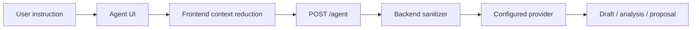

# Agent Integration

VINSS Agent is optional Deal Room assistance.

## Frontend boundary

Key file:

```text
lib/agent.ts
```

The request requires an explicit skill:

```text
chat
offer
escrow
```

Automatic timeline summaries are reduced to generic privacy-safe labels before network transmission. `latestOffer` is reduced to its action locator.

## Flow



The user's explicitly typed Agent instruction is transmitted to the backend/provider.

Agent output is advisory/local UI input. It has no independent transaction-signing authority.
