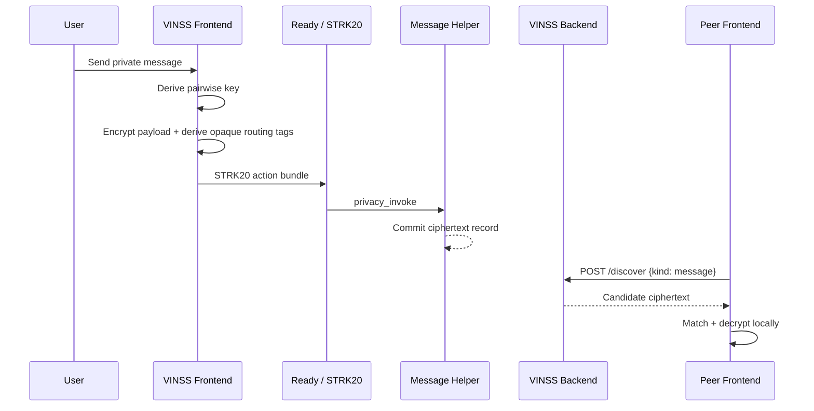
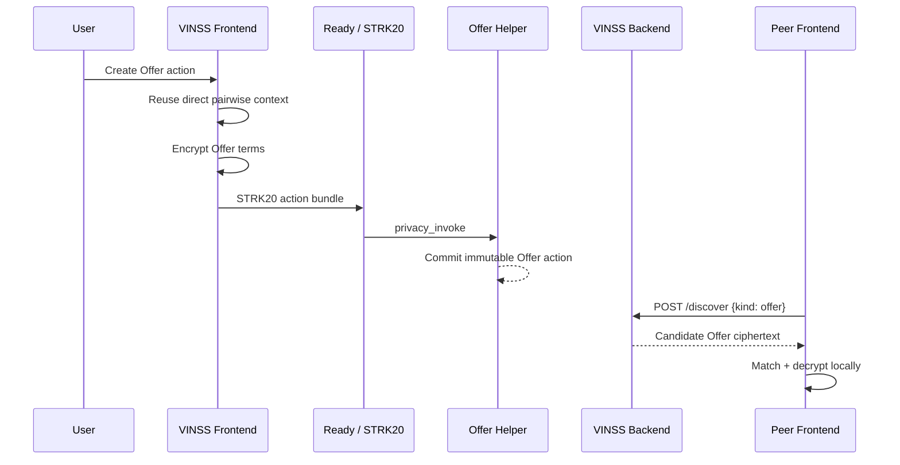

# Application Flow

## Reviewer path

For the tested two-party MVP:

```text
Connect wallet
    ↓
Open/join Deal Room
    ↓
Discover participant identity
    ↓
Select private peer
    ↓
Derive pairwise encryption key
    ↓
Private Chat / Offer
    ↓
Ready + STRK20
    ↓
VINSS helper contract
    ↓
Backend ciphertext discovery
    ↓
Local match + decrypt
```

## Private message



## Private Offer



## Agent

The Agent is separate from transaction execution:

```text
User instruction
    ↓
Frontend minimizes automatic context
    ↓
POST /agent with explicit skill
    ↓
Backend sanitizes again
    ↓
Agent returns draft/analysis/proposal
    ↓
User decides whether to use it
```
