# VINSS Frontend Application Flow

This document describes the current end-to-end application flows implemented by the VINSS frontend.

It focuses on:

```text
user action
-> local preparation
-> privacy boundary
-> wallet authorization
-> Starknet state
-> backend indexing/read model
-> local reconciliation
-> canonical authority
```

rather than treating every feature as one identical transaction pipeline.

The current frontend has multiple distinct flows:

- direct room access and participant discovery;
- direct private Message;
- Group Message;
- structured direct Offer lifecycle;
- direct/Group Invite V3;
- Private Escrow coordination;
- Rekber funding and protection lifecycle;
- encrypted work evidence/review;
- dedicated Dispute Agent review;
- Settlement Certificate claim;
- normal Agent proposal flow;
- Presence and attachment side channels.

---

# Core Flow Principle

The frontend must distinguish:

```text
prepared
submitted
wallet callback
indexed
decrypted
and
canonical contract state
```

because those states are not interchangeable.

---

# Evidence Vocabulary

Use these terms precisely:

| State | Meaning |
|---|---|
| Prepared | Frontend generated immutable local identity/commitment before wallet handoff |
| Submitted | Wallet invocation returned or may have reached the chain |
| Wallet-confirmed | Wallet callback reported success |
| Indexed | Backend indexed the on-chain immutable record/event |
| Locally authenticated | Frontend matched routing/identity and decrypted candidate ciphertext |
| Contract-confirmed | Direct canonical contract read reports the state |
| Settled | Rekber contract reached the relevant final/claimable state |

---

# Global Application Flow

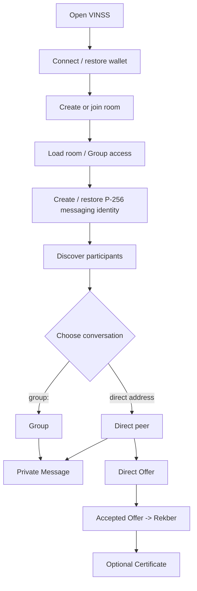

---


# 1 — Wallet Connection / Restoration

The root application is wrapped by `WalletProvider`.

On a normal first connection:

```text
user selects discovered Starknet wallet
    ↓
Wallet Standard connect
    ↓
createWalletSession()
    ↓
WalletAccountV6
    ↓
detect STRK20 Wallet API capability
    ↓
expose VinssWalletSession to application
```

---


## Mobile Resume

Ready X can background/remount the dapp.

The provider listens for:

```text
focus
pageshow
visibilitychange -> visible
```

then refreshes injected wallets and rebuilds session state.

---


## Silent Restore

The frontend stores only:

```text
vinss:last-wallet-id
```

and may attempt silent reconnect after page reload.

It does not store wallet private keys.

---


# 2 — Room Access Flow

Current room access is device-local application state.

A normal room record contains:

```text
id
label
roomSecret
createdAt
```

under:

```text
vinss:local-rooms
```

---


## Room Key

If `roomSecret` exists, `useRoom()` derives a room channel key.

That room key supports room-scoped functions such as:

```text
participant discovery fallback
room-level participant Presence
encrypted local history keying
```

but direct peer messaging uses its own pairwise ECDH key.

---


## Group-Only Room Access

A device that joined through a Group-only Invite may have:

```text
roomSecret = ""
```

and therefore no room-level channel key.

It can still participate in the invited Group through the Group secret/key.

---


# 3 — Messaging Identity Bootstrap

Direct communication requires a per-room P-256 messaging identity.

Current flow:

```text
roomId + wallet address
    ↓
lookup IndexedDB identity
    ↓
migrate canonical address alias if needed
    ↓
if absent: generate P-256 ECDH key pair
    ↓
export public key
    ↓
re-import private key as non-exportable CryptoKey
    ↓
persist in IndexedDB
```

---


# 4 — Participant Discovery

To derive a direct pairwise key, the frontend needs the peer's:

```text
wallet address
P-256 messaging public key
```

Current participant discovery combines:

```text
encrypted participant Presence
+
encrypted room-level Message fallback
+
local participant cache
```

---


## Participant Presence Flow

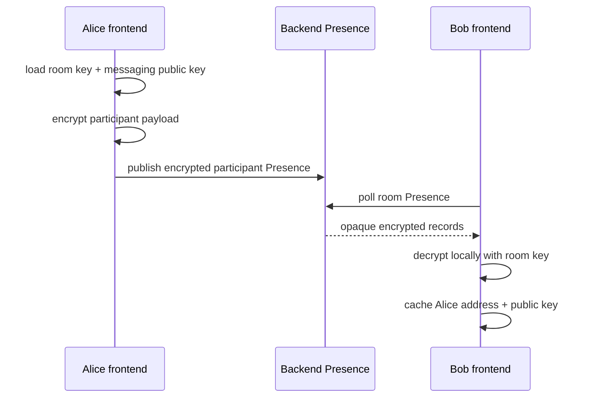

Presence is best-effort and not canonical membership authority.

---


# 5 — Direct Pairwise Key Derivation

Once the selected peer public key is known:

```text
self P-256 private CryptoKey
+
peer P-256 public key
+
roomId
    ↓
P-256 ECDH
    ↓
HKDF-SHA-256
    ↓
direct pairwise key
```

The same direct pairwise key is used by current direct:

```text
Message
Offer
Private Escrow coordination
Presence
attachment subkey derivation
```

with further domain separation where appropriate.

---


# 6 — Direct Message Send Flow

Current direct Message flow:

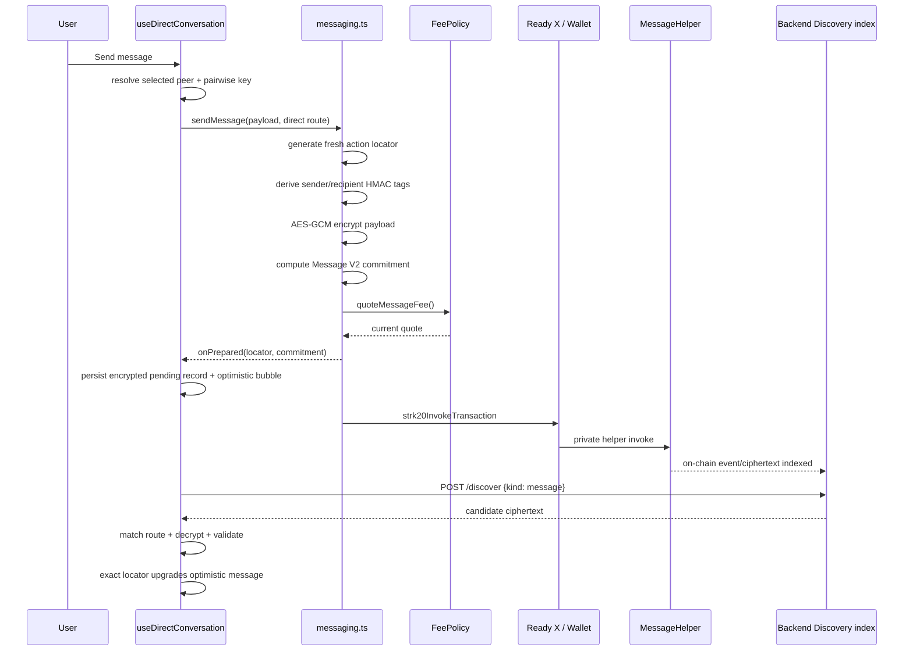

---


## Direct Message Preflight

Before `onPrepared` runs, current Message library completes:

```text
helper config checks
OpenNote token config check
pairwise encryption
routing-tag derivation
commitment construction
optional additional invoke construction
FeePolicy quote
treasury config check
final action bundle construction
```

Only then should the UI create pending recovery state.

---


## Message STRK20 Action Bundle

The current Message bundle conceptually contains:

```text
withdraw quoted fee token -> MessageHelper
transfer OPEN revenue note -> VINSS treasury
invoke MessageHelper privacy_invoke
optional additional privacy invokes
```

---


## Message Discovery

After indexing, frontend requests:

```json
{ "kind": "message" }
```

and locally evaluates each candidate route.

Validation includes:

```text
recipient tag match
AES-GCM decrypt
sender tag binding
direct sender/recipient semantic filtering in the hook
```

---


# 7 — Direct Message Recovery

Prepared Message state is optimistic.

Current principle:

```text
Ready X / wallet callback = transport evidence
exact indexed locator = stronger confirmation
```

---


## Pending Storage

Direct pending Message recovery uses a pairwise-encrypted local record.

Namespace:

```text
vinss:pending-direct-message:<roomId>:<self>:<peer>
```

---


## Reconciliation

The direct hook searches for the exact prepared locator for up to roughly:

```text
45 seconds
```

with repeated discovery attempts.

On success:

```text
pending record removed
optimistic bubble upgraded with tx hash
draft remains cleared
```

On confirmed timeout without locator:

```text
optimistic bubble removed
draft restored
pending record cleared
```

---


# 8 — Direct Message Refresh

Periodic/manual direct refresh:

```text
build current private route candidates
    ↓
POST /discover {kind:message}
    ↓
filter scope=direct
    ↓
filter self<->selected peer
    ↓
merge by action locator
    ↓
preserve ephemeral readAt state
    ↓
persist encrypted local history
```

---


# 9 — Direct Message Local Cache

Confirmed/known direct history is stored under:

```text
vinss:direct-history:v2:<roomId>:<self>:<peer>
```

using AES-GCM encrypted local JSON.

History writes are serialized so out-of-order mobile callbacks do not blindly overwrite newer persisted snapshots.

---


# 10 — Group Selection Flow

Current `messageTarget` chooses:

```text
groups
    -> Group directory

group:<id>
    -> selected Group conversation
```

`useRoomGroups` resolves the Group object and derives its Group key.

---


# 11 — Group Message Send Flow

Group Message reuses Message V2 envelope infrastructure but changes the privacy context.

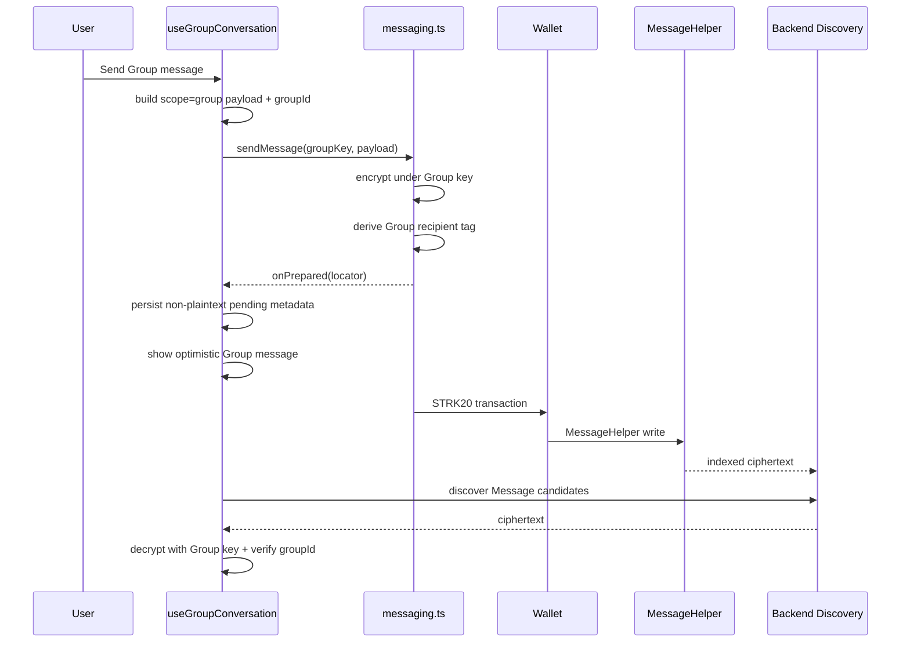

---


## Group Pending Storage

Current Group pending record stores only:

```text
actionLocator
sentAt
createdAt
```

in localStorage.

The Message body is retained in memory through `pendingBodyRef`, not written into that pending record.

---


## Group Definite Failure

Current Group send treats these wallet/error patterns as definite failure candidates:

```text
USER_REFUSED
INVALID_REQUEST_PAYLOAD
NOT_REGISTERED
INSUFFICIENT_PRIVATE_BALANCE
PRIVACY_LEAK
```

When definite and a locator was prepared:

```text
remove pending storage
remove optimistic entry
restore draft
show error
```

---


## Group Ambiguous Failure

If a prepared locator exists but failure is not classified as definite:

```text
keep pending state
show background confirmation message
allow discovery loop to recover it
```

---


## Group Pending Timeout

Current Group pending checker runs roughly every:

```text
2 seconds
```

and expires a still-unconfirmed pending record after roughly:

```text
60 seconds
```

At that point it removes the optimistic item and restores the in-memory body if still available.

---


## Group Discovery Polling

Selected Group discovery currently refreshes about every:

```text
2.5 seconds
```

and also refreshes on browser focus/visibility resume.

---


# 12 — Direct vs Group Message Differences

| Property | Direct | Group |
|---|---|---|
| Encryption key | P-256 ECDH pairwise key | Group-secret-derived key |
| Recipient identity | selected peer | Group recipient identity |
| Scope | `direct` | `group` |
| `groupId` | absent | required for selected Group filtering |
| Pending local body | encrypted pending record | memory only; storage metadata only |
| Recovery | exact-locator reconciliation loop | periodic discovery + pending timeout |
| Typing/read Presence | direct pairwise | current Group Message flow does not reuse direct typing/read |
| Attachments | direct attachment flow exists | current Group attachment path not represented as equivalent |

---


# 13 — Direct Offer Creation Flow

Active structured Offers are direct/pairwise.

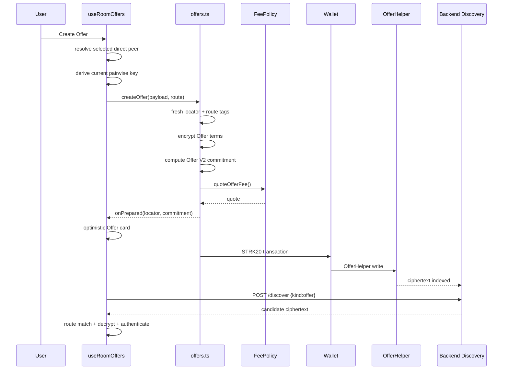

---


# 14 — Offer Lifecycle

Low-level Offer actions:

```text
create
counter
accept
reject
cancel
expire
```

The active room hook currently wires:

```text
create
counter
accept
reject
```

---


## Immutable Lifecycle

Each lifecycle step gets:

```text
new action locator
new sender/recipient routing tags
new encrypted payload
new payload commitment
```

Parent/root references remain inside encrypted Offer semantics.

---


# 15 — Offer Reply Authentication

Before Counter/Accept/Reject can rely on a parent Offer, the hook tries to authenticate the parent through actual encrypted discovery.

Flow:

```text
cached Offer card selected
    ↓
matched private route available?
    ├─ yes -> continue
    └─ no  -> refresh Offer discovery once
                 ↓
             still no route?
                 -> reject lifecycle reply
```

---


## Why a New Reply Uses Current Pairwise Key

The matched historical route proves the parent was decryptable.

But the reply is encrypted with the current pairwise route so both wallets use their current active room identities.

This avoids a stale historical key route creating an Offer only one side can render.

---


# 16 — Offer Local Recovery

Offer has its own prepared-locator state, encrypted local Offer history, callback timeout, and recovery generation guards.

Recovery generations prevent an old delayed Ready callback from mutating a newer Offer action's UI state.

---


# 17 — Accepted Offer Handoff

An accepted Offer does not automatically mean Rekber may start immediately.

Current page requires the ACCEPT to be rediscovered/authenticated before opening Escrow.

```text
optimistic ACCEPT
    ↓
Offer discovery
    ↓
authenticated ACCEPT
    ↓
eligible for Rekber handoff
```

---


# 18 — One Accepted Offer → One Rekber Lifecycle

Before `Add Escrow`, the room page checks discovered Private Escrow coordination actions.

If an accepted Offer's deal locator already has a:

```text
create
```

coordination action, that accepted Offer is not reused for a new Rekber lifecycle.

Released/refunded history remains visible, but a new Rekber requires another accepted Offer.

---


# 19 — Accepted Offer Settlement Mapping

`escrowSettlement.ts` converts the accepted encrypted Offer snapshot into generic settlement inputs.

Flow:

```text
authenticated ACCEPT
    ↓
buildEscrowOfferSnapshot()
    ↓
resolve STRK or USDC
    ↓
parse decimal amount with exact string/BigInt math
    ↓
generic Rekber parameters
```

Deal-specific semantics stay in the private snapshot.

---


# 20 — Private Rekber Agreement Coordination

Before funding, parties exchange encrypted Private Escrow coordination.

Current coordination uses:

```text
Private Escrow envelope V2
pairwise direct key
fresh locator
opaque route tags
ciphertext
payload commitment
```

and is discovered through:

```json
{ "kind": "escrow" }
```

---


## Coordination Roles

Current Rekber Agreement coordination includes:

```text
payer create/setup
payee accept
other explicit lifecycle/dispute coordination records
```

depending on workflow state.

---


# 21 — Private Escrow Coordination Send

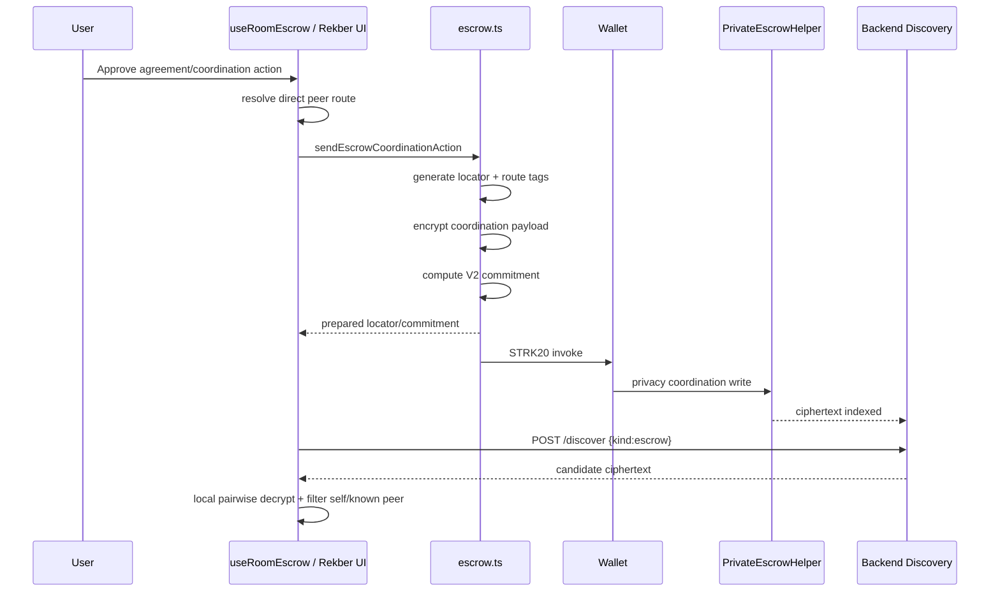

---


## Coordination Fee Split

Current source applies a Rekber workflow charge to selected encrypted coordination actions such as:

```text
create
accept
dispute
```

while other background coordination actions use negligible replay-protection spend.

---


# 22 — Coordination Recovery

Private Escrow coordination uses exact prepared-locator reconciliation.

Important rule:

```text
wallet callback alone does not make encrypted coordination authoritative
```

because the UI waits for the prepared locator to appear in indexed Discovery.

---


# 23 — Rekber Funding Flow

Once Agreement inputs, commitments, and settlement token/principal are ready:

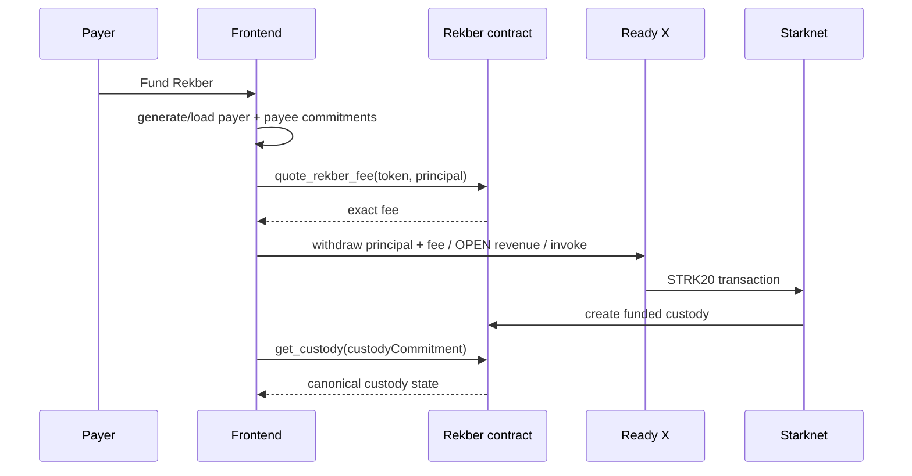

---


## Funding Authority

The frontend does not calculate the canonical Rekber funding fee from a UI constant.

It calls:

```text
quote_rekber_fee(token, amount)
```

immediately before constructing the funding transaction.

---


## Funding Amount

The wallet withdraws:

```text
principal + quoted Rekber fee
```

into the Rekber flow.

---


# 24 — Rekber Capability Secrets

The frontend generates or loads hidden capability secrets for settlement transitions.

Examples:

```text
release authorization
refund
payer confirmation
payer dispute
payee claim
payee dispute
payee refund consent
fulfillment chain
revision chain
payer Certificate
payee Certificate
```

Public Rekber state contains commitments, not all private preimages.

---


# 25 — Rekber State Refresh

The frontend reads canonical custody with:

```text
get_custody(custodyCommitment)
```

and parses the current Rekber state into typed UI state.

That direct contract read is stronger authority than:

```text
cached panel state
Private Escrow coordination interpretation
Agent explanation
```

---


# 26 — Fulfillment Flow

Current frontend supports a structured work/fulfillment path.

Representative flow:

```text
payee prepares work evidence
    ↓
optional direct encrypted attachment
    ↓
compute evidence commitment
    ↓
save encrypted evidence packet
    ↓
send private evidence reference/message
    ↓
submit Rekber fulfillment transition
    ↓
payer loads evidence
    ↓
payer confirms / rejects / requests revision
```

---


# 27 — Work Evidence Separation

Business evidence is not pushed into public Rekber plaintext.

The design keeps:

```text
private evidence packet
    encrypted/off-chain client channel

public evidence commitment
    Rekber state
```

separate.

---


# 28 — Payer Review Flow

Payer review may result in:

```text
confirm fulfillment
request revision
open dispute
```

subject to current Rekber state and UI guard eligibility.

---


# 29 — Revision Flow

Revision uses a bounded secret chain.

Current frontend generator supports:

```text
0..8 rounds
```

and Rekber tracks remaining revision/fulfillment rounds.

Conceptually:

```text
submission
    ↓
revision requested
    ↓
next fulfillment secret/evidence
    ↓
new submission
```

until contract/state limits are reached.

---


# 30 — Timeout Refund Flow

Timeout refund eligibility is computed in frontend protection guards for UX, but the contract remains authoritative.

Flow:

```text
load canonical custody
    ↓
evaluate canTimeoutRefundRekber(...)
    ↓
show action if eligible
    ↓
user authorizes wallet transaction
    ↓
Rekber validates actual transition
```

---


# 31 — Auto-Release Flow

Payee auto-release is similarly guarded in the UI.

Frontend eligibility is advisory UX logic.

The Rekber contract decides whether the transition is valid.

---


# 32 — Mutual Refund Flow

Current flow separates:

```text
payee refund consent capability
and
payer completion of mutual refund
```

rather than assuming a unilateral refund after both parties are otherwise active.

---


# 33 — Dispute Open Flow

A dispute can be opened through the relevant payer/payee dispute capability path when current state permits it.

The public Rekber transition records dispute state/commitment.

Private dispute explanation/evidence remains a separate encrypted/application flow.

---


# 34 — Dedicated Dispute Agent Flow

Dedicated Dispute Agent begins only after explicit dispute evidence is prepared.

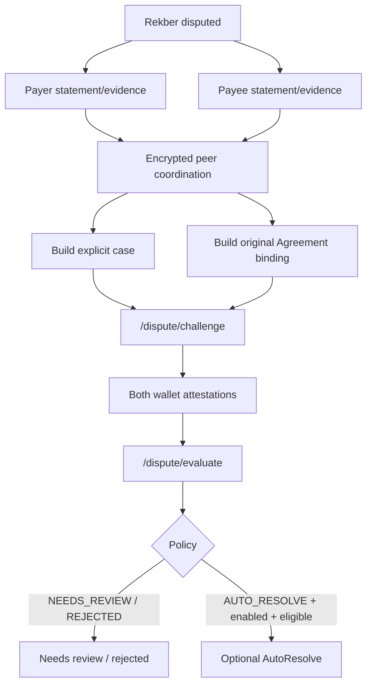

---


## Dispute Review Signature

The wallet signs backend-issued typed data via:

```text
account.signMessage(typedData)
```

This signature means consent to review the bound case.

It is not a normal settlement transaction signature.

---


## Dispute Backend Authority

Backend challenge/evaluation re-verifies:

```text
live custody
original Rekber Agreement binding
both party attestations
verified principal value when available
```

before policy/execution.

---


## AutoResolve

If backend policy returns:

```text
AUTO_RESOLVE
```

and deployment has AutoResolve enabled and eligible, the backend may use its dedicated resolver signer to authorize a split.

Normal frontend Agent does not own that signer.

---


# 35 — Resolution Claim Flow

When a dispute resolution has been authorized:

```text
payer share
payee share
```

become claimable under Rekber rules.

Each party claims its own authorized amount using its settlement wallet/capability path.

---


# 36 — Release Flow

Normal successful settlement release uses Rekber capabilities and current contract state.

Conceptually:

```text
load custody
    ↓
verify role/state in UI
    ↓
load required secret/preimage
    ↓
wallet STRK20 invoke
    ↓
Rekber verifies commitment/state
    ↓
OPEN note receives custody asset
    ↓
contract emits released event
```

---


# 37 — Refund Flow

Refund follows the same authority structure:

```text
UI guard
    <
contract invariant
```

and returns principal according to Rekber rules rather than frontend cache.

---


# 38 — Settlement Proof Flow

Frontend can query public Rekber events directly through Starknet RPC.

Supported proof kinds:

```text
funded
released
refunded
resolved
```

This is separate from backend Activity/Rekber read models.

---


# 39 — Settlement Certificate Flow

After an eligible settlement, the user may optionally claim a public Certificate.

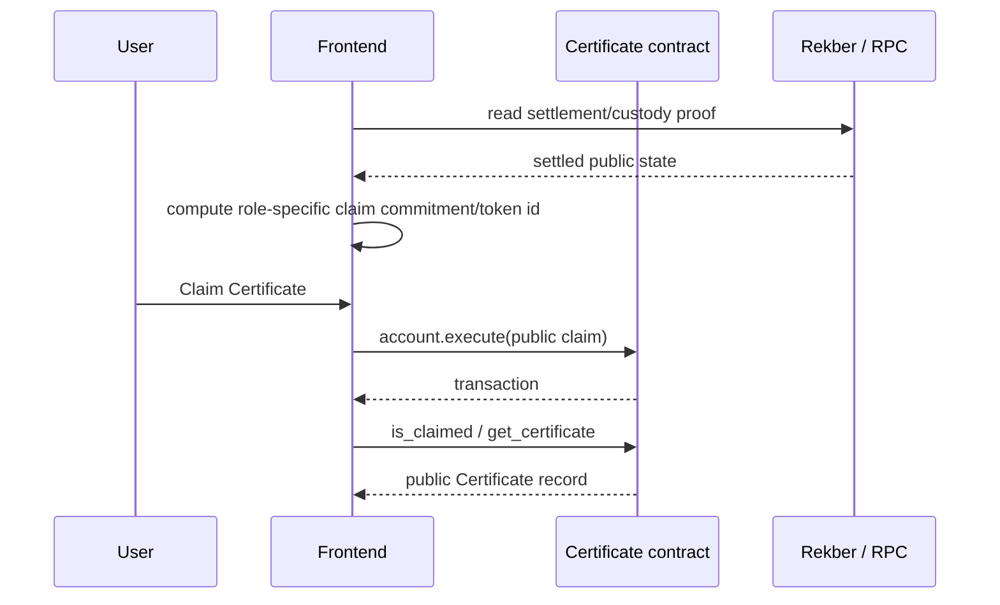

Certificate claim intentionally does not pretend to be a private STRK20 helper action.

---


# 40 — Certificate Authority

Certificate state is canonical in the Settlement Certificate contract.

Frontend/local preview is secondary.

---


# 41 — Direct Invite Create Flow

Current Invite version is V3.

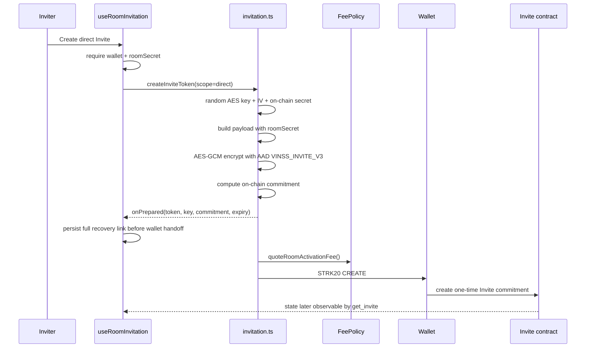

---


## Direct Invite Link

Current shape:

```text
/invite/<encrypted-token>#k=<private-decryption-key>
```

The browser fragment is not part of the normal HTTP request path/query.

---


## Direct Invite Expiry

Current direct TTL:

```text
1 hour
```

---


# 42 — Group Invite Create Flow

Group Invite requires:

```text
selected Group
connected wallet
wallet is local Group admin
```

and can use:

```text
24h
or
7d
```

expiry.

---


## Group Invite Capability

Current bound Group payload can contain:

```text
groupId
groupName
groupSecret
groupOwnerAddress
```

without granting roomSecret.

---


# 43 — Invite Create Recovery

Invite creation persists prepared capability material before Ready X opens.

Stored recovery data includes:

```text
link
expiresAt
commitment
pending/ready status
```

---


## Ambiguous Invite Timeout

If CREATE returns an ambiguous timeout, `invitation.ts` polls:

```text
get_invite(commitment)
```

for up to 8 attempts with roughly 1.5-second spacing.

If the Invite exists on-chain, creation is recovered as successful.

---


## Ongoing Invite Poll

`useRoomInvitation` also polls current Invite state roughly every:

```text
2.5 seconds
```

to detect:

```text
pending -> ready
or
consumed
```

and cleans local capability state after consume.

---


# 44 — Invite Consume Flow

Current consume path conceptually:

```text
open /invite/<token>#k=<key>
    ↓
read token from route
    ↓
read decryption key from fragment
    ↓
AES-GCM decrypt V3 (or legacy V2 compatibility)
    ↓
validate expiry / required fields / scope
    ↓
connect wallet
    ↓
CONSUME one-time Invite on-chain
    ↓
persist direct room access and/or Group access locally
    ↓
redirect to intended room context
```

---


# 45 — Invite Authority

Local `consumed invite` memory is only UX protection.

The canonical one-time property is enforced by the Invite contract.

---


# 46 — Presence Flow

Presence is a side-channel, not an immutable action flow.

```text
derive opaque Presence channel
    ↓
AES-GCM encrypt semantic payload
    ↓
POST /presence/publish
    ↓
backend stores ephemeral record
    ↓
peer POST /presence/poll
    ↓
local decrypt
    ↓
typing/read/participant/group_member UX
```

Presence failure must not change canonical settlement/message history.

---


# 47 — Direct Attachment Flow

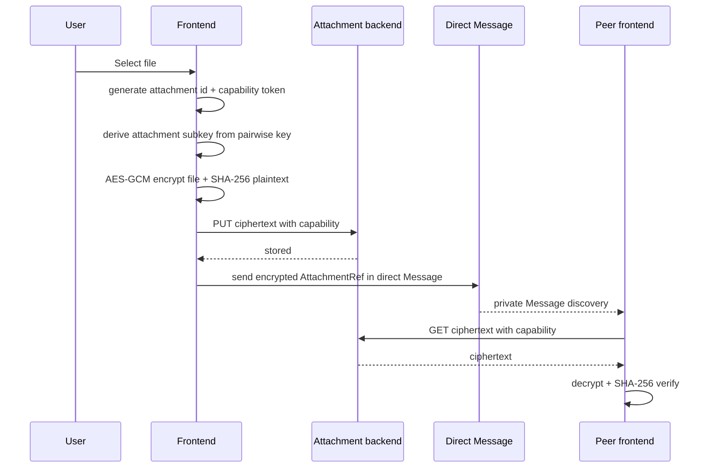

---


# 48 — Normal Agent Flow

Normal Agent is not a financial action pipeline.

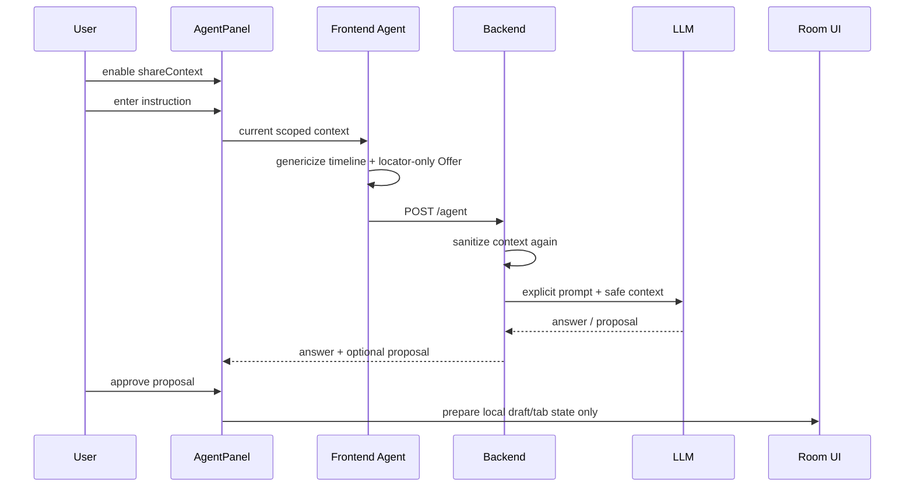

---


## Normal Agent Does Not Send Automatically

Approval of a normal proposal does not immediately call:

```text
account.execute
strk20InvokeTransaction
signMessage
```

through `useRoomAgent`.

The user still enters the ordinary Message/Offer/Rekber workflow before any wallet transaction.

---


# 49 — Agent Context Reset Flow

When active Agent context changes:

```text
chat -> another chat
chat -> Group
Group -> Offer
Offer -> Escrow
etc.
```

`shareContext` resets to false and previous Agent result/proposal state is cleared.

---


# 50 — Backend Discovery Flow

For Message/Offer/Private Escrow:

```text
helper transaction
    ↓
public event
    ↓
backend background indexer
    ↓
PostgreSQL ciphertext record
    ↓
/discover database query
    ↓
browser route match/decrypt
```

The HTTP request itself does not scan Starknet synchronously.

---


# 51 — Discovery Request Boundary

Current frontend sends only:

```text
{kind: message}
{kind: offer}
{kind: escrow}
```

for these default calls.

It does not send:

```text
roomSecret
channelKey
pairwise key
plaintext
```

to `/discover`.

---


# 52 — Discovery Candidate Validation

Candidate ciphertext should not be rendered merely because AES-GCM decryption returned bytes.

Current domains validate some combination of:

```text
recipient routing tag
sender routing tag
sender wallet identity
recipient wallet identity
scope
groupId
known peer relation
Offer parent route
```

---


# 53 — UI Reconciliation Rules

Reconciliation commonly uses action locator as immutable key.

Flow:

```text
existing optimistic/local record
    +
new discovered record with same locator
    ↓
merge/upgrade
    ↓
preserve relevant ephemeral UI state
```

---


# 54 — Activity / Royalty Flow

Activity and Royalty are read-model UI surfaces.

They consume public backend-derived data.

They do not participate in the private Message decryption pipeline or become Rekber financial authority.

---


# 55 — Error Classification

Application flow should classify failures by stage.

| Failure stage | Example | Safe handling |
|---|---|---|
| Preflight | missing helper, missing treasury, FeePolicy read failure | do not create blockchain-pending UI |
| Crypto | missing key, invalid peer public key | block private action |
| Wallet pre-submit/refusal | user refused | restore local draft where appropriate |
| Ambiguous wallet callback | timeout/remount | reconcile locator/contract state |
| Backend index lag | tx exists but `/discover` misses temporarily | poll/retry |
| Backend outage | discovery unavailable | keep local state; retry later |
| RPC outage | custody/certificate read unavailable | do not infer canonical financial state |
| Contract reject | invariant failed | surface domain-safe error; contract wins |
| Local storage failure | recovery/cache unavailable | core chain state may still exist |

---


# 56 — Preflight vs Prepared

A crucial boundary is:

```text
preflight failure
    -> no immutable prepared state should be assumed

prepared locator exists
    -> later wallet error may be ambiguous
```

Message and Offer source explicitly place `onPrepared` after major FeePolicy/config preflight.

---


# 57 — Wallet Callback vs Chain Truth

The application must never globally use:

```text
wallet callback success = canonical settlement state
```

because callbacks can be delayed, lost, or occur before index/read propagation.

---


# 58 — Authority by Domain

| Domain | Strongest current authority |
|---|---|
| Room available on device | local room record |
| Group available on device | local Group record |
| Direct peer identity | P-256 identity + encrypted participant discovery |
| Immutable Message action | helper chain record / exact indexed locator |
| Immutable Offer action | helper chain record / authenticated discovered locator |
| Private Escrow coordination | helper chain record / exact indexed locator |
| Rekber custody state | `VinssEscrowRekber.get_custody` |
| Rekber proof event | Starknet event |
| Settlement Certificate | Certificate contract |
| Presence | best-effort Presence only |
| Agent deal stage | advisory Agent result |
| Dispute authorization | Rekber resolver state/contract |

---


# 59 — Main User Journey

Representative successful direct deal:

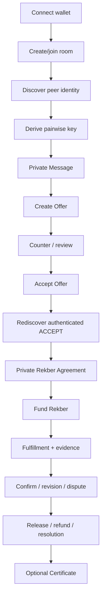

---


# 60 — Alternate Group Journey

Representative Group flow:

```text
join/create room
    ↓
create or consume Group Invite
    ↓
load local Group secret
    ↓
derive Group key
    ↓
sync group_member Presence
    ↓
send/discover Group Message V2
```

Current Offer/Rekber user flow should not be inferred to be Group-based simply because Group messaging exists.

---


# 61 — Recovery Matrix

| Flow | Recovery source | Important note |
|---|---|---|
| Wallet session | public wallet id + silent reconnect | No private key persistence |
| Direct Message | encrypted pending record + exact locator polling | ~45s locator window |
| Group Message | pending locator/timestamps + periodic discovery | ~60s local pending expiry |
| Offer | prepared locator + encrypted history + generation guards | domain-specific callback recovery |
| Invite | full capability link/commitment local + get_invite polling | prepared before wallet handoff |
| Private Escrow coordination | exact locator / indexed coordination | wallet callback not enough |
| Rekber financial state | direct get_custody | canonical contract read |
| Certificate | direct contract read | public state |


# 62 — Local Storage During Flow

| State | Namespace | Flow implication |
|---|---|---|
| Room | `vinss:local-rooms` | roomSecret plaintext local JSON |
| Group | `vinss:local-groups:v1:<roomId>` | groupSecret plaintext local JSON |
| Last wallet | `vinss:last-wallet-id` | public wallet id only |
| Direct Message history | `vinss:direct-history:v2:...` | AES-GCM encrypted |
| Direct pending Message | `vinss:pending-direct-message:...` | AES-GCM encrypted under direct key |
| Offer history | `vinss:offer-history:v1:...` | AES-GCM encrypted |
| Group pending Message | `vinss:pending-group-message:...` | locator/timestamp metadata only |
| Invite recovery | `vinss:invite:v3:...` | full capability link stored |


# 63 — Privacy Boundaries During Flow

Normal private action path:

```text
plaintext
    exists in authorized frontend

encryption key
    exists in authorized frontend

ciphertext/commitment/tags
    may become public / backend-indexed

decryption
    returns to authorized frontend
```

---


## Intentional Exceptions

Some application features intentionally disclose plaintext:

```text
normal Agent explicit prompt
Feedback
dedicated Dispute accepted terms/evidence
```

These are separate boundaries and should not be described as ciphertext-only Discovery.

---


# 64 — Browser Console Caveat

Current `discoverMessages()` still logs decrypted Message fields to the browser console.

This means:

```text
local decrypt stays off backend
```

but not:

```text
decrypted Message never enters diagnostics
```

Remove/gate this before strict production privacy claims.

---


# 65 — Fee Flow Matrix

| Action | Fee source | Flow note |
|---|---|---|
| Invite CREATE / room activation | FeePolicy quote | STRK20 revenue/OpenNote flow |
| Invite CONSUME | negligible replay spend | no service-fee output |
| Message | Message FeePolicy quote | helper validates quote |
| Offer | Offer FeePolicy quote | helper validates quote |
| Private Escrow create/accept/dispute | current Rekber workflow fee helper | frontend application policy |
| Background coordination | negligible replay spend | not another VINSS revenue fee |
| Rekber funding | Rekber quote_rekber_fee | token/principal aware |
| Selected Rekber workflow actions | current 3 STRK workflow amount | separate from funding quote |


# 66 — Flow Invariants

| ID | Invariant |
|---|---|
| `F1` | Wallet/session state must be available before transaction-producing actions. |
| `F2` | Direct peer key derivation requires local P-256 private key + peer public key. |
| `F3` | Group Message uses Group key, not direct pairwise key. |
| `F4` | Normal Discovery never needs room/pairwise decryption key. |
| `F5` | Each immutable Message/Offer/Private Escrow action gets a fresh locator. |
| `F6` | `onPrepared` should occur only after major preflight succeeds. |
| `F7` | Prepared state is optimistic until stronger evidence arrives. |
| `F8` | Exact locator is the reconciliation identity for encrypted actions. |
| `F9` | Cached Offer parent must not bypass private discovery authentication. |
| `F10` | Accepted Offer must be discovered before Rekber handoff. |
| `F11` | One accepted Offer must not silently create multiple Rekber lifecycles. |
| `F12` | Private Escrow coordination is not Rekber custody. |
| `F13` | Rekber contract state is financial authority. |
| `F14` | UI eligibility guards never replace Cairo transition checks. |
| `F15` | Normal Agent proposal does not itself submit wallet transaction. |
| `F16` | Dispute review is explicit plaintext disclosure and wallet attestation. |
| `F17` | Certificate claim is optional public state. |
| `F18` | Presence never becomes canonical transaction evidence. |


# 67 — Common Incorrect Flow Assumptions

- Every private action uses the room key.
- Group and direct Message recovery are identical.
- Wallet success callback means backend Discovery must already contain the action.
- Backend `/discover` scans Starknet on each request.
- Offer ACCEPT can open Rekber while still only optimistic.
- Released Rekber means the same accepted Offer can start another Rekber.
- Private Escrow Helper holds funds.
- Agent approval executes wallet transaction.
- Dispute Agent uses the same minimized context as normal Agent.
- Rekber financial state should be inferred from private messages.
- Presence read receipt is canonical delivery evidence.
- Certificate is private settlement state.
- Every fee is a single frontend constant.


# 68 — Correct Flow Statements

- Direct private actions use pairwise P-256-derived routes.
- Group Message uses a separate Group key.
- Backend returns candidate ciphertext; client route matching/decryption is local.
- Prepared immutable locators support mobile-wallet recovery.
- Offer and Message share envelope/privacy shape but different domain semantics.
- Accepted Offer becomes Rekber input only after authenticated discovery.
- Private Escrow coordinates Rekber privately; Rekber contract owns custody.
- Canonical financial state is read directly from Rekber.
- Normal Agent proposals only prepare local state.
- Dispute has a separate explicit evidence and attestation pipeline.
- Certificate is an optional public credential.


# 69 — Direct Message Review Checklist

- [ ] selectedPeer exists
- [ ] messagingIdentity exists
- [ ] direct key derives
- [ ] FeePolicy quote succeeds
- [ ] onPrepared fires after preflight
- [ ] pending state persists before wallet handoff
- [ ] exact locator can be rediscovered
- [ ] sender/recipient semantic filter matches selected peer
- [ ] history merges by locator
- [ ] draft restores on confirmed failure


# 70 — Group Message Review Checklist

- [ ] selected Group exists
- [ ] Group key derives
- [ ] payload scope is group
- [ ] groupId matches selected Group
- [ ] pending storage contains no plaintext body
- [ ] definite wallet errors clear pending immediately
- [ ] ambiguous prepared errors retain recovery state
- [ ] periodic discovery recovers confirmed locator
- [ ] switching Group clears prior decrypted Group timeline


# 71 — Offer Review Checklist

- [ ] direct peer selected
- [ ] pairwise route derived
- [ ] Offer V2 commitment/routing used
- [ ] FeePolicy quote fetched before wallet
- [ ] prepared Offer isolated from confirmed history
- [ ] parent Offer authenticated before reply
- [ ] new reply uses current pairwise route
- [ ] ACCEPT rediscovered before Rekber


# 72 — Invite Review Checklist

- [ ] scope direct/group explicit
- [ ] direct Invite has roomSecret
- [ ] Group Invite bound to selected Group
- [ ] Group Invite creator is local Group admin
- [ ] V3 AES-GCM token created
- [ ] fragment key separated from token path
- [ ] onPrepared persists recovery link before wallet
- [ ] CREATE quote fetched
- [ ] timeout can recover via get_invite
- [ ] consume validated on-chain


# 73 — Rekber Review Checklist

- [ ] authenticated accepted Offer exists
- [ ] accepted Offer is unused
- [ ] STRK/USDC mapping valid
- [ ] amount converted exactly
- [ ] payer/payee capabilities generated/loaded
- [ ] private Agreement coordination discovered
- [ ] funding quote comes from Rekber
- [ ] wallet funds principal + fee
- [ ] get_custody confirms state
- [ ] protection action checks current state
- [ ] contract remains final authority


# 74 — Dispute Review Checklist

- [ ] Rekber is actually disputed
- [ ] both explicit evidence packets exist
- [ ] accepted Offer snapshot exists
- [ ] original signed Agreement binding exists
- [ ] challenge succeeds
- [ ] each wallet signs its role typed data
- [ ] both signatures refer to same case commitment
- [ ] backend re-verifies live custody
- [ ] policy distinguished from execution
- [ ] AutoResolve deployment state understood


# 75 — Recovery Review Checklist

- [ ] distinguish preflight from post-prepared errors
- [ ] do not create ghost pending record before Ready handoff
- [ ] do not discard possible submitted tx on ambiguous timeout
- [ ] poll the right authority for each domain
- [ ] remove optimistic state only after confirmed failure/expiry policy
- [ ] preserve encrypted cache on temporary decrypt failure
- [ ] avoid stale callback mutating newer action


# 76 — Mainnet Flow Verification

Mainnet flow verification must be explicit and per-domain.

At minimum:

```text
wallet connect/restore
direct Invite create/consume
participant discovery
direct Message two-wallet send/decrypt
direct Offer create/counter/accept
authenticated ACCEPT handoff
private Rekber Agreement
Rekber funding
at least one intended successful settlement path
refund/dispute paths according to launch scope
Certificate claim if exposed
```

Do not infer one path from another.

---


# 77 — Source-of-Truth Order

```text
1. Cairo contract invariants
2. frontend/app/room/[roomId]/page.tsx
3. frontend/hooks/room/useRoomConversation.ts
4. frontend/hooks/room/useDirectConversation.ts
5. frontend/hooks/room/useGroupConversation.ts
6. frontend/hooks/room/useRoomOffers.ts
7. frontend/hooks/room/useRoomEscrow.ts
8. frontend/hooks/room/useRoomInvitation.ts
9. frontend/lib/deal-room/messaging.ts
10. frontend/lib/deal-room/offers.ts
11. frontend/lib/deal-room/invitation.ts
12. frontend/lib/deal-room/escrow.ts
13. frontend/lib/deal-room/escrowSettlement.ts
14. frontend/lib/deal-room/settlement.ts
15. frontend/lib/deal-room/disputeAgent.ts
16. frontend/lib/privacy/*
17. frontend/lib/starknet/*
18. tests / cross-layer regressions
19. deployed transaction evidence
20. prose documentation
```


# 78 — Flow Maintenance Rules

- Re-read current source before changing flow prose.
- Document per-domain recovery instead of assuming one shared mechanism.
- Keep direct and Group paths separate.
- Keep Offer confirmation separate from local optimistic ACCEPT.
- Keep Private Escrow coordination separate from Rekber custody.
- Keep normal Agent proposal flow separate from Dispute arbitration.
- Keep backend indexed evidence separate from canonical financial state.
- Record exact timeout/poll values only when current source is checked.
- Do not call a source-implemented flow Sepolia/mainnet verified without transaction evidence.
- Do not copy old V1/V2 contract naming into canonical Rekber flow.


# Appendix A — Flow Ownership by Source

| Flow | Primary source |
|---|---|
| Wallet connect/restore | `components/providers/WalletProvider.tsx + lib/starknet/walletClient.ts` |
| Room hydration | `hooks/room/useRoom.ts` |
| Conversation target | `hooks/room/useRoomConversation.ts` |
| Participant discovery | `hooks/room/useRoomParticipants.ts` |
| Direct Message lifecycle | `hooks/room/useDirectConversation.ts` |
| Group Message lifecycle | `hooks/room/useGroupConversation.ts` |
| Offer lifecycle | `hooks/room/useRoomOffers.ts` |
| Private Escrow coordination | `hooks/room/useRoomEscrow.ts` |
| Invite lifecycle | `hooks/room/useRoomInvitation.ts` |
| Message protocol | `lib/deal-room/messaging.ts` |
| Offer protocol | `lib/deal-room/offers.ts` |
| Invite protocol | `lib/deal-room/invitation.ts` |
| Private Escrow protocol | `lib/deal-room/escrow.ts` |
| Offer -> settlement mapping | `lib/deal-room/escrowSettlement.ts` |
| Rekber custody/protection | `lib/deal-room/settlement.ts` |
| Dispute review | `lib/deal-room/disputeAgent.ts + useDisputeAgentReview.ts` |
| Normal Agent | `lib/agent.ts + AgentPanel.tsx + useRoomAgent.ts` |


# Appendix B — Polling / Timing Reference

| Flow | Current timing | Purpose |
|---|---|---|
| Participant publish | ~60s | Presence refresh/announcement |
| Participant poll | ~3s | peer discovery |
| Direct Message reconciliation | ~45s total | exact locator |
| Direct reconciliation polling | ~1.5s | during recovery |
| Group discovery | ~2.5s | selected Group |
| Group pending checker | ~2s | local pending recovery |
| Group pending expiry | ~60s | local UX timeout |
| Invite creation on-chain recovery | 8 attempts × ~1.5s | ambiguous CREATE timeout |
| Invite state poll | ~2.5s | pending/consume detection |
| Dispute retry guard | ~5s | payer-side auto-evaluation retry |


# Appendix C — Transaction-Producing Paths

| Action | Wallet/API | Target |
|---|---|---|
| Invite CREATE | strk20InvokeTransaction | Invite contract |
| Invite CONSUME | strk20InvokeTransaction | Invite contract |
| Message | strk20InvokeTransaction | MessageHelper |
| Offer | strk20InvokeTransaction | OfferHelper |
| Private Escrow coordination | strk20InvokeTransaction | PrivateEscrowHelper |
| Rekber funding | strk20InvokeTransaction | VinssEscrowRekber |
| Rekber protection/lifecycle | strk20InvokeTransaction | VinssEscrowRekber |
| Certificate claim | account.execute | Settlement Certificate |
| Dispute review attestation | account.signMessage | typed-data signature, not transaction |
| Normal Agent proposal approval | none | local application state |


# Appendix D — Read Paths

| Read | Source | Semantics |
|---|---|---|
| Message discovery | VINSS backend /discover | ciphertext candidate |
| Offer discovery | VINSS backend /discover | ciphertext candidate |
| Private Escrow discovery | VINSS backend /discover | ciphertext candidate |
| Presence | VINSS backend /presence | ephemeral encrypted |
| Attachments | VINSS backend /attachments | opaque ciphertext blob |
| Activity | VINSS backend /activity | public read model |
| Royalty | VINSS backend /royalty | public certificate-derived read model |
| Rekber custody | direct Starknet RPC | canonical contract read |
| Rekber proof | direct Starknet RPC events | public chain proof |
| Certificate | direct Starknet RPC contract read | canonical public credential |
| Agent | VINSS backend /agent | explicit prompt + reduced context |
| Dispute | VINSS backend /dispute | explicit case/attestations |


# Appendix E — State Transition Classification

| State | Class | Authority |
|---|---|---|
| React draft/tab | ephemeral local | not authoritative |
| local encrypted history | durable UX cache | not chain authority |
| prepared action | optimistic/recovery | not confirmed |
| wallet callback | transport result | may be ambiguous |
| indexed locator | strong immutable-action evidence | index freshness dependent |
| decrypted authenticated action | private semantic evidence | client-specific |
| Rekber get_custody | canonical public financial state | contract authority |
| Certificate read | canonical public credential | contract authority |
| Presence | ephemeral UX | never canonical |
| Agent answer | advisory | never canonical settlement authority |


# Final Flow Diagram

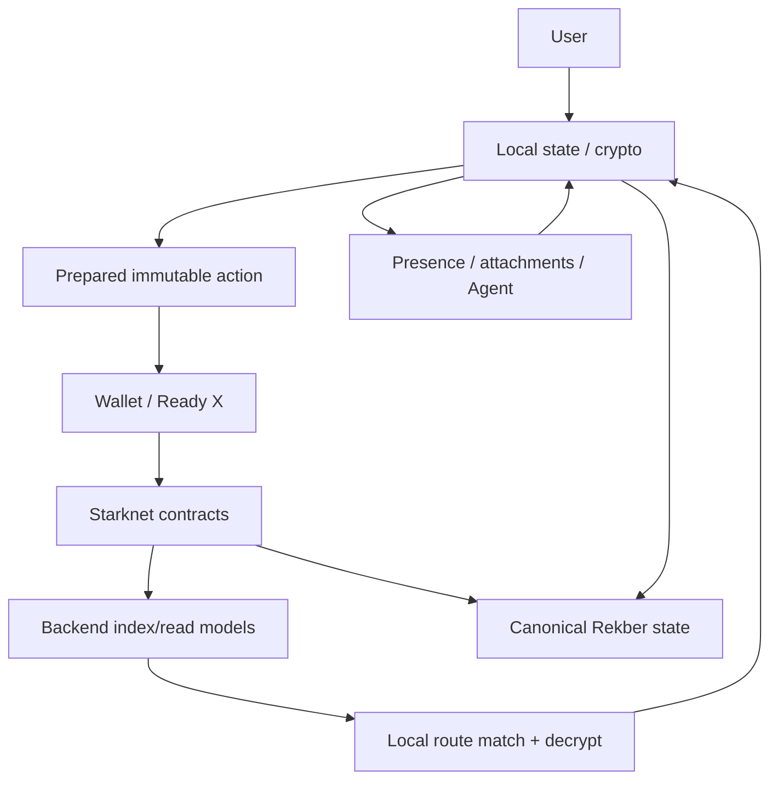

---

# Bottom Line

The old application-flow document captured the core Message/Offer privacy loop, but the current frontend needs a richer model.

The strongest current description is:

> VINSS is a multi-plane client workflow where local cryptography creates immutable private actions, the wallet authorizes writes, Starknet records commitments/ciphertext/public settlement state, the backend indexes and relays selected data planes, and the frontend reconciles each feature against the strongest authority appropriate to that domain.

The most important direct-message rule is:

> prepared locator state survives wallet ambiguity and is reconciled against indexed ciphertext rather than trusting callback status alone.

The most important Group rule is:

> Group Message uses a separate Group key and a different pending-recovery policy from direct Message.

The most important Offer rule is:

> an optimistic ACCEPT is not sufficient to start Rekber; the accepted Offer must be authenticated through encrypted discovery.

The most important Rekber rule is:

> Private Escrow helper coordination is encrypted application state, while `VinssEscrowRekber` contract state is canonical financial authority.

The most important Agent rule is:

> normal Agent approval prepares local UI only; dedicated Dispute is a separate explicit disclosure/attestation path and may lead to backend resolver authorization only when AutoResolve is actually enabled and policy-eligible.

The most important recovery rule is:

> there is no single universal recovery mechanism—Message, Group Message, Offer, Invite, Private Escrow coordination, and Rekber state each reconcile against different evidence.
