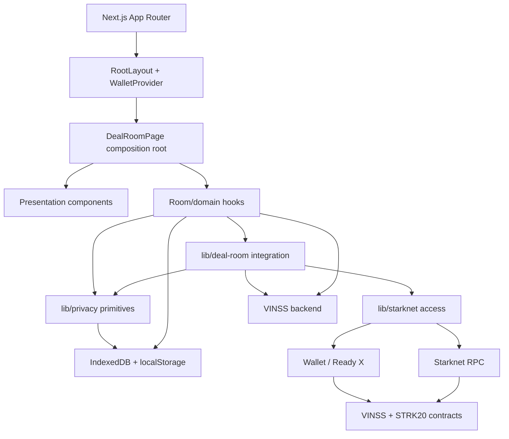
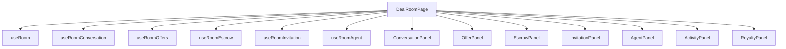
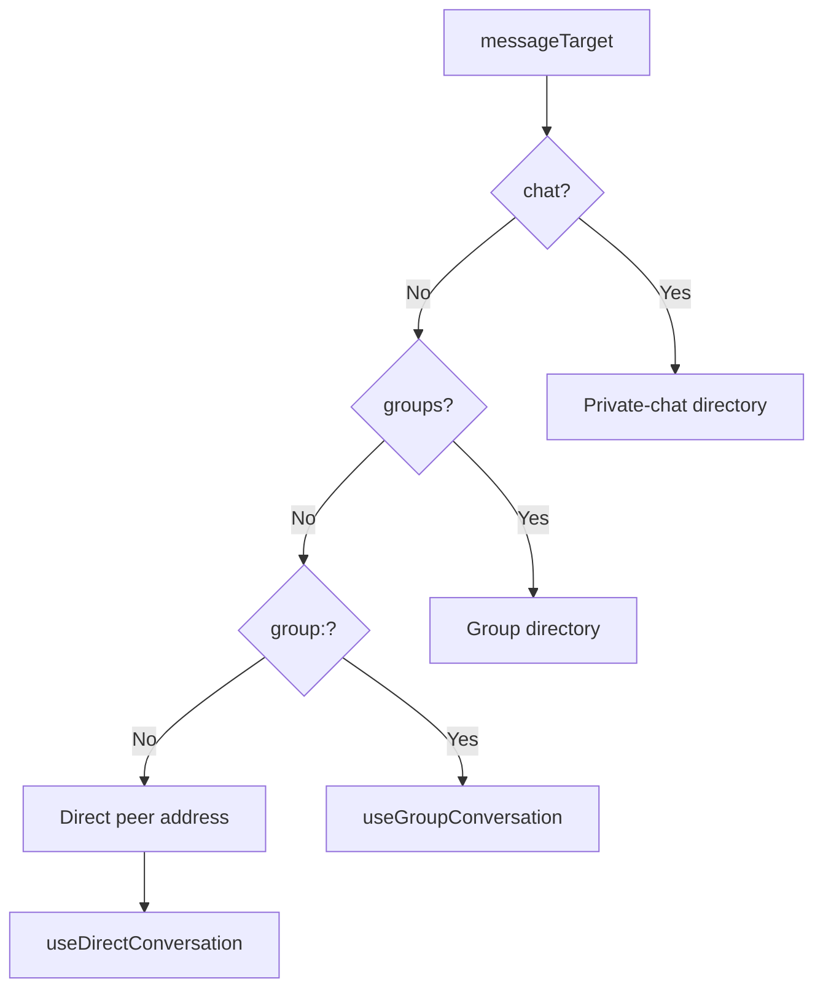
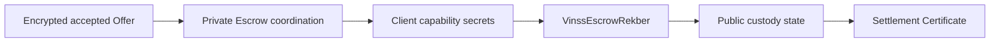
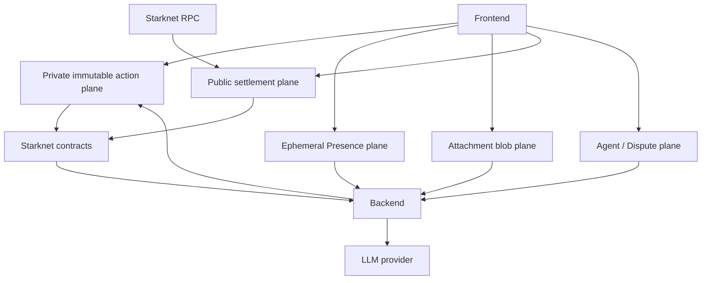
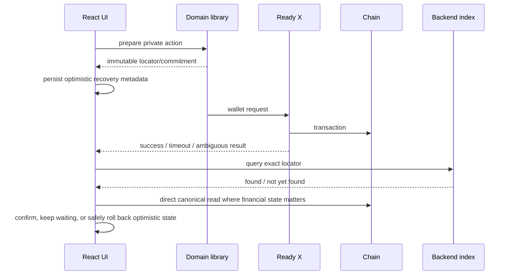
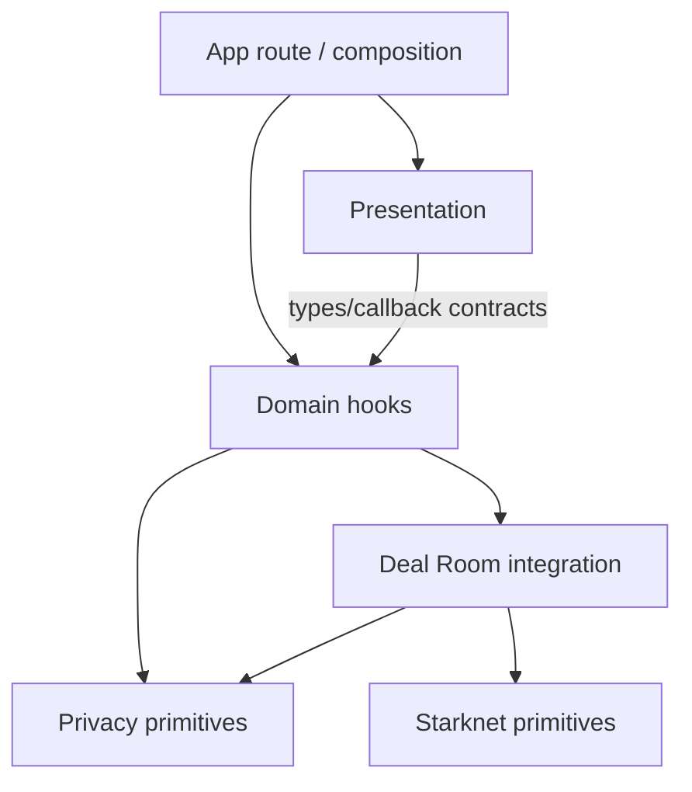
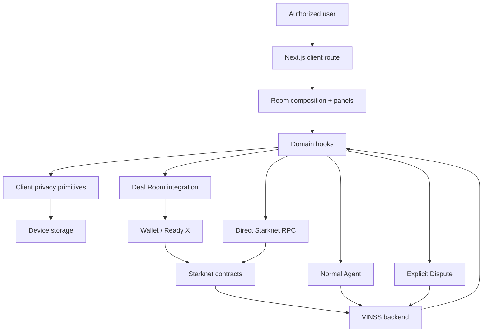

# VINSS Frontend Architecture

This document describes the current frontend architecture of VINSS from the source that is active on `main`.

The frontend is not a thin rendering layer.

It is the privacy-sensitive client and orchestration layer that:

- owns device-local Deal Room access material;
- derives room, Group, and direct pairwise cryptographic keys;
- encrypts and decrypts private application payloads;
- prepares immutable Message, Offer, and Private Escrow actions;
- coordinates wallet authorization through Wallet Standard / STRK20;
- maintains optimistic and recoverable mobile-wallet state;
- reads canonical Rekber and Settlement Certificate state;
- consumes backend ciphertext/public read models;
- scopes normal Agent context;
- prepares the explicit Dispute disclosure and attestation workflow.

The architectural objective is:

> Keep private business semantics and decryption authority on the authorized client while using Starknet, VINSS contracts, and the backend for public commitments, ciphertext transport/indexing, settlement state, and optional application services.

---

# Architectural Principles

Current source is easiest to understand through these principles:

```text
composition over monolithic room state

direct and Group conversation separation

pairwise direct privacy

encrypted coordination separate from financial custody

backend discovery separate from local decryption

wallet callback separate from canonical chain evidence

public settlement state separate from private business terms

normal Agent context separate from explicit Dispute disclosure

local cache separate from canonical state
```

---

# Top-Level Architecture



---

# Layer Model

The current frontend can be divided into nine practical layers:

```text
1. Next.js route shell
2. global wallet/session provider
3. Deal Room composition root
4. presentation components
5. room/domain hooks
6. Deal Room integration modules
7. privacy/cryptography modules
8. Starknet/wallet/config modules
9. browser persistence + external services
```

These are logical responsibilities rather than strict package-enforced boundaries.

---

# Layer 1 — Next.js Route Shell

The frontend uses Next.js App Router.

`frontend/app/layout.tsx` defines the global HTML/body shell and wraps all routes with `WalletProvider`.

That means wallet/session state is available to:

```text
home
room
invite
certificate
loyalty
terms
and other client routes
```

without each route independently rebuilding wallet-discovery infrastructure.

Current root metadata describes VINSS as:

```text
Private Deal Rooms
```

and the application-wide CSS is loaded from `app/globals.css`.

---


## Route Responsibility

Routes should own URL-level navigation and page composition.

They should not become the canonical home for:

```text
cryptographic primitives
wallet protocol encoding
contract commitment formulas
reusable settlement arithmetic
```

Those belong in lower layers.


## Primary Frontend Route Areas

- `app/page.tsx` — primary home/product entry.
- `app/room/[roomId]/page.tsx` — current Deal Room composition root.
- `app/invite/[token]/page.tsx` — encrypted Invite decode/consume flow.
- `app/certificate/[tokenId]/...` — public Settlement Certificate surface.
- `app/loyalty/...` — auxiliary points/loyalty UI.
- `app/terms/...` — legal/product terms surface.
- `app/api/...` — Next.js-owned HTTP/image helpers where present.


# Layer 2 — Global Wallet / Session Provider

`WalletProvider` is the global client wallet-session boundary.

It uses:

```text
@starknet-io/get-starknet-ui
Wallet Standard features
VINSS walletStore discovery
createWalletSession()
```

to expose:

```text
session
connected
connectWallet()
disconnectWallet()
```

through React context.

---


## Session Is Application State, Not Private Key Ownership

`VinssWalletSession` contains the connected wallet account abstraction and capability information.

The frontend does not receive or persist:

```text
wallet seed phrase
wallet private key
raw signing key
```

from the wallet provider.

Signing remains inside the wallet/account abstraction.


## Mobile Wallet Restoration

The provider explicitly accounts for Ready X / mobile-browser remount behavior.

Current architecture reacts to:

```text
window focus
pageshow
document visibility changes
```

and re-discovers injected wallets before rebuilding session state.

A short delayed refresh is used after resume so extension unlock/handoff can settle.


## Silent Reconnect

The provider stores only the last public wallet identifier:

```text
vinss:last-wallet-id
```

and attempts a silent reconnect against available discovered wallets after browser refresh.

This is a UX continuity mechanism.

It is not wallet-secret persistence.

---


# Layer 3 — Deal Room Composition Root

`frontend/app/room/[roomId]/page.tsx` is the current Deal Room composition root.

Its job is to compose domain hooks and presentation surfaces.

It does not itself implement AES-GCM, ECDH, Starknet calldata commitment formulas, or raw indexed-ciphertext parsing.

---


## Deal Room Composition

The current page composes:

```text
RoomHeader
RoomTabs
ConversationPanel
OfferPanel
EscrowPanel
InvitationPanel
ActivityPanel
RoyaltyPanel
AgentPanel
```

and consumes:

```text
useRoom
useRoomConversation
useRoomOffers
useRoomEscrow
useRoomInvitation
useRoomAgent
```

plus local UI state such as:

```text
selected tab
counterSource
escrowOfferSource
busy/error state
```

---


## Composition Root Diagram




## Why This Separation Matters

Room-level UI state changes frequently.

Cryptographic and contract invariants should not move every time the UX changes.

The architecture keeps:

```text
UI composition
domain lifecycle
cryptography
contract encoding
```

separate enough that a panel redesign does not require rewriting on-chain behavior.

---


# Layer 4 — Presentation Components

Presentation components receive state and callbacks from the composition/domain layers.

Examples:

```text
components/room/conversation/*
components/room/offer/*
components/room/escrow/*
components/room/invitation/*
components/room/activity/*
components/room/royalty/*
components/agent/*
```

---


## Presentation Rule

A presentation component may:

- render cards;
- collect user input;
- expose lifecycle buttons;
- display pending/confirmed/error state;
- call a callback supplied by its owning hook/page.

It should not independently invent:

```text
new commitment domains
new secret derivations
new Starknet struct indexes
new wallet authority semantics
```

---


# Layer 5 — Room / Domain Hooks

The room hook layer owns React lifecycle, polling, local cache hydration, selected-peer/group state, and coordination between reusable library functions.

Current important hooks:

```text
useRoom.ts
useRoomConversation.ts
useRoomParticipants.ts
useDirectConversation.ts
useDirectPresence.ts
useRoomGroups.ts
useGroupConversation.ts
useRoomOffers.ts
useRoomEscrow.ts
useRoomInvitation.ts
useRoomAgent.ts
useDisputeAgentReview.ts
useRekberProtectionActions.ts
```

---


## Conversation Coordinator

`useRoomConversation` is not a generic message store.

It is a coordinator around four independent concerns:

```text
participantState = useRoomParticipants()
groupState       = useRoomGroups()
group            = useGroupConversation()
direct           = useDirectConversation()
```

plus a small `activityEntries` state channel.


## Conversation Target State Machine

Current `messageTarget` semantics:

```text
chat
    -> private-chat directory

groups
    -> Group directory

group:<id>
    -> selected Group conversation

<Starknet address>
    -> selected direct peer
```


## Conversation Selection Diagram




## Direct and Group State Are Not One Timeline

The current architecture intentionally keeps:

```text
direct.entries
and
group.entries
```

separate inside their own hooks.

`useRoomConversation` merges them only for the outward room coordinator result alongside `activityEntries`.

The selected mode determines:

```text
draft source
send function
chatEndRef
refresh function
```

rather than mutating one shared private-message store.

---


# Participant Discovery Architecture

Participant discovery is its own subsystem because direct ECDH cannot begin until the frontend knows the peer's:

```text
Starknet address
messaging P-256 public key
```

`useRoomParticipants` combines:

```text
encrypted room-level participant Presence
+
encrypted room Message fallback
+
local public-key cache
```

to construct the direct-peer set.

---


## Participant Authority

A participant cache is an acceleration/continuity aid.

Cryptographic direct routing still depends on a usable peer public key and successful local authenticated ciphertext matching.

The cache is not a public on-chain participant registry.

---


# Direct Conversation Architecture

`useDirectConversation` owns the lifecycle for one selected peer.

It handles:

- direct pairwise key resolution;
- direct Message discovery/decryption;
- optimistic send state;
- exact-locator reconciliation;
- encrypted local history;
- typing/read Presence integration;
- encrypted attachment upload/download;
- Rekber work evidence/review transport.

---


## Direct Route Dependency

A direct route requires:

```text
roomId
self P-256 private key
peer P-256 public key
peer Starknet identity
```

from which the current pairwise key and routing identities are derived.


## Direct Discovery Is Route-Oriented

The hook builds several candidate routing identities where necessary to tolerate canonical vs historical leading-zero wallet formatting.

That is why source may try:

```text
current wallet address
selfRoutingIdentities
canonical address
peer exact address
peer canonical address
```

while still mapping them to the same numeric Starknet identity semantics.

---


# Group Architecture

Groups are active in current source and have a separate security/data model.

`useRoomGroups` owns local Group definitions and membership synchronization.

`useGroupConversation` owns one selected Group timeline.

---


## Local Group Object

```text
id
roomId
name
groupSecret
ownerAddress
createdAt
members[]
```

Group state is currently local-first.

There is no canonical on-chain Group registry in this frontend architecture.


## Group Key Boundary

Group communication uses a Group key derived from `groupSecret`.

It does not reuse:

```text
room channelKey
or
direct ECDH pairwise key
```

as the active Group message key.


## Group Membership Plane

Membership observation is exchanged through encrypted:

```text
group_member Presence
```

with the Group key.

That is an ephemeral coordination mechanism, not a canonical entitlement ledger.

---


# Offer Architecture

Offer state remains deliberately separate from generic Message state.

`useRoomOffers` owns active direct Offer behavior.

`lib/deal-room/offers.ts` owns encrypted Offer envelope construction/discovery.

---


## Why Offer Is Separate

Offer actions carry immutable lifecycle semantics such as:

```text
rootOfferLocator
parentOfferLocator
deal type
asset
amount
payment terms
conditions
expiry
```

and are not merely chat-text decorations.


## Current Direct Offer Dependency

The active room Offer hook uses:

```text
roomId
messagingIdentity
participants
pairwise ECDH route
```

just like direct Chat.

Group conversation support does not imply active Group Offer support.


## Offer Parent Authentication

A cached Offer card is not automatically treated as an authenticated parent.

The hook can refresh Offer discovery and require a matched private route before permitting a lifecycle reply.

This separates:

```text
UI cache existence
from
cryptographically matched private Offer history
```

---


# Accepted Offer → Rekber Handoff

The page computes an eligible accepted direct Offer before entering new Rekber creation.

Current architecture enforces an important product invariant:

```text
one accepted Offer
    -> at most one Rekber lifecycle creation
```

in the current UI orchestration.

Released/refunded Rekber can remain historical, but a new Rekber should begin from another accepted Offer.


## Accepted Offer Discovery Requirement

The page refuses to open Escrow from a locally optimistic ACCEPT that has not been rediscovered/authenticated yet.

Conceptually:

```text
prepared ACCEPT
    !=
confirmed private accepted Offer
```

until encrypted discovery sees it again.

---


# Private Escrow Coordination Architecture

`useRoomEscrow` and `lib/deal-room/escrow.ts` implement the private coordination side of Rekber.

This is not the custody contract.


## Pairwise Coordination

For each known participant, the hook can derive the same direct pairwise key used by private direct communication.

It builds both:

```text
incoming route to self
outgoing route to peer
```

for local encrypted coordination discovery.


## Visible Coordination Filtering

After decryption, current hook restricts visible actions to:

```text
self <-> known peer
```

rather than rendering any ciphertext that happened to decrypt under a supplied route.


## Coordination Polling

When active and prerequisites exist, the Escrow hook periodically refreshes encrypted coordination.

The architectural reason is:

```text
wallet handoff and indexer lag can outlive one React callback
```

so the coordination state must be recoverable from indexed immutable actions.

---


# Rekber Custody Architecture

Public Rekber financial custody is a separate state plane from Private Escrow coordination.

Architecture split:




## Private Plane

Contains:

```text
accepted business terms
agreement coordination
capability preimages
work evidence
review evidence
private dispute coordination
```

as appropriate to the frontend flow.


## Public Plane

Contains:

```text
token
principal
fee
capability commitments
timing boundaries
fulfillment/dispute commitments
resolution allocation
lifecycle flags
settlement timestamps
```

in the Rekber contract.


## Authority

For financial truth:

```text
canonical Rekber contract state
    >
backend read model
    >
frontend cache
```

---


# Layer 6 — Deal Room Integration Modules

`frontend/lib/deal-room/` is the application integration layer between React/domain orchestration and lower-level privacy/Starknet primitives.

It is not currently a stable externally versioned SDK.

---


## Responsibilities

- construct domain payloads and immutable action envelopes;
- compute module-specific commitments;
- query FeePolicy/Rekber quotes;
- build STRK20/direct wallet action bundles;
- discover ciphertext through backend APIs;
- decrypt and validate candidate private actions locally;
- map accepted Offer terms to generic Rekber settlement inputs;
- build Rekber capabilities and settlement actions;
- build explicit Dispute Agent case/binding structures;
- read public settlement/certificate state.


## Representative Modules

```text
messaging.ts
offers.ts
invitation.ts
escrow.ts
escrowSettlement.ts
settlement.ts
settlementPlan.ts
rekberAuthorization.ts
rekberEvidence.ts
rekberProtection.ts
rekberSecrets.ts
rekberView.ts
disputeAgent.ts
workConfirmation.ts
```


# Layer 7 — Privacy / Cryptography Modules

`frontend/lib/privacy/` owns reusable cryptographic and privacy data-plane mechanics.

Representative modules:

```text
channelKey.ts
envelope.ts
participantKeys.ts
messageRouting.ts
presence.ts
encryptedChatCache.ts
directAttachments.ts
rekberEvidenceChannel.ts
```

---


## Privacy Module Dependency Direction

Domain code may depend on privacy primitives.

Privacy primitives should not depend on:

```text
React UI components
room tabs
panel layout
business-specific wording
```

unless a module is explicitly an application-specific privacy channel.


## Key Scopes

Current active key scopes are distinct:

```text
roomSecret -> room channelKey

groupSecret -> Group key

P-256 ECDH + roomId -> direct pairwise key

direct pairwise key + attachment id -> attachment subkey
```

---


# Layer 8 — Starknet / Wallet / Configuration

`frontend/lib/starknet/` owns wallet and public network/config wiring.

Representative modules:

```text
walletClient.ts
walletStore.ts
constants.ts
feePolicy.ts
identity.ts
```

---


## Wallet Client

`walletClient.ts` creates `WalletAccountV6` sessions from Wallet Standard V6-compatible wallets and determines STRK20 capability.

Current minimum detected Wallet API version:

```text
0.10.3
```


## Constants

`constants.ts` centralizes:

```text
network
RPC URL
backend URL
contract addresses
STRK/USDC addresses
helper OpenNote token
```

and normalizes Starknet addresses for strict wallet felt handling.


## Frontend Config Is Not Globally Fail-Closed

Current frontend constants still contain development fallbacks, including Sepolia network/RPC behavior.

Some contract-address variables can resolve to empty strings and are rejected only when a feature path needs them.

This differs from the current backend config, which is globally stricter at startup.

---


# Layer 9 — Persistence and External Services

The frontend architecture spans three categories of storage/service state:

```text
device local
VINSS backend
public Starknet
```

plus optional external LLM provider execution behind the backend.

---


## Device-Local Persistence

Current local persistence includes both encrypted and unencrypted application state.

Important examples:

| State | Store | Current application protection |
|---|---|---|
| Room record including `roomSecret` | localStorage | plaintext local JSON |
| Group record including `groupSecret` | localStorage | plaintext local JSON |
| P-256 private messaging key | IndexedDB | non-exportable `CryptoKey` |
| Participant public-key cache | localStorage | plaintext metadata |
| Direct history | localStorage | AES-GCM encrypted |
| Direct pending Message | localStorage | AES-GCM encrypted |
| Offer history | localStorage | AES-GCM encrypted |
| Invite recovery capability | localStorage | no extra local wrapper |


## Backend State

The frontend uses the backend for:

```text
Message/Offer/Private Escrow ciphertext discovery
Presence relay
encrypted attachment blob storage
Activity
Royalty
normal Agent
Dispute Agent
Feedback where invoked
```


## Public Starknet State

The frontend interacts with public chain state for:

```text
Invite lifecycle
encrypted helper action writes
Rekber custody
FeePolicy quotes
Settlement Certificate
public event proofs
```

---


# Data Plane Architecture

The frontend is clearer when viewed as several independent data planes rather than one backend API.



---


## Plane A — Private Immutable Actions

Domains:

```text
Message
Offer
Private Escrow coordination
```

Write path:

```text
client plaintext
-> client encryption
-> wallet-authorized on-chain helper write
-> backend persistent ciphertext index
-> client candidate fetch
-> client route match/decryption
```


## Plane B — Presence

Domains:

```text
typing
read
participant
group_member
```

Presence is:

```text
encrypted
ephemeral
best effort
non-canonical
```


## Plane C — Attachments

Attachment bytes are encrypted client-side and stored in backend PostgreSQL.

Access capability metadata travels through the private direct conversation.


## Plane D — Public Settlement

Domains:

```text
Rekber custody
Rekber proof
Settlement Certificate
```

The frontend can query this plane directly from Starknet RPC.


## Plane E — Agent / Dispute

Normal Agent sends:

```text
explicit user prompt
+
privacy-reduced automatic context
```

Dedicated Dispute sends a deliberately broader explicit plaintext evidence case plus wallet attestations/binding material.

---


# Discovery Architecture

The old architecture description that only shows:

```text
frontend -> backend -> ciphertext
```

is incomplete.

The important current flow is:

```text
Starknet immutable helper record
    ↓
backend background indexer
    ↓
PostgreSQL ciphertext record
    ↓
frontend /discover query
    ↓
local routing-tag match
    ↓
local decrypt
    ↓
semantic validation/render
```

---


## Discovery Request

The frontend currently sends selectors such as:

```json
{ "kind": "message" }
```

```json
{ "kind": "offer" }
```

```json
{ "kind": "escrow" }
```

without sending decryption keys.


## Why Candidate Discovery Is Broad

The backend does not know which private records belong to one room/peer.

The frontend therefore accepts candidate encrypted records and privately tests routes.

This preserves the keyless backend boundary at the cost of local matching work.

---


# Local Route Authentication

Decrypting arbitrary ciphertext is not the only validation step.

Current direct action modules also verify routing bindings such as:

```text
expected recipient tag
sender identity / sender tag
encrypted recipient identity
scope/groupId where relevant
```

before accepting data into visible local state.

---


# Wallet Execution Architecture

The frontend has two wallet-execution modes.

```text
STRK20 privacy-enabled application actions
and
direct public account.execute actions
```

---


## STRK20 Path

Used for private helper workflows and Rekber-related application actions where source builds STRK20 Wallet API actions.

Conceptually:

```text
frontend preflight
-> quote/commitment/calldata
-> strk20InvokeTransaction
-> Ready X approval
-> Privacy Pool / invokes
-> VINSS contract
```


## Direct Public Execute

Settlement Certificate claim intentionally uses a direct public wallet execute path.

The Certificate is public evidence and does not pretend to be a private helper action.

---


# Fee Architecture

Fees are not one frontend constant.

Current source has several fee paths:

| Domain | Source |
|---|---|
| Invite | helper FeePolicy quote |
| Message | MessageHelper FeePolicy quote |
| Offer | OfferHelper FeePolicy quote |
| Rekber funding | Rekber `quote_rekber_fee(token, principal)` |
| selected Rekber workflow actions | frontend current 3 STRK workflow amount |
| replay-only private coordination | negligible replay spend |

Architecture docs must keep fee-source authority explicit.

---


# Optimistic State Architecture

Mobile wallet UX requires optimistic state, but optimistic state is never supposed to silently become canonical truth.

Current architecture often splits one action into:

```text
preflight
prepared immutable identity
wallet handoff
wallet callback
index/chain reconciliation
confirmed UI state
```

---


## Prepared Boundary

`onPrepared` callbacks exist so the UI can persist immutable identity before the browser hands control to Ready X.

Good prepared data includes:

```text
action locator
payload commitment
timestamps
minimal recovery metadata
```

depending on domain.


## Why It Matters

On mobile:

```text
transaction may be submitted
while
the dapp callback times out/remounts
```

so callback error alone cannot always prove failure.

---


# Recovery Architecture




## Recovery Evidence Hierarchy

For immutable encrypted actions:

```text
exact indexed action locator
    >
wallet callback
    >
optimistic React/local state
```

For financial state:

```text
contract get_custody
    >
backend read model
    >
frontend cache
```

---


# Agent Architecture

Normal Agent is integrated as an auxiliary proposal surface inside the Deal Room.

The room page computes context based on the active:

```text
Offer tab
Escrow tab
selected Group
selected direct peer
directory/no-conversation state
```

---


## Context Isolation

When the user is only looking at a directory, the page intentionally avoids aggregating unrelated private-chat timelines into Agent context.

This is an architectural privacy boundary implemented at composition time before backend sanitization adds another layer.


## Current Context Flow

The page creates a local candidate timeline from current entries/Offer entries.

`AgentPanel`/frontend Agent code then converts automatic context into privacy-safe labels before network submission.

The backend independently sanitizes again.

---


## Latest Offer Context

The page can construct richer local latest-Offer context for UI/Agent inputs.

Network code later reduces automatic latest Offer context to the action locator.

This is an example of:

```text
local rich state
!= automatically transmitted remote state
```

---


# Dispute Architecture

Dispute is deliberately separated from normal Agent privacy semantics.

It has its own hook/module/backend endpoints because it needs explicit:

```text
accepted terms
party statements
evidence
wallet attestations
original Rekber binding
```

to perform arbitration review.


## Dispute Trust Transition

Normal private Deal Room:

```text
backend should not receive private terms automatically
```

Dedicated Dispute:

```text
user deliberately discloses selected case material
```

This is a trust-boundary transition, not an implementation accident.

---


# Invite Architecture

Invite is a capability-bootstrap flow, not ordinary Message discovery.

Current V3 flow separates:

```text
encrypted route token
and
private URL fragment key
```

then requires wallet-backed on-chain consume before local room/Group access is persisted.


## Direct vs Group Invite

A direct Invite can grant room-level access.

A Group-only Invite can grant Group access without granting the room secret.

This creates an important architecture capability boundary:

```text
Group membership
does not automatically imply
direct room-access authority
```

---


# Settlement Certificate Architecture

Settlement Certificate is a public credential plane.

Frontend can:

```text
compute claim commitment/token ID
claim directly
read claim state
read certificate record
read associated Rekber proof
```

without treating the Certificate as private chat state.

---


# Authority Hierarchy

Different questions have different canonical authorities.

| Question | Strongest current authority |
|---|---|
| Is this room available on this device? | local room record |
| Can this client derive direct key? | local private CryptoKey + peer public key |
| Was encrypted action written? | exact helper locator in indexed/chain data |
| Is an Offer parent authenticated privately? | local matched encrypted discovery route |
| What is current Rekber financial state? | Rekber contract |
| Was a Certificate claimed? | Settlement Certificate contract |
| Is someone typing? | Presence only, best effort |
| Did Agent propose something? | current Agent response/local state |

---


# Presentation State vs Canonical State

React state is deliberately disposable.

A page remount should be able to reconstruct important state from:

```text
local encrypted/cache state
wallet session restoration
backend ciphertext index
public contract reads
```

depending on the domain.

---


# Frontend Dependency Direction

Preferred dependency direction:




## Avoid Reverse Coupling

Avoid designs where:

```text
envelope.ts imports React panel code
feePolicy.ts imports Offer UI state
walletClient.ts knows room tabs
contract calldata depends on visual component layout
```

because those make cryptographic/protocol behavior fragile under UX changes.

---


# Component / Hook Ownership Boundaries

| Owner | Architectural responsibility |
|---|---|
| `DealRoomPage` | Cross-domain composition, tab/URL handoff, accepted-Offer selection, Agent context selection |
| `useRoom` | Load room + derive room channelKey |
| `useRoomConversation` | Conversation target coordinator |
| `useRoomParticipants` | Messaging identity + participant discovery |
| `useDirectConversation` | One direct peer Message/attachments/work evidence lifecycle |
| `useDirectPresence` | Typing/read UX |
| `useRoomGroups` | Local Group registry + encrypted membership sync |
| `useGroupConversation` | Selected Group Message lifecycle |
| `useRoomOffers` | Direct Offer lifecycle/recovery |
| `useRoomEscrow` | Private pairwise Escrow coordination discovery/send |
| `useRoomInvitation` | Invite create/share/recovery state |
| `useRoomAgent` | Apply approved normal Agent proposals to local UI |
| `useDisputeAgentReview` | Dedicated explicit Dispute review flow |
| `useRekberProtectionActions` | Rekber protection action orchestration |


# Library Ownership Boundaries

| Module | Architectural responsibility |
|---|---|
| `lib/deal-room/messaging.ts` | Message V2 commitment, STRK20 send, ciphertext discovery/decrypt |
| `lib/deal-room/offers.ts` | Offer V2 lifecycle, fee quote, ciphertext discovery/decrypt |
| `lib/deal-room/invitation.ts` | Invite V3 capability encryption, commitment, create/consume/read |
| `lib/deal-room/escrow.ts` | Private Escrow coordination V2 |
| `lib/deal-room/escrowSettlement.ts` | Accepted Offer -> generic settlement mapping |
| `lib/deal-room/settlement.ts` | Rekber capabilities/actions/state/proof/Certificate |
| `lib/deal-room/rekberProtection.ts` | Pure UI eligibility predicates |
| `lib/deal-room/disputeAgent.ts` | Explicit Dispute case/binding/attestation calls |
| `lib/privacy/envelope.ts` | Generic AES-GCM + felt packing/action locator |
| `lib/privacy/participantKeys.ts` | P-256 identity + ECDH/HKDF |
| `lib/privacy/messageRouting.ts` | opaque HMAC route tags + Message commitment |
| `lib/privacy/presence.ts` | encrypted ephemeral Presence |
| `lib/privacy/encryptedChatCache.ts` | encrypted local JSON |
| `lib/privacy/directAttachments.ts` | encrypted direct attachment transport |
| `lib/starknet/walletClient.ts` | wallet session + STRK20 capability |
| `lib/starknet/feePolicy.ts` | fee-policy/read quote layer |
| `lib/starknet/constants.ts` | public network/contract configuration |


# Cryptographic Architecture

Current frontend cryptography uses several independent primitives:

| Primitive | Current use |
|---|---|
| SHA-256 | room/Group key derivation domains, digests |
| P-256 ECDH | direct peer shared secret |
| HKDF-SHA-256 | direct pairwise key and attachment subkey derivation |
| AES-GCM | encrypted payloads, Presence, local encrypted cache, attachments |
| HMAC-SHA-256 | per-action routing tags / Presence channel |
| Poseidon | Starknet-friendly commitments/action identities/Rekber domains |

Each has a different architectural role.

Do not replace them interchangeably because they have different compatibility and domain-separation requirements.

---


# Cryptographic Domain Separation

Domain separation is part of the architecture.

Examples include:

```text
VINSS_ROOM_KEY_V1
VINSS_GROUP_KEY_V1
VINSS_DIRECT_MESSAGE_KEY_V1
VINSS_MSG_ROUTE_V2
VINSS_MSG_COMMIT_V2
VINSS_OFFER_COMMIT_V2
VINSS_PRIVATE_ESCROW_COMMIT_V2
VINSS_DIRECT_PRESENCE_V1
VINSS_DIRECT_ATTACHMENT_V1
VINSS_INVITE_V3
```

Changing these strings is a protocol/data-compatibility change, not cosmetic refactoring.

---


# Public Metadata Architecture

Even when payload semantics are private, the architecture intentionally exposes public blockchain metadata needed by immutable helpers and settlement.

Examples:

```text
contract address
action locator
routing tags
payload commitment
ciphertext chunk count/content
transaction hash
block number
Rekber token/principal
Certificate recipient
```

Privacy means minimizing semantic plaintext and stable identity linkage, not pretending public-chain metadata is invisible.

---


# Local Storage Architecture

localStorage is currently used for UX continuity and capability recovery.

It is not a secure enclave.

Current architecture therefore has a client-side threat assumption:

```text
authorized browser profile/device must remain trustworthy enough to hold room/group capability material
```

---


## IndexedDB Security Difference

The P-256 private messaging key is stored as a non-exportable WebCrypto `CryptoKey` in IndexedDB.

That is materially different from plaintext localStorage strings.

However, non-exportable does not make the key unusable by malicious script executing in the same origin context.

XSS/device/browser compromise remains important.

---


# Error / Failure Architecture

Errors are not one category.

Current architecture distinguishes:

```text
configuration/preflight failure
crypto/key failure
wallet unavailable/unsupported
explicit user refusal
wallet callback ambiguity
backend discovery/index lag
backend outage
RPC read outage
contract rejection
local persistence failure
Agent/provider failure
```

Different categories need different recovery behavior.

---


## Pre-Prepared Failure

If an action fails before immutable `onPrepared` state exists:

```text
the UI should not pretend a blockchain action may exist
```

because Ready was not yet given the prepared action.


## Post-Prepared Ambiguity

After locator/commitment exists and wallet handoff begins:

```text
timeout/error can be ambiguous
```

so exact locator / chain-state recovery becomes appropriate.

---


# Dependency Failure Isolation

Core private Deal Room behavior should degrade by dependency rather than collapse globally.

| Failed dependency | Expected affected surfaces | Surfaces that should remain conceptually independent |
|---|---|---|
| VINSS backend | Discovery, Presence, attachments, Agent, Activity/Royalty | direct public RPC reads may still work |
| Starknet RPC | direct custody/certificate reads, wallet/provider operations | already cached local data may render |
| LLM provider | Agent/Dispute reasoning | Chat/Offer/Rekber core should remain |
| Presence relay | typing/read/participant freshness | immutable Message/Offer/Rekber state |
| localStorage | continuity/recovery/local rooms | already in-memory session may temporarily function |

---


# Normal Agent Failure Isolation

Agent is auxiliary.

An Agent failure must not become a prerequisite for:

```text
Message send
Offer send
Rekber settlement
Certificate claim
```

---


# Backend vs Direct RPC Architecture

Frontend does not route every read through one backend.

Current split:

```text
backend
    Message / Offer / Private Escrow discovery
    Presence
    attachments
    Activity
    Royalty
    Agent
    Dispute

direct RPC
    Rekber get_custody
    Rekber proof event reads
    Settlement Certificate reads
    FeePolicy/helper contract reads as implemented
```

---


## Why This Split Exists

Private immutable Discovery benefits from persistent indexed ciphertext and candidate retrieval.

Financial authority benefits from direct canonical contract reads.

The frontend uses each according to the question being answered.

---


# Build / Runtime Architecture

Current package scripts use:

```text
next dev --webpack
next build --webpack
next start
tsc --noEmit
```

with:

```text
Next.js 16.3.x
React 19.2.x
Starknet.js 10.4.0
Wallet Standard packages 6.x
```

---


## Client-Heavy Room Runtime

The Deal Room route and domain hooks are client components.

This is expected because they require:

```text
WebCrypto
IndexedDB
localStorage
wallet injection
visibility/focus events
browser URL fragments
```

which are fundamentally client-side facilities.

---


# SSR / Client Boundary

Architecture should not move private browser secrets into:

```text
Next.js server rendering
server actions
route handlers
```

without an explicit privacy review.

Current private room operations intentionally run in client code.

---


# Mainnet Architecture Boundary

The frontend has an explicit `env.mainnet.example`, but runtime constants retain development fallbacks.

Therefore production architecture requires deployment discipline:

```text
verified mainnet RPC
verified backend URL
verified contract addresses
verified token addresses
verified treasury
verified FeePolicy relationships
```

at build/deploy time.

---


# Current Architecture Caveats

| Caveat | Architectural consequence |
|---|---|
| Decrypted Message console logging | Current Message discovery contains a developer console log for decrypted Message content/metadata. Remove or gate before strict production privacy claims. |
| Room secret localStorage | `roomSecret` is device-local plaintext JSON; backend privacy does not protect a compromised browser profile. |
| Group secret localStorage | `groupSecret` is also plaintext local JSON. |
| Invite capability recovery | Prepared Invite link/fragment capability can be persisted locally for mobile recovery. |
| Frontend Sepolia fallback | Missing frontend env can fall back toward Sepolia development configuration. |
| Group local-first authority | Group definition/membership is not a canonical on-chain Group registry. |
| Presence best effort | Typing/read/participant/group_member relay is not durable/canonical. |
| Offer/Rekber direct scope | Active structured Offer and Rekber workflows are centered on direct participants, despite active Group messaging. |
| Workflow fee policy split | Selected Rekber workflow charges use current frontend application policy rather than the same direct FeePolicy action quote path as Invite/Message/Offer. |
| Browser E2E evidence | Playwright scripts existing in package.json do not by themselves prove a current passing browser suite. |


# Architecture Anti-Patterns

- Putting decrypted room history into backend Discovery requests.
- Using roomSecret as the direct-pair encryption key instead of P-256 pairwise ECDH.
- Using one stable public conversation identifier for every private action.
- Treating Presence as settlement/message-delivery authority.
- Treating wallet callback success as stronger than chain/index evidence.
- Letting cached Offer UI bypass private parent authentication.
- Reusing one accepted Offer for multiple Rekber lifecycles.
- Merging Private Escrow helper and Rekber custody semantics.
- Letting Agent proposal code own a generic wallet signer.
- Sending Dispute evidence through normal Agent automatic context.
- Moving contract struct indexes/commitment formulas into React components.
- Duplicating fee formulas in panels instead of using canonical quote helpers.
- Assuming all localStorage is encrypted.
- Assuming backend 200 response means newest encrypted action is already indexed.


# Architecture Invariants

| ID | Invariant |
|---|---|
| `A1` | Normal `/discover` requests never include room/pairwise decryption key material. |
| `A2` | Direct Chat/Offer/Private Escrow use pairwise ECDH-derived routes. |
| `A3` | Group messaging uses a separate Group-secret-derived key. |
| `A4` | P-256 private identity is persisted as non-exportable CryptoKey. |
| `A5` | Every immutable private action receives its own locator. |
| `A6` | Opaque routing tags remain locator-dependent. |
| `A7` | Backend candidate discovery and client decryption remain separate. |
| `A8` | Private Escrow coordination is not public Rekber custody. |
| `A9` | Accepted Offer terms remain private while generic settlement inputs reach Rekber. |
| `A10` | UI Rekber guards do not replace Cairo invariants. |
| `A11` | Normal Agent remains proposal/reasoning-only. |
| `A12` | Dispute is an explicit disclosure path. |
| `A13` | Certificate claim is intentionally public. |
| `A14` | Wallet callback is transport evidence, not always canonical finality. |
| `A15` | Canonical financial state comes from the contract. |


# Architecture Review Checklist

- Did a route start receiving a new secret?
- Did a backend request start carrying decrypted room data?
- Did a new direct feature derive from room key instead of pairwise key?
- Did a Group feature accidentally reuse direct key state?
- Did a new public field create a stable relationship identifier?
- Did a component acquire contract encoding logic that belongs in `lib/`?
- Did FeePolicy authority change?
- Did wallet callback/recovery ordering change?
- Did accepted Offer -> Rekber ownership change?
- Did Rekber struct layout change?
- Did Agent context scope broaden?
- Did Dispute disclosure broaden?
- Did local persistence start storing new plaintext high-sensitivity data?
- Did a contract address/env fallback change?
- Did a test/deployment status claim gain actual evidence?


# Privacy Review Checklist

- No roomSecret in `/discover`.
- No pairwise key in `/discover`.
- No P-256 private key leaves client.
- Message/Offer/Private Escrow ciphertext decrypted locally.
- Routing tags still HMAC-keyed and per-action.
- Normal Agent automatic context remains reduced.
- Dispute plaintext remains explicit/user-initiated.
- Decrypted console output reviewed/removed for production.
- localStorage secret exposure is documented.
- Invite fragment capability is not copied into backend query/body.


# Wallet Review Checklist

- Wallet Standard session builds successfully.
- Wallet API STRK20 capability check remains correct.
- Starknet addresses normalized before strict wallet API use.
- Quote occurs before Ready handoff.
- `onPrepared` is after preflight and before wallet handoff where recovery requires it.
- Ambiguous callback does not erase possible submitted immutable action.
- Direct public Certificate execute remains intentionally separate from private STRK20 helper flows.


# Rekber Architecture Review Checklist

- Accepted Offer source is authenticated/discovered.
- Accepted Offer has not already created Rekber.
- Settlement asset mapping remains STRK/USDC as intended.
- Decimal amount conversion remains exact BigInt/string logic.
- Capability domains match Cairo.
- Private agreement coordination remains pairwise encrypted.
- Funding quote comes from Rekber contract.
- Current `get_custody` frontend parser still matches canonical struct.
- Protection predicates track but do not replace Cairo.
- Resolution/certificate direct reads use canonical contract semantics.


# Architecture Testing Boundary

Architecture evidence currently comes from a combination of:

```text
frontend logic tests
cross-layer source regression
TypeScript/build validation
browser/wallet exercise
Sepolia transaction evidence
mainnet transaction evidence
```

These must remain separate.


## Current Frontend Source Test Inventory

Current audited source contains:

```text
5 accepted Offer -> Rekber mapping cases
6 Rekber protection cases
1 Dispute Agent case privacy test
```

for:

```text
12 source test(...) cases
```

That number is source inventory, not a run result.

---


# Architecture Source-of-Truth Order

```text
1. Cairo contract invariants
2. frontend/app/room/[roomId]/page.tsx
3. frontend/hooks/room/*
4. frontend/lib/deal-room/*
5. frontend/lib/privacy/*
6. frontend/lib/starknet/*
7. frontend/components/room/*
8. frontend/types/*
9. frontend/tests/*
10. scripts/test-privacy-boundaries.mjs
11. deployed environment / transaction evidence
12. prose documentation
```


# Module Dependency Reference

| Source | Layer | Key dependencies | Output / responsibility |
|---|---|---|---|
| `app/layout.tsx` | route shell | WalletProvider | All frontend routes |
| `app/room/[roomId]/page.tsx` | composition | room hooks + panels | Deal Room UX |
| `app/invite/[token]/page.tsx` | capability route | invitation + wallet + groups | Invite consume |
| `components/providers/WalletProvider.tsx` | global state | walletStore + walletClient | VinssWalletSession |
| `hooks/room/useRoom.ts` | domain hook | channelKey | room + channelKey |
| `hooks/room/useRoomConversation.ts` | coordinator | participants/groups/direct/group hooks | conversation facade |
| `hooks/room/useRoomParticipants.ts` | domain hook | participantKeys + Presence + messaging discovery | peer list/identity |
| `hooks/room/useDirectConversation.ts` | domain hook | messaging + direct privacy + attachments | direct conversation |
| `hooks/room/useRoomGroups.ts` | domain hook | localGroups + Presence + channelKey | Group state |
| `hooks/room/useGroupConversation.ts` | domain hook | messaging | Group timeline |
| `hooks/room/useRoomOffers.ts` | domain hook | offers + participantKeys + encrypted cache | Offer state |
| `hooks/room/useRoomEscrow.ts` | domain hook | escrow + participantKeys | private coordination |
| `hooks/room/useRoomInvitation.ts` | domain hook | invitation + groups | Invite UI state |
| `lib/deal-room/messaging.ts` | integration | privacy + feePolicy + wallet | Message send/discovery |
| `lib/deal-room/offers.ts` | integration | privacy + feePolicy + wallet | Offer send/discovery |
| `lib/deal-room/escrow.ts` | integration | privacy + feePolicy + wallet | coordination send/discovery |
| `lib/deal-room/settlement.ts` | integration | starknet + Rekber domains | custody/proof/certificate |
| `lib/privacy/participantKeys.ts` | privacy | WebCrypto + IndexedDB | messaging identity/pairwise key |
| `lib/privacy/envelope.ts` | privacy | WebCrypto + Poseidon | generic envelope primitives |
| `lib/privacy/presence.ts` | privacy/network | WebCrypto + backend | Presence relay |
| `lib/starknet/walletClient.ts` | wallet | Wallet Standard + starknet.js | session/capability |
| `lib/starknet/feePolicy.ts` | chain read | starknet.js + constants | quotes |


# Appendix A — Architectural Responsibility by Hook


## useRoom

- Owns local room hydration.
- Loads only the requested room from device storage.
- Clears stale channelKey when route changes.
- Derives channelKey only when roomSecret exists.
- Supports Group-only room records with empty roomSecret.


## useRoomConversation

- Owns messageTarget.
- Creates participant, Group registry, Group conversation, and direct conversation sub-hooks.
- Selects the active draft/send/refresh implementation.
- Keeps direct and Group implementations independent.


## useRoomParticipants

- Restores public peer cache for UX continuity.
- Creates/restores per-room messaging identity.
- Polls encrypted room Presence and encrypted Message fallback.
- Tracks self address aliases.
- Publishes participant identity periodically.


## useDirectConversation

- Resolves selected peer and direct pairwise key.
- Builds discovery route aliases.
- Discovers only direct scope records for self/peer.
- Persists encrypted history.
- Maintains optimistic prepared Message state.
- Reconciles exact locator after wallet handoff.
- Provides encrypted attachments and Rekber work evidence methods.


## useDirectPresence

- Publishes typing state.
- Publishes read receipts.
- Polls/decrypts peer Presence.
- Treats Presence as ephemeral.


## useRoomGroups

- Loads local Groups.
- Creates Group secrets locally.
- Derives selected Group key.
- Publishes group_member Presence.
- Merges observed members into local Group state.


## useGroupConversation

- Owns selected Group entries/draft/pending state.
- Discovers Group-scope Message records.
- Sends Message V2 encrypted with Group key.
- Persists non-plaintext pending metadata.


## useRoomOffers

- Maintains Offer timeline separate from Messages.
- Reuses per-room P-256 messaging identity.
- Authenticates immutable parent routes.
- Derives current pairwise route for lifecycle replies.
- Persists encrypted Offer history.
- Handles optimistic/Ready recovery generations.


## useRoomEscrow

- Maintains encrypted coordination records.
- Derives direct routes for every current participant.
- Filters decrypted coordination to self/known peers.
- Polls while relevant room tabs are active.


## useRoomInvitation

- Owns direct/Group Invite UI state.
- Persists prepared capability before Ready handoff.
- Checks Invite contract for recovery.
- Clears consumed/expired capabilities.


## useRoomAgent

- Maps approved Agent proposals into local UI actions.
- Does not introduce a generic wallet signer.


## useDisputeAgentReview

- Owns explicit Dispute review UX.
- Builds dedicated case/attestation flow separate from normal Agent.


## useRekberProtectionActions

- Coordinates current Rekber protection actions.
- Uses pure protection guards and canonical settlement calls.


# Appendix B — Architectural Responsibility by Library Domain


## Messaging

- Message payload serialization/encryption.
- Message V2 public commitment.
- Message FeePolicy quote.
- STRK20 action bundle.
- Candidate ciphertext retrieval.
- Local tag binding and decrypt.


## Offers

- Offer action construction.
- Immutable root/parent lifecycle references.
- Offer V2 public commitment.
- Offer FeePolicy quote.
- Pairwise route discovery/decrypt.


## Invitation

- V3 capability encryption.
- V2 compatibility decode.
- Invite Poseidon commitment.
- On-chain CREATE/CONSUME state.
- Direct vs Group scope.


## Private Escrow

- Encrypted Rekber Agreement/coordination.
- Private Escrow V2 commitment.
- Pairwise routing.
- Workflow-fee/replay-spend selection.


## Settlement

- Rekber secrets and commitments.
- Funding and protection transactions.
- Canonical custody parser.
- Public event proof helper.
- Settlement Certificate claim/read.


## Dispute Agent

- Explicit case construction.
- Minimal original Rekber binding.
- Challenge request.
- Wallet typed-data signatures.
- Evaluation request.


## Privacy primitives

- Room/Group key derivation.
- P-256 identity storage.
- Direct ECDH/HKDF.
- AES-GCM envelopes.
- Opaque routing HMAC.
- Encrypted local cache.
- Presence encryption.
- Attachment encryption.


## Starknet primitives

- Wallet Standard session.
- RPC provider.
- public config/address normalization.
- FeePolicy resolution/quote.


# Appendix C — Data Authority Matrix

| Question | Current authority | Caveat |
|---|---|---|
| Room existence on this device | localStorage room record | Backend does not own room membership |
| Direct cryptographic identity | IndexedDB non-exportable P-256 key | Wallet address alone is insufficient |
| Peer public key | encrypted participant discovery + local cache | Cache may be stale |
| Direct Message history | immutable helper ciphertext + local successful decrypt | Encrypted local cache accelerates UX |
| Offer lifecycle | immutable Offer helper actions + local private route validation | Cached card alone not enough for reply |
| Accepted Offer for Rekber | discovered authenticated ACCEPT | optimistic local ACCEPT is insufficient |
| Private Rekber Agreement | encrypted coordination action chain | Not public custody |
| Rekber financial state | VinssEscrowRekber contract | Backend/index/UI are secondary |
| Settlement Certificate | Settlement Certificate contract | Public credential |
| Typing/read state | Presence | Best effort only |
| Royalty display | backend Certificate-derived read model | Not contract token balance |
| Agent response | backend/provider result | Advisory/proposal only |
| Dispute execution | backend verification/policy + resolver contract authority if enabled | Separate from normal Agent |


# Appendix D — State Lifetime Matrix

| State | Lifetime | Persistence | Notes |
|---|---|---|---|
| React tab/counter/escrow source | component lifetime | No | recreated from user/navigation state |
| Wallet session | browser session/remount | indirect wallet restore | WalletProvider rebuilds |
| Room record | browser profile | localStorage | contains roomSecret |
| Group record | browser profile | localStorage | contains groupSecret |
| P-256 identity | browser profile | IndexedDB | non-exportable private CryptoKey |
| Direct history | browser profile | encrypted localStorage | rehydrated per peer |
| Offer history | browser profile | encrypted localStorage | rehydrated per wallet/room |
| Prepared direct Message | until reconciliation | encrypted localStorage | exact locator recovery |
| Prepared Group Message | until confirmation/recovery | localStorage metadata | no body in pending record |
| Prepared Invite | until consume/expiry | localStorage | sensitive capability link |
| Presence | seconds/hours | backend memory | not durable |
| Immutable encrypted actions | chain history | Starknet + backend index | public ciphertext |
| Rekber custody | chain lifecycle | Starknet | canonical financial state |
| Attachment ciphertext | backend persistence | PostgreSQL | no delete workflow in current backend |


# Appendix E — Failure / Recovery Matrix

| Failure | Stage | Architectural response |
|---|---|---|
| Fee/config preflight | Before Ready | Show error; no optimistic immutable action assumed |
| Crypto key missing | Before send/discovery | Wait/refresh participant or room state |
| Wallet explicit refusal | During handoff | Domain-specific immediate failure where safely distinguishable |
| Wallet timeout after prepared locator | After handoff | Reconcile locator / chain state |
| Backend index lag | After chain write | Poll; do not duplicate immediately |
| Backend outage | Discovery plane | Keep local state; retry later |
| RPC outage | Canonical read plane | Do not infer financial state from stale cache |
| Presence outage | Ephemeral UX | Typing/read/member freshness degrades only |
| Attachment backend outage | Blob plane | Message/Offer/Rekber core should remain conceptually separate |
| LLM outage | Agent plane | Core private Deal Room remains usable |
| Local encrypted-cache decrypt failure | Hydration | Do not auto-delete encrypted record |


# Appendix F — Architecture Change Classification

| Change | Architecture layer | Review significance |
|---|---|---|
| CSS/panel layout | Presentation | Normally low protocol risk |
| Room tab/navigation | Composition | Check Agent/context and hook active flags |
| Hook polling/recovery | Domain lifecycle | Can affect wallet/index reconciliation |
| Payload type field | Deal Room domain | Can affect encrypted compatibility |
| Commitment domain/version | Protocol compatibility | Requires frontend/Cairo alignment |
| Routing-tag derivation | Privacy protocol | Requires cross-wallet compatibility |
| P-256/HKDF parameters | Privacy protocol | Breaks direct decrypt compatibility if changed |
| Fee quote source | Economic protocol | Must match helper/Rekber contract |
| Rekber struct index | Financial protocol | High risk; exact Cairo alignment |
| LocalStorage namespace | Recovery compatibility | May require migration |
| Agent context fields | Privacy boundary | Requires privacy review |
| Dispute case fields | Explicit disclosure/security | Requires backend/signature review |
| Mainnet env address | Deployment authority | Requires independent verification |


# Appendix G — Source Navigation

| Topic | Source |
|---|---|
| Room composition | `frontend/app/room/[roomId]/page.tsx` |
| Invite consume route | `frontend/app/invite/[token]/page.tsx` |
| Global wallet provider | `frontend/components/providers/WalletProvider.tsx` |
| Conversation coordinator | `frontend/hooks/room/useRoomConversation.ts` |
| Direct conversation | `frontend/hooks/room/useDirectConversation.ts` |
| Participants | `frontend/hooks/room/useRoomParticipants.ts` |
| Groups | `frontend/hooks/room/useRoomGroups.ts` |
| Group conversation | `frontend/hooks/room/useGroupConversation.ts` |
| Offers | `frontend/hooks/room/useRoomOffers.ts` |
| Private Escrow hook | `frontend/hooks/room/useRoomEscrow.ts` |
| Invite UI hook | `frontend/hooks/room/useRoomInvitation.ts` |
| Message protocol | `frontend/lib/deal-room/messaging.ts` |
| Offer protocol | `frontend/lib/deal-room/offers.ts` |
| Private Escrow protocol | `frontend/lib/deal-room/escrow.ts` |
| Accepted Offer mapping | `frontend/lib/deal-room/escrowSettlement.ts` |
| Rekber/certificate | `frontend/lib/deal-room/settlement.ts` |
| Dispute Agent | `frontend/lib/deal-room/disputeAgent.ts` |
| Room/Group key | `frontend/lib/privacy/channelKey.ts` |
| P-256 identity | `frontend/lib/privacy/participantKeys.ts` |
| Envelope | `frontend/lib/privacy/envelope.ts` |
| Routing | `frontend/lib/privacy/messageRouting.ts` |
| Presence | `frontend/lib/privacy/presence.ts` |
| Local encrypted cache | `frontend/lib/privacy/encryptedChatCache.ts` |
| Attachments | `frontend/lib/privacy/directAttachments.ts` |
| Wallet client | `frontend/lib/starknet/walletClient.ts` |
| FeePolicy | `frontend/lib/starknet/feePolicy.ts` |
| Public constants | `frontend/lib/starknet/constants.ts` |


# Appendix H — Architecture Verification Questions

- Can Alice and Bob derive the same direct key after reload?
- Can a third room participant derive Alice↔Bob direct key without either P-256 private key?
- Does Group-only Invite avoid granting roomSecret?
- Can a cached but unauthenticated Offer be used as a lifecycle parent?
- Can one accepted Offer accidentally start two Rekber lifecycles?
- Can wallet timeout after submission be recovered without duplicate send?
- Can backend read Message plaintext from normal `/discover` request/state?
- Can browser console currently expose decrypted Message content?
- Can an Agent request aggregate unrelated direct chats while the user is in directory view?
- Can normal Agent directly sign a transaction?
- Can dedicated Dispute intentionally receive plaintext evidence?
- Can Presence loss change canonical settlement state?
- Can a stale backend read model override canonical Rekber state?
- Can a missing mainnet env silently use a development fallback?


# Final Architecture Diagram



---

# Bottom Line

The most important correction to the old architecture document is:

> VINSS frontend is no longer accurately described as only room orchestration → four integration files → privacy primitives → wallet access.

The current source is a broader layered client with:

```text
global wallet/session restoration
Deal Room composition root
direct + Group conversation coordinators
participant discovery
separate Offer domain state
separate Private Escrow coordination
public Rekber custody client
Settlement Certificate client
encrypted Presence
encrypted attachments
normal Agent privacy reduction
explicit Dispute attestation
and mobile-wallet recovery
```

The most important privacy boundary remains:

> Backend Discovery retrieves public ciphertext candidates; the browser derives private routes, authenticates routing bindings, and decrypts locally.

The most important state boundary is:

> Direct Chat, Group Chat, Offer, Private Escrow coordination, and Rekber custody are related product workflows but are not one shared state machine or one cryptographic key scope.

The most important authority boundary is:

> React/local/backend state improves UX, but public financial truth remains the canonical Rekber/Certificate contract state.

The most important recovery boundary is:

> Once an immutable action is prepared, wallet callback state alone may be ambiguous; the frontend must reconcile against indexed/chain evidence where the flow implements recovery.

The most important architectural caveat is:

> Device-local privacy is not equivalent to secure-enclave storage: current roomSecret/groupSecret persistence is plaintext localStorage, while the P-256 private messaging key is a non-exportable IndexedDB CryptoKey and selected histories are AES-GCM encrypted.

The most important implementation rule is:

> Keep UX components free to evolve without moving cryptographic domains, fee authority, contract struct interpretation, wallet signing authority, or privacy trust boundaries into presentation code.
