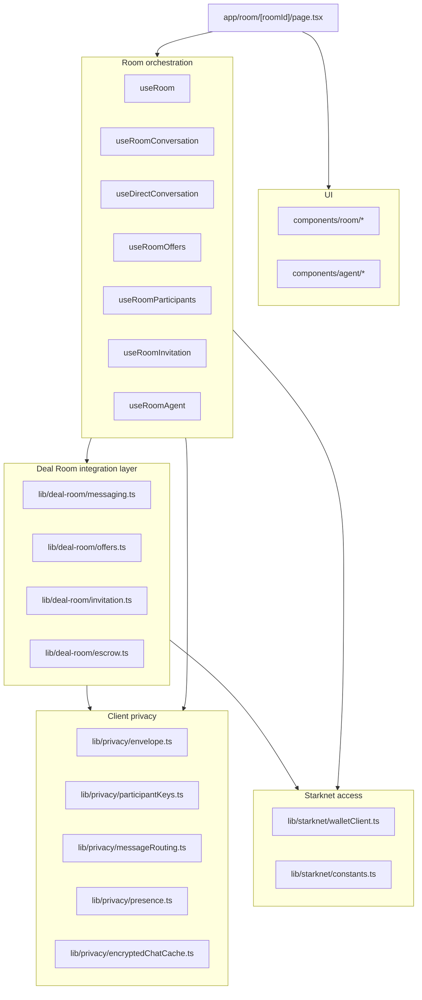

# Frontend Architecture

## Role

The VINSS frontend owns privacy-sensitive client responsibilities:

- wallet connection and STRK20 capability detection;
- local key generation and derivation;
- message and Offer encryption before wallet submission;
- private routing-tag derivation;
- ciphertext discovery requests;
- client-side matching and decryption;
- encrypted local chat caching;
- Deal Room state and UX;
- privacy-safe Agent request construction.

## Layers



## Main page

The primary Deal Room route is:

```text
app/room/[roomId]/page.tsx
```

It composes domain hooks instead of implementing all protocol operations directly.

## Backend relationship

The frontend sends public discovery parameters such as:

```json
{ "kind": "message" }
```

or:

```json
{ "kind": "offer" }
```

The backend returns candidate ciphertext records. Matching and decryption happen in the browser.
