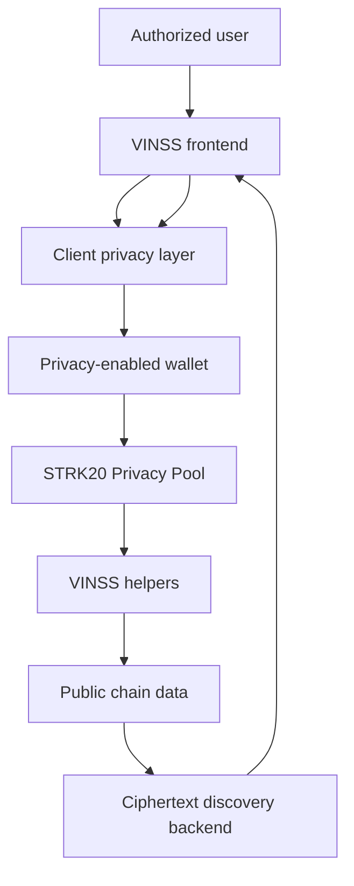

# Frontend Architecture

## Objective

The frontend turns private Deal Room actions into encrypted, wallet-authorized, discoverable application state without moving the plaintext trust boundary to the VINSS backend.

## Layer responsibilities

```text
Room orchestration
    ↓
Deal Room integration layer
    ↓
Client privacy primitives
    ↓
Wallet / Starknet access
```

### Room orchestration

Coordinates:

- room state;
- participant discovery;
- direct conversation;
- Offer lifecycle;
- invitation flow;
- Agent interaction.

### Deal Room integration layer

Primary modules:

```text
lib/deal-room/messaging.ts
lib/deal-room/offers.ts
lib/deal-room/invitation.ts
lib/deal-room/escrow.ts
```

This layer converts application actions into encrypted envelopes and wallet submissions.

### Client privacy layer

Primary modules:

```text
lib/privacy/envelope.ts
lib/privacy/participantKeys.ts
lib/privacy/messageRouting.ts
lib/privacy/presence.ts
lib/privacy/encryptedChatCache.ts
lib/privacy/channelKey.ts
```

This layer owns local cryptography, key derivation, routing, local encryption, and encrypted presence/cache behavior.

### Starknet access layer

Primary modules:

```text
lib/starknet/walletClient.ts
lib/starknet/constants.ts
```

This layer owns wallet connection, STRK20 capability detection, RPC configuration, and normalized contract addresses.

## System flow



## Boundary with the backend

The frontend sends discovery selectors such as:

```ts
body: JSON.stringify({ kind: "message" })
```

or:

```ts
body: JSON.stringify({ kind: "offer" })
```

The backend returns candidate public metadata and ciphertext.

Matching and decryption remain in the browser.

## Important invariant

The frontend architecture separates:

```text
discovery
from
decryption
```

The backend can help locate encrypted records without receiving the key required to read them.
