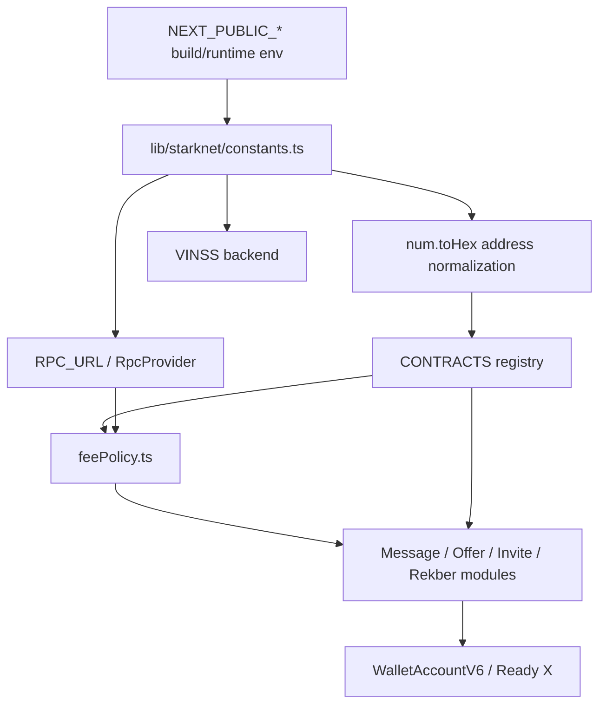
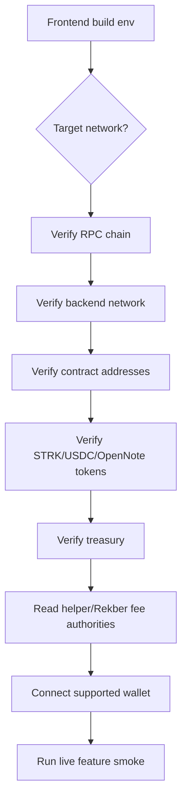
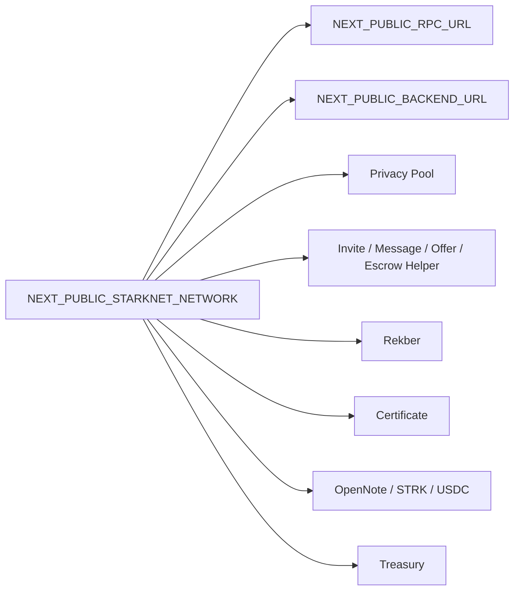
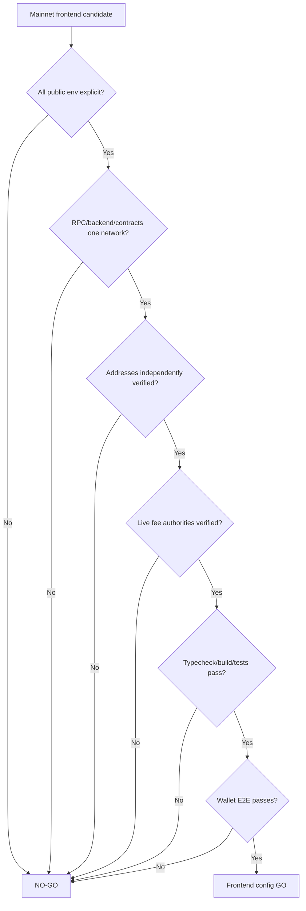
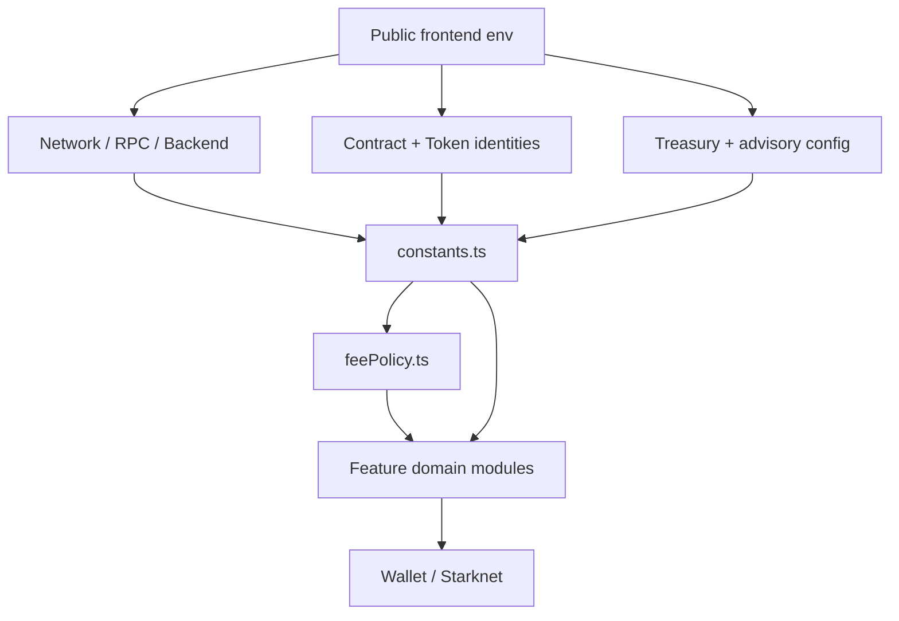

# VINSS Frontend Configuration

This document describes the current frontend configuration model from the code active on `main`.

The frontend configuration layer is public client configuration.

Any value exposed through:

```text
NEXT_PUBLIC_*
```

is embedded into or otherwise available to browser-side application code and must be treated as public.

The frontend configuration model currently covers:

- Starknet network selection;
- browser RPC access;
- VINSS backend URL;
- deployed VINSS/STRK20 contract addresses;
- fee/OpenNote token addresses;
- STRK and USDC settlement-token addresses;
- VINSS treasury address;
- advisory frontend fee-bps input;
- social-link template values.

It does not hold:

```text
wallet private keys
roomSecret
groupSecret
P-256 private messaging key
pairwise encryption keys
Rekber capability secrets
provider API keys
database credentials
backend resolver private key
```

---

# Configuration Objectives

The frontend configuration layer should:

```text
make network/deployment identity explicit
normalize Starknet addresses for wallet compatibility
keep secrets out of client-visible env
read economic authority from contracts where appropriate
fail clearly when a feature-specific address is absent
avoid silently mixing Sepolia and mainnet deployments
```

---

# Current Source Map

Primary configuration sources:

```text
frontend/lib/starknet/constants.ts
frontend/lib/starknet/feePolicy.ts
frontend/lib/starknet/walletClient.ts
frontend/env.mainnet.example
frontend/lib/agent.ts
frontend/lib/deal-room/invitation.ts
frontend/lib/deal-room/messaging.ts
frontend/lib/deal-room/offers.ts
frontend/lib/deal-room/escrow.ts
frontend/lib/deal-room/settlement.ts
```

---

# Configuration Architecture



---


# Core Public Environment

The three highest-level environment values are:

```text
NEXT_PUBLIC_STARKNET_NETWORK
NEXT_PUBLIC_RPC_URL
NEXT_PUBLIC_BACKEND_URL
```

---


## NEXT_PUBLIC_STARKNET_NETWORK

Current source reads:

```text
NEXT_PUBLIC_STARKNET_NETWORK
```

and defaults to:

```text
sepolia
```

when the variable is missing.

The TypeScript value is asserted as:

```text
"sepolia" | "mainnet"
```

but this assertion is not a runtime parser that rejects arbitrary strings.

Therefore:

```text
frontend network config is not globally fail-closed
```

in the same way as the current backend configuration.

---


## NEXT_PUBLIC_RPC_URL

Current source reads:

```text
NEXT_PUBLIC_RPC_URL
```

and otherwise falls back to a public Sepolia Nethermind RPC endpoint.

That fallback is useful for local development but dangerous as a production assumption.

For mainnet:

```text
NEXT_PUBLIC_RPC_URL must be set explicitly
```

and independently verified.

---


## NEXT_PUBLIC_BACKEND_URL

Current source reads:

```text
NEXT_PUBLIC_BACKEND_URL
```

and defaults to:

```text
http://localhost:4000
```

when missing.

This means a deployed frontend with a missing backend env can compile while pointing browser requests at an unusable localhost endpoint.

---


# Contract / Application Addresses

Current `CONTRACTS` registry includes:

```text
NEXT_PUBLIC_PRIVACY_POOL_ADDRESS
NEXT_PUBLIC_MESSAGE_HELPER_ADDRESS
NEXT_PUBLIC_MESSAGE_HELPER_OPEN_NOTE_TOKEN
NEXT_PUBLIC_INVITE_ADDRESS
NEXT_PUBLIC_OFFER_HELPER_ADDRESS
NEXT_PUBLIC_OFFER_HELPER_OPEN_NOTE_TOKEN
NEXT_PUBLIC_PRIVATE_ESCROW_HELPER_ADDRESS
NEXT_PUBLIC_ESCROW_REKBER_ADDRESS
NEXT_PUBLIC_SETTLEMENT_CERTIFICATE_ADDRESS
```

Settlement-token configuration additionally includes:

```text
NEXT_PUBLIC_STRK_ADDRESS
NEXT_PUBLIC_USDC_ADDRESS
```

Revenue/application configuration additionally includes:

```text
NEXT_PUBLIC_VINSS_TREASURY_ADDRESS
NEXT_PUBLIC_VINSS_FEE_BPS
```

---


# Current Mainnet Template

`frontend/env.mainnet.example` currently contains:

```text
NEXT_PUBLIC_STARKNET_NETWORK
NEXT_PUBLIC_RPC_URL
NEXT_PUBLIC_BACKEND_URL

NEXT_PUBLIC_PRIVACY_POOL_ADDRESS
NEXT_PUBLIC_MESSAGE_HELPER_ADDRESS
NEXT_PUBLIC_MESSAGE_HELPER_OPEN_NOTE_TOKEN
NEXT_PUBLIC_INVITE_ADDRESS
NEXT_PUBLIC_OFFER_HELPER_ADDRESS
NEXT_PUBLIC_OFFER_HELPER_OPEN_NOTE_TOKEN
NEXT_PUBLIC_PRIVATE_ESCROW_HELPER_ADDRESS
NEXT_PUBLIC_ESCROW_REKBER_ADDRESS
NEXT_PUBLIC_SETTLEMENT_CERTIFICATE_ADDRESS
NEXT_PUBLIC_STRK_ADDRESS
NEXT_PUBLIC_USDC_ADDRESS
NEXT_PUBLIC_VINSS_TREASURY_ADDRESS
NEXT_PUBLIC_VINSS_FEE_BPS

NEXT_PUBLIC_VINSS_TELEGRAM_URL
NEXT_PUBLIC_VINSS_X_URL
NEXT_PUBLIC_VINSS_GITHUB_URL
```

The template explicitly says to copy it only after every mainnet address is verified.

---


# Public Environment Boundary

Every `NEXT_PUBLIC_*` variable is client-visible.

Never put these in frontend public env:

```text
wallet private key
wallet seed phrase
roomSecret
groupSecret
P-256 private key material
pairwise ECDH key
room channelKey
attachment encryption key
Invite private onchain secret
Rekber release authorization secret
Rekber refund secret
Rekber dispute secret
Rekber claim secret
certificate claim secret
LLM provider secret
Resend secret
DATABASE_URL
backend resolver private key
```

---


# Address Normalization

`lib/starknet/constants.ts` normalizes configured Starknet addresses using:

```text
num.toHex(address)
```

when the string is non-empty.

---


## Why Normalization Exists

Wallet API felt validation rejects zero-padded address forms that are common in explorers/deployment output.

Example:

```text
0x0173f5...
```

may need normalization to:

```text
0x173f5...
```

before it is used as a strict felt-typed wallet API field.

---


## Normalization Rule

Address normalization happens centrally in `constants.ts` for the core configured contract/token addresses.

This reduces duplication across:

```text
Message
Offer
Invite
Private Escrow
Rekber
Certificate
FeePolicy
```

call sites.

---


# Missing Address Behavior

Current `normalizeAddress()` returns an empty string unchanged.

Therefore:

```text
missing env
    -> empty configured address
```

for many frontend contract/token fields.

The frontend does not globally abort startup.

Instead, domain modules usually fail when a required feature is invoked.

Examples:

```text
MessageHelper missing
    -> Message send throws

OfferHelper missing
    -> Offer send throws

Invite missing
    -> Invite create/consume throws

Rekber missing
    -> settlement functions throw
```

---


# Feature-Local Failures

This configuration style means:

```text
frontend may render
while
a specific action is not configured
```

which is useful for partial development but requires stronger release verification.

---


# Fee Configuration — Current Authority

The old documentation claim:

```text
Message = 7 STRK
Offer = 10 STRK
```

is stale as a runtime authority statement.

Current Message and Offer modules fetch FeePolicy quotes immediately before wallet submission.

---


## Fee Action IDs

`feePolicy.ts` currently defines:

```text
roomActivation = 1
message        = 2
offer          = 3
rekber         = 4
```

as frontend action identifiers aligned with the FeePolicy interface.

---


# Invite / Room Activation Fee

`quoteRoomActivationFee()`:

```text
Invite helper
    ↓
get_fee_policy()
    ↓
FeePolicy address
    ↓
quote_fee(1)
    ↓
positive bigint quote
```

Current Invite CREATE uses that quote.

Invite CONSUME does not use another room-activation revenue quote.

---


# Message Fee

`quoteMessageFee()`:

```text
MessageHelper
    ↓
get_fee_policy()
    ↓
FeePolicy
    ↓
quote_fee(2)
```

The resulting value is required to be greater than zero.

Message send fetches this immediately before Ready X builds the private transaction.

Therefore:

```text
do not document a fixed per-message STRK amount
```

unless referring to a specific deployed FeePolicy snapshot at a specific time.

---


# Offer Fee

`quoteOfferFee()`:

```text
OfferHelper
    ↓
get_fee_policy()
    ↓
FeePolicy
    ↓
quote_fee(3)
```

and requires a positive quote.

Therefore:

```text
do not document a fixed per-Offer STRK amount
```

as a source invariant.

---


# FeePolicy Address Cache

`feePolicy.ts` caches the helper -> FeePolicy address mapping in a process-local browser module `Map`.

That avoids re-reading helper policy address on every quote call in the same loaded application runtime.

The fee amount itself is still queried from FeePolicy when `quoteFlatFee()` runs.

---


# Rekber Revenue FeePolicy Getter

Rekber is different from Message/Offer helpers.

`feePolicy.ts` explicitly warns:

```text
do not call Rekber.get_fee_policy() expecting the revenue FeePolicy address
```

because Rekber's `get_fee_policy` has different semantics.

Current frontend resolves Rekber revenue FeePolicy through:

```text
get_revenue_fee_policy
```

and caches that address.

---


# Rekber Workflow Fee

`quoteRekberWorkflowFee()` currently:

1. resolves/validates the Rekber revenue FeePolicy address;
2. does not call `quote_fee(4)` for the workflow amount;
3. returns:

```text
3 STRK
```

as:

```text
3n * 10n ** 18n
```

---


## Why It Does Not Use FEE_ACTION_REKBER

Current source says the canonical FeePolicy REKBER action quote includes the larger sponsor reserve used by the funding economics.

Using it for ordinary Agreement/Submit Work workflow revenue would overcharge the intended frontend workflow action.

---


## Current Workflow-Fee Caveat

The 3 STRK amount is currently a frontend application-policy constant.

It is not equivalent to:

```text
FeePolicy.quote_fee(4)
```

and it is not the funding fee.

If product economics change, this is a configuration/code review point.

---


# Rekber Funding Fee

`quoteRekberFee(token, principal)` reads directly from:

```text
VinssEscrowRekber.quote_rekber_fee(token, principal)
```

and requires:

```text
principal > 0
positive returned quote
```

---


## Why Rekber Funding Is Different

Rekber funding is token/principal aware.

The contract combines its current:

```text
percentage-based service fee
+
FeePolicy-backed floor/reserve logic
```

so the frontend must not reproduce the canonical funding amount from a local formula.

---


# Fee Authority Matrix

| Action | Runtime amount authority | Frontend fixed? |
|---|---|---:|
| Invite CREATE / room activation | helper FeePolicy `quote_fee(1)` | No |
| Message | MessageHelper FeePolicy `quote_fee(2)` | No |
| Offer | OfferHelper FeePolicy `quote_fee(3)` | No |
| Rekber workflow charge | current frontend 3 STRK after revenue-policy validation | **Yes** |
| Rekber funding | Rekber `quote_rekber_fee(token, principal)` | No |
| Invite CONSUME / selected replay-only actions | negligible replay-protection spend in domain source | source-defined |

---


# Stale 7 STRK Comment

`constants.ts` currently still contains a comment describing:

```text
current 7 STRK per-message VINSS application revenue
```

next to `messageHelperOpenNoteToken`.

That comment does not match the current runtime fee authority because Message send calls `quoteMessageFee()`.

Treat the comment as stale source commentary/debt.

Do not use it as configuration truth.

---


# OpenNote Token Configuration

`NEXT_PUBLIC_MESSAGE_HELPER_OPEN_NOTE_TOKEN` is used by current Message and Invite fee/replay flows.

`NEXT_PUBLIC_OFFER_HELPER_OPEN_NOTE_TOKEN` is used by Offer.

Current fallback:

```text
NEXT_PUBLIC_OFFER_HELPER_OPEN_NOTE_TOKEN
    ?? NEXT_PUBLIC_MESSAGE_HELPER_OPEN_NOTE_TOKEN
```

means Offer can intentionally reuse the Message helper's configured OpenNote token when its own variable is absent.

---


## Deployment Requirement

The configured OpenNote token must match the token semantics expected by the deployed helper/revenue flow.

A syntactically valid but wrong token address can create economic or transaction failures.

---


# Treasury Configuration

Revenue-producing frontend flows read:

```text
NEXT_PUBLIC_VINSS_TREASURY_ADDRESS
```

directly from the browser environment.

Examples include:

```text
Message
Offer
Invite CREATE
Rekber funding/revenue flows
```

depending on domain implementation.

---


## Treasury Is Public

A treasury address is not a secret.

But it is high-impact deployment configuration.

Wrong treasury configuration can route revenue incorrectly.

Therefore it should be verified like a contract address.

---


# Privacy Pool Configuration

`NEXT_PUBLIC_PRIVACY_POOL_ADDRESS` is exposed through the `CONTRACTS` registry.

The browser must point to the intended STRK20 Privacy Pool deployment for the selected network.

Mainnet frontend configuration should not reuse a Sepolia Privacy Pool address.

---


# Message Helper Configuration

Required current Message values:

```text
NEXT_PUBLIC_MESSAGE_HELPER_ADDRESS
NEXT_PUBLIC_MESSAGE_HELPER_OPEN_NOTE_TOKEN
NEXT_PUBLIC_VINSS_TREASURY_ADDRESS
NEXT_PUBLIC_RPC_URL
```

plus wallet/network support.

---


# Offer Helper Configuration

Required current Offer values:

```text
NEXT_PUBLIC_OFFER_HELPER_ADDRESS
NEXT_PUBLIC_OFFER_HELPER_OPEN_NOTE_TOKEN
NEXT_PUBLIC_VINSS_TREASURY_ADDRESS
NEXT_PUBLIC_RPC_URL
```

with Offer OpenNote token fallback to Message token as described earlier.

---


# Invite Configuration

Invite CREATE/CONSUME uses:

```text
NEXT_PUBLIC_INVITE_ADDRESS
NEXT_PUBLIC_MESSAGE_HELPER_OPEN_NOTE_TOKEN
NEXT_PUBLIC_VINSS_TREASURY_ADDRESS
NEXT_PUBLIC_RPC_URL
```

Current room-activation quote is read through Invite's FeePolicy.

---


# Private Escrow Configuration

Encrypted Private Escrow coordination uses:

```text
NEXT_PUBLIC_PRIVATE_ESCROW_HELPER_ADDRESS
```

plus the shared STRK20/wallet/revenue configuration required by its current domain action bundle.

Private Escrow Helper is coordination only.

It is not the Rekber custody address.

---


# Rekber Configuration

Current Rekber contract address:

```text
NEXT_PUBLIC_ESCROW_REKBER_ADDRESS
```

Current settlement tokens:

```text
NEXT_PUBLIC_STRK_ADDRESS
NEXT_PUBLIC_USDC_ADDRESS
```

Current revenue/fee-related dependencies include:

```text
NEXT_PUBLIC_MESSAGE_HELPER_OPEN_NOTE_TOKEN
NEXT_PUBLIC_VINSS_TREASURY_ADDRESS
RPC access
```

according to the specific Rekber action.

---


# Settlement Certificate Configuration

Current public Certificate address:

```text
NEXT_PUBLIC_SETTLEMENT_CERTIFICATE_ADDRESS
```

The frontend uses it for:

```text
claim
is_claimed
get_certificate
```

through direct public Starknet access.

---


# STRK Settlement Token

`NEXT_PUBLIC_STRK_ADDRESS` is env-driven even though source comments note STRK is a system predeploy.

The project deliberately keeps it deployment-configurable so network setup remains explicit.

---


# USDC Settlement Token

`NEXT_PUBLIC_USDC_ADDRESS` is required for current accepted-Offer settlement mapping when the asset is USDC.

Do not assume Sepolia and mainnet USDC addresses are interchangeable.

---


# Agent Advisory Fee BPS

`NEXT_PUBLIC_VINSS_FEE_BPS` is used by the frontend Agent advisory helper:

```text
quoteVinssFee(amount, feeBps)
```

with a default:

```text
200 bps
```

in `lib/agent.ts`.

This helper uses JavaScript `Number` arithmetic.

---


## Not Canonical Economic Authority

`NEXT_PUBLIC_VINSS_FEE_BPS` must not be treated as:

```text
Message FeePolicy
Offer FeePolicy
Rekber quote_rekber_fee
```

or any other canonical on-chain fee authority.

It is advisory/UI Agent math.

---


# Social-Link Configuration

The current mainnet env template includes:

```text
NEXT_PUBLIC_VINSS_TELEGRAM_URL
NEXT_PUBLIC_VINSS_X_URL
NEXT_PUBLIC_VINSS_GITHUB_URL
```

These are public presentation values.

During this configuration audit, their presence in the template is established.

Do not infer feature-critical runtime behavior from the template alone unless the corresponding UI source is also checked.

---


# Network Consistency Invariant

These values must all refer to the same intended deployment environment:

```text
NEXT_PUBLIC_STARKNET_NETWORK
NEXT_PUBLIC_RPC_URL
NEXT_PUBLIC_BACKEND_URL
Privacy Pool
Invite
Message Helper
Offer Helper
Private Escrow Helper
Rekber
Settlement Certificate
STRK
USDC
treasury
OpenNote fee token(s)
```

---


## Mixed-Network Failure

A mixed configuration can create failures that look unrelated.

Examples:

```text
mainnet wallet + Sepolia helper
    -> wrong contract/no class

mainnet helper + Sepolia RPC
    -> contract read failure

mainnet Rekber + Sepolia USDC
    -> token mismatch

mainnet frontend + Sepolia backend index
    -> private actions appear missing

wrong FeePolicy relationship
    -> quote/revenue mismatch
```

---


# Frontend vs Backend Network Validation

The frontend is currently less strict at startup than the backend.

Frontend:

```text
network defaults to sepolia
RPC defaults to Sepolia
backend URL defaults localhost
missing addresses may become empty strings
```

Backend:

```text
requires explicit supported network
requires RPC
requires DATABASE_URL
requires canonical contract addresses/start blocks
```

Therefore production release checks must compensate for the frontend's development-friendly fallbacks.

---


# Mainnet Template Baseline

Current mainnet template begins with:

```text
NEXT_PUBLIC_STARKNET_NETWORK=mainnet
NEXT_PUBLIC_RPC_URL=https://<verified-mainnet-rpc>
NEXT_PUBLIC_BACKEND_URL=https://<vinss-backend>
```

and placeholders for every critical deployed address.

This is the correct deployment style:

```text
explicit verified value
not
source fallback
```

---


# Configuration Loading Time

Because these are Next.js public environment variables, deployment systems such as Vercel generally need the intended values present for the relevant build/deployment environment.

Do not assume changing a dashboard env always changes an already-built client bundle without a new deployment.

---


# Vercel Environment Separation

Use deployment-environment scoping deliberately:

```text
Development
Preview
Production
```

Production mainnet should not inherit or reuse testnet values by accident.

---


# Local Development

Current development fallbacks are intended for convenience:

```text
network -> sepolia
RPC -> public Sepolia Nethermind endpoint
backend -> http://localhost:4000
```

but most contract/token addresses still require env configuration for actual feature calls.

---


# Configuration Failure Classes

| Failure | Typical source | Result |
|---|---|---|
| Empty helper address | missing env | feature throws when invoked |
| Zero FeePolicy address | wrong helper/deployment | quote helper throws |
| Zero fee quote | wrong policy/config | quote helper throws |
| Wrong RPC network | mixed environment | reads/writes fail or hit wrong chain |
| Wrong backend URL | missing/mixed env | Discovery/Presence/Agent unavailable |
| Wrong OpenNote token | helper mismatch | STRK20 transaction failure/economic mismatch |
| Wrong treasury | deployment error | revenue routed incorrectly |
| Wrong STRK/USDC | settlement config error | Rekber asset mapping incorrect |
| Zero/invalid Rekber quote | contract/config | funding blocked |

---


# Configuration Validation Flow



---


# Mainnet Configuration Verification

For mainnet, verify every value independently.

Minimum:

```text
[ ] NEXT_PUBLIC_STARKNET_NETWORK=mainnet
[ ] RPC resolves the intended Starknet mainnet
[ ] backend is configured for mainnet
[ ] Privacy Pool address verified
[ ] Message Helper address verified
[ ] Message OpenNote token verified
[ ] Invite address verified
[ ] Offer Helper address verified
[ ] Offer OpenNote token verified
[ ] Private Escrow Helper verified
[ ] Rekber address verified
[ ] Settlement Certificate verified
[ ] STRK address verified
[ ] USDC address verified
[ ] treasury verified
[ ] current helper -> FeePolicy references verified
[ ] current Rekber revenue FeePolicy reference verified
```

---


# Fee Verification

After deployment, verify actual runtime quotes instead of copying historical docs.

Conceptually:

```text
Invite helper.get_fee_policy
    -> FeePolicy.quote_fee(1)

MessageHelper.get_fee_policy
    -> FeePolicy.quote_fee(2)

OfferHelper.get_fee_policy
    -> FeePolicy.quote_fee(3)

Rekber.get_revenue_fee_policy
    -> expected revenue policy

Rekber.quote_rekber_fee(token, principal)
    -> exact funding quote
```

---


# Why Fee Values Should Not Be Hardcoded in Docs

FeePolicy can be redeployed/configured independently from prose documentation.

Therefore architecture/config docs should record:

```text
where the amount comes from
```

rather than asserting:

```text
Message always costs X STRK
```

unless the document is explicitly a dated deployment snapshot.

---


# Revenue Configuration Boundary

Frontend configuration determines where the wallet action points.

Contract configuration determines whether the quote/revenue logic is accepted.

Both must agree.

---


# Wallet Capability Configuration

Current minimum Wallet API version treated as STRK20-capable is:

```text
0.10.3
```

defined in `constants.ts`.

This is source configuration, not an environment variable.

---


# Static Source Configuration vs Environment Configuration

Not every configuration value lives in env.

Current source-defined examples include:

```text
MIN_WALLET_API_VERSION = 0.10.3
VINSS_FEE_ACTION ids
3 STRK current Rekber workflow fee
direct Invite TTL = 1h
Group Invite TTL options = 24h / 7d
```

These require code change rather than dashboard env update.

---


# Configuration Categories

| Category | Examples | Change mechanism |
|---|---|---|
| Deployment network | network/RPC/backend | env + redeploy |
| Contract identity | helper/Rekber/Certificate addresses | env + redeploy |
| Token identity | OpenNote/STRK/USDC | env + redeploy |
| Revenue destination | treasury | env + redeploy |
| Agent advisory BPS | `NEXT_PUBLIC_VINSS_FEE_BPS` | env + redeploy |
| Wallet compatibility | minimum API version | source code |
| Fee action ids | room/message/offer/rekber ids | source code + protocol alignment |
| Rekber workflow 3 STRK | source constant | source code |

---


# Security Boundary

The frontend env should contain only information that may safely be viewed by:

```text
user
browser developer tools
page JavaScript
network observers
public build output
```

---


## High-Impact Public Configuration

Some public values are not secrets but still need operational protection from accidental modification:

```text
treasury
contract addresses
RPC
backend URL
token addresses
```

A malicious/wrong build using altered values can redirect users to unintended contracts or infrastructure.

---


# Do Not Put Backend Secrets in Frontend

Examples of backend-only secrets/config that must never become `NEXT_PUBLIC_*`:

```text
GROQ_API_KEY
OPENAI-compatible provider secret
ANTHROPIC_API_KEY
QWEN provider secret
RESEND_API_KEY
DATABASE_URL
resolver private key
server-only webhook secrets
```

---


# Do Not Put Rekber Capability Secrets in Env

Rekber capability preimages are generated per custody/deal.

They are application secrets, not deployment config.

Never convert them into environment variables such as:

```text
NEXT_PUBLIC_RELEASE_SECRET
NEXT_PUBLIC_REFUND_SECRET
```

---


# Do Not Put Room Secrets in Env

`roomSecret` and `groupSecret` are per-user/per-room access material.

They must not become global deploy-time env values.

---


# Environment Consistency Diagram



Every branch must resolve to the same intended network deployment.

---


# Configuration Preflight by Feature

| Feature | Main config dependency | Effect |
|---|---|---|
| Wallet connect | RPC_URL + Wallet Standard availability | wallet session |
| Participant discovery | BACKEND_URL + room key | Presence/Message candidate discovery |
| Invite CREATE | Invite + Message OpenNote token + treasury + RPC/FeePolicy | room activation |
| Invite CONSUME | Invite + Message OpenNote token | one-time consume |
| Direct Message | MessageHelper + Message OpenNote token + treasury + RPC/FeePolicy | private message |
| Offer | OfferHelper + Offer OpenNote token + treasury + RPC/FeePolicy | structured Offer |
| Private Escrow | PrivateEscrowHelper + workflow fee/replay config | private coordination |
| Rekber funding | Rekber + token + treasury + RPC | custody funding |
| Rekber protection | Rekber + revenue token/treasury where action charges | settlement transition |
| Certificate | Settlement Certificate + RPC | public claim/read |
| Agent | BACKEND_URL + backend Agent feature/provider | advisory Agent |
| Dispute | BACKEND_URL + backend Agent/Dispute feature | arbitration |


# Mainnet Example

Use placeholder structure only:

```bash
NEXT_PUBLIC_STARKNET_NETWORK=mainnet
NEXT_PUBLIC_RPC_URL=https://<verified-mainnet-rpc>
NEXT_PUBLIC_BACKEND_URL=https://<vinss-mainnet-backend>

NEXT_PUBLIC_PRIVACY_POOL_ADDRESS=0x<verified-pool>
NEXT_PUBLIC_MESSAGE_HELPER_ADDRESS=0x<verified-message-helper>
NEXT_PUBLIC_MESSAGE_HELPER_OPEN_NOTE_TOKEN=0x<verified-fee-token>
NEXT_PUBLIC_INVITE_ADDRESS=0x<verified-invite>
NEXT_PUBLIC_OFFER_HELPER_ADDRESS=0x<verified-offer-helper>
NEXT_PUBLIC_OFFER_HELPER_OPEN_NOTE_TOKEN=0x<verified-fee-token>
NEXT_PUBLIC_PRIVATE_ESCROW_HELPER_ADDRESS=0x<verified-private-escrow-helper>
NEXT_PUBLIC_ESCROW_REKBER_ADDRESS=0x<verified-rekber>
NEXT_PUBLIC_SETTLEMENT_CERTIFICATE_ADDRESS=0x<verified-certificate>
NEXT_PUBLIC_STRK_ADDRESS=0x<verified-strk>
NEXT_PUBLIC_USDC_ADDRESS=0x<verified-usdc>
NEXT_PUBLIC_VINSS_TREASURY_ADDRESS=0x<verified-treasury>
NEXT_PUBLIC_VINSS_FEE_BPS=200
```

Never put actual secrets into a committed example file.

---


# Sepolia Development Example

A development file may intentionally use:

```text
NEXT_PUBLIC_STARKNET_NETWORK=sepolia
NEXT_PUBLIC_RPC_URL=<Sepolia RPC>
NEXT_PUBLIC_BACKEND_URL=<local or Sepolia backend>
Sepolia helper/token addresses
```

but it should still be internally consistent.

---


# Configuration Drift

Common drift patterns:

```text
contract redeployed but frontend env unchanged
backend redeployed against new contract but frontend points to old address
Vercel Production updated but Preview still old
FeePolicy changed but docs still quote old STRK amount
USDC/STRK token address copied from wrong network
treasury changed in one environment only
Certificate address changed but Certificate route still old
```

---


# Detecting Drift

Useful checks include:

```text
compare Vercel env against deployment manifest
read helper get_fee_policy
read Rekber get_revenue_fee_policy
read quote_rekber_fee
smoke each feature through the intended wallet
inspect transaction target addresses
compare backend health/index identities with frontend contract config
```

---


# Configuration and Backend Discovery

Frontend backend URL must correspond to an indexer configured for the same:

```text
network
Message Helper
Offer Helper
Private Escrow Helper
Rekber
Certificate
```

deployment family.

A frontend pointing to the wrong backend can still send transactions successfully but fail to rediscover them.

---


# Configuration and Recovery

Recovery depends on configuration continuity.

Example:

```text
Message submitted to helper A
then frontend redeployed with helper B/backend index B
    -> prepared locator from helper A may never appear in new Discovery context
```

Deployment changes during active user flows therefore need care.

---


# Configuration and Local Storage

Changing network/backend/contracts does not automatically clear local room/group/history state.

That can leave device-local state from an older deployment while the browser now points elsewhere.

Release/migration UX should account for this when deployment identity changes materially.

---


# Configuration and Invite Links

Invite capabilities encode room/Group material and are tied operationally to the Invite contract/network environment used at creation.

An invite URL opened against a frontend deployment pointing to a different chain can fail consumption even though token decryption succeeds.

---


# Configuration and Wallet

The wallet network/account and the frontend RPC/contract environment must refer to compatible Starknet state.

Wallet capability detection alone does not prove the configured helper addresses are correct.

---


# Configuration and FeePolicy

FeePolicy relationships are deployment state.

The frontend only caches addresses it reads during the active module lifetime.

Redeploying/repointing helpers during a loaded session may require a full page reload to avoid stale in-memory cached FeePolicy address references.

---


# Configuration and Mainnet Economics

Mainnet fee review should record both:

```text
configured routing addresses
and
live quote values
```

because correct addresses with economically wrong FeePolicy values are still a launch issue.

---


# Configuration and Agent

Normal Agent uses:

```text
NEXT_PUBLIC_BACKEND_URL
```

from the browser.

Provider keys are not frontend configuration.

The backend determines:

```text
Agent enabled/disabled
configured providers
default provider
rate limits
model selection
```

---


# Configuration and Dispute

Frontend Dispute also uses the backend URL.

Resolver address/private key and AutoResolve feature state are backend configuration.

They must never be copied into the frontend environment.

---


# Configuration and Certificate

Certificate route/UI should use the configured:

```text
NEXT_PUBLIC_SETTLEMENT_CERTIFICATE_ADDRESS
```

for the same network as Rekber.

A Certificate contract from another network/deployment cannot prove this Rekber lifecycle.

---


# Configuration and Royalty

Royalty UI depends on backend read models rather than a frontend token-address configuration.

Do not confuse:

```text
Royalty points/read model
with
settlement token config
```

---


# Configuration Invariants

| ID | Invariant |
|---|---|
| `C1` | No secret may be stored in `NEXT_PUBLIC_*`. |
| `C2` | Mainnet build must not rely on frontend Sepolia fallbacks. |
| `C3` | All contract/token/backend/RPC values must refer to one intended network. |
| `C4` | Starknet addresses should pass central normalization before wallet usage. |
| `C5` | Missing address may yield empty string; feature code must reject it before transaction. |
| `C6` | Message fee comes from current MessageHelper FeePolicy quote. |
| `C7` | Offer fee comes from current OfferHelper FeePolicy quote. |
| `C8` | Invite CREATE fee comes from current Invite FeePolicy quote. |
| `C9` | Rekber funding fee comes from `quote_rekber_fee(token, principal)`. |
| `C10` | Current Rekber workflow 3 STRK charge is separate frontend application policy. |
| `C11` | `NEXT_PUBLIC_VINSS_FEE_BPS` is advisory Agent/UI math, not canonical fees. |
| `C12` | Treasury is public but high-impact and must be verified. |
| `C13` | OpenNote token must match deployed helper/revenue semantics. |
| `C14` | Backend and frontend contract environments must match for recovery/discovery. |


# Configuration Anti-Patterns

- Hardcoding current mainnet/Sepolia contract addresses in source.
- Putting LLM/API keys in `NEXT_PUBLIC_*`.
- Using a documented fixed Message/Offer fee instead of reading FeePolicy.
- Using `NEXT_PUBLIC_VINSS_FEE_BPS` as Rekber/Message/Offer contract fee.
- Using Rekber `get_fee_policy()` as though it returns revenue FeePolicy.
- Using `FeePolicy.quote_fee(4)` as the Rekber funding quote.
- Assuming a successful build proves all contract addresses are present.
- Assuming `NETWORK` TypeScript assertion validates arbitrary env strings at runtime.
- Assuming a Vercel env change updates an already-built bundle without redeploy.
- Mixing mainnet RPC with Sepolia helpers.
- Mixing mainnet backend index with Sepolia frontend.
- Copying zero-padded addresses straight into wallet actions without normalization.
- Treating public treasury address as unimportant because it is not secret.


# Pre-Deploy Checklist

- [ ] Target network selected explicitly.
- [ ] RPC verified independently.
- [ ] Backend URL verified.
- [ ] Privacy Pool address verified.
- [ ] Invite address verified.
- [ ] Message Helper verified.
- [ ] Message OpenNote token verified.
- [ ] Offer Helper verified.
- [ ] Offer OpenNote token verified.
- [ ] Private Escrow Helper verified.
- [ ] Rekber verified.
- [ ] Settlement Certificate verified.
- [ ] STRK verified.
- [ ] USDC verified.
- [ ] Treasury verified.
- [ ] Helper FeePolicy links verified.
- [ ] Rekber revenue FeePolicy link verified.
- [ ] Fee quotes sampled.
- [ ] No backend secret appears in frontend env.


# Post-Deploy Smoke Checklist

- [ ] Wallet connects.
- [ ] Wallet reports intended STRK20 capability.
- [ ] Invite CREATE receives current fee quote.
- [ ] Invite CONSUME reaches correct contract.
- [ ] Message sends to intended MessageHelper.
- [ ] Message rediscovery reaches intended backend.
- [ ] Offer sends to intended OfferHelper.
- [ ] Private Escrow coordination reaches intended helper.
- [ ] Rekber quote matches intended deployment.
- [ ] Rekber funding targets intended custody contract.
- [ ] Certificate read/claim targets intended Certificate.
- [ ] Agent requests intended backend.
- [ ] Browser network requests contain no secret env values.


# Mainnet Go / No-Go



---


# Environment Audit Template

```text
Frontend deployment:
Git SHA:
Build/deploy ID:

NEXT_PUBLIC_STARKNET_NETWORK:
NEXT_PUBLIC_RPC_URL:
NEXT_PUBLIC_BACKEND_URL:

Privacy Pool:
Message Helper:
Message OpenNote token:
Invite:
Offer Helper:
Offer OpenNote token:
Private Escrow Helper:
Rekber:
Settlement Certificate:
STRK:
USDC:
Treasury:

Invite FeePolicy:
Message FeePolicy:
Offer FeePolicy:
Rekber revenue FeePolicy:

Room activation quote:
Message quote:
Offer quote:
Rekber workflow charge:
Rekber funding quote sample:

Wallet API version:

Verified by:
Date:
Notes:
```


# Source-of-Truth Order

```text
1. deployed Cairo contract state
2. frontend/lib/starknet/constants.ts
3. frontend/lib/starknet/feePolicy.ts
4. feature-specific frontend domain modules
5. frontend/env.mainnet.example
6. deployment environment dashboard
7. live RPC/helper reads
8. live wallet transaction evidence
9. prose documentation
```


# Documentation Maintenance Rules

- Re-read `constants.ts` before editing env inventory.
- Re-read `feePolicy.ts` before documenting any fee amount.
- Do not promote stale source comments over executable runtime code.
- Do not hardcode Message/Offer fees in architecture docs unless documenting a dated deployment snapshot.
- Record the source of a fee, not only its current numeric value.
- Recheck env.mainnet.example whenever a new contract/token dependency is added.
- Keep public config separate from secrets.
- Keep frontend development fallbacks visible in mainnet docs.
- Recheck normalization if Starknet wallet API validation changes.
- Recheck backend/frontend network consistency whenever contracts are redeployed.
- Do not claim social env variables are feature-critical merely because they appear in a template.


# Appendix A — Environment Variable Inventory

| Variable | Category | Purpose | Secret? | Current note |
|---|---|---|---:|---|
| NEXT_PUBLIC_STARKNET_NETWORK | Core | Network label | No | Defaults `sepolia` |
| NEXT_PUBLIC_RPC_URL | Core | Browser Starknet RPC | No | Defaults public Sepolia RPC |
| NEXT_PUBLIC_BACKEND_URL | Core | VINSS backend base URL | No | Defaults localhost:4000 |
| NEXT_PUBLIC_PRIVACY_POOL_ADDRESS | Contract | STRK20 Privacy Pool | No | Empty if absent |
| NEXT_PUBLIC_MESSAGE_HELPER_ADDRESS | Contract | Message helper | No | Empty if absent |
| NEXT_PUBLIC_MESSAGE_HELPER_OPEN_NOTE_TOKEN | Token | Message/Invite fee OpenNote token | No | Empty if absent |
| NEXT_PUBLIC_INVITE_ADDRESS | Contract | Invite contract | No | Empty if absent |
| NEXT_PUBLIC_OFFER_HELPER_ADDRESS | Contract | Offer helper | No | Empty if absent |
| NEXT_PUBLIC_OFFER_HELPER_OPEN_NOTE_TOKEN | Token | Offer fee OpenNote token | No | Falls back to Message token |
| NEXT_PUBLIC_PRIVATE_ESCROW_HELPER_ADDRESS | Contract | Encrypted Escrow coordination helper | No | Empty if absent |
| NEXT_PUBLIC_ESCROW_REKBER_ADDRESS | Contract | Canonical Rekber custody | No | Empty if absent |
| NEXT_PUBLIC_SETTLEMENT_CERTIFICATE_ADDRESS | Contract | Public Certificate | No | Empty if absent |
| NEXT_PUBLIC_STRK_ADDRESS | Token | STRK settlement token | No | Empty if absent |
| NEXT_PUBLIC_USDC_ADDRESS | Token | USDC settlement token | No | Empty if absent |
| NEXT_PUBLIC_VINSS_TREASURY_ADDRESS | Revenue | Treasury recipient | No | Feature code requires where used |
| NEXT_PUBLIC_VINSS_FEE_BPS | Advisory | Agent/UI fee helper | No | Defaults 200 in agent helper |
| NEXT_PUBLIC_VINSS_TELEGRAM_URL | Presentation | Telegram link template | No | Mainnet template entry |
| NEXT_PUBLIC_VINSS_X_URL | Presentation | X link template | No | Mainnet template entry |
| NEXT_PUBLIC_VINSS_GITHUB_URL | Presentation | GitHub link template | No | Mainnet template entry |


# Appendix B — Fee Read Paths

| Domain | Current path | Validation |
|---|---|---|
| Room activation | Invite.get_fee_policy -> FeePolicy.quote_fee(1) | bigint > 0 |
| Message | MessageHelper.get_fee_policy -> FeePolicy.quote_fee(2) | bigint > 0 |
| Offer | OfferHelper.get_fee_policy -> FeePolicy.quote_fee(3) | bigint > 0 |
| Rekber workflow | Rekber.get_revenue_fee_policy validation -> local 3 STRK | 3 * 10^18 |
| Rekber funding | Rekber.quote_rekber_fee(token, principal) | bigint > 0 |


# Appendix C — Configuration Failure Examples

| Scenario | Config defect | Expected consequence |
|---|---|---|
| Missing Message Helper | `NEXT_PUBLIC_MESSAGE_HELPER_ADDRESS` empty | Message send throws before wallet |
| Missing Message fee token | OpenNote token empty | Message/Invite fee flow blocked |
| Missing Offer Helper | Offer address empty | Offer send throws |
| Wrong FeePolicy | helper points to wrong policy | quote unexpected or contract rejects |
| Zero FeePolicy | helper getter returns 0 | feePolicy helper throws |
| Zero quote | FeePolicy returns 0 | feePolicy helper throws |
| Missing Rekber | escrowRekber empty | settlement helpers throw |
| Wrong Rekber network | address valid on another chain | RPC/execute/read failure |
| Missing USDC | USDC Offer selected | settlement mapping/config fails |
| Wrong backend | backend indexes another deployment | send succeeds but discovery misses |
| Wrong treasury | valid address but unintended | revenue misrouted |


# Appendix D — Mainnet Build Contract

A mainnet frontend build should be treated as having an explicit deployment contract:

```text
network = mainnet
RPC = verified mainnet endpoint
backend = verified mainnet backend
all VINSS addresses = verified mainnet deployments
tokens = verified mainnet token identities
treasury = verified intended recipient
fee-policy links = verified on-chain
no production-critical fallback used
```

---


# Appendix E — Configuration Change Risk

| Change | Risk | Why |
|---|---|---|
| Change backend URL | Medium/High | Discovery/Agent/Presence/attachments switch immediately in new build |
| Change RPC URL | High | All direct reads/wallet provider assumptions affected |
| Change helper address | High | Writes and Discovery identity change |
| Change Rekber address | Critical | Financial custody authority changes |
| Change Certificate address | High | Public credential authority changes |
| Change treasury | Critical economic | Revenue destination changes |
| Change OpenNote token | Critical economic/transaction | Wallet bundle token semantics change |
| Change STRK/USDC | Critical financial | Settlement asset identity changes |
| Change advisory fee BPS | Low protocol / UI economic | Agent estimate only |
| Change 3 STRK workflow fee source code | Economic | Selected Rekber workflow charge changes |


# Final Configuration Diagram



---

# Bottom Line

The old configuration document was correct about the `NEXT_PUBLIC_*` security boundary and address normalization, but its fee section was stale.

The strongest current configuration description is:

> Frontend env identifies the public deployment endpoints/contracts/tokens, while canonical Message/Offer/Invite fee amounts are read from deployed FeePolicy state and Rekber funding is quoted directly by the Rekber contract.

The most important correction is:

> Message is not canonically fixed at 7 STRK and Offer is not canonically fixed at 10 STRK in the current runtime path; both read the current FeePolicy quote immediately before submission.

The important exception is:

> `quoteRekberWorkflowFee()` currently validates the Rekber revenue FeePolicy reference but returns a source-defined 3 STRK workflow charge rather than calling `quote_fee(4)`.

The most important deployment caveat is:

> frontend network/RPC/backend configuration still has development fallbacks, so a mainnet build must explicitly set and verify every production value instead of relying on startup failure to catch omissions.

The most important security rule is:

> public configuration can be high-impact but must never contain secrets; per-room cryptographic material, provider credentials, database credentials, and resolver keys belong outside the browser build.
