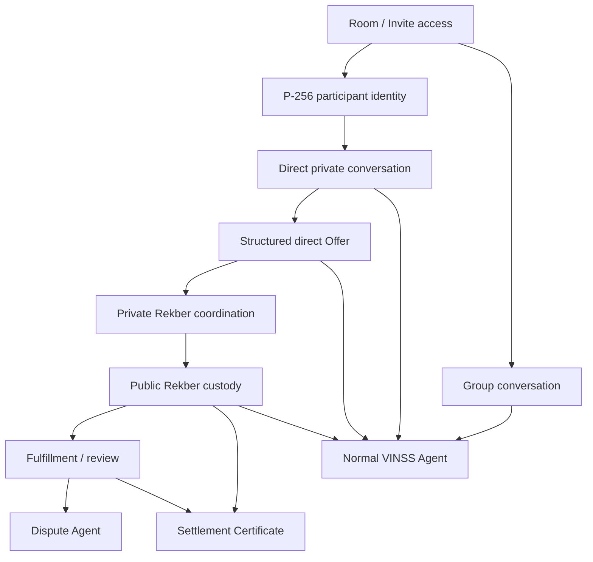
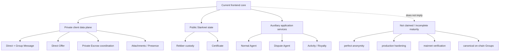
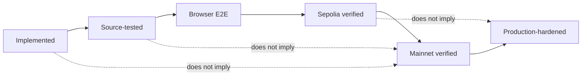

# VINSS Current Frontend Scope

This document defines what the current VINSS frontend source does, what is covered by source-level tests, what remains an explicit runtime/deployment verification question, and what the frontend does not claim.

It exists to prevent these states from being conflated:

```text
implemented in source
source-tested
browser-tested
Sepolia verified
mainnet verified
production-hardened
```

The current source is broader than the older frontend scope document.

It now includes:

- direct private messaging;
- Group messaging;
- direct encrypted attachments;
- encrypted Presence;
- direct structured Offers;
- Invite V3 for direct and Group access;
- Private Escrow coordination;
- accepted Offer -> Rekber mapping;
- Rekber funding and protection actions;
- fulfillment/work evidence and review;
- dedicated Dispute Agent review and attestation;
- optional Settlement Certificate claim/read;
- normal VINSS Agent proposals;
- Activity and Royalty read surfaces;
- browser recovery for multiple Ready X/mobile flows.

---

# Scope Classification

Use the following evidence classes throughout frontend documentation:

| Evidence class | Meaning |
|---|---|
| **Implemented** | Current source contains the behavior/path |
| **Source-tested** | Current repository contains a targeted automated source/logic test for the behavior |
| **Cross-layer regression tested** | Repository source-regression script checks the boundary across frontend/backend/contracts |
| **Browser E2E verified** | A real browser test/run produced evidence for the flow |
| **Sepolia on-chain verified** | A transaction/state proof from Sepolia exists for the current build/config |
| **Mainnet verified** | A transaction/state proof from Starknet mainnet exists for the current build/config |
| **Production-hardened** | Security, operations, monitoring, migration, incident, and scale concerns have been reviewed beyond feature correctness |

---

# Rule — No Status Promotion

These are not equivalent:

```text
source file exists
    !=
test passed

test passed
    !=
wallet browser E2E passed

Sepolia tx exists
    !=
mainnet tx exists

mainnet tx exists
    !=
production security maturity
```

---

# Current Scope Summary



---


# Current Capability Matrix

The table below is intentionally source-oriented.

`Live verification` is not inferred from implementation alone.

| Capability | Current source | Source test coverage | Live verification in this source audit |
|---|---|---|---|
| Wallet Standard / WalletAccountV6 session | Implemented | No dedicated frontend test | Not asserted |
| STRK20 capability detection | Implemented | Cross-layer/source coverage only where applicable | Not asserted |
| Local room access | Implemented | No dedicated frontend test | Not asserted |
| P-256 messaging identity | Implemented | Cross-layer privacy regression covers selected invariants | Not asserted |
| Direct pairwise ECDH | Implemented | Cross-layer privacy regression covers selected boundaries | Not asserted |
| Participant discovery | Implemented | No dedicated frontend test | Not asserted |
| Direct private Message V2 | Implemented | Cross-layer privacy regression covers keyless discovery/local decrypt | Not asserted here |
| Direct Message mobile recovery | Implemented | No dedicated frontend timing/E2E test | Not asserted here |
| Direct encrypted local history | Implemented | Cross-layer/source coverage only | Not asserted |
| Direct Presence typing/read | Implemented | No dedicated frontend test | Not asserted |
| Direct encrypted attachments | Implemented | No dedicated frontend test | Not asserted |
| Group local registry | Implemented | No dedicated frontend test | Not asserted |
| Group membership Presence | Implemented | No dedicated frontend test | Not asserted |
| Group Message V2 | Implemented | No dedicated frontend test | Not asserted |
| Structured direct Offer V2 | Implemented | Cross-layer privacy regression covers selected boundaries | Not asserted here |
| Offer create/counter/accept/reject UI lifecycle | Implemented | accepted-Offer mapping tested downstream | Not asserted here |
| Offer cancel/expire low-level wrappers | Implemented | No dedicated frontend test | Not asserted |
| Invite V3 direct | Implemented | No dedicated frontend test | Not asserted here |
| Invite V3 Group | Implemented | No dedicated frontend test | Not asserted here |
| Invite mobile timeout recovery | Implemented | No dedicated frontend test | Not asserted |
| Private Escrow coordination V2 | Implemented | Cross-layer regression covers selected Rekber boundaries | Not asserted here |
| Accepted Offer -> settlement mapping | Implemented | **5 source tests** | Not asserted |
| Rekber funding client | Implemented | Cairo/backend tests are separate; frontend mapping/protection tests exist | Not asserted here |
| Rekber custody parser/read | Implemented | No dedicated full parser frontend test | Not asserted here |
| Rekber protection guards | Implemented | **6 source tests** | Not asserted |
| Work/fulfillment evidence | Implemented | No dedicated frontend E2E test | Not asserted |
| Revision flow | Implemented | Selected protection/source coverage | Not asserted |
| Timeout refund UI path | Implemented | Rekber protection source test | Not asserted here |
| Auto-release UI path | Implemented | Rekber protection source test | Not asserted here |
| Mutual refund UI path | Implemented | Rekber protection source test | Not asserted here |
| Resolution claim UI path | Implemented | Rekber protection source test | Not asserted here |
| Dedicated Dispute Agent case | Implemented | **1 frontend source test** + backend dispute tests | Not asserted here |
| Dispute typed-data attestation | Implemented | backend attestation tests are separate | Not asserted here |
| Optional backend AutoResolve integration | Frontend consumes result; executor is backend-owned | backend unit/policy coverage separate | Not asserted here |
| Settlement Certificate claim/read | Implemented | Cairo/backend certificate tests separate | Not asserted here |
| Activity panel | Implemented | No dedicated frontend test | Not asserted |
| Royalty panel | Implemented | backend Royalty logic tests separate | Not asserted |
| Normal VINSS Agent | Implemented | backend Agent tests + cross-layer regression; no dedicated AgentPanel browser test | Not asserted here |
| Mainnet env template | Implemented | N/A | Template is not mainnet verification |

---


# Current Frontend Test Surface

Current `frontend/tests/` contains exactly three test files:

```text
dispute-agent.test.ts
escrow-offer-scenarios.test.ts
rekber-protection.test.ts
```

Current source inventory documented during this frontend audit:

```text
5 accepted Offer -> Rekber scenario cases
6 Rekber protection cases
1 Dispute Agent case privacy case
```

Total:

```text
12 frontend source test(...) cases
```

This is a source inventory.

It must not be written as:

```text
12/12 passed
```

unless an actual current test execution produced that result.

---


## Available Frontend Test Commands

```bash
npm run typecheck
npm run build
npm run test:escrow-scenarios
npm run test:rekber-protection
npm run test:dispute-agent
npm run test:e2e
npm run test:e2e:video
```

The existence of `test:e2e` / Playwright commands is not itself browser-E2E evidence.

---


# Cross-Layer Privacy Regression

The backend test command also runs the repository-level:

```text
scripts/test-privacy-boundaries.mjs
```

which checks selected frontend/backend/contract source invariants.

Relevant frontend categories include:

- Message/Offer Discovery must not send channel keys;
- decryption remains in frontend source;
- Agent timeline minimization exists;
- room label is not automatically transmitted through current normal Agent request;
- Rekber commitment domains stay aligned;
- legacy preparation/coordinator behavior remains removed;
- selected recovery/privacy boundaries remain present.

This is valuable regression protection.

It is still not:

```text
real two-wallet browser E2E
```

---


# Direct Private Chat Scope

Current direct Chat includes:

```text
per-room P-256 messaging identity
pairwise ECDH/HKDF key
Message V2 envelope
fresh action locator
opaque sender/recipient routing tags
FeePolicy quote
STRK20 wallet submission
ciphertext Discovery
local route matching/decryption
optimistic state
exact-locator recovery
encrypted local history
typing/read Presence
encrypted attachment support
work evidence/review support
```

---


## Direct Chat Does Claim

- backend Discovery can operate without receiving the direct pairwise decryption key;
- direct Message payload is encrypted before helper submission;
- routing tags are opaque HMAC-derived action-specific values;
- frontend performs route matching and decryption locally;
- direct history cache is encrypted before localStorage persistence;
- wallet authorization remains outside normal Agent control.


## Direct Chat Does Not Claim

- zero metadata on public chain;
- perfect sender anonymity against all observers;
- browser profile compromise resistance;
- malicious-extension resistance;
- that every local value is encrypted;
- current mainnet verification merely because the code path exists.


# Direct Pairwise Encryption Scope

Current direct communication uses:

```text
P-256 ECDH
-> shared secret
-> HKDF-SHA-256
-> room-scoped pairwise key
```

The persisted P-256 private key is re-imported as a non-exportable WebCrypto `CryptoKey` in IndexedDB.

---


## Important Limitation

`non-exportable` means WebCrypto will not export the private key material through normal export APIs.

It does not mean:

```text
malicious JavaScript running in the same origin cannot use the CryptoKey
```

so XSS/browser/device security still matters.

---


# Participant Discovery Scope

Current participant discovery combines:

```text
encrypted room-level participant Presence
encrypted room Message fallback
local public-key cache
```

and canonicalizes Starknet address formatting.

---


## Not a Canonical Participant Registry

Participant discovery is application-level encrypted coordination.

It is not:

```text
an on-chain room membership registry
```

and should not be treated as financial authorization.

---


# Presence Scope

Current encrypted Presence kinds include:

```text
typing
read
participant
group_member
```

Presence is:

```text
ephemeral
best effort
encrypted
non-canonical
```

---


## Presence Is Not Claimed As

- message-delivery proof;
- wallet-ownership proof;
- Offer acceptance proof;
- Rekber authorization proof;
- durable room membership;
- settlement evidence.


# Encrypted Local Cache Scope

Selected private histories/recovery records are encrypted locally.

Examples:

```text
direct history
direct pending Message
Offer history
```

using frontend cryptographic helpers.

---


## Local State Is Not Uniformly Encrypted

Current device-local room and Group records include secrets stored as plaintext JSON in localStorage:

```text
roomSecret
groupSecret
```

Therefore the accurate scope statement is:

> selected private histories are encrypted locally, while room/group capability records remain device-local plaintext storage.

---


# Group Scope

Group support is current implemented source.

This supersedes older product scope where Group was postponed.

Current Group frontend includes:

```text
local Group creation
groupSecret generation
Group-specific key derivation
Group admin/owner model
Group Invite V3
encrypted group_member Presence
Group Message V2
Group pending-message recovery
Group directory/conversation selection
```

---


## Current Group Boundary

Current Group definition/membership is local-first.

The frontend does not currently claim:

```text
canonical on-chain Group registry
durable globally synchronized Group ACL
Group Offer lifecycle
Group Rekber lifecycle
Group attachment feature parity with direct attachments
```

---


## Group-Only Access

A Group-only Invite can create a local room context without granting the room secret.

That allows Group participation without automatically granting direct private-chat room access.

---


# Attachment Scope

Current direct attachments include:

```text
20 MiB frontend plaintext limit
client-generated attachment UUID
client-generated capability token
HKDF-derived attachment subkey
AES-GCM encryption
backend opaque ciphertext storage
encrypted direct Message reference
local decrypt
plaintext SHA-256 integrity verification
```

---


## Attachment Not Claimed

- end-to-end encrypted Group attachments;
- automatic retention/deletion guarantees;
- key rotation;
- object-store scalability;
- malware scanning;
- production quota enforcement.


# Structured Offer Scope

Current active structured Offer flow is direct/pairwise.

Current low-level action support:

```text
create
counter
accept
reject
cancel
expire
```

Current room UI hook actively wires:

```text
create
counter
accept
reject
```

---


## Offer Privacy Scope

Current Offer V2 keeps private terms in ciphertext while public helper state carries:

```text
action locator
opaque routing tags
payload commitment
ciphertext
```

---


## Offer Parent Scope

Lifecycle replies use authenticated private Offer discovery rather than trusting a locally cached card alone.

---


## Offer Does Not Claim

- Group Offer workflow;
- public plaintext deal terms;
- stable external SDK compatibility;
- that cancel/expire are necessarily exposed in the current primary UI merely because wrappers exist.


# Invite V3 Scope

Current Invite frontend supports:

```text
direct scope
group scope
V3 AES-GCM encrypted capability
V2 compatibility decode
on-chain commitment
expiry
one-time consume
mobile wallet create recovery
local consumed-ID UX guard
```

---


## Direct Invite

Direct Invite can include:

```text
roomSecret
```

and current direct TTL is:

```text
1 hour
```

---


## Group Invite

Group Invite can include:

```text
groupId
groupName
groupSecret
groupOwnerAddress
```

without automatically including roomSecret.

Current expiry choices:

```text
24 hours
7 days
```

---


## Invite Capability Caveat

Prepared Invite links are persisted locally for mobile recovery.

Because the link contains fragment key material, local device/browser storage is a high-sensitivity capability boundary.

---


# Private Escrow Coordination Scope

Current Private Escrow Helper path implements encrypted Rekber coordination.

It includes:

```text
pairwise encrypted coordination
V2 private Escrow envelope
opaque routing tags
immutable action locator
payload commitment
backend ciphertext Discovery
exact-locator reconciliation
```

---


## Private Escrow Is Not Custody

The frontend explicitly separates:

```text
Private Escrow Helper
    encrypted coordination

VinssEscrowRekber
    public financial custody/state machine
```

---


# Accepted Offer → Rekber Scope

Current frontend maps an authenticated accepted Offer into generic settlement parameters.

Supported current assets:

```text
STRK
USDC
```

with exact decimal conversion using string/BigInt arithmetic.

---


## Current Scenario Source Tests

The frontend contains five source cases covering representative:

```text
Freelance
NFT
Goods
Bounty
OTC
```

accepted Offer -> Rekber mapping scenarios.

These are mapping/logic evidence.

They are not wallet/browser/on-chain evidence.

---


# One Accepted Offer → One Rekber Scope

Current room UI prevents silently starting another Rekber from an accepted Offer that already has a discovered Rekber `create` coordination action.

Completed Rekber may remain visible as history.

A new Rekber requires a new eligible accepted Offer.

---


# Rekber Funding Scope

Current frontend implements Rekber funding through:

```text
quote_rekber_fee(token, principal)
-> wallet STRK20 transaction
-> VinssEscrowRekber
```

The canonical funding fee is contract-quoted.

---


## Funding Does Not Claim

- that a locally calculated 2% number is sufficient authority;
- that frontend state can override contract validation;
- that source implementation proves current mainnet funding.


# Rekber Public State Scope

Frontend currently parses and renders a broad public custody state including:

```text
token
amount
feeAmount
refund/review/revision timing
capability commitments
fulfillment/revision rounds
evidence commitments
dispute state
resolution allocations
claim flags
consumed/refunded flags
timestamps
```

through direct Rekber reads.

---


## Canonical Authority

For financial truth:

```text
VinssEscrowRekber contract state
    >
backend read model
    >
frontend cache
```

---


# Rekber Protection Scope

Current frontend implements UI guards/actions for:

```text
timeout refund
counterparty fulfillment confirmation
dispute opening
auto-release
resolution claim
mutual refund consent/completion
```

---


## Protection Tests

Current frontend has six source tests covering selected protection behavior.

These guards are not the financial security boundary.

The Cairo contract remains authoritative.

---


# Fulfillment / Work Evidence Scope

Current frontend supports:

```text
private work submission packet
optional encrypted direct attachment
evidence commitment
public fulfillment submission transition
private work review packet
confirmation
revision
dispute escalation
```

---


## Work Evidence Privacy Boundary

Business evidence is kept encrypted/off-chain where possible, while Rekber receives commitments and public lifecycle state.

---


# Revision Scope

Current frontend supports bounded fulfillment/revision secret chains.

Current generator accepts:

```text
0..8 rounds
```

per chain construction.

---


# Dispute Agent Scope

Dedicated Dispute Agent is implemented as a separate workflow from normal Agent.

Current frontend can:

```text
build payer/payee evidence packets
exchange evidence through encrypted coordination
build accepted-term arbitration case
reconstruct original Rekber Agreement binding
request backend challenge
sign typed data with each wallet
exchange signatures through encrypted coordination
submit both attestations for evaluation
render decision/policy/execution result
```

---


## Frontend Dispute Source Test

Current frontend has one dedicated source test verifying that:

```text
accepted terms are included
explicit party evidence is included
roomSecret is excluded
channelKey is excluded
```

from the constructed dispute case.

---


## Explicit Plaintext Boundary

Dispute is not ciphertext-only backend interaction.

It intentionally sends selected:

```text
accepted terms
party statements
evidence
wallet identities
signatures
binding data
```

to the arbitration backend/provider after consent.

---


## AutoResolve Scope

Frontend itself does not own the resolver private key.

Current backend may have a dedicated resolver signer only when AutoResolve is explicitly enabled/configured and policy eligibility passes.

Therefore frontend scope must not claim:

```text
Agent can never authorize settlement
```

globally.

The precise statement is:

```text
normal Agent cannot sign user transactions;
dedicated backend Dispute AutoResolve is a separate optional authority.
```

---


# Settlement Certificate Scope

Current frontend implements:

```text
certificate claim commitment
deterministic token ID
public direct claim
is_claimed read
certificate record read
Rekber proof association
```

---


## Certificate Is Public

The Settlement Certificate is optional public credential/evidence.

It is not hidden private Deal Room state.

---


## Certificate Does Not Claim

- privacy of recipient identity;
- transferable NFT semantics;
- that every settlement automatically mints a certificate;
- mainnet issuance unless actual mainnet evidence exists.


# Normal VINSS Agent Scope

Current normal Agent public skills:

```text
chat
offer
escrow
```

---


## Normal Agent Context

Current frontend applies:

```text
visible-context scoping
explicit shareContext opt-in
generic timeline labels
latest Offer locator-only reduction
```

before `/agent`.

The backend then sanitizes the context again.

---


## Normal Agent Proposal Scope

Current proposal types:

```text
draft_message
draft_offer
draft_counter_offer
prepare_escrow
review_rekber
```

and all require approval.

Approved proposals prepare local UI state.

They do not directly submit the wallet transaction.

---


## Normal Agent Plaintext Boundary

The explicit text the user types into Agent is sent as plaintext to backend/provider.

Therefore normal Agent is privacy-reduced, not zero-plaintext.

---


# Activity Scope

Current room UI includes Activity as a public read-model surface.

It is not:

```text
private Deal Room decryption authority
or
financial settlement authority
```

---


# Royalty Scope

Current room UI includes a Royalty read surface derived from backend Certificate data.

Current Royalty conversion is not the same thing as an implemented transferable token conversion pipeline.

Do not use Royalty UI presence to claim:

```text
token distribution is live
```

---


# Legacy Loyalty Scope

The repository also contains Legacy Loyalty paths outside the core current frontend privacy/custody architecture.

Backend documentation classifies that system as optional/experimental and non-authoritative.

The current frontend scope must not treat Legacy Loyalty points as:

```text
settlement authority
financial accounting
or
canonical on-chain rewards
```

---


# Wallet / STRK20 Scope

Current frontend uses:

```text
Wallet Standard V6
WalletAccountV6
STRK20 Wallet API capability detection
minimum supported Wallet API version 0.10.3
```

for the current private transaction paths.

---


## Wallet Authority

Frontend prepares actions.

User wallet authorizes normal transaction-producing actions.

The application does not receive the user's wallet private key.

---


# Fee Scope

Current economic paths are not one fixed frontend table.

| Action | Current authority |
|---|---|
| Invite CREATE | Invite helper FeePolicy quote |
| Message | MessageHelper FeePolicy quote |
| Offer | OfferHelper FeePolicy quote |
| Rekber funding | `quote_rekber_fee(token, principal)` |
| selected Rekber workflow actions | current frontend 3 STRK workflow amount |
| replay-only actions | negligible source-defined replay spend |

---


## Stale Fee Claims

Do not claim:

```text
Message is always 7 STRK
Offer is always 10 STRK
```

from old documentation/source comments.

Current runtime Message/Offer fee authority is FeePolicy.

---


# Mainnet Configuration Scope

Current frontend contains:

```text
frontend/env.mainnet.example
```

with placeholders for:

```text
mainnet network
RPC
backend
Privacy Pool
Message Helper
Invite
Offer Helper
Private Escrow Helper
Rekber
Settlement Certificate
STRK
USDC
treasury
OpenNote fee tokens
```

---


## Template Is Not Verification

The presence of a mainnet env template proves only:

```text
the repository has a mainnet configuration checklist
```

not:

```text
all current mainnet addresses are deployed and verified
```

---


## Frontend Mainnet Fallback Caveat

Current runtime constants still default to:

```text
network = sepolia
RPC = Sepolia
backend = localhost
```

when selected env values are absent.

Mainnet deployment must set explicit public config.

---


# Privacy Scope — Protected

Current design protects or avoids automatically disclosing:

```text
direct Message plaintext through normal Discovery
Offer plaintext through normal Discovery
Private Escrow plaintext through normal Discovery
direct pairwise key
P-256 private messaging key
room/group keys through normal Discovery
Rekber capability preimages
attachment plaintext to backend blob storage
normal Agent full decrypted timeline
```

---


# Privacy Scope — Public / Observable

Public or observable data can include:

```text
transaction timing
contract interactions
Privacy Pool/helper usage
action locators
routing tags
payload commitments
ciphertext
block numbers
transaction hashes
Rekber token
Rekber principal
Rekber timing/state
evidence commitments
resolution allocations
Certificate ownership
```

---


# Privacy Scope — Intentional Application Plaintext

Some non-Discovery features intentionally receive plaintext:

```text
normal Agent explicit user prompt
Feedback
dedicated Dispute terms/statements/evidence
```

This is why the correct global claim is not:

```text
backend never receives plaintext
```

---


# Current Browser Console Caveat

Current `discoverMessages()` still logs decrypted Message information to browser developer console, including:

```text
body
attachment metadata
workEvidence metadata
```

This does not send plaintext to backend Discovery.

But it means strict production wording such as:

```text
decrypted private Message content never enters diagnostics
```

is currently false.

---


# Current Local Secret Caveat

Current frontend persists:

```text
roomSecret
groupSecret
```

in plaintext localStorage as device-local application state.

The design protects them from normal backend Discovery.

It does not protect them from:

```text
XSS with same-origin storage access
malicious browser extension
compromised device/browser profile
```

---


# Current Group Authority Caveat

Group definitions and observed membership are local-first plus ephemeral encrypted Presence.

VINSS does not currently claim:

```text
durable globally authoritative Group membership
```

---


# Current Presence Caveat

Presence is backend process-memory based on the current server implementation.

Multiple backend replicas without shared Presence state can split ephemeral visibility.

This does not invalidate immutable Message/Offer/Rekber records.

---


# Current Attachment Caveat

Direct attachment encryption is implemented, but production lifecycle features such as:

```text
delete
retention policy
token rotation
dedicated quotas
object-store scaling
```

are not current complete guarantees.

---


# Current Configuration Caveat

Frontend startup is development-friendly rather than globally fail-closed.

Missing values can yield:

```text
Sepolia fallback
localhost backend
empty feature address
```

and fail only when the affected feature executes.

---


# Current Testing Caveat

Current frontend test coverage is targeted rather than comprehensive.

Important unproven-by-dedicated-frontend-test areas include:

```text
WalletProvider restoration
participant Presence
direct Message end-to-end recovery
Group Message recovery
Invite browser flow
attachments
full Offer browser lifecycle
full Rekber custody parser
live two-wallet fulfillment
live two-wallet dispute
AgentPanel consent UX
Settlement Certificate browser claim
mainnet environment validation
```

---


# Current E2E Caveat

`package.json` provides:

```text
playwright test
playwright test --video=on
```

commands.

The current scope document must not turn those commands into a passing-browser-suite claim without actual execution evidence.

---


# Current Deployment Evidence Policy

This file intentionally does not freeze transient statuses such as:

```text
redeploy pending
E2E pending
deployment pending
mainnet pending
```

as architecture facts.

Instead, live verification should be recorded in a dated release/test record containing:

```text
Git SHA
deployment ID
network
contract addresses
wallet(s)
transaction hashes
test command/output
date
```

---


# Why Old Status Rows Were Removed

The previous scope table mixed:

```text
implementation status
historical Sepolia evidence
current integration status
future deployment state
```

in one `Status` column.

That becomes stale quickly.

Example:

```text
NFT Settlement Certificate
    Implemented / Cairo tested / deployment pending
```

can become incorrect the moment the contract is deployed without the document changing.

---


# Recommended Evidence Matrix Per Release

For a release, record capabilities using explicit independent columns:

| Capability | Source | Automated tests | Browser E2E | Sepolia | Mainnet |
|---|---|---|---|---|---|
| Direct Message | yes/no | evidence | evidence | tx/state | tx/state |
| Offer | yes/no | evidence | evidence | tx/state | tx/state |
| Invite | yes/no | evidence | evidence | tx/state | tx/state |
| Rekber funding | yes/no | evidence | evidence | tx/state | tx/state |
| Rekber release/refund | yes/no | evidence | evidence | tx/state | tx/state |
| Certificate | yes/no | evidence | evidence | tx/state | tx/state |

---


# Current Frontend Scope Boundaries



---


# What the Frontend Does Claim

- Private Message/Offer/Private Escrow payloads are encrypted before normal helper submission.
- Normal backend Discovery can operate without receiving decryption keys.
- Direct routes use a P-256 ECDH-derived pairwise key in current active direct workflows.
- Group messaging uses a distinct Group-secret-derived key.
- Current immutable private actions use action-specific locators and opaque routing tags.
- Wallet authorization remains explicit for normal transaction-producing user flows.
- Current accepted Offer mapping supports STRK and USDC.
- Private Escrow coordination and Rekber custody are distinct layers.
- Rekber contract state is the canonical financial authority.
- Normal Agent automatic context is privacy-reduced and proposals require approval.
- Dedicated Dispute is a separate explicit disclosure/attestation path.
- Settlement Certificate claim/read is a public credential flow.


# What the Frontend Does Not Claim

- zero public metadata
- perfect anonymity
- traffic-analysis resistance
- browser/device compromise resistance
- all device-local secrets are encrypted at rest
- canonical on-chain Group membership
- Group Offer or Group Rekber parity
- all frontend flows have dedicated automated tests
- Playwright browser E2E currently passes merely because commands exist
- every source-implemented feature has current Sepolia evidence
- mainnet verification without actual mainnet transaction/state evidence
- production security maturity merely because builds/tests pass
- backend never receives plaintext under any feature
- Agent can never participate in resolution authority under any configuration


# Scope by Trust Boundary

| Data | Current trusted location | Excluded from / not protected against |
|---|---|---|
| Direct Message plaintext | Authorized frontend | Normal Discovery backend |
| Offer terms | Authorized frontend | Normal Discovery backend |
| Private Escrow coordination plaintext | Authorized frontend | Normal Discovery backend |
| P-256 private messaging key | IndexedDB CryptoKey | Backend/chain |
| Pairwise key | Derived/in-memory frontend | Backend/chain |
| Room secret | Device localStorage | Normal backend |
| Group secret | Device localStorage | Normal backend |
| Attachment plaintext | Authorized frontend | Blob backend |
| Attachment ciphertext | Backend PostgreSQL | Public plaintext |
| Rekber capability preimages | Authorized frontend/local secret store | Public chain |
| Rekber token/principal/state | Public contract | Not private |
| Certificate recipient | Public contract | Not private |
| Normal Agent explicit prompt | Backend/provider by user action | Not ciphertext-only |
| Dispute evidence | Backend/provider by explicit dispute action | Not ciphertext-only |
| Resolver private key | Backend only when configured | Frontend |


# Scope by Canonical Authority

| Question | Current authority |
|---|---|
| Room access on this device | local room record |
| Group access on this device | local Group record |
| Direct private decrypt ability | local P-256 private key + peer public key |
| Message immutable existence | helper chain record / exact indexed locator |
| Offer immutable existence | Offer helper chain record / exact indexed locator |
| Private Escrow coordination | Private Escrow Helper chain record / indexed locator |
| Accepted Offer private semantics | authenticated local Offer decryption |
| Rekber financial state | VinssEscrowRekber contract |
| Settlement proof | Starknet Rekber event/state |
| Certificate | Settlement Certificate contract |
| Presence | Presence only; best effort |
| Agent stage/proposal | advisory application result |
| Royalty | backend Certificate-derived read model |


# Scope by Persistence

| State | Store | Lifetime | Visibility/protection |
|---|---|---|---|
| Room record | localStorage | persistent browser profile | plaintext JSON |
| Group record | localStorage | persistent browser profile | plaintext JSON |
| Messaging private identity | IndexedDB | persistent browser profile | non-exportable CryptoKey |
| Direct history | localStorage | persistent browser profile | AES-GCM encrypted |
| Offer history | localStorage | persistent browser profile | AES-GCM encrypted |
| Direct pending Message | localStorage | temporary recovery | AES-GCM encrypted |
| Group pending Message | localStorage | temporary recovery | metadata only |
| Invite recovery capability | localStorage | until consume/expiry | sensitive link |
| Presence | backend memory | ephemeral | encrypted payload |
| Attachments | backend PostgreSQL | persistent backend | ciphertext |
| Message/Offer/Escrow helper records | Starknet/index DB | chain/index lifetime | public ciphertext/metadata |
| Rekber custody | Starknet | chain lifetime | public state |
| Certificate | Starknet | chain lifetime | public state |


# Scope by User Workflow

Current representative direct Deal Room workflow:

```text
Connect wallet
    ↓
create/join room
    ↓
publish/discover messaging identity
    ↓
select direct peer
    ↓
private Chat
    ↓
create/counter Offer
    ↓
accept Offer
    ↓
rediscover authenticated ACCEPT
    ↓
private Rekber Agreement coordination
    ↓
fund Rekber
    ↓
submit/review fulfillment
    ↓
release / refund / revision / dispute
    ↓
resolution claim where applicable
    ↓
optional public Certificate
```

---


# Group Workflow Scope

Current Group flow:

```text
create or join Group
    ↓
derive Group key
    ↓
sync encrypted Group membership Presence
    ↓
send/discover Group Message
```

The current scope stops short of claiming Group parity for every direct workflow.

---


# Normal Agent Workflow Scope

Current normal Agent flow:

```text
select current context
    ↓
explicitly enable context sharing
    ↓
type/select instruction
    ↓
frontend minimizes automatic context
    ↓
backend sanitizes again
    ↓
provider returns answer/proposal
    ↓
user approves proposal
    ↓
local draft/workflow prepared
    ↓
user separately authorizes any real transaction
```

---


# Dispute Workflow Scope

Current dedicated Dispute flow:

```text
open dispute
    ↓
payer/payee explicit evidence
    ↓
encrypted peer coordination
    ↓
build accepted-term case + Agreement binding
    ↓
backend challenge
    ↓
both wallets sign typed-data review consent
    ↓
backend evaluation
    ↓
policy
    ↓
optional AutoResolve authorization when enabled/eligible
```

---


# Mainnet Verification Definition

A frontend feature should only be labeled:

```text
Mainnet verified
```

when evidence ties together:

```text
current frontend Git SHA
current deployed frontend
mainnet RPC/backend
current mainnet contract addresses
actual wallet action
transaction hash or canonical read
expected resulting state
```

---


# Sepolia Verification Definition

Similarly, `Sepolia verified` should refer to actual current testnet evidence, not merely:

```text
Sepolia constants exist
testnet env exists
contracts compile
frontend source has a function
```

---


# Production-Hardened Definition

`Production-hardened` requires more than transaction success.

Relevant concerns include:

```text
XSS/CSP review
browser storage threat review
console/log privacy
dependency security
wallet compatibility
provider outages
RPC failover strategy
backend scaling
Presence multi-replica behavior
attachment retention
operational monitoring
incident response
rollback
deployment provenance
key management
mainnet economics
```

---


# Current Known Frontend Caveats

| Caveat | Current scope implication |
|---|---|
| Decrypted Message console log | Current Message discovery logs decrypted content/metadata to browser console. |
| roomSecret localStorage | Room capability is device-local plaintext JSON. |
| groupSecret localStorage | Group capability is device-local plaintext JSON. |
| Invite recovery link localStorage | Prepared Invite capability including fragment key can be persisted locally. |
| Sepolia fallback | Network/RPC fallback can hide missing production env. |
| localhost backend fallback | Missing backend URL can compile but fail client API calls. |
| Group local-first model | Group membership is not canonical durable chain state. |
| Presence process-local backend | Ephemeral state can split with multiple backend replicas. |
| Attachment lifecycle | No complete delete/retention/rotation model. |
| Rekber workflow fee | Selected workflow fee is currently source-defined 3 STRK rather than same dynamic FeePolicy action path. |
| Targeted frontend tests | Many browser flows do not have dedicated frontend automated tests. |
| Playwright evidence | Scripts exist; passing current browser suite is a separate evidence question. |


# Current Out-of-Scope / Not Yet Claimed

- perfect anonymity or zero metadata
- canonical on-chain Group registry
- Group Offer lifecycle parity
- Group Rekber lifecycle parity
- Group direct-attachment feature parity
- automatic Settlement Certificate mint for every deal
- live transferable royalty/token conversion
- production-grade attachment lifecycle management
- durable multi-replica Presence
- complete browser E2E automation for every user flow
- mainnet verification without current transaction evidence
- fully hardened browser secret storage
- stable external frontend SDK API


# Internal Integration Layer Status

`frontend/lib/deal-room/` is application-internal.

It currently acts as the integration boundary for:

```text
Message
Offer
Invite
Private Escrow
accepted Offer settlement mapping
Rekber
Dispute
work confirmation/evidence
```

It is not currently presented as:

```text
a stable semver public SDK
```

for third-party consumers.

---


# What Would Be Required for a Stable External SDK

A stable external SDK claim would require explicit decisions around:

```text
public API surface
semantic versioning
migration policy
error contracts
environment/config API
wallet abstraction compatibility
browser/runtime support
protocol version compatibility
documentation examples
package publishing
deprecation policy
```

which are outside the current application-internal frontend scope.

---


# Current Source Test Matrix

| Area | File | Current source inventory |
|---|---|---|
| Accepted Offer settlement mapping | escrow-offer-scenarios.test.ts | 5 source cases |
| Rekber protection guards | rekber-protection.test.ts | 6 source cases |
| Dispute Agent case privacy | dispute-agent.test.ts | 1 source case |
| **Total** | **3 files** | **12 source cases** |


# Important Test Gaps

- WalletProvider silent reconnect/resume behavior
- participant discovery with two real wallets
- direct Message optimistic/recovery timing in browser
- Group Message background recovery
- Group membership reconciliation
- Invite V3 browser create/copy/consume flow
- direct attachment upload/download browser flow
- Offer lifecycle parent-authentication browser flow
- Offer callback-generation race recovery
- Private Escrow exact-locator coordination recovery
- full Rekber get_custody parser regression fixture
- real Ready X Rekber funding
- two-wallet fulfillment/revision flow
- two-wallet mutual refund
- two-wallet Dispute Agent attestations
- Certificate browser claim
- normal AgentPanel shareContext reset UX
- mainnet env/build validation


# Source-Level Evidence vs Contract-Level Evidence

Some frontend features depend on Cairo contracts that have their own tests.

Contract tests can prove:

```text
contract invariant behavior
```

but do not automatically prove:

```text
frontend calldata construction
wallet API compatibility
browser recovery
Vercel env correctness
two-wallet UX
```

---


# Source-Level Evidence vs Backend Evidence

Backend tests can prove:

```text
indexer parsing
Agent policy
Dispute attestation/policy/executor pure behavior
Certificate read-model logic
Royalty calculation
```

but do not automatically prove the frontend browser flow.

---


# Evidence Promotion Checklist

Before promoting a feature from Implemented to Browser/Sepolia/Mainnet verified:

```text
[ ] exact Git SHA recorded
[ ] deployed frontend identified
[ ] frontend env/network recorded
[ ] backend deployment/network recorded
[ ] wallet/version identified
[ ] relevant contract addresses recorded
[ ] action executed
[ ] transaction hash/state proof recorded
[ ] expected private decrypt/state verified on second wallet where applicable
[ ] recovery behavior observed where applicable
[ ] result attached to dated release evidence
```

---


# Current Privacy Claims Matrix

| Claim | Current answer | Qualification |
|---|---|---|
| Message plaintext hidden from normal Discovery backend | Yes, by current design | Browser console caveat |
| Offer plaintext hidden from normal Discovery backend | Yes, by current design | Public ciphertext/metadata remains |
| Private Escrow plaintext hidden from normal Discovery backend | Yes, by current design | Public ciphertext/metadata remains |
| Pairwise keys hidden from backend | Yes, normal paths | Client/browser security still matters |
| P-256 private key non-exportable | Yes | Same-origin malicious script may still use it |
| Room secret encrypted at local rest | No | Plain localStorage |
| Group secret encrypted at local rest | No | Plain localStorage |
| Attachment plaintext hidden from backend blob store | Yes, current direct path | Metadata/capability visible to backend |
| Normal Agent receives no plaintext | No | Explicit prompt is plaintext |
| Normal Agent receives full timeline automatically | No | Reduced generic context |
| Dispute backend receives plaintext evidence | Yes, explicitly | Intentional trust-boundary transition |
| Rekber token/amount private | No | Public custody state |
| Certificate ownership private | No | Public credential |


# Current Product Scope Matrix

| Product area | Scope | Boundary |
|---|---|---|
| Direct Chat | Core current | Pairwise private |
| Group Chat | Current | Group key; local-first membership |
| Structured Offer | Core current | Direct pairwise |
| Invite | Core current | Direct + Group |
| Rekber | Core current | Direct accepted Offer workflow |
| Work evidence/review | Current | Integrated with direct/Rekber |
| Dispute Agent | Current optional workflow | Explicit evidence disclosure |
| Certificate | Current optional public credential | Public |
| Normal Agent | Current optional assistant | Proposal-only normal flow |
| Activity | Current auxiliary | Public read model |
| Royalty | Current auxiliary/read-only | Conversion not live |
| Legacy Loyalty | Optional/experimental | Non-authoritative |


# Current Network Scope

Source supports configuration labels:

```text
sepolia
mainnet
```

but source presence does not equal deployment verification.

Frontend still has development fallbacks toward Sepolia.

---


# Current Browser Scope

The current private frontend relies on browser capabilities including:

```text
WebCrypto
IndexedDB
localStorage
URL fragments
wallet injection / Wallet Standard
focus/pageshow/visibility events
```

Therefore compatibility should be validated in the actual supported mobile/browser/wallet stack.

---


# Current Recovery Scope

Recovery is implemented but domain-specific.

| Domain | Current recovery model |
|---|---|
| Direct Message | encrypted pending record + exact-locator polling |
| Group Message | metadata pending record + periodic discovery + local expiry |
| Offer | prepared locator + encrypted history + callback-generation guard |
| Invite | prepared capability + `get_invite` polling |
| Private Escrow coordination | prepared locator + indexed exact-locator reconciliation |
| Rekber financial state | direct contract state read |
| Certificate | direct contract state read |

---


# Recovery Scope Does Not Claim

- all wallet errors can be perfectly classified;
- backend index has zero lag;
- mobile OS will never kill browser state;
- localStorage can never be cleared;
- every domain uses the same timeout or retry policy.


# Current Economic Scope

Current source supports sustainable-fee plumbing through:

```text
FeePolicy-quoted Invite/Message/Offer
Rekber token-aware funding quote
current explicit Rekber workflow charge
treasury/OpenNote routing
```

but frontend source alone does not prove:

```text
all mainnet economics are profitable
```

That requires live paymaster/privacy-pool/operator cost evidence.

---


# Current Mainnet Readiness Scope

From frontend source alone, current mainnet readiness evidence includes:

```text
explicit mainnet env template
network-aware contract/token configuration
address normalization
wallet capability detection
dynamic fee read paths
mainnet-capable URL/config fields
```

but these do not establish:

```text
mainnet deployment verified
mainnet wallet E2E verified
mainnet Rekber lifecycle verified
mainnet Certificate verified
```

without actual run evidence.

---


# Scope Review Before Release

- [ ] Re-read current room hooks.
- [ ] Re-read `lib/deal-room` inventory.
- [ ] Re-read current privacy modules.
- [ ] Recount frontend test files/cases.
- [ ] Check whether Playwright suite actually exists and runs.
- [ ] Check current env template.
- [ ] Check current FeePolicy behavior.
- [ ] Check current Rekber state/action support.
- [ ] Check current Group support.
- [ ] Check Agent/Dispute trust boundaries.
- [ ] Check localStorage secret behavior.
- [ ] Check browser console logging.
- [ ] Attach live network evidence separately.


# Scope Review Before Privacy Claim

- [ ] No channel/pairwise key in `/discover` request.
- [ ] No automatic full Message body in normal Agent context.
- [ ] No automatic full Offer terms in normal Agent context.
- [ ] Dispute disclosure is explicitly communicated.
- [ ] Browser console decrypted logging removed/gated if making strict diagnostics claim.
- [ ] Room/group localStorage risk acknowledged.
- [ ] Public Rekber/Certificate metadata acknowledged.
- [ ] Attachment backend metadata boundary acknowledged.
- [ ] Provider privacy boundary acknowledged.


# Scope Review Before Mainnet Claim

- [ ] Production frontend build SHA recorded.
- [ ] All mainnet env values explicitly set.
- [ ] RPC chain verified.
- [ ] Backend network/config verified.
- [ ] All helper/Rekber/Certificate addresses verified.
- [ ] FeePolicy relationships verified.
- [ ] Live Message two-wallet transaction recorded.
- [ ] Live Offer transaction recorded.
- [ ] Live Rekber funding recorded.
- [ ] Required release/refund/dispute path recorded.
- [ ] Certificate claim recorded if in launch scope.
- [ ] No testnet fallback used.


# Incorrect Scope Statements

- Group chat is postponed.
- Frontend only supports two-party messaging.
- Offer is always 10 STRK.
- Message is always 7 STRK.
- Escrow Rekber is still only an integration-stage deposit/release/refund client.
- Settlement Certificate is merely deployment-pending source.
- Agent has no possible signing authority anywhere in the system.
- Backend never receives plaintext under any feature.
- All local state is encrypted.
- Playwright commands prove E2E coverage.
- Implemented means Sepolia verified.
- Sepolia verified means current mainnet-ready.
- Mainnet env template means mainnet verified.


# Accurate Current Statements

- Direct and Group messaging are implemented, with different key/recovery models.
- Structured Offer is an active direct/pairwise workflow.
- Invite V3 supports direct and Group scopes.
- Private Escrow Helper carries encrypted Rekber coordination.
- Canonical Rekber custody/protection actions are implemented in frontend source.
- Accepted Offer -> settlement mapping has targeted source tests.
- Rekber protection guards have targeted source tests.
- Dispute Agent case construction has a targeted frontend source test.
- Settlement Certificate claim/read exists as a public frontend flow.
- Normal Agent proposals require approval and prepare local state only.
- Optional backend AutoResolve is a distinct Dispute authority.
- Live Sepolia/mainnet status must be supported by current deployment evidence.


# Source-of-Truth Order

```text
1. Cairo contract invariants
2. frontend/app/room/[roomId]/page.tsx
3. frontend/hooks/room/*
4. frontend/lib/deal-room/*
5. frontend/lib/privacy/*
6. frontend/lib/starknet/*
7. frontend/components/room/*
8. frontend/tests/*
9. scripts/test-privacy-boundaries.mjs
10. backend source/tests for backend-owned Agent/Dispute/index behavior
11. deployed frontend/backend environment
12. live wallet transaction/state evidence
13. prose documentation
```


# Status Documentation Rule

`current-scope.md` should change only when:

```text
implemented product scope changes
trust/privacy boundary changes
test coverage changes materially
or
the definition of evidence changes
```

Do not rewrite this file every time a temporary deployment is pending.

Use dated release evidence for transient network verification.

---


# Release Evidence Template

```text
Release:
Git SHA:
Frontend deployment:
Backend deployment:
Network:
Date:

Wallet A:
Wallet B:
Wallet API version:

Message:
  source:
  tests:
  tx:
  second-wallet decrypt:

Offer:
  source:
  tests:
  tx:
  second-wallet decrypt:

Invite:
  create tx:
  consume tx:

Rekber:
  accepted Offer locator:
  funding tx:
  fulfillment tx:
  release/refund/resolution tx:
  final custody state:

Certificate:
  claim tx:
  token id:

Dispute:
  evidence exchange:
  signatures:
  evaluation:
  policy:
  execution:

Known issues:
```


# Final Scope Diagram



---

# Bottom Line

The old current-scope document correctly tried to separate implementation from verification, but its one-column status table had become stale and incomplete.

The current frontend is materially broader.

It now includes:

```text
Direct Chat
Group Chat
direct attachments
Offer V2
Invite V3 direct + Group
Private Escrow coordination
full Rekber client state/protection surface
work evidence/review
Dispute Agent attestations
Settlement Certificate
Normal Agent
Activity
Royalty
```

with different privacy and authority boundaries.

The strongest current evidence statement is:

> Source implementation is broad, but frontend automated coverage is targeted: three dedicated frontend test files with 12 source cases, plus cross-layer privacy regression. Browser, Sepolia, and mainnet verification remain separate evidence categories and must be attached to actual runs.

The strongest current privacy statement is:

> Normal Message, Offer, and Private Escrow Discovery remains ciphertext/keyless from the backend perspective, but device-local secrets, normal Agent prompts, Feedback, and explicit Dispute evidence have different trust boundaries.

The strongest current financial statement is:

> Private Escrow coordination is not custody; canonical financial truth comes from `VinssEscrowRekber`, and frontend protection guards are UX gates rather than contract authority.

The strongest current mainnet statement is:

> The frontend contains mainnet-capable configuration and an explicit template, but source alone never proves mainnet verification.
