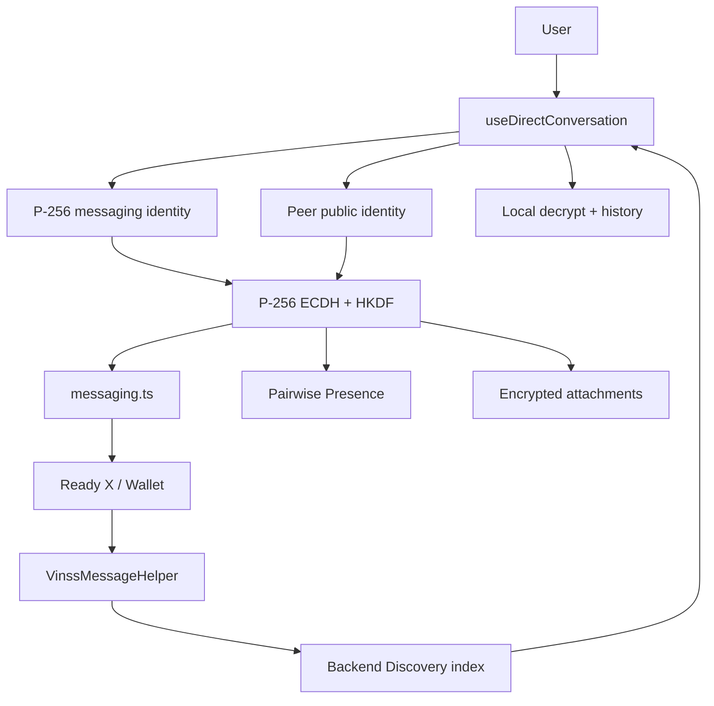
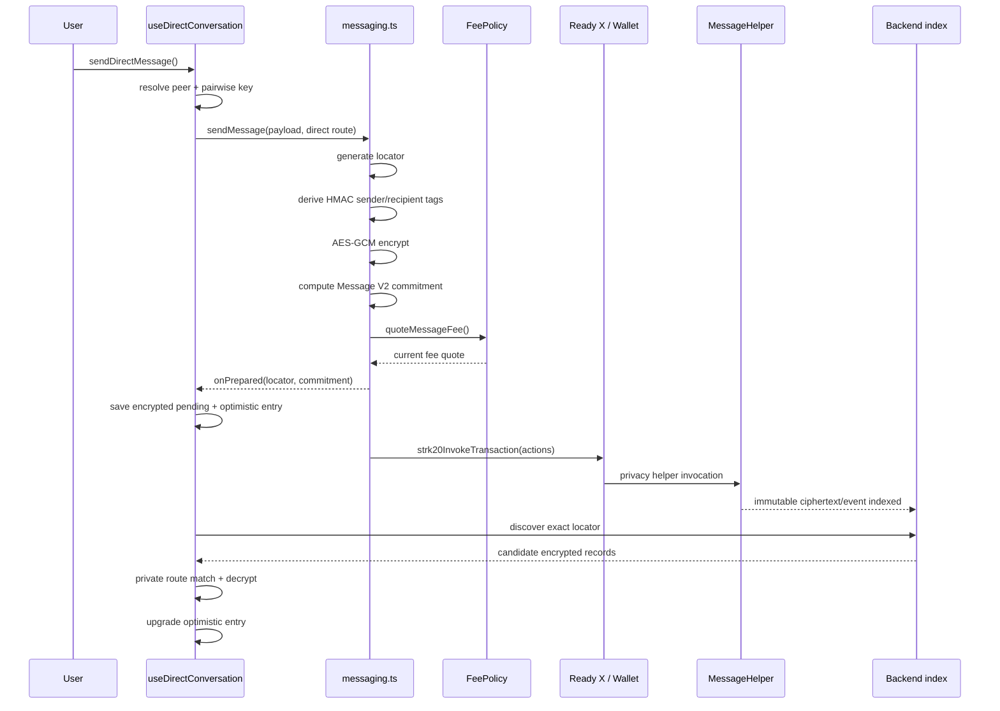
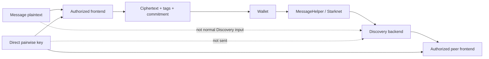
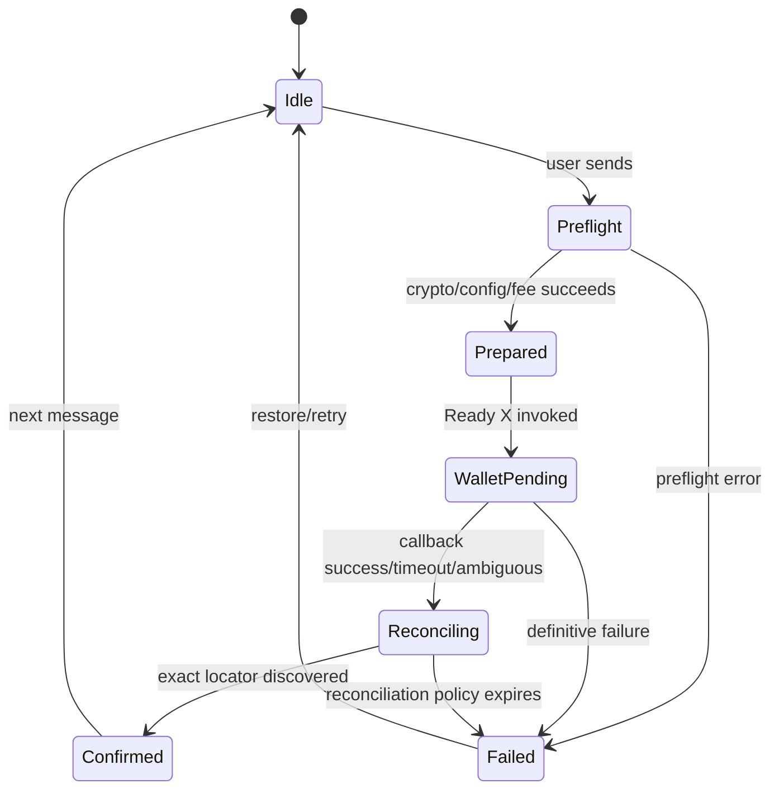
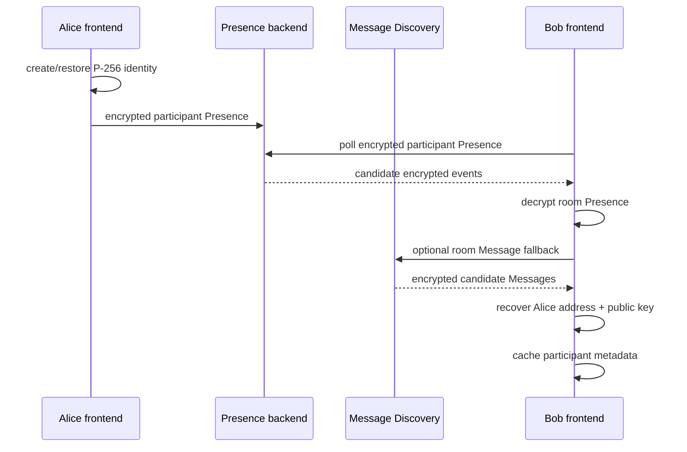
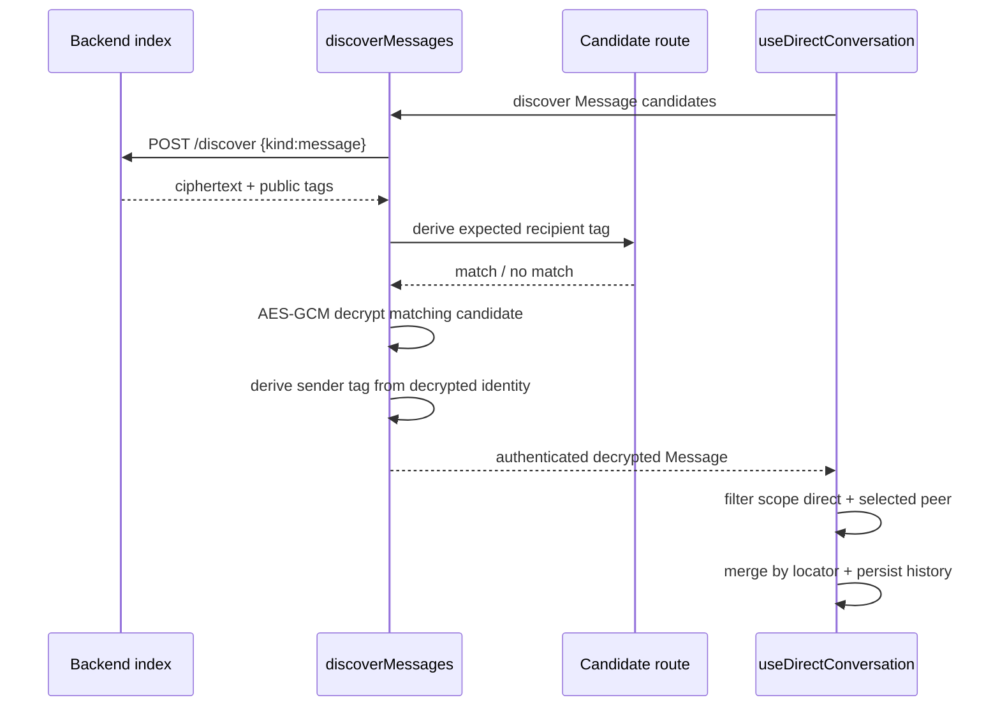
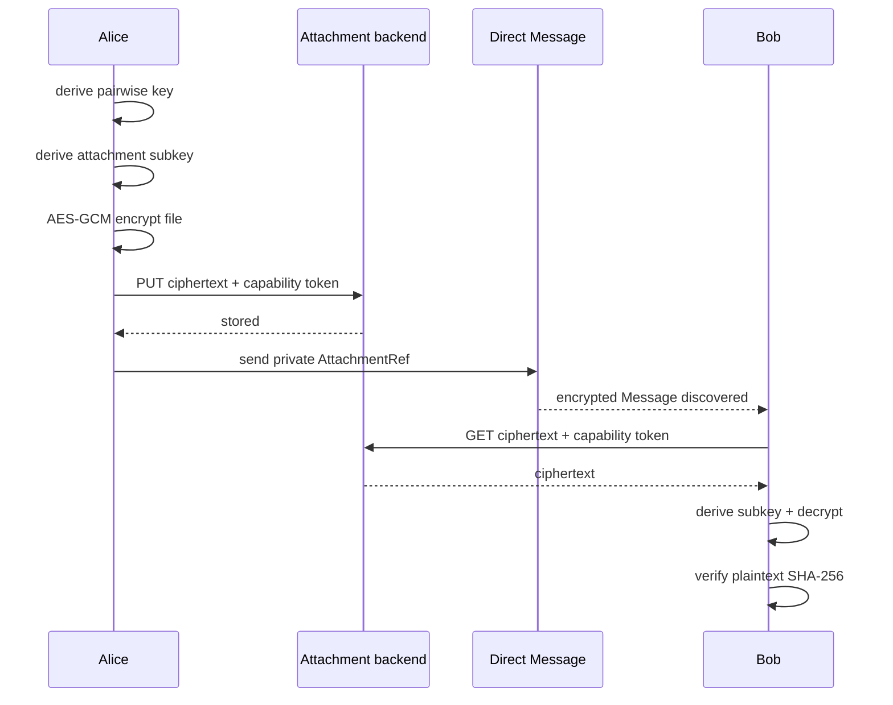
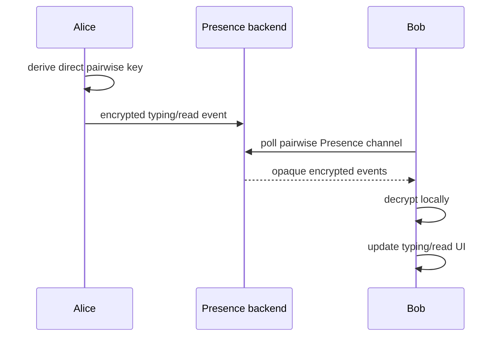
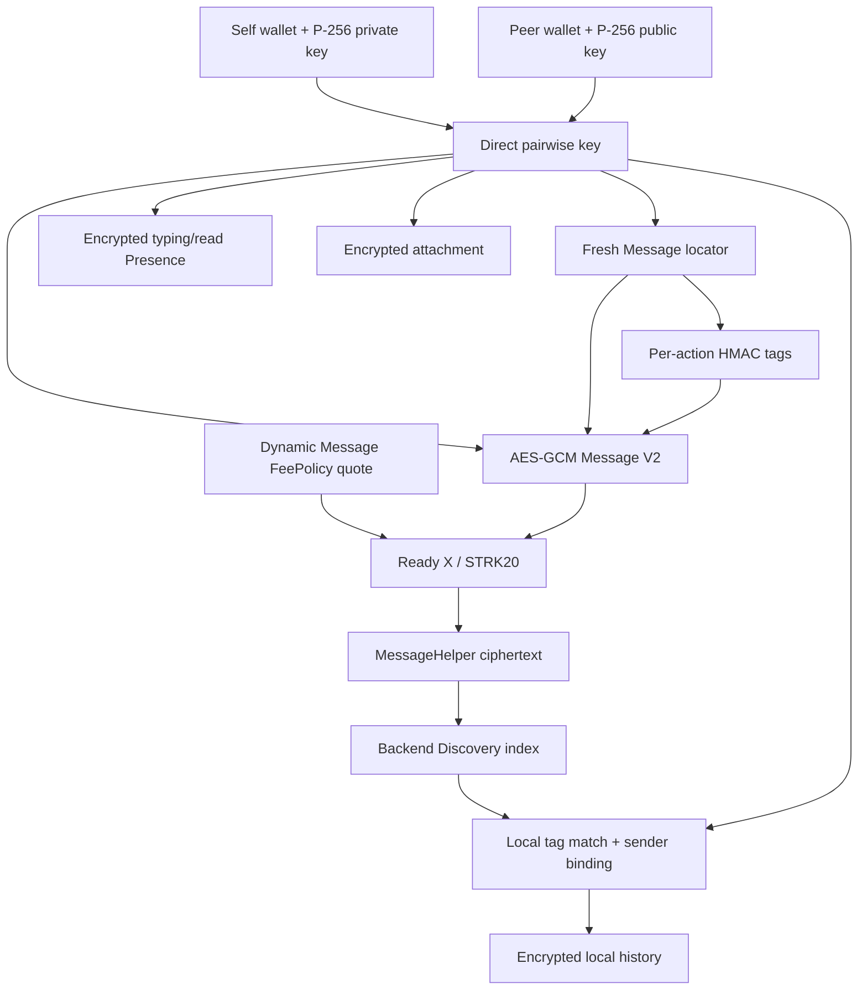

# VINSS Two-Party Private Chat

This document describes the current direct two-party private Chat implementation in the VINSS frontend.

Direct Chat is a browser-side privacy workflow built from:

```text
per-room P-256 messaging identity
    +
peer P-256 public key
    ↓
P-256 ECDH
    ↓
HKDF-SHA-256 direct pairwise key
    ↓
Message V2 envelope
    ↓
fresh action locator
    ↓
opaque per-action sender/recipient routing tags
    ↓
AES-GCM ciphertext
    ↓
wallet-authorized STRK20 submission
    ↓
Message Helper immutable record
    ↓
backend ciphertext index
    ↓
local routing match + decrypt
```

The backend participates in discovery but is not the normal Message plaintext/decryption authority.

---

# Evidence Rule

This document describes current source behavior.

It does not preserve the old blanket heading:

```text
Testnet on-chain verified
```

as an architecture fact.

Use separate evidence classes:

```text
Implemented
Source-tested
Browser E2E verified
Sepolia on-chain verified
Mainnet verified
```

A live-chain status should be attached to a dated build/deployment/transaction record rather than frozen into this technical architecture page.

---

# Objective

Direct Chat aims to provide encrypted two-party communication while avoiding public reusable conversation identifiers and avoiding normal backend access to the pairwise decryption key.

The current design protects Message business content by keeping:

```text
Message plaintext
direct pairwise key
P-256 private messaging key
```

inside the authorized client path.

Public/helper/backend-visible data can still include:

```text
action locator
sender routing tag
recipient routing tag
payload commitment
ciphertext
transaction hash
block number
timing
contract interaction
```

---

# Current Source Map

Primary direct Chat sources:

```text
frontend/hooks/room/useDirectConversation.ts
frontend/hooks/room/useRoomParticipants.ts
frontend/hooks/room/useDirectPresence.ts

frontend/lib/deal-room/messaging.ts
frontend/lib/deal-room/directMessageRouting.ts

frontend/lib/privacy/participantKeys.ts
frontend/lib/privacy/messageRouting.ts
frontend/lib/privacy/envelope.ts
frontend/lib/privacy/presence.ts
frontend/lib/privacy/encryptedChatCache.ts
frontend/lib/privacy/directAttachments.ts
frontend/lib/privacy/rekberEvidenceChannel.ts

frontend/types/deal-room.ts
frontend/components/room/conversation/*
```

---

# Direct Chat Architecture



---

# Direct Chat Is Separate From Group Chat

Current frontend supports both direct and Group Message flows.

They are intentionally separate.

Direct Chat uses:

```text
P-256 pairwise key
selected peer address
scope = direct
```

Group Chat uses:

```text
Group-secret-derived key
Group routing identity
scope = group
groupId
```

`useDirectConversation` owns direct state and does not merge it into Group state.

---


# Direct Chat Prerequisites

A usable direct conversation requires:

```text
roomId
connected wallet session
local per-room P-256 messaging identity
selected peer
peer P-256 public messaging key
room channelKey for selected local cache/discovery support
```

The direct encryption key itself is not the room channelKey.

---


# Per-Room Messaging Identity

Each wallet gets a messaging identity scoped by:

```text
<roomId>:<canonical Starknet wallet address>
```

Current identity state contains:

```text
id
walletAddress
publicKey
privateKey: CryptoKey
```

---


## Identity Persistence

The private P-256 key is stored in browser IndexedDB:

```text
DB: vinss-messaging-keys
store: identities
```

---


## Private Key Lifecycle

Current creation sequence:

```text
generate P-256 ECDH keypair as temporarily extractable
    ↓
export public raw key
    ↓
export private JWK temporarily
    ↓
re-import private key with extractable=false
    ↓
persist non-exportable private CryptoKey
```

The persisted private key is never intentionally sent to VINSS backend or placed on-chain.

---


## Concurrent Identity Creation

Multiple room hooks can request the same identity during one mount.

Current code protects against divergent identity generation using:

```text
in-memory identityRequests map
+
IndexedDB add-if-absent winner
```

If another caller wins the IndexedDB race, later callers use the persisted winner.

This prevents Chat, Offer, and Private Escrow from accidentally deriving different pairwise keys for the same room + wallet.

---


# Starknet Address Canonicalization

Wallets can expose the same Starknet felt with different leading-zero formatting.

Current helper normalizes numerically:

```text
canonicalStarknetAddress(address)
    -> 0x + BigInt(address).toString(16)
```

when possible.

Example:

```text
0x000abc
and
0xabc
```

become the same canonical identity.

---


## Why Canonicalization Matters

- IndexedDB identity lookup must not create a second key after wallet reconnect.
- participant cache must deduplicate equivalent wallet forms.
- direct routing must tolerate exact historical address strings.
- read receipts must compare numeric identity rather than raw text.
- Offer and Private Escrow reuse the same messaging identity.


# Legacy Identity Migration

Current identity loader scans existing per-room identities if the new canonical key is not found.

If a compatible old address formatting is found:

```text
old identity
    ↓
migrate under canonical id
    ↓
preserve existing P-256 private key
```

This protects existing pairwise decrypt compatibility after address-normalization changes.

---


# Participant Discovery

Direct Chat cannot derive the pairwise key until it knows the peer's public P-256 messaging key.

Current participant discovery combines:

```text
encrypted room-level participant Presence
+
encrypted room-level Message fallback
+
local participant cache
```

---


## Participant Presence

Each active room wallet publishes an encrypted participant payload containing:

```text
type = participant
senderAddress
messagingPublicKey
sentAt
```

under the room channel key.

---


## Publish Timing

Current participant identity is:

```text
published immediately
then roughly every 60 seconds
with a 24-hour TTL
```

---


## Discovery Polling

While participant discovery is active, the frontend refreshes approximately every:

```text
3 seconds
```

and also refreshes on browser focus/visibility resume.

---


## Room Message Fallback

The frontend also attempts room-key Message discovery to recover participant sender identity metadata from encrypted Message payloads.

This remains a compatibility/recovery source.

It is no longer correct to say direct participant discovery requires someone to post in a Group first.

---


## Participant Source Priority

Current participant merge gives newer/higher-priority encrypted observations precedence.

Room-level encrypted participant Presence has higher priority than the Message fallback when timestamps are equal.

---


# Participant Local Cache

Known peers are cached in plaintext localStorage as:

```text
address
publicKey
```

under:

```text
vinss:participants:<roomId>:<canonical-self>
```

This cache exists so direct tabs survive Ready X/browser remount before fresh encrypted participant discovery catches up.

---


## Participant Cache Security

The public P-256 key itself is not secret.

But the cached pair:

```text
wallet address + messaging public key
```

is local relationship metadata.

Do not describe it as encrypted local Chat history.

---


# Self Routing Aliases

Current participant discovery remembers exact historical address strings used by the current wallet.

`useDirectConversation` uses these aliases because:

```text
the same Starknet felt
may have been encrypted historically as
different textual address forms
```

Direct discovery therefore tests multiple local self routing identities where necessary.

---


# Direct Pairwise Key Derivation

Current direct key derivation:

```text
self non-exportable P-256 private key
+
peer raw P-256 public key
    ↓
ECDH deriveBits(256)
    ↓
HKDF import
    ↓
salt = SHA-256("VINSS_ROOM:" + roomId)
info = "VINSS_DIRECT_MESSAGE_KEY_V1"
hash = SHA-256
    ↓
256-bit direct pairwise key
```

---


## Pairwise Property

Conceptually:

```text
Alice(privA, pubB)
    ==
Bob(privB, pubA)
```

Another room participant cannot derive this direct key merely from the shared room secret.

---


## Key Reuse Scope

The same base direct pairwise key currently supports several pairwise domains:

```text
direct Message encryption/routing
direct Offer encryption/routing
Private Escrow coordination
direct Presence
attachment subkey derivation
```

with additional domain separation in each protocol.

---


# Message Envelope V2

Current direct Message uses:

```text
MESSAGE_ENVELOPE_VERSION = 2
MESSAGE_COMMITMENT_DOMAIN = VINSS_MSG_COMMIT_V2
```

---


## Public Envelope Shape

Message helper calldata is built from:

```text
envelope_version
message_locator
sender_tag
recipient_tag
payload_commitment
payload_chunk_count
...ciphertext_chunks
quoted_fee
open_note_id
```

The record intentionally avoids public plaintext:

```text
sender
recipient
conversation id
message body
message kind
```

fields.

---


# Fresh Action Locator

Each Message gets a fresh action locator generated from current encryption-key material plus randomness through the shared envelope helper.

The action locator is the immutable per-Message identity used by:

```text
public helper record
routing tags
local optimistic entry
recovery reconciliation
history deduplication
read receipts
```

---


## Locator Is Not Conversation ID

Do not reuse one locator for a thread.

Correct model:

```text
one private Message
    -> one fresh locator
```

---


# Opaque Routing Tags

Direct Message routing tags use HMAC-SHA-256.

Conceptual input:

```text
VINSS_MSG_ROUTE_V2
role
canonical identity string
actionLocator
```

under the secret routing key.

---


## Sender and Recipient Tags

Each Message derives:

```text
senderTag
recipientTag
```

separately.

Because the action locator is included, the public tag changes between Messages even when the same two wallets communicate repeatedly.

---


## Felt Conversion

The implementation takes the first 31 bytes of the HMAC digest.

That produces a 248-bit value safely inside a Starknet felt.

If the result is zero, current code returns `1` because the contract rejects zero routing tags.

---


# Message Encryption

The Message payload is encrypted with the direct pairwise key using the shared encrypted-envelope layer.

Current envelope primitive uses:

```text
AES-GCM
fresh 12-byte IV
JSON payload
felt packing
```

The Message Helper never receives the plaintext payload from this path.

---


# Payload Commitment

Message V2 commitment matches the Cairo domain:

```text
Poseidon(
  VINSS_MSG_COMMIT_V2,
  version,
  locator,
  sender_tag,
  recipient_tag,
  chunk_count,
  ...ciphertext
)
```

This commitment authenticates the exact public encrypted envelope shape expected by the helper/protocol.

---


# Direct Send Path



---


# Message Fee

The old direct-chat documentation said:

```text
7 STRK per submitted private Message
```

and showed a hardcoded hex amount.

That is stale for the current runtime path.

Current source does:

```text
quoteMessageFee()
    ↓
MessageHelper.get_fee_policy()
    ↓
FeePolicy.quote_fee(message action)
    ↓
positive bigint quote
```

immediately before Ready X builds the transaction.

---


## Fee Source Rule

Do not document a fixed Message STRK price as a source invariant.

If a deployed FeePolicy happens to quote a specific amount, that belongs in a dated deployment/economics snapshot.

---


# Message STRK20 Action Bundle

Current `sendMessage()` builds:

```text
withdraw quoted fee token
    recipient = MessageHelper

transfer OPEN note
    recipient = VINSS treasury

invoke MessageHelper
    Message V2 envelope
    quoted_fee
    wallet-created open_note_id

optional additional privacy invokes
```

---


## OpenNote Token

The fee/revenue token is configured by:

```text
NEXT_PUBLIC_MESSAGE_HELPER_OPEN_NOTE_TOKEN
```

and must match the deployed helper/revenue expectations.

---


## Treasury

Current Message path requires:

```text
NEXT_PUBLIC_VINSS_TREASURY_ADDRESS
```

before transaction construction completes.

---


# Prepared Boundary

`onPrepared` is intentionally invoked only after:

```text
MessageHelper configuration
OpenNote token configuration
action locator generation
routing-tag derivation
payload encryption
commitment construction
additional invoke construction
FeePolicy quote
treasury configuration
final action bundle construction
```

have completed.

---


## Why Prepared Timing Matters

If FeePolicy/config preflight fails before Ready X is invoked:

```text
the UI must not create a ghost pending Message
```

that looks like a potentially submitted on-chain action.

---


# Additional Privacy Invokes

`sendMessage()` can accept an optional builder that attaches additional private invoke actions after the primary Message helper invoke.

This supports application workflows where a Message and another private/lifecycle action are intentionally bundled.

---


## Sensitive Rekber Error Redaction

If an additional invoke targets the canonical Rekber contract, current Message error reporting redacts that Rekber calldata from debug payload logging.

This avoids dumping sensitive Rekber lifecycle calldata through the generic Message transaction error path.

---


# Message Discovery Request

Direct discovery ultimately calls:

```http
POST /discover
Content-Type: application/json

{ "kind": "message" }
```

No direct pairwise key is included in the request body.

---


## Backend Response Role

The backend returns candidate public encrypted records including:

```text
actionLocator
payloadCommitment
senderTag
recipientTag
ciphertextChunks
blockNumber
transactionHash
```

---


# Candidate Routing Contexts

`discoverMessages()` can evaluate one or multiple private `MessageRoute` candidates.

For direct Chat, `useDirectConversation` builds incoming/outgoing routes using:

```text
current wallet address
historical self aliases
canonical self address
exact peer address
canonical peer address
```

with the same pairwise key.

---


## Why Multiple Identity Strings Exist

Historical encrypted payloads/tags may contain an exact address string learned before current normalization.

Trying compatible aliases avoids losing old conversation history merely because wallet text formatting changed.

---


# Recipient Tag Pre-Filter

For each candidate ciphertext record:

```text
derive expected recipient tag
    ↓
compare with public record recipientTag
    ↓
skip nonmatching record before decrypt
```

This reduces unnecessary decrypt attempts and privately matches candidate routes.

---


# Local Decryption

Only after a recipient-tag match does the frontend attempt:

```text
AES-GCM decrypt(ciphertextChunks)
```

with the candidate private key.

A failed decrypt causes that route to be skipped and the next private routing context to be tried.

---


# Sender Tag Authentication

After decrypting the Message, if the encrypted payload contains:

```text
senderIdentity.address
```

the frontend derives the expected public sender tag from that decrypted identity.

If:

```text
public senderTag != locally derived sender tag
```

the candidate is rejected.

---


# Direct Semantic Filter

`useDirectConversation` performs an additional pairwise semantic filter.

A rendered direct Message must satisfy either:

```text
sender = selectedPeer
recipient = self
```

or:

```text
sender = self
recipient = selectedPeer
```

using numeric Starknet address equality.

---


## Scope Filter

Discovered Messages are also required to have:

```text
scope = direct
```

for the direct conversation timeline.

Group messages are not merged into direct state.

---


# Discovery Merge

Conversation entries are keyed by:

```text
actionLocator
```

and merged with existing local state.

Current merge preserves ephemeral:

```text
readAt
```

when on-chain discovery refreshes an entry.

---


# Timeline Sort

Current direct timeline is sorted by:

```text
Message sentAt
```

ascending.

Transaction block order and local UI order are therefore not assumed to be the same concept as semantic sender timestamp.

---


# Encrypted Direct History

Direct conversation history is cached under:

```text
vinss:direct-history:v2:<roomId>:<canonical-self>:<canonical-peer>
```

---


## History Encryption Key

Current direct history cache uses:

```text
room channelKey
```

through `encryptedChatCache.ts`.

This differs from the pending Message recovery record, which uses the direct pairwise key.

---


## History Record Format

The saved local JSON contains:

```text
version
savedAt
entries[]
```

wrapped in an AES-GCM encrypted local record containing:

```text
version = 1
iv
ciphertext
```

---


## Serialized History Writes

Direct history writes are serialized through a Promise chain.

Reason:

```text
multiple discovery/send callbacks can complete out of order on mobile
```

so each write reloads the latest encrypted persisted snapshot, merges by locator, and only then writes the next encrypted state.

---


# Legacy History Namespace

Current direct hook still knows a legacy:

```text
vinss:direct-history:v1:...
```

namespace for compatibility/migration behavior.

The active current namespace is V2.

---


# Failed Local Cache Decrypt

`loadEncryptedLocalJson()` deliberately returns `null` without deleting the encrypted record when AES-GCM decrypt fails.

Reason:

```text
wallet/room/participant state may still be rehydrating with a temporarily stale key
```

Deleting encrypted recovery state after one wrong-key read could destroy recoverable data.

---


# Pending Direct Message

Prepared direct Message state uses:

```text
vinss:pending-direct-message:<roomId>:<canonical-self>:<canonical-peer>
```

---


## Pending Record Protection

The direct pending record is encrypted using the direct pairwise key.

It can carry recovery information such as:

```text
actionLocator
Message body
sentAt
recipient
createdAt
```

without storing that draft as plaintext localStorage JSON.

---


# Optimistic Bubble

Once prepared state exists, the hook can render a local optimistic ConversationEntry before Discovery confirms the immutable Message.

That optimistic entry is not considered final.

---


# Direct Recovery Authority

Current source comment states the intended hierarchy explicitly:

```text
Ready X / Mises = transport
exact immutable locator discovered = authoritative confirmation for this private action
```

---


# Exact-Locator Reconciliation

Current direct reconciliation searches for the prepared locator for up to approximately:

```text
45 seconds
```

after submission ambiguity.

---


## Successful Reconciliation

When Discovery returns the exact locator:

```text
optimistic entry
    ↓
confirmed entry
    +
transactionHash
```

and the pending local record can be removed.

---


## Failed Reconciliation

If the prepared locator never appears within the recovery policy:

```text
remove only the optimistic pending entry
restore the user's draft
clear pending local record
```

rather than pretending a nonexistent immutable record was confirmed.

---


# Wallet Callback Ambiguity

A wallet callback can be:

```text
late
lost
timed out
delivered after page remount
```

even if the chain action exists.

Therefore:

```text
callback failure != guaranteed chain failure
```

once immutable prepared state already exists.

---


# Direct Presence

Typing/read state is intentionally separated from Message Helper/on-chain history.

`useDirectPresence` uses the same direct pairwise key to encrypt Presence payloads.

---


## Typing Presence

When the local direct draft is non-empty:

```text
publish typing=true immediately
refresh about every 2 seconds
TTL about 5 seconds
```

When draft becomes empty:

```text
publish typing=false
TTL about 2 seconds
```

---


## Presence Polling

Current direct Presence poll runs approximately every:

```text
1.2 seconds
```

for the selected peer while the direct panel is active.

---


## Read Receipt

Read receipts are emitted only for incoming entries that:

```text
have a transactionHash
came from selected peer
target current wallet
have not already been emitted by this hook instance
```

---


## Read Receipt TTL

Current read Presence uses:

```text
24-hour TTL
```

subject to backend Presence process lifetime/caps.

---


# Presence Is Not Canonical

Typing/read Presence must not be used as proof of:

```text
Message existence
wallet signature
Offer acceptance
Rekber state
settlement
```

Presence is best-effort UI state.

---


# Direct Attachments

Direct Chat currently supports client-side encrypted attachments.

Maximum plaintext size:

```text
20 MiB
```

---


## Attachment Upload

Current flow:

```text
select file
    ↓
generate UUID attachment id
    ↓
generate random 32-byte access token
    ↓
derive attachment subkey
    ↓
compute plaintext SHA-256
    ↓
AES-GCM encrypt file
    ↓
PUT ciphertext to backend
    ↓
return encrypted-Message AttachmentRef
```

---


## Attachment Subkey

Current HKDF attachment subkey uses:

```text
input key material = direct pairwise key
salt = attachmentId
info = VINSS_DIRECT_ATTACHMENT_V1
hash = SHA-256
output = AES-GCM-256 key
```

---


## Attachment AES-GCM Binding

The attachment UUID is used as:

```text
additionalData
```

for AES-GCM.

This binds ciphertext authentication to that attachment identity.

---


## Backend Attachment Request

Backend receives:

```text
attachment id
capability token header
ciphertext bytes
```

but not the pairwise/attachment encryption key.

---


## Attachment Reference

The direct encrypted Message can carry:

```text
id
accessToken
iv
fileName
mimeType
size
plaintext sha256
```

inside the private Message payload.

---


## Download and Integrity

On download:

```text
fetch ciphertext with capability token
    ↓
derive same attachment subkey
    ↓
AES-GCM decrypt
    ↓
recompute plaintext SHA-256
    ↓
reject if hash mismatches
```

---


# Attachment Scope Limitation

Current direct attachment implementation does not itself establish:

```text
malware scanning
automatic deletion
retention lifecycle
token rotation
large-scale object-store design
Group attachment parity
```

Those are separate product/backend concerns.

---


# Rekber Work Evidence in Direct Chat

`useDirectConversation` also integrates Rekber work evidence/review transport.

Current direct conversation can participate in:

```text
work submission packet
work review packet
optional encrypted attachment
evidence commitment
Rekber fulfillment submission
fulfillment confirmation
revision request
```

---


## Why It Lives Near Direct Chat

Business evidence/review is exchanged privately between the two direct counterparties while the Rekber contract receives public commitments/state transitions.

---


# Error Handling

Direct Chat errors fall into distinct classes:

```text
missing participant identity
pairwise key derivation failure
Message helper misconfiguration
FeePolicy failure
wallet refusal
wallet transport ambiguity
Discovery failure
local cache failure
attachment failure
Presence failure
```

---


## Discovery Failure

Direct refresh catches discovery errors and can surface:

```text
We couldn't refresh this private chat.
```

without deleting previously loaded local history.

---


## Presence Failure

Presence errors should degrade:

```text
typing/read UX
```

rather than invalidate immutable Message history.

---


## Participant Cache Failure

Participant localStorage parse/write failure is caught as a UX-cache problem.

Fresh encrypted participant discovery remains the intended recovery path.

---


# Browser Console Privacy Caveat

Current `discoverMessages()` contains:

```text
console.log("[VINSS DECRYPTED MESSAGE]", ...)
```

including:

```text
body
attachment metadata
workEvidence metadata
```

after local decrypt.

---


## What This Means

This does not send plaintext to VINSS backend.

But it means a strict claim such as:

```text
decrypted direct Message content never enters diagnostics
```

is currently false.

Remove or production-gate that log before making a strict diagnostic privacy claim.

---


# Transaction Error Logging

Generic Message wallet errors currently log debug action information.

When Rekber lifecycle invokes are attached, sensitive Rekber calldata is redacted.

This is good boundary behavior but should still be reviewed before production for:

```text
wallet error metadata
action bundle metadata
public/private boundary
```

---


# Direct Chat Privacy Boundary



---


# Public Metadata

Direct Message privacy does not hide:

```text
transaction timing
MessageHelper interaction
Privacy Pool interaction
action locator
routing tags
payload commitment
ciphertext size/chunks
transaction hash
block number
```

from observers with access to chain/index data.

---


# What Routing Tags Protect

Routing tags prevent the helper/backend from needing plaintext reusable:

```text
sender
recipient
conversation id
```

for normal private routing.

They do not make:

```text
traffic timing
contract usage
ciphertext size
```

invisible.

---


# What Direct Chat Does Claim

- Direct Message payloads are encrypted locally before helper submission.
- Direct pairwise key is derived with P-256 ECDH + HKDF.
- Persisted P-256 private messaging key is non-exportable WebCrypto state.
- Normal `/discover` request does not contain the pairwise key.
- Routing tags are HMAC-keyed and per-action.
- Message V2 commitment includes locator, tags, chunk count, and ciphertext.
- Frontend matches recipient tag before decrypt.
- Frontend binds decrypted sender identity back to public sender tag.
- Direct hook filters messages to self<->selected-peer semantics.
- Prepared locators support recovery after ambiguous wallet callback.
- Direct history is AES-GCM encrypted in localStorage.
- Typing/read Presence is pairwise encrypted and off-chain.
- Direct attachments are client-side encrypted before backend upload.


# What Direct Chat Does Not Claim

- zero metadata
- perfect anonymity
- traffic-analysis resistance
- secure-enclave protection for all client secrets
- malicious-extension resistance
- XSS resistance solely from non-exportable CryptoKey
- durable Presence
- read receipt as cryptographic delivery proof
- backend never receives any plaintext under all VINSS features
- Group/direct key equivalence
- fixed 7 STRK Message fee
- current mainnet verification merely from source implementation


# Direct Chat State Classification

| State | Location | Protection / visibility | Lifetime |
|---|---|---|---|
| Message body draft | React/local memory | Plain in active UI memory | Ephemeral |
| P-256 private key | IndexedDB | Non-exportable CryptoKey | Persistent |
| P-256 public key | IndexedDB/cache/Presence | Public-key metadata | Persistent/ephemeral |
| Peer cache | localStorage | Plain metadata | Persistent |
| Direct pairwise key | derived memory | Raw Uint8Array | Ephemeral/derivable |
| Confirmed direct history | localStorage | AES-GCM encrypted | Persistent |
| Pending direct Message | localStorage | AES-GCM encrypted with direct key | Temporary |
| On-chain Message | Starknet | Ciphertext + public metadata | Immutable |
| Discovery record | Backend DB | Ciphertext + public metadata | Persistent index |
| Typing/read Presence | Backend memory | Encrypted semantic payload | Ephemeral |
| Attachment ciphertext | Backend DB | AES-GCM ciphertext | Persistent |


# Authority Matrix

| Question | Current authority |
|---|---|
| Who is the peer? | encrypted participant discovery + local peer selection |
| Can this client decrypt direct Chat? | local P-256 private key + peer public key |
| Was a Message immutably written? | MessageHelper chain record / exact indexed locator |
| What is Message plaintext? | authorized local decrypt |
| Was peer typing? | best-effort Presence |
| Did peer publish read receipt? | best-effort Presence |
| What is local timeline cache? | UX state only |
| What is the current Message fee? | MessageHelper FeePolicy quote |


# Direct Send State Machine



---


# Participant Discovery Sequence



---


# Direct Discovery Sequence



---


# Attachment Sequence



---


# Presence Sequence



---


# Security Invariants

| ID | Invariant |
|---|---|
| `D1` | Persisted P-256 private messaging key remains non-exportable. |
| `D2` | Direct pairwise key derives from P-256 ECDH + room-scoped HKDF. |
| `D3` | Room secret alone does not derive the direct pairwise key. |
| `D4` | One immutable Message receives one fresh action locator. |
| `D5` | Routing tags remain keyed and locator-dependent. |
| `D6` | Message plaintext is encrypted before helper invocation. |
| `D7` | Normal `/discover` never requires pairwise key transmission. |
| `D8` | Recipient tag is checked before decrypt. |
| `D9` | Decrypted sender identity is bound to public sender tag. |
| `D10` | Direct semantic filter limits visible state to selected peer/self. |
| `D11` | Prepared state is optimistic, not canonical. |
| `D12` | Exact locator is the recovery identity. |
| `D13` | Presence is not immutable Message authority. |
| `D14` | Attachment plaintext is encrypted before backend upload. |
| `D15` | Message fee is read from FeePolicy, not a hardcoded 7 STRK invariant. |


# Privacy Anti-Patterns

- Sending direct pairwise key to `/discover`.
- Adding stable public conversationId to Message helper record.
- Using room channelKey as the direct peer encryption key.
- Reusing one routing tag across many Messages.
- Rendering ciphertext just because AES-GCM decrypt returned data without sender/recipient checks.
- Trusting raw cached participant address formatting without canonical equality.
- Writing direct draft/pending body plaintext to localStorage when the encrypted pending path exists.
- Treating Presence read receipt as chain proof.
- Putting attachment encryption key into backend upload headers.
- Logging decrypted Message bodies in production.
- Hardcoding a stale Message fee from old documentation.


# Recovery Anti-Patterns

- Creating pending Message before FeePolicy/config preflight succeeds.
- Deleting optimistic Message immediately on every wallet timeout.
- Treating wallet callback as stronger than exact immutable locator.
- Overwriting newer encrypted history with an older async callback.
- Deleting encrypted local cache after one failed decrypt.
- Allowing a delayed callback from another peer/action to mutate current selected conversation.


# Direct Chat Review Checklist

- [ ] Messaging identity exists for current room + wallet.
- [ ] Private key is non-exportable after persistence.
- [ ] Selected peer has a usable P-256 public key.
- [ ] Pairwise key derives successfully.
- [ ] Current address aliases are canonicalized/deduplicated.
- [ ] Message scope is direct.
- [ ] Recipient address is selected peer.
- [ ] Fresh locator generated.
- [ ] Sender and recipient tags generated from pairwise routing key.
- [ ] Message V2 commitment matches Cairo.
- [ ] FeePolicy quote fetched immediately before wallet.
- [ ] `onPrepared` runs after preflight.
- [ ] Pending record encrypted.
- [ ] Exact locator reconciliation works.
- [ ] Discovered Message binds sender tag.
- [ ] Direct hook filters self<->peer.
- [ ] Encrypted history writes merge by locator.


# Participant Review Checklist

- [ ] Participant P-256 identity is published immediately.
- [ ] Participant Presence remains encrypted under room key.
- [ ] Participant publish TTL/schedule is intentional.
- [ ] Room Message fallback remains compatible.
- [ ] Local cache is treated as UX metadata only.
- [ ] Self historical aliases preserved.
- [ ] Peer cache never becomes Rekber/Offer authority.


# Presence Review Checklist

- [ ] Typing uses direct pairwise key.
- [ ] Typing true TTL remains short.
- [ ] Typing false is emitted when draft clears.
- [ ] Presence polling is isolated from Message discovery.
- [ ] Read receipts only emit for confirmed incoming Message entries.
- [ ] ReadAt remains ephemeral UI state.
- [ ] Presence failure does not delete Message history.


# Attachment Review Checklist

- [ ] 20 MiB limit matches backend expectation.
- [ ] Attachment id is random UUID.
- [ ] Capability token is random 32 bytes.
- [ ] Attachment subkey derives from direct key with domain separation.
- [ ] AES-GCM uses fresh 12-byte IV.
- [ ] Attachment id remains AES-GCM additional data.
- [ ] Plaintext SHA-256 is checked after download.
- [ ] Capability/reference travels only through private direct Message.


# Production Privacy Checklist

- [ ] Remove/gate `[VINSS DECRYPTED MESSAGE]` console logging.
- [ ] Review generic wallet error debug output.
- [ ] Verify no analytics captures Message body/draft.
- [ ] Verify CSP/XSS posture.
- [ ] Review browser-extension/device threat model.
- [ ] Verify `/discover` body still contains only `kind`.
- [ ] Verify participant cache contains no private key.
- [ ] Verify pending direct Message remains encrypted at rest.
- [ ] Verify attachment backend never receives direct/attachment key.


# Testing Scope

Current dedicated frontend tests do not provide a standalone direct-chat test file.

Direct Chat boundaries receive selected protection through the repository cross-layer privacy regression.

That regression checks categories such as:

```text
Message Discovery does not send channelKeyHex
Message decrypt remains frontend-side
privacy boundaries do not regress to server decrypt
```

but this is source regression, not a real browser two-wallet Chat test.

---


# Recommended Direct Chat Test Layers

Use separate evidence layers:

```text
1. source/static privacy regression
2. unit tests for routing/crypto helpers
3. browser two-wallet Chat
4. mobile Ready X remount/recovery
5. Sepolia immutable record + second-wallet decrypt
6. mainnet immutable record + second-wallet decrypt
```

---


# Suggested Browser E2E Assertions

- Alice and Bob restore stable per-room identities across reload.
- Alice sees Bob after participant Presence without needing Group post.
- Alice sends direct Message and sees optimistic pending state.
- Bob decrypts the Message.
- Alice rediscovery upgrades the same locator rather than duplicating it.
- Read receipt appears only after Bob opens/reads confirmed Message.
- Typing state disappears after TTL.
- Wallet timeout with submitted tx recovers through locator Discovery.
- Confirmed failure restores draft.
- Encrypted local history restores after page reload.
- Direct attachment decrypts and passes SHA-256.
- Changing selected peer does not leak previous conversation entries.


# Suggested Failure Tests

- Missing MessageHelper.
- Missing OpenNote token.
- Missing treasury.
- FeePolicy returns zero.
- Peer public key invalid.
- IndexedDB unavailable.
- localStorage unavailable.
- Backend Discovery 500.
- Backend Presence unavailable.
- Attachment upload failure.
- Attachment integrity mismatch.
- Ready X user refusal.
- Ready X ambiguous timeout.
- Stale wallet address formatting.
- Concurrent identity creation.


# Mainnet Verification Definition

Direct Chat should only be labeled `Mainnet verified` when a record exists tying together:

```text
frontend Git SHA
frontend deployment
backend deployment
mainnet MessageHelper
mainnet Privacy Pool
mainnet FeePolicy quote
wallet A
wallet B
transaction hash
action locator
Bob/Alice local decrypt evidence
expected routing/commitment state
```

---


# Sepolia Verification Definition

Similarly, `Sepolia verified` should refer to actual current transaction/decrypt evidence.

Do not infer it from:

```text
Message source exists
Sepolia is the frontend fallback
MessageHelper tests pass
```

---


# Direct Chat Evidence Template

```text
Feature: Direct Chat
Git SHA:
Frontend deployment:
Backend deployment:
Network:

Wallet A:
Wallet B:
Wallet API version:

MessageHelper:
FeePolicy:
Privacy Pool:
OpenNote token:
Treasury:

Quoted Message fee:
Transaction hash:
Action locator:

Alice local confirmation:
Bob local decrypt:
Read receipt:
Reload/history restore:
Ready recovery exercised:

Known issues:
Date:
```


# Current Known Limitations

| Limitation | Current meaning |
|---|---|
| No dedicated direct-chat frontend test file | Current automated frontend tests target settlement/protection/dispute rather than direct Chat. |
| Browser console plaintext log | Decrypted Message body/attachment/work evidence metadata are currently logged after discovery. |
| Participant cache plaintext metadata | Peer wallet/public-key mapping is stored plaintext localStorage. |
| Room secret localStorage | Room key source remains device-local plaintext capability storage. |
| Presence is ephemeral | Typing/read state can disappear on backend restart/replica split. |
| Single backend discovery dependency | Private Message discovery depends on configured VINSS backend index. |
| No zero-metadata privacy | Public encrypted Message metadata and traffic timing remain observable. |
| Attachment lifecycle incomplete | Retention/delete/token rotation are not complete frontend guarantees. |
| Mainnet evidence separate | Source implementation does not itself establish mainnet success. |


# Source Responsibility Matrix

| Source | Responsibility |
|---|---|
| `useDirectConversation.ts` | Selected peer lifecycle, discovery, pending recovery, encrypted history, attachments/work evidence |
| `useRoomParticipants.ts` | P-256 identity bootstrapping, participant Presence/fallback/cache |
| `useDirectPresence.ts` | typing/read Presence lifecycle |
| `messaging.ts` | Message V2 send/discover, fee quote, wallet action bundle |
| `participantKeys.ts` | P-256 IndexedDB identity, canonical address, ECDH/HKDF |
| `messageRouting.ts` | Message V2 HMAC routing tags + Poseidon commitment |
| `envelope.ts` | AES-GCM envelope, felt packing, action locator |
| `presence.ts` | Presence channel/encryption/backend API |
| `encryptedChatCache.ts` | AES-GCM local JSON persistence |
| `directAttachments.ts` | client attachment encryption/upload/download/integrity |
| `rekberEvidenceChannel.ts` | private work evidence/review channel |


# Protocol Compatibility Boundaries

Changes to any of these can break historical direct Message compatibility:

```text
P-256 curve
HKDF salt
HKDF info
Message envelope version
Message commitment domain
routing HMAC domain
routing identity normalization
AES-GCM envelope packing
action locator derivation
ciphertext chunk packing
```

Treat them as protocol/data changes, not cosmetic refactors.

---


# Message V2 Compatibility

Current constants:

```text
MESSAGE_ENVELOPE_VERSION = 2
MESSAGE_COMMITMENT_DOMAIN = VINSS_MSG_COMMIT_V2
routing domain = VINSS_MSG_ROUTE_V2
```

must remain aligned with canonical Cairo Message helper semantics.

---


# Direct Key Compatibility

Current HKDF parameters:

```text
salt source = SHA-256("VINSS_ROOM:" + roomId)
info = VINSS_DIRECT_MESSAGE_KEY_V1
hash = SHA-256
```

must remain identical on both counterpart clients for historical decrypt continuity.

---


# Local History Compatibility

Current direct history namespace:

```text
vinss:direct-history:v2
```

is part of device-local migration behavior.

A namespace change should include an explicit migration decision.

---


# Direct Chat vs Backend Responsibilities

| Responsibility | Frontend | Backend |
|---|---:|---:|
| Hold direct pairwise key | Yes | No |
| Encrypt Message | Yes | No |
| Match private routing tag | Yes | No |
| Decrypt Message | Yes | No |
| Persist candidate ciphertext index | No | Yes |
| Relay Presence ciphertext | No | Yes |
| Store attachment ciphertext | No | Yes |
| Know Message body in normal Discovery | No backend requirement | No |
| Provide normal Agent explicit prompt processing | Client initiates | Yes, separate feature |

---


# Direct Chat vs Message Helper Responsibilities

| Responsibility | Frontend | MessageHelper |
|---|---:|---:|
| Generate locator | Yes | validates/stores |
| Derive routing tags | Yes | stores/validates shape |
| Encrypt payload | Yes | No |
| Compute payload commitment | Yes | validates expected commitment semantics |
| Quote current fee | reads FeePolicy | validates supplied quote |
| Authorize wallet transaction | No | No; wallet/account authority |
| Store immutable encrypted action | No | Yes |

---


# Direct Chat vs Presence

Do not conflate:

```text
Message Helper record
    immutable encrypted action

Presence record
    ephemeral encrypted UX metadata
```

Typing/read events never become Message Helper records.

---


# Direct Chat vs Agent

Normal Agent can help draft a reply.

Approval of:

```text
draft_message
```

copies text into the local composer.

It does not invoke `sendMessage()` automatically.

The user still chooses to send and the wallet still authorizes the Message transaction.

---


# Direct Chat vs Rekber

Direct Chat can carry Rekber work evidence/review references and can bundle selected additional privacy invokes.

But Message state itself is not Rekber custody state.

Canonical money state remains in `VinssEscrowRekber`.

---


# Privacy Review Before Changing Direct Chat

- Will backend receive a new plaintext field?
- Will a reusable public participant/conversation identifier be introduced?
- Will pairwise key derivation parameters change?
- Will existing ciphertext remain decryptable after upgrade?
- Will a new log print plaintext?
- Will participant cache grow to include sensitive data?
- Will pending recovery write plaintext?
- Will a new analytics event capture body/caption/file name?
- Will attachment token/key boundary change?
- Will Message fee authority move away from FeePolicy?


# Recovery Review Before Changing Direct Chat

- Does `onPrepared` still occur after all preflight?
- Can wallet callback race selected-peer changes?
- Can delayed callback overwrite a newer local timeline?
- Can exact locator still be rediscovered?
- Will local history writes remain serialized?
- Will failed local decrypt preserve encrypted data?
- Does draft restoration occur only after confirmed recovery failure?


# Performance Considerations

Direct discovery currently asks the backend for candidate Message ciphertext and then performs private route matching locally.

Cost grows with:

```text
number of candidate records
number of route aliases
number of decrypt attempts
```

Current design favors privacy separation over server-side room filtering.

---


## Participant Polling Cost

Participant refresh uses both:

```text
Message discovery fallback
Presence poll
```

roughly every 3 seconds while active.

This is useful for mobile freshness but should be reviewed for:

```text
backend request volume
battery use
mobile data use
```

at larger scale.

---


## Presence Polling Cost

Direct typing/read poll runs approximately every 1.2 seconds while active.

That is intentionally aggressive UI polling and is not a protocol requirement.

---


# Scaling Boundary

Direct Chat frontend correctness assumes the backend can supply relevant candidate ciphertext and Presence.

Backend-specific scaling limitations such as:

```text
Presence process-local state
Discovery pagination absence
indexer replica coordination
```

belong primarily to backend docs but directly affect frontend freshness/UX at scale.

---


# Failure Isolation

Direct Chat should degrade by subsystem:

```text
Presence unavailable
    -> no typing/read freshness
    -> immutable Message can still work

attachment backend unavailable
    -> file transfer fails
    -> text Message can still work

Agent unavailable
    -> no AI drafting
    -> direct Chat remains

Discovery backend unavailable
    -> new ciphertext cannot be rediscovered
    -> local cached history can still render
```

---


# Direct Chat Deployment Checklist

- [ ] Correct network.
- [ ] Correct RPC.
- [ ] Correct backend URL.
- [ ] Correct MessageHelper.
- [ ] Correct Message OpenNote token.
- [ ] Correct treasury.
- [ ] Correct helper FeePolicy.
- [ ] Supported Wallet API.
- [ ] Participant Presence backend reachable.
- [ ] Message Discovery index healthy/fresh.
- [ ] Browser console plaintext log reviewed.
- [ ] Two-wallet direct decrypt verified.
- [ ] Ready X timeout recovery exercised.
- [ ] Encrypted local history reload exercised.
- [ ] Attachment upload/download exercised if in launch scope.


# Direct Chat Mainnet No-Go Conditions

- Frontend uses Sepolia MessageHelper/RPC/backend accidentally.
- FeePolicy quote cannot be read.
- MessageHelper/OpenNote token/treasury mismatch.
- Wallet does not expose required STRK20 capability.
- Second wallet cannot derive/decrypt direct Message.
- Action locator cannot be rediscovered after submission.
- Browser diagnostics expose unacceptable plaintext.
- Participant identity remount creates divergent P-256 keys.


# Source-of-Truth Order

```text
1. contracts/src/messaging/* canonical Cairo semantics
2. frontend/hooks/room/useDirectConversation.ts
3. frontend/hooks/room/useRoomParticipants.ts
4. frontend/hooks/room/useDirectPresence.ts
5. frontend/lib/deal-room/messaging.ts
6. frontend/lib/privacy/participantKeys.ts
7. frontend/lib/privacy/messageRouting.ts
8. frontend/lib/privacy/envelope.ts
9. frontend/lib/privacy/presence.ts
10. frontend/lib/privacy/encryptedChatCache.ts
11. frontend/lib/privacy/directAttachments.ts
12. cross-layer privacy regression
13. live two-wallet transaction/decrypt evidence
14. prose documentation
```


# Documentation Maintenance Rules

- Re-read `messaging.ts` before documenting Message fee or calldata.
- Re-read `participantKeys.ts` before documenting direct key derivation.
- Re-read `useRoomParticipants.ts` before documenting participant bootstrap.
- Re-read `useDirectConversation.ts` before documenting recovery timing.
- Re-read `useDirectPresence.ts` before documenting typing/read timing.
- Do not freeze deployment status into this architecture page.
- Do not document a fixed Message fee unless the document is a dated deployment snapshot.
- Keep direct and Group Chat key models separate.
- Keep Presence separate from immutable Message state.
- Keep local encrypted history separate from canonical network history.
- Call out browser console plaintext logging until it is removed/gated.


# Final Direct Chat Diagram



---

# Bottom Line

The old direct-chat document captured the broad privacy pattern but had become stale in several important ways.

The most important correction is the fee:

> Direct Message no longer has a canonical hardcoded 7 STRK amount in the active runtime path. `sendMessage()` fetches the current Message FeePolicy quote immediately before wallet submission.

The most important participant correction is:

> Peer identity can be discovered through encrypted room-level participant Presence immediately; direct Chat no longer depends on a user first posting a Group message.

The strongest current privacy statement is:

> Direct Chat derives a P-256 ECDH/HKDF pairwise key in the browser, encrypts Message V2 locally, publishes only action-specific opaque routing tags/commitment/ciphertext, retrieves candidate ciphertext through backend Discovery, and authenticates/decrypts the matching route locally.

The strongest current recovery statement is:

> Once a Message has an immutable prepared locator, wallet callback state alone is not sufficient failure evidence; the frontend reconciles the exact locator and only removes optimistic state when the recovery policy concludes it was not confirmed.

The strongest current local-state statement is:

> Confirmed direct history and pending direct Message recovery are application-encrypted in localStorage, while participant wallet/public-key cache remains plaintext local metadata and the room secret itself is governed by the broader room-storage threat model.

The most important current privacy caveat is:

> `discoverMessages()` still logs decrypted Message body/attachment/workEvidence metadata to browser console; that should be removed or gated before a strict production diagnostics/privacy claim.
