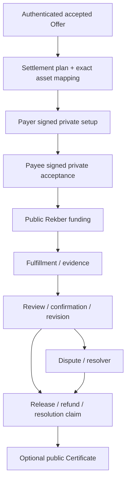
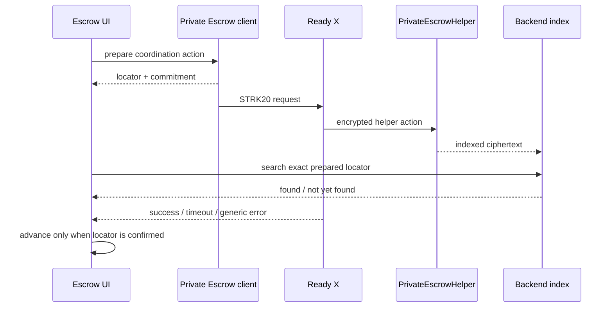
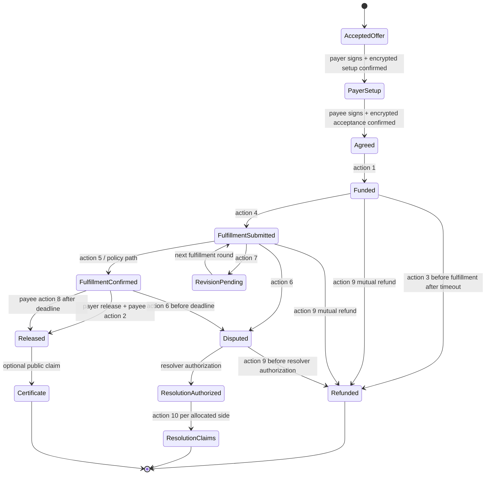
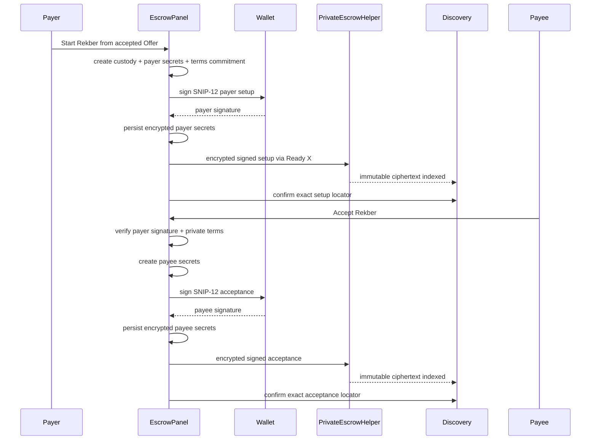
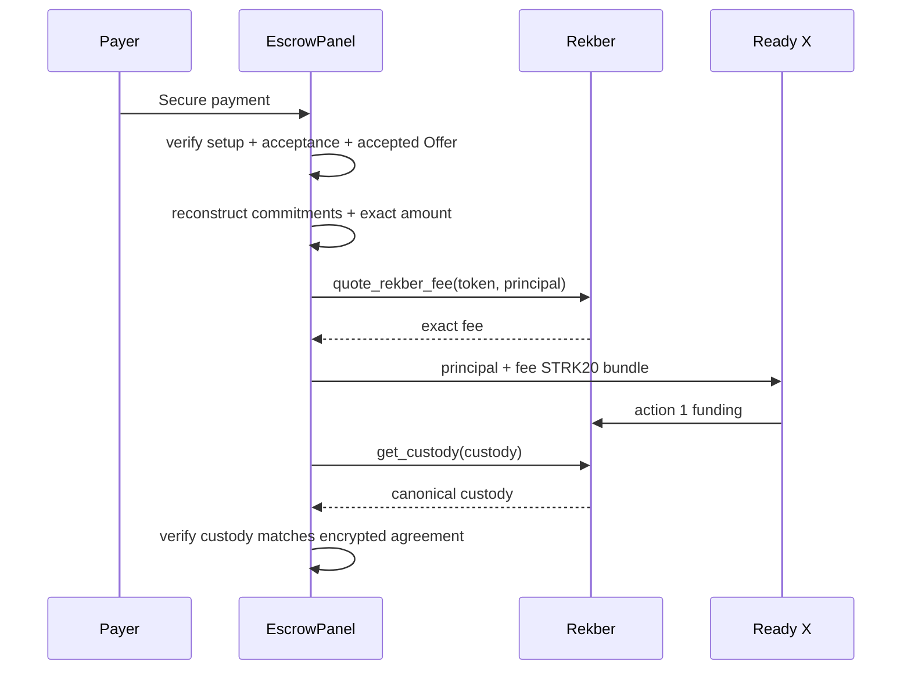
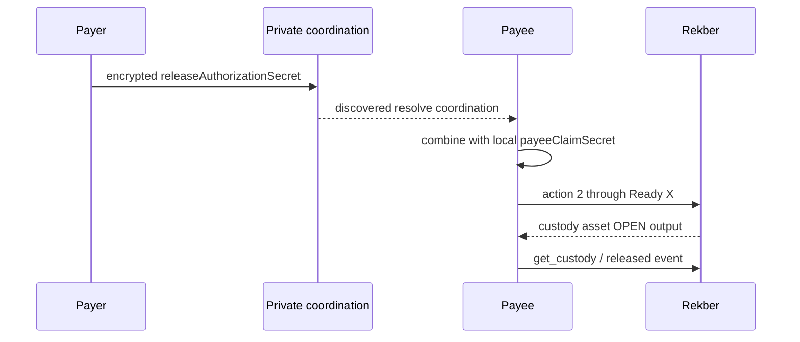
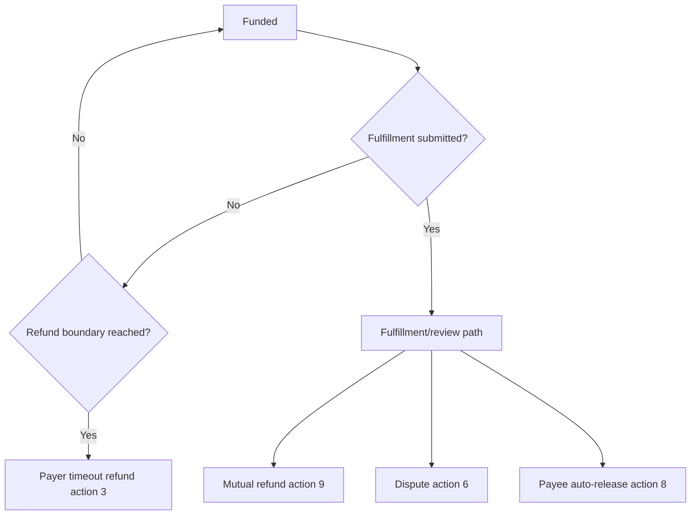
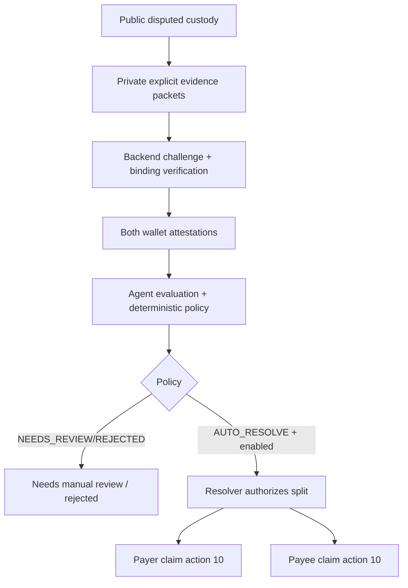
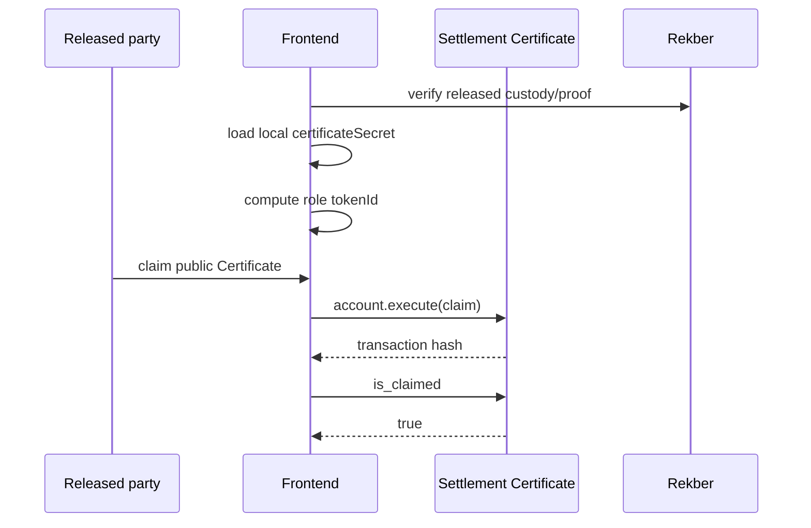
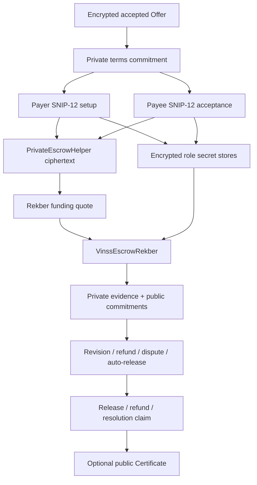

# VINSS Escrow Rekber

This document describes the current frontend Rekber architecture and lifecycle implemented on `main`.

`Rekber` is the canonical frontend name for the current VINSS two-party settlement flow.

The current system has two distinct layers:

```text
Private Escrow coordination
    encrypted peer-to-peer agreement / evidence / lifecycle coordination

VinssEscrowRekber
    public financial custody and canonical settlement state
```

These layers are related but must never be described as the same contract or the same state machine.

---

# Evidence Rule

This document describes current source behavior.

It does not freeze temporary deployment claims such as:

```text
Sepolia E2E pending
mainnet pending
certificate deployment pending
```

into architecture prose.

Use separate evidence records for:

```text
Implemented
Source-tested
Browser E2E verified
Sepolia verified
Mainnet verified
Production-hardened
```

---

# Objective

The Rekber frontend converts an authenticated accepted private Offer into a two-party custody workflow while keeping deal-specific business semantics outside the public custody contract.

Public Rekber receives generic settlement data such as:

```text
custody commitment
token
principal
service fee
capability commitments
refund/review/revision timing
fulfillment/dispute commitments
resolution allocations
lifecycle flags
timestamps
```

while deal-specific terms remain tied to encrypted Offer/coordination/evidence state.

---

# Current Source Map

Primary sources:

```text
frontend/components/room/escrow/EscrowPanel.tsx
frontend/components/room/escrow/RekberProtectionPanel.tsx
frontend/components/room/escrow/EscrowPricing.tsx

frontend/hooks/room/useRoomEscrow.ts
frontend/hooks/room/useRekberProtectionActions.ts
frontend/hooks/room/useDisputeAgentReview.ts

frontend/lib/deal-room/escrow.ts
frontend/lib/deal-room/escrowSettlement.ts
frontend/lib/deal-room/settlement.ts
frontend/lib/deal-room/settlementPlan.ts
frontend/lib/deal-room/rekberAuthorization.ts
frontend/lib/deal-room/rekberSecrets.ts
frontend/lib/deal-room/rekberProtection.ts
frontend/lib/deal-room/rekberEvidence.ts
frontend/lib/deal-room/rekberEvidenceChannel.ts
frontend/lib/deal-room/rekberView.ts
frontend/lib/deal-room/disputeAgent.ts

frontend/tests/escrow-offer-scenarios.test.ts
frontend/tests/rekber-protection.test.ts
frontend/tests/dispute-agent.test.ts
```

---

# High-Level Rekber Architecture



---


# Canonical Frontend Contract Configuration

The frontend currently uses one canonical Rekber contract environment variable:

```text
NEXT_PUBLIC_ESCROW_REKBER_ADDRESS
```

and one separate Certificate address:

```text
NEXT_PUBLIC_SETTLEMENT_CERTIFICATE_ADDRESS
```

The encrypted coordination helper is configured separately:

```text
NEXT_PUBLIC_PRIVATE_ESCROW_HELPER_ADDRESS
```

---


## Do Not Reintroduce V1/V2 Contract Naming

Current canonical contract naming is:

```text
VinssEscrowRekber
VinssSettlementCertificate
VinssPrivateEscrowHelper
```

`V2` in current frontend docs refers to encrypted envelope/domain versions such as:

```text
VINSS_PRIVATE_ESCROW_COMMIT_V2
```

not a second canonical Rekber contract.

---


# Accepted Offer Is the Entry Point

Rekber starts from an accepted structured Offer.

`buildEscrowOfferSnapshot()` rejects any Offer action whose kind is not:

```text
accept
```

and freezes:

```text
acceptedOfferLocator
termsOfferLocator
rootOfferLocator
dealType
asset
amount
paymentTerms
conditions
expiresAt
```

into the private settlement snapshot.

---


## Accepted Offer Must Be Authenticated

The room flow does not treat a locally optimistic ACCEPT as sufficient Rekber authority.

Before handoff, the accepted Offer is expected to have been rediscovered through the private Offer route.

Conceptually:

```text
local optimistic ACCEPT
    ↓
private Offer Discovery
    ↓
authenticated accepted Offer
    ↓
Rekber eligible
```

---


# One Accepted Offer → One Rekber Lifecycle

The room page checks existing encrypted `create` coordination records for the accepted Offer.

If a matching Rekber setup already exists:

```text
the same accepted Offer is not silently reused to create another Rekber lifecycle
```

Completed Rekber can remain visible as history, but a new Rekber should begin from another eligible accepted Offer.

---


# Settlement Role Assignment

Settlement payer/payee roles come from the root Offer.

Current `EscrowPanel` explicitly preserves:

```text
root Offer sender   -> payer
root Offer recipient -> payee
```

even if a later counter Offer changes terms.

That prevents a counter from silently swapping who funds Rekber.

---


# Settlement Plan

Current accepted Offers can carry an `OfferSettlementPlan`.

Plan version:

```text
REKBER_PLAN_VERSION = 1
```

Current fields include:

```text
payerAddress
payeeAddress
fulfillerAddress
beneficiaryAddress
fulfillmentType
verificationPolicy
reviewWindowSeconds
maxFulfillmentRounds
maxRevisionRounds
```

---


## Current Two-Party Invariant

Current frontend plan builder enforces:

```text
payer != payee
fulfiller = payee
beneficiary = payee
```

VINSS currently settles one principal between two wallets.

---


## Verification Policies

Current frontend policy codes:

| Policy | Code | Typical purpose |
|---|---:|---|
| `submission_review` | 1 | digital/service work reviewed through submission/revision flow |
| `counterparty_confirm` | 2 | physical/off-chain outcome requiring payer confirmation |
| `external_verify` | 3 | externally verified outcome |

Current default template behavior selects:

```text
goods, otc
    -> counterparty_confirm

freelance, digital_goods, bounty, nft, other
    -> submission_review
```

Source comments state no current Offer template automatically selects `external_verify` until an audited verifier adapter exists.

---


## Review Windows

Current default review windows:

| Deal type | Default |
|---|---:|
| goods | 24h |
| digital_goods | 24h |
| nft | 12h |
| otc | 1h |
| freelance | 72h |
| bounty | 72h |
| other | 72h |

Plan validation allows:

```text
1 minute .. 30 days
```

---


## Fulfillment / Revision Rounds

Current caps:

```text
REKBER_MAX_FULFILLMENT_ROUNDS = 8
REKBER_MAX_REVISION_ROUNDS = 7
```

`submission_review` defaults to more than one fulfillment round where possible.

`counterparty_confirm` uses zero revision rounds.

---


# Settlement Asset Mapping

Current frontend settlement assets:

| Asset | Decimals | Address source |
|---|---:|---|
| STRK | 18 | `NEXT_PUBLIC_STRK_ADDRESS` |
| USDC | 6 | `NEXT_PUBLIC_USDC_ADDRESS` |

Other asset symbols currently return `null` from the generic settlement mapper.

---


## Exact Amount Conversion

`parseSettlementAmount()` converts decimal strings with:

```text
string parsing
+
BigInt
```

and does not use JavaScript floating-point `Number` arithmetic.

This prevents accepted Offer amounts from silently losing precision before contract calldata.

---


## Current Mapping Tests

Current frontend source contains five accepted Offer → Rekber mapping scenarios:

```text
Freelance 500 USDC
NFT 200 USDC payment
Goods 100 USDC
Bounty 75 USDC
OTC 1000 STRK
```

The NFT scenario explicitly demonstrates:

```text
Rekber escrows the payment token
not the NFT itself
```

while NFT transfer conditions remain in private Offer terms.

---


# Private Escrow Coordination

`frontend/lib/deal-room/escrow.ts` owns encrypted Rekber coordination.

Current private envelope:

```text
PRIVATE_ESCROW_ENVELOPE_VERSION = 2
ESCROW_COMMITMENT_DOMAIN = VINSS_PRIVATE_ESCROW_COMMIT_V2
```

---


## Private Coordination Shape

Each private coordination action uses:

```text
fresh action locator
opaque sender tag
opaque recipient tag
AES-GCM ciphertext
Poseidon payload commitment
```

and is written through `VinssPrivateEscrowHelper`.

---


## Direct Pairwise Route

Current Rekber coordination between payer/payee derives the same base P-256 ECDH/HKDF direct key used by direct Chat/Offer.

`useRoomEscrow` builds both:

```text
incoming self route
outgoing peer route
```

for every known room participant.

---


# Private Coordination Discovery

Frontend requests:

```json
{ "kind": "escrow" }
```

from the backend.

The backend returns candidate ciphertext.

The frontend then:

```text
matches expected recipient tag
decrypts locally
binds decrypted sender to sender tag
validates encrypted recipient identity
filters to self <-> known peer
deduplicates by locator
sorts by block number
```

---


# Coordination Polling

`useRoomEscrow` refreshes encrypted coordination approximately every:

```text
1 second
```

while the Escrow view is active.

It also refreshes on browser focus/visibility resume.

---


# Coordination Recovery

Private Rekber coordination treats exact indexed locator proof as stronger than Ready X callback state.

Current flow:



---


## 45-Second Coordination Window

Current exact-locator confirmation loop runs for roughly:

```text
45 seconds
```

with approximately 1-second retry spacing.

---


## Explicit User Cancellation

An explicit wallet cancellation/rejection can fail immediately.

Other wallet errors are treated as potentially ambiguous until exact indexed state is checked.

---


## Wallet Success Still Is Not Enough

Even a wallet-success callback does not independently advance Rekber setup/accept.

`EscrowPanel` waits for the discovered setup/accept transaction proof.

---


# Coordination Fee Behavior

Current executable `escrow.ts` charges `quoteRekberWorkflowFee()` when:

```text
payload.kind === create
or
payload.kind === accept
or
payload.kind === dispute
```

Other coordination actions use:

```text
10 wei
```

for replay protection.

---


## Stale Source Comment Caveat

The same source file still contains a comment saying:

```text
Only the payer's Rekber Agreement/create action is revenue-bearing.
```

but the executable condition currently charges:

```text
create | accept | dispute
```

Executable behavior wins.

Treat the conflicting comment as stale source commentary until code/comments are reconciled.

---


# Current Rekber Workflow Fee

`quoteRekberWorkflowFee()` currently resolves the Rekber revenue FeePolicy relationship and then returns:

```text
3 STRK
```

as the selected frontend workflow charge.

This is separate from:

```text
Rekber funding fee
```

and separate from a direct `FeePolicy.quote_fee(4)` runtime amount.

---


# Wallet-Authenticated Agreement

Pairwise encryption alone cannot prove which of the two peers authored a decrypted payload because both peers know the symmetric direct key.

Current Rekber therefore adds SNIP-12 wallet signatures for:

```text
payer setup
payee acceptance
```

before funding.

---


## Coordination Version

Current signed coordination version:

```text
REKBER_COORDINATION_VERSION = 3
```

The signed typed-data domain is:

```text
name = VINSS Rekber
version = 3
revision = 1
chainId = SN_MAIN or SN_SEPOLIA
```

---


# Private Deal Terms Commitment

`computeDealTermsCommitment()` hashes a canonical JSON representation of the accepted Offer semantics with SHA-256 and reduces it into the Stark felt field.

Included data covers:

```text
Offer kind
parent/root locators
dealType
asset
amount
paymentTerms
conditions
expiresAt
sender/recipient
settlementPlan fields
```

---


## Why Deal Terms Commitment Exists

The payer/payee wallet signatures bind to the exact private Offer fields displayed in the UI without publishing those terms in the public Rekber contract.

---


# Payer Setup Signature

Payer setup typed data binds:

```text
custody commitment
accepted Deal locator
private terms commitment
payer address
payee address
release authorization commitment
refund commitment
payer confirmation commitment
payer dispute commitment
revision chain head
payer Certificate commitment
fulfillment deadline
```

---


# Payee Acceptance Signature

Payee acceptance typed data additionally binds:

```text
payee claim commitment
payee dispute commitment
refund consent commitment
fulfillment chain head
payee Certificate commitment
```

while repeating payer-side commitments from setup.

---


## Acceptance Verification

`verifyRekberAcceptance()` checks that setup/acceptance agree on:

```text
payer/payee role inversion
custody commitment
accepted Offer locator
deal terms commitment
refundAfter
```

before verifying the payee wallet signature.

---


# Two-Step Agreement UX

`EscrowPanel` deliberately separates:

```text
wallet typed-data signature
from
STRK20 encrypted coordination send
```

for both payer and payee.

This is important for Ready X/mobile wallet behavior and avoids coupling two wallet approvals into one ambiguous UI state.

---


# Payer Capability Secrets

Current payer-generated secrets:

```text
releaseAuthorizationSecret
refundSecret
payerConfirmationSecret
payerDisputeSecret
revisionChainSecrets[]
certificateSecret
```

Payer also publishes commitments/heads derived from these during setup.

---


# Payee Capability Secrets

Current payee-generated secrets:

```text
payeeClaimSecret
payeeDisputeSecret
payeeRefundConsentSecret
fulfillmentChainSecrets[]
certificateSecret
```

Payee publishes the corresponding commitments/chain head during acceptance.

---


# Secret Domains

Current commitment domains in `settlement.ts`:

```text
VINSS_RELEASE_AUTH
VINSS_PAYEE_CLAIM
VINSS_ESCROW_REFUND
VINSS_PAYER_CONFIRM
VINSS_PAYER_DISPUTE
VINSS_PAYEE_DISPUTE
VINSS_REFUND_CONSENT
VINSS_FULFILL_CHAIN
VINSS_REVISION_CHAIN
VINSS_CERT_CLAIM
VINSS_CERT_TOKEN
```

Changing these is a frontend/Cairo protocol compatibility change.

---


# Secret-Chain Limits

Generic secret-chain generation accepts:

```text
0 .. 8 rounds
```

Current settlement-plan limits then constrain:

```text
fulfillment <= 8
revision <= 7
revision < fulfillment
```

---


# Encrypted Local Rekber Secret Store

Current secret namespace:

```text
vinss:rekber-secrets:v2:<roomId>:<wallet>:<custody>
```

---


## Secret Store Protection

`rekberSecrets.ts` uses the shared encrypted local JSON helper with:

```text
room channelKey
```

to encrypt each wallet's local Rekber secret record.

---


## Stored Secret Record

Current stored record can contain:

```text
version = 2
custodyCommitment
role
role-specific settlement secrets
role-specific secret chains
certificateSecret
savedAt
```

---


## Important Scope Correction

The old document said secrets are stored in:

```text
encrypted local Rekber cache and encrypted direct coordination payloads
```

That is too broad.

Current local role-owned secrets are persisted in the encrypted local Rekber secret store.

Only the specific secret/preimage needed for a coordination step is sent through encrypted coordination when the workflow requires the counterparty to learn it.

Do not imply every private secret is copied into every coordination payload.

---


# Funding Preconditions

Current funding handler requires:

```text
connected wallet
accepted Offer
counterparty
custody commitment
payer setup action
payee acceptance action
local payer secrets
payer role
not already funded
valid settlement plan
supported settlement asset
all required commitments
both wallet signatures valid
deal terms commitments match current accepted Offer
```

---


# Funding Verification

Before calling `depositEscrow()`, the frontend recomputes:

```text
private deal terms commitment
setup signature validity
acceptance signature validity
token/amount mapping
settlement plan fields
all role capability commitments
```

Funding is blocked if signed coordination does not match the exact accepted Offer terms.

---


# Funding Fee

The old formula:

```text
fee = principal / 50
```

is no longer the correct frontend authority.

Current funding calls:

```text
quoteRekberFee(token, principal)
    ↓
VinssEscrowRekber.quote_rekber_fee(token, principal)
```

immediately before Ready X constructs the transaction.

---


## Economic Meaning

The canonical Rekber contract combines its current percentage service fee and FeePolicy-backed reserve/floor logic.

The frontend must not reproduce funding economics with a local `2%` formula.

---


# Funding Transaction

Current funding transaction:

```text
withdraw
    token = settlement asset
    amount = principal + quoted fee
    recipient = VinssEscrowRekber

transfer
    token = settlement asset
    amount = OPEN
    recipient = VINSS treasury

invoke
    contract = VinssEscrowRekber
    action = 1
    all funding commitments/plan parameters
    exact quoted fee
    wallet open-note placeholder
```

---


# Funding Payload

Current `action = 1` funding payload includes:

```text
custodyCommitment
releaseAuthorizationCommitment
payeeClaimCommitment
refundCommitment
payerConfirmationCommitment
payerDisputeCommitment
payeeDisputeCommitment
payeeRefundConsentCommitment
fulfillmentChainHead
revisionChainHead
payerCertificateCommitment
payeeCertificateCommitment
refundAfter
reviewWindow
verificationPolicy
fulfillmentRounds
revisionRounds
token
amount
fee
openNoteId
```

---


# Funding Confirmation

After funding, the frontend:

```text
stores the returned funding tx hash
refreshes canonical get_custody state
queries funded proof event
optionally sends encrypted fund_confirm coordination
```

`fund_confirm` is coordination convenience.

The canonical financial proof is the Rekber contract state/event.

---


# Canonical Custody Read

Frontend reads:

```text
get_custody(custodyCommitment)
```

directly through Starknet RPC.

Current parser maps 39 returned values.

---


## Current Public Custody Fields

Current frontend state includes:

```text
custodyCommitment
releaseAuthorizationCommitment
payeeClaimCommitment
refundCommitment
payerConfirmationCommitment
payerDisputeCommitment
payeeDisputeCommitment
payeeRefundConsentCommitment
fulfillmentChainHead
revisionChainHead
payerCertificateCommitment
payeeCertificateCommitment
token
amount
feeAmount
refundAfter
reviewWindow
reviewDeadline
revisionDeadline
verificationPolicy
fulfillmentRoundsRemaining
revisionRoundsRemaining
fulfillmentEvidenceCommitment
disputeEvidenceCommitment
resolutionCommitment
resolutionPayerAmount
resolutionPayeeAmount
fulfillmentSubmitted
fulfillmentConfirmed
revisionPending
disputed
resolutionAuthorized
resolutionPayerClaimed
resolutionPayeeClaimed
consumed
refunded
createdAt
fulfilledAt
settledAt
```

---


# Custody Verification Against Private Agreement

`EscrowPanel` does not accept any loaded custody as valid merely because the commitment exists.

It reconstructs expected private-agreement values and checks public custody against:

```text
all role commitments
settlement token
exact base-unit amount
refundAfter
reviewWindow
verificationPolicy
remaining round constraints
```

before treating the custody as funded/valid for the current encrypted agreement.

---


## Mismatch Handling

If custody exists but does not match the reconstructed encrypted agreement:

```text
custodyMismatch = true
```

and the UI does not treat it as a normal verified funded state.

Current code also checks whether a locally owned refund secret matches public refund commitment to determine whether recovery may still be possible.

---


# Canonical Authority

For financial truth:

```text
VinssEscrowRekber contract state
    >
encrypted coordination interpretation
    >
local optimistic state
```

---


# Rekber Action Numbers

Current frontend action encoding:

| Action | Number |
|---|---:|
| fund | 1 |
| release | 2 |
| refund | 3 |
| submit fulfillment | 4 |
| confirm fulfillment | 5 |
| dispute | 6 |
| request revision | 7 |
| auto-release | 8 |
| mutual refund | 9 |
| resolution claim | 10 |

These are frontend/Cairo protocol values.

Contract source remains the final invariant authority.

---


# Release Flow

Current normal successful release is two-capability.

Roles:

```text
payer owns releaseAuthorizationSecret
payee owns payeeClaimSecret
```

---


## Payer Release Authorization

After fulfillment has been confirmed and no revision/dispute blocks release, payer sends:

```text
releaseAuthorizationSecret
```

to payee through encrypted Private Escrow `resolve` coordination.

---


## Payee Claim

Payee then calls `releaseEscrow()` using:

```text
releaseAuthorizationSecret
+
local payeeClaimSecret
```

Current public Rekber action:

```text
2
```

---


## Private Output

`invokeSettlement()` asks the wallet to create an OPEN note for the custody token and passes the wallet placeholder into the Rekber invocation.

Principal output therefore follows the STRK20 wallet/open-note path.

---


# Timeout Refund

Current simple `refundEscrow()` uses:

```text
custodyCommitment
refundSecret
```

with Rekber action:

```text
3
```

---


## Frontend Timeout Guard

`canTimeoutRefundRekber()` allows the UI path only when:

```text
refund boundary reached
custody exists
not consumed
not disputed
fulfillment not submitted
```

---


## Important Refund Correction

The old document said:

```text
at or after refund boundary payer can refund
```

without mentioning fulfillment state.

Current protection model specifically prevents the simple timeout-refund UX after fulfillment has been submitted.

After fulfillment, mutual refund/dispute/review flows govern the outcome.

---


# Service Fee Refund Boundary

Current UI explicitly states:

```text
The VINSS service fee paid during funding is non-refundable and is separate from the principal refund or resolution split.
```

Therefore:

```text
principal refund
!=
service-fee refund
```

---


# Fulfillment Submission

Payee submits fulfillment through action:

```text
4
```

using:

```text
custodyCommitment
fulfillment chain secret
evidenceCommitment
```

Current implementation charges the Rekber workflow fee for Submit Work.

---


# Fulfillment Evidence

Private business evidence can include:

```text
note
file
tracking
other application-specific evidence
```

through encrypted/direct channels.

Only an opaque evidence commitment is placed into public Rekber state.

---


# Counterparty Confirmation

For `counterparty_confirm` policy, payer can confirm fulfillment using action:

```text
5
```

with:

```text
payerConfirmationSecret
evidenceCommitment
```

Current executable frontend charges the Rekber workflow fee for confirmation.

---


# Submission Review

For `submission_review`, review approval/rejection can also be an intentionally off-chain encrypted decision while `chargeRekberWorkflowAction()` collects the configured workflow fee.

That helper performs a fee withdrawal without changing custody state.

---


# Revision Request

Current revision request uses action:

```text
7
```

with:

```text
custodyCommitment
revision chain secret
reasonCommitment
```

and currently charges the Rekber workflow fee.

---


# Dispute Open

Current public dispute action:

```text
6
```

takes:

```text
custodyCommitment
role
role-specific dispute secret
evidenceCommitment
```

---


## Dispute Privacy

Only the evidence commitment reaches public custody.

Plaintext:

```text
reason
files
tracking
screenshots
business evidence
```

can remain encrypted/off-chain unless explicitly disclosed to the dedicated Dispute Agent.

---


## Dispute Workflow Fee

Current executable settlement frontend charges the Rekber workflow fee when `openRekberDispute()` calls the public state transition.

Encrypted private `dispute` coordination is also currently classified as fee-bearing by `escrow.ts`.

These are separate actions and should not be assumed to collapse into one transaction unless the specific call path bundles them.

---


# Dispute Agent

Dedicated Dispute Agent is a separate explicit disclosure and attestation workflow.

Current flow can include:

```text
payer evidence packet
payee evidence packet
accepted Offer terms
original Rekber Agreement binding
backend challenge
both wallet typed-data signatures
backend evaluation
deterministic policy
optional resolver authorization
```

---


## AutoResolve Authority

The normal frontend Agent does not own a resolver signer.

However, the backend may use a dedicated resolver signer when:

```text
AutoResolve is configured
and
policy is AUTO_RESOLVE
and
the case is eligible
```

before authorizing public Rekber resolution state.

---


# Auto Release

Payee protection against payer silence uses action:

```text
8
```

with:

```text
payeeClaimSecret
```

Current UI predicate requires:

```text
role = payee
not consumed
not disputed
fulfillment submitted
fulfillment confirmed
no revision pending
reviewDeadline > 0
now >= reviewDeadline
```

---


# Dispute Deadline Boundary

Current frontend protection logic intentionally treats:

```text
now < reviewDeadline
```

as the dispute-open window after confirmation.

At exactly:

```text
now == reviewDeadline
```

the frontend makes dispute unavailable and auto-release eligible.

This mirrors the intended Cairo boundary.

---


# Mutual Refund

Current bilateral refund path uses action:

```text
9
```

and requires:

```text
payer refundSecret
+
payee payeeRefundConsentSecret
```

---


## Current Mutual Refund UX Roles

Current pure guards model:

```text
payee -> authorize refund consent
payer -> complete mutual refund
```

Mutual refund can remain open before or after fulfillment and even while disputed, until resolver authorization closes that path.

---


# Resolution Claim

After resolver authorization, each party independently claims only its allocated amount through action:

```text
10
```

using the capability committed for that role.

---


## Resolution Guard

`canClaimRekberResolution()` requires:

```text
role exists
custody not consumed
disputed
resolutionAuthorized
role-specific amount > 0
role-specific claim not already completed
```

---


## Resolution Workflow Fee

Current `claimRekberResolution()` invokes `invokeSettlement(..., chargeRevenue=true)`.

That means the Ready X transaction:

```text
charges workflow revenue in STRK
and
returns the custody asset share through the OPEN note
```

in the same private wallet transaction.

---


# Public Rekber Proofs

`getRekberProof()` queries Starknet events directly.

Supported proof kinds:

```text
funded
released
refunded
resolved
```

Current event names:

```text
EscrowRekberCustodyFunded
EscrowRekberCustodyReleased
EscrowRekberCustodyRefunded
EscrowRekberCustodyResolved
```

---


# Settlement Outcome Classification

Current Escrow UI derives:

```text
settled = funded && custody.consumed

resolved = settled && resolutionAuthorized

refunded = settled && !resolved && refunded

released = settled && !resolved && !refunded
```

---


# Settlement Certificate

Certificate is an optional public credential after eligible successful settlement.

Current frontend supports:

```text
compute certificate claim commitment
compute deterministic role-specific token ID
claim
is_claimed
get_certificate
```

---


## Public Claim Path

Certificate claim intentionally uses:

```text
account.execute
```

directly against the Settlement Certificate contract.

It does not use the STRK20 private helper transaction path.

---


## Role-Specific Claim

Each role has its own:

```text
certificateSecret
certificateCommitment
deterministic token ID
```

so one party cannot mint the other party's acknowledgement.

---


## Certificate Record

Current public frontend record includes:

```text
tokenId
custodyCommitment
role
recipient
settledAt
issuedAt
```

---


## Certificate Privacy Warning

Current UI explicitly warns:

```text
claiming links the wallet and role to custody proof
token, amount, and timing can be correlated
private conversation and Offer terms remain hidden
```

Certificate ownership is intentionally public.

---


# Certificate Availability

Current Escrow UI exposes Certificate claim only after the normal `released` outcome.

Do not infer from the low-level Certificate API that every refund/resolution outcome is necessarily claimable through the current primary UI.

---


# Rekber State Polling

Current `EscrowPanel` polls:

```text
get_custody
about every 1 second
```

for the active custody.

If custody is funded/settled, it also refreshes public proof transaction hashes.

---


## Certificate Polling

After a released outcome, Certificate claimed state is polled approximately every:

```text
5 seconds
```

to recover delayed RPC/transaction callbacks.

---


# Ready X Action Locks

`EscrowPanel` tracks a single current high-level pending Rekber action:

```text
setup
accept
fund
release
claim
refund
certificate
```

with a ref-backed guard.

---


## Late Callback Guard

An older delayed Ready X callback cannot unlock a newer Rekber action because `finishRekberAction()` only clears state if the pending action still matches.

---


## State-Based Unlock

If chain/index evidence proves completion first, the panel releases the UI without waiting forever for wallet callback.

Examples:

```text
setup -> discoveredCreate tx proof
accept -> discoveredAccept tx proof
fund -> verified canonical custody
release authorization -> discovered resolve coordination
claim -> released custody state
refund -> refunded custody state
certificate -> is_claimed
```

---


# Setup State Reset

When accepted Offer or wallet changes, the panel resets local:

```text
custody
secrets
coordination fallbacks
proof tx hashes
Certificate state
pending setup/accept state
action locks
```

to avoid cross-deal state contamination.

---


# Coordination Authority

For setup/accept:

```text
indexed Starknet encrypted coordination
    >
local coordination fallback
```

Local state is explicitly documented in source as an optimistic fallback.

---


# Public Custody Authority

For funding/settlement:

```text
direct Rekber contract state
    >
backend read model
    >
encrypted coordination
    >
local panel state
```

---


# Fee Architecture

Rekber currently has multiple economic paths.

| Path | Current amount source |
|---|---|
| Funding | `quote_rekber_fee(token, principal)` |
| Private setup/accept/dispute coordination | `quoteRekberWorkflowFee()` executable branch |
| Background coordination | 10 wei replay protection |
| Submit fulfillment | `quoteRekberWorkflowFee()` |
| Confirm fulfillment | `quoteRekberWorkflowFee()` |
| Revision request | `quoteRekberWorkflowFee()` |
| Public dispute open | `quoteRekberWorkflowFee()` |
| Off-chain review charge | `quoteRekberWorkflowFee()` |
| Resolution claim | `quoteRekberWorkflowFee()` + custody output |
| Release/refund/auto-release/mutual-refund | no workflow revenue in `invokeSettlement` unless charge flag set |

---


## 3 STRK Workflow Amount

Current frontend workflow fee helper returns:

```text
3 STRK
```

after validating the Rekber revenue FeePolicy relation.

This is current application policy, not a generic on-chain truth that should be copied into Cairo economics docs.

---


# Funding Fee vs Workflow Fee

Never conflate:

```text
Rekber funding fee
    token/principal aware
    contract quoted

Rekber workflow fee
    current frontend application fee
    charged in configured STRK OpenNote token
```

---


# Principal vs Service Fee

Current contract/UI model separates:

```text
principal
service fee
```

Funding locks principal + fee.

Refund/resolution semantics operate on principal according to Rekber rules.

The funding service fee is non-refundable.

---


# Privacy Boundary — Private

Private/application-local data includes:

```text
accepted Offer business terms
dealTermsCommitment source material
pairwise coordination plaintext
wallet setup/accept signatures before encrypted transport
unused role capability preimages
work evidence plaintext
review notes
revision reason plaintext
dispute reason/evidence plaintext unless explicitly disclosed
```

---


# Privacy Boundary — Public

Public Rekber data includes:

```text
token
principal
fee
refund/review/revision timing
verification policy
capability commitments
secret-chain heads/current state
fulfillment evidence commitment
dispute evidence commitment
resolution commitment
resolution allocations
lifecycle flags
timestamps
used preimages when revealed in transaction calldata
transaction timing
Certificate recipient/role if claimed
```

---


# Used Preimages

Capability privacy is pre-use privacy.

When a settlement action reveals a preimage in transaction calldata, that used secret becomes observable as part of the public/private-wallet transaction data available on-chain according to the STRK20 invocation semantics.

Do not claim settlement preimages remain forever secret after use.

---


# Private Escrow Helper Is Not Custody

This is the most important conceptual boundary:

```text
VinssPrivateEscrowHelper
    stores encrypted coordination records
    does not hold principal

VinssEscrowRekber
    holds/settles principal
    owns financial invariants
```

---


# UI Guards Are Not Security Authority

`rekberProtection.ts` contains pure frontend predicates intended to mirror Cairo guards.

They improve UX by hiding/blocking invalid actions.

They do not replace contract checks.

---


# Current Protection Source Tests

`frontend/tests/rekber-protection.test.ts` contains six source cases:

```text
1. timeout refund only before fulfillment
2. counterparty-confirm requires payer confirmation
3. dispute before review deadline
4. payee auto-release after review deadline
5. authorized resolution split claim rules
6. mutual refund role rules
```

These are source/logic tests.

They are not browser wallet E2E evidence.

---


# Current Offer Mapping Source Tests

`frontend/tests/escrow-offer-scenarios.test.ts` contains five source scenarios.

They validate:

```text
accepted-only mapping
STRK/USDC asset resolution
exact decimal conversion
private business terms retained in snapshot
generic public settlement amount/token
```

---


# Dispute Frontend Source Test

`frontend/tests/dispute-agent.test.ts` adds one frontend case around dedicated arbitration case privacy/binding.

Current total frontend source inventory relevant to these docs includes:

```text
5 Offer -> Rekber scenarios
6 protection cases
1 Dispute case
```

or:

```text
12 source test(...) cases across three frontend test files
```

Do not write `12 passed` unless an actual current execution produced it.

---


# Rekber State Machine



---


# Agreement Sequence



---


# Funding Sequence



---


# Release Sequence



---


# Refund / Protection Flow



---


# Dispute / Resolution Flow



---


# Certificate Sequence



---


# Recovery Hierarchy

Different Rekber stages use different strongest evidence:

| Stage | Recovery / authority |
|---|---|
| payer setup | exact indexed encrypted `create` locator |
| payee acceptance | exact indexed encrypted `accept` locator |
| funding | canonical `get_custody` + funded proof |
| release authorization | encrypted `resolve` locator |
| final release | canonical consumed/nonrefunded/nonresolved custody + released proof |
| timeout/mutual refund | canonical refunded custody + refund proof |
| resolver state | canonical resolutionAuthorized + allocations |
| resolution claim | canonical role-specific claim flags |
| Certificate | `is_claimed` / Certificate contract |

---


# Failure Classes

| Failure | Meaning | Expected frontend response |
|---|---|---|
| accepted Offer missing | no valid private deal source | block Rekber |
| settlement plan missing | Offer not production-ready for Rekber | block setup/funding |
| peer identity missing | pairwise coordination unavailable | wait/sync |
| signature invalid | agreement authorship mismatch | block funding |
| deal terms mismatch | signed agreement differs from accepted Offer | block funding |
| unsupported asset | no STRK/USDC settlement mapping | block funding |
| Fee quote failure | economics/config invalid | block Ready X |
| wallet explicit rejection | user cancelled | fail action |
| wallet timeout after prepared coordination | ambiguous | reconcile exact locator |
| indexed coordination missing after recovery window | not confirmed | stop/ask sync before retry |
| custody mismatch | public state differs from encrypted agreement | do not treat as verified funded state |
| RPC unavailable | canonical custody unavailable | do not infer state from local UI |
| Certificate RPC lag | claim may be accepted but read delayed | continue polling |

---


# Security Invariants

| ID | Invariant |
|---|---|
| `R1` | Rekber begins from an authenticated accepted Offer. |
| `R2` | Root Offer fixes payer/payee roles. |
| `R3` | Private deal terms are committed and wallet-signed before funding. |
| `R4` | Payer setup and payee acceptance use coordination version 3. |
| `R5` | Pairwise encryption alone is not used as wallet authorship proof. |
| `R6` | Role capability secrets are generated locally and public state receives commitments. |
| `R7` | Funding requires both valid wallet signatures. |
| `R8` | Funding amount uses exact STRK/USDC BigInt conversion. |
| `R9` | Funding fee comes from Rekber quote_rekber_fee. |
| `R10` | Private Escrow Helper never becomes custody authority. |
| `R11` | Canonical financial state comes from VinssEscrowRekber. |
| `R12` | Frontend verifies public custody against encrypted agreement. |
| `R13` | Simple timeout refund is unavailable after fulfillment submission. |
| `R14` | Dispute opens with role-specific capability and public evidence commitment. |
| `R15` | Auto-release is only after confirmed fulfillment and review deadline. |
| `R16` | Mutual refund requires payee consent + payer completion. |
| `R17` | Resolution claim is role/allocation specific. |
| `R18` | UI protection predicates do not replace Cairo checks. |
| `R19` | Funding service fee is separate from refundable principal. |
| `R20` | Certificate claim is optional and public. |


# Privacy Invariants

| ID | Invariant |
|---|---|
| `P1` | Accepted Offer business semantics do not become public Rekber plaintext. |
| `P2` | Private coordination uses direct pairwise encryption. |
| `P3` | Normal backend `/discover` receives ciphertext candidates, not pairwise key. |
| `P4` | Unused capability preimages remain client-side/encrypted. |
| `P5` | Work/dispute evidence plaintext stays off-chain unless explicitly disclosed. |
| `P6` | Only opaque evidence commitments need reach public custody. |
| `P7` | Used preimages may become observable after use. |
| `P8` | Certificate ownership is intentionally public. |
| `P9` | Local Rekber secret store is encrypted with room channelKey. |
| `P10` | Dedicated Dispute is an explicit plaintext trust-boundary transition. |


# Economic Invariants

| ID | Invariant |
|---|---|
| `E1` | Do not hardcode funding fee as principal/50 in frontend docs. |
| `E2` | Funding calls quote_rekber_fee immediately before transaction construction. |
| `E3` | Current selected workflow fee is 3 STRK frontend policy. |
| `E4` | Funding fee and workflow fee are separate concepts. |
| `E5` | Service fee is non-refundable. |
| `E6` | Resolution split operates on principal allocation, not fee refund. |
| `E7` | Treasury/OpenNote configuration must match deployed contracts. |


# Incorrect Statements to Avoid

- Rekber fee is always principal / 50 in the frontend.
- Private Escrow Helper holds the deal funds.
- Payer owns only release/refund/certificate secrets.
- Payee owns only claim/certificate secrets.
- Refund is always available after refundAfter regardless of fulfillment.
- Release can happen immediately after funding without fulfillment state.
- Pairwise encryption alone proves which wallet authored setup.
- Setup/accept wallet callback success is enough to advance the agreement.
- One accepted Offer can be reused for another Rekber after the first settles.
- Settlement Certificate is private.
- Certificate is automatically minted.
- Agent never has any possible resolution authority under any configuration.
- All dispute evidence is public on-chain.
- All Rekber coordination actions have the same fee.
- Current source comment always overrides executable fee condition.


# Accurate Statements

- Rekber starts from an authenticated accepted direct Offer.
- Payer/payee wallet signatures bind the exact private Offer terms before funding.
- Private coordination uses VinssPrivateEscrowHelper; custody uses VinssEscrowRekber.
- Current settlement assets are STRK and USDC.
- Funding fee is contract-quoted.
- Frontend verifies canonical custody against private agreement commitments.
- Timeout refund is a pre-fulfillment protection path.
- Fulfillment, confirmation, revision, dispute, auto-release, mutual refund, and resolution claims are current frontend paths.
- Dedicated Dispute Agent is separate from normal Agent.
- Settlement Certificate is optional public evidence.


# Payer Setup Checklist

- [ ] Accepted Offer is authenticated.
- [ ] Wallet matches root Offer payer.
- [ ] Counterparty identity is available.
- [ ] Settlement plan exists and validates.
- [ ] Refund window is between 1 hour and 30 days in current EscrowPanel UI.
- [ ] Custody commitment generated once.
- [ ] Payer role secrets generated.
- [ ] Deal terms commitment recomputed.
- [ ] Payer setup typed data matches displayed terms.
- [ ] Wallet signature collected.
- [ ] Secrets persisted encrypted before coordination send.
- [ ] Encrypted `create` coordination exact locator confirmed.


# Payee Acceptance Checklist

- [ ] Wallet matches root Offer payee.
- [ ] Payer setup exact locator is discovered.
- [ ] Payer setup signature verifies.
- [ ] Deal terms commitment matches accepted Offer.
- [ ] Payee role secrets generated.
- [ ] Acceptance includes all payee commitments.
- [ ] Payee typed data includes payer setup commitments.
- [ ] Wallet signature collected.
- [ ] Secrets persisted encrypted before coordination send.
- [ ] Encrypted `accept` exact locator confirmed.


# Funding Checklist

- [ ] Both coordination records are version 3.
- [ ] Both signatures verify.
- [ ] Both terms commitments match accepted Offer.
- [ ] Supported STRK/USDC token configured.
- [ ] Exact base-unit amount parsed.
- [ ] All payer/payee commitments nonzero/valid as required.
- [ ] reviewWindow/verification policy/rounds sourced from settlement plan.
- [ ] quote_rekber_fee returns positive exact fee.
- [ ] Treasury configured.
- [ ] Ready X withdraw amount is principal + fee.
- [ ] Canonical get_custody appears after funding.
- [ ] Custody reconstruction matches encrypted agreement.


# Release Checklist

- [ ] Custody is verified/funded.
- [ ] Fulfillment is confirmed.
- [ ] No revision pending.
- [ ] No dispute open.
- [ ] Payer has local releaseAuthorizationSecret.
- [ ] Payee has local payeeClaimSecret.
- [ ] Payer resolve coordination exact locator confirmed.
- [ ] Payee claim uses action 2.
- [ ] Canonical custody becomes consumed/released.
- [ ] Released event proof available.


# Refund Checklist

- [ ] Custody exists and matches agreement.
- [ ] Simple timeout path only before fulfillment submission.
- [ ] Refund boundary reached for action 3.
- [ ] Payer refund secret matches public commitment.
- [ ] Mutual refund path uses payee consent secret + payer refund secret.
- [ ] Resolver authorization has not closed mutual-refund path.
- [ ] Canonical custody indicates refunded.
- [ ] Service fee remains non-refundable.


# Fulfillment / Revision Checklist

- [ ] Role/policy permits the action.
- [ ] Correct next chain secret selected.
- [ ] Evidence/reason commitment is nonzero.
- [ ] Private evidence is stored/exchanged separately.
- [ ] Public transition uses expected action number.
- [ ] Remaining rounds are re-read from canonical custody.
- [ ] Revision chain/fulfillment chain heads are not assumed static after rounds advance.


# Dispute Checklist

- [ ] Fulfillment has been submitted when required by current guard.
- [ ] Current review deadline still allows dispute.
- [ ] Role-specific dispute secret exists.
- [ ] Private evidence is prepared.
- [ ] Public evidence commitment computed.
- [ ] Action 6 succeeds.
- [ ] Canonical custody reports disputed.
- [ ] Dedicated Agent disclosure is opt-in and separate.
- [ ] Both wallet attestations target the same dispute case before evaluation.
- [ ] Policy result is distinguished from execution result.


# Certificate Checklist

- [ ] Settlement Certificate address configured.
- [ ] Current primary UI outcome is released.
- [ ] Role known.
- [ ] Role-specific certificateSecret available.
- [ ] Token ID computed for custody+role.
- [ ] User understands public linkability.
- [ ] Direct account.execute claim submitted.
- [ ] is_claimed confirms state.
- [ ] Certificate record matches expected custody/role/recipient.


# Mainnet Verification Checklist

- [ ] Frontend Git SHA recorded.
- [ ] Mainnet frontend deployment identified.
- [ ] Mainnet backend deployment identified.
- [ ] Mainnet Rekber address independently verified.
- [ ] Mainnet Private Escrow Helper verified.
- [ ] Mainnet Settlement Certificate verified if enabled.
- [ ] STRK/USDC token identities verified.
- [ ] Treasury verified.
- [ ] Current funding quote sampled.
- [ ] Current workflow fee behavior reviewed.
- [ ] Two-wallet signed setup/accept tested.
- [ ] Funding canonical custody verified.
- [ ] Successful release path verified.
- [ ] Required refund path verified.
- [ ] Required dispute/resolution path verified if launch scope.
- [ ] Certificate claim verified if launch scope.
- [ ] No Sepolia fallback remains in production config.


# Testing Scope

Current frontend Rekber-specific automated coverage is targeted.

Available source-level commands include:

```bash
npm run test:escrow-scenarios
npm run test:rekber-protection
npm run test:dispute-agent
```

These do not prove:

```text
Ready X wallet compatibility
two-wallet E2E
RPC/provider behavior
Vercel env correctness
Sepolia transaction success
mainnet transaction success
```

---


# Recommended E2E Scenarios

- Payer signs setup; payee sees exact discovered setup.
- Payee signs acceptance; payer sees exact discovered acceptance.
- Funding blocked if one signature/terms commitment mismatches.
- Funding creates custody matching accepted Offer.
- Submit fulfillment consumes next chain secret.
- Payer confirmation starts correct review state.
- Revision request advances bounded round state.
- Payer release authorization reaches payee privately.
- Payee release claim settles principal.
- Timeout refund works only before fulfillment.
- Mutual refund works after bilateral consent.
- Dispute cannot open after auto-release deadline boundary.
- Payee auto-release works at/after review deadline.
- Resolver split enables only allocated role claims.
- Certificate claim is role-specific and public.
- Ready timeout after coordination is recovered by exact locator.
- Late callback cannot unlock a newer Rekber action.


# Current Known Caveats

| Caveat | Current implication |
|---|---|
| Fee comment inconsistency | `escrow.ts` comment says only payer create is revenue-bearing, executable condition charges create/accept/dispute. |
| Workflow fee policy split | Selected workflow fee is currently frontend-defined 3 STRK after revenue-policy validation. |
| Source tests are not E2E | Five mapping + six protection + one dispute source cases are logic evidence only. |
| Frontend orchestration concentration | EscrowPanel still owns much of production transaction sequencing; refactors are intentionally conservative. |
| Local secret protection depends on room key | Rekber secret records are encrypted application storage, not secure enclave storage. |
| Public settlement metadata | Token, amount, timing, commitments, lifecycle state and used preimages are observable. |
| Certificate linkability | Claim intentionally makes wallet/role/custody relationship public. |
| RPC polling | Active custody refresh currently polls around every 1s. |
| Coordination backend dependency | Private setup/accept/evidence synchronization depends on ciphertext index availability. |


# Source Responsibility Matrix

| Source | Responsibility |
|---|---|
| `EscrowPanel.tsx` | Production Rekber orchestration, role derivation, setup/accept/fund/release/refund/certificate UI |
| `useRoomEscrow.ts` | Pairwise encrypted coordination discovery/send/recovery |
| `escrow.ts` | Private Escrow V2 envelope/helper path |
| `escrowSettlement.ts` | Accepted Offer -> STRK/USDC exact settlement mapping |
| `settlementPlan.ts` | Role/policy/review/round plan |
| `rekberAuthorization.ts` | SNIP-12 setup/accept commitments/signatures/verification |
| `rekberSecrets.ts` | Encrypted role-secret persistence |
| `settlement.ts` | Custody actions, commitments, reads, proofs, Certificate |
| `rekberProtection.ts` | Pure UI guard predicates |
| `rekberEvidenceChannel.ts` | Private work evidence/review storage channel |
| `disputeAgent.ts` | Explicit arbitration case/binding API |


# Authority Matrix

| Question | Current authority |
|---|---|
| Accepted deal semantics | Authenticated decrypted Offer |
| Payer/payee role | Root Offer settlement plan / root sender-recipient |
| Setup authorship | Payer SNIP-12 signature |
| Acceptance authorship | Payee SNIP-12 signature |
| Private coordination existence | PrivateEscrowHelper immutable action / indexed locator |
| Funding fee | VinssEscrowRekber.quote_rekber_fee |
| Financial custody state | VinssEscrowRekber.get_custody |
| Fulfillment/dispute public state | VinssEscrowRekber |
| Private work/dispute narrative | Encrypted application evidence |
| Dispute policy result | Dedicated backend Dispute pipeline |
| Resolution authorization | Rekber resolver/contract state |
| Certificate ownership | Settlement Certificate contract |


# Data Classification Matrix

| Data | Classification | Location |
|---|---|---|
| Offer paymentTerms/conditions | Private | Encrypted Offer |
| dealTermsCommitment | Private coordination commitment value | Encrypted coordination/signature input |
| custodyCommitment | Public-ish opaque identifier | Coordination + public Rekber |
| token | Public | Rekber |
| principal | Public | Rekber |
| feeAmount | Public | Rekber |
| releaseAuthorizationSecret before use | Private | Payer local / encrypted release coordination when authorized |
| payeeClaimSecret before use | Private | Payee local |
| refundSecret before use | Private | Payer local |
| dispute secrets before use | Private | Role local |
| fulfillment/revision chain secrets | Private | Role local |
| Certificate secret before use | Private | Role local |
| evidenceCommitment | Public | Rekber |
| evidence plaintext | Private until explicit disclosure | Encrypted direct/dispute flow |
| resolution allocation | Public | Rekber |
| Certificate recipient | Public | Certificate contract |


# Recovery Matrix

| Stage | Recovery evidence | Current mechanism |
|---|---|---|
| Payer setup | exact encrypted locator | ~45s coordination loop |
| Payee acceptance | exact encrypted locator | ~45s coordination loop |
| Funding | get_custody + funded event | ~1s custody polling in active panel |
| Release authorization | encrypted resolve action | coordination polling |
| Final release | canonical custody + released event | contract polling |
| Refund | canonical refunded state + event | contract polling |
| Resolution | canonical resolution state/claim flags | contract polling |
| Certificate | is_claimed | ~5s post-release polling |


# Protocol Compatibility Boundaries

Changes to these require cross-layer review with Cairo and existing private state:

```text
Rekber action numbers
commitment domains
coordination version
typed-data fields/domain
deal terms canonicalization
custody struct field order
secret-chain domains
settlement-plan policy codes
STRK/USDC decimals
private Escrow V2 commitment shape
Certificate claim/token domains
```

---


# EscrowPanel Refactor Boundary

Current source explicitly states that `EscrowPanel` still orchestrates production:

```text
signing
coordination
funding
release
refund
certificate
```

and those handlers should only be moved after behavior tests remain green.

This is intentional technical debt containment, not an invitation to refactor during unrelated UI/documentation work.

---


# Documentation Maintenance Rules

- Read current `settlement.ts` before documenting action numbers or capability sets.
- Read `feePolicy.ts` before documenting Rekber fees.
- Never replace contract quote with `principal / 50` prose.
- Keep Private Escrow coordination and public custody in separate sections.
- Keep root Offer role assignment explicit.
- Keep signed Agreement coordination version current.
- Keep source comments secondary to executable behavior when they conflict.
- Do not describe source tests as E2E.
- Do not freeze Sepolia/mainnet status without dated evidence.
- Do not rename canonical Rekber back to V1/V2.
- Do not expose unused secrets in examples.
- Do not modify working transaction sequencing during docs-only cleanup.


# Source-of-Truth Order

```text
1. canonical Cairo VinssEscrowRekber invariants
2. frontend/components/room/escrow/EscrowPanel.tsx
3. frontend/hooks/room/useRoomEscrow.ts
4. frontend/lib/deal-room/settlement.ts
5. frontend/lib/deal-room/rekberAuthorization.ts
6. frontend/lib/deal-room/settlementPlan.ts
7. frontend/lib/deal-room/escrowSettlement.ts
8. frontend/lib/deal-room/escrow.ts
9. frontend/lib/deal-room/rekberSecrets.ts
10. frontend/lib/deal-room/rekberProtection.ts
11. frontend/tests/* Rekber-related cases
12. deployed contract/config values
13. live two-wallet transaction/state evidence
14. prose documentation
```


# Release Evidence Template

```text
Feature: Rekber
Git SHA:
Frontend deployment:
Backend deployment:
Network:
Date:

Payer wallet:
Payee wallet:
Wallet API version:

Accepted Offer locator:
Root Offer locator:
Deal type:
Asset:
Principal:

Private Escrow Helper:
Rekber:
Certificate:
FeePolicy:
Treasury:

Payer setup locator/tx:
Payee acceptance locator/tx:
Funding tx:
Funding quote:
Custody commitment:

Fulfillment tx:
Confirmation/revision tx:
Dispute tx:
Release/refund/resolution tx:
Final custody state:

Certificate tx/token:

Ready recovery exercised:
Known issues:
```


# Final Rekber Architecture Diagram



---

# Bottom Line

The old Rekber document described only the early setup/fund/release/refund/certificate model.

The current frontend is substantially broader.

The most important funding correction is:

> Rekber funding fee is not calculated as `principal / 50` by the frontend. The frontend calls `quote_rekber_fee(token, principal)` immediately before constructing the funding transaction.

The most important capability correction is:

> Payer and payee each own multiple lifecycle capabilities for confirmation, dispute, refund consent, bounded fulfillment/revision chains, and Certificate—not only the original release/refund/claim secrets.

The most important authorization correction is:

> Encrypted pairwise coordination alone does not prove authorship. Payer setup and payee acceptance are separately SNIP-12-signed and verified against the exact private accepted Offer terms before funding.

The most important custody boundary is:

> VinssPrivateEscrowHelper stores encrypted coordination; VinssEscrowRekber owns principal and canonical financial state.

The most important refund correction is:

> Simple timeout refund is a pre-fulfillment protection. After fulfillment submission, mutual refund, review, revision, dispute, auto-release, or resolver flows govern settlement.

The most important economic boundary is:

> Funding service fee and principal are separate; the service fee is non-refundable, while refund/resolution rules apply to principal.

The most important recovery boundary is:

> Setup/accept use exact encrypted locator proof, while funding/settlement use canonical Rekber contract state. Ready X callback state alone is not the universal authority.

The most important Certificate boundary is:

> Certificate claim is optional, public, role-specific, and intentionally linkable to settlement evidence; private Offer/chat contents are not Certificate metadata.
