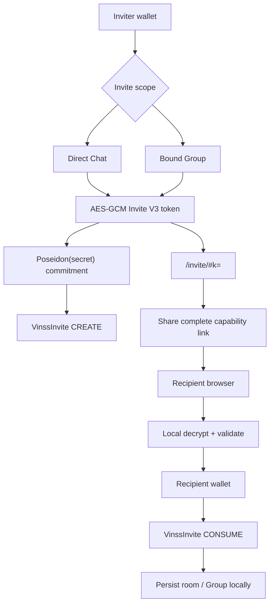
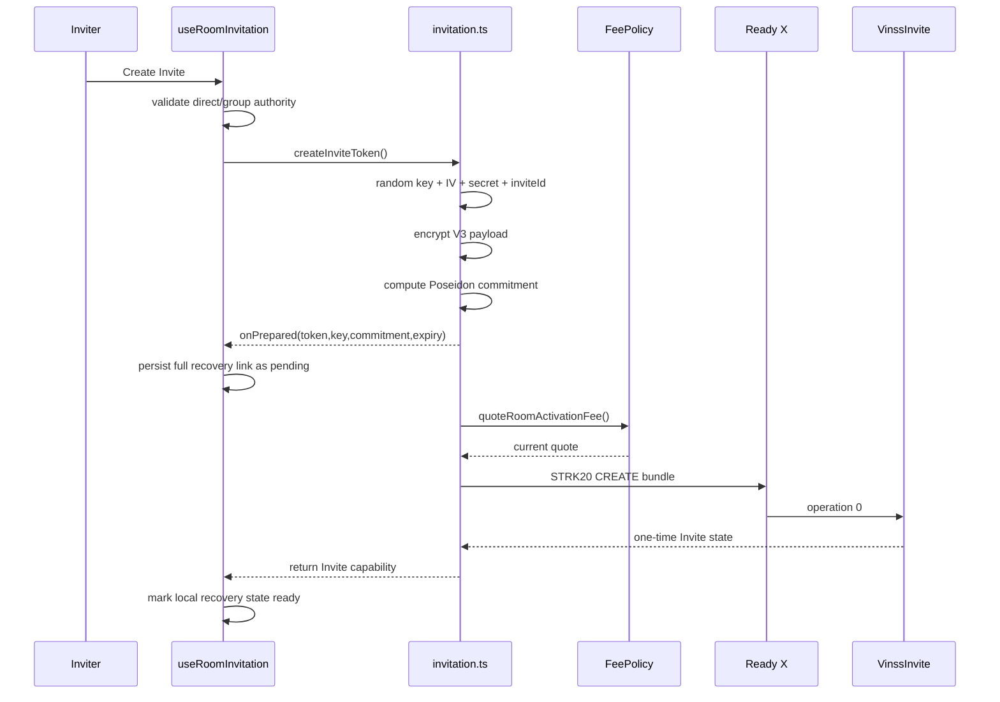
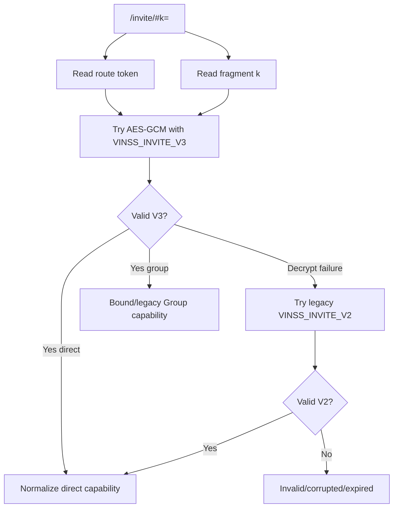
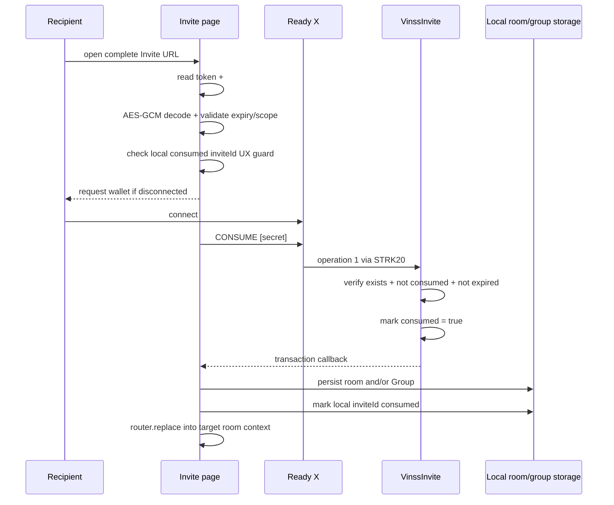
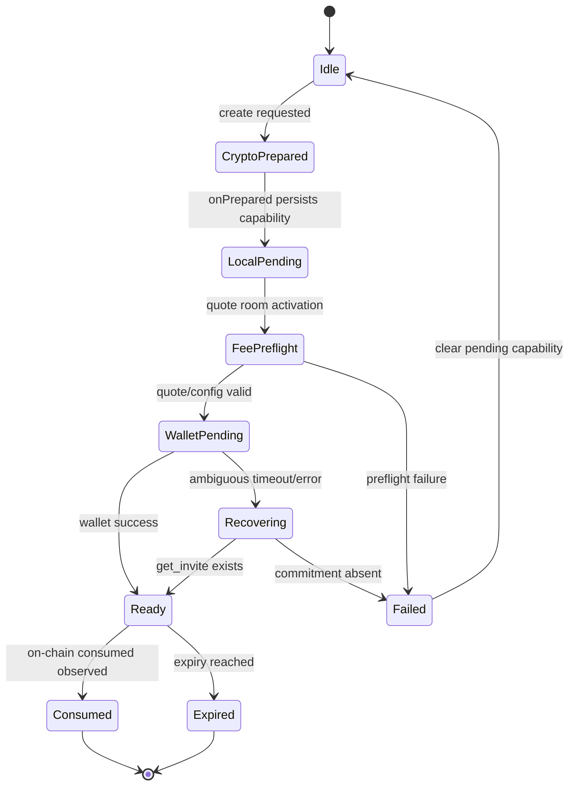
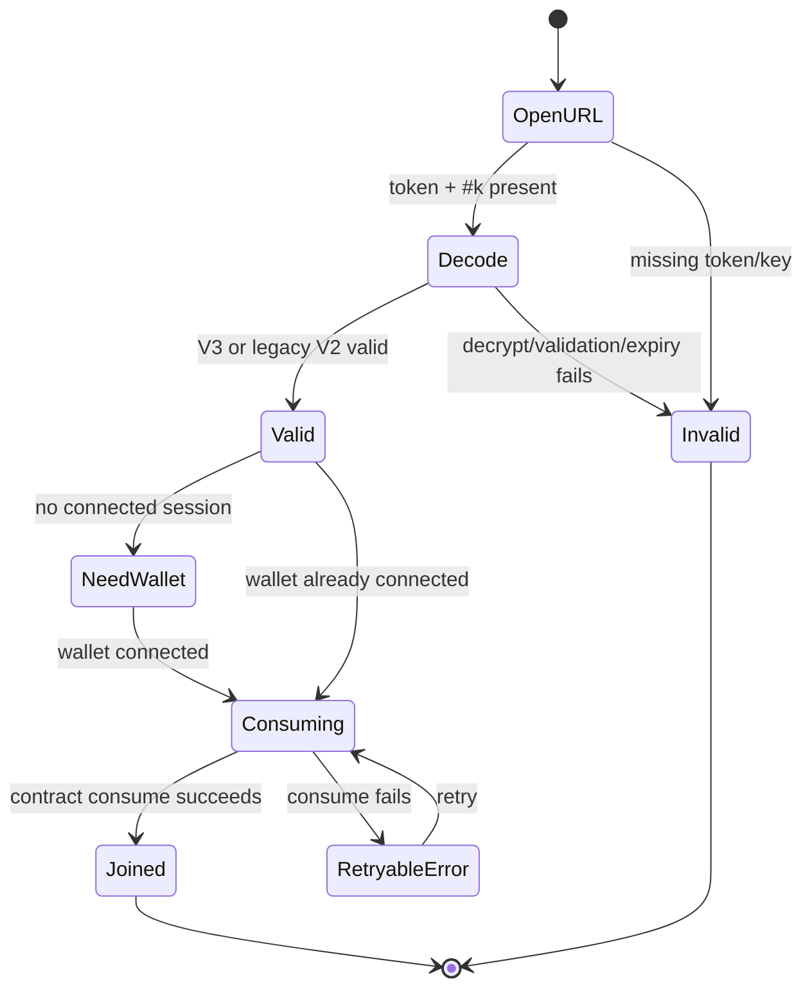
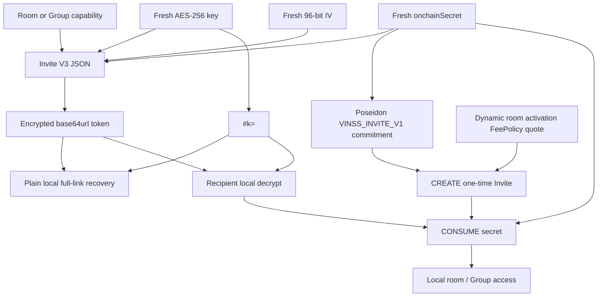

# VINSS Invitation Flow

This document describes the current invitation architecture implemented by the VINSS frontend and canonical Invite contract.

Invite is a one-time capability bootstrap for:

```text
direct private Chat access
or
one concrete Group
```

without publishing the invitation payload itself as plaintext during CREATE.

The current model combines:

```text
client-side AES-GCM capability encryption
+
URL-fragment key separation
+
Poseidon on-chain secret commitment
+
one-time/expiry enforcement in VinssInvite
+
Ready X / mobile recovery
+
device-local room/Group persistence after successful consume
```

---

# Evidence Rule

This document describes current source behavior.

It does not treat:

```text
implemented
Sepolia verified
mainnet verified
production hardened
```

as interchangeable statuses.

Any live-network verification should be attached to a dated release record with the current frontend build, Invite address, wallets, and transaction evidence.

---

# Objective

The invitation flow should allow one wallet to transfer the minimum capability needed for a private VINSS context while keeping the capability payload out of ordinary public CREATE state.

The core split is:

```text
encrypted token
    URL path

decryption key
    URL fragment #k=...

on-chain one-time authority
    Poseidon commitment(secret)
```

---

# Current Source Map

Primary sources:

```text
frontend/lib/deal-room/invitation.ts
frontend/hooks/room/useRoomInvitation.ts
frontend/app/invite/[token]/page.tsx
frontend/lib/groups/localGroups.ts
frontend/lib/starknet/feePolicy.ts
frontend/lib/starknet/constants.ts

contracts/src/invite/vinss_invite.cairo
```

---

# High-Level Flow



---

# Invite Versions

Current frontend creates:

```text
Invite V3
```

and still decodes:

```text
legacy Invite V2
```

for migration compatibility.

---


## Current Version Constants

```text
INVITE_VERSION = 3
LEGACY_INVITE_VERSION = 2
INVITE_AAD_TEXT = VINSS_INVITE_V3
LEGACY_INVITE_AAD_TEXT = VINSS_INVITE_V2
INVITE_COMMITMENT_TAG = VINSS_INVITE_V1
```

Note that:

```text
Invite payload version
Invite AES-GCM AAD version
Invite commitment domain tag
```

are related but not the same version namespace.

---


# Invite Scopes

Current `InviteScope`:

```text
direct
group
```

These scopes have materially different capability payloads.

---


# Direct Invite

A current direct Invite grants room-level direct access.

V3 direct payload contains:

```text
v
inviteId
scope = direct
roomId
roomSecret
onchainSecret
label
inviterAddress
expiresAt
```

---


## Direct TTL

Current direct Invite TTL:

```text
1 hour
```

defined by:

```text
DIRECT_INVITE_TTL_MS = 60 * 60 * 1000
```

---


## Direct Invite Requirement

`useRoomInvitation` blocks direct Invite creation when the local device has no `roomSecret`.

Current user-facing reason:

```text
This device joined through a Group invite.
A private Chat invite requires direct room access.
```

Therefore a Group-only member cannot automatically escalate its own capability into a room-wide direct Invite.

---


# Group Invite

Current Group Invite is bound to one concrete locally created Group.

Current V3 Group capability fields:

```text
groupId
groupName
groupSecret
groupOwnerAddress
```

plus common Invite metadata.

---


## Bound Group Requirement

`createInviteToken()` rejects a Group Invite unless all of these exist:

```text
groupId
groupName
groupSecret
groupOwnerAddress
```

This prevents current new Group invites from being vague room-wide Group capabilities.

---


## Group Admin Requirement

`useRoomInvitation` also requires the connected wallet to satisfy:

```text
isGroupAdmin(group, wallet)
```

Current `isGroupAdmin()` checks:

```text
group.ownerAddress == wallet address
```

using Starknet address equality.

Therefore current Invite creation authority is the local Group owner, not merely any member record whose role string happens to say `admin`.

---


## Group TTL Options

Current Group Invite durations:

```text
24h
7d
```

with default:

```text
24h
```

---


## Group-Only Capability

For a new bound Group V3 Invite:

```text
roomSecret = undefined
```

while:

```text
groupSecret = present
```

This allows access to the selected Group without automatically granting room-level direct Chat capability.

---


# Legacy Group Compatibility

V3 decoder still accepts a Group payload when either:

```text
all bound Group fields exist
```

or:

```text
a legacy room-wide Group payload still contains roomSecret
```

This is compatibility behavior.

New Group Invite creation uses the bound Group model.

---


# Legacy V2 Compatibility

If V3 AES-GCM decode fails, the frontend tries V2 AAD.

Valid V2 payload requires:

```text
v = 2
inviteId
roomId
roomSecret
onchainSecret
label
expiresAt
```

and a still-usable expiry.

---


## V2 Normalization

Legacy V2 represented the old one-counterparty flow.

The decoder normalizes it into current shape as:

```text
v = 3
scope = direct
```

while preserving its room capability fields.

---


# Invite Random Material

Each newly created Invite generates:

```text
32 random bytes -> AES key
12 random bytes -> AES-GCM IV
31 random bytes -> on-chain secret felt candidate
16 random bytes -> inviteId
```

using browser `crypto.getRandomValues()`.

---


## Nonzero On-Chain Secret

If the generated 31-byte on-chain secret somehow equals zero:

```text
secret = 1
```

because the Invite contract rejects zero secrets during consume.

---


# Invite Payload Encryption

Current Invite V3 encryption:

```text
JSON.stringify(payload)
    ↓
UTF-8
    ↓
AES-GCM-256
    key = random 32 bytes
    IV = random 12 bytes
    AAD = VINSS_INVITE_V3
```

---


## Packed Token

The frontend packs:

```text
IV || AES-GCM ciphertext+tag
```

and encodes the result as base64url.

The AES key is independently base64url encoded.

---


# URL Capability Shape

Current link shape:

```text
/invite/<encrypted-token>#k=<base64url-key>
```

---


## Why Fragment Is Used

The fragment:

```text
#k=...
```

is browser-side URL state and is not part of the normal HTTP path/query sent to the origin server.

This reduces accidental ordinary request-layer exposure of the decryption key.

---


## What Fragment Does Not Protect Against

A URL fragment does not make the complete link harmless.

Any party that obtains the full link can potentially obtain:

```text
encrypted token
+
decryption key
```

and attempt to consume the Invite before expiry/first use.

---


# Invite Commitment

Current commitment is:

```text
Poseidon(
  VINSS_INVITE_V1,
  onchainSecret
)
```

matching the canonical Cairo contract domain.

---


## CREATE Does Not Publish Payload

On CREATE, the Invite contract receives:

```text
commitment
expires_at
quoted_fee
open_note_id
```

not:

```text
roomSecret
groupSecret
label
inviterAddress
Group name
Invite AES key
```

---


# Contract Storage

Canonical `InviteEntry` state exposed by `get_invite(commitment)` is represented to the frontend as:

```text
expiresAt
consumed
exists
```

---


# Contract Operations

Canonical operation numbers:

```text
CREATE  = 0
CONSUME = 1
```

---


# CREATE Contract Guards

Canonical Invite CREATE checks include:

```text
caller == configured Privacy Pool
calldata length == 5
quoted fee >= FeePolicy room-activation minimum
commitment != 0
expires_at != 0
expires_at > current block timestamp
commitment does not already exist
```

---


# CONSUME Contract Guards

Canonical Invite CONSUME checks include:

```text
caller == configured Privacy Pool
calldata length == 2
secret != 0
commitment(secret) exists
invite is not already consumed
current block timestamp <= expires_at
```

Then the contract writes:

```text
consumed = true
```

for the same commitment.

---


# Expiry Boundary

Frontend decoding requires:

```text
Date.parse(expiresAt) > Date.now()
```

while the contract allows consume when:

```text
block_timestamp <= expires_at
```

This tiny boundary difference is normal client-vs-chain clock behavior.

The contract remains canonical for consume.

---


# Room Activation Fee

Invite CREATE does not use a stale hardcoded fee.

Current flow:

```text
quoteRoomActivationFee()
    ↓
Invite.get_fee_policy()
    ↓
FeePolicy.quote_fee(roomActivation = 1)
```

---


## CREATE STRK20 Bundle

Current frontend builds:

```text
withdraw
    token = Message Helper OpenNote token
    amount = quoted room activation fee
    recipient = Invite contract

transfer
    token = same OpenNote token
    amount = OPEN
    recipient = VINSS treasury

invoke
    Invite CREATE
    commitment
    expires_at
    quoted_fee
    open_note_id
```

---


## Contract Fee Validation

The contract reads its configured FeePolicy and requires:

```text
quoted_fee >= quote_fee(FEE_ACTION_ROOM_ACTIVATION)
```

so frontend underquoting is rejected on-chain.

---


# CONSUME Economic Path

Invite CONSUME does not create another VINSS service-fee output.

Current frontend still withdraws:

```text
10 wei
```

of the configured OpenNote token to the treasury as a negligible private-note spend for pool-level replay protection.

Then it invokes:

```text
[1, onchainSecret]
```

against the Invite contract.

---


# Used On-Chain Secret

Before consume, the public chain knows only:

```text
Poseidon(secret)
```

During CONSUME, the actual `onchainSecret` is provided as Invite calldata so the contract can recompute the commitment.

Therefore:

```text
onchainSecret has pre-use secrecy
not permanent post-use secrecy
```

---


# Invite CREATE Flow



---


# Prepared Recovery Boundary

`onPrepared` is called after Invite crypto/commitment construction but before FeePolicy quote and Ready X submission.

This is intentional because the complete capability must exist before Ready X can background/remount the browser.

---


## Difference From Direct Message

Direct Message currently waits until fee/config preflight completes before firing `onPrepared`.

Invite does not.

Therefore Invite hook has an additional cleanup/recovery responsibility if later preflight fails.

---


# Invite Local Recovery Storage

Current storage keys:

```text
vinss:invite:v3:<roomId>:direct

vinss:invite:v3:<roomId>:group:<groupId>
```

---


## Stored Invite Recovery Record

Current `StoredInvite` can contain:

```text
link
expiresAt
commitment
status = pending | ready
```

---


## Important Local Capability Exposure

The stored `link` is the complete capability URL.

That means localStorage contains:

```text
/invite/<token>#k=<private AES key>
```

until the record is expired, consumed, replaced, or removed.

This is a high-sensitivity local storage boundary.

---


# Recovery on Hook Remount

When `useRoomInvitation` mounts for a room/Group, it restores a saved Invite only when:

```text
link exists
expiresAt exists
expiresAt > local current time
```

Otherwise the local recovery record is removed.

---


# Internal Timeout Recovery

`createInviteToken()` treats wallet errors containing:

```text
timeout
timed out
```

as ambiguous.

It then polls:

```text
get_invite(commitment)
```

for up to:

```text
8 attempts
```

with about:

```text
1.5 seconds
```

between attempts.

---


## Recovered CREATE

If `get_invite` reports:

```text
exists = true
```

the frontend treats the ambiguous Ready callback as recovered success.

---


# Hook-Level CREATE Recovery

`useRoomInvitation` adds another recovery layer.

If `createInviteToken()` throws after `onPrepared` created local capability state, the hook calls:

```text
getInviteOnchainState(preparedCommitment)
```

---


## If Commitment Exists

The hook restores/keeps:

```text
prepared link
prepared expiry
prepared commitment
status = ready
```

and returns successfully.

---


## If Commitment Does Not Exist

The hook:

```text
clears Invite UI state
removes local recovery record
shows safe creation error
```

This is especially important because `onPrepared` occurs before FeePolicy quote.

---


# Ongoing Invite State Poll

While an unexpired local Invite has a commitment, `useRoomInvitation` checks on-chain state approximately every:

```text
2.5 seconds
```

---


## Pending → Ready

If the contract reports:

```text
exists = true
consumed = false
```

and the local record is still `pending`, the hook marks it:

```text
ready
```

---


## Consumed Cleanup

If contract state reports:

```text
consumed = true
```

the inviter-side hook:

```text
clears the Invite UI
removes local full capability link
shows a short joined notice
```

---


# Invite Countdown

Local Invite UI maintains a one-second countdown.

Presentation formats include:

```text
days + hours
hours + minutes
minutes:seconds
Expired
```

This countdown is UI state.

The contract block timestamp remains canonical for one-time consume eligibility.

---


# Invite Decode Flow



---


# V3 Common Validation

Valid common V3 fields require:

```text
inviteId: non-empty string
roomId: non-empty string
onchainSecret: non-empty string
label: string
expiresAt: string
scope: direct | group
v = 3
expiry still locally usable
```

---


## Direct Validation

Direct V3 additionally requires:

```text
roomSecret: non-empty string
```

---


## Group Validation

Group V3 requires either:

```text
bound groupId + groupName + groupSecret + groupOwnerAddress
```

or legacy compatibility:

```text
roomSecret
```

---


# Recipient Invite Page

`/invite/[token]` is a client page.

It reads:

```text
token from Next.js route params
key from window.location.hash
```

and decrypts entirely in the browser.

---


## Fragment Retention Through Wallet Remount

Current source explicitly keeps:

```text
#k
```

in the URL until consume succeeds.

Reason:

```text
Ready X may background/remount the dapp
```

and removing the fragment before successful consume would destroy recovery access.

---


# Local Consumed-Invite UX Guard

Before wallet consume, the page checks:

```text
vinss:consumed-invites:v2
```

for the decrypted `inviteId`.

---


## Bounded Local History

`markInviteConsumed()` keeps at most:

```text
100 invite IDs
```

on the device.

---


## Not Canonical

This local list prevents confusing repeated reuse on one browser.

It is not the security boundary.

Canonical one-time use is enforced by:

```text
VinssInvite.consumed
```

on-chain.

---


# Wallet Requirement on Consume

After local decrypt succeeds, the page waits for a connected wallet.

Current UI asks the user to connect Ready X to:

```text
validate and consume this one-time invite
```

---


# Consume Flow



---


# Consume Retry Guard

The Invite page uses:

```text
attempted.current
```

to avoid repeatedly starting consume while the same mounted flow is already running.

If consume fails:

```text
attempted.current = false
```

so the flow can be retried.

---


# Consume Failure

Current safe user-facing failure:

```text
This invite could not be validated on-chain.
It may already be used or expired.
```

Actual contract reasons can include:

```text
not found
already consumed
expired
invalid calldata/secret
wallet/transport failure
```

---


# Persisting Direct Room Access

After successful consume, the page writes/updates:

```text
vinss:local-rooms
```

with:

```text
id
label
roomSecret
createdAt
joinedVia
```

---


## Direct Invite Result

For direct scope:

```text
roomSecret = decrypted Invite roomSecret
joinedVia = direct
```

Then, when `inviterAddress` exists, the page redirects to:

```text
/room/<roomId>?chat=<inviterAddress>
```

which opens the inviter's direct-chat target.

---


# Persisting Group-Only Room Access

For a bound Group Invite:

```text
roomSecret = ""
```

unless the payload is a legacy room-wide Group capability.

The room record still exists locally so the Group can be opened inside the room UI.

---


## Do Not Erase Existing Direct Access

If this device already has the same room with a non-empty `roomSecret`, then consuming a Group-only Invite does:

```text
preserve existing roomSecret
```

rather than replacing it with an empty Group-only capability.

This prevents a narrower Group Invite from downgrading existing direct access.

---


## Preserve Original createdAt

If the room already exists locally, consume preserves:

```text
existingRoom.createdAt
```

rather than fabricating a new room creation time.

---


# Persisting Group Access

After Group consume, the page calls:

```text
upsertLocalGroup(roomId, group)
```

into:

```text
vinss:local-groups:v1:<roomId>
```

---


## Group Record From Invite

Current reconstructed local Group includes:

```text
id
roomId
name
groupSecret
ownerAddress
createdAt
members[]
```

---


## Bound Group ID

For current V3 bound Group Invite:

```text
id = invite.groupId
```

For legacy room-wide Group fallback:

```text
id = legacy-<roomId>
```

---


## Owner Fallback

Group owner is chosen from:

```text
groupOwnerAddress
    ?? inviterAddress
    ?? consuming wallet
```

for compatibility/recovery.

New bound Group V3 Invite normally carries `groupOwnerAddress` explicitly.

---


## Initial Local Members

The consumed Group record seeds:

```text
owner -> admin
consumer -> member
```

unless consumer is owner, in which case consumer is admin.

Later encrypted Group membership Presence can reconcile additional observed members.

---


# Group Redirect

After successful Group consume, the page redirects to:

```text
/room/<roomId>?group=<groupId>
```

so the joined Group opens directly.

---


# Fallback Direct Redirect

For legacy/current direct Invite without `inviterAddress`, fallback navigation is:

```text
/room/<roomId>?message=chat
```

---


# Invite Security Model

Invite security depends on possession of the full capability plus successful first consume.

Before consume:

```text
token alone
    insufficient to decrypt

key alone
    insufficient without token

token + key
    can reveal private capability payload

onchainSecret from decrypted payload
    can attempt one-time consume
```

---


# Capability Forwarding

Anyone receiving the complete link can potentially use it.

VINSS does not cryptographically bind the current Invite to a predetermined recipient wallet.

Therefore forwarding before consume is a real capability-transfer behavior, not a bug hidden by encryption.

---


## First Valid Consumer Wins

Because current contract one-time state is commitment-based and not pre-bound to a recipient address:

```text
first valid consume before expiry
```

wins the capability.

---


# Invite Confidentiality

Invite encryption protects fields such as:

```text
roomSecret
groupSecret
label
Group identity/name
inviterAddress
onchainSecret
```

from ordinary plaintext CREATE exposure.

---


## Invite Encryption Does Not Hide

Public chain observers can still see CREATE-level data such as:

```text
Invite contract interaction
commitment
expiry
transaction timing
fee/revenue behavior
```

and later CONSUME reveals the secret used to open that commitment.

---


# URL / Browser Privacy Boundary

The complete Invite capability can appear in:

```text
browser address bar
browser history
clipboard
localStorage recovery record
screen recording/screenshot
OS clipboard manager
recipient-shared message
```

depending on user/device behavior.

URL-fragment separation only prevents ordinary HTTP request inclusion of `#k`; it does not neutralize these browser/device surfaces.

---


# Referrer Boundary

Browsers do not normally include the URL fragment in HTTP `Referer` headers.

However, the encrypted token path itself can still be present in browser/server navigation metadata.

The security-sensitive decryption key remains in the fragment.

---


# Local Storage Boundary

Invite recovery is intentionally not an encrypted-at-rest local capability store.

`useRoomInvitation` stores the full link as plaintext localStorage JSON.

Therefore:

```text
same-origin XSS
malicious browser extension
compromised browser profile/device
```

can threaten unconsumed Invite capabilities.

---


# Room / Group Secret Storage After Consume

Successful Invite consume moves capability material into broader VINSS local state.

Current:

```text
roomSecret
groupSecret
```

are stored as plaintext localStorage values in their respective room/Group records.

This is a broader frontend local-state threat-model issue, not unique to Invite creation.

---


# Invite Authority Matrix

| Question | Current authority |
|---|---|
| Can payload decrypt? | token + fragment AES key in browser |
| Is local expiry apparently usable? | frontend local clock |
| Was Invite created on-chain? | `get_invite(commitment).exists` |
| Is Invite still unconsumed? | `get_invite(commitment).consumed` |
| Is consume allowed at expiry boundary? | VinssInvite contract block timestamp |
| Who may create Group Invite in current UI? | local Group owner check |
| Who may consume? | first wallet possessing valid capability before contract expiry |
| Does device remember it consumed? | local bounded inviteId list |
| Is one-time use secure? | VinssInvite on-chain state |
| What room/Group access persists afterward? | local room/Group state |

---


# Invite State Classification

| State | Location | Visibility / sensitivity |
|---|---|---|
| Invite JSON before encryption | browser memory | highly sensitive |
| AES key | browser memory + URL fragment + recovery link | highly sensitive |
| encrypted token | URL path | ciphertext |
| onchainSecret before consume | encrypted payload/browser | highly sensitive capability |
| commitment | Starknet | public opaque commitment |
| expiry | Starknet + encrypted payload + local recovery | public on-chain |
| consumed flag | Starknet | public |
| full recovery link | localStorage | plaintext capability |
| consumed inviteId UX list | localStorage | local metadata |
| roomSecret after direct consume | localStorage | plaintext capability |
| groupSecret after Group consume | localStorage | plaintext capability |

---


# Invite CREATE State Machine



---


# Recipient Consume State Machine



---


# Direct vs Group Matrix

| Property | Direct Invite | Group Invite |
|---|---|---|
| Scope | `direct` | `group` |
| Current TTL | 1h | 24h or 7d |
| Requires roomSecret at creation | Yes | No for bound V3 Group |
| Payload carries roomSecret | Yes | No for bound V3 Group |
| Payload carries groupSecret | No | Yes |
| Payload carries groupId/name | No | Yes |
| Creator authority in UI | connected room user with roomSecret | local Group owner |
| Consumer gets room-level direct capability | Yes | No, unless already had it / legacy payload |
| Navigation | inviter direct chat when available | selected Group |

---


# CREATE Fee Matrix

| Step | Amount authority | Result |
|---|---|---|
| quote | Invite FeePolicy room-activation action | dynamic current quote |
| withdraw | quoted fee | sent to Invite through STRK20 flow |
| OpenNote transfer | wallet-generated OPEN note | revenue to treasury |
| contract validation | quoted_fee >= FeePolicy minimum | underquote rejected |

---


# CONSUME Fee Matrix

| Step | Amount | Meaning |
|---|---:|---|
| replay withdrawal | 10 wei | negligible private-note spend |
| VINSS service fee | none | consume does not charge room-activation fee again |
| Invite output note | none | contract returns no Invite asset output |

---


# Security Invariants

| ID | Invariant |
|---|---|
| `I1` | New Invite payloads use V3 AES-GCM with AAD `VINSS_INVITE_V3`. |
| `I2` | Each Invite uses a fresh random AES key and IV. |
| `I3` | CREATE publishes commitment, not the plaintext onchainSecret. |
| `I4` | Direct V3 Invite requires roomSecret. |
| `I5` | New bound Group V3 Invite requires groupId/name/secret/owner. |
| `I6` | Bound Group V3 Invite does not grant roomSecret. |
| `I7` | Current Group Invite creation requires local Group owner authority. |
| `I8` | Contract enforces one-time consume. |
| `I9` | Contract enforces expiry with block timestamp. |
| `I10` | Local consumed-ID list is UX only, not canonical security. |
| `I11` | Complete URL is a bearer capability. |
| `I12` | Fragment key stays in URL until consume succeeds for mobile recovery. |
| `I13` | CREATE fee is read dynamically from FeePolicy. |
| `I14` | CONSUME does not charge another room-activation service fee. |
| `I15` | Prepared local capability is cleaned if CREATE never appears on-chain. |
| `I16` | Group-only consume must not erase existing direct roomSecret. |


# Privacy Invariants

| ID | Invariant |
|---|---|
| `P1` | roomSecret/groupSecret are encrypted inside Invite token during transport. |
| `P2` | Invite AES key is separated into URL fragment. |
| `P3` | CREATE does not publish Invite plaintext fields. |
| `P4` | onchainSecret remains hidden until consume. |
| `P5` | Complete link possession is sufficient capability before consume. |
| `P6` | Invite recovery localStorage contains a plaintext full capability URL. |
| `P7` | Post-consume room/group secrets remain browser-local capability state. |
| `P8` | Invite encryption does not provide traffic/contract-interaction anonymity. |


# Recovery Invariants

| ID | Invariant |
|---|---|
| `R1` | Capability is generated before Ready X opens. |
| `R2` | Full capability link is persisted before wallet handoff. |
| `R3` | Ambiguous CREATE timeout checks `get_invite(commitment)`. |
| `R4` | Hook-level recovery can recover non-timeout errors when prepared commitment exists on-chain. |
| `R5` | Absent on-chain commitment causes pending local capability cleanup. |
| `R6` | Inviter polls on-chain state while an active local Invite exists. |
| `R7` | Consumed state removes the inviter's locally stored capability link. |
| `R8` | Recipient keeps #k until consume succeeds. |


# Incorrect Statements to Avoid

- Invite V3 always contains roomSecret.
- Group Invite grants direct room access.
- Any Group member can create Group Invite.
- `admin` member role alone authorizes Invite creation.
- The URL fragment makes a forwarded Invite safe.
- Invite token alone is sufficient to decrypt.
- The Invite contract stores roomSecret/groupSecret.
- Local consumed inviteId list enforces one-time use.
- Consume charges the full room activation fee again.
- Ready X timeout means Invite CREATE failed.
- onchainSecret stays secret forever after consume.
- V2 links are no longer usable.
- Group-only consume replaces an existing direct roomSecret with empty access.
- Mainnet capability is proved merely because `env.mainnet.example` exists.


# Accurate Statements

- Invite V3 supports direct and Group scopes.
- Direct V3 carries roomSecret.
- New bound Group V3 carries Group capability but omits roomSecret.
- Group Invite creation is currently restricted to the local Group owner.
- Invite token and AES key are transported in separate URL components.
- CREATE stores commitment + expiry + consumed state only.
- Contract one-time state is the canonical replay boundary.
- V2 direct links remain decodable during migration.
- CREATE recovery uses direct `get_invite` state checks.
- Complete Invite link is a bearer capability and can be forwarded.


# Direct Invite Review Checklist

- [ ] Connected wallet exists.
- [ ] Local room has non-empty roomSecret.
- [ ] Scope is direct.
- [ ] Direct TTL is 1 hour.
- [ ] Fresh AES key/IV/onchainSecret/inviteId generated.
- [ ] Payload includes inviterAddress.
- [ ] roomSecret included only inside encrypted token.
- [ ] Commitment uses VINSS_INVITE_V1 domain.
- [ ] Full link persisted before Ready X.
- [ ] Room activation fee quote succeeds.
- [ ] CREATE appears on-chain.
- [ ] Local state transitions pending -> ready.


# Group Invite Review Checklist

- [ ] Selected Group exists.
- [ ] Connected wallet equals group.ownerAddress.
- [ ] Group id/name/secret/owner all present.
- [ ] Scope is group.
- [ ] Bound V3 payload omits roomSecret.
- [ ] Chosen TTL is 24h or 7d.
- [ ] Group capability is encrypted before link creation.
- [ ] Full recovery link uses Group-specific storage key.
- [ ] CREATE appears on-chain.


# Consume Review Checklist

- [ ] Route token exists.
- [ ] `#k` exists.
- [ ] V3 decode attempted first.
- [ ] Legacy V2 decode remains fallback.
- [ ] Local expiry is still usable.
- [ ] Direct payload has roomSecret.
- [ ] Group payload has valid bound Group or legacy room-wide capability.
- [ ] Local consumed-ID guard checked.
- [ ] Wallet connected.
- [ ] CONSUME is submitted before local room/group persistence.
- [ ] Contract consume succeeds.
- [ ] Room state persisted.
- [ ] Group state persisted when scope=group.
- [ ] inviteId marked consumed locally.
- [ ] Navigation points to expected context.


# Recovery Review Checklist

- [ ] `onPrepared` fires before wallet handoff.
- [ ] Full capability link persists with `status=pending`.
- [ ] Fee/config failure without on-chain CREATE removes pending capability.
- [ ] Ambiguous timeout checks get_invite.
- [ ] On-chain exists recovers to ready.
- [ ] 2.5s poll marks pending invite ready when state appears.
- [ ] Consumed state deletes inviter local link.
- [ ] Expired local record is removed on restore.
- [ ] `#k` is not removed before consume succeeds.


# Privacy Review Checklist

- [ ] No roomSecret/groupSecret in CREATE calldata.
- [ ] No AES key in URL path/query.
- [ ] No AES key in contract state.
- [ ] Complete link is treated as high-sensitivity capability.
- [ ] Clipboard/history/storage threat is acknowledged.
- [ ] Used onchainSecret disclosure at consume is acknowledged.
- [ ] Group-only capability does not escalate to roomSecret.
- [ ] Post-consume localStorage threat model is documented.


# Current Testing Scope

There is no dedicated frontend Invite test file in the current `frontend/tests/` inventory.

Current Invite confidence therefore comes from:

```text
source implementation
canonical Cairo Invite tests/invariants
manual/browser/network evidence when performed
```

not from a dedicated frontend automated Invite suite.

---


# Recommended Invite Tests

- Direct V3 encrypt/decrypt round trip.
- Group V3 encrypt/decrypt round trip without roomSecret.
- Wrong AES key fails decode.
- Corrupted token fails decode.
- Expired V3 fails local decode.
- Legacy V2 normalizes to direct.
- Bound Group missing one required field is rejected.
- Non-owner Group member cannot create Invite.
- Group-only device cannot create direct Invite.
- FeePolicy failure clears prepared local capability when no CREATE exists.
- Ready timeout recovers when get_invite exists.
- CREATE rejected when commitment already exists.
- CONSUME succeeds exactly once.
- Second consumer is rejected.
- Expired on-chain Invite is rejected.
- Group-only consume preserves existing direct roomSecret.
- Successful Group consume writes expected local Group.


# Recommended Two-Wallet Browser E2E

Direct:

```text
Alice creates direct Invite
    ↓
full link copied
    ↓
Bob opens it
    ↓
Bob decrypts locally
    ↓
Bob connects Ready X
    ↓
CONSUME succeeds
    ↓
Bob redirected to Alice direct Chat
    ↓
Alice inviter poll sees consumed and removes link
```

Group:

```text
Alice creates Group
    ↓
Alice creates bound Group Invite
    ↓
Bob consumes
    ↓
Bob room record has no new roomSecret
    ↓
Bob local Group has correct groupSecret/owner
    ↓
Bob redirected to selected Group
```

---


# Mainnet Verification Definition

Invite should only be marked `Mainnet verified` when evidence ties together:

```text
frontend Git SHA
frontend deployment
mainnet Invite address
mainnet FeePolicy
OpenNote token
treasury
inviter wallet
consumer wallet
CREATE tx
commitment
CONSUME tx
post-consume get_invite state
local resulting room/Group access
```

---


# Sepolia Verification Definition

Similarly, Sepolia verification requires actual current CREATE/CONSUME evidence.

Do not infer it solely from:

```text
Invite source exists
Sepolia fallback exists
Cairo tests pass
```

---


# Invite Evidence Template

```text
Feature: Invite
Git SHA:
Frontend deployment:
Network:
Date:

Scope: direct | group
Inviter wallet:
Consumer wallet:

Invite contract:
FeePolicy:
OpenNote token:
Treasury:

Expiry:
Quoted room activation fee:
Commitment:
CREATE tx:

Token decode:
CONSUME tx:
Final get_invite state:

Local room result:
Local Group result:
Ready timeout recovery exercised:
Known issues:
```


# Current Known Caveats

| Caveat | Current implication |
|---|---|
| Full link stored plaintext locally | Prepared/ready Invite recovery record includes `#k` decryption key. |
| Bearer capability | Invite is not pre-bound to one recipient wallet; forwarding can transfer capability. |
| Used secret becomes visible | CONSUME provides onchainSecret to the contract. |
| No dedicated frontend Invite test file | Browser/source Invite regressions need stronger dedicated automation. |
| Local clock vs block timestamp | Frontend expiry display can differ slightly from chain eligibility. |
| Group authority is local-first | Group owner/admin model is not a canonical on-chain Group ACL. |
| Post-consume secrets in localStorage | roomSecret/groupSecret remain browser-local plaintext capability state. |
| RPC dependency | CREATE recovery/state poll depends on configured frontend RPC. |
| Single Invite contract namespace | Direct/Group scope is encrypted payload semantics; contract itself remains generic. |


# Source Responsibility Matrix

| Source | Responsibility |
|---|---|
| `invitation.ts` | V3/V2 crypto, commitment, FeePolicy, CREATE/CONSUME, on-chain reads/recovery |
| `useRoomInvitation.ts` | creator authority, UI state, capability persistence, countdown, polling/copy |
| `invite/[token]/page.tsx` | recipient decrypt, consume, local room/Group persistence, navigation |
| `localGroups.ts` | Group owner check and local Group capability store |
| `feePolicy.ts` | dynamic room activation quote |
| `vinss_invite.cairo` | canonical one-time/expiry/fee validation state |


# Protocol Compatibility Boundaries

Changes to these can break existing Invite links:

```text
Invite V3 payload schema
AES-GCM key size
IV packing
base64url encoding
AAD text VINSS_INVITE_V3
V2 compatibility AAD
commitment tag VINSS_INVITE_V1
Poseidon field order
URL token/path format
fragment key parameter name k
onchain operation numbers
Group capability field names
```

Treat them as protocol/migration changes, not cosmetic refactors.

---


# V3 Upgrade Rule

If a future Invite V4 is introduced:

```text
create new links in V4
keep V3 decode while active links may exist
define explicit migration/expiry horizon
avoid silently repurposing V3 AAD/schema
```

---


# Group Capability Upgrade Rule

Do not silently reintroduce `roomSecret` into bound Group Invite payloads.

Doing so would widen Group capability into direct room capability and materially change the privacy/access model.

---


# Invite vs Participant Discovery

A direct Invite currently includes:

```text
inviterAddress
```

so the UI can navigate directly toward that peer.

It does not need to carry the inviter's P-256 private key.

Actual direct messaging public-key discovery still uses the normal participant identity channel.

---


# Invite vs Group Membership Presence

Group Invite seeds local owner/consumer membership state.

That does not make the Invite contract a Group membership registry.

Current observed Group membership continues to use local state plus encrypted `group_member` Presence.

---


# Invite vs Room Activation

Current product economics associate Invite CREATE with the FeePolicy room-activation action.

This does not mean:

```text
roomSecret itself is registered on-chain
```

The contract only stores the one-time commitment/expiry/consumed state.

---


# Invite vs Discovery Backend

Invite CREATE/CONSUME does not use the VINSS `/discover` ciphertext index.

Recovery reads:

```text
VinssInvite.get_invite(commitment)
```

directly through frontend Starknet RPC.

---


# Invite vs Normal Agent

Normal VINSS Agent is not involved in capability creation or consume authority.

An Agent proposal must not automatically generate/share/consume an Invite link without explicit user action.

---


# Invite vs Rekber

Invite capability grants room/Group access.

It is not:

```text
Offer acceptance
Rekber Agreement signature
funding authorization
settlement capability
```

Those are separate application/contract authorities.

---


# Failure Isolation

Invite failures should remain isolated.

Examples:

```text
Invite CREATE failure
    -> existing room remains usable

Invite state polling failure
    -> locally ready Invite can remain displayed

clipboard copy failure
    -> Invite can still exist on-chain

Invite consume failure
    -> recipient must not persist room/Group access as successful
```

---


# Creator Error Classes

Current creator failures include:

```text
wallet disconnected
direct roomSecret missing
Group missing
wallet not Group owner
Invite contract missing
OpenNote token missing
treasury missing
FeePolicy quote failure
wallet rejection
wallet timeout
RPC recovery failure
contract rejection
```

---


# Recipient Error Classes

Current recipient failures include:

```text
missing token
missing #k
invalid base64url bytes
wrong key
AES-GCM authentication failure
invalid schema
expired local payload
locally known consumed inviteId
wallet unavailable
contract not found
contract consumed
contract expired
wallet/transport error
```

---


# Deployment Checklist

- [ ] NEXT_PUBLIC_INVITE_ADDRESS points to intended network.
- [ ] NEXT_PUBLIC_MESSAGE_HELPER_OPEN_NOTE_TOKEN matches Invite deployment.
- [ ] NEXT_PUBLIC_VINSS_TREASURY_ADDRESS verified.
- [ ] Frontend RPC points to same network.
- [ ] Invite.get_fee_policy points to intended FeePolicy.
- [ ] Room activation quote sampled.
- [ ] CREATE contract operation verified.
- [ ] CONSUME contract operation verified.
- [ ] Direct 1h TTL verified.
- [ ] Group 24h/7d TTL verified.
- [ ] Group-only capability omits roomSecret.
- [ ] Ready timeout recovery exercised.
- [ ] Second consume rejection exercised.


# Mainnet No-Go Conditions

- Frontend Invite address is empty or Sepolia.
- RPC points to wrong network.
- FeePolicy relation/room activation quote is wrong.
- OpenNote token or treasury mismatches deployment.
- Group Invite accidentally carries roomSecret.
- Non-owner can create bound Group Invite due UI regression.
- Prepared capability is lost across Ready X remount.
- Contract consume can be replayed.
- Consumed Invite is still presented as active indefinitely.
- Complete Invite URLs leak into unintended analytics/logging.


# Documentation Maintenance Rules

- Re-read `invitation.ts` before documenting Invite version/AAD/TTL/fees.
- Re-read `useRoomInvitation.ts` before documenting creator authority/recovery timing.
- Re-read `invite/[token]/page.tsx` before documenting consume persistence/navigation.
- Re-read Cairo Invite before documenting one-time/expiry/fee guards.
- Keep direct and Group capability scopes separate.
- Do not describe Group Invite as roomSecret-sharing in the current bound model.
- Do not describe local consumed-ID list as the one-time security boundary.
- Do not hide the plaintext full-link localStorage caveat.
- Do not freeze a current numeric room-activation fee in docs; quote source is FeePolicy.
- Keep V2 compatibility explicit until intentionally removed.
- Do not claim live-network verification without transaction evidence.


# Source-of-Truth Order

```text
1. contracts/src/invite/vinss_invite.cairo
2. frontend/lib/deal-room/invitation.ts
3. frontend/hooks/room/useRoomInvitation.ts
4. frontend/app/invite/[token]/page.tsx
5. frontend/lib/groups/localGroups.ts
6. frontend/lib/starknet/feePolicy.ts
7. deployed Invite/FeePolicy configuration
8. live two-wallet CREATE/CONSUME evidence
9. prose documentation
```


# Final Invitation Diagram



---

# Bottom Line

The old Invitation document captured the basic AES-GCM + commitment + fragment-key design correctly, but it was incomplete for the current V3 runtime.

The strongest current direct Invite statement is:

> Direct V3 grants room-level capability through an AES-GCM-encrypted payload containing `roomSecret`, with a one-hour expiry and a one-time on-chain commitment.

The strongest current Group Invite statement is:

> New Group V3 Invite is bound to one concrete locally owned Group, carries `groupSecret` and Group identity, and deliberately omits `roomSecret`, so Group access does not automatically become direct-room access.

The strongest current authority statement is:

> The local consumed-ID list and countdown are UX aids; canonical one-time/expiry enforcement belongs to `VinssInvite`.

The strongest current recovery statement is:

> The complete capability link is persisted before Ready X handoff, and ambiguous CREATE outcomes are reconciled through direct `get_invite(commitment)` reads before the frontend decides whether to keep or delete the pending Invite.

The strongest current security caveat is:

> The complete Invite URL is a bearer capability and is stored plaintext in localStorage for mobile recovery. Anyone who obtains that full link can potentially consume it first before expiry.

The strongest current migration statement is:

> V3 is the creation format, while valid V2 links remain decodable and are normalized into the current direct Invite model.
