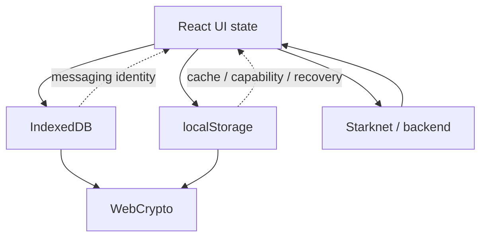
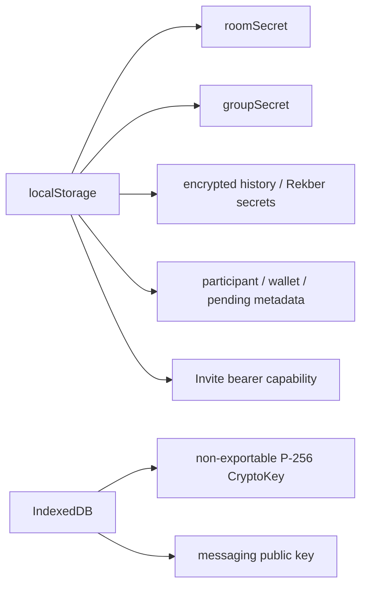
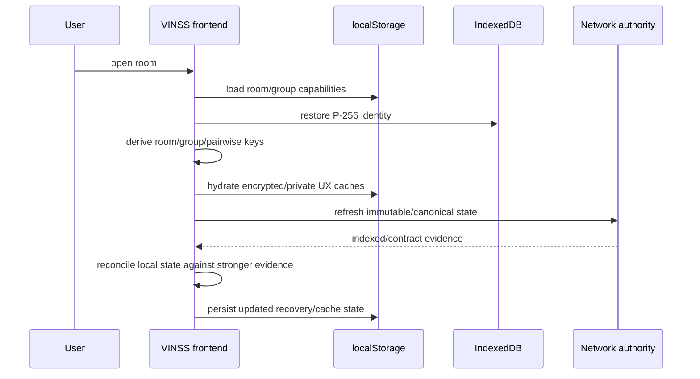
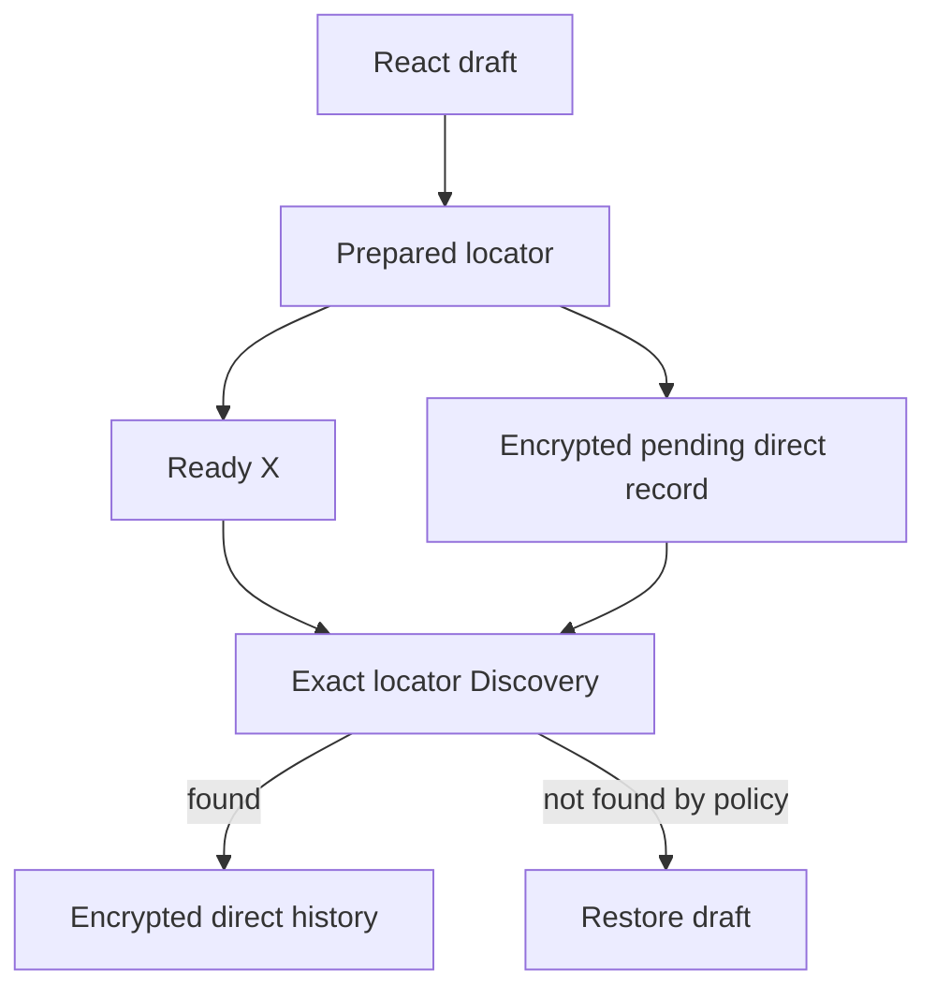
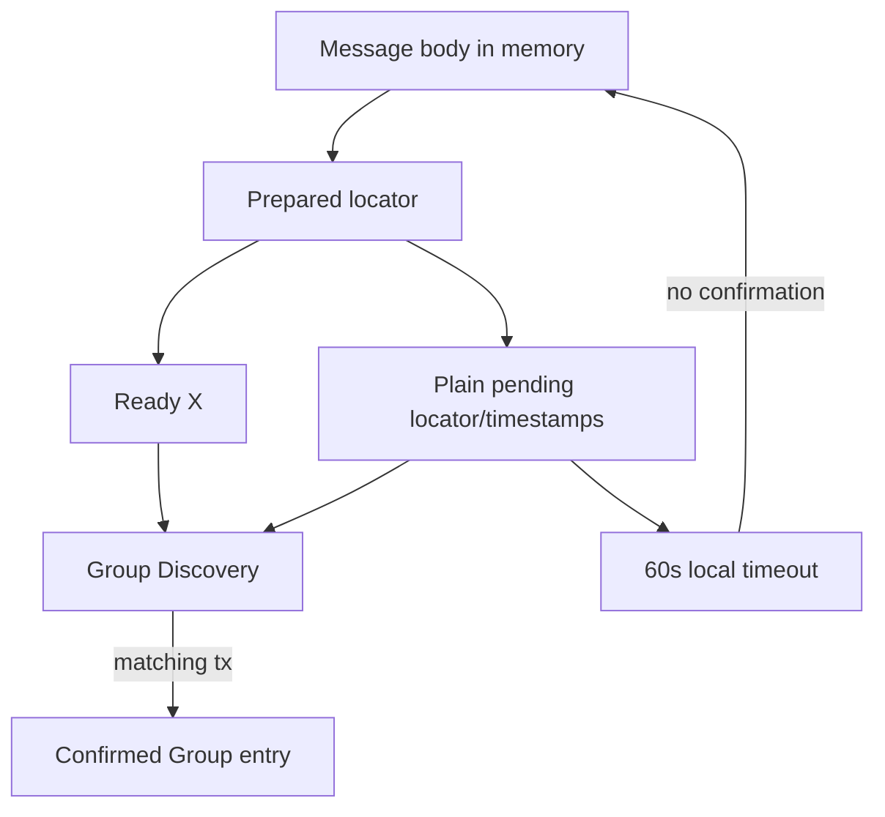
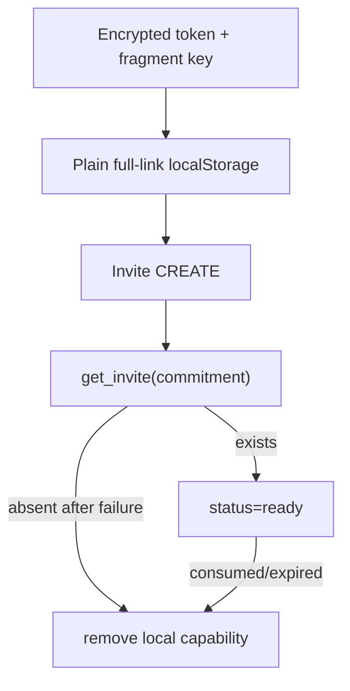
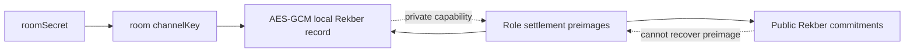
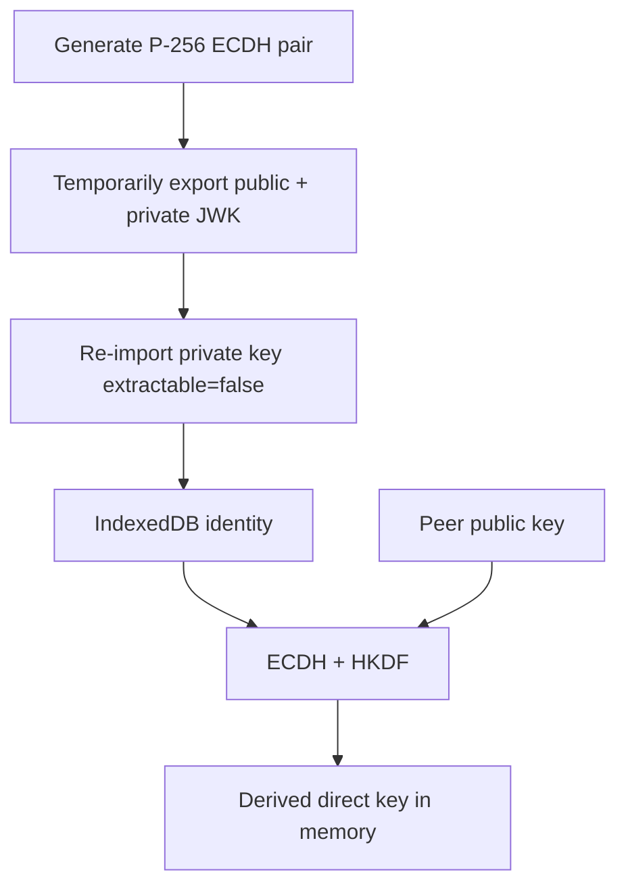
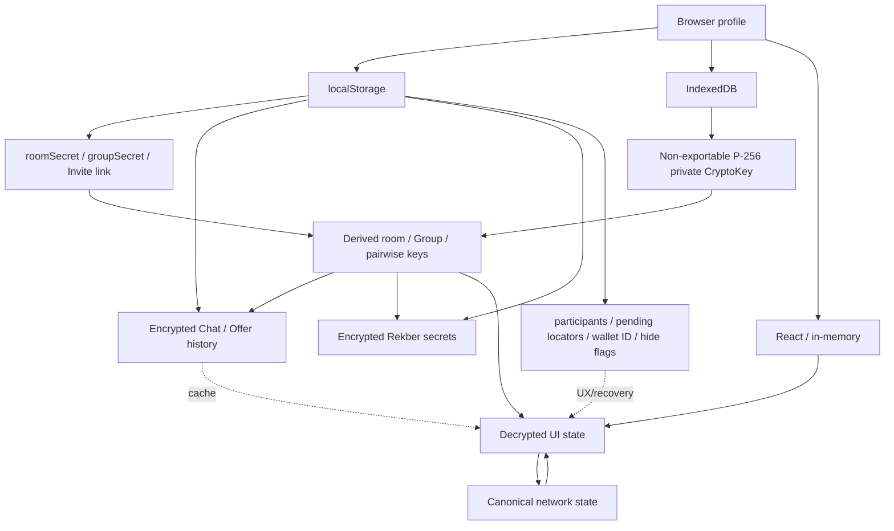

# VINSS Frontend Local State

This document describes the current browser-local state model implemented by the VINSS frontend.

Local state is used for:

```text
room capability persistence
Group capability persistence
wallet reconnect hints
messaging identity persistence
participant continuity
encrypted Chat/Offer history
mobile wallet recovery
Rekber capability recovery
Invite recovery
per-device presentation preferences
```

Local browser state is never a substitute for canonical network authority.

---

# Core Rule

VINSS local state has multiple protection classes.

Do not describe all browser state as:

```text
encrypted
```

because that is false.

Current frontend stores a mixture of:

```text
plaintext capability state
plaintext public metadata
encrypted private history
non-exportable WebCrypto keys
temporary recovery metadata
ephemeral React memory
```

---

# Authority Rule

The strongest authority depends on the domain:

```text
browser cache
    !=
immutable helper record
    !=
canonical Rekber contract state
```

Local state exists to improve continuity and recovery.

It must not manufacture network truth.

---

# Current Source Map

Primary local-state sources:

```text
frontend/hooks/room/useRoom.ts
frontend/hooks/room/useRoomParticipants.ts
frontend/hooks/room/useDirectConversation.ts
frontend/hooks/room/useGroupConversation.ts
frontend/hooks/room/useRoomOffers.ts
frontend/hooks/room/useRoomInvitation.ts

frontend/components/providers/WalletProvider.tsx
frontend/components/room/conversation/MessageBubble.tsx

frontend/lib/privacy/channelKey.ts
frontend/lib/privacy/participantKeys.ts
frontend/lib/privacy/encryptedChatCache.ts
frontend/lib/groups/localGroups.ts
frontend/lib/deal-room/rekberSecrets.ts
frontend/app/invite/[token]/page.tsx
```

---

# Local State Architecture



---

# Local State Categories

| Category | Example | Protection | Authority |
|---|---|---|---|
| Room capability | `roomSecret` | plaintext localStorage | device access only |
| Group capability | `groupSecret` | plaintext localStorage | device Group access only |
| Messaging identity | P-256 private `CryptoKey` | non-exportable IndexedDB key | local decrypt capability |
| Participant cache | peer address/public key | plaintext localStorage | UX cache |
| Direct history | Chat entries | AES-GCM localStorage | UX cache |
| Offer history | Offer entries | AES-GCM localStorage | UX cache |
| Direct pending Message | locator/body/recovery data | AES-GCM localStorage | optimistic recovery |
| Group pending Message | locator/timestamps | plaintext localStorage metadata | optimistic recovery |
| Rekber secrets | capability preimages | AES-GCM localStorage | local private capability |
| Invite recovery | complete link including `#k` | plaintext localStorage | high-sensitivity bearer capability |
| Last wallet | wallet ID | plaintext localStorage | reconnect hint |
| Hidden Message preference | wallet + locator flag | plaintext localStorage | presentation only |

---


# Room Records

Current room records use:

```text
vinss:local-rooms
```

with current `LocalRoom` shape:

```text
id
label
roomSecret
createdAt
```

Other join flows may additionally persist compatibility metadata such as `joinedVia` when writing the same room list.

---


## Room Secret Storage

`roomSecret` is currently stored as plaintext JSON in localStorage.

It is not encrypted at rest by `useRoom()`.

---


## Room Secret Purpose

Current active room key derivation:

```text
SHA-256(
  "VINSS_ROOM_KEY_V1:" + roomSecret
)
```

produces the room channel key used by selected room-scoped encrypted state and participant coordination.

---


## Room Secret Is Capability Material

Possession of `roomSecret` can allow derivation of the room channel key.

Therefore it must be classified as:

```text
sensitive local capability
```

not ordinary presentation metadata.

---


## Group-Only Room

A Group-only Invite can persist a room record with:

```text
roomSecret = ""
```

Current `useRoom()` intentionally stops room-channel-key derivation in that case.

That device can still use its Group capability separately.

---


# Room Hydration

`useRoom(roomId)`:

```text
reads vinss:local-rooms
    ↓
finds matching room
    ↓
clears previous in-memory channelKey
    ↓
derives current channelKey if roomSecret exists
```

---


## Cross-Room Key Isolation

On room changes the hook explicitly clears the previous room key before deriving the next one.

This prevents a late/stale key from being reused as current room state.

---


# Group Records

Current Group persistence uses:

```text
vinss:local-groups:v1:<roomId>
```

Each `LocalRoomGroup` contains:

```text
id
roomId
name
groupSecret
ownerAddress
createdAt
members[]
```

---


## Group Secret Storage

`groupSecret` is also plaintext localStorage capability material.

It is not wrapped by `encryptedChatCache.ts`.

---


## Group Key Derivation

Current Group key is derived in memory as:

```text
SHA-256(
  "VINSS_GROUP_KEY_V1:" + groupSecret
)
```

The Group and room domains are deliberately separated.

Identical secret bytes do not produce the same symmetric key across those two domains.

---


## Group Owner / Members

Current Group record also stores plaintext local metadata:

```text
ownerAddress
member addresses
roles
joinedAt
```

This local state is not a canonical on-chain Group registry.

---


# Local Group Merge

`upsertLocalGroup()` merges Group membership by canonical Starknet address.

If either previous or incoming record says:

```text
admin
```

the merged role remains admin.

---


## Current Group Admin Authority

`isGroupAdmin()` does not simply read a member role string.

It checks:

```text
group.ownerAddress == wallet address
```

using Starknet address equality.

---


# Messaging Identity

Per-room/per-wallet direct messaging identity is persisted in IndexedDB.

Database:

```text
vinss-messaging-keys
```

Object store:

```text
identities
```

---


## Identity Key

Current identity ID:

```text
<roomId>:<canonical-wallet-address>
```

---


## Stored Identity Shape

```text
id
walletAddress
publicKey
privateKey: CryptoKey
```

---


# P-256 Private Key Persistence

Current identity generation briefly creates an extractable P-256 key pair so the public key can be exported.

Then the private JWK is re-imported as:

```text
extractable = false
usage = deriveBits
```

before persistence.

---


## What Non-Exportable Means

A non-exportable `CryptoKey` cannot normally be exported through WebCrypto export APIs.

It does not mean:

```text
same-origin malicious JavaScript cannot use the key
```

because compromised application code may still call cryptographic operations with the key object.

---


# Identity Concurrency

Several hooks can request the same messaging identity during one mount.

Current implementation protects against divergent identities through:

```text
in-memory identityRequests map
+
IndexedDB add-if-absent
+
winner reload after ConstraintError
```

---


## Why This Matters

If Chat, Offer, and Private Escrow generated different local ECDH identities for the same room/wallet:

```text
counterparty direct decrypt compatibility would break
```

so the persisted winner is reused across those domains.

---


# Identity Address Migration

Starknet wallet addresses may reappear with different leading-zero formatting.

Current identity loader scans existing records and migrates a compatible old identity to the canonical address key rather than generating a new private key.

---


# Direct Pairwise Key

The direct pairwise key is not persisted as a dedicated localStorage record.

It is re-derived in memory from:

```text
local non-exportable P-256 private key
+
peer public key
+
roomId
```

using:

```text
P-256 ECDH
-> HKDF-SHA-256
-> 256-bit direct key
```

---


## Direct Key Derivation Parameters

```text
salt = SHA-256("VINSS_ROOM:" + roomId)
info = VINSS_DIRECT_MESSAGE_KEY_V1
```

These values are protocol compatibility boundaries.

---


# Participant Cache

Known direct peers can be cached under:

```text
vinss:participants:<roomId>:<canonical-self>
```

---


## Participant Cache Shape

Each entry contains:

```text
address
publicKey
```

---


## Participant Cache Is Plaintext

This peer metadata is stored as plaintext JSON.

It is not encrypted local history.

---


## Participant Cache Purpose

The cache allows direct tabs to remain usable across:

```text
Ready X backgrounding
browser remount
participant Presence lag
```

while fresh encrypted participant discovery catches up.

---


## Participant Cache Authority

Current source treats the cache as:

```text
UX optimization
```

not as:

```text
canonical participant registry
wallet authorization proof
Rekber role proof
```

---


# Participant Refresh

Current participant state is rebuilt from:

```text
encrypted room participant Presence
+
encrypted Message fallback
+
previous local cache
```

and newer authenticated encrypted observations can replace cached public-key metadata.

---


# Encrypted Local JSON Primitive

`encryptedChatCache.ts` provides a reusable AES-GCM localStorage wrapper.

Current record:

```text
version = 1
iv = base64
ciphertext = base64
```

---


## Encryption Primitive

Current local encryption:

```text
raw 32-byte key
    ↓
WebCrypto import AES-GCM
    ↓
fresh random 12-byte IV
    ↓
JSON.stringify(value)
    ↓
AES-GCM encrypt
```

---


## No AAD

The current generic encrypted local JSON wrapper does not specify additional authenticated data.

Its integrity/authentication is provided by AES-GCM over the ciphertext under the selected key.

---


## Decrypt Failure Behavior

`loadEncryptedLocalJson()` intentionally returns:

```text
null
```

on parse/decrypt failure without deleting the stored encrypted record.

---


## Why Failed Decrypt Does Not Delete

A temporary stale key during wallet/room/participant rehydration can make valid recovery data undecryptable for one attempt.

Deleting it immediately could destroy state that becomes readable once the correct key is restored.

---


# Direct Chat History

Current direct Chat history uses:

```text
vinss:direct-history:v2:<roomId>:<self>:<peer>
```

---


## Direct History Key

Direct history is encrypted with:

```text
room channelKey
```

not the pairwise direct key.

---


## Direct History Payload

Current saved object contains:

```text
version
savedAt
entries[]
```

inside the encrypted local record.

---


## History Is Not Canonical

Direct history exists for:

```text
fast reload
offline-ish continuity
mobile remount continuity
```

but immutable Message existence is established by helper/indexed locator evidence.

---


# Serialized Direct History Writes

Direct history writes are serialized through a Promise chain.

Before each encrypted write, the hook reloads the latest persisted encrypted history and merges by action locator.

---


## Why Writes Are Serialized

Mobile callbacks and Discovery refreshes can complete out of order.

Without serialization:

```text
older async write
could overwrite
newer persisted timeline
```

---


# Legacy Direct History Namespace

Current code still knows:

```text
vinss:direct-history:v1:...
```

as a legacy namespace.

Current active history namespace is:

```text
v2
```

---


# Direct Drafts

Unsent direct text drafts are currently held in React state:

```text
drafts[canonicalPeerAddress]
```

so each participant tab can retain its own unsent draft during the mounted session.

They are not globally persisted as ordinary plaintext localStorage drafts.

---


# Pending Direct Message

Current direct prepared Message recovery key:

```text
vinss:pending-direct-message:<roomId>:<self>:<peer>
```

---


## Pending Direct Message Protection

This record is encrypted with:

```text
direct pairwise key
```

rather than the room channel key.

---


## Pending Direct Payload

Current pending recovery value can contain:

```text
actionLocator
body
sentAt
recipientAddress
createdAt
```

inside the encrypted wrapper.

---


## Why Pending Direct Is Sensitive

The pending record can contain the unsent/private Message body.

Encrypting it prevents ordinary localStorage inspection from revealing the body without the pairwise key.

---


# Direct Recovery Lifetime

The direct pending record exists only while the prepared Message remains unresolved.

Current flow removes it when:

```text
exact locator is discovered
or
reconciliation expires and the optimistic Message is removed
```

---


# Direct Callback Recovery

Current direct send also has an in-memory callback timeout of:

```text
20 seconds
```

after `onPrepared`.

An ambiguous wallet result then falls back to exact-locator reconciliation for roughly:

```text
45 seconds
```

with approximately 1.5-second retries.

---


# Group Conversation Memory

Current Group timeline entries are React state.

Unlike direct history, the current Group hook does not persist a full encrypted Group timeline to localStorage.

Switching Groups clears:

```text
entries
draft
pending flag
pending body ref
```

---


# Pending Group Message

Group prepared Message recovery uses:

```text
vinss:pending-group-message:<roomId>:<groupId>:<wallet>
```

---


## Pending Group Storage Shape

Current localStorage record contains only:

```text
actionLocator
sentAt
createdAt
```

---


## No Plaintext Group Body in Recovery Record

The Group Message body is intentionally retained only in:

```text
pendingBodyRef
```

in React memory.

The persisted pending record is non-plaintext metadata.

---


## Group Pending Timeout

Current Group pending state expires locally after roughly:

```text
60 seconds
```

if no confirmed matching timeline entry appears.

---


## Group Pending Poll

Pending metadata is checked approximately every:

```text
2 seconds
```

while the Group conversation is active.

---


# Offer History

Current Offer history namespace:

```text
vinss:offer-history:v1:<roomId>:<canonical-self>
```

---


## Offer History Protection

Offer history is encrypted using:

```text
room channelKey
```

through the same `encryptedChatCache.ts` helper.

---


## Offer History Payload

Current saved data:

```text
version = 1
savedAt
entries[]
```

---


## Prepared Offer State

Prepared Offer entries are inserted into local React state/history before wallet completion.

Current hook tracks prepared locators in memory:

```text
activePreparedOfferLocatorsRef
```

and uses recovery-generation guards to stop stale callbacks from mutating newer actions.

---


## No Separate Offer Pending Namespace

Current Offer recovery does not use a dedicated:

```text
vinss:pending-offer:*
```

record.

Prepared Offer state is represented through encrypted Offer history plus in-memory locator/recovery tracking.

---


# Rekber Secret Store

Current per-custody private secret namespace:

```text
vinss:rekber-secrets:v2:<roomId>:<wallet>:<custodyHex>
```

---


## Rekber Secret Protection

Rekber secrets are encrypted with:

```text
room channelKey
```

using `saveEncryptedLocalJson()`.

---


## Stored Rekber Secrets

Current role secret record can contain:

```text
custodyCommitment
role
releaseAuthorizationSecret
payeeClaimSecret
refundSecret
payerConfirmationSecret
payerDisputeSecret
revisionChainSecrets[]
payeeDisputeSecret
payeeRefundConsentSecret
fulfillmentChainSecrets[]
certificateSecret
savedAt
```

depending on role.

---


## Rekber Secret Authority

These records are not network truth.

They are private capability material required to exercise public Rekber commitments.

If the local capability is lost and no recovery path exists, the public contract commitment does not reconstruct the secret preimage.

---


# Invite Creator Recovery

Current Invite creator recovery uses plaintext localStorage records.

Direct key:

```text
vinss:invite:v3:<roomId>:direct
```

Group key:

```text
vinss:invite:v3:<roomId>:group:<groupId>
```

---


## Stored Invite Record

Current record can contain:

```text
link
expiresAt
commitment
status = pending | ready
```

---


## Invite Link Is Full Bearer Capability

The stored link includes:

```text
/invite/<encrypted-token>#k=<private AES key>
```

so this is one of the highest-sensitivity plaintext localStorage values in the frontend.

---


## Invite Cleanup

Creator-side recovery record is removed when:

```text
expired on local restore
consumed state is observed
or
prepared CREATE is determined not to exist
```

---


# Consumed Invite UX List

Recipient-side Invite page stores:

```text
vinss:consumed-invites:v2
```

as a bounded list of invite IDs.

---


## Bound

Current list keeps at most:

```text
100 IDs
```

---


## Not Security Authority

This list only prevents confusing reuse on the same browser.

Canonical one-time protection remains the Invite contract consumed flag.

---


# Last Wallet Identifier

`WalletProvider` stores:

```text
vinss:last-wallet-id
```

---


## Stored Value

The stored value is the wallet provider/API identifier.

Current source explicitly avoids storing:

```text
wallet private key
account secret
seed phrase
wallet session secret
```

---


## Purpose

The ID is used as a reconnect hint after browser refresh.

The frontend then asks discovered Wallet Standard wallets for:

```text
silent: true
```

connection restoration.

---


## Disconnect Cleanup

Current `disconnectWallet()` removes:

```text
vinss:last-wallet-id
```

and clears in-memory `session`.

It does not automatically erase room/chat/Offer/Rekber local state.

---


# Hidden Message Preference

Long-press `Delete from this device` on a MessageBubble stores:

```text
vinss:hidden-message:v1:<canonical-wallet>:<actionLocator>
```

with value:

```text
1
```

---


## Meaning

This does not delete:

```text
MessageHelper chain record
backend indexed ciphertext
counterparty copy
encrypted history entry itself
```

It only suppresses rendering on this device/browser profile for that wallet+locator.

---


# Local Delete Is Presentation State

Current local delete should be described as:

```text
hide from this device
```

not:

```text
delete Message from network
```

---


# Ephemeral React State

Not all frontend state is persisted.

Examples:

```text
active tab
current drafts
busy/error flags
selected peer
selected Group
decrypted timeline in memory
pairwise direct key
derived room/group keys
typing indicators
current Agent prompt/result
pending Group body ref
current Rekber panel action lock
```

---


# Derived Keys

Current derived symmetric keys are generally recreated in memory from persisted capability/key material.

| Derived key | Source | Dedicated persistence? |
|---|---|---|
| room channelKey | roomSecret | No |
| Group key | groupSecret | No |
| direct pairwise key | P-256 private key + peer public key + roomId | No |
| attachment subkey | direct pairwise key + attachment ID | No |

---


# Local Storage vs IndexedDB

Current design uses both browser stores for different reasons.



---


# Why IndexedDB for Messaging Private Key

IndexedDB can persist structured `CryptoKey` objects.

That allows VINSS to retain a non-exportable P-256 private key without serializing its raw bytes into localStorage.

---


# Why localStorage Is Still Used

Current frontend relies on localStorage for simple synchronous persistence across:

```text
mobile remount
full reload
route transition
wallet round-trip
```

for room capability and UX/recovery state.

---


# Local State Sensitivity Tiers

| Tier | Examples | Consequence of disclosure |
|---|---|---|
| Critical capability | roomSecret, groupSecret, full Invite link, Rekber preimages | may grant access or settlement capability |
| Cryptographic key | P-256 private CryptoKey | enables pairwise derivation/use |
| Private ciphertext cache | direct/Offer history, Rekber secrets wrapper | content remains key-protected if key not compromised |
| Relationship metadata | participant cache, Group members | reveals associations/public keys |
| Recovery metadata | action locator, timestamp | reveals local workflow state |
| Public UX hint | last wallet ID | low secrecy impact |
| Presentation flag | hidden Message key | local-only UI preference |

---


# Authority Tiers

| Local state | Network authority? |
|---|---|
| room/group capability | No; controls this browser's ability to participate |
| participant cache | No |
| direct history | No |
| Offer history | No |
| pending direct/group Message | No |
| Rekber secret store | Secret capability, but not canonical public state |
| Invite recovery link | Capability, but Invite contract determines one-time state |
| last wallet ID | No |
| hidden-message flag | No |

---


# Canonical Network State

Canonical truth remains outside browser storage.

Examples:

```text
Message existence
    MessageHelper immutable action

Offer existence
    OfferHelper immutable action

Private Escrow coordination
    PrivateEscrowHelper immutable action

Invite one-time state
    VinssInvite

Rekber financial state
    VinssEscrowRekber

Settlement Certificate
    Settlement Certificate contract
```

---


# Local State Recovery Principle

Local recovery should answer:

```text
what was this browser trying to do?
```

while network authority answers:

```text
what actually happened?
```

---


# Prepared State

Prepared state is created before or immediately before wallet handoff depending on domain.

Examples:

```text
Direct Message
    encrypted pending record after preflight

Group Message
    locator/timestamp metadata after preflight

Offer
    prepared encrypted history + in-memory locator set

Invite
    full capability record before fee quote/wallet handoff
```

---


# Prepared State Is Optimistic

A prepared locator/capability does not prove:

```text
contract execution succeeded
```

until reconciled with the correct network authority.

---


# Local State Reconciliation Matrix

| Local state | Stronger evidence | Cleanup/upgrade |
|---|---|---|
| pending direct Message | exact discovered locator | remove pending, upgrade tx hash |
| pending Group Message | discovered matching confirmed entry | remove pending metadata |
| prepared Offer | authenticated discovered locator | replace optimistic copy |
| pending Invite | `get_invite(commitment).exists` | mark ready |
| consumed Invite creator link | `consumed=true` | remove full link |
| Rekber UI pending action | contract/coordination proof | unlock UI |

---


# Room Secret Loss

If `vinss:local-rooms` is cleared and no other capability recovery exists:

```text
room channelKey cannot be re-derived
```

from public chain state.

This can affect:

```text
room participant Presence
direct/Offer encrypted local cache decryption
Rekber encrypted local secret store decryption
```

---


# Group Secret Loss

If a local Group record is lost:

```text
Group key cannot be re-derived
```

without another valid Group capability source.

---


# Messaging Identity Loss

If the IndexedDB P-256 private key is lost while peers still know the old public key:

```text
historical pairwise direct key cannot be reconstructed from public data
```

A newly generated identity is a new cryptographic identity even for the same Starknet wallet.

---


## Why Identity Persistence Is Critical

The Starknet wallet account does not automatically regenerate the VINSS P-256 messaging private key.

That key is application-local.

---


# Rekber Secret Loss

Public commitments cannot reveal their secret preimages.

Therefore deleting role-owned Rekber secret storage can remove the local capability needed for:

```text
release
refund
confirmation
dispute
revision/fulfillment
Certificate claim
```

depending on role/workflow.

---


# Invite Recovery Loss

If a prepared Invite full link is lost before it is shared:

```text
the contract commitment does not reconstruct the AES key/token
```

so creator-side capability recovery may be impossible even if the on-chain Invite exists.

---


# Browser-Origin Security Boundary

Local privacy depends heavily on the integrity of the frontend origin.

Threats include:

```text
XSS
malicious dependency
compromised deployment
malicious browser extension
compromised browser profile
device compromise
developer-tools exposure
clipboard/history exposure
```

---


# XSS Impact

Same-origin malicious JavaScript may be able to:

```text
read localStorage room/group secrets
read Invite bearer links
read participant metadata
read encrypted cache blobs
use persisted CryptoKey objects through WebCrypto
observe decrypted state already in page memory
```

Therefore local encryption is not an XSS sandbox.

---


# Browser Extension Risk

Extensions with sufficient page/storage permissions may observe:

```text
DOM
address bar
clipboard
localStorage
network requests
decrypted in-memory content
```

depending on their privilege model.

---


# Device Compromise

A compromised device can undermine:

```text
localStorage secrecy
IndexedDB key-use assumptions
clipboard privacy
wallet UI trust
browser process isolation
```

Local state design does not claim resistance to a fully compromised device.

---


# Browser Console Caveat

Current Message discovery still logs decrypted Message fields in browser console.

That means local decrypted content can enter developer diagnostics even though it is not stored plaintext in the direct history record.

---


# At-Rest Encryption Does Not Hide Metadata

Encrypted local history still exposes localStorage key names such as:

```text
roomId
wallet address
peer address
custody commitment
```

depending on namespace.

Therefore:

```text
encrypted value
!=
zero local metadata
```

---


# Namespace Metadata

Examples:

```text
vinss:direct-history:v2:<roomId>:<self>:<peer>
vinss:rekber-secrets:v2:<roomId>:<wallet>:<custody>
vinss:invite:v3:<roomId>:group:<groupId>
```

reveal relationship/workflow identifiers to anyone who can enumerate localStorage keys.

---


# Local Encryption Key Dependencies

Encrypted local data is only as recoverable as the key source.

| Encrypted state | Encryption key | Key source |
|---|---|---|
| direct history | room channelKey | roomSecret |
| Offer history | room channelKey | roomSecret |
| Rekber secrets | room channelKey | roomSecret |
| pending direct Message | direct pairwise key | P-256 private key + peer public key + roomId |

---


# Implication of Room Secret Compromise

If `roomSecret` is disclosed, an attacker may derive the room channel key and decrypt any copied local encrypted records that use that same key.

This includes current:

```text
direct history cache
Offer history cache
Rekber secret store
```

if the attacker also obtains those ciphertext records.

---


# Implication of Pairwise Identity Compromise

If the P-256 private identity is compromised and peer public keys are known, pairwise direct keys may be derived for that room.

This can affect:

```text
direct pending record
direct Message/Offer/Private Escrow traffic confidentiality
attachment subkeys
pairwise Presence
```

depending on available ciphertext/history.

---


# No Automatic Key Rotation

Current local-state architecture does not implement automatic rotation of:

```text
roomSecret
groupSecret
P-256 messaging identity
```

on every reconnect or session.

Persistence is required for continuity.

---


# No Secure Enclave Claim

Current source does not claim:

```text
Android Keystore
Secure Enclave
hardware-backed key storage
TEE-bound browser secrets
```

for VINSS application-local state.

---


# Local State and Wallet Private Keys

VINSS frontend browser storage does not intentionally persist the user's Starknet wallet private key.

Wallet signing authority remains with the connected wallet implementation.

---


# Local State and Normal Agent

Normal Agent approval prepares local UI state such as:

```text
Message draft
Offer draft
Escrow tab/draft
```

but current `useRoomAgent` does not create a persistent signing authority or wallet private key record.

---


# Local State and Dispute Agent

Dedicated Dispute state can exist in React/encrypted coordination/backend workflows.

The sensitive resolver private key, when AutoResolve is configured, belongs to backend configuration.

It is not browser local state.

---


# Local State and Attachments

Direct attachment bytes are not persisted into localStorage by the attachment transport itself.

Current private Message history may contain an encrypted `AttachmentRef` as part of the encrypted ConversationEntry cache.

The actual encrypted attachment blob lives in backend storage.

---


# Local State and Presence

Typing/read/participant/group_member Presence is primarily ephemeral backend state plus React state.

VINSS does not persist Presence as canonical browser history.

---


# Local State and Certificate

Settlement Certificate canonical state is public contract state.

Local UI may cache temporary claim status/transaction state in React, but Certificate ownership must be re-readable from the contract.

---


# Local State and Royalty

Royalty/activity read surfaces are backend/public read models.

They should not be treated as local private state authority merely because React renders them.

---


# State Reset on Context Change

Hooks deliberately reset sensitive in-memory state when context changes.

Examples:

```text
room change
wallet change
peer change
Group change
accepted Offer change
custody change
```

---


## Why Reset Matters

Without context-bound resets, decrypted data from:

```text
Room A
Peer A
Group A
Deal A
```

could remain visible while UI has already switched to another context.

---


# Group Timeline Reset

Current Group hook explicitly clears its decrypted timeline when:

```text
group.id changes
```

---


# Rekber Panel Reset

Current Rekber panel resets custody/secrets/fallback proof state when:

```text
accepted Offer changes
or
wallet changes
```

to avoid cross-deal local-state contamination.

---


# Wallet Disconnect Semantics

Disconnecting the wallet removes only the reconnect hint and current session.

It does not automatically wipe:

```text
rooms
Groups
participant cache
Chat history
Offer history
Rekber secrets
Invite recovery
messaging identity
```

---


## Security Implication

`disconnect` should not be described as:

```text
clear all private VINSS data from this device
```

because it does not.

---


# Clear-Site-Data Semantics

Browser/site-data clearing can remove:

```text
localStorage
IndexedDB
cached site state
```

and therefore may destroy important VINSS local capabilities.

---


## Before Advising Users to Clear Storage

Support/debug instructions should understand whether the user still needs:

```text
room access
Group access
historical direct decrypt continuity
Rekber settlement secrets
unconsumed Invite recovery
```

before suggesting full site-data deletion.

---


# Backup / Export Boundary

Current source reviewed here does not provide a universal encrypted export/backup of all VINSS local capability state.

Therefore:

```text
browser profile/device persistence
```

is part of the current operational model.

---


# Data Migration Boundary

Versioned namespaces exist because local-state schema changes can break recovery.

Examples:

```text
vinss:direct-history:v2
vinss:offer-history:v1
vinss:rekber-secrets:v2
vinss:invite:v3
vinss:hidden-message:v1
```

---


## Migration Rule

Do not rename/remove a local namespace without deciding:

```text
what old data exists
whether it remains decryptable
whether migration is possible
whether deleting it can strand a user
```

---


# Current Namespace Inventory

| Namespace | Purpose | Protection | Sensitivity |
|---|---|---|---|
| `vinss:local-rooms` | Room records | plaintext | roomSecret capability |
| `vinss:local-groups:v1:<roomId>` | Group records | plaintext | groupSecret capability |
| IndexedDB `vinss-messaging-keys/identities` | P-256 messaging identity | structured CryptoKey | critical key |
| `vinss:participants:<roomId>:<self>` | Participant cache | plaintext | relationship metadata |
| `vinss:direct-history:v2:<roomId>:<self>:<peer>` | Direct history | AES-GCM | private history |
| `vinss:direct-history:v1:...` | Legacy direct history | legacy | migration |
| `vinss:pending-direct-message:<roomId>:<self>:<peer>` | Direct pending | AES-GCM | private recovery |
| `vinss:pending-group-message:<roomId>:<groupId>:<wallet>` | Group pending | plaintext metadata | recovery metadata |
| `vinss:offer-history:v1:<roomId>:<self>` | Offer history | AES-GCM | private deal history |
| `vinss:rekber-secrets:v2:<roomId>:<wallet>:<custody>` | Rekber secrets | AES-GCM | critical settlement capability |
| `vinss:invite:v3:<roomId>:direct` | Direct Invite recovery | plaintext | bearer capability |
| `vinss:invite:v3:<roomId>:group:<groupId>` | Group Invite recovery | plaintext | bearer capability |
| `vinss:consumed-invites:v2` | Consumed Invite UX list | plaintext | low/medium metadata |
| `vinss:last-wallet-id` | Wallet reconnect hint | plaintext | public-ish metadata |
| `vinss:hidden-message:v1:<wallet>:<locator>` | Local hide flag | plaintext | presentation |


# Storage Lifecycle Matrix

| State | Lifetime | Note |
|---|---|---|
| Room | until manually removed/site cleared | No automatic chain cleanup |
| Group | until manually removed/site cleared | Local-first |
| Messaging identity | persistent IndexedDB | Required for pairwise continuity |
| Participant cache | until overwritten/site cleared | Fresh discovery can replace |
| Direct history | persistent | Can be rebuilt partially from Discovery if keys/routes remain |
| Direct pending | temporary | Removed on confirmation/failure |
| Group pending | temporary <= ~60s | Removed on confirmation/timeout |
| Offer history | persistent | Discovery can re-authenticate |
| Rekber secrets | persistent per custody | Critical until all capabilities no longer needed |
| Invite recovery | until consumed/expired/replaced | High-sensitivity temporary capability |
| Consumed Invite IDs | bounded last 100 | UX only |
| Last wallet ID | until disconnect/site clear | Reconnect hint |
| Hidden-message flag | persistent until site clear/manual change | UI only |


# Storage Encryption Matrix

| State | Encrypted at local value? | Key | Note |
|---|---|---|---|
| Room record | No | N/A | roomSecret plaintext |
| Group record | No | N/A | groupSecret plaintext |
| Participant cache | No | N/A | address/publicKey plaintext |
| Direct history | Yes | room channelKey | AES-GCM |
| Direct pending Message | Yes | pairwise direct key | AES-GCM |
| Group pending Message | No body stored | N/A | locator/timestamps only |
| Offer history | Yes | room channelKey | AES-GCM |
| Rekber secrets | Yes | room channelKey | AES-GCM |
| Invite recovery | No | N/A | full link plaintext |
| P-256 identity | CryptoKey, not AES wrapper | IndexedDB/WebCrypto | private key non-exportable |


# Data Loss Impact Matrix

| Lost state | Potential impact |
|---|---|
| roomSecret | Room key unavailable; selected encrypted local caches/Rekber secrets may become inaccessible |
| groupSecret | Group Message capability lost |
| P-256 private key | Historical pairwise direct key continuity lost |
| participant cache | Usually recoverable from encrypted participant discovery |
| direct history | UI history lost; network ciphertext may still be rediscovered |
| pending direct Message | Recovery UX lost; chain action may still exist |
| Offer history | Cached cards lost; authenticated Discovery can rebuild selected state |
| Rekber secrets | Role settlement capability may be lost |
| Invite recovery link | Creator may lose ability to share existing on-chain Invite |
| last wallet ID | Only silent reconnect preference lost |
| hidden-message flags | Previously hidden messages may render again |


# Compromise Impact Matrix

| Compromised item | Impact |
|---|---|
| roomSecret | Derive room key; decrypt copied room-key-encrypted caches |
| groupSecret | Derive Group key; decrypt compatible Group ciphertext |
| P-256 private CryptoKey usage | Derive direct pairwise keys for known peers |
| participant cache | Reveal relationship/public-key metadata |
| direct encrypted history only | Still needs room key |
| Rekber encrypted record only | Still needs room key |
| full Invite link | Potentially consume unexpired Invite first |
| pending Group metadata | Reveal action locator/timing |
| last wallet ID | Reveal wallet provider preference |


# Security Invariants

| ID | Invariant |
|---|---|
| `L1` | Local browser storage is never canonical network truth. |
| `L2` | roomSecret and groupSecret are sensitive plaintext local capabilities. |
| `L3` | Persisted P-256 private key remains non-exportable. |
| `L4` | Direct pairwise key is derived, not directly persisted. |
| `L5` | Direct history is AES-GCM encrypted with room channelKey. |
| `L6` | Direct pending Message is AES-GCM encrypted with pairwise key. |
| `L7` | Group pending record does not persist Message plaintext. |
| `L8` | Offer history is encrypted with room channelKey. |
| `L9` | Rekber secrets are encrypted with room channelKey. |
| `L10` | Invite recovery link is plaintext bearer capability and must be treated accordingly. |
| `L11` | Consumed Invite local list is not one-time security authority. |
| `L12` | Wallet disconnect does not erase all VINSS private local state. |
| `L13` | Failed encrypted-cache decrypt must not automatically destroy stored recovery data. |
| `L14` | Derived keys must be cleared/rebound when context changes. |
| `L15` | Local delete/hide does not mutate immutable chain state. |


# Incorrect Statements to Avoid

- All VINSS local state is encrypted.
- `roomSecret` is stored encrypted.
- `groupSecret` is stored encrypted.
- Disconnecting the wallet clears private VINSS data.
- The P-256 private key is a wallet private key.
- Non-exportable CryptoKey is secure against XSS.
- Direct history is canonical Message history.
- Participant cache proves current room membership.
- Group pending localStorage contains the Group Message body.
- Offer recovery has a dedicated plaintext pending Offer record.
- Invite recovery link is safe because `#k` is a URL fragment.
- Local consumed Invite IDs enforce one-time security.
- Deleting a Message from this device deletes it on-chain.
- Clearing site data is always a harmless troubleshooting step.
- Public commitments can recover lost Rekber secrets.


# Accurate Statements

- VINSS local state mixes plaintext capabilities, encrypted values, non-exportable CryptoKeys, metadata, and ephemeral memory.
- Room and Group secrets are currently plaintext browser capabilities.
- P-256 messaging private key is persisted as a non-exportable IndexedDB CryptoKey.
- Direct/Offer/Rekber selected local caches use AES-GCM.
- Direct pending Message uses pairwise-key encryption.
- Group pending Message persists only locator/timestamp metadata.
- Invite creator recovery persists a full plaintext bearer link.
- Network Discovery/contract state remains stronger authority than local optimistic caches.
- Local state loss can affect decrypt or settlement capability even when public chain records survive.


# Room Storage Review Checklist

- [ ] `vinss:local-rooms` schema still matches current join/create paths.
- [ ] roomSecret remains intentionally plaintext or is migrated deliberately.
- [ ] Group-only room with empty roomSecret still works.
- [ ] Channel key clears on room switch.
- [ ] Room records are not treated as backend/canonical membership.


# Group Storage Review Checklist

- [ ] Group namespace version remains intentional.
- [ ] groupSecret is classified as sensitive capability.
- [ ] ownerAddress remains canonicalized for authority comparisons.
- [ ] Group membership remains local-first/noncanonical.
- [ ] Group-only Invite does not unexpectedly write roomSecret.


# Messaging Identity Review Checklist

- [ ] IndexedDB DB/store names remain stable or migrated.
- [ ] Identity ID uses canonical wallet address.
- [ ] Private key remains non-exportable after persistence.
- [ ] Concurrent identity generation cannot create divergent winners.
- [ ] Legacy address-format identity migration is preserved.
- [ ] Direct key HKDF parameters remain unchanged unless protocol migration planned.


# Encrypted Cache Review Checklist

- [ ] Fresh 12-byte AES-GCM IV per write.
- [ ] Record version checked during decrypt.
- [ ] Raw encryption key never serialized with ciphertext.
- [ ] Failed decrypt returns null without deleting recovery data.
- [ ] Callers use the intended key class for each cache.
- [ ] Sensitive namespace metadata exposure is acknowledged.


# Direct Message Local-State Review

- [ ] History namespace remains V2.
- [ ] History writes remain serialized.
- [ ] History encrypts with room channelKey.
- [ ] Pending Message encrypts with direct pairwise key.
- [ ] Pending Message stores body only inside encrypted record.
- [ ] Exact locator removes pending state.
- [ ] 45-second reconciliation behavior remains aligned with UI.


# Group Message Local-State Review

- [ ] Group switch clears decrypted timeline.
- [ ] Pending Group namespace remains scoped by room/group/wallet.
- [ ] Persisted pending record contains no Message body.
- [ ] pendingBodyRef remains memory-only.
- [ ] 60-second timeout behavior is intentional.
- [ ] Confirmed Discovery removes pending metadata.


# Offer Local-State Review

- [ ] Offer history remains encrypted.
- [ ] Offer history key remains room channelKey.
- [ ] Prepared Offer locators remain distinguishable from confirmed tx state.
- [ ] Recovery generation prevents stale callback mutation.
- [ ] No locally cached Offer bypasses authenticated parent Discovery for lifecycle replies.


# Rekber Local-State Review

- [ ] Secret namespace remains per room/wallet/custody.
- [ ] Stored role secret schema version remains 2.
- [ ] Secret store remains AES-GCM encrypted.
- [ ] Room channelKey remains available before load/save.
- [ ] Public commitments never replace private preimage storage.
- [ ] Custody/role switch cannot leak previous secret state into new panel.


# Invite Local-State Review

- [ ] Full recovery link sensitivity is documented.
- [ ] Direct/Group storage keys remain separated.
- [ ] Pending -> ready uses on-chain state.
- [ ] Consumed Invite removes creator recovery link.
- [ ] Expired local Invite is removed.
- [ ] Recipient consumed-ID list remains UX-only.
- [ ] Group-only consume preserves existing direct roomSecret.


# Browser Security Review Checklist

- [ ] Strict CSP/XSS posture reviewed.
- [ ] No new third-party script receives room/group secrets.
- [ ] No analytics captures localStorage capability values.
- [ ] No debug code logs Rekber preimages.
- [ ] No clipboard helper uploads full Invite link externally.
- [ ] Browser console decrypted Message logging reviewed/removed for production.
- [ ] Dependencies with same-origin execution are reviewed.
- [ ] Support instructions avoid destructive site-data clearing without warning.


# Local State Flow



---


# Direct Message Recovery Diagram



---


# Group Message Recovery Diagram



---


# Invite Recovery Diagram



---


# Rekber Secret Diagram



---


# Messaging Identity Diagram



---


# Local-State Risk Ranking

| State | Confidentiality risk | Availability risk | Integrity risk |
|---|---|---|---|
| roomSecret | Critical | High | High |
| groupSecret | Critical | High | High |
| P-256 private identity | Critical | Critical | High |
| Rekber secrets | Critical | Critical | Critical |
| full Invite link | Critical until consumed | High | High |
| direct pending body | High | Medium | Medium |
| direct/Offer history | High | Medium | Medium |
| participant cache | Medium | Low | Medium |
| Group members | Medium | Low | Medium |
| last wallet ID | Low | Low | Low |
| hidden-message flags | Low | Low | Low |

---


# Availability vs Confidentiality Tradeoff

VINSS currently accepts some local capability persistence because mobile browser/wallet remounts would otherwise make private workflows fragile.

Examples:

```text
roomSecret
groupSecret
Invite recovery link
Rekber secrets
messaging identity
```

improve continuity but increase the impact of browser-origin compromise.

---


# Why Not Treat Browser Storage as Database

Browser storage can be:

```text
cleared
evicted
corrupted
blocked
partitioned
unavailable in privacy modes
lost with browser profile
```

Therefore local state should be treated as user-device state, not durable protocol history.

---


# Local Storage Errors

Current hooks generally catch storage parse/read/write failures so UX caches do not block network recovery.

Examples:

```text
participant cache parse failure
Invite recovery parse failure
wallet last-ID storage failure
encrypted cache decrypt failure
```

---


# Critical Capability Errors

Not all local errors are harmless.

Failure to persist:

```text
Rekber secrets
Invite recovery capability
messaging private identity
```

can have materially greater consequences than losing a participant UX cache.

---


# Testing Scope

There is no single dedicated frontend test suite covering the entire local-state matrix.

Current relevant protections are distributed across:

```text
source structure
cross-layer privacy regression
Offer/Rekber scenario tests
manual mobile recovery behavior
browser runtime
```

---


# Recommended Local-State Tests

- Room load survives valid localStorage and rejects malformed JSON.
- Group-only room does not derive room key.
- Group record round trip preserves secret/owner/members.
- P-256 identity survives reload with same private CryptoKey.
- Concurrent identity creation yields one winner.
- Leading-zero wallet reconnect migrates identity rather than regenerating.
- Encrypted local JSON round trip succeeds.
- Wrong key returns null and does not delete record.
- Direct history serialized writes do not lose newer entries.
- Direct pending Message contains no plaintext outer localStorage value.
- Group pending record contains no Message body.
- Offer cache survives reload under room key.
- Rekber secrets round trip by custody/wallet.
- Invite pending record restores after remount.
- Invite consumed state removes creator full link.
- Wallet disconnect removes only last-wallet ID.
- Delete-from-device hides only local MessageBubble.


# Recommended Destructive-Storage Tests

- Clear participant cache only -> encrypted participant discovery rebuilds peers.
- Clear direct history only -> Discovery can rebuild current immutable Messages when keys remain.
- Clear Group pending record -> no canonical Group Message deletion occurs.
- Clear last-wallet ID -> manual/silent probing still possible.
- Clear roomSecret -> room-key-dependent caches become unavailable.
- Clear IndexedDB identity -> old direct pairwise continuity breaks.
- Clear Rekber secret store -> identify which settlement actions become unavailable.
- Clear Invite creator recovery -> on-chain Invite may remain but link capability is lost.


# Production Hardening Opportunities

- Move room/group capability storage behind stronger browser-local encryption/key wrapping.
- Define user-facing encrypted backup/recovery for critical capabilities.
- Define explicit Rekber secret backup/recovery strategy.
- Remove production decrypted Message console logging.
- Add storage schema migrations with tests.
- Add local capability export/import with authenticated encryption if product requires portability.
- Add clearer 'clear local data' UX with consequences by category.
- Consider origin-isolated/hardware-backed key strategies where supported.
- Audit third-party script surface and CSP.
- Add automatic cleanup policies for obsolete Invite/pending/hidden-message state.


# Mainnet Local-State Review

- [ ] Production origin/CSP reviewed.
- [ ] roomSecret/groupSecret storage threat explicitly accepted.
- [ ] P-256 IndexedDB persistence works in target mobile browser.
- [ ] Ready X remount does not duplicate identity.
- [ ] Direct pending recovery survives intended mobile flow.
- [ ] Offer recovery survives intended mobile flow.
- [ ] Invite full-link recovery survives remount and cleans after consume.
- [ ] Rekber secrets survive payer/payee wallet round trips.
- [ ] No mainnet workflow requires clearing site data during normal operation.
- [ ] Support runbook warns before destructive browser-data actions.


# Source Responsibility Matrix

| Source | Responsibility |
|---|---|
| `useRoom.ts` | room record hydration + room channelKey |
| `channelKey.ts` | room/Group secret generation/derivation |
| `participantKeys.ts` | IndexedDB P-256 identity + pairwise derivation |
| `useRoomParticipants.ts` | participant cache |
| `encryptedChatCache.ts` | AES-GCM local JSON wrapper |
| `useDirectConversation.ts` | direct history + encrypted pending recovery |
| `useGroupConversation.ts` | Group in-memory timeline + pending metadata |
| `useRoomOffers.ts` | encrypted Offer history + prepared locator state |
| `rekberSecrets.ts` | encrypted role/custody capability store |
| `useRoomInvitation.ts` | creator Invite recovery records |
| `invite/[token]/page.tsx` | consumed Invite IDs + room/group persistence |
| `WalletProvider.tsx` | last-wallet reconnect hint |
| `MessageBubble.tsx` | per-device hidden Message flag |
| `localGroups.ts` | Group capability/member persistence |


# Protocol / Migration Boundaries

Local-state changes that deserve explicit migration design:

```text
room record schema
Group record schema
IndexedDB DB/store/key identity
P-256 identity semantics
direct-history namespace/version
Offer-history namespace/version
Rekber-secret namespace/version
Invite recovery namespace/version
consumed-Invite namespace/version
hidden-message namespace/version
encryption record version
key derivation domain strings
```

---


# Do Not Migrate Blindly

Renaming a namespace is not always harmless cleanup.

For critical records it can cause:

```text
loss of decrypt continuity
loss of settlement capability
loss of Invite recovery
creation of duplicate cryptographic identity
```

---


# Source-of-Truth Order

```text
1. frontend source that owns the local state
2. current browser storage schema
3. cryptographic key derivation source
4. immutable helper / Rekber / Invite contract state
5. recovery/reconciliation logic
6. current browser/mobile runtime evidence
7. prose documentation
```


# Documentation Maintenance Rules

- Inventory actual namespaces before claiming local-state coverage.
- Do not call all local state encrypted.
- Keep plaintext room/group secrets explicit.
- Keep IndexedDB messaging key separate from Starknet wallet key.
- Document which encryption key protects each encrypted cache.
- Document whether a state is capability, cache, metadata, or presentation.
- Document cleanup/reconciliation authority for every pending state.
- Do not describe local delete as network delete.
- Do not advise clearing site data casually when Rekber secrets may still matter.
- Keep Invite full-link plaintext storage caveat visible.
- Re-read current source before changing namespace/version prose.


# Final Local-State Diagram



---

# Bottom Line

The old local-state document correctly identified the room secret, IndexedDB messaging identity, encrypted Chat cache, pending recovery, and browser-origin threat model.

The current frontend requires a broader classification.

The most important correction is:

> VINSS does not encrypt all browser-local state. `roomSecret`, `groupSecret`, participant metadata, Invite recovery links, wallet reconnect hints, Group pending metadata, and presentation flags are currently plaintext local state, while selected Chat/Offer/Rekber values use AES-GCM and the P-256 messaging private key is persisted as a non-exportable IndexedDB `CryptoKey`.

The most important authority statement is:

> Local state explains what this browser knows or was trying to do; helper/Invite/Rekber contract state determines what actually exists or settled on the network.

The most important continuity statement is:

> Room secrets, Group secrets, the P-256 messaging identity, and Rekber preimages are capability state. Losing them can reduce future decrypt/settlement ability even though public chain records remain.

The most important recovery statement is:

> Pending state is domain-specific: direct Message persists an encrypted body record, Group Message persists metadata only, Offer uses encrypted history plus in-memory recovery guards, and Invite persists the full bearer link before wallet handoff.

The most important security caveat is:

> Local encryption reduces accidental at-rest disclosure but does not defend a compromised same-origin browser environment; XSS or privileged extension/device compromise can still access capability material or use local keys.
