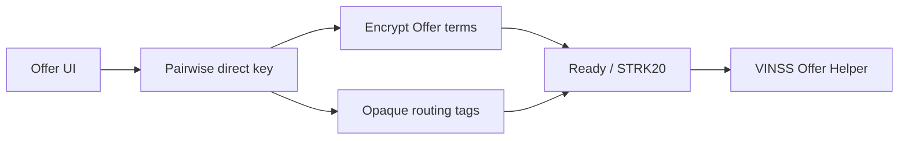

# Private Offers

Direct Offer actions use the same pairwise encryption and routing context as direct Chat.

## Key files

```text
hooks/room/useRoomOffers.ts
components/room/offer/
lib/deal-room/offers.ts
types/deal-room.ts
```

## Current lifecycle

The current private Offer workflow uses immutable actions such as:

```text
create
counter
accept
reject
```

Each action receives its own locator.

## Sending



Current application revenue:

```text
1 STRK per submitted Offer action
```

## Discovery

The frontend requests:

```json
{ "kind": "offer" }
```

from `/discover`, derives private candidate routes for known peers, and decrypts matching actions locally.

Offer read state uses encrypted presence rather than plaintext reader identity in backend storage.

## Agent

The Agent may return an Offer draft/proposal, but the user remains responsible for the wallet action.
