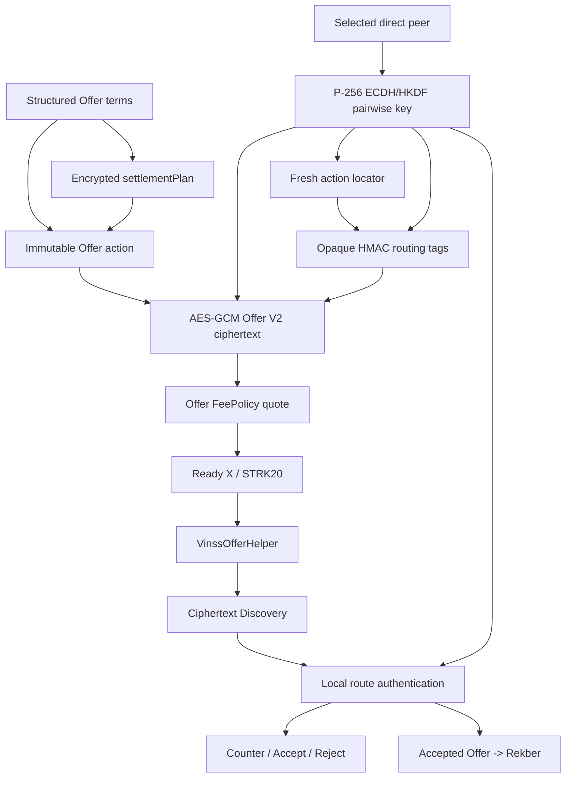
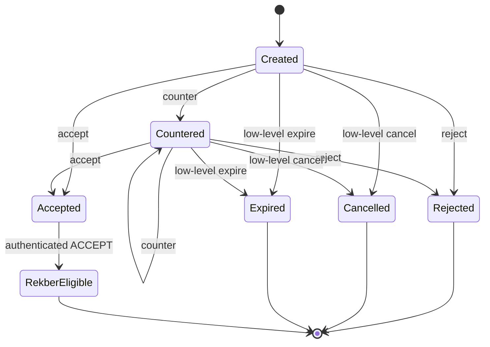
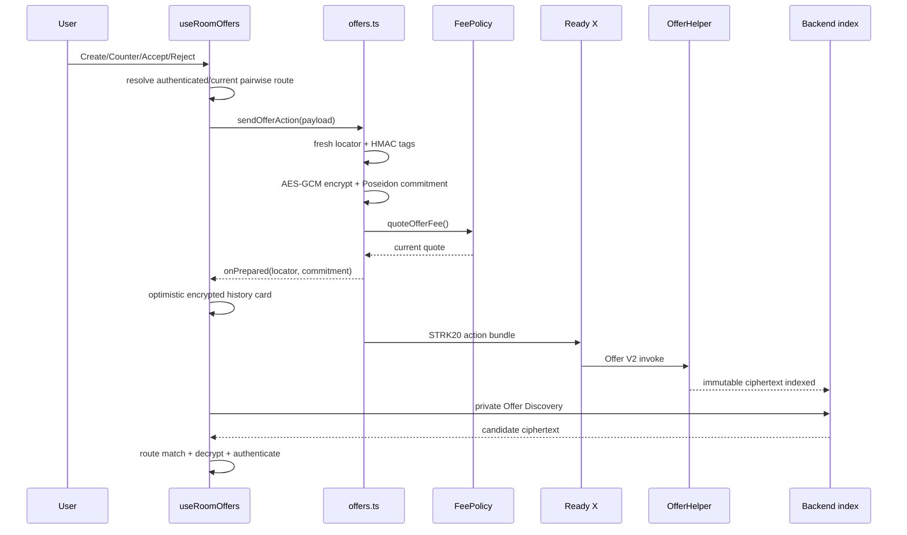
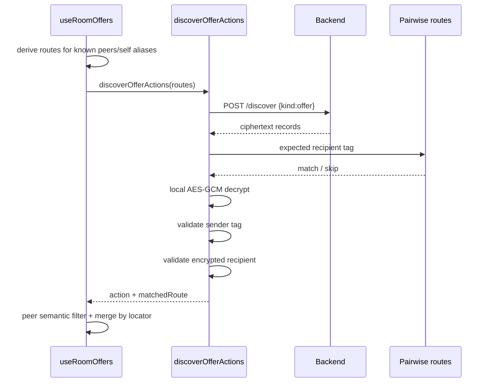
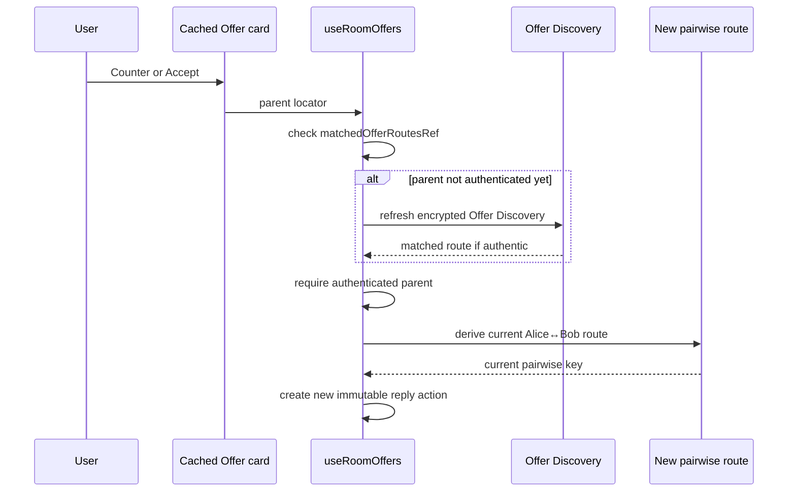
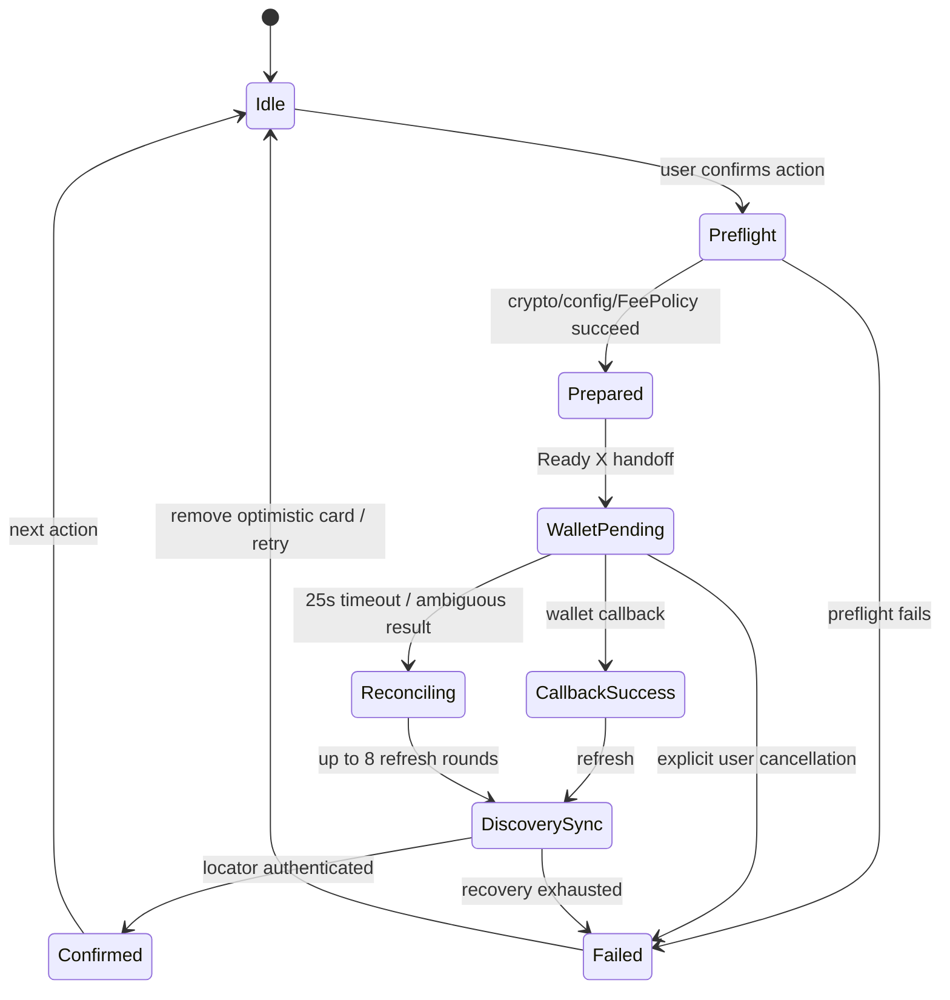
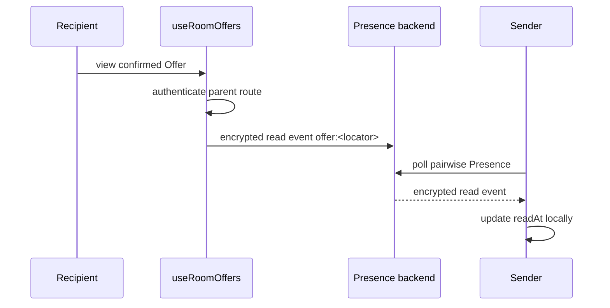
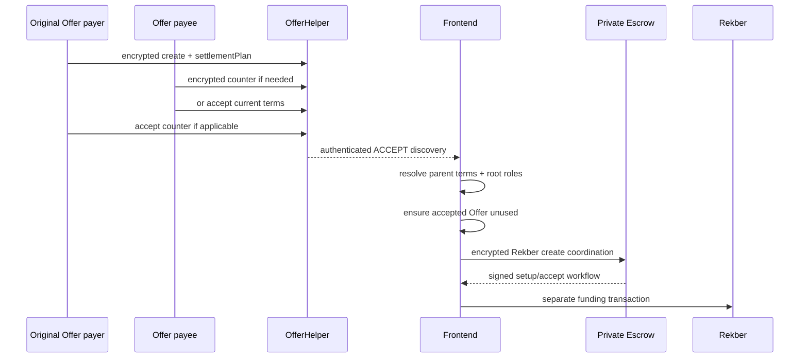
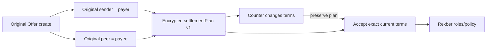
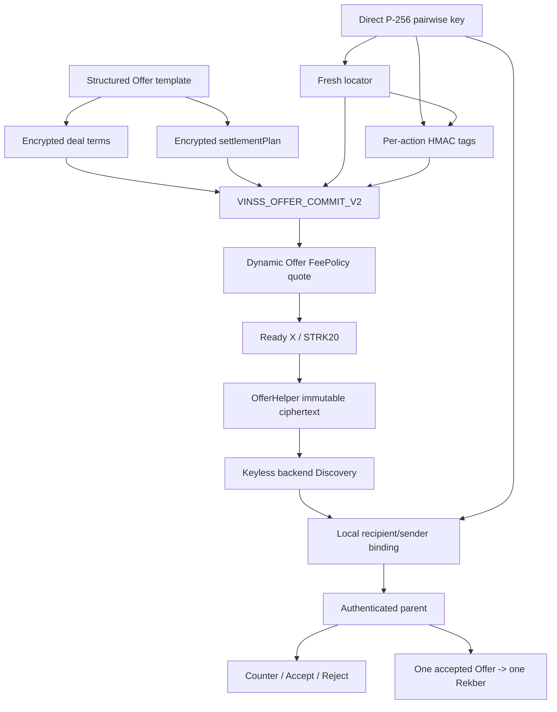

# VINSS Private Offers

This document describes the current private Offer architecture implemented by the VINSS frontend.

Offers convert free-form negotiation into immutable encrypted lifecycle actions while preserving private relationship links between:

```text
create
counter
accept
reject
cancel
expire
```

Every lifecycle action is a new immutable action with its own locator.

Current primary room UI actively exposes:

```text
create
counter
accept
reject
```

while low-level wrappers also exist for:

```text
cancel
expire
```

Do not confuse low-level protocol support with currently wired primary UI behavior.

---

# Evidence Rule

This document describes current source behavior.

It intentionally removes the old deployment wording:

```text
Previous build testnet-verified.
The current 10 STRK build requires redeployment.
```

because implementation status, Sepolia evidence, and mainnet evidence are separate concerns.

Use:

```text
Implemented
Source-tested
Browser E2E verified
Sepolia verified
Mainnet verified
```

as independent evidence classes.

---

# Objective

Private Offers should let two VINSS participants record structured deal actions without placing reusable participant identities or plaintext business terms in Offer Helper state.

The current frontend therefore keeps:

```text
deal type
asset
amount
payment terms
conditions
expiry
reason
sender identity
recipient identity
root/parent Offer relationships
Rekber settlement plan
```

inside encrypted Offer payloads.

Public/helper-visible data contains only the encrypted envelope metadata needed by the protocol.

---

# Current Source Map

Primary sources:

```text
frontend/lib/deal-room/offers.ts
frontend/hooks/room/useRoomOffers.ts
frontend/lib/deal-room/offerTemplates.ts
frontend/lib/deal-room/settlementPlan.ts
frontend/types/deal-room.ts

frontend/components/room/offer/OfferPanel.tsx
frontend/components/room/offer/CounterOfferForm.tsx
frontend/components/room/conversation/*

frontend/app/room/[roomId]/page.tsx
```

Related privacy/runtime sources:

```text
frontend/lib/privacy/participantKeys.ts
frontend/lib/privacy/messageRouting.ts
frontend/lib/privacy/envelope.ts
frontend/lib/privacy/presence.ts
frontend/lib/privacy/encryptedChatCache.ts
frontend/lib/starknet/feePolicy.ts
```

---

# High-Level Architecture



---

# Current Deal Classification

Current encrypted `DealType`:

```text
otc
freelance
goods
digital_goods
bounty
nft
other
```

These values are stored inside encrypted Offer payloads.

---


# Current UI Templates

The current Offer UI exposes seven template IDs:

```text
freelance
token_trade
physical_goods
digital_goods
bounty
nft_deal
custom_deal
```

Template IDs are UI/domain configuration.

They are not all identical to persisted `DealType` values.

---


## Template → Stored Deal Type

| UI template | Stored encrypted DealType |
|---|---|
| `freelance` | `freelance` |
| `token_trade` | `otc` |
| `physical_goods` | `goods` |
| `digital_goods` | `digital_goods` |
| `bounty` | `bounty` |
| `nft_deal` | `nft` |
| `custom_deal` | `other` |

---


## Why Stored Deal Types Stay Stable

`offerTemplates.ts` explicitly treats stored DealType values as encrypted-payload compatibility data.

Changing:

```text
token_trade -> otc
physical_goods -> goods
nft_deal -> nft
```

mapping casually could break old encrypted Offer interpretation.

---


# Template Configuration

Offer template configuration lives in:

```text
frontend/lib/deal-room/offerTemplates.ts
```

rather than React component state.

This allows:

```text
form schema
stored DealType mapping
default values
validation helpers
```

to remain reusable/testable outside rendering.

---


# Freelance Template

Current fields include:

```text
Project or service
Payment amount
Payment token
Delivery deadline
Deliverables
Acceptance criteria
Revision limit
Work stages
```

with advanced/optional fields separated in the UI.

---


# Token Trade Template

Current stored deal type:

```text
otc
```

Current fields include:

```text
Buy/Sell side
Crypto amount
Crypto token
Fiat amount
Fiat currency
Fiat payment method
Payment deadline
```

---


# Physical Goods Template

Current stored deal type:

```text
goods
```

Current fields include:

```text
Item
Quantity
Total price
Payment token
Delivery method
Delivery deadline
Inspection window
```

---


# Digital Goods Template

Current fields include:

```text
Digital item
Price
Payment token
License or usage rights
Delivery method
Acceptance window
```

---


# Bounty Template

Current fields include:

```text
Task or result
Reward amount
Reward token
Deadline
Success criteria
Submission method
```

---


# NFT Deal Template

Current fields include:

```text
Collection or contract
Token ID
Price
Payment token
Transfer deadline
Transfer condition
```

Rekber later escrows the negotiated payment asset.

The NFT itself is not automatically held by the generic current Rekber contract merely because `dealType = nft`.

---


# Custom Deal Template

Current stored deal type:

```text
other
```

Current fields include:

```text
Deal title
Deal value
Value token
Terms
Completion condition
Deadline
```

---


# Default Payment Asset

Current template defaults generally initialize payment token fields to:

```text
STRK
```

unless the user changes the form.

---


# Offer Action Kinds

Current type-level lifecycle:

```text
create
counter
accept
reject
cancel
expire
```

defined by `OfferActionKind`.

---


# Primary UI Lifecycle

`useRoomOffers()` currently imports and returns only the active primary UI functions:

```text
createDirectOffer
counterDirectOffer
acceptDirectOffer
rejectDirectOffer
```

---


## Low-Level Additional Wrappers

`offers.ts` additionally exports:

```text
cancelOffer
expireOffer
```

which use the same encrypted action sender.

Because `useRoomOffers()` does not expose them, technical docs must call them:

```text
low-level supported wrappers
```

not active primary room lifecycle controls.

---


# Offer Action Payload

Current encrypted `OfferActionPayload` can include:

```text
kind
senderAddress
recipientAddress
sentAt
dealType
rootOfferLocator
parentOfferLocator
asset
amount
paymentTerms
conditions
expiresAt
reason
settlementPlan
custodyCommitment
```

Not every kind requires every optional field.

---


# Participant Identity Is Encrypted

Current direct Offer includes:

```text
senderAddress
recipientAddress
```

inside ciphertext.

Offer Helper does not need public plaintext wallet participant fields to route the action.

---


# Semantic Time Is Encrypted

`sentAt` lives inside encrypted Offer state.

Frontend uses it for application ordering.

Current code explicitly avoids interpreting:

```text
Starknet block number
```

as a semantic timestamp.

---


# Immutable Action Model

Every Offer lifecycle action calls the same sender:

```text
sendOfferAction(...)
```

with a different encrypted:

```text
kind
```

---


## One Action → One Locator

Each action calls:

```text
generateActionLocator(encryptionKey)
```

so:

```text
create locator
counter locator
accept locator
reject locator
```

are distinct immutable identities.

---


# Direct Pairwise Key

Current active direct Offer routing reuses the same per-room P-256 messaging identity infrastructure as direct Chat.

Conceptually:

```text
self P-256 private key
+
peer P-256 public key
    ↓
P-256 ECDH
    ↓
HKDF-SHA-256
    ↓
direct pairwise key
```

---


## Same Base Pairwise Context as Direct Chat

Current source deliberately shares the Alice↔Bob direct key infrastructure across:

```text
Direct Chat
Private Offer
Private Escrow coordination
```

while each protocol has its own envelope/domain semantics.

---


# Direct Offer Route

A direct route contains:

```text
recipientIdentity
encryptionKey
routingKey
```

and current direct Offer uses the pairwise key for both:

```text
encryptionKey
routingKey
```

---


# Legacy Room-Key Compatibility

`sendOfferAction()` and `discoverOfferActions()` retain a legacy no-route fallback.

Without an explicit direct route:

```text
encryptionKey = channelKey
routingKey = channelKey
recipientIdentity = GROUP_RECIPIENT_IDENTITY
```

This is compatibility behavior.

Current room Offer UI is direct/pairwise.

---


# Offer V2 Envelope

Current constants:

```text
OFFER_ENVELOPE_VERSION = 2
OFFER_COMMITMENT_DOMAIN = VINSS_OFFER_COMMIT_V2
```

---


# Offer Encryption

Current Offer terms are serialized/encrypted through the shared envelope layer before helper submission.

Conceptually:

```text
OfferActionPayload JSON
    ↓
AES-GCM
    ↓
felt-packed ciphertext chunks
```

---


# Opaque Routing Tags

For each action, Offer derives:

```text
senderTag
recipientTag
```

using the same action-specific HMAC routing primitive used by private Message routing.

---


## Per-Action Unlinkability

The routing input includes:

```text
role
participant identity
action locator
```

so the tag changes as the locator changes.

Do not describe these as stable public wallet identifiers.

---


# Offer Commitment

Current Offer commitment:

```text
Poseidon(
  VINSS_OFFER_COMMIT_V2,
  envelopeVersion,
  actionLocator,
  senderTag,
  recipientTag,
  ciphertextChunkCount,
  ...ciphertextChunks
)
```

---


## Commitment Scope

The commitment authenticates the exact public encrypted envelope.

It does not publish/decrypt:

```text
deal type
asset
amount
terms
participants
root/parent relationship
settlement plan
```

---


# Offer Helper Calldata

Before quoted fee/open-note fields are appended, current Offer V2 calldata contains:

```text
envelopeVersion
actionLocator
senderTag
recipientTag
payloadCommitment
ciphertextChunkCount
...ciphertextChunks
```

---


# Offer Fee

The old documentation claimed:

```text
10 STRK per submitted Offer action
```

That is stale.

Current runtime does:

```text
quoteOfferFee()
    ↓
OfferHelper.get_fee_policy()
    ↓
FeePolicy.quote_fee(offer action)
```

immediately before Ready X transaction construction.

---


## No Fixed Offer Fee In Architecture Docs

A specific deployed quote belongs in:

```text
dated deployment/economics evidence
```

not as a permanent source invariant.

---


# Offer STRK20 Transaction

Current Offer path submits:

```text
withdraw
    token = OfferHelper OpenNote token
    amount = quoted Offer fee
    recipient = OfferHelper

transfer
    token = same OpenNote token
    amount = OPEN
    recipient = VINSS treasury

invoke
    contract = OfferHelper
    Offer V2 calldata
    quoted_fee
    open_note_id
```

through:

```text
account.strk20InvokeTransaction(...)
```

---


# Offer Preflight

Before `onPrepared`, current `sendOfferAction()` checks/builds:

```text
OfferHelper configured
Offer OpenNote token configured
treasury configured
fresh locator
routing tags
ciphertext
payload commitment
calldata
FeePolicy quote
```

---


## Why onPrepared Is Late

`onPrepared` is intentionally called only after FeePolicy/config/crypto preflight succeeds.

This prevents:

```text
ghost Offer cards
```

from appearing when Ready X was never actually invoked.

---


# Create Offer

`createDirectOffer()` requires:

```text
wallet session
room channelKey
selected peer with messaging public key
direct pairwise route
valid structured terms
```

---


## Settlement Plan Is Created With Original Offer

On initial create, frontend calls:

```text
buildOfferSettlementPlan({
  dealType,
  payerAddress = current wallet,
  payeeAddress = selected peer
})
```

and places the result inside encrypted Offer terms.

---


# Settlement Plan Purpose

`settlementPlan` explicitly fixes:

```text
payerAddress
payeeAddress
fulfillerAddress
beneficiaryAddress
fulfillmentType
verificationPolicy
reviewWindowSeconds
maxFulfillmentRounds
maxRevisionRounds
```

before Rekber begins.

---


## Current Plan Version

```text
REKBER_PLAN_VERSION = 1
```

---


## Two-Party Settlement Invariant

Current plan builder enforces:

```text
payer != payee
fulfiller = payee
beneficiary = payee
```

---


# Verification Policy Defaults

Current default policy mapping:

| Deal type | Default Rekber policy |
|---|---|
| goods | `counterparty_confirm` |
| otc | `counterparty_confirm` |
| freelance | `submission_review` |
| digital_goods | `submission_review` |
| bounty | `submission_review` |
| nft | `submission_review` |
| other | `submission_review` |

`external_verify` is supported by Rekber but current Offer templates do not select it automatically.

---


# Review Window Defaults

| Deal type | Current default review window |
|---|---:|
| goods | 24h |
| digital_goods | 24h |
| nft | 12h |
| otc | 1h |
| freelance | 72h |
| bounty | 72h |
| other | 72h |

Allowed plan window:

```text
1 minute .. 30 days
```

---


# Fulfillment / Revision Defaults

Current plan caps:

```text
max fulfillment rounds <= 8
max revision rounds <= 7
revision rounds < fulfillment rounds
```

`counterparty_confirm` defaults to:

```text
zero revision rounds
```

because revision is not used as a substitute for a physical/off-chain delivery dispute.

---


# Counter Offer

A Counter is a new immutable Offer action.

It does not modify the parent action in place.

---


## Counter Parent

Counter stores:

```text
parentOfferLocator = current immutable source action
```

inside encrypted payload.

---


## Counter Root

Counter stores:

```text
rootOfferLocator = existing root
or
current source locator if no root exists yet
```

---


## Counter Preserves Settlement Roles

Current Counter requires:

```text
sourceAction.settlementPlan
```

and copies that exact plan into the new encrypted Counter.

Therefore:

```text
counter sender
does not become
new payer automatically
```

---


## Legacy Offer Counter Block

If the source predates production settlement plan support, current Counter throws:

```text
This Offer predates production Rekber settlement terms. Create a new Offer.
```

---


# Accept Offer

Current Accept is only allowed by the encrypted current recipient.

Frontend checks Starknet address equality before sending.

---


## Accept Copies Exact Current Terms

Accept copies:

```text
dealType
rootOfferLocator
parentOfferLocator
asset
amount
paymentTerms
conditions
expiresAt
settlementPlan
```

from the exact accepted source action.

---


## Accept Requires Production Settlement Plan

Like Counter, current Accept rejects an old source action without:

```text
settlementPlan
```

and requires a new Offer.

---


# Reject Offer

Current Reject is also only allowed by the encrypted current recipient.

It links back through:

```text
rootOfferLocator
parentOfferLocator
```

and carries current terms/reason fields as needed.

---


# Cancel / Expire

`offers.ts` includes wrappers for:

```text
cancel
expire
```

which create normal immutable encrypted Offer actions through the same Offer V2 sender.

---


## Current UI Boundary

The current room hook does not return cancel/expire handlers.

So:

```text
protocol wrapper exists
!=
current primary OfferPanel exposes action
```

---


# Parent Authentication

Lifecycle replies cannot safely trust a cached Offer card alone.

Current `resolveReplyContext()` requires the source locator to have an authenticated route in:

```text
matchedOfferRoutesRef
```

---


## Cached Card Recovery

If a card exists locally but has no authenticated matched route yet:

```text
handleOfferRefresh(true)
```

is called once before the lifecycle action proceeds.

---


## Unauthenticated Parent Block

If no authenticated route appears, frontend rejects the reply:

```text
The private parent Offer is not authenticated yet.
Sync the room and try again.
```

---


# Historical Route vs New Reply Route

The route that successfully decrypted the historical parent proves:

```text
this wallet had the private context for that parent
```

but current code deliberately does not reuse that historical route's encryption key for a new lifecycle action.

---


## Why New Pairwise Key Is Re-Derived

Current source warns that reusing a historical ECDH route could produce:

```text
a valid on-chain Counter
that only the sender can render
while recipient cannot decrypt it
```

after participant identity changes.

Therefore new replies use the current Alice↔Bob pairwise key after parent authentication.

---


# Offer Discovery Request

Frontend sends:

```json
{ "kind": "offer" }
```

to:

```text
POST /discover
```

No Offer decryption key is included.

---


# Discovery Candidate Data

Backend candidate records contain public encrypted fields such as:

```text
actionLocator
payloadCommitment
senderTag
recipientTag
ciphertextChunks
blockNumber
transactionHash
```

---


# Private Route Construction

`useRoomOffers()` builds candidate direct routes for every known participant.

For incoming actions it tries:

```text
current wallet address
historical self routing identities
canonical self address
```

For outgoing history it tries:

```text
exact peer address
canonical peer address
```

---


# Recipient Tag Pre-Filter

For each candidate record:

```text
derive expected recipient tag
    ↓
compare public recipientTag
    ↓
skip if mismatch
```

before AES-GCM decrypt.

---


# Local Decrypt

Only after the recipient tag matches does Offer discovery attempt:

```text
decryptPayload(encryptionKey, ciphertextChunks)
```

---


# Sender Tag Binding

If decrypted action contains `senderAddress`, frontend recomputes:

```text
expected senderTag
```

and rejects the action if the public tag does not match.

---


# Recipient Identity Binding

For new direct payloads, if `recipientAddress` exists, frontend additionally requires it to match the candidate route recipient identity under Starknet address equality.

---


# Matched Route

Successful private discovery returns:

```text
matchedRoute
```

to the caller.

`useRoomOffers()` stores that route in memory by immutable locator.

---


# Room-Level Semantic Filter

After cryptographic route matching, the room hook filters to Offer actions where:

```text
self is sender or recipient
and
the other party is a currently known room participant
```

---


# Offer Merge

Discovered and local Offer cards merge by:

```text
immutable action locator
```

so polling does not create duplicate lifecycle cards.

---


# Offer History

Current local history key:

```text
vinss:offer-history:v1:<roomId>:<canonical-wallet>
```

---


## History Encryption

Offer history is encrypted with:

```text
room channelKey
```

through `encryptedChatCache.ts`.

---


## History Payload

Current saved object:

```text
version = 1
savedAt
entries[]
```

---


## History Authority

Encrypted Offer history is a UX/recovery cache.

Lifecycle replies still require authenticated Discovery.

---


# Prepared Offer

After Offer preflight succeeds, `onPrepared` inserts an optimistic Offer card with:

```text
transactionHash = ""
actionLocator = prepared locator
```

---


## Prepared Locator Tracking

Current hook tracks active prepared locators in:

```text
activePreparedOfferLocatorsRef
```

so a failed attempt can remove only its own optimistic cards.

---


# Wallet Callback Timeout

Current Offer callback timer starts only after:

```text
FeePolicy/config/encryption preflight
and
onPrepared/Ready X handoff
```

Current timeout:

```text
25 seconds
```

---


# Ambiguous Wallet Result

Once a prepared locator exists, a generic Ready X/Mises error is not automatically treated as chain failure.

Unless the error is an explicit user cancellation, frontend reconciles the prepared locator through encrypted Offer Discovery.

---


## Explicit Cancellation

Current explicit cancellation matching includes:

```text
USER_REFUSED
USER_REJECTED
REJECTED_BY_USER
CANCELLED_BY_USER
ACTION_REJECTED
```

---


# Delayed Offer Recovery

`recoverDelayedOffer()` currently performs:

```text
8 attempts
```

with:

```text
5-second wait
```

between unsuccessful refresh rounds.

---


## Recovery Success

Recovery succeeds when every prepared locator is present in:

```text
matchedOfferRoutesRef
```

meaning encrypted Offer Discovery authenticated it.

---


## Recovery Exhaustion

If the generation is still current and prepared locators remain unconfirmed after recovery attempts:

```text
discard optimistic prepared cards
allow retry
show "Offer was not confirmed."
```

---


# Recovery Generation Guard

Each new Offer action increments:

```text
offerRecoveryGenerationRef
```

A delayed recovery task from an older action exits if its generation is no longer current.

---


## Why Generation Guard Exists

Mobile wallet callbacks can return after the user has already started another lifecycle action.

Without generation isolation:

```text
old recovery
could mutate
newer Offer UI state
```

---


# Wallet Success Is Still Not Discovery

A successful wallet result can immediately replace the optimistic card with its returned transaction hash.

But authenticated parent/reply logic still depends on private Discovery route matching.

Do not collapse:

```text
wallet callback success
and
authenticated Offer discovery
```

into the same evidence concept.

---


# Offer Background Polling

While Offer-relevant room surfaces are active, current hook refreshes encrypted Offer discovery approximately every:

```text
2 seconds
```

and also refreshes on:

```text
window focus
visibility return
```

---


# Offer Read Receipts

Current frontend uses encrypted pairwise Presence for Offer read receipts.

Receipt ID:

```text
offer:<actionLocator>
```

---


## Who Sends Offer Read Receipt

A receipt is published only when:

```text
current wallet is encrypted Offer recipient
source has transactionHash
source has Offer payload
authenticated pairwise reply route can be resolved
```

---


## Read Receipt TTL

Current Offer read receipt TTL:

```text
24 hours
```

---


## Read Polling

Current outgoing Offer read-state poll runs approximately every:

```text
1.5 seconds
```

for known pairwise participant Presence channels.

---


## Read Receipt Is Not Settlement Authority

An Offer read receipt proves only application Presence observation.

It is not:

```text
Offer acceptance
wallet signature
Rekber agreement
funding proof
```

---


# Agreement Relationships

Offer relationships are stored privately using:

```text
rootOfferLocator
parentOfferLocator
```

inside ciphertext.

---


## Root Relationship

`rootOfferLocator` identifies the original lineage root after a Counter chain begins.

---


## Parent Relationship

`parentOfferLocator` identifies the exact immutable action being answered.

---


# Create Relationship

The initial create has no required parent.

Its settlement plan fixes the current deal roles/policy.

---


# Counter Relationship

Counter points at:

```text
parent = exact create/counter being answered
root = lineage root
```

and preserves the settlement plan.

---


# Accept Relationship

Accept points at:

```text
parent = exact create/counter whose terms are accepted
root = original lineage root
```

and copies those accepted terms and settlement plan.

---


# Reject Relationship

Reject also points at the exact parent and lineage root.

It does not turn the rejected terms into Rekber authority.

---


# Offer → Rekber Handoff

An accepted Offer is the private agreement source for Rekber.

The handoff is not:

```text
accept Offer
    -> automatically move funds
```

Instead:

```text
accept Offer
    ↓
authenticated ACCEPT discovery
    ↓
private Rekber setup/agreement
    ↓
separate funding action
```

---


# Latest Accepted Offer

The room page derives the latest accepted direct Offer from the current peer context.

Current acceptance candidate must have:

```text
kind = accept
current direct peer relationship
and
authenticated Discovery or a wallet tx hash for general accepted display
```

---


# Unused Accepted Offer

For starting a new Rekber lifecycle, the stricter `latestUnusedAcceptedDirectOffer` requires:

```text
kind = accept
current direct peer
isOfferDiscovered(entry) = true
no existing Private Escrow create tied to its deal Offer locator
```

---


## One Accepted Offer → One Rekber

The room checks encrypted Private Escrow coordination for an existing:

```text
kind = create
dealOfferLocator = accepted terms locator
```

and prevents silent reuse.

---


# Accepted Offer Locator vs Terms Locator

The Accept action itself is immutable evidence of acceptance.

The actual terms being accepted are linked through:

```text
parentOfferLocator
```

and the lineage through:

```text
rootOfferLocator
```

Rekber snapshot logic preserves these relationships privately.

---


# Settlement Roles Never Follow Latest Sender

This is a critical invariant.

The original Offer settlement plan defines payer/payee.

A Counter changes terms but not automatically roles.

An Accept sender is not automatically the payer just because they submitted the acceptance action.

---


# Offer Does Not Move Funds

Creating, Countering, Accepting, or Rejecting an Offer records a paid private Offer action.

It does not custody the negotiated principal.

Principal enters custody only in the separate Rekber funding flow.

---


# Offer Fee vs Deal Value

The private Offer application fee is separate from:

```text
asset
amount
Rekber principal
Rekber funding fee
pool/network costs
```

---


# Offer UI Help Text

Current OfferPanel explicitly tells users:

```text
Private Offer action fee is quoted from VINSS FeePolicy at confirmation time.
It is separate from deal value and does not fund Escrow.
Pool/network fees appear separately in Ready X.
```

This aligns with the current runtime architecture.

---


# Privacy Boundary — Private

Current encrypted Offer data includes:

```text
deal classification
payment asset
amount
payment terms
conditions
expiry
reason
wallet participants
semantic timestamp
root/parent relationship
settlement roles
verification policy
review window
fulfillment/revision limits
```

---


# Privacy Boundary — Public

Public helper/index data can include:

```text
action locator
sender routing tag
recipient routing tag
payload commitment
ciphertext chunks
block number
transaction hash
OfferHelper interaction
fee/revenue transaction behavior
timing
```

---


# Backend Privacy Boundary

Normal Offer Discovery backend receives:

```text
kind = offer
```

and returns public ciphertext metadata.

It does not need:

```text
pairwise direct key
room channel key
plaintext deal terms
```

to perform normal Discovery.

---


# Local Offer History Privacy

Offer history is encrypted locally.

However its storage namespace still exposes local metadata such as:

```text
roomId
current wallet
```

to code that can enumerate localStorage keys.

---


# Cached Offer Is Not Authenticated Parent Authority

This distinction is important:

```text
encrypted local history decrypts
    !=
parent route authenticated in current Discovery session
```

Current reply code deliberately refreshes Discovery before allowing a lifecycle action if matched route evidence is absent.

---


# Offer State Machine



---


# Offer Send Sequence



---


# Discovery Sequence



---


# Counter / Accept Parent Sequence



---


# Mobile Recovery State Machine



---


# Offer Read Receipt Sequence



---


# Offer → Rekber Sequence



---


# Settlement Plan Diagram



---


# Security Invariants

| ID | Invariant |
|---|---|
| `O1` | Every Offer lifecycle action receives a fresh immutable locator. |
| `O2` | Current active direct Offer uses pairwise P-256 ECDH-derived routing/encryption context. |
| `O3` | Participant wallet addresses remain inside encrypted payload. |
| `O4` | Offer V2 commitment covers locator, routing tags, chunk count and ciphertext. |
| `O5` | Normal backend Discovery receives no Offer decryption key. |
| `O6` | Recipient tag is matched before decrypt. |
| `O7` | Decrypted sender is bound back to the public sender tag. |
| `O8` | Encrypted recipient is checked against the matched route. |
| `O9` | Lifecycle reply requires authenticated parent Discovery. |
| `O10` | Historical parent route proves parent access but new reply uses current pairwise route. |
| `O11` | Offer fee is read from FeePolicy immediately before Ready X. |
| `O12` | Prepared optimistic state is created only after fee/config/crypto preflight. |
| `O13` | Original create fixes Rekber payer/payee through settlementPlan. |
| `O14` | Counter preserves settlementPlan. |
| `O15` | Accept copies exact current terms and settlementPlan. |
| `O16` | Old Offer without production settlementPlan is rejected for Counter/Accept. |
| `O17` | Accepting an Offer does not move principal. |
| `O18` | One accepted Offer cannot silently create multiple Rekber lifecycles. |
| `O19` | Offer read receipt is Presence, not acceptance authority. |
| `O20` | cancel/expire wrapper availability is not equivalent to active primary UI exposure. |


# Privacy Invariants

| ID | Invariant |
|---|---|
| `P1` | Deal terms remain encrypted in normal Offer flow. |
| `P2` | Root/parent relationships remain encrypted. |
| `P3` | Settlement roles/policy remain encrypted before Rekber public funding. |
| `P4` | Backend Discovery remains ciphertext/keyless. |
| `P5` | Routing tags are opaque action-specific values. |
| `P6` | Public helper state still exposes timing/ciphertext/commitment metadata. |
| `P7` | Encrypted local Offer cache is not zero-metadata browser storage. |


# Recovery Invariants

| ID | Invariant |
|---|---|
| `R1` | Callback timeout begins only after Offer preflight succeeds. |
| `R2` | Prepared locators are isolated from confirmed cards. |
| `R3` | Generic post-preparation wallet error is treated as ambiguous. |
| `R4` | Explicit user cancellation may discard the current prepared action. |
| `R5` | Delayed Offer recovery authenticates exact locator through Discovery. |
| `R6` | Recovery generation prevents older callbacks from mutating newer actions. |
| `R7` | Recovery exhaustion removes only unconfirmed optimistic cards. |


# Economic Invariants

| ID | Invariant |
|---|---|
| `E1` | Do not document Offer as fixed 10 STRK. |
| `E2` | Current runtime source uses quoteOfferFee(). |
| `E3` | Offer action fee is separate from negotiated deal value. |
| `E4` | Offer action fee does not fund Rekber principal. |
| `E5` | Pool/network wallet costs are separate from VINSS application fee. |


# Incorrect Statements to Avoid

- Current Offer always costs 10 STRK.
- Offer create/accept moves deal principal.
- Counter sender becomes Rekber payer.
- Accept sender becomes Rekber payer.
- All six lifecycle kinds are exposed in the primary UI.
- A cached Offer card is sufficient to Counter/Accept.
- Historical parent encryption route should always be reused for reply.
- Block number is the Offer timestamp.
- Backend knows Offer participants in plaintext for routing.
- rootOfferLocator and parentOfferLocator are public helper fields.
- Accepted Offer can silently start another Rekber after the first lifecycle.
- Offer read receipt means the Offer is accepted.
- An old Offer without settlementPlan can safely enter current production Rekber.


# Accurate Statements

- Private Offer is an immutable encrypted direct action.
- Current primary lifecycle UI exposes create/counter/accept/reject.
- Low-level cancel/expire wrappers also exist.
- Each lifecycle action gets its own locator.
- Current Offer fee is FeePolicy-quoted.
- Parent and root lineage stay inside ciphertext.
- Settlement plan fixes payer/payee on original create.
- Counter preserves those roles.
- Accept copies exact current terms.
- Authenticated ACCEPT is the basis for Rekber handoff.
- Rekber funding remains a separate transaction.


# Create Review Checklist

- [ ] Wallet session connected.
- [ ] Room channelKey available.
- [ ] Selected target is a direct participant, not Group directory.
- [ ] Peer messaging public key available.
- [ ] Direct pairwise key derives.
- [ ] Template fields validate.
- [ ] Stored DealType matches template compatibility mapping.
- [ ] Settlement plan built with sender=payer and peer=payee.
- [ ] Fresh locator generated.
- [ ] Routing tags generated.
- [ ] Payload encrypted.
- [ ] Commitment computed.
- [ ] FeePolicy quote succeeds.
- [ ] Prepared card appears only after preflight.
- [ ] Ready X receives correct Offer bundle.


# Counter Review Checklist

- [ ] Source is current immutable Offer card.
- [ ] Current wallet is allowed to respond to source.
- [ ] Parent has authenticated matched route.
- [ ] Current pairwise route is re-derived.
- [ ] rootOfferLocator preserved/initialized.
- [ ] parentOfferLocator points to exact source.
- [ ] source settlementPlan exists.
- [ ] Counter copies exact settlementPlan.
- [ ] New terms are encrypted.
- [ ] New locator generated.


# Accept Review Checklist

- [ ] Current wallet equals encrypted recipient.
- [ ] Parent source is authenticated through Discovery.
- [ ] Current pairwise route is re-derived.
- [ ] source settlementPlan exists.
- [ ] Accept copies exact source dealType/asset/amount/terms/conditions/expiry.
- [ ] Accept copies settlementPlan.
- [ ] root locator preserved.
- [ ] parent locator points to exact accepted terms.
- [ ] New immutable Accept locator generated.
- [ ] Rekber does not start automatically.


# Reject Review Checklist

- [ ] Current wallet equals encrypted recipient.
- [ ] Parent source is authenticated.
- [ ] Current pairwise route is re-derived.
- [ ] Root/parent lineage preserved.
- [ ] Reject remains encrypted immutable action.
- [ ] No Rekber eligibility is created from Reject.


# Discovery Review Checklist

- [ ] `POST /discover` body remains `{kind: offer}`.
- [ ] No channel/pairwise key sent to backend.
- [ ] Candidate routes include self aliases.
- [ ] Candidate routes include peer exact/canonical identities.
- [ ] Recipient tag matched before decrypt.
- [ ] Sender tag validated after decrypt.
- [ ] Recipient identity validated.
- [ ] Known-peer semantic filter remains active.
- [ ] Matched route retained for parent authentication.
- [ ] Entries merge by immutable locator.


# Recovery Review Checklist

- [ ] Fee/config preflight occurs before onPrepared.
- [ ] 25-second callback timer starts only at wallet handoff.
- [ ] Prepared locators are isolated.
- [ ] Explicit cancellation classification remains intentional.
- [ ] Generic prepared error enters Discovery reconciliation.
- [ ] Recovery performs 8 refresh attempts.
- [ ] 5-second recovery spacing remains intentional.
- [ ] Generation guard cancels stale recovery task.
- [ ] Unconfirmed prepared cards are removed after exhaustion.


# Rekber Handoff Checklist

- [ ] Accepted action is in current direct peer context.
- [ ] ACCEPT is authenticated through private Offer Discovery.
- [ ] Parent terms locator is preserved.
- [ ] Original root settlementPlan roles remain unchanged.
- [ ] Accepted Offer has not already produced Rekber create coordination.
- [ ] Private Escrow create references accepted terms lineage.
- [ ] No second paid Offer action is created merely to start Rekber.
- [ ] Funding remains separate from Offer acceptance.


# Local-State Checklist

- [ ] Offer history namespace remains v1 unless migrated.
- [ ] Offer history remains AES-GCM encrypted.
- [ ] Room channelKey remains history encryption key.
- [ ] Prepared cards have empty tx hash until callback/discovery update.
- [ ] Cached cards cannot bypass authenticated parent route requirement.
- [ ] ReadAt remains UX Presence state.


# Testing Scope

Current frontend does not have a dedicated standalone Offer unit-test file.

Offer behavior receives targeted evidence from:

```text
accepted Offer -> Rekber scenario tests
cross-layer privacy regression
runtime source
manual/browser/network evidence
```

---


## Settlement Mapping Tests

Current:

```text
frontend/tests/escrow-offer-scenarios.test.ts
```

contains five source scenarios validating accepted Offer settlement mapping across representative deal types.

This tests mapping logic, not the full wallet/Offer browser lifecycle.

---


# Recommended Offer Tests

- Create Offer V2 encrypt/decrypt round trip.
- FeePolicy zero/error prevents prepared card.
- Fresh locator differs for repeated equivalent terms.
- Sender/recipient tag changes with locator.
- Wrong pairwise key cannot decrypt.
- Wrong recipient tag is rejected before decrypt.
- Sender-tag mismatch is rejected.
- Encrypted recipient mismatch is rejected.
- Counter preserves root locator.
- Counter points parent to exact source.
- Counter preserves settlementPlan roles.
- Accept copies exact current terms.
- Accept rejects source without settlementPlan.
- Reject can only be sent by current recipient.
- Cached unauthenticated parent blocks reply.
- Parent refresh authenticates before reply.
- 25-second callback timeout enters recovery.
- Explicit cancellation removes prepared card.
- Ambiguous post-prepared error reconciles.
- Generation guard protects newer action.


# Recommended Two-Wallet E2E

```text
Alice creates Offer
    ↓
Bob decrypts and sees terms
    ↓
Bob Counter Offers
    ↓
Alice decrypts Counter
    ↓
Alice Accepts Counter
    ↓
Bob decrypts ACCEPT
    ↓
both reconstruct same root/parent lineage
    ↓
same encrypted settlementPlan roles
    ↓
accepted Offer becomes eligible for one Rekber
```

---


# Recommended Mobile Recovery E2E

Exercise:

```text
wallet opens
    ↓
prepared Offer card created
    ↓
dapp backgrounded/remounted
    ↓
wallet callback late or generic error
    ↓
Offer Discovery finds exact locator
    ↓
card becomes confirmed without duplicate
```

and failure case:

```text
prepared locator never appears
    ↓
recovery exhausts
    ↓
only optimistic card removed
    ↓
user can retry
```

---


# Mainnet Verification Definition

Offer should only be labeled `Mainnet verified` when evidence ties together:

```text
frontend Git SHA
frontend deployment
mainnet OfferHelper
mainnet FeePolicy
OpenNote token
treasury
wallet A
wallet B
quoted Offer fee
Offer tx
action locator
second-wallet decrypt
lifecycle reply tx
authenticated parent relationship
```

---


# Sepolia Verification Definition

`Sepolia verified` likewise requires actual current transaction/decrypt evidence.

It must not be inferred from:

```text
source exists
Sepolia env exists
contract tests pass
historical earlier build worked
```

---


# Offer Evidence Template

```text
Feature: Private Offer
Git SHA:
Frontend deployment:
Backend deployment:
Network:
Date:

Wallet A:
Wallet B:

OfferHelper:
FeePolicy:
OpenNote token:
Treasury:

Action kind:
Deal type:
Quoted Offer fee:
Transaction hash:
Action locator:
Payload commitment:

Counter/Accept parent locator:
Root locator:
Second-wallet decrypt:
Parent authenticated:
Read receipt:

Accepted settlementPlan:
Rekber handoff locator:

Ready recovery exercised:
Known issues:
```


# Current Known Caveats

| Caveat | Current implication |
|---|---|
| No fixed Offer fee | Runtime FeePolicy quote can change independently of docs. |
| cancel/expire UI gap | Low-level wrappers exist but current primary room hook does not expose them. |
| Offer history is cache | Encrypted local card is not sufficient parent authentication. |
| Pairwise identity continuity | Direct Offer decrypt depends on application P-256 messaging identity persistence. |
| Backend Discovery dependency | Fresh/private Offer synchronization depends on ciphertext index availability. |
| Public metadata remains | Timing, helper interaction, locators, tags, commitment, ciphertext are observable. |
| No dedicated full Offer frontend test suite | Current automated evidence is partial/cross-layer. |
| Legacy no-route path remains | Low-level API retains room-key compatibility even though current UI is direct. |
| SettlementPlan compatibility | Old Offers without plan are intentionally blocked from current Counter/Accept production Rekber path. |


# Source Responsibility Matrix

| Source | Responsibility |
|---|---|
| `offers.ts` | Offer V2 send/discovery, wrappers, FeePolicy transaction |
| `useRoomOffers.ts` | direct lifecycle orchestration, parent auth, local cache, recovery, read receipts |
| `offerTemplates.ts` | UI template schema and persisted DealType mapping |
| `settlementPlan.ts` | encrypted Rekber roles/policy defaults and validation |
| `types/deal-room.ts` | Offer action/payload schema |
| `OfferPanel.tsx` | create/counter form/review presentation |
| `room/[roomId]/page.tsx` | accepted Offer selection and one-Offer-one-Rekber handoff |
| `participantKeys.ts` | P-256 pairwise direct key |
| `messageRouting.ts` | opaque action routing tags |
| `encryptedChatCache.ts` | encrypted local Offer history |


# Protocol Compatibility Boundaries

Changes to these can break historical/private Offer compatibility:

```text
OFFER_ENVELOPE_VERSION
VINSS_OFFER_COMMIT_V2
AES-GCM envelope/felt packing
routing HMAC domain
action locator derivation
participant identity normalization
OfferActionKind strings
DealType strings
rootOfferLocator semantics
parentOfferLocator semantics
OfferSettlementPlan schema/version
template -> stored DealType mapping
```

---


# SettlementPlan Migration Boundary

Current Counter/Accept deliberately block pre-production Offers without `settlementPlan`.

This is safer than inferring modern Rekber roles from old create/counter sender direction.

If historical Offer migration is added later, it should be explicit and auditable.

---


# Offer Template Migration Boundary

Renaming a UI label is usually presentation-only.

Changing stored:

```text
DealType
```

is a payload compatibility change.

Example:

```text
UI Token Trade
still stores
otc
```

until a deliberate encrypted-data migration exists.

---


# Offer vs Chat

Direct Chat and direct Offer share pairwise key infrastructure.

They remain different immutable domains:

```text
MessageHelper / VINSS_MSG_COMMIT_V2
OfferHelper / VINSS_OFFER_COMMIT_V2
```

Chat Message is not automatically an Offer.

Offer is not merely a specially formatted chat bubble.

---


# Offer vs Presence

Offer lifecycle is immutable helper state.

Offer read state is ephemeral Presence.

Do not use:

```text
readAt
```

to infer:

```text
accepted
rejected
legally agreed
funded
```

---


# Offer vs Rekber

Offer defines private deal semantics and settlement plan.

Rekber later receives generic custody parameters.

Public Rekber does not need to publish:

```text
Freelance
NFT Deal
Token Trade
delivery terms
work criteria
```

to hold the principal.

---


# Offer vs Agent

Normal Agent can propose:

```text
draft_offer
draft_counter_offer
```

but approval prepares local Offer UI state.

It does not automatically submit the Offer transaction.

User confirmation + wallet authorization remain separate.

---


# Failure Classes

| Failure | Meaning | Behavior |
|---|---|---|
| peer not available | no direct public key | block action |
| parent unauthenticated | cached card lacks proven route | refresh/block reply |
| settlementPlan missing | legacy schema incompatible with production Rekber | require new Offer |
| FeePolicy failure | no authoritative fee | no prepared action |
| explicit wallet cancellation | user stopped action | discard current optimistic state |
| generic post-prepared wallet error | chain state ambiguous | Discovery recovery |
| backend Discovery lag | locator may exist but not indexed yet | retry recovery |
| recovery exhausted | immutable action not authenticated | discard prepared card |
| local cache failure | UX history unavailable | network Discovery remains authority |

---


# Scaling Considerations

Current Offer Discovery asks backend for candidate Offer ciphertext and performs private routing locally.

Local work grows with:

```text
candidate Offer records
known participants
historical identity aliases
decrypt attempts
```

This privacy architecture avoids server-side plaintext room/participant filtering.

---


## Polling Cost

Current active Offer surfaces use:

```text
Offer Discovery poll ~2s
Offer read Presence poll ~1.5s
```

which should be reviewed for mobile battery/data/backend scale without changing the privacy authority model.

---


# Failure Isolation

Offer subsystems should degrade independently.

Examples:

```text
Offer read Presence unavailable
    -> no ✓✓ freshness
    -> immutable Offer still works

encrypted Offer history unavailable
    -> slower reload
    -> authenticated Discovery can rebuild

Agent unavailable
    -> no AI draft
    -> manual Offer flow works

Rekber unavailable
    -> Offer lifecycle can still exist
    -> funding cannot proceed
```

---


# Production Privacy Review

- [ ] No Offer plaintext sent in normal `/discover` request.
- [ ] No pairwise key sent to backend.
- [ ] No new public stable participant IDs added to OfferHelper.
- [ ] Template/policy fields remain encrypted.
- [ ] Local Offer history remains encrypted.
- [ ] Analytics/logging does not capture full Offer terms.
- [ ] Agent context remains separately consented/minimized.
- [ ] Accepted Offer handoff does not publish deal semantics.


# Deployment Checklist

- [ ] Correct network/RPC.
- [ ] Correct OfferHelper address.
- [ ] Correct Offer OpenNote token.
- [ ] Correct VINSS treasury.
- [ ] OfferHelper -> FeePolicy relation correct.
- [ ] Current Offer fee quote positive.
- [ ] Wallet exposes required STRK20 API.
- [ ] Two-wallet participant P-256 identities available.
- [ ] Create decrypts on second wallet.
- [ ] Counter decrypts on first wallet.
- [ ] Accept decrypts on second wallet.
- [ ] Parent route authentication works after reload.
- [ ] Ready X delayed callback recovery exercised.
- [ ] Accepted Offer can start exactly one Rekber.


# Mainnet No-Go Conditions

- OfferHelper or FeePolicy points to wrong network.
- Fixed stale Offer fee is still assumed by UI/operator economics.
- Second wallet cannot decrypt current pairwise Offer.
- Counter changes settlement payer/payee unexpectedly.
- Accept works on unauthenticated cached parent.
- Old Offer without settlementPlan can fund current Rekber through accidental inference.
- Prepared card cannot recover after mobile wallet callback ambiguity.
- One accepted Offer can start duplicate Rekber lifecycle.


# Documentation Maintenance Rules

- Read `offers.ts` before documenting Offer fee/envelope/calldata.
- Read `useRoomOffers.ts` before documenting active lifecycle/recovery.
- Read `offerTemplates.ts` before documenting template names or stored DealType.
- Read `settlementPlan.ts` before documenting Rekber role/policy defaults.
- Do not call cancel/expire active UI unless hook/UI actually exposes them.
- Do not document fixed 10 STRK Offer fee.
- Keep parent/root locators private in architecture descriptions.
- Keep cached history separate from authenticated Discovery.
- Keep Offer acceptance separate from Rekber funding.
- Do not infer payer from Counter/Accept sender.
- Do not freeze Sepolia/mainnet deployment status without current evidence.


# Source-of-Truth Order

```text
1. canonical Cairo VinssOfferHelper envelope/invariants
2. frontend/lib/deal-room/offers.ts
3. frontend/hooks/room/useRoomOffers.ts
4. frontend/lib/deal-room/settlementPlan.ts
5. frontend/lib/deal-room/offerTemplates.ts
6. frontend/types/deal-room.ts
7. frontend/app/room/[roomId]/page.tsx
8. current FeePolicy configuration
9. live two-wallet transaction/decrypt evidence
10. prose documentation
```


# Final Offer Architecture Diagram



---

# Bottom Line

The old Offer document captured the immutable encrypted lifecycle pattern, but several important runtime facts had changed.

The most important fee correction is:

> Offer no longer has a canonical fixed 10 STRK application fee in frontend source. `sendOfferAction()` obtains `quoteOfferFee()` from the OfferHelper FeePolicy immediately before Ready X submission.

The most important lifecycle correction is:

> `create`, `counter`, `accept`, `reject`, `cancel`, and `expire` exist at the type/low-level wrapper layer, but the current primary room hook actively exposes only create/counter/accept/reject.

The most important authentication correction is:

> Counter/Accept/Reject cannot rely on a cached card alone. The exact parent must have an authenticated private Discovery route, after which the new reply derives the current Alice↔Bob pairwise key.

The most important settlement correction is:

> The original Offer create embeds an encrypted settlementPlan that fixes payer/payee roles and verification policy. Counter preserves that plan, so later sender direction never silently swaps Rekber roles.

The most important compatibility correction is:

> Current Counter and Accept intentionally reject older Offers that predate production settlementPlan fields instead of inferring modern Rekber roles from legacy action direction.

The strongest current privacy statement is:

> Offer V2 encrypts deal semantics, participant identities, lineage links, and settlement plan locally; normal backend Discovery receives only candidate opaque tags/commitment/ciphertext and the frontend authenticates/decrypts matching routes locally.

The strongest current recovery statement is:

> Offer callback timeout is 25 seconds after preflight/handoff; ambiguous post-preparation results are reconciled through up to eight Discovery refresh rounds with generation guards so stale mobile callbacks cannot corrupt newer Offer actions.

The strongest current Rekber linkage statement is:

> An authenticated ACCEPT makes the private agreement eligible for Rekber, but does not move funds. The room additionally prevents silently reusing the same accepted Offer for a second Rekber lifecycle.
