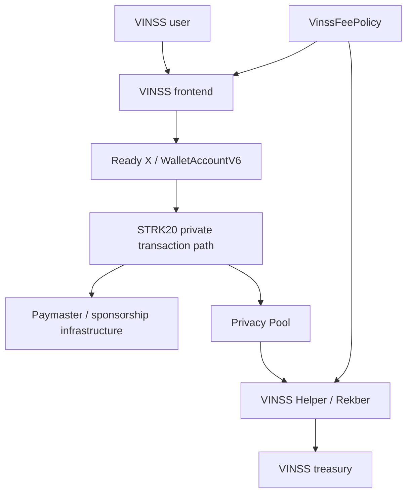
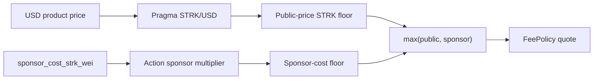
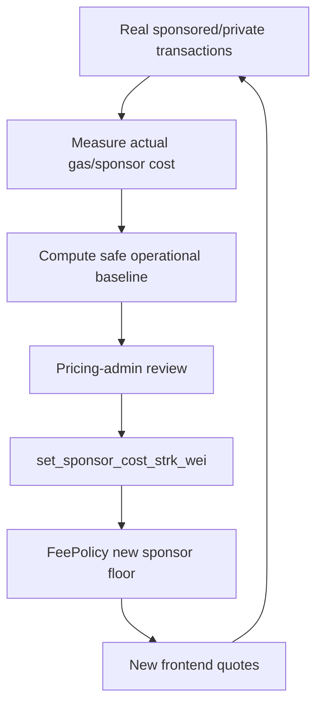
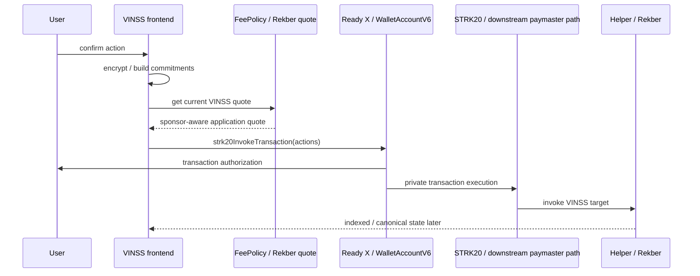
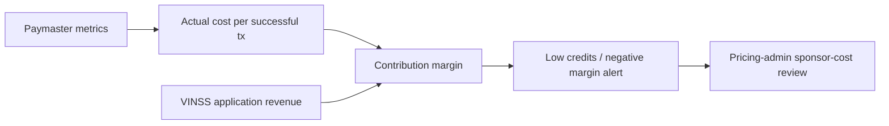
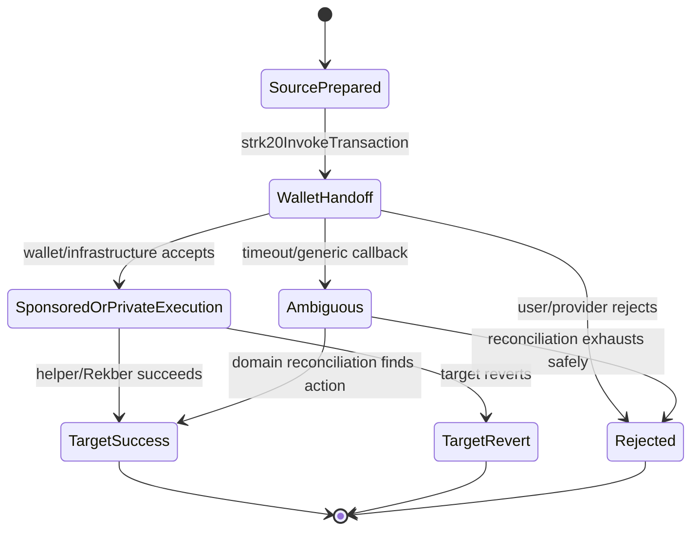
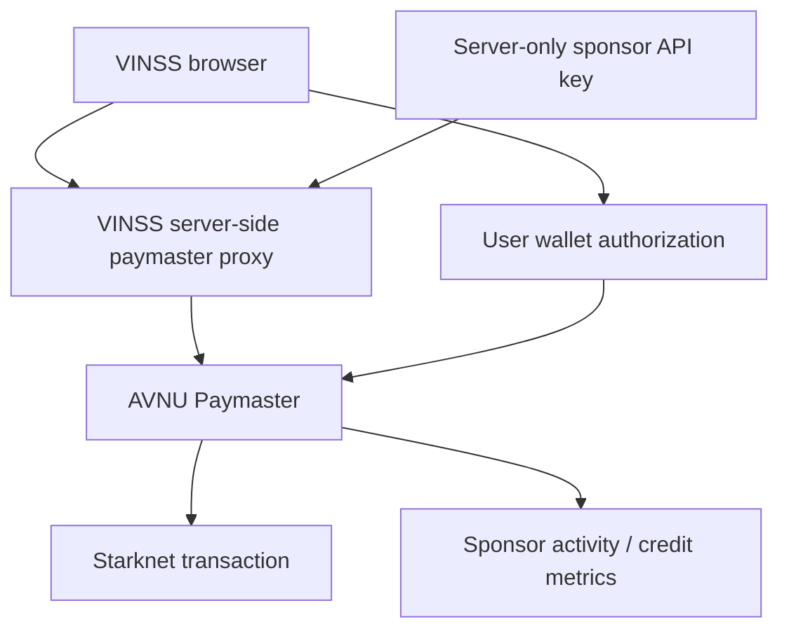
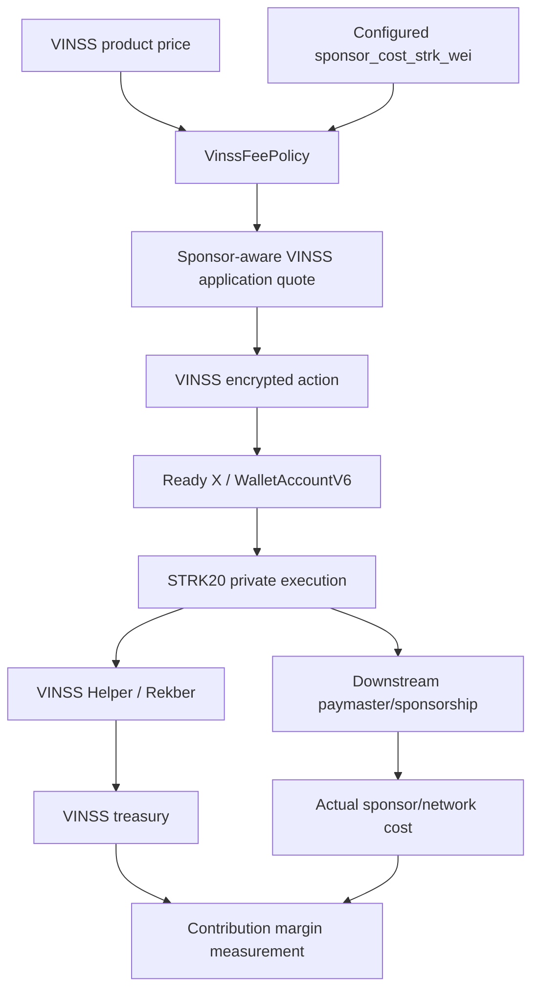

# VINSS Paymaster & Sponsorship Model

This document describes the current VINSS frontend relationship to paymaster infrastructure, gas sponsorship, STRK20 private transaction execution, and sponsor-cost-aware application pricing.

The most important boundary is:

```text
VINSS application fee
!=
Starknet gas
!=
paymaster sponsorship cost
!=
Privacy Pool / STRK20 execution cost
!=
Rekber principal
!=
Rekber funding service fee
```

Current VINSS source is sponsor-cost-aware, but it does not currently implement a direct AVNU Paymaster client or an application-owned AVNU API-key proxy.

---

# Evidence Rule

Do not infer direct paymaster integration from:

```text
@avnu/avnu-sdk exists in package.json
```

or from:

```text
Ready X displays a paymaster/private-transaction charge
```

The implementation claim must follow executable source.

Current executable frontend transaction path is:

```text
WalletAccountV6
    ↓
account.strk20InvokeTransaction(...)
```

for VINSS private Message, Offer, Invite, Private Escrow coordination, and Rekber writes.

---

# Objective

The paymaster/sponsorship model should make these responsibilities explicit:

```text
who constructs the transaction
who authorizes it
who may sponsor gas
who pays application revenue
how sponsorship cost is modeled
how sponsor credits are monitored
what happens if sponsorship disappears
what VINSS must never expose client-side
```

---

# Current Source Map

Primary VINSS sources:

```text
frontend/package.json
frontend/lib/starknet/walletClient.ts
frontend/lib/starknet/feePolicy.ts
frontend/lib/starknet/constants.ts

frontend/lib/deal-room/messaging.ts
frontend/lib/deal-room/offers.ts
frontend/lib/deal-room/invitation.ts
frontend/lib/deal-room/escrow.ts
frontend/lib/deal-room/settlement.ts

contracts/src/fee_policy/types.cairo
contracts/src/fee_policy/vinss_fee_policy.cairo
contracts/src/escrow_rekber/*
```

External infrastructure reference:

```text
AVNU Paymaster documentation / Portal
Ready X wallet behavior
Starknet Wallet API / STRK20 runtime
```

---

# High-Level Sponsorship Boundary



Important:

```text
VINSS frontend does not currently call AVNU PaymasterRpc directly.
```

Paymaster behavior visible during the current Ready X / STRK20 flow belongs to the wallet/private-transaction infrastructure boundary unless/until VINSS adds its own direct integration.

---

# Current Direct AVNU Integration Status

Current `frontend/package.json` declares:

```text
@avnu/avnu-sdk ^4.2.0
```

but current repository code search does not show active frontend imports/calls for:

```text
PaymasterRpc
AVNU_API_KEY
x-paymaster-api-key
paymaster.avnu.fi
```

Current VINSS action modules instead use:

```text
account.strk20InvokeTransaction(...)
```

---

## Correct Current Claim

The accurate architecture statement is:

> VINSS private transaction modules hand STRK20 action bundles to the connected WalletAccountV6. Any paymaster behavior used by that wallet/private transaction infrastructure is downstream of VINSS's current transaction construction.

---

## Incorrect Current Claim

Do not write:

```text
VINSS frontend directly calls AVNU Paymaster API for every transaction.
```

That is not supported by current source.

---

# AVNU Dependency Boundary

The presence of:

```text
@avnu/avnu-sdk
```

means the dependency is available to the frontend package.

It does not prove:

```text
paymaster API key configured
AVNU credits funded
gasfree sponsorship enabled
gasless token mode enabled
sponsor-activity monitoring enabled
```

---

# External Paymaster Modes

Current AVNU documentation distinguishes two broad modes:

| Mode | Who pays gas | Typical requirement |
|---|---|---|
| Gasfree / sponsored | Application/sponsor credits | Portal + API key/credits |
| Gasless / gas-token | User in a supported token | Paymaster provider; no sponsor-credit model required in the same way |

These are external infrastructure capabilities.

VINSS should not claim either mode as its own current source behavior without explicit integration/evidence.

---

# Current VINSS Private Transaction Primitive

Current VINSS private write modules use:

```text
account.strk20InvokeTransaction(actions)
```

Current action arrays can contain:

```text
withdraw
transfer
invoke
```

depending on the feature.

---

# Private Transaction Callers

| Feature | Current frontend primitive |
|---|---|
| Message | `strk20InvokeTransaction` |
| Offer | `strk20InvokeTransaction` |
| Invite CREATE | `strk20InvokeTransaction` |
| Invite CONSUME | `strk20InvokeTransaction` |
| Private Escrow coordination | `strk20InvokeTransaction` |
| Rekber funding | `strk20InvokeTransaction` |
| Rekber release/refund/workflow | `strk20InvokeTransaction` |
| Settlement Certificate claim | `account.execute` — intentionally public, not this private path |


# Paymaster Is Not the VINSS Revenue Transfer

Application revenue is represented explicitly in VINSS private transaction bundles/contracts.

Examples:

```text
withdraw quoted VINSS fee
    ↓
wallet creates/fills OpenNote flow
    ↓
OPEN transfer / helper return
    ↓
VINSS treasury receives application revenue
```

That application fee is not the same thing as the transaction's gas sponsorship cost.

---

# Sponsor-Cost-Aware FeePolicy

`VinssFeePolicy` stores:

```text
sponsor_cost_strk_wei
```

as configurable pricing state.

The constructor rejects:

```text
sponsor_cost_strk_wei = 0
```

so current policy explicitly expects a nonzero sponsorship-cost baseline.

---

## Pricing Formula

For flat FeePolicy actions, current contract computes:

```text
public_price_floor
    = configured USD base converted to STRK

sponsor_floor
    = sponsor_cost_strk_wei * sponsor_multiplier(action)

quote_fee(action)
    = max(public_price_floor, sponsor_floor)
```

---

# Current FeePolicy Base Prices

| Action | USD micros | USD value |
|---|---|---|
| Room activation | 250,000 | $0.25 |
| Message | 150,000 | $0.15 |
| Offer | 250,000 | $0.25 |
| Rekber minimum policy base | 750,000 | $0.75 |

These are current contract constants.

The actual STRK quote still depends on:

```text
Pragma STRK/USD oracle
and
sponsor-cost floor
```

---

# Flat Sponsor Margin

Current contract constant:

```text
FLAT_SPONSOR_MARGIN_MULTIPLIER = 2
```

applies to:

```text
room activation
message
offer
```

So their sponsor-aware pricing floor is:

```text
2 × configured sponsor_cost_strk_wei
```

---

# Rekber Sponsor Reserve

Current FeePolicy constants define:

```text
REKBER_RESERVED_SPONSORED_ACTIONS = 6
FLAT_SPONSOR_MARGIN_MULTIPLIER = 2

REKBER_SPONSOR_MARGIN_MULTIPLIER
    = 2 × 6
    = 12
```

Therefore the `FEE_ACTION_REKBER` sponsor floor is:

```text
12 × sponsor_cost_strk_wei
```

---

## What the Six-Action Reserve Means

The reserve is a pricing/economics allowance for a Rekber lifecycle.

It is not:

```text
six prepaid on-chain transactions stored inside FeePolicy
```

and it is not:

```text
proof that an AVNU account currently has six transaction credits reserved
```

---

# FeePolicy Is Not a Paymaster

`VinssFeePolicy`:

```text
quotes application fees
reads sponsor-cost baseline
applies sponsor margin
uses Pragma oracle
```

It does not:

```text
sign a Starknet transaction
submit a sponsored transaction
hold an AVNU API key
debit AVNU Portal credits
replace the connected wallet
```

---

# Sponsor Cost Is an Operator Pricing Input

`sponsor_cost_strk_wei` represents the configured sponsor-cost baseline used to protect VINSS economics.

The pricing admin can update it through:

```text
set_sponsor_cost_strk_wei(new_cost)
```

subject to contract guards.

---

## Do Not Treat It as a Live Oracle

`sponsor_cost_strk_wei` is not automatically fetched from AVNU transaction-cost analytics by the current contract.

It must be configured/updated by the pricing-admin process.

---

# Sponsor Floor Diagram



---

# Room Activation Sponsor Economics

Invite CREATE uses:

```text
quoteRoomActivationFee()
```

which resolves the Invite contract's FeePolicy and requests:

```text
FEE_ACTION_ROOM_ACTIVATION = 1
```

The FeePolicy quote therefore already includes the sponsor-aware floor.

---

# Message Sponsor Economics

Message send uses:

```text
quoteMessageFee()
```

which requests:

```text
FEE_ACTION_MESSAGE = 2
```

and therefore includes:

```text
max($0.15 converted to STRK, 2 × sponsor_cost)
```

under current contract constants.

---

# Offer Sponsor Economics

Offer send uses:

```text
quoteOfferFee()
```

which requests:

```text
FEE_ACTION_OFFER = 3
```

and therefore includes:

```text
max($0.25 converted to STRK, 2 × sponsor_cost)
```

under current contract constants.

---

# Rekber Funding Economics

Frontend funding does not directly call:

```text
FeePolicy.quote_fee(4)
```

Current funding calls:

```text
Rekber.quote_rekber_fee(token, principal)
```

because Rekber combines:

```text
2% principal fee
+ / vs
FeePolicy-backed minimum / lifecycle reserve floor
```

according to canonical Rekber rules.

---

# Rekber Workflow Fee Boundary

Current frontend `quoteRekberWorkflowFee()` deliberately does not use:

```text
FEE_ACTION_REKBER
```

for selected workflow actions because action 4 includes the six-action sponsor reserve and would be much larger than the intended per-workflow revenue charge.

Current executable frontend returns:

```text
3 STRK
```

after resolving the Rekber revenue FeePolicy.

---

## Important Documentation Nuance

The comment above `quoteRekberWorkflowFee()` says:

```text
read the canonical Rekber action quote from FeePolicy instead of hardcoding
```

but executable code currently returns:

```text
3n * 10n ** 18n
```

after intentionally avoiding FeePolicy action 4.

Executable behavior is the source of truth.

---

# Sponsor Reserve Is Not Revenue Profit

If a FeePolicy quote contains a sponsor-cost floor, that floor is economically intended to cover expected sponsorship/private-transaction burden.

Do not classify the entire quoted amount as:

```text
pure VINSS profit
```

without subtracting actual operating sponsorship/network costs.

---

# Unit Economics

A useful operating equation is:

```text
net contribution per action
=
VINSS application revenue
- actual sponsor/paymaster cost
- other variable infrastructure cost
```

For Rekber also separate:

```text
principal
funding fee
workflow fees
resolution fee/revenue
```

---

# Observed Cost vs Configured Sponsor Cost

These are separate values:

```text
configured sponsor_cost_strk_wei
    pricing assumption

actual paymaster spend
    operational measurement
```

Do not assume they remain equal over time.

---

# Sponsor-Cost Update Loop

A production economics loop should be:



Current VINSS source implements the FeePolicy/update side.

Automatic AVNU-metrics-to-contract updating is not implemented.

---

# External AVNU Gasfree Model

Current AVNU documentation describes gasfree sponsorship as:

```text
dapp creates an API key
dapp funds sponsor credits
PaymasterRpc uses sponsored fee mode
credits pay users' gas
```

AVNU documentation currently lists:

```text
Sepolia: free/unlimited testing for sponsor setup
Mainnet: prepaid STRK credits
```

That is an external option for a future explicit VINSS integration.

---

# External AVNU Gasless Model

AVNU also documents gas-token mode where the user can pay gas using supported tokens rather than requiring the dapp to sponsor all gas.

This differs economically from:

```text
VINSS/operator sponsors the gas
```

and should be modeled separately if VINSS later supports it explicitly.

---

# API Key Security Boundary

If VINSS later implements AVNU gasfree sponsorship directly, an AVNU sponsor API key must not be exposed through:

```text
NEXT_PUBLIC_AVNU_API_KEY
browser bundle
localStorage
wallet calldata
public GitHub source
```

---

## Recommended Future Direct Integration

AVNU's current gasfree documentation recommends keeping the sponsor API key server-side, including a Next.js server proxy pattern.

For VINSS this would require an explicit architecture decision because:

```text
current frontend is not using such a proxy
current backend role should remain privacy-minimized
the proxy must not receive deal plaintext/private keys
```

---

# Future Proxy Privacy Rule

A future paymaster proxy should receive only what the paymaster protocol requires.

It must not receive:

```text
roomSecret
groupSecret
pairwise direct key
decrypted Message body
Offer terms
Rekber unused capability preimages
Invite #k
```

merely to sponsor gas.

---

# Paymaster Is Not a Decryption Service

Gas sponsorship does not require the paymaster to understand private business semantics.

The transaction infrastructure may observe transaction-level data required for sponsorship/execution, but VINSS private payload should already be encrypted before the wallet/paymaster boundary.

---

# Current Transaction Preparation Boundary

Current private action architecture is:



---

# Application Fee vs Sponsorship Table

| Component | Who defines it | Purpose | Current VINSS source |
|---|---|---|---|
| Product/application base | VinssFeePolicy constants | Revenue/product price | Yes |
| Sponsor-cost baseline | FeePolicy pricing admin | Protect unit economics | Yes |
| Sponsor multiplier | FeePolicy constants | Margin/reserve sizing | Yes |
| Actual gas price | Starknet/runtime | Transaction execution | External/dynamic |
| Paymaster eligibility | Paymaster/wallet infrastructure | Whether sponsorship is available | Not controlled by FeePolicy |
| Sponsor credits | Paymaster provider account | Fund gasfree transactions | No direct VINSS integration in source |
| Rekber principal | User deal | Escrowed value | Yes, separate from gas |


# What `sponsor_cost_strk_wei` Does Not Guarantee

- It does not guarantee the transaction will be sponsored.
- It does not guarantee a paymaster provider is online.
- It does not guarantee Ready X accepts the transaction.
- It does not guarantee sponsor credits are sufficient.
- It does not guarantee the actual gas cost equals the configured baseline.
- It does not guarantee the user pays zero gas.
- It does not guarantee the transaction succeeds on-chain.


# AVNU Availability Boundary

AVNU's public terms/documentation state that paymaster sponsorship is optional and not guaranteed.

Therefore even with a future direct integration, VINSS must design a failure path for:

```text
no sponsorship
credits depleted
rate limit
provider unavailable
transaction ineligible
transaction reverted
```

---

# Do Not Make Paymaster a Single Point of Semantic Truth

Paymaster availability should affect:

```text
transaction execution UX / economics
```

not:

```text
what an Offer means
who is payer/payee
whether Rekber is settled
who owns a Certificate
```

Those remain application/contract authority.

---

# Failure Isolation

Correct degradation model:

```text
paymaster unavailable
    -> private transaction may fail or require alternate gas mode
    -> do not mutate local state into confirmed success
    -> do not change contract semantics
```

---

# Paymaster Error vs Contract Error

| Symptom | Possible layer |
|---|---|
| Paymaster service error | Sponsor/paymaster infrastructure |
| Wallet API payload error | Wallet/strict calldata formatting |
| Insufficient sponsorship credits | Sponsor account |
| FeePolicy quote failure | VINSS pricing/oracle/RPC |
| Privacy transaction rejected | STRK20/Privacy Pool |
| Target revert | VINSS helper/Rekber contract |
| Callback timeout | Mobile wallet transport/recovery |


# Do Not Patch Cairo First

When a wallet reports a paymaster/private-transaction error, first isolate:

```text
FeePolicy quote
wallet API payload
address/felt formatting
private-note balance
paymaster/sponsorship availability
Privacy Pool execution
target contract revert
```

before changing a contract that already passes its canonical tests.

---

# Current Sponsor Multipliers

| Fee action | Sponsor multiplier |
|---|---|
| Room activation | 2 |
| Message | 2 |
| Offer | 2 |
| Rekber FeePolicy action | 12 (= 2 × 6 reserved sponsored actions) |


# Why Rekber Multiplier Is Larger

Rekber is not a one-action product flow.

The current FeePolicy reserves for multiple expected lifecycle actions so initial Rekber pricing is less likely to make the operator subsidize an entire post-funding lifecycle unexpectedly.

---

# Rekber Reserve Is Conservative Pricing

The reserve should be understood as:

```text
expected lifecycle sponsor-cost protection
```

not exact accounting for a deterministic number of future transactions.

A real deal can:

```text
release early
refund
dispute
revise multiple times
resolve
```

with different operational costs.

---

# Funding Fee Is Separate

Rekber funding's service fee is explicitly separate from principal.

Paymaster/network sponsorship must also remain separate from:

```text
principal refund math
resolver allocation
Certificate state
```

---

# Refund Economics

A principal refund should not be documented as:

```text
refund every historical gas/paymaster/application cost
```

Current Rekber contract model treats the funding service fee as non-refundable while returning principal according to settlement/refund rules.

Paymaster/network cost is an execution expense, not part of custody principal.

---

# Revenue Accounting

Recommended operational accounting categories:

```text
gross VINSS application revenue
minus paymaster sponsorship spend
minus other transaction infrastructure spend
minus backend/storage/provider variable cost
=
contribution margin
```

Keep Rekber principal completely outside revenue.

---

# Sponsor Activity Monitoring

If VINSS later uses AVNU Portal/API directly, current AVNU sponsor-activity API can expose metrics such as:

```text
transaction count
successful transaction count
reverted transaction count
gas fees
STRK gas fees
remaining credits
```

This is useful for economics/operations.

It is not currently wired into VINSS source.

---

# Monitoring Loop



---

# Metrics That Matter

| Metric | Why it matters |
|---|---|
| Sponsor credits remaining | Avoid sudden gasfree outage |
| Successful sponsored tx | Actual useful transactions |
| Reverted sponsored tx | Cost without product success |
| Average sponsor cost / success | Set realistic sponsor baseline |
| P95 sponsor cost | Protect against volatility |
| Revenue / action | Gross unit economics |
| Net contribution / action | Sustainable economics |
| Wallet rejection rate | UX / payload quality |
| Paymaster error rate | Provider reliability |


# No API Key in Public Frontend

Future sponsored integration must preserve:

```text
public browser cannot retrieve sponsor API key
```

because a leaked key can allow unauthorized consumption of sponsor credits subject to provider controls.

---

# Rate-Limit Boundary

A sponsor proxy/API can be abused independently of VINSS smart-contract security.

Future integration should consider:

```text
authentication / origin policy
per-wallet quotas
per-action eligibility
rate limits
budget ceilings
abuse detection
credit alerts
```

without requiring private deal plaintext.

---

# Sponsor Eligibility Policy

If VINSS explicitly sponsors gas in the future, sponsor eligibility should be a product/economics policy.

Examples could include:

```text
first room activation
limited daily messages
completed Rekber users
promotional subsidy
grant-funded campaign
premium tier
```

but none of those policies are implemented merely by the current FeePolicy sponsor reserve.

---

# FeePolicy vs Subsidy

FeePolicy currently protects price against a configured sponsor cost.

A grant/subsidy can reduce the operator's real net sponsorship burden, but it should not silently redefine:

```text
contract quote semantics
principal accounting
private payload format
```

---

# Subsidy Accounting

If external subsidy covers sponsorship:

```text
gross sponsor cost
- subsidy reimbursement
= net operator sponsor cost
```

That operational accounting can inform later `sponsor_cost_strk_wei` updates.

---

# Sepolia vs Mainnet

External paymaster behavior can differ materially between testnet and mainnet.

AVNU documentation currently describes sponsored Sepolia testing as free/unlimited under its Portal flow, while mainnet sponsorship consumes real credits.

Therefore:

```text
Sepolia gasfree behavior
!=
mainnet unit economics
```

---

# Testing Principle

Do not validate paymaster economics only on Sepolia.

Mainnet readiness requires actual measured cost/credit behavior on the intended production integration.

---

# Current VINSS Testing Gap

Current repository has no dedicated frontend test file named around:

```text
paymaster
sponsorship
AVNU
```

and current source does not implement direct AVNU API calls.

Therefore current paymaster confidence is mostly:

```text
wallet/STRK20 integration evidence
FeePolicy contract tests
manual operational observation
external provider behavior
```

---

# Recommended FeePolicy Sponsor Tests

- [ ] `quote_fee` chooses USD price floor when it is larger.
- [ ] `quote_fee` chooses sponsor floor when it is larger.
- [ ] Room activation multiplier remains 2.
- [ ] Message multiplier remains 2.
- [ ] Offer multiplier remains 2.
- [ ] Rekber multiplier remains 12.
- [ ] `set_sponsor_cost_strk_wei(0)` is rejected.
- [ ] Only pricing admin can update sponsor cost.
- [ ] Updated sponsor cost changes future quotes.
- [ ] Stale/invalid Pragma oracle data is rejected.


# Recommended Frontend Sponsor Tests

- [ ] `quoteMessageFee()` reflects current FeePolicy after sponsor-cost update.
- [ ] `quoteOfferFee()` reflects current FeePolicy after sponsor-cost update.
- [ ] `quoteRoomActivationFee()` reflects current FeePolicy after sponsor-cost update.
- [ ] Rekber funding uses `quote_rekber_fee`, not direct `quote_fee(4)`.
- [ ] `quoteRekberWorkflowFee()` does not accidentally charge the 12x lifecycle reserve.
- [ ] No frontend code requires an AVNU API key in the current architecture.
- [ ] No sponsor key can be bundled through a `NEXT_PUBLIC_*` variable.


# Recommended Wallet/Paymaster E2E

For current wallet-mediated architecture:

```text
VINSS prepares encrypted action
    ↓
FeePolicy quote includes sponsor floor
    ↓
Ready X displays/authorizes private transaction
    ↓
transaction succeeds
    ↓
VINSS action appears on-chain/index
    ↓
record actual wallet/paymaster/network cost separately
    ↓
compare cost to VINSS application revenue
```

---

# Recommended Failure E2E

- [ ] Paymaster/private infrastructure unavailable.
- [ ] Insufficient sponsor credits if direct gasfree integration is later added.
- [ ] Wallet reports paymaster error.
- [ ] Wallet callback times out after transaction submission.
- [ ] Target contract reverts after sponsorship path begins.
- [ ] FeePolicy RPC fails before wallet handoff.
- [ ] Pricing sponsor floor is below observed cost for stress scenario.


# Current Recovery Boundary

Paymaster/wallet callback state is not domain finality.

After an ambiguous callback, VINSS should use:

```text
Message -> exact locator Discovery
Offer -> exact authenticated locator Discovery
Invite -> get_invite(commitment)
Private Escrow -> exact locator Discovery
Rekber -> get_custody / events
Certificate -> is_claimed
```

before deciding whether a value-moving action should be retried.

---

# Never Retry Blindly

A generic:

```text
PAYMASTER_ERROR
TIMEOUT
UNKNOWN_ERROR
```

after wallet handoff may not prove the underlying action never executed.

Blind retry can create duplicate application actions or dangerous repeated value-moving attempts.

---

# Privacy Boundary

Paymaster infrastructure should not require plaintext VINSS business context.

Private payload encryption occurs before the wallet transaction is submitted.

Paymaster/network observers may still observe transaction-level metadata necessary for execution.

---

# Publicly Observable Metadata

- Transaction occurrence/timing.
- Wallet/account transaction behavior where visible.
- Privacy Pool interaction.
- Target helper/Rekber interaction where visible.
- Gas/fee execution metadata.
- Public Rekber token/principal/state.
- Ciphertext/commitment data in private helpers.


# Not Needed for Sponsorship

- Direct Message plaintext.
- Offer terms.
- roomSecret.
- groupSecret.
- P-256 private key.
- pairwise key.
- Rekber unused capability preimages.
- Invite fragment key.


# Paymaster Does Not Change Encryption

Whether gas is:

```text
sponsored
paid by user in another token
paid normally
```

must not silently change:

```text
Message V2 envelope
Offer V2 envelope
Private Escrow V2 envelope
Rekber capability commitments
```

---

# Paymaster Does Not Change Authorization

Gas sponsorship is not permission to:

```text
send a Message as another wallet
Accept another user's Offer
release Rekber funds
claim another user's Certificate
```

The connected wallet and contract/capability rules remain authoritative.

---

# Sponsor Credits Are Operational State

If VINSS later uses provider credits directly, those credits are:

```text
operator infrastructure state
```

not:

```text
user escrow balance
VINSS treasury revenue
on-chain Rekber reserve
```

---

# Current Separation of Concerns

| Concern | Current owner |
|---|---|
| Private payload encryption | VINSS frontend |
| Transaction approval | Connected wallet |
| Private STRK20 execution | Wallet/private transaction stack |
| Actual paymaster sponsorship | Downstream wallet/paymaster infrastructure unless direct integration added |
| Application price | VinssFeePolicy / Rekber quote |
| Sponsor-cost assumption | VinssFeePolicy pricing admin |
| Escrow principal | VinssEscrowRekber |
| Revenue destination | VINSS treasury |


# Security Invariants

| ID | Invariant |
|---|---|
| PM1 | VINSS frontend currently does not require an AVNU sponsor API key. |
| PM2 | `@avnu/avnu-sdk` dependency alone is not direct integration evidence. |
| PM3 | Current private writes use `WalletAccountV6.strk20InvokeTransaction`. |
| PM4 | FeePolicy sponsor floor is pricing, not a paymaster transaction. |
| PM5 | Application revenue is separate from gas/paymaster cost. |
| PM6 | Rekber principal is never sponsorship budget. |
| PM7 | Sponsor API keys must never be public if direct gasfree integration is added. |
| PM8 | Paymaster availability cannot override contract authorization. |
| PM9 | Ambiguous wallet/paymaster callback must be reconciled before retry. |
| PM10 | Private business plaintext is not required to sponsor gas. |


# Economic Invariants

| ID | Invariant |
|---|---|
| E1 | Room/Message/Offer sponsor floor uses multiplier 2. |
| E2 | Rekber FeePolicy action sponsor floor uses multiplier 12. |
| E3 | Configured sponsor cost and actual sponsor spend are distinct. |
| E4 | Fee quote is the max of public-price floor and sponsor floor for flat actions. |
| E5 | Rekber funding gets its final fee from `quote_rekber_fee`. |
| E6 | Selected Rekber workflow fee intentionally avoids FeePolicy action 4 reserve. |
| E7 | Gross application revenue is not equal to contribution margin. |
| E8 | Subsidy/grant reduces net sponsor cost but does not alter principal semantics. |


# Operational Invariants

| ID | Invariant |
|---|---|
| O1 | Sponsor credits/availability must be monitored if direct gasfree integration is introduced. |
| O2 | Reverted sponsored transactions must be included in cost analysis. |
| O3 | Mainnet economics need mainnet measurement. |
| O4 | Provider availability is not guaranteed. |
| O5 | Pricing-admin updates should follow measured cost review. |
| O6 | Sponsorship outage must not mutate local state into confirmed success. |


# Incorrect Statements to Avoid

- VINSS currently calls AVNU PaymasterRpc directly.
- VINSS currently exposes an AVNU API key in frontend env.
- `@avnu/avnu-sdk` means gas sponsorship is already integrated.
- FeePolicy is the paymaster.
- `sponsor_cost_strk_wei` is automatically synchronized from AVNU.
- The entire FeePolicy quote is pure profit.
- Rekber sponsor reserve is six prepaid AVNU transactions.
- Sepolia free sponsorship proves mainnet is free.
- Paymaster error proves the target transaction never executed.
- Paymaster sponsorship makes a transaction authorized.
- Paymaster can decrypt VINSS Offer/Message payloads.
- Refunding Rekber principal also refunds all historical gas/paymaster cost.


# Accurate Statements

- Current VINSS private transactions are submitted through WalletAccountV6 STRK20 execution.
- Paymaster behavior in the current flow is downstream of the wallet/private transaction infrastructure.
- VinssFeePolicy prices actions with a sponsor-cost-aware floor.
- Flat actions reserve 2x the configured sponsor cost.
- Rekber FeePolicy action reserves 12x the configured sponsor cost.
- Actual sponsorship spend should be measured separately from configured sponsor cost.
- Direct AVNU gasfree integration would require explicit code, API-key security, credits, monitoring, and failure handling.


# Current Source Verification Checklist

- [ ] `@avnu/avnu-sdk` remains only a dependency unless source imports are intentionally added.
- [ ] No `PaymasterRpc` current VINSS source path is assumed without code evidence.
- [ ] No AVNU sponsor API key is present in public frontend configuration.
- [ ] All current private transaction modules still call `strk20InvokeTransaction`.
- [ ] FeePolicy action constants match frontend action numbers.
- [ ] FeePolicy sponsor multipliers match current Cairo constants.
- [ ] Rekber funding still uses `quote_rekber_fee`.


# FeePolicy Deployment Checklist

- [ ] Pricing admin verified.
- [ ] Pragma oracle verified.
- [ ] STRK/USD pair verified.
- [ ] `sponsor_cost_strk_wei` set from a documented cost assumption.
- [ ] Oracle max age configured.
- [ ] Minimum oracle sources configured.
- [ ] Room activation quote sampled.
- [ ] Message quote sampled.
- [ ] Offer quote sampled.
- [ ] Rekber quote sampled.


# Mainnet Economics Checklist

- [ ] Actual mainnet private transaction cost measured.
- [ ] Successful and reverted costs separated.
- [ ] P50/P95 sponsor cost calculated.
- [ ] Configured sponsor cost compared to actual.
- [ ] Room/message/offer contribution margin calculated.
- [ ] Rekber lifecycle contribution margin modeled.
- [ ] Credit runway known if using direct gasfree sponsorship.
- [ ] Low-credit alert exists if direct credits are used.
- [ ] Grant/subsidy accounting is separated from user revenue.


# Future Direct AVNU Integration Checklist

- [ ] Explicit architecture decision approved.
- [ ] Use current official Paymaster API/docs.
- [ ] Keep API key server-side.
- [ ] Do not add `NEXT_PUBLIC_AVNU_API_KEY`.
- [ ] Proxy receives no deal plaintext/private keys.
- [ ] Define sponsor eligibility policy.
- [ ] Define per-wallet/action limits.
- [ ] Define credit/budget ceiling.
- [ ] Define failure/fallback behavior.
- [ ] Add sponsor-activity monitoring.
- [ ] Add Sepolia integration tests.
- [ ] Add mainnet cost validation.
- [ ] Update this document from implemented source, not design intent.


# Failure Checklist

- [ ] Classify paymaster error separately from contract revert.
- [ ] Inspect wallet API payload/felt formatting.
- [ ] Inspect target network.
- [ ] Inspect FeePolicy quote.
- [ ] Inspect sponsor/private-note balance.
- [ ] Inspect provider availability.
- [ ] Reconcile exact domain state before retry.
- [ ] Never change principal accounting to compensate for gas error.


# Privacy Checklist

- [ ] No sponsor API key in browser.
- [ ] No roomSecret/groupSecret in sponsorship request.
- [ ] No pairwise key in sponsorship request.
- [ ] No Message plaintext in sponsorship request.
- [ ] No Offer terms in sponsorship request.
- [ ] No unused Rekber preimages in sponsorship request.
- [ ] Private payload encrypted before wallet/paymaster boundary.
- [ ] Operational metrics contain only necessary transaction metadata.


# Testing Evidence Matrix

| Evidence | What it proves | What it does not prove |
|---|---|---|
| FeePolicy Cairo tests | Sponsor-floor pricing logic | Actual provider cost |
| Frontend quote test | Correct contract quote usage | Paymaster availability |
| Wallet E2E | Current wallet/private execution | Future direct AVNU integration |
| AVNU Portal metrics | Provider credit/cost activity | VINSS contract correctness |
| Sepolia sponsorship | Testnet integration | Mainnet unit economics |
| Mainnet sponsorship | Production-network provider behavior | Long-term profitability |


# Recommended Evidence Record

```text
VINSS Paymaster / Sponsorship Evidence

Git SHA:
Date:
Network:
Frontend deployment:
Wallet/version:
Wallet API versions:

Execution path:
  WalletAccountV6 STRK20 | direct paymaster integration

Paymaster provider:
Direct VINSS API key integration: yes/no
Sponsor mode:

FeePolicy:
sponsor_cost_strk_wei:

Action:
VINSS application quote:
Actual sponsor/paymaster cost:
Network/private transaction cost:

Transaction hash:
Target helper/Rekber:
Result:

Sponsor credits before:
Sponsor credits after:

Contribution margin estimate:
Known caveats:
```


# Current Architecture State Machine



---

# Future Direct Gasfree Architecture



This diagram is a future architecture option, not current VINSS implementation.

---

# Current vs Future Matrix

| Capability | Current VINSS | Future explicit paymaster option |
|---|---|---|
| Private tx construction | WalletAccountV6 STRK20 | Still wallet-authorized |
| AVNU SDK dependency | Present | May be actively used |
| PaymasterRpc call | Not found in current source | Could be added |
| Sponsor API key | Not current frontend requirement | Server-side only |
| Sponsor credits | Not managed by VINSS source | Portal/API monitored |
| FeePolicy sponsor floor | Implemented | Still useful |
| Automatic sponsor-cost sync | Not implemented | Optional ops automation |


# What Should Stay in wallet-strk20.md

- Wallet Standard discovery.
- `WalletAccountV6` session.
- STRK20 capability detection.
- `strk20InvokeTransaction` primitive.
- Address/felt normalization.
- Mobile wallet recovery.
- `signMessage` vs `account.execute` boundaries.


# What Belongs in paymaster.md

- Direct-vs-downstream paymaster integration status.
- AVNU dependency boundary.
- Sponsor API-key/credit boundary.
- FeePolicy sponsor-cost floor.
- Rekber sponsor reserve.
- Actual-cost vs configured-cost economics.
- Sponsorship monitoring.
- Failure/fallback behavior.
- Subsidy/grant accounting.
- Mainnet sponsorship readiness.


# What Belongs in fee-policy Contract Docs

- Exact Cairo quote formula.
- Pricing admin.
- Pragma oracle guards.
- Constants and action IDs.
- `set_sponsor_cost_strk_wei` contract authorization.
- Cairo test invariants.


# Source Responsibility Matrix

| Source | Responsibility |
|---|---|
| `frontend/package.json` | AVNU SDK dependency availability |
| `walletClient.ts` | WalletAccountV6/private transaction session boundary |
| `feePolicy.ts` | Frontend application/sponsor-aware quote usage |
| `messaging.ts` | Message STRK20 fee/revenue bundle |
| `offers.ts` | Offer STRK20 fee/revenue bundle |
| `invitation.ts` | Invite CREATE/CONSUME bundle |
| `escrow.ts` | Private Escrow coordination bundle |
| `settlement.ts` | Rekber funding/workflow settlement bundles |
| `fee_policy/types.cairo` | Product-price and sponsor-multiplier constants |
| `vinss_fee_policy.cairo` | Sponsor-floor quote logic/admin update |
| AVNU Portal/docs | External sponsorship/credit infrastructure |


# Protocol / Economics Boundaries

Changes that require coordinated review:

```text
sponsor_cost_strk_wei
FLAT_SPONSOR_MARGIN_MULTIPLIER
REKBER_RESERVED_SPONSORED_ACTIONS
REKBER_SPONSOR_MARGIN_MULTIPLIER
FeePolicy action IDs
application USD base prices
Rekber funding quote formula
workflow revenue fee
direct paymaster provider
sponsor eligibility policy
```

---

# Sponsor-Cost Update Rule

Do not change `sponsor_cost_strk_wei` from a single anecdotal transaction.

Prefer:

```text
sample real successful transactions
include reverted/failed spend
calculate representative baseline
include volatility buffer
review product margin
then update pricing admin state
```

---

# Provider Migration Rule

If VINSS later changes paymaster provider or explicitly integrates one:

re-verify:

```text
API/authentication model
wallet compatibility
supported network
fee modes
credit accounting
privacy metadata
rate limits
revert charging
mobile recovery
```

before changing FeePolicy sponsor assumptions.

---

# Mainnet No-Go Conditions

- Actual sponsor cost is unknown.
- Configured sponsor cost is materially below observed production cost without intentional subsidy.
- Direct sponsor API key would be exposed client-side.
- Sponsor credits/runway are unknown for gasfree mode.
- Wallet/paymaster failure cannot be distinguished from target contract failure.
- Ambiguous value-moving callback is blindly retried.
- Mainnet economics are inferred only from Sepolia.
- Rekber principal is counted as revenue/sponsor reserve.
- Application UI claims gas is free without verified current provider behavior.


# Documentation Maintenance Rules

- Re-read current transaction modules before claiming direct paymaster integration.
- Search for actual `PaymasterRpc`/provider calls before documenting AVNU as active code.
- Keep package dependency separate from executable integration.
- Keep application fee separate from gas/paymaster cost.
- Keep FeePolicy sponsor reserve separate from provider credits.
- Keep configured sponsor cost separate from actual measured spend.
- Keep Rekber principal separate from all sponsor accounting.
- Do not publish API keys in docs or `NEXT_PUBLIC_*` env.
- Use current official provider docs for future direct integration details.
- Bind mainnet economics claims to dated measurements.


# Source-of-Truth Order

```text
1. current executable VINSS transaction modules
2. frontend/lib/starknet/walletClient.ts
3. frontend/lib/starknet/feePolicy.ts
4. contracts/src/fee_policy/types.cairo
5. contracts/src/fee_policy/vinss_fee_policy.cairo
6. canonical Rekber quote implementation
7. deployed FeePolicy sponsor-cost configuration
8. actual wallet/paymaster transaction measurements
9. current official paymaster-provider documentation
10. prose documentation
```


# Final Paymaster Boundary Diagram



---

# Bottom Line

The missing `paymaster.md` is useful because Wallet/STRK20 execution and sponsorship economics are related but not the same layer.

The strongest current implementation statement is:

> VINSS does not currently implement a direct AVNU Paymaster client/proxy in its transaction modules. The frontend hands private action bundles to `WalletAccountV6.strk20InvokeTransaction()`, so current paymaster behavior is downstream of the wallet/private transaction stack.

The strongest current dependency statement is:

> `@avnu/avnu-sdk` is present in `frontend/package.json`, but dependency presence is not evidence that gasfree credits, API keys, or PaymasterRpc are actively integrated.

The strongest current pricing statement is:

> `VinssFeePolicy` is sponsor-cost-aware: Room/Message/Offer use a 2× configured sponsor-cost floor, while FeePolicy action 4 uses a 12× Rekber lifecycle floor derived from 2× margin across six reserved sponsored actions.

The strongest current economics statement is:

> `sponsor_cost_strk_wei` is a configured pricing assumption, not the actual live paymaster bill. Production sustainability requires measuring actual sponsorship/network spend and comparing it against VINSS application revenue.

The strongest current Rekber statement is:

> Rekber funding uses `quote_rekber_fee(token, principal)` rather than directly charging FeePolicy action 4, and selected workflow charges intentionally avoid the 12× lifecycle reserve.

The strongest future-integration security statement is:

> If VINSS later adds AVNU gasfree sponsorship directly, sponsor API credentials must remain server-side and the sponsorship proxy must not receive VINSS deal plaintext or private decryption/capability keys.
