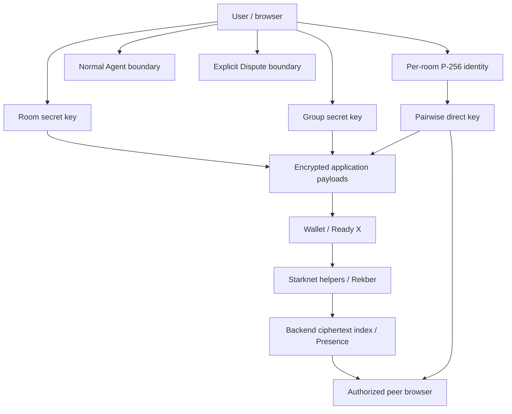
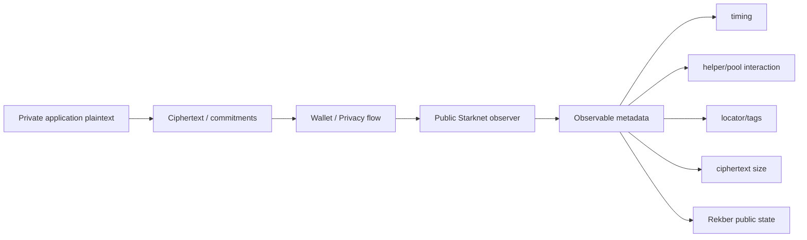
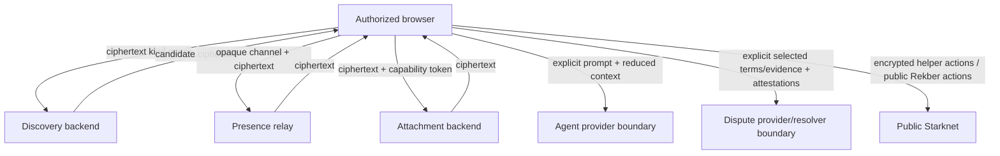
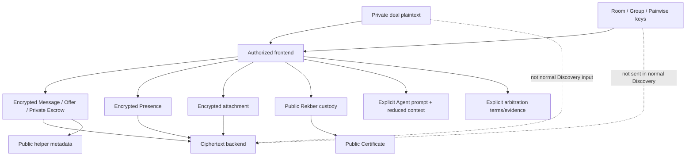

# VINSS Frontend Privacy Model

This document defines the current privacy boundaries implemented by the VINSS frontend.

VINSS privacy is not a claim that all metadata disappears.

It is a set of explicit boundaries around:

```text
who receives plaintext
who holds decryption capability
what is stored locally
what is public on Starknet
what the backend can index without keys
what users explicitly disclose to Agent / Dispute flows
```

The central rule is:

> Normal Message, Offer, and Private Escrow Discovery is ciphertext-first and keyless from the backend perspective, while some other product features intentionally cross into different trust boundaries.

---

# Evidence Rule

This document describes current source behavior.

It does not equate:

```text
implemented privacy boundary
with
formal cryptographic audit
or
perfect anonymity
or
mainnet privacy verification
```

Any live-network privacy claim should be supported by a dated release/build and actual transaction/browser evidence.

---

# Objective

The frontend aims to minimize unnecessary disclosure of sensitive deal context while preserving practical mobile/browser usability.

Current protected application data can include:

```text
direct Message plaintext
Group Message plaintext
Offer terms
Offer relationship metadata
Private Escrow coordination
participant messaging public-key announcements
typing/read Presence payloads
direct attachment plaintext
unused Rekber capability preimages
selected encrypted local history
```

Current public or observable data can still include:

```text
transaction timing
Privacy Pool interaction
helper interaction
action locators
opaque routing tags
payload commitments
ciphertext length/chunk shape
block number
transaction hash
Rekber token
Rekber principal
Rekber fee/timing/state
evidence commitments
resolution allocations
Certificate ownership
```

---

# Current Source Map

Primary privacy sources:

```text
frontend/lib/privacy/channelKey.ts
frontend/lib/privacy/participantKeys.ts
frontend/lib/privacy/messageRouting.ts
frontend/lib/privacy/envelope.ts
frontend/lib/privacy/presence.ts
frontend/lib/privacy/encryptedChatCache.ts
frontend/lib/privacy/directAttachments.ts

frontend/lib/deal-room/messaging.ts
frontend/lib/deal-room/offers.ts
frontend/lib/deal-room/escrow.ts
frontend/lib/deal-room/settlement.ts
frontend/lib/deal-room/rekberSecrets.ts
frontend/lib/deal-room/disputeAgent.ts

frontend/hooks/room/useDirectConversation.ts
frontend/hooks/room/useGroupConversation.ts
frontend/hooks/room/useRoomParticipants.ts
frontend/hooks/room/useRoomOffers.ts
frontend/hooks/room/useRoomEscrow.ts
frontend/hooks/room/useRoomAgent.ts

frontend/components/agent/AgentPanel.tsx
```

---

# Privacy Architecture



---

# Privacy Is Domain-Specific

VINSS does not use one universal key for all private data.

Current major key domains:

| Domain | Key source | Main use |
|---|---|---|
| Room | `roomSecret` -> SHA-256 | participant Presence, selected local encrypted caches |
| Group | `groupSecret` -> SHA-256 | Group Message / Group membership Presence |
| Direct pairwise | P-256 ECDH -> HKDF | direct Message, Offer, Private Escrow, direct Presence |
| Attachment | direct pairwise key -> HKDF | direct attachment bytes |
| Invite | random AES-256 key | Invite capability payload |

---


# Room-Level Key

The active room-level key path is:

```text
SHA-256(
  "VINSS_ROOM_KEY_V1:" + roomSecret
)
```

implemented by:

```text
deriveChannelKeyFromRoomSecret(roomSecret)
```

---


## Current Room Secret

`generateRoomSecret()` currently creates:

```text
16 random bytes
```

encoded as hex.

---


## Room Key Is VINSS Application Keying

The room channel key is an application symmetric key.

It is not the same thing as:

```text
STRK20 note encryption
Privacy Pool viewing-key ECDH
wallet account private key
```

---


# Scaffolded STRK20-Native Channel ECDH

`channelKey.ts` also contains:

```text
deriveChannelKeyViaEcdh()
```

using Stark-curve ECDH against a recipient viewing public key.

Current source explicitly marks this path:

```text
scaffolded
not wired to current UI
```

because the required registered viewing-key lookup is not integrated.

---


## Documentation Rule

Do not describe current room/private Chat encryption as:

```text
STRK20 viewing-key ECDH
```

unless the active UI is actually switched to that implementation.

---


# Group-Level Key

Current Group key derivation:

```text
SHA-256(
  "VINSS_GROUP_KEY_V1:" + groupSecret
)
```

---


## Room/Group Domain Separation

The room and Group derivations use different domain strings.

Therefore identical secret bytes do not intentionally map to the same symmetric key.

---


# Per-Room P-256 Messaging Identity

Direct communication uses a browser-generated P-256 ECDH identity scoped by:

```text
roomId
+
canonical Starknet wallet address
```

---


## IndexedDB Storage

Current database:

```text
vinss-messaging-keys
```

store:

```text
identities
```

---


## Persisted Identity

Current shape:

```text
id
walletAddress
publicKey
privateKey: CryptoKey
```

---


# Non-Exportable Private Key

Creation sequence:

```text
generate P-256 keypair extractable=true
    ↓
export public raw key
    ↓
temporarily export private JWK
    ↓
re-import private key extractable=false
    ↓
persist CryptoKey in IndexedDB
```

---


## What Non-Exportable Protects

Normal WebCrypto export APIs cannot export the persisted private key.

This reduces accidental raw-key disclosure.

---


## What Non-Exportable Does Not Protect

It does not protect against a compromised same-origin execution environment.

Malicious JavaScript that can access the `CryptoKey` object may still be able to call:

```text
deriveBits
```

with it.

Therefore:

```text
non-exportable
!=
secure enclave
```

---


# Messaging Identity Stability

Current source guards concurrent identity creation using:

```text
in-memory identityRequests map
+
IndexedDB add-if-absent
```

so Chat, Offer, and Private Escrow do not accidentally use different P-256 identities for the same room/wallet.

---


## Address Normalization Migration

Starknet addresses are canonicalized numerically.

Existing identities created under a different leading-zero representation can be migrated to the canonical key without generating a new private key.

---


# Direct Pairwise Key

Current direct key derivation:

```text
self P-256 private key
+
peer P-256 public key
    ↓
ECDH deriveBits(256)
    ↓
HKDF-SHA-256
```

with:

```text
salt = SHA-256("VINSS_ROOM:" + roomId)
info = VINSS_DIRECT_MESSAGE_KEY_V1
output = 256 bits
```

---


## Pairwise Property

Conceptually:

```text
Alice(privA, pubB)
    ==
Bob(privB, pubA)
```

Other room participants cannot derive this key merely from the shared room secret.

---


## Direct Key Is Derived, Not Persisted

VINSS does not currently persist the final pairwise key as a dedicated localStorage record.

It is re-derived from the persistent P-256 identity and peer public key.

---


# Direct Domains Reusing Pairwise Base Key

Current direct pairwise base key participates in:

```text
Direct Message encryption/routing
Private Offer encryption/routing
Private Escrow coordination
Direct typing/read Presence
direct attachment subkey derivation
```

Each higher-level protocol adds separate domain/version semantics.

---


# Opaque Per-Action Routing

Current Message/Offer/Private Escrow private routing uses HMAC-derived tags.

Conceptual input:

```text
VINSS_MSG_ROUTE_V2
role
canonical identity string
action locator
```

under the secret routing key.

---


## HMAC Primitive

Current implementation uses:

```text
HMAC-SHA-256
```

and truncates to:

```text
31 bytes / 248 bits
```

for a Starknet-safe felt.

---


## Zero Tag

If the truncated value is zero, current code returns:

```text
1
```

because helper contracts reject zero routing tags.

---


## Per-Action Change

The action locator is part of the HMAC input.

Therefore repeated messages between the same two identities do not intentionally reuse the same public sender/recipient tag.

---


## Routing Tag Limit

Opaque tags reduce stable plaintext identity exposure.

They do not hide:

```text
that a helper action occurred
timing
ciphertext size
pool/helper interaction
```

---


# Action Locator

Current action locator generation combines:

```text
application channel/pairwise key bytes
+
31 random bytes
```

then Poseidon-hashes the bytes and reduces modulo the Starknet felt prime.

---


## Locator Rule

One immutable action receives one fresh locator.

Locator must not be reused as:

```text
stable conversation id
stable participant id
stable Offer id for an entire lineage
stable Escrow channel id
```

---


# Encrypted Envelope Primitive

Shared envelope encryption currently uses:

```text
JSON serialization
AES-GCM
fresh 12-byte IV
IV prepended to ciphertext
30-byte felt chunks
maximum 64 chunks
```

---


## Payload Size Boundary

`MAX_PAYLOAD_CHUNKS` is currently:

```text
64
```

with:

```text
30 bytes per felt chunk
```

---


# Envelope Domain Separation

Current protocols use domain/version-specific commitments.

Examples:

```text
Message:
  version 2
  VINSS_MSG_COMMIT_V2

Offer:
  version 2
  VINSS_OFFER_COMMIT_V2

Private Escrow:
  version 2
  VINSS_PRIVATE_ESCROW_COMMIT_V2
```

---


## Public Rekber Is Different

Canonical `VinssEscrowRekber` custody actions are not simply another encrypted envelope using `envelope.ts`.

Rekber is a public financial state machine with action-specific calldata and capability commitments/preimages.

Therefore the broad comment in `envelope.ts` suggesting every helper including `escrow_rekber` shares one envelope shape is stale/overgeneralized relative to current canonical Rekber architecture.

---


# Message V2 Commitment

Current Message commitment:

```text
Poseidon(
  VINSS_MSG_COMMIT_V2,
  version,
  locator,
  sender_tag,
  recipient_tag,
  chunk_count,
  ...ciphertext
)
```

---


# Offer V2 Commitment

Current Offer commitment follows the same privacy shape with:

```text
VINSS_OFFER_COMMIT_V2
```

and Offer-specific encrypted business payload.

---


# Private Escrow V2 Commitment

Current encrypted Rekber coordination uses:

```text
VINSS_PRIVATE_ESCROW_COMMIT_V2
```

and the same locator/tag/ciphertext commitment pattern.

---


# Normal Discovery Boundary

Current normal Discovery requests use only the kind.

Examples:

```json
{ "kind": "message" }
```

```json
{ "kind": "offer" }
```

```json
{ "kind": "escrow" }
```

No pairwise key or room channel key is required in these request bodies.

---


# Backend Discovery Role

The backend returns candidate encrypted records containing public/indexed fields such as:

```text
actionLocator
payloadCommitment
senderTag
recipientTag
ciphertextChunks
blockNumber
transactionHash
```

The browser decides which private routing context can authenticate/decrypt each candidate.

---


# Recipient Tag Before Decrypt

Current Message/Offer/Private Escrow discovery first derives the expected recipient tag for each candidate route.

If the public tag does not match:

```text
skip without decrypt
```

---


# Sender Binding After Decrypt

After decryption, current direct protocols bind encrypted sender identity back to the public opaque sender tag.

This prevents the frontend from accepting arbitrary decrypted payload content under an unrelated public sender tag.

---


# Encrypted Recipient Binding

Current Offer and Private Escrow paths also validate encrypted recipient identity against the private route where applicable.

Direct hooks then apply an additional self↔known-peer semantic filter.

---


# Message Privacy Boundary

Direct and Group Message plaintext is encrypted client-side before Message Helper submission.

Public Message Helper state intentionally does not carry reusable plaintext:

```text
sender
recipient
conversation id
message body
message kind
```

---


# Direct Message

Direct Message uses:

```text
pairwise P-256 ECDH/HKDF key
direct recipient identity
action-specific HMAC routing tags
Message V2 commitment
```

---


# Group Message

Group Message uses:

```text
groupSecret-derived Group key
recipient routing identity = group
encrypted groupId inside Message payload
Message V2 envelope
```

Current Group discovery filters locally by:

```text
scope = group
groupId = selected Group
```

---


## Direct and Group Are Not Merged

Current frontend maintains separate direct and Group conversation state.

Switching Group clears the decrypted Group timeline so one Group's plaintext is not carried into another Group UI context.

---


# Offer Privacy Boundary

Current structured Offer keeps inside ciphertext:

```text
deal type
asset
amount
payment terms
conditions
expiry
reason
sender/recipient identities
semantic timestamp
root/parent Offer locators
settlement plan
```

---


## Offer Lineage Is Private

`rootOfferLocator` and `parentOfferLocator` are application relationships stored in encrypted payload.

They are not intended as public Offer Helper relationship fields.

---


## Rekber Settlement Plan Is Private in Offer

Original Offer creation embeds an encrypted plan defining:

```text
payer
payee
fulfiller
beneficiary
verification policy
review window
fulfillment/revision limits
```

before public Rekber funding occurs.

---


# Private Escrow Coordination Boundary

`VinssPrivateEscrowHelper` stores encrypted Rekber coordination actions.

These can contain private:

```text
accepted Offer snapshot
wallet signatures
deal terms commitment
role commitments
release authorization coordination
dispute reason/evidence/signatures
funding confirmation metadata
```

---


## Private Escrow Is Not Custody

Encrypted coordination must never be described as private custody.

Canonical principal custody belongs to:

```text
VinssEscrowRekber
```

which intentionally exposes financial state needed for settlement.

---


# Rekber Privacy Boundary

Rekber protects deal semantics primarily by keeping business terms outside public custody state.

Public Rekber can still expose:

```text
token
principal
fee
refund/review/revision timing
verification policy
capability commitments
fulfillment/dispute commitments
resolution allocations
lifecycle flags
timestamps
```

---


## Capability Preimages

Unused Rekber capability preimages remain local/encrypted until the workflow requires use or peer transfer.

Examples include:

```text
release authorization secret
payee claim secret
refund secret
confirmation/dispute secrets
refund consent secret
fulfillment/revision chain secrets
Certificate secrets
```

---


## Pre-Use vs Post-Use Secrecy

A commitment hides the preimage before use.

When a public Rekber action includes a preimage in transaction calldata, that used preimage is no longer permanently secret.

Therefore privacy language should say:

```text
unused capability preimages remain private
```

not:

```text
all settlement secrets remain private forever
```

---


# Rekber Evidence

Private fulfillment/dispute evidence can remain encrypted/off-chain.

Public Rekber generally receives:

```text
evidence commitment
```

rather than full business narrative or files.

---


# Settlement Certificate Boundary

Settlement Certificate is intentionally public.

Claim can reveal/correlate:

```text
recipient wallet
role
custody commitment
settled/issued timing
token/amount through associated public Rekber state
```

---


## Certificate Does Not Publish Deal Room Plaintext

Current Certificate flow does not require publishing:

```text
private Chat
Offer payment terms
Offer conditions
work discussion
```

as Certificate metadata.

---


# Presence Privacy

Current encrypted Presence kinds:

```text
typing
read
participant
group_member
```

---


## Presence Channel ID

Current direct Presence channel ID is:

```text
HMAC-SHA-256(
  pairwiseKey,
  "VINSS_DIRECT_PRESENCE_V1"
)
```

encoded as hex.

---


## Relay Visibility

Backend Presence receives:

```text
channelId
eventId
IV
ciphertext
TTL
```

not plaintext Presence payload.

---


## Presence Correlation

Current source comment correctly notes that the relay can correlate live events on the same opaque Presence channel ID.

It cannot derive wallet identities from that channel ID without the secret key, but:

```text
opaque
!=
uncorrelatable
```

---


## Presence Event Encryption

Presence payload uses:

```text
AES-GCM
fresh 12-byte IV
```

per publish.

---


## Presence Is Ephemeral

Typing/read/participant/group_member Presence is UI synchronization state.

It is not:

```text
immutable Message proof
Offer acceptance proof
wallet signature proof
Rekber settlement authority
```

---


# Participant Presence

Participant identity announcement contains encrypted:

```text
senderAddress
messagingPublicKey
sentAt
```

under the room key.

This allows peers to learn the public P-256 messaging key without requiring plaintext participant registry state in the relay.

---


# Group Membership Presence

`group_member` announcements are encrypted under the Group key.

Current Group membership remains:

```text
local-first + encrypted ephemeral observation
```

not a canonical on-chain ACL.

---


# Direct Attachment Privacy

Direct attachment plaintext is encrypted before backend upload.

Current maximum plaintext size:

```text
20 MiB
```

---


## Attachment Subkey

Current derivation:

```text
input = direct pairwise key
HKDF-SHA-256
salt = attachmentId
info = VINSS_DIRECT_ATTACHMENT_V1
output = AES-GCM-256 key
```

---


## Attachment Encryption

Current attachment encryption uses:

```text
fresh 12-byte IV
AES-GCM
additionalData = attachmentId
```

---


## Backend Attachment Visibility

Backend attachment endpoint receives:

```text
attachment id
capability token
ciphertext bytes
```

but does not need the direct/attachment decryption key.

---


## Attachment Reference

Sensitive download capability and metadata are placed inside the encrypted direct Message payload:

```text
id
accessToken
iv
fileName
mimeType
size
plaintext SHA-256
```

---


## Integrity

After decrypt, frontend recomputes plaintext SHA-256 and rejects mismatch.

---


# Attachment Limitations

Current direct attachment privacy does not automatically provide:

```text
malware scanning
retention deletion
token rotation
Group attachment parity
zero metadata at backend
```

---


# Encrypted Local State

Selected local caches are encrypted with AES-GCM.

Current examples:

```text
direct Chat history
Offer history
direct pending Message
Rekber secret store
```

---


## Encrypted Local JSON

Current generic local wrapper uses:

```text
AES-GCM
fresh 12-byte IV
version = 1
base64 IV
base64 ciphertext
```

---


## No Generic Local AAD

The current `encryptedChatCache.ts` wrapper does not use additional authenticated data.

Key/record namespace separation is handled outside the AES-GCM payload.

---


## Failed Decrypt

A failed local decrypt returns:

```text
null
```

without automatically deleting the stored ciphertext.

This avoids destroying recoverable data after a temporary wrong-key read during rehydration.

---


# Local State Is Not Uniformly Encrypted

Important current plaintext localStorage capability/metadata includes:

```text
roomSecret
groupSecret
participant address/publicKey cache
full Invite recovery link including #k
Group pending locator/timestamps
last wallet provider id
per-device hidden Message flags
```

---


## Privacy Claim Rule

Do not write:

```text
all private VINSS data is encrypted at rest
```

for the current browser implementation.

---


# Room Secret Local Risk

`roomSecret` is sensitive because it derives the room channel key.

If an attacker obtains both:

```text
roomSecret
+
copied room-key-encrypted local records
```

they may be able to decrypt those records.

---


# Group Secret Local Risk

`groupSecret` similarly derives the Group symmetric key and is plaintext browser capability state.

---


# Invite Capability Risk

Creator recovery stores the complete Invite link in plaintext localStorage.

That complete link contains:

```text
encrypted token
+
#k decryption key
```

so it is a high-sensitivity bearer capability until consumed/expired.

---


# Same-Origin Threat Model

Local encryption does not isolate VINSS from malicious code already executing with the same origin.

Potential same-origin compromise can expose or use:

```text
room/group secrets
Invite bearer links
participant metadata
decrypted React state
CryptoKey objects
decrypted local cache contents after app loads them
```

---


# Browser Extension / Device Risk

A privileged extension or compromised device can undermine assumptions around:

```text
address bar / fragment secrecy
clipboard
DOM
localStorage
IndexedDB
WebCrypto usage
wallet UI
decrypted memory
```

Current frontend does not claim resistance to a fully compromised browser/device.

---


# Normal Agent Boundary

Normal VINSS Agent is not part of ciphertext-only Discovery.

Current user must explicitly enable:

```text
shareContext
```

before Agent submission proceeds.

---


## Context Consent Resets

Current AgentPanel resets `shareContext=false` when the visible context kind/label changes.

Moving between:

```text
private chats
Groups
Deal
Escrow
```

therefore requires fresh context consent.

---


## Normal Agent Request Plaintext

The explicit instruction typed/selected by the user is sent to:

```text
POST /agent
```

as plaintext application content.

---


## Automatic Timeline Reduction

Before normal Agent request, current frontend maps timeline items to generic summaries:

```text
Encrypted private message
Encrypted Offer action
Encrypted private activity
```

plus:

```text
sentAt
actionLocator
```

where available.

---


## Latest Offer Reduction

Current normal Agent request reduces latest Offer context to:

```text
actionLocator only
```

rather than sending full terms automatically.

---


## Room Label

`AgentPanel` may construct a room/context label locally, but current `askVinssAgent()` request body does not include `roomLabel` in the transmitted context.

---


# Normal Agent Proposal Authority

Current proposals require approval and prepare local UI state only.

Examples:

```text
draft_message
draft_offer
draft_counter_offer
prepare_escrow
review_rekber
```

Normal Agent does not automatically sign or submit the user's wallet transaction.

---


# Dedicated Dispute Boundary

Dedicated Dispute Agent is a separate trust-boundary transition from normal Agent.

It intentionally builds a case containing selected plaintext:

```text
accepted Offer terms
obligations
completion criteria
party statements
evidence items
wallet identities
principal information
on-chain dispute state
```

for arbitration review.

---


## Dispute Does Not Pull Unrelated Chat

Current `buildDisputeAgentCase()` explicitly uses the accepted Offer snapshot and party packets.

It does not automatically include unrelated private Chat history.

---


## Explicit Consent Field

Current dispute party packet contains:

```text
consentToAgentReview: true
```

with the party's statement/evidence.

---


## Rekber Agreement Binding

Dedicated Dispute sends a minimal signed Rekber Agreement binding containing commitments/signatures needed to prove the payer/payee relationship and accepted agreement.

It intentionally does not send private Rekber capability preimages.

---


## Dispute Challenge / Evaluation

Current frontend sends plaintext structured cases to:

```text
/dispute/challenge
/dispute/evaluate
```

with the wallet attestations/binding required by the backend policy.

---


## Wallet Attestation

Each role signs backend-issued typed data using:

```text
account.signMessage(typedData)
```

This attestation is consent/authentication for the dispute review flow.

It is not the same as a normal Rekber settlement preimage.

---


# Optional Resolver Authority

Normal Agent proposals do not own settlement authority.

However a separately configured backend Dispute AutoResolve path may authorize a Rekber resolution when policy/configuration allows it.

Therefore the correct global statement is:

```text
normal Agent cannot autonomously submit user wallet actions
but
dedicated Dispute AutoResolve may hold separate resolver authority
```

---


# Global Backend Plaintext Claim

Because Agent and Dispute intentionally cross different boundaries, do not make the global claim:

```text
VINSS backend never receives plaintext
```

The accurate claim is narrower:

> Normal Message/Offer/Private Escrow Discovery does not require plaintext or decryption keys.

---


# Browser Console Caveat

Current `discoverMessages()` logs:

```text
[VINSS DECRYPTED MESSAGE]
```

with:

```text
kind
body
attachment
workEvidence
```

after local decrypt.

---


## Impact

This does not transmit Message plaintext to backend Discovery.

But it means:

```text
decrypted Message plaintext can enter browser developer diagnostics
```

under the current source.

---


## Production Rule

Remove or production-gate decrypted Message console logging before claiming:

```text
private Message plaintext never enters diagnostics
```

---


# Wallet Error Logging Caveat

Current Message wallet-error path can log/debug transaction action structures.

When additional Rekber lifecycle invokes are included, current code redacts Rekber calldata.

This is useful but still requires production review for all other wallet/debug metadata.

---


# Public Observer Boundary



---


# What Encryption Hides From Ordinary Public Records

Current design can keep the following out of ordinary helper plaintext:

```text
Message body
Offer business terms
Offer sender/recipient plaintext fields
Offer lineage semantics
Private Escrow coordination narrative
Group Message body/groupId payload semantics
participant Presence payload
typing/read payload
direct attachment bytes
```

---


# What Encryption Does Not Hide

Encryption alone does not hide:

```text
transaction occurrence
gas/paymaster/pool behavior
contract addresses
ciphertext length
action count
block timing
fee transfer behavior
public Rekber custody state
public Certificate ownership
```

---


# Traffic Analysis

Current frontend does not implement a traffic-analysis resistance layer such as:

```text
cover traffic
fixed-rate dummy actions
mix delays
uniform ciphertext padding
private helper address hiding
```

Therefore observers may infer patterns from timing/size/activity even without decrypting business content.

---


# Anonymity

VINSS does not claim perfect anonymity.

Wallet interaction, helper usage, Rekber public state, and later Certificate claims can create correlation opportunities.

---


# Pairwise Routing Linkability

Per-action routing tags avoid a single stable public sender/recipient tag.

However repeated actions may still be statistically correlated through:

```text
timing
wallet/private transaction behavior
helper interaction patterns
ciphertext size
associated public Rekber transitions
```

---


# Presence Linkability

Presence intentionally uses a stable opaque channel ID derived from the pairwise key for the duration of that pairwise context.

The backend can correlate Presence events on that opaque ID while they are active.

This is a different linkability profile from per-action Message routing tags.

---


# Group Privacy Boundary

Current Group key is shared by Group capability holders.

Therefore Group confidentiality is:

```text
against non-members/backend relay without key
```

not:

```text
pairwise confidentiality between individual Group members
```

Any member with the Group key can decrypt Group ciphertext that they can obtain.

---


# Direct vs Group Confidentiality

| Property | Direct | Group |
|---|---|---|
| Base key | pairwise P-256 ECDH/HKDF | shared groupSecret-derived key |
| Who can derive | the two endpoint identities | Group capability holders |
| Routing identity | peer-specific opaque tag | `group` opaque recipient identity |
| Pairwise secrecy from other room members | Yes by current key design | No within the Group |

---


# Room-Level Capability Scope

`roomSecret` is broader than one direct pairwise relationship.

It supports room-scoped coordination/cache encryption but does not itself derive the P-256 direct pairwise key.

---


# Local At-Rest Privacy Matrix

| State | Current storage | Protection |
|---|---|---|
| roomSecret | localStorage | plaintext capability |
| groupSecret | localStorage | plaintext capability |
| P-256 private identity | IndexedDB | non-exportable CryptoKey |
| participant cache | localStorage | plaintext metadata |
| direct history | localStorage | AES-GCM / room key |
| Offer history | localStorage | AES-GCM / room key |
| direct pending Message | localStorage | AES-GCM / pairwise key |
| Group pending Message | localStorage | locator/timestamps only |
| Rekber secrets | localStorage | AES-GCM / room key |
| Invite recovery link | localStorage | plaintext bearer capability |

---


# Network Privacy Matrix

| Domain | Backend receives plaintext in normal flow? | Key sent? | Public chain plaintext semantics? |
|---|---|---|---|
| Direct Message Discovery | No | No | ciphertext/metadata only |
| Group Message Discovery | No | No | ciphertext/metadata only |
| Offer Discovery | No | No | ciphertext/metadata only |
| Private Escrow Discovery | No | No | ciphertext/metadata only |
| Presence | No semantic payload | No | off-chain relay |
| Direct attachment storage | No file plaintext | No | off-chain ciphertext |
| Public Rekber | Public state by design | capability preimages only when used | token/amount/lifecycle public |
| Certificate | Public by design | N/A | owner/role/custody relation public |
| Normal Agent | Explicit prompt plaintext | N/A | off-chain provider boundary |
| Dedicated Dispute | Selected evidence/terms plaintext | no Rekber private preimage required | off-chain arbitration + public resolution state |

---


# Trust Boundary Diagram



---


# Browser Trust Boundary

The browser is currently trusted with:

```text
room/group capability secrets
messaging private CryptoKey use
pairwise key derivation
payload plaintext
payload encryption/decryption
local cache decryption
Invite capability links
Rekber secret preimages
Agent/Dispute disclosure decisions
```

---


## Browser Is a High-Value Boundary

A browser-origin compromise can defeat many application-level confidentiality guarantees even if contracts/backend remain correct.

---


# Wallet Trust Boundary

The Starknet wallet remains the authority for:

```text
user transaction authorization
SNIP-12 / typed-data signing
STRK20 transaction handoff
```

VINSS frontend does not intentionally persist the wallet account private key.

---


# Backend Trust Boundary

Backend is trusted for:

```text
availability of indexed ciphertext
availability of Presence relay
storage/availability of encrypted attachments
Agent execution when explicitly used
Dispute arbitration path when explicitly used
```

but normal private Discovery does not require backend possession of decryption keys.

---


# Chain Trust Boundary

Starknet is the canonical source for:

```text
immutable helper actions
Invite one-time state
Rekber financial state
Certificate state
```

Public chain data is assumed observable.

---


# Confidentiality vs Authenticity

Encryption and authorship are separate properties.

Pairwise direct encryption proves that a holder of the shared pairwise key produced valid ciphertext.

Because both peers share that symmetric key, it does not independently prove which wallet authored a Rekber Agreement.

---


## Rekber Wallet Signatures

Current Rekber setup/acceptance therefore adds wallet typed-data signatures binding:

```text
payer/payee identities
custody commitment
accepted Offer locator
private terms commitment
role capability commitments
```

before funding.

---


# Confidentiality vs Integrity

AES-GCM provides authenticated encryption for the encrypted payload under the selected symmetric key.

Protocol commitments additionally bind the public ciphertext envelope to expected contract semantics.

---


# Confidentiality vs Authorization

Being able to decrypt a private Offer does not automatically authorize:

```text
accepting it for another wallet
funding Rekber
releasing principal
claiming a Certificate for another role
```

Those operations have separate wallet/contract/capability checks.

---


# Privacy Model for Invite

Invite is a bearer-capability model.

Current V3 encrypts capability JSON with:

```text
random AES-256 key
fresh 12-byte IV
AAD = VINSS_INVITE_V3
```

and places the key in:

```text
#k=...
```

---


## Invite Public State

Invite CREATE publishes:

```text
Poseidon commitment(onchainSecret)
expiry
fee/state metadata
```

not room/group plaintext capability.

---


## Invite Consume

During CONSUME, the precommitted on-chain secret is revealed to validate the commitment.

Complete Invite link possession before consume is sufficient capability; it is not pre-bound to a predetermined recipient wallet.

---


# Invite Fragment Boundary

URL fragment key separation keeps `#k` out of ordinary HTTP request URLs.

It does not protect against:

```text
clipboard leakage
browser history/profile access
screen capture
malicious extension
same-origin script
intentional forwarding
```

---


# Metadata Classes

Current metadata can be grouped into:

| Class | Examples |
|---|---|
| Public chain | contract, tx, block, locator, tags, commitments |
| Public financial | Rekber token, principal, fee, deadlines, lifecycle flags |
| Backend index | ciphertext chunks + public action metadata |
| Presence relay | opaque channel ID, event ID, TTL, ciphertext |
| Attachment backend | attachment ID, capability token, ciphertext size |
| Browser local | room/group ids, storage namespaces, participant cache |
| Agent/Dispute | explicitly shared application context |

---


# Metadata Minimization Is Not Metadata Elimination

Current architecture attempts to avoid public reusable plaintext:

```text
participant IDs
conversation IDs
business terms
```

in private helper records.

It does not eliminate all correlatable metadata.

---


# Current Correctness Caveat — Felt Chunk Unpacking

`envelope.ts` packs bytes into 30-byte big-endian felt values.

Current unpack logic reconstructs each felt by repeatedly extracting bytes until:

```text
value == 0
```

without restoring the original chunk byte length.

---


## Potential Consequence

If an original packed chunk begins with one or more zero bytes:

```text
those leading zero bytes are not represented in the bigint value
```

and therefore cannot be restored by the current unpack routine.

This is a source-level correctness/compatibility risk for AES-GCM byte reconstruction.

---


## Privacy Documentation Rule

Do not overstate this as a confirmed exploit or observed production loss unless reproduced.

The accurate statement is:

> Current felt unpacking is not length-preserving for leading-zero bytes and deserves dedicated regression/protocol review.

---


# Envelope Comment Caveat

`envelope.ts` still contains comments describing itself as a reference shape and mentioning broad helper compatibility.

Current production source already uses module-specific V2 commitments and a distinct public Rekber state machine.

Documentation should follow executable current modules rather than treating those old broad comments as protocol truth.

---


# Privacy Failure Modes

Representative privacy failures include:

```text
pairwise key sent to backend
roomSecret/groupSecret sent to analytics
public stable participant field added to helper
decrypted body logged in production
Agent receives full timeline without explicit consent
Dispute receives unrelated private Chat
Invite #k copied into telemetry
Rekber preimage logged before use
attachment key sent with ciphertext
Group secret accidentally embedded in public state
```

---


# Confidentiality Failure vs Availability Failure

Some failures do not expose plaintext but can still break private UX.

Examples:

```text
Discovery backend unavailable
Presence relay restart
wrong P-256 identity after storage loss
wrong room/group secret
felt chunk reconstruction error
attachment ciphertext unavailable
```

These are availability/correctness failures, not automatically confidentiality breaches.

---


# Privacy Invariants

| ID | Invariant |
|---|---|
| `PR1` | Room key and STRK20 viewing-key ECDH are distinct current concepts. |
| `PR2` | Direct pairwise key derives from P-256 ECDH + HKDF. |
| `PR3` | Persisted direct private key is non-exportable CryptoKey. |
| `PR4` | Group key derives from groupSecret under a distinct domain. |
| `PR5` | Each immutable private action receives a fresh locator. |
| `PR6` | Routing tags are keyed and action-specific. |
| `PR7` | Message/Offer/Private Escrow payloads are encrypted before helper submission. |
| `PR8` | Normal Discovery does not send decryption keys. |
| `PR9` | Recipient tag is checked before decrypt. |
| `PR10` | Decrypted sender is bound back to public sender tag. |
| `PR11` | Public Rekber is custody, not encrypted helper storage. |
| `PR12` | Unused Rekber preimages remain private until workflow use. |
| `PR13` | Presence semantic payload is encrypted before relay. |
| `PR14` | Direct attachment bytes are encrypted before backend upload. |
| `PR15` | Not all localStorage values are encrypted. |
| `PR16` | Normal Agent requires explicit shareContext. |
| `PR17` | Normal Agent explicit prompt is plaintext to backend/provider. |
| `PR18` | Dedicated Dispute explicitly sends selected accepted terms/evidence. |
| `PR19` | Certificate ownership is public by design. |
| `PR20` | Browser console currently logs decrypted Message content. |


# Authorization Invariants

| ID | Invariant |
|---|---|
| `A1` | Private decrypt ability is not wallet-signature proof. |
| `A2` | Rekber setup/accept use wallet signatures for authorship. |
| `A3` | Offer recipient checks gate active Accept/Reject UI actions. |
| `A4` | Normal Agent proposal approval does not submit wallet transaction. |
| `A5` | Rekber financial authority remains in Cairo state machine. |
| `A6` | Certificate role claim remains contract-bound. |
| `A7` | Local Presence/read state never authorizes settlement. |


# Metadata Invariants

| ID | Invariant |
|---|---|
| `M1` | Privacy does not imply zero transaction timing metadata. |
| `M2` | Locators/tags/commitments/ciphertext remain observable. |
| `M3` | Public Rekber token/principal/timing/state remain observable. |
| `M4` | Opaque Presence channel remains correlatable by relay as one live channel. |
| `M5` | Local encrypted storage namespaces can reveal relationship identifiers. |
| `M6` | Certificate creates intentional public linkability. |


# Incorrect Statements to Avoid

- VINSS has zero metadata.
- VINSS provides perfect anonymity.
- All backend endpoints are ciphertext-only.
- The backend never receives plaintext.
- All browser local state is encrypted.
- roomSecret is equivalent to direct pairwise key.
- Current direct encryption uses STRK20 registered viewing keys.
- Non-exportable CryptoKey prevents XSS from using the key.
- Group Chat is pairwise encrypted between each member.
- Routing tags make all repeated activity unlinkable.
- Presence relay cannot correlate events on the same opaque channel.
- Public Rekber token/amount are private.
- Used settlement preimages stay permanently secret.
- Certificate ownership is private.
- Agent automatically sees the full decrypted timeline.
- Dispute Agent receives all room Chat automatically.
- Attachment backend knows the attachment encryption key.
- Current envelope packing is proven length-preserving for every byte pattern.


# Accurate Statements

- Normal Message/Offer/Private Escrow Discovery returns ciphertext and does not require client decryption keys.
- Direct communication uses a per-room P-256 pairwise key.
- Group communication uses a shared Group-secret-derived key.
- Opaque routing tags change with each action locator.
- Business payloads are AES-GCM encrypted before private helper submission.
- Rekber intentionally exposes generic financial state while private deal semantics stay elsewhere.
- Presence semantic payloads are encrypted but opaque channel activity is correlatable by the relay.
- Direct attachment bytes are encrypted before backend storage.
- Normal Agent sends explicit user instruction plus minimized context after consent.
- Dedicated Dispute intentionally discloses selected terms/evidence after explicit dispute workflow.
- Current browser local-state confidentiality depends on origin/device security.


# Direct Privacy Review Checklist

- [ ] P-256 identity remains stable across reload.
- [ ] Private key remains non-exportable.
- [ ] HKDF salt/info unchanged unless protocol migration intended.
- [ ] Pairwise key never enters `/discover` body.
- [ ] Fresh locator per action.
- [ ] Recipient tag matched before decrypt.
- [ ] Sender tag validated after decrypt.
- [ ] Direct semantic peer filter remains active.
- [ ] Local pending Message remains encrypted.
- [ ] Production console does not expose decrypted body.


# Group Privacy Review Checklist

- [ ] Group key uses VINSS_GROUP_KEY_V1 domain.
- [ ] Group payload remains scope=group.
- [ ] groupId remains inside encrypted Message payload.
- [ ] Group-only Invite does not grant roomSecret.
- [ ] Group membership Presence stays encrypted.
- [ ] Group key is understood as shared among Group capability holders.
- [ ] Switching Groups clears decrypted timeline.


# Offer Privacy Review Checklist

- [ ] Deal terms remain encrypted.
- [ ] Participant identities remain encrypted.
- [ ] root/parent locator semantics remain encrypted.
- [ ] settlementPlan remains encrypted.
- [ ] Backend Discovery stays keyless.
- [ ] Parent lifecycle replies require authenticated route.
- [ ] Cached history never becomes sole auth authority.


# Private Escrow Privacy Review Checklist

- [ ] PrivateEscrowHelper remains coordination-only.
- [ ] Accepted Offer snapshot remains encrypted.
- [ ] Wallet agreement signatures remain encrypted coordination data.
- [ ] Release/dispute coordination secrets are not logged.
- [ ] Backend `/discover` receives kind=escrow only.
- [ ] Public Rekber custody remains separately documented.


# Rekber Privacy Review Checklist

- [ ] Public token/principal/fee/timing are acknowledged.
- [ ] Unused preimages remain local/encrypted.
- [ ] Used preimage disclosure is acknowledged.
- [ ] Evidence plaintext stays off-chain unless explicitly disclosed.
- [ ] Evidence commitment remains public.
- [ ] Certificate linkability is shown before claim.
- [ ] Service-fee/public settlement behavior is not described as confidential.


# Presence Privacy Review Checklist

- [ ] Presence channel ID remains HMAC-derived.
- [ ] Presence payload remains AES-GCM encrypted.
- [ ] Fresh IV per Presence publish.
- [ ] Relay receives no semantic plaintext.
- [ ] Stable opaque channel correlation is acknowledged.
- [ ] Presence is never treated as settlement authority.


# Attachment Privacy Review Checklist

- [ ] Direct attachment key remains HKDF-derived from pairwise key.
- [ ] Attachment ID remains HKDF salt.
- [ ] VINSS_DIRECT_ATTACHMENT_V1 info unchanged unless migration planned.
- [ ] Fresh AES-GCM IV used.
- [ ] attachmentId remains AAD.
- [ ] Direct/attachment key never sent to backend.
- [ ] Access token stays inside encrypted private Message reference.
- [ ] Plaintext integrity hash verified after decrypt.


# Local Storage Privacy Review Checklist

- [ ] roomSecret plaintext risk acknowledged.
- [ ] groupSecret plaintext risk acknowledged.
- [ ] Invite full-link plaintext risk acknowledged.
- [ ] Encrypted history key source documented.
- [ ] Rekber local secret encryption documented.
- [ ] Participant cache classified as metadata.
- [ ] Storage namespace metadata acknowledged.
- [ ] Clear-site-data consequences understood.


# Agent Privacy Review Checklist

- [ ] shareContext remains false by default.
- [ ] Context change resets consent.
- [ ] Explicit user prompt disclosure is visible.
- [ ] Automatic timeline remains genericized.
- [ ] Latest Offer automatic context remains locator-only.
- [ ] Room label is not accidentally transmitted if request schema remains unchanged.
- [ ] Proposal approval remains local preparation.


# Dispute Privacy Review Checklist

- [ ] Dispute is clearly marked as explicit disclosure.
- [ ] Accepted Offer is authority for terms.
- [ ] Unrelated Chat is not automatically included.
- [ ] Party packets include explicit consent.
- [ ] Rekber private preimages are excluded from binding.
- [ ] Both wallet attestations target same challenge/case.
- [ ] Provider/resolver trust is communicated.


# Production Privacy Checklist

- [ ] Remove/gate decrypted Message console logging.
- [ ] Audit wallet error/debug payload logs.
- [ ] Audit analytics and error-reporting SDKs.
- [ ] Enforce strong CSP where practical.
- [ ] Review dependency supply-chain exposure.
- [ ] Review clipboard and URL-fragment handling.
- [ ] Review localStorage capability exposure.
- [ ] Review IndexedDB key access under XSS.
- [ ] Review backend retention of ciphertext/attachment metadata.
- [ ] Review Agent/Dispute provider retention policies.
- [ ] Review public Rekber/Certificate correlation UX.
- [ ] Test envelope byte packing with leading-zero chunks.


# Testing Scope

Current repository privacy confidence comes from multiple layers:

```text
source crypto/domain implementation
cross-layer privacy regression
targeted frontend tests
Cairo contract tests
backend boundary tests
manual/browser wallet evidence
```

No single test proves the entire privacy model.

---


# Cross-Layer Privacy Regression

The repository-level privacy regression checks selected source invariants such as:

```text
Message/Offer discovery does not send channel keys
decryption remains client-side
Agent automatic context is reduced
Rekber domain commitments stay aligned
legacy server-decrypt paths do not return
```

This is valuable static/regression evidence.

It is not:

```text
formal cryptographic audit
browser compromise test
traffic analysis proof
mainnet privacy proof
```

---


# Recommended Crypto Tests

- Room key deterministic derivation.
- Group key deterministic derivation and domain separation.
- P-256 Alice/Bob pairwise key equality.
- Different roomId produces different direct key.
- Different peer identity produces different direct key.
- Routing tag changes with locator.
- Routing tag changes with role.
- Message V2 commitment exact fixture matches Cairo.
- Offer V2 commitment exact fixture matches Cairo.
- Private Escrow V2 commitment exact fixture matches Cairo.
- AES-GCM wrong key fails.
- AES-GCM modified ciphertext fails.
- Felt packing round trip for all chunk lengths.
- Felt packing round trip when a chunk starts with one or multiple zero bytes.


# Recommended Boundary Tests

- `/discover` body contains only kind.
- Agent request contains explicit instruction but no raw private timeline.
- Latest Offer Agent context contains locator only.
- Dispute case contains accepted terms/party evidence but no roomSecret/channelKey.
- Attachment upload request contains no encryption key.
- Presence publish contains no plaintext sender address outside ciphertext.
- Group-only Invite carries no roomSecret.
- Certificate UI warns about public linkability.


# Recommended Browser Threat Tests

- Verify decrypted Message console log absent in production build.
- Inspect browser network panel for key/secret leakage.
- Inspect localStorage for expected plaintext capability inventory.
- Inspect IndexedDB to confirm private key is non-exportable.
- Verify changing context clears decrypted Group/peer UI state.
- Verify Invite fragment not sent in HTTP request.
- Verify Agent context consent resets when switching peer/Group.
- Verify Dispute disclosure is explicit before backend submission.


# Recommended Two-Wallet Privacy E2E

Direct Chat:

```text
Alice and Bob derive pairwise key
    ↓
Alice sends Message
    ↓
backend sees only ciphertext record
    ↓
Bob matches opaque recipient tag
    ↓
Bob decrypts locally
    ↓
third room participant cannot decrypt with room secret alone
```

Offer:

```text
Alice sends Offer
    ↓
Bob decrypts terms
    ↓
public helper has no plaintext participants/terms
    ↓
Bob Counter/Accept requires authenticated parent route
```

Rekber:

```text
private signed setup/accept
    ↓
public generic custody
    ↓
private evidence
    ↓
public commitment/state transition
```

---


# Mainnet Privacy Verification Definition

A feature should only be labeled mainnet privacy-verified when evidence ties together:

```text
frontend Git SHA
deployed frontend
backend deployment
mainnet helper/Rekber addresses
wallet versions
network captures/request bodies
on-chain transaction/public state
authorized second-wallet decrypt
absence of unintended plaintext telemetry
```

---


# Privacy Evidence Template

```text
Feature:
Git SHA:
Frontend deployment:
Backend deployment:
Network:
Date:

Wallet A:
Wallet B:

Private data expected:
Public metadata expected:

Backend request captured:
Key present in request? no/yes
Plaintext present in request? no/yes

Transaction hash:
Action locator:
Public helper/Rekber fields:

Second-wallet decrypt:
Unauthorized-context decrypt test:

Browser localStorage reviewed:
IndexedDB key exportability reviewed:
Console/telemetry reviewed:

Known privacy caveats:
```


# Current Known Privacy Caveats

| Caveat | Current implication |
|---|---|
| Browser console Message plaintext | `discoverMessages()` currently logs decrypted body/attachment/workEvidence. |
| Plaintext roomSecret | Room capability is stored in localStorage. |
| Plaintext groupSecret | Group capability is stored in localStorage. |
| Plaintext Invite bearer link | Creator recovery stores token + fragment key together. |
| Same-origin trust | XSS can potentially read capability state/use CryptoKeys. |
| Presence correlation | Relay can correlate live events sharing one opaque channelId. |
| Public Rekber state | Token/principal/timing/commitments/lifecycle remain observable. |
| Public Certificate | Claim intentionally creates wallet/role/custody linkability. |
| Agent plaintext boundary | Explicit Agent prompt goes to backend/provider. |
| Dispute plaintext boundary | Selected terms/evidence go to arbitration backend/provider. |
| Traffic analysis | No cover traffic/padding anonymity system. |
| Envelope unpacking | Leading-zero bytes are not length-preserved by current felt unpack routine. |


# Privacy Claim Matrix

| Claim | Current answer | Qualification |
|---|---|---|
| Message plaintext hidden from normal Discovery backend | Yes | Browser console caveat |
| Offer terms hidden from normal Discovery backend | Yes | Public ciphertext metadata remains |
| Private Escrow plaintext hidden from normal Discovery backend | Yes | Public encrypted action metadata remains |
| Direct pairwise key sent to backend | No | Derived locally |
| P-256 private key sent to backend | No | IndexedDB local |
| Group key sent to backend | No | Derived locally |
| Presence payload plaintext sent to relay | No | Opaque channel/IV/ciphertext only |
| Attachment plaintext sent to attachment backend | No | Ciphertext only |
| roomSecret encrypted at local rest | No | Plaintext localStorage |
| groupSecret encrypted at local rest | No | Plaintext localStorage |
| Normal Agent explicit instruction plaintext | Yes | Intentional after consent |
| Normal Agent full timeline automatic plaintext | No | Generic reduced summaries |
| Dispute terms/evidence plaintext | Yes | Intentional explicit arbitration boundary |
| Rekber token/principal private | No | Public custody |
| Certificate ownership private | No | Public credential |
| Zero metadata | No | Not claimed |


# Privacy by Product Surface

| Surface | Privacy model | Important boundary |
|---|---|---|
| Direct Chat | Pairwise encrypted | Direct backend keyless Discovery |
| Group Chat | Group-key encrypted | Shared confidentiality among Group holders |
| Offer | Pairwise encrypted | Private terms/lineage/settlement plan |
| Invite | Random-key encrypted bearer capability | One-time public commitment |
| Private Escrow | Pairwise encrypted | Coordination only |
| Rekber | Public generic custody | Business semantics reduced to commitments/policy/state |
| Attachment | Pairwise-derived subkey encrypted | Backend stores ciphertext |
| Presence | Encrypted ephemeral | Opaque stable pairwise channel correlation |
| Normal Agent | Consent + reduced automatic context | Explicit prompt plaintext |
| Dispute Agent | Explicit evidence disclosure | Wallet-attested arbitration |
| Certificate | Public | Optional public settlement evidence |


# Key Ownership Matrix

| Key / capability | Intended holder | Current location |
|---|---|---|
| roomSecret | Room-capability holders | localStorage |
| room channelKey | Authorized browser memory | derived |
| groupSecret | Group-capability holders | localStorage |
| Group key | Authorized Group browser memory | derived |
| P-256 private identity | One room+wallet browser identity | IndexedDB CryptoKey |
| P-256 public identity | Participants | encrypted announcements/local metadata |
| direct pairwise key | Two direct peers | derived memory |
| attachment subkey | Two direct peers for one attachment | derived memory |
| Invite AES key | Bearer-link holders | URL fragment/local recovery |
| Rekber capability preimages | Role owner until shared/used | encrypted local secret store |


# Public Metadata Matrix

| Domain | Public/observable metadata |
|---|---|
| Private Message | locator, tags, commitment, ciphertext, tx/block/timing |
| Private Offer | locator, tags, commitment, ciphertext, tx/block/timing |
| Private Escrow coordination | locator, tags, commitment, ciphertext, tx/block/timing |
| Invite | commitment, expiry, consumed state, tx/timing |
| Rekber | token, principal, fee, timing, commitments, state, allocations |
| Certificate | token ID, recipient, role, custody relation, times |


# Privacy vs Recovery Tradeoff

VINSS deliberately persists some capability material to survive mobile wallet/browser remounts.

Examples:

```text
roomSecret
groupSecret
P-256 identity
Rekber secrets
Invite bearer link
```

This improves availability while increasing the impact of browser-origin compromise.

---


# Privacy vs Discoverability Tradeoff

Backend receives broad candidate ciphertext rather than client-supplied decryption keys/private room selectors.

This reduces server knowledge but can increase:

```text
client filtering work
backend candidate volume
traffic volume
```

---


# Privacy vs Public Settlement Tradeoff

Rekber intentionally makes financial state public enough for canonical custody and dispute/claim rules.

VINSS protects deal semantics by separating:

```text
private agreement/evidence
from
generic public financial state
```

rather than pretending custody itself is invisible.

---


# Privacy vs Public Credential Tradeoff

Certificate is opt-in because public proof and private deal unlinkability are conflicting goals.

Claiming chooses public verifiability for that role/custody relation.

---


# Privacy vs AI Utility Tradeoff

Normal Agent minimizes automatic context, but useful AI interaction still requires sending the user's explicit instruction to an AI backend/provider.

Dedicated Dispute requires even more explicit disclosure because arbitration needs accepted terms and evidence.

---


# Privacy Failure Isolation

Subsystems should fail without widening privacy scope.

Examples:

```text
Presence unavailable
    -> typing/read disappears
    -> do not fall back to plaintext Presence

Discovery unavailable
    -> private history sync fails
    -> do not send pairwise key to server for convenience

Attachment upload fails
    -> file send fails
    -> do not upload plaintext fallback

Agent unavailable
    -> AI feature fails
    -> private Chat remains usable
```

---


# Source Responsibility Matrix

| Source | Privacy responsibility |
|---|---|
| `channelKey.ts` | Room/Group keys + scaffolded viewing-key ECDH |
| `participantKeys.ts` | P-256 identity + direct pairwise key |
| `messageRouting.ts` | HMAC routing tags + Message V2 commitment |
| `envelope.ts` | AES-GCM payload packing / locator generation |
| `presence.ts` | Encrypted Presence channel/payload |
| `directAttachments.ts` | Attachment HKDF/AES-GCM/integrity |
| `encryptedChatCache.ts` | Encrypted local JSON persistence |
| `messaging.ts` | Message send/discover boundary + current console caveat |
| `offers.ts` | Offer V2 private action boundary |
| `escrow.ts` | Private Escrow V2 coordination boundary |
| `settlement.ts` | Public Rekber capability/state boundary |
| `rekberSecrets.ts` | Encrypted local settlement capabilities |
| `agent.ts` | Normal Agent context minimization/request |
| `AgentPanel.tsx` | Explicit shareContext consent |
| `disputeAgent.ts` | Explicit arbitration disclosure/binding/attestation |


# Protocol Compatibility Boundaries

Privacy-sensitive constants include:

```text
VINSS_ROOM_KEY_V1
VINSS_GROUP_KEY_V1
VINSS_DIRECT_MESSAGE_KEY_V1
VINSS_MSG_ROUTE_V2
VINSS_MSG_COMMIT_V2
VINSS_OFFER_COMMIT_V2
VINSS_PRIVATE_ESCROW_COMMIT_V2
VINSS_DIRECT_PRESENCE_V1
VINSS_DIRECT_ATTACHMENT_V1
VINSS_INVITE_V3
VINSS_INVITE_V1
Rekber secret commitment domains
```

Changing them without migration can break historical decrypt/authentication compatibility.

---


# Key-Derivation Migration Rule

Do not silently change:

```text
curve
HKDF hash
HKDF salt
HKDF info
room/group domain separator
```

for existing ciphertext without defining a migration/version strategy.

---


# Routing Migration Rule

Do not silently change:

```text
routing HMAC domain
identity canonicalization semantics
locator representation
```

because historical public tags must still authenticate against historical private payloads.

---


# Envelope Migration Rule

Any change to:

```text
felt packing
IV packing
chunk-size rules
commitment field order
envelope version
```

is a protocol compatibility change.

---


# Production No-Go Privacy Conditions

- Pairwise/room/group keys appear in backend request bodies.
- Private Message/Offer/Escrow plaintext appears in normal Discovery backend storage.
- Production console logs decrypted Message body.
- Analytics captures roomSecret/groupSecret/Rekber preimages.
- Group-only Invite starts carrying roomSecret unexpectedly.
- Attachment backend receives encryption key.
- Normal Agent sends full raw timeline without explicit consent.
- Dispute automatically includes unrelated private Chat.
- Rekber UI claims token/principal are private.
- Certificate UI hides public-linkability warning.
- Envelope packing cannot reliably round-trip valid ciphertext bytes.


# Source-of-Truth Order

```text
1. canonical Cairo helper/Rekber contract semantics
2. frontend/lib/privacy/*
3. frontend/lib/deal-room/messaging.ts
4. frontend/lib/deal-room/offers.ts
5. frontend/lib/deal-room/escrow.ts
6. frontend/lib/deal-room/settlement.ts
7. frontend/hooks/room/*
8. frontend Agent/Dispute clients
9. backend privacy/index/Agent/Dispute implementation
10. cross-layer privacy regression
11. deployed environment + browser/network capture
12. prose documentation
```


# Documentation Maintenance Rules

- Do not say 'backend never sees plaintext' globally.
- Qualify ciphertext-only claims to normal Message/Offer/Private Escrow Discovery.
- Keep normal Agent and dedicated Dispute trust boundaries explicit.
- Keep room key and direct pairwise key separate.
- Keep room key and STRK20 viewing-key ECDH separate.
- Keep direct and Group confidentiality models separate.
- Keep Private Escrow coordination and public Rekber custody separate.
- Keep unused-secret privacy separate from used-preimage disclosure.
- Keep local encrypted caches separate from plaintext local capabilities.
- Keep public Certificate linkability explicit.
- Keep browser-console plaintext caveat until fixed.
- Keep felt-unpacking correctness caveat until tested/fixed.
- Do not upgrade implementation claims into anonymity/security-audit claims.


# Final Privacy Boundary Diagram



---

# Bottom Line

The old privacy model correctly documented P-256 direct identity, pairwise ECDH/HKDF, opaque routing tags, AES-GCM payloads, room-key derivation, encrypted Presence, and public metadata.

The current frontend privacy model is broader and requires several important corrections.

The strongest current normal-Discovery statement is:

> Message, Offer, and Private Escrow Discovery requests do not send room/pairwise decryption keys; the backend returns candidate ciphertext and private routing/authentication/decryption remains client-side.

The strongest current key statement is:

> VINSS uses separate room, Group, pairwise, attachment, and Invite key domains. The active direct path is browser P-256 ECDH/HKDF, while the Stark-curve viewing-key path in `channelKey.ts` remains scaffolded rather than active UI.

The strongest current public-state statement is:

> Privacy does not hide all blockchain metadata. Public Rekber intentionally exposes generic financial state, and optional Settlement Certificate claims intentionally create public wallet/role/custody linkability.

The strongest current backend qualification is:

> 'Backend never receives plaintext' is too broad. Normal Discovery is ciphertext/keyless, but normal Agent receives the explicit user instruction after context consent, and dedicated Dispute intentionally receives selected accepted terms/evidence and wallet attestations.

The strongest current local-state caveat is:

> Not all browser state is encrypted: roomSecret, groupSecret, participant metadata, and full Invite recovery links are current plaintext browser capability/metadata boundaries.

The strongest current diagnostic caveat is:

> `discoverMessages()` still logs decrypted Message body/attachment/workEvidence data to browser console, so strict production diagnostic-privacy claims are not yet accurate.

The strongest current correctness caveat is:

> Shared felt-envelope unpacking is not length-preserving for leading-zero bytes in each packed bigint chunk; this should be regression-tested/fixed before treating the byte packing layer as fully robust.
