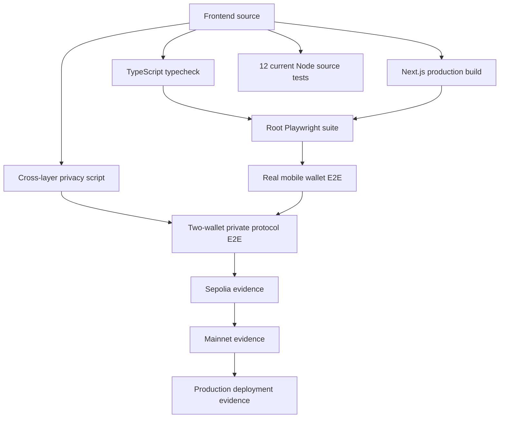
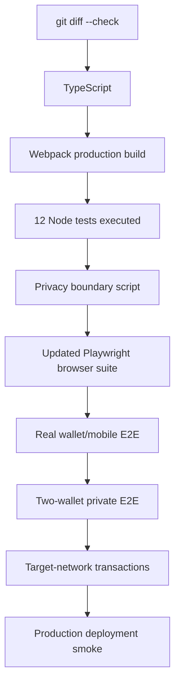
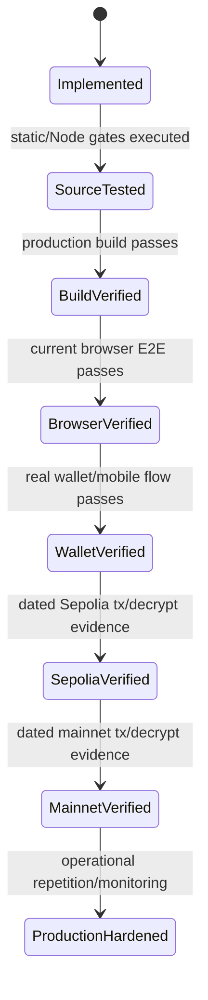
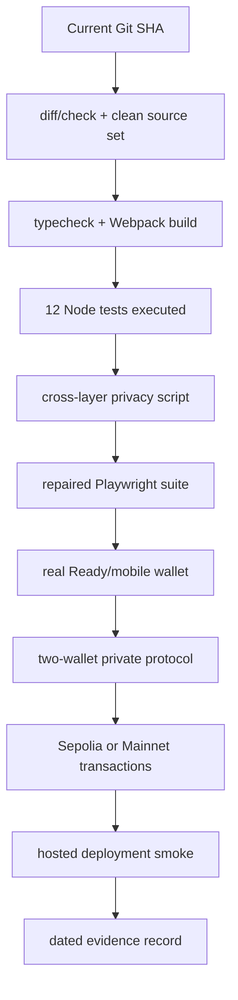

# VINSS Frontend Testing & Deployment

This document defines the current frontend verification and deployment evidence model.

The core rule is:

> A successful TypeScript check or Next.js build proves source/build compatibility. It does not prove wallet compatibility, privacy behavior, successful Starknet execution, or mainnet readiness.

Testing therefore has multiple independent layers:

```text
source hygiene
TypeScript
production build
Node logic/integration tests
cross-layer privacy regression
browser E2E
mobile wallet E2E
two-wallet private-protocol E2E
Sepolia on-chain evidence
mainnet on-chain evidence
production deployment verification
```

---

# Evidence Labels

Use distinct evidence labels instead of the generic word `working`.

```text
Implemented
Source-tested
Build-verified
Browser E2E verified
Wallet E2E verified
Sepolia verified
Mainnet verified
Production-hardened
```

Each label answers a different question.

---

# Current Source Map

Primary verification/deployment sources:

```text
frontend/package.json
frontend/package-lock.json
frontend/next.config.js
frontend/env.mainnet.example
frontend/tests/dispute-agent.test.ts
frontend/tests/escrow-offer-scenarios.test.ts
frontend/tests/rekber-protection.test.ts

playwright.config.ts
e2e/vinss.spec.ts
scripts/test-privacy-boundaries.mjs

.github/workflows/contracts-test.yml
.github/workflows/deploy-sepolia.yml
.github/workflows/deploy-mainnet.yml
```

Feature source must also be re-read when its behavior is the thing being verified.

---

# Verification Architecture



---

# Current Frontend Package Scripts

| Script | Current command | Current interpretation |
|---|---|---|
| `dev` | `next dev --webpack` | Local development server |
| `build` | `next build --webpack` | Production build |
| `start` | `next start` | Serve production build |
| `lint` | `next lint` | Stale for current Next.js 16; do not use as release gate |
| `typecheck` | `tsc --noEmit` | Static TypeScript gate |
| `test:e2e` | `playwright test` | Misaligned with root Playwright config when run as frontend npm script |
| `test:e2e:video` | `playwright test --video=on` | Invalid Playwright CLI usage; do not run |
| `test:escrow-scenarios` | tsx Node test | Accepted Offer -> settlement mapping |
| `test:rekber-protection` | tsx Node test | Frontend Rekber protection decisions |
| `test:dispute-agent` | tsx Node test | Dispute case minimization |


# Important Correction — Playwright Video

The current package script:

```text
playwright test --video=on
```

is incorrect.

Playwright Test video recording is configured through:

```text
use.video
```

in the Playwright configuration.

Current root:

```text
playwright.config.ts
```

already has:

```ts
use: {
  video: 'on',
  trace: 'retain-on-failure',
  ...
}
```

So there is no need for a `--video=on` CLI flag.

---

## Do Not Use

```bash
cd ~/vinss/frontend
npm run test:e2e:video
```

That script should be treated as stale until `frontend/package.json` is corrected.

---

# Important Correction — Playwright Config Location

The current Playwright config is at repository root:

```text
~/vinss/playwright.config.ts
```

and current browser spec is also root-scoped:

```text
~/vinss/e2e/vinss.spec.ts
```

But `npm run test:e2e` is declared in:

```text
frontend/package.json
```

and npm scripts run with the frontend package as their working directory.

Therefore the bare command:

```text
playwright test
```

does not naturally represent the root config/test layout.

---

## Correct Root-Oriented Playwright Invocation

After frontend dependencies are installed, the explicit repository-root command is:

```bash
cd ~/vinss
./frontend/node_modules/.bin/playwright test \
  --config=playwright.config.ts
```

Current root config already records video for every test.

Artifacts are written under:

```text
test-artifacts/playwright
```

and failed-test traces use:

```text
retain-on-failure
```

---

# Current Playwright Configuration

| Setting | Current value |
|---|---|
| Test directory | `./e2e` |
| Per-test timeout | `30000` ms |
| Base URL | `http://127.0.0.1:3000` |
| Video | `on` |
| Trace | `retain-on-failure` |
| Viewport | `1440x900` |
| Web server | `cd frontend && npm run dev` |
| Server reuse | `true` |
| Web-server timeout | `120000` ms |
| Artifact directory | `test-artifacts/playwright` |


# Current Browser E2E Inventory

Current root E2E directory contains:

```text
e2e/vinss.spec.ts
```

with three Playwright source tests:

```text
keeps room secret hidden until access details
shows transparent fee without making fee the primary UX
agent requires explicit context sharing
```

---

# Current Browser E2E Is Stale

The current root Playwright spec still searches for old UI copy/selectors such as:

```text
Label lokal
Buat Room
fee-breakdown
```

while current source no longer contains those exact strings/selectors.

Also:

```text
/rooms
```

now redirects to:

```text
/#rooms
```

rather than being the old standalone Rooms UI.

Therefore:

> The Playwright suite exists, but it must not currently be cited as passing browser evidence without refreshing its selectors/flows and executing it.

---

# Browser E2E Evidence Rule

These are different statements:

```text
Playwright dependency exists
Playwright config exists
Playwright spec exists
Playwright spec matches current UI
Playwright spec was executed
Playwright spec passed
wallet extension E2E passed
```

Do not collapse them.

---

# Static Verification

Current core static/build commands:

```bash
cd ~/vinss/frontend
npm run typecheck
npm run build
```

`build` explicitly runs:

```text
next build --webpack
```

so build evidence refers to the Webpack production build path, not the default Next.js Turbopack build.

---

# Typecheck Meaning

`npm run typecheck` runs:

```text
tsc --noEmit
```

It can prove selected compile-time properties such as:

```text
module resolution
type compatibility
component/hook signatures
many invalid property accesses
```

It does not execute:

```text
browser crypto
wallet extension
FeePolicy RPC
Starknet transactions
backend Discovery
mobile background recovery
```

---

# Build Meaning

`npm run build` proves the current production bundle can be compiled under the installed dependency/configuration set.

It does not prove:

```text
runtime env values are correct
wallet is compatible
backend is reachable
contracts belong to the target network
two wallets can decrypt each other
Rekber settles correctly
```

---

# Lint Script Caveat

Current `frontend/package.json` contains:

```text
"lint": "next lint"
```

but current frontend depends on Next.js 16.x.

`next lint` is no longer the correct Next.js 16 lint path.

Current package also does not define a replacement ESLint release gate.

Therefore:

```text
npm run lint
```

must not be listed as a valid current release command until the project adds a working linter configuration/script.

---

# Current Node Test Inventory

`frontend/tests/` currently contains exactly three test files.

| File | Current source cases | Primary scope |
|---|---|---|
| `escrow-offer-scenarios.test.ts` | 5 | Accepted Offer -> Rekber settlement mapping |
| `rekber-protection.test.ts` | 6 | Frontend Rekber permission/timing/state guards |
| `dispute-agent.test.ts` | 1 | Explicit dispute case/context minimization |

Current total:

```text
12 source test cases
```

This number describes test definitions in current source.

It must not be written as:

```text
12/12 PASS
```

unless those tests were actually executed for the evidence being reported.

---

# Run Current Node Tests

```bash
cd ~/vinss/frontend

npm run test:escrow-scenarios
npm run test:rekber-protection
npm run test:dispute-agent
```


# Dependency Note for Node Tests

Current frontend test scripts call:

```text
../backend/node_modules/.bin/tsx
```

rather than a `tsx` binary installed in the frontend package.

Therefore current Node frontend tests depend operationally on backend dependencies being installed.

---

## Implication

A clean checkout that installs only:

```text
frontend/node_modules
```

may not be able to run those three scripts.

Release documentation should either:

```text
install backend dependencies too
or
move/add the test runner dependency to a deliberate shared/frontend location
```

before treating the commands as self-contained frontend CI.

---

# Accepted Offer → Rekber Scenario Tests

`escrow-offer-scenarios.test.ts` contains five logic/integration cases:

```text
Freelance
NFT
Goods
Bounty
OTC
```

They validate:

```text
accepted Offer snapshot mapping
settlement asset resolution
decimal -> token base-unit conversion
private business-condition preservation
```

They explicitly do not drive a browser or wallet.

---

# Rekber Protection Tests

`rekber-protection.test.ts` currently checks six frontend protection behaviors:

```text
timeout refund available only before fulfillment
counterparty-confirm payer confirmation requirement
dispute window behavior
auto-release after deadline
authorized split claim eligibility
mutual refund role authorization
```

These tests validate frontend decision helpers against expected Cairo semantics.

They do not prove the Cairo contract itself was invoked.

---

# Dispute Agent Test

`dispute-agent.test.ts` currently validates that the dispute case:

```text
includes accepted terms
includes explicit payer/payee statements
includes expected principal data
does not serialize roomSecret
does not serialize channelKey
```

This is a source-level privacy/data-shaping test.

It is not provider-quality or resolver-authority E2E evidence.

---

# Cross-Layer Privacy Regression

Repository root contains:

```text
scripts/test-privacy-boundaries.mjs
```

Run it from repository root:

```bash
cd ~/vinss
node scripts/test-privacy-boundaries.mjs
```

This script reads current frontend, backend, and Cairo source to detect selected regressions.

---

# Privacy Regression Coverage

Current static cross-layer assertions include examples such as:

```text
frontend must not reference GROQ_API_KEY
room list must not render roomSecret directly
Agent policy must prohibit transaction signing
Agent automatic timeline must be privacy-safe
roomLabel must not be sent to Agent provider
backend Discovery must not decrypt
DiscoverRequest must not contain channelKeyHex
indexer must not contain decryption code
persistent Discovery index must not store roomId/roomSecret/plaintext
backend network must be explicit
Message/Offer Discovery must not send channelKeyHex
Message/Offer must decrypt locally
frontend/Cairo Rekber commitment domains must agree
Rekber setup must not reintroduce removed paid Offer preparation
duplicate Rekber wallet-request protections must remain
```

---

# Privacy Regression Is Static

The privacy-boundary script is useful because it catches accidental code reintroduction.

It does not prove:

```text
runtime browser network request actually contains no secret
analytics/telemetry receives no secret
extension does not inspect page memory
deployed backend matches local Git SHA
mainnet public metadata has no unexpected correlation
```

Those require runtime/deployment evidence.

---

# Recommended Fast Local Gate

For an ordinary frontend code change, the current practical fast gate is:

```bash
cd ~/vinss/frontend
npm run typecheck
npm run build
npm run test:escrow-scenarios
npm run test:rekber-protection
npm run test:dispute-agent

cd ~/vinss
node scripts/test-privacy-boundaries.mjs
git diff --check
```

This is a strong source/build gate.

It is still not a browser/wallet/on-chain gate.

---

# Repository Hygiene Gate

```bash
cd ~/vinss

git diff --check
git status --short
git rev-parse HEAD
```

`git diff --check` detects whitespace errors.

`git status --short` identifies the exact local change set.

`git rev-parse HEAD` records the source revision tied to evidence.

---

# Evidence Must Be Commit-Bound

A useful verification record should always include:

```text
Git SHA
working-tree status
frontend dependency lock
network
deployment URL
contract addresses
wallet version
test commands
transaction hashes where applicable
```

Otherwise later source changes can make a historical `PASS` impossible to interpret.

---

# Browser Test Layer

Browser tests should verify application behavior that pure Node tests cannot.

Examples:

```text
route composition
room creation UI
private value display boundaries
Agent consent controls
mobile layout
localStorage/IndexedDB hydration
focus/visibility behavior
error-state presentation
```

---

# Browser Test Does Not Automatically Test Wallet

A normal Chromium Playwright page does not reproduce:

```text
Ready Wallet extension
Wallet Standard injection timing
extension popup/unlock UI
STRK20 Wallet API implementation
mobile Mises extension lifecycle
```

unless the test environment explicitly installs/drives that wallet.

Therefore:

```text
browser E2E verified
!=
wallet E2E verified
```

---

# Real Wallet E2E Layer

Wallet E2E should record:

```text
browser
browser version
wallet/extension
wallet version
Wallet API versions advertised
network
account addresses
RPC
frontend deployment
backend deployment
```

---

# Mobile Wallet Recovery Test

Current mobile target behavior requires exercising:

```text
open VINSS
    ↓
connect wallet
    ↓
Ready/extension takes foreground
    ↓
dapp backgrounds
    ↓
approve action
    ↓
return to dapp
    ↓
wallet object may be reinjected
    ↓
frontend restores/rebuilds session
    ↓
callback may be delayed
    ↓
network/index authority reconciles action
```

---

# Two-Wallet Direct Chat Verification

A proper two-wallet direct Chat run should prove:

```text
wallet A and wallet B join same room
    ↓
participant P-256 identities are discovered
    ↓
both derive matching pairwise direct key
    ↓
A sends Message
    ↓
Message Helper receives encrypted envelope
    ↓
backend indexes ciphertext
    ↓
B matches opaque recipient tag
    ↓
B decrypts locally
    ↓
A/B reload/remount
    ↓
history + participant identity continuity recover
```

---

## Direct Chat Privacy Evidence

- [ ] Normal `/discover` request contains no pairwise key.
- [ ] Normal `/discover` request contains no roomSecret.
- [ ] Helper record has no plaintext Message body.
- [ ] Helper record has no plaintext sender/recipient wallet addresses.
- [ ] Second wallet successfully decrypts.
- [ ] Unrelated private context cannot decrypt the direct payload.
- [ ] Browser console/telemetry is inspected for plaintext leakage.


# Group Chat Verification

Current Group source implementation should be tested separately from direct Chat.

Verify:

```text
groupSecret capability
Group-key derivation
group_member encrypted Presence
Group Message send/discover/decrypt
selected Group filtering
Group switch clears previous decrypted timeline
group-only Invite does not grant roomSecret
```

---

# Private Offer Verification

Two-wallet Offer E2E:

```text
A creates Offer
    ↓
B decrypts exact terms
    ↓
B Counter Offers or Accepts/Rejects
    ↓
A decrypts lifecycle response
    ↓
root/parent locator lineage remains correct
    ↓
settlementPlan payer/payee remains stable
    ↓
accepted Offer becomes Rekber-eligible once
```

---

## Offer Recovery Case

- [ ] Prepare an Offer action.
- [ ] Allow wallet callback to be delayed/ambiguous.
- [ ] Confirm exact locator appears through authenticated Offer Discovery.
- [ ] Confirm no duplicate optimistic card.
- [ ] Confirm stale recovery generation cannot mutate a newer Offer action.


# Invitation Verification

Direct Invite E2E should prove:

```text
V3 capability created
room activation fee quoted
full share link recovered after wallet remount if needed
recipient decrypts token with #k
CONSUME succeeds once
second consume rejected/correctly represented
expired invite rejected
```

Group Invite additionally needs:

```text
owner-only creation
groupSecret transfer
no roomSecret in Group-only V3 payload
current direct roomSecret preserved if already present
```

---

# Rekber Verification Is Multi-Branch

Do not use one `funded` transaction as full Rekber E2E evidence.

Current canonical financial state machine includes branches for:

```text
fund
fulfillment
confirmation
release
refund
revision
dispute
auto-release
mutual refund
resolution claim
Certificate
```

not all of which need to be exercised in every release, but required product branches must have explicit evidence.

---

# Accepted Offer → Rekber Precondition

Before funding, browser E2E should verify:

```text
accepted Offer is authenticated
settlementPlan exists
one accepted Offer is not already consumed by another Rekber create
payer/payee sign the exact Rekber Agreement
commitments match
token/amount map correctly
```

---

# Rekber Funding Verification

- [ ] Current FeePolicy/oracle configuration is read.
- [ ] `quote_rekber_fee(token, principal)` returns the expected current quote.
- [ ] Wallet withdraw amount equals principal + quoted fee.
- [ ] Funding transaction succeeds.
- [ ] `get_custody` returns the expected token and principal.
- [ ] Custody commitment matches the private coordination.
- [ ] Funding fee is recorded separately from principal.


# Rekber Release Verification

Required release branch evidence should show:

```text
funded custody
    ↓
required fulfillment/confirmation policy satisfied
    ↓
release authorization capability used correctly
    ↓
wallet-created OPEN settlement output
    ↓
payee receives principal
    ↓
custody becomes settled/consumed
```

---

# Rekber Refund Verification

Required refund branch evidence should show:

```text
funded custody
    ↓
refund eligibility boundary reached
    ↓
refund capability used
    ↓
wallet-created OPEN settlement output
    ↓
payer receives principal
    ↓
service fee remains non-refundable as defined by contract
```

---

# Rekber Dispute Verification

- [ ] Dispute can only open in the intended state/window.
- [ ] Evidence plaintext remains private/off-chain unless explicitly disclosed.
- [ ] Public evidence commitment matches submitted evidence.
- [ ] Both parties' dispute Agent packets are explicit.
- [ ] Both wallet attestations bind the same case/challenge.
- [ ] Resolver authorization is policy/config correct.
- [ ] Split allocations sum to principal.
- [ ] Only allocated side can claim its resolution amount.
- [ ] Replays/duplicate claims are rejected.


# Mutual Refund Verification

- [ ] Payee can authorize mutual refund consent only in allowed state.
- [ ] Payer completes mutual refund with correct capability.
- [ ] Payee cannot perform payer-only completion.
- [ ] Resolved/disputed terminal state cannot silently re-enter mutual refund.
- [ ] Principal returns according to canonical contract state.


# Auto-Release Verification

- [ ] Fulfillment is submitted/confirmed as required.
- [ ] Review deadline is known from canonical custody.
- [ ] Auto-release before deadline is unavailable.
- [ ] Auto-release at/after exact deadline is available.
- [ ] Disputed custody cannot auto-release.
- [ ] Payee receives expected settlement output.


# Settlement Certificate Verification

Certificate is intentionally public and should be tested separately from private STRK20 actions.

Verify:

```text
eligible released/resolved non-disputed state
role-specific Certificate secret
public account.execute claim
is_claimed changes
get_certificate returns expected custody/role/timestamps
transfer remains unavailable/nontransferable
disputed custody cannot mint
```

---

# Agent Verification

Normal Agent browser/runtime tests should prove:

```text
shareContext is required
context change resets consent
automatic timeline context is privacy-reduced
latest Offer automatic context is locator-only
explicit prompt can be sent only after consent
approved proposal prepares UI state
Agent does not automatically sign wallet transaction
```

---

# Dispute Agent Verification

Dedicated Dispute should not be conflated with normal Agent.

Verify:

```text
accepted Offer terms are included explicitly
party statements/evidence are explicit
roomSecret/channelKey are not included
wallet challenge is signed by correct role
same case is used by both parties
resolver policy is explicit
AutoResolve authority is isolated from normal Agent
```

---

# Privacy Runtime Inspection

Static source assertions are not enough for a privacy-sensitive release.

Use browser developer tools or an equivalent controlled capture to inspect:

```text
/discover request bodies
/presence publish bodies
attachment upload request
/agent request
/dispute request
wallet action construction/logging
localStorage
IndexedDB key properties
console logs
```

---

# Current Decrypted Console Caveat

Current Message Discovery still logs decrypted Message fields to the browser console.

Therefore a release checklist should include:

```text
remove or production-gate decrypted Message console logging
```

before making a strong diagnostics/privacy claim.

---

# Current Envelope Correctness Caveat

Current shared felt-envelope unpack routine is not length-preserving for leading-zero bytes in a packed chunk.

Before treating payload packing as fully robust, add regression tests that cover:

```text
chunk beginning with 0x00
multiple leading zero bytes
all chunk lengths 1..30
multi-chunk AES-GCM payloads
```

---

# Release Gate Hierarchy



---

# Recommended Source Release Gate

For code intended to ship:

```bash
cd ~/vinss/frontend

npm run typecheck
npm run build
npm run test:escrow-scenarios
npm run test:rekber-protection
npm run test:dispute-agent

cd ~/vinss

node scripts/test-privacy-boundaries.mjs
git diff --check
```


# Playwright Gate — Current Repository Caveat

Do not add the current root E2E suite as a blocking release gate until:

```text
stale selectors are updated
current unified home/room UX is represented
test command/config working directory is fixed
current flows pass
```

Once fixed, the root-oriented execution is:

```bash
cd ~/vinss
./frontend/node_modules/.bin/playwright test \
  --config=playwright.config.ts
```

Video is already enabled by root config.

---

# Current E2E Script Cleanup Recommendation

Future package cleanup should make one deliberate command the source of truth.

For example, choose either:

```text
root package owns Playwright dependency + root test script
```

or:

```text
frontend package script explicitly points to root config/testDir
and sets a compatible working directory
```

Do not retain both a root config and an implicitly frontend-scoped script that disagree.

---

# Current Video Script Cleanup Recommendation

Remove or replace:

```text
"test:e2e:video": "playwright test --video=on"
```

because current root config already has:

```text
video: 'on'
```

and Playwright video is configured in `use.video`, not via that CLI flag.

---

# Next.js Lint Cleanup Recommendation

Replace or remove:

```text
"lint": "next lint"
```

with an explicit linter tool/config if linting is intended to be a release gate.

Until then:

```text
typecheck + build
```

are the valid current frontend static/build package commands.

---

# Clean Install Verification

A reproducible frontend release should validate from the lockfile rather than only from an old local `node_modules` state.

Recommended frontend install gate:

```bash
cd ~/vinss/frontend
npm ci
```

Because current frontend Node tests use `../backend/node_modules/.bin/tsx`, install backend dependencies as required for those test scripts:

```bash
cd ~/vinss/backend
npm ci
```

Then run the frontend source gates.

---

# Dependency Drift

Evidence should record the lockfile revision.

Do not assume:

```text
package.json range
==
exact installed package version
```

`npm ci` follows the committed lockfile.

---

# Frontend CI Status

Current repository `.github/workflows/` contains:

```text
contracts-test.yml
deploy-sepolia.yml
deploy-mainnet.yml
```

The Sepolia/Mainnet deployment workflows are contract deployment workflows with:

```text
working-directory: contracts
```

not frontend build/deployment CI.

---

# No Dedicated Frontend GitHub Actions Gate

Current repo does not have a dedicated frontend workflow that automatically runs:

```text
typecheck
frontend build
frontend Node tests
privacy boundary script
Playwright
```

on every frontend commit/PR.

Therefore a green current GitHub contract workflow must not be cited as frontend verification.

---

# Contract CI vs Frontend CI

| Evidence | What it proves | What it does not prove |
|---|---|---|
| Cairo contract CI | Contract source/tests for its run | Frontend compiles or matches calldata |
| Frontend typecheck | TS static compatibility | Cairo passes |
| Frontend build | Next.js bundles | Wallet/on-chain execution |
| Frontend Node tests | Selected mapping/guard logic | Browser or chain |
| Privacy script | Selected source invariants | Runtime traffic |
| Playwright | Browser UX covered by current spec | Ready Wallet extension unless explicitly driven |


# Deployment Workflows

Current:

```text
.github/workflows/deploy-sepolia.yml
.github/workflows/deploy-mainnet.yml
```

deploy VINSS Cairo contracts, not the Next.js frontend.

The frontend production deployment procedure is therefore operational/external to these workflows.

---

# Frontend Deployment Evidence

For each frontend deployment, record:

```text
Git SHA
deployment provider
deployment ID
deployment URL
deployment timestamp
network
backend URL
RPC URL
contract addresses
treasury
token addresses
wallet version used for smoke test
```

---

# Mainnet Environment Template

Current:

```text
frontend/env.mainnet.example
```

explicitly says it should only be copied after every address has been verified on mainnet.

Current template includes:

```text
NEXT_PUBLIC_STARKNET_NETWORK
NEXT_PUBLIC_RPC_URL
NEXT_PUBLIC_BACKEND_URL
Privacy Pool
Message Helper
Message OpenNote token
Invite
Offer Helper
Offer OpenNote token
Private Escrow Helper
Rekber
Settlement Certificate
STRK
USDC
treasury
social URLs
```

---

# Mainnet Template Is Not Mainnet Evidence

The presence of:

```text
env.mainnet.example
```

proves only that a template exists.

It does not prove:

```text
the addresses are deployed
the addresses were verified
FeePolicy is configured
backend indexes those contracts
wallet is on mainnet
the frontend currently uses those values
```

---

# Deployment Configuration Gate

- [ ] `NEXT_PUBLIC_STARKNET_NETWORK` exactly matches intended network.
- [ ] `NEXT_PUBLIC_RPC_URL` is verified against that network.
- [ ] `NEXT_PUBLIC_BACKEND_URL` reports same network/contracts.
- [ ] Privacy Pool address is correct.
- [ ] Message Helper address is correct.
- [ ] Message OpenNote token is correct.
- [ ] Invite address is correct.
- [ ] Offer Helper address is correct.
- [ ] Offer OpenNote token is correct.
- [ ] Private Escrow Helper is correct.
- [ ] Rekber is correct.
- [ ] Settlement Certificate is correct.
- [ ] STRK token is correct.
- [ ] USDC token is correct.
- [ ] Treasury is correct and canonical felt syntax.
- [ ] FeePolicy links are correct at contract level.


# Deployment Build Gate

- [ ] Clean dependencies installed.
- [ ] `npm run typecheck` passes.
- [ ] `npm run build` passes.
- [ ] All 12 current Node source tests were actually executed and passed.
- [ ] Privacy-boundary script passes.
- [ ] `git diff --check` passes.
- [ ] Working tree status is understood.
- [ ] Git SHA recorded.


# Deployment Browser Gate

- [ ] Current production URL loads.
- [ ] Home/room route works.
- [ ] Direct room creation/access works.
- [ ] Wallet UI renders.
- [ ] Mobile viewport works.
- [ ] Agent context consent renders correctly.
- [ ] Certificate route/API renders if enabled.
- [ ] No obvious stale environment label/address appears.


# Deployment Backend Compatibility Gate

- [ ] `NEXT_PUBLIC_BACKEND_URL` is reachable.
- [ ] Backend `/health` network matches frontend.
- [ ] Backend Message index identity matches Message Helper.
- [ ] Backend Offer index identity matches Offer Helper.
- [ ] Backend Private Escrow index identity matches helper.
- [ ] Fresh encrypted records are discoverable.
- [ ] Frontend sends no decryption key in normal Discovery.


# Deployment Wallet Gate

- [ ] Target wallet is discovered.
- [ ] WalletAccountV6 session builds.
- [ ] Wallet reports expected API versions.
- [ ] STRK20 capability badge matches expectation.
- [ ] Wallet is on intended Starknet network.
- [ ] Message action opens Ready X successfully.
- [ ] Offer action opens Ready X successfully.
- [ ] Invite flow opens Ready X successfully.
- [ ] Rekber flow opens Ready X successfully.
- [ ] Mobile background/resume path recovers.


# Deployment Two-Wallet Gate

- [ ] Wallet A and B establish participant identity.
- [ ] Direct pairwise Message decrypt works both directions.
- [ ] Offer decrypt works both directions.
- [ ] Counter/Accept/Reject parent auth works.
- [ ] Accepted Offer can create one Rekber.
- [ ] Signed Rekber setup verifies.
- [ ] Funding reaches canonical custody.
- [ ] Required settlement branch succeeds.


# Sepolia Verification Definition

Use `Sepolia verified` only when the exact current frontend/deployment has dated evidence from Sepolia.

At minimum record:

```text
Git SHA
frontend deployment URL
backend deployment
wallet A/B
contract addresses
transaction hashes
action locators
quoted fees
second-wallet decrypt result
canonical custody/result
```

---

# Mainnet Verification Definition

Use `Mainnet verified` only when the same category of evidence exists on Starknet Mainnet.

Do not promote:

```text
Sepolia PASS
```

into:

```text
Mainnet PASS
```

without actual mainnet transactions.

---

# Production-Hardened Definition

`Production-hardened` is stronger than `Mainnet verified`.

It should additionally include repeated operational evidence around:

```text
wallet/mobile recovery
RPC failure
backend restart
index lag
FeePolicy/oracle edge cases
browser storage loss
retries
logging/privacy
support runbooks
monitoring
```

---

# Evidence State Machine



---

# Evidence Regression

A later source/config/deployment change can invalidate a higher evidence level.

Examples:

```text
new Git SHA
new contract address
new wallet version
new FeePolicy
new backend index identity
new encryption envelope version
new mobile browser version
```

should trigger an appropriate re-verification level.

---

# Release Evidence Record

```text
VINSS Frontend Release Evidence

Git SHA:
Date:
Operator:

Frontend deployment:
Frontend deployment ID:
Backend deployment:

Network:
RPC:

Privacy Pool:
Message Helper:
Message OpenNote token:
Invite:
Offer Helper:
Offer OpenNote token:
Private Escrow Helper:
Rekber:
Settlement Certificate:
STRK:
USDC:
Treasury:

Browser/device:
Wallet:
Wallet version:
Wallet API versions:

Typecheck:
Build:
Node tests:
Privacy regression:
Playwright:

Wallet A:
Wallet B:

Message tx:
Offer tx:
Invite tx:
Rekber funding tx:
Settlement tx:
Certificate tx:

Known caveats:
Evidence level:
```


# Feature Evidence Record

```text
Feature:
Git SHA:
Deployment:
Network:
Date:

Preconditions:
Wallet A:
Wallet B:

Expected private data:
Expected public metadata:

Transaction hash:
Action locator / custody commitment:

Backend request inspected:
Second wallet decrypt:
Canonical contract state:
Mobile recovery exercised:

Result:
Known issue:
```


# Failure Classification

| Failure | Likely layer | Do not conclude |
|---|---|---|
| TypeScript error | Source typing | Contract failure |
| Build error | Next/build config | Wallet incompatibility |
| Node test failure | Frontend logic expectation | On-chain revert unless linked |
| Privacy script failure | Source boundary regression | Runtime exploit |
| Playwright selector failure | E2E/UI drift | Protocol failure |
| Wallet connect failure | Discovery/session/browser | Contract revert |
| Ready payload rejection | Wallet API/felt/config | Backend failure |
| Chain revert | Contract/config/calldata | Browser selector issue |
| Discovery lag | Backend/index | Transaction absent |
| Decrypt failure | Key/routing/envelope | Backend necessarily saw plaintext |


# When a Build Passes but Wallet Fails

Investigate:

```text
wallet API version
wallet selected chain
RPC
contract/token address formatting
treasury formatting
FeePolicy quote
private note balance
Ready/STRK20 error code
calldata
session freshness
```

before changing Cairo.

---

# When Wallet Callback Errors but Chain May Have Succeeded

Do not immediately retry a value-moving action.

Use domain recovery first:

```text
Message -> exact locator Discovery
Offer -> authenticated locator Discovery
Invite -> get_invite(commitment)
Private Escrow -> exact coordination locator
Rekber -> get_custody/events
Certificate -> is_claimed
```

---

# When Discovery Fails

Separate:

```text
transaction did not exist
from
transaction exists but index has not caught up
from
candidate ciphertext exists but local route cannot decrypt
```

These have different causes and must not be reported as one generic send failure.

---

# When Direct Decrypt Fails

- [ ] Same room ID is used.
- [ ] Correct peer public key is present.
- [ ] Persisted P-256 identity was not regenerated.
- [ ] Candidate recipient tag matches expected route.
- [ ] Ciphertext packing round trip is intact.
- [ ] Sender tag binding succeeds.
- [ ] Historical aliases are included where required.


# When Rekber Funding Fails

- [ ] Accepted Offer is current/authenticated.
- [ ] SettlementPlan exists.
- [ ] Both Rekber Agreement signatures verify.
- [ ] Custody commitment and role commitments match.
- [ ] Token maps to supported STRK/USDC.
- [ ] Principal base units are correct.
- [ ] Fee quote is fresh.
- [ ] Treasury is correct.
- [ ] Wallet/private balance is sufficient.
- [ ] Rekber address belongs to intended network.


# When Certificate Claim Fails

- [ ] Rekber is in eligible settled state.
- [ ] Custody was not disputed when Certificate rules prohibit it.
- [ ] Caller role is correct.
- [ ] Role Certificate secret matches commitment.
- [ ] Certificate address is correct.
- [ ] Certificate is not already claimed.
- [ ] Wallet is on correct network.


# Testing Direct vs Group

| Concern | Direct | Group |
|---|---|---|
| Base key | P-256 pairwise ECDH/HKDF | groupSecret-derived symmetric key |
| Participant discovery | Room participant Presence/message fallback | Group member capability/Presence |
| Message history | Encrypted local history | Current Group timeline mostly in memory |
| Pending recovery | Encrypted body recovery record | Metadata-only persisted pending record |
| E2E requirement | Two endpoint decrypt | Authorized Group-holder decrypt |


# Testing Privacy vs Authority

An ideal test matrix proves both:

```text
confidentiality
and
authorization
```

Examples:

```text
Offer is decryptable by intended peer
AND
only encrypted recipient can Accept/Reject

Rekber setup is private
AND
wallet signature proves payer/payee authorship

Certificate data is public
AND
only eligible role can claim
```

---

# Testing Recovery vs Replay

Every mobile recovery test should also prove it does not introduce replay.

Check:

```text
same prepared locator is not submitted twice
old callback does not mutate new action
Invite cannot be consumed twice
settlement capability cannot be replayed
resolution claim cannot be duplicated
Certificate cannot be claimed twice for same role
```

---

# Testing Local-State Loss

Selected destructive tests should be performed deliberately in non-production environments.

Examples:

```text
remove participant cache only
remove direct encrypted history only
remove last-wallet ID
remove roomSecret
remove P-256 IndexedDB identity
remove Rekber secret record
```

The expected consequences are very different.

Never turn `clear site data` into an unqualified production troubleshooting step.

---

# Testing Network Mismatch

Because current frontend has no one universal chain guard, explicitly test:

```text
frontend mainnet + wallet Sepolia
frontend Sepolia + wallet mainnet
wrong RPC + correct NETWORK
correct RPC + wrong contract addresses
frontend/backend network mismatch
```

and verify the UX fails safely before value-moving mistakes.

---

# Testing Felt Formatting

Strict Wallet API formatting deserves dedicated tests.

Include:

```text
canonical hex address
zero-padded equivalent address
token address
treasury address
locators
commitments
amounts
timestamps
secret preimages
```

Current treasury call sites are not all normalized identically, so treasury formatting is especially important.

---

# Testing Dynamic Fee Quotes

- [ ] Room activation quote read immediately before Invite CREATE.
- [ ] Message quote read immediately before Message transaction.
- [ ] Offer quote read immediately before Offer transaction.
- [ ] Rekber funding quote comes from canonical Rekber fee function.
- [ ] Quote/config failure stops before a misleading prepared state where intended.
- [ ] UI does not freeze historical 7/10 STRK assumptions.
- [ ] Wallet displays expected separate private/network costs.


# Testing Agent Privacy

- [ ] `shareContext` defaults false.
- [ ] Context switch resets consent.
- [ ] Automatic timeline summary contains no raw Message body.
- [ ] Automatic latest Offer context contains no full private terms.
- [ ] Explicit prompt is the only normal plaintext user instruction intentionally sent.
- [ ] Agent approval does not trigger a wallet transaction automatically.


# Testing Dispute Privacy

- [ ] Accepted Offer snapshot is the authoritative terms source.
- [ ] Party evidence is explicitly selected.
- [ ] Unrelated Chat is not automatically included.
- [ ] roomSecret is absent.
- [ ] channelKey is absent.
- [ ] Rekber private capability preimages are absent.
- [ ] Wallet attestations bind the expected case.


# Testing Certificate Publicness

- [ ] Certificate claim uses public account execution.
- [ ] UI does not call it private.
- [ ] Public owner/role/custody relation is visible as expected.
- [ ] Private Offer terms are not copied into Certificate metadata.
- [ ] Nontransferability is preserved.


# Testing Backend Ciphertext Boundary

- [ ] `POST /discover` for Message sends only kind.
- [ ] `POST /discover` for Offer sends only kind.
- [ ] `POST /discover` for Escrow sends only kind.
- [ ] Backend persistent index does not store roomSecret.
- [ ] Backend persistent index does not store plaintext.
- [ ] Frontend decrypts candidate records locally.


# Testing Presence

- [ ] Presence body is encrypted.
- [ ] Relay only sees opaque channel/event/IV/ciphertext/TTL.
- [ ] Typing/read failure does not block immutable Message.
- [ ] Read receipt is never interpreted as Offer acceptance or settlement authority.
- [ ] Group member Presence remains separate from canonical on-chain ownership.


# Testing Attachments

- [ ] Plaintext size limit enforced.
- [ ] Random capability token generated.
- [ ] Attachment subkey derived from pairwise key.
- [ ] AES-GCM uses fresh IV.
- [ ] attachment ID is authenticated as AAD.
- [ ] Backend receives ciphertext.
- [ ] Downloaded plaintext SHA-256 is verified.
- [ ] Wrong/tampered ciphertext fails.


# Testing Browser Console / Telemetry

- [ ] No roomSecret logged.
- [ ] No groupSecret logged.
- [ ] No Rekber unused preimage logged.
- [ ] No full Invite bearer link sent to analytics.
- [ ] No decrypted Message body logged in production.
- [ ] No private Offer terms sent to generic error reporting.
- [ ] Attached Rekber calldata remains redacted in sensitive wallet-error paths.


# Deployment Smoke Test

Immediately after a frontend production deployment, run a small non-destructive smoke test before value-moving flows.

Verify:

```text
production URL loads
expected network badge/config visible
wallet discovery works
backend health reachable
read-only FeePolicy calls work
read-only Rekber/Certificate pages do not point to old network
```

Then proceed to controlled transaction tests.

---

# Deployment Rollback Evidence

Before a high-risk production deploy, record:

```text
previous frontend Git SHA
previous deployment ID/URL
previous known-good env values
backend deployment identity
contract addresses
```

so a frontend rollback does not accidentally reconnect an old UI to incompatible new contracts.

---

# Contract / Frontend Compatibility

A contract deployment can change frontend requirements even when the frontend source itself did not change.

Re-verify frontend when changing:

```text
helper address
FeePolicy address
OpenNote token
Rekber address
Settlement Certificate address
action enum/calldata
commitment domain
event schema
```

---

# Backend / Frontend Compatibility

Re-verify private frontend discovery when changing backend:

```text
network
indexed contract identity
start block
Discovery response schema
Presence behavior
attachment API
Agent/Dispute routes
```

---

# Wallet / Frontend Compatibility

Re-verify mobile flows when changing:

```text
Ready Wallet version
Wallet Standard library
Wallet API minimum
starknet.js
STRK20 SDK behavior
browser/extension host
```

---

# Current Dependency Notes

Current frontend package declares:

```text
Next.js ^16.3.1
React ^19.2.8
starknet 10.4.0
@avnu/avnu-sdk ^4.2.0
@playwright/test ^1.54.2
TypeScript ^5.5.0
```

Release evidence should record the resolved lockfile versions, not only these ranges.

---

# Do Not Use Historical Status Text

Remove statements such as:

```text
Previous build testnet-verified
Escrow must remain pending
current build requires redeployment
```

from architecture/testing docs unless they are tied to a dated evidence record.

Those statements become stale as soon as code or deployments change.

---

# Evidence Labels — Precise Meaning

| Label | Meaning |
|---|---|
| Implemented | Current source contains the behavior |
| Source-tested | Relevant automated source tests were actually executed and passed |
| Build-verified | Current production frontend build completed |
| Browser E2E verified | Current browser spec matched current UI and passed |
| Wallet E2E verified | Actual target wallet/browser interaction passed |
| Sepolia verified | Current build/deployment has dated Sepolia transaction/decrypt evidence |
| Mainnet verified | Current build/deployment has dated mainnet evidence |
| Production-hardened | Repeated operational/error/recovery evidence exists |


# No Generic `Tested` Without Scope

A statement such as:

```text
Rekber tested
```

is incomplete.

Prefer:

```text
Rekber protection helper: 6/6 Node tests passed at SHA X
Rekber two-wallet Sepolia release: verified at tx X
Rekber timeout refund: not executed in this release
```

---

# No Generic `On-Chain Verified` Without Network

Always state:

```text
Sepolia
or
Mainnet
```

and include transaction evidence.

---

# No Generic `Privacy Verified`

Privacy claims should name the boundary.

Examples:

```text
normal Message Discovery request contained no key
backend index contained ciphertext only
second wallet decrypted locally
Agent request sent reduced automatic context
```

rather than:

```text
privacy verified
```

without scope.

---

# Recommended Frontend CI Future State

A dedicated frontend CI workflow should eventually run:

```text
clean install
typecheck
production build
three Node test scripts
cross-layer privacy script
updated Playwright suite
git diff/check hygiene as appropriate
```

and publish:

```text
Playwright HTML/report artifacts
video
trace on failure
Git SHA
```

---

# Recommended CI Separation

Keep independent jobs for:

```text
frontend static/build
frontend Node tests
privacy cross-layer regression
browser E2E
Cairo contracts
backend tests
```

so a failure identifies the correct layer.

---

# Recommended Playwright Refactor

- [ ] Move Playwright script ownership to repo root or explicitly set root config from frontend.
- [ ] Remove invalid `--video=on` CLI usage.
- [ ] Keep `video: 'on'` or choose a deliberate retention policy in config.
- [ ] Refresh stale `/rooms` assumptions.
- [ ] Replace obsolete `Label lokal` selector.
- [ ] Replace obsolete `Buat Room` selector.
- [ ] Replace/remove obsolete `fee-breakdown` selector.
- [ ] Cover current unified home/room flow.
- [ ] Add current Agent context-consent flow.
- [ ] Add current mobile viewport project if browser-only UI coverage is desired.


# Recommended E2E Project Matrix

After the current suite is repaired, useful projects could include:

```text
desktop Chromium
mobile Chromium viewport
possibly WebKit for browser rendering
separate real-wallet/manual harness
```

A synthetic Playwright browser project should not pretend to be the Ready Wallet extension.

---

# Video Evidence Policy

Current root Playwright config records video for every test.

For CI/storage efficiency, a future choice could be:

```text
retain-on-failure
or
on-first-retry
```

but that is a configuration decision.

The technical rule is:

> Configure Playwright video through `use.video`; do not depend on the invalid `--video=on` script.

---

# Trace Evidence

Current Playwright config uses:

```text
trace: retain-on-failure
```

Trace output can be more useful than video for:

```text
selector failures
navigation issues
network errors
console errors
timing problems
```

because it contains structured test execution context.

---

# Artifact Retention

For important release candidates, retain:

```text
Playwright video
Playwright trace
test terminal output
transaction hashes
wallet screenshots if needed
backend health response
Git SHA
deployment ID
```

without committing secrets or private plaintext artifacts into the public repository.

---

# Private Evidence Handling

Testing evidence itself can leak private data.

Do not publish:

```text
roomSecret
groupSecret
Invite #k
Rekber unused preimages
wallet seed/private key
private Message body
private Offer terms
Dispute evidence
```

just to prove a test worked.

---

# Wallet Screenshot Rule

If screenshots/video capture wallet UI, inspect them before public sharing for:

```text
wallet address correlation
balances
private note information
transaction details
browser tabs/history
notification content
```

---

# Production Deployment No-Go Conditions

- TypeScript fails.
- Production build fails.
- Any required Node source test fails.
- Privacy-boundary script fails.
- Target network/env values are unverified.
- Frontend/backend network mismatch exists.
- Wallet cannot establish expected API capability.
- Message/Offer cannot be decrypted by second wallet.
- Accepted Offer settlement roles change unexpectedly.
- Rekber funding quote/state is wrong.
- Required release/refund path is unverified for the release requirement.
- Current browser console exposes private Message plaintext in a production privacy claim.
- Envelope byte-packing correctness remains untested for required payload patterns.


# Mainnet No-Go Conditions

- Any contract address is copied without independent mainnet verification.
- Frontend still points to Sepolia fallback RPC.
- Backend index still points to Sepolia.
- Typed-data chainId does not match mainnet.
- Wallet is not explicitly confirmed on mainnet.
- Treasury/token felt formatting is unverified.
- FeePolicy/oracle configuration is unverified.
- Two-wallet private Message and Offer flow has not been exercised on the intended build.
- Rekber funding/settlement safety path has not been exercised as required.
- Rollback source/deployment identity is unknown.


# Testing Responsibility Matrix

| Layer | Primary responsibility |
|---|---|
| TypeScript | Compile-time frontend correctness |
| Next build | Bundle/runtime compilation |
| Node tests | Selected pure/logic integration behavior |
| Privacy script | Cross-source architectural invariants |
| Playwright | Browser UI flow |
| Real wallet | Wallet Standard/Ready/STRK20 behavior |
| Two-wallet E2E | Pairwise privacy/protocol interoperability |
| Backend | Ciphertext indexing/relay/API behavior |
| Cairo tests | Contract state-machine invariants |
| Sepolia | Testnet integration proof |
| Mainnet | Production-network integration proof |
| Deployment smoke | Hosted build/config correctness |


# Current Known Testing / Deployment Caveats

| Caveat | Current consequence |
|---|---|
| `test:e2e:video` invalid | Do not use `--video=on`; root config already records video |
| E2E config at root | Frontend npm Playwright script is working-directory/config misaligned |
| Root E2E stale | Current selectors/copy do not match current frontend |
| No frontend GitHub CI | Contract CI cannot be cited as frontend pass |
| Node tests depend on backend `tsx` | Frontend test package is not self-contained |
| `next lint` stale | Current lint script is not a valid Next.js 16 gate |
| 12 test cases are source inventory | Do not call 12/12 PASS unless executed |
| Mainnet env is template | Template does not prove deployment |
| Browser E2E is not wallet E2E | Ready extension needs real wallet/manual harness |
| Decrypted Message console logging | Production privacy diagnostics need cleanup |
| Envelope leading-zero caveat | Byte packing needs dedicated regression tests |


# Source Responsibility Matrix

| Source | Testing/deployment responsibility |
|---|---|
| `frontend/package.json` | Frontend commands and dependency ranges |
| `frontend/package-lock.json` | Exact reproducible dependency graph |
| `frontend/next.config.js` | Next runtime/build configuration |
| `frontend/tests/*` | Current 12 Node test cases |
| `playwright.config.ts` | Root browser E2E config/video/trace/web server |
| `e2e/vinss.spec.ts` | Current browser E2E scenarios, presently stale |
| `scripts/test-privacy-boundaries.mjs` | Cross-layer source privacy regression |
| `frontend/env.mainnet.example` | Mainnet configuration template |
| `.github/workflows/contracts-test.yml` | Cairo CI, not frontend CI |
| `.github/workflows/deploy-sepolia.yml` | Cairo Sepolia deployment |
| `.github/workflows/deploy-mainnet.yml` | Cairo Mainnet deployment/safety gate |


# Source-of-Truth Order

```text
1. current frontend/package.json and package-lock.json
2. current frontend/tests source
3. root playwright.config.ts and e2e source
4. scripts/test-privacy-boundaries.mjs
5. current feature implementation being verified
6. canonical Cairo contracts/tests
7. current backend deployment/index identity
8. deployed frontend environment
9. actual wallet/browser transaction evidence
10. dated release evidence
11. prose documentation
```


# Documentation Maintenance Rules

- Never write test pass counts from source inventory alone.
- Never call build success on-chain verification.
- Never call Playwright browser coverage wallet E2E unless the wallet is actually driven.
- Do not use the invalid `--video=on` script.
- Keep Playwright root-config working-directory behavior explicit until fixed.
- Do not cite the stale current E2E spec as passing evidence.
- Do not use `npm run lint` as a gate while it still calls `next lint` on Next.js 16.
- Keep contract GitHub Actions separate from frontend verification.
- Record Git SHA for every release evidence set.
- Record the network for every on-chain claim.
- Keep Sepolia and Mainnet evidence separate.
- Treat mainnet env template as configuration documentation, not deployment proof.
- Re-read source before changing test scope statements.


# Final Verification Diagram



---

# Bottom Line

The original testing document correctly said that a successful build is not the same as on-chain verification.

The current repository needs a much more precise testing/deployment model.

The most important command correction is:

> `npm run test:e2e:video` is currently wrong. Playwright does not use the repository's `--video=on` CLI form; the root `playwright.config.ts` already sets `use.video = 'on'`.

The most important Playwright layout correction is:

> Playwright config and E2E specs live at repository root while the npm E2E scripts live under `frontend/`. The current root-oriented invocation should be explicit, and the current E2E spec must be refreshed because it still targets obsolete UI copy/selectors.

The most important test-inventory statement is:

> `frontend/tests/` currently contains 12 source cases across three Node test files: 5 accepted-Offer settlement scenarios, 6 Rekber protection tests, and 1 Dispute Agent privacy/data-shaping test. That is source inventory, not a pass count until executed.

The most important release-gate statement is:

> Current reliable frontend source gate is TypeScript + Webpack production build + the three Node test commands + root cross-layer privacy script + `git diff --check`. Browser/wallet/on-chain verification remains separate.

The most important CI statement is:

> Current GitHub Actions workflows are contract tests/deployments. They do not provide a dedicated frontend build/test/Playwright CI gate.

The most important deployment statement is:

> `frontend/env.mainnet.example` is only a template and explicitly requires every mainnet address to be verified. Deployment configuration is not mainnet transaction evidence.

The most important evidence statement is:

> Always bind claims to Git SHA, deployment, network, wallet/browser version, contract addresses, and transaction/decrypt evidence. Use separate labels for Implemented, Source-tested, Browser E2E, Wallet E2E, Sepolia, Mainnet, and Production-hardened.
