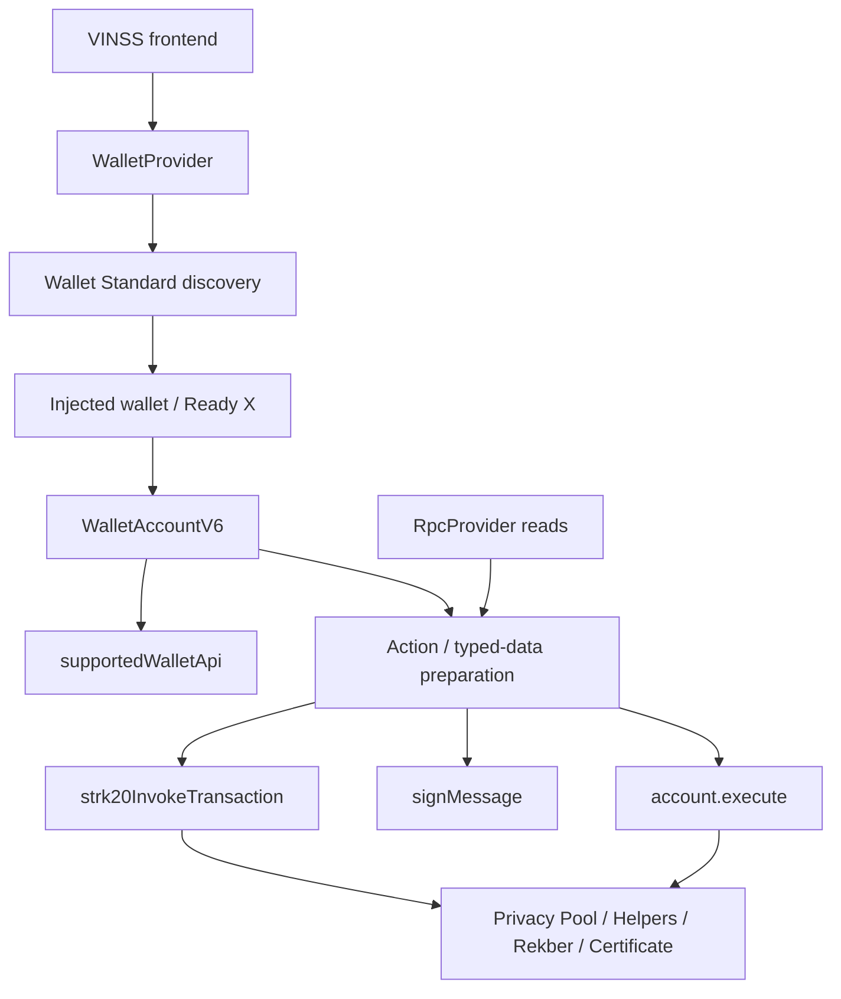
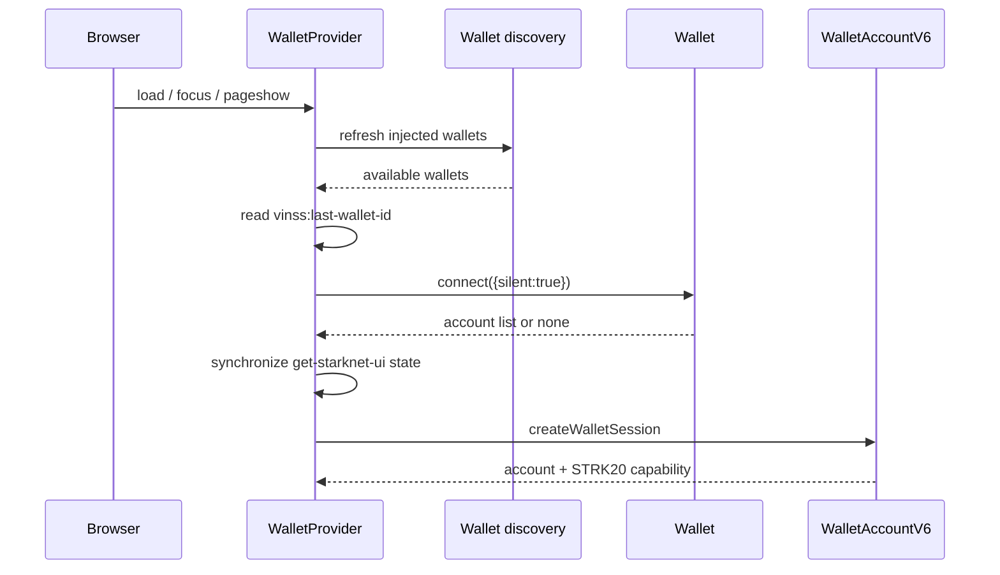
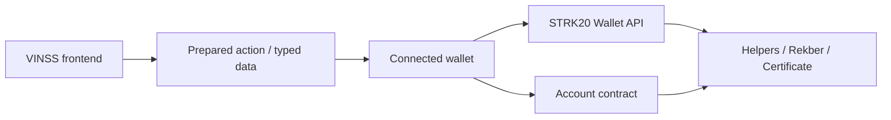
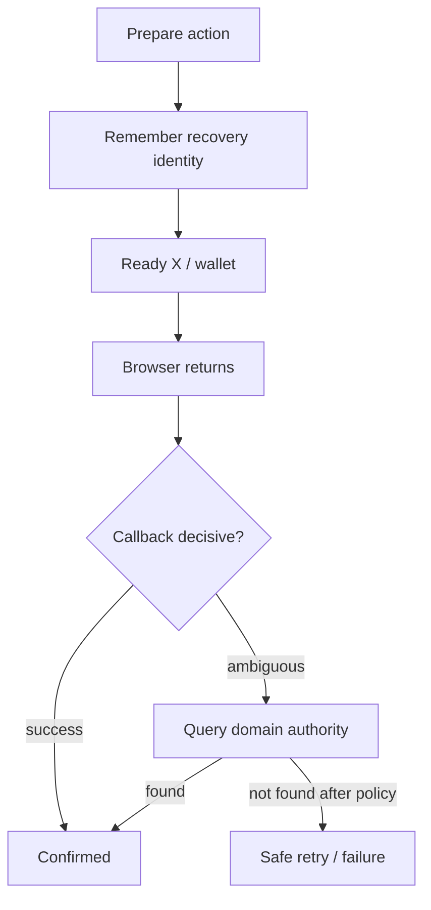
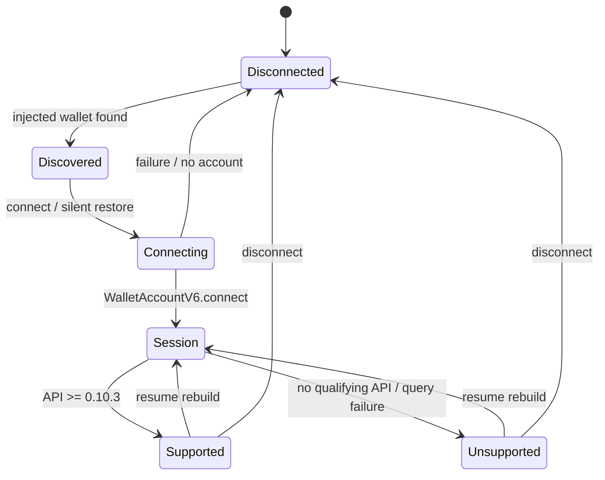
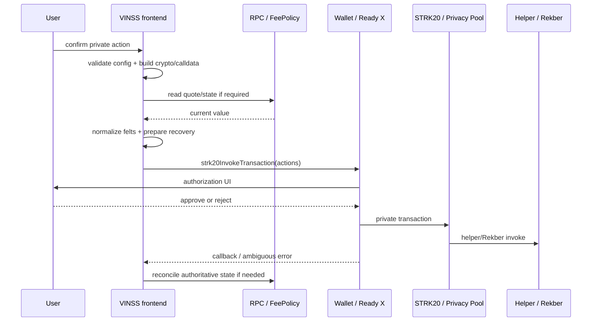
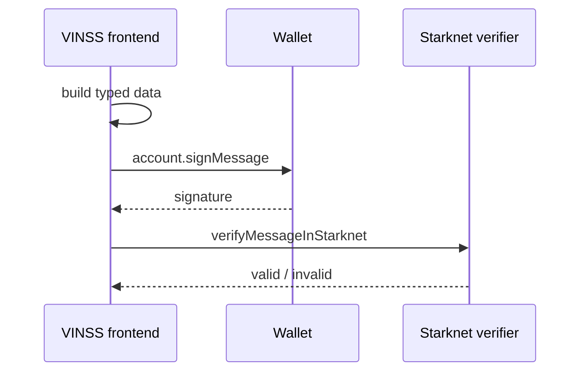
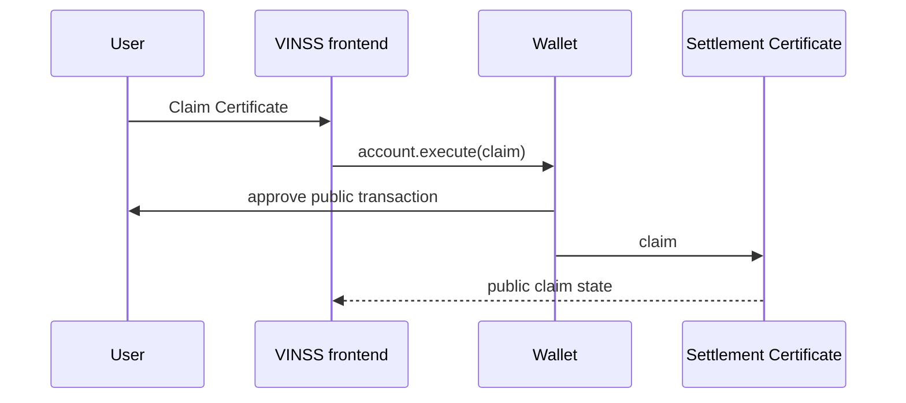
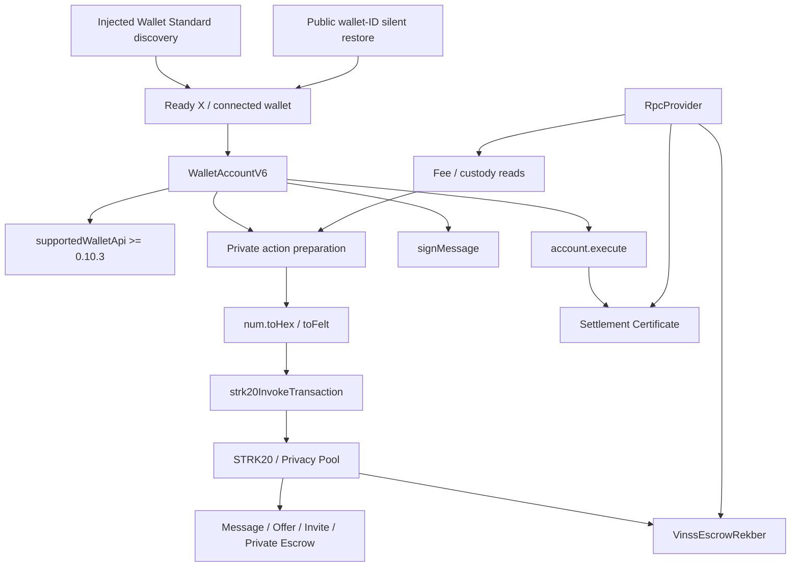

# VINSS Wallet & STRK20 Integration

This document describes the current VINSS frontend wallet, Wallet Standard, `WalletAccountV6`, STRK20, typed-data signing, and public account-execution boundaries.

The core authority model is:

```text
VINSS frontend
    prepares exact action / typed data
        ↓
connected Starknet wallet
    authorizes / signs
        ↓
STRK20 Wallet API or account contract
        ↓
Privacy Pool / helper / Rekber / Certificate
```

The frontend does not receive the user's Starknet wallet private key.

---

# Evidence Rule

Source implementation, browser compatibility, Sepolia verification, mainnet verification, and production hardening are separate evidence classes.

Do not infer:

```text
STRK20 badge says SUPPORTED
    therefore
every transaction will succeed
```

or:

```text
source uses WalletAccountV6
    therefore
the current target-wallet/mobile combination has been E2E verified
```

Use independent evidence labels such as:

```text
Implemented
Browser tested
Wallet/version tested
Sepolia transaction verified
Mainnet transaction verified
Production-hardened
```

---

# Objective

The wallet layer should:

```text
discover injected Starknet wallets
restore an approved mobile wallet session where possible
construct WalletAccountV6
detect STRK20 Wallet API support without moving funds
normalize strict felt/address fields
hand private action bundles to the wallet
keep user signing authority outside VINSS backend/Agent
recover from Ready X background/remount behavior
separate private STRK20 operations from intentionally public account.execute operations
```

---

# Current Source Map

```text
frontend/app/layout.tsx
frontend/components/providers/WalletProvider.tsx
frontend/components/WalletConnectButton.tsx
frontend/lib/starknet/walletClient.ts
frontend/lib/starknet/walletStore.ts
frontend/lib/starknet/constants.ts
frontend/lib/starknet/feePolicy.ts
frontend/lib/privacy/envelope.ts

frontend/lib/deal-room/messaging.ts
frontend/lib/deal-room/offers.ts
frontend/lib/deal-room/invitation.ts
frontend/lib/deal-room/escrow.ts
frontend/lib/deal-room/settlement.ts
frontend/lib/deal-room/rekberAuthorization.ts
frontend/lib/deal-room/disputeAgent.ts
```

---

# High-Level Architecture



---

# Root Wallet Provider

`frontend/app/layout.tsx` wraps application content in:

```text
<WalletProvider>
```

so room/home surfaces consume one shared VINSS wallet-session context.

---

# Wallet Discovery

Current discovery stack uses:

```text
@starknet-io/get-starknet-ui
@starknet-io/get-starknet-discovery
@starknet-io/get-starknet-wallet-standard
@starknet-io/get-starknet-wallet-standard-v6
starknet WalletAccountV6 / walletV6
```

`walletStore` is created with:

```text
eip1193Adapters: []
```

and VINSS explicitly refreshes injected-wallet discovery.

---

## Initial Injected-Wallet Rescan

`watchForInjectedWallets()` rescans at approximately:

```text
0 ms
150 ms
400 ms
900 ms
1800 ms
3500 ms
6000 ms
```

then polls every:

```text
1.5 seconds
```

for roughly:

```text
30 seconds
```

and also refreshes on:

```text
focus
pageshow
window load
visibility -> visible
```

This exists because Android extension wallets may inject or replace wallet objects after React has mounted.

---

# Wallet Connect UI

`WalletConnectButton` loads `WalletConnectModal` dynamically with:

```text
ssr: false
```

because wallet discovery is browser-only.

Before a user connection interaction it calls:

```text
refreshInjectedWallets()
```

again.

---

## Ready X Unlock Return

If a connect attempt started and the dapp returns from a Ready X unlock/background flow while still disconnected, VINSS refreshes injected wallets again.

The component deliberately does not force-remount the connect modal just because the app regained focus.

This avoids aborting a still-in-flight wallet connect request.

---

# WalletProvider Connection State

`WalletProvider` exposes:

```text
session
connected
connectWallet(wallet)
disconnectWallet()
```

to descendants.

---

# VINSS Wallet Session

Current session shape:

```text
account: WalletAccountV6
address: string
wallet: WalletWithStarknetFeatures
strk20Capable: boolean
```

`createWalletSession(wallet)` constructs:

```text
WalletAccountV6.connect(
  { nodeUrl: RPC_URL },
  wallet
)
```

and uses:

```text
account.address
```

as the connected VINSS account address.

---

# STRK20 Capability Detection

Current executable minimum in `walletClient.ts`:

```text
0.10.3
```

Detection calls:

```text
walletV6.supportedWalletApi(wallet)
```

and considers the wallet STRK20-capable if any advertised API version compares as:

```text
>= 0.10.3
```

under the current numeric dotted-version comparator.

---

## Least-Privilege Detection

VINSS does not discover STRK20 support by submitting:

```text
dummy withdraw
dummy transfer
dummy invoke
```

The version query is intentionally read-only.

---

## Capability Query Failure

If `supportedWalletApi()` throws:

```text
strk20Capable = false
```

rather than rejecting the entire connected wallet session.

---

# Capability Badge

Current connected UI can render:

```text
STRK20 · SUPPORTED
STRK20 · NOT SUPPORTED
```

when capability display is enabled.

---

## Capability Flag Is Currently a UX Signal

Current repository usage of:

```text
session.strk20Capable
```

is the wallet capability badge.

There is no one global middleware that rejects every Message/Offer/Invite/Rekber action solely from this boolean.

Therefore:

```text
STRK20 · SUPPORTED
!=
the next private transaction is guaranteed to succeed
```

Runtime execution still depends on:

```text
correct network
wallet state
strict payload formatting
private balances / notes
FeePolicy / RPC
paymaster/private transaction infrastructure
contract invariants
```

---

# Wallet API Version Comparator

Current comparator logic is approximately:

```text
remove leading v
split on .
Number(segment)
compare numeric segments
```

This is not a full semantic-version parser.

A string such as:

```text
0.10.3-rc.1
```

can produce non-numeric segment behavior and may be classified as unsupported.

This should be treated as a compatibility edge case.

---

# Duplicate Minimum-Version Constant

Current repository defines `0.10.3` in two places:

```text
walletClient.ts
  MIN_STRK20_WALLET_API

constants.ts
  MIN_WALLET_API_VERSION
```

The executable capability detector currently uses the local constant in:

```text
walletClient.ts
```

This duplication can drift if one value changes independently.

---

# Wallet Session Restoration

Current restoration uses:

```text
vinss:last-wallet-id
```

as a public reconnect hint.



---

## Last Wallet Identifier

Current local key:

```text
vinss:last-wallet-id
```

stores only the wallet's public provider/API identifier.

Current source explicitly avoids persisting:

```text
wallet private key
seed phrase
account secret
wallet session secret
```

---

## Silent Restore

If no React connection exists after reload, VINSS:

```text
loads available wallets
prefers the previously used wallet ID
calls StandardConnect.connect({ silent: true })
```

If no saved wallet ID exists, the current provider silently probes available discovered wallets.

The intended restore probe must not intentionally open an approval popup.

---

## Synchronizing UI Connection

When a silent connect reports at least one account, VINSS calls:

```text
connect(entry.wallet)
```

to synchronize `get-starknet-ui` state.

---

# Mobile Resume Recovery

On focus/pageshow/visibility return, `WalletProvider`:

```text
refreshes injected wallets immediately
waits about 350 ms
refreshes again
increments resumeNonce
rebuilds/retries session creation
```

This addresses Ready X/injected-wallet object churn during Android extension round trips.

---

# Disconnect

Current application disconnect path is in `WalletProvider`.

It:

```text
calls useConnect().disconnect()
removes vinss:last-wallet-id
sets VINSS session to null
```

It does not automatically erase:

```text
roomSecret
groupSecret
messaging identity
Chat history
Offer history
Rekber secrets
Invite recovery state
```

Disconnect is not equivalent to clearing all VINSS local private state.

---

## walletClient Disconnect Stub

`walletClient.ts` also exports:

```text
disconnectWallet(): Promise<void>
```

whose current body is empty because Wallet Standard handles wallet connection lifecycle.

Current application UI disconnect logic is in `WalletProvider`.

---

# Shared RPC Provider

`walletClient.ts` creates a lazy singleton:

```text
RpcProvider({
  nodeUrl: RPC_URL
})
```

for read-only frontend Starknet operations.

Current consumers include FeePolicy and Rekber/Certificate reads.

Some modules, such as Invite, instantiate their own `RpcProvider` using the same `RPC_URL`.

The invariant is network consistency, not necessarily one JavaScript provider object.

---

# Network Configuration

Current frontend network inputs include:

```text
NEXT_PUBLIC_STARKNET_NETWORK
NEXT_PUBLIC_RPC_URL
NEXT_PUBLIC_BACKEND_URL
wallet's actual selected chain
contract/token addresses
```

`NETWORK` defaults to:

```text
sepolia
```

when its env is absent.

`RPC_URL` also has a current Sepolia fallback.

---

## Runtime Network Validation Caveat

`NETWORK` is TypeScript-cast to:

```text
"sepolia" | "mainnet"
```

but current source does not runtime-validate the environment string before that cast.

---

## Rekber Typed-Data Chain Selection

Current Rekber authorization uses:

```text
NETWORK === "mainnet"
  ? SN_MAIN
  : SN_SEPOLIA
```

So an invalid network string falls into the Sepolia typed-data branch.

---

## No Single Global Wallet-Chain Guard

Current wallet-session source does not implement one universal preflight proving:

```text
wallet chainId
==
NEXT_PUBLIC_STARKNET_NETWORK
==
RPC network
==
contract deployment network
==
backend index network
```

before every workflow.

Network correctness therefore relies on deployment configuration, wallet behavior, and E2E verification.

---

# Network Consistency Checklist

- [ ] `NEXT_PUBLIC_STARKNET_NETWORK` is exactly `sepolia` or `mainnet`.
- [ ] `NEXT_PUBLIC_RPC_URL` targets the same network.
- [ ] Connected wallet is on the intended Starknet chain.
- [ ] Privacy Pool belongs to that deployment.
- [ ] Message Helper belongs to that deployment.
- [ ] Offer Helper belongs to that deployment.
- [ ] Invite belongs to that deployment.
- [ ] Private Escrow Helper belongs to that deployment.
- [ ] Rekber belongs to that deployment.
- [ ] Settlement Certificate belongs to that deployment.
- [ ] FeePolicy references belong to that deployment.
- [ ] STRK and USDC addresses are correct.
- [ ] Backend index network/contracts match frontend.
- [ ] Rekber typed-data chainId matches the intended chain.

---

# Central Address Normalization

STRK20 Wallet API boundaries are strict about felt-shaped values.

`constants.ts` currently uses:

```ts
function normalizeAddress(address: string): string {
  return address ? num.toHex(address) : address;
}
```

before exposing configured contract/token addresses.

---

## Centrally Normalized Values

Current normalized values include:

```text
CONTRACTS.privacyPool
CONTRACTS.messageHelper
CONTRACTS.messageHelperOpenNoteToken
CONTRACTS.invite
CONTRACTS.offerHelper
CONTRACTS.offerHelperOpenNoteToken
CONTRACTS.privateEscrowHelper
CONTRACTS.escrowRekber
CONTRACTS.settlementCertificate
STRK_ADDRESS
USDC_ADDRESS
```

---

## Why Zero Padding Matters

Explorer/deployment output can contain zero-padded hex addresses.

The Wallet API expects canonical felt syntax.

An invalid padded value passed directly into a strict Wallet API field can produce:

```text
INVALID_REQUEST_PAYLOAD
```

even when it numerically represents the intended address.

---

# Calldata Normalization

`toFelt()` in `envelope.ts` uses:

```text
num.toHex(value)
```

Private action modules use it for values such as:

```text
action codes
locators
routing tags
commitments
ciphertext chunk counts
ciphertext felts
amounts
timestamps
secret preimages
```

before Wallet API submission.

---

# Treasury Normalization Is Not Universal

The old wallet document implied normalization covered the full transaction boundary.

That is too broad.

`NEXT_PUBLIC_VINSS_TREASURY_ADDRESS` is read directly by several transaction modules and is not one centrally normalized `CONTRACTS` property.

Current call-site behavior:

| Path | Treasury recipient formatting |
|---|---|
| Offer | `num.toHex(treasury)` |
| Private Escrow coordination | `num.toHex(rawTreasury)` |
| Rekber settlement | `num.toHex(rawTreasury)` |
| Message | raw env `treasuryAddress` |
| Invite | raw env `treasuryAddress` |

If Message/Invite receive an invalid zero-padded treasury env value, their Wallet API transfer recipient can still be rejected by strict felt validation.

This is a current source consistency risk.

---

# Offer OpenNote Token Fallback

Current Offer token config resolves:

```text
NEXT_PUBLIC_OFFER_HELPER_OPEN_NOTE_TOKEN
    ??
NEXT_PUBLIC_MESSAGE_HELPER_OPEN_NOTE_TOKEN
```

then normalizes the selected address.

The fallback must still match the deployed Offer Helper's expected OpenNote token.

---

# STRK20 Execution Primitive

Current private write primitive:

```text
account.strk20InvokeTransaction(actions)
```

Action bundles use combinations of:

```text
withdraw
transfer
invoke
```

---

# Wallet-Owned OpenNote Placeholders

Current private flows use placeholders such as:

```text
${openNoteIds[0]}
```

and wallet action values such as:

```text
amount: "OPEN"
```

The wallet/STRK20 layer owns OpenNote creation/substitution.

Frontend code should not replace those placeholders with a guessed note ID.

---

# Private Message STRK20 Path

Current Message flow:

```text
quoteMessageFee()
    ↓
withdraw quoted amount to MessageHelper
    ↓
transfer OPEN revenue to treasury
    ↓
invoke MessageHelper
    ↓
optional additional private invokes
```

through:

```text
account.strk20InvokeTransaction(...)
```

---

## Message Preflight

Before `onPrepared`, current Message flow prepares:

```text
helper/token configuration
fresh action locator
opaque routing tags
AES-GCM ciphertext
payload commitment
optional additional private invokes
current FeePolicy quote
treasury configuration
```

This avoids creating a ghost pending Message on a pure FeePolicy/config failure before the wallet was invoked.

---

# Private Offer STRK20 Path

Current Offer flow:

```text
quoteOfferFee()
    ↓
withdraw quoted amount to OfferHelper
    ↓
transfer OPEN revenue to treasury
    ↓
invoke OfferHelper
```

through:

```text
account.strk20InvokeTransaction(...)
```

Offer also waits until crypto/config/FeePolicy preflight succeeds before creating its prepared optimistic recovery state.

---

# Invite CREATE STRK20 Path

Current Invite CREATE:

```text
quoteRoomActivationFee()
    ↓
withdraw quoted amount to Invite
    ↓
transfer OPEN revenue to treasury
    ↓
invoke Invite CREATE
```

Invite capability material is prepared before the wallet round trip so the browser can recover the shareable capability if Ready X backgrounds/remounts the dapp.

---

# Invite CONSUME STRK20 Path

Current Invite CONSUME does not charge room activation again.

It uses:

```text
10 wei replay-protection withdrawal
+
Invite CONSUME invoke
```

through the STRK20 wallet path.

---

# Private Escrow Coordination STRK20 Path

Encrypted Rekber coordination also uses:

```text
account.strk20InvokeTransaction(...)
```

Conceptually:

```text
revenue amount or 10 wei replay amount
    ↓
withdraw to treasury
    ↓
invoke PrivateEscrowHelper
```

depending on the coordination action.

---

# Rekber Funding STRK20 Path

Funding does not use a frontend hardcoded:

```text
principal / 50
```

formula.

Current flow:

```text
quote_rekber_fee(token, principal)
    ↓
withdraw principal + exact quoted fee to Rekber
    ↓
transfer OPEN revenue output to treasury
    ↓
invoke Rekber action 1
```

The funding quote is obtained immediately before Ready X constructs the transaction.

---

# Rekber Settlement Output

Release/refund/auto-release/mutual-refund/resolution paths first load canonical custody to identify the settlement token.

The wallet creates an OPEN output for the custody asset and the Rekber invocation fills/settles that wallet-generated output.

---

## Resolution Claim

Current resolution claim can combine:

```text
withdraw Rekber workflow fee in STRK
transfer custody asset as OPEN to claimant
invoke Rekber action 10
```

in one STRK20 transaction.

---

# Rekber Workflow Actions

Current fulfillment/confirmation/revision/dispute state transitions also use STRK20 bundles.

The settlement source keeps the actual Rekber state transition as one external contract `invoke` inside those private transactions, while fee/replay spend remains part of the same STRK20 action bundle.

---

# Fee Quote Boundary

| Workflow | Current quote source |
|---|---|
| Invite CREATE | `quoteRoomActivationFee()` |
| Message | `quoteMessageFee()` |
| Offer | `quoteOfferFee()` |
| Rekber funding | `quoteRekberFee(token, principal)` |
| Rekber workflow | `quoteRekberWorkflowFee()` |

Keep separate:

```text
VINSS application fee
Privacy Pool/private transaction cost
paymaster cost
network execution cost
Rekber funding service fee
settlement principal
```

---

# Stale 7 STRK Comment

`constants.ts` still has an old comment describing the Message OpenNote token as participating in:

```text
current 7 STRK per-message VINSS application revenue
```

Current executable Message flow instead uses:

```text
quoteMessageFee()
```

from FeePolicy.

The stale comment is not runtime authority.

---

# Authorization Boundary



---

# Frontend Responsibilities

Current frontend can:

```text
derive application encryption keys
encrypt private payloads
build commitments
query FeePolicy/current state
construct STRK20 action arrays
normalize calldata
build SNIP-12 typed data
request wallet signatures
request public account execution
reconcile wallet callback against network authority
```

---

# Wallet Responsibilities

The connected wallet remains the user authorization boundary for:

```text
STRK20 transaction submission
typed-data signing
public account.execute transaction
wallet-controlled OpenNote construction
```

---

# Wallet Private Key Boundary

VINSS frontend does not intentionally request or persist:

```text
wallet seed phrase
wallet account private key
account signer secret
```

Wallet signing authority remains inside the wallet implementation.

---

# Normal Backend Authority

Normal VINSS backend does not sign user Message/Offer/Invite/Rekber transactions.

The normal transaction path is:

```text
frontend prepares
    ↓
user wallet authorizes
    ↓
STRK20 / account contract submits
```

---

## Dedicated Dispute Resolver Qualification

A separately configured backend Dispute AutoResolve path may hold its own dedicated resolver signer for eligible resolution authorization.

That signer is:

```text
not the user's wallet key
not normal Agent authority
not normal Message/Offer signing
```

Do not use the resolver exception to claim the backend controls ordinary user wallets.

---

# Normal Agent Authority

Normal Agent proposals can prepare local actions such as:

```text
draft_message
draft_offer
draft_counter_offer
prepare_escrow
review_rekber
```

but normal Agent does not autonomously call:

```text
strk20InvokeTransaction
account.execute
account.signMessage
```

for the user.

---

# Typed-Data Signing

Not every wallet authorization is a transaction.

Current Rekber Agreement and Dispute attestation flows use:

```text
account.signMessage(typedData)
```

---

# Rekber Agreement Signing

Current Rekber coordination domain:

```text
name = VINSS Rekber
version = 3
chainId = SN_MAIN or SN_SEPOLIA
revision = 1
```

Pairwise symmetric encryption cannot independently prove which of two peers authored the shared plaintext.

Payer setup and payee acceptance therefore add explicit wallet-authenticated signatures before funding.

---

## Rekber Signature Verification

Current verification uses:

```text
verifyMessageInStarknet(
  provider,
  typedData,
  signature,
  signerAddress
)
```

before the signed Rekber Agreement is treated as funding authority.

---

# Dispute Attestation

Dedicated Dispute challenge signing also uses:

```text
account.signMessage(typedData)
```

This signature authenticates/consents to a dispute case.

It is not itself a custody-transfer transaction and is not a Rekber secret preimage.

---

# Public Settlement Certificate

Settlement Certificate claim intentionally does not use STRK20 private execution.

Current claim calls:

```text
account.execute({
  contractAddress: settlementCertificate,
  entrypoint: "claim",
  calldata: ...
})
```

The Certificate is intentionally public settlement evidence.

---

# Read-Only Starknet Operations

Wallet authorization is not needed for read-only RPC operations such as:

```text
FeePolicy getters and quotes
Invite get_invite
Rekber get_custody
Rekber event/proof reads
Certificate is_claimed
Certificate get_certificate
```

---

# Read vs Sign vs Private Write vs Public Write

```text
RpcProvider.callContract / getEvents
    -> read only

WalletAccountV6.signMessage
    -> account authorship / attestation

WalletAccountV6.strk20InvokeTransaction
    -> private transaction path

WalletAccountV6.execute
    -> public account transaction
```

These primitives should never be collapsed into one generic "wallet action" in technical docs.

---

# STRK20 Helper Invoke Shape

Current helper integrations pass calldata to the Wallet API's `invoke` action.

They do not prepend an ordinary Starknet selector inside the helper's own calldata payload.

Each helper module remains responsible for matching its Cairo `privacy_invoke` field ordering and length conventions.

---

# Wallet Error Semantics

On mobile:

```text
dapp backgrounds
wallet unlocks
transaction submits
browser resumes
callback arrives late or returns generic error
```

Therefore:

```text
wallet timeout
!=
definite chain failure
```

---

# Prepared vs Confirmed

Current frontend workflows distinguish:

```text
prepared action
wallet callback state
indexed / contract confirmation
```

A prepared locator proves only what the browser intended to submit.

It does not prove the target state transition exists.

---

# Mobile Transaction Recovery



---

# Recovery Evidence by Domain

| Domain | Stronger recovery evidence |
|---|---|
| Wallet session | Wallet Standard silent reconnect |
| Message | exact indexed Message locator |
| Offer | authenticated exact Offer locator |
| Invite CREATE | `get_invite(commitment)` |
| Private Escrow coordination | exact indexed coordination locator |
| Rekber funding/settlement | `get_custody` + events/proofs |
| Settlement Certificate | `is_claimed` / Certificate record |

---

# Message Recovery

Direct Message can reconcile an ambiguous Ready callback through exact-locator private Message Discovery.

---

# Offer Recovery

Offer can reconcile prepared action locators through authenticated Offer Discovery.

A stale callback must not mutate a newer action generation.

---

# Invite Recovery

Invite CREATE has a direct Starknet state fallback:

```text
get_invite(commitment)
```

for ambiguous wallet timeout handling.

---

# Rekber Recovery

Rekber uses:

```text
Private Escrow indexed coordination
get_custody
Rekber event proofs
Certificate state
```

rather than treating callback state as universal authority.

---

# Wallet Object Churn

Ready X may replace or reinject the JavaScript wallet object while the browser is backgrounded.

Current provider/button logic therefore rediscover injected wallets instead of assuming the originally clicked wallet object remains valid forever.

---

# Capability Detection vs Runtime Execution

A wallet can advertise the expected API and still fail because of:

```text
wrong chain
invalid contract/token/recipient formatting
missing feature config
wallet locked state
insufficient private balance/note state
paymaster/private transaction failure
FeePolicy/RPC failure
contract revert
stale session
wallet implementation bug
```

Capability detection is a compatibility signal, not transaction finality.

---

# AVNU Boundary

`frontend/package.json` currently includes:

```text
@avnu/avnu-sdk
```

but the transaction modules audited here submit through:

```text
WalletAccountV6
strk20InvokeTransaction
```

rather than directly constructing AVNU SDK paymaster calls in those modules.

Do not infer direct AVNU transaction construction merely from package dependency presence.

---

# Paymaster / Wallet Cost Boundary

Fees shown or charged by wallet/private-transaction infrastructure are separate from VINSS application FeePolicy revenue.

Keep these concepts independent:

```text
VINSS application fee
STRK20 / Privacy Pool cost
paymaster sponsorship/cost
network cost
Rekber funding fee
deal principal
```

---

# Feature Configuration

Most contract addresses resolve to:

```text
""
```

when an environment value is missing.

There is no global app-start failure that proves every feature transaction is configured.

Instead, individual transaction modules check the addresses/tokens/treasury needed for the action.

Therefore:

```text
frontend renders
!=
every wallet flow is transaction-ready
```

---

# Configuration Matrix

| Value | Source | Centrally normalized? |
|---|---|---|
| Network | `NEXT_PUBLIC_STARKNET_NETWORK` | N/A |
| RPC | `NEXT_PUBLIC_RPC_URL` | N/A |
| Backend | `NEXT_PUBLIC_BACKEND_URL` | N/A |
| Privacy Pool | `NEXT_PUBLIC_PRIVACY_POOL_ADDRESS` | Yes |
| Message Helper | `NEXT_PUBLIC_MESSAGE_HELPER_ADDRESS` | Yes |
| Message OpenNote token | `NEXT_PUBLIC_MESSAGE_HELPER_OPEN_NOTE_TOKEN` | Yes |
| Invite | `NEXT_PUBLIC_INVITE_ADDRESS` | Yes |
| Offer Helper | `NEXT_PUBLIC_OFFER_HELPER_ADDRESS` | Yes |
| Offer OpenNote token | Offer env or Message token fallback | Yes |
| Private Escrow Helper | `NEXT_PUBLIC_PRIVATE_ESCROW_HELPER_ADDRESS` | Yes |
| Rekber | `NEXT_PUBLIC_ESCROW_REKBER_ADDRESS` | Yes |
| Settlement Certificate | `NEXT_PUBLIC_SETTLEMENT_CERTIFICATE_ADDRESS` | Yes |
| STRK | `NEXT_PUBLIC_STRK_ADDRESS` | Yes |
| USDC | `NEXT_PUBLIC_USDC_ADDRESS` | Yes |
| Treasury | `NEXT_PUBLIC_VINSS_TREASURY_ADDRESS` | No central constant |

---

# Wallet Capability State Machine



---

# Private Transaction Sequence



---

# Typed-Data Sequence



---

# Public Certificate Sequence



---

# Security Invariants

| ID | Invariant |
|---|---|
| `W1` | Frontend does not require the user's Starknet wallet private key. |
| `W2` | `WalletAccountV6` is created from the connected Wallet Standard wallet. |
| `W3` | STRK20 capability is detected by Wallet API version query, not a data-moving probe. |
| `W4` | Current executable minimum capability version is `0.10.3`. |
| `W5` | Capability-query failure degrades to `strk20Capable=false`. |
| `W6` | Private Message/Offer/Invite/Private Escrow/Rekber writes use STRK20 wallet execution. |
| `W7` | Rekber Agreement and Dispute attestations use wallet typed-data signing. |
| `W8` | Settlement Certificate claim uses public `account.execute`. |
| `W9` | Read-only chain state uses `RpcProvider`. |
| `W10` | Contract/token constants are canonicalized with `num.toHex`. |
| `W11` | Calldata felts should use `toFelt`/canonical hex. |
| `W12` | Wallet callback is not universal canonical transaction evidence. |
| `W13` | Wallet reconnect persistence stores only public wallet ID. |
| `W14` | Disconnect does not wipe room/Rekber local data. |
| `W15` | Wallet/RPC/network/contracts/backend must agree. |

---

# STRK20 Invariants

| ID | Invariant |
|---|---|
| `S1` | Primary private write primitive is `account.strk20InvokeTransaction`. |
| `S2` | OpenNote placeholders remain wallet-controlled. |
| `S3` | VINSS application fee is distinct from pool/network/paymaster cost. |
| `S4` | Runtime FeePolicy quotes override stale fee comments. |
| `S5` | Feature config is checked near transaction construction. |
| `S6` | Private-action recovery is domain-specific. |
| `S7` | Capability badge is a signal, not execution proof. |
| `S8` | Certificate is intentionally outside private STRK20 execution. |

---

# Mobile Wallet Invariants

| ID | Invariant |
|---|---|
| `M1` | Injected-wallet discovery is retried after page mount. |
| `M2` | Discovery refreshes on focus/pageshow/visibility. |
| `M3` | Unlock return does not forcibly remount the wallet modal. |
| `M4` | Silent restore prefers the last public wallet ID. |
| `M5` | Silent probing uses `silent:true`. |
| `M6` | Session can rebuild after injected-wallet object churn. |
| `M7` | Ambiguous callbacks are reconciled before declaring failure where the domain supports it. |

---

# Configuration Invariants

| ID | Invariant |
|---|---|
| `C1` | Missing feature config may leave the app rendered while that transaction flow is unavailable. |
| `C2` | `NETWORK` and `RPC_URL` must refer to the same chain. |
| `C3` | Rekber typed-data chainId must match the target chain. |
| `C4` | Treasury must be canonical felt formatting at every wallet call site. |
| `C5` | Offer OpenNote fallback must match deployed helper configuration. |
| `C6` | Mainnet deployment must not inherit Sepolia fallback values. |

---

# Incorrect Statements to Avoid

- STRK20 support is detected by sending a test transaction.
- `STRK20 · SUPPORTED` guarantees the next transaction.
- Every env-derived address is normalized centrally.
- Current Message fee is hardcoded to 7 STRK.
- VINSS backend signs normal user transactions.
- VINSS Agent automatically submits wallet transactions.
- Every VINSS write uses `strk20InvokeTransaction`.
- Settlement Certificate claim is private.
- Wallet disconnect deletes room/Rekber secrets.
- VINSS stores the wallet private key.
- `NEXT_PUBLIC_STARKNET_NETWORK` is runtime-validated automatically.
- Wallet chain and RPC/deployment chain are checked by one central guard.
- AVNU dependency means every transaction module directly calls AVNU.
- Ready X timeout always means transaction failure.
- Raw padded treasury addresses are safe in every current path.

---

# Accurate Statements

- VINSS uses Wallet Standard discovery and constructs `WalletAccountV6`.
- Current STRK20 capability threshold is `0.10.3` in `walletClient.ts`.
- Capability detection is a read-only Wallet API query.
- Private action modules submit through `strk20InvokeTransaction`.
- Rekber/Dispute authorship uses `signMessage`.
- Settlement Certificate uses public `account.execute`.
- Read-only state uses configured Starknet RPC.
- Central contract/token constants normalize addresses with `num.toHex`.
- Message/Invite treasury formatting remains a current consistency caveat.
- Mobile recovery combines wallet rediscovery with chain/index reconciliation.

---

# Connection Review Checklist

- [ ] `WalletProvider` still wraps root app.
- [ ] Injected-wallet store discovers the intended wallet.
- [ ] Wallet modal remains browser-only.
- [ ] Pre-connect rediscovery works.
- [ ] Focus/pageshow/visibility rediscovery works.
- [ ] Ready unlock return does not abort the connect request.
- [ ] `WalletAccountV6` session builds.
- [ ] Session address matches connected account.

---

# Capability Review Checklist

- [ ] `supportedWalletApi()` returns expected versions.
- [ ] `0.10.3` remains the intended minimum.
- [ ] Duplicate threshold constants have not drifted.
- [ ] Prerelease-version handling is understood.
- [ ] Capability badge matches current session.
- [ ] Feature actions still fail safely when runtime execution is unavailable.

---

# Mobile Recovery Checklist

- [ ] Wallet injected after React mount is discovered.
- [ ] Wallet unlock/background round trip restores session.
- [ ] Focus rediscovery works.
- [ ] Pageshow rediscovery works.
- [ ] Visibility rediscovery works.
- [ ] 350 ms secondary refresh remains appropriate.
- [ ] Last wallet ID survives reload.
- [ ] Silent restore does not intentionally open approval UI.
- [ ] Replaced wallet object does not strand the session.

---

# Address Normalization Checklist

- [ ] Every `CONTRACTS` address is canonicalized.
- [ ] STRK/USDC addresses are canonicalized.
- [ ] All calldata felts use `toFelt` or equivalent.
- [ ] Treasury is canonicalized at every wallet call site.
- [ ] No explorer-style padded address reaches a strict Wallet API field.
- [ ] OpenNote token matches helper deployment.

---

# Message Wallet Checklist

- [ ] Message Helper configured.
- [ ] Message OpenNote token configured.
- [ ] Treasury configured and canonicalized.
- [ ] Message FeePolicy quote succeeds.
- [ ] Encryption/commitment preflight succeeds.
- [ ] Prepared state begins only after preflight.
- [ ] Action bundle matches helper field order.
- [ ] Ambiguous callback can reconcile exact locator.

---

# Offer Wallet Checklist

- [ ] Offer Helper configured.
- [ ] Offer OpenNote token configured.
- [ ] Treasury canonicalized.
- [ ] Offer FeePolicy quote succeeds.
- [ ] Offer V2 calldata is normalized.
- [ ] Prepared state starts after preflight.
- [ ] Delayed callback can recover through authenticated Discovery.

---

# Invite Wallet Checklist

- [ ] Invite configured.
- [ ] OpenNote token configured.
- [ ] Treasury canonicalized before wallet submission.
- [ ] Room activation quote succeeds.
- [ ] CREATE keeps wallet OpenNote placeholder.
- [ ] CONSUME uses replay-only spend.
- [ ] Timeout can recover through `get_invite`.

---

# Rekber Wallet Checklist

- [ ] Rekber configured.
- [ ] Settlement token canonicalized.
- [ ] Treasury canonicalized.
- [ ] Funding quote comes from `quote_rekber_fee`.
- [ ] Funding withdrawal is principal + quoted fee.
- [ ] Settlement output uses wallet OPEN note.
- [ ] Lifecycle action number/calldata matches current Cairo.
- [ ] Canonical custody is re-read after transaction.

---

# Typed-Data Checklist

- [ ] Wallet supports `signMessage`.
- [ ] Rekber typed-data network is correct.
- [ ] Payer setup uses coordination version 3.
- [ ] Payee acceptance uses coordination version 3.
- [ ] Typed data binds exact private terms commitment.
- [ ] Signature verifies against signer account.
- [ ] Dispute attestation is not confused with custody preimages.

---

# Certificate Checklist

- [ ] Settlement Certificate address configured.
- [ ] Claim is intentionally public.
- [ ] `account.execute` targets `claim`.
- [ ] Custody/role/secret calldata is normalized.
- [ ] User sees public-linkability warning.
- [ ] `is_claimed` is re-read after submission.

---

# Mainnet Wallet Verification Checklist

- [ ] Frontend Git SHA recorded.
- [ ] Production frontend deployment recorded.
- [ ] Mainnet RPC independently verified.
- [ ] Target mobile browser recorded.
- [ ] Ready/wallet version recorded.
- [ ] Advertised Wallet API versions recorded.
- [ ] STRK20 capability badge checked.
- [ ] Wallet mainnet chain checked.
- [ ] All contract/token addresses independently verified.
- [ ] Treasury canonical formatting verified.
- [ ] Message private transaction verified.
- [ ] Offer private transaction verified.
- [ ] Invite CREATE/CONSUME verified.
- [ ] Rekber funding verified.
- [ ] Required release/refund path verified.
- [ ] Rekber SNIP-12 setup/accept signatures verified.
- [ ] Certificate public claim verified if enabled.
- [ ] Mobile background/remount recovery exercised.

---

# Testing Scope

Current frontend includes Playwright scripts and targeted domain tests.

There is not one dedicated automated suite that proves the full:

```text
Wallet Standard discovery
+
Ready X Android lifecycle
+
Wallet API version detection
+
all STRK20 action bundles
+
mainnet behavior
```

end to end.

---

# Recommended Wallet Tests

- Version comparator: `0.10.2 < 0.10.3`.
- Version comparator: `0.10.3 == 0.10.3`.
- Version comparator: `0.11.0 > 0.10.3`.
- Define/test prerelease version behavior.
- `supportedWalletApi()` throw produces capability `false`.
- Session still builds when capability query fails.
- Silent restore prefers saved wallet ID.
- Silent restore can probe another available approved wallet.
- Disconnect removes last-wallet ID.
- Focus/resume rebuild handles replaced wallet object.
- Zero-padded contract address normalizes.
- Zero-padded treasury address is normalized in every transaction path.
- Wrong-network wallet is detected before signing.

---

# Recommended STRK20 Bundle Tests

- Message action bundle fixture.
- Offer action bundle fixture.
- Invite CREATE action bundle fixture.
- Invite CONSUME action bundle fixture.
- Private Escrow coordination bundle fixture.
- Rekber funding bundle fixture.
- Rekber release/refund OPEN-output fixture.
- Rekber workflow one-external-invoke fixture.
- Resolution claim STRK-fee + custody-asset output fixture.
- OpenNote placeholder remains literal until wallet processing.
- Every felt field passes strict canonical-hex validation.

---

# Recommended Mobile Browser E2E

```text
open VINSS
    ↓
wallet injected late
    ↓
VINSS discovers wallet
    ↓
user connects
    ↓
Ready X unlock backgrounds browser
    ↓
return to VINSS
    ↓
wallet object rediscovered
    ↓
WalletAccountV6 rebuilt
    ↓
STRK20 capability queried
    ↓
private transaction submitted
    ↓
wallet callback delayed / ambiguous
    ↓
domain-specific network evidence confirms result
```

---

# Recommended Wrong-Network E2E

Test both:

```text
frontend configured mainnet
wallet remains Sepolia
```

and:

```text
frontend configured Sepolia
wallet remains mainnet
```

because current source does not expose one universal chain guard.

---

# Recommended Address-Formatting E2E

In a non-production environment, deliberately use zero-padded deployment values and verify:

```text
contract normalization
token normalization
treasury normalization
calldata toFelt normalization
```

before production.

---

# Current Known Caveats

| Caveat | Current implication |
|---|---|
| Capability flag is UI-only | `strk20Capable` currently powers the badge, not a universal private-action gate. |
| Minimum version duplicated | `0.10.3` exists in `walletClient.ts` and `constants.ts`. |
| Simple version parser | Prerelease/build syntax is not fully semver-aware. |
| Treasury normalization inconsistent | Message and Invite currently pass raw treasury env. |
| Stale fee comment | `constants.ts` still refers to 7 STRK Message revenue while runtime uses FeePolicy. |
| No global chain guard | Wallet/RPC/NETWORK/contracts/backend consistency relies on config and QA. |
| NETWORK runtime cast | Invalid env text can survive the TypeScript assertion. |
| Wallet object churn | Mobile recovery depends on rediscovery. |
| No universal wallet E2E suite | Source integration is not proof for every target wallet/version. |
| AVNU dependency vs usage | Audited transaction modules use `WalletAccountV6`, not direct AVNU SDK calls. |

---

# Failure Classes

| Failure | Meaning | Expected response |
|---|---|---|
| No injected wallet | No connectable provider | Rescan/install supported wallet |
| Wallet locked/object replaced | JavaScript wallet object may be stale | Focus/resume rediscovery |
| Capability query fails | Support signal unavailable | Keep session, mark unsupported |
| Unsupported API | Private path may not work | Do not promise execution |
| Missing config | Feature not transaction-ready | Fail before wallet handoff |
| Invalid padded felt | Wallet payload rejected | Canonicalize |
| Fee quote failure | No authoritative current fee | Do not guess |
| User rejection | Explicit cancellation | Stop action |
| Ambiguous timeout | Callback outcome unknown | Reconcile network authority |
| Wrong network | Chain/config mismatch | Block/fix deployment or wallet chain |
| Contract revert | Contract invariant rejected | Surface domain-safe error |
| RPC unavailable | Read/recovery unavailable | Do not infer success from local state |

---

# Authority Matrix

| Question | Current authority |
|---|---|
| Wallet discovery | Wallet Standard discovery/store |
| Connected user account | `WalletAccountV6` session |
| STRK20 support signal | `walletV6.supportedWalletApi` |
| Private transaction authorization | Connected wallet |
| Rekber typed-data authorship | Wallet `signMessage` + Starknet verification |
| Read-only chain state | Configured `RpcProvider` |
| Message/Offer/Invite private write | STRK20 Wallet API + target helper |
| Rekber custody write | STRK20 Wallet API + `VinssEscrowRekber` |
| Certificate claim | Public `account.execute` + Certificate contract |
| Final domain state | Target contract/indexed network evidence |

---

# Transaction Primitive Matrix

| Workflow | Primitive | Boundary |
|---|---|---|
| Message send | `strk20InvokeTransaction` | Private helper action |
| Offer action | `strk20InvokeTransaction` | Private helper action |
| Invite CREATE | `strk20InvokeTransaction` | Private room activation |
| Invite CONSUME | `strk20InvokeTransaction` | Replay-protected consume |
| Private Escrow coordination | `strk20InvokeTransaction` | Encrypted coordination |
| Rekber funding | `strk20InvokeTransaction` | Private funding |
| Rekber release/refund | `strk20InvokeTransaction` | OPEN settlement output |
| Rekber workflow | `strk20InvokeTransaction` | Lifecycle state |
| Rekber Agreement | `signMessage` | Wallet authorship |
| Dispute challenge | `signMessage` | Arbitration attestation |
| Settlement Certificate | `account.execute` | Intentionally public |
| State/fee reads | `RpcProvider` | Read only |

---

# Recovery Evidence Matrix

| Domain | Recovery evidence | Local callback role |
|---|---|---|
| Wallet session | Wallet Standard silent reconnect | Session hint |
| Message | exact indexed locator | Optimistic/transport signal |
| Offer | authenticated exact locator | Optimistic/transport signal |
| Invite | `get_invite(commitment)` | Transport signal |
| Private Escrow | exact indexed locator | Transport signal |
| Rekber | `get_custody` + proof/event | Transport signal |
| Certificate | `is_claimed` / record | Transport signal |

---

# Source Responsibility Matrix

| Source | Responsibility |
|---|---|
| `app/layout.tsx` | Global WalletProvider placement |
| `WalletProvider.tsx` | Connection, session, silent restore, mobile resume, disconnect |
| `WalletConnectButton.tsx` | Connect modal, rediscovery, capability badge |
| `walletStore.ts` | Injected-wallet refresh/watch schedule |
| `walletClient.ts` | `WalletAccountV6`, capability detection, shared RPC |
| `constants.ts` | Network/RPC/backend/normalized addresses |
| `feePolicy.ts` | Dynamic fee resolution |
| `envelope.ts` | Canonical felt formatting |
| `messaging.ts` | Message STRK20 bundle |
| `offers.ts` | Offer STRK20 bundle |
| `invitation.ts` | Invite CREATE/CONSUME bundles |
| `escrow.ts` | Private Escrow coordination bundle |
| `settlement.ts` | Rekber STRK20 + public Certificate execute |
| `rekberAuthorization.ts` | Rekber typed-data sign/verify |
| `disputeAgent.ts` | Dispute challenge signing |

---

# Protocol Compatibility Boundaries

Changes to these require explicit integration review:

```text
minimum supported Wallet API version
Wallet Standard feature/API shape
WalletAccountV6 behavior
strk20InvokeTransaction action schema
OPEN amount behavior
openNoteIds[0] placeholder syntax
strict felt/address formatting
helper calldata-length conventions
SNIP-12 typed-data fields/domain
network chainId selection
```

---

# Wallet API Upgrade Rule

When raising the minimum Wallet API:

```text
update one canonical threshold
test older/newer version strings
define prerelease behavior
record Ready X advertised versions
verify action-schema compatibility
verify mobile session recovery
verify all required feature bundles
update capability UI
```

Do not only change a display constant.

---

# Sepolia → Mainnet Rule

Moving networks requires coordinated verification of:

```text
NETWORK
RPC
wallet target chain
backend network
Privacy Pool
Message Helper
Offer Helper
Invite
Private Escrow Helper
Rekber
Settlement Certificate
FeePolicy references
STRK
USDC
treasury
typed-data chainId
```

A mainnet env template is not proof that all of those values agree.

---

# Address Migration Rule

Deployment tooling can output padded addresses.

Any new Wallet API:

```text
contract
token
recipient
calldata felt
```

should be canonicalized before submission.

Prefer centrally normalized reusable addresses over repeated raw env reads.

---

# Observability Rule

Wallet/debug logging should not expose:

```text
Rekber capability preimages
private Message plaintext
private Offer plaintext
sensitive wallet implementation data
```

Current Message error logic already redacts attached Rekber calldata in its sensitive lifecycle branch, but production logging still deserves review.

---

# User-Facing Capability Copy

Current badge copy is appropriately narrow:

```text
STRK20 · SUPPORTED
STRK20 · NOT SUPPORTED
```

Avoid stronger copy such as:

```text
All private transactions guaranteed
```

because capability/version support and transaction success are different properties.

---

# Source-of-Truth Order

```text
1. current Wallet API / Starknet integration behavior used by installed dependencies
2. frontend/lib/starknet/walletClient.ts
3. frontend/components/providers/WalletProvider.tsx
4. frontend/lib/starknet/walletStore.ts
5. frontend/lib/starknet/constants.ts
6. frontend/lib/privacy/envelope.ts
7. current deal-room transaction modules
8. canonical Cairo helper/Rekber interfaces
9. deployed RPC/network/contracts/FeePolicy
10. target-wallet browser transaction evidence
11. prose documentation
```

---

# Documentation Maintenance Rules

- Read `walletClient.ts` before documenting the minimum STRK20 version.
- Read `WalletProvider.tsx` before documenting restore/disconnect behavior.
- Read `walletStore.ts` before documenting injected-wallet timing.
- Do not infer execution success from the capability badge.
- Do not claim every address is normalized until treasury paths are aligned.
- Do not freeze historical Message/Offer fees in wallet documentation.
- Separate `strk20InvokeTransaction`, `signMessage`, `account.execute`, and RPC reads.
- Keep Settlement Certificate claim explicitly public.
- Keep normal backend user-signing authority separate from optional dispute resolver authority.
- Keep network/RPC/wallet/contracts/backend consistency explicit.
- Do not claim direct AVNU SDK transaction construction solely from dependency presence.
- Do not classify every Ready timeout as definite transaction failure.

---

# Final Wallet Architecture Diagram



---

# Bottom Line

The original wallet document captured the basic authority boundary correctly, but the current frontend has a more specific mobile/session/STRK20 architecture.

The strongest current connection statement is:

> VINSS uses Wallet Standard discovery, repeatedly rescans injected wallets for Android/Ready X lifecycle quirks, and constructs a `WalletAccountV6` session against the configured RPC.

The strongest current capability statement is:

> STRK20 capability is detected non-destructively with `walletV6.supportedWalletApi()` using an executable minimum of `0.10.3`; the boolean currently drives the capability badge rather than one universal transaction gate.

The strongest current execution statement is:

> Message, Offer, Invite, Private Escrow, and Rekber private transaction paths use `account.strk20InvokeTransaction(...)`; Rekber/Dispute authorship uses `account.signMessage(...)`; Settlement Certificate claim intentionally uses public `account.execute(...)`.

The strongest current formatting statement is:

> Contract/token constants and calldata are normalized to canonical felt hex, but treasury normalization is not yet universal: Message and Invite currently read the treasury environment value directly.

The strongest current recovery statement is:

> Ready X callback state is not universal transaction truth. VINSS combines wallet rediscovery/session restoration with domain-specific network evidence such as exact locators, `get_invite`, `get_custody`, and Certificate state.

The strongest current network statement is:

> Network string, RPC, wallet chain, backend index, deployed contracts, FeePolicy references, and typed-data chainId must agree. Current source does not enforce that complete invariant through one global runtime guard.

The main current maintenance caveats are:

> stale 7 STRK Message commentary in `constants.ts`, duplicated `0.10.3` minimum-version definitions, a simple non-semver-aware version comparator, and inconsistent treasury normalization.
