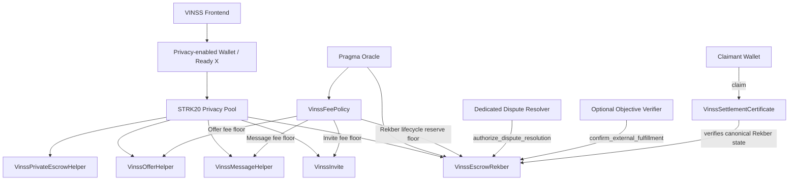

# VINSS Smart Contract Technical Reference

This directory documents the Cairo contracts exported by `contracts/src/lib.cairo` and the contract boundaries that must remain synchronized with the surrounding VINSS application stack.

Executable Cairo source and tests are the source of truth. This documentation does not replace ABI inspection, deployment artifacts, source verification, or network-level testing.

## Contract Inventory

| Contract | Role |
|---|---|
| `VinssFeePolicy` | Shared oracle-backed fee-floor and sponsor-cost policy |
| `VinssInvite` | One-time expiring Invite commitment with fee-bearing creation |
| `VinssMessageHelper` | Stores encrypted Message envelopes and returns a revenue `OpenNoteDeposit` |
| `VinssOfferHelper` | Stores encrypted Offer action envelopes and returns a revenue `OpenNoteDeposit` |
| `VinssPrivateEscrowHelper` | Stores encrypted Rekber coordination actions and never custodies principal |
| `VinssEscrowRekber` | STRK/USDC custody, fulfillment, review, revision, refund, dispute, resolution, and settlement |
| `VinssSettlementCertificate` | Claimable non-transferable ERC-721 credential for eligible successful settlements |

## Execution and Dependency Model



All current contracts exposing `privacy_invoke` restrict the caller of that entrypoint to the configured STRK20 Privacy Pool contract.

This is an invocation boundary, not proof that the contract knows a plaintext participant identity or plaintext business semantics.

## Important Technical Boundaries

Encrypted Message, Offer, and Private Escrow helpers store public ciphertext together with opaque routing and commitment metadata. They do not decrypt business semantics.

`VinssEscrowRekber` is intentionally not ciphertext-only. Token, principal, fee, deadlines, policy, commitments, evidence commitments, dispute state, resolution amounts, and settlement state are public contract state.

Privacy and authorization are separate concerns. Invocation through the configured Privacy Pool does not by itself establish plaintext participant identity or settlement authority.

The dispute resolver can authorize only an exact payer/payee split whose sum equals the custody principal:

```text
payer_amount + payee_amount = custody_principal
```

The resolver cannot redirect principal to itself.

Each party must later claim its own authorized share using the capability committed during funding.

## Rekber Security Invariants

`VinssEscrowRekber` is responsible for custody correctness, not merely coordination.

The following invariants must remain true across the settlement lifecycle:

- settlement paths must not distribute more principal than was funded;
- mutually exclusive final settlement paths must not execute more than once;
- dispute resolution must allocate exactly the custody principal between payer and payee;
- the dispute resolver cannot become a recipient of settlement principal through resolution;
- refund, release, dispute, and resolution transitions remain state-dependent and authorization-dependent.

For dispute resolution:

```text
payer_amount + payee_amount = custody_principal
```

## Settlement Certificate

`VinssSettlementCertificate` is an ERC-721-compatible settlement credential whose ownership is soulbound after mint.

A certificate may be claimed only when the required canonical Rekber settlement state is satisfied.

The ERC-721 ownership hook permits only the initial mint transition:

```text
zero address -> recipient
```

Later transfer or burn attempts revert with:

```text
CERT_NON_TRANSFERABLE
```

## Fee Model

`VinssFeePolicy` is the shared source for Room activation, Message, Offer, and Rekber reserve floors.

Quotes are oracle-backed and compare a configured public USD floor against a sponsor-cost floor.

Rekber funding is different from a flat helper fee:

```text
Rekber fee =
max(
  2% of principal,
  token-denominated value of
    max(
      configured Rekber minimum USD,
      FeePolicy Rekber lifecycle reserve USD
    )
)
```

The caller-supplied funding quote must exactly match the contract-computed quote at execution.

The frontend currently charges 3 STRK for the fee-bearing Agreement and Submit Work workflow actions. This belongs to application transaction-bundle behavior and is not enforced by `VinssEscrowRekber`.

## Contract vs Application Boundary

The contract layer is responsible for:

- authorization;
- public state;
- fee enforcement;
- custody;
- state transitions;
- settlement invariants;
- events;
- certificate eligibility.

The surrounding application and integration layer is responsible for:

- VINSS frontend behavior;
- Ready X request construction;
- STRK20 proof workflow;
- paymaster behavior;
- transaction bundling;
- indexer synchronization;
- ciphertext discovery;
- client-side decryption;
- product E2E.

Application behavior must not be described as contract-enforced unless the corresponding rule is actually checked on-chain.

## Read in This Order

1. [Architecture](./architecture.md)
2. [Fee Policy](./fee-policy.md)
3. [Privacy & Trust Boundary](./privacy-boundary.md)
4. [Invite](./invite.md)
5. [Message Helper](./message-helper.md)
6. [Offer Helper](./offer-helper.md)
7. [Private Escrow Helper](./private-escrow-helper.md)
8. [Escrow Rekber](./escrow-rekber.md)
9. [Settlement Certificate](./settlement-certificate.md)
10. [Envelopes, Commitments & Events](./envelopes-events.md)
11. [Frontend Compatibility](./frontend-compatibility.md)
12. [Testing](./testing.md)
13. [Current Scope](./current-scope.md)

## Evidence Levels

These labels represent different engineering claims and must not be conflated:

```text
implemented source
Cairo build success
Starknet Foundry test success
testnet deployment
testnet wallet E2E
mainnet deployment
Voyager source verification
mainnet product E2E
```

A passing unit test does not prove a Ready X request shape, STRK20 Privacy Pool proof, paymaster behavior, deployment configuration, frontend ABI compatibility, indexer synchronization, or production E2E outcome.

Likewise, successful deployment does not by itself prove source verification or product-level correctness.
