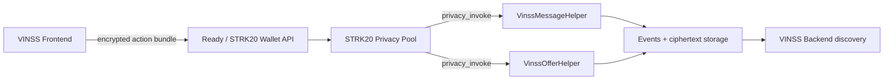

# Smart Contract Architecture

## Role

VINSS Message and Offer helpers are application-specific contracts invoked through the STRK20 Privacy Pool.



## Helper responsibility

The helpers verify and persist encrypted application envelopes.

They do not decrypt payloads and do not interpret private message or Offer semantics.

## Authorized caller

At deployment each helper stores one `privacy_pool` address.

`privacy_invoke` requires:

```text
get_caller_address() == configured privacy_pool
```

Direct arbitrary contract/wallet writes are rejected.

## Storage pattern

Both helpers use:

```text
one-time locator → public structural record
(locator, chunk_index) → ciphertext chunk
payload commitment → reuse marker
locator → existence marker
```

## Discovery

Events expose the one-time locator, commitment, and opaque routing tags.

The backend reads these public records and ciphertext chunks. Decryption remains a client operation.
