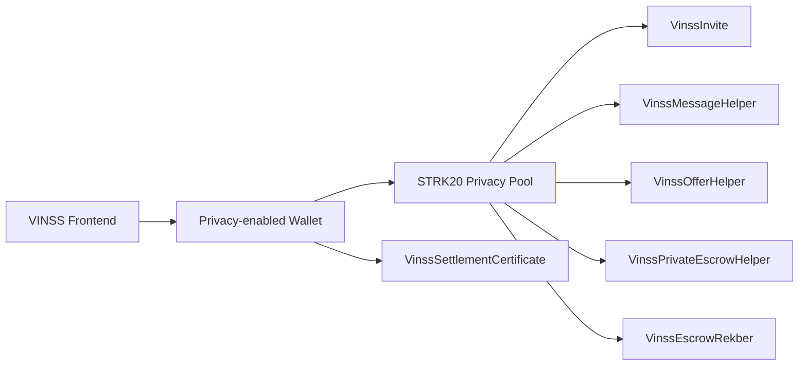

# Smart Contract Architecture

## Objective

VINSS contracts provide application-specific state transitions around the STRK20 Privacy Pool while keeping private deal semantics out of plaintext helper state wherever the current flow does not require public settlement data.

## Module map

```text
contracts/src/
├── invite/
│   └── VinssInvite
├── messaging/
│   └── VinssMessageHelper
├── offers/
│   └── VinssOfferHelper
├── private_escrow/
│   └── VinssPrivateEscrowHelper
├── escrow_rekber/
│   └── VinssEscrowRekber
└── settlement_certificate/
    └── VinssSettlementCertificate
```

All are exported by `contracts/src/lib.cairo`.

## Execution path



Each `privacy_invoke` implementation checks that:

```cairo
get_caller_address() == configured_privacy_pool
```

Arbitrary wallets/contracts cannot write through the intended private action entrypoint directly.

## Encrypted coordination architecture

Message, Offer, and Private Escrow coordination use the same public structural pattern:

```text
one-time action locator
opaque sender tag
opaque recipient tag
payload commitment
ciphertext chunk count
ciphertext chunks
```

The contracts validate and persist encrypted envelopes but do not interpret the encrypted application action.

### Storage pattern

```text
locator
  → structural record

(locator, chunk_index)
  → ciphertext chunk

commitment
  → reuse marker

locator
  → existence marker
```

The locator identifies one action only.

It is not a stable Deal Room, conversation, participant, or escrow identifier.

## Invite architecture

Invite uses a different pattern:

```text
secret
  ↓ Poseidon(domain, secret)
commitment
  ↓
on-chain InviteEntry
  ├── expires_at
  ├── consumed
  └── exists
```

The encrypted Invite payload itself remains a frontend/off-chain concern.

## Escrow Rekber architecture

Escrow Rekber is the custody layer:

```text
DEPOSIT
  → custody commitment
  → payer release authorization commitment
  → payee claim commitment
  → refund commitment
  → payer/payee certificate commitments
  → token + principal + refund boundary
  → reserve principal
  → return fee OpenNoteDeposit

RELEASE before refund boundary
  → verify payer authorization preimage
  → verify payee claim preimage
  → consume custody
  → return principal OpenNoteDeposit

REFUND at/after boundary
  → verify refund preimage
  → consume custody
  → return principal OpenNoteDeposit
```

This contract uses an OpenZeppelin reentrancy guard and tracks reserved principal by token.

## Separation of responsibilities

```text
Private Escrow Helper
  = encrypted coordination / discovery

Escrow Rekber
  = actual ERC-20 custody / settlement

Settlement Certificate
  = optional, non-transferable proof issued after a successful release
```

They are technical layers of one Escrow Rekber product flow, not separate product features.

## Replay / duplicate boundaries

Encrypted helpers reject:

- reused action locator;
- reused encrypted payload commitment.

Invite rejects:

- duplicate commitment creation;
- repeated consumption.

Escrow Rekber rejects:

- duplicate custody commitment;
- settlement after custody has already been consumed.

These application-level rules do not replace STRK20/Privacy Pool protocol replay protection.
