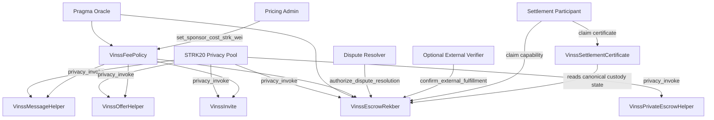
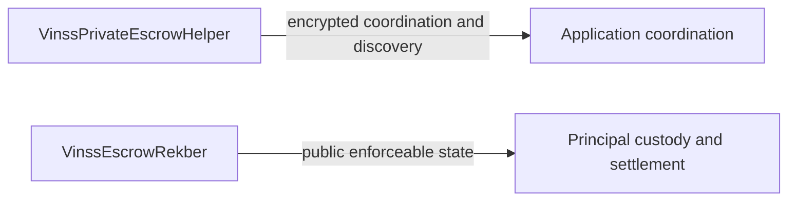
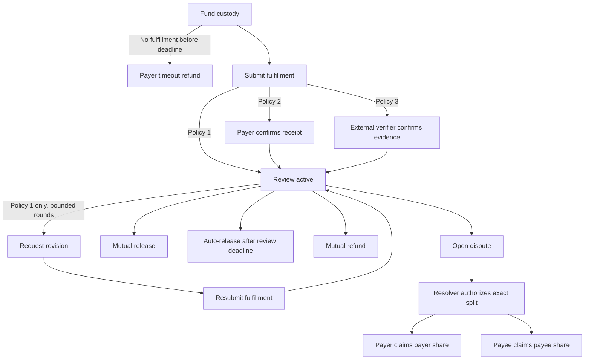
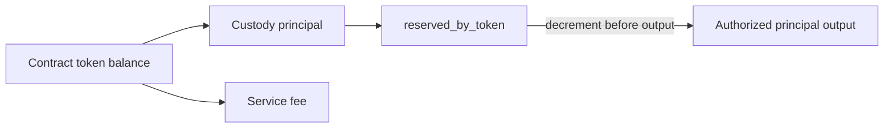

# Smart Contract Architecture

This document describes the contract-level architecture exported by `contracts/src/lib.cairo`, including trust boundaries, encrypted coordination, custody, accounting, and settlement credentials.

Executable Cairo source and tests are the source of truth.

## Module Map

```text
contracts/src/
├── fee_policy/
│   └── VinssFeePolicy
├── invite/
│   └── VinssInvite
├── messaging/
│   └── VinssMessageHelper
├── offers/
│   └── VinssOfferHelper
├── private_escrow/
│   └── VinssPrivateEscrowHelper
├── escrow_rekber/
│   └── VinssEscrowRekber
└── settlement_certificate/
    └── VinssSettlementCertificate
```

All contract families shown above are exported by `contracts/src/lib.cairo`.

## Trust and Authority Graph

| Component | Authority |
|---|---|
| STRK20 Privacy Pool | Sole caller accepted by the current `privacy_invoke` entrypoints |
| Pricing admin | May update only `sponsor_cost_strk_wei` in `VinssFeePolicy` |
| Pragma oracle | Supplies price data consumed by `VinssFeePolicy` and `VinssEscrowRekber` |
| Dispute resolver | May authorize an exact payer/payee split only after a Rekber dispute |
| External verifier | Optional; may confirm submitted evidence only for `POLICY_EXTERNAL_VERIFY` |
| Settlement participant | Uses precommitted capabilities to claim its own settlement output and, when eligible, its own certificate |



The Rekber constructor fixes the Privacy Pool, Pragma oracle, revenue FeePolicy, dispute resolver, optional external verifier, supported token addresses, oracle pair IDs, configured minimum fee, maximum oracle age, and minimum oracle source count.

There is no administrative setter for those Rekber trust/configuration fields after deployment.

## Encrypted Coordination Family

`VinssMessageHelper`, `VinssOfferHelper`, and `VinssPrivateEscrowHelper` use the same six-field public envelope header:

```text
[0] envelope_version
[1] one-time action locator
[2] opaque sender tag
[3] opaque recipient tag
[4] claimed payload commitment
[5] ciphertext chunk count
[6...] ciphertext chunks
```

The current envelope version for Message, Offer, and Private Escrow is `2`. This is an envelope-format version, not a contract-version suffix.

Message and Offer append fee/output fields outside the committed encrypted envelope. Private Escrow coordination does not append a fee/output tail.

Storage follows the same general structure:

```text
locator -> structural record
(locator, chunk_index) -> ciphertext felt
locator -> existence marker
payload commitment -> reuse marker
```

The locator is one-action-only metadata. It is not a room ID, wallet ID, participant ID, deal ID, or Rekber custody ID.

## Invite Architecture

Invite uses a one-time preimage commitment rather than the encrypted-envelope format used by Message, Offer, and Private Escrow.


Invite creation is fee-bearing. Invite consumption reveals the one-time secret in public calldata, recomputes the commitment, verifies expiry and unused state, and marks the Invite consumed.

## Rekber Architecture

Rekber deliberately separates encrypted coordination from public custody.



`VinssPrivateEscrowHelper` does not custody principal. `VinssEscrowRekber` holds STRK or USDC principal and enforces the settlement lifecycle.

### Verification Policies

The canonical public policy classes are:

| Policy | Constant | Behavior |
|---|---|---|
| `1` | `POLICY_SUBMISSION_REVIEW` | A fulfillment submission starts the review window immediately |
| `2` | `POLICY_COUNTERPARTY_CONFIRM` | The payer must confirm receipt before review starts |
| `3` | `POLICY_EXTERNAL_VERIFY` | The configured external verifier confirms the submitted evidence before review starts |

Only `POLICY_SUBMISSION_REVIEW` supports the bounded revision workflow.

### Custody Lifecycle



Resolver authorization records the exact payer/payee allocation but does not itself transfer principal.

Current participant payout paths expose principal through the Rekber `privacy_invoke` output mechanism, where each authorized party claims only its own share using a precommitted capability.

## Accounting Boundary

`VinssEscrowRekber` tracks principal reserves per supported token using `reserved_by_token`.

Principal accounting is separate from service-fee accounting.

At funding:

```text
updated_reserved =
existing_reserved + new_principal

required_balance =
updated_reserved + required_fee

contract_token_balance >= required_balance
```

Only principal is added to `reserved_by_token`. The service fee is separate and is approved for the Privacy Pool revenue output.

Before a principal output is exposed, Rekber verifies the reserve invariant, decrements the corresponding reserved principal, and approves the exact output amount.



`OpenZeppelin ReentrancyGuardComponent` protects the external state-changing Rekber paths that enter custody accounting or settlement mutation before ERC-20 output approval is exposed.

## Settlement Certificate Architecture

`VinssSettlementCertificate` reads canonical Rekber custody state directly.

A claim is allowed only when:

```text
custody.consumed == true
custody.refunded == false
custody.disputed == false
claim for (custody_commitment, role) not already used
claim commitment matches custody + role + caller + secret
```

The claim commitment binds the certificate to the caller and role that were precommitted for that Rekber custody.

After mint, the ERC-721 `before_update` hook permits no later ownership update. Transfers and burns therefore revert with `CERT_NON_TRANSFERABLE`.

The credential retains standard ERC-721 ownership and metadata interfaces while remaining non-transferable.

## Replay and Uniqueness Boundaries

Encrypted helpers reject:

- reused one-time locators;
- reused encrypted payload commitments.

Invite rejects:

- duplicate commitment creation;
- repeated consumption;
- expired consumption.

Rekber rejects or bounds:

- duplicate custody commitments;
- invalid or reused capability-chain steps;
- repeated terminal settlement;
- repeated resolution claims;
- settlement transitions that violate current custody state.

Settlement Certificate rejects a second claim for the same `(custody_commitment, role)` pair.

These contract-level uniqueness rules do not replace STRK20 Privacy Pool protocol replay protection.
