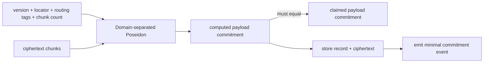
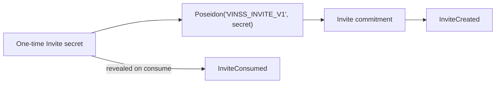
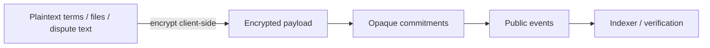

# Envelopes, Commitments & Events

This document defines the public encrypted-envelope format, domain-separated commitments, capability commitments, and event surfaces used by the current VINSS contracts.

Executable Cairo source is the source of truth.

## Encrypted Envelope Family

`VinssMessageHelper`, `VinssOfferHelper`, and `VinssPrivateEscrowHelper` use the same six-field encrypted-envelope header:

| Index | Field | Meaning |
|---:|---|---|
| `0` | `envelope_version` | Public envelope-format version |
| `1` | one-time locator | Unique locator for exactly one encrypted action |
| `2` | `sender_tag` | Opaque sender-routing tag |
| `3` | `recipient_tag` | Opaque recipient-routing tag |
| `4` | claimed payload commitment | Caller-supplied commitment checked against the contract-computed commitment |
| `5` | payload chunk count | Number of ciphertext felts |
| `6...` | ciphertext chunks | Encrypted payload |

The current envelope version for Message, Offer, and Private Escrow is:

```text
2
```

This is an **envelope-format version**, not a contract-version suffix.

The sender and recipient tags are opaque routing values. They are not plaintext wallet addresses and must not be interpreted as participant identities.

### Payload Limits

```text
Message        <= 64 chunks
Offer          <= 64 chunks
Private Escrow <= 64 chunks
```

These are implementation bounds rather than permanent protocol limits.

### Commitment Rule

The claimed commitment at header index `4` is **not itself included in the hash input**. The contract computes the commitment from the remaining envelope fields and ciphertext, then checks:

```text
computed_payload_commitment == claimed_payload_commitment
```

This avoids a recursive commitment definition.



### Helper-Specific Tails

The encrypted envelope ends after its ciphertext chunks.

`VinssMessageHelper` and `VinssOfferHelper` append transaction/output fields **outside** that committed encrypted envelope:

```text
[encrypted envelope..., quoted_fee, open_note_id]
```

Those two fields are not part of the encrypted payload commitment.

`VinssPrivateEscrowHelper` stores encrypted coordination only and does not append that fee/output tail.

---

## Message Commitment

Domain:

```text
VINSS_MSG_COMMIT_V2
```

Commitment:

```text
Poseidon(
  'VINSS_MSG_COMMIT_V2',
  envelope_version,
  message_locator,
  sender_tag,
  recipient_tag,
  payload_chunk_count,
  ...ciphertext_chunks
)
```

### `MessageCommitted`

Key:

```text
message_locator
```

Data:

```text
payload_commitment
sender_tag
recipient_tag
```

The event does not duplicate ciphertext. Clients retrieve ciphertext from contract storage using the one-time locator.

---

## Offer Commitment

Domain:

```text
VINSS_OFFER_COMMIT_V2
```

Commitment:

```text
Poseidon(
  'VINSS_OFFER_COMMIT_V2',
  envelope_version,
  offer_action_locator,
  sender_tag,
  recipient_tag,
  payload_chunk_count,
  ...ciphertext_chunks
)
```

### `OfferActionCommitted`

Key:

```text
offer_action_locator
```

Data:

```text
payload_commitment
sender_tag
recipient_tag
```

Offer action type, lifecycle relationship, business terms, expiry, and other private semantics remain inside the encrypted payload rather than becoming event fields.

---

## Private Escrow Coordination Commitment

Domain:

```text
VINSS_PRIVATE_ESCROW_COMMIT_V2
```

Commitment:

```text
Poseidon(
  'VINSS_PRIVATE_ESCROW_COMMIT_V2',
  envelope_version,
  private_escrow_action_locator,
  sender_tag,
  recipient_tag,
  payload_chunk_count,
  ...ciphertext_chunks
)
```

### `PrivateEscrowActionCommitted`

Key:

```text
private_escrow_action_locator
```

Data:

```text
payload_commitment
sender_tag
recipient_tag
```

The event does not reveal whether the encrypted action represents setup, acceptance, rejection, cancellation, funding coordination, or another private Rekber coordination step.

---

## Invite Commitment

Invite does not use the encrypted-envelope format.

Domain:

```text
VINSS_INVITE_V1
```

Commitment:

```text
Poseidon(
  'VINSS_INVITE_V1',
  secret
)
```



### `InviteCreated`

Key:

```text
commitment
```

Data:

```text
expires_at
```

### `InviteConsumed`

Key:

```text
commitment
```

No additional event data is emitted.

Invite creation stores the commitment directly. Invite consumption reveals the secret in calldata, recomputes the commitment, validates it, and marks the Invite consumed.

---

## Rekber Capability Commitments

Rekber capabilities are domain-separated and bound to one `custody_commitment`.

They are **not** versioned with the encrypted-envelope `V2` suffix.

### Release Authorization

```text
Poseidon(
  'VINSS_RELEASE_AUTH',
  custody_commitment,
  payer_release_secret
)
```

### Payee Claim

```text
Poseidon(
  'VINSS_PAYEE_CLAIM',
  custody_commitment,
  payee_claim_secret
)
```

### Payer Refund

```text
Poseidon(
  'VINSS_ESCROW_REFUND',
  custody_commitment,
  payer_refund_secret
)
```

### Payer Fulfillment Confirmation

```text
Poseidon(
  'VINSS_PAYER_CONFIRM',
  custody_commitment,
  payer_confirmation_secret
)
```

### Payer Dispute

```text
Poseidon(
  'VINSS_PAYER_DISPUTE',
  custody_commitment,
  payer_dispute_secret
)
```

### Payee Dispute

```text
Poseidon(
  'VINSS_PAYEE_DISPUTE',
  custody_commitment,
  payee_dispute_secret
)
```

### Payee Refund Consent

```text
Poseidon(
  'VINSS_REFUND_CONSENT',
  custody_commitment,
  payee_refund_consent_secret
)
```

The executable domains are exactly:

```text
VINSS_RELEASE_AUTH
VINSS_PAYEE_CLAIM
VINSS_ESCROW_REFUND
VINSS_PAYER_CONFIRM
VINSS_PAYER_DISPUTE
VINSS_PAYEE_DISPUTE
VINSS_REFUND_CONSENT
```

Do not append `_V2` to these domains unless the executable Cairo commitment scheme itself is intentionally versioned in a future migration.

---

## Rekber One-Way Chains

Fulfillment and revision use one-way secret chains so repeated actions can be bounded without publishing future preimages.

### Fulfillment Step

```text
Poseidon(
  'VINSS_FULFILL_CHAIN',
  custody_commitment,
  secret
)
```

### Revision Step

```text
Poseidon(
  'VINSS_REVISION_CHAIN',
  custody_commitment,
  secret
)
```

Revealing the currently valid chain secret advances the stored chain state without exposing a future secret.

---

## Certificate Commitments

### Claim Capability

```text
Poseidon(
  'VINSS_CERT_CLAIM',
  custody_commitment,
  role,
  recipient_address,
  certificate_secret
)
```

The recipient address is part of the commitment, so a valid certificate capability cannot be redirected to another caller.

### Token ID

```text
Poseidon(
  'VINSS_CERT_TOKEN',
  custody_commitment,
  role
)
```

The token ID is deterministic for the `(custody_commitment, role)` pair.

---

## Rekber Lifecycle Events

Rekber events intentionally expose custody, timing, policy, evidence commitments, and accounting values required for public settlement verification and indexing.

They do not expose plaintext Offer terms, fulfillment file contents, participant identities, or dispute plaintext.

### `EscrowRekberCustodyFunded`

Keys:

```text
custody_commitment
token
```

Data:

```text
amount
fulfillment_deadline
timestamp
fee_amount
review_window
verification_policy
```

The first three data positions are intentionally kept stable by the current source for simple indexers:

```text
amount
fulfillment_deadline
timestamp
```

### `EscrowRekberFulfillmentSubmitted`

Keys:

```text
custody_commitment
evidence_commitment
```

Data:

```text
timestamp
rounds_remaining
```

### `EscrowRekberFulfillmentConfirmed`

Keys:

```text
custody_commitment
evidence_commitment
```

Data:

```text
review_deadline
timestamp
```

### `EscrowRekberRevisionRequested`

Keys:

```text
custody_commitment
reason_commitment
```

Data:

```text
revision_deadline
timestamp
rounds_remaining
```

### `EscrowRekberDisputeOpened`

Keys:

```text
custody_commitment
evidence_commitment
```

Data:

```text
opened_by_role
timestamp
```

Role values are interpreted by the Rekber lifecycle as the payer/payee role selected by the corresponding precommitted dispute capability.

### `EscrowRekberDisputeResolutionAuthorized`

Keys:

```text
custody_commitment
resolution_commitment
```

Data:

```text
payer_amount
payee_amount
timestamp
```

This records resolver authorization. It does not itself transfer principal.

### `EscrowRekberResolutionClaimed`

Keys:

```text
custody_commitment
output_note_id
```

Data:

```text
role
amount
timestamp
```

A payer and payee resolution share can therefore be indexed independently.

### `EscrowRekberCustodyReleased`

Keys:

```text
custody_commitment
output_note_id
```

Data:

```text
timestamp
release_mode
```

Current release modes:

```text
1 = mutual release
2 = review-timeout auto-release
```

### `EscrowRekberCustodyRefunded`

Keys:

```text
custody_commitment
output_note_id
```

Data:

```text
timestamp
refund_mode
```

Current refund modes:

```text
1 = no-fulfillment timeout refund
2 = mutual refund
```

### `EscrowRekberCustodyResolved`

Keys:

```text
custody_commitment
resolution_commitment
```

Data:

```text
payer_amount
payee_amount
timestamp
```

`EscrowRekberDisputeResolutionAuthorized`, `EscrowRekberResolutionClaimed`, and `EscrowRekberCustodyResolved` represent distinct stages of the disputed-settlement path and should not be collapsed into a single indexer state transition.

---

## Settlement Certificate Event

### `SettlementCertificateIssued`

Keys:

```text
token_id
recipient
```

Data:

```text
custody_commitment
role
settled_at
issued_at
```

The event describes issuance of the clean-settlement credential. Certificate eligibility itself is enforced by `VinssSettlementCertificate` against canonical Rekber custody state before this event can be emitted.

---

## Public Metadata Boundary

The public event surface intentionally reveals enough information for discovery, accounting, lifecycle verification, and indexing without publishing private business content.



Publicly observable data may include:

```text
one-time encrypted-action locators
opaque routing tags
payload/evidence/reason/resolution commitments
custody commitment
token and principal amount
fee amount
deadlines and timestamps
verification policy
settlement modes
resolution split amounts
certificate recipient and role
transaction/block metadata
```

It does **not** mean the entire Rekber lifecycle is private. Public custody state and settlement accounting are intentionally observable, while plaintext business terms and evidence content remain outside the public event payloads.

Contract-level uniqueness and commitment checks complement, but do not replace, STRK20 Privacy Pool replay protection.
