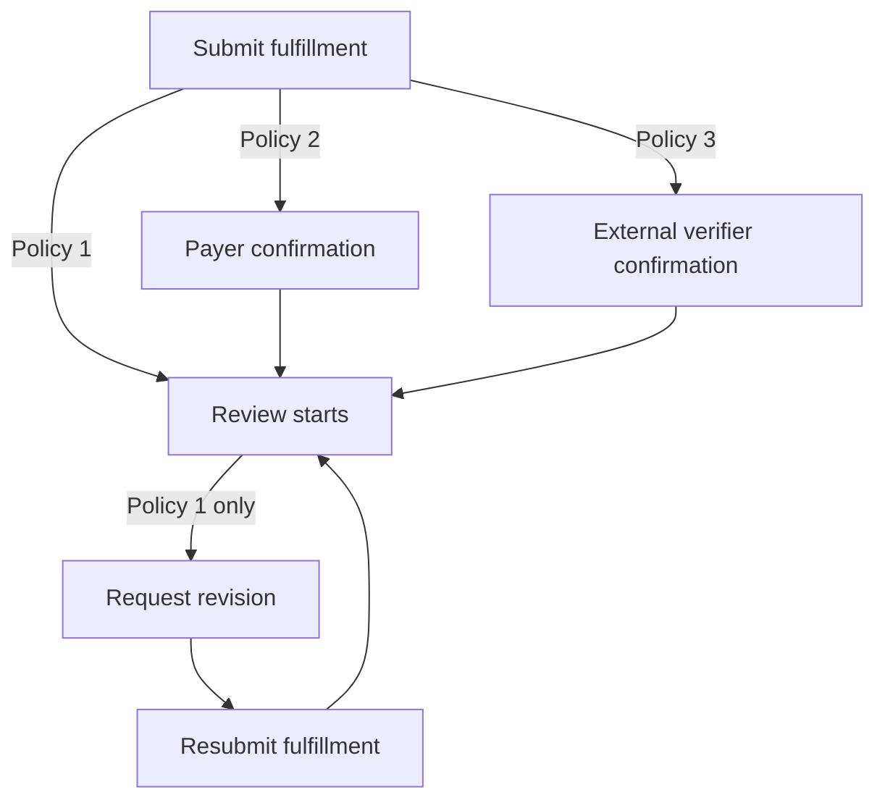
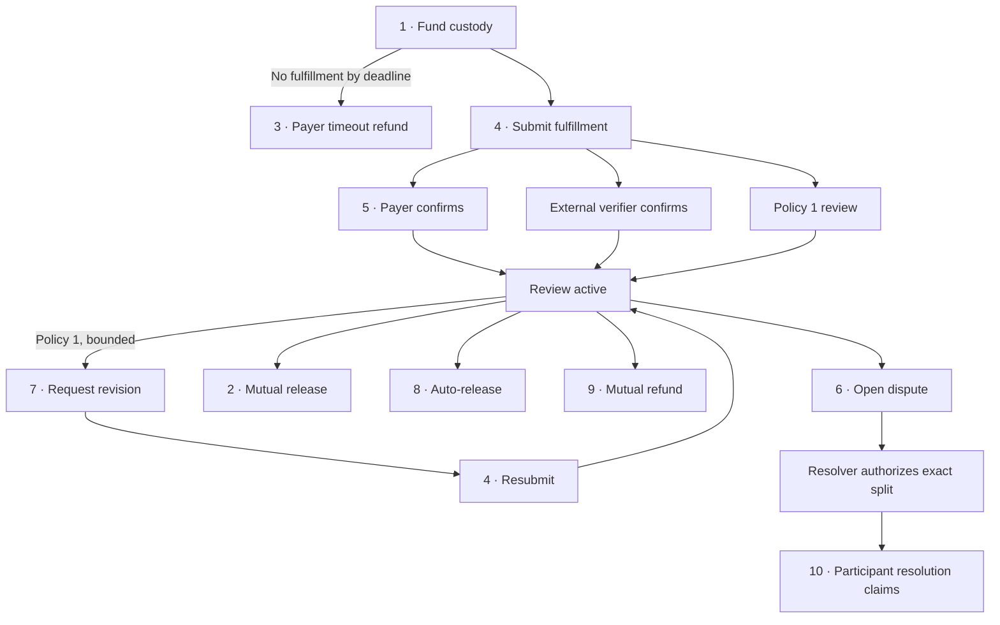
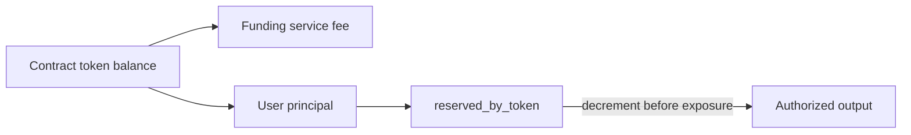

# VinssEscrowRekber

`VinssEscrowRekber` is the canonical public custody and settlement state machine behind VINSS Rekber.

It holds supported ERC-20 principal, computes and charges the funding service fee, enforces fulfillment/review/revision/refund/dispute rules, maintains per-token principal reserves, and exposes authorized settlement outputs through the configured STRK20 Privacy Pool.

Executable Cairo source and contract tests are the source of truth.

## Source

```text
contracts/src/escrow_rekber/
├── commitments.cairo
├── errors.cairo
├── events.cairo
├── interfaces.cairo
├── types.cairo
└── vinss_escrow_rekber.cairo
```

## Responsibility Boundary

`VinssEscrowRekber` is **not** the encrypted negotiation layer.

```mermaid
flowchart LR
    OFFER[Encrypted accepted Offer]
    PRIVATE[VinssPrivateEscrowHelper]
    REKBER[VinssEscrowRekber]
    POOL[STRK20 Privacy Pool]
    CERT[VinssSettlementCertificate]

    OFFER -->|private business context| PRIVATE
    PRIVATE -->|coordination only| APP[Application]
    APP -->|precommitted capabilities + public settlement parameters| POOL
    POOL -->|privacy_invoke| REKBER
    REKBER -->|canonical settlement state| CERT
```



The encrypted accepted Offer determines the real business relationship off-chain/private-side. The public Rekber contract receives only the public settlement parameters and precommitted capabilities required to enforce custody.

The public contract does not store plaintext Offer terms, fulfillment files, participant wallet identities as business roles, or dispute text.

It does store public custody/accounting state such as token, principal, fee, deadlines, verification policy, opaque evidence commitments, dispute state, resolution amounts, and settlement timestamps.

## Constructor

Exact constructor order:

```text
privacy_pool: ContractAddress
pragma_oracle: ContractAddress
revenue_fee_policy: ContractAddress
dispute_resolver: ContractAddress
external_verifier: ContractAddress
strk_token: ContractAddress
usdc_token: ContractAddress
strk_usd_pair: felt252
usdc_usd_pair: felt252
minimum_fee_usd_micros: u128
max_oracle_age: u64
min_oracle_sources: u32
```

Required non-zero configuration:

```text
privacy_pool
pragma_oracle
revenue_fee_policy
dispute_resolver
strk_token
usdc_token
strk_usd_pair
usdc_usd_pair
minimum_fee_usd_micros
max_oracle_age
min_oracle_sources
```

`external_verifier` may be zero when external-verification policy is not used.

Additional constructor invariant:

```text
strk_token != usdc_token
```

The configuration is intentionally immutable after deployment. There are no administrative setters that can later replace the Privacy Pool, oracle, FeePolicy, dispute resolver, verifier, supported assets, oracle pair IDs, or Rekber fee/oracle safety parameters.

## Supported Assets

The current contract supports only the two constructor-configured token addresses:

```text
STRK -> 18 token decimals
USDC -> 6 token decimals
```

Any other token passed to `quote_rekber_fee` or custody funding is rejected.

The token decimal values above are part of the current conversion implementation. They are not dynamically read from ERC-20 metadata.

## Verification Policies

| Value | Constant | Review starts |
|---:|---|---|
| `1` | `POLICY_SUBMISSION_REVIEW` | Immediately when fulfillment is submitted |
| `2` | `POLICY_COUNTERPARTY_CONFIRM` | When the payer confirms the exact submitted evidence commitment |
| `3` | `POLICY_EXTERNAL_VERIFY` | When the configured external verifier confirms the exact submitted evidence commitment |

Policy `3` requires a non-zero `external_verifier` for a custody using that policy.

Only policy `1` supports the bounded revision workflow.



## Funding Fee

The contract computes the percentage component as:

```text
percentage_fee = principal / 50
               = 2% of principal
```

It then obtains the dynamic Rekber floor from the shared FeePolicy:

```text
dynamic_floor_usd_micros =
    FeePolicy.quote_fee_usd_micros(FEE_ACTION_REKBER)
```

The contract-local configured floor is also enforced:

```text
effective_floor_usd_micros =
    max(
      dynamic_floor_usd_micros,
      minimum_fee_usd_micros
    )
```

That USD floor is converted into the selected custody token using Pragma.

Conceptually:

```text
minimum_fee_in_token =
    ceil(
      effective_floor_usd /
      current token USD price
    )
```

Final required funding fee:

```text
required_fee =
    max(
      percentage_fee,
      minimum_fee_in_token
    )
```

### Oracle Validation

Current quote validation requires:

```text
price != 0
oracle decimals <= 18
last_updated_timestamp != 0
last_updated_timestamp <= current block timestamp
price age <= max_oracle_age
number of sources >= min_oracle_sources
expiration absent, zero-sentinel, or not yet expired
```

The selected Pragma pair depends on the supported token being quoted.

### Exact Quote Rule

Funding does not accept an arbitrary fee above or below the live Rekber quote.

The caller-provided value must satisfy:

```text
quoted_fee == required_fee
```

If oracle/FeePolicy inputs change between quote preparation and execution, the funding action reverts atomically with the fee-quote mismatch instead of silently charging a different amount.

The service fee is paid once during funding and is separate from principal. A later principal refund does not refund the service fee.

## Action Selectors

Participant actions use the following selectors:

```text
1  DEPOSIT_ACTION
2  RELEASE_ACTION
3  REFUND_ACTION
4  SUBMIT_FULFILLMENT_ACTION
5  CONFIRM_FULFILLMENT_ACTION
6  OPEN_DISPUTE_ACTION
7  REQUEST_REVISION_ACTION
8  AUTO_RELEASE_ACTION
9  MUTUAL_REFUND_ACTION
10 CLAIM_RESOLUTION_ACTION
```

All ten participant actions enter through:

```text
privacy_invoke(calldata)
```

`privacy_invoke` accepts only the immutable configured Privacy Pool as caller.

Two state-changing authorization hooks exist outside `privacy_invoke`:

```text
confirm_external_fulfillment(...)
authorize_dispute_resolution(...)
```

Those hooks have their own immutable caller restrictions and cannot choose arbitrary payout recipients.

## Lifecycle Overview



## Action `1` — Fund Custody

Exact calldata:

```text
[1,
 custody_commitment,
 release_authorization_commitment,
 payee_claim_commitment,
 refund_commitment,
 payer_confirmation_commitment,
 payer_dispute_commitment,
 payee_dispute_commitment,
 payee_refund_consent_commitment,
 fulfillment_chain_head,
 revision_chain_head,
 payer_certificate_commitment,
 payee_certificate_commitment,
 fulfillment_deadline,
 review_window,
 verification_policy,
 fulfillment_rounds,
 revision_rounds,
 token,
 principal,
 quoted_fee,
 revenue_open_note_id]
```

The contract requires exactly `22` felts for this action.

Key constraints:

```text
custody_commitment is non-zero and unique

required capability commitments are non-zero and valid for configuration

principal > 0

fulfillment_deadline > now
fulfillment_deadline - now <= 180 days

review_window >= 60 seconds
review_window <= 30 days

verification_policy is 1, 2, or 3

fulfillment_rounds >= 1
fulfillment_rounds <= 8

revision_rounds <= 7
revision_rounds < fulfillment_rounds

revision_chain_head != 0 when revision_rounds > 0

token is configured STRK or USDC

quoted_fee == live required fee

revenue_open_note_id != 0
```

For policy `3`, the configured external verifier must be non-zero.

### Funding Balance Invariant

Before custody is accepted:

```text
updated_reserved =
    existing_reserved_principal + new_principal

required_balance =
    updated_reserved + required_fee

contract_token_balance >= required_balance
```

Only principal is added to `reserved_by_token`.

The funding service fee remains outside the reserved principal balance and is exposed as the returned revenue `OpenNoteDeposit`.

Funding emits:

```text
EscrowRekberCustodyFunded
```

and returns one fee output:

```text
OpenNoteDeposit {
  note_id: revenue_open_note_id,
  token: custody_token,
  amount: required_fee
}
```

## Action `4` — Submit Fulfillment

Calldata:

```text
[4,
 custody_commitment,
 fulfillment_chain_secret,
 evidence_commitment]
```

The contract requires an open custody and a valid current fulfillment-chain secret.

A normal first submission must occur before the fulfillment deadline.

If a revision is pending, resubmission must instead occur no later than the current `revision_deadline`.

On success:

```text
fulfillment_evidence_commitment = evidence_commitment
fulfillment_submitted = true
fulfillment_rounds_remaining -= 1
revision_pending = false
revision_deadline = 0
fulfilled_at = now
```

The fulfillment chain head advances to the revealed valid secret.

For `POLICY_SUBMISSION_REVIEW`, fulfillment is confirmed and review starts immediately.

Policies `2` and `3` wait for their required confirmation path.

## Action `5` — Payer Confirms Fulfillment

Calldata:

```text
[5,
 custody_commitment,
 payer_confirmation_secret,
 evidence_commitment]
```

Valid only for:

```text
POLICY_COUNTERPARTY_CONFIRM
```

Requirements include:

```text
custody open
no dispute
fulfillment already submitted
not already confirmed
evidence_commitment == current fulfillment evidence commitment
valid payer confirmation capability
```

On success:

```text
fulfillment_confirmed = true
review_deadline = now + review_window
```

and the contract emits:

```text
EscrowRekberFulfillmentConfirmed
```

## External Verification

Public entrypoint:

```text
confirm_external_fulfillment(
  custody_commitment,
  evidence_commitment
)
```

Only the immutable `external_verifier` may call it.

Valid only for:

```text
POLICY_EXTERNAL_VERIFY
```

Requirements include:

```text
custody exists and is open
no dispute
fulfillment submitted
fulfillment not already confirmed
evidence commitment exactly matches current submitted evidence
```

On success it marks fulfillment confirmed and starts the review deadline.

This entrypoint changes fulfillment/review state only. It does not approve or transfer principal.

## Action `7` — Request Revision

Calldata:

```text
[7,
 custody_commitment,
 revision_chain_secret,
 reason_commitment]
```

Revision is valid only for:

```text
POLICY_SUBMISSION_REVIEW
```

Requirements include:

```text
custody open
no dispute
fulfillment submitted and confirmed
no revision already pending
revision_rounds_remaining > 0
fulfillment_rounds_remaining > 0
review deadline exists
now < review_deadline
valid next revision-chain secret
```

On success:

```text
revision_chain_head = revealed valid secret
revision_rounds_remaining -= 1

revision_pending = true
fulfillment_confirmed = false
review_deadline = 0
revision_deadline = now + review_window
```

Only the opaque `reason_commitment` becomes public event data. Plaintext revision reasoning remains outside the public custody state.

The payee must resubmit fulfillment by:

```text
now <= revision_deadline
```

when the resubmission executes.

## Action `6` — Open Dispute

Calldata:

```text
[6,
 custody_commitment,
 role,
 dispute_secret,
 evidence_commitment]
```

Roles:

```text
1 = payer
2 = payee
```

Each role must use its own precommitted dispute capability.

Requirements include:

```text
custody open
fulfillment has been submitted
no dispute already open
role is payer or payee
matching role-specific dispute secret
```

If fulfillment has already been confirmed and a review deadline exists:

```text
now < review_deadline
```

must hold.

This means policies waiting for confirmation may still enter dispute after a fulfillment submission without pretending an unconfirmed delivery is accepted.

The contract stores only:

```text
dispute_evidence_commitment
```

not plaintext dispute evidence.

## Resolver Authorization

Public entrypoint:

```text
authorize_dispute_resolution(
  custody_commitment,
  resolution_commitment,
  payer_amount,
  payee_amount
)
```

Only the immutable `dispute_resolver` may call it.

Requirements include:

```text
custody exists and is open
dispute is open
no previous resolution authorization
resolution_commitment != 0
payer_amount + payee_amount == custody principal
```

The resolver does not provide recipient addresses and does not receive custody principal.

On authorization:

```text
resolution_authorized = true
resolution_payer_amount = payer_amount
resolution_payee_amount = payee_amount
```

A zero allocation requires no claim transaction and is marked already satisfied for completion accounting.

Non-zero allocations remain reserved until the matching participant claims them.

Authorization emits:

```text
EscrowRekberDisputeResolutionAuthorized
```

It does **not** itself move principal.

## Action `10` — Claim Dispute Resolution

Calldata:

```text
[10,
 custody_commitment,
 role,
 party_secret,
 output_note_id]
```

Roles:

```text
1 = payer
2 = payee
```

Capability mapping:

```text
payer -> original payer refund capability
payee -> original payee claim capability
```

A participant can claim only the exact amount authorized for its role.

Each non-zero allocation may be claimed only once.

When both payer and payee allocations are satisfied—either because the amount was zero or because the claim executed—the custody becomes consumed and:

```text
EscrowRekberCustodyResolved
```

is emitted.

Each actual non-zero claim also emits:

```text
EscrowRekberResolutionClaimed
```

## Action `2` — Mutual Clean Release

Calldata:

```text
[2,
 custody_commitment,
 payer_release_secret,
 payee_claim_secret,
 output_note_id]
```

Requirements include:

```text
custody open
fulfillment submitted
fulfillment confirmed
no pending revision
valid payer release capability
valid payee claim capability
no resolver authorization
no resolution share already claimed
```

The full principal is exposed to the payee output note.

A prior disagreement/dispute does not by itself prevent this full mutual release because both sides explicitly provide their precommitted release/claim capabilities.

However, once resolver authorization exists, only the resolution-claim path may consume the remaining principal.

Release mode:

```text
1 = mutual release
```

## Action `8` — Auto-Release

Calldata:

```text
[8,
 custody_commitment,
 payee_claim_secret,
 output_note_id]
```

This protects the payee against payer silence after confirmed fulfillment.

Requirements include:

```text
custody open
no dispute
fulfillment submitted and confirmed
no pending revision
review deadline exists
now >= review_deadline
valid payee claim capability
```

The full principal is exposed to the payee output note.

Release mode:

```text
2 = review-timeout auto-release
```

## Action `3` — No-Fulfillment Timeout Refund

Calldata:

```text
[3,
 custody_commitment,
 payer_refund_secret,
 output_note_id]
```

Requirements include:

```text
custody open
no fulfillment submitted
no dispute
now >= fulfillment_deadline
valid payer refund capability
```

The full principal is exposed to the payer output note.

Refund mode:

```text
1 = no-fulfillment timeout refund
```

## Action `9` — Mutual Refund

Calldata:

```text
[9,
 custody_commitment,
 payer_refund_secret,
 payee_refund_consent_secret,
 output_note_id]
```

This is the consent-based full refund path.

Both parties may mutually cancel before resolver authorization or any resolution payout has started. It is especially important after fulfillment, because unilateral timeout refund is no longer allowed once fulfillment exists.

Requirements include valid:

```text
payer refund capability
payee refund-consent capability
```

The full principal is exposed to the payer output note.

Resolver authorization is final for the dispute path: after it exists, funds may leave only through `CLAIM_RESOLUTION_ACTION`.

Refund mode:

```text
2 = mutual refund
```

## Custody State

The public `EscrowRekberCustody` record includes:

```text
custody_commitment

release_authorization_commitment
payee_claim_commitment
refund_commitment
payer_confirmation_commitment
payer_dispute_commitment
payee_dispute_commitment
payee_refund_consent_commitment

fulfillment_chain_head
revision_chain_head

payer_certificate_commitment
payee_certificate_commitment

token
amount
fee_amount

fulfillment_deadline
review_window
review_deadline
revision_deadline

verification_policy
fulfillment_rounds_remaining
revision_rounds_remaining

fulfillment_evidence_commitment
dispute_evidence_commitment

resolution_commitment
resolution_payer_amount
resolution_payee_amount

fulfillment_submitted
fulfillment_confirmed
revision_pending
disputed
resolution_authorized
resolution_payer_claimed
resolution_payee_claimed

consumed
refunded

created_at
fulfilled_at
settled_at
```

The contract does not derive public payer/payee wallet addresses from this state. Role ownership is enforced through precommitted secrets/capabilities and the Privacy Pool execution path.

## Principal Reserve Accounting

`reserved_by_token` tracks principal still owed to users for each supported token.

It does not represent service-fee revenue.

Conceptually:



Before exposing a principal settlement allowance, the contract checks the reserve/accounting invariants and reduces the corresponding reserved amount.

## ERC-20 Allowance Discipline

Settlement outputs use exact allowance discipline for the configured Privacy Pool.

Before exposing an output, the contract checks:

```text
reserved_by_token >= output amount
contract token balance >= currently reserved principal
```

It then:

```text
decrements reserved_by_token by output amount
requires existing Privacy Pool allowance == 0
approves exactly the output amount
checks resulting allowance == output amount
```

This prevents stale allowance from silently carrying into a later settlement operation.

The output allowance is therefore bounded to the exact principal amount authorized by the current transition.

## Reentrancy Guard

The contract embeds OpenZeppelin `ReentrancyGuardComponent`.

`privacy_invoke` enters the guard before dispatching any of the ten participant state-changing actions.

The direct state-changing hooks also use the guard:

```text
confirm_external_fulfillment
authorize_dispute_resolution
```

Read-only quote/getter functions do not require the guard.

## Public Read API

The canonical interface exposes:

```text
quote_rekber_fee(token, principal)

compute_release_authorization_commitment(custody_commitment, secret)
compute_payee_claim_commitment(custody_commitment, secret)
compute_refund_commitment(custody_commitment, secret)

get_privacy_pool()
get_pragma_oracle()
get_revenue_fee_policy()
get_dispute_resolver()
get_external_verifier()

get_fee_policy()
get_supported_tokens()

custody_exists(custody_commitment)
get_custody(custody_commitment)
get_reserved_amount(token)
```

`get_fee_policy()` returns the Rekber-local configured tuple:

```text
(
  minimum_fee_usd_micros,
  max_oracle_age,
  min_oracle_sources
)
```

It does not return the entire shared `VinssFeePolicy` state.

## Events

The canonical lifecycle emits:

```text
EscrowRekberCustodyFunded
EscrowRekberFulfillmentSubmitted
EscrowRekberFulfillmentConfirmed
EscrowRekberRevisionRequested
EscrowRekberDisputeOpened
EscrowRekberDisputeResolutionAuthorized
EscrowRekberResolutionClaimed
EscrowRekberCustodyReleased
EscrowRekberCustodyRefunded
EscrowRekberCustodyResolved
```

See [Envelopes, Commitments & Events](./envelopes-events.md) for exact event key/data fields and commitment domains.

## Settlement Safety Invariants

The current contract is designed around these core invariants:

```text
service fee is separate from principal

no fulfillment:
    payer eventually has timeout refund

after fulfillment:
    unilateral timeout refund is blocked

after confirmed fulfillment:
    payer silence cannot lock payee forever

revision:
    bounded and available only to submission-review policy

dispute:
    resolver can authorize only an exact payer/payee split

resolver:
    cannot redirect principal to itself or arbitrary recipient

resolution:
    each participant claims only its authorized share

reserve:
    principal accounting remains token-specific

allowance:
    settlement exposure is exact and stale allowance is rejected
```

## Application Workflow Fee Boundary

Some frontend Rekber workflow actions may be bundled with a separate VINSS STRK application charge.

That application-level workflow price is not enforced by `VinssEscrowRekber`.

The contract-level economic rule documented here is the **funding service fee** computed by:

```text
quote_rekber_fee(token, principal)
```

Do not treat a frontend product price as an immutable Cairo custody rule.

## Evidence Boundary

This contract can prove/enforce its own public custody state transitions and accounting rules.

It does not by itself prove:

```text
plaintext Offer correctness
frontend role mapping correctness
frontend calldata construction
Ready X session/proof success
paymaster behavior
backend/indexer synchronization
private evidence authenticity beyond submitted commitments
full wallet-to-wallet product E2E
```

Those belong to their respective integration and product validation layers.
