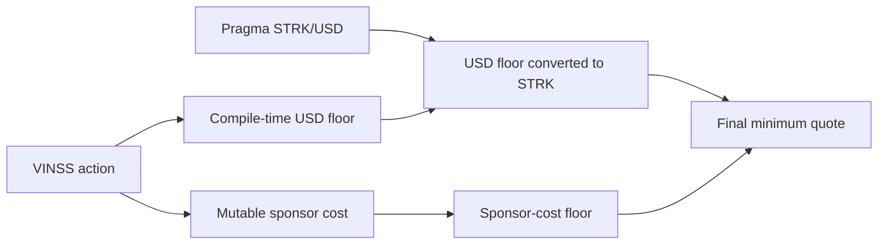
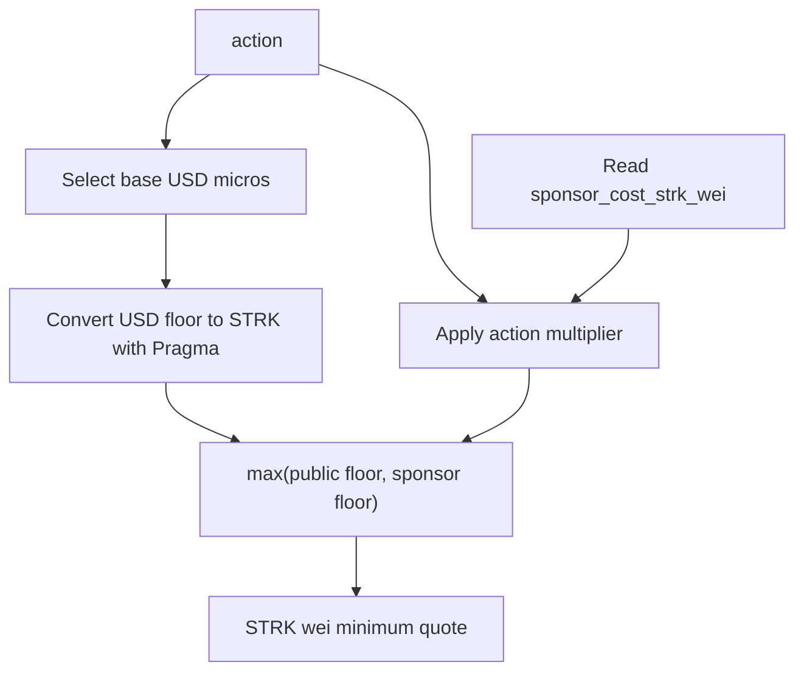
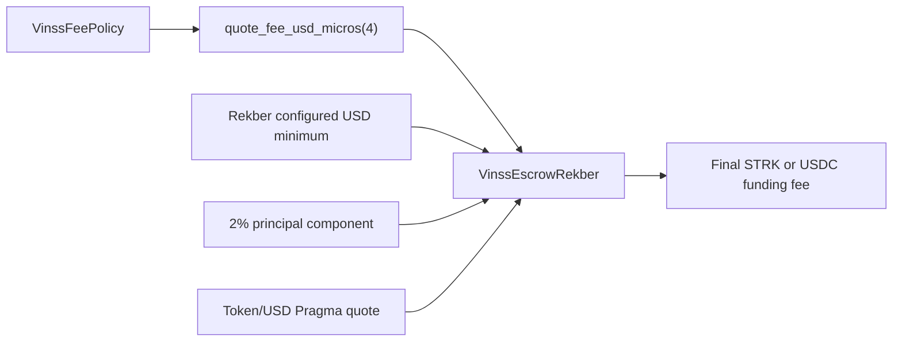

# VinssFeePolicy

`VinssFeePolicy` is the shared on-chain pricing floor used by VINSS Room activation, Message, Offer, and the Rekber lifecycle reserve.

It combines:

```text
fixed public USD floors
+
live STRK/USD conversion from Pragma
+
a mutable sponsor/paymaster-cost floor
```

The contract is intentionally narrow: public USD price floors and action multipliers are compile-time constants, while only the observed sponsor cost can be updated after deployment.

Executable Cairo source is the source of truth.

## Source

```text
contracts/src/fee_policy/
├── interfaces.cairo
├── types.cairo
└── vinss_fee_policy.cairo
```

## Purpose

The FeePolicy protects two separate economic requirements:

1. a minimum public VINSS product price expressed in USD micros;
2. a minimum margin over the current sponsored-transaction cost expressed in STRK wei.

For each supported action, the contract returns whichever floor is higher.



## Constructor

Exact constructor order:

```text
pricing_admin: ContractAddress
pragma_oracle: ContractAddress
strk_usd_pair: felt252
sponsor_cost_strk_wei: u128
max_oracle_age: u64
min_oracle_sources: u32
```

All constructor inputs must be non-zero.

The constructor enforces:

```text
pricing_admin != 0
pragma_oracle != 0
strk_usd_pair != 0
sponsor_cost_strk_wei != 0
max_oracle_age != 0
min_oracle_sources != 0
```

After deployment:

```text
pricing_admin         immutable
pragma_oracle         immutable
strk_usd_pair         immutable
max_oracle_age        immutable
min_oracle_sources    immutable

sponsor_cost_strk_wei mutable by pricing_admin only
```

There is no setter for the pricing admin, oracle, pair ID, oracle freshness threshold, or minimum source count.

## Units

The contract uses:

```text
USD micros scale = 1,000,000
STRK wei scale   = 1,000,000,000,000,000,000
```

Therefore:

```text
1 USD  = 1,000,000 USD micros
1 STRK = 1e18 STRK wei
```

The FeePolicy uses only the configured STRK/USD Pragma pair because its direct output is a STRK-denominated application fee floor.

## Supported Action IDs

The executable action constants are:

| Action | Constant | ID |
|---|---|---:|
| Room activation | `FEE_ACTION_ROOM_ACTIVATION` | `1` |
| Message | `FEE_ACTION_MESSAGE` | `2` |
| Offer | `FEE_ACTION_OFFER` | `3` |
| Rekber lifecycle reserve | `FEE_ACTION_REKBER` | `4` |

Any other action ID reverts with:

```text
BAD_FEE_ACTION
```

## Public USD Floors

The base price floors are compile-time constants in `types.cairo`.

| Action | USD micros | Human value |
|---|---:|---:|
| Room activation | `250_000` | `$0.25` |
| Message | `150_000` | `$0.15` |
| Offer | `250_000` | `$0.25` |
| Rekber lifecycle reserve | `750_000` | `$0.75` |

These values are **not mutable storage configuration**.

Changing them requires changing the Cairo source and deploying the resulting class/contract according to the project deployment process.

## Sponsor Multipliers

The current constants are:

```text
FLAT_SPONSOR_MARGIN_MULTIPLIER = 2
REKBER_RESERVED_SPONSORED_ACTIONS = 6

REKBER_SPONSOR_MARGIN_MULTIPLIER =
    2 × 6
    = 12
```

Resulting action multipliers:

| Action | Sponsor multiplier |
|---|---:|
| Room activation | `2x` |
| Message | `2x` |
| Offer | `2x` |
| Rekber lifecycle reserve | `12x` |

The Rekber multiplier represents:

```text
2x flat sponsor protection
×
6 reserved sponsored lifecycle actions
=
12x configured sponsor cost
```

This is a pricing reserve floor. It does not mean `VinssEscrowRekber` itself executes exactly six on-chain actions in every settlement.

## `quote_fee(action)`

Public interface:

```text
quote_fee(
  action: u8
) -> u128
```

The return value is denominated in:

```text
STRK wei
```

### Step 1 — Resolve Base USD Floor

The contract selects the fixed USD-micro floor for the requested action.

Example:

```text
Message -> 150,000 USD micros
Offer   -> 250,000 USD micros
```

### Step 2 — Convert Public USD Floor to STRK

Conceptually:

```text
public_price_floor_strk_wei =
    ceil(
      base_usd_micros
      × 10^oracle_decimals
      × 1e18
      /
      (
        1e6
        × STRK_USD_price
      )
    )
```

The implementation uses `u256` intermediate arithmetic and rounds upward.

### Step 3 — Compute Sponsor Floor

```text
sponsor_floor_strk_wei =
    sponsor_cost_strk_wei
    × sponsor_multiplier(action)
```

Examples:

```text
Room/Message/Offer:
    sponsor_cost × 2

Rekber:
    sponsor_cost × 12
```

### Step 4 — Select Higher Floor

```text
quote_fee(action) =
    max(
      public_price_floor_strk_wei,
      sponsor_floor_strk_wei
    )
```



For Room activation, Message, and Offer, consuming contracts currently accept a caller quote that is **at least** this minimum rather than requiring exact equality.

## `quote_fee_usd_micros(action)`

Public interface:

```text
quote_fee_usd_micros(
  action: u8
) -> u128
```

The return value is denominated in:

```text
USD micros
```

This path is especially important for Rekber because the final custody token may be either STRK or USDC.

### Step 1 — Base USD Floor

```text
base_usd_micros =
    action-specific compile-time floor
```

### Step 2 — Sponsor Floor in STRK

```text
sponsor_floor_strk_wei =
    sponsor_cost_strk_wei
    × sponsor_multiplier(action)
```

### Step 3 — Convert Sponsor Floor to USD Micros

Conceptually:

```text
sponsor_floor_usd_micros =
    ceil(
      sponsor_floor_strk_wei
      × STRK_USD_price
      × 1e6
      /
      (
        1e18
        × 10^oracle_decimals
      )
    )
```

The conversion rounds upward.

### Step 4 — Select Higher USD Floor

```text
quote_fee_usd_micros(action) =
    max(
      base_usd_micros,
      sponsor_floor_usd_micros
    )
```

For Rekber:

```text
quote_fee_usd_micros(FEE_ACTION_REKBER)
```

returns the protected lifecycle-reserve floor in USD micros.

`VinssEscrowRekber` then combines it with its own immutable configured minimum and its 2% principal fee before converting the winning USD floor into the actual custody token.

## Rekber Relationship

The FeePolicy does **not** produce the final Rekber funding fee by itself.

The flow is:



Conceptually:

```text
dynamic_policy_floor_usd =
    FeePolicy.quote_fee_usd_micros(FEE_ACTION_REKBER)

effective_rekber_floor_usd =
    max(
      dynamic_policy_floor_usd,
      Rekber.minimum_fee_usd_micros
    )

token_floor =
    convert effective_rekber_floor_usd
    into selected custody token

final_rekber_fee =
    max(
      principal / 50,
      token_floor
    )
```

Therefore:

```text
FeePolicy action 4 != final Rekber fee
```

It is one input to the Rekber funding formula.

## Oracle Validation

Both conversion directions use the same fail-closed Pragma checks.

A quote is accepted only when:

```text
price != 0

oracle decimals <= 18

last_updated_timestamp != 0
last_updated_timestamp <= current block timestamp

current block timestamp - last_updated_timestamp
    <= max_oracle_age

num_sources_aggregated
    >= min_oracle_sources

expiration timestamp:
    may be absent
    or may be 0 as Pragma's no-expiration sentinel
    or must be >= current block timestamp
```

A malformed, stale, future-dated, insufficient-source, zero-price, or expired response reverts.

There is no fallback hardcoded STRK/USD price.

## Rounding

Both conversion helpers round **upward**.

The implementation uses the integer-ceiling pattern:

```text
(numerator + denominator - 1) / denominator
```

This applies to:

```text
USD micros -> STRK wei
STRK wei   -> USD micros
```

The upward rounding prevents integer truncation from making the resulting minimum fee smaller than the intended floor.

## Arithmetic Safety

Price and conversion calculations use `u256` intermediate arithmetic before converting the final result back to `u128`.

Possible oversized results revert rather than truncate.

Relevant overflow failures include:

```text
SPONSOR_FLOOR_OVERFLOW
FEE_QUOTE_OVERFLOW
```

The mutable sponsor setter proactively checks the largest supported multiplier so a newly configured sponsor cost cannot immediately overflow the Rekber `12x` floor.

## Mutable Operation

The only pricing mutation exposed by the current interface is:

```text
set_sponsor_cost_strk_wei(
  new_cost: u128
)
```

Requirements:

```text
caller == pricing_admin
new_cost != 0

new_cost
× REKBER_SPONSOR_MARGIN_MULTIPLIER
fits u128
```

Because Rekber has the largest multiplier, validating against the Rekber `12x` multiplier also bounds the smaller `2x` action floors.

After validation:

```text
sponsor_cost_strk_wei = new_cost
```

The current contract does not expose a setter for:

```text
pricing_admin
pragma_oracle
strk_usd_pair
base USD floors
action multipliers
max_oracle_age
min_oracle_sources
```

The current implementation also does not emit a dedicated FeePolicy event when sponsor cost is updated. Consumers should read the current value from contract state when they need the authoritative sponsor-cost configuration.

## Public Read API

The canonical interface exposes:

```text
quote_fee(action)

quote_fee_usd_micros(action)

get_pricing_admin()

get_pragma_oracle()

get_sponsor_cost_strk_wei()
```

And the mutable admin call:

```text
set_sponsor_cost_strk_wei(new_cost)
```

There are currently no dedicated public getters for:

```text
strk_usd_pair
max_oracle_age
min_oracle_sources
```

Those values are constructor-fixed internal configuration in the current ABI.

## Consumers

### `VinssInvite`

Invite creation uses:

```text
quote_fee(FEE_ACTION_ROOM_ACTIVATION)
```

and requires:

```text
quoted_fee >= current minimum
```

Invite consumption is not a FeePolicy revenue action.

### `VinssMessageHelper`

Message submission uses:

```text
quote_fee(FEE_ACTION_MESSAGE)
```

and requires:

```text
quoted_fee >= current minimum
```

### `VinssOfferHelper`

Offer action submission uses:

```text
quote_fee(FEE_ACTION_OFFER)
```

and requires:

```text
quoted_fee >= current minimum
```

### `VinssEscrowRekber`

Rekber uses:

```text
quote_fee_usd_micros(FEE_ACTION_REKBER)
```

as the dynamic sponsor-protected USD lifecycle reserve.

Rekber funding then independently requires its final wallet-provided token fee quote to equal the live Rekber quote exactly.

## Minimum vs Exact Quote Semantics

This distinction matters:

| Consumer | FeePolicy use | Caller quote rule |
|---|---|---|
| Invite create | `quote_fee(1)` | `quoted_fee >= minimum` |
| Message | `quote_fee(2)` | `quoted_fee >= minimum` |
| Offer | `quote_fee(3)` | `quoted_fee >= minimum` |
| Rekber funding | `quote_fee_usd_micros(4)` internally | final Rekber `quoted_fee == required_fee` |

FeePolicy itself only returns the floor. Enforcement of the caller-supplied quote happens in the consuming contract.

## Pricing Authority Boundary

The `pricing_admin` has a deliberately narrow authority.

It can change:

```text
sponsor_cost_strk_wei
```

It cannot change:

```text
public USD base prices
sponsor multipliers
oracle address
STRK/USD pair
oracle freshness policy
minimum oracle source count
pricing admin identity
consumer contract addresses
Rekber principal
Rekber 2% percentage component
```

This means the admin can adapt the sponsor-cost protection to real transaction economics without being able to silently rewrite all FeePolicy economics after deployment.

## Application Workflow Fee Boundary

The current frontend separately returns:

```text
3 STRK
```

for selected fee-bearing Rekber workflow actions such as Agreement and Submit Work.

That frontend workflow price deliberately does **not** use:

```text
FEE_ACTION_REKBER
```

because action `4` contains the six-action sponsor reserve intended for Rekber funding economics.

The current frontend distinction is:

```text
Agreement / Submit Work workflow charge
    -> application transaction-bundle behavior

Rekber funding fee
    -> VinssEscrowRekber.quote_rekber_fee(token, principal)
```

Therefore the frontend `3 STRK` workflow charge is not enforced by:

```text
VinssFeePolicy.quote_fee(FEE_ACTION_REKBER)
```

and is not an immutable Cairo settlement invariant.

## Security and Failure Properties

The current FeePolicy is designed around these properties:

```text
unsupported action IDs fail

zero constructor configuration fails

oracle data fails closed

USD conversion rounds upward

sponsor-cost floor cannot silently overflow u128

only pricing_admin can update sponsor cost

new sponsor cost cannot be zero

base USD floors cannot be changed through runtime admin calls

action multipliers cannot be changed through runtime admin calls
```

## Evidence Boundary

`VinssFeePolicy` proves/enforces only its own pricing-floor logic.

It does not prove:

```text
actual AVNU/paymaster invoice cost
frontend display correctness
wallet transaction-bundle construction
whether a sponsor subsidy exists
whether an application chooses to subsidize a quote
Rekber's final token-aware funding fee by itself
business profitability
```

Those belong to application, infrastructure, or Rekber-specific layers.

The authoritative distinction is:

```text
FeePolicy:
    shared minimum pricing floor

VinssEscrowRekber:
    final token-aware funding fee

Frontend workflow pricing:
    separate application-level charge where explicitly implemented
```
